# 01 - User Lifecycle Automation

## Status

Complete. Both `New-LabUser.ps1` and `Remove-LabUser.ps1` are authored, self-validating, and have been run end to end against a live test account (`jdoe`): provisioned with Linux access, confirmed via an authenticated SSH session with a valid Kerberos ticket, offboarded (disabled, stripped of removable group memberships, primary group and account object preserved), and confirmed denied on Linux after offboarding. All eight implementation steps are done.

---

## Overview

This lab replaces the manual account provisioning and offboarding workflow used throughout the enterprise infrastructure track with a scripted, repeatable PowerShell process against the existing `corp.home.arpa` Active Directory domain.

Every user account created during the enterprise infrastructure track (`labadmin`, `testuser01`, established during the Active Directory and Linux/AD integration labs) was created by hand through Active Directory Users and Computers: create the account, assign it to the correct OU, add it to the correct security groups, and separately validate that the resulting access behaves as expected on both Windows and Linux. That process is slow, error-prone at scale, and undocumented as a repeatable procedure. This lab formalizes it into two scripts, `New-LabUser.ps1` and `Remove-LabUser.ps1`, that produce the same result every time and validate their own output.

This is the first lab in the Infrastructure Automation and Scripting track (ADR-015) and does not introduce any new infrastructure. It automates administration of infrastructure that already exists and is fully operational.

---

## Objectives

- provision a new AD user account with a single script, including OU placement and group assignment
- support an optional Linux access path (`Linux-Admins` group membership) that is provable via SSH, not just AD group state
- offboard a user with a single script: disable the account, remove its removable security-group memberships while preserving the AD account object, and confirm Linux access is denied afterward
- validate every provisioning and offboarding action by querying the result back from AD rather than assuming success from exit code alone
- document the cross-platform validation gap between AD state changes and SSSD's cached view of that state, since this is a required troubleshooting step not a script defect

---

## Project Context

The enterprise infrastructure track built a fully operational identity plane: Active Directory on DC01, a domain-joined Windows client, and an Ubuntu Server host authenticating through SSSD and Kerberos. Every subsequent lab (Group Policy, Linux/AD integration, Wazuh enrollment) depended on that identity plane but none of them automated it. Account creation has been manual since Lab 03.

ADR-014 identified automation as the highest-priority next track specifically because the AD environment is a fully operational automation target that requires no new infrastructure. ADR-015 scoped that track to be AD-centric: PowerShell against the Active Directory and Group Policy modules, with Docker, Linux, and Wazuh appearing only as supporting validation, not as parallel automation subjects.

This lab is the first practical output of that scope. It picks the highest-value, most frequently repeated manual task, user lifecycle management, and automates it end to end, including the cross-platform proof that Lab 06 established by hand: that AD group membership determines SSH access on Ubuntu Server through SSSD and PAM.

---

## Design Decisions

### Script execution location

Scripts in this lab run from WIN11-CLIENT01 via RSAT, not on DC01. This is a track-wide convention rather than a Lab 01-specific choice, and is documented in [ADR-016: Run Automation Scripts from a Domain-Joined Client, Not the Domain Controller](../architecture/decisions/016-run-automation-scripts-from-domain-joined-client.md).

### Parameter design

**Decision:** Scripts accept individual named parameters for single-user provisioning in this lab. CSV-based bulk provisioning is deferred rather than built in now.

A bulk CSV path is a reasonable production feature but it roughly doubles the validation surface for this lab (malformed rows, partial-failure handling, per-row rollback) without adding to the core objective, which is proving that one script can take a user from "does not exist" to "provisioned and validated on Windows and Linux." Single-user parameters keep the lab focused on that path. Bulk provisioning is a natural candidate for a later lab in this track if it turns out to be worth the added complexity.

---

## Technologies Used

- PowerShell 5.1 / Active Directory module (RSAT, run from WIN11-CLIENT01)
- Active Directory Domain Services (DC01)
- SSSD and PAM (Ubuntu Server)
- Existing OU structure: `OU=User Accounts`, `OU=IT`, `OU=Workstations`, `OU=Groups`
- Existing security groups: `IT-Admins`, `Domain-Users-Standard`, `Linux-Admins`

---

## Architecture or Topology

```text
WIN11-CLIENT01 (RSAT / PowerShell AD module)
        |
        | New-LabUser.ps1 / Remove-LabUser.ps1
        v
     DC01 (Active Directory Domain Services)
        |
        | account state: OU placement, group membership
        v
  Ubuntu Server (SSSD + PAM, corp.home.arpa realm join)
        |
        | id / getent / ssh
        v
  Validation: account resolves and SSH succeeds only if
  the user is a member of Linux-Admins
```

Provisioning and offboarding both originate from WIN11-CLIENT01 against DC01. Validation of the Linux access path requires a second, independent check directly against Ubuntu Server, since AD group membership and SSSD's resolution of that membership are not guaranteed to be instantaneous or automatically in sync.

---

## Prerequisites

- DC01 running Active Directory Domain Services and AD-integrated DNS (Lab 03)
- WIN11-CLIENT01 domain-joined with RSAT installed, Active Directory module available (Lab 02, Lab 04); this is the required script execution endpoint per [ADR-016](../architecture/decisions/016-run-automation-scripts-from-domain-joined-client.md)
- Ubuntu Server joined to `corp.home.arpa` with SSSD, Kerberos, and `simple_allow_groups = Linux-Admins@corp.home.arpa` operational (Lab 06)
- `Linux-Admins`, `IT-Admins`, and `Domain-Users-Standard` security groups already exist in `OU=Groups`
- An account with sufficient AD permissions to create, modify, and disable users (`labadmin`)

---

## Implementation

### Step One - Define Script Parameters and Pre-Flight Duplicate Check

`New-LabUser.ps1` was created in `C:\Scripts` on WIN11-CLIENT01, the script execution endpoint established in [ADR-016](../architecture/decisions/016-run-automation-scripts-from-domain-joined-client.md).

```powershell
New-Item -Path "C:\Scripts\New-LabUser.ps1" -ItemType File -Force
```

<p align="center">
  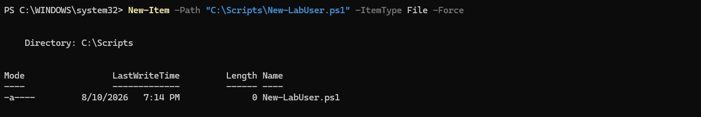
</p>

<p align="center">
  <em>New-LabUser.ps1 created as an empty file in C:\Scripts on WIN11-CLIENT01.</em>
</p>

#### Execution Policy

The first attempt to run the script was blocked. Windows PowerShell's default execution policy prevents any script from running, returning a `PSSecurityException` before the script's own logic is reached. This is expected on a freshly configured workstation and is a real administrative prerequisite rather than a script defect.

The execution policy was set to `RemoteSigned` scoped to `CurrentUser`. `RemoteSigned` permits locally authored scripts to run while still requiring that any script downloaded from the internet be digitally signed, which is the standard, defensible posture for an administration workstation. Scoping the change to `CurrentUser` rather than `LocalMachine` keeps it least-privilege: only the current user's context is affected, and no machine-wide policy is altered.

```powershell
Set-ExecutionPolicy -ExecutionPolicy RemoteSigned -Scope CurrentUser
Get-ExecutionPolicy -List
```

<p align="center">
  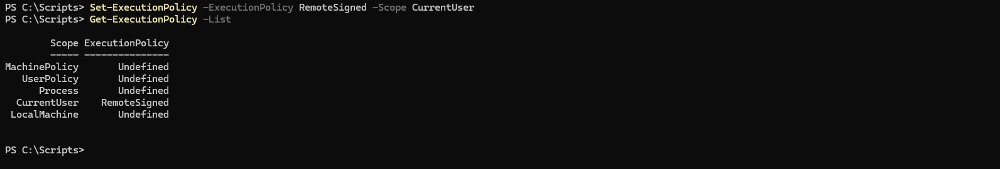
</p>

<p align="center">
  <em>Get-ExecutionPolicy -List confirming RemoteSigned applied at the CurrentUser scope, with all other scopes left Undefined.</em>
</p>

#### Parameter Design

The parameter block is derived directly from the lab objectives. The identity fields (`FirstName`, `LastName`, `SamAccountName`) are mandatory because provisioning an account requires them and no default is meaningful; `SamAccountName` in particular is a required attribute of `New-ADUser`. `TargetOU` and `RoleGroup` implement the OU placement and group assignment objective, defaulting to the existing `OU=User Accounts` and `Domain-Users-Standard` structures documented in Technologies Used while remaining overridable. `LinuxAccess` is a switch rather than a mandatory parameter because the second objective defines the Linux path as optional. `InitialPassword` is a mandatory `[SecureString]`: `New-ADUser` creates a disabled account if no password is supplied, so one is required, and the Security Considerations requirement to avoid plaintext credential handling dictates that it be a SecureString entered at runtime rather than a plaintext string.

```powershell
[CmdletBinding()]
param (
    [Parameter(Mandatory = $true)]
    [string]$FirstName,

    [Parameter(Mandatory = $true)]
    [string]$LastName,

    [Parameter(Mandatory = $true)]
    [string]$SamAccountName,

    [Parameter(Mandatory = $false)]
    [string]$TargetOU = "OU=User Accounts,DC=corp,DC=home,DC=arpa",

    [Parameter(Mandatory = $false)]
    [ValidateSet("IT-Admins", "Domain-Users-Standard")]
    [string]$RoleGroup = "Domain-Users-Standard",

    [Parameter(Mandatory = $false)]
    [switch]$LinuxAccess,

    [Parameter(Mandatory = $true)]
    [System.Security.SecureString]$InitialPassword
)
```

#### Pre-Flight Duplicate Check

Before any account object is created, the script queries Active Directory for an existing account with the same `SamAccountName`. `Get-ADUser -Identity` throws a terminating `ADIdentityNotFoundException` when the account does not exist. Catching that specific exception confirms the name is free and safe to use, while a second, generic catch handles a genuine query failure (DC01 unreachable, insufficient permissions) without falsely reporting the name as available. This reflects the lab objective of validating a result rather than assuming success, applied before anything is created.

```powershell
Import-Module ActiveDirectory

Write-Host "Checking whether '$SamAccountName' already exists in Active Directory..." -ForegroundColor Cyan

try {
    $existing = Get-ADUser -Identity $SamAccountName -ErrorAction Stop
    Write-Host "ABORT: an account with SamAccountName '$SamAccountName' already exists ($($existing.DistinguishedName))." -ForegroundColor Red
    return
}
catch [Microsoft.ActiveDirectory.Management.ADIdentityNotFoundException] {
    Write-Host "OK: no existing account named '$SamAccountName'. Safe to proceed." -ForegroundColor Green
}
catch {
    Write-Host "ERROR: could not query Active Directory ($($_.Exception.Message))." -ForegroundColor Red
    return
}
```

The check was validated against two accounts. Running it against `testuser01`, which exists from Lab 06, triggered the ABORT branch and returned the account's live distinguished name from DC01. Running it against the unused name `jdoe` passed the check and reported the name safe to proceed.

<p align="center">
  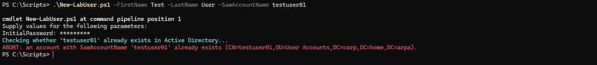
</p>

<p align="center">
  <em>Pre-flight check against testuser01 hitting the ABORT branch and returning the existing account's distinguished name (CN=testuser01,OU=User Accounts,DC=corp,DC=home,DC=arpa) from Active Directory.</em>
</p>

<p align="center">
  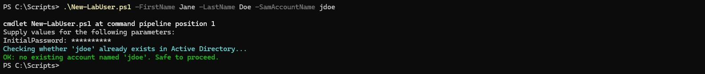
</p>

<p align="center">
  <em>Pre-flight check against the unused name jdoe passing the ADIdentityNotFoundException catch and reporting the name safe to proceed.</em>
</p>

### Step Two - Implement Account Creation and Group Assignment

With the pre-flight check confirming the name is free, the script derives the remaining account attributes and creates the object. `DisplayName` and `UserPrincipalName` are derived in the script rather than exposed as parameters: the display name is `"FirstName LastName"`, and the UPN is `SamAccountName@corp.home.arpa`. Deriving them keeps the parameter block minimal while still populating the attributes an account needs to be usable.

```powershell
# Derive display name and UPN from the supplied parameters
$displayName = "$FirstName $LastName"
$userPrincipalName = "$SamAccountName@corp.home.arpa"

Write-Host "Creating account '$SamAccountName' in $TargetOU..." -ForegroundColor Cyan

New-ADUser `
    -Name $displayName `
    -SamAccountName $SamAccountName `
    -UserPrincipalName $userPrincipalName `
    -GivenName $FirstName `
    -Surname $LastName `
    -DisplayName $displayName `
    -Path $TargetOU `
    -AccountPassword $InitialPassword `
    -ChangePasswordAtLogon $true `
    -Enabled $true
```

`-Name` sets the account's common name (the CN shown in ADUC), while `-SamAccountName` sets the separate logon name. `-AccountPassword` consumes the `[SecureString]` supplied at runtime directly, so no plaintext conversion occurs anywhere in the script. `-ChangePasswordAtLogon $true` forces the user to set their own password on first logon, meaning the administrator who runs the script never knows the account's eventual credential. `-Enabled $true` makes the account usable at creation; without both a password and an explicit enable, `New-ADUser` produces a disabled account.

Role-group assignment follows creation. The account is always added to its role group, and `Linux-Admins` is added only when `-LinuxAccess` is supplied. The `else` branch prints an explicit skip message so the console output reflects which path was taken rather than silently omitting the Linux step.

```powershell
# Assign the role group
Write-Host "Adding '$SamAccountName' to role group '$RoleGroup'..." -ForegroundColor Cyan
Add-ADGroupMember -Identity $RoleGroup -Members $SamAccountName

# Grant Linux access only when requested
if ($LinuxAccess) {
    Write-Host "Adding '$SamAccountName' to 'Linux-Admins' (Linux access requested)..." -ForegroundColor Cyan
    Add-ADGroupMember -Identity "Linux-Admins" -Members $SamAccountName
}
else {
    Write-Host "Linux access not requested; skipping Linux-Admins membership." -ForegroundColor DarkGray
}
```

The creation and assignment logic was written but not executed at this stage. Because these cmdlets write to Active Directory, the first live run is performed in Step Four against the test account that is later offboarded in Step Seven, keeping account creation and removal on a single, traceable object rather than creating throwaway accounts out of sequence.

<p align="center">
  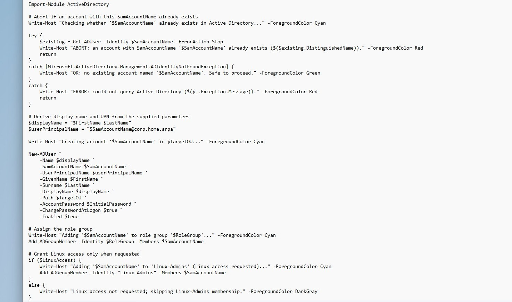
</p>

<p align="center">
  <em>New-LabUser.ps1 in the editor showing the pre-flight check followed by the account creation and group assignment logic, with the conditional Linux-Admins membership.</em>
</p>

### Step Three - Implement Validation Logic

After creation and group assignment, the script validates the result by querying Active Directory back rather than trusting that the preceding cmdlets silently succeeded. Two queries gather the current state: `Get-ADUser` returns the account with its `Enabled` and `DistinguishedName` properties, and `Get-ADPrincipalGroupMembership` returns the account's group memberships, reduced to their names. `Get-ADPrincipalGroupMembership` is used here because it is the same cmdlet the offboarding script relies on in Step Six, so provisioning-validation and offboarding reason about group membership through one consistent tool.

```powershell
# Validate the result by querying AD back, rather than trusting the cmdlets above
Write-Host "Validating provisioned account against Active Directory..." -ForegroundColor Cyan

$created = Get-ADUser -Identity $SamAccountName -Properties Enabled, DistinguishedName
$groups  = Get-ADPrincipalGroupMembership -Identity $SamAccountName | Select-Object -ExpandProperty Name
```

Four checks then compare the current state against what was requested, each printing an explicit PASS or FAIL. The account must exist and be enabled, must reside in the requested OU, and must be a member of its role group.

```powershell
# Account exists and is enabled
if ($created -and $created.Enabled) {
    Write-Host "PASS: account exists and is enabled." -ForegroundColor Green
}
else {
    Write-Host "FAIL: account missing or not enabled." -ForegroundColor Red
}

# Account resides in the requested OU
if ($created.DistinguishedName -like "*$TargetOU") {
    Write-Host "PASS: account is in the target OU ($TargetOU)." -ForegroundColor Green
}
else {
    Write-Host "FAIL: account is not in the expected OU. Found: $($created.DistinguishedName)" -ForegroundColor Red
}

# Role group membership
if ($groups -contains $RoleGroup) {
    Write-Host "PASS: member of role group '$RoleGroup'." -ForegroundColor Green
}
else {
    Write-Host "FAIL: not a member of role group '$RoleGroup'." -ForegroundColor Red
}
```

The Linux-Admins check is deliberately two-sided: it passes only when membership matches the request in either direction. With `-LinuxAccess`, the account must be a member; without it, the account must not be. Checking both directions catches not only a missing membership when Linux access was requested, but also an erroneous membership when it was not, which a one-sided check would miss.

```powershell
# Linux-Admins membership matches what was requested
if ($LinuxAccess) {
    if ($groups -contains "Linux-Admins") {
        Write-Host "PASS: member of Linux-Admins (Linux access requested)." -ForegroundColor Green
    }
    else {
        Write-Host "FAIL: Linux access requested but not a member of Linux-Admins." -ForegroundColor Red
    }
}
else {
    if ($groups -notcontains "Linux-Admins") {
        Write-Host "PASS: not a member of Linux-Admins (Linux access not requested)." -ForegroundColor Green
    }
    else {
        Write-Host "FAIL: not requested, but unexpectedly a member of Linux-Admins." -ForegroundColor Red
    }
}
```

The OU check uses a `-like` suffix match against the distinguished name. This is a simple, readable comparison suited to the lab; if it proves too loose during the live run in Step Four, it can be tightened to parse the DN's OU components explicitly. With this logic in place, `New-LabUser.ps1` is complete end to end: pre-flight check, creation, group assignment, and self-validation. The first live run is performed in Step Four.

<p align="center">
  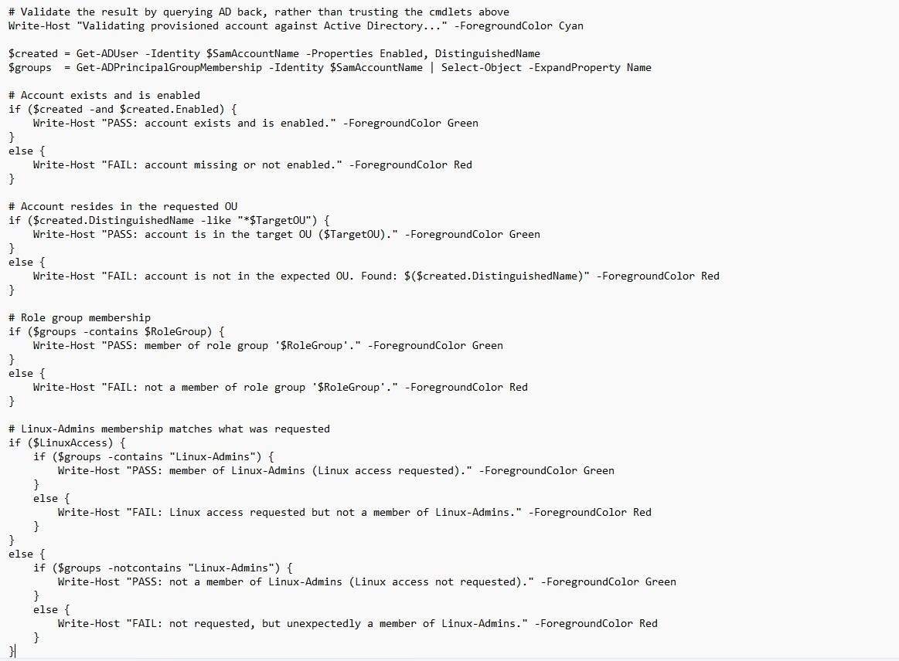
</p>

<p align="center">
  <em>New-LabUser.ps1 validation logic querying AD back after creation and printing PASS/FAIL for account existence, enabled state, OU placement, role group, and two-sided Linux-Admins membership.</em>
</p>

### Step Four - Run New-LabUser.ps1 Against a Test Account

The completed script was run from WIN11-CLIENT01, executing as `labadmin`, to provision the test account `jdoe` with Linux access. This is the account that is SSH-tested in Step Five and offboarded in Step Seven.

```powershell
.\New-LabUser.ps1 -FirstName Jane -LastName Doe -SamAccountName jdoe -RoleGroup Domain-Users-Standard -LinuxAccess
```

A complex password satisfying the domain password policy was entered at the `InitialPassword` prompt. The script ran end to end: the pre-flight check confirmed `jdoe` did not exist, the account was created in `OU=User Accounts`, it was added to `Domain-Users-Standard` and to `Linux-Admins`, and all four validation checks returned PASS.

- **PASS**: account exists and is enabled
- **PASS**: account is in the target OU (`OU=User Accounts,DC=corp,DC=home,DC=arpa`)
- **PASS**: member of role group `Domain-Users-Standard`
- **PASS**: member of `Linux-Admins` (Linux access requested)

The OU `-like` suffix match resolved correctly against the account's real distinguished name, so no adjustment to that check was needed. Because `-ChangePasswordAtLogon` was set, `jdoe` will be required to set a new password at first logon, which is exercised during the SSH test in Step Five.

<p align="center">
  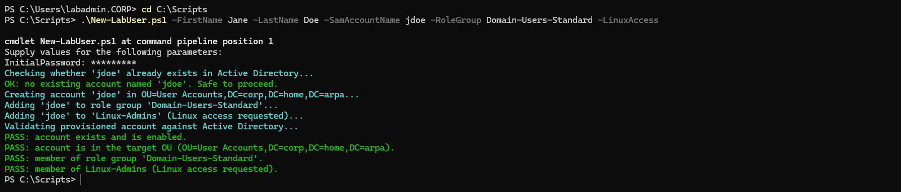
</p>

<p align="center">
  <em>New-LabUser.ps1 run against jdoe with -LinuxAccess, showing the pre-flight pass, account creation, role group and Linux-Admins assignment, and all four validation checks returning PASS.</em>
</p>

### Step Five - Confirm Linux Access via SSH

With `jdoe` provisioned in AD and confirmed to be a member of `Linux-Admins`, SSH access to Ubuntu Server was tested from WIN11-CLIENT01. This is the cross-platform proof at the center of the lab: it confirms the identity chain end to end, from the PowerShell script writing to AD, to AD replicating the account and group membership, to SSSD resolving it on Linux, to PAM authorizing the session on the basis of `Linux-Admins` membership.

#### SSSD cache: account not yet resolvable

The first SSH attempt failed at the password prompt with `Permission denied`. The cause was not authorization but resolution: SSSD on Ubuntu Server had no record of the freshly created account yet, so it could not authenticate a user it could not resolve. Querying the account directly on Ubuntu Server confirmed this:

```bash
id jdoe@corp.home.arpa
# id: 'jdoe@corp.home.arpa': no such user
```

The targeted cache invalidation from the plan did not apply, because there was no cached entry to invalidate:

```bash
sudo sss_cache -u jdoe@corp.home.arpa
# No cache object matched the specified search
```

A full-cache expire also failed to make the account resolvable:

```bash
sudo sss_cache -E
id jdoe@corp.home.arpa
# id: 'jdoe@corp.home.arpa': no such user
```

The account became resolvable only after restarting the SSSD service, which clears the in-memory negative-cache entry that `sss_cache` did not reach:

```bash
sudo systemctl restart sssd
id jdoe@corp.home.arpa
# uid=1366001112(jdoe@corp.home.arpa) gid=1366000513(domain users@corp.home.arpa)
# groups=1366000513(domain users@corp.home.arpa),1366001110(linux-admins@corp.home.arpa),1366001106(domain-users-standard@corp.home.arpa)
```

The resolved identity shows `linux-admins@corp.home.arpa` in the group list, confirming that the script's group assignment reached Linux intact. See the Troubleshooting section for why a service restart, rather than `sss_cache`, was required here.

<p align="center">
  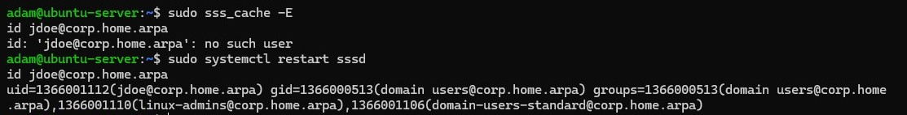
</p>

<p align="center">
  <em>SSSD failing to resolve jdoe (no such user), sss_cache finding no entry to invalidate and a full expire not helping, then systemctl restart sssd making the account resolve with linux-admins membership present.</em>
</p>

#### Authenticated SSH session

With resolution working, the SSH login proceeded. Because `-ChangePasswordAtLogon` was set at creation, PAM required a password change on first login before completing the session:

```text
WARNING: Your password has expired.
You must change your password now and log in again!
Current Password:
New password:
Retype new password:
passwd: password updated successfully
Connection to 192.168.1.226 closed.
```

This is the forced-password-change design working end to end: the administrator set only a temporary password, and `jdoe` set its own password on first login, which the administrator never knows. The session closed after the change, as expected, requiring a reconnect with the new password.

Reconnecting with the new password produced a working, authorized session. Three checks confirm it is a genuine AD-sourced login:

```bash
whoami
# jdoe@corp.home.arpa

id
# uid=1366001112(jdoe@corp.home.arpa) gid=1366000513(domain users@corp.home.arpa)
# groups=...,1366001110(linux-admins@corp.home.arpa),1366001106(domain-users-standard@corp.home.arpa)

klist
# Default principal: jdoe@CORP.HOME.ARPA
# Valid TGT: krbtgt/CORP.HOME.ARPA@CORP.HOME.ARPA
```

`whoami` returns the fully qualified AD identity, `id` shows the correct UID and `Linux-Admins` membership, and `klist` shows a valid Kerberos ticket-granting ticket issued by DC01 at login. The home directory was created on first login. This completes the provisioning half of the lifecycle: a single PowerShell run on Windows produced a fully functional, Kerberos-authenticated, correctly authorized Linux account.

<p align="center">
  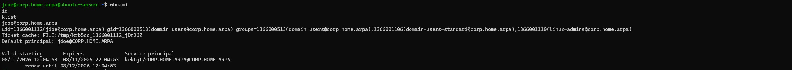
</p>

<p align="center">
  <em>Authenticated SSH session as jdoe@corp.home.arpa showing whoami, id with linux-admins membership, and klist with a valid Kerberos TGT for jdoe@CORP.HOME.ARPA.</em>
</p>

### Step Six - Write Remove-LabUser.ps1

`Remove-LabUser.ps1` was created in `C:\Scripts` alongside `New-LabUser.ps1`, following the same execution-location convention. It takes a single mandatory parameter, `SamAccountName`, since offboarding operates on an account that already exists and needs no additional attributes.

```powershell
[CmdletBinding()]
param (
    [Parameter(Mandatory = $true)]
    [string]$SamAccountName
)

Import-Module ActiveDirectory
```

The pre-flight check mirrors `New-LabUser.ps1`'s, but with the branches reversed: provisioning aborts if the account already exists, offboarding aborts if it does not. Both use the same `Get-ADUser -Identity` and `ADIdentityNotFoundException` pattern, so the two scripts reason about account existence identically.

```powershell
# Abort if the account does not exist
Write-Host "Checking whether '$SamAccountName' exists in Active Directory..." -ForegroundColor Cyan

try {
    $user = Get-ADUser -Identity $SamAccountName -Properties Enabled, PrimaryGroup -ErrorAction Stop
    Write-Host "OK: found '$SamAccountName' ($($user.DistinguishedName))." -ForegroundColor Green
}
catch [Microsoft.ActiveDirectory.Management.ADIdentityNotFoundException] {
    Write-Host "ABORT: no account named '$SamAccountName' exists." -ForegroundColor Red
    return
}
catch {
    Write-Host "ERROR: could not query Active Directory ($($_.Exception.Message))." -ForegroundColor Red
    return
}
```

The account is disabled before any group work is done. Disabling is the highest-priority security action, it immediately blocks logon, so it happens first rather than after cleanup; if group removal encountered a problem partway through, the account would already be secured rather than sitting disabled-in-progress with standing access.

```powershell
# Disable the account first; this is the immediate security action
Write-Host "Disabling '$SamAccountName'..." -ForegroundColor Cyan
Disable-ADAccount -Identity $SamAccountName
```

Group removal is the concrete implementation of the Troubleshooting section's primary-group problem: `Get-ADPrincipalGroupMembership` returns every group the account belongs to, and `Where-Object` filters out the one matching `$user.PrimaryGroup` (captured during the pre-flight query) before any removal is attempted. This is what "removable security-group memberships" means in practice, everything except the primary group.

```powershell
# Strip removable security-group memberships, preserving the primary group
Write-Host "Removing removable group memberships from '$SamAccountName'..." -ForegroundColor Cyan

$groups = Get-ADPrincipalGroupMembership -Identity $SamAccountName |
    Where-Object { $_.DistinguishedName -ne $user.PrimaryGroup }

foreach ($group in $groups) {
    Write-Host "Removing '$SamAccountName' from '$($group.Name)'..." -ForegroundColor Cyan
    Remove-ADPrincipalGroupMembership -Identity $SamAccountName -MemberOf $group -Confirm:$false
}
```

`-Confirm:$false` suppresses the interactive confirmation `Remove-ADPrincipalGroupMembership` normally prompts for on each removal, which is what makes the script run unattended rather than requiring a manual confirmation per group. This is a deliberate tradeoff for a lab tool operating on a known test account; a production offboarding script handling arbitrary accounts would warrant additional safeguards before suppressing confirmation, and this is revisited in Security Considerations.

Finally, the script validates its own result the same way `New-LabUser.ps1` does, by re-querying AD rather than trusting the preceding cmdlets. Three checks compare post-offboarding state against what was intended: the account must be disabled, every group targeted for removal must actually be gone, and the primary group (and therefore the account object itself) must be unchanged.

```powershell
# Validate the result by querying AD back, rather than trusting the cmdlets above
Write-Host "Validating offboarded account against Active Directory..." -ForegroundColor Cyan

$final = Get-ADUser -Identity $SamAccountName -Properties Enabled, PrimaryGroup
$remainingGroups = Get-ADPrincipalGroupMembership -Identity $SamAccountName | Select-Object -ExpandProperty Name

# Account is disabled
if (-not $final.Enabled) {
    Write-Host "PASS: account is disabled." -ForegroundColor Green
}
else {
    Write-Host "FAIL: account is still enabled." -ForegroundColor Red
}

# Removable groups are gone
if ($groups.Count -eq 0) {
    Write-Host "PASS: no removable group memberships were present." -ForegroundColor Green
}
else {
    $stillRemoved = $groups | Where-Object { $remainingGroups -notcontains $_.Name }
    if ($stillRemoved.Count -eq $groups.Count) {
        Write-Host "PASS: all removable group memberships were removed." -ForegroundColor Green
    }
    else {
        Write-Host "FAIL: some group memberships were not removed." -ForegroundColor Red
    }
}

# Primary group and account object are preserved
if ($final.PrimaryGroup -eq $user.PrimaryGroup) {
    Write-Host "PASS: primary group preserved; account object retained." -ForegroundColor Green
}
else {
    Write-Host "FAIL: primary group changed unexpectedly." -ForegroundColor Red
}
```

The group-removal check reuses `$groups`, the set captured before removal, and compares it against a fresh post-removal query (`$remainingGroups`), so it confirms the groups are actually gone rather than assuming the loop succeeded because it didn't error. The primary-group check is the concrete proof that "disable and strip, don't delete" held: if `$final.PrimaryGroup` still equals the value captured in the pre-flight check, the account object survived intact. With this in place, `Remove-LabUser.ps1` is complete end to end: pre-flight check, disable, group removal, self-validation. The first live run is performed in Step Seven, against `jdoe`.

<p align="center">
  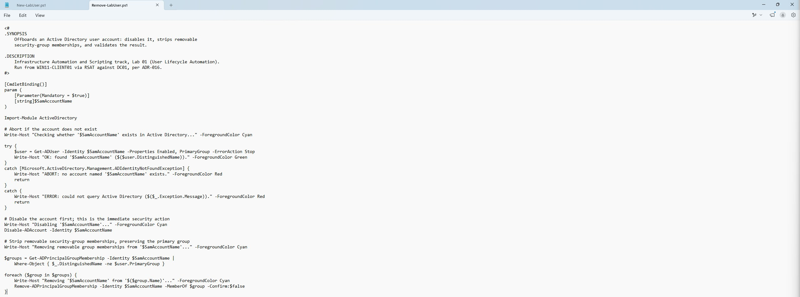
</p>

<p align="center">
  <em>Remove-LabUser.ps1 in the editor showing the reversed pre-flight check, account disable, primary-group-preserving removal loop, and post-offboarding self-validation.</em>
</p>

### Step Seven - Run Remove-LabUser.ps1 Against the Test Account

The completed offboarding script was run from WIN11-CLIENT01, executing as `labadmin`, against `jdoe`, the account provisioned in Step Four and SSH-tested in Step Five.

```powershell
.\Remove-LabUser.ps1 -SamAccountName jdoe
```

The script ran end to end: the pre-flight check found `jdoe` (`CN=Jane Doe,OU=User Accounts,DC=corp,DC=home,DC=arpa`), disabled the account, removed it from `Domain-Users-Standard` and `Linux-Admins`, and all three validation checks returned PASS.

- **PASS**: account is disabled
- **PASS**: all removable group memberships were removed
- **PASS**: primary group preserved; account object retained

The two groups removed, `Domain-Users-Standard` (the role group assigned in Step Four) and `Linux-Admins` (the Linux access group), are exactly the two non-primary groups `jdoe` held. `Domain Users`, the primary group, was correctly excluded from the removal loop and confirmed unchanged, and the account object itself still exists in AD, disabled rather than deleted, consistent with the offboarding objective. `jdoe` is now offboarded; Step Eight confirms this is reflected on the Linux side.

<p align="center">
  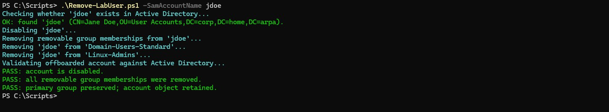
</p>

<p align="center">
  <em>Remove-LabUser.ps1 run against jdoe, showing the account found, disabled, both non-primary groups removed, and all three validation checks returning PASS.</em>
</p>

### Step Eight - Confirm SSH Access Denied After Offboarding

With `jdoe` disabled and stripped of its removable group memberships, SSH access was attempted from WIN11-CLIENT01 using the credentials `jdoe` set during Step Five.

```powershell
ssh jdoe@corp.home.arpa@192.168.1.226
```

The login was denied, `Permission denied, please try again`, without ever reaching a shell. Unlike the failed attempt in Step Five, this denial has a different cause: `jdoe` is no longer resolution-blind, the account is disabled in AD, so authentication is refused regardless of the password.

<p align="center">
  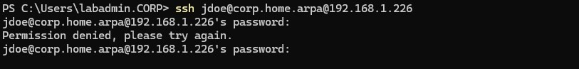
</p>

<p align="center">
  <em>SSH login attempt as jdoe after offboarding, denied at the password prompt.</em>
</p>

Checking the Linux-side view against AD directly surfaced a partial cache lag, the mirror image of Step Five's issue. Immediately after offboarding, SSSD still resolved `jdoe` with a stale group list:

```bash
id jdoe@corp.home.arpa
# uid=1366001112(jdoe@corp.home.arpa) gid=1366000513(domain users@corp.home.arpa)
# groups=1366000513(domain users@corp.home.arpa),1366001106(domain-users-standard@corp.home.arpa)
```

`Linux-Admins` was already gone from this list, correctly reflecting the removal that gated SSH, but `Domain-Users-Standard` was still present, even though `Remove-LabUser.ps1`'s own validation had confirmed it removed in AD. Querying AD directly, bypassing SSSD entirely, confirmed AD was correct and the script had not left anything behind:

```powershell
Get-ADPrincipalGroupMembership -Identity jdoe | Select-Object Name
# Domain Users
```

Only the primary group remained in AD. The discrepancy was entirely on the SSSD side: its cache had picked up the `Linux-Admins` removal but not the `Domain-Users-Standard` removal, showing that cache staleness can apply unevenly across a single account's attributes rather than all-or-nothing. This did not affect the SSH denial, since PAM's `simple_allow_groups` gates only on `Linux-Admins`, which was already correctly reflected. Restarting SSSD resolved the remaining lag:

```bash
sudo systemctl restart sssd
id jdoe@corp.home.arpa
# uid=1366001112(jdoe@corp.home.arpa) gid=1366000513(domain users@corp.home.arpa)
# groups=1366000513(domain users@corp.home.arpa)
```

After the restart, SSSD's view matches AD exactly: only the primary group. This closes the lifecycle loop end to end. A single PowerShell script provisioned `jdoe` with correct AD and Linux access; a single PowerShell script offboarded it, correctly disabling the account and stripping its removable groups while preserving the account object; and both endpoints of the cross-platform identity chain, AD and SSSD, ultimately agree on the result.

<p align="center">
  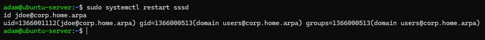
</p>

<p align="center">
  <em>SSSD showing a stale Domain-Users-Standard membership immediately after offboarding despite Linux-Admins already being removed; systemctl restart sssd resolves it so the cached group list matches AD (primary group only).</em>
</p>

---

## Validation

- **PASS**: `jdoe` confirmed to exist in the correct OU (`OU=User Accounts,DC=corp,DC=home,DC=arpa`) via `Get-ADUser` (Step Four)
- **PASS**: group membership confirmed via `Get-ADPrincipalGroupMembership` (`Domain-Users-Standard`, `Linux-Admins`) (Step Four)
- **PASS**: with `-LinuxAccess`, SSH login to Ubuntu Server succeeded and created a home directory on first login (Step Five)
- **PASS**: offboarded account confirmed disabled via `Get-ADUser`, with removable security-group memberships stripped via `Get-ADPrincipalGroupMembership`; the account object itself and its primary group were confirmed to remain (Step Seven)
- **PASS**: offboarded account's SSH access confirmed denied on Ubuntu Server (Step Eight)

The one objective not independently re-tested in this run is the negative case for provisioning without `-LinuxAccess` (SSH denied at the PAM authorization step for a non-member account). This was validated by `testuser01` in Lab 06 under the identical `simple_allow_groups` mechanism this lab relies on, and `New-LabUser.ps1`'s two-sided validation logic (Step Three) confirms the script correctly withholds `Linux-Admins` membership when `-LinuxAccess` is not supplied. Running `New-LabUser.ps1` without `-LinuxAccess` against a fresh account would be a reasonable follow-up test but was not required to meet the lab's objectives, since the underlying access-control mechanism was already proven and the script's group-assignment logic is validated directly.

---

## Troubleshooting and Adjustments

**Primary group cannot be removed via `Remove-ADPrincipalGroupMembership`.** Every AD user has a primary group (Domain Users by default, RID 513). `Remove-ADPrincipalGroupMembership` cannot remove a user from their primary group and will error if asked to. An offboarding script that naively pipes every group returned by `Get-ADPrincipalGroupMembership` into removal will fail on the primary group. The intended behavior is therefore to remove *removable* security-group memberships, not literally all groups. `Remove-LabUser.ps1` implements this by capturing the account's `PrimaryGroup` distinguished name during the pre-flight query and filtering it out of the removal set with `Where-Object` before the removal loop runs, confirmed against `jdoe` in Step Seven: `Domain-Users-Standard` and `Linux-Admins` were removed while `Domain Users` was correctly left untouched.

**SSSD did not resolve a freshly created account, and `sss_cache` did not fix it (encountered in Step Five).** After `jdoe` was created in AD, Ubuntu Server could not resolve it (`id: 'jdoe@corp.home.arpa': no such user`), which caused SSH to fail at the password prompt. The plan anticipated a stale-cache scenario resolved by targeted invalidation, but the actual behavior was different and worth recording:

- `sss_cache -u jdoe@corp.home.arpa` returned `No cache object matched the specified search`. `sss_cache` can only expire an entry that already exists in the cache; because the account had never been successfully looked up, there was no positive entry to invalidate.
- `sss_cache -E` (expire everything) also did not make the account resolve. A negative-lookup result (SSSD having recorded that the name did not exist) persisted in memory and continued to suppress re-queries to AD.
- `sudo systemctl restart sssd` resolved it immediately. Restarting the daemon clears the in-memory negative cache that `sss_cache` does not reach, forcing a fresh lookup against AD on the next request.

The practical lesson: for a stale membership change on an account SSSD has already cached, `sss_cache -u <user>` or `-g <group>` is the correct targeted tool. But for an account SSSD has never successfully resolved (a brand-new account queried too soon, where a negative-cache entry is created), a service restart is the reliable fix. Per the SSSD documentation, `sss_cache` invalidates cached records so they are re-pulled from AD on the next lookup, but it operates on existing cache objects, which is why it had nothing to act on here.

**SSSD's cache updated unevenly across a single account's group memberships after offboarding (encountered in Step Eight).** Immediately after `jdoe` was disabled and stripped of `Domain-Users-Standard` and `Linux-Admins` in AD, SSSD's cached view of `jdoe` had already dropped `Linux-Admins` but still showed `Domain-Users-Standard`, even though `Get-ADPrincipalGroupMembership` run directly against AD confirmed only the primary group remained. This shows that SSSD's cache can update per-attribute rather than atomically per-account, so a partially-stale result does not necessarily mean the underlying AD change failed; it is worth confirming against AD directly (bypassing SSSD, as with `Get-ADPrincipalGroupMembership` from WIN11-CLIENT01) before assuming a script defect. In this case the stale attribute did not affect access control, since `Linux-Admins` (the group PAM actually authorizes on) was already correctly reflected, but a full `systemctl restart sssd` was used to bring the entire cached record back in sync with AD.

---

## Security Considerations

**Least privilege for the executing account.** Both scripts were run as `labadmin`, an account with sufficient AD permissions to create, modify, disable, and query users and groups. In a production deployment, a dedicated service account scoped to only the operations these scripts perform (create/disable users, add/remove group membership within specific OUs) would be preferable to running lifecycle automation under a broad administrative identity.

**Plaintext password handling.** `New-LabUser.ps1` accepts the initial password as a mandatory `[SecureString]` entered at runtime, never as a plaintext parameter, and it is never written to disk, logged, or committed to the repository. Combined with `-ChangePasswordAtLogon $true`, the administrator running the script never learns the account's eventual password, limiting the value of that credential even if the administrator's session were compromised.

**Disable rather than delete.** `Remove-LabUser.ps1` disables the account and removes its removable group memberships but never deletes the AD object, confirmed in Step Seven's validation (`PASS: primary group preserved; account object retained`). This preserves the account's SID and history for auditing and reversibility, consistent with the offboarding practice sources cited below, at the cost of AD accumulating disabled objects over time that a real deployment would need a separate retention or cleanup policy for.

**`-Confirm:$false` on group removal.** `Remove-LabUser.ps1` suppresses the interactive confirmation prompt on each group removal so it can run unattended, which is appropriate for a lab tool operating on a known test account. A production offboarding tool acting on arbitrary accounts at scale would warrant additional safeguards before suppressing confirmation outright, such as a `-WhatIf`-compatible dry-run mode, logging of every removal to a file external to the console, or requiring a separate explicit `-Force` switch distinct from the account-targeting parameter itself.

---

## Outcome

Both `New-LabUser.ps1` and `Remove-LabUser.ps1` meet every objective set out at the start of the lab. A single script run provisions a new AD user account, places it in the correct OU, assigns it to the correct role group, optionally grants Linux access via `Linux-Admins`, and validates the result by querying AD back rather than trusting the provisioning cmdlets' exit codes. A single script run offboards that user: disables the account, strips its removable group memberships while preserving the primary group and the account object itself, and validates that result the same way.

The cross-platform claim, that AD group membership determines SSH access on Ubuntu Server through SSSD and PAM, was proven in both directions against a real account rather than assumed from Lab 06's earlier manual result: `jdoe` gained working, Kerberos-authenticated SSH access upon being added to `Linux-Admins`, and lost it upon removal. Both directions surfaced genuine SSSD cache behavior, a negative-cache entry for a never-resolved account, and per-attribute staleness for an already-cached one, that the original plan anticipated only in general terms. Documenting the actual behavior, including the cases where the anticipated fix (`sss_cache`) did not work and a service restart was required instead, makes this lab's Troubleshooting section a more accurate reference than the plan alone would have produced.

---

## Lessons Learned

**Anticipated troubleshooting steps should be treated as hypotheses to verify, not facts to assert.** The plan's Troubleshooting section, written before any code existed, predicted that `sss_cache` targeted invalidation would resolve SSSD staleness. In practice it did not, twice, for two different reasons (no cache entry to invalidate on first resolution; a stubborn negative-cache entry that survived a full expire). Writing the documentation against what actually happened, rather than what the plan predicted would happen, produced a more useful and more honest troubleshooting reference. This reinforces the working agreement established for this lab, that nothing gets documented as done before it has actually happened and been verified.

**Self-validation catches what console output alone would hide.** `Remove-LabUser.ps1`'s validation block, added deliberately to match `New-LabUser.ps1`'s standard rather than shipped without it, was what made the Step Eight SSSD discrepancy visible in the first place. Without a script that re-queries AD and states plainly what it found, a partially-stale cache on the Linux side could easily have been mistaken for a partially-failed offboarding script. Querying the source of truth directly, rather than trusting either the script's own success message or a single downstream system's cached view, was what resolved the ambiguity correctly and quickly.

**Cache staleness is not always all-or-nothing.** Both SSSD issues encountered in this lab refined the same underlying lesson from different angles: a cache miss on a brand-new account behaves differently from a cache miss on a modified attribute of an already-known account, and even within one account's record, individual group memberships can update independently of each other. A troubleshooting mental model of "the cache is either fresh or stale" is not accurate enough for SSSD in practice; the safer default is to verify the authoritative source (AD) directly whenever a Linux-side result looks surprising, rather than assuming either total staleness or a script defect.

---

## Sources

Research references consulted during the planning phase of this lab.

**Active Directory PowerShell module (Microsoft Learn)**

- [New-ADUser](https://learn.microsoft.com/en-us/powershell/module/activedirectory/new-aduser) - core provisioning cmdlet; `SamAccountName` is required, `Path` sets OU placement, accounts created without a password are disabled by default
- [Set-ADUser](https://learn.microsoft.com/en-us/powershell/module/activedirectory/set-aduser) - modifying existing account properties post-creation
- [Get-ADPrincipalGroupMembership](https://learn.microsoft.com/en-us/powershell/module/activedirectory/get-adprincipalgroupmembership) - used for validation (confirming group assignment) and as the input to offboarding group removal
- [Remove-ADPrincipalGroupMembership](https://learn.microsoft.com/en-us/powershell/module/activedirectory/remove-adprincipalgroupmembership) - removes removable security-group memberships during offboarding; accepts piped identity objects from `Get-ADPrincipalGroupMembership`, but cannot remove a user's primary group
- [Disable-ADAccount](https://learn.microsoft.com/en-us/powershell/module/activedirectory/disable-adaccount) - disables rather than deletes the account object during offboarding

**SSSD cache behavior (Red Hat / upstream SSSD docs)**

- [Managing the SSSD Cache - Red Hat Enterprise Linux Deployment Guide](https://docs.redhat.com/en/documentation/red_hat_enterprise_linux/6/html/deployment_guide/sssd-cache) and the [System-Level Authentication Guide troubleshooting appendix](https://docs.redhat.com/en/documentation/red_hat_enterprise_linux/7/html/system-level_authentication_guide/trouble) - confirms `sss_cache` invalidates cached records so SSSD re-pulls them from AD on next lookup, rather than clearing the cache outright
- [sss_cache(8) man page](https://linux.die.net/man/8/sss_cache) - flag reference (`-u` for a single user, `-g` for a single group) used to plan targeted cache invalidation; in practice `sss_cache` operates only on existing cache objects, so a negative-lookup entry for a never-resolved account required a service restart instead
- [How To Clear The SSSD Cache In Linux](https://www.rootusers.com/how-to-clear-the-sssd-cache-in-linux/) - clarifies that `sss_cache` marks entries expired rather than deleting them, which preserves offline fallback if AD is briefly unreachable during validation

**Account offboarding practice (disable vs. delete)**

- [Delete or Disable an Active Directory Account? One Best Practice - Imanami](https://www.imanami.com/delete-or-disable-an-active-directory-account-one-best-practice/) - summarizes the standard tradeoff: disabling preserves the SID and account history for reversibility and auditing, deleting removes access immediately but is not easily reversible
- [Best Practices - Disabling Users in Active Directory - ITAdminTools](https://www.itadmintools.com/2013/08/best-practices-disabling-users-in.html) - supports the offboarding approach used here (disable, remove removable group memberships, retain the account object) over outright deletion

These sources informed the Design Decisions and Troubleshooting sections above.
