# 02 - Group and OU Administration

## Status

- In progress. Step One (test account provisioning) is complete: `jsmith`, `mjohnson`, and `akim` were provisioned via `New-LabUser.ps1` and all four validation checks passed for each account. Step Two (`Add-LabGroupMembers.ps1`) is complete: the open question on `Add-ADGroupMember`'s handling of an invalid member was verified against live AD behavior, the script's design was finalized incorporating that finding, the script was created on WIN11-CLIENT01 (`C:\Scripts\Add-LabGroupMembers.ps1`), a live run against `members.csv` successfully added `jsmith` and `mjohnson` to `IT-Admins` and `akim` to `Linux-Admins` with all three post-add checks returning PASS, and a second run against a deliberately invalid CSV confirmed the partial-success batch model holds end to end (the invalid member was excluded and reported, while the valid member in the same batch was still added). Step Three (`Get-LabOUReport.ps1`) is complete: the script's design was finalized following the planning-phase logic (OU enumeration via `Get-ADOrganizationalUnit`, per-OU user/computer counts via `-SearchScope OneLevel`, console table plus optional CSV export), the script was created on WIN11-CLIENT01 (`C:\Scripts\Get-LabOUReport.ps1`), a first live run against the console correctly reported all 5 OUs in the domain, including the built-in `Domain Controllers` OU, with per-OU user and computer counts matching the environment's known state, and a second run with `-ExportPath` confirmed the CSV export matches the console output exactly. Step Four (`Get-LabAccountInventory.ps1`) is complete: the script's design was finalized (full-domain `Get-ADUser` query, per-account group membership resolution via `Get-ADPrincipalGroupMembership` with the primary group excluded using the same comparison pattern established in Lab 01's `Remove-LabUser.ps1`, `LastLogonDate` left blank rather than substituted when AD returns no value), the script was created on WIN11-CLIENT01 (`C:\Scripts\Get-LabAccountInventory.ps1`), a first live run against the console correctly reported all 9 user accounts in the domain with the primary group `Domain Users` absent from every `Groups` field and blank `LastLogonDate` values preserved where AD returned no value, and a second run with `-ExportPath` confirmed the CSV export matches the console output exactly, including the joined `Groups` field and blank timestamp values surviving the round trip intact. Step Five has not yet started.

---

## Overview

This lab automates three related administrative workflows that Lab 01 (User Lifecycle Automation) did not cover: bulk security-group membership management, organizational unit reporting, and account inventory reporting, against the existing `corp.home.arpa` Active Directory domain.

Lab 01 automated the lifecycle of a single account at a time: one script provisions one user, another offboards one user. That scope was deliberate (see Lab 01's Design Decisions), but it leaves two categories of manual work untouched. First, group membership changes that affect several accounts at once, for example adding a batch of new hires to `IT-Admins` or `Linux-Admins`, still require repeating `Add-ADGroupMember` by hand once per account. Second, there is no scripted way to answer basic operational questions about the environment's current state: how many accounts exist in each OU, which groups exist and how large they are, or what the full inventory of user accounts looks like at a point in time. Both gaps are administrative overhead of exactly the kind ADR-015 scoped this track to eliminate.

This lab produces three scripts: one for bulk group membership changes driven by a CSV input file, and two read-only reporting scripts, one for OU structure and object counts, one for a full account inventory. Consistent with ADR-015, this lab introduces no new infrastructure. It automates administration of the OU and group structure that Lab 03 (Active Directory Lab) of the enterprise infrastructure track already established and Lab 01 already builds accounts into.

---

## Objectives

- add multiple existing AD accounts to one or more security groups in a single script run, driven by a CSV input file rather than repeated individual `Add-ADGroupMember` calls
- validate bulk membership changes by querying group membership back from AD after the run, consistent with the self-validation pattern established in Lab 01
- report the current OU structure (`IT`, `User Accounts`, `Workstations`, `Groups`) along with an object count per OU, without requiring a manual ADUC walkthrough
- report a full account inventory: every user account in the domain with its OU, enabled state, and group memberships, in a form that can be reviewed on screen and exported for later reference
- handle bad input (a CSV row naming a nonexistent account or group) without aborting the entire batch, and report exactly which rows succeeded and which failed
- keep all three scripts read-only with respect to anything other than the specific group memberships the bulk script is explicitly asked to change; the two reporting scripts must not modify AD state at all

---

## Project Context

The enterprise infrastructure track built the OU and group structure this lab reports on: `OU=IT`, `OU=User Accounts`, `OU=Workstations`, and `OU=Groups` were created in Lab 03 (Active Directory Lab), and `IT-Admins`, `Domain-Users-Standard`, and `Lab-Workstations` were created as security groups in `OU=Groups` in that same lab. `Linux-Admins` was added later in Lab 06 (Linux/AD Integration) of that track to gate SSH access. Lab 01 of this track began populating those OUs and groups programmatically instead of through ADUC, provisioning and offboarding accounts one at a time.

ADR-015 scoped this track to be AD-centric, with every lab automating a real, previously-manual administrative task against infrastructure that already exists. Lab 01 picked the highest-value single-account workflow. This lab picks the next two highest-value gaps: group membership no longer scales past one account at a time, and there is no automated way to see the current state of the OU and group structure without opening ADUC and clicking through it manually. Both are realistic, frequently repeated administrative tasks in any AD environment, not lab-specific busywork.

This lab also begins exercising a pattern the rest of the track depends on: scripts that operate on a batch of inputs rather than a single named account, and read-only reporting scripts that produce a snapshot of environment state rather than changing it. Lab 03 (GPO Reporting and Audit) and Lab 05 (Scheduled Health Reporting) both build on reporting patterns; getting the reporting shape right here, console output plus an optional CSV export, gives those later labs a precedent to follow rather than inventing their own from scratch.

---

## Design Decisions

### Group CSV rows by target group before calling Add-ADGroupMember

**Decision:** The bulk membership script will parse the CSV into memory, group rows by `GroupName`, and call `Add-ADGroupMember` once per group with the full list of members for that group, rather than calling it once per CSV row.

Microsoft's own documented pattern for CSV-driven group membership loops over every row and calls `Add-ADGroupMember` once per row (see Sources). That approach works but issues one AD write per account even when many accounts are being added to the same group in the same run. `Add-ADGroupMember` accepts `-Members` as an array, so grouping rows by `GroupName` first and issuing one call per group with every member for that group reduces the number of directory writes and keeps the per-group PASS/FAIL validation (see below) aligned to one validation block per group rather than one per row. The tradeoff is a small amount of extra script complexity, an in-memory grouping step, versus the simpler flat loop; that tradeoff is worth it for a script whose entire purpose is handling more than one account at a time.

### Partial-success batch model, not all-or-nothing

**Decision:** A CSV row that names a nonexistent account or a nonexistent group will fail and be reported individually. It will not abort the rest of the batch.

Lab 01's scripts operate on a single account and abort outright on a pre-flight failure, which is the correct behavior for a single-target script. A bulk script processing a CSV of many rows is a different situation: a single typo'd `SamAccountName` in row 40 of a 50-row file should not silently discard the 49 valid rows around it. Each group's membership addition will be wrapped in its own error handling, and the script's final output will state explicitly which groups succeeded, which failed, and why, rather than either succeeding silently or aborting the entire run on the first bad row. This is a deliberate scope boundary: the script does not attempt row-level rollback of partial successes if a later row fails, since `Add-ADGroupMember`'s permissive-modify default already makes membership additions idempotent and safely re-runnable.

### Reporting output: formatted console table plus optional CSV export

**Decision:** Both reporting scripts (`Get-LabOUReport.ps1` and `Get-LabAccountInventory.ps1`) will write a formatted table to the console by default and support an optional `-ExportPath` parameter that writes the same data to CSV via `Export-Csv`.

Lab 01's scripts print PASS/FAIL lines because they are validating a change they just made. These two scripts are not validating a change, they are reporting a state, so a PASS/FAIL model does not fit. A table is the more natural output for "here is what currently exists." Making CSV export optional rather than mandatory keeps the scripts useful for a quick interactive check (no file left behind) while still supporting the point-in-time record-keeping use case an inventory report exists for. This also establishes the reporting output convention Lab 03 (GPO Reporting and Audit) and Lab 05 (Scheduled Health Reporting) are expected to reuse.

### Script and folder naming

**Decision:** The three scripts are named `Add-LabGroupMembers.ps1`, `Get-LabOUReport.ps1`, and `Get-LabAccountInventory.ps1`, stored under `infrastructure/automation-and-scripting/group-and-ou-administration/`, following the `Verb-LabNoun` naming pattern and per-lab subfolder convention Lab 01 established with `New-LabUser.ps1` / `Remove-LabUser.ps1` under `user-lifecycle-automation/`.

---

## Technologies Used

- PowerShell 5.1 / Active Directory module (RSAT, run from WIN11-CLIENT01, per ADR-016)
- `Import-Csv` / `Export-Csv` (PowerShell Utility module) for bulk input and reporting output
- Active Directory Domain Services (DC01)
- Existing OU structure: `OU=IT`, `OU=User Accounts`, `OU=Workstations`, `OU=Groups`
- Existing security groups: `IT-Admins`, `Domain-Users-Standard`, `Linux-Admins`, `Lab-Workstations`
- Test accounts provisioned via `New-LabUser.ps1` (Lab 01) as bulk-add targets

---

## Architecture or Topology

```text
WIN11-CLIENT01 (RSAT / PowerShell AD module)
        |
        |  Add-LabGroupMembers.ps1  <-- members.csv (GroupName, SamAccountName)
        |  Get-LabOUReport.ps1
        |  Get-LabAccountInventory.ps1  --> optional -ExportPath CSV
        v
     DC01 (Active Directory Domain Services)
        |
        | OU structure: IT, User Accounts, Workstations, Groups
        | Groups: IT-Admins, Domain-Users-Standard, Linux-Admins, Lab-Workstations
        v
  Validation: group membership and report contents queried back from AD,
  not assumed from script exit code
```

All three scripts originate from WIN11-CLIENT01 against DC01, consistent with ADR-016. Unlike Lab 01, none of these scripts need to reach Ubuntu Server; there is no Linux-side validation step, since this lab does not touch account creation or the SSSD-resolved access path Lab 01 already proved.

---

## Prerequisites

- DC01 running Active Directory Domain Services and AD-integrated DNS (Lab 03, enterprise infrastructure track)
- WIN11-CLIENT01 domain-joined with RSAT installed, Active Directory module available; required script execution endpoint per [ADR-016](../architecture/decisions/016-run-automation-scripts-from-domain-joined-client.md)
- Existing OU structure (`IT`, `User Accounts`, `Workstations`, `Groups`) and existing security groups (`IT-Admins`, `Domain-Users-Standard`, `Linux-Admins`, `Lab-Workstations`) in place from the enterprise infrastructure track
- Lab 01 (`New-LabUser.ps1`, `Remove-LabUser.ps1`) complete; used to provision a small set of additional test accounts as bulk-add targets, since the only accounts currently in the domain (`labadmin`, `testuser01`, and the disabled `jdoe`) are not sufficient to exercise a multi-row bulk membership run
- An account with sufficient AD permissions to read OU and group data and modify group membership (`labadmin`)

---

## Implementation

### Step One - Provision Test Accounts for Bulk Membership Testing

Before the bulk membership script can be meaningfully tested, several additional test accounts needed to exist. `New-LabUser.ps1` (Lab 01) was run three times from `C:\Scripts` on WIN11-CLIENT01, the same execution context established in Lab 01 and ADR-016, to create `jsmith`, `mjohnson`, and `akim` as throwaway accounts. All three were created with default parameters, `Domain-Users-Standard` role group membership and no `-LinuxAccess`, since Linux access is not relevant to this lab and these accounts exist solely to give `Add-LabGroupMembers.ps1` a realistic multi-row CSV to operate on in Step Two.

```powershell
.\New-LabUser.ps1 -FirstName John -LastName Smith -SamAccountName jsmith
.\New-LabUser.ps1 -FirstName Mary -LastName Johnson -SamAccountName mjohnson
.\New-LabUser.ps1 -FirstName Alex -LastName Kim -SamAccountName akim
```

All three runs completed cleanly with no errors. For each account, the pre-flight check confirmed the `SamAccountName` did not already exist, the account was created in `OU=User Accounts,DC=corp,DC=home,DC=arpa`, it was added to `Domain-Users-Standard`, and all four of `New-LabUser.ps1`'s validation checks returned PASS:

- **PASS**: account exists and is enabled
- **PASS**: account is in the target OU (`OU=User Accounts,DC=corp,DC=home,DC=arpa`)
- **PASS**: member of role group `Domain-Users-Standard`
- **PASS**: not a member of `Linux-Admins` (Linux access not requested)

This result was identical for `jsmith`, `mjohnson`, and `akim`, confirming `New-LabUser.ps1` behaves consistently across repeated runs against different account names, which Lab 01 validated for a single account (`jdoe`) but had not exercised back-to-back for several accounts in the same session.

<p align="center">
  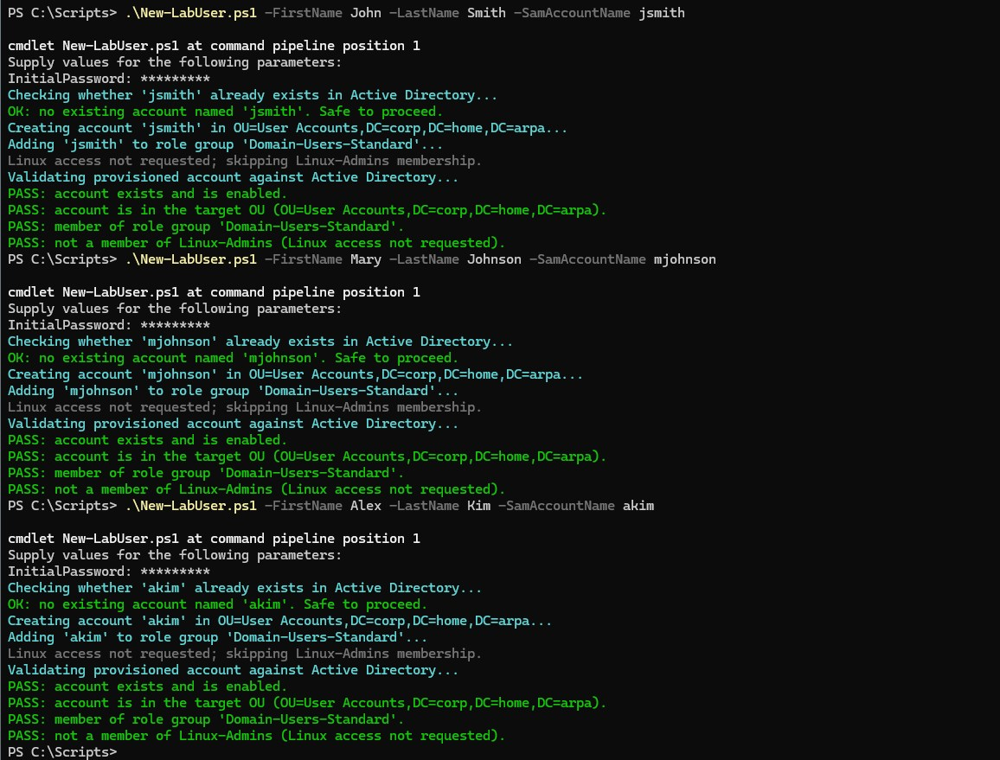
</p>

<p align="center">
  <em>New-LabUser.ps1 run three times from WIN11-CLIENT01 to provision jsmith, mjohnson, and akim, each showing the pre-flight pass, account creation, Domain-Users-Standard assignment, and all four validation checks returning PASS.</em>
</p>

No issues were encountered in this step. The domain now has three additional accounts (`jsmith`, `mjohnson`, `akim`) beyond `labadmin`, `testuser01`, and the disabled `jdoe`, available as bulk-add targets for Step Two.

### Step Two - Build Add-LabGroupMembers.ps1

#### Verifying Add-ADGroupMember's Behavior on Invalid Members

Before writing the script's error-handling logic, the open question from the planning phase, whether `Add-ADGroupMember` fails an entire `-Members` array call if one name in it is invalid, or adds the valid names and fails only on the bad one, was verified directly against DC01 rather than assumed. A disposable test group was created, a mixed valid/invalid `-Members` array was passed to `Add-ADGroupMember` against it, the result was queried back, and the test group was removed:

```powershell
New-ADGroup -Name "Test-BulkAdd-Verify" -GroupScope Global -GroupCategory Security -Path "OU=Groups,DC=corp,DC=home,DC=arpa"

Add-ADGroupMember -Identity "Test-BulkAdd-Verify" -Members "jsmith","doesnotexist999"

Get-ADGroupMember -Identity "Test-BulkAdd-Verify"

Remove-ADGroup -Identity "Test-BulkAdd-Verify" -Confirm:$false
```

The `Add-ADGroupMember` call failed outright with a terminating `ADIdentityNotFoundException` on `doesnotexist999`:

```text
Add-ADGroupMember : Cannot find an object with identity: 'doesnotexist999' under: 'DC=corp,DC=home,DC=arpa'.
+ CategoryInfo          : ObjectNotFound: (doesnotexist999:ADPrincipal) [Add-ADGroupMember], ADIdentityNotFoundException
+ FullyQualifiedErrorId : SetADGroupMember.ValidateMembersParameter,Microsoft.ActiveDirectory.Management.Commands.AddADGroupMember
```

The `FullyQualifiedErrorId` (`SetADGroupMember.ValidateMembersParameter`) shows the entire `-Members` array is validated before any change is made, not processed member-by-member. The subsequent `Get-ADGroupMember -Identity "Test-BulkAdd-Verify"` returned no output, confirming `jsmith`, the one valid name in the array, was **not** added despite being valid; the invalid name blocked the whole call.

<p align="center">
  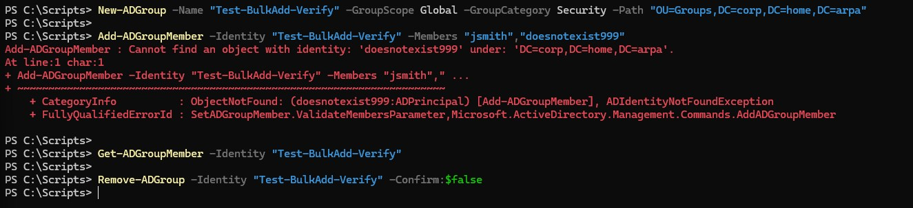
</p>

<p align="center">
  <em>Test-BulkAdd-Verify diagnostic showing Add-ADGroupMember failing outright on the invalid member doesnotexist999, Get-ADGroupMember confirming jsmith was not added despite being valid, and the disposable test group removed afterward.</em>
</p>

This resolves the open question from planning: `Add-ADGroupMember` validates its entire `-Members` array atomically, so a single bad `SamAccountName` in a group's batch would silently block every valid member alongside it if the script called `Add-ADGroupMember` directly against the raw CSV rows. To preserve the partial-success batch model from the Design Decisions above, at the row level and not just at the group level, each requested member is pre-validated individually with `Get-ADUser -Identity` before `Add-ADGroupMember` is ever called for that group, and only the members that pass are included in the array.

#### Script Implementation

The finalized parameter block matches the planning-stage design, a single mandatory `-CsvPath`:

```powershell
[CmdletBinding()]
param (
    [Parameter(Mandatory = $true)]
    [string]$CsvPath
)

Import-Module ActiveDirectory
```

The CSV is imported and checked for both expected columns before any row is processed:

```powershell
Write-Host "Importing CSV from '$CsvPath'..." -ForegroundColor Cyan

$rows = Import-Csv -Path $CsvPath

if (-not ($rows | Get-Member -Name "GroupName") -or -not ($rows | Get-Member -Name "SamAccountName")) {
    Write-Host "ABORT: CSV must contain 'GroupName' and 'SamAccountName' columns." -ForegroundColor Red
    return
}

Write-Host "OK: CSV imported with $($rows.Count) row(s)." -ForegroundColor Green
```

Rows are grouped by `GroupName` per the Design Decisions section, so each group is written to once rather than once per member:

```powershell
$groupedRows = $rows | Group-Object -Property GroupName

foreach ($groupBatch in $groupedRows) {
    $groupName = $groupBatch.Name
    $requestedMembers = $groupBatch.Group | Select-Object -ExpandProperty SamAccountName

    Write-Host "`nProcessing group '$groupName' ($($requestedMembers.Count) requested member(s))..." -ForegroundColor Cyan
```

The target group is confirmed to exist before anything else is attempted for that batch, using the same `Get-ADUser`/`ADIdentityNotFoundException` pattern Lab 01 established, applied here to `Get-ADGroup`:

```powershell
    try {
        Get-ADGroup -Identity $groupName -ErrorAction Stop | Out-Null
    }
    catch [Microsoft.ActiveDirectory.Management.ADIdentityNotFoundException] {
        Write-Host "FAIL: group '$groupName' does not exist. Skipping this group's batch." -ForegroundColor Red
        continue
    }
    catch {
        Write-Host "ERROR: could not query group '$groupName' ($($_.Exception.Message)). Skipping this group's batch." -ForegroundColor Red
        continue
    }
```

Each requested member is then pre-validated individually, the direct consequence of the verification above. A member that does not exist is reported and excluded, but does not stop the remaining members in the same group's batch from being processed:

```powershell
    $validMembers = @()
    foreach ($member in $requestedMembers) {
        try {
            Get-ADUser -Identity $member -ErrorAction Stop | Out-Null
            $validMembers += $member
        }
        catch [Microsoft.ActiveDirectory.Management.ADIdentityNotFoundException] {
            Write-Host "FAIL: '$member' does not exist; excluded from this group's batch." -ForegroundColor Red
        }
        catch {
            Write-Host "ERROR: could not query '$member' ($($_.Exception.Message)); excluded from this group's batch." -ForegroundColor Red
        }
    }

    if ($validMembers.Count -eq 0) {
        Write-Host "FAIL: no valid members remain for '$groupName'; nothing to add." -ForegroundColor Red
        continue
    }
```

Only the validated members are passed to `Add-ADGroupMember`, which by this point cannot fail on an unknown identity, since every name in `$validMembers` has already been confirmed to exist:

```powershell
    Write-Host "Adding $($validMembers.Count) validated member(s) to '$groupName'..." -ForegroundColor Cyan
    Add-ADGroupMember -Identity $groupName -Members $validMembers
```

Finally, the result is validated by querying the group's membership back, per member, rather than trusting the call above, consistent with Lab 01's validate-by-querying-back pattern:

```powershell
    $currentMembers = Get-ADGroupMember -Identity $groupName | Select-Object -ExpandProperty SamAccountName

    foreach ($member in $validMembers) {
        if ($currentMembers -contains $member) {
            Write-Host "PASS: '$member' is a member of '$groupName'." -ForegroundColor Green
        }
        else {
            Write-Host "FAIL: '$member' was not found in '$groupName' after the add." -ForegroundColor Red
        }
    }
}
```

#### Creating the Script on WIN11-CLIENT01

With the verification and implementation above complete, the finalized script was created in `C:\Scripts` on WIN11-CLIENT01, the same execution environment used for `New-LabUser.ps1` and `Remove-LabUser.ps1` in Lab 01, consistent with the execution-location convention established in [ADR-016](../architecture/decisions/016-run-automation-scripts-from-domain-joined-client.md). No execution policy change was needed; `RemoteSigned` at `CurrentUser` scope was already set on WIN11-CLIENT01 during Lab 01 and persisted. The script was pasted into a new file in the editor and saved as `C:\Scripts\Add-LabGroupMembers.ps1`.

<p align="center">
  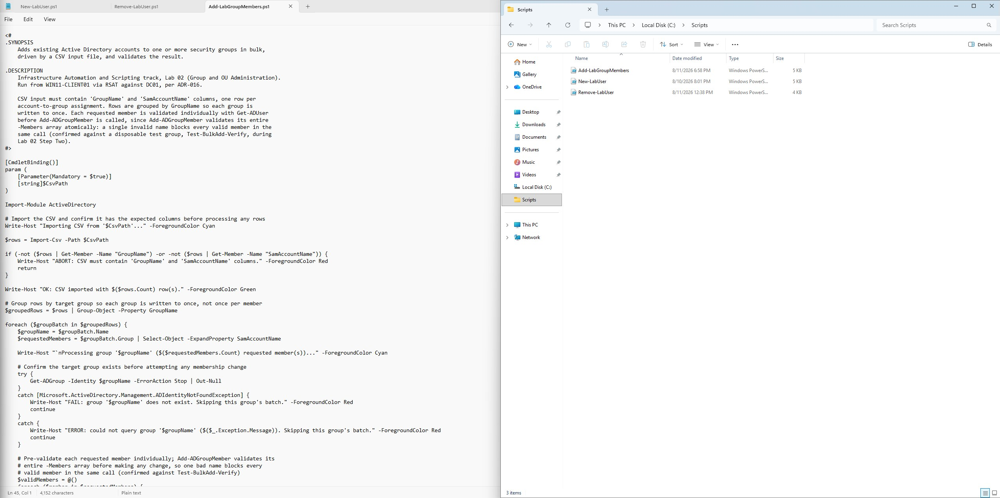
</p>

<p align="center">
  <em>Add-LabGroupMembers.ps1 open in the editor on WIN11-CLIENT01 and saved to C:\Scripts, shown alongside New-LabUser.ps1 and Remove-LabUser.ps1 in the directory listing.</em>
</p>

The finalized script is also saved to `infrastructure/automation-and-scripting/group-and-ou-administration/Add-LabGroupMembers.ps1` in the repository's script library.

#### Running Add-LabGroupMembers.ps1 Against the Step One Test Accounts

`members.csv` was created in `C:\Scripts` on WIN11-CLIENT01, mapping `jsmith` and `mjohnson` into `IT-Admins` and `akim` into `Linux-Admins`:

```powershell
@"
GroupName,SamAccountName
IT-Admins,jsmith
IT-Admins,mjohnson
Linux-Admins,akim
"@ | Set-Content -Path "C:\Scripts\members.csv" -Encoding ASCII
```

Before the script was run, the file was checked with `Get-Content`, which echoed the four lines exactly as written, and `Import-Csv`, which parsed it into three objects with the expected `GroupName` and `SamAccountName` properties. With the CSV confirmed, `Add-LabGroupMembers.ps1` was run from `C:\Scripts`:

```powershell
.\Add-LabGroupMembers.ps1 -CsvPath "C:\Scripts\members.csv"
```

The script ran end to end with no errors. The CSV imported with 3 row(s), confirming both expected columns were present. Rows were grouped into two batches, `IT-Admins` (2 requested members) and `Linux-Admins` (1 requested member), matching the grouped-by-group design in the Design Decisions section. For each batch, the target group and every requested member were pre-validated successfully, since `jsmith`, `mjohnson`, `akim`, `IT-Admins`, and `Linux-Admins` all already existed in AD, `Add-ADGroupMember` was called once per group with the full validated member array, and the post-add validation query against `Get-ADGroupMember` returned PASS for all three:

- **PASS**: `jsmith` is a member of `IT-Admins`
- **PASS**: `mjohnson` is a member of `IT-Admins`
- **PASS**: `akim` is a member of `Linux-Admins`

<p align="center">
  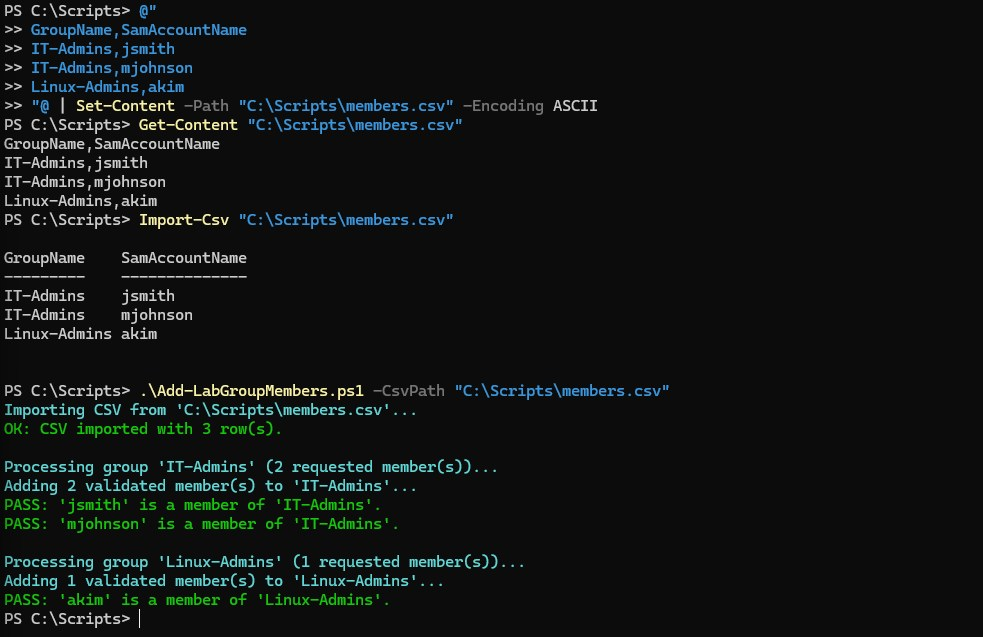
</p>

<p align="center">
  <em>Add-LabGroupMembers.ps1 run against members.csv from WIN11-CLIENT01, showing the CSV import, both group batches processed with their validated members, and all three post-add PASS checks.</em>
</p>

This confirms the grouped-by-group design and the per-member pre-validation resolved during the Add-ADGroupMember verification work correctly against real data: two members were added to `IT-Admins` in a single `Add-ADGroupMember` call, one member was added to `Linux-Admins`, and every addition was confirmed by querying group membership back from AD rather than trusting the cmdlet's exit code, consistent with Lab 01's validate-by-querying-back pattern.

This run exercised only valid group and member names. A CSV row naming a nonexistent group or account, which would confirm the partial-success batch model from the Design Decisions section actually holds, had not yet been tested at this point.

#### Testing the Partial-Success Batch Model with an Invalid Member

The verification step earlier in this section confirmed that `Add-ADGroupMember` itself fails an entire `-Members` array if one name in it is invalid, which is why `Add-LabGroupMembers.ps1` pre-validates every member individually before calling it. That diagnostic tested the raw cmdlet directly against a disposable group; it did not test whether the finished script's own pre-validation logic actually delivers partial success end to end. A second, separate CSV was created to test that, `members.csv` was left untouched:

```powershell
@"
GroupName,SamAccountName
IT-Admins,akim
IT-Admins,doesnotexist999
"@ | Set-Content -Path "C:\Scripts\members-negative-test.csv" -Encoding ASCII
```

This targets `IT-Admins` with two members in the same batch: `akim`, a real account not yet in that group, and `doesnotexist999`, a deliberately invalid name. `Get-Content` and `Import-Csv` confirmed the file was written and parsed correctly, two rows with the expected columns, before the script was run against it:

```powershell
.\Add-LabGroupMembers.ps1 -CsvPath "C:\Scripts\members-negative-test.csv"
```

The CSV imported with 2 row(s) and was grouped into a single `IT-Admins` batch with both requested members. During per-member pre-validation, `doesnotexist999` failed the `Get-ADUser -Identity` check and was excluded from the batch, while `akim` passed and was added; `Add-ADGroupMember` was called with only `akim` in its `-Members` array, and the post-add validation query confirmed it:

```text
Processing group 'IT-Admins' (2 requested member(s))...
FAIL: 'doesnotexist999' does not exist; excluded from this group's batch.
Adding 1 validated member(s) to 'IT-Admins'...
PASS: 'akim' is a member of 'IT-Admins'.
```

<p align="center">
  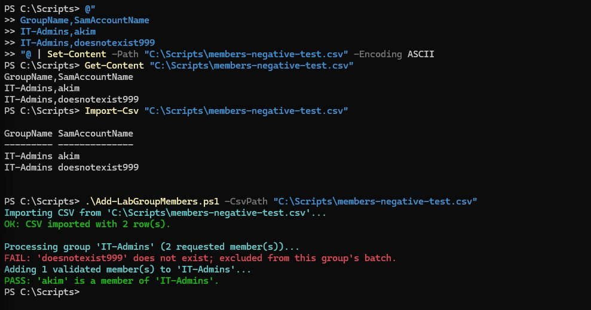
</p>

<p align="center">
  <em>Add-LabGroupMembers.ps1 run against members-negative-test.csv, showing doesnotexist999 rejected and excluded during pre-validation while akim was still added to IT-Admins and confirmed PASS.</em>
</p>

This confirms the partial-success batch model from the Design Decisions section holds end to end, not just at the level of the raw `Add-ADGroupMember` behavior verified earlier. The invalid name did not block the valid member in the same group's batch, `IT-Admins` still received `akim`, and the script reported exactly which row failed and why, rather than either silently dropping the whole batch or silently ignoring the bad row.

### Step Three - Build Get-LabOUReport.ps1

#### Script Implementation

`Get-LabOUReport.ps1` is read-only: unlike `Add-LabGroupMembers.ps1`, it makes no changes to Active Directory, so there is no PASS/FAIL validation model here, only status messages while it runs and a table (plus optional CSV) as output, consistent with the reporting-output convention in the Design Decisions section. The parameter block matches the planning-stage design, a single optional `-ExportPath`:

```powershell
[CmdletBinding()]
param (
    [Parameter(Mandatory = $false)]
    [string]$ExportPath
)

Import-Module ActiveDirectory
```

Every OU in the domain is enumerated with `Get-ADOrganizationalUnit -Filter *`, no `-SearchBase` is needed since the goal is every OU, not a subset. `Get-ADOrganizationalUnit` does not guarantee return order, so the result is piped through `Sort-Object Name` to keep the report's row order stable and alphabetical:

```powershell
Write-Host "Enumerating organizational units under corp.home.arpa..." -ForegroundColor Cyan

$ous = Get-ADOrganizationalUnit -Filter * | Sort-Object Name

Write-Host "Found $($ous.Count) OU(s). Counting user and computer objects per OU (SearchScope OneLevel)..." -ForegroundColor Cyan
```

For each OU, `Get-ADUser` and `Get-ADComputer` are queried with `-SearchBase` set to that OU's distinguished name and `-SearchScope OneLevel`, rather than the cmdlets' `Subtree` default. The current OU structure (`IT`, `User Accounts`, `Workstations`, `Groups`) is flat, so `OneLevel` and `Subtree` return identical counts today, but `OneLevel` means each OU's row reflects only objects directly inside it. If an OU is ever nested under another later, `Subtree` would silently fold the child OU's objects into the parent's count; `OneLevel` keeps each row accurate to what is actually placed in that specific OU. Each `Get-ADUser`/`Get-ADComputer` call is wrapped in `@(...)` before `.Count` is read, so an OU with zero matching objects reports `0` reliably rather than depending on how PowerShell handles `.Count` on a `$null` result:

```powershell
$report = foreach ($ou in $ous) {
    $userCount = @(Get-ADUser -SearchBase $ou.DistinguishedName -SearchScope OneLevel -Filter *).Count
    $computerCount = @(Get-ADComputer -SearchBase $ou.DistinguishedName -SearchScope OneLevel -Filter *).Count

    [PSCustomObject]@{
        Name              = $ou.Name
        DistinguishedName = $ou.DistinguishedName
        UserCount         = $userCount
        ComputerCount     = $computerCount
    }
}
```

The report prints to the console as a table by default, and is additionally written to CSV via `Export-Csv` if `-ExportPath` is supplied:

```powershell
$report | Format-Table -AutoSize

if ($ExportPath) {
    $report | Export-Csv -Path $ExportPath -NoTypeInformation
    Write-Host "Report exported to '$ExportPath'." -ForegroundColor Green
}
```

#### Creating the Script on WIN11-CLIENT01

With the design and implementation above finalized, the script was created in `C:\Scripts` on WIN11-CLIENT01, the same execution environment used for the other scripts in this track, consistent with the execution-location convention established in [ADR-016](../architecture/decisions/016-run-automation-scripts-from-domain-joined-client.md). It was pasted into a new file in the editor and saved as `C:\Scripts\Get-LabOUReport.ps1`, alongside `New-LabUser.ps1`, `Remove-LabUser.ps1`, and `Add-LabGroupMembers.ps1`.

<p align="center">
  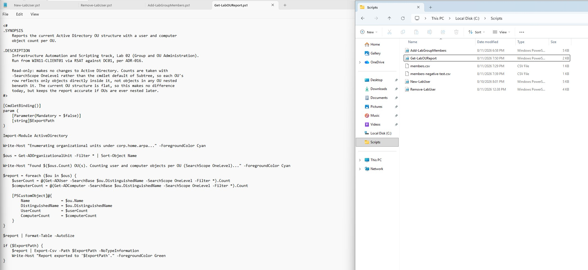
</p>

<p align="center">
  <em>Get-LabOUReport.ps1 open in the editor on WIN11-CLIENT01 and saved to C:\Scripts, shown alongside the other scripts and CSV files from Step Two in the directory listing.</em>
</p>

The finalized script is also saved to `infrastructure/automation-and-scripting/group-and-ou-administration/Get-LabOUReport.ps1` in the repository's script library.

#### Running Get-LabOUReport.ps1 Against the Live Environment

The script was run from `C:\Scripts` on WIN11-CLIENT01, with no `-ExportPath`, so the report was written to the console only:

```powershell
.\Get-LabOUReport.ps1
```

The script ran end to end with no errors, reporting 5 OU(s):

| Name | DistinguishedName | UserCount | ComputerCount |
|---|---|---|---|
| Domain Controllers | `OU=Domain Controllers,DC=corp,DC=home,DC=arpa` | 0 | 1 |
| Groups | `OU=Groups,DC=corp,DC=home,DC=arpa` | 0 | 0 |
| IT | `OU=IT,DC=corp,DC=home,DC=arpa` | 1 | 0 |
| User Accounts | `OU=User Accounts,DC=corp,DC=home,DC=arpa` | 5 | 0 |
| Workstations | `OU=Workstations,DC=corp,DC=home,DC=arpa` | 0 | 2 |

<p align="center">
  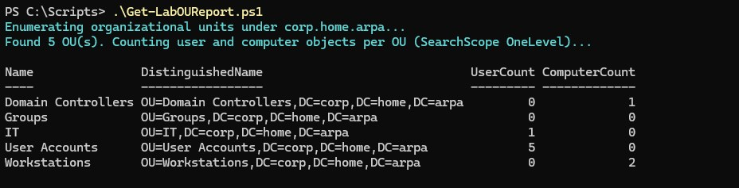
</p>

<p align="center">
  <em>Get-LabOUReport.ps1 run from WIN11-CLIENT01 with no -ExportPath, showing all 5 OUs in the domain sorted alphabetically with their per-OU user and computer counts.</em>
</p>

The result matched what was independently expected from the environment's known state: `IT` holding `labadmin` (1 user), `User Accounts` holding `testuser01`, the disabled `jdoe`, and the three Step One accounts `jsmith`/`mjohnson`/`akim` (5 users), `Workstations` holding the `WIN11-CLIENT01` and Ubuntu Server computer objects (2 computers) with no users, `Groups` holding neither users nor computers since it only contains group objects that this script does not count, and the built-in `Domain Controllers` OU, not one of the four custom OUs but a real OU nonetheless, correctly appearing with DC01's computer object (1 computer). Sorting by `Name` produced the alphabetical row order seen above rather than whatever order `Get-ADOrganizationalUnit` returned OUs in. This confirms the `-SearchScope OneLevel` design reports each OU's directly-contained objects correctly, and that `Get-ADOrganizationalUnit -Filter *` was right to enumerate every OU in the domain rather than only the four created by hand in the enterprise infrastructure track.

#### Testing the -ExportPath CSV Export

The script was run again, this time with `-ExportPath` supplied, to confirm the CSV export path works and produces output consistent with the console table:

```powershell
.\Get-LabOUReport.ps1 -ExportPath "C:\Scripts\ou-report.csv"
```

The console output matched the first run exactly, the same 5 OUs with the same `UserCount`/`ComputerCount` values, followed by a confirmation line, `Report exported to 'C:\Scripts\ou-report.csv'.` The exported file was then checked directly:

```powershell
Import-Csv "C:\Scripts\ou-report.csv"
```

This returned the same 5 rows with identical `Name`, `DistinguishedName`, `UserCount`, and `ComputerCount` values as the console table, `Domain Controllers` 0/1, `Groups` 0/0, `IT` 1/0, `User Accounts` 5/0, `Workstations` 0/2.

<p align="center">
  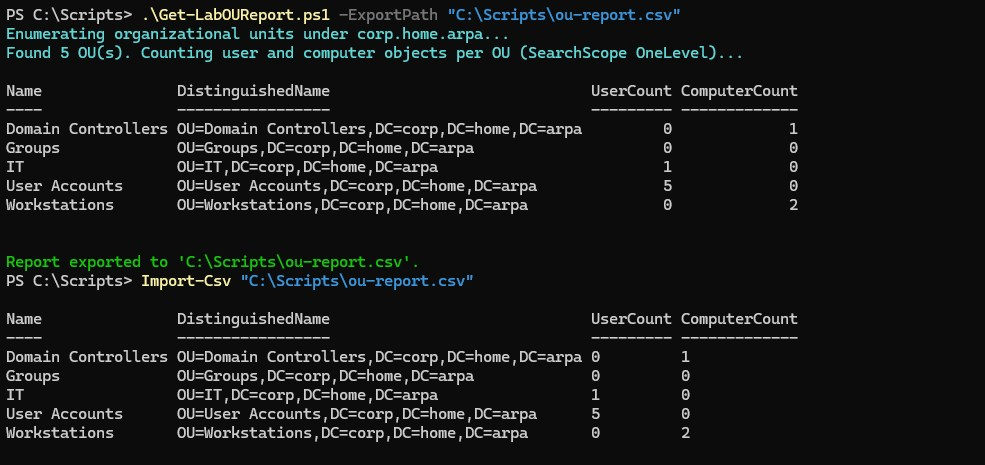
</p>

<p align="center">
  <em>Get-LabOUReport.ps1 run with -ExportPath, showing the console table, the export confirmation line, and Import-Csv against the resulting file returning matching data.</em>
</p>

This confirms `Export-Csv` is writing the same report data reflected in the console, not a stale or differently-scoped copy, closing out the last untested part of the script's design.

### Step Four - Build Get-LabAccountInventory.ps1

#### Script Implementation

Like `Get-LabOUReport.ps1`, `Get-LabAccountInventory.ps1` is read-only: it makes no changes to Active Directory, so it reports status messages while it runs and a table (plus optional CSV) as output, with no PASS/FAIL validation model. The parameter block matches that same convention, a single optional `-ExportPath`:

```powershell
[CmdletBinding()]
param (
    [Parameter(Mandatory = $false)]
    [string]$ExportPath
)

Import-Module ActiveDirectory
```

Every user account in the domain is queried in one call with `Get-ADUser -Filter *`, requesting the properties the report needs beyond the cmdlet's default set, `Enabled`, `DistinguishedName`, `whenCreated`, `PasswordLastSet`, `LastLogonDate`, and `PrimaryGroup`. No `-SearchBase` is supplied since the goal is every account in the domain regardless of which OU it lives in. The result is piped through `Sort-Object SamAccountName` so the report's row order is stable and alphabetical, the same ordering approach used for the OU report:

```powershell
Write-Host "Querying all user accounts in corp.home.arpa..." -ForegroundColor Cyan

$users = Get-ADUser -Filter * -Properties Enabled, DistinguishedName, whenCreated, PasswordLastSet, LastLogonDate, PrimaryGroup |
    Sort-Object SamAccountName

Write-Host "Found $($users.Count) user account(s). Resolving group memberships per account..." -ForegroundColor Cyan
```

For each account, `Get-ADPrincipalGroupMembership` resolves its current group memberships, the same cmdlet `Remove-LabUser.ps1` (Lab 01) already uses. The result is filtered to exclude the account's primary group (`Domain Users` for every account in this domain) by comparing each returned group's `DistinguishedName` against the user's `PrimaryGroup` property, the identical comparison pattern `Remove-LabUser.ps1` uses to distinguish removable memberships from the primary group. Since every account shares the same primary group, including it in every row would add no differentiating signal; the filtered list is then joined into a single `"; "`-delimited string so each account still fits one CSV row:

```powershell
$report = foreach ($user in $users) {
    $groups = Get-ADPrincipalGroupMembership -Identity $user.SamAccountName |
        Where-Object { $_.DistinguishedName -ne $user.PrimaryGroup } |
        Select-Object -ExpandProperty Name

    [PSCustomObject]@{
        Name              = $user.Name
        SamAccountName    = $user.SamAccountName
        Enabled           = $user.Enabled
        DistinguishedName = $user.DistinguishedName
        WhenCreated       = $user.whenCreated
        PasswordLastSet   = $user.PasswordLastSet
        LastLogonDate     = $user.LastLogonDate
        Groups            = $groups -join "; "
    }
}
```

`LastLogonDate` is left as whatever `Get-ADUser` returns, including `$null`, rather than substituted with a placeholder value. It is a replicated attribute that updates periodically rather than on every logon, so `$null` legitimately means an account has no recorded logon, not that the query failed. The attribute set as a whole (`Enabled`, `DistinguishedName`, `WhenCreated`, `PasswordLastSet`, `LastLogonDate`, `Groups`) was chosen to be meaningful in this specific environment; this domain has no populated `Department`, `Title`, or `Manager` attributes, since accounts here are lab test accounts rather than a real HR-driven directory, so a generic inventory template built around those fields would mostly report empty values.

The report prints to the console as a table by default, and is additionally written to CSV via `Export-Csv` if `-ExportPath` is supplied, matching `Get-LabOUReport.ps1`'s output convention exactly:

```powershell
$report | Format-Table -AutoSize

if ($ExportPath) {
    $report | Export-Csv -Path $ExportPath -NoTypeInformation
    Write-Host "Report exported to '$ExportPath'." -ForegroundColor Green
}
```

#### Creating the Script on WIN11-CLIENT01

With the design and implementation above finalized, the script was created in `C:\Scripts` on WIN11-CLIENT01, the same execution environment used for the other scripts in this track, consistent with the execution-location convention established in [ADR-016](../architecture/decisions/016-run-automation-scripts-from-domain-joined-client.md). It was pasted into a new file in the editor and saved as `C:\Scripts\Get-LabAccountInventory.ps1`, alongside `New-LabUser.ps1`, `Remove-LabUser.ps1`, `Add-LabGroupMembers.ps1`, and `Get-LabOUReport.ps1`.

<p align="center">
  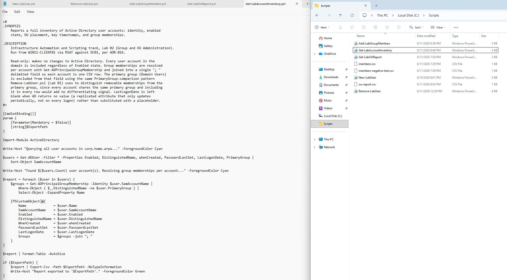
</p>

<p align="center">
  <em>Get-LabAccountInventory.ps1 open in the editor on WIN11-CLIENT01 and saved to C:\Scripts, shown alongside the other scripts and CSV files from the earlier Lab 02 steps in the directory listing.</em>
</p>

The finalized script is also saved to `infrastructure/automation-and-scripting/group-and-ou-administration/Get-LabAccountInventory.ps1` in the repository's script library.

#### Running Get-LabAccountInventory.ps1 Against the Live Environment

The script was run from `C:\Scripts` on WIN11-CLIENT01, with no `-ExportPath`, so the report was written to the console only:

```powershell
.\Get-LabAccountInventory.ps1
```

The script ran end to end with no errors, reporting 9 user account(s):

| Name | SamAccountName | Enabled | WhenCreated | PasswordLastSet | LastLogonDate | Groups |
|---|---|---|---|---|---|---|
| Administrator | Administrator | True | 6/4/2026 5:00:48 PM | 5/30/2026 3:56:10 PM | 8/10/2026 1:29:08 PM | Administrators; Schema Admins; Enterprise Admins; Domain Admins; Group Policy Creator Owners |
| Alex Kim | akim | True | 8/11/2026 6:05:18 PM | *(blank)* | *(blank)* | IT-Admins; Domain-Users-Standard; Linux-Admins |
| Guest | Guest | False | 6/4/2026 5:00:48 PM | *(blank)* | *(blank)* | Guests |
| Jane Doe | jdoe | False | 8/10/2026 8:08:49 PM | 8/11/2026 12:03:55 PM | 8/11/2026 12:02:44 PM | *(blank)* |
| John Smith | jsmith | True | 8/11/2026 6:05:03 PM | *(blank)* | *(blank)* | IT-Admins; Domain-Users-Standard |
| krbtgt | krbtgt | False | 6/4/2026 5:01:33 PM | 6/4/2026 5:01:33 PM | *(blank)* | Denied RODC Password Replication Group |
| labadmin | labadmin | True | 6/4/2026 6:47:04 PM | 6/4/2026 6:47:04 PM | 8/10/2026 1:28:01 PM | Domain Admins; IT-Admins; Linux-Admins |
| Mary Johnson | mjohnson | True | 8/11/2026 6:05:10 PM | *(blank)* | *(blank)* | IT-Admins; Domain-Users-Standard |
| testuser01 | testuser01 | True | 6/4/2026 6:50:56 PM | 6/4/2026 6:50:56 PM | 6/6/2026 1:12:41 PM | Domain-Users-Standard |

<p align="center">
  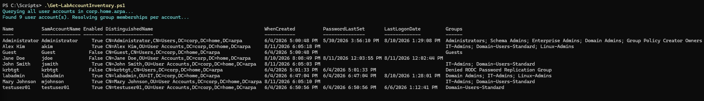
</p>

<p align="center">
  <em>Get-LabAccountInventory.ps1 run from WIN11-CLIENT01 with no -ExportPath, showing all 9 user accounts in the domain with their identity, enabled state, OU placement, timestamps, and resolved group memberships.</em>
</p>

The `DistinguishedName` column, though not shown in the excerpt above, was also populated for every row, placing each account in its expected OU (`CN=Users` for the built-in `Administrator`, `Guest`, and `krbtgt` accounts, `OU=IT` for `labadmin`, and `OU=User Accounts` for `akim`, `jdoe`, `jsmith`, `mjohnson`, and `testuser01`). Group memberships were resolved for every account, and no row lists `Domain Users`, the domain's built-in primary group, confirming the primary-group exclusion filter is working as designed; the distinct, similarly-named `Domain-Users-Standard` role group (created in the enterprise infrastructure track, not the same object as the built-in primary group) correctly still appears where an account is a member of it. `LastLogonDate` is blank for `akim`, `jsmith`, `mjohnson`, and `Guest`, accounts with no recorded logon, confirming the script preserves AD's `$null` rather than substituting a placeholder value.

#### Testing the -ExportPath CSV Export

The script was run again, this time with `-ExportPath` supplied, to confirm the CSV export path works and produces output consistent with the console table:

```powershell
.\Get-LabAccountInventory.ps1 -ExportPath "C:\Scripts\account-inventory.csv"
```

The console output matched the first run exactly, the same 9 accounts with the same `Enabled`, `DistinguishedName`, `WhenCreated`, `PasswordLastSet`, `LastLogonDate`, and `Groups` values, followed by a confirmation line, `Report exported to 'C:\Scripts\account-inventory.csv'.` The exported file was then checked directly:

```powershell
Import-Csv "C:\Scripts\account-inventory.csv"
```

This returned the same 9 records with identical values to the console table for every field. The two fields most likely to behave unexpectedly through `Export-Csv`, held up correctly: `PasswordLastSet` and `LastLogonDate` remained genuinely blank for `akim`, `Guest`, `jsmith`, and `mjohnson` (`krbtgt`'s `LastLogonDate` also stayed blank), rather than appearing as a literal `NULL` or empty-string artifact, and `Groups`, a single delimited field, stayed intact as one `"; "`-joined value per account (for example, `akim`'s `Groups` field still reads `IT-Admins; Domain-Users-Standard; Linux-Admins`) rather than being split across columns. `jdoe`'s `Groups` field was blank in both the console and the CSV, consistent with `jdoe` having no group memberships beyond the excluded primary group.

<p align="center">
  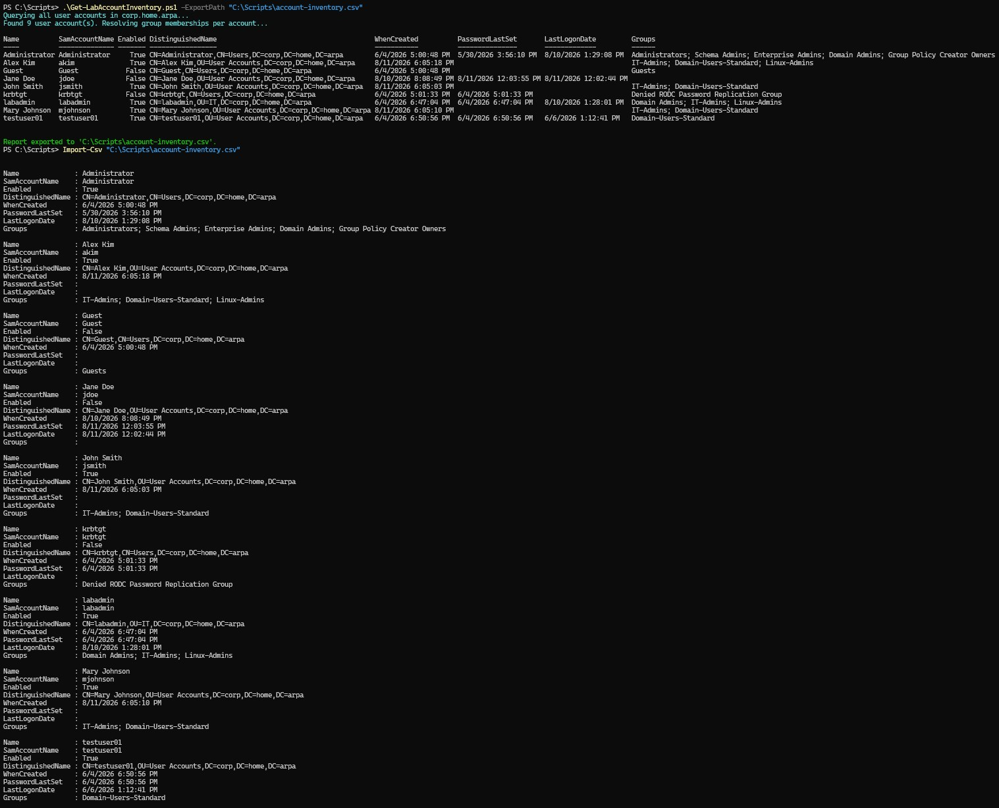
</p>

<p align="center">
  <em>Get-LabAccountInventory.ps1 run with -ExportPath, showing the console table followed by the export confirmation line, and Import-Csv against the resulting file returning the same 9 records with matching data.</em>
</p>

This confirms `Export-Csv` is writing the same report data reflected in the console, not a stale or differently-scoped copy, and that the two fields specific to this script, `LastLogonDate` and the joined `Groups` string, survive the round trip to CSV intact.

### Step Five - Run All Three Scripts and Validate Against Known State

Once written, the plan is to run `Add-LabGroupMembers.ps1` against the test accounts from Step One, then run both reporting scripts and manually cross-check their output against what is independently known about the environment: the OU report's counts should match `Get-ADUser -Filter * -SearchBase <OU>` run interactively for each OU, and the account inventory should list exactly the accounts known to exist (`labadmin`, `testuser01`, the disabled `jdoe`, and whatever test accounts Step One created), with group memberships matching what Step Two's own validation already confirmed. This closes the loop the same way Lab 01 did: not trusting a script's own success message without an independent query against the same source of truth.

---

## Validation Strategy

- `Add-LabGroupMembers.ps1`: after each group's bulk add, `Get-ADGroupMember` will be queried directly and compared against the CSV rows targeting that group; every requested `SamAccountName` must appear in the result, printed as PASS/FAIL per group, matching Lab 01's validate-by-querying-back pattern rather than trusting `Add-ADGroupMember`'s exit code alone
- A CSV row naming a nonexistent group or account is expected to be caught and reported as a failure for that specific row or group, without preventing valid rows elsewhere in the same file from succeeding
- `Get-LabOUReport.ps1`: per-OU user and computer counts will be spot-checked against `Get-ADUser` / `Get-ADComputer` run interactively with the same `-SearchBase` and `-SearchScope OneLevel`, for at least two of the four existing OUs, to confirm the report's counts are not silently off by one or double-counting
- `Get-LabAccountInventory.ps1`: the exported row count will be checked against `(Get-ADUser -Filter *).Count` run interactively, and at least one row's group membership field will be checked against `Get-ADPrincipalGroupMembership` for that same account, run independently
- All three scripts will be confirmed not to make any AD write other than the group memberships `Add-LabGroupMembers.ps1` is explicitly asked to add; the two reporting scripts in particular must be confirmed read-only, since nothing in their design should touch AD state

---

## Anticipated Troubleshooting Areas

**Duplicate membership handling in Add-ADGroupMember.** `Add-ADGroupMember` uses permissive modify by default, meaning adding an account that is already a member of the target group does not raise an error. This is convenient for the bulk script (a CSV can be safely re-run without failing on rows that already succeeded) but it also means the script cannot distinguish "this row was already true" from "this row just became true" purely from whether `Add-ADGroupMember` threw an error. The post-run validation query (Get-ADGroupMember) resolves this either way, since it checks final state rather than the cmdlet's own success signal, but this is worth confirming explicitly once real CSV re-runs are tested.

**Bad SamAccountName resolution timing.** It is not yet confirmed at this planning stage whether `Add-ADGroupMember` fails per-member within a single `-Members` array call (letting valid members in the same call still succeed) or fails the entire call if any one member name is invalid. If it is the latter, the grouped-by-group design in Step Two would need every member in a group's batch to be pre-validated with `Get-ADUser -Identity` before the `Add-ADGroupMember` call for that group is attempted, rather than relying on catching a failure from the call itself. This needs to be verified against actual cmdlet behavior during implementation, not assumed from documentation alone.

**CSV encoding and header naming.** `Import-Csv` treats the first row as literal column headers and produces default `H1`/`H2` names with a warning if headers are missing or malformed (see Sources). A CSV authored or edited in Excel can introduce a byte-order-mark or unexpected delimiter that changes how headers are parsed. The plan is to validate the presence of the expected `GroupName` and `SamAccountName` properties on the very first imported object before processing any rows, so a malformed CSV fails fast with a clear message rather than partway through the group-processing loop.

**OU report counts if the OU structure is ever nested.** The `OneLevel` search scope decision in Step Three is deliberately chosen to remain correct if OUs are ever nested under the current four, but this has not been tested against an actual nested OU, since none currently exist in this environment. If a future lab introduces a nested OU, the report's per-OU counts should be re-verified against that new structure rather than assumed to still be correct.

**Get-ADUser default result limits at scale.** `Get-ADUser -Filter *` has an unlimited default `-ResultSetSize`, but `-ResultPageSize` defaults to 256 objects per page. This domain currently has a handful of accounts, far below any paging concern, so this is not expected to surface as an actual issue in this lab, but it is worth naming as a boundary of the current design: `Get-LabAccountInventory.ps1` is not being built or tested against an account volume large enough to validate its behavior at scale.

---

## Security Considerations

- **CSV input contains no credentials.** Unlike `New-LabUser.ps1`, which handles a `[SecureString]` password, `Add-LabGroupMembers.ps1`'s CSV input contains only group names and `SamAccountName` values, no password or other secret material, so the plaintext-handling concerns documented in Lab 01 do not apply to this lab's bulk script.
- **Group scope of the bulk script.** `Add-LabGroupMembers.ps1` is planned to only ever call `Add-ADGroupMember`, never `Remove-ADGroupMember` or any account-modifying cmdlet, keeping its blast radius limited to additive group membership changes. Bulk removal, if it is ever needed, is a natural candidate for a separate, explicitly-named script rather than an option bolted onto this one, so that a script's name alone is a reliable signal of whether it can remove access.
- **Least privilege for the executing account.** As in Lab 01, all three scripts are planned to run as `labadmin`. A production deployment would scope a dedicated service account to read access for the two reporting scripts and write access to group membership only, rather than the broad administrative identity used here.
- **Read-only guarantee for reporting scripts.** `Get-LabOUReport.ps1` and `Get-LabAccountInventory.ps1` are planned to use only `Get-*` cmdlets against AD. This is a design constraint worth stating explicitly and verifying during implementation, since an inventory or reporting tool that accidentally has write access to the data it reports on is a meaningfully different risk profile than one that provably cannot.
- **Exported CSV files as a data-handling boundary.** `Get-LabAccountInventory.ps1`'s optional CSV export will contain account names, OU placement, and group membership for every account in the domain. This is lab data, not production PII, but the export path and file are worth treating deliberately (not committed to the repository, stored only where intended) as a matter of habit consistent with real inventory-reporting practice.

---

## Sources

Research references consulted during the planning phase of this lab.

**Active Directory PowerShell module - OU and group cmdlets (Microsoft Learn)**

- [Get-ADOrganizationalUnit](https://learn.microsoft.com/en-us/powershell/module/activedirectory/get-adorganizationalunit) - core OU query cmdlet; `-Filter`, `-SearchBase`, and `-SearchScope` (Base / OneLevel / Subtree) plan the OU reporting script's enumeration logic
- [Get-ADGroup](https://learn.microsoft.com/en-us/powershell/module/activedirectory/get-adgroup) - group lookup and property retrieval (`GroupScope`, `GroupCategory`), used to validate a group exists before a bulk add targets it
- [Get-ADGroupMember](https://learn.microsoft.com/en-us/powershell/module/activedirectory/get-adgroupmember) - retrieves current group membership; the planned post-run validation query for `Add-LabGroupMembers.ps1`, and the basis for the `-Recursive` behavior noted for nested-group scenarios not currently present in this environment
- [Add-ADGroupMember](https://learn.microsoft.com/en-us/powershell/module/activedirectory/add-adgroupmember) - bulk membership cmdlet; documents the default permissive-modify behavior (duplicate adds do not error) and the `-Members` array parameter that the grouped-by-group design in this lab relies on; does not accept pipeline input for `-Members`, which rules out a pipeline-based bulk pattern
- [Get-ADUser](https://learn.microsoft.com/en-us/powershell/module/activedirectory/get-aduser) - account inventory query cmdlet; `-Filter *` with `-Properties` and `-SearchBase` plans both the OU report's per-OU user counts and the account inventory script's full-domain query
- [Get-ADPrincipalGroupMembership](https://learn.microsoft.com/en-us/powershell/module/activedirectory/get-adprincipalgroupmembership) - already used in Lab 01 for validation; reused here to resolve each account's group memberships for the inventory report

**CSV handling (Microsoft Learn)**

- [Import-Csv](https://learn.microsoft.com/en-us/powershell/module/microsoft.powershell.utility/import-csv) - confirms first-row headers become object properties, default `H1`/`H2` naming and warning behavior on malformed headers, and that imported values are always strings; informs the header-validation step planned in Step Two
- [Export-Csv](https://learn.microsoft.com/en-us/powershell/module/microsoft.powershell.utility/export-csv) - planned output mechanism for both reporting scripts' optional `-ExportPath`

**Bulk group membership patterns (community references, cross-checked against the Microsoft cmdlet docs above)**

- [Bulk Add Users to Groups in Active Directory - Active Directory Pro](https://activedirectorypro.com/add-users-to-active-directory-groups/) - the two-column `GroupName,SamAccountName` CSV shape this lab's format is based on
- [How To Use Powershell to Add User Accounts to AD Groups - Daniel Engberg](https://www.danielengberg.com/powershell-add-active-directory-users-to-groups-using-a-csv-file/) - documents the naive per-row `foreach` loop pattern that the Design Decisions section above deliberately departs from in favor of grouping by `GroupName`

These sources informed the Design Decisions, Implementation Plan, and Anticipated Troubleshooting Areas sections above. This list will be extended with any additional sources consulted during implementation.
