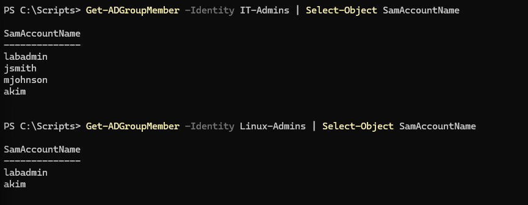
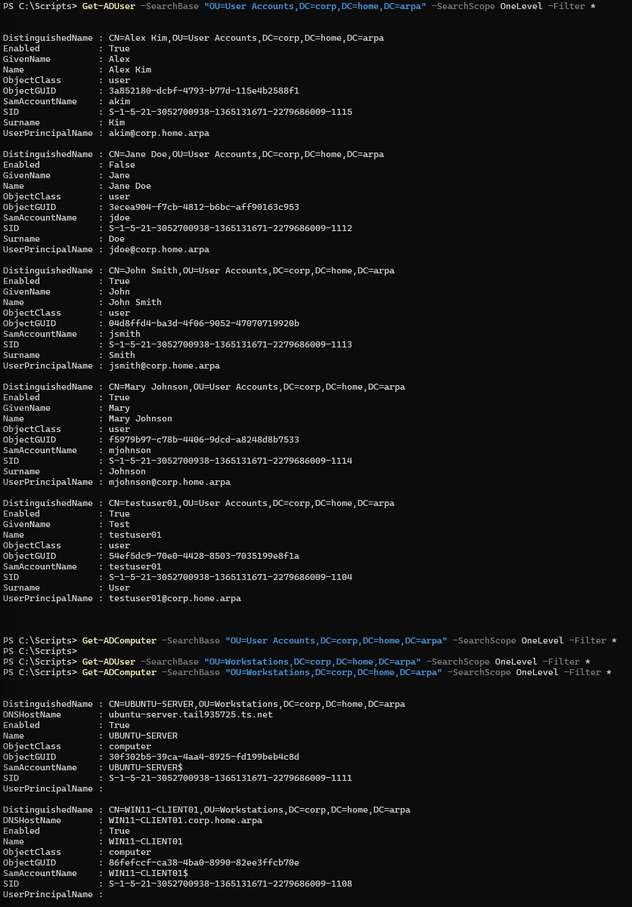
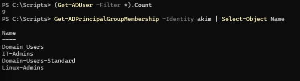

# 02 - Group and OU Administration

## Status

- Complete. All three scripts (`Add-LabGroupMembers.ps1`, `Get-LabOUReport.ps1`, `Get-LabAccountInventory.ps1`) are authored and have been run end to end against the live environment, including each script's `-ExportPath`/negative-test edge case. All five implementation steps are done, and every script's reported result was cross-checked in Step Five against an independent, standalone AD query rather than trusted on its own success message alone.

---

## Overview

This lab automates three related administrative workflows that Lab 01 (User Lifecycle Automation) did not cover: bulk security-group membership management, organizational unit reporting, and account inventory reporting, against the existing `corp.home.arpa` Active Directory domain.

Lab 01 automated one account at a time, a deliberate scope (see its Design Decisions) that leaves two categories of manual work untouched. Group membership changes affecting several accounts at once, adding a batch of new hires to `IT-Admins` or `Linux-Admins`, still require repeating `Add-ADGroupMember` by hand per account. And there is no scripted way to answer basic questions about current state: how many accounts sit in each OU, or what the full user inventory looks like at a point in time. Both are the administrative overhead ADR-015 scoped this track to eliminate.

This lab produces three scripts: one for CSV-driven bulk group membership changes, and two read-only reporting scripts, one for OU structure and object counts, one for a full account inventory. It introduces no new infrastructure, automating administration of the OU and group structure the enterprise infrastructure track's Lab 03 established and Lab 01 already builds accounts into.

---

## Objectives

- add multiple existing AD accounts to one or more security groups in a single run, driven by a CSV input file rather than repeated individual `Add-ADGroupMember` calls
- validate bulk membership changes by querying group membership back from AD after the run, consistent with the self-validation pattern established in Lab 01
- report the current OU structure (`IT`, `User Accounts`, `Workstations`, `Groups`) with an object count per OU, without a manual ADUC walkthrough
- report a full account inventory: every user account in the domain with its OU, enabled state, and group memberships, reviewable on screen and exportable for later reference
- handle bad input (a CSV row naming a nonexistent account or group) without aborting the entire batch, and report exactly which rows succeeded and which failed
- keep all three read-only except for the specific group memberships the bulk script is explicitly asked to change; the two reporting scripts must not modify AD state at all

---

## Project Context

The enterprise infrastructure track built the OU and group structure this lab reports on: `OU=IT`, `OU=User Accounts`, `OU=Workstations`, and `OU=Groups` were created in Lab 03 (Active Directory Lab), and `IT-Admins`, `Domain-Users-Standard`, and `Lab-Workstations` were created as security groups in `OU=Groups` in that same lab. `Linux-Admins` was added later in Lab 06 (Linux/AD Integration) of that track to gate SSH access. Lab 01 of this track began populating those OUs and groups programmatically instead of through ADUC, provisioning and offboarding accounts one at a time.

ADR-015 scoped this track to be AD-centric, every lab automating a real, previously-manual task against infrastructure that already exists. Lab 01 took the highest-value single-account workflow; this lab takes the next two gaps: group membership does not scale past one account at a time, and seeing the current OU and group structure means clicking through ADUC by hand.

It also begins two patterns the rest of the track depends on: scripts that operate on a batch of inputs rather than a single named account, and read-only reporting scripts that snapshot state rather than change it. Lab 04 (GPO Reporting and Audit) and Lab 06 (Scheduled Health Reporting) both build on reporting; getting the shape right here, console output plus an optional CSV export, gives them a precedent to follow rather than inventing their own.

---

## Design Decisions

### Group CSV rows by target group before calling Add-ADGroupMember

**Decision:** The bulk membership script parses the CSV into memory, groups rows by `GroupName`, and calls `Add-ADGroupMember` once per group with the full list of members for that group, rather than calling it once per CSV row.

Microsoft's own documented pattern loops over every row and calls `Add-ADGroupMember` once per row (see Sources), issuing one AD write per account even when many accounts go into the same group in the same run. `Add-ADGroupMember` accepts `-Members` as an array, so grouping rows by `GroupName` first reduces directory writes and aligns the PASS/FAIL validation to one block per group rather than one per row. The tradeoff is an in-memory grouping step against a simpler flat loop, worth it for a script whose entire purpose is handling more than one account at a time.

### Partial-success batch model, not all-or-nothing

**Decision:** A CSV row that names a nonexistent account or a nonexistent group fails and is reported individually. It does not abort the rest of the batch.

Lab 01's scripts abort outright on a pre-flight failure, correct for a single-target script. A bulk script is different: a typo'd `SamAccountName` in row 40 of a 50-row file should not discard the 49 valid rows around it. Each group's addition carries its own error handling, and the final output states which groups succeeded, which failed, and why. The script deliberately does not attempt row-level rollback if a later row fails, since `Add-ADGroupMember`'s permissive-modify default already makes membership additions idempotent and safely re-runnable. Confirmed with a real negative test in Step Two, not just asserted from the design.

### Reporting output: formatted console table plus optional CSV export

**Decision:** Both reporting scripts (`Get-LabOUReport.ps1` and `Get-LabAccountInventory.ps1`) write a formatted table to the console by default and support an optional `-ExportPath` parameter that writes the same data to CSV via `Export-Csv`.

Lab 01's scripts print PASS/FAIL because they validate a change they just made. These two report a state instead, so a table is the more natural output for "here is what currently exists." Keeping CSV export optional rather than mandatory leaves the scripts useful for a quick interactive check with no file left behind, while still supporting the point-in-time record-keeping an inventory report exists for. This establishes the reporting output convention Lab 04 (GPO Reporting and Audit) and Lab 06 (Scheduled Health Reporting) are expected to reuse.

### Script and folder naming

**Decision:** The three scripts are named `Add-LabGroupMembers.ps1`, `Get-LabOUReport.ps1`, and `Get-LabAccountInventory.ps1`, stored under `infrastructure/automation-and-scripting/group-and-ou-administration/`, following the `Verb-LabNoun` naming pattern and per-lab subfolder convention Lab 01 established with `New-LabUser.ps1` / `Remove-LabUser.ps1` under `user-lifecycle-automation/`.

---

## Technologies Used

- PowerShell 5.1 / Active Directory module (RSAT, run from WIN11-CLIENT01, per ADR-016)
- `Import-Csv` / `Export-Csv` (PowerShell Utility module) for bulk input and reporting output
- Active Directory Domain Services (DC01)
- Existing OU structure: `OU=IT`, `OU=User Accounts`, `OU=Workstations`, `OU=Groups`
- Existing security groups: `IT-Admins`, `Domain-Users-Standard`, `Linux-Admins`, `Lab-Workstations`
- Test accounts provisioned via `New-LabUser.ps1` (Lab 01) as bulk-add targets

---

## Architecture or Topology

```text
WIN11-CLIENT01 (RSAT / PowerShell AD module)
        |
        |  Add-LabGroupMembers.ps1  <-- members.csv (GroupName, SamAccountName)
        |  Get-LabOUReport.ps1
        |  Get-LabAccountInventory.ps1  --> optional -ExportPath CSV
        v
     DC01 (Active Directory Domain Services)
        |
        | OU structure: IT, User Accounts, Workstations, Groups
        | Groups: IT-Admins, Domain-Users-Standard, Linux-Admins, Lab-Workstations
        v
  Validation: group membership and report contents queried back from AD,
  not assumed from script exit code
```

All three originate from WIN11-CLIENT01 against DC01, per ADR-016. Unlike Lab 01, none need to reach Ubuntu Server: there is no Linux-side validation step, since this lab does not touch account creation or the SSSD-resolved access path Lab 01 already proved.

---

## Prerequisites

- DC01 running Active Directory Domain Services and AD-integrated DNS (Lab 03, enterprise infrastructure track)
- WIN11-CLIENT01 domain-joined with RSAT installed, Active Directory module available; required script execution endpoint per [ADR-016](../architecture/decisions/016-run-automation-scripts-from-domain-joined-client.md)
- Existing OU structure (`IT`, `User Accounts`, `Workstations`, `Groups`) and existing security groups (`IT-Admins`, `Domain-Users-Standard`, `Linux-Admins`, `Lab-Workstations`) in place from the enterprise infrastructure track
- Lab 01 (`New-LabUser.ps1`, `Remove-LabUser.ps1`) complete; used to provision a small set of additional test accounts as bulk-add targets, since the only accounts currently in the domain (`labadmin`, `testuser01`, and the disabled `jdoe`) are not sufficient to exercise a multi-row bulk membership run
- An account with sufficient AD permissions to read OU and group data and modify group membership (`labadmin`)

---

## Implementation

### Step One - Provision Test Accounts for Bulk Membership Testing

The bulk membership script needed more accounts to operate on. `New-LabUser.ps1` (Lab 01) was run three times from `C:\Scripts` on WIN11-CLIENT01 to create `jsmith`, `mjohnson`, and `akim` as throwaway accounts, all with default parameters, `Domain-Users-Standard` membership and no `-LinuxAccess`, since these exist solely to give `Add-LabGroupMembers.ps1` a realistic multi-row CSV in Step Two.

```powershell
.\New-LabUser.ps1 -FirstName John -LastName Smith -SamAccountName jsmith
.\New-LabUser.ps1 -FirstName Mary -LastName Johnson -SamAccountName mjohnson
.\New-LabUser.ps1 -FirstName Alex -LastName Kim -SamAccountName akim
```

All three runs completed cleanly with no errors. For each account, the pre-flight check confirmed the `SamAccountName` did not already exist, the account was created in `OU=User Accounts,DC=corp,DC=home,DC=arpa`, it was added to `Domain-Users-Standard`, and all four of `New-LabUser.ps1`'s validation checks returned PASS:

- **PASS**: account exists and is enabled
- **PASS**: account is in the target OU (`OU=User Accounts,DC=corp,DC=home,DC=arpa`)
- **PASS**: member of role group `Domain-Users-Standard`
- **PASS**: not a member of `Linux-Admins` (Linux access not requested)

The result was identical for all three, confirming `New-LabUser.ps1` behaves consistently across repeated runs against different account names, which Lab 01 validated for a single account (`jdoe`) but had not exercised back-to-back in one session.

<p align="center">
  
</p>

<p align="center">
  <em>New-LabUser.ps1 run three times from WIN11-CLIENT01 to provision jsmith, mjohnson, and akim, each showing the pre-flight pass, account creation, Domain-Users-Standard assignment, and all four validation checks returning PASS.</em>
</p>

The domain now holds `jsmith`, `mjohnson`, and `akim` beyond `labadmin`, `testuser01`, and the disabled `jdoe`, available as bulk-add targets for Step Two.

### Step Two - Build Add-LabGroupMembers.ps1

#### Verifying Add-ADGroupMember's Behavior on Invalid Members

The planning phase left one question open: does `Add-ADGroupMember` fail an entire `-Members` array if one name in it is invalid, or add the valid names and fail only on the bad one? It was verified directly against DC01 rather than assumed. A disposable test group was created, a mixed valid/invalid `-Members` array passed to it, the result queried back, and the group removed:

```powershell
New-ADGroup -Name "Test-BulkAdd-Verify" -GroupScope Global -GroupCategory Security -Path "OU=Groups,DC=corp,DC=home,DC=arpa"

Add-ADGroupMember -Identity "Test-BulkAdd-Verify" -Members "jsmith","doesnotexist999"

Get-ADGroupMember -Identity "Test-BulkAdd-Verify"

Remove-ADGroup -Identity "Test-BulkAdd-Verify" -Confirm:$false
```

The `Add-ADGroupMember` call failed outright with a terminating `ADIdentityNotFoundException` on `doesnotexist999`:

```text
Add-ADGroupMember : Cannot find an object with identity: 'doesnotexist999' under: 'DC=corp,DC=home,DC=arpa'.
+ CategoryInfo          : ObjectNotFound: (doesnotexist999:ADPrincipal) [Add-ADGroupMember], ADIdentityNotFoundException
+ FullyQualifiedErrorId : SetADGroupMember.ValidateMembersParameter,Microsoft.ActiveDirectory.Management.Commands.AddADGroupMember
```

The `FullyQualifiedErrorId` (`SetADGroupMember.ValidateMembersParameter`) shows the entire `-Members` array is validated before any change is made, not processed member-by-member. The subsequent `Get-ADGroupMember -Identity "Test-BulkAdd-Verify"` returned no output, confirming `jsmith`, the one valid name in the array, was **not** added; the invalid name blocked the whole call.

<p align="center">
  
</p>

<p align="center">
  <em>Test-BulkAdd-Verify diagnostic showing Add-ADGroupMember failing outright on the invalid member doesnotexist999, Get-ADGroupMember confirming jsmith was not added despite being valid, and the disposable test group removed afterward.</em>
</p>

So a single bad `SamAccountName` in a batch would silently block every valid member alongside it if the script passed raw CSV rows straight to `Add-ADGroupMember`. To preserve the partial-success model at the row level and not just the group level, each requested member is pre-validated individually with `Get-ADUser -Identity` first, and only the members that pass are included in the array.

#### Script Implementation

The finalized parameter block matches the planning-stage design, a single mandatory `-CsvPath`:

```powershell
[CmdletBinding()]
param (
    [Parameter(Mandatory = $true)]
    [string]$CsvPath
)

Import-Module ActiveDirectory
```

The CSV is imported and checked for both expected columns before any row is processed:

```powershell
Write-Host "Importing CSV from '$CsvPath'..." -ForegroundColor Cyan

$rows = Import-Csv -Path $CsvPath

if (-not ($rows | Get-Member -Name "GroupName") -or -not ($rows | Get-Member -Name "SamAccountName")) {
    Write-Host "ABORT: CSV must contain 'GroupName' and 'SamAccountName' columns." -ForegroundColor Red
    return
}

Write-Host "OK: CSV imported with $($rows.Count) row(s)." -ForegroundColor Green
```

Rows are grouped by `GroupName` per the Design Decisions section, so each group is written to once rather than once per member:

```powershell
$groupedRows = $rows | Group-Object -Property GroupName

foreach ($groupBatch in $groupedRows) {
    $groupName = $groupBatch.Name
    $requestedMembers = $groupBatch.Group | Select-Object -ExpandProperty SamAccountName

    Write-Host "`nProcessing group '$groupName' ($($requestedMembers.Count) requested member(s))..." -ForegroundColor Cyan
```

The target group is confirmed to exist before anything else is attempted for that batch, using the same `Get-ADUser`/`ADIdentityNotFoundException` pattern Lab 01 established, applied here to `Get-ADGroup`:

```powershell
    try {
        Get-ADGroup -Identity $groupName -ErrorAction Stop | Out-Null
    }
    catch [Microsoft.ActiveDirectory.Management.ADIdentityNotFoundException] {
        Write-Host "FAIL: group '$groupName' does not exist. Skipping this group's batch." -ForegroundColor Red
        continue
    }
    catch {
        Write-Host "ERROR: could not query group '$groupName' ($($_.Exception.Message)). Skipping this group's batch." -ForegroundColor Red
        continue
    }
```

Each requested member is then pre-validated individually, the direct consequence of the verification above. A member that does not exist is reported and excluded, but does not stop the remaining members in the same group's batch from being processed:

```powershell
    $validMembers = @()
    foreach ($member in $requestedMembers) {
        try {
            Get-ADUser -Identity $member -ErrorAction Stop | Out-Null
            $validMembers += $member
        }
        catch [Microsoft.ActiveDirectory.Management.ADIdentityNotFoundException] {
            Write-Host "FAIL: '$member' does not exist; excluded from this group's batch." -ForegroundColor Red
        }
        catch {
            Write-Host "ERROR: could not query '$member' ($($_.Exception.Message)); excluded from this group's batch." -ForegroundColor Red
        }
    }

    if ($validMembers.Count -eq 0) {
        Write-Host "FAIL: no valid members remain for '$groupName'; nothing to add." -ForegroundColor Red
        continue
    }
```

Only the validated members are passed to `Add-ADGroupMember`, which by this point cannot fail on an unknown identity, since every name in `$validMembers` has already been confirmed to exist:

```powershell
    Write-Host "Adding $($validMembers.Count) validated member(s) to '$groupName'..." -ForegroundColor Cyan
    Add-ADGroupMember -Identity $groupName -Members $validMembers
```

Finally, the result is validated by querying the group's membership back, per member, rather than trusting the call above, consistent with Lab 01's validate-by-querying-back pattern:

```powershell
    $currentMembers = Get-ADGroupMember -Identity $groupName | Select-Object -ExpandProperty SamAccountName

    foreach ($member in $validMembers) {
        if ($currentMembers -contains $member) {
            Write-Host "PASS: '$member' is a member of '$groupName'." -ForegroundColor Green
        }
        else {
            Write-Host "FAIL: '$member' was not found in '$groupName' after the add." -ForegroundColor Red
        }
    }
}
```

#### Creating the Script on WIN11-CLIENT01

The finalized script was saved as `C:\Scripts\Add-LabGroupMembers.ps1` on WIN11-CLIENT01, the same execution environment Lab 01 used, per [ADR-016](../architecture/decisions/016-run-automation-scripts-from-domain-joined-client.md). No execution policy change was needed; `RemoteSigned` at `CurrentUser` scope was already set during Lab 01 and persisted.

<p align="center">
  
</p>

<p align="center">
  <em>Add-LabGroupMembers.ps1 open in the editor on WIN11-CLIENT01 and saved to C:\Scripts, shown alongside New-LabUser.ps1 and Remove-LabUser.ps1 in the directory listing.</em>
</p>

A copy lives in the repository at `infrastructure/automation-and-scripting/group-and-ou-administration/Add-LabGroupMembers.ps1`.

#### Running Add-LabGroupMembers.ps1 Against the Step One Test Accounts

`members.csv` was created in `C:\Scripts` on WIN11-CLIENT01, mapping `jsmith` and `mjohnson` into `IT-Admins` and `akim` into `Linux-Admins`:

```powershell
@"
GroupName,SamAccountName
IT-Admins,jsmith
IT-Admins,mjohnson
Linux-Admins,akim
"@ | Set-Content -Path "C:\Scripts\members.csv" -Encoding ASCII
```

Before the script was run, the file was checked with `Get-Content`, which echoed the four lines exactly as written, and `Import-Csv`, which parsed it into three objects with the expected `GroupName` and `SamAccountName` properties. With the CSV confirmed, `Add-LabGroupMembers.ps1` was run from `C:\Scripts`:

```powershell
.\Add-LabGroupMembers.ps1 -CsvPath "C:\Scripts\members.csv"
```

The script ran end to end with no errors. The CSV imported with 3 row(s), confirming both expected columns were present. Rows were grouped into two batches, `IT-Admins` (2 requested members) and `Linux-Admins` (1 requested member), matching the grouped-by-group design in the Design Decisions section. For each batch, the target group and every requested member were pre-validated successfully, since `jsmith`, `mjohnson`, `akim`, `IT-Admins`, and `Linux-Admins` all already existed in AD, `Add-ADGroupMember` was called once per group with the full validated member array, and the post-add validation query against `Get-ADGroupMember` returned PASS for all three:

- **PASS**: `jsmith` is a member of `IT-Admins`
- **PASS**: `mjohnson` is a member of `IT-Admins`
- **PASS**: `akim` is a member of `Linux-Admins`

<p align="center">
  
</p>

<p align="center">
  <em>Add-LabGroupMembers.ps1 run against members.csv from WIN11-CLIENT01, showing the CSV import, both group batches processed with their validated members, and all three post-add PASS checks.</em>
</p>

This confirms the grouped-by-group design and the per-member pre-validation resolved during the Add-ADGroupMember verification work correctly against real data: two members were added to `IT-Admins` in a single `Add-ADGroupMember` call, one member was added to `Linux-Admins`, and every addition was confirmed by querying group membership back from AD rather than trusting the cmdlet's exit code, consistent with Lab 01's validate-by-querying-back pattern.

This run exercised only valid group and member names. A CSV row naming a nonexistent group or account, which would confirm the partial-success batch model from the Design Decisions section actually holds, had not yet been tested at this point.

#### Testing the Partial-Success Batch Model with an Invalid Member

The verification step earlier in this section confirmed that `Add-ADGroupMember` itself fails an entire `-Members` array if one name in it is invalid, which is why `Add-LabGroupMembers.ps1` pre-validates every member individually before calling it. That diagnostic tested the raw cmdlet directly against a disposable group; it did not test whether the finished script's own pre-validation logic actually delivers partial success end to end. A second, separate CSV was created to test that, `members.csv` was left untouched:

```powershell
@"
GroupName,SamAccountName
IT-Admins,akim
IT-Admins,doesnotexist999
"@ | Set-Content -Path "C:\Scripts\members-negative-test.csv" -Encoding ASCII
```

This targets `IT-Admins` with two members in the same batch: `akim`, a real account not yet in that group, and `doesnotexist999`, a deliberately invalid name. `Get-Content` and `Import-Csv` confirmed the file was written and parsed correctly, two rows with the expected columns, before the script was run against it:

```powershell
.\Add-LabGroupMembers.ps1 -CsvPath "C:\Scripts\members-negative-test.csv"
```

The CSV imported with 2 row(s) and was grouped into a single `IT-Admins` batch with both requested members. During per-member pre-validation, `doesnotexist999` failed the `Get-ADUser -Identity` check and was excluded from the batch, while `akim` passed and was added; `Add-ADGroupMember` was called with only `akim` in its `-Members` array, and the post-add validation query confirmed it:

```text
Processing group 'IT-Admins' (2 requested member(s))...
FAIL: 'doesnotexist999' does not exist; excluded from this group's batch.
Adding 1 validated member(s) to 'IT-Admins'...
PASS: 'akim' is a member of 'IT-Admins'.
```

<p align="center">
  
</p>

<p align="center">
  <em>Add-LabGroupMembers.ps1 run against members-negative-test.csv, showing doesnotexist999 rejected and excluded during pre-validation while akim was still added to IT-Admins and confirmed PASS.</em>
</p>

This confirms the partial-success batch model from the Design Decisions section holds end to end, not just at the level of the raw `Add-ADGroupMember` behavior verified earlier. The invalid name did not block the valid member in the same group's batch, `IT-Admins` still received `akim`, and the script reported exactly which row failed and why, rather than either silently dropping the whole batch or silently ignoring the bad row.

### Step Three - Build Get-LabOUReport.ps1

#### Script Implementation

`Get-LabOUReport.ps1` is read-only: unlike `Add-LabGroupMembers.ps1`, it makes no changes to Active Directory, so there is no PASS/FAIL validation model here, only status messages while it runs and a table (plus optional CSV) as output, consistent with the reporting-output convention in the Design Decisions section. The parameter block matches the planning-stage design, a single optional `-ExportPath`:

```powershell
[CmdletBinding()]
param (
    [Parameter(Mandatory = $false)]
    [string]$ExportPath
)

Import-Module ActiveDirectory
```

Every OU in the domain is enumerated with `Get-ADOrganizationalUnit -Filter *`, no `-SearchBase` is needed since the goal is every OU, not a subset. `Get-ADOrganizationalUnit` does not guarantee return order, so the result is piped through `Sort-Object Name` to keep the report's row order stable and alphabetical:

```powershell
Write-Host "Enumerating organizational units under corp.home.arpa..." -ForegroundColor Cyan

$ous = Get-ADOrganizationalUnit -Filter * | Sort-Object Name

Write-Host "Found $($ous.Count) OU(s). Counting user and computer objects per OU (SearchScope OneLevel)..." -ForegroundColor Cyan
```

For each OU, `Get-ADUser` and `Get-ADComputer` are queried with `-SearchBase` set to that OU's distinguished name and `-SearchScope OneLevel`, rather than the cmdlets' `Subtree` default. The current OU structure (`IT`, `User Accounts`, `Workstations`, `Groups`) is flat, so `OneLevel` and `Subtree` return identical counts today, but `OneLevel` means each OU's row reflects only objects directly inside it. If an OU is ever nested under another later, `Subtree` would silently fold the child OU's objects into the parent's count; `OneLevel` keeps each row accurate to what is actually placed in that specific OU. Each `Get-ADUser`/`Get-ADComputer` call is wrapped in `@(...)` before `.Count` is read, so an OU with zero matching objects reports `0` reliably rather than depending on how PowerShell handles `.Count` on a `$null` result:

```powershell
$report = foreach ($ou in $ous) {
    $userCount = @(Get-ADUser -SearchBase $ou.DistinguishedName -SearchScope OneLevel -Filter *).Count
    $computerCount = @(Get-ADComputer -SearchBase $ou.DistinguishedName -SearchScope OneLevel -Filter *).Count

    [PSCustomObject]@{
        Name              = $ou.Name
        DistinguishedName = $ou.DistinguishedName
        UserCount         = $userCount
        ComputerCount     = $computerCount
    }
}
```

The report prints to the console as a table by default, and is additionally written to CSV via `Export-Csv` if `-ExportPath` is supplied:

```powershell
$report | Format-Table -AutoSize

if ($ExportPath) {
    $report | Export-Csv -Path $ExportPath -NoTypeInformation
    Write-Host "Report exported to '$ExportPath'." -ForegroundColor Green
}
```

#### Creating the Script on WIN11-CLIENT01

The script was saved as `C:\Scripts\Get-LabOUReport.ps1` alongside the track's other scripts on WIN11-CLIENT01, per [ADR-016](../architecture/decisions/016-run-automation-scripts-from-domain-joined-client.md).

<p align="center">
  
</p>

<p align="center">
  <em>Get-LabOUReport.ps1 open in the editor on WIN11-CLIENT01 and saved to C:\Scripts, shown alongside the other scripts and CSV files from Step Two in the directory listing.</em>
</p>

A copy lives in the repository at `infrastructure/automation-and-scripting/group-and-ou-administration/Get-LabOUReport.ps1`.

#### Running Get-LabOUReport.ps1 Against the Live Environment

The script was run from `C:\Scripts` on WIN11-CLIENT01, with no `-ExportPath`, so the report was written to the console only:

```powershell
.\Get-LabOUReport.ps1
```

The script ran end to end with no errors, reporting 5 OU(s):

| Name | DistinguishedName | UserCount | ComputerCount |
|---|---|---|---|
| Domain Controllers | `OU=Domain Controllers,DC=corp,DC=home,DC=arpa` | 0 | 1 |
| Groups | `OU=Groups,DC=corp,DC=home,DC=arpa` | 0 | 0 |
| IT | `OU=IT,DC=corp,DC=home,DC=arpa` | 1 | 0 |
| User Accounts | `OU=User Accounts,DC=corp,DC=home,DC=arpa` | 5 | 0 |
| Workstations | `OU=Workstations,DC=corp,DC=home,DC=arpa` | 0 | 2 |

<p align="center">
  
</p>

<p align="center">
  <em>Get-LabOUReport.ps1 run from WIN11-CLIENT01 with no -ExportPath, showing all 5 OUs in the domain sorted alphabetically with their per-OU user and computer counts.</em>
</p>

The result matched the environment's known state: `IT` holding `labadmin` (1 user); `User Accounts` holding `testuser01`, the disabled `jdoe`, and the three Step One accounts (5 users); `Workstations` holding the `WIN11-CLIENT01` and Ubuntu Server computer objects (2 computers) and no users; `Groups` holding neither, since it contains only group objects this script does not count; and the built-in `Domain Controllers` OU, not one of the four custom OUs but a real OU nonetheless, correctly appearing with DC01's computer object. Sorting by `Name` produced the alphabetical row order rather than whatever order `Get-ADOrganizationalUnit` returned. This confirms `-SearchScope OneLevel` reports each OU's directly-contained objects correctly, and that `-Filter *` was right to enumerate every OU rather than only the four created by hand in the enterprise infrastructure track.

#### Testing the -ExportPath CSV Export

The script was run again, this time with `-ExportPath` supplied, to confirm the CSV export path works and produces output consistent with the console table:

```powershell
.\Get-LabOUReport.ps1 -ExportPath "C:\Scripts\ou-report.csv"
```

The console output matched the first run exactly, followed by `Report exported to 'C:\Scripts\ou-report.csv'.` The exported file was checked directly:

```powershell
Import-Csv "C:\Scripts\ou-report.csv"
```

This returned the same 5 rows with identical values to the console table: `Domain Controllers` 0/1, `Groups` 0/0, `IT` 1/0, `User Accounts` 5/0, `Workstations` 0/2.

<p align="center">
  
</p>

<p align="center">
  <em>Get-LabOUReport.ps1 run with -ExportPath, showing the console table, the export confirmation line, and Import-Csv against the resulting file returning matching data.</em>
</p>

`Export-Csv` is writing the same report data reflected in the console, not a stale or differently-scoped copy, closing out the last untested part of the script's design.

### Step Four - Build Get-LabAccountInventory.ps1

#### Script Implementation

Like `Get-LabOUReport.ps1`, `Get-LabAccountInventory.ps1` is read-only: it makes no changes to Active Directory, so it reports status messages while it runs and a table (plus optional CSV) as output, with no PASS/FAIL validation model. The parameter block matches that same convention, a single optional `-ExportPath`:

```powershell
[CmdletBinding()]
param (
    [Parameter(Mandatory = $false)]
    [string]$ExportPath
)

Import-Module ActiveDirectory
```

Every user account in the domain is queried in one call with `Get-ADUser -Filter *`, requesting the properties the report needs beyond the cmdlet's default set, `Enabled`, `DistinguishedName`, `whenCreated`, `PasswordLastSet`, `LastLogonDate`, and `PrimaryGroup`. No `-SearchBase` is supplied since the goal is every account in the domain regardless of which OU it lives in. The result is piped through `Sort-Object SamAccountName` so the report's row order is stable and alphabetical, the same ordering approach used for the OU report:

```powershell
Write-Host "Querying all user accounts in corp.home.arpa..." -ForegroundColor Cyan

$users = Get-ADUser -Filter * -Properties Enabled, DistinguishedName, whenCreated, PasswordLastSet, LastLogonDate, PrimaryGroup |
    Sort-Object SamAccountName

Write-Host "Found $($users.Count) user account(s). Resolving group memberships per account..." -ForegroundColor Cyan
```

For each account, `Get-ADPrincipalGroupMembership` resolves its current group memberships, the same cmdlet `Remove-LabUser.ps1` (Lab 01) uses. The result is filtered to exclude the primary group (`Domain Users` for every account here) by comparing each returned group's `DistinguishedName` against the user's `PrimaryGroup` property, the identical pattern `Remove-LabUser.ps1` uses. Since every account shares that primary group, including it in every row adds no signal; the filtered list is joined into one `"; "`-delimited string so each account fits a single CSV row:

```powershell
$report = foreach ($user in $users) {
    $groups = Get-ADPrincipalGroupMembership -Identity $user.SamAccountName |
        Where-Object { $_.DistinguishedName -ne $user.PrimaryGroup } |
        Select-Object -ExpandProperty Name

    [PSCustomObject]@{
        Name              = $user.Name
        SamAccountName    = $user.SamAccountName
        Enabled           = $user.Enabled
        DistinguishedName = $user.DistinguishedName
        WhenCreated       = $user.whenCreated
        PasswordLastSet   = $user.PasswordLastSet
        LastLogonDate     = $user.LastLogonDate
        Groups            = $groups -join "; "
    }
}
```

`LastLogonDate` is left as whatever `Get-ADUser` returns, including `$null`, rather than substituted with a placeholder. It is a replicated attribute that updates periodically rather than on every logon, so `$null` legitimately means no recorded logon rather than a failed query. The attribute set as a whole (`Enabled`, `DistinguishedName`, `WhenCreated`, `PasswordLastSet`, `LastLogonDate`, `Groups`) was chosen to be meaningful here: this domain has no populated `Department`, `Title`, or `Manager` attributes, so a generic inventory template built around those fields would mostly report empty values.

The report prints to the console as a table by default, and is additionally written to CSV via `Export-Csv` if `-ExportPath` is supplied, matching `Get-LabOUReport.ps1`'s output convention exactly:

```powershell
$report | Format-Table -AutoSize

if ($ExportPath) {
    $report | Export-Csv -Path $ExportPath -NoTypeInformation
    Write-Host "Report exported to '$ExportPath'." -ForegroundColor Green
}
```

#### Creating the Script on WIN11-CLIENT01

The script was saved as `C:\Scripts\Get-LabAccountInventory.ps1` alongside the track's other scripts on WIN11-CLIENT01, per [ADR-016](../architecture/decisions/016-run-automation-scripts-from-domain-joined-client.md).

<p align="center">
  
</p>

<p align="center">
  <em>Get-LabAccountInventory.ps1 open in the editor on WIN11-CLIENT01 and saved to C:\Scripts, shown alongside the other scripts and CSV files from the earlier Lab 02 steps in the directory listing.</em>
</p>

A copy lives in the repository at `infrastructure/automation-and-scripting/group-and-ou-administration/Get-LabAccountInventory.ps1`.

#### Running Get-LabAccountInventory.ps1 Against the Live Environment

The script was run from `C:\Scripts` on WIN11-CLIENT01, with no `-ExportPath`, so the report was written to the console only:

```powershell
.\Get-LabAccountInventory.ps1
```

The script ran end to end with no errors, reporting 9 user account(s):

| Name | SamAccountName | Enabled | WhenCreated | PasswordLastSet | LastLogonDate | Groups |
|---|---|---|---|---|---|---|
| Administrator | Administrator | True | 6/4/2026 5:00:48 PM | 5/30/2026 3:56:10 PM | 8/10/2026 1:29:08 PM | Administrators; Schema Admins; Enterprise Admins; Domain Admins; Group Policy Creator Owners |
| Alex Kim | akim | True | 8/11/2026 6:05:18 PM | *(blank)* | *(blank)* | IT-Admins; Domain-Users-Standard; Linux-Admins |
| Guest | Guest | False | 6/4/2026 5:00:48 PM | *(blank)* | *(blank)* | Guests |
| Jane Doe | jdoe | False | 8/10/2026 8:08:49 PM | 8/11/2026 12:03:55 PM | 8/11/2026 12:02:44 PM | *(blank)* |
| John Smith | jsmith | True | 8/11/2026 6:05:03 PM | *(blank)* | *(blank)* | IT-Admins; Domain-Users-Standard |
| krbtgt | krbtgt | False | 6/4/2026 5:01:33 PM | 6/4/2026 5:01:33 PM | *(blank)* | Denied RODC Password Replication Group |
| labadmin | labadmin | True | 6/4/2026 6:47:04 PM | 6/4/2026 6:47:04 PM | 8/10/2026 1:28:01 PM | Domain Admins; IT-Admins; Linux-Admins |
| Mary Johnson | mjohnson | True | 8/11/2026 6:05:10 PM | *(blank)* | *(blank)* | IT-Admins; Domain-Users-Standard |
| testuser01 | testuser01 | True | 6/4/2026 6:50:56 PM | 6/4/2026 6:50:56 PM | 6/6/2026 1:12:41 PM | Domain-Users-Standard |

<p align="center">
  
</p>

<p align="center">
  <em>Get-LabAccountInventory.ps1 run from WIN11-CLIENT01 with no -ExportPath, showing all 9 user accounts in the domain with their identity, enabled state, OU placement, timestamps, and resolved group memberships.</em>
</p>

The `DistinguishedName` column, though not shown in the excerpt above, was also populated for every row, placing each account in its expected OU (`CN=Users` for the built-in `Administrator`, `Guest`, and `krbtgt` accounts, `OU=IT` for `labadmin`, and `OU=User Accounts` for `akim`, `jdoe`, `jsmith`, `mjohnson`, and `testuser01`). Group memberships were resolved for every account, and no row lists `Domain Users`, the domain's built-in primary group, confirming the primary-group exclusion filter is working as designed; the distinct, similarly-named `Domain-Users-Standard` role group (created in the enterprise infrastructure track, not the same object as the built-in primary group) correctly still appears where an account is a member of it. `LastLogonDate` is blank for `akim`, `jsmith`, `mjohnson`, and `Guest`, accounts with no recorded logon, confirming the script preserves AD's `$null` rather than substituting a placeholder value.

#### Testing the -ExportPath CSV Export

The script was run again, this time with `-ExportPath` supplied, to confirm the CSV export path works and produces output consistent with the console table:

```powershell
.\Get-LabAccountInventory.ps1 -ExportPath "C:\Scripts\account-inventory.csv"
```

The console output matched the first run exactly across all 9 accounts, followed by `Report exported to 'C:\Scripts\account-inventory.csv'.` The exported file was checked directly:

```powershell
Import-Csv "C:\Scripts\account-inventory.csv"
```

This returned the same 9 records with identical values for every field. The two fields most likely to behave unexpectedly through `Export-Csv` held up: `PasswordLastSet` and `LastLogonDate` stayed genuinely blank for `akim`, `Guest`, `jsmith`, and `mjohnson` (and `krbtgt`'s `LastLogonDate`) rather than becoming a literal `NULL` or empty-string artifact, and `Groups` stayed intact as one `"; "`-joined value per account, `akim`'s still reading `IT-Admins; Domain-Users-Standard; Linux-Admins`, rather than splitting across columns. `jdoe`'s `Groups` field was blank in both, consistent with it having no memberships beyond the excluded primary group.

<p align="center">
  
</p>

<p align="center">
  <em>Get-LabAccountInventory.ps1 run with -ExportPath, showing the console table followed by the export confirmation line, and Import-Csv against the resulting file returning the same 9 records with matching data.</em>
</p>

The joined `Groups` string and the null `LastLogonDate` both survive the round trip to CSV intact.

### Step Five - Run All Three Scripts and Validate Against Known State

**Revised scope.** This step was originally planned, before Steps Two through Four were implemented, as a single exercise: run all three scripts and manually cross-check the output against what is independently known about the environment. That no longer fit. Each script had already been built, run against the live environment, and documented individually: `Add-LabGroupMembers.ps1` in Step Two (a `members.csv` run plus a negative test), `Get-LabOUReport.ps1` in Step Three and `Get-LabAccountInventory.ps1` in Step Four (each a console run plus `-ExportPath`). Re-running all three here would only reproduce results that are already real and already documented.

What those three steps did not include is a standalone, independently-typed `Get-AD*` query, run outside of any script, compared number-for-number against what a script reported. Every check so far came either from a script's own internal validation (`Add-LabGroupMembers.ps1`'s post-add `Get-ADGroupMember` query) or from prose reasoning about known environment state. Step Five was revised to close that gap the same way Lab 01 did: three independent queries, one per script cross-checked against its own documented results, plus a review of all three finalized scripts confirming no unintended AD writes. That last one is a reasoning-based review rather than a live query.

#### Running the Independent Verification Queries

All four checks were performed from `C:\Scripts` on WIN11-CLIENT01, outside of any script.

**Cross-check against Step Two.** `Get-ADGroupMember -Identity IT-Admins | Select-Object SamAccountName` returned `labadmin`, `jsmith`, `mjohnson`, and `akim`. `Get-ADGroupMember -Identity Linux-Admins | Select-Object SamAccountName` returned `labadmin` and `akim`.

<p align="center">
  
</p>

<p align="center">
  <em>Get-ADGroupMember run independently against IT-Admins and Linux-Admins, confirming the memberships Add-LabGroupMembers.ps1 reported as PASS in Step Two.</em>
</p>

Both `jsmith` and `mjohnson` appear in `IT-Admins`, and `akim` in both `IT-Admins` and `Linux-Admins`, matching every PASS result from Step Two's `members.csv` run and negative test. `labadmin` also appears in both, not added by `Add-LabGroupMembers.ps1` but already known from Step Four's inventory, where its `Groups` field read `Domain Admins; IT-Admins; Linux-Admins`, so it is consistent with prior evidence rather than an unexpected result.

**Cross-check against Step Three.** For `OU=User Accounts`, `Get-ADUser -SearchBase "OU=User Accounts,DC=corp,DC=home,DC=arpa" -SearchScope OneLevel -Filter *` returned 5 user objects (`akim`, `jdoe`, `jsmith`, `mjohnson`, `testuser01`), and the equivalent `Get-ADComputer` call returned no objects. For `OU=Workstations`, `Get-ADUser` with the same scope returned no objects, and `Get-ADComputer` returned 2 computer objects (`UBUNTU-SERVER`, `WIN11-CLIENT01`).

<p align="center">
  
</p>

<p align="center">
  <em>Get-ADUser and Get-ADComputer run independently with -SearchScope OneLevel against the User Accounts and Workstations OUs, confirming Get-LabOUReport.ps1's counts from Step Three.</em>
</p>

This matches Step Three's table exactly: `User Accounts` at 5 users / 0 computers, `Workstations` at 0 users / 2 computers.

**Cross-check against Step Four.** `(Get-ADUser -Filter *).Count` returned `9`. `Get-ADPrincipalGroupMembership -Identity akim | Select-Object Name` returned `Domain Users`, `IT-Admins`, `Domain-Users-Standard`, and `Linux-Admins`.

<p align="center">
  
</p>

<p align="center">
  <em>(Get-ADUser -Filter *).Count and Get-ADPrincipalGroupMembership run independently against akim, confirming Get-LabAccountInventory.ps1's total row count and one account's group membership from Step Four.</em>
</p>

The count of 9 matches Step Four's total. `akim`'s membership list matches Step Four's `Groups` field (`IT-Admins; Domain-Users-Standard; Linux-Admins`) once `Domain Users` is set aside, the primary group the script's own filter excludes; its presence in this unfiltered query confirms the exclusion logic removes the correct group rather than coincidentally omitting something else.

**No unintended AD writes.** Re-reading the three finalized scripts confirms `Get-LabOUReport.ps1` and `Get-LabAccountInventory.ps1` call only `Get-ADOrganizationalUnit`, `Get-ADUser`, `Get-ADComputer`, and `Get-ADPrincipalGroupMembership`. `Add-LabGroupMembers.ps1` calls `Get-ADGroup`, `Get-ADUser`, `Add-ADGroupMember`, and `Get-ADGroupMember`; the only AD-modifying cmdlet anywhere across all three is `Add-ADGroupMember`, never paired with a `Remove-*` cmdlet.

With all four checks matching their corresponding steps' documented results, Lab 02 is complete.

---

## Validation

- **PASS**: `Add-LabGroupMembers.ps1`'s `members.csv` run confirmed via its own post-add `Get-ADGroupMember` query, `jsmith` and `mjohnson` added to `IT-Admins`, `akim` added to `Linux-Admins` (Step Two)
- **PASS**: a CSV row naming a nonexistent account (`doesnotexist999`) was caught and excluded, while the valid row in the same batch (`akim` into `IT-Admins`) still succeeded, confirming the partial-success batch model end to end (Step Two)
- **PASS**: `Get-LabOUReport.ps1`'s console output and `-ExportPath` CSV export matched each other exactly across all 5 OUs (Step Three)
- **PASS**: `Get-LabAccountInventory.ps1`'s console output and CSV export matched exactly across all 9 accounts, including blank `LastLogonDate` values and the joined `Groups` field surviving the round trip (Step Four)
- **PASS**: `Get-ADGroupMember`, run independently and outside of any script, confirmed `Add-LabGroupMembers.ps1`'s `IT-Admins` and `Linux-Admins` memberships from Step Two (Step Five)
- **PASS**: `Get-ADUser`/`Get-ADComputer`, run independently with the same `-SearchBase`/`-SearchScope OneLevel`, confirmed `Get-LabOUReport.ps1`'s counts for `User Accounts` and `Workstations` (Step Five)
- **PASS**: `(Get-ADUser -Filter *).Count` and `Get-ADPrincipalGroupMembership`, run independently, confirmed `Get-LabAccountInventory.ps1`'s total row count and `akim`'s group membership from Step Four (Step Five)
- **PASS**: reviewing all three finalized scripts confirmed the only AD-modifying cmdlet anywhere in the lab is the additive `Add-ADGroupMember`; both reporting scripts use only `Get-*` cmdlets (Step Five)

Every validation followed the rule Lab 01 established: never trust a script's own success message alone. `Add-LabGroupMembers.ps1` validates itself by querying `Get-ADGroupMember` back after each add, and Step Five went one level further, re-running that class of query independently against results the scripts had already reported.

---

## Troubleshooting and Adjustments

**`Add-ADGroupMember` validates its entire `-Members` array atomically, confirmed via a live diagnostic before implementation (Step Two).** The planning phase correctly identified this as an open question rather than assuming an answer either way. A disposable test group, `Test-BulkAdd-Verify`, was used to confirm that a single invalid name in the `-Members` array blocks every valid member in that same call (`FullyQualifiedErrorId: SetADGroupMember.ValidateMembersParameter`), rather than failing only the invalid entry. `Add-LabGroupMembers.ps1` was designed around this finding from the start: each requested member is validated individually with `Get-ADUser` before being included in the `-Members` array passed to `Add-ADGroupMember`, so the cmdlet is never actually called with an invalid name in this lab. The later negative test (Step Two) confirmed the resulting design works as intended, `doesnotexist999` was filtered out before `Add-ADGroupMember` ran, and `akim`, the valid member in the same CSV batch, was still added successfully.

**Areas anticipated during planning but not encountered during live testing.** Several planned-for edge cases never surfaced, and "not encountered" is not the same as "tested and confirmed handled": no CSV run re-targeted an existing membership, so duplicate-membership re-runs were never performed; every CSV used (`members.csv`, `members-negative-test.csv`) was well-formed, so `Import-Csv`'s header-validation safeguard never fired; the OU structure stayed flat, so `-SearchScope OneLevel` was never tested against a nested OU; and `Get-LabAccountInventory.ps1` only ever ran against 9 accounts, far below any `-ResultPageSize` paging concern. Each remains a reasonable follow-up test rather than a confirmed gap.

---

## Security Considerations

- **CSV input contains no credentials.** Unlike `New-LabUser.ps1`, which handles a `[SecureString]` password, `Add-LabGroupMembers.ps1`'s CSV holds only group names and `SamAccountName` values, so Lab 01's plaintext-handling concerns do not apply here.
- **Group scope of the bulk script.** Step Five's review confirmed `Add-LabGroupMembers.ps1` only ever calls `Add-ADGroupMember`, never `Remove-ADGroupMember` or any account-modifying cmdlet, keeping its blast radius to additive membership changes. Bulk removal, if ever needed, belongs in a separate, explicitly-named script rather than bolted onto this one, so a script's name alone signals whether it can remove access.
- **Least privilege for the executing account.** As in Lab 01, all three ran as `labadmin`. A production deployment would scope a dedicated service account to read access for the reporting scripts and group-membership write access only, rather than the broad administrative identity used here.
- **Read-only guarantee for reporting scripts.** Step Five's review confirmed `Get-LabOUReport.ps1` and `Get-LabAccountInventory.ps1` use only `Get-ADOrganizationalUnit`, `Get-ADUser`, `Get-ADComputer`, and `Get-ADPrincipalGroupMembership`; no cmdlet in either can modify AD state.
- **Exported CSV files as a data-handling boundary.** `account-inventory.csv` holds account names, OU placement, and group membership for every account in the domain. Lab data rather than production PII, but it, `ou-report.csv`, and the two `Add-LabGroupMembers.ps1` input CSVs were deliberately kept out of the repository and stored only in `C:\Scripts` on WIN11-CLIENT01, as a habit consistent with real inventory-reporting practice.

---

## Outcome

All three scripts meet every objective set out at the start. `Add-LabGroupMembers.ps1` bulk-adds existing accounts to security groups from a CSV, and its partial-success batch model, where a badly named account or group does not block valid rows elsewhere in the same file, was proven with a real negative test rather than asserted from the design. `Get-LabOUReport.ps1` reports a per-OU user and computer census, correctly enumerating every OU including the built-in `Domain Controllers` OU. `Get-LabAccountInventory.ps1` reports a full account inventory with resolved, primary-group-excluded memberships, reusing Lab 01's `Remove-LabUser.ps1` comparison pattern rather than reinventing it. All three support an optional `-ExportPath` confirmed in every case to match the console output exactly.

The open implementation question was resolved by live diagnostic rather than assumption: `Add-ADGroupMember`'s atomic `-Members` validation was confirmed with a disposable test group before the error-handling design was finalized, not after. Step Five's revised scope, independent queries cross-checked against Steps Two through Four's documented results rather than a blind re-run, closed the validation loop: every script's reported result was confirmed by re-querying AD directly, one level removed from its own internal validation.

---

## Lessons Learned

**Verifying an open question with a live diagnostic, before writing the code that depends on the answer, beats assuming and course-correcting later.** `Add-LabGroupMembers.ps1`'s partial-success behavior was not something planning could responsibly guess at; `Test-BulkAdd-Verify` answered it directly, and the resulting pre-validation design was correct on the first real test rather than needing a fix after a live failure.

**A step's plan can go stale the moment the step before it happens, and revising beats forcing it.** Step Five's original plan, written before any script existed, called for re-running all three scripts together. By the time it started, all three had already been individually built, run, and documented. Revising the scope to standalone independent queries produced a more useful step than executing a stale plan would have.

**A pattern proven once can be reused without re-verifying it from scratch.** `Get-LabAccountInventory.ps1`'s primary-group exclusion reused `Remove-LabUser.ps1`'s exact `PrimaryGroup`-comparison pattern without a new live diagnostic, since that pattern was already empirically proven. Step Five's independent check on `akim` confirmed the reuse was correct, `Domain Users` excluded and no other group caught in the filter, validating that citing prior evidence rather than re-testing every reused pattern was the right call.

---

## Sources

Research references consulted during the planning phase of this lab.

**Active Directory PowerShell module - OU and group cmdlets (Microsoft Learn)**

- [Get-ADOrganizationalUnit](https://learn.microsoft.com/en-us/powershell/module/activedirectory/get-adorganizationalunit) - core OU query cmdlet; `-Filter`, `-SearchBase`, and `-SearchScope` (Base / OneLevel / Subtree) underpin `Get-LabOUReport.ps1`'s enumeration logic
- [Get-ADGroup](https://learn.microsoft.com/en-us/powershell/module/activedirectory/get-adgroup) - group lookup and property retrieval (`GroupScope`, `GroupCategory`), used to validate a group exists before a bulk add targets it
- [Get-ADGroupMember](https://learn.microsoft.com/en-us/powershell/module/activedirectory/get-adgroupmember) - retrieves current group membership; used as `Add-LabGroupMembers.ps1`'s post-run validation query, and again as the standalone independent cross-check in Step Five
- [Add-ADGroupMember](https://learn.microsoft.com/en-us/powershell/module/activedirectory/add-adgroupmember) - bulk membership cmdlet; documents the default permissive-modify behavior (duplicate adds do not error) and the `-Members` array parameter that the grouped-by-group design in this lab relies on; does not accept pipeline input for `-Members`, which rules out a pipeline-based bulk pattern
- [Get-ADUser](https://learn.microsoft.com/en-us/powershell/module/activedirectory/get-aduser) - account inventory query cmdlet; `-Filter *` with `-Properties` and `-SearchBase` underpins both `Get-LabOUReport.ps1`'s per-OU user counts and `Get-LabAccountInventory.ps1`'s full-domain query
- [Get-ADPrincipalGroupMembership](https://learn.microsoft.com/en-us/powershell/module/activedirectory/get-adprincipalgroupmembership) - already used in Lab 01 for validation; reused here to resolve each account's group memberships for the inventory report

**CSV handling (Microsoft Learn)**

- [Import-Csv](https://learn.microsoft.com/en-us/powershell/module/microsoft.powershell.utility/import-csv) - confirms first-row headers become object properties, default `H1`/`H2` naming and warning behavior on malformed headers, and that imported values are always strings; underpins `Add-LabGroupMembers.ps1`'s header-validation step in Step Two, though a malformed CSV was never actually encountered during live testing
- [Export-Csv](https://learn.microsoft.com/en-us/powershell/module/microsoft.powershell.utility/export-csv) - output mechanism used by both reporting scripts' optional `-ExportPath`, confirmed against the console output for each in Steps Three and Four

**Bulk group membership patterns (community references, cross-checked against the Microsoft cmdlet docs above)**

- [Bulk Add Users to Groups in Active Directory - Active Directory Pro](https://activedirectorypro.com/add-users-to-active-directory-groups/) - the two-column `GroupName,SamAccountName` CSV shape this lab's format is based on
- [How To Use Powershell to Add User Accounts to AD Groups - Daniel Engberg](https://www.danielengberg.com/powershell-add-active-directory-users-to-groups-using-a-csv-file/) - documents the naive per-row `foreach` loop pattern that the Design Decisions section above deliberately departs from in favor of grouping by `GroupName`

