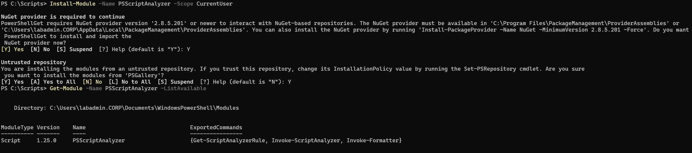
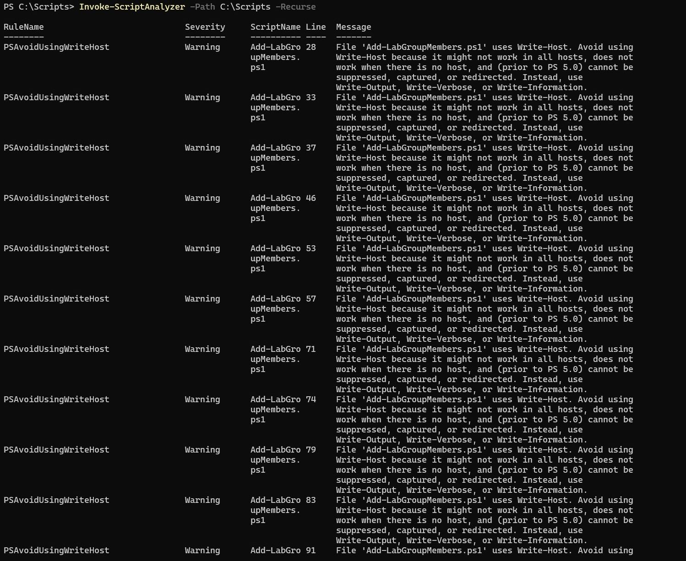
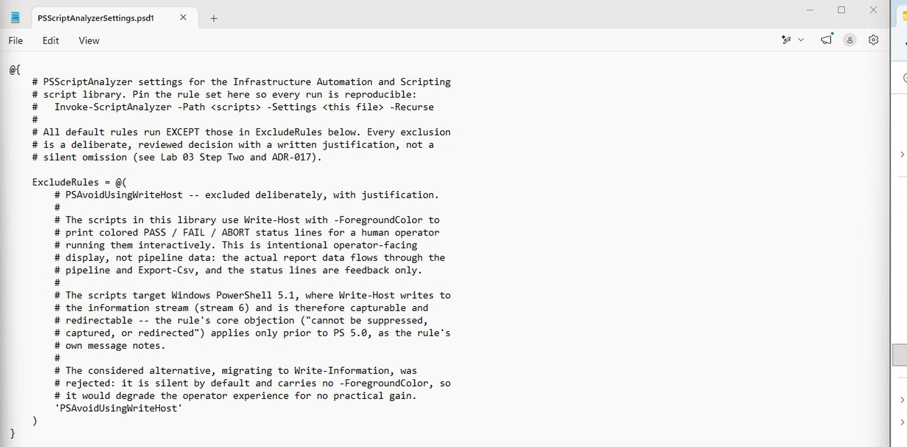
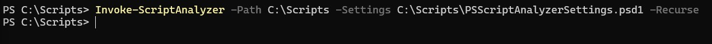
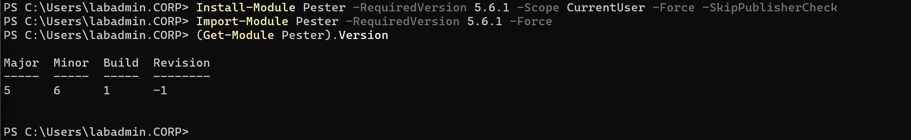
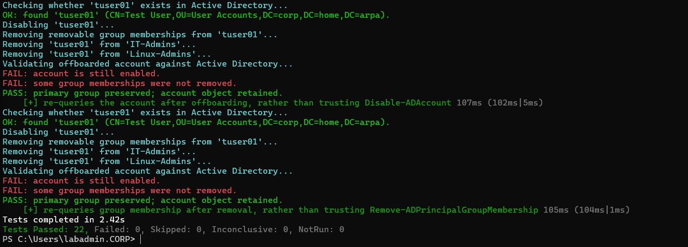
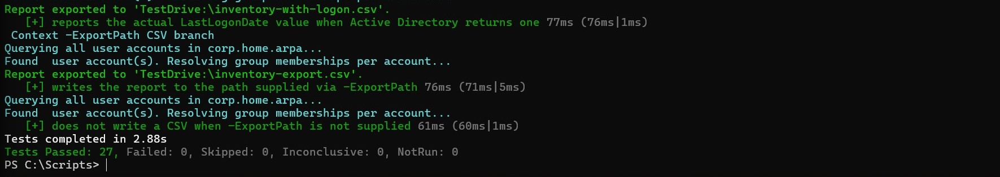
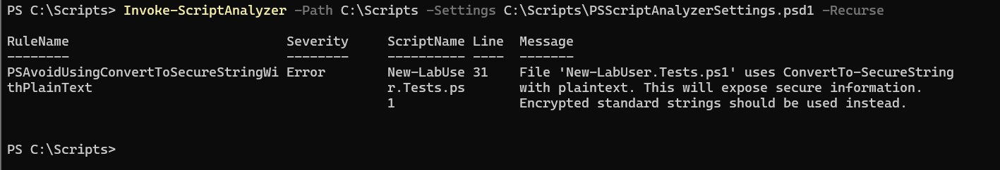
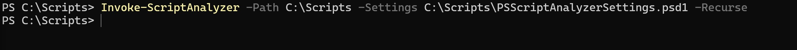
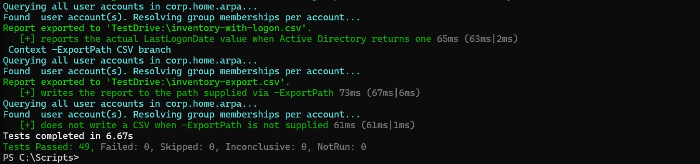

# 03 - Static Analysis and Unit Testing

## Status

Complete. The script library passes a documented `PSScriptAnalyzerSettings.psd1` standard with zero findings across all five production scripts and all five Pester test files, and carries 49 Pester unit tests (22 from Step Three, 27 from Step Four) asserting each script's decision logic against mocked Active Directory cmdlets, with no live domain contact required to run the suite. All five implementation steps are done.

Step One (install PSScriptAnalyzer and baseline the script library), Step Two (resolve `PSAvoidUsingWriteHost` and bring the library to a clean pass), Step Three (install Pester and test the Lab 01 scripts), Step Four (test the Lab 02 scripts), and Step Five (run the full combined suite and document coverage) are complete. This document is written in past tense throughout, describing what was actually performed and observed. The decision to adopt this tooling and to place it here in the sequence is recorded in [ADR-017](../architecture/decisions/017-adopt-powershell-static-analysis-and-unit-testing.md).

---

## Overview

This lab hardens the automation layer the track has produced so far, rather than adding another administrative workflow to it. Labs 01 and 02 produced five PowerShell scripts, each validated once by running it against the live `corp.home.arpa` environment and cross-checking its output against an independent Active Directory query. That validation proves each script works, but it is manual, performed once per lab, and not repeatable without re-running the whole lab against a live domain.

This lab introduces the two quality tools that are standard in professional PowerShell work but so far absent from the track: PSScriptAnalyzer for static analysis and Pester for unit testing. It applies both to the existing script library and establishes them as the standard every later lab is written against. Consistent with ADR-015, it introduces no new infrastructure. It is also the first lab in the track that does not touch DC01 at runtime: static analysis reads the script files, and the Pester tests replace the Active Directory cmdlets with mocks, so the whole suite runs on the workstation without a live domain.

---

## Objectives

The primary goals of this lab are to:

- run PSScriptAnalyzer across every script in `infrastructure/automation-and-scripting/` and bring the library to a clean pass against an agreed, documented rule set
- decide, and document the reasoning for, how to handle the `PSAvoidUsingWriteHost` rule, which flags the colored PASS/FAIL status output every script in the library currently relies on
- author Pester unit tests that assert each script's decision logic (pre-flight validation, OU and group placement, the partial-success batch model, primary-group exclusion, and the query-back validation pattern) using mocked Active Directory cmdlets, so the tests run without a live domain
- capture the agreed analyzer rule set and the test suite in the repository so both are reproducible and become the standard the later labs (04 through 06) are written against
- document explicitly which behaviors are covered by these mocked tests and which remain covered only by the live-environment validation in Labs 01 and 02, so the boundary between unit-tested logic and live-validated behavior is clear rather than implied

---

## Project Context

The automation track has, to this point, grown its script library faster than its quality tooling. Five scripts exist (`New-LabUser.ps1`, `Remove-LabUser.ps1`, `Add-LabGroupMembers.ps1`, `Get-LabOUReport.ps1`, `Get-LabAccountInventory.ps1`), each documented and validated to a high standard, but that validation is entirely manual and entirely dependent on a live domain. There is no linting pass that catches a bad construct before a script runs, and no repeatable test that would catch a regression in a reused pattern. Lab 02 already reused `Remove-LabUser.ps1`'s primary-group exclusion logic; the reporting labs still to come will reuse the console-table convention. A regression in one of those shared patterns would, today, only surface by manually re-running a lab.

ADR-017 records the decision to close that gap by adopting PSScriptAnalyzer and Pester, and to do it now, as the next lab, rather than after the remaining administrative labs. The reasoning is sequencing: the library is still small enough that retrofitting five scripts is cheap, and establishing the standard before Labs 04 through 06 are written means those labs are authored against it from the start and gain test coverage as they are built, instead of accumulating an untested backlog to retrofit later. This lab is the implementation of that decision.

It also fills a gap in the track's demonstrated skill set. A track whose entire subject is automation quality that relied only on manual validation would be conspicuously missing the two tools any professional PowerShell practice uses to enforce that quality automatically.

---

## Design Decisions

### Mocked unit tests, not live-integration tests, for the repeatable suite

**Decision:** The Pester tests will replace the Active Directory cmdlets each script calls (`Get-ADUser`, `Get-ADGroup`, `New-ADUser`, `Add-ADGroupMember`, `Get-ADGroupMember`, `Get-ADPrincipalGroupMembership`, `Get-ADOrganizationalUnit`, `Get-ADComputer`) with Pester mocks, so the suite asserts each script's decision logic without contacting DC01.

The value of these scripts is in their decision logic, the pre-flight checks, the partial-success batch handling, the primary-group exclusion, and the query-back validation, and that logic can be exercised deterministically with mocked cmdlets returning controlled results, including the error and empty-result cases that are awkward to produce against a live domain on demand. Mocking also makes the suite fast, repeatable, and safe to run without a domain or credentials. The tradeoff is that mocked tests validate logic against test doubles, not live Active Directory behavior; they do not replace the live cross-checks Labs 01 and 02 already performed, and this lab will state that boundary explicitly rather than implying the mocked tests prove live behavior.

### Handle PSAvoidUsingWriteHost deliberately, and document the choice

**Decision:** The lab will make an explicit, documented decision about the `PSAvoidUsingWriteHost` rule rather than silently suppressing it or silently letting it fail.

Every script in the library uses `Write-Host` with `-ForegroundColor` to print colored PASS, FAIL, and ABORT status lines. PSScriptAnalyzer flags this with `PSAvoidUsingWriteHost` (a Warning, always enabled) because `Write-Host` writes to the host rather than the pipeline; the rule's built-in exception for `Show`-verb functions does not apply, since these are `New-`, `Remove-`, `Add-`, and `Get-` scripts. There are two defensible resolutions, and the lab will choose one and record why: suppress the rule for these scripts with a documented justification (the colored status output is intentional console-facing display, not pipeline data), or migrate the status output to `Write-Information`, which is available in PowerShell 5.1, is analyzer-clean, and remains visible at the console while behaving better in a pipeline. The migration is the cleaner long-term path but changes output behavior slightly; the suppression is lower-effort but leaves a rule turned off. This is the central implementation decision of the lab and will be resolved in Step Two against the analyzer's actual output.

### Capture the agreed rule set in a settings file

**Decision:** The agreed PSScriptAnalyzer rule set will be captured in a `PSScriptAnalyzerSettings.psd1` committed to the repository, rather than relying on whichever default rules a given machine happens to run.

Pinning the rule set makes the standard explicit and reproducible: anyone running `Invoke-ScriptAnalyzer -Settings <file>` against the library gets the same result, and any deviation from the analyzer's defaults (for example, a decision on the `PSAvoidUsingWriteHost` rule above) is visible in one reviewed file rather than buried in per-run parameters.

### On-demand execution, no CI pipeline yet

**Decision:** The analyzer and the Pester suite will be run on demand from WIN11-CLIENT01, not wired into a continuous integration pipeline in this lab.

ADR-017 deferred standing up CI as a larger step than the track currently needs, and named it a future reassessment trigger once the mocked tests and analyzer settings exist. This lab produces exactly those artifacts. Automating their execution on push is left as the natural follow-on once they are in place, rather than introducing build infrastructure in the same lab that first creates the tests.

### Script and folder naming

**Decision:** Pester tests will follow the framework's `*.Tests.ps1` naming convention, and the analyzer settings and test files will live in the repository alongside the script library under `infrastructure/automation-and-scripting/`, with the exact layout (a shared `tests/` subfolder versus per-script colocation) settled in Step Three.

---

## Technologies Used

- PowerShell 5.1 (run from WIN11-CLIENT01, per ADR-016, though no live domain is required for this lab)
- PSScriptAnalyzer: `Invoke-ScriptAnalyzer` for static analysis, installed from the PowerShell Gallery
- Pester 5.6.1, pinned via `-RequiredVersion` rather than whatever version the Gallery resolves by default: `Invoke-Pester` with `Describe`, `Context`, `It`, `Should`, and `Mock` for unit testing with mocked cmdlets
- `PSScriptAnalyzerSettings.psd1` to pin the agreed rule set
- The existing script library from Labs 01 and 02 (`New-LabUser.ps1`, `Remove-LabUser.ps1`, `Add-LabGroupMembers.ps1`, `Get-LabOUReport.ps1`, `Get-LabAccountInventory.ps1`)

---

## Architecture or Topology

```text
WIN11-CLIENT01 (PowerShell, PSScriptAnalyzer + Pester)
        |
        |  Invoke-ScriptAnalyzer -Settings PSScriptAnalyzerSettings.psd1
        |      --> static analysis over infrastructure/automation-and-scripting/*.ps1
        |
        |  Invoke-Pester
        |      --> *.Tests.ps1, with Active Directory cmdlets replaced by Mock
        v
  No DC01 contact at runtime: the AD cmdlets are mocked, so static
  analysis and the unit tests run entirely on the workstation.

  Live-environment behavior (real AD writes, SSSD/PAM SSH access)
  remains covered by the manual validation in Labs 01 and 02, not by
  this suite. This lab documents that boundary rather than blurring it.
```

Unlike every prior lab in the track, this lab does not query or modify DC01 when it runs. That is a deliberate property of unit testing with mocks, and it is what makes the suite safe to run repeatedly.

---

## Prerequisites

- Lab 01 (`New-LabUser.ps1`, `Remove-LabUser.ps1`) and Lab 02 (`Add-LabGroupMembers.ps1`, `Get-LabOUReport.ps1`, `Get-LabAccountInventory.ps1`) complete; the five scripts exist in `infrastructure/automation-and-scripting/`
- PSScriptAnalyzer and Pester installable on WIN11-CLIENT01 from the PowerShell Gallery (`Install-Module`), or available for offline install
- [ADR-017](../architecture/decisions/017-adopt-powershell-static-analysis-and-unit-testing.md), which establishes this tooling and this lab's place in the track sequence
- WIN11-CLIENT01 as the execution endpoint per [ADR-016](../architecture/decisions/016-run-automation-scripts-from-domain-joined-client.md); note that, uniquely for this lab, no live domain connection is required to run the suite

---

## Implementation

### Step One - Install PSScriptAnalyzer and Baseline the Library

PSScriptAnalyzer was installed on WIN11-CLIENT01 with `Install-Module -Name PSScriptAnalyzer -Scope CurrentUser`. The install prompted twice before completing: once for PowerShellGet to install and import the NuGet provider it needs to talk to Gallery-based repositories, and once to confirm installing from PSGallery, which is untrusted by default. Both prompts were accepted.

```powershell
Install-Module -Name PSScriptAnalyzer -Scope CurrentUser
```

Module availability was then verified:

```powershell
Get-Module -Name PSScriptAnalyzer -ListAvailable
```

This confirmed PSScriptAnalyzer 1.25.0 installed under the `CurrentUser` scope (`C:\Users\labadmin.CORP\Documents\WindowsPowerShell\Modules`), exporting `Get-ScriptAnalyzerRule`, `Invoke-ScriptAnalyzer`, and `Invoke-Formatter`.

<p align="center">
  
</p>

<p align="center">
  <em>Install-Module -Name PSScriptAnalyzer -Scope CurrentUser completing after accepting the NuGet provider and untrusted-repository prompts, followed by Get-Module -Name PSScriptAnalyzer -ListAvailable confirming version 1.25.0 installed under the CurrentUser scope.</em>
</p>

#### Baseline Scan

```powershell
Invoke-ScriptAnalyzer -Path C:\Scripts -Recurse
```

<p align="center">
  
</p>

<p align="center">
  <em>Invoke-ScriptAnalyzer -Path C:\Scripts -Recurse baseline output, showing PSAvoidUsingWriteHost findings against Add-LabGroupMembers.ps1.</em>
</p>

The baseline returned findings for a single rule, `PSAvoidUsingWriteHost` (Warning severity, always enabled), across all five scripts: 52 findings total, and no findings from any other rule.

| Script | Findings | Lines |
|---|---|---|
| `New-LabUser.ps1` | 19 | 39, 43, 47, 50, 58, 73, 78, 82, 86, 93, 96, 101, 104, 109, 112, 118, 121, 126, 129 |
| `Remove-LabUser.ps1` | 15 | 20, 24, 27, 31, 36, 40, 46, 51, 58, 61, 66, 71, 74, 80, 83 |
| `Add-LabGroupMembers.ps1` | 12 | 28, 33, 37, 46, 53, 57, 71, 74, 79, 83, 91, 94 |
| `Get-LabAccountInventory.ps1` | 3 | 30, 35, 58 |
| `Get-LabOUReport.ps1` | 3 | 25, 29, 47 |

This confirms the Design Decisions section's prediction that `PSAvoidUsingWriteHost` would fire on every script, and establishes that it is the only rule the baseline surfaces, no unapproved-verb, alias, or uninitialized-variable findings, or anything else, fired against any of the five scripts. The `PSAvoidUsingWriteHost` decision described in Design Decisions is the only finding Step Two has to resolve to bring the library to a clean pass.

### Step Two - Settle the Rule Set and Resolve Findings

The `PSAvoidUsingWriteHost` decision described in Design Decisions was resolved in favor of a documented suppression, not a migration to `Write-Information`. The colored PASS/FAIL/ABORT status lines are intentional console-facing display, not pipeline data; the scripts' actual report data flows through the pipeline and `Export-Csv`, and the status lines are feedback only. The scripts target Windows PowerShell 5.1, where `Write-Host` writes to the information stream (stream 6) and is therefore capturable and redirectable, so the rule's core objection, that `Write-Host` output "cannot be suppressed, captured, or redirected," applies only prior to PS 5.0, per the rule's own message. Migrating to `Write-Information` was considered and rejected: it is silent by default (requires `-InformationAction Continue` or `$InformationPreference = 'Continue'`) and carries no `-ForegroundColor`, which would degrade the console experience for no practical gain.

The agreed rule set was captured in `PSScriptAnalyzerSettings.psd1`, committed to the repository at `infrastructure/automation-and-scripting/`. It excludes only `PSAvoidUsingWriteHost`, with the reasoning above recorded as a comment directly in the file; every other default PSScriptAnalyzer rule remains active.

```powershell
@{
    ExcludeRules = @(
        'PSAvoidUsingWriteHost'
    )
}
```

A copy was placed in `C:\Scripts` on WIN11-CLIENT01 so it could be used with the live scan.

<p align="center">
  
</p>

<p align="center">
  <em>PSScriptAnalyzerSettings.psd1, with the PSAvoidUsingWriteHost exclusion and its written justification, placed in C:\Scripts alongside the script library.</em>
</p>

The library was re-scanned against the pinned settings file:

```powershell
Invoke-ScriptAnalyzer -Path C:\Scripts -Settings C:\Scripts\PSScriptAnalyzerSettings.psd1 -Recurse
```

<p align="center">
  
</p>

<p align="center">
  <em>Invoke-ScriptAnalyzer re-run with -Settings pointed at PSScriptAnalyzerSettings.psd1, returning to the prompt with no output: a clean pass across all five scripts.</em>
</p>

The command returned no output, confirming a clean pass: with `PSAvoidUsingWriteHost` excluded, zero findings remain against any of the five scripts under the pinned rule set. This resolves the lab's central design decision and gives the library a clean, reproducible baseline to build the Pester suite against in Steps Three and Four.

### Step Three - Install Pester and Test the Lab 01 Scripts

Pester was installed pinned to a specific version, 5.6.1, rather than whatever version the Gallery resolves by default:

```powershell
Install-Module Pester -RequiredVersion 5.6.1 -Scope CurrentUser -Force -SkipPublisherCheck
Import-Module Pester -RequiredVersion 5.6.1 -Force
(Get-Module Pester).Version
```

`(Get-Module Pester).Version` confirmed `5.6.1.0` imported. Pinning mattered here specifically because this suite leans on `-ParameterFilter` scriptblocks and the `$PesterBoundParameters` variable Pester defines inside them (see below); reproducing the suite on another machine depends on that same major version being present, not on whichever version `Install-Module` would otherwise resolve.

<p align="center">
  
</p>

<p align="center">
  <em>Install-Module Pester -RequiredVersion 5.6.1, Import-Module Pester -RequiredVersion 5.6.1 -Force, and (Get-Module Pester).Version confirming 5.6.1.0 imported.</em>
</p>

With Pester in place, the `*.Tests.ps1` layout question left open in Design Decisions was settled in favor of colocation over a shared `tests/` subfolder: `New-LabUser.Tests.ps1` and `Remove-LabUser.Tests.ps1` were placed directly in `infrastructure/automation-and-scripting/user-lifecycle-automation/`, next to the scripts they test. Pester's discovery is recursive regardless of layout, so the choice does not affect whether `Invoke-Pester` finds the tests; colocation was chosen so a script and the suite that exercises it are visible together in the same folder rather than split across two trees.

#### Proving the Harness Before Expanding

Rather than writing the full suite for both scripts at once, a single smoke test was written first, for `New-LabUser.ps1` only: `Get-ADUser` mocked to throw `Microsoft.ActiveDirectory.Management.ADIdentityNotFoundException` (simulating no existing account), the script invoked with test parameters, and the test asserting only that the script did not throw and that `New-ADUser` was called once.

The first run of that smoke test failed, not because the script misbehaved, but because the mock itself was miswired. `New-LabUser.ps1` calls `Get-ADUser` twice: once as a pre-flight check with no `-Properties`, and once for post-creation validation with `-Properties Enabled, DistinguishedName`. The test tried to give each call different mocked behavior by branching each mock's `-ParameterFilter` on `$PSBoundParameters.ContainsKey('Properties')`, and both mocks matched the same call. Reading Pester 5.6.1's own source (`src/functions/Mock.ps1`) established why: a `-ParameterFilter` scriptblock does not receive `$PSBoundParameters` for the call being matched; Pester defines a separate `$PesterBoundParameters` variable for that purpose. Switching both `ParameterFilter`s to `$PesterBoundParameters` fixed the smoke test, which then passed with `New-ADUser` confirmed called exactly once, and that pattern was used consistently for every `ParameterFilter` and `Should -Invoke -ParameterFilter` written afterward.

#### Expanding to the Full Suite

With the harness proven, each script's entire Active Directory cmdlet surface was mocked, not just the calls central to a given test: `New-LabUser.Tests.ps1` mocks `Get-ADUser` (both call shapes), `New-ADUser`, `Add-ADGroupMember`, and `Get-ADPrincipalGroupMembership`; `Remove-LabUser.Tests.ps1` mocks `Get-ADUser`, `Disable-ADAccount`, `Get-ADPrincipalGroupMembership`, and `Remove-ADPrincipalGroupMembership`. An unmocked cmdlet anywhere on the success path could either crash the test or, worse, execute for real against a live domain.

Two further mocking issues surfaced while expanding the suite, both stemming from the same cause: Pester's mock proxy preserves the real cmdlet's parameter types, so a plain string the script passes is coerced into a typed Active Directory object at bind time, not left as a string.

- `Add-ADGroupMember`'s `-Identity` and `-Members` are typed `ADGroup` and `ADPrincipal[]` on the real cmdlet. `Should -Invoke -ParameterFilter` checks comparing `$PesterBoundParameters['Identity']` directly against a string always failed, even though the calls were happening, because the bound value was an `ADGroup` object, not a string. Wrapping the comparison in `"$($PesterBoundParameters['Identity'])"` to force `.ToString()` resolved it; a temporary diagnostic mock that logged the bound value's type and string form to a file confirmed the object's `.ToString()` reliably reproduces the identity string it was constructed from.
- `Remove-ADPrincipalGroupMembership`'s `-MemberOf` is typed `ADPrincipal`. The `Get-ADPrincipalGroupMembership` mock initially returned fabricated `PSCustomObject` values, and binding those to `-MemberOf` failed outright ("the adapter cannot set the value of property"), since a `PSCustomObject` does not go through the same identity-type conversion a plain string does. Casting the group's distinguished name to a real `ADPrincipal` instance first, then adding `DistinguishedName`/`Name` note properties for the script's own filtering and narration to read, produced an object that bound without error. A second, related issue followed: those note-property overrides did not survive parameter binding, because the value actually bound to `-MemberOf` is a freshly reconstructed object built from the identity string, not the specific instance the mock returned. `.ToString()` on the bound value did reliably reproduce the full distinguished name, so `Should -Invoke -ParameterFilter` checks against `-MemberOf` compare against `"$($PesterBoundParameters['MemberOf'])"` rather than a property on the bound object.

A smaller issue affected the pre-flight negative tests for `Remove-LabUser.ps1`: `Should -Invoke -Times 0` against `Disable-ADAccount` and `Remove-ADPrincipalGroupMembership` threw `Could not find Mock for command ... in script scope` until those two commands had at least a default `Mock` registered somewhere in scope. Pester requires a registered mock to exist for a command before `Should -Invoke` can assert anything about it, including that it was never called; both mocks were moved to the `Describe`-level `BeforeEach` shared by every test in the file.

#### Result

Both suites were run from WIN11-CLIENT01 against the synced copies in `C:\Scripts`, and the repository copies were kept in sync with each iteration.

| Test file | Tests | Result |
|---|---|---|
| `New-LabUser.Tests.ps1` | 12 | 12 passed, 0 failed |
| `Remove-LabUser.Tests.ps1` | 10 | 10 passed, 0 failed |
| **Total** | **22** | **22 passed, 0 failed** |

```powershell
Invoke-Pester -Path C:\Scripts\New-LabUser.Tests.ps1, C:\Scripts\Remove-LabUser.Tests.ps1 -Output Detailed
```

<p align="center">
  
</p>

<p align="center">
  <em>Tail of the combined run against both test files: Tests Passed: 22, Failed: 0, Skipped: 0, Inconclusive: 0, NotRun: 0.</em>
</p>

Each suite asserts its script's decision logic, not which PASS/FAIL line the script prints for a given result: the pre-flight duplicate/not-found/error branches, the parameters passed to `New-ADUser`, role-group and `Linux-Admins` assignment, primary-group exclusion during removal, and that both scripts re-query Active Directory after writing rather than trusting the write cmdlets' own success. `Write-Host` was not mocked, per this lab's testing approach, so the scripts' colored narration prints during every test run; which specific PASS/FAIL line each query-back branch selects remains covered only by the live-environment validation in Lab 01, not by this suite.

### Step Four - Test the Lab 02 Scripts

Following the colocation convention Step Three settled on, `Add-LabGroupMembers.Tests.ps1`, `Get-LabOUReport.Tests.ps1`, and `Get-LabAccountInventory.Tests.ps1` were placed directly in `infrastructure/automation-and-scripting/group-and-ou-administration/`, next to the three Lab 02 scripts they test.

#### Extending the Mocking Patterns to the Lab 02 Cmdlet Surface

Each script's Active Directory cmdlet surface was mocked in full, the same discipline Step Three established: `Add-LabGroupMembers.Tests.ps1` mocks `Get-ADGroup`, `Get-ADUser`, `Add-ADGroupMember`, and `Get-ADGroupMember`; `Get-LabOUReport.Tests.ps1` mocks `Get-ADOrganizationalUnit`, `Get-ADUser`, and `Get-ADComputer`; `Get-LabAccountInventory.Tests.ps1` mocks `Get-ADUser` and `Get-ADPrincipalGroupMembership`. The AD-type-coercion pattern Step Three proved against `Add-ADGroupMember`'s `-Identity`/`-Members` and `Remove-ADPrincipalGroupMembership`'s `-MemberOf` extended cleanly to the new cmdlets this step introduced: `Get-ADGroup`'s `-Identity`, `Get-ADUser`'s `-Identity`, and `Get-ADGroupMember`'s `-Identity` are all typed the same way on the real cmdlets, so every `ParameterFilter` and `Should -Invoke -ParameterFilter` against those parameters compares `"$($PesterBoundParameters['Identity'])"` rather than the bound value directly, consistent with Step Three's finding.

`Get-LabOUReport.ps1` and `Get-LabAccountInventory.ps1` are read-only, unlike every script tested in Step Three, so neither suite has a write cmdlet of its own to assert against. Instead, each suite mocks a representative sample of the write cmdlets used elsewhere in the library (`New-ADUser`, `Set-ADUser`, `Add-ADGroupMember`, `Remove-ADPrincipalGroupMembership`, `Disable-ADAccount`) and asserts all five at `-Times 0`, so the "this script makes no writes" claim is actually exercised rather than assumed.

#### New Ground: CSV Input and Output via TestDrive:

`Add-LabGroupMembers.ps1` is the first script in the library driven by a CSV file rather than parameters directly, so its tests needed a way to supply CSV input without touching the real filesystem. Pester's `TestDrive:`, a temporary location Pester creates for the test run and cleans up automatically, was used for this: each test that needs a CSV writes one to `TestDrive:\members-<guid>.csv` and passes that path to `-CsvPath`. `Import-Csv` itself was left unmocked, since it is a built-in cmdlet operating on a real file, not an Active Directory cmdlet.

`Get-LabOUReport.ps1` and `Get-LabAccountInventory.ps1` both build a `$report` variable internally but never return it to the caller, only piping it to `Format-Table` and, conditionally, `Export-Csv`. With no return value to capture, the `-ExportPath` branch (and, for `Get-LabOUReport.ps1`, the zero-count case) was asserted by always supplying `-ExportPath` pointed at a `TestDrive:` path and reading the resulting CSV back with `Import-Csv`, rather than trying to capture the console-formatted `Format-Table` output the scripts do not return.

#### Troubleshooting: A Single-Row Import-Csv Collection Gotcha

The first run of the full suite against the synced copies in `C:\Scripts` returned 25 passed, 2 failed, both failures in tests that read a CSV back with exactly one data row (`Get-LabOUReport.Tests.ps1`'s zero-count case and `Get-LabAccountInventory.Tests.ps1`'s primary-group-exclusion test), both failing the same assertion, `$csv.Count | Should -Be 1`, with `$csv.Count` evaluating to `$null` instead of `1`.

The cause was a Windows PowerShell 5.1 behavior, not a defect in either script under test: when `Import-Csv` reads a file with exactly one data row, PowerShell assigns that single `PSCustomObject` directly to the variable rather than wrapping it in a one-element array, so `.Count` on it silently returns `$null` rather than throwing. The same run's output showed the identical underlying behavior surfacing cosmetically, and harmlessly, elsewhere: `Add-LabGroupMembers.ps1`'s own `Write-Host` narration printed "OK: CSV imported with  row(s)." and `Get-LabOUReport.ps1`'s printed "Found  OU(s)." with a blank count, whenever a mock or CSV produced exactly one row internally to those scripts, for the identical reason. Neither is a script defect; both scripts wrote and processed correct data. This is a property of how PowerShell 5.1 unwraps single-item collections on assignment, and it was never asserted on directly since these suites don't test `Write-Host` text.

The fix was confined to the tests: every `Import-Csv` read-back of an exported report was wrapped in `@(...)` to force it to stay an array regardless of row count (for example, `$csv = @(Import-Csv -Path $exportPath)`), applied consistently across all four such read-backs in the two suites, not just the two that had failed, so a future single-row case does not silently break the same way. Re-running the suite after that change returned a clean pass.

#### Result

All three suites were run from WIN11-CLIENT01 against the synced copies in `C:\Scripts`, with the repository copies kept in sync with each iteration.

| Test file | Tests | Result |
|---|---|---|
| `Add-LabGroupMembers.Tests.ps1` | 13 | 13 passed, 0 failed |
| `Get-LabOUReport.Tests.ps1` | 7 | 7 passed, 0 failed |
| `Get-LabAccountInventory.Tests.ps1` | 7 | 7 passed, 0 failed |
| **Total** | **27** | **27 passed, 0 failed** |

```powershell
Invoke-Pester -Path C:\Scripts\Add-LabGroupMembers.Tests.ps1, C:\Scripts\Get-LabOUReport.Tests.ps1, C:\Scripts\Get-LabAccountInventory.Tests.ps1 -Output Detailed
```

<p align="center">
  
</p>

<p align="center">
  <em>Tail of the combined run against all three Step Four test files: Tests Passed: 27, Failed: 0, Skipped: 0, Inconclusive: 0, NotRun: 0.</em>
</p>

Each suite asserts its script's decision logic, not which PASS/FAIL line the script prints for a given result: `Add-LabGroupMembers.ps1`'s CSV header validation, group-existence check, and partial-success member validation; both read-only scripts' absence of any Active Directory write; `Get-LabOUReport.ps1`'s `-SearchScope OneLevel` counting and zero-count case; and `Get-LabAccountInventory.ps1`'s primary-group exclusion and blank-`LastLogonDate` preservation. As with the Step Three suites, `Write-Host` was not mocked, so each script's colored narration prints during every test run; which specific PASS/FAIL line a given query-back or validation branch selects remains covered only by the live-environment validation in Lab 02, not by this suite.

### Step Five - Run the Full Suite and Document Coverage

With the library and its test suite fully in place, the combined check was run against `C:\Scripts` in full: every `.ps1` and `.Tests.ps1` file the directory now contained, which for the first time in this lab included the two Step Three test files and the three Step Four test files alongside the five production scripts.

```powershell
Invoke-ScriptAnalyzer -Path C:\Scripts -Settings C:\Scripts\PSScriptAnalyzerSettings.psd1 -Recurse
```

This first full-library run was not the clean pass Steps One and Two had already established for the five production scripts. It returned one finding, at Error severity, against a file the earlier baseline had never scanned, because that file did not exist yet when Step Two's clean rescan was performed:

| RuleName | Severity | ScriptName | Line | Message |
|---|---|---|---|---|
| `PSAvoidUsingConvertToSecureStringWithPlainText` | Error | `New-LabUser.Tests.ps1` | 31 | Uses `ConvertTo-SecureString` with plaintext. This will expose secure information. Encrypted standard strings should be used instead. |

<p align="center">
  
</p>

<p align="center">
  <em>Invoke-ScriptAnalyzer run against the full contents of C:\Scripts for the first time, returning one Error-severity PSAvoidUsingConvertToSecureStringWithPlainText finding against New-LabUser.Tests.ps1, line 31.</em>
</p>

The finding was accurate: `New-LabUser.Tests.ps1`'s `BeforeAll` block built the `[SecureString]` that `New-LabUser.ps1`'s mandatory password parameter requires with `ConvertTo-SecureString 'P@ssw0rd123!' -AsPlainText -Force`, a literal password embedded directly in source, exactly the pattern the rule exists to catch. The value itself was never actually used for anything: `New-ADUser` is mocked in every test in this suite, so the plaintext string was decoration needed only to satisfy a parameter's type, not a credential guarding anything. The fix reflected that: line 31 was changed to `[System.Security.SecureString]::new()`, an empty `SecureString` with no plaintext value anywhere in the file, which satisfies the mandatory `[SecureString]` parameter identically for a script whose tests never inspect the password's actual value. The Pester suite was re-run after the change and confirmed all 49 tests still passed, unaffected by the substitution.

The analyzer was then re-run against the corrected library:

```powershell
Invoke-ScriptAnalyzer -Path C:\Scripts -Settings C:\Scripts\PSScriptAnalyzerSettings.psd1 -Recurse
```

<p align="center">
  
</p>

<p align="center">
  <em>Invoke-ScriptAnalyzer re-run against the full contents of C:\Scripts after the fix, returning to the prompt with no output: a clean pass across all five production scripts and all five test files.</em>
</p>

The command returned no output: with the finding resolved, the full contents of `C:\Scripts`, five production scripts and five test files, pass the pinned rule set cleanly. This is a broader clean pass than Step Two's, which only ever scanned the five production scripts because the test files did not yet exist at that point in the lab.

With the analyzer clean, the full combined test suite was run in a single invocation:

```powershell
Invoke-Pester -Path C:\Scripts\New-LabUser.Tests.ps1, C:\Scripts\Remove-LabUser.Tests.ps1, C:\Scripts\Add-LabGroupMembers.Tests.ps1, C:\Scripts\Get-LabOUReport.Tests.ps1, C:\Scripts\Get-LabAccountInventory.Tests.ps1 -Output Detailed
```

<p align="center">
  
</p>

<p align="center">
  <em>Tail of the combined run across all five test files: Tests Passed: 49, Failed: 0, Skipped: 0, Inconclusive: 0, NotRun: 0.</em>
</p>

All 49 tests passed: the 22 from Step Three (`New-LabUser.Tests.ps1`, `Remove-LabUser.Tests.ps1`) and the 27 from Step Four (`Add-LabGroupMembers.Tests.ps1`, `Get-LabOUReport.Tests.ps1`, `Get-LabAccountInventory.Tests.ps1`), run together in one invocation for the first time rather than as two separate per-lab runs.

#### Coverage Boundary

Steps Three and Four each noted, script by script, that the mocked suite does not assert which specific PASS/FAIL narration line a script prints for a given result, since `Write-Host` is never mocked. Stated once, completely, for the library as a whole, this is the boundary between what the 49 tests actually prove and what they do not.

The suite is a regression net for each script's decision logic: the pre-flight duplicate/not-found/error branches, the parameters passed to the write cmdlets (`New-ADUser`, `Add-ADGroupMember`, `Remove-ADPrincipalGroupMembership`, `Disable-ADAccount`), the CSV header and partial-success batch validation in `Add-LabGroupMembers.ps1`, the `-SearchScope OneLevel` filtering in `Get-LabOUReport.ps1`, and the query-back pattern every script uses to re-read Active Directory after a write rather than trusting a cmdlet's own reported success. It runs with no live domain: every Active Directory cmdlet is mocked, so the suite is safe and fast to run repeatedly without credentials or an available DC01.

It does not, and cannot, prove that a real Active Directory write actually takes effect against a live domain; that the real SSSD and PAM SSH access chain actually grants or denies a session, proven live in Lab 01; that a real Group Policy actually applies to a client, which is out of scope for this suite entirely; or which specific PASS/FAIL line a script prints for a given live result, since `Write-Host` output was deliberately left unmocked and unasserted throughout Steps Three and Four. Those remain covered only by the live-environment validation already performed in Labs 01 and 02, not by this suite, and this lab does not claim otherwise.

---

## Validation

- **PASS**: `Invoke-ScriptAnalyzer -Path C:\Scripts -Settings C:\Scripts\PSScriptAnalyzerSettings.psd1 -Recurse` against the full contents of `C:\Scripts` (five production scripts and five test files) initially returned one finding, `PSAvoidUsingConvertToSecureStringWithPlainText` (Error) against `New-LabUser.Tests.ps1` line 31 (Step Five)
- **PASS**: after the finding was resolved by replacing the plaintext `ConvertTo-SecureString` call with an empty `[System.Security.SecureString]::new()`, the same command was re-run and returned no output, confirming a clean pass across the full library (Step Five)
- **PASS**: `Invoke-Pester` run once against all five test files together (`New-LabUser.Tests.ps1`, `Remove-LabUser.Tests.ps1`, `Add-LabGroupMembers.Tests.ps1`, `Get-LabOUReport.Tests.ps1`, `Get-LabAccountInventory.Tests.ps1`) confirmed all 49 tests passing: 0 failed, 0 skipped, 0 inconclusive, 0 not run (Step Five)
- **PASS**: the fix to `New-LabUser.Tests.ps1` did not regress any test; the combined suite was confirmed still at 49/49 after the change, not just before it (Step Five)

Consistent with the rule established in Lab 01 and reaffirmed in Lab 02, neither result was trusted from a single run: the analyzer's clean pass was confirmed by re-running it after the fix rather than assuming the fix worked, and the combined Pester run was executed as one invocation across all five files rather than inferred from Steps Three and Four's separate 22 and 27 results.

---

## Troubleshooting and Adjustments

**The `PSAvoidUsingWriteHost` decision (Step Two).** Every script's colored PASS/FAIL/ABORT narration triggered this rule across all five production scripts, 52 findings in the baseline. The decision, recorded in Design Decisions and resolved in Step Two, was a documented suppression rather than a migration to `Write-Information`: the status lines are intentional console-facing display, not pipeline data, and Windows PowerShell 5.1's `Write-Host` writes to the capturable information stream rather than being genuinely unredirectable, which is the rule's actual objection. This remains the only rule excluded in `PSScriptAnalyzerSettings.psd1`.

**A full-library analyzer scan is not the same thing twice if the library has grown in between (Step Five).** Steps One and Two's baseline and clean-pass scans were run before any test file existed, so "clean pass" at that point meant clean against the five production scripts only. By Step Five, `C:\Scripts` also held five `.Tests.ps1` files, and a full recursive scan against the directory's actual current contents surfaced a finding the earlier baseline had no opportunity to catch: `PSAvoidUsingConvertToSecureStringWithPlainText` against `New-LabUser.Tests.ps1`, where the test's `BeforeAll` block built a `[SecureString]` from a literal plaintext password to satisfy `New-LabUser.ps1`'s mandatory password parameter. The value was never actually used, since `New-ADUser` is mocked in every test, so the fix was straightforward once identified: replace the plaintext conversion with `[System.Security.SecureString]::new()`, an empty `SecureString` that satisfies the parameter's type without embedding a plaintext string anywhere in the file. The Pester suite was re-run after the change and confirmed unaffected, still 49 passed, 0 failed. The finding was resolved, not suppressed: no exception was added to `PSScriptAnalyzerSettings.psd1` for it, and the settings file's only exclusion remains `PSAvoidUsingWriteHost`, from Step Two.

---

## Security Considerations

- **No live domain, no credentials.** Because the Pester tests mock the Active Directory cmdlets, the suite touches no live directory and needs no credentials or AD privileges to run. This is a deliberate departure from the other labs in the track, and it makes the suite safe to run repeatedly without any risk to the domain.
- **Static analysis is read-only.** `Invoke-ScriptAnalyzer` reads the script files and does not execute them or modify anything.
- **Suppressions are explicit and justified.** Any analyzer rule that is suppressed will carry a written justification in the settings file or the script, so a disabled rule is a reviewable decision rather than a silent omission, consistent with the track's habit of documenting reasoning rather than hiding it.

---

## Outcome

The lab meets every objective set out at the start. The library now carries a reproducible, committed static-analysis standard, `PSScriptAnalyzerSettings.psd1`, with a single documented exclusion for `PSAvoidUsingWriteHost` and every other default PSScriptAnalyzer rule active, against which `Invoke-ScriptAnalyzer -Path C:\Scripts -Settings C:\Scripts\PSScriptAnalyzerSettings.psd1 -Recurse` returns a clean pass, zero findings, across all five production scripts and all five test files. It also now carries 49 Pester unit tests across all five scripts, 22 from Step Three (`New-LabUser.ps1`, `Remove-LabUser.ps1`) and 27 from Step Four (`Add-LabGroupMembers.ps1`, `Get-LabOUReport.ps1`, `Get-LabAccountInventory.ps1`), every one of them built against mocked Active Directory cmdlets so the entire suite runs on WIN11-CLIENT01 without a live domain, credentials, or any risk to `corp.home.arpa`.

That suite complements, rather than replaces, the live-environment validation Labs 01 and 02 already performed. It gives the library something neither lab had before: a fast, repeatable, mock-based regression net for each script's decision logic, runnable on demand and safe to run as often as the library changes, while the proof that these scripts' effects actually hold against a real domain, and that AD group membership actually determines Linux SSH access through SSSD and PAM, remains exactly where Labs 01 and 02 already established it, in the live validation those labs performed, not reproduced or superseded here. Both categories of evidence, the mocked regression suite from this lab and the live cross-checks from Labs 01 and 02, now exist side by side, documented as covering different, complementary claims rather than the same one twice.

The lab also leaves the track with a standard rather than a one-time cleanup. `PSScriptAnalyzerSettings.psd1` and the `*.Tests.ps1` colocation convention Step Three established are now the pattern Labs 04 through 06 are expected to write against from the start, as ADR-017 intended, and Step Five's own finding, that a "clean pass" taken before the test suite existed did not describe the library once the tests were added, is itself a reason those later labs should be scanned in full as they are built rather than checked once and assumed still current.

---

## Lessons Learned

**A testing framework's mocking internals are not guaranteed stable across major versions, and pinning is the only way to depend on them safely.** Pester was installed with `-RequiredVersion 5.6.1` specifically, not left to whatever version `Install-Module` would otherwise resolve, because this suite's `-ParameterFilter` scriptblocks depend on `$PesterBoundParameters`, a mechanism specific to Pester 5's internals. Letting the Gallery resolve its default would have risked landing on Pester 6 instead, a major version with substantially reworked internals, with no guarantee that the same mock-parameter-binding mechanism this suite is built on behaves identically there. Pinning the major version was the only way to make the suite's reproducibility claim, that anyone running it gets the same result, actually true.

**`-ParameterFilter` scriptblocks receive `$PesterBoundParameters`, not `$PSBoundParameters`, and the two are easy to confuse.** The first smoke test written for this lab, a single mocked call against `New-LabUser.ps1`, failed on its first run because two `Get-ADUser` mocks were both written to branch on `$PSBoundParameters.ContainsKey('Properties')`, and both matched the same call regardless of which one the script actually made. Reading Pester 5.6.1's own source was what resolved it: Pester defines a separate `$PesterBoundParameters` for the call being matched inside a `-ParameterFilter`, while `$PSBoundParameters` inside that scriptblock refers to the test function's own parameters, not the mocked call's. Every `-ParameterFilter` and `Should -Invoke -ParameterFilter` written afterward, across all five test files, used `$PesterBoundParameters` consistently once this was established.

**A mock proxy preserves the real cmdlet's parameter types, so a plain string a script passes does not stay a string once it is bound.** `Add-ADGroupMember`'s `-Identity` and `-Members`, `Remove-ADPrincipalGroupMembership`'s `-MemberOf`, and later `Get-ADGroup`'s, `Get-ADUser`'s, and `Get-ADGroupMember`'s `-Identity` parameters are all typed as AD object classes on the real cmdlets, not strings, so a `Should -Invoke -ParameterFilter` comparing a bound value directly against a plain string failed silently, not because the call was not happening, but because the bound value had already been coerced into a typed object by the time the filter ran. Wrapping every such comparison in `"$($PesterBoundParameters['ParameterName'])"` to force `.ToString()` was the fix, applied consistently across every parameter of this shape in every test file from Step Three onward once the pattern was understood, rather than worked around case by case.

**Windows PowerShell 5.1 unwraps a single-row `Import-Csv` result instead of keeping it an array, and that is not a script defect when it happens.** Two Step Four tests failed on `$csv.Count | Should -Be 1` with `$csv.Count` evaluating to `$null`, both in cases where a CSV read back had exactly one data row. The cause was PowerShell 5.1 assigning a lone `PSCustomObject` directly to the variable rather than wrapping it in a one-element array, a behavior that also surfaced harmlessly in the scripts' own console narration (blank counts in messages like "Found  OU(s)") whenever the same single-row condition occurred internally. Neither script was wrong; the fix was confined entirely to the tests, wrapping every CSV read-back in `@(...)`, applied to all four such read-backs across both suites rather than just the two that had actually failed, so a future single-row case would not silently break the same way.

**Mocking only the cmdlets a test directly asserts against is not enough; the entire cmdlet surface a script can reach has to be mocked.** Every test file in this lab mocks every Active Directory cmdlet its script calls, not just the ones central to a given test, because an unmocked cmdlet anywhere on a success path could either crash the test outright or, worse, execute for real against the live domain. This discipline, established for `New-LabUser.Tests.ps1` and `Remove-LabUser.Tests.ps1` in Step Three, was extended without exception to all three Step Four suites, including the two read-only scripts, which mock a representative sample of write cmdlets specifically so their "makes no writes" claim is asserted rather than assumed.

**Proving a single smoke test before writing the full suite around it surfaces harness problems while they are still cheap to fix.** The `$PesterBoundParameters` issue above was found by a single, deliberately minimal smoke test for `New-LabUser.ps1`, written before any of the suite's other eleven tests. Finding and fixing the mocking approach's flaw at that scale, one test, one script, made every test written afterward, across all five files, correct on its first real run rather than requiring the same fix rediscovered five separate times.

**An assertion that a cmdlet was never called, `Should -Invoke -Times 0`, can only be trusted if a mock for that cmdlet actually exists in scope.** The pre-flight negative tests for `Remove-LabUser.ps1` initially threw `Could not find Mock for command ... in script scope` on their `-Times 0` assertions against `Disable-ADAccount` and `Remove-ADPrincipalGroupMembership`, because Pester requires a registered mock to exist before it can assert anything about a command's call count, including zero. Moving both mocks to the `Describe`-level `BeforeEach` fixed it, and the broader habit it reinforced was pairing a positive assertion, that the happy path actually calls the cmdlet, with a negative one, that the pre-flight-failure path does not, for every write cmdlet in the library, so a `-Times 0` check could never pass simply because nothing was mocked to check against in the first place.

**A standard has to be re-run against what the library actually contains now, not assumed clean from a baseline taken before the library grew.** Step Two's clean pass was real and correct at the time it was taken, but it only ever scanned the five production scripts, because the test files did not exist yet. Step Five's full recursive scan of `C:\Scripts`, run after the test suite existed, surfaced a genuine finding the Step Two baseline had no opportunity to catch: `New-LabUser.Tests.ps1` building a `SecureString` from a literal plaintext password to satisfy a mandatory parameter the mocked test never actually uses. The fix, an empty `SecureString` in place of the plaintext one, was small, but the lesson is not about that specific finding: a static-analysis standard covers what was scanned, not what was ever intended to be covered, and the library has to be re-scanned in full as it grows rather than trusting an earlier clean result to still describe its current contents.

---

## Sources

Research references consulted during the planning phase of this lab, together with the sources consulted directly during implementation and troubleshooting.

**PSScriptAnalyzer (Microsoft Learn)**

- [PSScriptAnalyzer overview](https://learn.microsoft.com/en-us/powershell/utility-modules/psscriptanalyzer/overview) - static code checker for PowerShell; installed with `Install-Module PSScriptAnalyzer` and run with `Invoke-ScriptAnalyzer`, the basis for this lab's static analysis step
- [AvoidUsingWriteHost rule](https://learn.microsoft.com/en-us/powershell/utility-modules/psscriptanalyzer/rules/avoidusingwritehost) - documents why `Write-Host` is flagged (it writes to the host, not the pipeline), the `Show`-verb exception (which does not apply to this library's scripts), and that the rule can be suppressed; the source of the central design decision in Step Two

**Pester (pester.dev)**

- [Pester quick start](https://pester.dev/docs/quick-start) - confirms the `*.Tests.ps1` convention and the `Describe`, `Context`, `It`, and `Should` keywords, and that tests run with `Invoke-Pester`; the basis for this lab's unit-testing steps
- [Pester mocking](https://pester.dev/docs/usage/mocking) - the `Mock` keyword used to replace the Active Directory cmdlets so the tests run without a live domain, the approach chosen in the Design Decisions section
- [Pester `Mock.ps1` source (GitHub)](https://github.com/pester/Pester/blob/main/src/functions/Mock.ps1) - confirms that a `-ParameterFilter` scriptblock receives `$PesterBoundParameters`, not `$PSBoundParameters`, for the call being matched; consulted directly in Step Three after `$PSBoundParameters`-based filters matched the wrong mocked behavior

**Repository reference**

- [ADR-017: Adopt PowerShell Static Analysis and Unit Testing](../architecture/decisions/017-adopt-powershell-static-analysis-and-unit-testing.md) - the decision that establishes this tooling and places this lab as Lab 03 in the track sequence
- [01 - User Lifecycle Automation](01-user-lifecycle-automation.md) and [02 - Group and OU Administration](02-group-and-ou-administration.md) - the labs whose scripts this lab retrofits with static analysis and tests
