# 04 - Group Policy Reporting and Audit

## Status

Complete. All three scripts (`Get-LabGPOInventory.ps1`, `Get-LabGPOLinkReport.ps1`, `Get-LabRSoPReport.ps1`) are implemented, PSScriptAnalyzer-clean against the pinned `PSScriptAnalyzerSettings.psd1`, and carry Pester tests: full decision-logic coverage for the two reporting scripts and the deliberately limited coverage the plan called for on the RSoP script. The combined script library and test suite, all eight production scripts and all eight test files across Labs 01 through 04, passes a full analyzer sweep with zero findings and 70/70 Pester tests. All five implementation steps are done, and all three reports were cross-checked against the Group Policy design documented in enterprise infrastructure Lab 05 and against independent `Get-GPO`, `Get-GPInheritance`, and `gpresult` queries, not trusted from their own output.

Step One (confirm the Group Policy module and capture the known-good baseline), Step Two (build and test `Get-LabGPOInventory.ps1`), Step Three (build and test `Get-LabGPOLinkReport.ps1`), Step Four (build and test `Get-LabRSoPReport.ps1`, including the live diagnostic that resolved this lab's open question), and Step Five (run all three live and validate against the baseline) are complete. This document is written in past tense throughout, describing what was actually performed and observed.

---

## Overview

This lab automates reporting and audit workflows for the Group Policy environment that the enterprise infrastructure track deployed in Lab 05 (Group Policy Lab). Where Lab 01 automated the user lifecycle and Lab 02 automated group and OU administration, this lab targets the third standing category of manual Active Directory work in the environment: answering "what Group Policy state currently exists, where is it linked, and what actually applies to a given user or computer" without walking the Group Policy Management Console by hand.

The lab produced three read-only PowerShell scripts: a Group Policy Object inventory, a per-OU link and inheritance report, and a Resultant Set of Policy (RSoP) report for the domain-joined client. Consistent with ADR-015, the lab introduced no new infrastructure. It reports on and audits the three GPOs, their OU links, and their security filtering that already existed and were validated once by hand in the enterprise infrastructure track, and it makes that reporting repeatable instead of a one-time manual `gpresult` exercise.

Because Lab 03 established the track's static analysis and unit testing standard immediately before this lab, these three scripts are the first in the track written under that standard from the outset rather than retrofitted with tests afterward.

---

## Objectives

The primary goals of this lab were to:

- enumerate every Group Policy Object in the domain with its status, creation and modification times, and configuration-side enablement, without opening the Group Policy Management Console
- report, per organizational unit, which GPOs are linked, whether each link is enabled and enforced, the order of precedence, and whether inheritance is blocked
- produce a Resultant Set of Policy report for WIN11-CLIENT01 that shows which GPOs actually apply to a specified user and computer, including any denied GPOs, rather than assuming the intended design is what is applied
- keep all three scripts read-only with respect to Group Policy: reporting and RSoP generation only, with no cmdlet capable of creating, linking, unlinking, or modifying a GPO anywhere in the lab
- reuse the reporting-output convention established in Lab 02 (formatted console table plus an optional `-ExportPath` CSV) wherever the data is tabular, so this lab extends an existing pattern rather than inventing a new one
- cross-check each report's output against the documented Group Policy design from enterprise infrastructure Lab 05, confirming the scripts report the real state rather than trusting their own output
- author all three scripts under the static analysis and unit testing standard established in Lab 03, so each ships PSScriptAnalyzer-clean and with Pester tests covering its decision logic, per [ADR-017](../architecture/decisions/017-adopt-powershell-static-analysis-and-unit-testing.md)

Every objective was met. The RSoP script's open question, whether `Get-GPResultantSetOfPolicy` requires a prior interactive session on the client, was resolved by a live diagnostic in Step Four rather than assumed, and that finding is built into the script's design and its error handling.

---

## Project Context

The enterprise infrastructure track built the Group Policy environment this lab reports on. Lab 05 (Group Policy Lab) created three purpose-built GPOs, linked each to a target OU, and validated them once, by hand, using `gpresult /r` and Resultant Set of Policy in both a `testuser01` and a `labadmin` session:

- `Workstation-Security-Baseline`, linked to `OU=Workstations`, User Configuration disabled, security filtering switched from `Authenticated Users` to `Lab-Workstations`
- `Standard-User-Environment`, linked to `OU=User Accounts`, Computer Configuration disabled
- `IT-Admin-Environment`, linked to `OU=IT`, Computer Configuration disabled

That validation was a single manual checkpoint. Nothing in the environment answered the same questions repeatably: which GPOs exist and what state they are in, where each is linked and in what precedence, and what actually resolves onto WIN11-CLIENT01 for a given user. Reproducing that meant opening the Group Policy Management Console and clicking through it, or re-running `gpresult` interactively per user. Both were exactly the manual overhead ADR-015 scoped this track to eliminate.

This lab also continues a pattern the track depends on. Lab 02 established the reporting shape this track expects later labs to reuse: a formatted console table by default, with an optional CSV export for point-in-time record keeping. This lab reuses that shape for its tabular reports and extends it to Group Policy, and Lab 06 (Scheduled Health Reporting) is expected to fold GPO and RSoP state into a scheduled report built on the same reporting precedent.

It is also the first administrative lab to follow Lab 03's testing standard from the outset. Where Labs 01 and 02 were proven by a single live run and were retrofitted with tests in Lab 03, this lab's scripts carried Pester tests of their decision logic from the moment each was written, so a later change to a reused pattern cannot silently break them without a test failing.

---

## Design Decisions

*(These decisions were made during planning and confirmed, without revision, during implementation. The RSoP logging-mode session question below was resolved by the live diagnostic in Step Four, not assumed, and the finding is recorded in Implementation and Troubleshooting and Adjustments.)*

### Three read-only scripts split by reporting concern

**Decision:** The lab produced three scripts, `Get-LabGPOInventory.ps1`, `Get-LabGPOLinkReport.ps1`, and `Get-LabRSoPReport.ps1`, each answering one distinct question (what GPOs exist, where they are linked, and what actually applies), rather than a single combined Group Policy report.

Group Policy state has three genuinely different shapes. GPO inventory is a flat per-object list. Link and inheritance data is per-OU and hierarchical. Resultant Set of Policy is per-user and per-computer and is sourced from the client, not the directory. Folding all three into one script would have produced output that is neither a clean table nor a clean RSoP report, and would have coupled a directory-side query to a client-side one. Splitting by concern kept each script's output coherent and matched the one-script-per-workflow granularity Lab 02 used for its three scripts.

### Reuse Lab 02's console-table-plus-optional-CSV convention for the tabular reports

**Decision:** `Get-LabGPOInventory.ps1` and `Get-LabGPOLinkReport.ps1` write a formatted table to the console by default and support an optional `-ExportPath` parameter that writes the same data to CSV via `Export-Csv`, exactly as Lab 02's reporting scripts do.

These two scripts report a state rather than validate a change, so the PASS/FAIL model from Lab 01 does not fit them, the same reasoning Lab 02 applied to `Get-LabOUReport.ps1` and `Get-LabAccountInventory.ps1`. Rather than reinvent an output convention, this lab reused the one Lab 02 already established and validated.

### Use native Group Policy report format for RSoP rather than a hand-built table

**Decision:** `Get-LabRSoPReport.ps1` generates its Resultant Set of Policy output using `Get-GPResultantSetOfPolicy`'s native `-ReportType Html` / `Xml` output rather than flattening RSoP into a console table.

Resultant Set of Policy data is hierarchical (per-GPO, per-setting, with applied and denied GPOs and winning-GPO precedence) and does not reduce cleanly to a flat table without losing the structure that makes it useful. The Group Policy module's own HTML and XML report format is the established representation for this data and is the same format the Group Policy Management Console produces. This one script deliberately departs from the console-table convention used by the other two, justified by the shape of the data rather than an inconsistency.

### RSoP in logging mode against the live client, not planning-mode modeling

**Decision:** The RSoP report uses logging mode against WIN11-CLIENT01 and a specified user, reporting what actually applied, and treats planning-mode "what-if" modeling as out of scope for this lab.

The goal of this lab was to confirm that the GPOs designed in enterprise Lab 05 actually resolve onto the real domain-joined client for real accounts, which is precisely what logging mode reports. `Get-GPResultantSetOfPolicy` supports only logging mode; planning-mode modeling requires the Group Policy Management Console and targets hypothetical scenarios rather than the live environment.

### Script and folder naming

**Decision:** The three scripts are named `Get-LabGPOInventory.ps1`, `Get-LabGPOLinkReport.ps1`, and `Get-LabRSoPReport.ps1`, stored under `infrastructure/automation-and-scripting/group-policy-reporting-and-audit/`, following the `Verb-LabNoun` naming pattern and per-lab subfolder convention Lab 01 and Lab 02 established.

---

## Technologies Used

- PowerShell 5.1 / Group Policy module (RSAT, run from WIN11-CLIENT01, per ADR-016)
- Group Policy cmdlets: `Get-GPO`, `Get-GPInheritance`, `Get-GPResultantSetOfPolicy`
- `gpresult.exe` (`/r` and `/h`) as an independent cross-check for the RSoP report during validation
- `Export-Csv` (PowerShell Utility module) for the tabular reports' optional CSV output
- PSScriptAnalyzer 1.25.0 and Pester 5.6.1, the standard established in Lab 03, applied to all three scripts from the outset
- Active Directory Domain Services (DC01) and AD-integrated DNS
- Existing OU structure: `OU=IT`, `OU=User Accounts`, `OU=Workstations`, `OU=Groups`, and the built-in `OU=Domain Controllers`
- Existing GPOs from enterprise Lab 05: `Workstation-Security-Baseline`, `Standard-User-Environment`, `IT-Admin-Environment`, alongside the built-in `Default Domain Policy` and `Default Domain Controllers Policy`

---

## Architecture or Topology

```text
WIN11-CLIENT01 (RSAT / PowerShell Group Policy module)
        |
        |  Get-LabGPOInventory.ps1     --> optional -ExportPath CSV
        |  Get-LabGPOLinkReport.ps1    --> optional -ExportPath CSV
        |  Get-LabRSoPReport.ps1       --> HTML / XML RSoP report
        |
        |  directory-side queries (GPOs, links, inheritance)
        v
     DC01 (Active Directory Domain Services, SYSVOL, GPOs)
        |
        | GPOs: Workstation-Security-Baseline (-> OU=Workstations, filtered to Lab-Workstations)
        |       Standard-User-Environment     (-> OU=User Accounts)
        |       IT-Admin-Environment          (-> OU=IT)
        v
  RSoP logging mode reads applied policy from the client itself:
  Get-LabRSoPReport.ps1 targets WIN11-CLIENT01 + a specified user,
  and requires an elevated session plus a prior interactive logon
  by that user on the client (confirmed live in Step Four)
        |
        v
  Validation: report contents cross-checked against the documented
  Lab 05 GPO design and against gpresult, not assumed from the script
```

The inventory and link reports are directory-side: they query GPO objects and OU links from DC01 through the Group Policy module, the same LDAP/Kerberos-backed remote cmdlet behavior used elsewhere in this track. The RSoP report is client-side: logging mode reads what actually applied on WIN11-CLIENT01 for a specified user, so that script targets the client itself rather than the directory. All three originate from WIN11-CLIENT01, consistent with ADR-016.

---

## Prerequisites

- DC01 running Active Directory Domain Services and AD-integrated DNS (Lab 03, enterprise infrastructure track)
- The three GPOs from enterprise Lab 05 deployed, linked, and previously validated: `Workstation-Security-Baseline` (linked to `OU=Workstations`, filtered to `Lab-Workstations`), `Standard-User-Environment` (linked to `OU=User Accounts`), and `IT-Admin-Environment` (linked to `OU=IT`)
- WIN11-CLIENT01 domain-joined with RSAT installed and the Group Policy PowerShell module available; required script execution endpoint per [ADR-016](../architecture/decisions/016-run-automation-scripts-from-domain-joined-client.md)
- Group Policy previously processed on WIN11-CLIENT01 for `testuser01` and `labadmin` (enterprise Lab 05), so logging-mode RSoP data exists on the client to report against
- An account with sufficient permissions to read GPO, link, and RSoP data (`labadmin`), run from an **elevated** PowerShell session (Run as Administrator) for the RSoP script, per the Step Four finding below
- PSScriptAnalyzer 1.25.0 and Pester 5.6.1, already installed on WIN11-CLIENT01 in Lab 03, and `PSScriptAnalyzerSettings.psd1` already committed to the repository

---

## Implementation

Per the standard Lab 03 established, each script built in the steps below was analyzed against the committed `PSScriptAnalyzerSettings.psd1` and accompanied by a colocated `*.Tests.ps1` running under Pester 5.6.1, covering whatever decision logic the script has. That analysis and test coverage was treated as part of building each script, alongside the live validation in Step Five, not as separate later work.

### Step One - Confirmed the Group Policy Module and Established the Known-Good Baseline

The Group Policy PowerShell module's availability on WIN11-CLIENT01 was confirmed first:

```powershell
Import-Module GroupPolicy
Get-Module GroupPolicy
```

This confirmed the `GroupPolicy` manifest module, version `1.0.0.0`, exporting `Backup-GPO`, `Copy-GPO`, `Get-GPInheritance`, `Get-GPO`, and the rest of the module's cmdlet surface.

The current Group Policy state was then captured by hand as the known-good baseline every report in this lab would later be checked against. This baseline was not invented for the lab: it is the design already documented in enterprise Lab 05.

```powershell
Get-GPO -All | Select-Object DisplayName, GpoStatus, CreationTime, ModificationTime | Format-Table -AutoSize
```

This returned five GPOs: `Workstation-Security-Baseline` (`UserSettingsDisabled`), `Default Domain Policy` (`AllSettingsEnabled`), `Default Domain Controllers Policy` (`AllSettingsEnabled`), `Standard-User-Environment` (`ComputerSettingsDisabled`), and `IT-Admin-Environment` (`ComputerSettingsDisabled`), matching the enterprise Lab 05 design exactly.

`Get-GPInheritance -Target` was then run against the three OUs the Lab 05 GPOs target, confirming each link and its effective inheritance:

```powershell
Get-GPInheritance -Target "OU=Workstations,DC=corp,DC=home,DC=arpa"
Get-GPInheritance -Target "OU=User Accounts,DC=corp,DC=home,DC=arpa"
Get-GPInheritance -Target "OU=IT,DC=corp,DC=home,DC=arpa"
```

Each OU's `GpoLinks` showed only its own directly linked GPO (`Workstation-Security-Baseline`, `Standard-User-Environment`, and `IT-Admin-Environment`, respectively), while `InheritedGpoLinks` showed that GPO plus `Default Domain Policy` inherited from the domain root, and `GpoInheritanceBlocked` reported `No` for all three, consistent with the Lab 05 design.

<p align="center">
  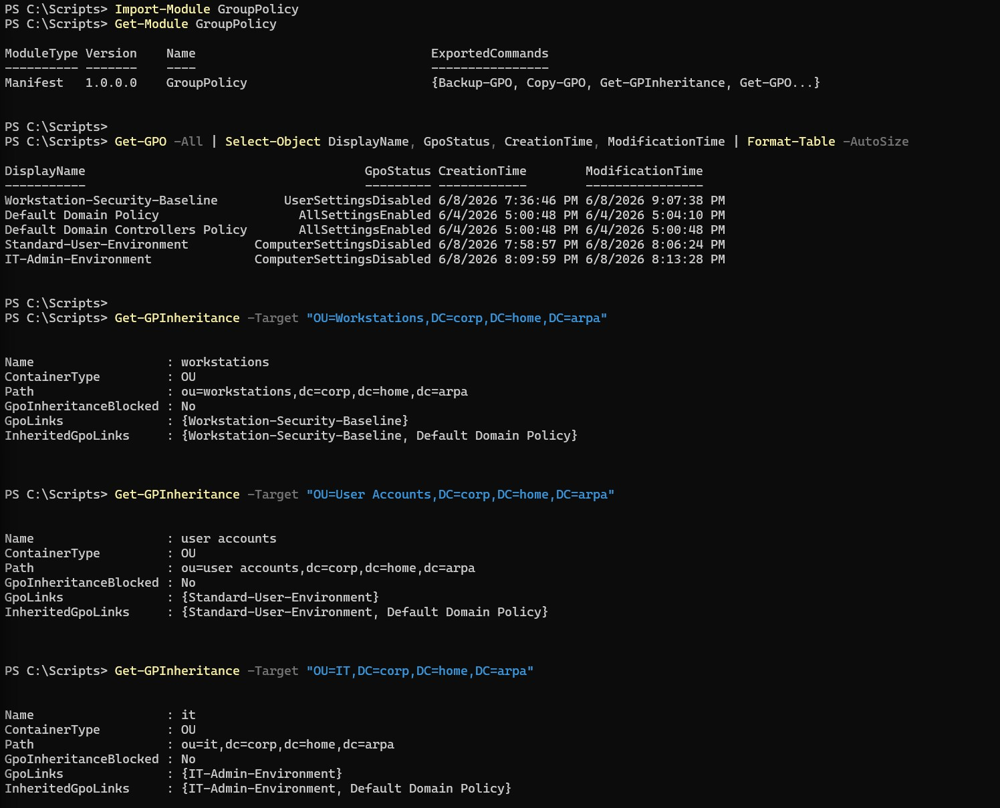
</p>

<p align="center">
  <em>Import-Module GroupPolicy and Get-Module GroupPolicy confirming the module, followed by Get-GPO -All showing the five-GPO baseline and three Get-GPInheritance calls confirming each Lab 05 GPO's link and inheritance state.</em>
</p>

### Step Two - Built Get-LabGPOInventory.ps1

`Get-LabGPOInventory.ps1` enumerates every GPO in the domain with `Get-GPO -All`, sorts by `DisplayName` for stable output (the same ordering approach `Get-LabOUReport.ps1` and `Get-LabAccountInventory.ps1` used), and reports `DisplayName`, `Id`, `GpoStatus`, `CreationTime`, and `ModificationTime`. It writes a formatted console table by default and supports an optional `-ExportPath` for CSV, reusing Lab 02's reporting convention.

```powershell
$gpos = Get-GPO -All | Sort-Object DisplayName

$report = foreach ($gpo in $gpos) {
    [PSCustomObject]@{
        DisplayName      = $gpo.DisplayName
        Id               = $gpo.Id
        GpoStatus        = $gpo.GpoStatus
        CreationTime     = $gpo.CreationTime
        ModificationTime = $gpo.ModificationTime
    }
}

$report | Format-Table -AutoSize

if ($ExportPath) {
    $report | Export-Csv -Path $ExportPath -NoTypeInformation
}
```

`Get-LabGPOInventory.Tests.ps1` was written alongside it, colocated in `infrastructure/automation-and-scripting/group-policy-reporting-and-audit/` per the Lab 03 convention. It mocks `Get-GPO`, the only Group Policy cmdlet the script calls, and a representative sample of the Group Policy write cmdlets (`New-GPO`, `New-GPLink`, `Set-GPLink`, `Set-GPInheritance`, `Set-GPPermission`), each asserted at `-Times 0`, matching the read-only assertion pattern `Get-LabOUReport.Tests.ps1` used against the Active Directory write cmdlet surface. Because the script never returns its `$report` variable to the caller, only piping it to `Format-Table` and, conditionally, `Export-Csv`, report content (sort order, field set) is asserted by always supplying `-ExportPath` and reading the CSV back from `TestDrive:`, wrapped in `@(...)` per the single-row `Import-Csv` collection behavior Lab 03 documented. Six tests were written across four Contexts: Read-only behavior, DisplayName sort order, Reported field set, and the `-ExportPath` CSV branch.

```powershell
Invoke-Pester -Path C:\Scripts\Get-LabGPOInventory.Tests.ps1 -Output Detailed
```

All six tests passed on the first run.

<p align="center">
  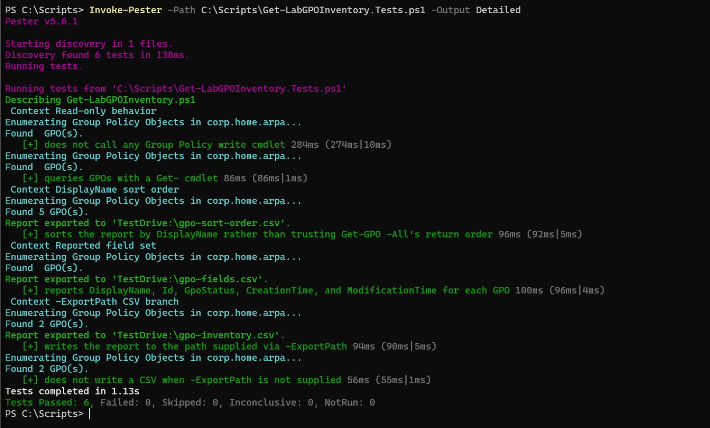
</p>

<p align="center">
  <em>Invoke-Pester against Get-LabGPOInventory.Tests.ps1: 6 tests discovered across four Contexts, all six passed.</em>
</p>

The script and its tests were then analyzed:

```powershell
Invoke-ScriptAnalyzer -Path C:\Scripts\Get-LabGPOInventory.ps1, C:\Scripts\Get-LabGPOInventory.Tests.ps1 -Settings C:\Scripts\PSScriptAnalyzerSettings.psd1
```

This failed with a parameter-binding error, `Cannot convert 'System.Object[]' to the type 'System.String' required by parameter 'Path'`, not a script defect but a binding quirk on this system's installed PSScriptAnalyzer version when multiple comma-separated string paths are passed to `-Path`.

<p align="center">
  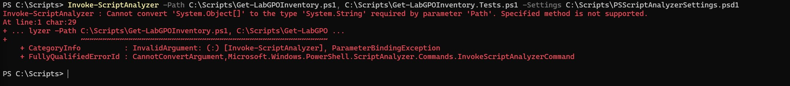
</p>

<p align="center">
  <em>Invoke-ScriptAnalyzer failing with a ParameterBindingException when given two comma-separated paths directly.</em>
</p>

The fix was to switch to the directory-plus-`-Recurse` form Lab 03 had already established as the working pattern:

```powershell
Invoke-ScriptAnalyzer -Path C:\Scripts -Settings C:\Scripts\PSScriptAnalyzerSettings.psd1 -Recurse
```

This returned no output: a clean pass.

<p align="center">
  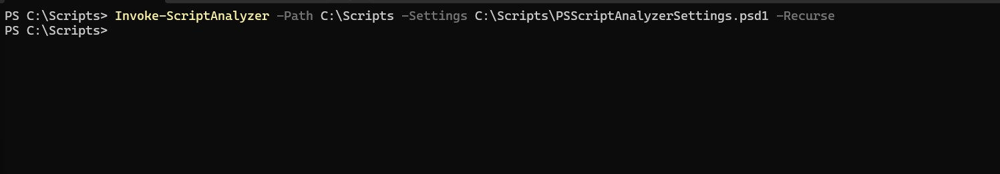
</p>

<p align="center">
  <em>Invoke-ScriptAnalyzer re-run with -Path C:\Scripts -Recurse, returning to the prompt with no output: a clean pass.</em>
</p>

### Step Three - Built Get-LabGPOLinkReport.ps1

`Get-LabGPOLinkReport.ps1` reports, per organizational unit, which GPOs are linked or inherited, their precedence order, enabled and enforced state, and whether inheritance is blocked. Every OU in the domain is enumerated with `Get-ADOrganizationalUnit -Filter *`, the same approach `Get-LabOUReport.ps1` uses, sorted by `Name` for stable output. For each OU, `Get-GPInheritance -Target <OU DN>` is queried once, and the report is flattened to one row per GPO in that OU's effective, precedence-ordered `InheritedGpoLinks` list, the full set of GPOs that actually apply there, rather than only the OU's own direct `GpoLinks`. `DirectlyLinked` distinguishes a GPO linked at that specific OU from one only present because it is inherited from further up the tree, by checking whether the same `DisplayName` also appears in the OU's own `GpoLinks` collection. An OU with no GPOs in its effective `InheritedGpoLinks` list contributes no rows to the report rather than a placeholder row.

```powershell
$ous = Get-ADOrganizationalUnit -Filter * | Sort-Object Name

$report = foreach ($ou in $ous) {
    $inheritance = Get-GPInheritance -Target $ou.DistinguishedName

    foreach ($link in $inheritance.InheritedGpoLinks) {
        $directlyLinked = [bool]($inheritance.GpoLinks | Where-Object { $_.DisplayName -eq $link.DisplayName })

        [PSCustomObject]@{
            OUName                = $ou.Name
            OUDistinguishedName   = $ou.DistinguishedName
            GpoDisplayName        = $link.DisplayName
            LinkOrder             = $link.Order
            DirectlyLinked        = $directlyLinked
            LinkEnabled           = $link.Enabled
            LinkEnforced          = $link.Enforced
            GpoInheritanceBlocked = $inheritance.GpoInheritanceBlocked
        }
    }
}
```

`Get-LabGPOLinkReport.Tests.ps1` mocks `Get-ADOrganizationalUnit` and `Get-GPInheritance`, plus the same representative sample of Group Policy write cmdlets asserted at `-Times 0`. Eight tests were written across six Contexts: Read-only behavior, Per-OU `Get-GPInheritance` targeting (asserting the cmdlet is called exactly once per OU, targeted at that OU's distinguished name), Directly-linked vs inherited-only distinction, `GpoInheritanceBlocked` and per-link Order/Enabled/Enforced, OU with no effective GPO links, and the `-ExportPath` CSV branch.

```powershell
Invoke-Pester -Path C:\Scripts\Get-LabGPOLinkReport.Tests.ps1 -Output Detailed
```

All eight tests passed.

<p align="center">
  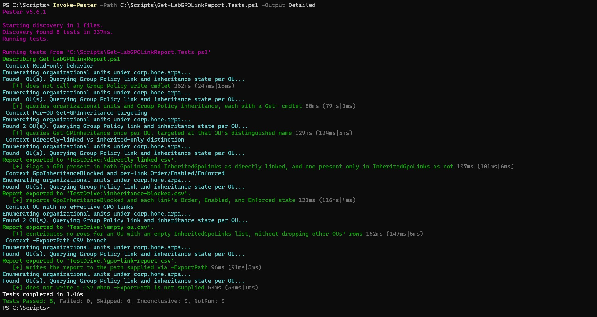
</p>

<p align="center">
  <em>Invoke-Pester against Get-LabGPOLinkReport.Tests.ps1: 8 tests discovered across six Contexts, all eight passed.</em>
</p>

Having hit the comma-path binding error in Step Two, the script and its test file were analyzed as two separate invocations this time rather than one comma-separated call, avoiding the same error:

```powershell
Invoke-ScriptAnalyzer -Path C:\Scripts\Get-LabGPOLinkReport.ps1 -Settings C:\Scripts\PSScriptAnalyzerSettings.psd1
Invoke-ScriptAnalyzer -Path C:\Scripts\Get-LabGPOLinkReport.Tests.ps1 -Settings C:\Scripts\PSScriptAnalyzerSettings.psd1
```

Both returned no output: a clean pass.

<p align="center">
  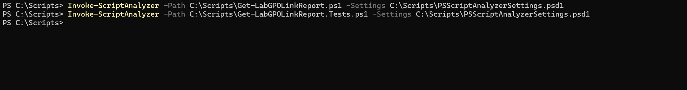
</p>

<p align="center">
  <em>Get-LabGPOLinkReport.ps1 and Get-LabGPOLinkReport.Tests.ps1 each analyzed separately, both returning to the prompt with no output.</em>
</p>

The initial test file modeled `GpoInheritanceBlocked` as a string (`'No'`/`'Yes'`), based on how the property displayed in Step One's raw `Get-GPInheritance` console output. This turned out to be a misreading of a default-format-view display, not the property's actual type, and the test file was corrected once the discrepancy surfaced during the Step Five cross-check; see Troubleshooting and Adjustments.

### Step Four - Built Get-LabRSoPReport.ps1

Before finalizing the script, this lab's open question, whether `Get-GPResultantSetOfPolicy` in logging mode requires the target user to have a prior interactive session on WIN11-CLIENT01, was investigated with a live diagnostic rather than assumed.

**Round one, non-elevated.** The cmdlet was run for three accounts from a standard (non-administrator) PowerShell session:

```powershell
Get-GPResultantSetOfPolicy -ReportType Html -Path "C:\Scripts\rsop-testuser01.html" -User "CORP\testuser01" -Computer "CORP\WIN11-CLIENT01"
Get-GPResultantSetOfPolicy -ReportType Html -Path "C:\Scripts\rsop-labadmin.html" -User "CORP\labadmin" -Computer "CORP\WIN11-CLIENT01"
Get-GPResultantSetOfPolicy -ReportType Html -Path "C:\Scripts\rsop-jsmith.html" -User "CORP\jsmith" -Computer "CORP\WIN11-CLIENT01"
gpresult /r
```

Every account failed, in two different ways: `testuser01` and `jsmith` (neither with a current session on the client) failed with a `NoLoggingData` `ArgumentException`, "there is no RSoP logging data for that user on that computer"; `labadmin`, despite being the currently logged-on user running the command, failed with a `COMException` at `HRESULT: 0x80041003` (`WBEM_E_ACCESS_DENIED`). `gpresult /r`, run without elevation, succeeded for `labadmin` and showed `IT-Admin-Environment` as the only applied user-side GPO, which was expected but did not explain why the PowerShell cmdlet had just failed for the same account.

<p align="center">
  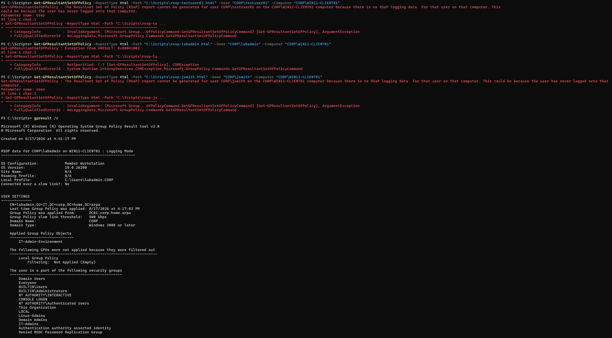
</p>

<p align="center">
  <em>Get-GPResultantSetOfPolicy failing non-elevated for testuser01 and jsmith (NoLoggingData ArgumentException) and for labadmin (COMException, HRESULT 0x80041003), followed by a successful non-elevated gpresult /r for labadmin.</em>
</p>

`gpresult /h`, run against the same non-elevated session, surfaced a separate, informational quirk: a report saved as `gpresult-testuser01.html` actually contained `CORP\labadmin`'s session data, because `gpresult /h` without an explicit `/USER` switch reports on the currently logged-on session, not an arbitrary named target user the way `Get-GPResultantSetOfPolicy -User` can.

<p align="center">
  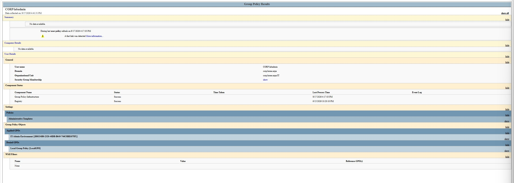
</p>

<p align="center">
  <em>A gpresult /h report saved as gpresult-testuser01.html, opened in the browser, showing CORP\labadmin's session data rather than testuser01's, because gpresult /h without /USER reports on the current session.</em>
</p>

The `labadmin` `COMException` pointed at a permissions problem rather than a missing-data problem, since `labadmin` was the account both running the command and being queried. Running the same session elevated (Run as Administrator) was the next thing tried, and it resolved both failure modes:

```powershell
Get-GPResultantSetOfPolicy -ReportType Html -Path "C:\Scripts\rsop-labadmin-elevated.html" -User "CORP\labadmin" -Computer "CORP\WIN11-CLIENT01"
Get-GPResultantSetOfPolicy -ReportType Html -Path "C:\Scripts\rsop-testuser01-elevated.html" -User "CORP\testuser01" -Computer "CORP\WIN11-CLIENT01"
```

Both succeeded, each returning `RsopMode: Logging` and `LoggingMode: UserAndComputer`: `labadmin` (the currently logged-on user) and `testuser01` (not currently logged on, but with a prior interactive session on the client from enterprise Lab 05).

<p align="center">
  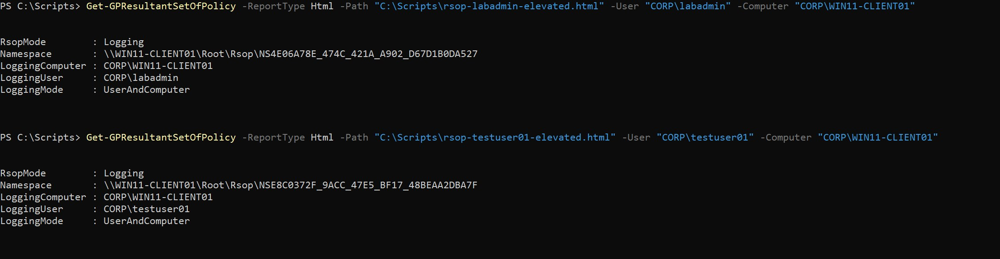
</p>

<p align="center">
  <em>Get-GPResultantSetOfPolicy succeeding elevated for both CORP\labadmin and CORP\testuser01, each returning RsopMode: Logging and LoggingMode: UserAndComputer.</em>
</p>

This confirmed the plan's original wording: the requirement is a **prior** interactive session, not a currently active one, but only once the session generating the report is itself elevated. `jsmith`, who has no session history at all on the client, was not independently retested elevated, since the non-elevated `NoLoggingData` failure had already isolated that specific case's cause to missing logging data rather than permissions, a distinct failure mode from `labadmin`'s access-denied error.

With the diagnostic resolved, `Get-LabRSoPReport.ps1` was written as a thin wrapper around `Get-GPResultantSetOfPolicy`, taking `-User`, `-Computer`, `-Path`, and an optional `-ReportType` (default `Html`), wrapped in a `try`/`catch` that reports a message pointing at both known causes (non-elevation, or no cached RSoP data for that user on that computer) rather than letting the cmdlet's raw exception surface:

```powershell
try {
    Get-GPResultantSetOfPolicy -ReportType $ReportType -Path $Path -User $User -Computer $Computer -ErrorAction Stop
    Write-Host "RSoP report written to '$Path'." -ForegroundColor Green
}
catch {
    Write-Host "FAIL: could not generate an RSoP report for '$User' on '$Computer' ($($_.Exception.Message))." -ForegroundColor Red
    Write-Host "This can happen if this session is not elevated (Run as Administrator), or if '$User' has no prior interactive session on '$Computer' with cached RSoP logging data. Use 'gpresult /r' or 'gpresult /h', run interactively as '$User', as a fallback." -ForegroundColor Yellow
}
```

Per the plan, this script's Pester coverage is deliberately limited: it is largely a thin wrapper with little decision logic of its own, so `Get-LabRSoPReport.Tests.ps1` asserts only the logic it does have (no Group Policy writes; that `-User`, `-Computer`, `-Path`, and `-ReportType` including its `Html` default pass through to `Get-GPResultantSetOfPolicy` unchanged; that a success does not throw; and that a failure is caught rather than propagated), not the report file's HTML/XML content, which is left to the live `gpresult` cross-check in Step Five. Seven tests were written across four Contexts.

```powershell
Invoke-Pester -Path C:\Scripts\Get-LabRSoPReport.Tests.ps1 -Output Detailed
```

The first run passed all seven tests, but the printed failure message in the "Failure handling" test read `Unable to find type [System.Management.Automation.ArgumentException].` instead of the intended `NoLoggingData`-style message. The test's mock threw `[System.Management.Automation.ArgumentException]`, a type name that does not exist; the real .NET type is `System.ArgumentException`. The test still nominally passed, since the script's own `try`/`catch` swallowed the type-resolution failure just as it would have swallowed the intended exception, but it was not exercising the scenario it claimed to.

<p align="center">
  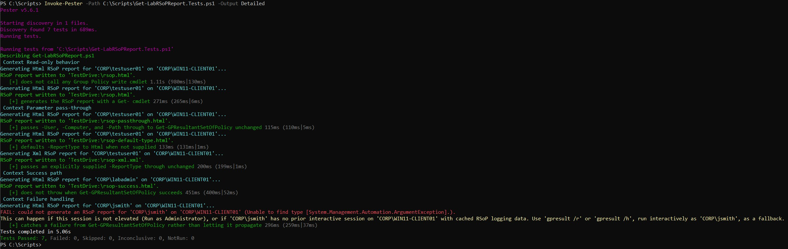
</p>

<p align="center">
  <em>Invoke-Pester against Get-LabRSoPReport.Tests.ps1: 7/7 passed, but the Failure handling test's printed message reads "Unable to find type [System.Management.Automation.ArgumentException]" instead of the intended NoLoggingData message.</em>
</p>

Analysis of both files was clean:

```powershell
Invoke-ScriptAnalyzer -Path C:\Scripts\Get-LabRSoPReport.ps1 -Settings C:\Scripts\PSScriptAnalyzerSettings.psd1
Invoke-ScriptAnalyzer -Path C:\Scripts\Get-LabRSoPReport.Tests.ps1 -Settings C:\Scripts\PSScriptAnalyzerSettings.psd1
```

<p align="center">
  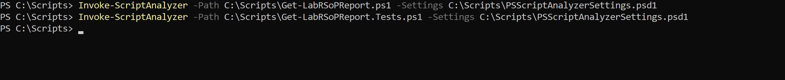
</p>

<p align="center">
  <em>Get-LabRSoPReport.ps1 and Get-LabRSoPReport.Tests.ps1 each analyzed separately, both returning to the prompt with no output.</em>
</p>

The mock's type name was corrected to `[System.ArgumentException]`, and the suite was re-run:

```powershell
Invoke-Pester -Path C:\Scripts\Get-LabRSoPReport.Tests.ps1 -Output Detailed
```

All seven tests passed again, this time with the "Failure handling" test's printed message reading the intended `NoLoggingData`-style text correctly.

<p align="center">
  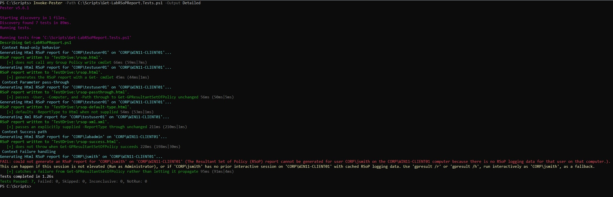
</p>

<p align="center">
  <em>Invoke-Pester re-run after correcting the mock's exception type: 7/7 passed, with the Failure handling test's message now reading the intended NoLoggingData text.</em>
</p>

### Step Five - Ran All Three Reports and Validated Against the Known Group Policy Design

All three scripts were run live from `C:\Scripts`, first without `-ExportPath` and then with it for the two tabular reports, and against both `testuser01` and `labadmin` for the RSoP report:

```powershell
.\Get-LabGPOInventory.ps1
.\Get-LabGPOInventory.ps1 -ExportPath "C:\Scripts\gpo-inventory.csv"
.\Get-LabGPOLinkReport.ps1
.\Get-LabGPOLinkReport.ps1 -ExportPath "C:\Scripts\gpo-link-report.csv"
.\Get-LabRSoPReport.ps1 -User "CORP\testuser01" -Computer "CORP\WIN11-CLIENT01" -Path "C:\Scripts\rsop-testuser01-final.html"
.\Get-LabRSoPReport.ps1 -User "CORP\labadmin" -Computer "CORP\WIN11-CLIENT01" -Path "C:\Scripts\rsop-labadmin-final.html"
```

`Get-LabGPOInventory.ps1` reported the same five GPOs found in the Step One baseline. `Get-LabGPOLinkReport.ps1` reported five OUs and nine rows total: `Domain Controllers` (`Default Domain Controllers Policy` directly linked, `Default Domain Policy` inherited), `Groups` (`Default Domain Policy` inherited only, no GPO of its own), `IT` (`IT-Admin-Environment` directly linked, `Default Domain Policy` inherited), `User Accounts` (`Standard-User-Environment` directly linked, `Default Domain Policy` inherited), and `Workstations` (`Workstation-Security-Baseline` directly linked, `Default Domain Policy` inherited), matching the Lab 05 design exactly. Both RSoP reports were generated successfully (this session was run elevated, per the Step Four finding).

<p align="center">
  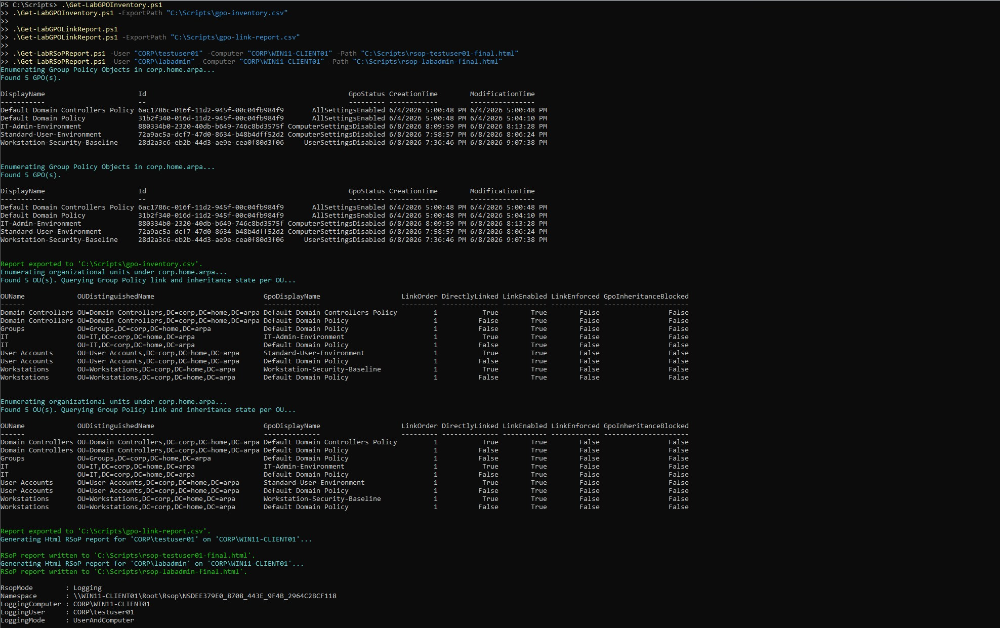
</p>

<p align="center">
  <em>All three scripts run live: Get-LabGPOInventory.ps1 and Get-LabGPOLinkReport.ps1 each run twice (console and -ExportPath), and Get-LabRSoPReport.ps1 run for both testuser01 and labadmin, all succeeding.</em>
</p>

Each report was then cross-checked against an independent query run outside of any script, per the plan's independent-verification approach. The GPO inventory was checked against a standalone `Get-GPO -All`:

```powershell
Get-GPO -All | Select-Object DisplayName, GpoStatus, CreationTime, ModificationTime | Sort-Object DisplayName
```

This matched `Get-LabGPOInventory.ps1`'s output exactly.

<p align="center">
  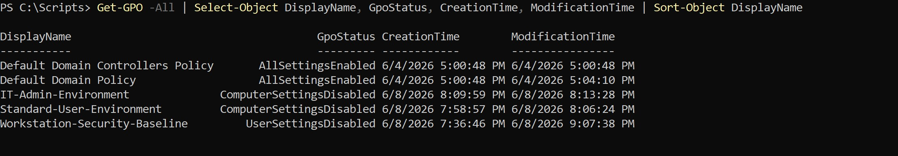
</p>

<p align="center">
  <em>An independent Get-GPO -All | Select-Object ... | Sort-Object DisplayName, matching Get-LabGPOInventory.ps1's reported output exactly.</em>
</p>

The link report was checked against standalone `Get-GPInheritance` calls for the same three Lab 05 OUs used in the Step One baseline:

```powershell
Get-GPInheritance -Target "OU=Workstations,DC=corp,DC=home,DC=arpa"
Get-GPInheritance -Target "OU=User Accounts,DC=corp,DC=home,DC=arpa"
Get-GPInheritance -Target "OU=IT,DC=corp,DC=home,DC=arpa"
```

These matched `Get-LabGPOLinkReport.ps1`'s output for those three OUs exactly.

<p align="center">
  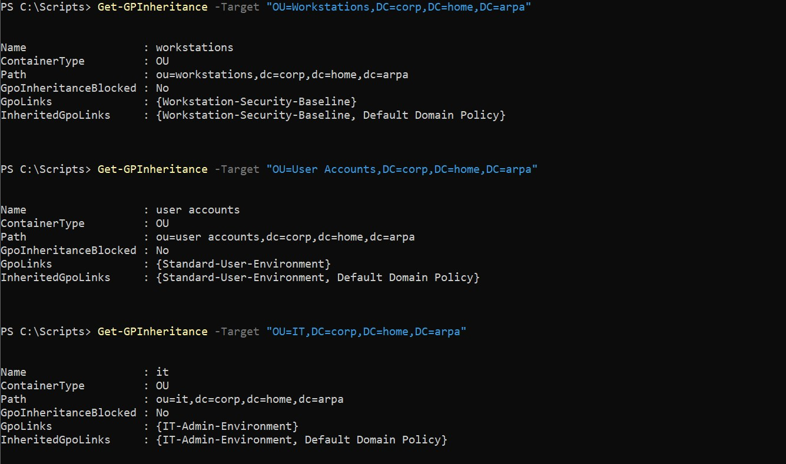
</p>

<p align="center">
  <em>Independent Get-GPInheritance calls for the Workstations, User Accounts, and IT OUs, matching Get-LabGPOLinkReport.ps1's reported links and inheritance exactly.</em>
</p>

Finally, an elevated `gpresult /r`, run on WIN11-CLIENT01 itself, cross-checked both the RSoP report and the `Workstation-Security-Baseline` security filtering from enterprise Lab 05:

```powershell
gpresult /r
```

The computer-side section confirmed `Workstation-Security-Baseline` and `Default Domain Policy` as the applied GPOs for the computer, with `Lab-Workstations` listed among the computer's security groups, confirming the security-filtered GPO still applies to the filtered group. The user-side section confirmed `IT-Admin-Environment` applied for `labadmin`, matching `Get-LabRSoPReport.ps1`'s output.

<p align="center">
  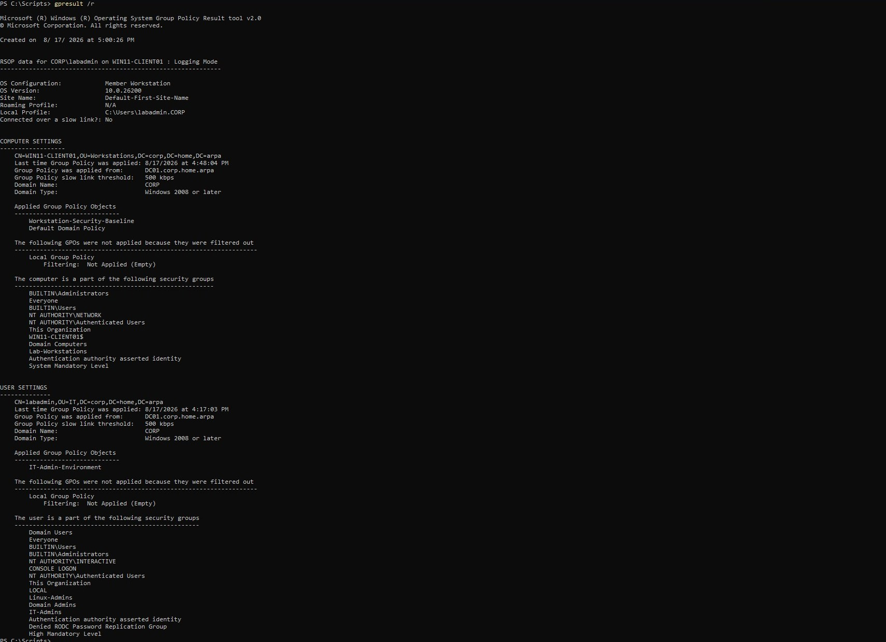
</p>

<p align="center">
  <em>An elevated gpresult /r on WIN11-CLIENT01, showing Workstation-Security-Baseline and Default Domain Policy applied to the computer (with Lab-Workstations among its security groups) and IT-Admin-Environment applied to labadmin, matching the scripts' reported output.</em>
</p>

With all three scripts individually validated, the full combined analyzer and Pester sweep was run against the entire script library, all eight production scripts and eight test files across Labs 01 through 04:

```powershell
Invoke-ScriptAnalyzer -Path C:\Scripts -Settings C:\Scripts\PSScriptAnalyzerSettings.psd1 -Recurse
Invoke-Pester -Path C:\Scripts\New-LabUser.Tests.ps1, C:\Scripts\Remove-LabUser.Tests.ps1, C:\Scripts\Add-LabGroupMembers.Tests.ps1, C:\Scripts\Get-LabOUReport.Tests.ps1, C:\Scripts\Get-LabAccountInventory.Tests.ps1, C:\Scripts\Get-LabGPOInventory.Tests.ps1, C:\Scripts\Get-LabGPOLinkReport.Tests.ps1, C:\Scripts\Get-LabRSoPReport.Tests.ps1 -Output Detailed
```

The analyzer returned no output: a clean pass across the full library. Pester discovered 70 tests across the eight files (the 49 from Labs 01 through 03 plus 21 new: 6 from `Get-LabGPOInventory.Tests.ps1`, 8 from `Get-LabGPOLinkReport.Tests.ps1`, and 7 from `Get-LabRSoPReport.Tests.ps1`), and all 70 passed.

<p align="center">
  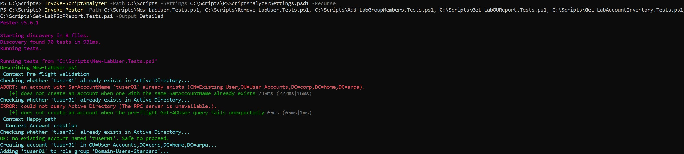
</p>

<p align="center">
  <em>The combined analyzer sweep (no output, clean) and the start of the combined Pester run: discovery finding 70 tests across 8 files.</em>
</p>

<p align="center">
  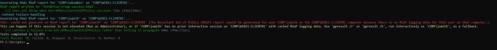
</p>

<p align="center">
  <em>Tail of the combined run: Tests Passed: 70, Failed: 0, Skipped: 0, Inconclusive: 0, NotRun: 0.</em>
</p>

---

## Validation

- **PASS**: `Import-Module GroupPolicy` and `Get-Module GroupPolicy` confirmed the module available on WIN11-CLIENT01 (Step One)
- **PASS**: the Step One baseline (`Get-GPO -All`, three `Get-GPInheritance` calls) matched the enterprise Lab 05 design exactly: five GPOs, each of the three purpose-built GPOs linked to its intended OU with `Default Domain Policy` inherited from the root (Step One)
- **PASS**: `Get-LabGPOInventory.Tests.ps1`, 6/6 tests passed; `Get-LabGPOInventory.ps1` and its test file returned a clean `Invoke-ScriptAnalyzer` pass once the comma-path binding issue was worked around (Step Two)
- **PASS**: `Get-LabGPOLinkReport.Tests.ps1`, 8/8 tests passed; both files analyzed separately, both clean (Step Three)
- **PASS**: the RSoP session-requirement diagnostic confirmed that `Get-GPResultantSetOfPolicy` in logging mode requires both an elevated session and a prior (not necessarily current) interactive logon by the target user on the client; non-elevated attempts failed for every account tested, elevated attempts succeeded for both a currently logged-on user (`labadmin`) and a previously-but-not-currently logged-on user (`testuser01`) (Step Four)
- **PASS**: `Get-LabRSoPReport.Tests.ps1`, 7/7 tests passed after correcting the mock's exception type from the non-existent `[System.Management.Automation.ArgumentException]` to the real `[System.ArgumentException]`; both files analyzed separately, both clean (Step Four)
- **PASS**: all three scripts run live matched their respective independent cross-checks exactly: the inventory against a standalone `Get-GPO -All`, the link report against standalone `Get-GPInheritance` calls for the three Lab 05 OUs, and the RSoP reports against an elevated `gpresult /r`, which also independently confirmed the `Workstation-Security-Baseline` security filtering to `Lab-Workstations` still in effect (Step Five)
- **PASS**: the full combined suite, all eight production scripts and eight test files across Labs 01 through 04, returned a clean `Invoke-ScriptAnalyzer -Recurse` pass and 70/70 Pester tests passed in a single combined `Invoke-Pester` invocation (Step Five)

Consistent with the rule established in Lab 01 and reaffirmed in Labs 02 and 03, no script's output was trusted from a single run or from its own success message alone: every report was checked against an independent query or an independent tool (`gpresult`) run outside of the script itself.

---

## Troubleshooting and Adjustments

**The comma-separated `-Path` binding error (Step Two).** `Invoke-ScriptAnalyzer -Path C:\Scripts\Get-LabGPOInventory.ps1, C:\Scripts\Get-LabGPOInventory.Tests.ps1 -Settings ...` failed with `Cannot convert 'System.Object[]' to the type 'System.String' required by parameter 'Path'`. This was not a defect in either script; it was a parameter-binding quirk on this system's installed PSScriptAnalyzer version when multiple comma-separated string paths are passed to `-Path`. The fix was to switch to the directory-plus-`-Recurse` form Lab 03 had already established (`Invoke-ScriptAnalyzer -Path C:\Scripts -Settings ... -Recurse`), which this lab then used, or ran each file as a separate invocation, for every subsequent analyzer check in Steps Three and Four to avoid the same error.

**The RSoP logging-mode session requirement (Step Four, the plan's stated open question).** Resolved by live diagnostic, not assumed. Non-elevated sessions failed for every user tested, in two distinct ways: a `NoLoggingData` `ArgumentException` for users without current cached logging data (`testuser01`, `jsmith`), and a `COMException` at `HRESULT 0x80041003` (`WBEM_E_ACCESS_DENIED`) for the self-querying current session (`labadmin`), which pointed at a permissions cause rather than a missing-data cause since `labadmin` was both the caller and the target. Retesting from an elevated PowerShell session resolved both failure modes: `labadmin` (the current session) and `testuser01` (a prior-but-not-current session from enterprise Lab 05) both succeeded elevated, confirming the plan's original hypothesis, that a prior session suffices, once elevation is also satisfied. `jsmith`, who has no session history at all on the client, was not independently retested elevated, since the non-elevated failure had already isolated that case to missing logging data rather than permissions. This finding is built directly into `Get-LabRSoPReport.ps1`'s `try`/`catch` message and into this document's Prerequisites and Architecture sections.

**`GpoInheritanceBlocked` is a boolean, not the string it appeared to be from console display (Step Three, surfaced during the Step Five cross-check).** `Get-LabGPOLinkReport.Tests.ps1`'s mocks and its description comment originally modeled `GpoInheritanceBlocked` as a string (`'No'`/`'Yes'`), based on how the property displayed in Step One's raw `Get-GPInheritance` console output. The Step Five live cross-check showed the property render as `False`, not `No`, when `Get-LabGPOLinkReport.ps1` itself outputs it via `Format-Table`/`Export-Csv`. This was not a script defect; the script passes the value through unmodified. The `No` seen in Step One's output was PowerShell's default format view for the `GPInheritance` type dressing up the underlying boolean for direct console display, not the literal value the property holds. The test file's mock parameter type was corrected from `[string]` to `[bool]`, the one test asserting `'Yes'`/`'No'` was updated to assert `$true`/`'True'` instead, and the file's description comment was rewritten to describe the finding accurately.

**A wrong .NET exception type name in a test mock did not fail the test it was meant to validate (Step Four).** `Get-LabRSoPReport.Tests.ps1`'s "Failure handling" test threw `[System.Management.Automation.ArgumentException]` in its mock, a type name that does not exist; the real type is `System.ArgumentException`. The test still nominally passed, `Should -Not -Throw` and `Should -Invoke -Times 1` were both satisfied, because the script's own `try`/`catch` swallowed the type-resolution failure the same way it would have swallowed the intended exception. The printed message, `Unable to find type [System.Management.Automation.ArgumentException]`, was the only sign anything was wrong, caught by reading the live console output carefully rather than by the test failing. The fix was correcting the type name; re-running the suite confirmed the message now read the intended `NoLoggingData`-style text, with all seven tests still passing.

**`gpresult /h` without `/USER` reports on the current session, not an arbitrary named file target (Step Four, informational).** A `gpresult /h` report saved as `gpresult-testuser01.html` actually contained `CORP\labadmin`'s session data, because `gpresult /h` without an explicit `/USER` switch reports on the currently logged-on session; the output filename has no bearing on whose data it contains. This is expected `gpresult` behavior, not a defect, and none of this lab's scripts shell out to `gpresult` at all; it remains a manual cross-check and fallback per the plan, not something the scripts wrap.

**`LinkOrder` is scoped to each link's own linking container, not a single ranked precedence across the flattened report (Step Five, an interpretation note, not a defect).** In the live Step Five output, every row in `Get-LabGPOLinkReport.ps1`'s report showed `LinkOrder = 1`, including both a directly-linked GPO and an inherited-only GPO in the same OU. This is correct: `Order` on each entry in `Get-GPInheritance`'s `GpoLinks` and `InheritedGpoLinks` reflects that link's precedence within the specific container it is actually linked at (for example, `Default Domain Policy`'s `Order` of `1` describes its position among links at the domain root, not its position relative to `Workstation-Security-Baseline` at the `Workstations` OU). A reader of the flattened CSV or console table should not interpret `LinkOrder` as a single ranked precedence number across an OU's full effective policy stack; it is meaningful only when compared against other links at the same linking container.

---

## Security Considerations

- **Read-only by design, confirmed rather than assumed.** All three scripts use only reporting cmdlets (`Get-GPO`, `Get-GPInheritance`, `Get-GPResultantSetOfPolicy`). No cmdlet capable of creating, linking, unlinking, or modifying a GPO (`New-GPO`, `New-GPLink`, `Set-GPLink`, `Set-GPInheritance`, `Set-GPPermission`) appears in any of the three scripts. Each script's test suite mocks that same representative sample of write cmdlets and asserts all five at `-Times 0`, so the read-only claim is exercised by the suite rather than only reviewed by eye.
- **Exported reports as a data-handling boundary.** GPO settings reports and RSoP output can contain detailed configuration, applied policy, and security-filtering information. As in Lab 02, every exported report generated during this lab (`-ExportPath` CSVs, the RSoP HTML files) was kept out of the repository and stored only on WIN11-CLIENT01, consistent with treating environment audit output as operational data rather than repository content.
- **Least privilege for the executing account.** As in the prior labs, the scripts were run as `labadmin`. The RSoP script additionally required an elevated session for this account, a broader requirement than the other two scripts, which ran unelevated without issue. A production deployment would scope a dedicated account with read-only Group Policy and RSoP access rather than the broad administrative identity used in the lab, and would need to account for the elevation requirement `Get-GPResultantSetOfPolicy` itself imposes.

---

## Outcome

The lab met every objective set out at the start. Three read-only scripts, `Get-LabGPOInventory.ps1`, `Get-LabGPOLinkReport.ps1`, and `Get-LabRSoPReport.ps1`, now give the environment repeatable answers to what Group Policy state exists, where it is linked, and what actually applies to a given user and computer, replacing the one-time manual validation enterprise Lab 05 performed with reporting that can be re-run on demand. All three were authored under the Lab 03 testing standard from the outset: PSScriptAnalyzer-clean against the pinned rule set, with Pester coverage matched to each script's actual decision logic, full for the two directory-side reports and deliberately limited for the RSoP wrapper, whose real proof is the live `gpresult` cross-check this lab performed rather than a mocked assertion against report content it does not itself generate.

The lab also resolved its one open question rather than deferring it. The RSoP logging-mode session requirement, whether a prior interactive session is enough or whether elevation also matters, was answered by a live, multi-round diagnostic: both a prior (not necessarily current) session and an elevated PowerShell session are required, a finding now encoded directly in `Get-LabRSoPReport.ps1`'s error handling rather than left as an assumption in a comment. Every report's output was cross-checked against an independent query or tool, not trusted from the script's own success message, and the combined script library, now eight production scripts and eight test files across four labs, passes a full analyzer sweep and 70 Pester tests with zero findings.

---

## Lessons Learned

**A live diagnostic can surface more than one failure mode for what looks like a single open question.** The plan's open question was framed as one thing, whether a prior session is required. The diagnostic actually surfaced two distinct, differently-caused failures, `NoLoggingData` for missing session history and a `COMException`/access-denied error for insufficient elevation, that happened to look similar (`Get-GPResultantSetOfPolicy` throwing) until they were investigated separately. Treating the labadmin failure as "the same problem as testuser01's" would have missed that elevation, not session history, was labadmin's actual blocker.

**A property's console display format is not its type, and testing against the display can encode the wrong assumption.** `Get-LabGPOLinkReport.Tests.ps1` modeled `GpoInheritanceBlocked` as a string because that is how it read in Step One's raw console output. The property is a boolean; `No` was PowerShell's default formatter dressing up `$false` for a human reader, not the value itself. Building a test's mock from what a value looks like on screen, rather than from the cmdlet's actual documented return type, risks encoding a display artifact as if it were the data contract.

**A test can pass while testing the wrong thing, and the printed output, not the pass/fail result, is what catches it.** The `[System.Management.Automation.ArgumentException]` typo in `Get-LabRSoPReport.Tests.ps1`'s failure-handling mock did not fail the test: the script's own `try`/`catch` is broad enough to swallow a type-resolution error exactly the way it swallows the exception the test meant to simulate. Nothing about `Tests Passed: 7, Failed: 0` distinguished a test that validated the intended `NoLoggingData` message from one that validated an unrelated PowerShell error. Reading what a passing test actually printed, not just whether it passed, was what caught this, and it is a reminder that a broad `catch` block, useful for the script's own resilience, can also mask a broken test built against it.

**A flattened report's per-row fields are not automatically comparable across rows.** `LinkOrder` looked, at a glance, like it should rank a GPO's precedence within an OU's effective policy stack. It does not: it is each link's order within its own native linking container, and two rows in the same flattened OU report can both correctly show `1` because they were never competing for the same order value in the first place. A report that joins data from multiple linking contexts into one flat table needs its columns' actual scope documented, not just their names, or a reader will draw a comparison the data was never structured to support.

**Working around a tool's parameter-binding quirk once does not mean it will not recur, and applying the fix proactively saved a repeat.** The comma-separated `-Path` binding error in Step Two was fixed by switching to the directory-plus-`-Recurse` form. Rather than rediscover the same error in Step Three and Step Four, the working form (or separate single-file invocations) was used proactively for every subsequent analyzer check in this lab, which avoided reproducing an already-diagnosed error.

---

## Sources

Research references consulted during planning, together with the sources consulted directly during implementation and troubleshooting.

**Group Policy PowerShell module cmdlets (Microsoft Learn)**

- [Get-GPO](https://learn.microsoft.com/en-us/powershell/module/grouppolicy/get-gpo) - retrieves one GPO or all GPOs in the domain (`-All`, `-Name`, `-Guid`); exposes `DisplayName`, `Id`, `GpoStatus`, `CreationTime`, `ModificationTime`, and `Owner`, which underpin `Get-LabGPOInventory.ps1`
- [Get-GPInheritance](https://learn.microsoft.com/en-us/powershell/module/grouppolicy/get-gpinheritance) - returns per-OU link and inheritance data (`GpoLinks`, `InheritedGpoLinks`, `GpoInheritanceBlocked`) via `-Target <DN>`; the basis for `Get-LabGPOLinkReport.ps1`, including the `Order` field per linking container that Troubleshooting and Adjustments documents
- [Get-GPResultantSetOfPolicy](https://learn.microsoft.com/en-us/powershell/module/grouppolicy/get-gpresultantsetofpolicy) - generates a logging-mode RSoP report (`-ReportType Html`/`Xml`, `-Path`, `-User`, `-Computer`); documents that only logging mode is supported and that GPMC is required for planning-mode modeling, consulted directly while diagnosing the Step Four session-requirement question

**Command-line RSoP cross-check**

- [gpresult](https://learn.microsoft.com/en-us/windows-server/administration/windows-commands/gpresult) - `gpresult /r` and `gpresult /h` provided an independent, non-PowerShell view of applied policy, used as the cross-check in Step Four and Step Five, and consulted directly to understand `/h`'s current-session-only behavior without an explicit `/USER` switch

**Windows error references consulted during the Step Four diagnostic**

- WBEM_E_ACCESS_DENIED (`HRESULT 0x80041003`) - WMI access-denied error returned by `Get-GPResultantSetOfPolicy`'s underlying RSOP WMI provider for a non-elevated session querying its own current user's RSoP data, consulted while diagnosing the `labadmin` `COMException`

**Repository reference**

- [05 - Group Policy Lab](../enterprise-infrastructure/05-group-policy-lab.md) - the source of the known-good GPO design (the three GPOs, their OU links, and the `Lab-Workstations` security filtering) this lab's reports were validated against
- [03 - Static Analysis and Unit Testing](03-static-analysis-and-unit-testing.md) - the testing standard (`PSScriptAnalyzerSettings.psd1`, Pester 5.6.1, `$PesterBoundParameters` vs `$PSBoundParameters`, the single-row `Import-Csv` collection behavior, the AD-object-typed parameter `.ToString()` comparison pattern) this lab's scripts and tests were authored against from the outset
- [ADR-015: Establish Infrastructure Automation and Scripting Track](../architecture/decisions/015-establish-infrastructure-automation-and-scripting-track.md) and [ADR-016: Run Automation Scripts from a Domain-Joined Client](../architecture/decisions/016-run-automation-scripts-from-domain-joined-client.md) - the track scope and the execution-endpoint convention this lab operates under
