# 05 - Scheduled Health Reporting

## Status

All seven steps are complete: implemented, run against the live environment, and documented in past tense below. The scheduled task is registered on WIN11-CLIENT01 and has now fired both unattended as a `StartWhenAvailable` catch-up, traced to a thunderstorm-driven power outage, and as a genuine 07:00 time trigger the following morning. That second firing closed the lab out: a validated `Unhealthy` run, a root-caused and remediated monitoring-stack outage, and a `Healthy` run from the very next scheduled firing. The full script library, all thirteen scripts and thirteen test files in `C:\Scripts`, has now been swept together for the first time, with a clean `Invoke-ScriptAnalyzer` pass and 172 of 172 Pester tests passing.

Step One confirmed both Ubuntu-side APIs are reachable from WIN11-CLIENT01, settling Design Decision 1's Option D by live diagnostic rather than assumption: the Wazuh Manager API under its own `wazuh-wui` account, and Portainer only over plain HTTP at `portainer.local` against endpoint `3`, not the assumed HTTPS path or default endpoint. It also captured the ten-container Docker baseline, including a monitoring stack that had been fully exited for roughly two months, discovered rather than caused and deliberately left unremediated so the Docker check would later catch a real fault.

Step Two built `Get-LabADServiceHealth.ps1`, ten tests, and established the dot-sourced-function invocation model the rest of the lab copies. A review-prompted live probe found its original error handling could not tell an unreachable domain controller from absent services, misclassifying `Unknown` as `Unhealthy`; the fix was to enumerate the target's services and match in the script rather than pass `-Name`.

Step Three built `Get-LabWazuhAgentStatus.ps1`, the lab's first `Invoke-RestMethod` check, seventeen tests, with the PowerShell 5.1 TLS accommodation scoped to its own two calls and restored in a `finally` block rather than left on for the session.

Step Four built `Get-LabDockerServiceStatus.ps1`, nineteen tests. A fully passing suite and a clean analyzer pass did not prevent a live-only defect: wrapping the live call in `@()` nested this endpoint's top-level JSON array instead of flattening it, fixed by materializing the response into a variable first and covered by a regression test.

Step Five built `Invoke-LabHealthReport.ps1`, the orchestrator, forty-one tests, applying the worst-wins aggregation from Design Decision 4 and always writing a timestamped HTML report. Its suite surfaced two Pester authoring defects back to back, `-ForEach` data built in a `BeforeAll` silently producing zero tests and then `PSCustomObject` items binding nothing, and its first live attempt surfaced a third defect in its own interactive guard. The genuine live run returned `Unhealthy`, worst-wins correctly propagating the one real fault.

Step Six-A provisioned a least-privileged Wazuh Manager API account and found Portainer Community Edition cannot provide an equivalent, since it hides existing resources from non-admin users by default. It gave the orchestrator a non-interactive path through `-SecretsDirectory` and a `Get-LabStoredCredential` helper, proven by a real prompt-free run. The rejected Portainer account also exposed a latent defect in both REST checks: a query that succeeds and returns nothing was classified `Unhealthy` rather than `Unknown`, now guarded in both.

Step Six-B built `Register-LabHealthReportTask.ps1`, fifteen tests, the track's first state-changing script and first real `SupportsShouldProcess` implementation. Registration goes through `Register-ScheduledTask`'s `-User`/`-Password`/`-RunLevel` parameter set, since the `-Principal` set carries no password at all. The task runs as `labadmin` at `RunLevel Limited`, daily at 07:00, and a real time-triggered firing was observed with no one logged on, returning `LastTaskResult 0` and confirmed by operational-log event `107`.

Step Seven validated an `Unhealthy` live report against three independent sources, root-caused the two-month-old monitoring-stack outage to a graceful, synchronized container stop with no restart policy to recover from it, and captured the before/after the lab was built to demonstrate: `Unhealthy` before the restart, `Healthy` after, from two scheduled firings. It closed with the track's first combined sweep across the whole library, a clean `Invoke-ScriptAnalyzer` pass and 172 of 172 Pester tests.

---

## Overview

This lab will produce the Infrastructure Automation and Scripting track's final deliverable: a recurring, unattended environment health report covering Active Directory service state on DC01, Wazuh agent enrollment across all three monitored systems, and Docker service status on Ubuntu Server, run on a schedule through Windows Task Scheduler rather than invoked by hand. Per [ADR-018](../architecture/decisions/018-retire-cross-platform-validation-lab.md), Scheduled Health Reporting is the track's fifth and final lab; per [ADR-015](../architecture/decisions/015-establish-infrastructure-automation-and-scripting-track.md), it treats Wazuh agent enrollment and Docker service status as supporting checks on an AD-centric environment, not as parallel automation subjects in their own right.

Every prior lab in this track was invoked by hand: a script run from `C:\Scripts` on WIN11-CLIENT01, with a human reading the console or opening the resulting CSV. This lab is the first designed to run with nobody watching, a shift that is small in surface area and real in consequence. A report nobody reads while it runs has to represent an unreachable check honestly rather than as a false all-clear or a false alarm, has to write its result somewhere findable later rather than to a console that closes, and has to run under a stored credential rather than an administrator's own session. The design decisions below are organized around that shift.

The lab will also close a data-collection gap none of the first four labs had to solve. Every script through Lab 04 queried Active Directory or Group Policy on DC01, reachable from WIN11-CLIENT01 through the Active Directory and Group Policy PowerShell modules' native remote cmdlet behavior, per [ADR-016](../architecture/decisions/016-run-automation-scripts-from-domain-joined-client.md). Wazuh agent enrollment and Docker service status live on Ubuntu Server, which nothing in this track has reached before. How to collect those two signals without introducing a new remoting technology, something ADR-016 explicitly rules out as a matter of routine, is the central design problem this lab has to solve, and it is addressed in the first Design Decision below.

The lab will extend the reporting-output convention Lab 02 established and Lab 04 reused, adding the shape that convention is missing: a self-contained artifact suited to a scheduled job rather than only a console table meant to be read in real time. It will also be the first lab in the track whose Pester coverage mocks something other than an Active Directory or Group Policy cmdlet, extending the mocking pattern Lab 03 established, per [ADR-017](../architecture/decisions/017-adopt-powershell-static-analysis-and-unit-testing.md), to the new external calls this lab introduces.

---

## Objectives

The primary goals of this lab are to:

- check the running state of a defined set of Active Directory-related Windows services on DC01 (`NTDS`, `DNS`, `Netlogon`, `Kdc`, `W32Time`, and `ADWS`, Active Directory Web Services, the service every Active Directory PowerShell module cmdlet this track has depended on since Lab 01 relies on, and therefore the operational backbone of ADR-016's whole execution model) from WIN11-CLIENT01, without RDP into DC01 or opening `services.msc`
- query the Wazuh Manager's REST API for the enrollment and connectivity status of all three enrolled agents (`DC01`, `WIN11-CLIENT01`, `UBUNTU-SERVER`), reusing the same platform enterprise Lab 07 deployed rather than re-deriving agent state some other way
- query an already-deployed, purpose-built Docker management API (Portainer) for the running state of the containers that make up the monitoring, reverse-proxy, and Wazuh stacks on Ubuntu Server, without introducing SSH, WinRM, or any other new remoting technology to reach Ubuntu Server from WIN11-CLIENT01
- classify each individual check as `Healthy`, `Unhealthy`, or `Unknown` (the check itself could not be completed), and aggregate all three into a single overall environment status, so an unreachable host or API is never silently reported as either a false "all clear" or a false incident
- produce a report shaped for an unattended run: a timestamped artifact written automatically to a runtime path on WIN11-CLIENT01 every time the job fires, in addition to the console-table-plus-optional-`-ExportPath` convention Lab 02 established and Lab 04 reused for interactive runs
- register the finished orchestrating script as a recurring Windows Task Scheduler job on WIN11-CLIENT01, per the track's "Primary Tooling" (Windows Task Scheduler for recurring automation), and resolve, rather than assume, what account and privilege level that job should run under
- author every script in this lab under the Lab 03 static analysis and unit testing standard from the outset, per ADR-017, including Pester coverage of the new Healthy/Unhealthy/Unknown classification and aggregation logic this lab introduces, and mocked coverage of the new non-Active-Directory external calls (`Get-Service -ComputerName`, `Invoke-RestMethod` against the Wazuh and Portainer APIs) that this lab is the first in the track to make
- keep every exported report artifact off the repository and on WIN11-CLIENT01, consistent with the data-handling boundary every prior lab in this track has held
- close the track's final stated success criterion, "a scheduled job produces a regular health report covering AD service state, Wazuh agent enrollment, and Docker service status," and with it, the Infrastructure Automation and Scripting track itself, per [ADR-018](../architecture/decisions/018-retire-cross-platform-validation-lab.md)

---

## Project Context

ADR-014 named this the highest-priority next track, and ADR-015 scoped it around Active Directory as the environment's identity backbone, with Docker, Linux, and Wazuh as supporting checks. Labs 01 and 02 automated the standing manual AD administration work; Lab 03 gave the resulting library a quality-assurance standard; Lab 04 automated Group Policy reporting and audit. ADR-018 then retired the planned standalone cross-platform validation lab as redundant with Lab 01, making Scheduled Health Reporting the track's fifth and final lab.

The environment this lab reports on is fully built and was already validated once by hand in the enterprise infrastructure track. Enterprise Lab 07 deployed the Wazuh stack (Manager, Indexer, Dashboard) on Ubuntu Server and enrolled DC01, WIN11-CLIENT01, and Ubuntu Server as agents, all three confirmed `Active`. Linux infrastructure Labs 04 through 07 deployed the Docker services on that same host: the monitoring stack (Prometheus, Node Exporter, Grafana), NGINX Proxy Manager, and Portainer, on a shared network and, since the reverse proxy lab, reachable by hostname rather than direct LAN ports. None of that validation is repeatable today without opening the Wazuh dashboard, checking Services on DC01, and reaching Ubuntu Server for Docker state, three separate manual steps. That gap, an environment whose health nobody can check with one command, is what this lab closes, the same category Lab 04 closed for Group Policy.

This lab also continues the reporting pattern the track has depended on since Lab 02. Lab 02's Design Decisions section named this lab (then numbered differently, see ADR-017 and ADR-018) as an expected future consumer of its console-table-plus-optional-CSV convention, and Lab 04 reused that convention for its two directory-side reports. This lab reuses it again for its individual check scripts, and extends it, for the first time in the track, into a second, unattended report shape, since a console table is only useful to someone who is looking at the console when the job runs.

Because this is the track's terminal lab, per ADR-018, no future automation-track lab depends on the design decisions made here the way, for example, every subsequent lab in this track depended on ADR-016's execution-endpoint convention. That changes how this document treats the one boundary-adjacent decision it has to make, addressed directly in Design Decision 1 below.

---

## Design Decisions

### 1. Reach Ubuntu Server's signals through its existing management APIs, not a new remoting technology

**Decision:** Wazuh agent enrollment status will be collected from the Wazuh Manager's REST API (`https://192.168.1.226:55000`), and Docker container status will be collected from Portainer's REST API (already deployed on Ubuntu Server for exactly this purpose), both queried with `Invoke-RestMethod` from WIN11-CLIENT01. Neither introduces SSH, WinRM, PowerShell Remoting, or any other new remoting technology to reach Ubuntu Server.

This is the lab's central design problem, and it deserves being reasoned through rather than assumed. AD service state is reachable from WIN11-CLIENT01 today because `Get-Service` accepts a `-ComputerName` parameter that, per its own Windows PowerShell 5.1 documentation, "does not rely on Windows PowerShell remoting," the same category of remote-but-not-remoting behavior the Active Directory module's cmdlets already use against DC01 under ADR-016. Wazuh agent enrollment and Docker service status have no equivalent built-in PowerShell surface, since both live on a Linux host this track has never queried from. Four realistic options were considered:

**Option A: Extend the Wazuh channel to cover Docker too, using Wazuh's command monitoring capability.** Wazuh agents can periodically run a local command such as `docker ps` and forward its output to the manager, keeping every Ubuntu-side signal behind one existing channel. Investigated directly, and the Wazuh documentation is explicit that it is more fragile than it looks: command output is only useful through a custom decoder and rule authored on the manager, and "when a decoder is not found, the log is ignored," so unmatched output does not even reach the archived logs, let alone anywhere the API can return it. Building and proving a correct decoder and rule is non-trivial server-side work whose success cannot be assumed at the planning stage.

**Option B: SSH-invoked `docker`/`docker compose` commands from WIN11-CLIENT01.** Running `docker ps` over SSH (via `Posh-SSH` or the built-in OpenSSH client) and parsing the output is the most direct option and reuses infrastructure the environment already runs. Rejected as the primary approach because it is plainly a new remoting technology for this track's scripts: no script in Labs 01 through 04 opens a remote shell anywhere, and ADR-016 was deliberately framed as "no new remoting technology (PowerShell Remoting, WinRM sessions to DC01, and so on)." ADR-018 rejected a reshaped cross-platform-validation lab for the same reason, noting a cross-host execution model "departs from ADR-016's 'no new remoting technology' boundary, which would need its own ADR." This is the same departure, and one this lab does not need to make if another option covers the ground inside the boundary.

**Option C: A companion script that runs locally on Ubuntu Server.** A Bash script or cron job on Ubuntu Server writing its own status output somewhere retrievable was considered and rejected quickly. It falls outside this track's PowerShell-centered scope per ADR-015, and it does not actually solve the collection problem, since the result still has to get from Ubuntu Server back to WIN11-CLIENT01 by some channel, which only pushes the same question one step further without answering it.

**Option D: Portainer's existing REST API.** Portainer is already deployed on Ubuntu Server to manage Docker containers, and its API (`POST /api/auth` for a JWT, `GET /api/endpoints/{id}/docker/containers/json` for live container state) is a purpose-built, already-running source of exactly this signal. Reaching it needs no Wazuh-server configuration, no custom decoder, and no new remoting technology, only an authenticated REST query of the same kind the Wazuh call already makes and the AD module already makes against DC01. It also avoids Option A's specific failure mode, silent data loss when no decoder matches, since container listing is definitionally Portainer's core function rather than a repurposed side channel.

**The environment's own architecture is a real threat to Options A and D, and has to be weighed before either is recommended.** Both depend on reaching a backend API from WIN11-CLIENT01, and this environment has a documented history of exactly that becoming impossible once centralized ingress was enforced. ADR-009 moved backend services, Portainer included, to internal-only Docker networking with no LAN-accessible ports, and the reverse proxy lab confirmed direct access to port `9443` blocked. ADR-013 then excluded the Wazuh Dashboard from NGINX Proxy Manager entirely, after proxying produced authorization-token failures and API errors (Error 3002, HTTP 429) that were never conclusively resolved, while direct-IP access kept working throughout. That is a precedent, in this same environment, for the proxied path specifically breaking token-authenticated calls. The two APIs sit in opposite positions and the plan should not blur them: Portainer's only available path is `portainer.local` through the proxy, precisely the path ADR-013 showed can break, while the Wazuh Manager API's question is narrower, whether port `55000` is published and reachable across the LAN at all. Both were therefore verified in Implementation Step One before the recommendation below was treated as settled, and both held, though neither trivially: the Wazuh API authenticates only under its own dedicated `wazuh-wui` account, a distinction Step One discovered by trial, and Portainer answers not at `192.168.1.226:9443` (confirmed blocked) but at `portainer.local` over plain HTTP, requiring a hosts-file entry and turning out to be an HTTP-only proxy host rather than the HTTPS path assumed.

**Recommendation, confirmed by Implementation Step One: Option D for Docker service status, alongside the Wazuh Manager API for agent status.** Both are read-only queries against management APIs the environment already runs for their own stated purposes, neither opens a session or a shell on a remote host, and neither requires new server-side configuration whose correctness is unproven. Step One confirmed both endpoints reachable and authenticating, so this is the plan of record rather than a contingent one. Option B (SSH) is retained as a documented fallback that turned out not to be needed; had either API been unreachable, it would have been adopted and given its own ADR-019 at that point, consistent with ADR-016's reassessment trigger and the precedent ADR-018 set for this category of departure.

**Whether this decision itself needs an ADR, or belongs here as an in-lab Design Decision:** it belongs here, for two reasons. Querying an existing management API is not a departure from ADR-016's boundary in the first place; it is the same remote-but-not-remoting behavior the AD module and `Get-Service -ComputerName` already use, against a different endpoint, so nothing here crosses the line ADR-016 drew. And ADR-016 was written to apply forward, to "every subsequent lab in this track," while this lab has none, per ADR-018; an ADR recorded now would have no future lab to govern. If the SSH fallback is ever adopted, that would cross the boundary for real and should get its own ADR then, not preemptively here.

### 2. Three focused check scripts plus one orchestrating script, not one combined script

**Decision:** The lab will produce four query scripts: `Get-LabADServiceHealth.ps1`, `Get-LabWazuhAgentStatus.ps1`, and `Get-LabDockerServiceStatus.ps1`, each independently runnable and each answering one question about one data source, plus `Invoke-LabHealthReport.ps1`, a thin orchestrator that calls all three, aggregates their results, and is the one script actually registered in Task Scheduler. All four will be stored under `infrastructure/automation-and-scripting/scheduled-health-reporting/`, following the `Verb-LabNoun` naming pattern and per-lab subfolder convention every prior lab in the track established.

A fifth script, `Register-LabHealthReportTask.ps1`, is added in Step Six to perform the Task Scheduler registration itself, per Design Decision 5. It is deliberately not part of the four-way split reasoned about below, because it is not a health check and does not run on the schedule; it is the one-time registration of the job, kept as a committed script rather than as ad-hoc commands so the task's configuration is reproducible. It is also the track's first state-changing script, and the consequences of that for this lab's read-only claims are handled where those claims are made, in Validation and Security Considerations.

This follows the one-script-per-workflow granularity Lab 02 and Lab 04 used, for the reason Lab 04 gave for its own three-way split: the three data sources have different shapes and different failure modes, a Windows service query and two authenticated REST calls to unrelated platforms, and folding them together would couple three external dependencies into one hard-to-test unit. Separate scripts also stay independently useful outside the scheduled context, so troubleshooting only the Wazuh side can use `Get-LabWazuhAgentStatus.ps1` alone.

An orchestrator is not optional overhead here. Task Scheduler needs one action pointing at one script, and the point of the lab is a single aggregated status rather than three console tables to reconcile by hand. `Invoke-LabHealthReport.ps1` stays thin: it calls the three checks, applies Design Decision 4's aggregation, and handles Design Decision 3's report output. The classification logic does not live there; each check owns its own Healthy/Unhealthy/Unknown determination, the same separation Lab 02 and Lab 04 used to keep decision logic locally testable.

How the orchestrator calls the three check scripts is settled here too, since it determines whether Design Decision 6's aggregation testing is possible at all. Every script in Labs 01 through 04 is a standalone `.ps1` invoked by file path, and none calls another script programmatically. Pester's `Mock` intercepts a command by name and cannot readily intercept a call made by explicit file path, which bypasses PowerShell's normal command resolution. So each check script will define a function of the same name as its file (`Get-LabADServiceHealth.ps1` defining `function Get-LabADServiceHealth`), dot-sourced by the orchestrator and invoked by name. That is a real departure from the flat standalone-script convention, introduced because this is the first lab composing one script's logic from three others, and the extra layer is accepted specifically to make the aggregation mockable under ADR-017.

### 3. Keep the existing reporting convention for interactive runs, add a mandatory timestamped artifact for the unattended run

**Decision:** The three individual check scripts will follow Lab 02's and Lab 04's console-table-plus-optional-`-ExportPath` convention when run standalone. `Invoke-LabHealthReport.ps1` will additionally always write a timestamped aggregate report to a runtime directory on WIN11-CLIENT01 (planned as an HTML summary, matching Lab 04's precedent of departing from a flat table when the data's shape, here three different check types rolled into one overall status, does not reduce cleanly to a single CSV row) every time it runs, whether invoked interactively or by Task Scheduler.

Every report in this track so far has been read by whoever just ran the script. This lab's premise is that nobody will be watching, so an optional `-ExportPath` present only when explicitly requested is the wrong default: if the scheduled run writes nothing durable, an unhealthy night produces nothing to find the next morning. The check scripts keep the optional-export convention, since they remain interactive tools; the orchestrator's always-write behavior is this lab's one deliberate departure, made for a reason specific to running unattended rather than to invent a convention.

### 4. Health determination: a three-state classification with worst-wins aggregation

**Decision:** Each check script classifies its result as `Healthy`, `Unhealthy`, or `Unknown`. `Unknown` is reserved for "the check itself could not be completed" (DC01 unreachable, an authentication failure, a timeout), distinct from `Unhealthy`, which means the check completed and found a real problem: a stopped service, a disconnected agent, a stopped container. Implementation later added a third shape to that first category, found live rather than anticipated here, a query that succeeds, throws nothing, and returns nothing, which is a failed observation wearing a success code (see Step Six-A and Troubleshooting and Adjustments). `Invoke-LabHealthReport.ps1` aggregates the three by worst-wins: any `Unhealthy` makes the overall status `Unhealthy`; failing that, any `Unknown` makes it `Unknown`; only three `Healthy` results make it `Healthy`.

This is the actual decision logic of the lab and the natural center of its Pester coverage, the same way the partial-success batch model was for Lab 02 and the RSoP session requirement was for Lab 04. A two-state model would force every check to collapse an unreachable host into one of the two real outcomes, and both directions fail an unattended job: collapsing "could not reach the Wazuh API" into `Healthy` is a false all-clear nobody catches while the report reads green, and collapsing it into `Unhealthy` is a false incident indistinguishable from a genuinely stopped service, which erodes trust the way a noisy alert does. Keeping `Unknown` as its own state, worse than `Healthy` but not automatically as bad as a confirmed `Unhealthy`, is the honest representation for a report nobody is present to sanity-check, and it is what the Pester suite will exercise most directly: every combination of the three checks' states, not just the happy paths.

### 5. Scheduling: `Register-ScheduledTask` on WIN11-CLIENT01, daily, running as `labadmin` at limited privilege

**Decision:** `Invoke-LabHealthReport.ps1` will be registered as a Windows Task Scheduler job on WIN11-CLIENT01 using `Register-ScheduledTask`, built from `New-ScheduledTaskAction`, `New-ScheduledTaskTrigger`, `New-ScheduledTaskPrincipal`, and `New-ScheduledTaskSettingsSet`, consistent with the track's "Primary Tooling" (Windows Task Scheduler for recurring automation). The trigger will be daily at 07:00 local time. The task will run as `labadmin` under `-LogonType Password` and `-RunLevel Limited`, with `-StartWhenAvailable` and a fifteen-minute `-ExecutionTimeLimit` in its settings set. Registration will be performed by a fifth script, `Register-LabHealthReportTask.ps1`, committed alongside the other four so the task's configuration is reproducible from the repository rather than existing only as one machine's local state.

Both items this section previously carried as open questions are now settled, one of them by a live probe run during this step's planning rather than by argument. A third question, not previously identified here at all, turned out to be the harder of the three and is recorded first, because the other two depend on it.

**There are three credentials in play, not one.** This section originally discussed "the run-as account" as though one identity was needed. Three are, and conflating them obscures which part is hard. The Windows principal the task runs as must be a domain account, since `Get-Service -ComputerName DC01` authenticates through Kerberos and a local account cannot. The Wazuh Manager API account and the Portainer account are application credentials on their own platforms, unrelated to that principal. Task Scheduler stores the first; it has no mechanism to supply the other two, which is why Step Six-A exists.

**What account the task runs as, and why it is not a least-privileged one.** Every script in this track has been run interactively as `labadmin`, a Domain Admins member, in an interactive session. An unattended task under a stored credential is a materially different exposure: the credential sits in Task Scheduler's store indefinitely and runs whether anyone is watching or not. A dedicated least-privileged account was therefore the intended answer, and the intent was tested before being committed to, using the existing `testuser01` so nothing had to be provisioned to find out. It failed. `Get-Service -ComputerName DC01 -ErrorAction Stop`, run under `runas /user:corp\testuser01`, returned `Cannot open Service Control Manager on computer 'DC01'. This operation might require other privileges.` A plain domain account cannot enumerate services remotely on a domain controller here. The finding is recorded in full in Troubleshooting and Adjustments.

The failure matters more than a missing capability normally would, because of where it lands in this lab's own classification model. An SCM-open failure is precisely the condition `Get-LabADServiceHealth.ps1` classifies `Unknown`, per Step Two's own error-handling rework. A dedicated least-privileged account would therefore not have produced a degraded-but-usable report; it would have produced an AD check reporting `Unknown` every night, which is the quietest possible failure mode for a report nobody is watching, and exactly the false signal Design Decision 4 exists to prevent.

Two changes to DC01 would have made a least-privileged account work, and both were refused. Editing the Service Control Manager's security descriptor with `sc.exe sdset scmanager` is the technically correct enterprise answer and what a tiered-administration model would do, but it is a permanent security-descriptor edit on this environment's only domain controller, made from a read-only lab, with no second DC to recover against if the SDDL is wrong. Server Operators was refused for a stronger reason: it can start and stop services on domain controllers, a broader grant than the strictly read-only use actually being made. There is no meaningful middle, since the realistic groups on a DC are Domain Admins, BUILTIN\Administrators, and Server Operators, none smaller than what is already available.

The task will therefore run as `labadmin`, recorded here as a documented compromise with a named production alternative rather than as a default that was never questioned. Two things reduce it in practice. The task is registered with `-RunLevel Limited` rather than `-RunLevel Highest`, since Implementation Step One already proved the AD check succeeds non-elevated, so the standing task does not additionally carry an elevated token it has no use for. And least-privilege is still applied to the two credentials where the platform allows it, below.

**Why not a group Managed Service Account.** A gMSA is the textbook answer to a standing stored password, and Task Scheduler supports one. Rejected on three grounds: it requires a KDS root key and gMSA provisioning, new tier-0 directory infrastructure in a track ADR-015 scoped to automating the existing environment rather than extending it; it does not solve the two API credentials, which are the actual blocker; and a gMSA principal does not unlock a user DPAPI master key the way a password logon does, conflicting with the credential storage Step Six-A adopts. Named here as the right production answer, not adopted for this lab.

**The two API accounts can be least-privileged, and will be.** Nothing in the Service Control Manager finding constrains the Wazuh or Portainer credentials, which are ordinary application accounts. Step Six-A will provision a read-only Wazuh Manager API user and a non-administrative Portainer user in place of the broad admin accounts used for diagnostics, subject to what each platform's role model actually supports, established live rather than assumed. This is the part of the least-privilege intent that survives: applied wherever the platform allowed it, refused only where the routes to it were tier-0 changes to the domain controller.

**Confirmed by Implementation Step Six-A: Wazuh's role model supports this; Portainer Community Edition's does not.** A `labhealthcheck-wazuh` account scoped to the Manager API's built-in `agents_readonly` role was created and confirmed live against `Get-LabWazuhAgentStatus.ps1`. A non-administrative Portainer user, once granted access to the Docker environment, still could not list its containers: Portainer's own documentation confirms resources are visible only to administrators by default, with no environment-wide override, only a per-resource one that would have meant standing, restart-fragile changes to three unrelated compose stacks Portainer never deployed. `Get-LabDockerServiceStatus.ps1` keeps its existing admin account; the exposure is named in Security Considerations rather than worked around.

**Cadence.** Daily at 07:00 local, following Design Decision 3's own premise that an unhealthy night has to leave something to be found the next morning. `-StartWhenAvailable` means a firing missed because WIN11-CLIENT01 was powered off runs at the next opportunity rather than being skipped silently; when that happens the observed run time will not match the trigger time, and the write-up should say so rather than presenting the two as the same. The fifteen-minute `-ExecutionTimeLimit` replaces Task Scheduler's three-day default, so a hung run is terminated the same morning rather than occupying the task until the following week.

**Elevation and non-interactive behavior.** Lab 04 discovered, by live diagnostic rather than assumption, that `Get-GPResultantSetOfPolicy` required an elevated session. Implementation Step One tested whether `Get-Service -ComputerName` against DC01 has any equivalent requirement, and found that it does not: a non-elevated session on WIN11-CLIENT01 succeeded on the first attempt, returning all six services as `Running`. That answers elevation for the check itself, and it is why `-RunLevel Limited` is correct above. It does not answer elevation for the step: registering a task that runs as a named user with a stored password requires an elevated session to perform the registration, which is a separate requirement from anything the check needs, and Step Six-B is written accordingly.

Whether Task Scheduler's non-interactive context changes the orchestrator's behavior was untested at the planning stage, and it is why Step Six-B required a real scheduled firing rather than a manually triggered one. The script at issue is `Invoke-LabHealthReport.ps1` specifically, since a firing invokes only the orchestrator and reaches the checks as dot-sourced functions inside it. The surfaces at risk: its guard's `Get-Credential` and `Read-Host` calls, addressed in Step Six-A; `$MyInvocation.InvocationName` resolving to the script path rather than `.` under `powershell.exe -File`, which the whole run depends on; `$PSScriptRoot` resolving so the check scripts are found; the calling account's execution policy; `Get-LabWazuhAgentStatus.ps1`'s runtime `Add-Type` compilation, which needs a writable temporary directory; and whether the report directory can be created and written under the task's token. None of the four scripts uses `Write-Host`, so console-narration output is not among the risks, despite being the obvious first guess.

**Confirmed by Implementation Step Six-B: the non-interactive context introduced no behavioral difference at all.** The observed firing completed with `LastTaskResult 0` and wrote its timestamped report, which is only possible if every surface above behaved, and its contents matched what a manual run returns. The two real surprises were not in the orchestrator but in `Set-ScheduledTask`, which requires the run-as credential re-supplied on every modification of a `LogonType Password` task and, separately, an elevated session; both are in Troubleshooting and Adjustments. This closes the last open item in this Design Decision.

### 6. Testing approach: extend Lab 03's mocking pattern to non-Active-Directory external calls for the first time

**Decision:** Pester coverage for this lab will mock `Get-Service` (for the AD service check), `Invoke-RestMethod` (for both the Wazuh and Portainer checks), and each check script's own output (for the orchestrator's aggregation logic), using the same `Mock` mechanism Lab 03 established for Active Directory cmdlets, applied to new command names rather than a new testing approach.

Every mocked test in this track through Lab 04 replaces an Active Directory or Group Policy cmdlet. This lab is the first whose scripts call neither, so it is worth being explicit that this is new ground only in the sense of new commands to mock: `Mock` works against any command a script calls, and mocking `Get-Service` or `Invoke-RestMethod` follows the identical pattern Lab 03 documented for `Get-ADUser`, returning a fabricated service list or JSON response instead of a fabricated AD object. The highest-value target is `Invoke-LabHealthReport.ps1`'s aggregation, pure logic with no external dependency, exercisable across every combination of the three checks' states by mocking the three check functions by name, which the dot-sourced design in Design Decision 2 is what makes possible. Each check script's own tests assert its classification mapping directly, a mocked `Stopped` service mapping to `Unhealthy` and a mocked `Invoke-RestMethod` that throws mapping to `Unknown`, echoing the try/catch failure-message pattern `Get-LabRSoPReport.Tests.ps1` established in Lab 04.

### 7. Validation approach: an independent source per signal, deliberately not the same API a script queries

**Decision:** Each reported signal will be cross-checked, during implementation, against a source outside the script that reported it: AD service state against a direct interactive query of the same services on DC01; Wazuh agent status against the Wazuh dashboard's Agents view (`https://192.168.1.226:8443`); and Docker container status against a direct `docker ps` or `docker compose ps` run interactively on Ubuntu Server, not solely against the Portainer UI.

This continues the rule the track has held since Lab 01, that no script's own success message is trusted without an independent check, with one subtlety specific to this lab. For AD and Wazuh an independent source is straightforward: a direct query on DC01, or the Wazuh dashboard, are genuinely separate observation paths. For Docker, the obvious candidate, the Portainer UI, is not independent at all, since it and the script read the same Portainer-tracked state. The Docker check is therefore validated against a raw `docker ps`/`docker compose ps` run directly on Ubuntu Server over the existing SSH path, used only as a manual step and never by a script, so it does not conflict with Design Decision 1's boundary. That is a separate observation of the same Docker Engine state rather than a second read of the same intermediary.

---

## Technologies Used

- PowerShell 5.1 (WIN11-CLIENT01, per [ADR-016](../architecture/decisions/016-run-automation-scripts-from-domain-joined-client.md))
- `Get-Service` with `-ComputerName` (`Microsoft.PowerShell.Management`), targeting DC01's `NTDS`, `DNS`, `Netlogon`, `Kdc`, `W32Time`, and `ADWS` services
- `Invoke-RestMethod` (`Microsoft.PowerShell.Utility`) against the Wazuh Manager REST API and the Portainer REST API
- Wazuh 4.14.5 (Manager, Indexer, Dashboard, Agents), deployed in enterprise Lab 07; Manager REST API on port `55000`, JWT authentication via `POST /security/user/authenticate` under the Manager API's own dedicated `wazuh-wui` account (confirmed in Implementation Step One; distinct from the Dashboard/Indexer login). The Manager API's built-in RBAC, `GET/POST /security/users` and `/security/roles`, provisioned the scheduled path's `labhealthcheck-wazuh` account under the built-in `agents_readonly` role in Step Six-A
- Portainer Community Edition, deployed on Ubuntu Server in linux infrastructure Lab 04 (Docker Setup) and later migrated to internal-only, reverse-proxy-routed access in linux infrastructure Lab 07 (Reverse Proxy Lab); reachable only through `portainer.local` over plain HTTP via NGINX Proxy Manager (confirmed in Implementation Step One; the proxy host is HTTP-only, and direct `https://192.168.1.226:9443` remains blocked as ADR-009 and the reverse proxy lab documented), requiring a hosts-file entry on WIN11-CLIENT01; REST API authentication via `POST /api/auth`, container listing via `GET /api/endpoints/3/docker/containers/json` against endpoint ID `3` (confirmed live in Step One, not the previously assumed default of `1`). Community Edition's role model, per its own documentation, assigns all resources to administrators only by default with no environment-wide override (confirmed live in Step Six-A), so the scheduled path also uses the admin account
- Windows Task Scheduler / the `ScheduledTasks` module: `Register-ScheduledTask` (via its `-User`/`-Password`/`-RunLevel` parameter set, confirmed live in Step Six-B to be the only one that accepts a plaintext password; `New-ScheduledTaskPrincipal` and `-Principal` were not used, since that parameter set has no `-Password`), `New-ScheduledTaskAction`, `New-ScheduledTaskTrigger`, `New-ScheduledTaskSettingsSet`, `Set-ScheduledTask` (Step Six-B, to move the trigger forward for firing observation and restore it to 07:00 afterward; found live to require both the run-as credential and an elevated session on every call that modifies an already-registered `LogonType Password` task), and, for reading back a firing's real outcome, `Get-ScheduledTask` and `Get-ScheduledTaskInfo`
- `Get-WinEvent` against the Task Scheduler operational log (`Microsoft-Windows-TaskScheduler/Operational`) and `Get-CimInstance Win32_Process`, used in Step Six-B to confirm a firing was genuinely time-trigger-driven and that no process was left hung afterward
- `Export-CliXml` and `Import-CliXml` (`Microsoft.PowerShell.Utility`) for DPAPI-protected storage of the two API credentials the unattended run needs, per Design Decision 5 and Implementation Step Six-A
- PSScriptAnalyzer 1.25.0 and Pester 5.6.1, the standard established in Lab 03, applied to all four new scripts from the outset
- The Docker Compose stacks running on Ubuntu Server, confirmed against a live `docker ps -a`/`docker compose ls -a` baseline in Implementation Step One rather than assumed from documentation: the Wazuh stack (`single-node-wazuh.manager-1`, `single-node-wazuh.indexer-1`, `single-node-wazuh.dashboard-1`, compose project `single-node`, running), the reverse proxy (`nginx-proxy-manager`, compose project `reverse-proxy-lab`, running), the standalone `portainer` container (running), and the monitoring stack (`prometheus`, `grafana`, `node-exporter`, compose project `monitoring-stack`, expected running). At the time of Step One, the monitoring stack's compose project reported `exited(3)`, all three containers stopped for roughly two months, a pre-existing condition Step One discovered rather than caused; see Troubleshooting and Adjustments. The `docker-networking` compose project (`frontend`, `backend`), leftover teaching-lab containers from linux infrastructure Lab 05, is confirmed present but excluded from the expected-running baseline, since it was never meant to run continuously
- Active Directory Domain Services (DC01) and the services this lab checks, not the Active Directory PowerShell module itself, which none of this lab's scripts call

---

## Architecture or Topology

```text
WIN11-CLIENT01 (PowerShell 5.1)
        |
        |  Get-LabADServiceHealth.ps1     ---> Get-Service -ComputerName DC01
        |  Get-LabWazuhAgentStatus.ps1    ---> Invoke-RestMethod (Wazuh Manager API)
        |  Get-LabDockerServiceStatus.ps1 ---> Invoke-RestMethod (Portainer API)
        |          |            |            |
        |          v            v            v
        |     [Healthy / Unhealthy / Unknown, per check]
        |
        |  Invoke-LabHealthReport.ps1 (orchestrator)
        |      --> aggregates the three checks (worst-wins)
        |      --> console table (interactive runs)
        |      --> timestamped report file (every run, per Design Decision 3)
        |
        |  Registered as a Task Scheduler job (Register-ScheduledTask),
        |  running as labadmin at RunLevel Limited, daily at 07:00
        v
   +-------------------------------+       +---------------------------------------+
   |  DC01 (192.168.1.10)          |       |  Ubuntu Server (192.168.1.226)         |
   |  NTDS, DNS, Netlogon, Kdc,    |       |  Wazuh Manager API :55000              |
   |  W32Time, ADWS services       |       |  Portainer API                         |
   |  (queried directly, no        |       |  Docker: prometheus, node-exporter,    |
   |   PowerShell remoting)        |       |  grafana, nginx-proxy-manager,         |
   |                               |       |  portainer, wazuh-manager,             |
   |                               |       |  wazuh-indexer, wazuh-dashboard        |
   +-------------------------------+       +---------------------------------------+

  Validation: each signal cross-checked against an independent source
  outside the script that reported it (direct DC01 query, Wazuh dashboard,
  and a raw docker ps/docker compose ps on Ubuntu Server, not the Portainer
  UI), not trusted from the script's own output alone.
```

All four scripts originate from WIN11-CLIENT01, consistent with ADR-016. No script in this lab opens a session or a shell on DC01 or Ubuntu Server; every cross-host signal is collected through a query against an already-running service (Windows's own remote service query, or an authenticated REST call), not through remote command execution.

---

## Prerequisites

- Labs 01 through 04 of this track complete, including the script library under `infrastructure/automation-and-scripting/` and the PSScriptAnalyzer/Pester standard established in Lab 03
- DC01 running the target services (`NTDS`, `DNS`, `Netlogon`, `Kdc`, `W32Time`, `ADWS`) and reachable from WIN11-CLIENT01; the network path used by `Get-Service -ComputerName` (the Service Control Manager's remote RPC interface, distinct from PowerShell Remoting) was confirmed open between the two hosts in Implementation Step One, non-elevated, on the first attempt, all six services `Running`
- WIN11-CLIENT01 as the script execution endpoint per [ADR-016](../architecture/decisions/016-run-automation-scripts-from-domain-joined-client.md)
- The Wazuh stack operational with all three agents enrolled and previously confirmed `Active` (enterprise Lab 07), and API credentials available for the Manager REST API's own dedicated `wazuh-wui` account, distinct from the Dashboard/Indexer login and found in `docker-compose.yml` on Ubuntu Server during Step One after the Dashboard/Indexer credential was tried and rejected. The Manager REST API (`192.168.1.226:55000`) was confirmed reachable from WIN11-CLIENT01 in Implementation Step One, resolving the gating question ADR-013's Wazuh Dashboard proxy precedent had raised for this same Manager API. The scheduled/unattended path (Step Six-A) instead authenticates as `labhealthcheck-wazuh`, a read-only account scoped to the built-in `agents_readonly` role; `wazuh-wui` remains the account for interactive/diagnostic use
- Portainer running on Ubuntu Server, with an admin account available for both the web UI and the REST API, including for the scheduled/unattended path: Step Six-A found that Portainer Community Edition hides existing Docker resources from non-admin users by default, so no least-privileged alternative was viable (see Design Decision 5). Portainer has no direct LAN-accessible port: ADR-009 removed it, and Implementation Step One reconfirmed direct access to `192.168.1.226:9443` fails. `portainer.local` through NGINX Proxy Manager is the only access path, and Step One confirmed it is HTTP-only, not HTTPS; WIN11-CLIENT01 needs a `192.168.1.226 portainer.local` hosts-file entry (added during Step One) for the hostname to resolve. The numeric endpoint ID for the Docker environment Portainer manages was confirmed as `3`
- PSScriptAnalyzer 1.25.0 and Pester 5.6.1 already installed on WIN11-CLIENT01 (Lab 03), and `PSScriptAnalyzerSettings.psd1` already committed to the repository
- The `ScheduledTasks` module, built into Windows and available on WIN11-CLIENT01 without additional installation
- An elevated PowerShell session on WIN11-CLIENT01 for the registration itself, which is a separate requirement from the non-elevated `Get-Service` call the scheduled job actually makes, per Design Decision 5. Step Six-B found the same requirement applies to modifying an already-registered task with `Set-ScheduledTask`, not only to the initial `Register-ScheduledTask` call: a non-elevated session that supplies the run-as credential correctly still fails with `Access is denied`
- DPAPI-protected credential files for the Wazuh Manager API and Portainer accounts, created with `Export-CliXml` in an interactive session as `labadmin`, the same account the task runs as, and stored on a runtime path outside the repository alongside the report directory: `C:\Secrets\wazuh.cred.xml` and `C:\Secrets\portainer.cred.xml`, the two fixed filenames `Get-LabStoredCredential` (Step Six-A) expects. A credential file exported by one account on one machine cannot be read by another, which is the property this approach depends on and also its main constraint

---

## Implementation

### Step One - Confirmed Reachability and Established a Known-Good Baseline

Before any script was written, each data source was confirmed reachable from WIN11-CLIENT01 and its current state captured as the baseline later checks will be validated against, the same posture Lab 04's Step One took toward the Group Policy environment. This step was also where two open items were investigated directly: whether either PowerShell 5.1 API call needed a TLS accommodation for the self-signed certificates the Wazuh stack uses, raised in Technologies Used and Prerequisites rather than in any Design Decision, and whether `Get-Service -ComputerName` against DC01 requires elevation, the second of Design Decision 5's own open items. It is also where Design Decision 1's central open question, whether the Wazuh Manager API and the Portainer API are actually reachable from WIN11-CLIENT01, was resolved by live diagnostic rather than assumption. All commands were run from `C:\Scripts` on WIN11-CLIENT01 as `labadmin`, per ADR-016.

**AD service reachability.** `Get-Service -ComputerName DC01 -Name NTDS,DNS,Netlogon,Kdc,W32Time,ADWS` was run first, in a non-elevated session:

```powershell
Get-Service -ComputerName DC01 -Name NTDS,DNS,Netlogon,Kdc,W32Time,ADWS
```

This succeeded on the first attempt, returning all six services as `Running`. This resolves the `Get-Service` half of Design Decision 5's elevation question: no elevation is required for this check, unlike Lab 04's `Get-GPResultantSetOfPolicy` finding.

<p align="center">
  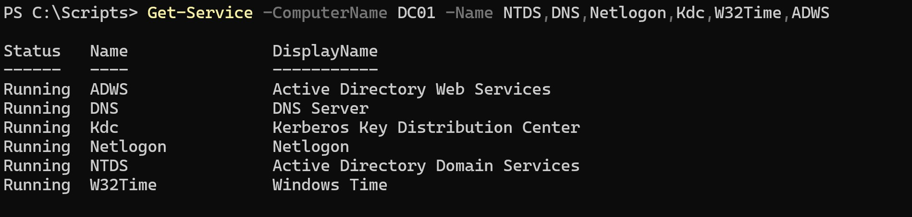
</p>

<p align="center">
  <em>Get-Service -ComputerName DC01, non-elevated, returning all six target services as Running: ADWS, DNS, Kdc, Netlogon, NTDS, W32Time.</em>
</p>

**Wazuh Manager API.** PowerShell 5.1's `Invoke-RestMethod` has no `-SkipCertificateCheck`, so the standard 5.1 accommodation was applied first: forcing TLS 1.2 and installing a certificate-validation callback that accepts the Wazuh stack's self-signed certificate.

```powershell
[Net.ServicePointManager]::SecurityProtocol = [Net.SecurityProtocolType]::Tls12

if (-not ("TrustAllCertsPolicy" -as [type])) {
    Add-Type @"
using System.Net;
using System.Security.Cryptography.X509Certificates;
public class TrustAllCertsPolicy : ICertificatePolicy {
    public bool CheckValidationResult(ServicePoint sp, X509Certificate cert, WebRequest req, int problem) {
        return true;
    }
}
"@
}
[System.Net.ServicePointManager]::CertificatePolicy = New-Object TrustAllCertsPolicy
```

This accommodation worked on the first try: no TLS handshake error, no connection failure, confirming port `55000` is reachable across the LAN from WIN11-CLIENT01. Authentication itself failed twice, both times with `{"title":"Unauthorized","detail":"Invalid credentials"}`, using the Dashboard/Indexer `admin` login that had just worked against the Wazuh Dashboard front end. This was not a credential error so much as a wrong-account error: the Wazuh Manager REST API validates against its own local user store, separate from the Indexer/OpenSearch account the Dashboard authenticates against. The correct account was found in `docker-compose.yml` on Ubuntu Server (`~/infrastructure/security-monitoring-lab/wazuh-docker/single-node/docker-compose.yml`), which defines the `wazuh.manager` service's `API_USERNAME` as `wazuh-wui`. Retrying with that account succeeded:

```powershell
$cred = Get-Credential -Message "Wazuh API credentials (wazuh-wui)"
$pair = "$($cred.UserName):$($cred.GetNetworkCredential().Password)"
$base64 = [Convert]::ToBase64String([Text.Encoding]::ASCII.GetBytes($pair))

$authResponse = Invoke-RestMethod -Uri "https://192.168.1.226:55000/security/user/authenticate" -Method Post -Headers @{ Authorization = "Basic $base64" }
$token = $authResponse.data.token

$headers = @{ Authorization = "Bearer $token" }
Invoke-RestMethod -Uri "https://192.168.1.226:55000/agents" -Method Get -Headers $headers | ConvertTo-Json -Depth 5
```

`GET /agents` returned four entries, not three: agent `000` (`wazuh.manager` itself, the manager's own built-in agent, `registerIP: 127.0.0.1`, `status: active`), agent `001` (`UBUNTU-SERVER`, `ip: 192.168.1.226`, `status: active`), agent `002` (`WIN11-CLIENT01`, `ip: 192.168.1.20`, `status: active`), and agent `003` (`DC01`, `ip: 192.168.1.10`, `status: active`), with `total_affected_items: 4` and `total_failed_items: 0`. All three target agents named in Objectives (`DC01`, `WIN11-CLIENT01`, `UBUNTU-SERVER`) are `active`; the manager's own agent `000` is additionally always present in this response and will need to be accounted for, not silently included, when `Get-LabWazuhAgentStatus.ps1` is built in Step Three.

<p align="center">
  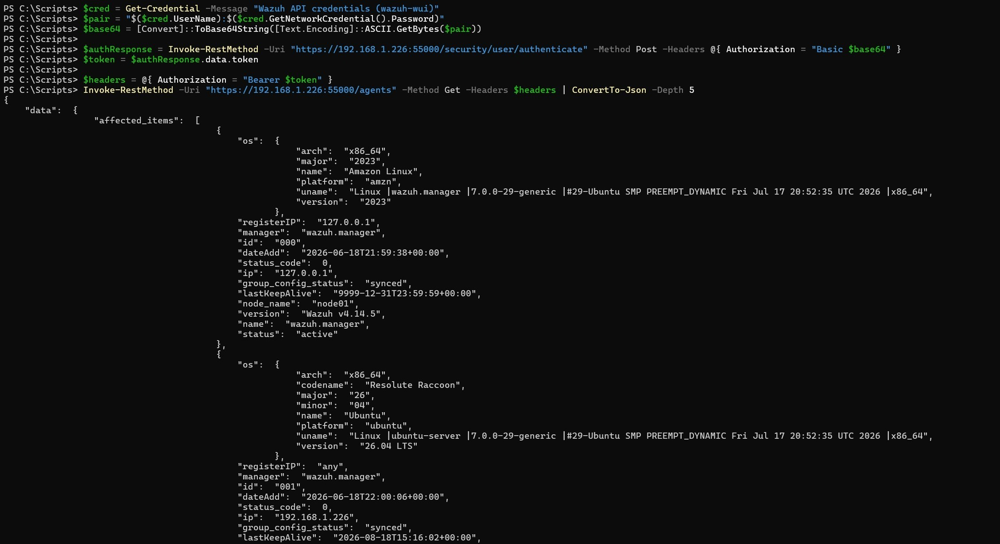
</p>

<p align="center">
  <em>Wazuh Manager API authentication succeeding under the wazuh-wui account after the TLS accommodation, followed by GET /agents returning wazuh.manager and UBUNTU-SERVER as active (WIN11-CLIENT01 and DC01 confirmed active further down the same response).</em>
</p>

**Portainer API.** Direct access was tested first, to reconfirm ADR-009 and the reverse proxy lab's documented finding still holds:

```powershell
Invoke-RestMethod -Uri "https://192.168.1.226:9443/api/status" -Method Get
```

This failed with `Unable to connect to the remote server`, confirming direct `:9443` access remains blocked. `portainer.local` did not resolve on WIN11-CLIENT01 (`Resolve-DnsName` and `ping` both failed), so a hosts-file entry was added from an elevated session:

```powershell
Add-Content -Path C:\Windows\System32\drivers\etc\hosts -Value "192.168.1.226 portainer.local"
```

<p align="center">
  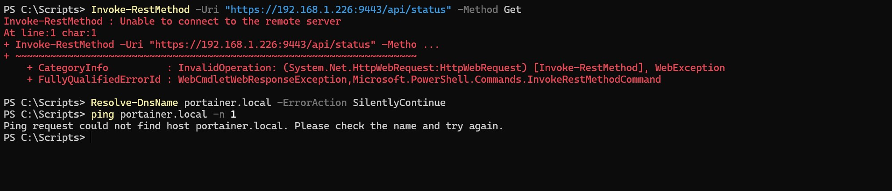
</p>

<p align="center">
  <em>Direct https://192.168.1.226:9443 failing with Unable to connect to the remote server, and portainer.local failing to resolve before the hosts-file entry was added.</em>
</p>

After the hosts entry, `portainer.local` resolved to `192.168.1.226`, but an HTTPS request failed with `The request was aborted: Could not create SSL/TLS secure channel`, even after the TLS 1.2/certificate-policy accommodation from the Wazuh check was reapplied fresh in the same session. Since the same accommodation had worked immediately against the Wazuh API, this pointed at something specific to the Portainer proxy path rather than a missing client-side workaround. Linux infrastructure Lab 04's own documentation of the current Portainer access URL, and the reverse proxy lab's Validated URLs list, both record `http://portainer.local`, not `https://`, which was the actual cause: the NGINX Proxy Manager proxy host for Portainer is HTTP-only, with no SSL certificate assigned to that vhost. Switching to plain HTTP succeeded:

```powershell
Invoke-RestMethod -Uri "http://portainer.local/api/status" -Method Get
```

This returned `Version: 2.39.2`, `InstanceID: cce20bb2-93cd-47bd-974c-7f23deca85d1`.

<p align="center">
  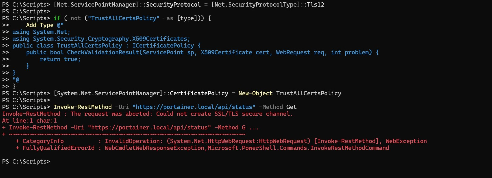
</p>

<p align="center">
  <em>The TLS 1.2/certificate-policy accommodation reapplied and HTTPS to portainer.local still failing with Could not create SSL/TLS secure channel, ruling out a missing client-side accommodation as the cause.</em>
</p>

<p align="center">
  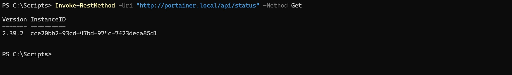
</p>

<p align="center">
  <em>Plain HTTP to portainer.local/api/status succeeding: Portainer 2.39.2.</em>
</p>

Authenticating against the Portainer API surfaced two unrelated pieces of friction before it produced real data. `Get-Credential`'s Windows Security dialog opened but did not accept input in this remote session, a window-station-level issue rather than a credential problem; the workaround was switching to console-based `Read-Host` prompts for the username and password instead of `Get-Credential`. Pasting the resulting multi-line command block in one paste then corrupted the input, since the interactive `Read-Host` prompts consumed characters intended for later lines, producing a `Missing closing ')' in expression` parser error and a cascade of unrelated failures; running the same commands one line at a time, waiting for each prompt, resolved it cleanly:

```powershell
$portainerUser = Read-Host -Prompt "Portainer username"
$portainerPass = Read-Host -AsSecureString -Prompt "Portainer password"
$cred = New-Object System.Management.Automation.PSCredential($portainerUser, $portainerPass)

$body = @{ Username = $cred.UserName; Password = $cred.GetNetworkCredential().Password } | ConvertTo-Json
$authResponse = Invoke-RestMethod -Uri "http://portainer.local/api/auth" -Method Post -Body $body -ContentType "application/json"
$token = $authResponse.jwt

$headers = @{ Authorization = "Bearer $token" }
$endpoints = Invoke-RestMethod -Uri "http://portainer.local/api/endpoints" -Method Get -Headers $headers
$endpoints | ConvertTo-Json -Depth 5
```

Authentication succeeded using the same admin account used for the Portainer web UI; no separate API account exists for Portainer the way `wazuh-wui` exists for Wazuh. `GET /api/endpoints` returned one endpoint: `Id: 3`, `Name: "local"`, `Status: 1`, with a live Docker snapshot showing `DockerVersion: 29.7.2`, `ContainerCount: 10`, `RunningContainerCount: 5`, `StoppedContainerCount: 5`. The endpoint ID is `3`, not the previously assumed default of `1`, resolving the open item Troubleshooting and Adjustments had flagged. The full container list was then queried against that endpoint:

```powershell
$containers = Invoke-RestMethod -Uri "http://portainer.local/api/endpoints/3/docker/containers/json?all=true" -Method Get -Headers $headers
$containers | Select-Object @{N='Name';E={$_.Names -join ','}}, Image, State, Status | Format-Table -AutoSize
```

This returned ten containers: `single-node-wazuh.dashboard-1` (`wazuh/wazuh-dashboard:4.14.5`, running, up 7 days), `single-node-wazuh.manager-1` (`wazuh/wazuh-manager:4.14.5`, running, up 7 days), `single-node-wazuh.indexer-1` (`wazuh/wazuh-indexer:4.14.5`, running, up 7 days), `nginx-proxy-manager` (`jc21/nginx-proxy-manager:latest`, running, up 7 days), `portainer` (`portainer/portainer-ce:lts`, running, up 7 days), `prometheus` (`prom/prometheus:latest`, exited, `Exited (0) 2 months ago`), `grafana` (`grafana/grafana:latest`, exited, `Exited (0) 2 months ago`), `node-exporter` (`prom/node-exporter:latest`, exited, `Exited (2) 2 months ago`), `frontend` (`nginx:latest`, exited, `Exited (0) 2 months ago`), and `backend` (`hashicorp/http-echo`, exited, `Exited (2) 2 months ago`).

<p align="center">
  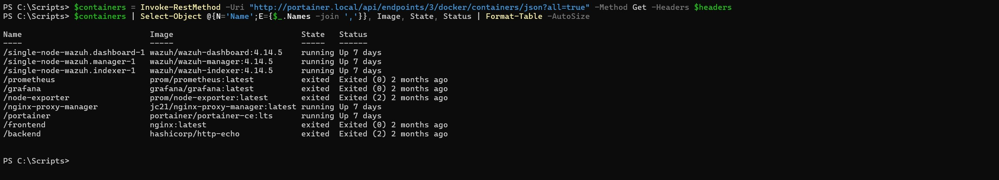
</p>

<p align="center">
  <em>The full ten-container list from Portainer's API against endpoint 3: the Wazuh stack, nginx-proxy-manager, and portainer running; prometheus, grafana, node-exporter, frontend, and backend exited.</em>
</p>

**Docker Engine cross-check via SSH.** Per Design Decision 7, Portainer's own view is not treated as independent of itself, so the container baseline was cross-checked against a direct `docker ps -a`/`docker compose ls -a` on Ubuntu Server, over the existing SSH access path, as a manual step rather than a script:

```bash
docker ps -a
docker compose ls -a
```

`docker ps -a` matched Portainer's container list exactly: the same ten containers, the same names, images, and running/exited states. `docker compose ls -a` added information Portainer's container list alone does not show: `single-node` (the Wazuh stack) reports `running(3)` and `reverse-proxy-lab` reports `running(1)`, both compose projects fully up; `monitoring-stack` reports `exited(3)` and `docker-networking` reports `exited(2)`, both compose projects fully down, not merely individual containers drifting.

<p align="center">
  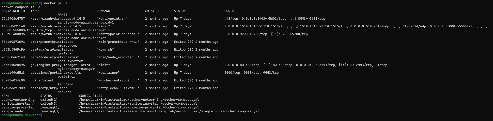
</p>

<p align="center">
  <em>docker ps -a and docker compose ls -a on Ubuntu Server, matching Portainer's API view exactly and showing monitoring-stack and docker-networking as fully exited compose projects.</em>
</p>

**The `frontend`/`backend` containers are explained; the monitoring stack being down is not.** `frontend` and `backend` are linux infrastructure Lab 05's demonstration containers (an NGINX frontend and a `hashicorp/http-echo` backend, deployed to exercise custom bridge networking), part of the `docker-networking` project. Lab 05 never documents removing them; they were left in place after it concluded and are correctly excluded from the expected-running baseline, since they were never meant to run continuously. The monitoring stack being fully down is a different and unplanned finding: Lab 06 is documented `Completed` with no note of decommissioning, pausing, or incident, and no ADR mentions it. It was not known to be down before this step surfaced it. Root cause was not investigated here and the stack was deliberately not restarted; per this lab's read-only scope and the goal of an authentic first run, remediation is deferred to Step Seven, so `Get-LabDockerServiceStatus.ps1`'s first live run catches this as `Unhealthy` rather than being validated against an environment quietly fixed first.

**Go/no-go verdict.** Design Decision 1's Option D holds: both APIs are reachable from WIN11-CLIENT01 and authenticate, so the four-script design is cleared to proceed. The AD check was clean on the first attempt. The Wazuh check required contained troubleshooting, the TLS accommodation working immediately and the only obstacle being the correct `wazuh-wui` account, resolved in one step from `docker-compose.yml`. Portainer took the most sustained work: a hosts-file entry, an assumed HTTPS path that was wrong and cost a full diagnostic round, and the `Get-Credential`/multi-line-paste friction on top. None of it changed the verdict, but it is worth noting for scoping the rest of the lab: reachability held, and the Portainer path did not work on the first, second, or third attempt.

### Step Two - Built Get-LabADServiceHealth.ps1

`Get-LabADServiceHealth.ps1` was built colocated with its Pester tests in a new `infrastructure/automation-and-scripting/scheduled-health-reporting/` folder, following the `Verb-LabNoun` naming pattern and per-lab subfolder convention every prior lab in the track established. It accepts an optional `-ComputerName` (default `DC01`) and `-ServiceName` (default the six-service list Step One confirmed: `NTDS`, `DNS`, `Netlogon`, `Kdc`, `W32Time`, `ADWS`), plus the optional `-ExportPath` the standalone reporting convention uses, and queries each named service's `Status` via `Get-Service -ComputerName`, the call Step One already confirmed works non-elevated with no new remoting.

**The dot-sourced-function invocation model.** Per Design Decision 2, the script defines a function named the same as the file, `Get-LabADServiceHealth`, so `Invoke-LabHealthReport.ps1` can dot-source it in Step Five and call it by name rather than executing it as a separate file, which is what will make the orchestrator's aggregation logic mockable. That invocation model set a hard requirement this script had to satisfy: dot-sourcing it must define the function with no side effects, no query against DC01 and no console output. The idiom chosen for that split is a guard at the bottom of the file:

```powershell
if ($MyInvocation.InvocationName -ne '.') {
    # standalone console-table / -ExportPath rendering lives here
}
```

`$MyInvocation.InvocationName` is `.` when the file is dot-sourced and the file's own path or name when it is run directly, so the guard's body, the Design Decision 3 console-table-plus-`-ExportPath` rendering, only ever executes on a direct run. This is the pattern the remaining check scripts (`Get-LabWazuhAgentStatus.ps1` in Step Three, `Get-LabDockerServiceStatus.ps1` in Step Four) are expected to copy, and the Pester suite below asserts it directly rather than assuming it.

**Classification.** `Get-Service -ComputerName $ComputerName -ErrorAction Stop` runs inside a `try`/`catch`, enumerating every service on the target rather than passing `-Name`, with the script matching requested names against the returned collection. A requested service absent from that collection is reported `NotFound` and classifies the check `Unhealthy`, the "expected service absent" condition rather than a query failure. A connectivity or permission failure cannot open the target's Service Control Manager and surfaces as a terminating `InvalidOperationException` under `-ErrorAction Stop`, caught and classified `Unknown` with the exception's message on the returned object. All six `Running` classifies `Healthy`. This enumerate-then-match shape is not how the script was first built: it replaced a `-Name` / `-ErrorAction SilentlyContinue` call after a live diagnostic showed that form could not tell an unreachable target from a reachable one missing the named services, misclassifying an unreachable DC `Unhealthy` instead of `Unknown`. Recorded in Troubleshooting and Adjustments below.

The script returns a `PSCustomObject` (`CheckName`, `ComputerName`, `Services`, one entry per named service with its own `ServiceName`/`Status`, `Status`, and `Message`) rather than printing `Write-Host` PASS/FAIL narration, so it does not rely on this library's `PSAvoidUsingWriteHost` suppression from Lab 03 at all. The standalone path, inside the dot-source guard, flattens the nested `Services` collection to one row per service, both for the `Format-Table` console output and, when `-ExportPath` is supplied, for `Export-Csv`, since a nested array does not serialize cleanly to a single CSV row.

**Pester coverage.** `Get-LabADServiceHealth.Tests.ps1` mocks `Get-Service`, the only external command the script calls, plus a sample of state-changing service cmdlets (`Set-Service`, `Stop-Service`, `Start-Service`, `Restart-Service`) each asserted at `-Times 0`, matching this library's read-only assertion pattern. Ten tests across seven Contexts: Dot-sourcing behavior (the function defined, `Get-Service` called zero times), Read-only behavior, the three classification branches (Healthy; Unhealthy for a stopped service and separately for a not-found one; Unknown for an SCM failure surfaced the way the live cmdlet surfaces it, a non-terminating error made terminating by `-ErrorAction Stop`), Parameter defaults and pass-through, and the `-ExportPath` CSV branch. Because the function returns its result directly rather than only piping to `Format-Table`, the classification tests call it after dot-sourcing and assert on the returned object's `Status`, `Services`, and `Message`, rather than round-tripping through a CSV export the way Lab 04's read-only scripts had to.

```powershell
Invoke-Pester -Path C:\Scripts\Get-LabADServiceHealth.Tests.ps1 -Output Detailed
```

All ten tests passed on the first run: `Discovery found 10 tests`, `Tests Passed: 10, Failed: 0, Skipped: 0, Inconclusive: 0, NotRun: 0`.

**Analysis was not clean on the first pass.**

```powershell
Invoke-ScriptAnalyzer -Path C:\Scripts -Settings C:\Scripts\PSScriptAnalyzerSettings.psd1 -Recurse
```

This returned five findings, all `PSAvoidUsingComputerNameHardcoded` (Error severity), all against `Get-LabADServiceHealth.Tests.ps1`:

| RuleName | Severity | ScriptName | Line |
|---|---|---|---|
| `PSAvoidUsingComputerNameHardcoded` | Error | `Get-LabADServiceHealth.Tests.ps1` | 133 |
| `PSAvoidUsingComputerNameHardcoded` | Error | `Get-LabADServiceHealth.Tests.ps1` | 155 |
| `PSAvoidUsingComputerNameHardcoded` | Error | `Get-LabADServiceHealth.Tests.ps1` | 174 |
| `PSAvoidUsingComputerNameHardcoded` | Error | `Get-LabADServiceHealth.Tests.ps1` | 188 |
| `PSAvoidUsingComputerNameHardcoded` | Error | `Get-LabADServiceHealth.Tests.ps1` | 208 |

<p align="center">
  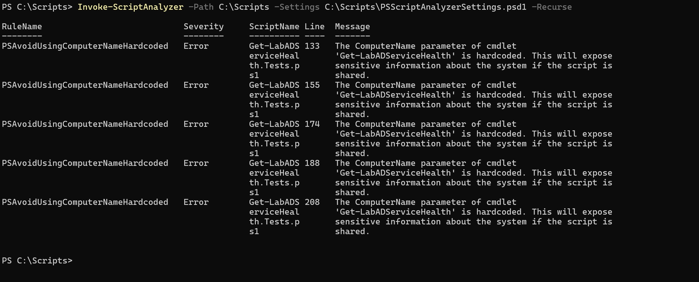
</p>

<p align="center">
  <em>Invoke-ScriptAnalyzer returning five PSAvoidUsingComputerNameHardcoded findings against Get-LabADServiceHealth.Tests.ps1, each reporting "The ComputerName parameter of cmdlet 'Get-LabADServiceHealth' is hardcoded. This will expose sensitive information about the system if the script is shared."</em>
</p>

Lines 133, 155, 174, and 188 were the four classification tests' calls to `Get-LabADServiceHealth -ComputerName 'DC01' ...`; line 208 was the explicit-override pass-through test's `-ComputerName 'DC02'`. The rule flags a literal string bound directly to a parameter named `ComputerName` at a call site; it does not flag a `-ComputerName` parameter's own default value in a `param` block, which is why `Get-LabADServiceHealth.ps1` itself was already clean. The fix was confined to the test file: `$script:TargetComputerName = 'DC01'` and `$script:AlternateComputerName = 'DC02'` were added to `BeforeAll`, and all five call sites, plus the two `ParameterFilter` comparisons that referenced the same literals, were switched to reference those variables instead, clearing the rule without suppressing it in `PSScriptAnalyzerSettings.psd1`.

```powershell
Invoke-Pester -Path C:\Scripts\Get-LabADServiceHealth.Tests.ps1 -Output Detailed
Invoke-ScriptAnalyzer -Path C:\Scripts -Settings C:\Scripts\PSScriptAnalyzerSettings.psd1 -Recurse
```

Re-run after the fix, Pester still passed 10 of 10, confirming the fix, a call-site value change only, did not affect any assertion, and the analyzer returned to the prompt with no further output: a clean pass.

<p align="center">
  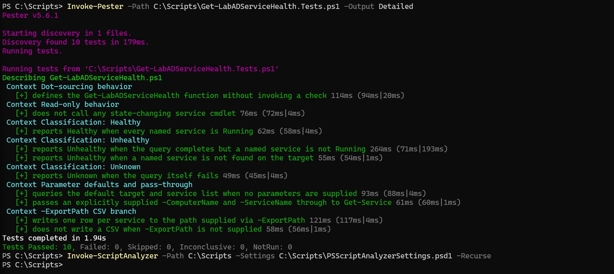
</p>

<p align="center">
  <em>Invoke-Pester re-run confirming all ten tests still passing after the PSAvoidUsingComputerNameHardcoded fix (the test-file-only change described above), followed by Invoke-ScriptAnalyzer returning to the prompt with no output: a clean pass. This is the build-time clean pass; a second, later clean pass follows the separate error-handling fix in Troubleshooting and Adjustments (screenshot 12).</em>
</p>

**A single live standalone run against DC01 was performed here**, per the plan, since Step One had already proven `Get-Service -ComputerName DC01` works non-elevated; the authoritative live validation and the full combined analyzer/Pester sweep across all of Labs 01 through 05 remain reserved for Step Seven, not claimed here.

```powershell
.\Get-LabADServiceHealth.ps1
```

This returned a real `Healthy` result: all six target services (`NTDS`, `DNS`, `Netlogon`, `Kdc`, `W32Time`, `ADWS`) reporting `Running` against `DC01`, `OverallStatus` `Healthy` on every row, `Message` blank.

<p align="center">
  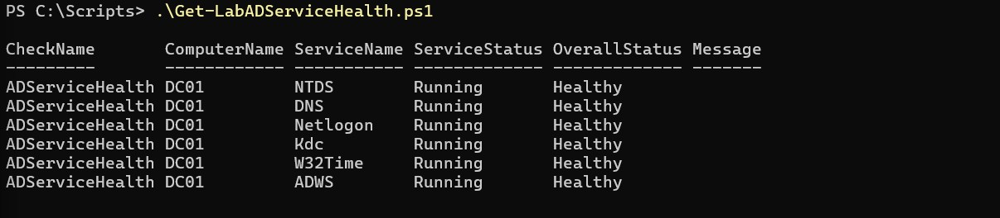
</p>

<p align="center">
  <em>.\Get-LabADServiceHealth.ps1 run standalone against DC01: a formatted console table showing all six target services Running and OverallStatus Healthy.</em>
</p>

### Step Three - Built Get-LabWazuhAgentStatus.ps1

`Get-LabWazuhAgentStatus.ps1` was built alongside `Get-LabADServiceHealth.ps1` in the same `infrastructure/automation-and-scripting/scheduled-health-reporting/` folder. It accepts an optional `-BaseUri` (default `https://192.168.1.226:55000`, the Manager API address Step One confirmed reachable), a `-Credential` for the Manager API's dedicated `wazuh-wui` account (confirmed in Step One; distinct from the Dashboard/Indexer login), an optional `-AgentName` list (default the three agents Step One confirmed enrolled and active: `DC01`, `WIN11-CLIENT01`, `UBUNTU-SERVER`), and the optional `-ExportPath` the standalone reporting convention uses. It authenticates against `POST /security/user/authenticate` with a Basic authorization header built from the credential, takes the JWT from the response's `data.token`, and queries `GET /agents` with that token as a Bearer header, reading the agent list from `data.affected_items`, the same request shape Step One proved live.

**The dot-sourced-function invocation model, copied from Step Two.** The script defines a function named the same as the file and reuses the same `if ($MyInvocation.InvocationName -ne '.') { ... }` guard, so dot-sourcing only defines the function and binds the top-level parameter defaults. One difference follows directly from that: the top-level `-Credential` carries no `Mandatory` attribute and no default, even though the function's own is mandatory, because a mandatory parameter at the top of the file would prompt the moment it is dot-sourced and hang a Pester run. The standalone path inside the guard prompts with `Get-Credential` only when the file is run directly and none was supplied, confining the prompt to the one path meant to be interactive.

**Agent 000 filtering.** Per Step One's own finding, `GET /agents` returns a fourth entry for the Wazuh Manager's own built-in agent (`id 000`, `name wazuh.manager`) alongside the three monitored targets. The script excludes that entry, by `id`, before matching the requested `-AgentName` list against the response, so it is never counted as a monitored agent and never affects the returned `Status`, whatever its own reported status happens to be.

**Classification.** Per Design Decision 4: `Healthy` if every named agent is present and `active`; `Unhealthy` if the query completes but any named agent reports something else (`disconnected`, `never_connected`, `pending`) or is missing entirely, the analog of Step Two's `NotFound`; `Unknown` only if authentication or the query could not be completed. Unlike `Get-Service`, which Step Two found does not throw for an unreachable target when called with `-Name`, `Invoke-RestMethod` throws on its own for both a connection failure and an HTTP error status, the same 401 Step One produced against the wrong account. A failed authentication or unreachable Manager API therefore reaches the `try`/`catch` and classifies `Unknown` with no equivalent workaround, confirmed by the mocked coverage below rather than assumed.

One `Unknown` case this script did not originally cover was added later, in Step Six-A, after the equivalent condition was observed live against the Portainer API: a query that succeeds and returns no agents at all. That is not a throwing failure, so it never reached the `try`/`catch` described above, and it would have fallen through to the matching loop, reported all three monitored agents `NotFound`, and classified the check `Unhealthy`. The guard tests the whole response before agent `000` is filtered out, deliberately, because agent `000` is always present in a working Manager's response: an entirely empty response cannot describe the Manager that just answered it, while a response carrying only agent `000` is a real and readable state, no monitored agents enrolled, which correctly stays `Unhealthy`. Both branches are covered by tests added in Step Six-A. Full detail is in that step and in Troubleshooting and Adjustments.

**The certificate-validation bypass, scoped rather than left on for the session.** PowerShell 5.1's `Invoke-RestMethod` has no `-SkipCertificateCheck`, so the Wazuh stack's self-signed certificate needs the same TLS 1.2 / `TrustAllCertsPolicy` accommodation Step One used, and that accommodation is process-wide: `[System.Net.ServicePointManager]::CertificatePolicy` has no request-scoped equivalent. The decision here is to capture the existing `CertificatePolicy` and `SecurityProtocol`, apply the accommodation only for this function's two calls, and restore both in a `finally` block, so validation is disabled for the duration of those calls rather than the rest of the session. Both are ordinary settable static properties, so restoring cleanly costs two lines.

**Credential and token hygiene.** `-Credential` is accepted as a `[PSCredential]`, the same discipline `New-LabUser.ps1` (Lab 01) established for a plaintext password. The Basic authorization header built from it, and the JWT bearer token `GET /agents` is authenticated with, exist only inside the function's local scope; the returned `PSCustomObject` carries only agent names and statuses, the overall `Status`, and a `Message` drawn from the exception's own text on failure, and neither the credential nor the token is written to the console, placed on the returned object, or included in the standalone report. The Pester suite asserts this directly.

Like `Get-LabADServiceHealth.ps1`, this script returns a `PSCustomObject` rather than printing PASS/FAIL narration with `Write-Host`. The standalone path, inside the dot-source guard, flattens the nested `Agents` collection to one row per agent, both for the `Format-Table` console output and, when `-ExportPath` is supplied, for `Export-Csv`.

**Pester coverage.** `Get-LabWazuhAgentStatus.Tests.ps1` mocks `Invoke-RestMethod`, the only external command the script calls, distinguishing the authentication call from the agent query by `-Uri` in each `ParameterFilter`, extending Design Decision 6 to a non-`Get-Service` command for the first time. The test credential was built from an empty `[System.Security.SecureString]::new()` rather than `ConvertTo-SecureString -AsPlainText`, per Lab 03's own `PSAvoidUsingConvertToSecureStringWithPlainText` finding, since no test depends on the password. Fifteen tests across eight Contexts: Dot-sourcing, Read-only behavior (`Invoke-RestMethod` called exactly twice, once `Post` to authenticate and once `Get` for agents, never another method or URI), the three classification branches (Healthy, including a dedicated assertion that agent `000` is excluded; Unhealthy for a non-active agent and separately for a missing one; Unknown for an authentication failure and separately for a query failure), Parameter defaults and pass-through, Credential and token hygiene (the fabricated JWT never on the returned object or in console output), and the `-ExportPath` CSV branch.

```powershell
Invoke-Pester -Path C:\Scripts\Get-LabWazuhAgentStatus.Tests.ps1 -Output Detailed
```

All fifteen tests passed on the first run: `Discovery found 15 tests in 170ms`, `Tests Passed: 15, Failed: 0, Skipped: 0, Inconclusive: 0, NotRun: 0`.

<p align="center">
  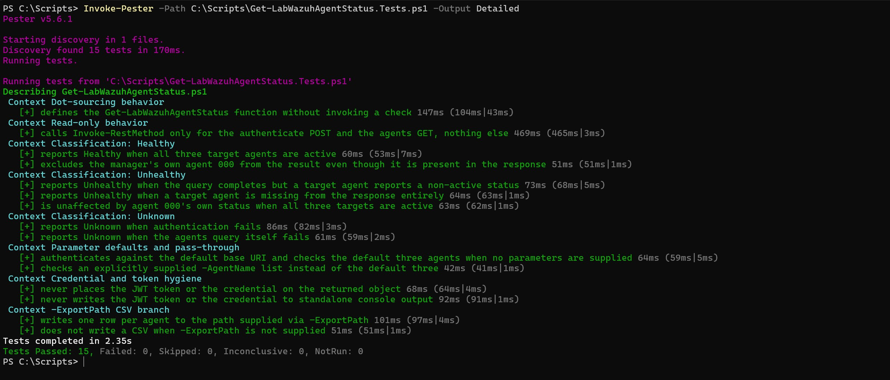
</p>

<p align="center">
  <em>Invoke-Pester against Get-LabWazuhAgentStatus.Tests.ps1: 15 tests discovered across eight Contexts, all fifteen passed on the first run.</em>
</p>

**Analysis was not clean on the first pass.**

```powershell
Invoke-ScriptAnalyzer -Path C:\Scripts\Get-LabWazuhAgentStatus.ps1 -Settings C:\Scripts\PSScriptAnalyzerSettings.psd1
Invoke-ScriptAnalyzer -Path C:\Scripts\Get-LabWazuhAgentStatus.Tests.ps1 -Settings C:\Scripts\PSScriptAnalyzerSettings.psd1
```

Analyzed as two separate invocations, following the comma-path workaround Lab 04 established. This returned one finding, against the test file:

| RuleName | Severity | ScriptName | Line | Message |
|---|---|---|---|---|
| `PSUseSingularNouns` | Warning | `Get-LabWazuhAgentStatus.Tests.ps1` | 86 | The cmdlet 'script:New-DefaultMockAgents' uses a plural noun. A singular noun should be used instead. |

<p align="center">
  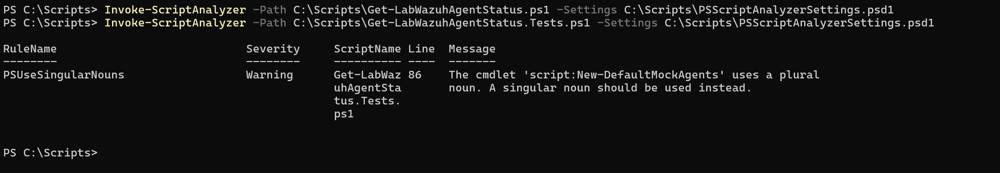
</p>

<p align="center">
  <em>Invoke-ScriptAnalyzer returning one PSUseSingularNouns finding against Get-LabWazuhAgentStatus.Tests.ps1 line 86, flagging the test-only helper function New-DefaultMockAgents.</em>
</p>

`New-DefaultMockAgents` was a private test-only helper building the fabricated four-agent `GET /agents` response (the manager's own agent plus the three active targets) reused across the default mocks. The fix was confined to the test file: the function was renamed to `New-DefaultMockAgentSet`, and its one call site was updated to match; no assertion changed.

```powershell
Invoke-Pester -Path C:\Scripts\Get-LabWazuhAgentStatus.Tests.ps1 -Output Detailed
Invoke-ScriptAnalyzer -Path C:\Scripts\Get-LabWazuhAgentStatus.ps1 -Settings C:\Scripts\PSScriptAnalyzerSettings.psd1
Invoke-ScriptAnalyzer -Path C:\Scripts\Get-LabWazuhAgentStatus.Tests.ps1 -Settings C:\Scripts\PSScriptAnalyzerSettings.psd1
```

Re-run after the fix, Pester still passed 15 of 15 (`Tests completed in 926ms`, `Tests Passed: 15, Failed: 0, Skipped: 0, Inconclusive: 0, NotRun: 0`), confirming the rename did not affect any assertion, and both `Invoke-ScriptAnalyzer` invocations returned to the prompt with no output: a clean pass.

<p align="center">
  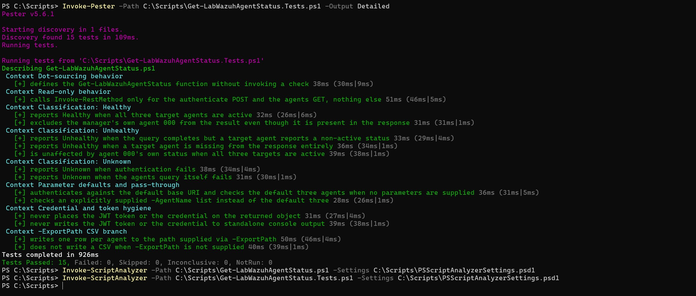
</p>

<p align="center">
  <em>Invoke-Pester re-run confirming all fifteen tests still passing after the New-DefaultMockAgentSet rename, followed by both Invoke-ScriptAnalyzer invocations returning to the prompt with no output: a clean pass.</em>
</p>

**A single live standalone run against the Wazuh Manager API was performed here**, per the plan, since Step One had already proven the API reachable and authenticating under the `wazuh-wui` account; the authoritative live validation and the full combined analyzer/Pester sweep across all of Labs 01 through 05 remain reserved for Step Seven, not claimed here.

```powershell
$cred = Get-Credential -Message "Wazuh Manager API credentials (wazuh-wui)"
.\Get-LabWazuhAgentStatus.ps1 -Credential $cred
```

This returned a real `Healthy` result: all three target agents (`DC01`, `WIN11-CLIENT01`, `UBUNTU-SERVER`) reporting `active` against `https://192.168.1.226:55000`, `OverallStatus` `Healthy` on every row, matching Step One's all-active baseline exactly.

<p align="center">
  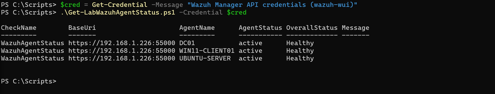
</p>

<p align="center">
  <em>.\Get-LabWazuhAgentStatus.ps1 run standalone against the Wazuh Manager API: a formatted console table showing all three target agents active and OverallStatus Healthy.</em>
</p>

### Step Four - Built Get-LabDockerServiceStatus.ps1

`Get-LabDockerServiceStatus.ps1` was built alongside the two earlier check scripts in the same `infrastructure/automation-and-scripting/scheduled-health-reporting/` folder. It accepts an optional `-BaseUri` (default `http://portainer.local`, the plain-HTTP path Step One confirmed working), an optional `-EndpointId` (default `3`, the numeric Docker environment ID Step One confirmed live, not the previously assumed default of `1`), a `-Credential` for the Portainer admin account, an optional `-ExpectedContainer` list (default the curated eight-container set below), and the optional `-ExportPath` the standalone reporting convention uses. It authenticates against `POST /api/auth` with a JSON body built from the credential and reads the JWT from the response's top-level `jwt` field, a different shape from the Wazuh Manager API's `data.token`, then queries `GET /api/endpoints/3/docker/containers/json?all=true` with that token as a Bearer header, the `?all=true` flag being the reason a stopped expected container shows up as stopped rather than simply missing from the response.

**No TLS accommodation, unlike Step Three.** Step One confirmed the only working Portainer path is plain HTTP through NGINX Proxy Manager, not HTTPS, so this script applies none of `Get-LabWazuhAgentStatus.ps1`'s TLS 1.2 / `TrustAllCertsPolicy` accommodation; there is no HTTPS leg on this path to accommodate. One consequence, expanded on in Security Considerations, is that the Portainer credential crosses the LAN in cleartext on every call this script makes.

**The dot-sourced-function invocation model, copied from Steps Two and Three.** `Get-LabDockerServiceStatus.ps1` defines a function named the same as the file, per Design Decision 2, and reuses the same `if ($MyInvocation.InvocationName -ne '.') { ... }` guard, so dot-sourcing it only ever defines the function and binds the top-level parameter defaults. As in Step Three, the top-level `-Credential` parameter carries no `Mandatory` attribute and no default, even though the function's own `-Credential` is mandatory, so that dot-sourcing this file cannot hang a test run on an interactive prompt; the standalone path inside the guard prompts for the credential itself, with `Get-Credential`, only when the file is run directly and no `-Credential` was supplied.

**Container-name normalization.** Docker's container-listing endpoint returns each container's `Names` as an array of strings with a leading slash, for example `["/portainer"]`, confirmed in Step One's own container listing. The script takes the first entry and strips the leading slash before matching a container against `-ExpectedContainer`; matching the raw, slash-prefixed value against a plain container name would silently fail every comparison.

**The curated expected-running set, and the deliberate exclusion of the teaching containers.** The default `-ExpectedContainer` list is the eight containers Step One confirmed as the environment's intended baseline: the Wazuh stack (`single-node-wazuh.manager-1`, `single-node-wazuh.indexer-1`, `single-node-wazuh.dashboard-1`), the reverse proxy (`nginx-proxy-manager`), `portainer` itself, and the monitoring stack (`prometheus`, `grafana`, `node-exporter`). The `docker-networking` project's `frontend` and `backend` containers, leftover teaching-lab containers from linux infrastructure Lab 05, are deliberately not in this list, the same way `Get-LabWazuhAgentStatus.ps1` excludes the Wazuh Manager's own agent `000`: whatever their state, they are simply never matched against and never affect the result, rather than being detected and then special-cased.

**Classification.** Per Design Decision 4: `Healthy` if every expected container is present and reports a running state; `Unhealthy` if the query completes but any expected container is present with a non-running state, its real state reported, for example `exited`, or missing from the response entirely, reported `NotFound`, the Docker analog of `Get-LabADServiceHealth.ps1`'s `NotFound` condition; `Unknown` only if authentication or the container query itself could not be completed. As with `Get-LabWazuhAgentStatus.ps1`, `Invoke-RestMethod` throws a terminating error on its own for both a connection failure and an HTTP error status, so a failed authentication or an unreachable Portainer API reaches this script's `try`/`catch` and classifies `Unknown` without the enumerate-then-match workaround `Get-Service` required in Step Two.

That reasoning covered every failure this step anticipated, and it turned out to be incomplete. Step Six-A observed a Portainer response that succeeded, threw nothing, and contained no containers at all, which reached none of the `Unknown` paths above and would have been reported as all eight expected containers `NotFound` and the check `Unhealthy`: a false incident rather than a failed observation. An empty-response guard and two regression tests were added in that step, and the reasoning for why an empty list is unambiguous here, rather than a possible true reading of the environment, is recorded there and in Troubleshooting and Adjustments.

**Credential and token hygiene.** `-Credential` is accepted as a `[PSCredential]`, the same discipline every REST-backed check script in this lab uses. The JSON body `POST /api/auth` is authenticated with, and the JWT bearer token the containers query is authenticated with, exist only inside the function's local scope; the returned `PSCustomObject` carries only container names and states, the overall `Status`, and a `Message` drawn from the exception's own text on failure, and neither the credential nor the token is written to the console, placed on the returned object, or included in the standalone report. The Pester suite asserts this directly.

**Pester coverage.** `Get-LabDockerServiceStatus.Tests.ps1` mocks `Invoke-RestMethod`, distinguishing the auth call from the containers call by `-Uri` in each `ParameterFilter`, the same pattern Step Three established. The test credential was built from an empty `[System.Security.SecureString]::new()`, per Lab 03's `PSAvoidUsingConvertToSecureStringWithPlainText` finding. Seventeen tests are written across ten Contexts: Dot-sourcing behavior, Read-only behavior, the three classification branches (Healthy; Unhealthy for a stopped container and, separately, for a missing container, plus a dedicated exclusion test confirming `frontend` and `backend` never affect the result even when present and exited; Unknown for an authentication failure and, separately, for a containers-query failure), a Real-environment baseline Context reproducing Step One's exact ten-container live finding and asserting the result is driven only by the three monitoring containers, Parameter defaults and pass-through, Credential and token hygiene, the `-ExportPath` CSV branch, and a Response deserialization Context, added after Step Four's own live run surfaced a defect these other sixteen tests had not caught, covered in full in Troubleshooting and Adjustments below.

```powershell
Invoke-Pester -Path C:\Scripts\Get-LabDockerServiceStatus.Tests.ps1 -Output Detailed
```

Sixteen tests, the suite as it stood before the defect below was found and the seventeenth test written, passed on the first run: `Discovery found 16 tests in 224ms`, `Tests Passed: 16, Failed: 0, Skipped: 0, Inconclusive: 0, NotRun: 0`.

**Analysis was clean on the first pass, unlike Steps Two and Three.**

```powershell
Invoke-ScriptAnalyzer -Path C:\Scripts\Get-LabDockerServiceStatus.ps1 -Settings C:\Scripts\PSScriptAnalyzerSettings.psd1
Invoke-ScriptAnalyzer -Path C:\Scripts\Get-LabDockerServiceStatus.Tests.ps1 -Settings C:\Scripts\PSScriptAnalyzerSettings.psd1
```

Both invocations returned to the prompt with no output. Unlike `Get-LabADServiceHealth.Tests.ps1`'s `PSAvoidUsingComputerNameHardcoded` finding in Step Two or `Get-LabWazuhAgentStatus.Tests.ps1`'s `PSUseSingularNouns` finding in Step Three, neither script nor test file triggered a finding here.

<p align="center">
  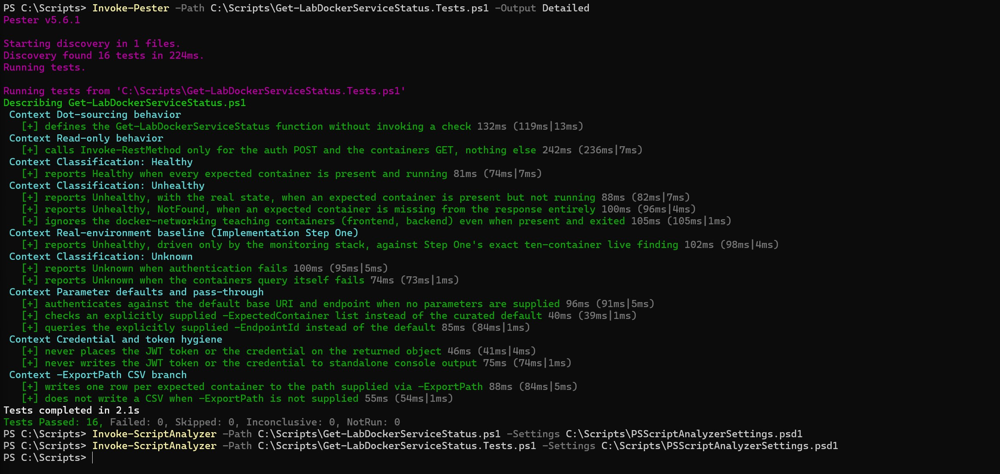
</p>

<p align="center">
  <em>Invoke-Pester against Get-LabDockerServiceStatus.Tests.ps1: 16 tests discovered across nine Contexts, all sixteen passed on the first run, followed by both Invoke-ScriptAnalyzer invocations returning to the prompt with no output, a clean pass with no finding to fix.</em>
</p>

**A clean Pester run and a clean analyzer pass were not enough: the first live run surfaced a real defect.** Per the plan, a live run against Portainer was performed once Pester and Analyzer were both clean, since Step One had already proven the API reachable and authenticating under the admin account used there.

```powershell
$cred = Get-Credential -Message "Portainer admin API credentials"
.\Get-LabDockerServiceStatus.ps1 -Credential $cred
```

This did not return the expected result. Seven of the eight expected containers came back `NotFound`, and `single-node-wazuh.dashboard-1` came back with `ContainerState` showing `{running, running, running, exited...}`, a collection value where a single state string was expected. `OverallStatus` was `Unhealthy` on every row, but not for the reason Step One's plan anticipated. This was a real defect in the script, not the monitoring-stack outage the plan expected this check to catch, and it is root-caused in full, with the diagnostic sequence that found it, in Troubleshooting and Adjustments below.

<p align="center">
  
</p>

<p align="center">
  <em>The first live run: seven of eight expected containers reported NotFound, and single-node-wazuh.dashboard-1 reported a collection value, {running, running, running, exited...}, in place of a single state. A real defect, resolved below, not the expected outage.</em>
</p>

**After the fix described in Troubleshooting and Adjustments, Pester and Analyzer were re-run.**

```powershell
Invoke-Pester -Path C:\Scripts\Get-LabDockerServiceStatus.Tests.ps1 -Output Detailed
Invoke-ScriptAnalyzer -Path C:\Scripts\Get-LabDockerServiceStatus.ps1 -Settings C:\Scripts\PSScriptAnalyzerSettings.psd1
Invoke-ScriptAnalyzer -Path C:\Scripts\Get-LabDockerServiceStatus.Tests.ps1 -Settings C:\Scripts\PSScriptAnalyzerSettings.psd1
```

Seventeen tests passed, the sixteen original tests plus the new regression test covering the fixed defect: `Discovery found 17 tests in 118ms`, `Tests Passed: 17, Failed: 0, Skipped: 0, Inconclusive: 0, NotRun: 0`. Both `Invoke-ScriptAnalyzer` invocations again returned to the prompt with no output.

<p align="center">
  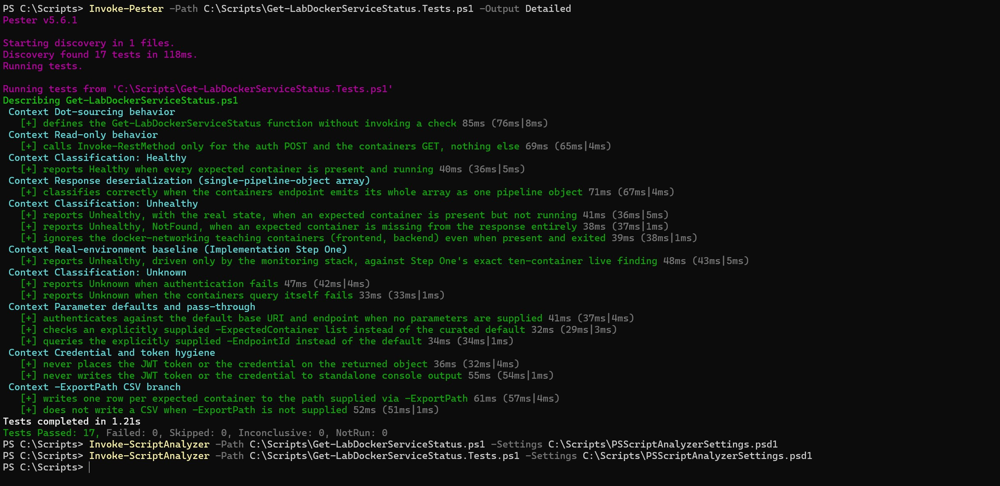
</p>

<p align="center">
  <em>Invoke-Pester re-run after the array-deserialization fix: 17 tests discovered across ten Contexts, all seventeen passed, including the new Response deserialization Context, followed by both Invoke-ScriptAnalyzer invocations returning to the prompt with no output: a clean pass.</em>
</p>

**The live run was repeated, and this time returned the result Step One's plan anticipated.**

```powershell
.\Get-LabDockerServiceStatus.ps1 -Credential $cred
```

This returned a real `Unhealthy` result, driven by exactly the condition Step One deliberately left in place: `single-node-wazuh.manager-1`, `single-node-wazuh.indexer-1`, `single-node-wazuh.dashboard-1`, `nginx-proxy-manager`, and `portainer` all reported `running`; `prometheus`, `grafana`, and `node-exporter` all reported `exited`. This matches Step One's own live container baseline exactly, and it is this check working correctly on its first genuine live run, catching the monitoring-stack outage Step One found and deliberately did not remediate, not a defect. Remediation remains deferred to Step Seven, per the plan.

<p align="center">
  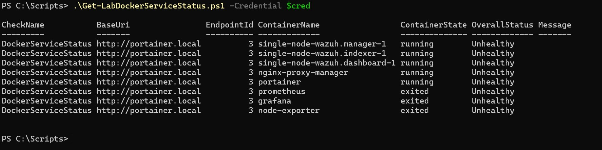
</p>

<p align="center">
  <em>.\Get-LabDockerServiceStatus.ps1 run standalone against Portainer, after the fix: the Wazuh stack, nginx-proxy-manager, and portainer reporting running; prometheus, grafana, and node-exporter reporting exited; OverallStatus Unhealthy on every row. The monitoring-stack outage Step One found, correctly caught.</em>
</p>

### Step Five - Built Invoke-LabHealthReport.ps1, the Orchestrator

`Invoke-LabHealthReport.ps1` was built alongside the three check scripts in the same `infrastructure/automation-and-scripting/scheduled-health-reporting/` folder. It is the script Step Six will register in Task Scheduler, so it is the environment's single entry point: an interactive run or a scheduled firing invokes this one script, not the three check scripts individually. It accepts `-WazuhCredential` and `-PortainerCredential` (both `[PSCredential]`) and `-ReportDirectory`; per Design Decision 2, it does not re-declare any of the three checks' own classification parameters (target computer, service list, agent list, base URIs, endpoint ID, expected-container list), relying entirely on each check's own defaults, the same defaults Steps Two through Four already built and validated.

**The dot-source placement is a correctness requirement, not a style choice.** Per Design Decision 6, the three check scripts are dot-sourced once, at this file's own top level, resolved relative to `$PSScriptRoot`, rather than inside the `Invoke-LabHealthReport` function body:

```powershell
. (Join-Path -Path $PSScriptRoot -ChildPath 'Get-LabADServiceHealth.ps1')
. (Join-Path -Path $PSScriptRoot -ChildPath 'Get-LabWazuhAgentStatus.ps1')
. (Join-Path -Path $PSScriptRoot -ChildPath 'Get-LabDockerServiceStatus.ps1')
```

Placed at the top level, the three check functions are defined exactly once, whenever this file is loaded, by dot-sourcing or by a direct run. A Pester suite can then dot-source this file, which dot-sources the three checks and defines the real functions, `Mock` those three functions by name, and invoke `Invoke-LabHealthReport`, and the mocks take effect because PowerShell resolves a bare function call by name at call time. Had the dot-source calls instead lived inside the `Invoke-LabHealthReport` function body, every call to that function would re-dot-source the three check scripts and redefine the real functions over the top of any active `Mock`, making the aggregation untestable.

**Parameter-name collision is handled by naming, not by scoping.** Because the three check scripts are dot-sourced into this file's own scope, each one's own top-level `param` block variables (`$ComputerName`, `$ServiceName`, `$BaseUri`, `$Credential`, `$AgentName`, `$EndpointId`, `$ExpectedContainer`, `$ExportPath`) land in this file's scope as a side effect, the last-dot-sourced script's default winning for any name more than one check script happens to share. None of that is used by this script; `-WazuhCredential`, `-PortainerCredential`, and `-ReportDirectory` were named specifically so that none of them collides with any name the three dot-sourced check scripts already bind, rather than scoping the dot-source calls to prevent the collision.

As in every check script in this lab, the top-level `-WazuhCredential` and `-PortainerCredential` parameters carry no `Mandatory` attribute and no default, and neither does `-ReportDirectory`: a `Mandatory` parameter at the top of this file would make PowerShell prompt for it the moment the file is dot-sourced, which would hang a Pester run waiting on input. The standalone path inside the guard at the bottom of the file prompts for whichever of the three is missing, `Get-Credential` for the two credentials and `Read-Host` for the report directory, only when the file is run directly.

**Aggregation (Design Decision 4, worst-wins).** `Invoke-LabHealthReport` calls `Get-LabADServiceHealth`, `Get-LabWazuhAgentStatus`, and `Get-LabDockerServiceStatus` by name and aggregates their three `Status` values: any `Unhealthy` check makes the overall status `Unhealthy`, regardless of the other two; failing that, any `Unknown` check makes it `Unknown`; only if all three report `Healthy` is the overall status `Healthy`. This is pure logic with no external dependency of its own, and it is this lab's highest-value Pester target, per Design Decision 6.

**Report output (Design Decision 3).** A console table (`CheckName` and `Status` for the three checks plus an aggregated `Overall` row) prints on an interactive run, built by a separate `Get-LabHealthReportSummaryTable` function rather than inline in the guard so tests can call it directly against an already-mocked result. A timestamped, self-contained HTML summary is always written to `-ReportDirectory` on every run, interactive or scheduled, built by `ConvertTo-LabHealthReportHtml` (named from an analyzer finding covered under Analysis below, not its first draft). HTML was chosen over a flat CSV row, matching Lab 04's precedent of departing from a flat table when the data does not reduce to one: unlike the check scripts, whose `-ExportPath` still writes flat CSV, this report rolls three check types into one status and has no flat-row equivalent. Every rendered value, including a check's `Message`, is passed through `[System.Net.WebUtility]::HtmlEncode`. The report is an exported artifact, written only to the runtime `-ReportDirectory` and kept out of the repository working copy entirely.

**Credential and token hygiene.** `-WazuhCredential` and `-PortainerCredential` are passed straight through to the two REST-backed checks without ever being read from, echoed, or stored by this script. The three check functions already exclude their own credentials and JWTs from their returned objects, per Steps Three and Four's own hygiene; this script's console table and HTML report both render only `CheckName` and `Status` values drawn from those already-clean returned objects, so neither surface can carry a credential or a token forward. The Pester suite asserts this directly rather than assuming it.

**A testability boundary worth stating plainly.** Because the three check scripts are dot-sourced unconditionally at this file's top level, running it with the call operator (`& .\Invoke-LabHealthReport.ps1`) re-executes those dot-sources in that run's local scope, redefining the checks as their real network-calling selves and shadowing any `Mock` set further up the scope chain. The check scripts do not have this problem, since none dot-sources anything; this one does, as a direct consequence of Design Decision 6's own mockability requirement. That is why the console-table rendering is its own function: the suite calls it against a `$result` from an already-mocked run rather than invoking the file with `&` the way the check scripts' suites do for their console-output assertions.

**Pester coverage.** `Invoke-LabHealthReport.Tests.ps1` mocks the three check functions by name rather than their underlying commands, the only way this script's aggregation logic can be exercised in isolation, per Design Decision 6. `BeforeEach` dot-sources the orchestrator fresh for every test, which defines `Invoke-LabHealthReport` and, as a side effect of the orchestrator's own top-level dot-sourcing, the three real check functions, so `Mock` calls placed after that dot-source replace the real functions rather than something undefined. The test credentials were built from an empty `[System.Security.SecureString]::new()`, per Lab 03's own finding, and every direct invocation supplies both credentials and `-ReportDirectory` explicitly, so no `Get-Credential` or `Read-Host` prompt can hang the suite; `TestDrive:\` is used for `-ReportDirectory` throughout.

Thirty-eight tests across five Contexts: Dot-sourcing behavior (`Invoke-LabHealthReport` defined, the three check functions defined as a side effect, none invoked); Read-only / call-count behavior (each check called exactly once, each credential passed to the correct check); Aggregation, twenty-seven tests, one per combination of the three checks' states, data-driven with `It -ForEach` over a table computed in the Context body as `Hashtable` entries (see Troubleshooting for why both of those matter); Report file behavior (a timestamped HTML file every run, the directory created if missing, the overall status and all three check names present, a distinct file on each of two successive runs); and Credential and token hygiene (neither credential nor a token on the returned object, in the report file, or in the console summary).

```powershell
Invoke-Pester -Path C:\Scripts\Invoke-LabHealthReport.Tests.ps1 -Output Detailed
```

All thirty-eight tests passed: `Discovery found 38 tests in 68ms`, `Tests Passed: 38, Failed: 0, Skipped: 0, Inconclusive: 0, NotRun: 0`. Getting there took two real, back-to-back Pester authoring defects, both caught by real runs rather than review, covered in full in Troubleshooting and Adjustments below.

<p align="center">
  
</p>

<p align="center">
  <em>The first real Invoke-Pester run: only eleven tests discovered, the twenty-seven-case Aggregation Context silently absent from both the test tree and the output, no error or warning printed anywhere.</em>
</p>

<p align="center">
  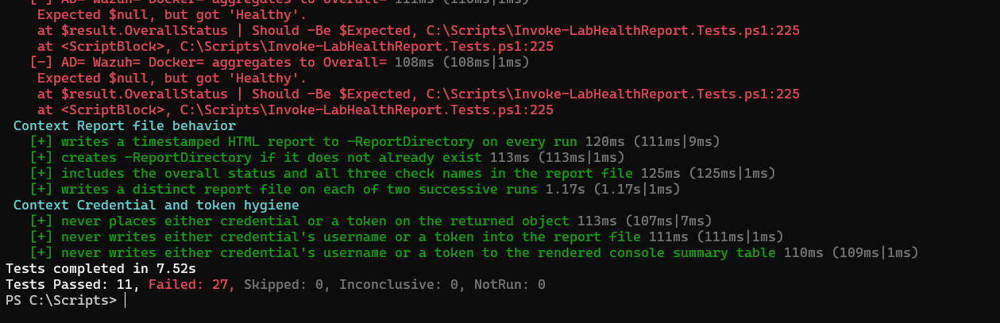
</p>

<p align="center">
  <em>After fixing the Discovery-timing defect, all thirty-eight tests were discovered, but all twenty-seven Aggregation cases failed: every title rendered with blank AD=/Wazuh=/Docker= placeholders, and every assertion failed with "Expected $null, but got 'Healthy'".</em>
</p>

<p align="center">
  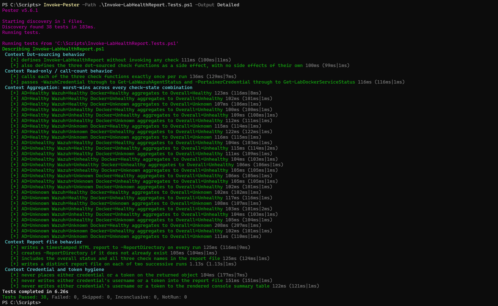
</p>

<p align="center">
  <em>After switching the Aggregation Context's combinations from PSCustomObject to Hashtable entries, all thirty-eight tests passed, with every Aggregation title now showing its real AD/Wazuh/Docker/Overall values.</em>
</p>

**Analysis was not clean on the first pass.**

```powershell
Invoke-ScriptAnalyzer -Path C:\Scripts\Invoke-LabHealthReport.ps1 -Settings C:\Scripts\PSScriptAnalyzerSettings.psd1
Invoke-ScriptAnalyzer -Path C:\Scripts\Invoke-LabHealthReport.Tests.ps1 -Settings C:\Scripts\PSScriptAnalyzerSettings.psd1
```

This returned three findings, all against the script, the test file clean on the first pass:

| RuleName | Severity | ScriptName | Line | Message |
|---|---|---|---|---|
| `PSUseShouldProcessForStateChangingFunctions` | Warning | `Invoke-LabHealthReport.ps1` | 150 | Function 'New-LabHealthReportHtml' has verb that could change system state. Therefore, the function has to support 'ShouldProcess'. |
| `PSUseOutputTypeCorrectly` | Information | `Invoke-LabHealthReport.ps1` | 222 | The cmdlet 'New-LabHealthReportHtml' returns an object of type 'System.String' but this type is not declared in the OutputType attribute. |
| `PSUseOutputTypeCorrectly` | Information | `Invoke-LabHealthReport.ps1` | 279 | The cmdlet 'Get-LabHealthReportSummaryTable' returns an object of type 'System.Array' but this type is not declared in the OutputType attribute. |

<p align="center">
  
</p>

<p align="center">
  <em>Invoke-ScriptAnalyzer returning three findings against Invoke-LabHealthReport.ps1 (PSUseShouldProcessForStateChangingFunctions on the HTML-building helper, and two PSUseOutputTypeCorrectly findings), and Invoke-LabHealthReport.Tests.ps1 returning to the prompt with no output, clean on the first pass.</em>
</p>

`PSUseShouldProcessForStateChangingFunctions` fired because the HTML-building helper was originally named `New-LabHealthReportHtml`, and `New-` is one of the verbs PSScriptAnalyzer treats as state-changing, even though the function only builds and returns a string with no side effect of its own; the actual file write happens in `Invoke-LabHealthReport`, via `Out-File`. The fix was a rename, not a suppression: `New-LabHealthReportHtml` became `ConvertTo-LabHealthReportHtml`, the same relationship PowerShell's own `ConvertTo-Html` cmdlet has to the data it renders, and a verb the rule does not flag. The two `PSUseOutputTypeCorrectly` findings were fixed by adding `OutputType` attributes: `[OutputType([string])]` on `ConvertTo-LabHealthReportHtml`, unambiguous since the function always returns a single string, and `[OutputType([PSCustomObject])]` on `Get-LabHealthReportSummaryTable`, describing the collection's element type rather than the array itself.

```powershell
Invoke-Pester -Path C:\Scripts\Invoke-LabHealthReport.Tests.ps1 -Output Detailed
Invoke-ScriptAnalyzer -Path C:\Scripts\Invoke-LabHealthReport.ps1 -Settings C:\Scripts\PSScriptAnalyzerSettings.psd1
Invoke-ScriptAnalyzer -Path C:\Scripts\Invoke-LabHealthReport.Tests.ps1 -Settings C:\Scripts\PSScriptAnalyzerSettings.psd1
```

Pester still passed 38 of 38, confirming the rename did not affect any assertion, but the analyzer returned one remaining finding: `Get-LabHealthReportSummaryTable`'s declared `[OutputType([PSCustomObject])]` did not match what the analyzer had actually inferred from the function body, `System.Array`, since the function's last statement is an array-literal expression (`@(...)`) rather than a single object.

<p align="center">
  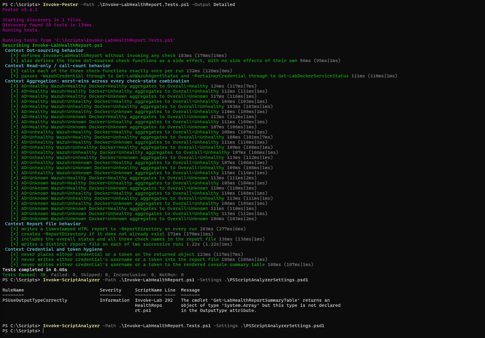
</p>

<p align="center">
  <em>After the rename and the first OutputType attempt: Pester still 38 of 38, but Invoke-ScriptAnalyzer returning one remaining PSUseOutputTypeCorrectly finding, "returns an object of type 'System.Array'", against Get-LabHealthReportSummaryTable's declared [PSCustomObject].</em>
</p>

The declared attribute was corrected to `[OutputType([System.Array])]`, matching the analyzer's own inferred type literally rather than the collection's element type.

```powershell
Invoke-Pester -Path C:\Scripts\Invoke-LabHealthReport.Tests.ps1 -Output Detailed
Invoke-ScriptAnalyzer -Path C:\Scripts\Invoke-LabHealthReport.ps1 -Settings C:\Scripts\PSScriptAnalyzerSettings.psd1
Invoke-ScriptAnalyzer -Path C:\Scripts\Invoke-LabHealthReport.Tests.ps1 -Settings C:\Scripts\PSScriptAnalyzerSettings.psd1
```

Pester passed 38 of 38 again, and both `Invoke-ScriptAnalyzer` invocations returned to the prompt with no output: a clean pass.

<p align="center">
  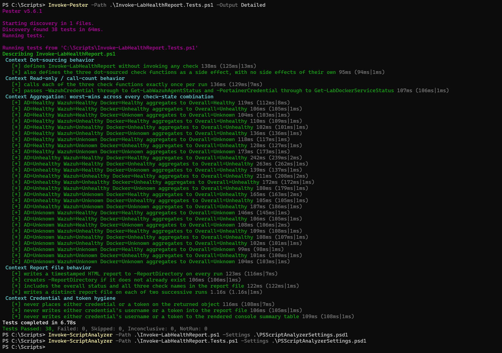
</p>

<p align="center">
  <em>Invoke-Pester re-run confirming all thirty-eight tests still passing after the OutputType correction, followed by both Invoke-ScriptAnalyzer invocations returning to the prompt with no output: a clean pass.</em>
</p>

**A first live-run attempt surfaced one further real defect, in the orchestrator's own interactive guard rather than in anything Pester or Analyzer covers.** Per the plan, once Pester and Analyzer were both clean, a live run was attempted against the real environment.

```powershell
.\Invoke-LabHealthReport.ps1
```

Both `Get-Credential` prompts were answered, but the report-directory `Read-Host` prompt was left blank. `Read-Host` returned an empty string, which was then passed through to `Invoke-LabHealthReport`'s own `Mandatory [string]$ReportDirectory` parameter; PowerShell's built-in parameter validation rejected the empty string with `ParameterArgumentValidationErrorEmptyStringNotAllowed`. That rejection is a terminating error for the failed statement, but not for the top-level script under the default `$ErrorActionPreference = 'Continue'`, so execution continued into the next lines with `$result` left `$null`: a blank summary table (headers only, `CheckName`/`Status` columns empty except a literal `Overall` row with no status) and an empty `Report written to:` line, rather than a clean stop. No live check function had actually run, since the parameter-binding failure happened before `Invoke-LabHealthReport`'s own body ever started, so nothing had reached DC01, Wazuh, or Portainer at this point.

The fix was to validate all three interactively-resolved inputs explicitly, immediately after resolving each one, and `throw` a clear, specific error right there if any is missing, rather than trusting PowerShell's own parameter binding to catch it later:

```powershell
if ([string]::IsNullOrWhiteSpace($ReportDirectory)) {
    throw 'A report directory is required to run this report; the prompt was left empty.'
}
```

The same explicit check was added for both credentials, since `Get-Credential` returns `$null` on a cancelled prompt rather than throwing, and an explicit `$null` passed to a `Mandatory` parameter of a reference type like `[PSCredential]` is accepted silently by PowerShell, unlike the empty-string case, which would otherwise let a cancelled prompt fail much later and far less clearly, deep inside a REST call. A second attempt against the same blank report-directory input confirmed the fix: the script now failed immediately with the intended message, `A report directory is required to run this report; the prompt was left empty.`, rather than continuing into a broken run.

```powershell
Invoke-Pester -Path C:\Scripts\Invoke-LabHealthReport.Tests.ps1 -Output Detailed
Invoke-ScriptAnalyzer -Path C:\Scripts\Invoke-LabHealthReport.ps1 -Settings C:\Scripts\PSScriptAnalyzerSettings.psd1
Invoke-ScriptAnalyzer -Path C:\Scripts\Invoke-LabHealthReport.Tests.ps1 -Settings C:\Scripts\PSScriptAnalyzerSettings.psd1
```

Re-run after the guard fix, Pester still passed 38 of 38 and both `Invoke-ScriptAnalyzer` invocations again returned to the prompt with no output, confirming the fix, confined to the guard's own input validation, had not touched anything either suite covers.

<p align="center">
  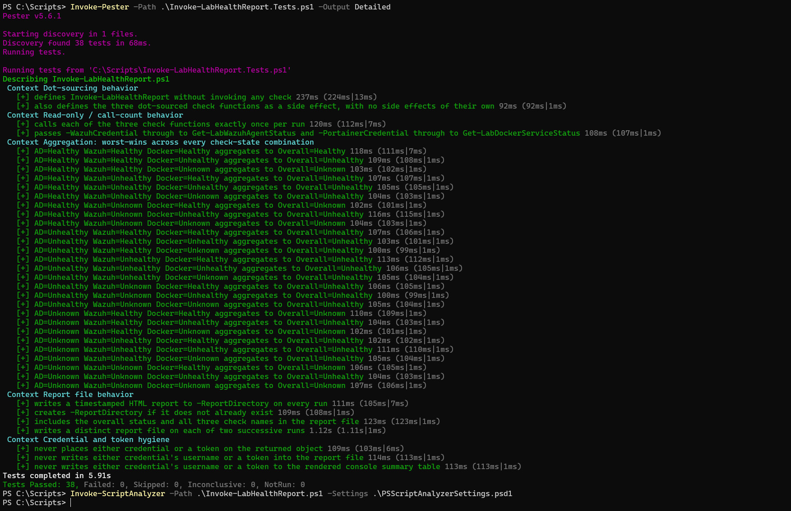
</p>

<p align="center">
  <em>Invoke-Pester re-run after the interactive-guard input-validation fix: still 38 of 38, followed by both Invoke-ScriptAnalyzer invocations returning to the prompt with no output, confirming the fix did not affect either suite.</em>
</p>

**The live run was then repeated for real, against the live environment, and returned the result the plan anticipated.**

```powershell
.\Invoke-LabHealthReport.ps1
```

Both credential prompts were answered and a real report directory (`C:\Reports`) was supplied. This returned a real `Unhealthy` overall result: `ADServiceHealth` `Healthy` and `WazuhAgentStatus` `Healthy`, matching Steps Two and Three's own live-run baselines exactly, and `DockerServiceStatus` `Unhealthy`, matching Step Four's own live-run baseline exactly, driven by the same still-unremediated monitoring-stack outage Step One found and deliberately left in place. The report was written to `C:\Reports\LabHealthReport-20260819-124807.html`.

<p align="center">
  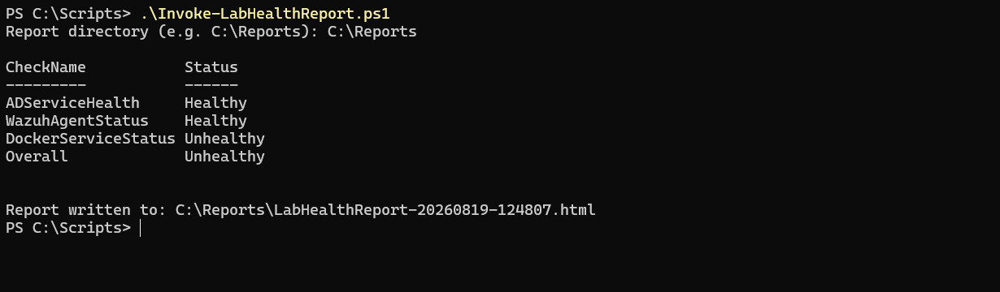
</p>

<p align="center">
  <em>.\Invoke-LabHealthReport.ps1 run standalone: the console summary table showing ADServiceHealth and WazuhAgentStatus Healthy, DockerServiceStatus Unhealthy, Overall Unhealthy, and the report path written to C:\Reports\LabHealthReport-20260819-124807.html.</em>
</p>

<p align="center">
  
</p>

<p align="center">
  <em>The generated HTML report opened in a browser: overall status Unhealthy in red; ADServiceHealth Healthy with all six services Running; WazuhAgentStatus Healthy with all three agents active; DockerServiceStatus Unhealthy, the Wazuh stack, nginx-proxy-manager, and portainer running, prometheus, grafana, and node-exporter exited, matching Step One's and Step Four's own baselines exactly.</em>
</p>

This is worst-wins, from Design Decision 4, working exactly as intended: one real fault, in one of the three checks, correctly propagated to the overall status rather than averaged away or masked by the other two checks' `Healthy` results. It is not a failure of the orchestrator, Pester coverage, or the live run; it is the same intended outcome Step One's plan anticipated back when the monitoring-stack outage was first found and deliberately left unremediated, now demonstrated end to end through the finished orchestrator for the first time. Remediation and a `Healthy` before/after comparison remain deferred to Step Seven, per the plan.

### Step Six - Make the Orchestrator Schedulable, Then Register the Scheduled Task

Split into two phases, because the orchestrator as built in Step Five could not be scheduled as it stood. Its only executable path is the `$MyInvocation.InvocationName -ne '.'` guard, and that guard resolved both credentials with `Get-Credential` and the report directory with `Read-Host`. Task Scheduler cannot answer a prompt, and a `[PSCredential]` cannot be passed on a `powershell.exe -File` command line. This was not a defect in Step Five's work, which was built for the interactive runs it was validated against; it was the remaining gap between an interactive script and an unattended one, and closing it is what Step Six-A was for.

**Step Six-A: least-privileged API accounts and a non-interactive input path.** Provisioning the two accounts came first, live against each platform's own API, since Design Decision 5 committed to least-privilege only "subject to what each platform's role model actually supports."

On Wazuh, `GET /security/roles` (as `wazuh-wui`) showed the Manager's built-in roles, including `agents_readonly` (id 4), scoped to exactly what `Get-LabWazuhAgentStatus.ps1` needs (`GET /agents`), tighter than the broader `readonly` role. `POST /security/users` created `labhealthcheck-wazuh`, and `POST /security/users/100/roles?role_ids=4` attached the role. Authenticating as the new account and calling `Get-LabWazuhAgentStatus.ps1 -Credential $checkCred` directly returned all three target agents `active` and `OverallStatus Healthy`, matching Step Three's original baseline under the broader `wazuh-wui` account. `wazuh-wui` itself was never touched.

<p align="center">
  
</p>

<p align="center">
  <em>Get-LabWazuhAgentStatus.ps1 -Credential $checkCred, running as the new labhealthcheck-wazuh account (agents_readonly role only): all three target agents active, OverallStatus Healthy.</em>
</p>

On Portainer, the equivalent attempt surfaced a real platform limit instead of a working account. A standard (non-admin) user was created and granted access to endpoint 3 via `PUT /api/endpoints/3` (`UserAccessPolicies`), which this Portainer version accepted as plain JSON. The account could reach the Docker proxy (`GET .../docker/version` returned real engine data) but `GET .../docker/containers/json` returned a genuinely empty array, `Count: 0`, not an error.

<p align="center">
  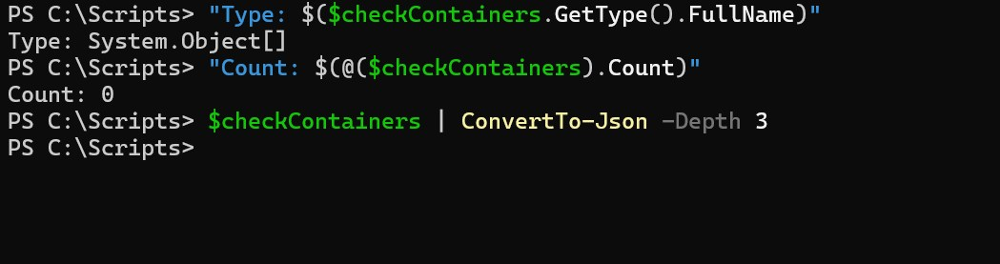
</p>

<p align="center">
  <em>The standard Portainer account reaching endpoint 3's Docker proxy successfully but the container-listing call returning a genuine, empty System.Object[]: Count 0, not an error.</em>
</p>

`GET /security/roles`'s Portainer equivalent, `GET /api/roles`, returned nothing at all, and Portainer's own documentation confirmed why: "for security reasons, all resources inside an environment are assigned only to the administrator by default," with no environment-wide override, only a per-resource one. The eight monitored containers span three compose projects deployed directly on Ubuntu Server, none through Portainer, so none carry the ownership metadata a non-admin view depends on; making them visible would mean standing, per-resource changes across three unrelated stacks, fragile to any future container recreation (including Step Seven's own monitoring-stack remediation), for a materially bigger footprint than an account. `Get-LabDockerServiceStatus.ps1` keeps the existing admin account; the standard user and its endpoint grant were reverted and deleted rather than left as unused exposure.

**That rejected account left behind a real defect in a script this step was not meant to touch.** The empty container list was recorded above as a platform finding and nothing more, until a review asked what `Get-LabDockerServiceStatus.ps1` would actually have done with that response. It would have walked its eight-entry `-ExpectedContainer` list, matched none, reported eight `NotFound` rows, and classified the check `Unhealthy` with a blank `Message`: a full-environment outage reported for a query that succeeded and simply could not see anything. That is the same misclassification Step Two found in `Get-LabADServiceHealth.ps1`, reached by a different route. There, `-Name` with `SilentlyContinue` made an unreachable host indistinguishable from absent services; here, a permissions-blinded response is indistinguishable from every container having vanished. Both collapse a failed observation into a confirmed fault, the direction Design Decision 4 introduced `Unknown` to avoid, and both were missed by suites that were fully passing at the time.

An empty list is not an ambiguous reading in this environment, which is what makes a guard defensible rather than arbitrary. The `portainer` container is itself in the expected set, and Portainer is what served the request, so a response describing zero containers cannot be a true description of the host that just answered: the response is wrong, not the environment. `Get-LabDockerServiceStatus.ps1` now returns `Unknown`, with a message saying the query succeeded but returned no containers, before it reaches the matching loop.

`Get-LabWazuhAgentStatus.ps1` was given the same guard, on inspection rather than observation, since it has the identical shape: an agent query returning nothing would have produced three `NotFound` agents and `Unhealthy`. Its guard deliberately tests the whole response before agent `000` is filtered out, because that distinction is real. Agent `000` is the Manager's own built-in agent and is always present, so a completely empty response cannot describe a working Manager, while a response carrying only agent `000` is a genuine state, no monitored agents enrolled, and must stay `Unhealthy` rather than being masked as `Unknown`. A test locks each side of that line.

Both guards also handle the case where the response body is empty rather than an empty array, which leaves the response variable `$null` and, through the existing `@()` wrap, a single-element array holding `$null`. Filtering nulls covers both shapes without disturbing the assign-then-wrap form Step Four's array-nesting fix depends on. The Docker regression test reproduces the observed shape with the unary comma operator, `, @()`, for the same reason Step Four's own deserialization test does: a bare `@()` returned from `-MockWith` emits nothing at all, which is the separate null case, covered by its own test.

```powershell
Invoke-Pester -Path C:\Scripts\Get-LabDockerServiceStatus.Tests.ps1 -Output Detailed
Invoke-Pester -Path C:\Scripts\Get-LabWazuhAgentStatus.Tests.ps1 -Output Detailed
```

`Get-LabDockerServiceStatus.Tests.ps1` returned `Discovery found 19 tests in 164ms` and `Tests Passed: 19, Failed: 0, Skipped: 0, Inconclusive: 0, NotRun: 0`; `Get-LabWazuhAgentStatus.Tests.ps1` returned `Discovery found 17 tests in 190ms` and `Tests Passed: 17, Failed: 0, Skipped: 0, Inconclusive: 0, NotRun: 0`. All four `Invoke-ScriptAnalyzer` invocations, both scripts and both test files, returned to the prompt with no output.

<p align="center">
  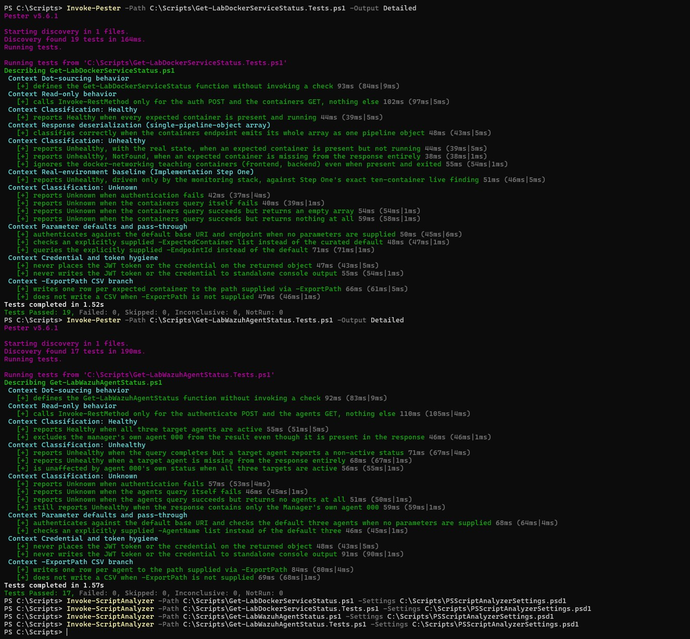
</p>

<p align="center">
  <em>The empty-response guards under test: Get-LabDockerServiceStatus.Tests.ps1 at 19 of 19 including both new Unknown cases, Get-LabWazuhAgentStatus.Tests.ps1 at 17 of 17 including the empty-response case and the agent-000-only case that must stay Unhealthy, followed by all four Invoke-ScriptAnalyzer invocations returning no output.</em>
</p>

The defect was latent rather than live: the scheduled path uses the Portainer admin account, which returns the full container list, so no run of this lab has ever misreported because of it. It was fixed here anyway rather than deferred, because Step Seven's planned before-and-after exists specifically to demonstrate that the three-state classification discriminates a real fault from a clean environment, and a known hole in `Unknown` detection would undercut the claim that demonstration is meant to support.

`Invoke-LabHealthReport.ps1` then gained a `Get-LabStoredCredential` helper, an `Import-CliXml` wrapper validating explicitly with one throw if the file is absent and a different one if it does not deserialize to a `[PSCredential]`, plus an optional top-level parameter wiring it into the guard for whichever credential was not supplied directly, preferred over the `Get-Credential` prompt. The parameter was planned as `-CredentialDirectory` until `PSAvoidUsingPlainTextForPassword` flagged it: the rule's word list is `Password`, `Passphrase`, `Cred`, `Credential`, matched case-insensitively against any `[string]` parameter, so no variant keeping the word clears it. Renamed to `-SecretsDirectory`, fixing the code rather than suppressing the rule. `Invoke-LabHealthReport`'s own three `Mandatory` parameters and body were untouched. Three Contexts were added: a genuine `Export-CliXml`/`Import-CliXml` round trip in `TestDrive:\`, a missing-file throw, and a wrong-type throw. The full suite passed 41 of 41, and both files returned a clean analyzer pass.

<p align="center">
  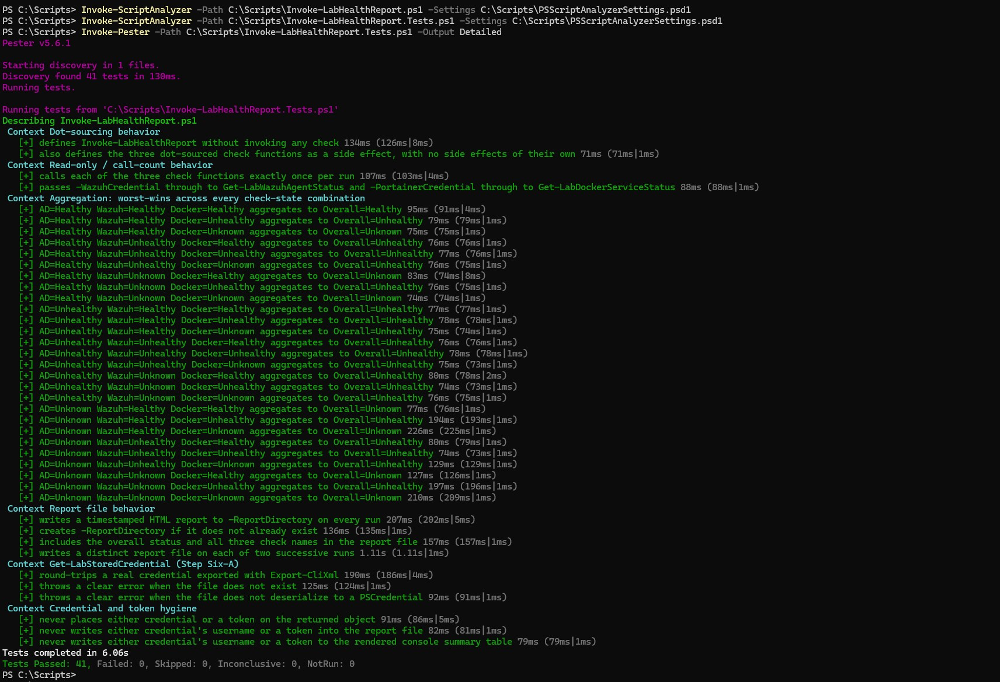
</p>

<p align="center">
  <em>Invoke-ScriptAnalyzer clean on both files, followed by Invoke-Pester: 41 of 41 tests passing, including the new Get-LabStoredCredential Context.</em>
</p>

The two credential files, `wazuh.cred.xml` (`labhealthcheck-wazuh`) and `portainer.cred.xml` (the existing admin account), were exported with `Export-CliXml` in an interactive session confirmed to be `labadmin`, into `C:\Secrets`. The exact command line Step Six-B will register was then run from a normal console:

```
powershell.exe -NoProfile -NonInteractive -ExecutionPolicy Bypass -File C:\Scripts\Invoke-LabHealthReport.ps1 -SecretsDirectory C:\Secrets -ReportDirectory C:\Reports
```

It completed with no prompt and wrote a timestamped report, returning `Unhealthy` overall: AD and Wazuh `Healthy`, Docker `Unhealthy`, the still-unremediated monitoring stack, the expected result rather than a problem.

<p align="center">
  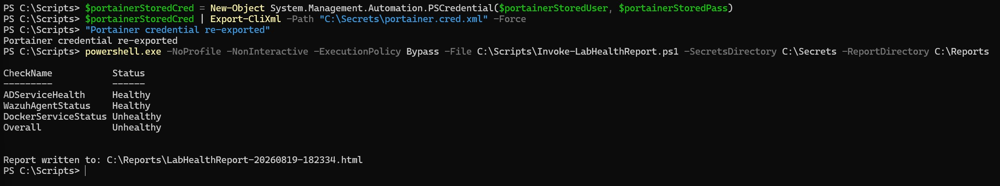
</p>

<p align="center">
  <em>The exact scheduled-task command line run from a normal console: completes with no prompt, writes LabHealthReport-20260819-182334.html, Overall Unhealthy.</em>
</p>

**Step Six-B: built `Register-LabHealthReportTask.ps1`, registered the task, and observed a real firing.** The script takes a `[PSCredential]` for the run-as account rather than separate username and password parameters, both because that is the discipline every credential in this lab follows and because a `Password` parameter would trip `PSAvoidUsingUserNameAndPasswordParams` and `PSAvoidUsingPlainTextForPassword`; the plaintext password is unwrapped at the `Register-ScheduledTask` call site only, via `$RunAsCredential.GetNetworkCredential().Password`, and held in no variable. A live `Get-Help Register-ScheduledTask -Full`, checked rather than assumed, showed four parameter sets and confirmed the `-Principal` one carries no `-Password` at all; only `Xml`, `User`, and `Object` accept one. The script therefore registers through the `User` set, passing `-User`, `-Password`, and `-RunLevel Limited` directly, never `New-ScheduledTaskPrincipal`. `Register-` is on the state-changing-verb list, so the function implements `[CmdletBinding(SupportsShouldProcess = $true)]` for real, gating the call behind `$PSCmdlet.ShouldProcess(...)` rather than renaming its way around the rule as Step Five did; it is the first script in the track to do so, being the first that changes state. Re-running against an existing task name has defined behavior rather than an obscure failure: `Get-ScheduledTask` is queried first, unconditionally, and the function throws naming the task and directing the caller to `-Force`.

The action is built from the function's own `-ScriptPath`, `-SecretsDirectory`, and `-ReportDirectory` parameters rather than hardcoded, producing the exact command line Step Six-A already confirmed runs clean with no prompt: `powershell.exe -NoProfile -NonInteractive -ExecutionPolicy Bypass -File C:\Scripts\Invoke-LabHealthReport.ps1 -SecretsDirectory C:\Secrets -ReportDirectory C:\Reports`. The trigger is daily at `-TriggerTime`, defaulting to 07:00 local; the settings are `-StartWhenAvailable` and a `-ExecutionTimeLimitMinutes`-minute limit, defaulting to 15, both built with `New-ScheduledTaskSettingsSet`.

Building the Pester suite, which mocks the `ScheduledTasks` cmdlets so registration logic is verified without registering anything, surfaced three real findings rather than confirming the design first time. The first run, four of fifteen passing, failed with `Cannot convert the ... PSCustomObject to type Microsoft.Management.Infrastructure.CimInstance[]`: Pester's `Mock` enforces a mocked cmdlet's real parameter type metadata, so hand-built `PSCustomObject` stand-ins for `New-ScheduledTaskAction` and `New-ScheduledTaskTrigger` would not bind to `Register-ScheduledTask`'s `CimInstance[]` parameters even with both cmdlets mocked. Fixed by leaving those two and `New-ScheduledTaskSettingsSet` unmocked, all three being side-effect-free, and asserting on their real `CimInstance` output. The second run, thirteen of fifteen, failed with `Cannot validate argument on parameter 'Password'. The argument is null or empty`: the real `-Password` validation rejects an empty string even under Mock, so the test credential needed a non-empty `SecureString` built with `.AppendChar()` rather than `ConvertTo-SecureString -AsPlainText`, which would have tripped `PSAvoidUsingConvertToSecureStringWithPlainText`. The third left two trigger tests failing on "called 0 times"; rather than guess again, the real value was captured live, `(New-ScheduledTaskTrigger -Daily -At '07:00').StartBoundary` returning `2026-08-19T11:00:00Z`, showing `StartBoundary` is UTC and `Z`-suffixed rather than local. The assertions were rewritten to parse it through `[datetimeoffset]$PesterBoundParameters['Trigger'][0].StartBoundary).LocalDateTime`, robust to the UTC/local distinction rather than assuming an offset. The suite reached fifteen of fifteen, both files analyzer-clean throughout.

<p align="center">
  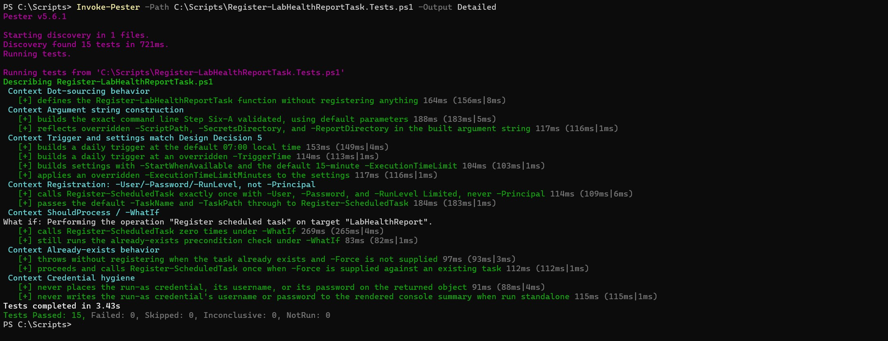
</p>

<p align="center">
  <em>Register-LabHealthReportTask.Tests.ps1, third run: fifteen of fifteen tests passing after the CimInstance typing, empty-Password validation, and UTC StartBoundary findings were fixed.</em>
</p>

Registration itself requires an elevated session, a separate requirement from the non-elevated session the check itself needs (Design Decision 5, confirmed in Implementation Step One). Run elevated from `C:\Scripts`, the script prompted only for the run-as password via `Read-Host -AsSecureString`, consistent with the username being fixed to `CORP\labadmin` and `Get-Credential`'s dialog already having failed to accept input in this environment's remote session once (Step One). Registration completed and printed `TaskName LabHealthReport, TaskPath \, State Ready`. `Get-ScheduledTask -TaskName 'LabHealthReport' | Select-Object -ExpandProperty Principal` was then run to confirm, rather than assume, that the `-User`/`-Password`/`-RunLevel` parameter set actually produced the configuration Design Decision 5 requires: `LogonType Password`, `RunLevel Limited`, `UserId labadmin`, exactly as specified.

<p align="center">
  
</p>

<p align="center">
  <em>Registration succeeded (State: Ready); Get-ScheduledTask's Principal confirms LogonType Password, RunLevel Limited, UserId labadmin.</em>
</p>

Task Scheduler's "All Tasks History" was checked before the first firing rather than after, since it cannot be enabled retroactively; it was already enabled in this environment, so no separate step was needed to turn it on.

07:00 had already passed for the day the task was registered, so observing that day's real firing would have meant waiting until the next morning. Rather than leave the step incomplete overnight, the documented fallback was used instead: the trigger was moved forward a few minutes with `Set-ScheduledTask -Trigger`, the firing was observed, and the trigger was restored to 07:00 immediately afterward. The first attempt to move the trigger forward failed with `The user name or password is incorrect` (`0x8007052e`): updating a `LogonType Password` task, not only registering one, requires the run-as credential to be supplied again to `Set-ScheduledTask`, confirmed live with `Get-Help Set-ScheduledTask -Full` rather than guessed a second time, which showed `-User` and `-Password` are available on its default parameter set. The retry, supplying `-User` and `-Password`, succeeded, and `Get-ScheduledTaskInfo` showed the new `NextRunTime` a few minutes out.

With the trigger moved forward, the session was logged off entirely rather than merely locked, since "run whether the user is logged on or not" is the configuration actually under test, and waited past the new trigger time before logging back in. `Get-ScheduledTaskInfo` afterward showed `LastRunTime` at the moved trigger time and `LastTaskResult 0`, and `Get-ChildItem C:\Reports | Sort-Object LastWriteTime -Descending` showed a report file timestamped to that same moment and distinct from any earlier manual run.

<p align="center">
  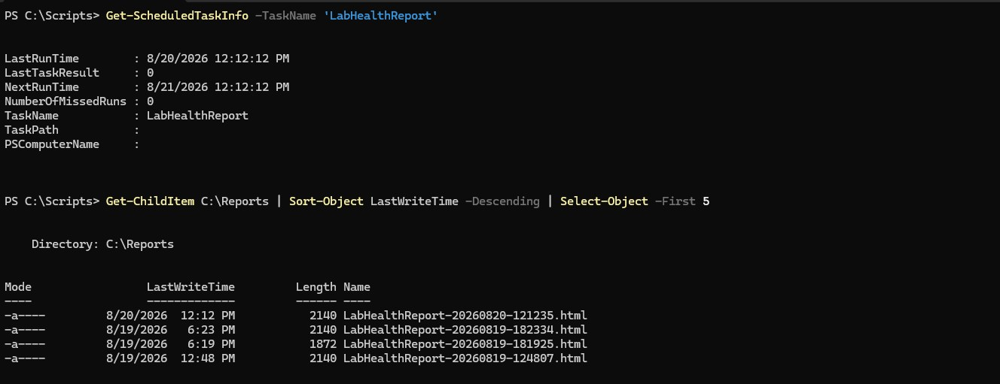
</p>

<p align="center">
  <em>Get-ScheduledTaskInfo after the moved-forward firing: LastRunTime matches the trigger, LastTaskResult 0; Get-ChildItem C:\Reports shows a report file timestamped to the same moment.</em>
</p>

Task Scheduler's own operational log was queried next, filtered to the last thirty minutes and to messages mentioning `LabHealthReport`, to confirm the firing was genuinely time-trigger-driven rather than assembled from a manual run's side effects. The chain showed event `100` (task started for `CORP\labadmin`), `129` (task launched, `powershell.exe`, with its process ID), `107` ("launched ... due to a time trigger condition", the specific confirmation that this was a scheduled rather than manual firing), `200` (action launched), and `201`/`102` (action and task completed, return code `0`), alongside the two earlier `140`/`106` events recording the trigger having been moved and the task's original registration.

<p align="center">
  
</p>

<p align="center">
  <em>Task Scheduler operational log: the full event chain for the firing, including event 107, "launched ... due to a time trigger condition."</em>
</p>

A check for a hung process, `Get-CimInstance Win32_Process -Filter "Name='powershell.exe'"`, found exactly one `powershell.exe` running, the fresh interactive session opened after logging back in, with a creation time after the scheduled firing had already completed; the scheduled task's own process, whose ID the operational log recorded, had already exited. The report file's own contents were then checked directly with `Select-String -Path <report> -Pattern 'Overall status'`, confirming `Overall status: Unhealthy`, the result predicted by the still-unremediated monitoring stack and matching what a manual run of the same scripts already returns.

Restoring the trigger to 07:00 surfaced a second, distinct real finding. The first restore attempt, run from the fresh session opened after logging back in and supplying the run-as credential as the earlier fix required, failed anyway, with `Set-ScheduledTask : Access is denied` (`0x80070005`, `PermissionDenied`); `Get-ScheduledTaskInfo` afterward showed `NextRunTime` unchanged, no corruption. The credential was not the problem this time: that fresh session was not itself elevated, a separate requirement from the credential one, and modifying a registered task, like registering it in the first place, needs an elevated session.

<p align="center">
  
</p>

<p align="center">
  <em>Select-String confirms the report's own contents match the predicted Unhealthy result; the first trigger-restore attempt fails with Access is denied, NextRunTime unchanged, before the session was re-elevated.</em>
</p>

An elevated session was opened and the restore retried, supplying the run-as credential again; it succeeded, and `Get-ScheduledTaskInfo` showed `NextRunTime` back at `8/21/2026 7:00:00 AM`.

<p align="center">
  
</p>

<p align="center">
  <em>Trigger restore retried from an elevated session: succeeds, NextRunTime back at 8/21/2026 7:00:00 AM.</em>
</p>

`Get-ScheduledTask -TaskName 'LabHealthReport' | Select-Object -ExpandProperty Principal` was checked one last time after both `Set-ScheduledTask` updates, confirming `LogonType Password`, `RunLevel Limited`, and `UserId labadmin` were unchanged by either the temporary trigger move or its restore.

<p align="center">
  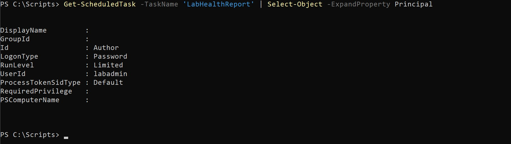
</p>

<p align="center">
  <em>Final Principal check: LogonType Password, RunLevel Limited, UserId labadmin, unchanged after both trigger updates.</em>
</p>

### Step Seven - Ran All Checks Live and Validated Against Independent Sources

**Sub-step one: confirmed the deployment matched the repository.** Before any sweep could mean anything, `C:\Scripts` had to be a faithful copy of what is committed rather than what was manually copied there at some earlier point. `Get-ChildItem -Path C:\Scripts -File` confirmed all 27 expected files present, thirteen scripts, thirteen test files, and `PSScriptAnalyzerSettings.psd1`, nothing missing or extra. A SHA256 comparison against the repository flagged four as mismatched: `Add-LabGroupMembers.ps1`, `Get-LabAccountInventory.ps1`, `Get-LabOUReport.ps1`, and `PSScriptAnalyzerSettings.psd1`. A raw `Get-Content -Raw` paste appeared to show blank lines stripped throughout, a terminal-paste artifact rather than a real difference; a base64-encoded, fixed-width dump, immune to whitespace handling in transit, showed the real and much smaller drift: all four missing their trailing newline, and the settings file carrying one extra blank line before `ExcludeRules = @(`. Both are functionally inert, but they were real, and a byte-for-byte hash caught what eyeballing the file list would not have. The four were re-copied and a second comparison confirmed all 27 matched byte-for-byte once the two filesystems' legitimate CRLF/LF difference was normalized out.

**Sub-step two: validated the report's signals against independent sources.** The report validated was `LabHealthReport-20260821-165105.html`, completed 8/21 4:51:05 PM. `Get-ScheduledTaskInfo` and an unfiltered dump of the `Microsoft-Windows-TaskScheduler/Operational` log for the surrounding ten minutes established this as a genuine unattended firing, but not a literal 07:00 time-trigger one: the Task Scheduler service had restarted around 4:45 PM and the task caught up through `StartWhenAvailable` (event `114`, then `129`, `100`, `200`, `201`, `102`), not a time-trigger event `107`. The cause was unrelated to this lab: a thunderstorm had passed through and the equipment had been unplugged, taking the host and VM offline until that afternoon. It is accepted as valid evidence here, since Design Decision 5 requires a genuinely unattended firing rather than a literal 07:00 one, and is documented as what it was rather than implied to be routine.

The report's own per-check breakdown read `ADServiceHealth (Healthy)`, `WazuhAgentStatus (Healthy)`, `DockerServiceStatus (Unhealthy)`, `Overall status: Unhealthy`, confirming worst-wins aggregation was already working correctly for this run before any independent check was made.

The three observations below were taken over the hours following the run rather than simultaneously with it, with each timing given where it was recorded. Nothing in the three signals was moving across that window, so the gap does not weaken the comparison, but a cross-check taken hours later is not the same claim as one taken alongside the run and is not presented as one.

Active Directory service state was checked directly on DC01, not through `Get-Service -ComputerName` a second time, which would reuse the exact path the script already queries. The first attempt was run on WIN11-CLIENT01 by mistake and returned `Cannot find any service with service name` for `NTDS`, `DNS`, `Kdc`, and `ADWS`, with only `Netlogon` and `W32Time` `Running`, exactly what a domain-joined client with no AD DS role would show. Run again genuinely on DC01, `DNS`, `Kdc`, `Netlogon`, `W32Time`, and `ADWS` all reported `Running`, but `NTDS` itself came back not found, an anomaly worth investigating given that `Kdc` and `ADWS` alone are conclusive evidence of a real domain controller. A follow-up `Get-Service | Where-Object { $_.DisplayName -like '*Directory*' -or $_.Name -eq 'NTDS' }` confirmed `NTDS` was not visible at all in that non-elevated session. From an elevated session, all six including `NTDS` reported `Running`. The likely explanation is that `NTDS`'s service security descriptor is locked down tighter than the other five, reasonable for the one service guarding the domain's credential database, requiring elevation to enumerate locally where the others do not. This matched the report's `ADServiceHealth (Healthy)` finding and surfaced a previously undocumented property of this environment, recorded in Troubleshooting and Adjustments below.

<p align="center">
  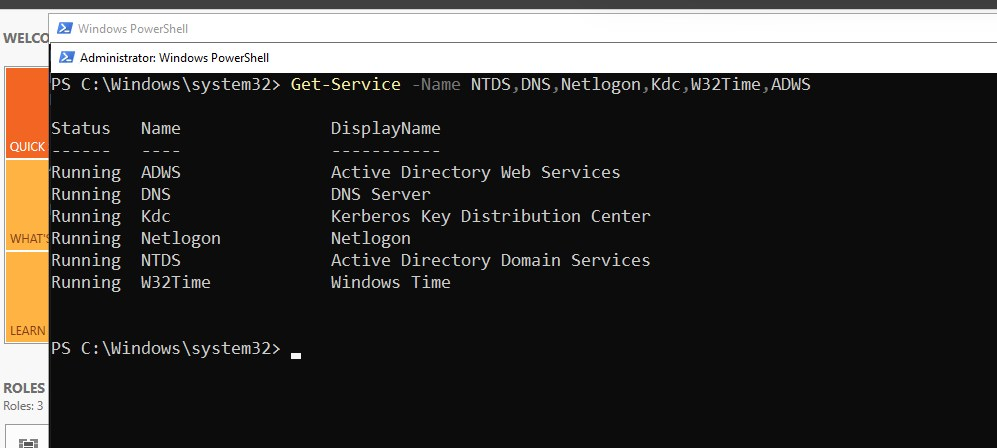
</p>

<p align="center">
  <em>All six target AD services, including NTDS, reporting Running from an elevated session on DC01 itself, the genuinely independent AD service observation. NTDS did not resolve in the two prior non-elevated attempts.</em>
</p>

Wazuh agent status was checked against the Wazuh Dashboard's Agents view at `https://192.168.1.226:8443`, not the Overview page's aggregate count alone. The Overview page showed `Active (3)`, `Disconnected (0)`, consistent with the report, but the dedicated Endpoints/Agents inventory was pulled to confirm each of the three hosts individually: `UBUNTU-SERVER`, `WIN11-CLIENT01`, and `DC01` all listed `active`. This screenshot was taken at 8:56 PM, roughly four hours after the report ran at 4:51 PM, a timing gap worth stating plainly rather than implying the observation was simultaneous with the report.

<p align="center">
  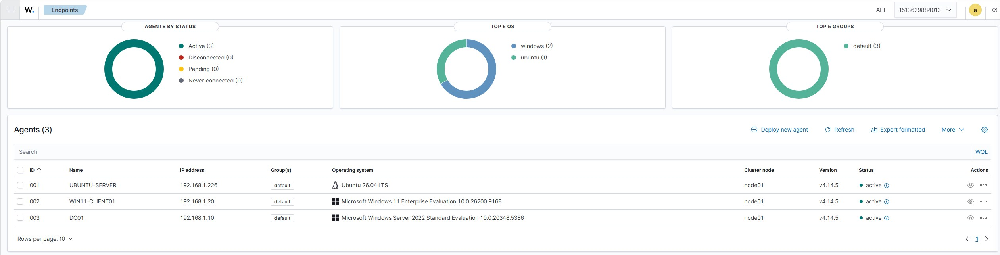
</p>

<p align="center">
  <em>Wazuh Dashboard Agents inventory: DC01, WIN11-CLIENT01, and UBUNTU-SERVER all individually listed active, matching the report's WazuhAgentStatus (Healthy) finding.</em>
</p>

Docker service state was checked with a raw `docker ps -a` and `docker compose ls -a` over SSH on Ubuntu Server, not the Portainer UI, which shares the same API path `Get-LabDockerServiceStatus.ps1` already queries and is therefore not independent per Design Decision 7. Both matched the report and Step One's original baseline exactly: the Wazuh stack, `nginx-proxy-manager`, and `portainer` all `Up About an hour`, consistent with the afternoon's service restart; `prometheus` and `grafana` `Exited (0)`, `node-exporter` `Exited (2)`, unchanged from the two-month-old baseline; `docker compose ls -a` showing `monitoring-stack exited(3)` and `docker-networking exited(2)`, with `reverse-proxy-lab running(1)` and `single-node running(3)`.

<p align="center">
  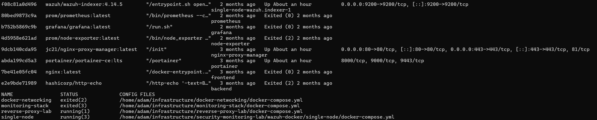
</p>

<p align="center">
  <em>Raw docker ps -a and docker compose ls -a over SSH on Ubuntu Server, matching the report's DockerServiceStatus (Unhealthy) finding and Step One's original baseline exactly.</em>
</p>

All three independent sources matched the report, and worst-wins held correctly: two `Healthy` signals (AD, Wazuh) and one `Unhealthy` signal (Docker) produced an overall `Unhealthy`, the actual live-run demonstration of the aggregation rule Design Decision 4 defined.

**Sub-step three: root-caused the monitoring-stack outage before remediating it.** Root cause had to be investigated before anything was touched, since restarting the containers would destroy the evidence. `docker inspect` on `prometheus`, `grafana`, and `node-exporter` showed all three stopped within about two seconds of each other, between 17:57:30 and 17:57:32 UTC on 2026-06-18, five days after the stack was originally deployed. `prometheus` and `grafana` both logged a graceful shutdown (`"Received an OS signal, exiting gracefully..." signal=terminated`) and exited with code `0`; `node-exporter` exited with code `2`, an unclean exit the pasted logs did not explain, since they only captured its June 13 startup sequence, not the shutdown moment itself. That tight a synchronization across three independent containers points at a single `docker compose down` or `docker compose stop` against the monitoring-stack project, not three unrelated crashes.

`uptime -s` showed the host's current boot time as 2026-08-21 16:38:45, the thunderstorm-driven restart. That meant the host had rebooted at least once since the containers stopped in June, and they still had not come back, which the compose file and `docker inspect` output both confirmed: `RestartPolicy=no` on every service, no `restart:` key anywhere in `docker-compose.yml`. This was not a crash-loop or a resource fault; it was a stack stopped once, over two months earlier, with nothing to bring it back on any subsequent reboot, including the one that had just happened.

What triggered the June 18 stop could not be established with certainty. Nothing in the repository documents it: the compose file at `infrastructure/monitoring-stack/` had not been touched since June 9, before both the deployment and the stop, so no change shipped through a commit, and linux infrastructure Lab 06's document has no Troubleshooting section, no restart-policy discussion, and no note of an outage. The one lead is circumstantial: commit history shows active work on enterprise infrastructure Lab 07, the Wazuh deployment on the same host, that day, with commits at 13:23 and 18:42 local bracketing the 13:57 stop. Lab 07's documentation never mentions the monitoring stack and the stop is not remembered as a deliberate action. The confirmed root cause is the mechanism, a graceful stop with no restart policy to recover from it; the trigger is recorded as an educated, unconfirmed guess rather than a settled fact.

**Sub-step four: remediated and captured a genuine before/after.** Whether to add a `restart:` policy to `infrastructure/monitoring-stack/docker-compose.yml` raised a scope question: that file is linux infrastructure Lab 06's documented artifact, and ADR-015 scopes this track to automating the existing environment rather than changing it. Review recommended against editing it from this track. Restoring the containers to their already-documented state is remediation squarely inside this lab's story, but changing the file's contents would leave Lab 06's documentation describing a file that no longer matches what is deployed, and raised an unresolved question of which copy, the repository's or Ubuntu Server's, is authoritative. The decision was to close this lab without editing it, adding the restart policy separately, outside this track.

Remediation was therefore a straight restart against the existing, unmodified compose file: `docker compose start` from `~/infrastructure/monitoring-stack`, which brought all three containers back up, confirmed by `docker compose ps` showing `node-exporter`, `grafana`, and `prometheus` all `Started`, `Up 2 seconds`.

<p align="center">
  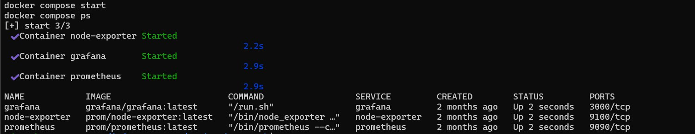
</p>

<p align="center">
  <em>docker compose start bringing all three monitoring-stack containers back up against the unmodified compose file; no restart policy was added.</em>
</p>

The before half of the comparison is the same `LabHealthReport-20260821-165105.html` validated in sub-step two: `Overall status: Unhealthy`, `DockerServiceStatus (Unhealthy)`.

<p align="center">
  
</p>

<p align="center">
  <em>Before remediation: Overall status Unhealthy, driven by DockerServiceStatus Unhealthy, with ADServiceHealth and WazuhAgentStatus both already Healthy.</em>
</p>

The after half came from the very next scheduled firing, 8/22 at 7:00 AM, confirmed as a genuine time-trigger firing rather than another `StartWhenAvailable` catch-up: `Get-ScheduledTaskInfo` showed `LastRunTime 8/22/2026 7:00:01 AM`, and the operational log recorded event `107`, "due to a time trigger condition," at `7:00:01 AM`, with the task completing cleanly (event `201`, return code `0`) at `7:00:23 AM`. `LabHealthReport-20260822-070023.html` read `Overall status: Healthy`, with `ADServiceHealth`, `WazuhAgentStatus`, and `DockerServiceStatus` all `Healthy`.

<p align="center">
  
</p>

<p align="center">
  <em>After remediation, from the next genuine 07:00 time-trigger firing: Overall status Healthy, all three checks Healthy.</em>
</p>

Both halves of this comparison came from scheduled firings rather than manual runs, though not the same kind of firing: the before was a delayed `StartWhenAvailable` catch-up and the after was a literal on-time trigger, stated plainly here rather than implied to be equivalent. The remediation, restarting the containers with no other change, is what took Docker from `Unhealthy` to `Healthy`, and worst-wins correctly flipped `Overall` along with it, the concrete demonstration Design Decision 4's aggregation rule was designed to produce.

**Sub-step five: ran the first combined static analysis and test sweep across the whole library.** `Invoke-ScriptAnalyzer -Path C:\Scripts -Settings C:\Scripts\PSScriptAnalyzerSettings.psd1 -Recurse` returned to the prompt with no output, a clean pass across all thirteen scripts under the pinned settings file, the first time the full library had been swept together rather than one script at a time.

<p align="center">
  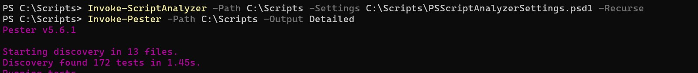
</p>

<p align="center">
  <em>Invoke-ScriptAnalyzer against the whole of C:\Scripts returning to the prompt with no output, immediately followed by Invoke-Pester starting discovery across all thirteen test files.</em>
</p>

`Invoke-Pester -Path C:\Scripts -Output Detailed` discovered 172 tests across all thirteen test files and completed with `Tests Passed: 172, Failed: 0, Skipped: 0, Inconclusive: 0, NotRun: 0`.

<p align="center">
  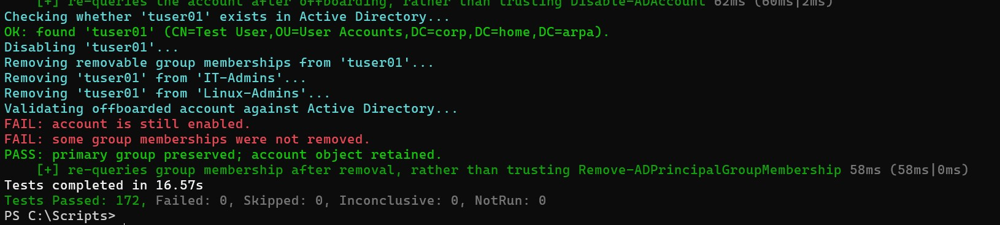
</p>

<p align="center">
  <em>Pester's own combined summary: 172 of 172 tests passed, the real total from the first-ever combined sweep, taken directly from the tool's output.</em>
</p>

A number of `FAIL:`/`ABORT:`/`ERROR:` lines appear scattered through the detailed console output, and are worth being explicit about: these are not Pester failures. They are the scripts' own `Write-Host` status lines, the diagnostic output `PSScriptAnalyzerSettings.psd1` deliberately excludes `PSAvoidUsingWriteHost` for, firing correctly under mocked failure scenarios. `Remove-LabUser.ps1`'s query-back validation, for example, printed `FAIL: account is still enabled` when a test deliberately mocked a re-query showing the disable had not taken, and that test itself passed (`[+]`), because the point of the test was confirming the script's own failure-detection logic works, not that the disable succeeded. No cross-file interference from similarly-named script-scoped helper functions was observed; every file's `Describe` block ran clean under its own name.

---

## Validation

This lab is considered validated because:

- `Get-LabADServiceHealth.ps1`'s reported state for DC01's six target services matched a direct, independent `Get-Service` query against DC01 itself, run from an elevated session after two lower-privilege attempts failed to enumerate `NTDS` specifically
- `Get-LabWazuhAgentStatus.ps1`'s reported state for all three agents matched the Wazuh dashboard's Agents view at `https://192.168.1.226:8443`, checked against each host individually rather than the Overview page's aggregate count alone, observed roughly four hours after the run rather than alongside it, as Step Seven records
- `Get-LabDockerServiceStatus.ps1`'s reported state for the expected container set matched a direct `docker ps -a`/`docker compose ls -a` run over SSH on Ubuntu Server, not the Portainer UI, per Design Decision 7
- `Invoke-LabHealthReport.ps1`'s aggregated overall status correctly reflected the worst-wins rule from Design Decision 4 against the live run's actual combination of results, two `Healthy` and one `Unhealthy` producing an overall `Unhealthy`, and again, all three `Healthy`, after remediation
- the scheduled Task Scheduler job fired on its configured cadence unattended, both as a `StartWhenAvailable` catch-up after a real power outage and as a genuine 07:00 time trigger the following morning, producing a timestamped report file on WIN11-CLIENT01 each time
- none of this lab's four query scripts (`Get-LabADServiceHealth.ps1`, `Get-LabWazuhAgentStatus.ps1`, `Get-LabDockerServiceStatus.ps1`, `Invoke-LabHealthReport.ps1`) was found, on review, to call anything other than a read-only query (`Get-Service`, or a `GET`/authentication `POST` against the Wazuh and Portainer APIs); nothing in this lab modified AD, Wazuh, or Docker state, and the monitoring-stack containers were restarted, not reconfigured. `Register-LabHealthReportTask.ps1` is the deliberate exception and is state-changing by definition, but only against WIN11-CLIENT01's own Task Scheduler, and only when run once by hand; it is never invoked by the scheduled job it registers
- the full combined script library, all thirteen scripts and thirteen test files in `C:\Scripts`, passed a clean `Invoke-ScriptAnalyzer -Recurse` sweep and a clean combined `Invoke-Pester` run, 172 of 172 tests passing

Consistent with the rule this track has held since Lab 01, no script's reported result was accepted from its own output alone; each was checked against the independent source named in Design Decision 7.

---

## Troubleshooting and Adjustments

All seven steps are implemented and run against the live environment; every entry below is recorded in past tense as encountered-and-resolved, including the monitoring-stack outage, which carried an open root cause from Step One through Step Seven, where it was closed out.

**PowerShell 5.1's `Invoke-RestMethod` has no `-SkipCertificateCheck` parameter (encountered and resolved, Step One).** The Wazuh stack uses self-signed certificates generated by the `wazuh-certs-generator` container (enterprise Lab 07). The anticipated `[System.Net.ServicePointManager]`-based accommodation (forcing TLS 1.2 and installing a certificate-validation callback) worked on the first attempt against the Wazuh Manager API, with no TLS handshake error. The same accommodation was reapplied against `portainer.local` and did not resolve an HTTPS failure there, but that turned out to be a different problem entirely (see below), not a defect in the accommodation itself.

**`Get-Service -ComputerName` against DC01 is reachable, and requires no elevation (encountered and resolved, Step One).** `Get-Service -ComputerName DC01 -Name NTDS,DNS,Netlogon,Kdc,W32Time,ADWS` succeeded on the first attempt from a non-elevated session, returning all six services as `Running`. The Service Control Manager's remote RPC interface is open between WIN11-CLIENT01 and DC01 with no additional firewall configuration needed, and the `Get-Service` half of Design Decision 5's elevation question is answered: elevation is not required.

**The Wazuh Manager API validates against its own dedicated account, distinct from the Dashboard/Indexer login (encountered and resolved, Step One).** Authentication against `POST /security/user/authenticate` was attempted first with the Dashboard/Indexer `admin` credentials, which had just worked against the Wazuh Dashboard, and failed twice with `{"title":"Unauthorized","detail":"Invalid credentials"}`. This was not a wrong-password problem but a wrong-account problem: the Manager REST API has its own local user store, separate from the Indexer/OpenSearch account the Dashboard authenticates against. The correct account, `wazuh-wui`, was found in `docker-compose.yml` on Ubuntu Server (`~/infrastructure/security-monitoring-lab/wazuh-docker/single-node/docker-compose.yml`, under the `wazuh.manager` service's `API_USERNAME` environment variable). Authentication succeeded immediately once retried with that account.

**Portainer's proxy host is HTTP-only, not HTTPS (encountered and resolved, Step One).** `https://portainer.local/api/status` failed with `Could not create SSL/TLS secure channel`, even with the TLS 1.2/certificate-policy accommodation freshly reapplied in the same session, ruling out a missing client-side workaround as the cause. Linux infrastructure Lab 04's documentation of the current Portainer access URL, and the reverse proxy lab's own Validated URLs list, both record `http://portainer.local`, not `https://`; the NGINX Proxy Manager proxy host for Portainer has no SSL certificate assigned to it. Plain HTTP to the same hostname succeeded immediately. This is a real design correction, not a workaround: `Get-LabDockerServiceStatus.ps1` will be built against `http://portainer.local`, not an HTTPS URI.

**`Get-Credential`'s dialog failed to accept input in this remote session, and pasting a multi-line block with interactive prompts corrupted input (encountered and resolved, Step One).** The `Get-Credential` Windows Security dialog opened but did not respond to input, a window-station-level issue specific to this remote session rather than a credential problem. Switching to console-based `Read-Host` prompts for username and password resolved it. Pasting the resulting multi-line command block in a single paste then corrupted the input, since the interactive `Read-Host` prompts consumed characters intended for later lines, producing a `Missing closing ')' in expression` parser error and a cascade of unrelated downstream failures (an empty response body, an invalid JWT). Running the same commands one line at a time, waiting for each prompt to resolve before pasting the next, avoided the issue entirely and produced clean output.

**The expected Docker container set is now a live baseline, not documentation, and it included a real outage that was root-caused and remediated in Step Seven (encountered, Step One; resolved, Step Seven).** Portainer's `GET /api/endpoints/3/docker/containers/json?all=true` and an independent `docker ps -a`/`docker compose ls -a` on Ubuntu Server (Design Decision 7) matched exactly: ten containers, same names, images, and states. Two undocumented ones, `frontend` and `backend`, are linux infrastructure Lab 05's `docker-networking` teaching containers, left running after that lab and correctly excluded from the expected-running baseline. The monitoring stack reporting fully `exited(3)` was explained nowhere in the repository: Lab 06 is documented `Completed` with no note of decommissioning, and no ADR mentions it. It was not known to be down, and was deliberately left down so `Get-LabDockerServiceStatus.ps1`'s first live run would catch it as a genuine `Unhealthy` rather than validate against an environment quietly fixed ahead of time.

Step Seven root-caused it before touching anything, since restarting would have destroyed the evidence. `docker inspect` showed all three stopped within about two seconds of each other, between 17:57:30 and 17:57:32 UTC on 2026-06-18, five days after deployment: `prometheus` and `grafana` gracefully (`signal=terminated`, exit code `0`), `node-exporter` uncleanly (exit code `2`, unexplained by the surviving logs, which only captured its startup). None had a `restart:` policy, confirmed by both `docker inspect` and the compose file, which is why the stack stayed down through every host reboot since, including the thunderstorm-driven one sub-step two encountered. What triggered the stop could not be confirmed: nothing in the repository documents it and the compose file had not been touched since June 9. The closest lead is circumstantial, commit history showing work on enterprise infrastructure Lab 07 on the same host bracketing the stop time that day, but Lab 07's documentation never mentions the monitoring stack and the stop is not remembered as a deliberate action. The containers were restarted with `docker compose start` against the unmodified compose file; adding a `restart:` policy was raised as a scope question, since that file belongs to Lab 06, and deferred to a follow-up outside this track. The stack is running again and this lab's Docker check will catch it if it stops, but the mechanism that let it stay down for two months is unchanged until that follow-up: the detector is fixed, the underlying cause is not. The before/after, `Unhealthy` before the restart and `Healthy` after, from two scheduled firings, is in Step Seven above.

**The `C:\Scripts` working copy had silently drifted from the repository, and only a byte-for-byte hash caught it (encountered and resolved, Step Seven).** The combined sweep only means anything if the files it analyzes are the files actually committed, so `C:\Scripts` was verified rather than assumed current. The file list was correct, all 27 files present, and would have passed a visual check; a SHA256 comparison flagged four as different. A raw `Get-Content -Raw` paste appeared to show blank lines stripped throughout, which was an artifact of the copy-paste path; a base64-encoded dump showed the real drift, a missing trailing newline on `Add-LabGroupMembers.ps1`, `Get-LabAccountInventory.ps1`, `Get-LabOUReport.ps1`, and `PSScriptAnalyzerSettings.psd1`, plus one extra blank line in the settings file. Both are functionally inert. The four were re-copied and a second comparison confirmed all 27 matched byte-for-byte. The drift was in the working copy, not in anything committed, so no earlier analyzer or Pester result is called into question by it; the lesson that outlives this lab is that a copy you run from but do not version-control will drift invisibly to any check short of hashing.

**A domain controller's own `NTDS` service does not enumerate in a non-elevated `Get-Service` session, even though `DNS`, `Kdc`, `Netlogon`, `W32Time`, and `ADWS` all do (encountered and resolved, Step Seven).** While independently validating `Get-LabADServiceHealth.ps1`'s report against a direct query on DC01 itself, a non-elevated session returned `Cannot find any service with service name 'NTDS'`, with the other five target services all reporting `Running`, and a follow-up query filtering on `DisplayName -like '*Directory*' -or Name -eq 'NTDS'` confirmed only `ADWS` was visible. Run again from an elevated session, all six services, including `NTDS`, reported `Running`. This is worth recording because it is unrelated to anything this lab's scripts do: `Get-LabADServiceHealth.ps1` queries DC01 remotely, over the Service Control Manager's RPC interface via `-ComputerName`, which Step One already confirmed works non-elevated and is unaffected by this finding. The likely explanation is that `NTDS`'s own service security descriptor is locked down more tightly than the other five, reasonable given it directly guards the domain's credential database, and requires local elevation to enumerate even though the SCM's remote RPC interface does not carry the same restriction.

**PSScriptAnalyzer flags a literal value passed to a `-ComputerName` parameter at a call site, not the same parameter's own default value (encountered and resolved, Step Two).** `Get-LabADServiceHealth.Tests.ps1`'s first analyzer pass returned five `PSAvoidUsingComputerNameHardcoded` findings (Error severity), one per test calling the function with a literal `'DC01'` or `'DC02'`. The script itself was already clean: the rule targets a string constant bound to a `ComputerName` parameter at a call site, not that parameter's default inside a `param` block. Fixed in the test file by hoisting the two fixtures into `$script:TargetComputerName` and `$script:AlternateComputerName` in `BeforeAll` and switching every call site and `ParameterFilter` to the variables, clearing the rule without suppressing it. Re-run afterward, still 10 of 10.

**`Get-Service -ComputerName` with `-Name` and `-ErrorAction SilentlyContinue` misclassified an unreachable target `Unhealthy` instead of `Unknown` (encountered and resolved, Step Two).** As first built, the script called `Get-Service -ComputerName $ComputerName -Name $ServiceName -ErrorAction SilentlyContinue` inside its `try`/`catch`, on the asserted claim, in both the script's comments and this write-up, that a connectivity or permission failure "throws a terminating exception regardless of `-ErrorAction` preference." A review questioned that, and it was checked live rather than argued. `.\Get-LabADServiceHealth.ps1 -ComputerName BOGUS01` returned all six services `NotFound` and `OverallStatus` `Unhealthy`, not `Unknown`, with a blank `Message`. An `-ErrorVariable` probe showed why: the call reached no `catch` at all (`returned service count = 0`) and instead emitted one non-terminating `ServiceCommandException` per requested name, each reading "Cannot find any service with service name 'X'." With `-Name` specified, an unreachable host reports through the same per-name error an absent-but-reachable service produces, and `SilentlyContinue` suppressed all of it before the `catch` could see anything. The original assumption was wrong on both counts: the failure was non-terminating, and `-Name` made connectivity failure indistinguishable from an absent service. This defeated Design Decision 4's primary `Unknown` case, and the original Unknown test had passed only because its mock used a bare `throw`, which is always terminating and did not represent the real cmdlet.

<p align="center">
  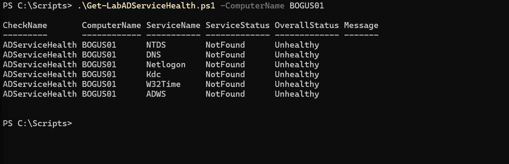
</p>

<p align="center">
  <em>The live diagnostic: .\Get-LabADServiceHealth.ps1 -ComputerName BOGUS01 returning all six services NotFound and OverallStatus Unhealthy, the misclassification described above and resolved by the enumerate-then-match rework that follows.</em>
</p>

The resolution was to enumerate every service on the target with `Get-Service -ComputerName $ComputerName -ErrorAction Stop`, without `-Name`, and match the requested names in the script. Two further live probes confirmed the shape discriminates what the earlier form conflated. Against `BOGUS01` it raised a terminating `System.InvalidOperationException`, "Cannot open Service Control Manager on computer 'BOGUS01'. This operation might require other privileges.", which the `catch` classifies `Unknown`. Against the reachable `DC01` it returned the full service list (209 services), all six targets present and `Running`, with a deliberately bogus name simply absent, so an absent service still classifies `NotFound`/`Unhealthy` and a healthy DC still classifies `Healthy`. An access-denied or offline target reaches `Unknown` by the same terminating path; the case verified live was the non-resolving target.

The change was confined to the error-handling path and what depends on it. The `try` call became the no-`-Name`, `-ErrorAction Stop` form, and the script's "throws terminating regardless of `-ErrorAction`" comment was removed. The Unknown test's mock was rewritten to emit the failure as a non-terminating `Write-Error` rather than a bare `throw`, so it now depends on the script's own `-ErrorAction Stop` and can no longer pass if the script reverts to suppressing errors. The two pass-through tests were reworked to assert `-ComputerName` and `-ErrorAction Stop` are bound and `-Name` is not, the explicit-override test additionally confirming `-ServiceName` is applied by filtering the enumerated set. The dot-source guard, not-found handling, object-return-plus-flattened-CSV design, and read-only assertions were untouched. The reworked suite returned `Tests Passed: 10, Failed: 0`, and `Invoke-ScriptAnalyzer -Path C:\Scripts -Settings C:\Scripts\PSScriptAnalyzerSettings.psd1 -Recurse` returned no output: a clean pass.

<p align="center">
  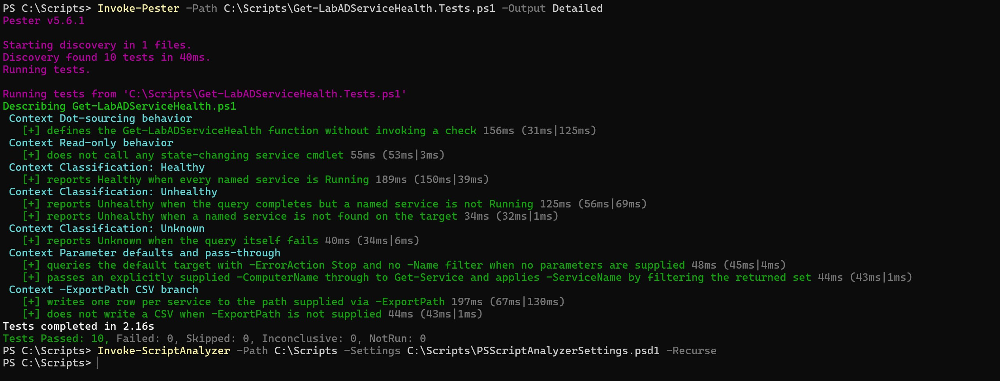
</p>

<p align="center">
  <em>Invoke-Pester re-run after the error-handling fix (the enumerate-then-match rework, distinct from the earlier PSAvoidUsingComputerNameHardcoded fix in screenshot 09) confirming all ten tests still passing, including the rewritten Unknown and pass-through tests, followed by Invoke-ScriptAnalyzer returning to the prompt with no output: a second, separate clean pass.</em>
</p>

**A stored scheduled-task credential is a new, standing security surface for this track (anticipated, later step; scope now settled in Design Decision 5).** Every prior lab's most-privileged operation existed only for the length of an explicitly started interactive session. A scheduled task configured to run whether a user is logged on or not requires a stored credential (via `Register-ScheduledTask -User -Password`, or an equivalent principal configuration) that persists indefinitely. This is not a defect to fix during implementation so much as a property to design around. Design Decision 5 now settles what that property will be in this lab, and the entry immediately below records the live finding that drove it there.

**A plain domain account cannot open the Service Control Manager on DC01, which rules out a least-privileged scheduled-task account (encountered and resolved, Step Six planning).** Design Decision 5 originally carried the run-as account as an open question, with a dedicated least-privileged account as the preferred answer over `labadmin`. Rather than provisioning an account to find out whether that was viable, the existing `testuser01` account was used as a probe, so nothing was created and nothing in the environment changed. A session was started with `runas /user:corp\testuser01 powershell.exe`, and the enumerate-then-match call `Get-LabADServiceHealth.ps1` actually makes was run in it:

```powershell
(Get-Service -ComputerName DC01 -ErrorAction Stop | Measure-Object).Count
```

This failed with a terminating `System.InvalidOperationException`: `Cannot open Service Control Manager on computer 'DC01'. This operation might require other privileges.` This is the same exception, on the same code path, that Step Two's own `BOGUS01` diagnostic produced against an unreachable target, and it is the condition `Get-LabADServiceHealth.ps1` classifies `Unknown`. A least-privileged run-as account would therefore have produced an AD check reporting `Unknown` on every scheduled firing, indefinitely, which is a worse outcome than the exposure it was meant to reduce: an unattended report that silently cannot see one third of what it claims to check.

The resolution was to run the task as `labadmin` and record the reasoning rather than the conclusion alone. Two routes would have made a least-privileged account work and both were refused: `sc.exe sdset scmanager`, a permanent security-descriptor edit on the only domain controller made from a read-only lab, and Server Operators, a broader grant than the read-only use being made. Least-privilege was preserved where the platform allows it, in the Wazuh and Portainer API accounts, and the task is registered `-RunLevel Limited` on the strength of Step One's non-elevated finding. Full reasoning, including the gMSA rejection, is in Design Decision 5.

**Portainer's endpoint ID is now confirmed (encountered and resolved, Step One).** `GET /api/endpoints` returned a single endpoint, `Id: 3`, `Name: "local"`, not the previously assumed default of `1`. `Get-LabDockerServiceStatus.ps1`'s parameter defaults use `3`.

**PSScriptAnalyzer flags a plural noun on a test-only helper function (encountered and resolved, Step Three).** `Get-LabWazuhAgentStatus.Tests.ps1`'s first analyzer pass returned one `PSUseSingularNouns` finding (Warning severity) against `New-DefaultMockAgents`, a private helper building the fabricated four-agent `GET /agents` response reused across the file's default mocks. `Get-LabWazuhAgentStatus.ps1` itself was already clean; the finding was confined to the test file's own helper naming. The fix was a rename, `New-DefaultMockAgents` to `New-DefaultMockAgentSet`, and its one call site updated to match, with no assertion changed. The suite was re-run afterward and confirmed unaffected, still 15 of 15, and both `Invoke-ScriptAnalyzer` invocations returned to the prompt with no output.

**A live-only defect survived a clean Pester suite and a clean analyzer pass: wrapping a live `Invoke-RestMethod` call directly in `@()` nested this endpoint's top-level JSON array instead of flattening it (encountered and resolved, Step Four).** `Get-LabDockerServiceStatus.ps1`'s containers query originally read `$allContainers = @(Invoke-RestMethod -Uri $containersUri ...)`. Pester was 16 of 16 and both analyzer invocations returned no output, so the first live run was expected to simply confirm Step One's known baseline. It did not: seven of the eight expected containers came back `NotFound`, and `single-node-wazuh.dashboard-1` came back with its `State` showing `{running, running, running, exited...}`, a collection where a single string was expected.

The diagnostic followed the same live-evidence-over-assumption approach Step Two's `BOGUS01` probe used. First, the raw API response was checked directly against a freshly authenticated session: `$containers.Count` was `10`, matching Step One's baseline exactly; `(​$containers | Select-Object -First 1).Names` was a `System.Object[]` holding one slash-prefixed string; `.State` was a plain `System.String`. The raw response was exactly the shape the script's normalization code assumed.

<p align="center">
  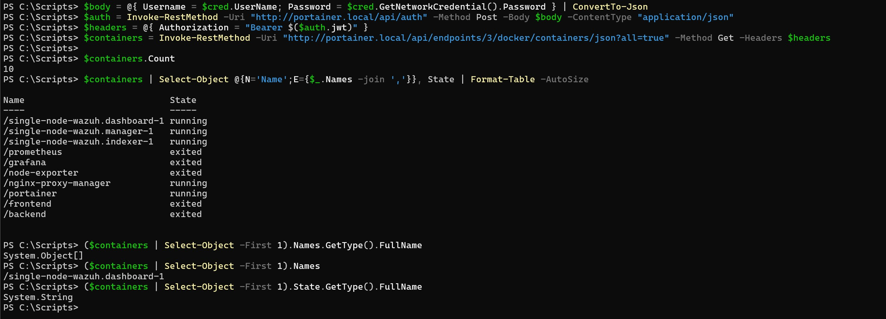
</p>

<p align="center">
  <em>Diagnostic: the raw Portainer container response confirmed as 10 items, Names as a one-element System.Object[], State as a System.String, exactly the shape the script's normalization code assumed.</em>
</p>

Second, the script's own normalization and matching code was retyped at the prompt, line for line, against that already-fetched `$containers` variable. It worked perfectly: ten clean rows with slash-stripped names, and a `portainer` lookup returning a single clean `PSCustomObject` with `State = running`. This ruled out the classification logic itself.

<p align="center">
  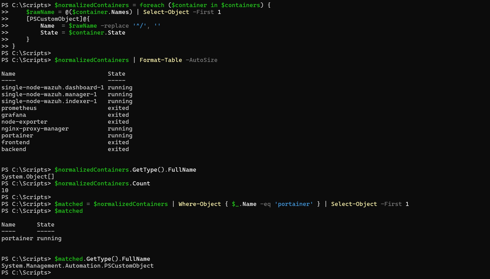
</p>

<p align="center">
  <em>Diagnostic: the script's normalization and matching code, retyped at the prompt against the same live $containers data, produced ten clean rows and a correct single-object portainer match, ruling out the classification logic itself.</em>
</p>

Third, the live script was run again, and then dot-sourced with the function called directly (`. .\Get-LabDockerServiceStatus.ps1; Get-LabDockerServiceStatus -Credential $cred`), bypassing the standalone rendering guard entirely. Both reproduced the identical defect, which ruled out the rendering code and confirmed the bug was inside the function's own live call path, the one difference between the failing runs and the successful manual replication.

<p align="center">
  
</p>

<p align="center">
  <em>Diagnostic: a direct script re-run and a dot-source-plus-direct-function-call both reproduced the identical defect, isolating it to the function's own live Invoke-RestMethod call rather than the standalone rendering guard.</em>
</p>

The root cause is a PowerShell 5.1 pipeline behavior specific to this endpoint's response shape. The containers endpoint returns a top-level JSON array, unlike the Wazuh agents endpoint, which nests its array under `data`. For a top-level array, `Invoke-RestMethod` can write the whole array to the pipeline as a single object rather than one object per container. A bare assignment binds to that one object, which is the array, so `.Count` reads correctly. But `@()` around the live call collects only what the pipeline emitted, one object, so it nested the array as a single element instead of flattening it: one entry containing ten containers. The normalization loop then ran once, with `$container` bound to the entire array, and member enumeration made `.Names` and `.State` return values across all ten, which is why `single-node-wazuh.dashboard-1`, the first element, was the only name that matched and why its `State` showed as a collection. `@()` around an already-materialized variable is unaffected, since the array-subexpression operator enumerates an expression that already evaluates to an array; only wrapping a live command call is.

The fix was confined to the containers-query line: the response is assigned to `$containersResponse` first, and `@($containersResponse)` wraps that variable rather than the live call. A regression test in a new Response deserialization Context forces the mock to emit the whole array as one pipeline object with the unary comma operator (`, (New-DefaultMockContainerSet)`), reproducing the shape that let the defect pass all sixteen original tests; Pester's `-MockWith` unrolls a returned array element by element, unlike the real cmdlet here, which is why none of them caught it. The reworked suite returned `Tests Passed: 17, Failed: 0`, both analyzer invocations returned no output, and the repeated live run returned the `Unhealthy` result Step One's baseline predicted, screenshots in Step Four above.

**Pester's `It -ForEach` needs its source data at Discovery time, not Run time (encountered and resolved, Step Five).** The twenty-seven-case Aggregation Context was first written with its combinations built inside a `BeforeAll`. `Describe`/`Context` bodies run during Pester's Discovery phase, but `BeforeAll` only runs later, during the Run phase, so `-ForEach` evaluated against an empty collection at Discovery time and silently generated zero tests for that Context, no error, no warning, the Context header absent from `-Output Detailed` entirely. A real run confirmed it: eleven tests discovered, not the expected thirty-eight, with no indication anything was missing beyond the shortfall in the total. The fix was to build the combinations as plain script code directly in the Context body, not inside `BeforeAll`, per Step Five's Implementation above.

**Pester's `It -ForEach` only projects named variables from Hashtable items, not PSCustomObject (encountered and resolved, Step Five).** After the Discovery-timing fix above, all twenty-seven Aggregation cases ran, but every one failed: `Should -Be` compared against `$null`, and every test title rendered with blank `AD=`/`Wazuh=`/`Docker=` placeholders. Pester only projects an item's members into named variables, and into `<Name>` title placeholders, when the item is an `IDictionary`; a `[PSCustomObject]` item passes through as an unnamed `$_` with nothing bound. Confirmed by a real run showing all twenty-seven cases executing with blank titles and `$null` comparisons. Fixed by changing every combination from `[PSCustomObject]@{...}` to `@{...}`, a plain Hashtable, confirmed by a third real run, thirty-eight of thirty-eight passing with correct titles.

**A blank interactive prompt produced a non-terminating parameter-binding failure that let the script continue into a broken state instead of stopping (encountered and resolved, Step Five).** The orchestrator's guard originally resolved a missing `-ReportDirectory` with `Read-Host` and passed the result straight through with no further check. A live-run attempt left that prompt blank; `Read-Host` returned an empty string, which failed `Invoke-LabHealthReport`'s own `Mandatory [string]$ReportDirectory` parameter binding with `ParameterArgumentValidationErrorEmptyStringNotAllowed`. That failure terminated the one statement but not the top-level script under the default `$ErrorActionPreference`, so execution continued into a blank summary table and an empty report-path line rather than stopping. No live check had actually run, since the parameter-binding failure happened before `Invoke-LabHealthReport`'s own body started. Fixed by validating all three interactively-resolved inputs (`-WazuhCredential`, `-PortainerCredential`, `-ReportDirectory`) explicitly, immediately after resolving each one, and throwing a clear, specific error if any is missing, confirmed by a second attempt against the same blank input failing immediately and cleanly instead of continuing.

**Portainer Community Edition hides existing Docker resources from non-admin users by default, with no environment-wide override (encountered, Step Six-A; not resolved by an account, kept as a named exposure).** A standard user granted endpoint access could reach the Docker proxy but got an empty container list; Portainer's own documentation confirmed resources are administrator-only by default, and the only override is per-resource, which would mean standing changes across three compose stacks Portainer never deployed. `Get-LabDockerServiceStatus.ps1` keeps the existing admin account; full reasoning is in Design Decision 5 and Implementation Step Six-A.

**A successful API query that returns nothing was classified `Unhealthy` rather than `Unknown` in both REST check scripts (encountered and resolved, Step Six-A; the defect itself dated from Steps Three and Four).** The rejected Portainer least-privilege account above did not only produce a platform finding. Its empty container list, an HTTP 200 with an empty array and no exception, was a response shape neither `Get-LabDockerServiceStatus.ps1` nor `Get-LabWazuhAgentStatus.ps1` had a path for. Both scripts route their `Unknown` classification exclusively through a `try`/`catch` around `Invoke-RestMethod`, on the reasoning recorded in Steps Three and Four that the cmdlet throws on both a connection failure and an HTTP error status. That reasoning was correct as far as it went and did not cover a call that succeeds and returns nothing: the empty response reached no `catch`, fell through to the expected-item matching loop, matched nothing, and would have reported every expected container or agent as `NotFound` with an overall `Unhealthy` and a blank `Message`.

This is the same defect shape as Step Two's `-Name` / `-ErrorAction SilentlyContinue` misclassification, reached from the opposite direction. There, a failure was suppressed into silence and read as absence; here, a success is blind and read as absence. Both collapse "the check could not observe" into "the check observed a fault," the exact direction Design Decision 4 introduced `Unknown` to prevent, and in both cases a fully passing Pester suite and a clean analyzer pass gave no warning, since neither had a case for the shape in question.

The fix in each script is a guard between the `try`/`catch` and the matching loop, returning `Unknown` with an explanatory `Message` when the response contains nothing. An empty list is unambiguous here rather than a possible true reading: the `portainer` container is in the Docker check's own expected set and Portainer answered the request, and agent `000` is always present in a working Manager's list, so in both cases a response containing nothing cannot describe the system that served it. The Wazuh guard tests the raw response before agent `000` is filtered out, so a response carrying only agent `000`, a real "no monitored agents enrolled" state, still classifies `Unhealthy` rather than being masked. Both guards filter nulls, covering an empty body as well as an empty array, without altering the assign-then-wrap form Step Four's fix depends on. Four regression tests were added, two per script, taking `Get-LabDockerServiceStatus.Tests.ps1` from seventeen to nineteen and `Get-LabWazuhAgentStatus.Tests.ps1` from fifteen to seventeen, all passing, all four analyzer invocations clean. The defect was latent rather than live, since the scheduled path uses the admin account.

**PSScriptAnalyzer's `PSAvoidUsingPlainTextForPassword` flags any `[string]` parameter containing "Cred" or "Credential", not just "Password" (encountered and resolved, Step Six-A).** The originally planned `-CredentialDirectory` parameter on `Invoke-LabHealthReport.ps1` tripped the rule; its word list (`Password`, `Passphrase`, `Cred`, `Credential`) is checked case-insensitively against the whole name, so no variant kept the word "Credential." Renamed to `-SecretsDirectory`, confirmed clean by a subsequent `Invoke-ScriptAnalyzer` run.

**`Register-ScheduledTask`'s `-Principal` parameter set carries no `-Password` parameter (encountered and resolved, Step Six-B).** The originally assumed design, `New-ScheduledTaskPrincipal -LogonType Password` fed into `Register-ScheduledTask -Principal`, was checked against a live `Get-Help Register-ScheduledTask -Full` before being built, rather than assumed correct. The `Principal` parameter set has no `-Password` parameter at all; only the `Xml`, `User`, and `Object` sets accept one. `Register-LabHealthReportTask.ps1` was built around the `User` parameter set instead, `-User`/`-Password`/`-RunLevel` passed directly, never `New-ScheduledTaskPrincipal` or `-Principal`.

**Pester's `Mock` enforces a mocked cmdlet's own real parameter type metadata, rejecting a hand-built `PSCustomObject` stand-in (encountered and resolved, Step Six-B).** The first Pester run against `Register-LabHealthReportTask.Tests.ps1`, four of fifteen tests passing, failed with `Cannot convert the ... PSCustomObject to type Microsoft.Management.Infrastructure.CimInstance[]`. `New-ScheduledTaskAction` and `New-ScheduledTaskTrigger` were mocked to return simple `PSCustomObject`s, but `Register-ScheduledTask`'s own `-Action` and `-Trigger` parameters are typed `CimInstance[]`, and Pester's `Mock` binds arguments against the real cmdlet's parameter metadata even when the cmdlet itself is mocked. Resolved by leaving `New-ScheduledTaskAction`, `New-ScheduledTaskTrigger`, and `New-ScheduledTaskSettingsSet` unmocked, since all three are side-effect-free, and asserting on their real `CimInstance` output as received by the still-mocked `Register-ScheduledTask`.

**`Register-ScheduledTask`'s `-Password` parameter rejects an empty string even under Mock (encountered and resolved, Step Six-B).** The second Pester run, thirteen of fifteen passing, failed with `Cannot validate argument on parameter 'Password'. The argument is null or empty`, from a test credential built with an empty `[System.Security.SecureString]::new()`, the pattern this lab's other test suites use without issue. `Register-ScheduledTask`'s own parameter validation on `-Password` runs before Pester's mock intercepts the call and rejects an empty string outright. Resolved by building the test credential's password from a non-empty `SecureString`, via `.AppendChar()` rather than `ConvertTo-SecureString -AsPlainText`, which would have tripped `PSAvoidUsingConvertToSecureStringWithPlainText`.

**`New-ScheduledTaskTrigger -Daily -At '07:00'` produces a UTC, `Z`-suffixed `StartBoundary`, not a local-time string (encountered and resolved, Step Six-B).** The third Pester run left two trigger-matching tests failing with "called 0 times" against a `ParameterFilter` that compared `StartBoundary` to a hardcoded local-time string. Rather than guess a second time, the real value was captured live: `(New-ScheduledTaskTrigger -Daily -At '07:00').StartBoundary` returned `2026-08-19T11:00:00Z`. Resolved by parsing the captured value through `[datetimeoffset]$PesterBoundParameters['Trigger'][0].StartBoundary).LocalDateTime`, robust to the UTC/local distinction and to DST, rather than hardcoding either a fixed offset or a fixed format.

**Modifying an already-registered `LogonType Password` task with `Set-ScheduledTask` requires the run-as credential to be supplied again, not only at registration (encountered and resolved, Step Six-B).** Moving the scheduled task's trigger forward, to observe a firing without waiting for the next 07:00, failed on the first attempt with `The user name or password is incorrect` (`0x8007052e`); `Get-ScheduledTaskInfo` afterward showed the trigger unchanged, no corruption. A live `Get-Help Set-ScheduledTask -Full`, checked rather than guessed, confirmed `-User` and `-Password` are available on its default parameter set. Resolved by supplying both on the retry, which succeeded.

**Modifying a registered task, like registering it, requires an elevated session, a separate requirement from the credential one above (encountered and resolved, Step Six-B).** Restoring the trigger back to 07:00 after the observed firing failed with `Set-ScheduledTask : Access is denied` (`0x80070005`, `PermissionDenied`), even with the run-as credential supplied per the finding above; `Get-ScheduledTaskInfo` again showed the trigger unchanged. The fresh PowerShell session opened after logging back in from the firing was not itself elevated. Resolved by opening an elevated session and retrying; the trigger was confirmed restored to 07:00 and the task's Principal confirmed unchanged by either update.

---

## Security Considerations

- **Read-only by design.** Every call this lab's scripts make is a query: `Get-Service` with no state-changing parameter, and `GET` requests plus each API's own authentication `POST`. No script calls anything capable of modifying Active Directory, Wazuh configuration, or Docker state. As in Lab 04 the claim is exercised by the suites, not only reviewed by eye: `Get-LabADServiceHealth.Tests.ps1` asserts `-Times 0` against a sample of state-changing service cmdlets, and both REST suites assert `Invoke-RestMethod` is called exactly twice, once to authenticate and once to query, never with another method or URI. `Invoke-LabHealthReport.Tests.ps1` extends it one level up, asserting each check function is called exactly once per run, since the orchestrator calls nothing external itself.
- **A stored, unattended credential is this lab's most significant new exposure, and it is now a confirmed configuration rather than an open question.** Every prior lab ran under `labadmin` for the length of an interactive session; an unattended task needs a credential persisting on WIN11-CLIENT01 indefinitely. Design Decision 5 attempted to reduce that with a dedicated least-privileged account and found, by live probe, that a plain domain account cannot open the Service Control Manager on DC01, and that the only routes to making one work are tier-0 changes to the environment's single domain controller. The task therefore runs as `labadmin`, a Domain Admins member, stated as a documented compromise rather than an unexamined default. Three things bound it: `-RunLevel Limited` rather than `-RunLevel Highest`, since Step One proved the check needs no elevation; the two API credentials are least-privileged accounts on their own platforms, where least-privilege was achievable; and the correct production answer, delegated remote service-query rights under a tiered-administration model, is named in Design Decision 5 rather than quietly omitted. Labs 02 and 04 carried "a production deployment would use a dedicated account" as an aside; this is the first lab where that aside describes a standing condition of the deployment, and the first where attempting it produced a finding instead of an intention.
- **The two API credentials are stored on disk under DPAPI, protected by account and machine rather than by a passphrase.** Step Six-A writes them to a runtime path with `Export-CliXml`, which encrypts under the exporting account's DPAPI key on the exporting machine, the same class of protection Task Scheduler applies to the task's own stored password, and why the files must be created interactively as `labadmin`. What that does and does not protect against is worth being precise about: anything running as `labadmin` on WIN11-CLIENT01 can decrypt them, so the protection is against the files being copied off the machine or read by another account, not against a compromise of the account itself. They are kept out of the repository, alongside the exported reports.
- **API credentials handled the same way Lab 01 handled a plaintext password.** `New-LabUser.ps1` (Lab 01) took its password parameter as a `[SecureString]` rather than plaintext. The Wazuh and Portainer API credentials this lab's scripts need are handled with the same discipline: accepted as `[PSCredential]` by every script that takes one, and, for the unattended run, sourced from the DPAPI-protected files described above rather than embedded as plaintext in any script, argument, or configuration file. `Register-LabHealthReportTask.ps1` follows the same rule for the run-as credential it must hand to `Register-ScheduledTask`, taking a `[PSCredential]` and unwrapping the plaintext password only at that call site, which is also what keeps it clear of `PSAvoidUsingUserNameAndPasswordParams` and `PSAvoidUsingPlainTextForPassword`.
- **Exported reports as a data-handling boundary.** The timestamped health report and any `-ExportPath` CSV output from the individual check scripts can describe service state, agent connectivity, and container status across the whole environment. As in every prior lab, all of it will be kept out of the repository and stored only on WIN11-CLIENT01.
- **The Portainer API path is HTTP-only, so its credential crosses the LAN in cleartext on every call, and it remains the broad admin account.** Step One confirmed the only working path is `http://portainer.local` through NGINX Proxy Manager, whose proxy host has no SSL certificate. `Get-LabDockerServiceStatus.ps1` therefore sends the admin credential over plain HTTP on every invocation, confirmed by Step Four's live runs and again by Step Six-A's. Step Six-A tried to replace it with a read-only account and found Community Edition does not support one: a non-admin user cannot list existing containers regardless of endpoint access, by the platform's own design. This is a named, accepted exposure rather than a solved one; a compromised LAN segment could observe the credential in transit.
- **The Wazuh API's certificate-validation bypass is a documented diagnostic accommodation, not a silent workaround.** Implementation Step One's `TrustAllCertsPolicy` accommodation, used to call the Wazuh Manager API's self-signed certificate over HTTPS from PowerShell 5.1, disabled certificate validation for the process's lifetime during that diagnostic session, not just for the Wazuh call. Step Three resolved the open question this left for the finished script: `Get-LabWazuhAgentStatus.ps1` captures the process's existing `CertificatePolicy` and `SecurityProtocol` before applying the accommodation and restores both in a `finally` block once its own authentication and agent-query calls are done, so certificate validation is disabled only for the duration of this script's own REST calls, not for the rest of the calling session.

---

## Outcome

This lab produced five PowerShell scripts, three focused health checks, one orchestrator, and the script that registers it as a scheduled task, giving the environment a single, on-demand or scheduled answer to "is everything currently healthy," where before this lab that answer required checking DC01's services, the Wazuh dashboard, and Ubuntu Server's Docker state as three separate manual steps. The scheduled job is registered on WIN11-CLIENT01, runs unattended as `labadmin`, and has now been observed firing both as a `StartWhenAvailable` catch-up after a real power outage and as a genuine 07:00 time trigger, in both cases producing a timestamped report unattended.

Step Seven validated a live `Unhealthy` run against three independent sources, root-caused and remediated the two-month-old monitoring-stack outage that run had caught, and captured a genuine before/after: `Unhealthy` before the fix, `Healthy` after, from two separate scheduled firings, the concrete demonstration that the three-state classification and worst-wins aggregation discriminate a real fault from a clean environment rather than always reading one or the other. The closing combined sweep, all thirteen scripts and thirteen test files run together for the first time, passed clean: a zero-finding `Invoke-ScriptAnalyzer` sweep and 172 of 172 Pester tests. This closes the track's final stated success criterion and, with it, the Infrastructure Automation and Scripting track itself, per ADR-018.

---

## Lessons Learned

Three separate times, a fully passing Pester suite and a clean `Invoke-ScriptAnalyzer` pass gave no warning of a defect only a live run exposed, and the direction of the miss varied. Step Four's `@()`-around-a-live-call defect and Step Six-A's empty-successful-response misclassification were both false negatives: the suites were green and a real defect sat underneath, because no mock reproduced the exact shape, a top-level JSON array emitted as one pipeline object, or a call that succeeds and returns nothing, that only the live environment produced. Step Seven's combined sweep showed the opposite failure mode is just as real: reading raw console output rather than the tool's reported totals would have made a clean 172-of-172 run look broken, since dozens of `FAIL:`/`ABORT:`/`ERROR:` lines are scattered through it, every one a script's own diagnostic line firing correctly under a mocked failure. A green suite is not proof of a healthy live system, and a console full of the word `FAIL` is not proof of a broken one; neither substitutes for checking what the tool actually reported.

`Unknown` earned its place three separate times, not once at design time. Step Two's `BOGUS01` diagnostic showed an unreachable target correctly reaching `Unknown` through a terminating `InvalidOperationException`, once the original `-Name`/`-ErrorAction SilentlyContinue` call, which collapsed "unreachable" into the same `NotFound` state as "service absent," was reworked to enumerate first and match after. Step Six-A's guard closed the same gap from the opposite direction: a call that succeeds and returns nothing had been read as every expected item missing, an `Unhealthy` verdict for a check that had observed nothing. And Step Six's planning turned on the same code path: a plain domain account's SCM-open failure landing on `Unknown` is exactly why a least-privileged run-as account was rejected, since an AD check reporting `Unknown` on every firing would have been worse than the exposure a dedicated account was meant to reduce. In every case the alternative to `Unknown` was not a cautious `Healthy` but a false `Unhealthy` or a false `Healthy`, either worse than a report honestly admitting it could not see.

Least-privilege survived everywhere the platform supported it and was refused only where the route ran through the domain's single domain controller. The Wazuh Manager API account (`labhealthcheck-wazuh`, the `agents_readonly` role) worked exactly as intended. Portainer Community Edition had no equivalent to offer, a platform limitation rather than a choice, since a non-admin user cannot list containers it does not own regardless of endpoint access, so the admin account stayed. The run-as account is the sharper case: a plain domain account cannot open the Service Control Manager on DC01, and the only two routes that would have changed that, `sc.exe sdset scmanager` or Server Operators, were refused on principle rather than attempted, one a permanent security-descriptor edit on the only domain controller, the other a broader grant than the read-only use justified. `labadmin` runs the task at `-RunLevel Limited`, a documented compromise rather than an unexamined default. The pattern holds across all three: pursued and achieved wherever a platform's access model supported it, refused rather than merely deferred wherever the only path meant permanently loosening the domain controller's own security.

---

## Sources

Research references consulted during this lab's planning.

**Wazuh Manager REST API (Wazuh documentation)**

- [Getting started - Wazuh server API](https://documentation.wazuh.com/current/user-manual/api/getting-started.html) - confirms the API's default port (`55000`) and JWT authentication flow (`POST /security/user/authenticate`, `Authorization: Bearer` on subsequent requests), the basis for `Get-LabWazuhAgentStatus.ps1`'s authentication step
- [Wazuh server API use cases](https://documentation.wazuh.com/current/user-manual/api/use-cases.html) and [Agent life cycle](https://documentation.wazuh.com/current/user-manual/agents/agent-life-cycle.html) - agent status values (`active`, `disconnected`, `never_connected`, `pending`) this script's classification logic maps to `Healthy`/`Unhealthy`

**Wazuh command monitoring (considered and not adopted as the primary Docker-status path; Design Decision 1)**

- [How it works - Command monitoring](https://documentation.wazuh.com/current/user-manual/capabilities/command-monitoring/how-it-works.html) - documents the command-monitoring pipeline and the requirement for a matching decoder before an event is analyzed
- [Command output analysis - Command monitoring](https://documentation.wazuh.com/current/user-manual/capabilities/command-monitoring/command-output-analysis.html) - the specific finding ("when a decoder is not found, the log is ignored") that informed the decision to prefer Portainer's API over a custom Wazuh decoder/rule for Docker status

**Portainer REST API (Portainer documentation)**

- [API usage examples - Portainer Documentation](https://docs.portainer.io/api/examples) - confirms the authentication endpoint (`POST /api/auth`, JWT), the container-listing endpoint (`GET /api/endpoints/{id}/docker/containers/json`), and the `X-API-Key` header pattern, the basis for `Get-LabDockerServiceStatus.ps1`'s design

**PowerShell remote service queries (Microsoft Learn)**

- [Get-Service (Windows PowerShell 5.1)](https://learn.microsoft.com/en-us/powershell/module/microsoft.powershell.management/get-service?view=powershell-5.1) - confirms `-ComputerName` is present in Windows PowerShell 5.1 and explicitly "does not rely on Windows PowerShell remoting," the basis for treating this call as consistent with ADR-016's boundary in Design Decision 1

**Windows Task Scheduler (Microsoft Learn)**

- [Register-ScheduledTask](https://learn.microsoft.com/en-us/powershell/module/scheduledtasks/register-scheduledtask) - `-User`/`-Password`/`-Principal` and `-RunLevel` parameters underpinning the run-as-account open question in Design Decision 5
- [New-ScheduledTaskTrigger](https://learn.microsoft.com/en-us/powershell/module/scheduledtasks/new-scheduledtasktrigger) and [New-ScheduledTask](https://learn.microsoft.com/en-us/powershell/module/scheduledtasks/new-scheduledtask) - trigger and task construction this lab's Step Six is planned around

**Repository reference**

- [ADR-015: Establish Infrastructure Automation and Scripting Track](../architecture/decisions/015-establish-infrastructure-automation-and-scripting-track.md) - the track's AD-centric scope and the framing of Wazuh/Docker as supporting checks
- [ADR-016: Run Automation Scripts from a Domain-Joined Client](../architecture/decisions/016-run-automation-scripts-from-domain-joined-client.md) - the "no new remoting technology" boundary Design Decision 1 reasons against
- [ADR-017: Adopt PowerShell Static Analysis and Unit Testing](../architecture/decisions/017-adopt-powershell-static-analysis-and-unit-testing.md) - the testing standard this lab's scripts will be authored against from the outset
- [ADR-018: Retire Cross-Platform Validation as a Standalone Lab](../architecture/decisions/018-retire-cross-platform-validation-lab.md) - establishes this lab as the track's final lab and sets the precedent, discussed in Design Decision 1, for when a cross-host departure from ADR-016 needs its own ADR
- [02 - Group and OU Administration](02-group-and-ou-administration.md) - the source of the console-table-plus-optional-CSV reporting convention this lab reuses and extends
- [04 - Group Policy Reporting and Audit](04-group-policy-reporting-and-audit.md) - the closest structural model for this lab's planning approach, its open-question handling, and its native-report-format precedent
- [07 - Security and Monitoring Lab](../enterprise-infrastructure/07-security-monitoring-lab.md) - the source of the Wazuh deployment facts (version, agent names, manager address and ports) this lab's Wazuh check is built against
- [04 - Docker Setup](../linux-infrastructure/04-docker-setup.md), [06 - Monitoring Stack Lab](../linux-infrastructure/06-monitoring-stack-lab.md), and [07 - Reverse Proxy Lab](../linux-infrastructure/07-reverse-proxy-lab.md) - the source of the Docker container, Portainer deployment, and networking facts this lab's Docker check is built against
