# 05 - Scheduled Health Reporting

## Status
All seven steps are complete: implemented, run against the live environment, and documented in past tense below. The scheduled task is registered on WIN11-CLIENT01 and has fired unattended twice, once as a `StartWhenAvailable` catch-up traced to a thunderstorm-driven power outage and once as a genuine 07:00 time trigger the following morning. That second firing closed the lab out: a validated `Unhealthy` run, a root-caused and remediated monitoring-stack outage, and a `Healthy` run from the very next firing.

The lab produced five scripts and 102 tests. The full library, all thirteen scripts and thirteen test files in `C:\Scripts`, was swept together for the first time at the close of Step Seven, with a clean `Invoke-ScriptAnalyzer` pass and 172 of 172 Pester tests passing.

---

## Overview
This lab produced the Infrastructure Automation and Scripting track's final deliverable: a recurring, unattended environment health report covering Active Directory service state on DC01, Wazuh agent enrollment across all three monitored systems, and Docker service status on Ubuntu Server, run on a schedule through Windows Task Scheduler rather than invoked by hand. Per [ADR-018](../architecture/decisions/018-retire-cross-platform-validation-lab.md) it is the track's fifth and final lab; per [ADR-015](../architecture/decisions/015-establish-infrastructure-automation-and-scripting-track.md) it treats Wazuh and Docker status as supporting checks on an AD-centric environment rather than parallel automation subjects.

Every prior lab in this track was invoked by hand, with a human reading the console or opening the resulting CSV. This lab was the first designed to run with nobody watching, a shift small in surface area and real in consequence: a report nobody reads while it runs has to represent an unreachable check honestly rather than as a false all-clear or a false alarm, has to write its result somewhere findable later rather than to a console that closes, and has to run under a stored credential rather than an administrator's own session. The design decisions below are organized around that shift, and each was settled against the live environment during implementation rather than left as an intention.

The lab also closed a data-collection gap none of the first four had to solve. Every script through Lab 04 queried Active Directory or Group Policy on DC01, reachable through the modules' native remote cmdlet behavior per [ADR-016](../architecture/decisions/016-run-automation-scripts-from-domain-joined-client.md). Wazuh agent enrollment and Docker service status live on Ubuntu Server, which nothing in this track had reached before, and collecting those two signals without introducing a new remoting technology was the central design problem, addressed in Design Decision 1.

---

## Objectives
The primary goals of this lab were to:

- check the running state of six Active Directory-related Windows services on DC01 (`NTDS`, `DNS`, `Netlogon`, `Kdc`, `W32Time`, and `ADWS`, the service every Active Directory module cmdlet this track has used since Lab 01 depends on) from WIN11-CLIENT01, without RDP into DC01 or opening `services.msc`
- query the Wazuh Manager's REST API for the enrollment and connectivity status of all three enrolled agents, reusing the platform enterprise Lab 07 deployed rather than re-deriving agent state some other way
- query an already-deployed Docker management API (Portainer) for the running state of the monitoring, reverse-proxy, and Wazuh stack containers on Ubuntu Server, without introducing SSH, WinRM, or any other new remoting technology
- classify each check as `Healthy`, `Unhealthy`, or `Unknown` (the check itself could not be completed) and aggregate all three into one overall status, so an unreachable host or API is never reported as either a false all-clear or a false incident
- produce a report shaped for an unattended run: a timestamped artifact written automatically on every firing, in addition to the console-table-plus-optional-`-ExportPath` convention Lab 02 established and Lab 04 reused
- register the finished orchestrator as a recurring Task Scheduler job, and resolve, rather than assume, what account and privilege level it should run under
- author every script under the Lab 03 standard from the outset, per ADR-017, including coverage of the new classification and aggregation logic and mocked coverage of the non-Active-Directory external calls this lab is the first to make
- keep every exported report artifact off the repository and on WIN11-CLIENT01, consistent with the data-handling boundary every prior lab has held
- close the track's final success criterion, and with it the Infrastructure Automation and Scripting track itself, per [ADR-018](../architecture/decisions/018-retire-cross-platform-validation-lab.md)

Every objective was met. Two were met differently than planned: the run-as account resolved to `labadmin` at `RunLevel Limited` rather than a dedicated least-privileged one, because a live probe proved a plain domain account cannot open the Service Control Manager on DC01; and the Portainer credential remained an admin account, because Community Edition hides existing resources from non-admin users by design. Both are documented as named compromises in Design Decision 5 and Security Considerations.

---

## Project Context
ADR-014 named this the highest-priority next track, and ADR-015 scoped it around Active Directory as the environment's identity backbone, with Docker, Linux, and Wazuh as supporting checks. Labs 01 and 02 automated the standing manual AD administration work, Lab 03 gave the resulting library a quality-assurance standard, and Lab 04 automated Group Policy reporting. ADR-018 then retired the planned standalone cross-platform validation lab as redundant with Lab 01, making Scheduled Health Reporting the track's fifth and final lab.

The environment this lab reports on was already validated once by hand. Enterprise Lab 07 deployed the Wazuh stack and enrolled DC01, WIN11-CLIENT01, and Ubuntu Server as agents, all three confirmed `Active`. Linux infrastructure Labs 04 through 07 deployed the Docker services on that host: the monitoring stack, NGINX Proxy Manager, and Portainer, reachable by hostname since the reverse proxy lab. None of that validation was repeatable without opening the Wazuh dashboard, checking Services on DC01, and reaching Ubuntu Server for Docker state as three separate manual steps. That gap is what this lab closes, the same category Lab 04 closed for Group Policy.

Because this is the track's terminal lab, no future automation-track lab depends on the design decisions made here the way every subsequent lab depended on ADR-016's execution-endpoint convention. That changes how this document treats its one boundary-adjacent decision, addressed in Design Decision 1.

---

## Design Decisions

### 1. Reach Ubuntu Server's signals through its existing management APIs, not a new remoting technology
**Decision:** Wazuh agent enrollment status was collected from the Wazuh Manager's REST API (`https://192.168.1.226:55000`), and Docker container status from Portainer's REST API, already deployed on Ubuntu Server for exactly this purpose, both queried with `Invoke-RestMethod` from WIN11-CLIENT01. Neither introduces SSH, WinRM, PowerShell Remoting, or any other new remoting technology.

This was the lab's central design problem. AD service state is already reachable because `Get-Service` accepts a `-ComputerName` parameter that, per its own PowerShell 5.1 documentation, "does not rely on Windows PowerShell remoting", the same remote-but-not-remoting behavior the Active Directory module's cmdlets already use against DC01 under ADR-016. Wazuh agent enrollment and Docker service status have no equivalent built-in PowerShell surface, since both live on a Linux host no earlier lab in this track had queried from. Four options were considered:

**Option A: Wazuh's command monitoring capability**, having agents periodically run `docker ps` and forward the output, keeping every Ubuntu-side signal behind one existing channel. Rejected: the Wazuh documentation is explicit that command output is only useful through a custom decoder and rule authored on the manager, and "when a decoder is not found, the log is ignored", so unmatched output does not reach the archived logs, let alone the API. Building and proving a correct decoder is non-trivial server-side work whose success cannot be assumed at planning time.

**Option B: SSH-invoked `docker` commands from WIN11-CLIENT01.** The most direct option, and it reuses infrastructure the environment already runs. Rejected as the primary approach because it is plainly a new remoting technology for this track's scripts: no script in Labs 01 through 04 opens a remote shell anywhere, and ADR-016 was framed as "no new remoting technology (PowerShell Remoting, WinRM sessions to DC01, and so on)." ADR-018 rejected a reshaped cross-platform-validation lab for the same reason.

**Option C: A companion script running locally on Ubuntu Server.** Rejected quickly: it falls outside this track's PowerShell-centered scope per ADR-015, and it does not solve the collection problem, since the result still has to reach WIN11-CLIENT01 by some channel.

**Option D: Portainer's existing REST API.** Already deployed to manage Docker containers, and its API (`POST /api/auth` for a JWT, `GET /api/endpoints/{id}/docker/containers/json` for live container state) is a purpose-built, already-running source of exactly this signal. It needs no Wazuh-server configuration, no custom decoder, and no new remoting technology, only an authenticated REST query of the same kind the AD module already makes against DC01. It also avoids Option A's silent-data-loss failure mode, since container listing is definitionally Portainer's core function rather than a repurposed side channel.

**The environment's own architecture was a real threat to Options A and D, and had to be weighed before either was adopted.** Both depend on reaching a backend API from WIN11-CLIENT01, and this environment has a documented history of exactly that becoming impossible. ADR-009 moved backend services, Portainer included, to internal-only Docker networking with no LAN-accessible ports, and the reverse proxy lab confirmed direct access to port `9443` blocked. ADR-013 then excluded the Wazuh Dashboard from NGINX Proxy Manager entirely, after proxying produced authorization-token failures never conclusively resolved while direct-IP access kept working. The two APIs sat in opposite positions: Portainer's only available path is `portainer.local` through the proxy, precisely the path ADR-013 showed can break, while the Wazuh Manager API's question was narrower, whether port `55000` is reachable across the LAN at all.

**Resolution, confirmed by Implementation Step One: Option D for Docker service status, alongside the Wazuh Manager API for agent status.** Both endpoints were verified reachable and authenticating before the recommendation was treated as settled, and both held, though neither trivially: the Wazuh API authenticates only under its own dedicated `wazuh-wui` account, and Portainer answers not at `192.168.1.226:9443` but at `portainer.local` over plain HTTP, requiring a hosts-file entry. Option B (SSH) was retained as a documented fallback that turned out not to be needed; had either API been unreachable it would have been adopted and given its own ADR at that point.

**Whether this decision needs an ADR:** it belongs here. Querying an existing management API is not a departure from ADR-016's boundary in the first place; it is the same remote-but-not-remoting behavior the AD module and `Get-Service -ComputerName` already use, against a different endpoint. And ADR-016 was written to apply forward, to "every subsequent lab in this track", while this lab has none. If the SSH fallback is ever adopted, that would cross the boundary for real and should get its own ADR then.

### 2. Three focused check scripts plus one orchestrating script, not one combined script
**Decision:** The lab produced four query scripts: `Get-LabADServiceHealth.ps1`, `Get-LabWazuhAgentStatus.ps1`, and `Get-LabDockerServiceStatus.ps1`, each independently runnable and each answering one question about one data source, plus `Invoke-LabHealthReport.ps1`, a thin orchestrator that calls all three, aggregates their results, and is the one script registered in Task Scheduler. All four are stored under `infrastructure/automation-and-scripting/scheduled-health-reporting/`, following the `Verb-LabNoun` naming and per-lab subfolder convention every prior lab established. A fifth, `Register-LabHealthReportTask.ps1`, was added in Step Six to perform the registration itself; it is not a health check and does not run on the schedule, but is kept as a committed script so the task's configuration is reproducible.

This follows the one-script-per-workflow granularity Labs 02 and 04 used, for the reason Lab 04 gave: the three data sources have different shapes and different failure modes, a Windows service query and two authenticated REST calls to unrelated platforms, and folding them together would couple three external dependencies into one hard-to-test unit. Separate scripts also stay useful outside the scheduled context. The orchestrator is not optional overhead: Task Scheduler needs one action pointing at one script, and the point of the lab is a single aggregated status. It stays thin, applying Design Decision 4's aggregation and Design Decision 3's report output while each check owns its own classification.

How the orchestrator calls the three checks is settled here too, since it determines whether the aggregation is testable at all. Every script in Labs 01 through 04 is a standalone `.ps1` invoked by file path, and Pester's `Mock` intercepts a command by name and cannot readily intercept a call made by explicit file path. So each check script defines a function of the same name as its file, dot-sourced by the orchestrator and invoked by name. That is a real departure from the flat standalone-script convention, accepted specifically to make the aggregation mockable under ADR-017.

### 3. Keep the existing reporting convention for interactive runs, add a mandatory timestamped artifact for the unattended run

**Decision:** The three individual check scripts follow Lab 02's and Lab 04's console-table-plus-optional-`-ExportPath` convention when run standalone. `Invoke-LabHealthReport.ps1` additionally always writes a timestamped aggregate report to a runtime directory on WIN11-CLIENT01 (an HTML summary, matching Lab 04's precedent of departing from a flat table when the data's shape, here three different check types rolled into one overall status, does not reduce cleanly to a single CSV row) every time it runs, whether invoked interactively or by Task Scheduler.

Every report in this track so far has been read by whoever just ran the script. This lab's premise was that nobody would be watching, so an optional `-ExportPath` present only when explicitly requested was the wrong default: if the scheduled run writes nothing durable, an unhealthy night produces nothing to find the next morning. The check scripts keep the optional-export convention, since they remain interactive tools; the orchestrator's always-write behavior is this lab's one deliberate departure, made for a reason specific to running unattended rather than to invent a convention.

### 4. Health determination: a three-state classification with worst-wins aggregation
**Decision:** Each check script classifies its result as `Healthy`, `Unhealthy`, or `Unknown`. `Unknown` is reserved for "the check itself could not be completed" (DC01 unreachable, an authentication failure, a timeout), distinct from `Unhealthy`, which means the check completed and found a real problem: a stopped service, a disconnected agent, a stopped container. Implementation later added a third shape to that first category, found live rather than anticipated here: a query that succeeds, throws nothing, and returns nothing, a failed observation wearing a success code (see Step Six-A). `Invoke-LabHealthReport.ps1` aggregates worst-wins: any `Unhealthy` makes the overall status `Unhealthy`; failing that, any `Unknown` makes it `Unknown`; only three `Healthy` results make it `Healthy`.

This is the actual decision logic of the lab and the natural center of its Pester coverage, the same way the partial-success batch model was for Lab 02. A two-state model would force every check to collapse an unreachable host into one of the two real outcomes, and both directions fail an unattended job: collapsing "could not reach the Wazuh API" into `Healthy` is a false all-clear nobody catches while the report reads green, and collapsing it into `Unhealthy` is a false incident indistinguishable from a genuinely stopped service. Keeping `Unknown` as its own state is the honest representation for a report nobody is present to sanity-check, and it is what the suite exercises most directly: every combination of the three checks' states, not just the happy paths.

### 5. Scheduling: `Register-ScheduledTask` on WIN11-CLIENT01, daily, running as `labadmin` at limited privilege
**Decision:** `Invoke-LabHealthReport.ps1` was registered as a Task Scheduler job on WIN11-CLIENT01 using `Register-ScheduledTask`, built from `New-ScheduledTaskAction`, `New-ScheduledTaskTrigger`, and `New-ScheduledTaskSettingsSet`. The trigger is daily at 07:00 local. The task runs as `labadmin` under `-LogonType Password` and `-RunLevel Limited`, with `-StartWhenAvailable` and a fifteen-minute `-ExecutionTimeLimit`. Registration is performed by `Register-LabHealthReportTask.ps1`, committed alongside the other four so the task's configuration is reproducible rather than existing only as one machine's local state.

This decision as originally written also named `New-ScheduledTaskPrincipal`. Step Six-B found live that the `-Principal` parameter set accepts no password at all, so a `LogonType Password` task cannot be registered through it; the `-User`/`-Password`/`-RunLevel` set was used instead.

**There are three credentials in play, not one.** The Windows principal the task runs as must be a domain account, since `Get-Service -ComputerName DC01` authenticates through Kerberos and a local account cannot. The Wazuh Manager API account and the Portainer account are application credentials on their own platforms, unrelated to that principal. Task Scheduler stores the first and has no mechanism to supply the other two, which is why Step Six-A exists.

**What account the task runs as, and why it is not a least-privileged one.** An unattended task under a stored credential is a materially different exposure from an interactive session: the credential sits in Task Scheduler's store indefinitely. A dedicated least-privileged account was the intended answer, and the intent was tested before being committed to, using the existing `testuser01` so nothing had to be provisioned. It failed: `Get-Service -ComputerName DC01 -ErrorAction Stop` under `runas` returned `Cannot open Service Control Manager on computer 'DC01'`. That is precisely the condition `Get-LabADServiceHealth.ps1` classifies `Unknown`, so a least-privileged account would have produced an AD check reporting `Unknown` every night, the quietest possible failure mode for a report nobody is watching and exactly the false signal Design Decision 4 exists to prevent.

Two changes to DC01 would have made one work, and both were refused. `sc.exe sdset scmanager` is the technically correct enterprise answer and what a tiered-administration model would do, but it is a permanent security-descriptor edit on this environment's only domain controller, with no second DC to recover against if the SDDL is wrong. Server Operators was refused for a stronger reason: it can start and stop services on domain controllers, a broader grant than the strictly read-only use being made. There is no meaningful middle, since the realistic groups on a DC are Domain Admins, BUILTIN\Administrators, and Server Operators.

The task therefore runs as `labadmin`, a documented compromise with a named production alternative rather than an unexamined default. Two things reduce it: `-RunLevel Limited` rather than `-RunLevel Highest`, since Step One proved the check succeeds non-elevated, and least-privilege still applied to the two API credentials where the platform allows it.

**Why not a group Managed Service Account.** A gMSA is the textbook answer to a standing stored password. Rejected on three grounds: it requires a KDS root key and gMSA provisioning, new tier-0 directory infrastructure in a track ADR-015 scoped to automating the existing environment; it does not solve the two API credentials, which are the actual blocker; and a gMSA principal does not unlock a user DPAPI master key the way a password logon does, conflicting with the credential storage Step Six-A adopts. Named as the right production answer, not adopted here.

**The two API accounts can be least-privileged wherever the platform allows it, and Step Six-A established which does.** A `labhealthcheck-wazuh` account under the Manager API's built-in `agents_readonly` role was created and confirmed live. A non-administrative Portainer user, once granted environment access, still could not list containers: Community Edition makes resources visible to administrators only by default, with no environment-wide override. `Get-LabDockerServiceStatus.ps1` keeps its admin account, named in Security Considerations rather than worked around.

**Cadence.** Daily at 07:00 local, following Design Decision 3's premise that an unhealthy night has to leave something to be found the next morning. `-StartWhenAvailable` means a firing missed because the client was powered off runs at the next opportunity rather than being skipped silently; that is exactly what happened in Step Six-B after a power outage, and the write-up says so rather than presenting the catch-up as a scheduled firing. The fifteen-minute `-ExecutionTimeLimit` replaces Task Scheduler's three-day default.

**Elevation, and the non-interactive context.** Step One found `Get-Service -ComputerName` needs no elevation, which is why `-RunLevel Limited` is correct. That is separate from the step: registering a task that runs as a named user with a stored password requires an elevated session, and Step Six-B found the same applies to modifying one. Whether Task Scheduler's non-interactive context changes the orchestrator's behavior was untested at planning, which is why Step Six-B required a real scheduled firing rather than a manually triggered one; the surfaces at risk were the guard's interactive prompts, `$MyInvocation.InvocationName` and `$PSScriptRoot` resolution under `powershell.exe -File`, execution policy, the runtime `Add-Type` compilation's need for a writable temp directory, and whether the report directory could be created under the task's token. The observed firing completed with `LastTaskResult 0` and wrote its report, which is only possible if every one of those behaved.

### 6. Testing approach: extend Lab 03's mocking pattern to non-Active-Directory external calls for the first time

**Decision:** Pester coverage for this lab mocks `Get-Service` (for the AD service check), `Invoke-RestMethod` (for both the Wazuh and Portainer checks), and each check script's own output (for the orchestrator's aggregation logic), using the same `Mock` mechanism Lab 03 established for Active Directory cmdlets, applied to new command names rather than a new testing approach.

Every mocked test in this track through Lab 04 replaces an Active Directory or Group Policy cmdlet. This lab was the first whose scripts call neither, so it is worth being explicit that this was new ground only in the sense of new commands to mock: `Mock` works against any command a script calls, and mocking `Get-Service` or `Invoke-RestMethod` follows the identical pattern Lab 03 documented for `Get-ADUser`, returning a fabricated service list or JSON response instead of a fabricated AD object. The highest-value target is `Invoke-LabHealthReport.ps1`'s aggregation, pure logic with no external dependency, exercisable across every combination of the three checks' states by mocking the three check functions by name, which the dot-sourced design in Design Decision 2 is what makes possible. Each check script's own tests assert its classification mapping directly, a mocked `Stopped` service mapping to `Unhealthy` and a mocked `Invoke-RestMethod` that throws mapping to `Unknown`, echoing the try/catch failure-message pattern `Get-LabRSoPReport.Tests.ps1` established in Lab 04.

### 7. Validation approach: an independent source per signal, deliberately not the same API a script queries

**Decision:** Each reported signal was cross-checked, during implementation, against a source outside the script that reported it: AD service state against a direct interactive query of the same services on DC01; Wazuh agent status against the Wazuh dashboard's Agents view (`https://192.168.1.226:8443`); and Docker container status against a direct `docker ps` or `docker compose ps` run interactively on Ubuntu Server, not solely against the Portainer UI.

This continues the rule the track has held since Lab 01, that no script's own success message is trusted without an independent check, with one subtlety specific to this lab. For AD and Wazuh an independent source is straightforward: a direct query on DC01, or the Wazuh dashboard, are genuinely separate observation paths. For Docker, the obvious candidate, the Portainer UI, is not independent at all, since it and the script read the same Portainer-tracked state. The Docker check was therefore validated against a raw `docker ps`/`docker compose ps` run directly on Ubuntu Server over the existing SSH path, used only as a manual step and never by a script, so it does not conflict with Design Decision 1's boundary. That is a separate observation of the same Docker Engine state rather than a second read of the same intermediary.

---

## Technologies Used
- PowerShell 5.1 (WIN11-CLIENT01, per [ADR-016](../architecture/decisions/016-run-automation-scripts-from-domain-joined-client.md))
- `Get-Service` with `-ComputerName`, targeting DC01's `NTDS`, `DNS`, `Netlogon`, `Kdc`, `W32Time`, and `ADWS` services
- `Invoke-RestMethod` against the Wazuh Manager and Portainer REST APIs
- Wazuh 4.14.5 (Manager, Indexer, Dashboard, Agents), deployed in enterprise Lab 07. Manager REST API on port `55000`, JWT authentication via `POST /security/user/authenticate` under the Manager API's own dedicated `wazuh-wui` account, distinct from the Dashboard/Indexer login and confirmed in Step One. The Manager API's built-in RBAC provisioned the scheduled path's `labhealthcheck-wazuh` account under the built-in `agents_readonly` role in Step Six-A
- Portainer Community Edition, deployed in linux infrastructure Lab 04 and migrated to internal-only, reverse-proxy-routed access in Lab 07. Reachable only through `portainer.local` over plain HTTP via NGINX Proxy Manager, confirmed in Step One, with direct `https://192.168.1.226:9443` still blocked as ADR-009 and the reverse proxy lab documented; requires a hosts-file entry on WIN11-CLIENT01. Authentication via `POST /api/auth`, container listing via `GET /api/endpoints/3/docker/containers/json` against endpoint ID `3`, confirmed live in Step One rather than the assumed default of `1`. Community Edition assigns all resources to administrators only by default with no environment-wide override, confirmed live in Step Six-A, so the scheduled path also uses the admin account
- Windows Task Scheduler / the `ScheduledTasks` module: `Register-ScheduledTask` via its `-User`/`-Password`/`-RunLevel` parameter set, confirmed live in Step Six-B to be the only one accepting a plaintext password; `New-ScheduledTaskAction`, `New-ScheduledTaskTrigger`, `New-ScheduledTaskSettingsSet`, and `Set-ScheduledTask`, found live to require both the run-as credential and an elevated session on every call that modifies an already-registered `LogonType Password` task; plus `Get-ScheduledTask` and `Get-ScheduledTaskInfo` for reading back a firing's outcome
- `Get-WinEvent` against `Microsoft-Windows-TaskScheduler/Operational` and `Get-CimInstance Win32_Process`, used in Step Six-B to confirm a firing was genuinely time-trigger-driven and that no process was left hung
- `Export-CliXml` and `Import-CliXml` for DPAPI-protected storage of the two API credentials the unattended run needs, per Design Decision 5 and Step Six-A
- PSScriptAnalyzer 1.25.0 and Pester 5.6.1, the Lab 03 standard, applied to all four new scripts from the outset
- The Docker Compose stacks on Ubuntu Server, confirmed against a live `docker ps -a`/`docker compose ls -a` baseline in Step One rather than assumed from documentation: the Wazuh stack (compose project `single-node`, running), the reverse proxy (`reverse-proxy-lab`, running), the standalone `portainer` container, and the monitoring stack (`prometheus`, `grafana`, `node-exporter`, compose project `monitoring-stack`), which reported `exited(3)` at the time of Step One, all three stopped for roughly two months, a pre-existing condition Step One discovered rather than caused. The `docker-networking` project (`frontend`, `backend`), leftover teaching-lab containers from linux infrastructure Lab 05, is present but excluded from the expected-running baseline
- Active Directory Domain Services on DC01 and the services this lab checks, not the Active Directory PowerShell module, which none of this lab's scripts call

---

## Architecture or Topology

```text
WIN11-CLIENT01 (PowerShell 5.1)
        |
        |  Get-LabADServiceHealth.ps1     ---> Get-Service -ComputerName DC01
        |  Get-LabWazuhAgentStatus.ps1    ---> Invoke-RestMethod (Wazuh Manager API)
        |  Get-LabDockerServiceStatus.ps1 ---> Invoke-RestMethod (Portainer API)
        |          |            |            |
        |          v            v            v
        |     [Healthy / Unhealthy / Unknown, per check]
        |
        |  Invoke-LabHealthReport.ps1 (orchestrator)
        |      --> aggregates the three checks (worst-wins)
        |      --> console table (interactive runs)
        |      --> timestamped report file (every run, per Design Decision 3)
        |
        |  Registered as a Task Scheduler job (Register-ScheduledTask),
        |  running as labadmin at RunLevel Limited, daily at 07:00
        v
   +-------------------------------+       +---------------------------------------+
   |  DC01 (192.168.1.10)          |       |  Ubuntu Server (192.168.1.226)         |
   |  NTDS, DNS, Netlogon, Kdc,    |       |  Wazuh Manager API :55000              |
   |  W32Time, ADWS services       |       |  Portainer API                         |
   |  (queried directly, no        |       |  Docker: prometheus, node-exporter,    |
   |   PowerShell remoting)        |       |  grafana, nginx-proxy-manager,         |
   |                               |       |  portainer, wazuh-manager,             |
   |                               |       |  wazuh-indexer, wazuh-dashboard        |
   +-------------------------------+       +---------------------------------------+

  Validation: each signal cross-checked against an independent source
  outside the script that reported it (direct DC01 query, Wazuh dashboard,
  and a raw docker ps/docker compose ps on Ubuntu Server, not the Portainer
  UI), not trusted from the script's own output alone.
```

All four scripts originate from WIN11-CLIENT01, consistent with ADR-016. No script in this lab opens a session or a shell on DC01 or Ubuntu Server; every cross-host signal is collected through a query against an already-running service (Windows's own remote service query, or an authenticated REST call), not through remote command execution.

---

## Prerequisites
- Labs 01 through 04 of this track complete, including the script library and the PSScriptAnalyzer/Pester standard Lab 03 established
- DC01 running the six target services and reachable from WIN11-CLIENT01. The path `Get-Service -ComputerName` uses, the Service Control Manager's remote RPC interface rather than PowerShell Remoting, was confirmed open in Step One, non-elevated, on the first attempt
- WIN11-CLIENT01 as the script execution endpoint per [ADR-016](../architecture/decisions/016-run-automation-scripts-from-domain-joined-client.md)
- The Wazuh stack operational with all three agents enrolled and previously confirmed `Active` (enterprise Lab 07), and credentials for the Manager REST API's own dedicated `wazuh-wui` account, found in `docker-compose.yml` during Step One after the Dashboard/Indexer credential was tried and rejected. The Manager API at `192.168.1.226:55000` was confirmed reachable in Step One, resolving the gating question ADR-013's Wazuh Dashboard proxy precedent had raised. The scheduled path instead authenticates as `labhealthcheck-wazuh`, scoped to `agents_readonly`; `wazuh-wui` remains the interactive and diagnostic account
- Portainer running on Ubuntu Server with an admin account available for both the web UI and the REST API, including for the scheduled path: Step Six-A found Community Edition hides existing Docker resources from non-admin users by default, so no least-privileged alternative was viable. Portainer has no direct LAN-accessible port, per ADR-009 and reconfirmed in Step One, and `portainer.local` through NGINX Proxy Manager is HTTP-only, so WIN11-CLIENT01 needs a `192.168.1.226 portainer.local` hosts-file entry. The endpoint ID is `3`
- PSScriptAnalyzer 1.25.0 and Pester 5.6.1 already installed on WIN11-CLIENT01 (Lab 03), and `PSScriptAnalyzerSettings.psd1` already committed
- The `ScheduledTasks` module, built into Windows
- An elevated PowerShell session for the registration itself, a separate requirement from the non-elevated `Get-Service` call the scheduled job makes. Step Six-B found the same applies to modifying an already-registered task with `Set-ScheduledTask`: a non-elevated session supplying the run-as credential correctly still fails with `Access is denied`
- DPAPI-protected credential files for the two API accounts, created with `Export-CliXml` in an interactive session as `labadmin`, the same account the task runs as, and stored outside the repository at `C:\Secrets\wazuh.cred.xml` and `C:\Secrets\portainer.cred.xml`, the two filenames `Get-LabStoredCredential` expects. A credential file exported by one account on one machine cannot be read by another, which is both the property this approach depends on and its main constraint

---

## Implementation

### Step One - Confirmed Reachability and Established a Known-Good Baseline

Before any script was written, each data source was confirmed reachable from WIN11-CLIENT01 and its current state captured as the baseline later checks would be validated against, the same posture Lab 04's Step One took. This step resolved three open items by live diagnostic rather than assumption: whether either API call needed a TLS accommodation for the Wazuh stack's self-signed certificates, whether `Get-Service -ComputerName` against DC01 requires elevation, and Design Decision 1's central question of whether both Ubuntu-side APIs are reachable at all. All commands ran from `C:\Scripts` as `labadmin`, per ADR-016.

**AD service reachability.** `Get-Service -ComputerName DC01 -Name NTDS,DNS,Netlogon,Kdc,W32Time,ADWS` was run first, in a non-elevated session:

```powershell
Get-Service -ComputerName DC01 -Name NTDS,DNS,Netlogon,Kdc,W32Time,ADWS
```

This succeeded on the first attempt, all six services `Running`, resolving the `Get-Service` half of Design Decision 5's elevation question: no elevation required, unlike Lab 04's `Get-GPResultantSetOfPolicy` finding.

<p align="center">
  
</p>

<p align="center">
  <em>Get-Service -ComputerName DC01, non-elevated, returning all six target services as Running: ADWS, DNS, Kdc, Netlogon, NTDS, W32Time.</em>
</p>

**Wazuh Manager API.** PowerShell 5.1's `Invoke-RestMethod` has no `-SkipCertificateCheck`, so the standard 5.1 accommodation was applied first: forcing TLS 1.2 and installing a certificate-validation callback that accepts the Wazuh stack's self-signed certificate.

```powershell
[Net.ServicePointManager]::SecurityProtocol = [Net.SecurityProtocolType]::Tls12

if (-not ("TrustAllCertsPolicy" -as [type])) {
    Add-Type @"
using System.Net;
using System.Security.Cryptography.X509Certificates;
public class TrustAllCertsPolicy : ICertificatePolicy {
    public bool CheckValidationResult(ServicePoint sp, X509Certificate cert, WebRequest req, int problem) {
        return true;
    }
}
"@
}
[System.Net.ServicePointManager]::CertificatePolicy = New-Object TrustAllCertsPolicy
```

The accommodation worked first try, no TLS handshake error, confirming port `55000` is reachable across the LAN. Authentication then failed twice with `{"title":"Unauthorized","detail":"Invalid credentials"}` using the Dashboard/Indexer `admin` login that had just worked against the Dashboard front end. A wrong-account error rather than a wrong-password one: the Manager REST API validates against its own local user store, separate from the Indexer/OpenSearch account. The correct account was found in `docker-compose.yml` on Ubuntu Server, which defines the `wazuh.manager` service's `API_USERNAME` as `wazuh-wui`. Retrying succeeded:

```powershell
$cred = Get-Credential -Message "Wazuh API credentials (wazuh-wui)"
$pair = "$($cred.UserName):$($cred.GetNetworkCredential().Password)"
$base64 = [Convert]::ToBase64String([Text.Encoding]::ASCII.GetBytes($pair))

$authResponse = Invoke-RestMethod -Uri "https://192.168.1.226:55000/security/user/authenticate" -Method Post -Headers @{ Authorization = "Basic $base64" }
$token = $authResponse.data.token

$headers = @{ Authorization = "Bearer $token" }
Invoke-RestMethod -Uri "https://192.168.1.226:55000/agents" -Method Get -Headers $headers | ConvertTo-Json -Depth 5
```

`GET /agents` returned four entries, not three: agent `000` (`wazuh.manager` itself, the manager's own built-in agent), plus `001` (`UBUNTU-SERVER`), `002` (`WIN11-CLIENT01`), and `003` (`DC01`), all four `active`, with `total_failed_items: 0`. All three target agents are `active`; agent `000` is always present in this response and will need accounting for, not silent inclusion, when `Get-LabWazuhAgentStatus.ps1` is built in Step Three.

<p align="center">
  
</p>

<p align="center">
  <em>Wazuh Manager API authentication succeeding under the wazuh-wui account after the TLS accommodation, followed by GET /agents returning wazuh.manager and UBUNTU-SERVER as active (WIN11-CLIENT01 and DC01 confirmed active further down the same response).</em>
</p>

**Portainer API.** Direct access was tested first, to reconfirm ADR-009 and the reverse proxy lab's documented finding still holds:

```powershell
Invoke-RestMethod -Uri "https://192.168.1.226:9443/api/status" -Method Get
```

This failed with `Unable to connect to the remote server`, confirming direct `:9443` access remains blocked. `portainer.local` did not resolve on WIN11-CLIENT01, so a hosts-file entry was added from an elevated session:

```powershell
Add-Content -Path C:\Windows\System32\drivers\etc\hosts -Value "192.168.1.226 portainer.local"
```

<p align="center">
  
</p>

<p align="center">
  <em>Direct https://192.168.1.226:9443 failing with Unable to connect to the remote server, and portainer.local failing to resolve before the hosts-file entry was added.</em>
</p>

`portainer.local` then resolved, but an HTTPS request failed with `Could not create SSL/TLS secure channel`, even with the TLS accommodation reapplied fresh in the same session. Since it had worked immediately against the Wazuh API, this pointed at the Portainer proxy path rather than a missing client-side workaround. Linux infrastructure Lab 04 and the reverse proxy lab's Validated URLs list both record `http://portainer.local`, not `https://`: the NGINX Proxy Manager proxy host is HTTP-only, with no certificate assigned to that vhost. Plain HTTP succeeded:

```powershell
Invoke-RestMethod -Uri "http://portainer.local/api/status" -Method Get
```

This returned `Version: 2.39.2`, `InstanceID: cce20bb2-93cd-47bd-974c-7f23deca85d1`.

<p align="center">
  
</p>

<p align="center">
  <em>The TLS 1.2/certificate-policy accommodation reapplied and HTTPS to portainer.local still failing with Could not create SSL/TLS secure channel, ruling out a missing client-side accommodation as the cause.</em>
</p>

<p align="center">
  
</p>

<p align="center">
  <em>Plain HTTP to portainer.local/api/status succeeding: Portainer 2.39.2.</em>
</p>

Authenticating surfaced two unrelated pieces of friction first. `Get-Credential`'s Windows Security dialog opened but did not accept input in this remote session, a window-station issue rather than a credential problem, resolved by switching to console `Read-Host` prompts. Pasting the resulting multi-line block in one go then corrupted input, since the prompts consumed characters intended for later lines; running one line at a time resolved it:

```powershell
$portainerUser = Read-Host -Prompt "Portainer username"
$portainerPass = Read-Host -AsSecureString -Prompt "Portainer password"
$cred = New-Object System.Management.Automation.PSCredential($portainerUser, $portainerPass)

$body = @{ Username = $cred.UserName; Password = $cred.GetNetworkCredential().Password } | ConvertTo-Json
$authResponse = Invoke-RestMethod -Uri "http://portainer.local/api/auth" -Method Post -Body $body -ContentType "application/json"
$token = $authResponse.jwt

$headers = @{ Authorization = "Bearer $token" }
$endpoints = Invoke-RestMethod -Uri "http://portainer.local/api/endpoints" -Method Get -Headers $headers
$endpoints | ConvertTo-Json -Depth 5
```

Authentication succeeded with the same admin account the Portainer web UI uses; no separate API account exists the way `wazuh-wui` does for Wazuh. `GET /api/endpoints` returned one endpoint, `Id: 3`, `Name: "local"`, with a live snapshot showing `ContainerCount: 10`, `RunningContainerCount: 5`, `StoppedContainerCount: 5`. The endpoint ID is `3`, not the assumed default of `1`. The full container list was queried against it:

```powershell
$containers = Invoke-RestMethod -Uri "http://portainer.local/api/endpoints/3/docker/containers/json?all=true" -Method Get -Headers $headers
$containers | Select-Object @{N='Name';E={$_.Names -join ','}}, Image, State, Status | Format-Table -AutoSize
```

This returned ten containers. Running, all up 7 days: the three Wazuh containers (`single-node-wazuh.dashboard-1`, `.manager-1`, `.indexer-1`, all `4.14.5`), `nginx-proxy-manager`, and `portainer`. Exited two months ago: `prometheus` and `grafana` (`Exited (0)`), `node-exporter` (`Exited (2)`), plus the teaching-lab pair `frontend` (`Exited (0)`) and `backend` (`Exited (2)`).

<p align="center">
  
</p>

<p align="center">
  <em>The full ten-container list from Portainer's API against endpoint 3: the Wazuh stack, nginx-proxy-manager, and portainer running; prometheus, grafana, node-exporter, frontend, and backend exited.</em>
</p>

**Docker Engine cross-check via SSH.** Per Design Decision 7, Portainer's own view is not treated as independent of itself, so the container baseline was cross-checked against a direct `docker ps -a`/`docker compose ls -a` on Ubuntu Server, over the existing SSH access path, as a manual step rather than a script:

```bash
docker ps -a
docker compose ls -a
```

`docker ps -a` matched Portainer's list exactly: the same ten containers, names, images, and states. `docker compose ls -a` added what a container list alone does not show: `single-node` at `running(3)` and `reverse-proxy-lab` at `running(1)`, both fully up, while `monitoring-stack` at `exited(3)` and `docker-networking` at `exited(2)` are fully down projects rather than individual containers drifting.

<p align="center">
  
</p>

<p align="center">
  <em>docker ps -a and docker compose ls -a on Ubuntu Server, matching Portainer's API view exactly and showing monitoring-stack and docker-networking as fully exited compose projects.</em>
</p>

**The `frontend`/`backend` containers are explained; the monitoring stack being down is not.** `frontend` and `backend` are linux infrastructure Lab 05's demonstration containers for custom bridge networking, part of the `docker-networking` project, never documented as removed and correctly excluded from the expected-running baseline since they were never meant to run continuously. The monitoring stack being fully down is unplanned: Lab 06 is documented `Completed` with no note of decommissioning, and no ADR mentions it. It was not known to be down before this step surfaced it. Root cause was deferred to Step Seven and the stack deliberately left down, so `Get-LabDockerServiceStatus.ps1`'s first live run would catch a real fault rather than validate against an environment quietly fixed first.

**Go/no-go verdict.** Design Decision 1's Option D holds: both APIs are reachable and authenticate, so the four-script design is cleared. The AD check was clean first time. The Wazuh check needed only the correct `wazuh-wui` account. Portainer took the most sustained work: a hosts-file entry, a wrong HTTPS assumption that cost a full diagnostic round, and the paste friction on top. None of it changed the verdict, but reachability held only on the fourth attempt for that path.

### Step Two - Built Get-LabADServiceHealth.ps1

`Get-LabADServiceHealth.ps1` was built colocated with its Pester tests in a new `infrastructure/automation-and-scripting/scheduled-health-reporting/` folder, per the track's naming and per-lab subfolder convention. It accepts an optional `-ComputerName` (default `DC01`), `-ServiceName` (default the six services Step One confirmed), and `-ExportPath`, querying each service's `Status` via `Get-Service -ComputerName`, the call Step One confirmed works non-elevated.

**The dot-sourced-function invocation model.** Per Design Decision 2, the script defines a function named the same as the file so the orchestrator can dot-source it and call it by name, which is what makes the aggregation mockable. That set a hard requirement: dot-sourcing must define the function with no side effects, no query against DC01 and no console output. The idiom is a guard at the bottom of the file:

```powershell
if ($MyInvocation.InvocationName -ne '.') {
    # standalone console-table / -ExportPath rendering lives here
}
```

`$MyInvocation.InvocationName` is `.` when dot-sourced and the file's own path when run directly, so the guard's body, the console-table-plus-`-ExportPath` rendering, only executes on a direct run. The remaining two check scripts copy this pattern, and the Pester suite asserts it directly rather than assuming it.

**Classification.** `Get-Service -ComputerName $ComputerName -ErrorAction Stop` runs inside a `try`/`catch`, enumerating every service on the target rather than passing `-Name`, with the script matching requested names against the returned collection. A requested service absent from that collection is reported `NotFound` and classifies `Unhealthy`, the "expected service absent" condition rather than a query failure. A connectivity or permission failure cannot open the target's Service Control Manager and surfaces as a terminating `InvalidOperationException` under `-ErrorAction Stop`, caught and classified `Unknown`. All six `Running` classifies `Healthy`. This enumerate-then-match shape replaced a `-Name` / `-ErrorAction SilentlyContinue` call after a live diagnostic showed that form could not tell an unreachable target from a reachable one missing the named services; see Troubleshooting and Adjustments.

The script returns a `PSCustomObject` (`CheckName`, `ComputerName`, `Services`, `Status`, `Message`) rather than printing `Write-Host` PASS/FAIL narration, so it does not rely on Lab 03's `PSAvoidUsingWriteHost` suppression at all. The standalone path flattens the nested `Services` collection to one row per service for both `Format-Table` and `Export-Csv`, since a nested array does not serialize cleanly to a single CSV row.

**Pester coverage.** `Get-LabADServiceHealth.Tests.ps1` mocks `Get-Service`, the only external command the script calls, plus a sample of state-changing service cmdlets each asserted at `-Times 0`. Ten tests across seven Contexts: dot-sourcing behavior, read-only behavior, the three classification branches (Healthy; Unhealthy for a stopped service and separately for a not-found one; Unknown for an SCM failure surfaced as the live cmdlet surfaces it, a non-terminating error made terminating by `-ErrorAction Stop`), parameter defaults and pass-through, and the `-ExportPath` branch. Because the function returns its result directly, the classification tests assert on the returned object rather than round-tripping through a CSV export the way Lab 04's read-only scripts had to.

```powershell
Invoke-Pester -Path C:\Scripts\Get-LabADServiceHealth.Tests.ps1 -Output Detailed
```

All ten tests passed on the first run: `Discovery found 10 tests`, `Tests Passed: 10, Failed: 0, Skipped: 0, Inconclusive: 0, NotRun: 0`.

**Analysis was not clean on the first pass.**

```powershell
Invoke-ScriptAnalyzer -Path C:\Scripts -Settings C:\Scripts\PSScriptAnalyzerSettings.psd1 -Recurse
```

This returned five findings, all `PSAvoidUsingComputerNameHardcoded` (Error severity), all against `Get-LabADServiceHealth.Tests.ps1`:

| RuleName | Severity | ScriptName | Line |
|---|---|---|---|
| `PSAvoidUsingComputerNameHardcoded` | Error | `Get-LabADServiceHealth.Tests.ps1` | 133 |
| `PSAvoidUsingComputerNameHardcoded` | Error | `Get-LabADServiceHealth.Tests.ps1` | 155 |
| `PSAvoidUsingComputerNameHardcoded` | Error | `Get-LabADServiceHealth.Tests.ps1` | 174 |
| `PSAvoidUsingComputerNameHardcoded` | Error | `Get-LabADServiceHealth.Tests.ps1` | 188 |
| `PSAvoidUsingComputerNameHardcoded` | Error | `Get-LabADServiceHealth.Tests.ps1` | 208 |

<p align="center">
  
</p>

<p align="center">
  <em>Invoke-ScriptAnalyzer returning five PSAvoidUsingComputerNameHardcoded findings against Get-LabADServiceHealth.Tests.ps1, each reporting "The ComputerName parameter of cmdlet 'Get-LabADServiceHealth' is hardcoded. This will expose sensitive information about the system if the script is shared."</em>
</p>

Four were the classification tests' calls with a literal `'DC01'`; the fifth was the explicit-override test's `'DC02'`. The rule flags a literal string bound to a `ComputerName` parameter at a call site, not that parameter's own default in a `param` block, which is why the script itself was clean. The fix was confined to the test file: `$script:TargetComputerName` and `$script:AlternateComputerName` were added to `BeforeAll`, and all five call sites plus the two `ParameterFilter` comparisons switched to them, clearing the rule without suppressing it.

```powershell
Invoke-Pester -Path C:\Scripts\Get-LabADServiceHealth.Tests.ps1 -Output Detailed
Invoke-ScriptAnalyzer -Path C:\Scripts -Settings C:\Scripts\PSScriptAnalyzerSettings.psd1 -Recurse
```

Re-run after the fix, Pester still passed 10 of 10, confirming the fix, a call-site value change only, did not affect any assertion, and the analyzer returned to the prompt with no further output: a clean pass.

**A single live standalone run against DC01 was performed here**, since Step One had already proven the call works non-elevated. The authoritative live validation and the full combined sweep across Labs 01 through 05 remain reserved for Step Seven.

```powershell
.\Get-LabADServiceHealth.ps1
```

This returned a real `Healthy` result: all six target services `Running` against `DC01`, `OverallStatus` `Healthy` on every row, `Message` blank.

<p align="center">
  
</p>

<p align="center">
  <em>.\Get-LabADServiceHealth.ps1 run standalone against DC01: a formatted console table showing all six target services Running and OverallStatus Healthy.</em>
</p>

### Step Three - Built Get-LabWazuhAgentStatus.ps1

`Get-LabWazuhAgentStatus.ps1` was built alongside `Get-LabADServiceHealth.ps1` in the same folder. It accepts an optional `-BaseUri` (default `https://192.168.1.226:55000`), a `-Credential` for the Manager API's dedicated `wazuh-wui` account, an optional `-AgentName` list (default the three agents Step One confirmed active), and `-ExportPath`. It authenticates against `POST /security/user/authenticate` with a Basic header, takes the JWT from `data.token`, and queries `GET /agents` with that token as a Bearer header, reading the agent list from `data.affected_items`, the request shape Step One proved live.

**The dot-sourced-function invocation model, copied from Step Two.** The script defines a function named the same as the file and reuses the same guard. One difference follows: the top-level `-Credential` carries no `Mandatory` attribute and no default, even though the function's own is mandatory, because a mandatory parameter at the top of the file would prompt the moment it is dot-sourced and hang a Pester run. The standalone path prompts with `Get-Credential` only on a direct run, confining the prompt to the one path meant to be interactive.

**Agent 000 filtering.** Per Step One, `GET /agents` returns a fourth entry for the Manager's own built-in agent (`id 000`). The script excludes it by `id` before matching the requested `-AgentName` list, so it is never counted as a monitored agent and never affects the returned `Status`, whatever its own status happens to be.

**Classification.** Per Design Decision 4: `Healthy` if every named agent is present and `active`; `Unhealthy` if the query completes but any named agent reports `disconnected`, `never_connected`, `pending`, or is missing entirely; `Unknown` only if authentication or the query could not be completed. Unlike `Get-Service` called with `-Name`, `Invoke-RestMethod` throws on its own for both a connection failure and an HTTP error status, the same 401 Step One produced against the wrong account, so a failed authentication reaches the `try`/`catch` with no equivalent workaround needed.

One `Unknown` case was added later, in Step Six-A, after the equivalent condition was observed live against the Portainer API: a query that succeeds and returns no agents at all. Not a throwing failure, so it never reached the `try`/`catch` and would have reported all three monitored agents `NotFound` and classified `Unhealthy`. The guard deliberately tests the whole response before agent `000` is filtered out, because `000` is always present in a working Manager's response: an entirely empty response cannot describe the Manager that answered it, while a response carrying only `000` is a real state, no monitored agents enrolled, which correctly stays `Unhealthy`.

**The certificate-validation bypass, scoped rather than left on for the session.** The Wazuh stack's self-signed certificate needs Step One's TLS 1.2 / `TrustAllCertsPolicy` accommodation, and that accommodation is process-wide: `[System.Net.ServicePointManager]::CertificatePolicy` has no request-scoped equivalent. The script captures the existing `CertificatePolicy` and `SecurityProtocol`, applies the accommodation for its two calls only, and restores both in a `finally` block, so validation is disabled for those calls rather than the rest of the session. Both are ordinary settable static properties, so restoring costs two lines.

**Credential and token hygiene.** `-Credential` is accepted as a `[PSCredential]`, the discipline `New-LabUser.ps1` established in Lab 01. The Basic header built from it and the JWT bearer token exist only in the function's local scope; the returned object carries only agent names and statuses, the overall `Status`, and a `Message` drawn from the exception's own text on failure. Neither credential nor token is written to the console, placed on the returned object, or included in the standalone report, and the Pester suite asserts this directly.

Like `Get-LabADServiceHealth.ps1`, this script returns a `PSCustomObject` rather than printing PASS/FAIL narration. The standalone path flattens the nested `Agents` collection to one row per agent for both `Format-Table` and `Export-Csv`.

**Pester coverage.** `Get-LabWazuhAgentStatus.Tests.ps1` mocks `Invoke-RestMethod`, distinguishing the authentication call from the agent query by `-Uri` in each `ParameterFilter`, extending Design Decision 6 to a non-`Get-Service` command for the first time. The test credential was built from an empty `[System.Security.SecureString]::new()` per Lab 03's `PSAvoidUsingConvertToSecureStringWithPlainText` finding. Fifteen tests across eight Contexts: dot-sourcing; read-only behavior (`Invoke-RestMethod` called exactly twice, once `Post` and once `Get`, never another method or URI); the three classification branches, including a dedicated assertion that agent `000` is excluded, separate Unhealthy cases for a non-active and a missing agent, and separate Unknown cases for an authentication and a query failure; parameter defaults and pass-through; credential and token hygiene; and the `-ExportPath` branch.

```powershell
Invoke-Pester -Path C:\Scripts\Get-LabWazuhAgentStatus.Tests.ps1 -Output Detailed
```

All fifteen tests passed on the first run: `Discovery found 15 tests in 170ms`, `Tests Passed: 15, Failed: 0, Skipped: 0, Inconclusive: 0, NotRun: 0`.

**Analysis was not clean on the first pass.**

```powershell
Invoke-ScriptAnalyzer -Path C:\Scripts\Get-LabWazuhAgentStatus.ps1 -Settings C:\Scripts\PSScriptAnalyzerSettings.psd1
Invoke-ScriptAnalyzer -Path C:\Scripts\Get-LabWazuhAgentStatus.Tests.ps1 -Settings C:\Scripts\PSScriptAnalyzerSettings.psd1
```

Analyzed as two separate invocations, following the comma-path workaround Lab 04 established. This returned one finding, against the test file:

| RuleName | Severity | ScriptName | Line | Message |
|---|---|---|---|---|
| `PSUseSingularNouns` | Warning | `Get-LabWazuhAgentStatus.Tests.ps1` | 86 | The cmdlet 'script:New-DefaultMockAgents' uses a plural noun. A singular noun should be used instead. |

<p align="center">
  
</p>

<p align="center">
  <em>Invoke-ScriptAnalyzer returning one PSUseSingularNouns finding against Get-LabWazuhAgentStatus.Tests.ps1 line 86, flagging the test-only helper function New-DefaultMockAgents.</em>
</p>

`New-DefaultMockAgents` was a private test-only helper building the fabricated four-agent response reused across the default mocks. The fix was confined to the test file: renamed to `New-DefaultMockAgentSet` with its one call site updated, no assertion changed.

```powershell
Invoke-Pester -Path C:\Scripts\Get-LabWazuhAgentStatus.Tests.ps1 -Output Detailed
Invoke-ScriptAnalyzer -Path C:\Scripts\Get-LabWazuhAgentStatus.ps1 -Settings C:\Scripts\PSScriptAnalyzerSettings.psd1
Invoke-ScriptAnalyzer -Path C:\Scripts\Get-LabWazuhAgentStatus.Tests.ps1 -Settings C:\Scripts\PSScriptAnalyzerSettings.psd1
```

Re-run after the fix, Pester still passed 15 of 15, confirming the rename affected no assertion, and both `Invoke-ScriptAnalyzer` invocations returned no output: a clean pass.

**A single live standalone run against the Wazuh Manager API was performed here**, since Step One had already proven the API reachable under the `wazuh-wui` account. Authoritative live validation and the combined sweep remain reserved for Step Seven.

```powershell
$cred = Get-Credential -Message "Wazuh Manager API credentials (wazuh-wui)"
.\Get-LabWazuhAgentStatus.ps1 -Credential $cred
```

This returned a real `Healthy` result: all three target agents reporting `active`, `OverallStatus` `Healthy` on every row, matching Step One's all-active baseline exactly.

<p align="center">
  
</p>

<p align="center">
  <em>.\Get-LabWazuhAgentStatus.ps1 run standalone against the Wazuh Manager API: a formatted console table showing all three target agents active and OverallStatus Healthy.</em>
</p>

### Step Four - Built Get-LabDockerServiceStatus.ps1

`Get-LabDockerServiceStatus.ps1` was built alongside the two earlier check scripts. It accepts an optional `-BaseUri` (default `http://portainer.local`), `-EndpointId` (default `3`, confirmed live in Step One, not the assumed `1`), a `-Credential` for the Portainer admin account, an optional `-ExpectedContainer` list, and `-ExportPath`. It authenticates against `POST /api/auth` with a JSON body and reads the JWT from the response's top-level `jwt` field, a different shape from the Wazuh API's `data.token`, then queries `GET /api/endpoints/3/docker/containers/json?all=true` with that token as a Bearer header. The `?all=true` flag is why a stopped expected container shows up as stopped rather than simply missing.

**No TLS accommodation, unlike Step Three.** Step One confirmed the only working Portainer path is plain HTTP through NGINX Proxy Manager, not HTTPS, so this script applies none of `Get-LabWazuhAgentStatus.ps1`'s TLS 1.2 / `TrustAllCertsPolicy` accommodation; there is no HTTPS leg on this path to accommodate. One consequence, expanded on in Security Considerations, is that the Portainer credential crosses the LAN in cleartext on every call this script makes.

**The dot-sourced-function invocation model, copied from Steps Two and Three.** The script defines a function named the same as the file and reuses the same guard. As in Step Three, the top-level `-Credential` carries no `Mandatory` attribute and no default, so dot-sourcing cannot hang a test run on an interactive prompt; the standalone path prompts only on a direct run.

**Container-name normalization.** Docker's container-listing endpoint returns `Names` as an array of slash-prefixed strings, for example `["/portainer"]`. The script takes the first entry and strips the leading slash before matching against `-ExpectedContainer`; matching the raw value against a plain container name would silently fail every comparison.

**The curated expected-running set, and the deliberate exclusion of the teaching containers.** The default `-ExpectedContainer` list is the eight containers Step One confirmed as the intended baseline: the three Wazuh containers, `nginx-proxy-manager`, `portainer`, and the three monitoring-stack containers. `frontend` and `backend`, leftover from linux infrastructure Lab 05, are deliberately absent, the same way agent `000` is excluded from the Wazuh check: whatever their state, they are never matched against and never affect the result, rather than being detected and special-cased.

**Classification.** Per Design Decision 4: `Healthy` if every expected container is present and running; `Unhealthy` if the query completes but any expected container reports a non-running state, its real state reported, or is missing entirely and reported `NotFound`; `Unknown` only if authentication or the container query could not be completed. As with the Wazuh check, `Invoke-RestMethod` throws on both a connection failure and an HTTP error status, so those reach the `try`/`catch` without the enumerate-then-match workaround `Get-Service` required.

That reasoning covered every failure this step anticipated and turned out to be incomplete. Step Six-A observed a Portainer response that succeeded, threw nothing, and contained no containers, reaching none of the `Unknown` paths above and reporting all eight expected containers `NotFound`: a false incident rather than a failed observation. An empty-response guard and two regression tests were added there.

**Credential and token hygiene.** `-Credential` is accepted as a `[PSCredential]`, as in every REST-backed check here. The JSON auth body and the JWT bearer token exist only in the function's local scope; the returned object carries only container names and states, the overall `Status`, and a `Message` from the exception's own text. The Pester suite asserts this directly.

**Pester coverage.** `Get-LabDockerServiceStatus.Tests.ps1` mocks `Invoke-RestMethod`, distinguishing the auth call from the containers call by `-Uri`, the pattern Step Three established. Seventeen tests across ten Contexts: dot-sourcing; read-only behavior; the three classification branches, with separate Unhealthy cases for a stopped and a missing container, a dedicated exclusion test confirming `frontend` and `backend` never affect the result even when present and exited, and separate Unknown cases for an authentication and a query failure; a real-environment baseline reproducing Step One's exact ten-container finding and asserting the result is driven only by the three monitoring containers; parameter defaults and pass-through; credential and token hygiene; the `-ExportPath` branch; and a response-deserialization Context added after the live run below surfaced a defect the other sixteen had not caught.

```powershell
Invoke-Pester -Path C:\Scripts\Get-LabDockerServiceStatus.Tests.ps1 -Output Detailed
```

Sixteen tests, the suite as it stood before the defect below was found and the seventeenth test written, passed on the first run: `Discovery found 16 tests in 224ms`, `Tests Passed: 16, Failed: 0, Skipped: 0, Inconclusive: 0, NotRun: 0`.

**Analysis was clean on the first pass, unlike Steps Two and Three.**

```powershell
Invoke-ScriptAnalyzer -Path C:\Scripts\Get-LabDockerServiceStatus.ps1 -Settings C:\Scripts\PSScriptAnalyzerSettings.psd1
Invoke-ScriptAnalyzer -Path C:\Scripts\Get-LabDockerServiceStatus.Tests.ps1 -Settings C:\Scripts\PSScriptAnalyzerSettings.psd1
```

Both invocations returned no output. Unlike Steps Two and Three, neither script nor test file triggered a finding.

**A clean Pester run and a clean analyzer pass were not enough: the first live run surfaced a real defect.** A live run against Portainer was performed once both were clean, since Step One had already proven the API reachable under the admin account.

```powershell
$cred = Get-Credential -Message "Portainer admin API credentials"
.\Get-LabDockerServiceStatus.ps1 -Credential $cred
```

Seven of the eight expected containers came back `NotFound`, and `single-node-wazuh.dashboard-1` came back with `ContainerState` showing `{running, running, running, exited...}`, a collection where a single state string was expected. `OverallStatus` was `Unhealthy` on every row, but not for the reason the plan anticipated: a real defect in the script rather than the monitoring-stack outage this check was expected to catch. Root-caused in full, with the diagnostic sequence, in Troubleshooting and Adjustments.

<p align="center">
  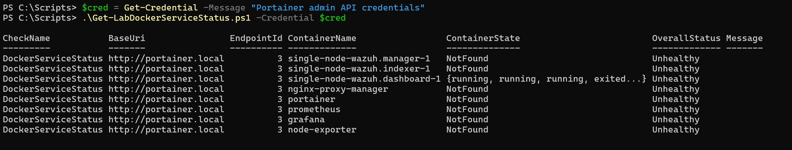
</p>

<p align="center">
  <em>The first live run: seven of eight expected containers reported NotFound, and single-node-wazuh.dashboard-1 reported a collection value, {running, running, running, exited...}, in place of a single state. A real defect, resolved below, not the expected outage.</em>
</p>

**After the fix described in Troubleshooting and Adjustments, Pester and Analyzer were re-run.**

```powershell
Invoke-Pester -Path C:\Scripts\Get-LabDockerServiceStatus.Tests.ps1 -Output Detailed
Invoke-ScriptAnalyzer -Path C:\Scripts\Get-LabDockerServiceStatus.ps1 -Settings C:\Scripts\PSScriptAnalyzerSettings.psd1
Invoke-ScriptAnalyzer -Path C:\Scripts\Get-LabDockerServiceStatus.Tests.ps1 -Settings C:\Scripts\PSScriptAnalyzerSettings.psd1
```

Seventeen tests passed, the sixteen original plus the new regression test covering the fixed defect, and both `Invoke-ScriptAnalyzer` invocations again returned no output.

**The live run was repeated, and this time returned the result Step One's plan anticipated.**

```powershell
.\Get-LabDockerServiceStatus.ps1 -Credential $cred
```

This returned a real `Unhealthy` result, driven by exactly the condition Step One left in place: the three Wazuh containers, `nginx-proxy-manager`, and `portainer` all `running`; `prometheus`, `grafana`, and `node-exporter` all `exited`. This matches Step One's live baseline exactly. It is the check working correctly on its first genuine live run, catching the monitoring-stack outage rather than a defect. Remediation remains deferred to Step Seven.

<p align="center">
  
</p>

<p align="center">
  <em>.\Get-LabDockerServiceStatus.ps1 run standalone against Portainer, after the fix: the Wazuh stack, nginx-proxy-manager, and portainer reporting running; prometheus, grafana, and node-exporter reporting exited; OverallStatus Unhealthy on every row. The monitoring-stack outage Step One found, correctly caught.</em>
</p>

### Step Five - Built Invoke-LabHealthReport.ps1, the Orchestrator

`Invoke-LabHealthReport.ps1` was built alongside the three check scripts. It is the script Step Six registers in Task Scheduler, making it the environment's single entry point: an interactive run or a scheduled firing invokes this one script, not the three checks individually. It accepts `-WazuhCredential`, `-PortainerCredential`, and `-ReportDirectory`. Per Design Decision 2 it re-declares none of the checks' own classification parameters, relying entirely on the defaults Steps Two through Four already built and validated.

**The dot-source placement is a correctness requirement, not a style choice.** Per Design Decision 6, the three check scripts are dot-sourced once, at this file's own top level, resolved relative to `$PSScriptRoot`, rather than inside the `Invoke-LabHealthReport` function body:

```powershell
. (Join-Path -Path $PSScriptRoot -ChildPath 'Get-LabADServiceHealth.ps1')
. (Join-Path -Path $PSScriptRoot -ChildPath 'Get-LabWazuhAgentStatus.ps1')
. (Join-Path -Path $PSScriptRoot -ChildPath 'Get-LabDockerServiceStatus.ps1')
```

At the top level, the three check functions are defined exactly once whenever this file is loaded. A Pester suite can then dot-source this file, `Mock` those three functions by name, and invoke `Invoke-LabHealthReport`, with the mocks taking effect because PowerShell resolves a bare function call by name at call time. Had the dot-source calls lived inside the function body, every call would re-dot-source the checks and redefine the real functions over the top of any active `Mock`, making the aggregation untestable.

**Parameter-name collision is handled by naming, not by scoping.** Dot-sourcing the checks into this file's scope lands each one's top-level `param` variables here as a side effect, the last-dot-sourced script's default winning for any shared name. None of that is used by this script: `-WazuhCredential`, `-PortainerCredential`, and `-ReportDirectory` were named specifically so none collides with a name the dot-sourced checks already bind, rather than scoping the dot-source calls to prevent it.

As in every check script here, none of the three top-level parameters carries a `Mandatory` attribute or a default, since a `Mandatory` parameter at the top of this file would prompt the moment it is dot-sourced and hang a Pester run. The standalone guard prompts for whichever is missing, `Get-Credential` for the credentials and `Read-Host` for the directory, only on a direct run.

**Aggregation (Design Decision 4, worst-wins).** The orchestrator calls the three checks by name and aggregates their `Status` values: any `Unhealthy` makes the overall status `Unhealthy` regardless of the other two; failing that, any `Unknown` makes it `Unknown`; only three `Healthy` results make it `Healthy`. Pure logic with no external dependency, and this lab's highest-value Pester target.

**Report output (Design Decision 3).** A console table (`CheckName` and `Status` for the three checks plus an aggregated `Overall` row) prints on an interactive run, built by a separate `Get-LabHealthReportSummaryTable` function rather than inline in the guard so tests can call it against an already-mocked result. A timestamped, self-contained HTML summary is always written to `-ReportDirectory` on every run, built by `ConvertTo-LabHealthReportHtml` (renamed from an analyzer finding below). HTML was chosen over a flat CSV row, matching Lab 04's precedent of departing from a flat table when the data does not reduce to one. Every rendered value, including a check's `Message`, passes through `[System.Net.WebUtility]::HtmlEncode`. The report is an exported artifact, written only to the runtime directory and kept out of the repository.

**Credential and token hygiene.** Both credentials pass straight through to the REST-backed checks without being read from, echoed, or stored here. The checks already exclude their own credentials and JWTs from their returned objects, and this script's console table and HTML report render only `CheckName` and `Status` values drawn from those already-clean objects, so neither surface can carry a credential forward. The suite asserts this directly.

**A testability boundary worth stating plainly.** Because the checks are dot-sourced unconditionally at this file's top level, running it with the call operator re-executes those dot-sources in that run's local scope, redefining the checks as their real network-calling selves and shadowing any `Mock` further up the chain. The check scripts do not have this problem, since none dot-sources anything; this one does, as a direct consequence of the mockability requirement. That is why the console-table rendering is its own function: the suite calls it against a `$result` from an already-mocked run rather than invoking the file with `&`.

**Pester coverage.** `Invoke-LabHealthReport.Tests.ps1` mocks the three check functions by name rather than their underlying commands, the only way the aggregation can be exercised in isolation. `BeforeEach` dot-sources the orchestrator fresh for every test, defining `Invoke-LabHealthReport` and, as a side effect of its own top-level dot-sourcing, the three real check functions, so `Mock` calls placed after replace real functions rather than something undefined. Every direct invocation supplies both credentials and `-ReportDirectory` explicitly against `TestDrive:\`, so no prompt can hang the suite.

Thirty-eight tests across five Contexts: dot-sourcing behavior; read-only and call-count behavior (each check called exactly once, each credential passed to the correct check); aggregation, twenty-seven tests, one per combination of the three checks' states, data-driven with `It -ForEach` over a table computed in the Context body as `Hashtable` entries (see Troubleshooting for why both of those matter); report file behavior (a timestamped HTML file every run, the directory created if missing, the overall status and all three check names present, a distinct file on each of two successive runs); and credential and token hygiene.

```powershell
Invoke-Pester -Path C:\Scripts\Invoke-LabHealthReport.Tests.ps1 -Output Detailed
```

All thirty-eight tests passed. Getting there took two back-to-back Pester authoring defects, both caught by real runs rather than review, covered in Troubleshooting and Adjustments.

<p align="center">
  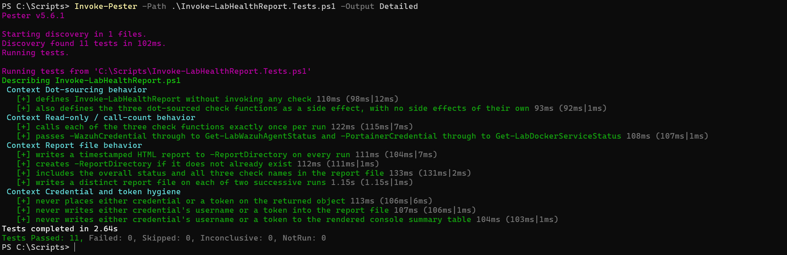
</p>

<p align="center">
  <em>The first real Invoke-Pester run: only eleven tests discovered, the twenty-seven-case Aggregation Context silently absent from both the test tree and the output, no error or warning printed anywhere.</em>
</p>

<p align="center">
  
</p>

<p align="center">
  <em>After fixing the Discovery-timing defect, all thirty-eight tests were discovered, but all twenty-seven Aggregation cases failed: every title rendered with blank AD=/Wazuh=/Docker= placeholders, and every assertion failed with "Expected $null, but got 'Healthy'".</em>
</p>

**Analysis was not clean on the first pass.**

```powershell
Invoke-ScriptAnalyzer -Path C:\Scripts\Invoke-LabHealthReport.ps1 -Settings C:\Scripts\PSScriptAnalyzerSettings.psd1
Invoke-ScriptAnalyzer -Path C:\Scripts\Invoke-LabHealthReport.Tests.ps1 -Settings C:\Scripts\PSScriptAnalyzerSettings.psd1
```

This returned three findings, all against the script, the test file clean on the first pass:

| RuleName | Severity | ScriptName | Line | Message |
|---|---|---|---|---|
| `PSUseShouldProcessForStateChangingFunctions` | Warning | `Invoke-LabHealthReport.ps1` | 150 | Function 'New-LabHealthReportHtml' has verb that could change system state. Therefore, the function has to support 'ShouldProcess'. |
| `PSUseOutputTypeCorrectly` | Information | `Invoke-LabHealthReport.ps1` | 222 | The cmdlet 'New-LabHealthReportHtml' returns an object of type 'System.String' but this type is not declared in the OutputType attribute. |
| `PSUseOutputTypeCorrectly` | Information | `Invoke-LabHealthReport.ps1` | 279 | The cmdlet 'Get-LabHealthReportSummaryTable' returns an object of type 'System.Array' but this type is not declared in the OutputType attribute. |

<p align="center">
  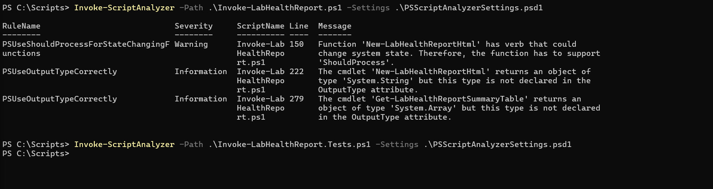
</p>

<p align="center">
  <em>Invoke-ScriptAnalyzer returning three findings against Invoke-LabHealthReport.ps1 (PSUseShouldProcessForStateChangingFunctions on the HTML-building helper, and two PSUseOutputTypeCorrectly findings), and Invoke-LabHealthReport.Tests.ps1 returning to the prompt with no output, clean on the first pass.</em>
</p>

`PSUseShouldProcessForStateChangingFunctions` fired because the HTML-building helper was named `New-LabHealthReportHtml`, and `New-` is a verb PSScriptAnalyzer treats as state-changing, even though the function only builds and returns a string; the file write happens in `Invoke-LabHealthReport` via `Out-File`. The fix was a rename rather than a suppression, to `ConvertTo-LabHealthReportHtml`, the same relationship `ConvertTo-Html` has to the data it renders. The two `PSUseOutputTypeCorrectly` findings were fixed by adding `[OutputType([string])]` and `[OutputType([PSCustomObject])]` attributes.

```powershell
Invoke-Pester -Path C:\Scripts\Invoke-LabHealthReport.Tests.ps1 -Output Detailed
Invoke-ScriptAnalyzer -Path C:\Scripts\Invoke-LabHealthReport.ps1 -Settings C:\Scripts\PSScriptAnalyzerSettings.psd1
Invoke-ScriptAnalyzer -Path C:\Scripts\Invoke-LabHealthReport.Tests.ps1 -Settings C:\Scripts\PSScriptAnalyzerSettings.psd1
```

Pester still passed 38 of 38, but the analyzer returned one remaining finding: `Get-LabHealthReportSummaryTable`'s declared `[OutputType([PSCustomObject])]` did not match the `System.Array` it inferred from the body, whose last statement is an array-literal expression rather than a single object.

<p align="center">
  
</p>

<p align="center">
  <em>After the rename and the first OutputType attempt: Pester still 38 of 38, but Invoke-ScriptAnalyzer returning one remaining PSUseOutputTypeCorrectly finding, "returns an object of type 'System.Array'", against Get-LabHealthReportSummaryTable's declared [PSCustomObject].</em>
</p>

The declared attribute was corrected to `[OutputType([System.Array])]`, matching the analyzer's own inferred type literally rather than the collection's element type.

```powershell
Invoke-Pester -Path C:\Scripts\Invoke-LabHealthReport.Tests.ps1 -Output Detailed
Invoke-ScriptAnalyzer -Path C:\Scripts\Invoke-LabHealthReport.ps1 -Settings C:\Scripts\PSScriptAnalyzerSettings.psd1
Invoke-ScriptAnalyzer -Path C:\Scripts\Invoke-LabHealthReport.Tests.ps1 -Settings C:\Scripts\PSScriptAnalyzerSettings.psd1
```

Pester passed 38 of 38 again, and both `Invoke-ScriptAnalyzer` invocations returned to the prompt with no output: a clean pass.

**A first live-run attempt surfaced one further real defect, in the orchestrator's own interactive guard rather than in anything Pester or Analyzer covers.**

```powershell
.\Invoke-LabHealthReport.ps1
```

Both credential prompts were answered, but the report-directory `Read-Host` prompt was left blank. The empty string failed `Invoke-LabHealthReport`'s `Mandatory [string]$ReportDirectory` binding with `ParameterArgumentValidationErrorEmptyStringNotAllowed`. That terminates the failed statement but not the top-level script under the default `$ErrorActionPreference = 'Continue'`, so execution continued with `$result` left `$null`: a blank summary table and an empty `Report written to:` line rather than a clean stop. No live check had run, since the binding failure happened before the function body started, so nothing reached DC01, Wazuh, or Portainer.

The fix was to validate all three interactively-resolved inputs explicitly, immediately after resolving each, and `throw` a specific error there rather than trusting parameter binding to catch it later:

```powershell
if ([string]::IsNullOrWhiteSpace($ReportDirectory)) {
    throw 'A report directory is required to run this report; the prompt was left empty.'
}
```

The same check was added for both credentials, since `Get-Credential` returns `$null` on a cancelled prompt rather than throwing, and an explicit `$null` passed to a `Mandatory` reference-type parameter is accepted silently, unlike the empty-string case, letting a cancelled prompt fail much later and far less clearly inside a REST call. A second attempt against the same blank input confirmed the fix: the script failed immediately with `A report directory is required to run this report; the prompt was left empty.`

```powershell
Invoke-Pester -Path C:\Scripts\Invoke-LabHealthReport.Tests.ps1 -Output Detailed
Invoke-ScriptAnalyzer -Path C:\Scripts\Invoke-LabHealthReport.ps1 -Settings C:\Scripts\PSScriptAnalyzerSettings.psd1
Invoke-ScriptAnalyzer -Path C:\Scripts\Invoke-LabHealthReport.Tests.ps1 -Settings C:\Scripts\PSScriptAnalyzerSettings.psd1
```

Re-run after the guard fix, Pester still passed 38 of 38 and both analyzer invocations returned no output, confirming the change, confined to the guard's input validation, touched nothing either suite covers.

**The live run was then repeated for real, against the live environment, and returned the result the plan anticipated.**

```powershell
.\Invoke-LabHealthReport.ps1
```

Both credential prompts were answered and a real report directory (`C:\Reports`) supplied. This returned a real `Unhealthy` overall result: `ADServiceHealth` and `WazuhAgentStatus` both `Healthy`, matching Steps Two and Three's live baselines, and `DockerServiceStatus` `Unhealthy`, matching Step Four's, driven by the still-unremediated monitoring-stack outage. The report was written to `C:\Reports\LabHealthReport-20260819-124807.html`.

<p align="center">
  
</p>

<p align="center">
  <em>.\Invoke-LabHealthReport.ps1 run standalone: the console summary table showing ADServiceHealth and WazuhAgentStatus Healthy, DockerServiceStatus Unhealthy, Overall Unhealthy, and the report path written to C:\Reports\LabHealthReport-20260819-124807.html.</em>
</p>

<p align="center">
  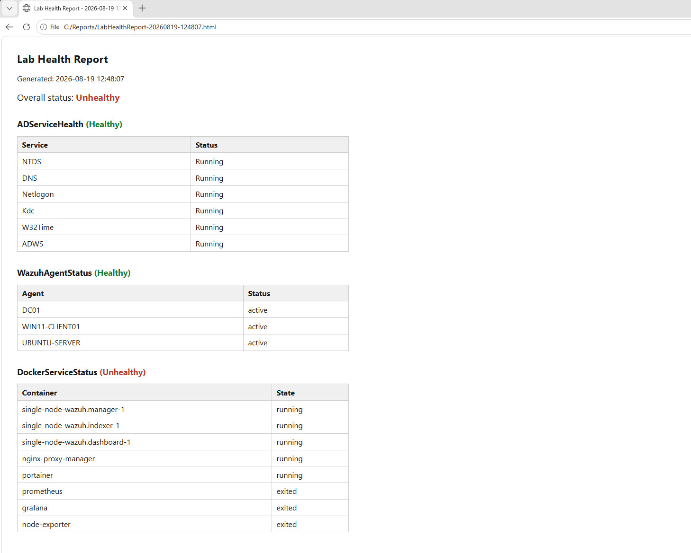
</p>

<p align="center">
  <em>The generated HTML report opened in a browser: overall status Unhealthy in red; ADServiceHealth Healthy with all six services Running; WazuhAgentStatus Healthy with all three agents active; DockerServiceStatus Unhealthy, the Wazuh stack, nginx-proxy-manager, and portainer running, prometheus, grafana, and node-exporter exited, matching Step One's and Step Four's own baselines exactly.</em>
</p>

This is worst-wins working as intended: one real fault in one of three checks correctly propagated to the overall status rather than averaged away or masked by the other two `Healthy` results. Remediation and a `Healthy` before/after comparison remain deferred to Step Seven.

### Step Six - Make the Orchestrator Schedulable, Then Register the Scheduled Task

Split into two phases, because the orchestrator as built in Step Five could not be scheduled as it stood: its only executable path is the guard, which resolved both credentials with `Get-Credential` and the report directory with `Read-Host`. Task Scheduler cannot answer a prompt, and a `[PSCredential]` cannot be passed on a `powershell.exe -File` command line. Not a defect in Step Five's work, which was built for the interactive runs it was validated against, but the remaining gap between an interactive script and an unattended one.

**Step Six-A: least-privileged API accounts and a non-interactive input path.** Provisioning came first, live against each platform's own API, since Design Decision 5 committed to least-privilege only "subject to what each platform's role model actually supports."

On Wazuh, `GET /security/roles` showed the Manager's built-in roles including `agents_readonly` (id 4), scoped to exactly what `Get-LabWazuhAgentStatus.ps1` needs and tighter than the broader `readonly` role. `POST /security/users` created `labhealthcheck-wazuh` and `POST /security/users/100/roles?role_ids=4` attached the role. Authenticating as the new account returned all three target agents `active` and `OverallStatus Healthy`, matching Step Three's baseline under the broader account. `wazuh-wui` itself was never touched.

<p align="center">
  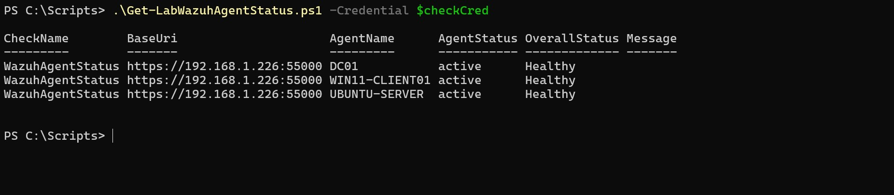
</p>

<p align="center">
  <em>Get-LabWazuhAgentStatus.ps1 -Credential $checkCred, running as the new labhealthcheck-wazuh account (agents_readonly role only): all three target agents active, OverallStatus Healthy.</em>
</p>

On Portainer, the equivalent attempt surfaced a platform limit instead of a working account. A standard user was created and granted access to endpoint 3 via `PUT /api/endpoints/3` (`UserAccessPolicies`). The account could reach the Docker proxy, with `GET .../docker/version` returning real engine data, but `GET .../docker/containers/json` returned a genuinely empty array, `Count: 0`, not an error.

<p align="center">
  
</p>

<p align="center">
  <em>The standard Portainer account reaching endpoint 3's Docker proxy successfully but the container-listing call returning a genuine, empty System.Object[]: Count 0, not an error.</em>
</p>

`GET /api/roles` returned nothing at all, and Portainer's own documentation confirmed why: "for security reasons, all resources inside an environment are assigned only to the administrator by default," with no environment-wide override, only a per-resource one. The eight monitored containers span three compose projects deployed directly on Ubuntu Server, none through Portainer, so none carry the ownership metadata a non-admin view depends on. Making them visible would mean standing per-resource changes across three unrelated stacks, fragile to any future container recreation including Step Seven's own remediation. `Get-LabDockerServiceStatus.ps1` keeps the admin account; the standard user and its grant were reverted and deleted rather than left as unused exposure.

**That rejected account left behind a real defect in a script this step was not meant to touch.** The empty container list was recorded as a platform finding and nothing more, until a review asked what `Get-LabDockerServiceStatus.ps1` would have done with that response. It would have walked its eight-entry expected list, matched none, reported eight `NotFound` rows, and classified `Unhealthy` with a blank `Message`: a full-environment outage reported for a query that succeeded and could not see anything. The same misclassification Step Two found, reached by a different route. There, `-Name` with `SilentlyContinue` made an unreachable host indistinguishable from absent services; here, a permissions-blinded response is indistinguishable from every container having vanished. Both collapse a failed observation into a confirmed fault, and both were missed by fully passing suites.

An empty list is not an ambiguous reading here, which is what makes a guard defensible rather than arbitrary. The `portainer` container is itself in the expected set, and Portainer served the request, so a response describing zero containers cannot describe the host that answered: the response is wrong, not the environment. The script now returns `Unknown`, with a message saying the query succeeded but returned nothing, before reaching the matching loop.

`Get-LabWazuhAgentStatus.ps1` was given the same guard on inspection rather than observation, since it has the identical shape. Its guard deliberately tests the whole response before agent `000` is filtered out: `000` is always present in a working Manager, so a completely empty response cannot describe one, while a response carrying only `000` is a genuine state, no monitored agents enrolled, and must stay `Unhealthy` rather than being masked. A test locks each side of that line.

Both guards also handle an empty response body rather than an empty array, which leaves the variable `$null` and, through the existing `@()` wrap, a single-element array holding `$null`. Filtering nulls covers both shapes without disturbing the assign-then-wrap form Step Four's fix depends on. The Docker regression test reproduces the observed shape with the unary comma operator, since a bare `@()` returned from `-MockWith` emits nothing at all, the separate null case covered by its own test.

```powershell
Invoke-Pester -Path C:\Scripts\Get-LabDockerServiceStatus.Tests.ps1 -Output Detailed
Invoke-Pester -Path C:\Scripts\Get-LabWazuhAgentStatus.Tests.ps1 -Output Detailed
```

`Get-LabDockerServiceStatus.Tests.ps1` returned 19 of 19 and `Get-LabWazuhAgentStatus.Tests.ps1` 17 of 17, and all four `Invoke-ScriptAnalyzer` invocations returned no output.

The defect was latent rather than live, since the scheduled path uses the admin account, so no run of this lab ever misreported because of it. It was fixed here anyway: Step Seven's before-and-after exists to demonstrate that the three-state classification discriminates a real fault from a clean environment, and a known hole in `Unknown` detection would undercut that claim.

`Invoke-LabHealthReport.ps1` then gained a `Get-LabStoredCredential` helper, an `Import-CliXml` wrapper throwing distinctly for an absent file and for one that does not deserialize to a `[PSCredential]`, plus an optional top-level parameter wiring it into the guard for whichever credential was not supplied directly, preferred over the prompt. Planned as `-CredentialDirectory` until `PSAvoidUsingPlainTextForPassword` flagged it, and renamed to `-SecretsDirectory`, fixing the code rather than suppressing the rule. The function's own three `Mandatory` parameters and body were untouched. Three Contexts were added: a genuine `Export-CliXml`/`Import-CliXml` round trip in `TestDrive:\`, a missing-file throw, and a wrong-type throw. The suite passed 41 of 41, both files analyzer-clean.

The two credential files, `wazuh.cred.xml` and `portainer.cred.xml`, were exported with `Export-CliXml` into `C:\Secrets` from an interactive session confirmed to be `labadmin`. The exact command line Step Six-B registers was then run from a normal console:

```
powershell.exe -NoProfile -NonInteractive -ExecutionPolicy Bypass -File C:\Scripts\Invoke-LabHealthReport.ps1 -SecretsDirectory C:\Secrets -ReportDirectory C:\Reports
```

It completed with no prompt and wrote a timestamped report, returning `Unhealthy` overall: AD and Wazuh `Healthy`, Docker `Unhealthy` from the still-unremediated monitoring stack, the expected result rather than a problem.

<p align="center">
  
</p>

<p align="center">
  <em>The exact scheduled-task command line run from a normal console: completes with no prompt, writes LabHealthReport-20260819-182334.html, Overall Unhealthy.</em>
</p>

**Step Six-B: built `Register-LabHealthReportTask.ps1`, registered the task, and observed a real firing.** The script takes a `[PSCredential]` for the run-as account rather than separate username and password parameters, both to follow this lab's credential discipline and because a `Password` parameter would trip `PSAvoidUsingUserNameAndPasswordParams` and `PSAvoidUsingPlainTextForPassword`; the plaintext is unwrapped at the `Register-ScheduledTask` call site only and held in no variable. A live `Get-Help Register-ScheduledTask -Full` confirmed the `-Principal` parameter set carries no `-Password` at all, so the script registers through the `User` set. `Register-` is on the state-changing-verb list, so the function implements `SupportsShouldProcess` for real, gating the call behind `$PSCmdlet.ShouldProcess(...)` rather than renaming its way around the rule as Step Five did, the first script in the track to do so. Re-running against an existing task name has defined behavior: `Get-ScheduledTask` is queried first and the function throws, naming the task and directing the caller to `-Force`.

The action is built from the function's own `-ScriptPath`, `-SecretsDirectory`, and `-ReportDirectory` parameters rather than hardcoded, producing the exact command line Step Six-A confirmed runs clean with no prompt. The trigger is daily at `-TriggerTime`, defaulting to 07:00 local; the settings are `-StartWhenAvailable` and a limit defaulting to 15 minutes.

Building the Pester suite, which mocks the `ScheduledTasks` cmdlets so registration logic is verified without registering anything, surfaced three findings rather than confirming the design first time, each detailed in Troubleshooting and Adjustments: `Mock` enforcing a mocked cmdlet's real `CimInstance[]` parameter types against hand-built `PSCustomObject` stand-ins; `-Password` rejecting an empty `SecureString` even under Mock; and `StartBoundary` coming back UTC and `Z`-suffixed rather than local, captured live rather than guessed a second time. The suite reached fifteen of fifteen, both files analyzer-clean throughout.

Registration itself requires an elevated session, separate from the non-elevated session the check needs. Run elevated, the script prompted only for the run-as password via `Read-Host -AsSecureString`, consistent with the username being fixed to `CORP\labadmin` and with `Get-Credential`'s dialog having already failed to accept input in this remote session once. Registration printed `TaskName LabHealthReport, TaskPath \, State Ready`. Querying the task's `Principal` confirmed, rather than assumed, that the `User` parameter set produced what Design Decision 5 requires: `LogonType Password`, `RunLevel Limited`, `UserId labadmin`.

<p align="center">
  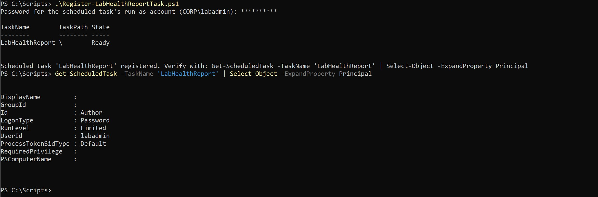
</p>

<p align="center">
  <em>Registration succeeded (State: Ready); Get-ScheduledTask's Principal confirms LogonType Password, RunLevel Limited, UserId labadmin.</em>
</p>

Task Scheduler's "All Tasks History" was checked before the first firing rather than after, since it cannot be enabled retroactively; it was already on.

07:00 had already passed on the day of registration, so the documented fallback was used: the trigger was moved forward a few minutes with `Set-ScheduledTask -Trigger`, the firing observed, and the trigger restored immediately afterward. The first move failed with `The user name or password is incorrect` (`0x8007052e`), since updating a `LogonType Password` task, not only registering one, requires the run-as credential supplied again. The retry succeeded, and `Get-ScheduledTaskInfo` showed the new `NextRunTime` a few minutes out.

The session was then logged off entirely rather than merely locked, since "run whether the user is logged on or not" is the configuration under test, and left past the new trigger time. `Get-ScheduledTaskInfo` afterward showed `LastRunTime` at the moved trigger time and `LastTaskResult 0`, with a report file timestamped to that same moment and distinct from any earlier manual run.

<p align="center">
  
</p>

<p align="center">
  <em>Get-ScheduledTaskInfo after the moved-forward firing: LastRunTime matches the trigger, LastTaskResult 0; Get-ChildItem C:\Reports shows a report file timestamped to the same moment.</em>
</p>

The operational log was queried next to confirm the firing was genuinely time-trigger-driven rather than assembled from a manual run's side effects. The chain showed event `100` (task started for `CORP\labadmin`), `129` (launched `powershell.exe`, with its process ID), `107` ("launched ... due to a time trigger condition", the specific confirmation this was scheduled rather than manual), `200` (action launched), and `201`/`102` (completed, return code `0`), alongside earlier `140`/`106` events recording the trigger move and the original registration.

<p align="center">
  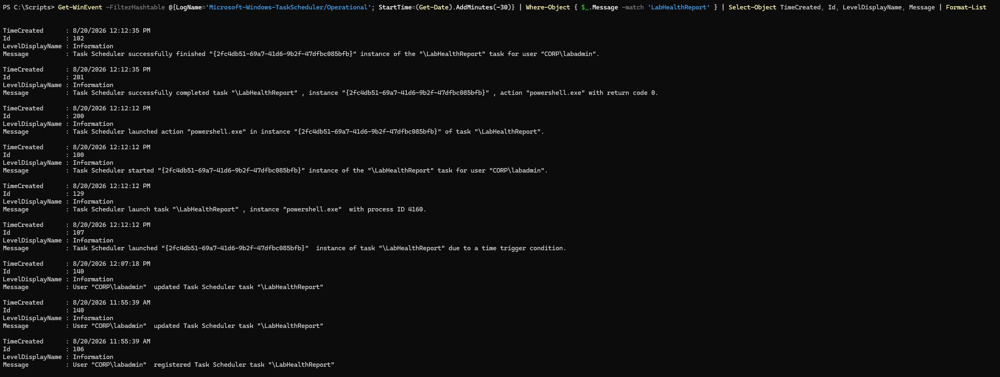
</p>

<p align="center">
  <em>Task Scheduler operational log: the full event chain for the firing, including event 107, "launched ... due to a time trigger condition."</em>
</p>

A hung-process check found exactly one `powershell.exe` running, the fresh interactive session opened after logging back in, created after the firing had completed; the task's own process had already exited. The report's contents were then checked directly, confirming `Overall status: Unhealthy`, the result the still-unremediated monitoring stack predicted and matching what a manual run returns.

Restoring the trigger surfaced a second, distinct finding. The first attempt, run from the fresh post-logon session and supplying the run-as credential as the earlier fix required, failed anyway with `Set-ScheduledTask : Access is denied` (`0x80070005`), with `NextRunTime` unchanged and no corruption. The credential was not the problem: that session was not elevated, a separate requirement, and modifying a registered task needs elevation just as registering it does.

<p align="center">
  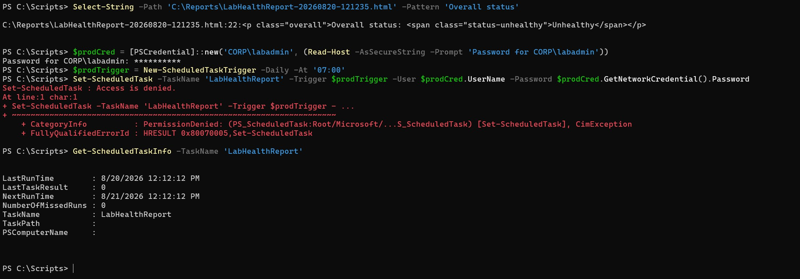
</p>

<p align="center">
  <em>Select-String confirms the report's own contents match the predicted Unhealthy result; the first trigger-restore attempt fails with Access is denied, NextRunTime unchanged, before the session was re-elevated.</em>
</p>

An elevated session was opened and the restore retried with the credential; it succeeded, `NextRunTime` back at `8/21/2026 7:00:00 AM`.

<p align="center">
  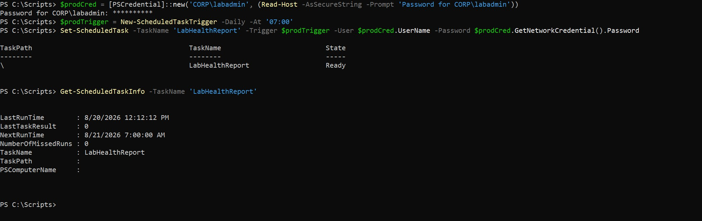
</p>

<p align="center">
  <em>Trigger restore retried from an elevated session: succeeds, NextRunTime back at 8/21/2026 7:00:00 AM.</em>
</p>

The task's `Principal` was checked once more after both updates, confirming `LogonType Password`, `RunLevel Limited`, and `UserId labadmin` unchanged by either the trigger move or its restore.

### Step Seven - Ran All Checks Live and Validated Against Independent Sources

**Sub-step one: confirmed the deployment matched the repository.** Before any sweep could mean anything, `C:\Scripts` had to be a faithful copy of what is committed. All 27 expected files were present, thirteen scripts, thirteen test files, and `PSScriptAnalyzerSettings.psd1`, nothing missing or extra, but a SHA256 comparison flagged four as mismatched. A raw paste appeared to show blank lines stripped throughout, a terminal artifact rather than a real difference; a base64-encoded dump, immune to whitespace handling in transit, showed the real and much smaller drift: all four missing their trailing newline, and the settings file carrying one extra blank line. Functionally inert, but real, and a hash caught what eyeballing the file list would not have. The four were re-copied and all 27 then matched byte-for-byte.

**Sub-step two: validated the report's signals against independent sources.** The report validated was `LabHealthReport-20260821-165105.html`, completed 8/21 4:51:05 PM. `Get-ScheduledTaskInfo` and the operational log for the surrounding ten minutes established this as a genuine unattended firing but not a literal 07:00 time-trigger one: the Task Scheduler service had restarted around 4:45 PM and the task caught up through `StartWhenAvailable` (event `114`, then `129`, `100`, `200`, `201`, `102`), not event `107`. The cause was unrelated to this lab: a thunderstorm had taken the equipment offline until that afternoon. It is accepted as valid evidence, since Design Decision 5 requires a genuinely unattended firing rather than a literal 07:00 one, and documented as what it was rather than implied to be routine.

The report's own per-check breakdown read `ADServiceHealth (Healthy)`, `WazuhAgentStatus (Healthy)`, `DockerServiceStatus (Unhealthy)`, `Overall status: Unhealthy`, confirming worst-wins aggregation was already working correctly for this run before any independent check was made.

The three observations below were taken over the hours following the run rather than alongside it, with each timing given where recorded. Nothing in the three signals was moving across that window, so the gap does not weaken the comparison, but a cross-check taken hours later is not the same claim as one taken simultaneously and is not presented as one.

Active Directory service state was checked directly on DC01, not through `Get-Service -ComputerName` a second time, which would reuse the exact path the script queries. The first attempt was run on WIN11-CLIENT01 by mistake, returning not-found for `NTDS`, `DNS`, `Kdc`, and `ADWS` with only `Netlogon` and `W32Time` `Running`, exactly what a domain-joined client with no AD DS role would show. Run genuinely on DC01, five of six reported `Running` but `NTDS` came back not found, an anomaly worth investigating given `Kdc` and `ADWS` alone are conclusive evidence of a real domain controller. A follow-up filter confirmed `NTDS` was not visible at all in that non-elevated session; from an elevated session, all six reported `Running`. The likely explanation is that `NTDS`'s service security descriptor is locked down tighter than the other five, reasonable for the one service guarding the domain's credential database. This matched the report's `ADServiceHealth (Healthy)` finding and surfaced a previously undocumented property of this environment.

<p align="center">
  
</p>

<p align="center">
  <em>All six target AD services, including NTDS, reporting Running from an elevated session on DC01 itself, the genuinely independent AD service observation. NTDS did not resolve in the two prior non-elevated attempts.</em>
</p>

Wazuh agent status was checked against the Dashboard's Agents view at `https://192.168.1.226:8443`, not the Overview page's aggregate count alone. Overview showed `Active (3)`, `Disconnected (0)`, but the dedicated Endpoints inventory was pulled to confirm each host individually: `UBUNTU-SERVER`, `WIN11-CLIENT01`, and `DC01` all `active`. Observed at 8:56 PM, roughly four hours after the 4:51 PM run.

<p align="center">
  
</p>

<p align="center">
  <em>Wazuh Dashboard Agents inventory: DC01, WIN11-CLIENT01, and UBUNTU-SERVER all individually listed active, matching the report's WazuhAgentStatus (Healthy) finding.</em>
</p>

Docker service state was checked with a raw `docker ps -a` and `docker compose ls -a` over SSH, not the Portainer UI, which shares the API path the script already queries and is therefore not independent per Design Decision 7. Both matched the report and Step One's baseline exactly: the Wazuh stack, `nginx-proxy-manager`, and `portainer` all `Up About an hour`, consistent with the afternoon's restart; `prometheus` and `grafana` `Exited (0)`, `node-exporter` `Exited (2)`, unchanged from the two-month-old baseline; and `monitoring-stack exited(3)`, `docker-networking exited(2)`, `reverse-proxy-lab running(1)`, `single-node running(3)`.

<p align="center">
  
</p>

<p align="center">
  <em>Raw docker ps -a and docker compose ls -a over SSH on Ubuntu Server, matching the report's DockerServiceStatus (Unhealthy) finding and Step One's original baseline exactly.</em>
</p>

All three independent sources matched the report, and worst-wins held correctly: two `Healthy` signals (AD, Wazuh) and one `Unhealthy` signal (Docker) produced an overall `Unhealthy`, the actual live-run demonstration of the aggregation rule Design Decision 4 defined.

**Sub-step three: root-caused the monitoring-stack outage before remediating it.** Root cause had to come before anything was touched, since restarting would destroy the evidence. `docker inspect` showed all three containers stopped within about two seconds of each other, between 17:57:30 and 17:57:32 UTC on 2026-06-18, five days after deployment. `prometheus` and `grafana` both logged a graceful shutdown (`signal=terminated`) and exited `0`; `node-exporter` exited `2`, an unclean exit the surviving logs did not explain, since they captured only its June 13 startup. That tight a synchronization across three independent containers points at a single `docker compose down` or `stop` against the project, not three unrelated crashes.

`uptime -s` showed the current boot time as 2026-08-21 16:38:45, the thunderstorm restart, so the host had rebooted at least once since June and the containers still had not come back. Both the compose file and `docker inspect` confirmed why: `RestartPolicy=no` on every service, no `restart:` key anywhere. Not a crash-loop or a resource fault, but a stack stopped once with nothing to bring it back on any subsequent reboot.

What triggered the June 18 stop could not be established. The compose file had not been touched since June 9, before both the deployment and the stop, so no change shipped through a commit, and linux infrastructure Lab 06's document has no Troubleshooting section, no restart-policy discussion, and no note of an outage. The one lead is circumstantial: commit history shows active work on enterprise infrastructure Lab 07 on the same host that day, with commits at 13:23 and 18:42 local bracketing the 13:57 stop. Lab 07 never mentions the monitoring stack and the stop is not remembered as deliberate. The confirmed root cause is the mechanism, a graceful stop with no restart policy; the trigger stays an unconfirmed guess.

**Sub-step four: remediated and captured a genuine before/after.** Adding a `restart:` policy to the compose file raised a scope question: that file is linux infrastructure Lab 06's documented artifact, and ADR-015 scopes this track to automating the existing environment rather than changing it. Restoring the containers to their already-documented state is remediation squarely inside this lab's story; changing the file's contents would leave Lab 06's documentation describing a file that no longer matches what is deployed, and raised an unresolved question of which copy is authoritative. The decision was to close this lab without editing it and add the restart policy separately, outside this track.

Remediation was therefore a straight restart against the existing, unmodified compose file: `docker compose start` from `~/infrastructure/monitoring-stack`, which brought all three containers back up, confirmed by `docker compose ps` showing `node-exporter`, `grafana`, and `prometheus` all `Started`, `Up 2 seconds`.

<p align="center">
  
</p>

<p align="center">
  <em>docker compose start bringing all three monitoring-stack containers back up against the unmodified compose file; no restart policy was added.</em>
</p>

The before half of the comparison is the same `LabHealthReport-20260821-165105.html` validated in sub-step two: `Overall status: Unhealthy`, `DockerServiceStatus (Unhealthy)`.

<p align="center">
  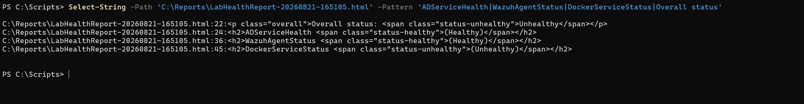
</p>

<p align="center">
  <em>Before remediation: Overall status Unhealthy, driven by DockerServiceStatus Unhealthy, with ADServiceHealth and WazuhAgentStatus both already Healthy.</em>
</p>

The after half came from the very next scheduled firing, 8/22 at 7:00 AM, confirmed as a genuine time-trigger firing rather than another catch-up: `LastRunTime 8/22/2026 7:00:01 AM`, operational-log event `107` "due to a time trigger condition" at `7:00:01 AM`, and a clean completion (event `201`, return code `0`) at `7:00:23 AM`. `LabHealthReport-20260822-070023.html` read `Overall status: Healthy`, all three checks `Healthy`.

<p align="center">
  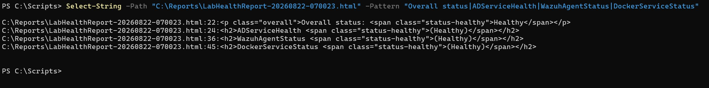
</p>

<p align="center">
  <em>After remediation, from the next genuine 07:00 time-trigger firing: Overall status Healthy, all three checks Healthy.</em>
</p>

Both halves came from scheduled firings rather than manual runs, though not the same kind: the before was a delayed catch-up and the after a literal on-time trigger, stated plainly rather than implied equivalent. Restarting the containers with no other change is what took Docker from `Unhealthy` to `Healthy`, and worst-wins correctly flipped `Overall` with it, the concrete demonstration Design Decision 4 was designed to produce.

**Sub-step five: ran the first combined static analysis and test sweep across the whole library.** `Invoke-ScriptAnalyzer -Path C:\Scripts -Settings C:\Scripts\PSScriptAnalyzerSettings.psd1 -Recurse` returned no output, a clean pass across all thirteen scripts under the pinned settings file, the first time the full library had been swept together rather than one script at a time.

`Invoke-Pester -Path C:\Scripts -Output Detailed` discovered 172 tests across all thirteen test files and completed with `Tests Passed: 172, Failed: 0, Skipped: 0, Inconclusive: 0, NotRun: 0`.

<p align="center">
  
</p>

<p align="center">
  <em>Pester's own combined summary: 172 of 172 tests passed, the real total from the first-ever combined sweep, taken directly from the tool's output.</em>
</p>

A number of `FAIL:`/`ABORT:`/`ERROR:` lines appear scattered through the detailed output, and are worth being explicit about: these are not Pester failures. They are the scripts' own `Write-Host` status lines, the diagnostic output `PSScriptAnalyzerSettings.psd1` deliberately excludes `PSAvoidUsingWriteHost` for, firing correctly under mocked failure scenarios. `Remove-LabUser.ps1`'s query-back validation, for example, printed `FAIL: account is still enabled` when a test deliberately mocked a re-query showing the disable had not taken, and that test passed, because its point was confirming the script's failure-detection logic works. No cross-file interference from similarly-named script-scoped helpers was observed.

---

## Validation

This lab is considered validated because:

- `Get-LabADServiceHealth.ps1`'s reported state for DC01's six target services matched a direct `Get-Service` query on DC01 itself, run elevated after two lower-privilege attempts failed to enumerate `NTDS`
- `Get-LabWazuhAgentStatus.ps1`'s reported state for all three agents matched the Wazuh dashboard's Agents view, checked per host rather than the Overview page's aggregate count alone, observed roughly four hours after the run rather than alongside it
- `Get-LabDockerServiceStatus.ps1`'s reported state for the expected container set matched a direct `docker ps -a`/`docker compose ls -a` run over SSH on Ubuntu Server, not the Portainer UI, per Design Decision 7
- `Invoke-LabHealthReport.ps1`'s aggregated status correctly reflected worst-wins against the live run's actual results, two `Healthy` and one `Unhealthy` producing an overall `Unhealthy`, and again all three `Healthy` after remediation
- the scheduled Task Scheduler job fired on its configured cadence unattended, both as a `StartWhenAvailable` catch-up after a real power outage and as a genuine 07:00 time trigger the following morning, producing a timestamped report file on WIN11-CLIENT01 each time
- none of the four query scripts was found, on review, to call anything other than a read-only query (`Get-Service`, or a `GET`/authentication `POST` against the two APIs); nothing modified AD, Wazuh, or Docker state, and the monitoring-stack containers were restarted, not reconfigured. `Register-LabHealthReportTask.ps1` is the deliberate exception, state-changing by definition, but only against WIN11-CLIENT01's own Task Scheduler and only when run once by hand; the scheduled job never invokes it
- the full combined script library, all thirteen scripts and thirteen test files in `C:\Scripts`, passed a clean `Invoke-ScriptAnalyzer -Recurse` sweep and a clean combined `Invoke-Pester` run, 172 of 172 tests passing

Consistent with the rule this track has held since Lab 01, no script's reported result was accepted from its own output alone; each was checked against the independent source named in Design Decision 7.

---

## Troubleshooting and Adjustments
Every entry below was encountered and resolved during implementation; the step each belongs to is named in its heading, and the full narrative for each lives in that step above. The monitoring-stack outage is the one exception, carrying an open root cause from Step One through Step Seven.

**PowerShell 5.1's `Invoke-RestMethod` has no `-SkipCertificateCheck` parameter (Step One).** The `[System.Net.ServicePointManager]` accommodation, forcing TLS 1.2 and installing a certificate-validation callback, worked first time against the Wazuh Manager API's self-signed certificate. Reapplied against `portainer.local` it did not resolve an HTTPS failure there, but that was a different problem entirely rather than a defect in the accommodation.

**`Get-Service -ComputerName` against DC01 is reachable and requires no elevation (Step One).** The call succeeded on the first attempt from a non-elevated session, all six services `Running`. The Service Control Manager's remote RPC interface is open between WIN11-CLIENT01 and DC01 with no additional firewall configuration, which answers the `Get-Service` half of Design Decision 5's elevation question.

**The Wazuh Manager API validates against its own dedicated account, distinct from the Dashboard/Indexer login (Step One).** Authentication failed twice with the Dashboard/Indexer `admin` credentials. Not a wrong password but a wrong account: the Manager REST API keeps its own local user store. The correct account, `wazuh-wui`, was found under the `wazuh.manager` service's `API_USERNAME` in `docker-compose.yml`.

**Portainer's proxy host is HTTP-only, not HTTPS (Step One).** HTTPS failed with `Could not create SSL/TLS secure channel` even with the TLS accommodation freshly reapplied, ruling out a missing client-side workaround. The NGINX Proxy Manager proxy host has no SSL certificate assigned, and both linux infrastructure Lab 04 and the reverse proxy lab record `http://portainer.local`. The script was built against an HTTP URI rather than the assumed HTTPS one.

**`Get-Credential`'s dialog failed to accept input in this remote session, and pasting a multi-line block with interactive prompts corrupted input (Step One).** A window-station issue rather than a credential problem, resolved by console `Read-Host` prompts. Pasting the resulting multi-line block in one go then corrupted input, since the prompts consumed characters intended for later lines, producing a parser error and a cascade of unrelated downstream failures. Running one line at a time avoided it.

**The monitoring stack had been fully down for two months, discovered rather than caused (encountered Step One, resolved Step Seven).** Portainer's container list and an independent `docker ps -a` matched exactly at ten containers. Two undocumented ones, `frontend` and `backend`, are linux infrastructure Lab 05's teaching containers and were excluded from the expected-running baseline. The monitoring stack reporting `exited(3)` was explained nowhere in the repository, and was deliberately left down so the Docker check's first live run would catch a genuine fault rather than validate against an environment quietly fixed ahead of time.

Step Seven root-caused it before touching anything, since restarting would have destroyed the evidence. `docker inspect` showed all three containers stopped within about two seconds of each other on 2026-06-18, five days after deployment: `prometheus` and `grafana` gracefully (`signal=terminated`, exit code `0`), `node-exporter` uncleanly (exit code `2`, unexplained by the surviving logs). None carried a `restart:` policy, which is why the stack stayed down through every host reboot since. What triggered the stop could not be confirmed; the closest lead is circumstantial commit history bracketing the stop time, and the stop is not remembered as a deliberate action. The containers were restarted with `docker compose start` against the unmodified compose file. Adding a `restart:` policy was deferred as a scope question, since that file belongs to Lab 06: the detector is fixed, the underlying cause is not.

**The `C:\Scripts` working copy had silently drifted from the repository, and only a byte-for-byte hash caught it (Step Seven).** A combined sweep only means anything if the files it analyzes are the files actually committed. The file list was correct, all 27 present, and would have passed a visual check; SHA256 flagged four as different. A raw paste appeared to show blank lines stripped throughout, an artifact of the copy-paste path, while a base64 dump showed the real drift: a missing trailing newline on three scripts and the settings file, plus one extra blank line in the settings file. Both functionally inert. The four were re-copied and all 27 then matched byte-for-byte. The drift was in the working copy, not in anything committed, so no earlier result is called into question.

**A domain controller's own `NTDS` service does not enumerate in a non-elevated local `Get-Service` session, even though the other five target services do (Step Seven).** Run elevated, all six report `Running`. This affects nothing this lab's scripts do, since they query DC01 remotely over the SCM's RPC interface, which Step One confirmed works non-elevated. The likely explanation is that `NTDS`'s own service security descriptor is locked down more tightly than the others, reasonable given it guards the domain's credential database.

**PSScriptAnalyzer flags a literal value passed to a `-ComputerName` parameter at a call site, not the same parameter's own default value (Step Two).** Five Error-severity findings against the test file, one per call site using a literal computer name, while the script itself was clean. Fixed by hoisting the fixtures into `BeforeAll` variables and switching every call site and `ParameterFilter` to them, clearing the rule without suppressing it.

**`Get-Service -ComputerName` with `-Name` and `-ErrorAction SilentlyContinue` misclassified an unreachable target `Unhealthy` instead of `Unknown` (Step Two).** The script was built on the asserted claim that a connectivity or permission failure throws a terminating exception regardless of `-ErrorAction`. A review questioned it and it was checked live: `-ComputerName BOGUS01` returned all six services `NotFound` and an overall `Unhealthy` with a blank `Message`. An `-ErrorVariable` probe showed the call reached no `catch` at all and instead emitted one non-terminating `ServiceCommandException` per requested name. With `-Name` specified, an unreachable host reports through the same per-name error an absent-but-reachable service produces, and `SilentlyContinue` suppressed all of it. The original Unknown test had passed only because its mock used a bare `throw`, which is always terminating and did not represent the real cmdlet.

<p align="center">
  
</p>

<p align="center">
  <em>The live diagnostic: .\Get-LabADServiceHealth.ps1 -ComputerName BOGUS01 returning all six services NotFound and OverallStatus Unhealthy, the misclassification described above and resolved by the enumerate-then-match rework that follows.</em>
</p>

The fix was to enumerate every service on the target with `-ErrorAction Stop` and no `-Name`, matching requested names in the script. Against `BOGUS01` that raises a terminating `System.InvalidOperationException` the `catch` classifies `Unknown`; against `DC01` it returns the full 209-service list with all six targets `Running`, so an absent service still classifies `NotFound`. The Unknown test's mock was rewritten to emit a non-terminating `Write-Error` rather than a bare `throw`, so it now depends on the script's own `-ErrorAction Stop` and cannot pass if that regresses.

**A stored scheduled-task credential is a new, standing security surface for this track (anticipated; scope settled in Design Decision 5).** Every prior lab's most-privileged operation existed only for the length of an explicitly started interactive session. A task configured to run whether a user is logged on or not requires a credential that persists indefinitely, which is a property to design around rather than a defect to fix.

**A plain domain account cannot open the Service Control Manager on DC01, which rules out a least-privileged scheduled-task account (Step Six planning).** Rather than provision an account to find out, the existing `testuser01` was used as a probe under `runas`, so nothing was created and nothing changed:

```powershell
(Get-Service -ComputerName DC01 -ErrorAction Stop | Measure-Object).Count
```

This failed with the same terminating `System.InvalidOperationException` that Step Two's `BOGUS01` diagnostic produced, the condition `Get-LabADServiceHealth.ps1` classifies `Unknown`. A least-privileged run-as account would therefore have reported `Unknown` on every firing indefinitely, worse than the exposure it was meant to reduce. Two routes would have made one work and both were refused: `sc.exe sdset scmanager`, a permanent security-descriptor edit on the only domain controller, and Server Operators, a broader grant than the read-only use justified. Full reasoning, including the gMSA rejection, is in Design Decision 5.

**Portainer's endpoint ID is `3`, not the assumed default of `1` (Step One).** `GET /api/endpoints` returned a single endpoint, `Id: 3`, `Name: "local"`. `Get-LabDockerServiceStatus.ps1`'s parameter defaults use it.

**PSScriptAnalyzer flags a plural noun on a test-only helper function (Step Three).** One `PSUseSingularNouns` warning against `New-DefaultMockAgents`, a private test helper; the script itself was clean. Renamed to `New-DefaultMockAgentSet`, one call site updated, no assertion changed.

**A live-only defect survived a clean Pester suite and a clean analyzer pass: wrapping a live `Invoke-RestMethod` call directly in `@()` nested this endpoint's top-level JSON array instead of flattening it (Step Four).** Three diagnostics isolated it: the raw API response was exactly the shape the script assumed; the script's own normalization code retyped at the prompt against that response worked perfectly; and both a fresh script run and a direct dot-sourced function call reproduced the defect, ruling out the rendering guard.

<p align="center">
  
</p>

<p align="center">
  <em>Diagnostic: the raw Portainer container response confirmed as 10 items, Names as a one-element System.Object[], State as a System.String, exactly the shape the script's normalization code assumed.</em>
</p>

<p align="center">
  
</p>

<p align="center">
  <em>Diagnostic: the script's normalization and matching code, retyped at the prompt against the same live $containers data, produced ten clean rows and a correct single-object portainer match, ruling out the classification logic itself.</em>
</p>

<p align="center">
  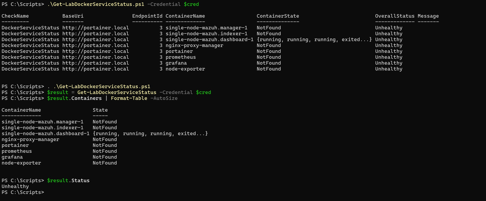
</p>

<p align="center">
  <em>Diagnostic: a direct script re-run and a dot-source-plus-direct-function-call both reproduced the identical defect, isolating it to the function's own live Invoke-RestMethod call rather than the standalone rendering guard.</em>
</p>

The cause is a PowerShell 5.1 pipeline behavior specific to this endpoint. The containers endpoint returns a top-level JSON array, unlike the Wazuh agents endpoint which nests its array under `data`, and for a top-level array `Invoke-RestMethod` can write the whole array to the pipeline as one object. A bare assignment binds to that object, so `.Count` reads correctly, but `@()` around the live call collects only what the pipeline emitted, nesting the array as a single element. The normalization loop then ran once with `$container` bound to the entire array, and member enumeration made `.Names` and `.State` return values across all ten. `@()` around an already-materialized variable is unaffected; only wrapping a live command call is. Fixed by assigning the response to `$containersResponse` first and wrapping that. A regression test forces the mock to emit the whole array as one pipeline object with the unary comma operator, reproducing the shape that let the defect pass all sixteen original tests, since Pester's `-MockWith` unrolls a returned array element by element where the real cmdlet here does not.

**Pester's `It -ForEach` needs its source data at Discovery time, not Run time (Step Five).** The twenty-seven-case Aggregation Context was first written with its combinations built inside a `BeforeAll`. `Describe`/`Context` bodies run during Discovery but `BeforeAll` runs later, so `-ForEach` evaluated against an empty collection and silently generated zero tests: no error, no warning, the Context header absent from `-Output Detailed` entirely. A real run discovered eleven tests instead of thirty-eight, with nothing indicating anything was missing beyond the shortfall in the total. Fixed by building the combinations as plain script code directly in the Context body.

**Pester's `It -ForEach` only projects named variables from Hashtable items, not PSCustomObject (Step Five).** With the data moved to Discovery time, the Context generated its tests but every one failed on unbound variables, because the combinations were built as `PSCustomObject` items. `-ForEach` projects each item's keys as named variables only for Hashtables; a `PSCustomObject` binds as `$_` alone. Fixed by building the combinations as hashtables.

**A blank interactive prompt produced a non-terminating parameter-binding failure that let the script continue into a broken state (Step Five).** An empty string from `Read-Host` failed the `Mandatory [string]$ReportDirectory` binding, which terminated that statement but not the top-level script under the default `$ErrorActionPreference`. Execution continued into a blank summary table and an empty report-path line rather than stopping, with no live check having run. Fixed by validating all three interactively-resolved inputs immediately after resolving each, throwing a clear error if any is missing.

**Portainer Community Edition hides existing Docker resources from non-admin users by default, with no environment-wide override (Step Six-A; kept as a named exposure).** A standard user granted endpoint access could reach the Docker proxy but got an empty container list. Portainer's own documentation confirms resources are administrator-only by default, and the only override is per-resource, which would mean standing changes across three compose stacks Portainer never deployed. `Get-LabDockerServiceStatus.ps1` keeps the admin account.

**A successful API query that returns nothing was classified `Unhealthy` rather than `Unknown` in both REST check scripts (Step Six-A; the defect dated from Steps Three and Four).** The rejected Portainer account's empty container list, an HTTP 200 with an empty array and no exception, was a shape neither script had a path for. Both route `Unknown` exclusively through a `try`/`catch`, on the correct but incomplete reasoning that `Invoke-RestMethod` throws on both a connection failure and an HTTP error status. The empty response reached no `catch`, matched nothing, and would have reported every expected item `NotFound`.

This is Step Two's misclassification reached from the opposite direction: there a failure was suppressed into silence and read as absence, here a success is blind and read as absence. Both collapse "the check could not observe" into "the check observed a fault", and in both cases a fully passing suite gave no warning. The fix in each script is a guard between the `try`/`catch` and the matching loop, returning `Unknown` when the response contains nothing. An empty list is unambiguous here: the `portainer` container is in the Docker check's own expected set, and agent `000` is always present in a working Manager's list, so a response containing nothing cannot describe the system that served it. Four regression tests were added, two per script.

**PSScriptAnalyzer's `PSAvoidUsingPlainTextForPassword` flags any `[string]` parameter containing "Cred" or "Credential", not just "Password" (Step Six-A).** The planned `-CredentialDirectory` parameter tripped the rule, whose word list (`Password`, `Passphrase`, `Cred`, `Credential`) is checked case-insensitively against the whole name, so no variant kept the word. Renamed to `-SecretsDirectory`.

**`Register-ScheduledTask`'s `-Principal` parameter set carries no `-Password` parameter (Step Six-B).** The assumed design, `New-ScheduledTaskPrincipal -LogonType Password` fed into `-Principal`, was checked against a live `Get-Help Register-ScheduledTask -Full` before being built. The `Principal` set has no `-Password` at all; only the `Xml`, `User`, and `Object` sets accept one. `Register-LabHealthReportTask.ps1` was built around the `User` set instead, with `-User`/`-Password`/`-RunLevel` passed directly.

**Pester's `Mock` enforces a mocked cmdlet's own real parameter type metadata, rejecting a hand-built `PSCustomObject` stand-in (Step Six-B).** `Register-ScheduledTask`'s `-Action` and `-Trigger` are typed `CimInstance[]`, and `Mock` binds arguments against the real cmdlet's metadata even when the cmdlet is mocked. Resolved by leaving the three side-effect-free builder cmdlets unmocked and asserting on their real `CimInstance` output.

**`Register-ScheduledTask`'s `-Password` parameter rejects an empty string even under Mock (Step Six-B).** A test credential built with an empty `[System.Security.SecureString]::new()`, the pattern this lab's other suites use without issue, failed because the cmdlet's own validation runs before Pester's mock intercepts the call. Resolved by building the password from a non-empty `SecureString` via `.AppendChar()` rather than `ConvertTo-SecureString -AsPlainText`, which would have tripped `PSAvoidUsingConvertToSecureStringWithPlainText`.

**`New-ScheduledTaskTrigger -Daily -At '07:00'` produces a UTC, `Z`-suffixed `StartBoundary`, not a local-time string (Step Six-B).** The third run left two trigger-matching tests failing against a `ParameterFilter` comparing `StartBoundary` to a hardcoded local-time string. The real value was captured live rather than guessed a second time: `2026-08-19T11:00:00Z`. Resolved by parsing through `[datetimeoffset](...).LocalDateTime`, robust to the UTC/local distinction and to DST rather than hardcoding an offset or a format.

**Modifying an already-registered `LogonType Password` task with `Set-ScheduledTask` requires the run-as credential supplied again, not only at registration (Step Six-B).** Moving the trigger forward failed with `The user name or password is incorrect` (`0x8007052e`), the trigger unchanged and uncorrupted. A live `Get-Help Set-ScheduledTask -Full` confirmed `-User` and `-Password` are on its default parameter set; supplying both succeeded.

**Modifying a registered task, like registering it, requires an elevated session, a separate requirement from the credential one above (Step Six-B).** Restoring the trigger to 07:00 failed with `Set-ScheduledTask : Access is denied` (`0x80070005`), even with the run-as credential supplied, because the session opened after logging back in from the firing was not elevated. Resolved by retrying elevated; the trigger was confirmed restored and the task's Principal unchanged by either update.

---

## Security Considerations

- **Read-only by design.** Every call the check scripts make is a query: `Get-Service` with no state-changing parameter, and `GET` requests plus each API's authentication `POST`. As in Lab 04 the claim is exercised by the suites rather than only reviewed by eye: `Get-LabADServiceHealth.Tests.ps1` asserts `-Times 0` against a sample of state-changing service cmdlets, both REST suites assert `Invoke-RestMethod` is called exactly twice and never with another method or URI, and `Invoke-LabHealthReport.Tests.ps1` asserts each check function is called exactly once per run.
- **A stored, unattended credential is this lab's most significant new exposure, and it is a confirmed configuration rather than an open question.** Every prior lab ran under `labadmin` for the length of an interactive session; an unattended task needs a credential persisting indefinitely. Design Decision 5 attempted to reduce that with a dedicated least-privileged account and found, by live probe, that a plain domain account cannot open the Service Control Manager on DC01, with the only routes to making one work being tier-0 changes to the environment's single domain controller. The task runs as `labadmin`, a documented compromise rather than an unexamined default. Three things bound it: `-RunLevel Limited` rather than `Highest`, since the check needs no elevation; least-privileged API accounts where the platform allowed it; and the correct production answer, delegated remote service-query rights under a tiered-administration model, named rather than quietly omitted. Labs 02 and 04 carried "a production deployment would use a dedicated account" as an aside; this is the first lab where that describes a standing condition, and the first where attempting it produced a finding instead of an intention.
- **The two API credentials are stored on disk under DPAPI, protected by account and machine rather than by a passphrase.** `Export-CliXml` encrypts under the exporting account's DPAPI key on the exporting machine, the same class of protection Task Scheduler applies to the task's own stored password, and why the files must be created interactively as `labadmin`. Anything running as `labadmin` on WIN11-CLIENT01 can decrypt them, so the protection is against the files being copied off the machine or read by another account, not against a compromise of the account itself. They are kept out of the repository, alongside the exported reports.
- **API credentials handled the same way Lab 01 handled a plaintext password.** Every script that takes one accepts it as a `[PSCredential]`, and the unattended run sources both from the DPAPI-protected files rather than plaintext in any script, argument, or configuration file. `Register-LabHealthReportTask.ps1` follows the same rule for the run-as credential, unwrapping the plaintext password only at the `Register-ScheduledTask` call site, which is also what keeps it clear of `PSAvoidUsingUserNameAndPasswordParams` and `PSAvoidUsingPlainTextForPassword`.
- **Exported reports as a data-handling boundary.** The timestamped report and any `-ExportPath` CSV output can describe service state, agent connectivity, and container status across the whole environment. As in every prior lab, all of it stays out of the repository and only on WIN11-CLIENT01.
- **The Portainer API path is HTTP-only, so its credential crosses the LAN in cleartext on every call, and it remains the broad admin account.** The only working path is `http://portainer.local` through NGINX Proxy Manager, whose proxy host has no SSL certificate, so `Get-LabDockerServiceStatus.ps1` sends the admin credential over plain HTTP on every invocation. Step Six-A tried to replace it with a read-only account and found Community Edition does not support one. A named, accepted exposure rather than a solved one: a compromised LAN segment could observe the credential in transit.
- **The Wazuh API's certificate-validation bypass is scoped, not a silent session-wide workaround.** Step One's `TrustAllCertsPolicy` accommodation disabled certificate validation for the process's lifetime during that diagnostic session. `Get-LabWazuhAgentStatus.ps1` captures the existing `CertificatePolicy` and `SecurityProtocol` before applying it and restores both in a `finally` block once its own two calls are done, so validation is disabled only for the duration of this script's REST calls rather than the rest of the calling session.

---

## Outcome

This lab produced five PowerShell scripts, three focused health checks, one orchestrator, and the script that registers it as a scheduled task, giving the environment a single answer to "is everything currently healthy" where that previously required checking DC01's services, the Wazuh dashboard, and Ubuntu Server's Docker state as three separate manual steps. The job is registered on WIN11-CLIENT01, runs unattended as `labadmin`, and has been observed firing both as a `StartWhenAvailable` catch-up after a real power outage and as a genuine 07:00 time trigger, producing a timestamped report each time.

Step Seven validated a live `Unhealthy` run against three independent sources, root-caused and remediated the two-month-old monitoring-stack outage that run had caught, and captured a genuine before/after from two scheduled firings: `Unhealthy` before the fix, `Healthy` after, the concrete demonstration that the three-state classification and worst-wins aggregation discriminate a real fault from a clean environment rather than always reading one or the other. The closing combined sweep, all thirteen scripts and thirteen test files run together for the first time, passed clean at zero findings and 172 of 172 tests, closing the track's final success criterion and, with it, the Infrastructure Automation and Scripting track itself, per ADR-018.

---

## Lessons Learned

Three separate times, a fully passing Pester suite and a clean analyzer pass gave no warning of a defect only a live run exposed, and the direction of the miss varied. Step Four's `@()`-around-a-live-call defect and Step Six-A's empty-successful-response misclassification were both false negatives: the suites were green and a real defect sat underneath, because no mock reproduced the exact shape, a top-level JSON array emitted as one pipeline object, or a call that succeeds and returns nothing, that only the live environment produced. Step Seven's combined sweep showed the opposite failure mode is just as real: reading raw console output rather than the tool's reported totals would have made a clean 172-of-172 run look broken, since dozens of `FAIL:`/`ABORT:`/`ERROR:` lines are scattered through it, every one a script's own diagnostic firing correctly under a mocked failure. A green suite is not proof of a healthy live system, and a console full of `FAIL` is not proof of a broken one.

`Unknown` earned its place three separate times, not once at design time. Step Two's `BOGUS01` diagnostic showed an unreachable target reaching `Unknown` correctly only once the original `-Name`/`SilentlyContinue` call, which collapsed "unreachable" into the same `NotFound` state as "service absent", was reworked to enumerate first and match after. Step Six-A closed the same gap from the opposite direction: a call that succeeds and returns nothing had been read as every expected item missing, an `Unhealthy` verdict for a check that had observed nothing. And Step Six's planning turned on the same code path, since an AD check reporting `Unknown` on every firing would have been worse than the exposure a dedicated account was meant to reduce. In every case the alternative to `Unknown` was not a cautious `Healthy` but a false `Unhealthy` or a false `Healthy`, either worse than a report honestly admitting it could not see.

Least-privilege survived everywhere the platform supported it and was refused only where the route ran through the domain's single domain controller. The Wazuh Manager API account under `agents_readonly` worked exactly as intended. Portainer Community Edition had no equivalent to offer, a platform limitation rather than a choice, so the admin account stayed. The run-as account is the sharper case: a plain domain account cannot open the Service Control Manager on DC01, and the only two routes that would have changed that were refused on principle rather than attempted, one a permanent security-descriptor edit on the only domain controller, the other a broader grant than the read-only use justified. The pattern holds across all three: pursued and achieved wherever a platform's access model supported it, refused rather than merely deferred wherever the only path meant permanently loosening the domain controller's own security.

---

## Sources

Research references consulted during this lab's planning.

**Wazuh Manager REST API (Wazuh documentation)**

- [Getting started - Wazuh server API](https://documentation.wazuh.com/current/user-manual/api/getting-started.html) - confirms the API's default port (`55000`) and JWT authentication flow (`POST /security/user/authenticate`, `Authorization: Bearer` on subsequent requests), the basis for `Get-LabWazuhAgentStatus.ps1`'s authentication step
- [Wazuh server API use cases](https://documentation.wazuh.com/current/user-manual/api/use-cases.html) and [Agent life cycle](https://documentation.wazuh.com/current/user-manual/agents/agent-life-cycle.html) - agent status values (`active`, `disconnected`, `never_connected`, `pending`) this script's classification logic maps to `Healthy`/`Unhealthy`

**Wazuh command monitoring (considered and not adopted as the primary Docker-status path; Design Decision 1)**

- [How it works - Command monitoring](https://documentation.wazuh.com/current/user-manual/capabilities/command-monitoring/how-it-works.html) - documents the command-monitoring pipeline and the requirement for a matching decoder before an event is analyzed
- [Command output analysis - Command monitoring](https://documentation.wazuh.com/current/user-manual/capabilities/command-monitoring/command-output-analysis.html) - the specific finding ("when a decoder is not found, the log is ignored") that informed the decision to prefer Portainer's API over a custom Wazuh decoder/rule for Docker status

**Portainer REST API (Portainer documentation)**

- [API usage examples - Portainer Documentation](https://docs.portainer.io/api/examples) - confirms the authentication endpoint (`POST /api/auth`, JWT), the container-listing endpoint (`GET /api/endpoints/{id}/docker/containers/json`), and the `X-API-Key` header pattern, the basis for `Get-LabDockerServiceStatus.ps1`'s design

**PowerShell remote service queries (Microsoft Learn)**

- [Get-Service (Windows PowerShell 5.1)](https://learn.microsoft.com/en-us/powershell/module/microsoft.powershell.management/get-service?view=powershell-5.1) - confirms `-ComputerName` is present in Windows PowerShell 5.1 and explicitly "does not rely on Windows PowerShell remoting," the basis for treating this call as consistent with ADR-016's boundary in Design Decision 1

**Windows Task Scheduler (Microsoft Learn)**

- [Register-ScheduledTask](https://learn.microsoft.com/en-us/powershell/module/scheduledtasks/register-scheduledtask) - `-User`/`-Password`/`-Principal` and `-RunLevel` parameters underpinning the run-as-account open question in Design Decision 5
- [New-ScheduledTaskTrigger](https://learn.microsoft.com/en-us/powershell/module/scheduledtasks/new-scheduledtasktrigger) and [New-ScheduledTask](https://learn.microsoft.com/en-us/powershell/module/scheduledtasks/new-scheduledtask) - trigger and task construction this lab's Step Six is planned around

**Repository reference**

- [ADR-015: Establish Infrastructure Automation and Scripting Track](../architecture/decisions/015-establish-infrastructure-automation-and-scripting-track.md) - the track's AD-centric scope and the framing of Wazuh/Docker as supporting checks
- [ADR-016: Run Automation Scripts from a Domain-Joined Client](../architecture/decisions/016-run-automation-scripts-from-domain-joined-client.md) - the "no new remoting technology" boundary Design Decision 1 reasons against
- [ADR-017: Adopt PowerShell Static Analysis and Unit Testing](../architecture/decisions/017-adopt-powershell-static-analysis-and-unit-testing.md) - the testing standard this lab's scripts will be authored against from the outset
- [ADR-018: Retire Cross-Platform Validation as a Standalone Lab](../architecture/decisions/018-retire-cross-platform-validation-lab.md) - establishes this lab as the track's final lab and sets the precedent, discussed in Design Decision 1, for when a cross-host departure from ADR-016 needs its own ADR
- [02 - Group and OU Administration](02-group-and-ou-administration.md) - the source of the console-table-plus-optional-CSV reporting convention this lab reuses and extends
- [04 - Group Policy Reporting and Audit](04-group-policy-reporting-and-audit.md) - the closest structural model for this lab's planning approach, its open-question handling, and its native-report-format precedent
- [07 - Security and Monitoring Lab](../enterprise-infrastructure/07-security-monitoring-lab.md) - the source of the Wazuh deployment facts (version, agent names, manager address and ports) this lab's Wazuh check is built against
- [04 - Docker Setup](../linux-infrastructure/04-docker-setup.md), [06 - Monitoring Stack Lab](../linux-infrastructure/06-monitoring-stack-lab.md), and [07 - Reverse Proxy Lab](../linux-infrastructure/07-reverse-proxy-lab.md) - the source of the Docker container, Portainer deployment, and networking facts this lab's Docker check is built against
