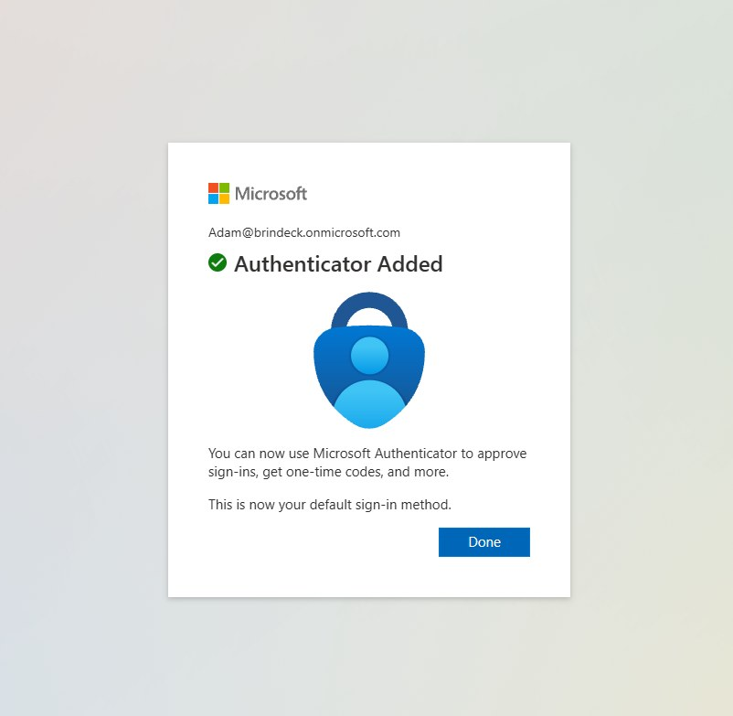
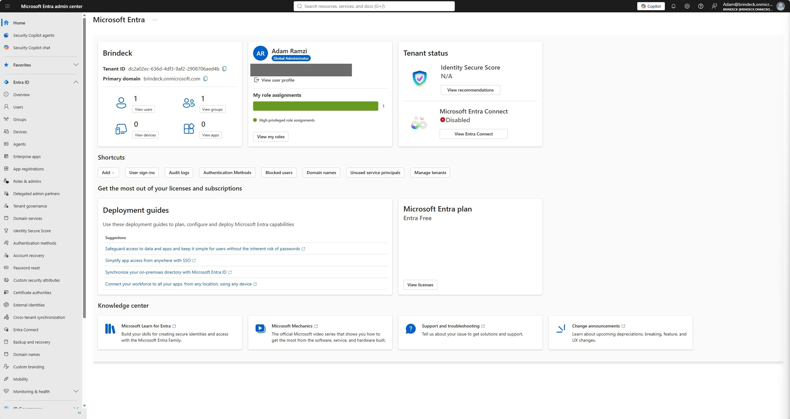
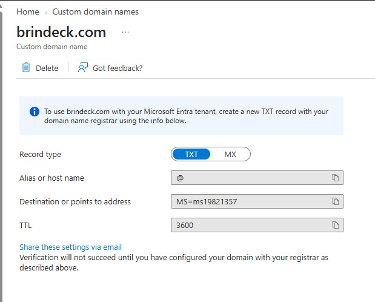
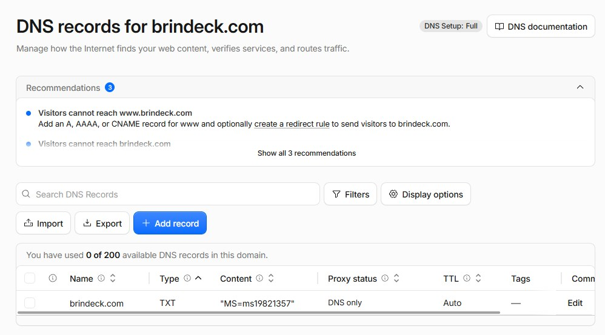
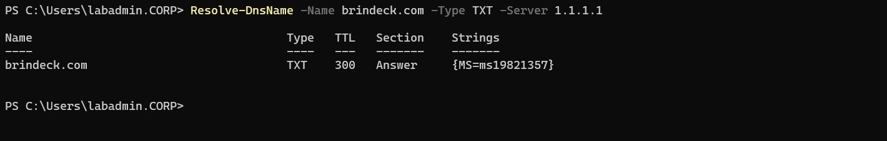
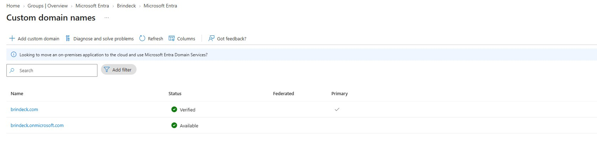
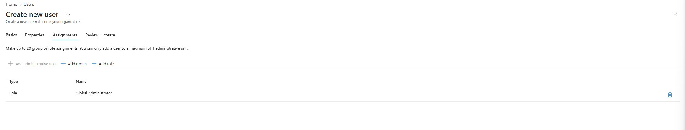
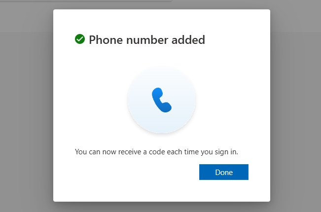
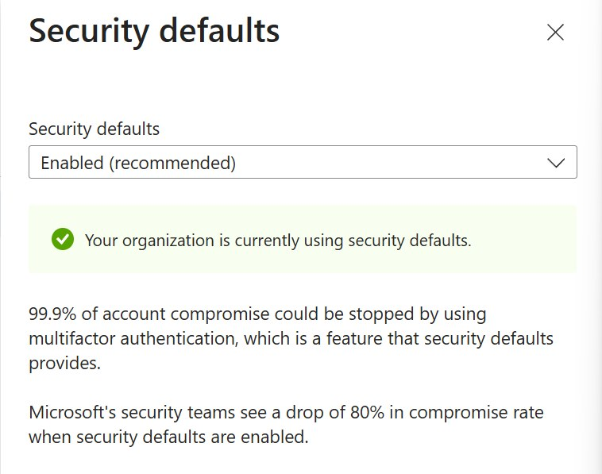
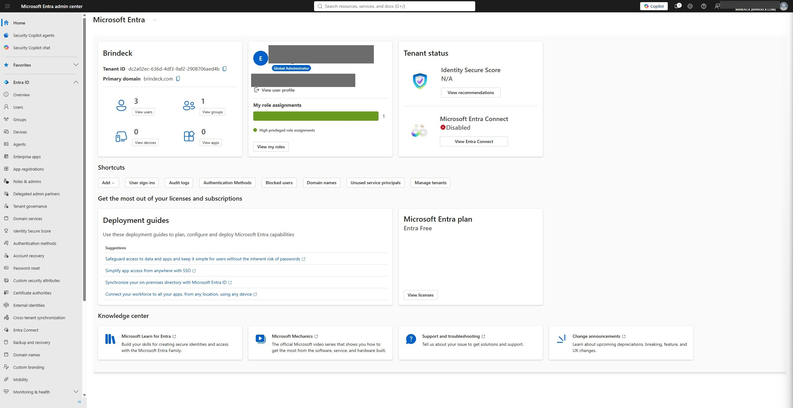

# 01 - Tenant Foundation and Custom Domain

## Status

All eight steps are complete: executed against the live tenant on 2026-08-23 and documented in past tense below. `brindeck.com` was registered on 2026-08-22 through Cloudflare Registrar, with WHOIS redaction enabled and DNS hosted at the registrar, and verified in the tenant the following day.

Two steps did not go as planned. Security defaults were already enabled at tenant creation, so Step Seven became a verification step rather than a configuration step; and the emergency access account's first multifactor authentication registration landed on the same phone as every other administrative account, which was caught and corrected before the account was considered complete. Both are documented in Troubleshooting and Adjustments.

---

## Overview

This lab created the environment's first cloud identity plane: a Microsoft Entra tenant, a verified custom domain, and an administrative model to operate it.

Everything built before it authenticated against a single directory on the local network. This lab did not connect the two directories, and no user, group, or password synchronized during it. It built the destination Lab 02 will synchronize into, and it established who is allowed to administer that destination and how they prove it.

Three things exist at the end of it that did not exist before:

- a Microsoft Entra tenant, permanently named `brindeck.onmicrosoft.com`
- `brindeck.com` verified in that tenant, which is what makes a routable user principal name suffix possible in Lab 02
- an administrative model that does not depend on the on-premises domain: a cloud-only Global Administrator, a separate emergency access account, and multifactor authentication required for administrative sign-in

That last point is why this lab existed as its own step rather than as the opening section of the synchronization lab. This is the first infrastructure in the environment whose administrative interface is reachable from the public internet, and it cannot be placed behind NGINX Proxy Manager or confined to Tailscale the way every existing service is. The controls protecting it had to be in place before anything of value was put in it.

---

## Objectives

The primary goals of this lab were to:

- create a Microsoft Entra tenant whose permanent initial domain matches the registered public domain
- verify `brindeck.com` in the tenant through a DNS TXT record, establishing ownership of a namespace the on-premises domain cannot provide
- establish an administrative model that survives a synchronization failure: a cloud-only Global Administrator and a separate emergency access account, neither dependent on Active Directory
- require multifactor authentication for administrative sign-in as the first control applied to the environment's first internet-facing administrative surface
- record the tenant's licensing state, so later labs build on a known starting point
- leave the tenant in a state where Lab 02 can add the alternative user principal name suffix and begin synchronization without revisiting tenant setup

Every objective was met. Two were met differently than planned: administrative multifactor authentication was already enforced when the tenant was created rather than needing to be enabled, and the emergency access account required a second, device-independent sign-in method before it satisfied the objective it was created for. Both are documented in Troubleshooting and Adjustments.

---

## Project Context

[ADR-019](../architecture/decisions/019-establish-cloud-and-hybrid-identity-track.md) established this track and defined its scope, design decisions, and boundaries. This is its first lab.

The environment it extends is complete on its own terms. Active Directory Domain Services on DC01 is authoritative for identity across the domain controller itself, a domain-joined Windows client, and an Ubuntu Server host authenticating through SSSD and Kerberos. A thirteen-script PowerShell library administers it. Wazuh collects authentication events from all three systems. What none of it has is any presence outside the local network, or any identity that exists in more than one directory.

The reason this lab comes before synchronization is that a tenant is not a neutral container. Two of its properties are permanent from the moment it is created, and both were decided here: the `onmicrosoft.com` initial domain, which can never be changed, and the identity of the account that creates it, which becomes Global Administrator automatically. Getting either wrong is not something Lab 02 could have corrected.

The domain registration that preceded this lab is the direct consequence of a constraint ADR-019 documented: `corp.home.arpa` cannot be used in the cloud. The `home.arpa` name is reserved by RFC 8375 for home networks. It is not registrable, not publicly resolvable, and cannot be verified in a tenant, because verification requires publishing a DNS record in a zone you demonstrably control. Without a routable domain, every synchronized user would arrive in the tenant as `someone@brindeck.onmicrosoft.com`, with a sign-in name that does not match their on-premises identity, and the single-identity premise the track exists to demonstrate would be broken at the first step.

---

## Design Decisions

### Tenant creation path

**Decision:** The tenant was created through a Microsoft 365 subscription signup rather than from an Azure account.

Planning assumed a tenant could simply be created and named from a free account. Microsoft's tenant creation documentation restricts creation of a new Workforce tenant to customers holding an eligible subscription, which ruled that path out. The Microsoft 365 signup flow creates a first tenant rather than an additional one, and it sets the initial domain during signup. That second property is what made it the correct path here, because the initial domain is permanent and needed to match the registered domain.

What the tenant is licensed for afterward is a separate question from how it was created, and each lab records what its own work required.

### The initial domain is chosen to match the registered domain

**Decision:** The tenant's initial domain is `brindeck.onmicrosoft.com`, set during signup and permanent thereafter.

The initial `onmicrosoft.com` domain is set at tenant creation and can never be renamed or removed, because Microsoft 365 uses it behind the scenes for the subscription itself. It is not cosmetic: it appears in service URLs, in the emergency access account's user principal name, and in any account that cannot use the custom domain. A tenant whose two halves do not match, for example a custom domain of `brindeck.com` behind an initial domain derived from a personal email address, advertises itself as improvised in every screenshot for the life of the environment.

There is a partial escape hatch, and it was worth knowing before the signup screen rather than after. A tenant may hold up to five `onmicrosoft.com` domains, and a later one can be created and made the default fallback domain, so a wrong prefix can be worked around even though the original cannot be deleted. That is a repair, not a substitute for getting it right at creation, since the initial domain remains visible in the tenant permanently.

The prefix was confirmed unused before the domain was registered, by querying Microsoft's tenant discovery endpoint for `brindeck.onmicrosoft.com` and receiving a tenant-not-found response. The domain name and the prefix were treated as a single availability question rather than two, because taking one without the other produces the mismatch above.

### Administrative identities are cloud-only

**Decision:** The Global Administrator used to operate the tenant and the emergency access account were both created directly in the tenant as cloud-only accounts, and neither will ever be synchronized from Active Directory.

This follows ADR-019 and the reasoning is worth restating in the place it takes effect. A synchronized administrator makes tenant access a dependent of the synchronization relationship and of on-premises security. If synchronization breaks, if DC01 is unavailable, or if an on-premises account is compromised, a synchronized Global Administrator carries that failure into the tenant. A cloud-only administrator does not.

The emergency access account exists for a narrower case: recovering access when the normal administrative path is blocked, whether by a misconfigured policy, a lost authentication method, or a lockout. It was created here, kept on `brindeck.onmicrosoft.com` rather than the custom domain so that a DNS or registration problem with `brindeck.com` cannot lock the tenant, and it will be excluded from conditional access policies in Lab 05 when those policies exist. Its credentials are stored offline and it is not used for routine work.

Exclusion is not available before Lab 05, and in practice that constraint applied sooner than planned. Security defaults have no exclusion mechanism beyond the Directory Synchronization Accounts role, and they were already active when the tenant was created rather than switched on at a moment of this lab's choosing, so the emergency access account was required to register for and perform multifactor authentication like any other user from the moment it existed. That determined what storing its credentials offline had to mean: the stored material had to include a recoverable second factor rather than a password alone, or the account meant to recover access would depend on a single device that could be lost with it. The first registration did not meet that bar. Troubleshooting and Adjustments records how it was caught and what was added.

### The signup account keeps Global Administrator

**Decision:** `Adam@brindeck.onmicrosoft.com`, the account the Microsoft 365 signup flow created and made Global Administrator automatically, retained that role after `admin@brindeck.com` took over routine operation, leaving the tenant with three Global Administrators.

This is a deliberate retention rather than an oversight, and it is recorded because the count is visible in every screenshot of the tenant overview. The signup account owns the Microsoft 365 subscription: it is the identity the trial was purchased under and the one the billing relationship follows. Stripping its directory role would separate subscription ownership from directory administration in a tenant small enough that the separation buys nothing, and it would introduce a second recovery problem alongside the one the emergency access account already exists to solve.

What the account does not do is participate in day-to-day work. `admin@brindeck.com` administers the tenant from Step Six onward, and the signup account is not used again in this lab after Step Five. Microsoft's guidance is to keep the number of Global Administrators as small as the environment allows, so this is a standing item rather than a closed one: Lab 05 revisits privileged role assignment when it introduces conditional access, and reducing three Global Administrators to the minimum this environment actually needs belongs in that pass.

### Multifactor authentication in this lab uses security defaults

**Decision:** Administrative multifactor authentication is enforced through security defaults in this lab, with conditional access deferred to Lab 05.

The tenant arrived with security defaults already enabled rather than needing them switched on, which changed how this decision was implemented but not what it decided; Troubleshooting and Adjustments records the difference. Conditional access requires a Microsoft Entra ID P1 license, which this tenant does not hold; Lab 05 licenses it when it needs it. Security defaults are a free-tier feature that requires multifactor authentication for the Global Administrator and the other privileged administrative roles, requires all users to register for it, blocks legacy authentication protocols, and blocks device code flow.

Two properties of security defaults reach beyond this lab, which is why the progression itself is recorded in [ADR-019](../architecture/decisions/019-establish-cloud-and-hybrid-identity-track.md) rather than only here. Security defaults and conditional access are mutually exclusive, so Lab 05 must disable security defaults when it introduces conditional access, and the policies it writes must reproduce the legacy authentication and device code flow blocks being turned off rather than silently dropping them. And accounts holding the Directory Synchronization Accounts role, which is what Entra Connect creates and uses in Lab 02, are excluded from security defaults and are neither prompted to register for nor required to perform multifactor authentication, so enabling them here does not break synchronization later.

### The custom domain becomes the primary domain, the emergency account does not follow it

**Decision:** `brindeck.com` was set as the tenant's primary domain once verified, so that new accounts default to it, while the emergency access account deliberately remained on `brindeck.onmicrosoft.com`.

The primary domain determines the default suffix offered when accounts are created, which is what makes `@brindeck.com` the ordinary case rather than something set per user. The exception is deliberate: the `onmicrosoft.com` domain is guaranteed by Microsoft and cannot lapse, while a custom domain depends on a registration and a DNS zone that can both fail. Keeping the recovery account on the guaranteed name means a domain-level failure cannot take administrative access with it.

---

## Technologies Used

- Microsoft Entra ID
- Microsoft Entra admin center and Microsoft 365 admin center
- Cloudflare DNS, hosting the `brindeck.com` zone
- DNS TXT records, for domain ownership verification
- Microsoft Entra multifactor authentication through security defaults

---

## Architecture or Topology

This lab created the right-hand side of a boundary that does not yet exist. Nothing crosses it until Lab 02.

```text
On-premises (unchanged by this lab)          Microsoft Entra (created by this lab)
─────────────────────────────────            ──────────────────────────────────────
corp.home.arpa (DC01)                        brindeck.onmicrosoft.com  [permanent]
  ├── users, groups, OUs                       └── brindeck.com  [verified, primary]
  ├── Kerberos / NTLM                                ├── Global Administrator (cloud-only)
  └── SSSD / PAM (Ubuntu Server)                     └── Emergency access account
                                                          (stays on onmicrosoft.com)

                    no synchronization exists yet
```

Domain verification was the only interaction with anything outside the tenant, and it ran through DNS rather than through the on-premises environment:

```text
Entra admin center
    ↓ issues a TXT record value
Cloudflare DNS (brindeck.com zone)
    ↓ record published
Entra verification check
    ↓ record observed
brindeck.com marked Verified in the tenant
```

---

## Prerequisites

- `brindeck.com` registered, with DNS hosted at Cloudflare and the ability to create records in the zone
- a Microsoft account for the subscription signup
- a method for the administrative account's multifactor authentication, an authenticator app on a device that is not the lab workstation
- somewhere offline to store the emergency access account credentials
- [ADR-019](../architecture/decisions/019-establish-cloud-and-hybrid-identity-track.md) accepted

No on-premises prerequisites applied. This lab did not touch DC01, WIN11-CLIENT01, or Ubuntu Server.

---

## Implementation

### Step One - Created the Tenant

Signup ran through the Microsoft 365 flow rather than the Azure portal, since a new Workforce tenant cannot be created from a free account. A dedicated Microsoft account was created first for the signup and kept separate from any personal account, so the identity that ran the checkout would be cleanly disposable rather than something worth preserving. The first attempt to create that account failed at the "Add your name" step with a generic, undiagnosed error; a retry a short time later succeeded with no changes to the input.

The Microsoft 365 Business Basic plan was purchased as a free trial rather than bought outright, entering `Brindeck` as the organization name during checkout. On the sign-in details screen, the suggested domain read `Brindeck.onmicrosoft.com`; it was retyped in lowercase and confirmed to settle on exactly `brindeck.onmicrosoft.com` before continuing, since that value can never be renamed once the tenant exists. The account created during signup, `Adam@brindeck.onmicrosoft.com`, became Global Administrator automatically as expected, and Microsoft required it to register Microsoft Authenticator before it could be used, ahead of any security defaults setting being touched manually.

<p align="center">
  
</p>

<p align="center">
  <em>Authenticator registered for Adam@brindeck.onmicrosoft.com, the default Global Administrator created automatically by the Microsoft 365 signup flow.</em>
</p>

### Step Two - Recorded the Tenant's Starting State

Signed in as `Adam@brindeck.onmicrosoft.com`, the Entra admin center Overview page recorded the baseline before anything else changed: tenant name `Brindeck`, tenant ID `dc2a02ec-636d-4df3-9af2-2908706aed4b`, primary domain `brindeck.onmicrosoft.com`, one user (Adam Ramzi, Global Administrator), Microsoft Entra plan Entra Free, and Entra Connect correctly showing Disabled. The Microsoft 365 subscription itself was Business Basic (no Teams) - Trial, converting to $6.48/user/month for one user unless canceled by September 22, 2026.

<p align="center">
  
</p>

<p align="center">
  <em>Entra admin center Overview showing the tenant's starting state: tenant ID, primary domain, default Global Administrator, and the Entra Free plan. The signed-in user's object ID is masked.</em>
</p>

### Step Three - Added the Custom Domain and Collected the Verification Record

In Entra ID > Domain names, `brindeck.com` was added as a custom domain. Entra issued a TXT record to publish: host `@`, value `MS=ms19821357`, TTL 3600.

<p align="center">
  
</p>

<p align="center">
  <em>brindeck.com added as a custom domain, with the TXT record Entra issued for DNS verification.</em>
</p>

### Step Four - Published the TXT Record in Cloudflare DNS

In the `brindeck.com` zone in Cloudflare, a TXT record was added matching Entra's value exactly: host `@`, content `MS=ms19821357`, TTL Auto. Cloudflare listed the record with a proxy status of DNS only and offered no proxy toggle for it, confirming the plan's expectation that TXT records aren't proxyable.

<p align="center">
  
</p>

<p align="center">
  <em>The TXT record published in Cloudflare's DNS records for brindeck.com, matching the value Entra issued.</em>
</p>

The planning version of this step called for confirming the record resolved publicly before returning to Entra, so that was done from WIN11-CLIENT01 against a public resolver directly rather than through the environment's own DNS chain or Cloudflare's dashboard:

```powershell
Resolve-DnsName -Name brindeck.com -Type TXT -Server 1.1.1.1
```

```text
Name                    Type   TTL   Section    Strings
----                    ----   ---   -------    -------
brindeck.com            TXT    300   Answer     {MS=ms19821357}
```

<p align="center">
  
</p>

<p align="center">
  <em>The verification record resolving from Cloudflare's public resolver, queried from WIN11-CLIENT01 with -Server 1.1.1.1 to bypass the environment's own DNS chain.</em>
</p>

The returned string matches the value Entra issued. The TTL is the one thing that did not match: Entra suggested 3600, and Cloudflare's Auto setting resolved to 300 instead. That had no effect on verification, which succeeded on the first attempt, but it means the record propagates and expires on a twelve-times-shorter cycle than the value Entra proposed, and the published record's real TTL is 300 rather than the 3600 the admin center displayed.

### Step Five - Verified the Domain and Set It Primary

Back in Entra, clicking Verify succeeded on the first attempt, with no propagation delay. `brindeck.com` was then set as the tenant's primary domain.

<p align="center">
  
</p>

<p align="center">
  <em>Custom domain names showing brindeck.com Verified and Primary, with brindeck.onmicrosoft.com remaining Available as the fallback.</em>
</p>

### Step Six - Created the Administrative Accounts

Two accounts were created. `admin@brindeck.com`, display name "Cloud Administrator," was assigned Global Administrator on the Assignments tab during creation, given a strong generated password saved securely, and registered for Microsoft Authenticator. This is the account that took over routine operation of the tenant from that point forward.

<p align="center">
  
</p>

<p align="center">
  <em>Global Administrator assigned on the Assignments tab during creation of the cloud-only administrator account.</em>
</p>

`[redacted]@brindeck.onmicrosoft.com`, display name "Emergency Access Account," was created the same way, also assigned Global Administrator, with its password written to the physical notebook rather than a password manager. Its initial MFA registration used Microsoft Authenticator on the same phone already registered to the other two accounts, which was recognized during the lab as a problem rather than a formality: losing that one phone would have locked out all three accounts at once, defeating the reason this account exists. A phone number was added as a second sign-in method through Security info before the account was considered complete, with both the password and the phone number recorded together in the notebook.

<p align="center">
  
</p>

<p align="center">
  <em>A phone number added as a second, device-independent MFA method for the emergency access account.</em>
</p>

### Step Seven - Confirmed Multifactor Authentication Enforcement

The plan assumed security defaults would need to be switched on manually. In practice they were already enabled: every account created above had been forced into MFA registration before the security defaults panel was ever opened, and Identity > Properties > Manage security defaults confirmed the setting already read Enabled (recommended). Step Seven became a verification step rather than a configuration step. Troubleshooting and Adjustments records what that changed and what it does not change for Lab 05.

<p align="center">
  
</p>

<p align="center">
  <em>Security defaults confirmed Enabled, with the tenant reporting it was already using security defaults before any manual change.</em>
</p>

### Step Eight - Validated and Recorded the Finished State

Domain state, all three administrative accounts, and the licensing baseline were confirmed as described in Validation below. The emergency access account specifically was tested with a full cold sign-in, signing out completely and back in with its password and MFA rather than trusting registration alone. It succeeded, landing in the Entra admin center with the Global Administrator badge visible and the tenant user count at 3.

<p align="center">
  
</p>

<p align="center">
  <em>A cold sign-in as the emergency access account, landing in the Entra admin center with the Global Administrator badge and a tenant user count of 3. The account's user principal name and object ID are masked in this screenshot.</em>
</p>

---

## Validation

The tenant was validated against each objective above using the live admin center, rather than assuming success from an unconfirmed step.

**Tenant identity.** The finished tenant carries tenant ID `dc2a02ec-636d-4df3-9af2-2908706aed4b`, named `Brindeck`, with an initial domain of `brindeck.onmicrosoft.com` exactly as planned. This was confirmed on the sign-in username shown after account creation, before any further changes were made.

**Domain verification and primary status.** The Custom domain names list in the Entra admin center shows two domains: `brindeck.com` with status Verified and the Primary checkmark, and `brindeck.onmicrosoft.com` with status Available and no Primary checkmark. Verification succeeded on the first attempt against the TXT record published in Cloudflare (host `@`, value `MS=ms19821357`, published TTL 300 rather than the 3600 Entra suggested), with no observed propagation delay.

That result was also confirmed independently of both dashboards. `Resolve-DnsName -Name brindeck.com -Type TXT -Server 1.1.1.1`, run from WIN11-CLIENT01 in Step Four, returned `{MS=ms19821357}` from Cloudflare's public resolver, matching the value Entra issued. This is the only check in this lab sourced from outside the two administrative interfaces that performed the work: the Entra admin center reporting a domain as Verified and the Cloudflare dashboard reporting a record as published are each the system describing its own state, whereas a public resolver has no stake in either. Every other confirmation below is portal-reported, which is appropriate for tenant state that has no external surface but is worth naming rather than leaving implicit.

**Administrative accounts.** Three accounts exist in the tenant: `Adam@brindeck.onmicrosoft.com`, the default Global Administrator created automatically by the Microsoft 365 signup flow; `admin@brindeck.com`, the cloud-only Global Administrator created in Step Six to take over routine operation; and `[redacted]@brindeck.onmicrosoft.com`, the emergency access account, also Global Administrator, deliberately kept on the `onmicrosoft.com` domain. All three registered Microsoft Authenticator as an MFA method during account creation, before security defaults was ever manually touched. That all three hold Global Administrator is the deliberate retention recorded in Design Decisions rather than an unnoticed leftover, and Lab 05 revisits it when it takes up privileged role assignment.

**Emergency access account sign-in.** The emergency access account was validated with a full cold sign-in rather than just registration: signing out completely, then back in with its password from the physical notebook plus its MFA. Sign-in succeeded and landed in the Entra admin center with the Global Administrator badge visible and the tenant user count at 3, confirming the account is independently usable rather than only registered.

**Licensing.** The tenant's Microsoft Entra plan is Entra Free, matching what the track's identity foundation was designed to depend on. The Microsoft 365 subscription is Business Basic (no Teams) - Trial, converting to $6.48/user/month for 1 user unless canceled by September 22, 2026.

---

## Troubleshooting and Adjustments

### Security defaults was already enabled at tenant creation

Step Seven's plan assumed security defaults would need to be manually enabled. In practice, every account created in this lab, including the default Global Administrator from the Microsoft 365 signup itself, was forced into MFA registration immediately, before the security defaults panel was ever opened. Checking Identity > Properties > Manage security defaults confirmed it was already set to Enabled (recommended), with the tenant reporting it was currently using security defaults. Tenants created through the Microsoft 365 signup flow as of August 2026 apparently ship with security defaults on by default, rather than requiring the administrator to turn it on. The effect on the lab's objectives is unchanged, administrative MFA was required from the first sign-in either way, but Step Seven became a verification step rather than a configuration step. This doesn't change anything Lab 05 needs to do when it replaces security defaults with conditional access; the mutual-exclusivity and reproduce-what-you're-turning-off concerns from ADR-019 still apply.

### Emergency access account needed a second MFA method deliberately

The initial MFA registration for `[redacted]@brindeck.onmicrosoft.com` used Microsoft Authenticator on the same phone already registered to the other two accounts. Since the account's entire purpose is to recover access when the normal path is unavailable, tying its only second factor to the same physical device used for daily administration would have defeated that purpose: losing that one phone would have locked out all three accounts simultaneously, not just the two ordinary ones. A phone number was added as a second sign-in method through Security info (`aka.ms/mysecurityinfo`) before the account was considered complete, and both the password and the phone number are recorded together in the physical notebook. This is the kind of gap that's easy to introduce by following the letter of "register MFA" without the reasoning behind it, worth flagging since a future rebuild of this environment could reintroduce it without noticing.

Microsoft's guidance on emergency access accounts, read after the fact, endorses two of the choices made here and goes further than the third. It states that these accounts "should be cloud-only accounts that use the `*.onmicrosoft.com` domain and that aren't federated or synchronized from an on-premises environment," which is what Design Decisions settled independently, and it confirms the exclusion from conditional access that Lab 05 will apply. It also recommends creating two or more emergency access accounts rather than one, and using phishing-resistant methods, passkeys or certificate-based authentication, "that are different from your normal admin accounts." A phone number is device-independent but not phishing-resistant, so the fix applied here closed the single-device problem without reaching the recommended standard. Both gaps, the account count and the method strength, are carried into Lab 05 alongside the conditional access exclusion rather than left implicit.

### A Microsoft account signup attempt failed with a generic error

The first attempt to create the Microsoft account used for the signup failed at the "Add your name" step with a generic "We ran into a problem" error and no diagnostic detail. A retry a short time later succeeded with no changes to the input. No root cause was confirmed; treated as a transient issue on Microsoft's account creation service rather than anything specific to this environment.

---

## Security Considerations

This lab introduces the environment's first internet-facing administrative surface, and most of its content is a response to that fact.

The tenant's administration portals are reachable by anyone who can reach Microsoft, authenticated only by credentials. There is no network boundary to hide behind, no reverse proxy to place in front of it, and no VPN that scopes who can attempt a sign-in. Every previous service in this environment had at least one of those. This one has none, which is why multifactor authentication is applied in the same lab that creates the tenant rather than in a later hardening pass.

The administrative model is built to fail independently of the on-premises environment. A cloud-only Global Administrator means a compromise of `corp.home.arpa` does not extend to the tenant, and a synchronization failure does not remove administrative access. The emergency access account extends the same reasoning one step further: it is the account that works when the normal path does not, which is why it stays on the `onmicrosoft.com` domain that cannot lapse and why its credentials live offline rather than in a password manager tied to the same identity it is meant to recover.

Security defaults also block legacy authentication protocols and device code flow, both of which are common paths around multifactor authentication. That protection is inherited rather than designed here, and Lab 05 must consciously reproduce it when conditional access replaces security defaults, since disabling security defaults removes all of it at once.

The registrant details behind `brindeck.com` are redacted in WHOIS, and no screenshot in this lab shows the registrar's account or contact panels.

This repository is public, so the lab distinguishes between identifiers that are already public and identifiers that only add targeting surface. The tenant ID is recorded in full because it is not a secret: anyone holding the domain name can resolve it from Microsoft's unauthenticated OpenID Connect discovery endpoint for `brindeck.com`, so publishing it reveals nothing that the verified custom domain does not already reveal, and it makes the lab concrete. Directory object IDs are masked in screenshots, the Microsoft account and subscription order number behind the signup are omitted, and the emergency access account's user principal name is redacted as `[redacted]@brindeck.onmicrosoft.com` throughout. That last one matters most: from Lab 05 onward it is the account excluded from conditional access, and naming it publicly would publish the one identity the tenant's policies deliberately do not constrain.

---

## Outcome

The lab's objectives were met. A Microsoft Entra tenant exists, permanently named `brindeck.onmicrosoft.com` (tenant ID `dc2a02ec-636d-4df3-9af2-2908706aed4b`), created through a Microsoft 365 Business Basic trial signup. `brindeck.com` is verified and set as the tenant's primary domain, so new accounts default to it going forward, while the guaranteed `onmicrosoft.com` domain remains available as a fallback. Administrative access does not depend on Active Directory in any way: `admin@brindeck.com` is the cloud-only Global Administrator for routine work, and `[redacted]@brindeck.onmicrosoft.com` is a separate, tested emergency access account with its password and a second, device-independent MFA method recorded offline. The signup account retains Global Administrator as well, for the subscription-ownership reason recorded in Design Decisions, so the tenant holds three Global Administrators and Lab 05 revisits that count. Multifactor authentication is required for administrative sign-in through security defaults, confirmed enabled rather than assumed. The tenant's licensing baseline is recorded: Microsoft Entra ID Free for the identity foundation, layered under a Microsoft 365 Business Basic trial subscription converting to $6.48/user/month on September 22, 2026 unless canceled.

Nothing on-premises was touched. `corp.home.arpa`, DC01, WIN11-CLIENT01, and Ubuntu Server are all unchanged by this lab, as planned. The tenant is now in a state where Lab 02 can add the alternative UPN suffix and begin synchronization without revisiting anything decided here. One dated item follows the tenant out of this lab rather than being closed by it: the Business Basic trial converts to a paid subscription on September 22, 2026, and whether to keep it, cancel it, or replace it is a licensing decision the track takes up before Lab 04 needs Exchange Online mailboxes.

---

## Lessons Learned

Permanent decisions deserve the friction they got here. Stopping to confirm the initial domain before finishing signup, and treating the Microsoft account used for signup as a disposable placeholder rather than a lasting identity, both paid off exactly as intended: nothing about the tenant's two unchangeable properties needed a workaround.

A security control described in a plan as "something you'll enable" is worth checking rather than assuming, before acting on it. Security defaults being on by default here didn't cause a problem, but it easily could have, had the plan called for a before/after comparison that no longer had a meaningful "before" to measure.

"Register MFA" is not automatically equivalent to "this account is recoverable." An emergency access account with its only second factor on the same device as every other admin account isn't actually independent of anything. The fix was cheap, one extra sign-in method, but it only happened because the account's stated purpose was checked against what was actually configured, rather than treating a green checkmark as the finish line. Reading Microsoft's own guidance afterward showed that fix was the right direction without being the full distance, which is the sharper version of the same lesson: reasoning from a control's purpose beats assuming it works, and checking the vendor's documented standard beats reasoning alone.

---

## Sources

**Tenant creation and licensing**

- [Quickstart: Create a new tenant in Microsoft Entra ID](https://learn.microsoft.com/en-us/entra/fundamentals/create-new-tenant) - tenant creation steps, the paid-customer prerequisite, and confirmation that the initial `onmicrosoft.com` domain cannot be changed after creation
- [Microsoft 365 Developer Program FAQ](https://learn.microsoft.com/en-us/office/developer-program/microsoft-365-developer-program-faq) - why the developer sandbox is not the basis for this track: eligibility is limited to Visual Studio Professional or Enterprise subscribers, eligible partner program tiers, and Premier or Unified Support customers, and sandboxes run a 90-day activity-gated lifecycle

**Domain and identity**

- [Prepare a non-routable domain for directory synchronization](https://learn.microsoft.com/en-us/microsoft-365/enterprise/prepare-a-non-routable-domain-for-directory-synchronization) - why `corp.home.arpa` cannot be synchronized as-is and what a routable alternative suffix resolves, the constraint that made the domain registration a prerequisite
- [Domains FAQ](https://learn.microsoft.com/en-us/microsoft-365/admin/setup/domains-faq) - that the initial `onmicrosoft.com` domain cannot be renamed or removed, that a tenant may hold up to five of them, and that a later one can be made the default fallback domain

**Administrative controls**

- [Security defaults in Microsoft Entra ID](https://learn.microsoft.com/en-us/entra/fundamentals/security-defaults) - what security defaults enforce, that Directory Synchronization Accounts are excluded from them, and that they cannot coexist with conditional access policies
- [Manage emergency access accounts in Microsoft Entra ID](https://learn.microsoft.com/en-us/entra/identity/role-based-access-control/security-emergency-access) - that emergency access accounts should be cloud-only on the `onmicrosoft.com` domain and excluded from restrictive conditional access policies, and the two recommendations this lab did not meet: two or more such accounts, and phishing-resistant methods different from those on normal administrative accounts
