# 02 - Hybrid Identity with Entra Connect

## Status

Steps One through Seven and Step Eight-A are complete.

Lab 01 left a tenant with a verified primary custom domain and an administrative model that does not depend on Active Directory. `SYNC01` now exists: it was built to the allocation in Design Decisions, joined to `corp.home.arpa`, confirmed in `OU=Workstations`, and enrolled as a Wazuh agent alongside the other three hosts. The pre-synchronization baseline is recorded on both sides: 6 users and 4 groups on-premises, 3 users and 1 group in the tenant. `brindeck.com` is now an alternative UPN suffix in Active Directory, applied to all five users in `OU=User Accounts` (`IT` deliberately untouched), and `New-LabUser.ps1` derives that suffix from the target OU rather than hardcoding the on-premises domain, passing PSScriptAnalyzer and the full thirteen-script Pester suite (174 tests) and proven live against both a synchronized and a non-synchronized OU.

Entra Connect Sync (version 2.6.84.0) is installed on `SYNC01` using Custom settings, connecting to `corp.home.arpa` as `svc-entraconnect`, a dedicated account in a new `OU=Service Accounts`, and to the tenant as `admin@brindeck.com`. Synchronization is scoped to `User Accounts` and `Groups`, `ms-DS-ConsistencyGuid` was confirmed as the source anchor, and the first synchronization cycle completed cleanly. The tenant now holds nine users and five groups: the five baseline accounts plus `tsync01`, all carrying `@brindeck.com` user principal names and `On-premises sync: Yes`, while `tnosync01`, `labadmin`, and the three pre-existing cloud-only administrative accounts remain correctly outside the synchronized population. `IT-Admins` synchronized as a group with a partially invisible membership, exactly as Design Decisions predicted. A sign-in as `testuser01@brindeck.com` using his existing on-premises password succeeded, confirming password hash synchronization works.

Step Eight-A hardened `AZUREADSSOACC`: it now lives in a new, delegation-restricted `OU=Protected Objects` rather than `OU=Workstations`, its own ACL and Kerberos delegation were confirmed clean against `SYNC01` as a control, and its Kerberos encryption type was rolled and set explicitly to AES128/AES256 rather than left unset. Step Eight-B (the seamless SSO Group Policy object and sign-in validation from WIN11-CLIENT01) and Steps Nine and Ten remain not yet started.

---

## Overview

This lab will connect the two directories. It is the point at which `corp.home.arpa` stops being the only place an identity in this environment exists.

Lab 01 built a destination and proved nothing crossed into it. The tenant holds three cloud-only administrative accounts and no ordinary users. On-premises, Active Directory holds every user, group, and computer the enterprise and automation tracks created, and it authenticates all three systems in the environment. The two have no relationship. This lab creates one, in a single direction: Active Directory remains authoritative, and a scoped subset of it is projected into Microsoft Entra ID by a synchronization engine running on a new member server.

Four things will exist at the end of it that do not exist now:

- `SYNC01`, a Windows Server 2022 member server joined to `corp.home.arpa`, running Microsoft Entra Connect Sync
- a routable user principal name suffix, `@brindeck.com`, added alongside `corp.home.arpa` and applied to the users selected for synchronization
- a synchronized population in the tenant, scoped by organizational unit, whose passwords are validated in the cloud against hashes replicated from DC01
- an observed record of how synchronization behaves over time: the cycle, at least one deliberately induced failure, and the diagnosis that resolved it

The last of those is the reason this lab is worth more than its configuration steps. A working synchronization is a wizard. A synchronization whose failure modes have been provoked and read is an operational understanding, and it is the thing every later lab in this track depends on.

---

## Objectives

The primary goals of this lab are to:

- build `SYNC01` as a dedicated domain-joined member server, keeping the synchronization engine off DC01 per [ADR-019](../architecture/decisions/019-establish-cloud-and-hybrid-identity-track.md)
- add `brindeck.com` as an alternative user principal name suffix in Active Directory and retarget the users selected for synchronization, before any synchronization runs
- update `New-LabUser.ps1` to emit the routable suffix for accounts created in synchronized organizational units, under the analysis and testing standard set by [ADR-017](../architecture/decisions/017-adopt-powershell-static-analysis-and-unit-testing.md)
- install Microsoft Entra Connect Sync with password hash synchronization, scoped by organizational unit rather than synchronizing the whole directory
- confirm that a user provisioned on-premises appears in the tenant with a matching routable user principal name and authenticates to a cloud service with their on-premises password
- enable seamless single sign-on and validate it from WIN11-CLIENT01
- document the synchronization cycle as observed, not as described, including the difference between the directory cycle and password hash synchronization
- induce at least one synchronization failure deliberately, document how it presented, and record the diagnosis

---

## Project Context

[ADR-019](../architecture/decisions/019-establish-cloud-and-hybrid-identity-track.md) established this track and settled its architecture. This lab implements the parts of that decision that touch the on-premises environment, and it is the first work in the entire repository to modify `corp.home.arpa` since the enterprise infrastructure track closed.

That is worth stating plainly, because Lab 01 could afford to be careless in a way this lab cannot. Lab 01 touched nothing on-premises; its worst outcome was a misconfigured tenant that could be deleted and rebuilt. This lab adds a user principal name suffix to a production domain, changes the sign-in names of real accounts, installs a service that writes back to Active Directory, and creates a computer account that holds a Kerberos key trusted by Microsoft. None of that is destructive, and none of it changes the domain name, the Kerberos realm, `sAMAccountName` values, DNS, or Group Policy scoping. But it is the first lab in this track where a mistake lands on the systems the Linux, enterprise, and automation tracks documented.

The environment it modifies is the one those tracks built. DC01 holds `corp.home.arpa` with four organizational units: `User Accounts`, `IT`, `Workstations`, and `Groups`. WIN11-CLIENT01 is domain-joined and carries the thirteen-script PowerShell library. Ubuntu Server authenticates domain users through SSSD and Kerberos. Wazuh collects authentication events from all three. Nothing in that arrangement changes here, and the validation for this lab includes confirming that it did not.

---

## Design Decisions

### SYNC01 is a dedicated member server, sized to Microsoft's documented floor

**Decision:** A new virtual machine, `SYNC01`, running Windows Server 2022 and joined to `corp.home.arpa`, will host Entra Connect Sync. It will be allocated 2 vCPU, 8 GB of memory, and 80 GB of thin-provisioned storage.

ADR-019 settled that the synchronization engine does not go on DC01, and that reasoning is not relitigated here. What this lab has to settle is what the machine actually needs. Microsoft's prerequisites are unambiguous about the operating system: Entra Connect "must be installed on a domain-joined server," the server "must have a full GUI installed," and "installing Microsoft Entra Connect on Windows Server Core isn't supported," which rules out both WIN11-CLIENT01 and a Core deployment. Windows Server 2025 and 2022 are the recommended versions; 2022 is chosen to match DC01 rather than for any capability reason.

Sizing is where the documentation is less helpful than it looks. Microsoft's hardware table has no tier below "fewer than 10,000 objects," and that tier asks for a 1.6 GHz CPU, 6 GB of memory, and 70 GB of disk. This environment has perhaps thirty objects in scope, so the floor is set by the software rather than the workload: Entra Connect installs SQL Server 2019 Express LocalDB by default, which "has a 10-GB size limit that enables you to manage approximately 100,000 objects," far beyond anything this directory will hold, so no separate SQL Server is required.

The allocation above rounds Microsoft's disk floor up to 80 GB to match the storage convention DC01 already uses, which costs nothing because the disk is thin provisioned and the real consumption is the operating system, a pagefile, and a database holding roughly thirty objects. The memory is rounded up for a different and more deliberate reason. Committed memory is not reclaimed lazily the way thin-provisioned disk is, so the extra 2 GB is a real allocation rather than a ceiling, and it is there because Step Nine deliberately breaks and restarts the synchronization service and provokes failures on this host. A server that will be reconfigured repeatedly is the wrong place to sit exactly on a vendor minimum. Against the host's 32 GB, with DC01 at 4 GB and WIN11-CLIENT01 at 8 GB, this brings committed memory to 20 GB and leaves the workstation the headroom the enterprise resource plan calls for. That plan's virtual machine inventory is updated by this lab rather than by a later one.

### Custom installation, not Express

**Decision:** Entra Connect will be installed using Custom settings rather than Express settings.

ADR-019 requires synchronization to be scoped by organizational unit, and Express does not offer that choice during installation. Express synchronizes "all eligible objects in all domains and all OUs." There is a documented way around it, unselecting the option to start synchronization on the final page and then rerunning the wizard to change the organizational units before enabling the schedule, but that path configures the thing correctly on the second attempt rather than the first, and it means the wizard's own summary screen describes a scope that was never intended.

Custom settings also surface decisions this lab wants visible rather than assumed: the sign-in method, the source anchor, the organizational unit filter, and the optional features are all shown and chosen rather than defaulted. For a lab whose purpose is to understand the synchronization relationship rather than to establish one quickly, the installer that asks more questions is the correct one.

### Synchronization scope is `User Accounts` and `Groups`, and `IT` is deliberately excluded

**Decision:** Only the `User Accounts` and `Groups` organizational units will synchronize. `IT` and `Workstations` will remain on-premises.

ADR-019 requires a scoped synchronization and gives the reason: the tenant should not become an unfiltered mirror of every object the environment has ever held, and filtering behavior should be observable rather than assumed. This is the specific scope that satisfies it.

`User Accounts` is the ordinary user population and the target the automation track's `New-LabUser.ps1` writes to by default, so it is the population that makes the single-identity premise demonstrable. `Groups` is included because Lab 03 has to compare what can be edited on a synchronized group against a cloud-only one, and it cannot do that without a synchronized group to look at.

`IT` is excluded on purpose, and the reason parallels ADR-019's decision to keep the tenant's administrators cloud-only. `IT` holds `labadmin`, the account that runs every script in the automation library and holds domain privilege. Keeping it out means the environment's privileged on-premises identity has no cloud presence at all, so a tenant compromise reaches no privileged on-premises account and a synchronized-account compromise reaches nothing privileged on-premises. It also leaves an organizational unit that visibly exists on one side of the boundary and not the other, which is the observable filtering property ADR-019 asked for rather than a claim about one.

`Workstations` is excluded because device objects belong to Lab 05, which takes up device join and enrollment deliberately, and because syncing computer objects here would add a population this lab has no validation planned for.

This scope creates two consequences worth predicting before they are observed.

The first is a group whose membership is partly out of scope. `IT-Admins` is a group in `Groups`, so the group object will synchronize, but its members live in `IT`, which will not. The expected result is a synchronized group whose on-premises membership is partly invisible in the tenant. That is a real property of organizational-unit filtering rather than a defect, and it is better predicted and then checked than discovered later.

The second is specific to this environment and easy to miss. Microsoft's documentation places the Active Directory connector account "in the forest root domain in the Users container," but the enterprise infrastructure track ran `redirusr` to redirect `CN=Users` to `OU=User Accounts`, which is inside the synchronization scope chosen above. If the installer creates its connector account in the redirected location, the account that performs synchronization would itself be synchronized into the tenant. Custom settings offers a choice here that Express does not, between creating a new connector account and specifying an existing one, so the resolution is to determine where a created account actually lands before enabling the schedule, and to place the account outside the synchronized scope deliberately if it does not go somewhere suitable on its own. Both consequences are called out in Validation as things to confirm rather than assume.

### The routable suffix is applied before the first synchronization, not after

**Decision:** `brindeck.com` will be added as an alternative user principal name suffix in Active Directory and applied to every user in the synchronized scope before Entra Connect is installed.

The order matters more than it appears to, and the reason is the failure mode ADR-019 identified: a non-routable user principal name does not produce a synchronization error. Microsoft documents the actual behavior plainly, that "any UPN that contains a nonroutable domain, such as `.local` (example: billa@contoso.local), is synchronized to an `.onmicrosoft.com` domain (example: billa@contoso.onmicrosoft.com)." Nothing fails. The objects arrive, the wizard reports success, and every synchronized user has a sign-in name that does not match their on-premises identity.

Doing the suffix work first means the first synchronization this environment ever performs is the correct one, and the tenant never holds a population that has to be corrected. It also means the lab can demonstrate the right outcome directly rather than demonstrating a repair.

### `New-LabUser.ps1` is updated in this lab, under the existing standard

**Decision:** `New-LabUser.ps1` will be modified to emit the routable suffix for accounts created in synchronized organizational units, and it will pass PSScriptAnalyzer and its Pester suite before this lab closes.

ADR-019 assigns this change to Lab 02 and explains why it cannot wait: the script constructs each account's user principal name from the domain name directly, so every account it creates would carry the non-routable suffix and land in the tenant under the `onmicrosoft.com` name. The provisioning path that the entire automation track was built around would quietly reintroduce, on every new hire, the exact condition the suffix work exists to prevent.

The change is narrow. The script currently derives the name as `"$SamAccountName@corp.home.arpa"`, hardcoded, while its `-TargetOU` parameter already defaults to `OU=User Accounts,DC=corp,DC=home,DC=arpa`. The suffix therefore has to become a function of the target organizational unit rather than a constant. Accounts created in a synchronized organizational unit receive `@brindeck.com`; accounts created outside one keep `@corp.home.arpa`. Per [ADR-016](../architecture/decisions/016-run-automation-scripts-from-domain-joined-client.md) it continues to run from WIN11-CLIENT01, and per ADR-017 the new branching logic is covered by tests rather than asserted to work.

### The installation runs as the cloud-only Global Administrator, so that Connect Health is enabled

**Decision:** Entra Connect will be configured using `admin@brindeck.com`, the cloud-only Global Administrator created in Lab 01, rather than a dedicated Hybrid Identity Administrator.

This trades least privilege for a diagnostic surface, and the trade is deliberate. Microsoft's prerequisites accept either role, and Hybrid Identity Administrator is the narrower of the two, so on privilege grounds alone it would be the better choice. But the documentation also states that "if you plan to use Microsoft Entra Connect Health for syncing, you need to use a Global Administrator account to install Microsoft Entra Connect Sync. If you use a Hybrid Identity Administrator account, the agent is installed but in a disabled state."

Connect Health is the surface this lab's central objective depends on. It is where synchronization errors are reported in the Entra admin center, and it is the only place one particular class of failure appears at all. Microsoft Entra applies Duplicate Attribute Resiliency by default, which means a conflicting user principal name is not rejected but quarantined and replaced with a placeholder, and the documented consequence is that "since the export for this object is successful, the sync client doesn't log an error and doesn't retry the create / update operation upon subsequent sync cycles." A quarantined attribute is therefore a failure that the synchronization engine on `SYNC01` considers a success. Diagnosing it from the server alone is not possible. A lab whose stated objective is to document synchronization failure behavior cannot give up the one surface where that failure is visible.

Two things bound the cost. The credentials are used during installation only; the documentation is explicit that they exist "only during installation" and that the account's purpose is "to create the Microsoft Entra Connector account that syncs changes to Microsoft Entra ID." And that Connector account, which is what actually runs day to day, receives the least privilege available: "a special Directory Synchronization Accounts role that has permissions to perform only directory synchronization tasks." The elevated identity is a one-time installer credential, not the running service account.

### Seamless single sign-on is enabled, with its recurring maintenance cost recorded rather than discovered

**Decision:** Seamless single sign-on will be enabled during installation and validated from WIN11-CLIENT01, and the Group Policy and key rollover work it requires will be treated as part of the lab rather than as follow-up.

Seamless SSO is in ADR-019's scope for this lab and it pairs with password hash synchronization, which the documentation confirms directly. What is easy to miss is that enabling the checkbox is not the whole job. Browsers "don't send Kerberos tickets to a cloud endpoint, like to the Microsoft Entra URL, unless you explicitly add the URL to the browser's intranet zone," so `https://autologon.microsoftazuread-sso.com` has to reach clients through Group Policy, in the Local intranet zone specifically. Microsoft's troubleshooting guidance is blunt about the near miss: putting that URL in Trusted Sites instead "blocks users from signing in."

This environment is well positioned for that, because the enterprise track already established Group Policy scoping and the automation track already built reporting against it. The new policy is scoped to the same organizational units the existing user policies use.

The part worth recording before it becomes a surprise is the standing cost. Seamless SSO creates an `AZUREADSSOACC` computer account whose Kerberos decryption key Microsoft recommends rolling "at least every 30 days" using `Update-AzureADSSOForest`, and nothing in the product does it automatically. That is a recurring administrative task this environment does not currently have any equivalent of, and it is a candidate for the Microsoft Graph PowerShell automation in Lab 06 rather than something to leave as a calendar reminder.

### Entra Connect is installed at or above the version Microsoft's September 2026 deadline requires

**Decision:** The installation will use the current Entra Connect Sync release, obtained from the Microsoft Entra admin center, and the version installed will be recorded in Validation.

This is ordinarily too mundane to be a design decision, and it is one here only because of timing. Microsoft has set a hard cutoff: "all synchronization services in Microsoft Entra Connect Sync will stop working on September 30, 2026 if you're not on at least version 2.5.79.0," and "if you're unable to upgrade before the deadline, all synchronization services will fail until you upgrade to the latest version." This lab is being planned in August 2026, roughly five weeks ahead of that date. A deployment built now on a stale installer would break within the month, during Lab 03 or Lab 04, for reasons that would have nothing to do with the work being done at the time.

The current release as of this writing is 2.6.84.0, published 7 July 2026. The installer is no longer distributed generally: the documentation notes that "the Microsoft Entra Connect Sync .msi installation file is exclusively available on Microsoft Entra Admin Center." Beyond the September deadline, Microsoft retires each 2.x version twelve months after a newer one ships, so version currency is a standing maintenance obligation for this environment rather than a one-time installation detail.

---

### `AZUREADSSOACC` moves into a new, delegation-restricted OU, breaking from operational-role naming

**Decision:** `AZUREADSSOACC` moves out of `OU=Workstations`, where it landed under Lab 03's `redircmp` redirect, into a new organizational unit created directly under the domain root, `OU=Protected Objects`, restricted so that only Domain Admins, Enterprise Admins, Administrators, and SYSTEM can manage it. The `redircmp` redirect itself is untouched: new computer objects still land in `OU=Workstations` by default. This is a one-time relocation of a single existing object, not a change to where computers land.

The reasoning is narrower than an earlier draft of this decision stated. `OU=Workstations` does not put `Workstation-Security-Baseline` on this account regardless of which OU it sits in, that GPO is scoped by security filtering to the `Lab-Workstations` group, and `AZUREADSSOACC` was never a member. The actual problem is `OU=Workstations`' default administrative permissions: it is an ordinary operational OU, hardened for nothing beyond what a workstation needs, and Microsoft's guidance for this specific account is that only Domain Admins should be able to manage it and that it should be safe from accidental deletion. An OU sized for ordinary domain-joined machines does not provide that.

This is also the first OU in the repository organized by protection level rather than by operational role. [naming-and-scope-standards.md](../architecture/naming-and-scope-standards.md)'s Service Account Naming section documents the precedent this departs from: every existing OU, `IT`, `User Accounts`, `Workstations`, `Groups`, `Service Accounts`, groups objects by what they are, not by how sensitive they are. [Lab 03](../enterprise-infrastructure/03-active-directory-lab.md)'s `redircmp` decision set `OU=Workstations` as the redirected computer default without anticipating that anything would need relocating out of it afterward, so neither document currently accounts for `OU=Protected Objects`. Nothing about that is a defect in either document, it just means this decision is the one place the structural change is recorded, and a future OU built for the same reason should be named the same way this one was, for what it protects, not with a tier label.

---

## Technologies Used

- Microsoft Entra Connect Sync, on `SYNC01`
- Windows Server 2022, as a domain-joined member server
- Active Directory Domains and Trusts, for the alternative user principal name suffix
- Active Directory Users and Computers, and the Active Directory PowerShell module on WIN11-CLIENT01
- Password hash synchronization
- Seamless single sign-on, with Group Policy for Intranet zone configuration
- Microsoft Entra Connect Health for sync
- Synchronization Service Manager on `SYNC01`
- PSScriptAnalyzer and Pester, for the `New-LabUser.ps1` change
- VMware Workstation Pro, for the `SYNC01` virtual machine

---

## Architecture or Topology

Lab 01 built the right-hand side of a boundary and nothing crossed it. This lab creates the crossing, in one direction only.

```text
On-premises (corp.home.arpa)                    Microsoft Entra (brindeck.com)
────────────────────────────                    ──────────────────────────────
DC01  (AD DS, AD-integrated DNS)                brindeck.onmicrosoft.com
  ├── OU=User Accounts   ──┐                      └── brindeck.com [primary]
  ├── OU=Groups          ──┤                            ├── synchronized users
  ├── OU=IT                │  in sync scope             ├── synchronized groups
  └── OU=Workstations      │                            └── cloud-only admins
                           │                                (never synchronized)
SYNC01 (Windows Server 2022, member server)
  └── Entra Connect Sync ──┘ ──── outbound HTTPS ────▶ tenant

WIN11-CLIENT01 ──── seamless SSO (Kerberos, AZUREADSSOACC) ────▶ tenant
UBUNTU-SERVER  ──── SSSD / Kerberos to DC01 only, unchanged
```

Connectivity is outbound only. Password hash synchronization was chosen in ADR-019 precisely because it requires no publicly reachable on-premises endpoint, so `SYNC01` reaches Microsoft and nothing new is exposed inbound.

Two different clocks govern what arrives and when, and conflating them is a common source of confusion this lab intends to document rather than inherit:

```text
Directory synchronization cycle          Password hash synchronization
───────────────────────────────          ─────────────────────────────
every 30 minutes by default              every 2 minutes, fixed
delta or full                            not user-configurable
Start-ADSyncSyncCycle -PolicyType        no manual trigger
users, groups, attributes                password hashes only
```

A password changed on-premises is expected in the cloud within minutes. A newly created user is not, unless the cycle is triggered by hand.

---

## Prerequisites

- Lab 01 complete: the tenant exists with `brindeck.com` verified and set primary
- host capacity for a third virtual machine alongside DC01 and WIN11-CLIENT01
- a Windows Server 2022 ISO, already present from the enterprise infrastructure track
- an Enterprise Admin credential in `corp.home.arpa` for the Active Directory side of the installation
- `admin@brindeck.com`, the cloud-only Global Administrator, with its multifactor authentication method available
- the current Entra Connect Sync installer, downloaded from the Microsoft Entra admin center
- DC01, WIN11-CLIENT01, Ubuntu Server, and the Wazuh stack all operational, so that "unchanged by this lab" can be demonstrated rather than assumed
- [ADR-019](../architecture/decisions/019-establish-cloud-and-hybrid-identity-track.md) accepted

---

## Implementation Plan

### Step One: Built SYNC01 and joined the domain

The virtual machine was created at `D:\VMware\Virtual Machines\SYNC01` to the allocation from Design Decisions: 2 vCPU, 8 GB memory, an 80 GB thin-provisioned disk, and a Bridged (Automatic) network adapter with Replicate physical network connection state enabled. This went straight onto the bridged adapter rather than staging through NAT the way DC01 and WIN11-CLIENT01 originally did; that staged approach was a first-deployment risk reduction in Lab 01 of the enterprise track, and it had no reason to repeat here since the bridged LAN was already proven and Entra Connect needs both LAN and internet reachability from the start.

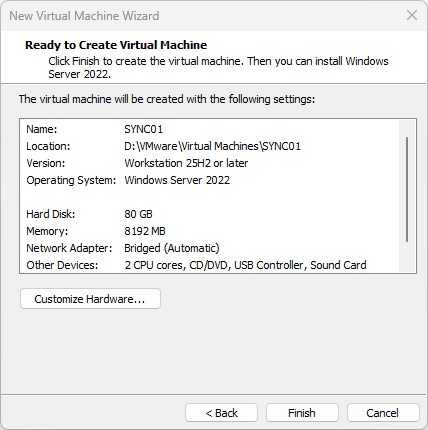

Windows Server 2022 Standard Evaluation (Desktop Experience) was installed from the same ISO recorded in the enterprise infrastructure track's prerequisites, VMware Tools 13.1.0.0 was installed, and Windows Update was run to a current baseline, including the August 2026 cumulative update (KB5120242) and its corresponding .NET Framework updates, ending at OS build 10.0.20348.5499. The hostname was set to `SYNC01`, and the adapter was configured with the static address `192.168.1.30 / 255.255.255.0`, gateway `192.168.1.1`, and DC01 (`192.168.1.10`) as the preferred DNS server, continuing the `.10` / `.20` / `.226` pattern the enterprise track already established.

The first domain-join attempt failed even with that configuration correct; the diagnosis and fix are recorded in Troubleshooting and Adjustments. Once resolved, `SYNC01` joined `corp.home.arpa` using an Enterprise Admin credential, and the computer account was confirmed in `OU=Workstations` per the existing `redircmp` redirect:

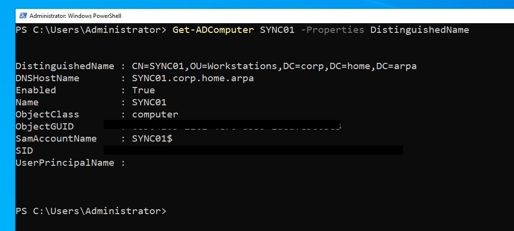

A pre-installation snapshot, `SYNC01 - Domain Joined, Pre-Entra-Connect`, was taken immediately afterward as the rollback point for the Entra Connect installation in Step Five.

The Wazuh agent (`v4.14.5`) was installed and enrolled against the existing manager at `192.168.1.226`, so the environment's newest system is monitored on the same terms as the other three rather than becoming the one host nothing watches:

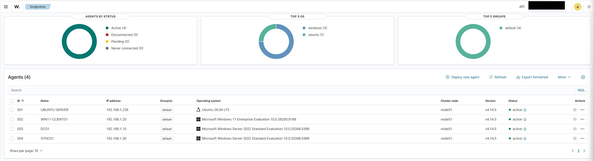

The time zone was also set to Eastern Time to match DC01 and WIN11-CLIENT01, rather than left on the installer's default. This matters more here than it would on an ordinary member server: Kerberos authentication depends on clock skew between `SYNC01` and DC01 staying within tolerance, and a mismatched time zone display, even with the underlying UTC time correct, is the kind of thing worth eliminating as a variable before it complicates diagnosing something else later in this lab. `Get-TimeZone` confirmed Eastern Standard Time, and `w32tm /query /status` confirmed `SYNC01` was already synced to DC01 as its time source; `w32tm /resync` was run to force an immediate sync and validate it rather than waiting on the next poll interval:

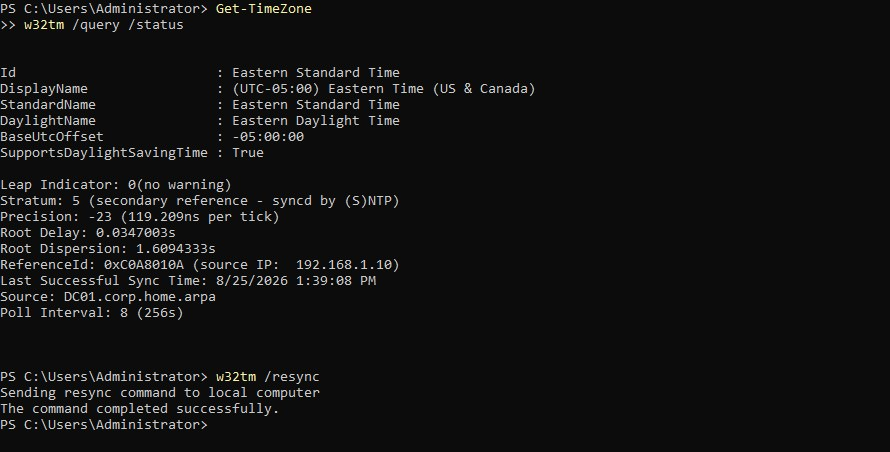

### Step Two: Recorded the pre-synchronization baseline

On the Active Directory side, queried from WIN11-CLIENT01:

| Organizational Unit | Users | Groups |
|---|---|---|
| `User Accounts` | 5 — `testuser01`, Jane Doe, John Smith, Mary Johnson, Alex Kim | 0 |
| `IT` | 1 — `labadmin` | 0 |
| `Workstations` | 0 | 0 |
| `Groups` | 0 | 4 — `IT-Admins`, `Domain-Users-Standard`, `Lab-Workstations`, `Linux-Admins` |

All six users still carried `@corp.home.arpa` user principal names, confirming the suffix work in Step Three had not run yet.

On the cloud side, the tenant (`brindeck.onmicrosoft.com`, tenant ID `dc2a02ec-636d-4df3-9af2-2908706aed4b`) held 3 users, 1 group, 0 devices, and 0 apps, consistent with Lab 01's account that only cloud-only administrative accounts exist there:

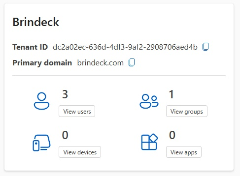

This is the "before" every later step in this lab is measured against: 6 users and 4 groups on-premises, none of it in the tenant's reach yet, and a tenant whose 3 users and 1 group should remain untouched by anything arriving from `User Accounts` or `Groups`, since neither the routable suffix nor Entra Connect exist yet.

### Step Three: Added the routable user principal name suffix

`brindeck.com` was added as an alternative UPN suffix in Active Directory Domains and Trusts:

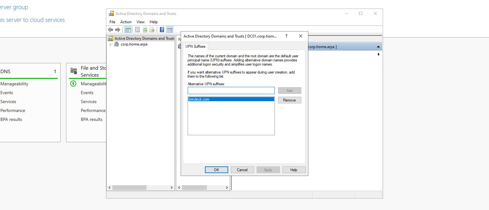

`Get-ADDomain` confirmed `corp.home.arpa`, its distinguished name, and every account's `sAMAccountName` were untouched. Adding a suffix only makes it available; it does not retarget any account by itself, and it has nothing to do with Entra Connect, which was not installed at any point during this step.

The five users in `OU=User Accounts` were retargeted with a single scoped command:

```powershell
Get-ADUser -SearchBase 'OU=User Accounts,DC=corp,DC=home,DC=arpa' -Filter * |
    ForEach-Object { Set-ADUser $_ -UserPrincipalName "$($_.SamAccountName)@brindeck.com" }
```

A query-back confirmed the result: all five users (`testuser01`, `jdoe`, `jsmith`, `mjohnson`, `akim`) now carry `@brindeck.com` with `SamAccountName` unchanged, and `labadmin` in `IT` remains on `@corp.home.arpa`, untouched by the `-SearchBase` scoping.

Confirming Kerberos on Ubuntu Server surfaced an unrelated, pre-existing DNS misconfiguration on that host; the diagnosis and fix are recorded in Troubleshooting and Adjustments. With it resolved, `kinit testuser01@CORP.HOME.ARPA` returned a valid TGT issued by DC01, confirming the retargeted UPN has no effect on Kerberos authentication, which is driven by `sAMAccountName` and the realm, not the `userPrincipalName` attribute.

### Step Four: Updated New-LabUser.ps1 and proved it

The UPN derivation changed from a hardcoded `"$SamAccountName@corp.home.arpa"` to a suffix chosen by comparing `-TargetOU` against the synchronized OU's distinguished name:

```powershell
$SynchronizedOU = "OU=User Accounts,DC=corp,DC=home,DC=arpa"
$upnSuffix = if ($TargetOU -eq $SynchronizedOU) { "brindeck.com" } else { "corp.home.arpa" }
$userPrincipalName = "$SamAccountName@$upnSuffix"
```

An exact match against the one synchronized OU, rather than a wildcard, was enough given this environment's flat OU structure.

Extending `New-LabUser.Tests.ps1` meant more than adding cases. The existing test asserting UPN derivation didn't specify `-TargetOU`, so it exercised the (now synchronized) default OU, and its expectation of `@corp.home.arpa` was quietly wrong the moment the script changed. That test was corrected, and a new `Context 'User principal name suffix'` added covering both branches explicitly: `-TargetOU` unspecified (`@brindeck.com`) and pointed at `OU=IT` (`@corp.home.arpa`). `Invoke-ScriptAnalyzer` reported no violations for the changed script or the full library, and `Invoke-Pester` against the full thirteen-script suite passed all 174 tests.

Live proof against both branches followed the same query-back discipline as every other script in this library, once into the default OU and once into a non-synchronized one:

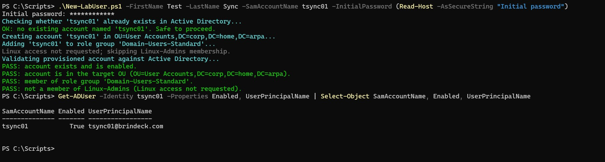

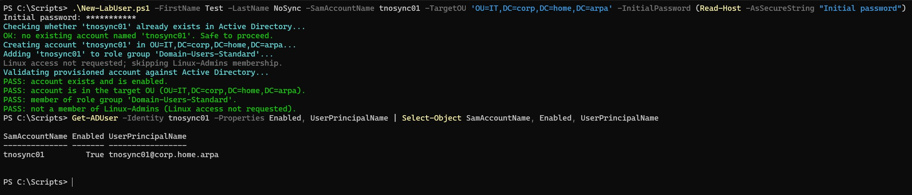

`tsync01`'s first provisioning attempt (not shown above) used a password Active Directory's complexity policy rejected. `New-ADUser` had already created the account object, disabled and passwordless, before failing on the password step, since object creation and password assignment are not atomic; clearing a failed attempt off the screen does not undo it in Active Directory. The stray object was removed with `Remove-ADUser` and the run repeated cleanly.

Doing this before the first synchronization means the first objects to cross the boundary will include one created by the automation library, the deliverable ADR-019 actually asks for.

### Step Five: Install Entra Connect Sync with Custom settings

Before touching `SYNC01`, `OU=Service Accounts` was created and a plain user object, `svc-entraconnect`, was provisioned into it with a non-expiring password, sidestepping the risk Design Decisions raised rather than discovering it. Letting the wizard auto-create the AD DS connector account would have placed it wherever `redirusr`'s redirected default new-user location points, which is `OU=User Accounts`, inside the synchronization scope. Reusing `IT` was considered and rejected: that OU is deliberately framed as the privileged, cloud-invisible boundary for `labadmin`, and this account, unprivileged and needing only read and replication rights, has no reason to sit inside it.

The installer (`AzureADConnect.msi`, version 2.6.84.0) was downloaded from the Microsoft Entra admin center signed in as `admin@brindeck.com`, and run on `SYNC01` with Customize selected instead of Express settings. Password Hash Synchronization was chosen as the sign-in method with Enable single sign-on checked, `admin@brindeck.com` supplied for the Microsoft Entra ID connection, and `corp\svc-entraconnect` supplied on **Connect your directories** using **Use existing account**. On **Microsoft Entra sign-in configuration**, `corp.home.arpa` showed as Not Added, expected and permanent since `home.arpa` is reserved by RFC 8375 and can never be verified, while `brindeck.com` showed Verified; `userPrincipalName` was left as the sign-in attribute. **Domain and OU filtering** was set to sync only `User Accounts` and `Groups`.

On **Uniquely identifying your users**, **Let Azure manage the source anchor** was left at its default, with the wizard's own callout stating it would write back unique values into `ms-DS-ConsistencyGuid` since nothing in the directory had populated that attribute yet, matching the prediction in Design Decisions. No optional features were enabled. Domain administrator credentials were supplied once, only for creating the `AZUREADSSOACC` computer account. On **Ready to configure**, both "Start the synchronization process when configuration completes" and "Enable staging mode" were left unchecked, and Install was run.

Configuration completed successfully and confirmed the source anchor choice explicitly: "Microsoft Entra ID is configured to use AD attribute mS-DS-ConsistencyGuid as the source anchor attribute."

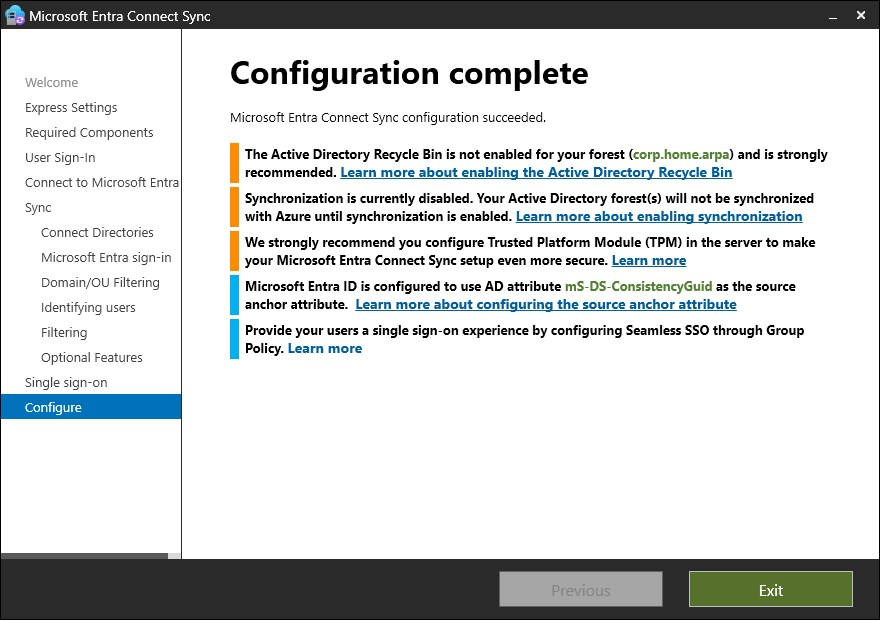

Two other notices appeared on that screen. A TPM recommendation for `SYNC01` doesn't apply, this VM has no hardware TPM passed through from the host. A recommendation to enable the Active Directory Recycle Bin on `corp.home.arpa` does apply but is out of scope here, that is a forest-wide, irreversible-once-enabled setting belonging to the Enterprise Infrastructure track rather than this one, and it carries forward as a note rather than being acted on mid-lab.

### Step Six: Verify scope, then run the first synchronization

`RSAT-AD-Tools` was installed on `SYNC01` so that `ADSyncConfig.psm1`, which depends on the AD DS PowerShell module, could run. `svc-entraconnect` was granted the permissions Custom installation does not configure automatically the way Express does: basic read, password hash synchronization (`Replicate Directory Changes` and `Replicate Directory Changes All`), and read/write on `ms-DS-ConsistencyGuid`, via `Set-ADSyncBasicReadPermissions`, `Set-ADSyncPasswordHashSyncPermissions`, and `Set-ADSyncMsDsConsistencyGuidPermissions` against `corp.home.arpa`.

Verifying the OU filter through Synchronization Service Manager's Container Picker failed outright on a defect in this version; the diagnosis and workaround are recorded in Troubleshooting and Adjustments. Confirmed through the working path instead, the filter showed exactly `User Accounts` and `Groups` selected, nothing else, including `Service Accounts` itself, which stayed correctly out of scope.

With the scope confirmed, `Start-ADSyncSyncCycle -PolicyType Initial` was run and watched in the Operations tab. All six connector operations reported `success`, with one exception worth explaining rather than treating as a defect: the Microsoft Entra ID connector's Full Import reported `completed-no-objects`. The tenant already held four objects at that point, three cloud-only administrative accounts and one cloud-only group from Lab 01, but none of them had ever been touched by directory synchronization or carried anything an AD DS connector could match against, so this was the correct result rather than a gap. ADR-019's boundary held even at the level of what the connector considered worth importing.

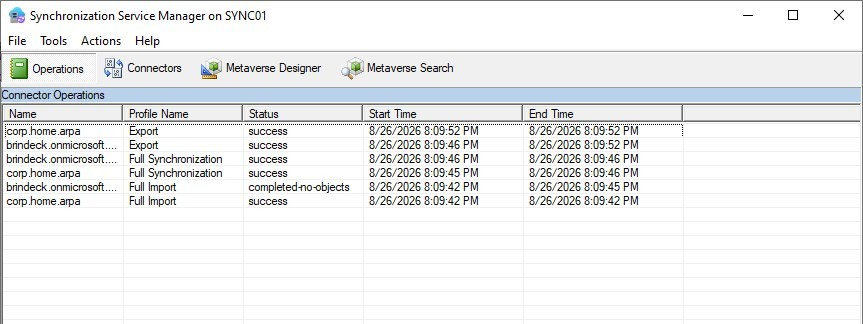

### Step Seven: Validate the synchronized population

The tenant went from three users and one group to nine users and five groups. All five baseline accounts (`testuser01`, `jdoe`, `jsmith`, `mjohnson`, `akim`) appeared with `On-premises sync: Yes` and `@brindeck.com` user principal names matching their on-premises identities, alongside `tsync01`, the account `New-LabUser.ps1` provisioned live during Step Four's proof. `tnosync01` and `labadmin`, both in `IT`, did not appear at all, and the three pre-existing cloud-only administrative accounts correctly showed `On-premises sync: No`.

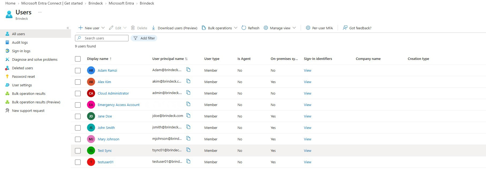

All four groups from `Groups` appeared with `Source: Windows Server AD`, alongside the pre-existing cloud-only `All Company` group. `IT-Admins` confirmed the specific consequence Design Decisions predicted: on-premises the group has four members, `labadmin` plus `jsmith`, `mjohnson`, and `akim`, but the tenant shows only the latter three.

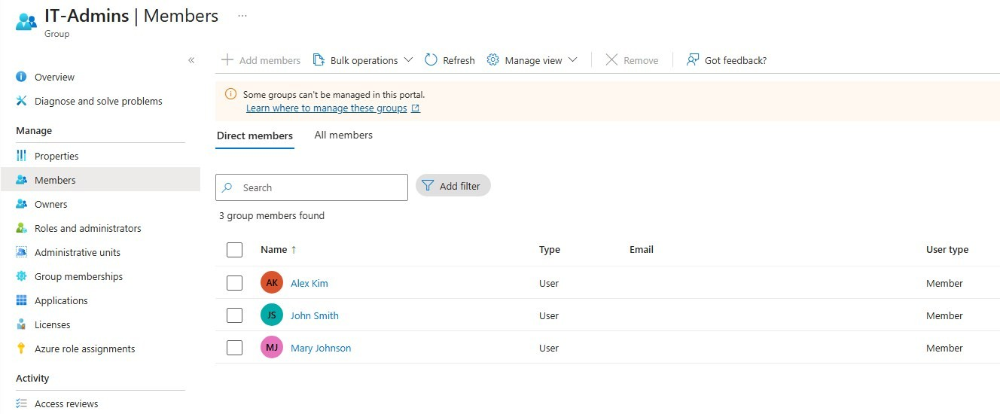

`labadmin`'s own membership in a synchronized group is invisible in the tenant precisely because `labadmin` never crossed the boundary itself, a real property of organizational-unit filtering rather than a defect.

The sign-in test confirmed the premise the whole track rests on: `testuser01` signed in to `myaccount.microsoft.com` as `testuser01@brindeck.com` using his existing on-premises password and authenticated successfully.


Signing in also surfaced an unplanned but genuine finding: Entra ID required immediate Microsoft Authenticator registration before completing the sign-in, even though this is an entirely ordinary user with no administrative role. Lab 01's licensing note describes Security Defaults covering "administrative multifactor authentication," but Security Defaults does not actually support scoping MFA to administrators only, it applies tenant-wide or not at all. This lab did not set out to configure MFA for the general population, that is Lab 05's job, but Security Defaults enforcing it as a side effect is worth recording as an early, unplanned appearance of that later lab's territory.

### Step Eight: Configure and validate seamless single sign-on

Split into two phases across separate sessions. Confirming and protecting `AZUREADSSOACC`, the first half of this step, grew from a formality into real diagnostic work at every layer it touched: the OU it needed, the ACL that OU actually had versus what disabling inheritance was expected to produce, whether the account's own permissions matched an ordinary computer object, and what its Kerberos encryption type actually meant. None of that belonged compressed under the same heading as the Group Policy object and the sign-in validation, so Step Eight-A covers the account hardening in full and Step Eight-B, the GPO and validation from WIN11-CLIENT01, is picked up in a later session.

**Step Eight-A: hardened `AZUREADSSOACC` and confirmed it clean.** A new organizational unit, `OU=Protected Objects`, was created directly under the domain root per Design Decisions above, and `AZUREADSSOACC` was moved into it:

```powershell
New-ADOrganizationalUnit -Name "Protected Objects" -Path "DC=corp,DC=home,DC=arpa" -ProtectedFromAccidentalDeletion $true
Get-ADComputer -Identity AZUREADSSOACC | Move-ADObject -TargetPath "OU=Protected Objects,DC=corp,DC=home,DC=arpa"
```

Getting the OU's ACL down to only Domain Admins, Enterprise Admins, Administrators, and SYSTEM took two corrected passes rather than one; the full sequence, including what went wrong on the first attempt, is recorded in Troubleshooting and Adjustments. The clean end state, inheritance disabled and every remaining entry explicit:

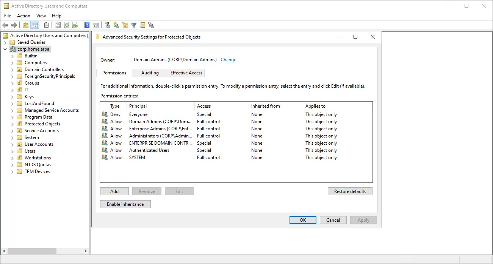

With the OU settled, the account's own ACL was checked directly, since Microsoft's guidance and the OU work above both address where the object sits, not what its own permissions are. `AZUREADSSOACC` carries no `BUILTIN\Account Operators` entry at all. Checked against `SYNC01`, an ordinarily domain-joined computer object, as a control: `SYNC01` does carry `Allow BUILTIN\Account Operators FULL CONTROL`, fully inherited, matching what the `computer` object class's schema-defined default security descriptor grants. `AZUREADSSOACC` does not have that entry, and replication metadata confirms the object's security descriptor (`nTSecurityDescriptor`, version 2) was last written at `8/26/2026 7:29:48 PM`, the same timestamp as `whenCreated` to the second, meaning the ACL has been this way since Step Five's provisioning and nothing done in this OU and ACL work changed it. That is an observed difference between this one object and one control in this environment, not a general claim about how Entra Connect provisions every account; no broader mechanism is asserted here.

Delegation checked clean from every angle available: `TrustedForDelegation` and `TrustedToAuthForDelegation` are both `False`, `userAccountControl` decodes to `69632` (`WORKSTATION_TRUST_ACCOUNT | DONT_EXPIRE_PASSWORD`) with no delegation bits set, `PrincipalsAllowedToDelegateToAccount` is empty, nothing in the domain carries an `msDS-AllowedToDelegateTo` pointing at this account, and a domain-wide sweep for unconstrained delegation found exactly one object, `DC01` (`userAccountControl 532480`, `SERVER_TRUST_ACCOUNT | TRUSTED_FOR_DELEGATION`), the expected, correct holder of that flag.

`msDS-SupportedEncryptionTypes` came back completely unset, not RC4:

```powershell
Get-ADComputer AZUREADSSOACC -Properties msDS-SupportedEncryptionTypes | Select-Object Name, msDS-SupportedEncryptionTypes
```

An unset value has never meant RC4 by itself; it means no explicit configuration on the object, and the KDC substitutes the domain's `DefaultDomainSupportedEncTypes` registry value in its place. What actually changed, and what matters for the date this lab is being run, is that default. Microsoft's guidance for CVE-2026-20833 moved `DefaultDomainSupportedEncTypes`'s own default to `0x18` (AES-SHA1 only) starting 14 April 2026, with an audit-only phase preceding it from 13 January 2026 and the registry escape hatch removed and enforcement made mandatory in July 2026. Whether DC01 was actually resolving this account to AES or still to RC4 at the moment it was checked depends on DC01's own patch level relative to those dates, which was not confirmed. Rather than depend on that, the account's Kerberos key was rolled and its encryption type set explicitly:

```powershell
$CloudCred = Get-Credential                                       # admin@brindeck.com, cloud Global Administrator
New-AzureADSSOAuthenticationContext -CloudCredentials $CloudCred
$creds = Get-Credential                                           # corp\labadmin
Update-AzureADSSOForest -OnPremCredentials $creds -PreserveCustomPermissionsOnDesktopSsoAccount
Set-ADComputer -Identity AZUREADSSOACC -KerberosEncryptionType "AES128,AES256"
```

`Update-AzureADSSOForest` found and updated the account at its new location under `OU=Protected Objects`, confirming the OU move hadn't confused it. `Get-ADComputer AZUREADSSOACC -Properties msDS-SupportedEncryptionTypes, PasswordLastSet` afterward showed `24` (`AES128 | AES256`) and a `PasswordLastSet` timestamp matching the rollover:

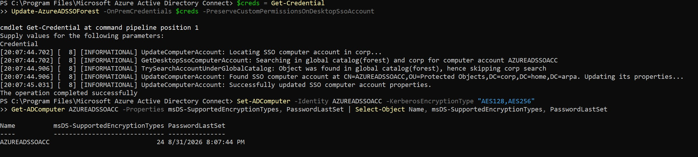

Establishing the authentication context for the rollover fought through some real browser-configuration friction on `SYNC01`, recorded as one line in Troubleshooting and Adjustments.

**Step Eight-B, planned:** create and link a Group Policy object adding `https://autologon.microsoftazuread-sso.com` to the Local intranet zone, scoped to `OU=User Accounts`, and enable the associated status bar policy setting. Validate from WIN11-CLIENT01 as a synchronized domain user: reaching a tenant sign-in page should complete without a password prompt. Record the behavior honestly if it does not, since the documentation describes the feature as opportunistic and silently falling back to a normal password prompt on failure, which means a negative result looks identical to the feature not being configured.

### Step Nine: Observe the cycle, then break it on purpose

Let the scheduler run unattended and record what a normal cycle looks like over several intervals: `Get-ADSyncScheduler` output, the run history, and how long a change made on-premises takes to appear.

Then induce a failure and document how it presents and how it is diagnosed. The candidate chosen during planning is a duplicate user principal name conflict, created by giving an on-premises account a user principal name that already belongs to a cloud-only object in the tenant. It is chosen because of how it fails rather than that it fails: with Duplicate Attribute Resiliency active, the conflicting attribute is quarantined and a placeholder assigned, the export succeeds, and the synchronization engine reports no error at all. It is the failure mode most likely to be missed in a real environment and the one that best justifies the Connect Health decision above.

A second candidate, held in reserve, is stopping the ADSync service or severing outbound connectivity from `SYNC01`, which fails loudly and at a different layer. If the first produces a thin result, the second gives a contrasting one.

### Step Ten: Validate the environment is otherwise unchanged, and record the finished state

Confirm that DC01, WIN11-CLIENT01, and Ubuntu Server still behave as the earlier tracks documented: domain authentication, Group Policy application, SSSD and Kerberos on Ubuntu Server, the Wazuh agents, and a run of the automation library's health report. Record the Entra Connect version installed, the source anchor chosen, the synchronized object counts on both sides, and the scheduler configuration.

---

## Validation

*Recorded during implementation, against observed results.*

---

## Troubleshooting and Adjustments

### Domain Join Failed Initially Because IPv6 Interfered with DNS Resolution

During Step One, the first attempt to join `SYNC01` to `corp.home.arpa` failed with "An Active Directory Domain Controller (AD DC) for the domain 'corp.home.arpa' could not be contacted," even though the IPv4 address, subnet, gateway, and preferred DNS server (`192.168.1.10`) were all configured correctly.

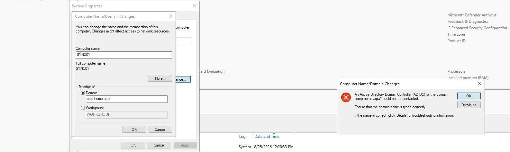

`ipconfig /all` showed why: alongside the intended IPv4 DNS server, the Ethernet0 adapter also had IPv6 autoconfiguration active, with its own IPv6 addresses and an IPv6 DNS server entry. The mixed IPv4/IPv6 configuration was enough to prevent domain-controller discovery from completing over the intended path.

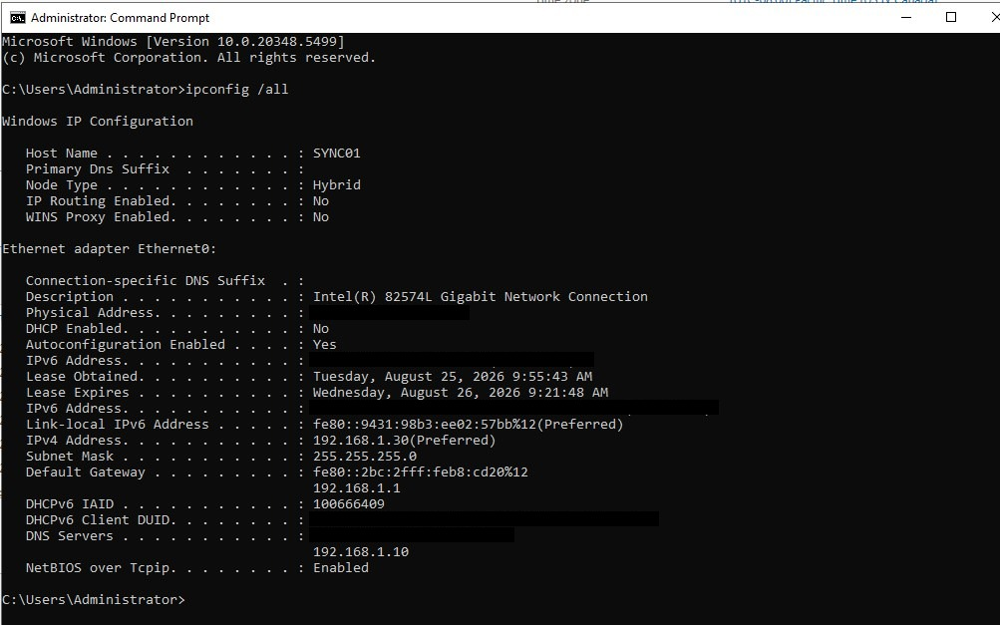

This is not evidence that IPv6 is broadly incompatible with Active Directory, and it is not a general recommendation to disable it. It is what was actually observed on this host, in this configuration, at this point in setup: a targeted workaround for interference that was diagnosed directly, not an assumption applied on principle. The IPv6 binding was disabled on the Ethernet0 adapter, the DNS cache was flushed and re-registered, and domain-controller discovery was verified directly before retrying the join:

```powershell
Disable-NetAdapterBinding -Name "Ethernet0" -ComponentID ms_tcpip6
ipconfig /flushdns
ipconfig /registerdns
Get-DnsClientServerAddress
nltest /dsgetdc:corp.home.arpa
```

`Get-DnsClientServerAddress` confirmed the IPv4 DNS server was `192.168.1.10` with no IPv6 server configured, and `nltest /dsgetdc:corp.home.arpa` located `\\DC01.corp.home.arpa` at `192.168.1.10` successfully:

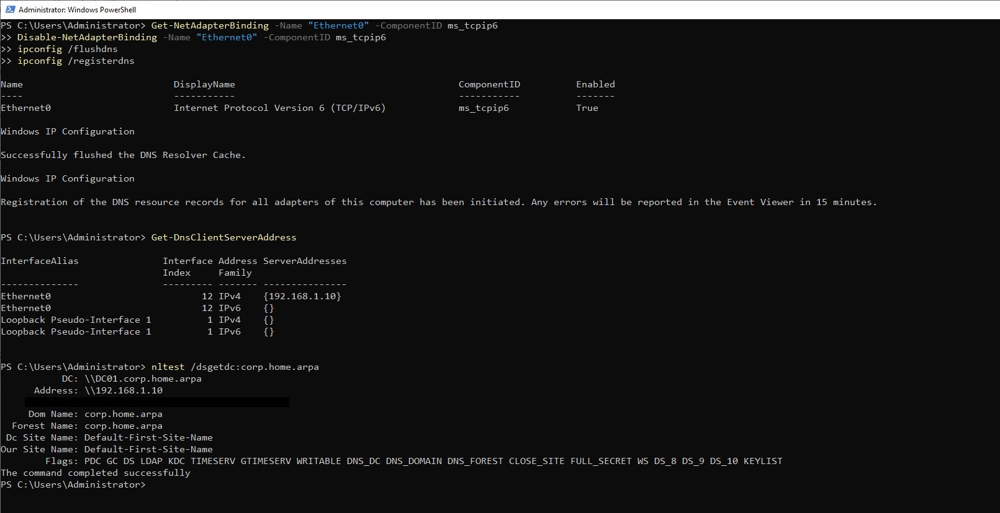

The domain join was retried immediately afterward and completed without further issue.

---

### Ubuntu Server's DNS Override From Lab 06 Had Never Actually Taken Effect

Confirming Kerberos for a retargeted user (Step Three) failed with `kinit: Cannot find KDC for realm "CORP.HOME.ARPA"`. `resolvectl status` showed DC01 present in `eno2`'s candidate DNS server list but not selected as current, and `dig SRV _kerberos._tcp.corp.home.arpa` came back `NXDOMAIN` against whichever server was actually being asked.

The cause traced back further than the immediate symptom. `/etc/netplan/00-installer-config.yaml` contained two `network:` mappings concatenated in one file: the DC01 nameserver override [Lab 06 of the enterprise infrastructure track](../enterprise-infrastructure/06-linux-ad-integration-lab.md) documented adding, immediately followed, with no line break, by the original Subiquity-installer content that override was supposed to replace. YAML does not define what happens when the same top-level key appears twice in one mapping, and the parser in use resolved it by keeping the later occurrence: the original block, with no static nameserver and both `dhcp4` and `dhcp6` enabled. Lab 06's fix had likely never been live since the day it was written. This host has been resolving DNS purely through DHCP the entire time, and it worked anyway only because DC01 happens to be one of the servers this network's DHCP scope hands out; `systemd-resolved` simply hadn't failed over to the other DHCP-supplied candidate, the router, until now.

The file was replaced outright with a single clean mapping, rather than patched, to remove the ambiguity entirely:

```yaml
network:
  ethernets:
    eno2:
      dhcp4: true
      dhcp4-overrides:
        use-dns: false
      dhcp6: false
      accept-ra: false
      match:
        macaddress: xx:xx:xx:xx:xx:xx  # redacted; matches this host's real NIC address in the actual config
      set-name: eno2
      nameservers:
        addresses:
          - 192.168.1.10
  version: 2
  wifis: {}
```

`sudo netplan try` applied it, dropping the active SSH session briefly, consistent with the interface actually being reconfigured rather than nothing changing, and `dig SRV _kerberos._tcp.corp.home.arpa` returned `NOERROR` with the correct record afterward. One detail is left unresolved rather than papered over: `resolvectl status` still lists the router and an IPv6 address alongside DC01 in `eno2`'s DNS Servers candidate list even after `dhcp4-overrides.use-dns: false` and `accept-ra: false`, though `Current DNS Server` and every subsequent query correctly use DC01. IPv6 Router Advertisements populating that field through a path the override doesn't fully close is the likely explanation, but it was not confirmed.

This is the same category of failure [Lab 04](../enterprise-infrastructure/04-domain-client-lab.md) diagnosed on WIN11-CLIENT01 (a competing DNS path lacking the AD-integrated zones) and Lab 06 diagnosed on this same host originally (DHCP handing out only the router), just one step further back: a fix that adds the correct server without removing the competing ones is still an incomplete fix.

### Synchronization Service Manager's Container Picker Failed on a Known Defect in Version 2.6.84.0

Confirming the OU filter for Step Six's scope verification meant opening the `corp.home.arpa` connector's properties in Synchronization Service Manager and selecting **Containers...** on the **Configure Directory Partitions** page. That failed immediately with a .NET resource-loading error: "An error was encountered while selecting containers: Could not find any resources appropriate for the specified culture or the neutral culture... 'Microsoft.DirectoryServices.MetadirectoryServices.UI.ContainerPicker.ContainerPickerControl.resources' was correctly embedded or linked into assembly 'ContainerPicker'..."

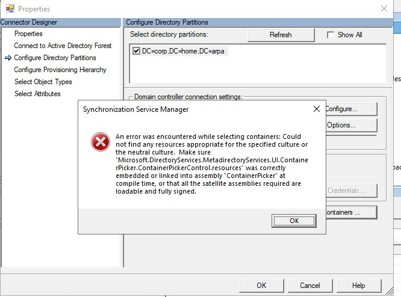

This is a confirmed defect in this specific build rather than anything wrong with the environment. Microsoft's own community forum has a thread on exactly this version and error, a missing localized resource for the Container Picker control, confirmed by Microsoft support, with directory connectivity itself unaffected; the wizard can enumerate OUs correctly elsewhere, only this one dialog in Sync Service Manager is broken. Their recommended workaround is the supported path this lab already relies on for OU filtering: the installer wizard's own **Domain and OU filtering** page rather than Sync Service Manager's picker.

Relaunching the Entra Connect wizard, selecting **Customize synchronization options** from **Additional Tasks**, and returning to **Domain and OU filtering** confirmed the scope correctly: `User Accounts` and `Groups` checked, everything else including the new `Service Accounts` OU unchecked, with no changes made and the wizard exited without reaching **Configure**.

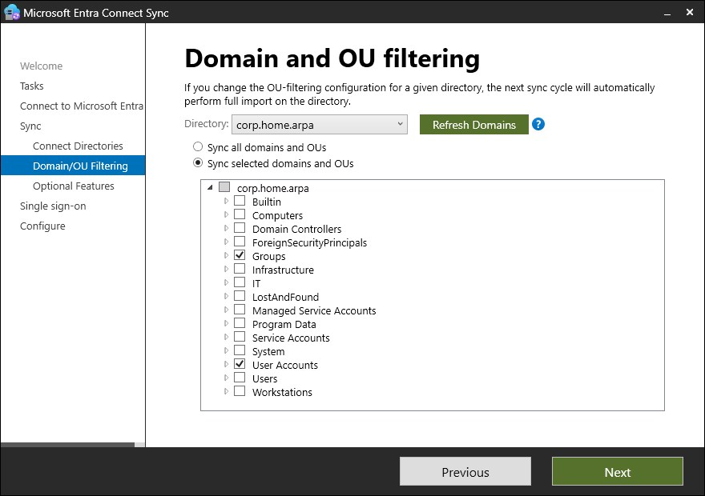

Since the OU filter had already been set correctly through the installer wizard during Custom setup, not through Sync Service Manager, this defect never called the actual configuration into question, only the one tool available to view it after the fact.

### The Protected Objects OU's ACL Needed Two Corrected Passes, Not the One From the Security Tab

Getting `OU=Protected Objects` down to Domain Admins, Enterprise Admins, Administrators, and SYSTEM only did not work on the first attempt, and the reason changed twice before it was actually right.

Right after creation, before any change, the OU's own `dsacls` showed the ordinary default for a brand-new OU under this domain: `Domain Admins` (added at creation via `New-ADOrganizationalUnit`, not inherited), plus `Enterprise Admins`, `Administrators`, `Pre-Windows 2000 Compatible Access`, `Key Admins`, and `Enterprise Key Admins`, all tagged `<Inherited from parent>`, and, notably, `BUILTIN\Account Operators` (create/delete child on `computer`, `user`, `group`, `inetOrgPerson`) and `BUILTIN\Print Operators` (create/delete child, scoped to `printQueue` only) present with no inheritance tag at all:

```text
Allow BUILTIN\Account Operators       SPECIAL ACCESS for computer
                                      CREATE CHILD
                                      DELETE CHILD
Allow BUILTIN\Print Operators         SPECIAL ACCESS for printQueue
                                      CREATE CHILD
                                      DELETE CHILD
```

The first attempt to fix this used the Security tab's basic checkbox to uncheck "Include inheritable permissions from this object's parent," and it did not take: a follow-up `dsacls` showed every `<Inherited from parent>` entry from before still present, unchanged, alongside a `CORP\Domain Admins FULL CONTROL` entry with no tag, meaning the dialog had added an entry rather than replacing anything.

The correct path is in Advanced Security Settings specifically: **Disable inheritance**, then **Remove all inherited permissions from this object** (not convert). That did strip every `<Inherited from parent>` entry, confirmed by `{This object is protected from inheriting permissions from the parent}` appearing in the next `dsacls` output. But `BUILTIN\Account Operators` and `BUILTIN\Print Operators` were still sitting there afterward, unaffected, because they were never inherited to begin with: they are explicit entries baked into the OU and `computer` object classes' own schema-defined default security descriptors, the same ones that appeared with no tag in the very first snapshot. Disabling inheritance only strips inherited entries, so this pass could only ever have left them behind. They were removed directly instead:

```powershell
dsacls "OU=Protected Objects,DC=corp,DC=home,DC=arpa" /R "BUILTIN\Account Operators" "BUILTIN\Print Operators"
```

One more correction was needed after that: re-adding `Enterprise Admins` and `Administrators` through the Advanced Security Settings **Add** dialog had only checked a narrower permission set (read permissions, list contents, write/read property) rather than **Full control**, the checkbox that also selects everything beneath it. Both were corrected to Full control to match `Domain Admins` and `SYSTEM`. The final, clean `dsacls` output is in Step Eight-A above.

### Establishing the Seamless SSO Authentication Context Fought Through Browser Configuration on SYNC01

Getting `New-AzureADSSOAuthenticationContext` to actually render a sign-in window on `SYNC01` took working through Internet Explorer Enhanced Security Configuration, an uninitialized per-user Internet Explorer profile, and the module's embedded browser control needing several Microsoft sign-in domains added to Trusted Sites, none of which reflects anything about this lab's own configuration.

## Security Considerations

This lab introduces the environment's first path from the local network to a cloud directory, and most of what follows is a consequence of that.

The synchronization account is the most consequential new credential in the environment. Entra Connect creates an Active Directory connector account for reading the directory, and password hash synchronization requires it to hold Replicate Directory Changes and Replicate Directory Changes All. Those rights are what allow it to request password hashes from a domain controller over the standard replication protocol. An account with directory replication rights is a high-value target by definition, and it lives on `SYNC01` rather than on the domain controller, which is precisely why ADR-019 put the synchronization engine on a host whose compromise does not begin at the identity foundation.

Password hash synchronization sends a hash of the on-premises password hash rather than the password or the original hash, and cloud authentication is then evaluated entirely in the cloud. This is why the method was chosen: it adds no inbound path and no on-premises dependency at sign-in. It also means the cloud directory now holds derived credential material for every synchronized user, which the tenant's administrative controls from Lab 01 are what protect.

Seamless single sign-on introduces a computer account, `AZUREADSSOACC`, whose Kerberos decryption key is shared with Microsoft Entra ID. Microsoft's guidance is explicit that this account "needs to be strongly protected," that "only Domain Admins should be able to manage the computer account," that Kerberos delegation on it must be disabled, and that it should be stored where accidental deletion is unlikely. Its key should be rolled at least every thirty days, and nothing does that automatically.

The synchronization scope is itself a security decision. Excluding `IT` keeps the environment's privileged on-premises identity out of the cloud directory entirely, so neither compromise reaches across. That is the on-premises mirror of ADR-019's decision to keep the tenant's administrators cloud-only, and the two together mean privilege on either side of the boundary does not imply privilege on the other.

One filtering behavior is worth treating as an operational hazard rather than a configuration detail. Objects that fall out of synchronization scope after having been synchronized are deleted in the cloud, and Microsoft warns specifically that renaming a synchronized organizational unit changes its distinguished name, drops it from scope, and "can potentially cause an unexpected mass deletion of objects in Microsoft Entra ID." The organizational unit names in this environment are stable, but the hazard is recorded here because the trigger is an ordinary administrative action with a wildly disproportionate result.

Identifier handling follows the policy the [track README](README.md) sets. On-premises identifiers already documented across the enterprise and automation tracks continue to appear; new cloud-side object identifiers are masked in screenshots on the same terms Lab 01 established.

---

## Outcome

*Recorded at completion.*

---

## Lessons Learned

*Recorded at completion.*

---

## Sources

**Deployment prerequisites and installation**

- [Microsoft Entra Connect Sync: Prerequisites](https://learn.microsoft.com/en-us/entra/identity/hybrid/connect/how-to-connect-install-prerequisites) - the domain-joined and full-GUI requirements that rule out WIN11-CLIENT01 and Server Core, the Windows Server 2025 and 2022 recommendation, the hardware table used to size `SYNC01`, the SQL Server Express 100,000-object ceiling, and the Global Administrator requirement for an enabled Connect Health agent
- [Select which installation type to use](https://learn.microsoft.com/en-us/entra/identity/hybrid/connect/how-to-connect-install-select-installation) - that Express synchronizes all objects in all organizational units, and the documented workaround that made Custom the cleaner choice rather than the only one
- [Custom installation of Microsoft Entra Connect](https://learn.microsoft.com/en-us/entra/identity/hybrid/connect/how-to-connect-install-custom) - the domain and organizational unit filtering page, and the source anchor options
- [Microsoft Entra Connect: Accounts and permissions](https://learn.microsoft.com/en-us/entra/identity/hybrid/connect/reference-connect-accounts-permissions) - the Replicate Directory Changes rights password hash synchronization requires, what the installer creates automatically, and the Directory Synchronization Accounts role the running connector account receives
- [Microsoft Entra Connect: Version release history](https://learn.microsoft.com/en-us/entra/identity/hybrid/connect/reference-connect-version-history) - the 30 September 2026 mandatory version deadline, the current 2.6.84.0 release, the twelve-month per-version retirement policy, and that the installer is now distributed only through the Entra admin center

**Design and synchronization behavior**

- [Microsoft Entra Connect: Design concepts](https://learn.microsoft.com/en-us/entra/identity/hybrid/connect/plan-connect-design-concepts) - the source anchor and `ms-DS-ConsistencyGuid`, the wizard's conditional selection logic, and that the choice cannot be changed without uninstalling
- [Microsoft Entra Connect Sync: Scheduler](https://learn.microsoft.com/en-us/entra/identity/hybrid/connect/how-to-connect-sync-feature-scheduler) - the 30-minute default cycle, delta versus full, `Start-ADSyncSyncCycle` and its `Delta` and `Initial` policy types, and the scheduler properties that can be read and changed
- [Password hash synchronization](https://learn.microsoft.com/en-us/entra/identity/hybrid/connect/how-to-connect-password-hash-synchronization) - that password hashes synchronize on a fixed two-minute interval independent of the directory cycle and that the interval cannot be modified
- [Configure filtering](https://learn.microsoft.com/en-us/entra/identity/hybrid/connect/how-to-connect-sync-configure-filtering) - that previously synchronized objects filtered out later are deleted in the cloud, the organizational unit rename mass-deletion hazard, and disabling the scheduler before changing scope

**Sign-in and failure behavior**

- [Microsoft Entra seamless single sign-on](https://learn.microsoft.com/en-us/entra/identity/hybrid/connect/how-to-connect-sso) - what the feature does, and that it works with password hash synchronization
- [Seamless SSO: Quickstart](https://learn.microsoft.com/en-us/entra/identity/hybrid/connect/how-to-connect-sso-quick-start) - the `AZUREADSSOACC` computer account and how to protect it, and the Group Policy Intranet zone configuration including the exact URL and policy path
- [Seamless SSO: Technical deep dive](https://learn.microsoft.com/en-us/entra/identity/hybrid/connect/how-to-connect-sso-how-it-works) - the Kerberos exchange the feature depends on
- [Seamless SSO: FAQ](https://learn.microsoft.com/en-us/entra/identity/hybrid/connect/how-to-connect-sso-faq) - the recommendation to roll the Kerberos decryption key at least every thirty days, and the `Update-AzureADSSOForest` procedure
- [Troubleshoot seamless SSO](https://learn.microsoft.com/en-us/entra/identity/hybrid/connect/tshoot-connect-sso) - that placing the sign-on URL in Trusted Sites rather than Local intranet blocks sign-in
- [Troubleshoot errors during synchronization](https://learn.microsoft.com/en-us/entra/identity/hybrid/connect/tshoot-connect-sync-errors) - the documented error classes, including duplicate attribute and data mismatch conditions
- [Duplicate attribute resiliency](https://learn.microsoft.com/en-us/entra/identity/hybrid/connect/how-to-connect-syncservice-duplicate-attribute-resiliency) - what quarantining an attribute means, and that the export succeeds so the sync client logs no error and does not retry, which is the behavior the induced failure in Step Nine is chosen to expose
- [Microsoft Entra Connect Health for sync](https://learn.microsoft.com/en-us/entra/identity/hybrid/connect/how-to-connect-health-sync) - the synchronization error report, its thirty-minute refresh, and the alerting the Global Administrator installation decision buys
- [Synchronization Service Manager: Operations tab](https://learn.microsoft.com/en-us/entra/identity/hybrid/connect/how-to-connect-sync-service-manager-ui-operations) - reading run status, and the distinction between `success` and a run that completed with errors
- [How to manage Kerberos KDC usage of RC4 for service account ticket issuance: Changes related to CVE-2026-20833](https://support.microsoft.com/en-us/topic/how-to-manage-kerberos-kdc-usage-of-rc4-for-service-account-ticket-issuance-changes-related-to-cve-2026-20833-1ebcda33-720a-4da8-93c1-b0496e1910dc) - what an unset `msDS-SupportedEncryptionTypes` actually falls back to (`DefaultDomainSupportedEncTypes`), and that a patched DC's default for that value changed to `0x18` (AES-SHA1 only) starting 14 April 2026, with enforcement mandatory from July 2026

**Domain preparation**

- [Prepare a non-routable domain for directory synchronization](https://learn.microsoft.com/en-us/microsoft-365/enterprise/prepare-a-non-routable-domain-for-directory-synchronization) - that a non-routable user principal name does not fail but is silently synchronized to the `onmicrosoft.com` domain, which is the reason the suffix work precedes the first synchronization

**Known issues**

- [Entra Connect 2.6.84.0 displays error when trying to configure containers](https://techcommunity.microsoft.com/discussions/microsoft-entra/entra-connect-2-6-84-0-displays-error-when-trying-to-configure-containers/4549077) - confirms the Container Picker resource error in Synchronization Service Manager as a defect specific to this build, and the recommended workaround of using the installer wizard's own OU filtering page instead
