# 02 - Hybrid Identity with Entra Connect

## Status

All ten steps are complete: implemented, run against the live environment, and documented in past tense below. `SYNC01` hosted Entra Connect Sync (version 2.6.84.0, `ms-DS-ConsistencyGuid` as the source anchor), scoped to `User Accounts` and `Groups` with `IT` deliberately excluded. `brindeck.com` became the routable UPN suffix in Active Directory, and `New-LabUser.ps1` derives it automatically for accounts created in a synchronized OU, under the full thirteen-script Pester suite (174 tests). Password hash synchronization and seamless single sign-on both validated end to end: `testuser01@brindeck.com` authenticated to a cloud service with his on-premises password, and later signed in to `myapps.microsoft.com` with no password prompt at all, Kerberos ticket confirmed by `klist`. The finished state holds 9 users and 4 groups on-premises across the organizational units now in use, two of which, `Service Accounts` and `Protected Objects`, exist only because of this lab, and 10 users, 5 groups, and 1 application in the tenant.

Step Nine found a real defect rather than a clean scheduler: `SyncCycleEnabled` had been `False` since installation, so every change synchronized through Step Eight reached the tenant only by a manually forced cycle, never the scheduler doing its own job. Fixed, and Step Ten confirmed it held: the scheduler ran three consecutive unattended Delta cycles roughly thirty minutes apart with nobody forcing anything. Step Nine's deliberate collision also changed target mid-step, from an existing account to a disposable cloud-only fixture, once every existing cloud-only account turned out to be Global Administrator-tier. Full detail on both, and on the smaller findings along the way, is in Troubleshooting and Adjustments below.

---

## Overview

This lab connected the two directories. It was the point at which `corp.home.arpa` stopped being the only place an identity in this environment exists.

Lab 01 built a destination and proved nothing crossed into it. The tenant held three cloud-only administrative accounts and no ordinary users. On-premises, Active Directory held every user, group, and computer the enterprise and automation tracks created, and it authenticated all three systems in the environment. The two had no relationship. This lab created one, in a single direction: Active Directory remains authoritative, and a scoped subset of it is projected into Microsoft Entra ID by a synchronization engine running on a new member server.

Four things existed at the end of it that had not existed before:

- `SYNC01`, a Windows Server 2022 member server joined to `corp.home.arpa`, running Microsoft Entra Connect Sync
- a routable user principal name suffix, `@brindeck.com`, added alongside `corp.home.arpa` and applied to the users selected for synchronization
- a synchronized population in the tenant, scoped by organizational unit, whose passwords are validated in the cloud against hashes replicated from DC01
- an observed record of how synchronization behaves over time: the cycle, at least one deliberately induced failure, and the diagnosis that resolved it

The last of those is the reason this lab is worth more than its configuration steps. A working synchronization is a wizard. A synchronization whose failure modes have been provoked and read is an operational understanding, and it is the thing every later lab in this track depends on.

---

## Objectives

The primary goals of this lab were to:

- build `SYNC01` as a dedicated domain-joined member server, keeping the synchronization engine off DC01 per [ADR-019](../architecture/decisions/019-establish-cloud-and-hybrid-identity-track.md)
- add `brindeck.com` as an alternative user principal name suffix in Active Directory and retarget the users selected for synchronization, before any synchronization runs
- update `New-LabUser.ps1` to emit the routable suffix for accounts created in synchronized organizational units, under the analysis and testing standard set by [ADR-017](../architecture/decisions/017-adopt-powershell-static-analysis-and-unit-testing.md)
- install Microsoft Entra Connect Sync with password hash synchronization, scoped by organizational unit rather than synchronizing the whole directory
- confirm that a user provisioned on-premises appears in the tenant with a matching routable user principal name and authenticates to a cloud service with their on-premises password
- enable seamless single sign-on and validate it from WIN11-CLIENT01
- document the synchronization cycle as observed, not as described, including the difference between the directory cycle and password hash synchronization
- induce at least one synchronization failure deliberately, document how it presented, and record the diagnosis

Every objective was met. Two went differently than planned. The synchronization-cycle objective turned into more than documentation: the scheduler check in Step Nine found `SyncCycleEnabled: False`, meaning every change synchronized through Step Eight had reached the tenant only through a manually forced cycle or the initial installation sync, never through the scheduler doing its own job, a genuine defect rather than a behavior to narrate. And the deliberate-failure objective changed its collision target mid-step, from an existing account to a disposable cloud-only user created for the purpose, once every existing cloud-only account turned out to be Global Administrator-tier and off-limits; only one of the two failure modes prepared at planning time was needed, the other held in reserve throughout.

---

## Project Context

[ADR-019](../architecture/decisions/019-establish-cloud-and-hybrid-identity-track.md) established this track and settled its architecture. This lab implemented the parts of that decision that touch the on-premises environment, and it is the first work in the entire repository to modify `corp.home.arpa` since the enterprise infrastructure track closed.

That is worth stating plainly, because Lab 01 could afford to be careless in a way this lab could not. Lab 01 touched nothing on-premises; its worst outcome was a misconfigured tenant that could be deleted and rebuilt. This lab added a user principal name suffix to a production domain, changed the sign-in names of real accounts, installed a service that writes back to Active Directory, and created a computer account that holds a Kerberos key trusted by Microsoft. None of that was destructive, and none of it changed the domain name, the Kerberos realm, `sAMAccountName` values, DNS, or Group Policy scoping. But it is the first lab in this track where a mistake lands on the systems the Linux, enterprise, and automation tracks documented.

The environment it modifies is the one those tracks built. DC01 holds `corp.home.arpa` with four organizational units: `User Accounts`, `IT`, `Workstations`, and `Groups`. WIN11-CLIENT01 is domain-joined and carries the thirteen-script PowerShell library. Ubuntu Server authenticates domain users through SSSD and Kerberos. Wazuh collects authentication events from all three. Nothing in that arrangement changes here, and the validation for this lab includes confirming that it did not.

---

## Design Decisions

### SYNC01 is a dedicated member server, sized to Microsoft's documented floor

**Decision:** A new virtual machine, `SYNC01`, running Windows Server 2022 and joined to `corp.home.arpa`, hosted Entra Connect Sync. It was allocated 2 vCPU, 8 GB of memory, and 80 GB of thin-provisioned storage.

ADR-019 settled that the synchronization engine does not go on DC01, and that reasoning is not relitigated here. What this lab had to settle was what the machine actually needed. Microsoft's prerequisites are unambiguous about the operating system: Entra Connect "must be installed on a domain-joined server," the server "must have a full GUI installed," and "installing Microsoft Entra Connect on Windows Server Core isn't supported," which rules out both WIN11-CLIENT01 and a Core deployment. Windows Server 2025 and 2022 are the recommended versions; 2022 was chosen to match DC01 rather than for any capability reason.

Sizing is where the documentation is less helpful than it looks. Microsoft's hardware table has no tier below "fewer than 10,000 objects," and that tier asks for a 1.6 GHz CPU, 6 GB of memory, and 70 GB of disk. This environment has perhaps thirty objects in scope, so the floor is set by the software rather than the workload: Entra Connect installs SQL Server 2019 Express LocalDB by default, which "has a 10-GB size limit that enables you to manage approximately 100,000 objects," far beyond anything this directory would ever hold, so no separate SQL Server was required.

The allocation above rounds Microsoft's disk floor up to 80 GB to match the storage convention DC01 already uses, which costs nothing because the disk is thin provisioned and the real consumption is the operating system, a pagefile, and a database holding roughly thirty objects. The memory is rounded up for a different and more deliberate reason. Committed memory is not reclaimed lazily the way thin-provisioned disk is, so the extra 2 GB was a real allocation rather than a ceiling, and it was there because Step Nine was expected to break and restart the synchronization service and provoke failures on this host. A server that would be reconfigured repeatedly is the wrong place to sit exactly on a vendor minimum. In the event, Step Nine induced its failure through a user principal name collision and never needed the service stopped at all, so the headroom went unused rather than unjustified. Against the host's 32 GB, with DC01 at 4 GB and WIN11-CLIENT01 at 8 GB, this brings committed memory to 20 GB and leaves the workstation the headroom the enterprise resource plan calls for. That plan's virtual machine inventory is updated by this lab rather than by a later one.

### Custom installation, not Express

**Decision:** Entra Connect was installed using Custom settings rather than Express settings.

ADR-019 requires synchronization to be scoped by organizational unit, and Express does not offer that choice during installation. Express synchronizes "all eligible objects in all domains and all OUs." There is a documented way around it, unselecting the option to start synchronization on the final page and then rerunning the wizard to change the organizational units before enabling the schedule, but that path configures the thing correctly on the second attempt rather than the first, and it means the wizard's own summary screen describes a scope that was never intended.

Custom settings also surface decisions this lab wants visible rather than assumed: the sign-in method, the source anchor, the organizational unit filter, and the optional features are all shown and chosen rather than defaulted. For a lab whose purpose is to understand the synchronization relationship rather than to establish one quickly, the installer that asks more questions is the correct one.

### Synchronization scope is `User Accounts` and `Groups`, and `IT` is deliberately excluded

**Decision:** Only the `User Accounts` and `Groups` organizational units synchronized. `IT` and `Workstations` remained on-premises.

ADR-019 requires a scoped synchronization and gives the reason: the tenant should not become an unfiltered mirror of every object the environment has ever held, and filtering behavior should be observable rather than assumed. This is the specific scope that satisfies it.

`User Accounts` is the ordinary user population and the target the automation track's `New-LabUser.ps1` writes to by default, so it is the population that makes the single-identity premise demonstrable. `Groups` is included because Lab 03 has to compare what can be edited on a synchronized group against a cloud-only one, and it cannot do that without a synchronized group to look at.

`IT` is excluded on purpose, and the reason parallels ADR-019's decision to keep the tenant's administrators cloud-only. `IT` holds `labadmin`, the account that runs every script in the automation library and holds domain privilege. Keeping it out means the environment's privileged on-premises identity has no cloud presence at all, so a tenant compromise reaches no privileged on-premises account and a synchronized-account compromise reaches nothing privileged on-premises. It also leaves an organizational unit that visibly exists on one side of the boundary and not the other, which is the observable filtering property ADR-019 asked for rather than a claim about one.

`Workstations` is excluded because device objects belong to Lab 05, which takes up device join and enrollment deliberately, and because syncing computer objects here would add a population this lab has no validation planned for.

This scope created two consequences worth predicting before they were observed.

The first is a group whose membership is partly out of scope. `IT-Admins` is a group in `Groups`, so the group object would synchronize, but its members lived in `IT`, which would not. The expected result was a synchronized group whose on-premises membership is partly invisible in the tenant. That is a real property of organizational-unit filtering rather than a defect, and it was better predicted and then checked than discovered later.

The second is specific to this environment and easy to miss. Microsoft's documentation places the Active Directory connector account "in the forest root domain in the Users container," but the enterprise infrastructure track ran `redirusr` to redirect `CN=Users` to `OU=User Accounts`, which is inside the synchronization scope chosen above. If the installer placed its connector account in the redirected location, the account performing synchronization would itself be synchronized into the tenant. Custom settings offers a choice here that Express does not, between creating a new connector account and specifying an existing one, and that choice is what resolved it. Rather than let the installer create an account and then check where it had landed, Step Five created `OU=Service Accounts` outside the synchronization scope, provisioned `svc-entraconnect` into it, and supplied that account to the wizard using **Use existing account**, so the risk was sidestepped rather than discovered. Both consequences were carried into Validation as things to confirm rather than assume.

### The routable suffix is applied before the first synchronization, not after

**Decision:** `brindeck.com` was added as an alternative user principal name suffix in Active Directory and applied to every user in the synchronized scope before Entra Connect was installed.

The order matters more than it appears to, and the reason is the failure mode ADR-019 identified: a non-routable user principal name does not produce a synchronization error. Microsoft documents the actual behavior plainly, that "any UPN that contains a nonroutable domain, such as `.local` (example: billa@contoso.local), is synchronized to an `.onmicrosoft.com` domain (example: billa@contoso.onmicrosoft.com)." Nothing fails. The objects arrive, the wizard reports success, and every synchronized user has a sign-in name that does not match their on-premises identity.

Doing the suffix work first means the first synchronization this environment ever performs is the correct one, and the tenant never holds a population that has to be corrected. It also means the lab can demonstrate the right outcome directly rather than demonstrating a repair.

### `New-LabUser.ps1` is updated in this lab, under the existing standard

**Decision:** `New-LabUser.ps1` was modified to emit the routable suffix for accounts created in synchronized organizational units, and it passed PSScriptAnalyzer and its Pester suite before this lab closed.

ADR-019 assigns this change to Lab 02 and explains why it cannot wait: the script constructs each account's user principal name from the domain name directly, so every account it creates would carry the non-routable suffix and land in the tenant under the `onmicrosoft.com` name. The provisioning path that the entire automation track was built around would quietly reintroduce, on every new hire, the exact condition the suffix work exists to prevent.

The change was narrow. The script derived the name as `"$SamAccountName@corp.home.arpa"`, hardcoded, while its `-TargetOU` parameter already defaulted to `OU=User Accounts,DC=corp,DC=home,DC=arpa`. The suffix therefore became a function of the target organizational unit rather than a constant. Accounts created in a synchronized organizational unit receive `@brindeck.com`; accounts created outside one keep `@corp.home.arpa`. Per [ADR-016](../architecture/decisions/016-run-automation-scripts-from-domain-joined-client.md) it continues to run from WIN11-CLIENT01, and per ADR-017 the new branching logic is covered by tests rather than asserted to work.

### The installation runs as the cloud-only Global Administrator, so that Connect Health is enabled

**Decision:** Entra Connect was configured using `admin@brindeck.com`, the cloud-only Global Administrator created in Lab 01, rather than a dedicated Hybrid Identity Administrator.

This trades least privilege for a diagnostic surface, and the trade is deliberate. Microsoft's prerequisites accept either role, and Hybrid Identity Administrator is the narrower of the two, so on privilege grounds alone it would be the better choice. But the documentation also states that "if you plan to use Microsoft Entra Connect Health for syncing, you need to use a Global Administrator account to install Microsoft Entra Connect Sync. If you use a Hybrid Identity Administrator account, the agent is installed but in a disabled state."

Connect Health is the surface this lab's central objective depends on. It is where synchronization errors are reported in the Entra admin center, and it is the only place one particular class of failure appears at all. Microsoft Entra applies Duplicate Attribute Resiliency by default, which means a conflicting user principal name is not rejected but quarantined and replaced with a placeholder, and the documented consequence is that "since the export for this object is successful, the sync client doesn't log an error and doesn't retry the create / update operation upon subsequent sync cycles." A quarantined attribute is therefore a failure that the synchronization engine on `SYNC01` considers a success. Diagnosing it from the server alone is not possible. A lab whose stated objective is to document synchronization failure behavior cannot give up the one surface where that failure is visible.

Two things bound the cost. The credentials are used during installation only; the documentation is explicit that they exist "only during installation" and that the account's purpose is "to create the Microsoft Entra Connector account that syncs changes to Microsoft Entra ID." And that Connector account, which is what actually runs day to day, receives the least privilege available: "a special Directory Synchronization Accounts role that has permissions to perform only directory synchronization tasks." The elevated identity is a one-time installer credential, not the running service account.

### Seamless single sign-on is enabled, with its recurring maintenance cost recorded rather than discovered

**Decision:** Seamless single sign-on was enabled during installation and validated from WIN11-CLIENT01, and the Group Policy and key rollover work it required was treated as part of the lab rather than as follow-up.

Seamless SSO is in ADR-019's scope for this lab and it pairs with password hash synchronization, which the documentation confirms directly. What is easy to miss is that enabling the checkbox is not the whole job. Browsers "don't send Kerberos tickets to a cloud endpoint, like to the Microsoft Entra URL, unless you explicitly add the URL to the browser's intranet zone," so `https://autologon.microsoftazuread-sso.com` has to reach clients through Group Policy, in the Local intranet zone specifically. Microsoft's troubleshooting guidance is blunt about the near miss: putting that URL in Trusted Sites instead "blocks users from signing in."

This environment is well positioned for that, because the enterprise track already established Group Policy scoping and the automation track already built reporting against it. The new policy is scoped to the same organizational units the existing user policies use.

The part worth recording before it becomes a surprise is the standing cost. Seamless SSO creates an `AZUREADSSOACC` computer account whose Kerberos decryption key Microsoft recommends rolling "at least every 30 days" using `Update-AzureADSSOForest`, and nothing in the product does it automatically. That is a recurring administrative task this environment does not currently have any equivalent of, and it is a candidate for the Microsoft Graph PowerShell automation in Lab 06 rather than something to leave as a calendar reminder.

### Entra Connect is installed at or above the version Microsoft's September 2026 deadline requires

**Decision:** The installation used the current Entra Connect Sync release, obtained from the Microsoft Entra admin center, and the version installed was recorded in Validation.

This is ordinarily too mundane to be a design decision, and it is one here only because of timing. Microsoft has set a hard cutoff: "all synchronization services in Microsoft Entra Connect Sync will stop working on September 30, 2026 if you're not on at least version 2.5.79.0," and "if you're unable to upgrade before the deadline, all synchronization services will fail until you upgrade to the latest version." This lab was planned in August 2026, roughly five weeks ahead of that date. A deployment built then on a stale installer would have broken within the month, during Lab 03 or Lab 04, for reasons that would have had nothing to do with the work being done at the time.

The current release as of this writing is 2.6.84.0, published 7 July 2026. The installer is no longer distributed generally: the documentation notes that "the Microsoft Entra Connect Sync .msi installation file is exclusively available on Microsoft Entra Admin Center." Beyond the September deadline, Microsoft retires each 2.x version twelve months after a newer one ships, so version currency is a standing maintenance obligation for this environment rather than a one-time installation detail.

### `AZUREADSSOACC` moves into a new, delegation-restricted OU, breaking from operational-role naming

**Decision:** `AZUREADSSOACC` moved out of `OU=Workstations`, where it had landed under Lab 03's `redircmp` redirect, into a new organizational unit created directly under the domain root, `OU=Protected Objects`, restricted so that only Domain Admins, Enterprise Admins, Administrators, and SYSTEM can manage it. The `redircmp` redirect itself was left untouched: new computer objects still land in `OU=Workstations` by default. This was a one-time relocation of a single existing object, not a change to where computers land.

The reasoning is narrower than an earlier draft of this decision stated. `OU=Workstations` does not put `Workstation-Security-Baseline` on this account regardless of which OU it sits in, that GPO is scoped by security filtering to the `Lab-Workstations` group, and `AZUREADSSOACC` was never a member. The actual problem is `OU=Workstations`' default administrative permissions: it is an ordinary operational OU, hardened for nothing beyond what a workstation needs, and Microsoft's guidance for this specific account is that only Domain Admins should be able to manage it and that it should be safe from accidental deletion. An OU sized for ordinary domain-joined machines does not provide that.

This is also the first OU in the repository organized by protection level rather than by operational role. [naming-and-scope-standards.md](../architecture/naming-and-scope-standards.md)'s Service Account Naming section documents the precedent this departs from: every existing OU, `IT`, `User Accounts`, `Workstations`, `Groups`, `Service Accounts`, groups objects by what they are, not by how sensitive they are. [Lab 03](../enterprise-infrastructure/03-active-directory-lab.md)'s `redircmp` decision set `OU=Workstations` as the redirected computer default without anticipating that anything would need relocating out of it afterward, so neither document accounted for `OU=Protected Objects` when this decision was taken. [naming-and-scope-standards.md](../architecture/naming-and-scope-standards.md) gained an Organizational Unit Organization section at close-out recording the convention this established: organization by operational role by default, with protection level as a deliberate exception, and a future OU built for the same reason named the same way this one was, for what it protects, not with a tier label.

---

## Technologies Used

- Microsoft Entra Connect Sync, on `SYNC01`
- Windows Server 2022, as a domain-joined member server
- Active Directory Domains and Trusts, for the alternative user principal name suffix
- Active Directory Users and Computers, and the Active Directory PowerShell module on WIN11-CLIENT01
- Password hash synchronization
- Seamless single sign-on, with Group Policy for Intranet zone configuration
- Microsoft Entra Connect Health for sync
- Synchronization Service Manager on `SYNC01`
- PSScriptAnalyzer and Pester, for the `New-LabUser.ps1` change
- VMware Workstation Pro, for the `SYNC01` virtual machine

---

## Architecture or Topology

Lab 01 built the right-hand side of a boundary and nothing crossed it. This lab created the crossing, in one direction only.

```text
On-premises (corp.home.arpa)                    Microsoft Entra (brindeck.com)
────────────────────────────                    ──────────────────────────────
DC01  (AD DS, AD-integrated DNS)                brindeck.onmicrosoft.com
  ├── OU=User Accounts   ──┐                      └── brindeck.com [primary]
  ├── OU=Groups          ──┤                            ├── synchronized users
  ├── OU=IT                │  in sync scope             ├── synchronized groups
  └── OU=Workstations      │                            └── cloud-only admins
                           │                                (never synchronized)
SYNC01 (Windows Server 2022, member server)
  └── Entra Connect Sync ──┘ ──── outbound HTTPS ────▶ tenant

WIN11-CLIENT01 ──── seamless SSO (Kerberos, AZUREADSSOACC) ────▶ tenant
UBUNTU-SERVER  ──── SSSD / Kerberos to DC01 only, unchanged
```

Connectivity is outbound only. Password hash synchronization was chosen in ADR-019 precisely because it requires no publicly reachable on-premises endpoint, so `SYNC01` reaches Microsoft and nothing new is exposed inbound.

Two different clocks govern what arrives and when, and conflating them was a common source of confusion this lab documented rather than inherited:

```text
Directory synchronization cycle          Password hash synchronization
───────────────────────────────          ─────────────────────────────
every 30 minutes by default              every 2 minutes, fixed
delta or full                            not user-configurable
Start-ADSyncSyncCycle -PolicyType        no manual trigger
users, groups, attributes                password hashes only
```

A password changed on-premises is expected in the cloud within minutes. A newly created user is not, unless the cycle is triggered by hand.

---

## Prerequisites

- Lab 01 complete: the tenant exists with `brindeck.com` verified and set primary
- host capacity for a third virtual machine alongside DC01 and WIN11-CLIENT01
- a Windows Server 2022 ISO, already present from the enterprise infrastructure track
- an Enterprise Admin credential in `corp.home.arpa` for the Active Directory side of the installation
- `admin@brindeck.com`, the cloud-only Global Administrator, with its multifactor authentication method available
- the current Entra Connect Sync installer, downloaded from the Microsoft Entra admin center
- DC01, WIN11-CLIENT01, Ubuntu Server, and the Wazuh stack all operational, so that "unchanged by this lab" can be demonstrated rather than assumed
- [ADR-019](../architecture/decisions/019-establish-cloud-and-hybrid-identity-track.md) accepted

---

## Implementation Plan

### Step One: Built SYNC01 and joined the domain

The virtual machine was created at `D:\VMware\Virtual Machines\SYNC01` to the allocation from Design Decisions: 2 vCPU, 8 GB memory, an 80 GB thin-provisioned disk, and a Bridged (Automatic) network adapter with Replicate physical network connection state enabled. This went straight onto the bridged adapter rather than staging through NAT the way DC01 and WIN11-CLIENT01 originally did; that staged approach was a first-deployment risk reduction in Lab 01 of the enterprise track, and it had no reason to repeat here since the bridged LAN was already proven and Entra Connect needs both LAN and internet reachability from the start.

<p align="center">
  
</p>

<p align="center">
  <em>The New Virtual Machine Wizard summary for SYNC01: an 80 GB disk, 8192 MB of memory, 2 CPU cores, and a Bridged (Automatic) network adapter.</em>
</p>

Windows Server 2022 Standard Evaluation (Desktop Experience) was installed from the same ISO recorded in the enterprise infrastructure track's prerequisites, VMware Tools 13.1.0.0 was installed, and Windows Update was run to a current baseline, including the August 2026 cumulative update (KB5120242) and its corresponding .NET Framework updates, ending at OS build 10.0.20348.5499. The hostname was set to `SYNC01`, and the adapter was configured with the static address `192.168.1.30 / 255.255.255.0`, gateway `192.168.1.1`, and DC01 (`192.168.1.10`) as the preferred DNS server, continuing the `.10` / `.20` / `.226` pattern the enterprise track already established.

The first domain-join attempt failed even with that configuration correct; the diagnosis and fix are recorded in Troubleshooting and Adjustments. Once resolved, `SYNC01` joined `corp.home.arpa` using an Enterprise Admin credential, and the computer account was confirmed in `OU=Workstations` per the existing `redircmp` redirect:

<p align="center">
  
</p>

<p align="center">
  <em>`Get-ADComputer` confirming SYNC01's computer account at `CN=SYNC01,OU=Workstations,DC=corp,DC=home,DC=arpa`, where the existing `redircmp` redirect places it.</em>
</p>

A pre-installation snapshot, `SYNC01 - Domain Joined, Pre-Entra-Connect`, was taken immediately afterward as the rollback point for the Entra Connect installation in Step Five.

The Wazuh agent (`v4.14.5`) was installed and enrolled against the existing manager at `192.168.1.226`, so the environment's newest system is monitored on the same terms as the other three rather than becoming the one host nothing watches:

<p align="center">
  
</p>

<p align="center">
  <em>The Wazuh dashboard after enrollment: four agents active, DC01, WIN11-CLIENT01, UBUNTU-SERVER, and SYNC01 at `192.168.1.30`, all on v4.14.5 with none disconnected or pending.</em>
</p>

The time zone was also set to Eastern Time to match DC01 and WIN11-CLIENT01, rather than left on the installer's default. This matters more here than it would on an ordinary member server: Kerberos authentication depends on clock skew between `SYNC01` and DC01 staying within tolerance, and a mismatched time zone display, even with the underlying UTC time correct, is the kind of thing worth eliminating as a variable before it complicates diagnosing something else later in this lab. `Get-TimeZone` confirmed Eastern Standard Time, and `w32tm /query /status` confirmed `SYNC01` was already synced to DC01 as its time source; `w32tm /resync` was run to force an immediate sync and validate it rather than waiting on the next poll interval:

<p align="center">
  
</p>

<p align="center">
  <em>`Get-TimeZone` confirming Eastern Standard Time and `w32tm /query /status` confirming DC01 as the time source, followed by a forced `w32tm /resync`.</em>
</p>

### Step Two: Recorded the pre-synchronization baseline

On the Active Directory side, queried from WIN11-CLIENT01:

| Organizational Unit | Users | Groups |
|---|---|---|
| `User Accounts` | 5 — `testuser01`, Jane Doe, John Smith, Mary Johnson, Alex Kim | 0 |
| `IT` | 1 — `labadmin` | 0 |
| `Workstations` | 0 | 0 |
| `Groups` | 0 | 4 — `IT-Admins`, `Domain-Users-Standard`, `Lab-Workstations`, `Linux-Admins` |

All six users still carried `@corp.home.arpa` user principal names, confirming the suffix work in Step Three had not run yet.

On the cloud side, the tenant (`brindeck.onmicrosoft.com`, tenant ID `dc2a02ec-636d-4df3-9af2-2908706aed4b`) held 3 users, 1 group, 0 devices, and 0 apps, consistent with Lab 01's account that only cloud-only administrative accounts exist there:

<p align="center">
  
</p>

<p align="center">
  <em>The tenant's pre-synchronization baseline: 3 users, 1 group, 0 devices, and 0 apps, all cloud-only from Lab 01.</em>
</p>

This is the "before" every later step in this lab is measured against: 6 users and 4 groups on-premises, none of it in the tenant's reach yet, and a tenant whose 3 users and 1 group should remain untouched by anything arriving from `User Accounts` or `Groups`, since neither the routable suffix nor Entra Connect exist yet.

### Step Three: Added the routable user principal name suffix

`brindeck.com` was added as an alternative UPN suffix in Active Directory Domains and Trusts:

<p align="center">
  
</p>

<p align="center">
  <em>`brindeck.com` added as an alternative UPN suffix in Active Directory Domains and Trusts, alongside the domain's own `corp.home.arpa`.</em>
</p>

`Get-ADDomain` confirmed `corp.home.arpa`, its distinguished name, and every account's `sAMAccountName` were untouched. Adding a suffix only makes it available; it does not retarget any account by itself, and it has nothing to do with Entra Connect, which was not installed at any point during this step.

The five users in `OU=User Accounts` were retargeted with a single scoped command:

```powershell
Get-ADUser -SearchBase 'OU=User Accounts,DC=corp,DC=home,DC=arpa' -Filter * |
    ForEach-Object { Set-ADUser $_ -UserPrincipalName "$($_.SamAccountName)@brindeck.com" }
```

A query-back confirmed the result: all five users (`testuser01`, `jdoe`, `jsmith`, `mjohnson`, `akim`) now carry `@brindeck.com` with `SamAccountName` unchanged, and `labadmin` in `IT` remains on `@corp.home.arpa`, untouched by the `-SearchBase` scoping.

Confirming Kerberos on Ubuntu Server surfaced an unrelated, pre-existing DNS misconfiguration on that host; the diagnosis and fix are recorded in Troubleshooting and Adjustments. With it resolved, `kinit testuser01@CORP.HOME.ARPA` returned a valid TGT issued by DC01, confirming the retargeted UPN has no effect on Kerberos authentication, which is driven by `sAMAccountName` and the realm, not the `userPrincipalName` attribute.

### Step Four: Updated New-LabUser.ps1 and proved it

The UPN derivation changed from a hardcoded `"$SamAccountName@corp.home.arpa"` to a suffix chosen by comparing `-TargetOU` against the synchronized OU's distinguished name:

```powershell
$SynchronizedOU = "OU=User Accounts,DC=corp,DC=home,DC=arpa"
$upnSuffix = if ($TargetOU -eq $SynchronizedOU) { "brindeck.com" } else { "corp.home.arpa" }
$userPrincipalName = "$SamAccountName@$upnSuffix"
```

An exact match against the one synchronized OU, rather than a wildcard, was enough given this environment's flat OU structure.

Extending `New-LabUser.Tests.ps1` meant more than adding cases. The existing test asserting UPN derivation didn't specify `-TargetOU`, so it exercised the (now synchronized) default OU, and its expectation of `@corp.home.arpa` was quietly wrong the moment the script changed. That test was corrected, and a new `Context 'User principal name suffix'` added covering both branches explicitly: `-TargetOU` unspecified (`@brindeck.com`) and pointed at `OU=IT` (`@corp.home.arpa`). `Invoke-ScriptAnalyzer` reported no violations for the changed script or the full library, and `Invoke-Pester` against the full thirteen-script suite passed all 174 tests.

Live proof against both branches followed the same query-back discipline as every other script in this library, once into the default OU and once into a non-synchronized one:

<p align="center">
  
</p>

<p align="center">
  <em>`New-LabUser.ps1` provisioning `tsync01` into its default target, the synchronized `OU=User Accounts`, with the query-back confirming `tsync01@brindeck.com`.</em>
</p>

<p align="center">
  
</p>

<p align="center">
  <em>The same script run with `-TargetOU` pointed at `OU=IT`, provisioning `tnosync01` and confirming it kept `tnosync01@corp.home.arpa`.</em>
</p>

`tsync01`'s first provisioning attempt (not shown above) used a password Active Directory's complexity policy rejected. `New-ADUser` had already created the account object, disabled and passwordless, before failing on the password step, since object creation and password assignment are not atomic; clearing a failed attempt off the screen does not undo it in Active Directory. The stray object was removed with `Remove-ADUser` and the run repeated cleanly.

Doing this before the first synchronization meant the first objects to cross the boundary would include one created by the automation library, the deliverable ADR-019 actually asked for.

### Step Five: Installed Entra Connect Sync with Custom settings

Before touching `SYNC01`, `OU=Service Accounts` was created and a plain user object, `svc-entraconnect`, was provisioned into it with a non-expiring password, sidestepping the risk Design Decisions raised rather than discovering it. Letting the wizard auto-create the AD DS connector account would have placed it wherever `redirusr`'s redirected default new-user location points, which is `OU=User Accounts`, inside the synchronization scope. Reusing `IT` was considered and rejected: that OU is deliberately framed as the privileged, cloud-invisible boundary for `labadmin`, and this account, unprivileged and needing only read and replication rights, has no reason to sit inside it.

The installer (`AzureADConnect.msi`, version 2.6.84.0) was downloaded from the Microsoft Entra admin center signed in as `admin@brindeck.com`, and run on `SYNC01` with Customize selected instead of Express settings. Password Hash Synchronization was chosen as the sign-in method with Enable single sign-on checked, `admin@brindeck.com` supplied for the Microsoft Entra ID connection, and `corp\svc-entraconnect` supplied on **Connect your directories** using **Use existing account**. On **Microsoft Entra sign-in configuration**, `corp.home.arpa` showed as Not Added, expected and permanent since `home.arpa` is reserved by RFC 8375 and can never be verified, while `brindeck.com` showed Verified; `userPrincipalName` was left as the sign-in attribute. **Domain and OU filtering** was set to sync only `User Accounts` and `Groups`.

On **Uniquely identifying your users**, **Let Azure manage the source anchor** was left at its default, with the wizard's own callout stating it would write back unique values into `ms-DS-ConsistencyGuid` since nothing in the directory had populated that attribute yet, matching the prediction in Design Decisions. No optional features were enabled. Domain administrator credentials were supplied once, only for creating the `AZUREADSSOACC` computer account. On **Ready to configure**, both "Start the synchronization process when configuration completes" and "Enable staging mode" were left unchecked, and Install was run.

Configuration completed successfully and confirmed the source anchor choice explicitly: "Microsoft Entra ID is configured to use AD attribute mS-DS-ConsistencyGuid as the source anchor attribute."

<p align="center">
  
</p>

<p align="center">
  <em>The Entra Connect Sync Configuration complete screen, confirming `mS-DS-ConsistencyGuid` as the source anchor attribute, alongside four notices: the Active Directory Recycle Bin recommendation, synchronization being currently disabled, the TPM recommendation, and the seamless SSO Group Policy pointer.</em>
</p>

Five notices appeared on that screen in total, and they are worth taking one at a time rather than summarizing, because one of them mattered considerably more than it looked at the time.

Three were recommendations. A TPM recommendation for `SYNC01` doesn't apply, this VM has no hardware TPM passed through from the host. A recommendation to enable the Active Directory Recycle Bin on `corp.home.arpa` does apply but is out of scope here, that is a forest-wide, irreversible-once-enabled setting belonging to the Enterprise Infrastructure track rather than this one, and it carries forward as a note rather than being acted on mid-lab. The third pointed at configuring seamless single sign-on through Group Policy, which Step Eight-B went on to do.

The fourth was the source anchor confirmation quoted above. The fifth read: "Synchronization is currently disabled. Your Active Directory forest(s) will not be synchronized with Azure until synchronization is enabled." That is the installer announcing exactly what leaving "Start the synchronization process when configuration completes" unchecked had left behind. Unchecking it was the right call, and this lab would make it again: Step Six had to verify the organizational unit filter against the live connector before any object crossed the boundary, and starting synchronization from the wizard's final page would have committed the scope before it was confirmed. What the lab did not do was pair that deliberate pause with the step that ends it. Forcing a cycle by hand in Step Six satisfied the immediate need and left `SyncCycleEnabled` exactly where the wizard had put it, and the scheduler stayed off for a week. Step Nine is where that surfaced.

### Step Six: Verified scope, then ran the first synchronization

`RSAT-AD-Tools` was installed on `SYNC01` so that `ADSyncConfig.psm1`, which depends on the AD DS PowerShell module, could run. `svc-entraconnect` was granted the permissions Custom installation does not configure automatically the way Express does: basic read, password hash synchronization (`Replicate Directory Changes` and `Replicate Directory Changes All`), and read/write on `ms-DS-ConsistencyGuid`, via `Set-ADSyncBasicReadPermissions`, `Set-ADSyncPasswordHashSyncPermissions`, and `Set-ADSyncMsDsConsistencyGuidPermissions` against `corp.home.arpa`.

Verifying the OU filter through Synchronization Service Manager's Container Picker failed outright on a defect in this version; the diagnosis and workaround are recorded in Troubleshooting and Adjustments. Confirmed through the working path instead, the filter showed exactly `User Accounts` and `Groups` selected, nothing else, including `Service Accounts` itself, which stayed correctly out of scope.

With the scope confirmed, `Start-ADSyncSyncCycle -PolicyType Initial` was run and watched in the Operations tab. All six connector operations reported `success`, with one exception worth explaining rather than treating as a defect: the Microsoft Entra ID connector's Full Import reported `completed-no-objects`. The tenant already held four objects at that point, three cloud-only administrative accounts and one cloud-only group from Lab 01, but none of them had ever been touched by directory synchronization or carried anything an AD DS connector could match against, so this was the correct result rather than a gap. ADR-019's boundary held even at the level of what the connector considered worth importing.

<p align="center">
  
</p>

<p align="center">
  <em>The first synchronization cycle in the Operations tab: six connector operations, five reporting `success` and the Microsoft Entra ID connector's Full Import reporting `completed-no-objects`.</em>
</p>

### Step Seven: Validated the synchronized population

The tenant went from three users and one group to nine users and five groups. All five baseline accounts (`testuser01`, `jdoe`, `jsmith`, `mjohnson`, `akim`) appeared with `On-premises sync: Yes` and `@brindeck.com` user principal names matching their on-premises identities, alongside `tsync01`, the account `New-LabUser.ps1` provisioned live during Step Four's proof. `tnosync01` and `labadmin`, both in `IT`, did not appear at all, and the three pre-existing cloud-only administrative accounts correctly showed `On-premises sync: No`.

<p align="center">
  
</p>

<p align="center">
  <em>The tenant after the first cycle: 9 users, with the six synchronized accounts showing `On-premises sync: Yes` and the three cloud-only administrative accounts showing `No`.</em>
</p>

All four groups from `Groups` appeared with `Source: Windows Server AD`, alongside the pre-existing cloud-only `All Company` group. `IT-Admins` confirmed the specific consequence Design Decisions predicted: on-premises the group has four members, `labadmin` plus `jsmith`, `mjohnson`, and `akim`, but the tenant shows only the latter three.

<p align="center">
  
</p>

<p align="center">
  <em>`IT-Admins` in the tenant with three members, Alex Kim, John Smith, and Mary Johnson. Its fourth on-premises member, `labadmin`, sits in `OU=IT` and never crossed the boundary.</em>
</p>

`labadmin`'s own membership in a synchronized group is invisible in the tenant precisely because `labadmin` never crossed the boundary itself, a real property of organizational-unit filtering rather than a defect.

The sign-in test confirmed the premise the whole track rests on: `testuser01` signed in to `myaccount.microsoft.com` as `testuser01@brindeck.com` using his existing on-premises password and authenticated successfully.

<p align="center">
  
</p>

<p align="center">
  <em>`testuser01` signed in to `myaccount.microsoft.com` as `testuser01@brindeck.com` using his existing on-premises password.</em>
</p>

Signing in also surfaced an unplanned but genuine finding: Entra ID required immediate Microsoft Authenticator registration before completing the sign-in, even though this is an entirely ordinary user with no administrative role. Lab 01's licensing note describes Security Defaults covering "administrative multifactor authentication," but Security Defaults does not actually support scoping MFA to administrators only, it applies tenant-wide or not at all. This lab did not set out to configure MFA for the general population, that is Lab 05's job, but Security Defaults enforcing it as a side effect is worth recording as an early, unplanned appearance of that later lab's territory.

### Step Eight: Configured and validated seamless single sign-on

Split into two phases across separate sessions. Confirming and protecting `AZUREADSSOACC`, the first half of this step, grew from a formality into real diagnostic work at every layer it touched: the OU it needed, the ACL that OU actually had versus what disabling inheritance was expected to produce, whether the account's own permissions matched an ordinary computer object, and what its Kerberos encryption type actually meant. None of that belonged compressed under the same heading as the Group Policy object and the sign-in validation, so Step Eight-A covers the account hardening in full and Step Eight-B, below, covers the GPO and the validation from WIN11-CLIENT01.

**Step Eight-A: hardened `AZUREADSSOACC` and confirmed it clean.** A new organizational unit, `OU=Protected Objects`, was created directly under the domain root per Design Decisions above, and `AZUREADSSOACC` was moved into it:

```powershell
New-ADOrganizationalUnit -Name "Protected Objects" -Path "DC=corp,DC=home,DC=arpa" -ProtectedFromAccidentalDeletion $true
Get-ADComputer -Identity AZUREADSSOACC | Move-ADObject -TargetPath "OU=Protected Objects,DC=corp,DC=home,DC=arpa"
```

Getting Full control on the OU down to only Domain Admins, Enterprise Admins, Administrators, and SYSTEM took two corrected passes rather than one; the full sequence, including what went wrong on the first attempt, is recorded in Troubleshooting and Adjustments. The clean end state, inheritance disabled and every remaining entry explicit:

<p align="center">
  
</p>

<p align="center">
  <em>Advanced Security Settings for `OU=Protected Objects` after the ACL work: inheritance disabled and every entry explicit, with Full control held by Domain Admins, Enterprise Admins, Administrators, and SYSTEM, alongside the accidental-deletion Deny on Everyone and the special read entries for ENTERPRISE DOMAIN CONTROLLERS and Authenticated Users.</em>
</p>

With the OU settled, the account's own ACL was checked directly, since Microsoft's guidance and the OU work above both address where the object sits, not what its own permissions are. `AZUREADSSOACC` carries no `BUILTIN\Account Operators` entry at all. Checked against `SYNC01`, an ordinarily domain-joined computer object, as a control: `SYNC01` does carry `Allow BUILTIN\Account Operators FULL CONTROL`, fully inherited, matching what the `computer` object class's schema-defined default security descriptor grants. `AZUREADSSOACC` does not have that entry, and replication metadata confirms the object's security descriptor (`nTSecurityDescriptor`, version 2) was last written at `8/26/2026 7:29:48 PM`, the same timestamp as `whenCreated` to the second, meaning the ACL has been this way since Step Five's provisioning and nothing done in this OU and ACL work changed it. That is an observed difference between this one object and one control in this environment, not a general claim about how Entra Connect provisions every account; no broader mechanism is asserted here.

Delegation checked clean from every angle available: `TrustedForDelegation` and `TrustedToAuthForDelegation` are both `False`, `userAccountControl` decodes to `69632` (`WORKSTATION_TRUST_ACCOUNT | DONT_EXPIRE_PASSWORD`) with no delegation bits set, `PrincipalsAllowedToDelegateToAccount` is empty, nothing in the domain carries an `msDS-AllowedToDelegateTo` pointing at this account, and a domain-wide sweep for unconstrained delegation found exactly one object, `DC01` (`userAccountControl 532480`, `SERVER_TRUST_ACCOUNT | TRUSTED_FOR_DELEGATION`), the expected, correct holder of that flag.

`msDS-SupportedEncryptionTypes` came back completely unset, not RC4:

```powershell
Get-ADComputer AZUREADSSOACC -Properties msDS-SupportedEncryptionTypes | Select-Object Name, msDS-SupportedEncryptionTypes
```

An unset value has never meant RC4 by itself; it means no explicit configuration on the object, and the KDC substitutes the domain's `DefaultDomainSupportedEncTypes` registry value in its place. What actually changed, and what matters for the date this lab is being run, is that default. Microsoft's guidance for CVE-2026-20833 moved `DefaultDomainSupportedEncTypes`'s own default to `0x18` (AES-SHA1 only) starting 14 April 2026, with an audit-only phase preceding it from 13 January 2026 and the registry escape hatch removed and enforcement made mandatory in July 2026. Whether DC01 was actually resolving this account to AES or still to RC4 at the moment it was checked depends on DC01's own patch level relative to those dates, which was not confirmed. Rather than depend on that, the account's Kerberos key was rolled and its encryption type set explicitly:

```powershell
$CloudCred = Get-Credential                                       # admin@brindeck.com, cloud Global Administrator
New-AzureADSSOAuthenticationContext -CloudCredentials $CloudCred
$creds = Get-Credential                                           # corp\labadmin
Update-AzureADSSOForest -OnPremCredentials $creds -PreserveCustomPermissionsOnDesktopSsoAccount
Set-ADComputer -Identity AZUREADSSOACC -KerberosEncryptionType "AES128,AES256"
```

`Update-AzureADSSOForest` found and updated the account at its new location under `OU=Protected Objects`, confirming the OU move hadn't confused it. `Get-ADComputer AZUREADSSOACC -Properties msDS-SupportedEncryptionTypes, PasswordLastSet` afterward showed `24` (`AES128 | AES256`) and a `PasswordLastSet` timestamp matching the rollover:

<p align="center">
  
</p>

<p align="center">
  <em>`Update-AzureADSSOForest` locating `AZUREADSSOACC` at `CN=AZUREADSSOACC,OU=Protected Objects,DC=corp,DC=home,DC=arpa` and updating it, followed by `msDS-SupportedEncryptionTypes` reading `24` (AES128 | AES256) with a `PasswordLastSet` matching the rollover.</em>
</p>

Establishing the authentication context for the rollover fought through some real browser-configuration friction on `SYNC01`, recorded as one line in Troubleshooting and Adjustments.

**Step Eight-B: created and linked the seamless SSO Group Policy object, then validated sign-in from WIN11-CLIENT01.** A new GPO, `Seamless-SSO-Zone-Configuration`, was created in GPMC on DC01 and linked to `OU=User Accounts`, alongside the existing `Standard-User-Environment`. Two User Configuration settings were configured under `Administrative Templates > Windows Components > Internet Explorer > Internet Control Panel > Security Page`, following Microsoft's own Seamless SSO rollout guidance directly: `Site to Zone Assignment List`, enabled with `https://autologon.microsoftazuread-sso.com` mapped to value `1` (Local intranet), and, under the `Intranet Zone` subfolder, `Allow updates to status bar via script`, enabled. The zone value matters in a way that is easy to get backward: Microsoft's own troubleshooting documentation states that placing the URL in Trusted Sites instead of Local intranet does not merely fail to help, it actively blocks sign-in.

<p align="center">
  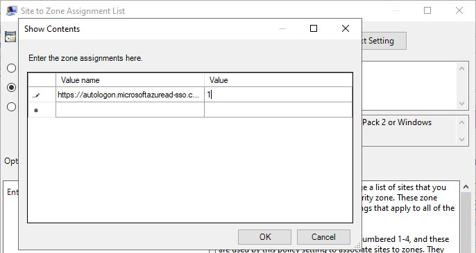
</p>

<p align="center">
  <em>The Site to Zone Assignment List entry mapping `https://autologon.microsoftazuread-sso.com` to zone value `1`, Local intranet.</em>
</p>

<p align="center">
  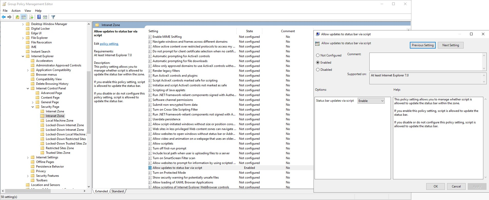
</p>

<p align="center">
  <em>`Allow updates to status bar via script` enabled under the Intranet Zone folder of the Internet Control Panel Security Page.</em>
</p>

Since the GPO carries only User Configuration settings, its Computer Configuration half was disabled (`GPO Status: Computer configuration settings disabled`), matching the split `Standard-User-Environment` and `IT-Admin-Environment` already use in this environment rather than leaving an unused half active on it:

<p align="center">
  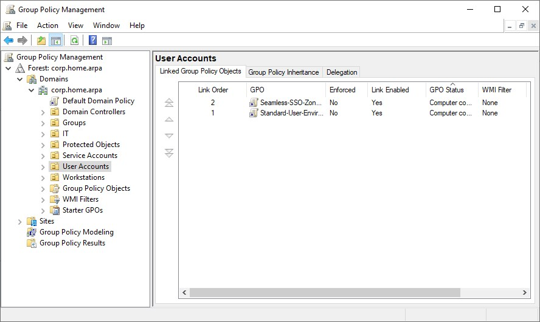
</p>

<p align="center">
  <em>`Seamless-SSO-Zone-Configuration` linked to `OU=User Accounts` alongside `Standard-User-Environment`, both links enabled and both GPOs carrying computer configuration settings disabled.</em>
</p>

Validation ran from WIN11-CLIENT01, logged on as `testuser01` in an ordinary, non-elevated command prompt; `gpresult /r` reports on whoever is actually logged on to the current session and needs no elevation to do so, unlike the automation track's `Get-GPResultantSetOfPolicy -User` cmdlet, which targets an arbitrary named account and does require it:

```
C:\Users\testuser01>gpupdate /force
Updating policy...

Computer Policy update has completed successfully.
User Policy update has completed successfully.

C:\Users\testuser01>gpresult /r
...
RSOP data for CORP\testuser01 on WIN11-CLIENT01 : Logging Mode
----------------------------------------------------------------
    CN=testuser01,OU=User Accounts,DC=corp,DC=home,DC=arpa
    Group Policy was applied from:      DC01.corp.home.arpa

    Applied Group Policy Objects
    -----------------------------
        Standard-User-Environment
        Seamless-SSO-Zone-Configuration
...
```

Both GPOs applied cleanly to `testuser01` from `OU=User Accounts`, with nothing filtered out.

`Standard-User-Environment`'s restriction on Control Panel access for `testuser01` (enterprise Lab 05) ruled out the usual GUI confirmation of the zone assignment at `Internet Options > Security > Local intranet > Sites`; that finding and the pivot it required are recorded in Troubleshooting and Adjustments below. In its place, the effective values were confirmed directly against the registry locations these two ADMX policies actually write to, both readable non-elevated as `testuser01` since they land under `HKEY_CURRENT_USER`:

```
C:\Users\testuser01>reg query "HKCU\Software\Policies\Microsoft\Windows\CurrentVersion\Internet Settings\ZoneMap\Domains\microsoftazuread-sso.com\autologon"

HKEY_CURRENT_USER\Software\Policies\Microsoft\Windows\CurrentVersion\Internet Settings\ZoneMap\Domains\microsoftazuread-sso.com\autologon
    https    REG_DWORD    0x1

C:\Users\testuser01>reg query "HKCU\Software\Policies\Microsoft\Windows\CurrentVersion\Internet Settings\Zones\1" /v 2103

HKEY_CURRENT_USER\Software\Policies\Microsoft\Windows\CurrentVersion\Internet Settings\Zones\1
    2103    REG_DWORD    0x0
```

Both matched what the GPO specified: `1` (Local intranet) for the zone assignment, and `0` (Enabled) for value `2103`, the status bar script policy's actual identity inside `inetres.admx`, distinct from an adjacent value name the same template defines for an unrelated setting.

With the policy confirmed applied and its effective values confirmed correct, `klist purge` cleared cached tickets and `testuser01@brindeck.com` was signed in at `https://myapps.microsoft.com`. Sign-in completed straight to the Apps dashboard once the username was entered, no password prompt at all:

<p align="center">
  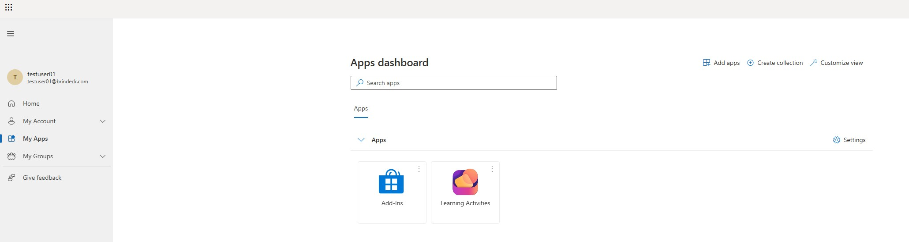
</p>

<p align="center">
  <em>`testuser01@brindeck.com` landing on the My Apps dashboard, reached with no password prompt at all.</em>
</p>

`klist`, run immediately after, showed a second cached ticket beyond the expected `krbtgt` TGT: a service ticket for `HTTP/autologon.microsoftazuread-sso.com`, confirming the Kerberos negotiate against the intranet-zoned endpoint actually happened rather than inferring it from the smooth sign-in alone:

```
C:\Users\testuser01>klist
...
#1>     Client: testuser01 @ CORP.HOME.ARPA
        Server: HTTP/autologon.microsoftazuread-sso.com @ CORP.HOME.ARPA
        KerbTicket Encryption Type: AES-256-CTS-HMAC-SHA1-96
        Ticket Flags 0x40a10000 -> forwardable renewable pre_authent name_canonicalize
        Session Key Type: AES-256-CTS-HMAC-SHA1-96
        Kdc Called: DC01.corp.home.arpa
```

That ticket's encryption type, AES-256-CTS-HMAC-SHA1-96, is the same type Step Eight-A set explicitly on `AZUREADSSOACC`'s Kerberos key. This is that rollover's effect showing up in a live issued ticket, not only in the account's configured property.

The plan's caution about a silent, indistinguishable failure mode did not end up applying: the result was unambiguous, both in the smooth sign-in itself and in the independent `klist` confirmation of the ticket exchange behind it, so there was no negative result requiring the honest-reporting caveat the plan anticipated.

### Step Nine: Observed the cycle, then broke it on purpose

**Confirmed Duplicate Attribute Resiliency was actually enabled before inducing anything.** If it were off, an incoming UPN collision fails the whole object instead of quarantining one attribute, and the rest of this step would need a different design entirely. `Connect-Entra` was used for this and for every diagnostic step below rather than the Graph SDK cmdlets ADR-019 names elsewhere: `Connect-Entra` is a published alias for `Connect-MgGraph` in the `Microsoft.Entra.Authentication` module, the same Graph plumbing with friendlier cmdlet names layered on top, so it is not a deviation from the Graph-first design, only a more readable surface for interactive, one-off diagnosis. The deprecated `Get-MsolDirSyncProvisioningError`, from the retired MSOnline module, was deliberately not used. Getting `Connect-Entra` to authenticate at all fought through real tooling friction, recorded in Troubleshooting and Adjustments. Once connected:

```powershell
Get-EntraDirSyncFeature -Feature QuarantineUponUpnConflict
```

returned `True`:

<p align="center">
  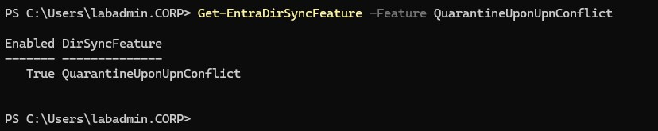
</p>

<p align="center">
  <em>`Get-EntraDirSyncFeature` returning `True` for `QuarantineUponUpnConflict`, the cmdlet's actual accepted name for Duplicate Attribute Resiliency.</em>
</p>

This is the actual accepted feature name; Microsoft's own conceptual documentation calls the same feature `DuplicateUPNResiliency`, which the cmdlet rejects outright, a genuine naming drift also recorded in Troubleshooting and Adjustments. With confirmation in hand, the narrative below is the one the plan anticipated, not the alternate one a disabled feature would have forced.

**Letting the scheduler run unattended surfaced a real defect: it had never run since installation.** `Get-ADSyncScheduler` showed `SyncCycleEnabled: False`. Synchronization Service Manager's Operations tab confirmed how long that had been true: the last recorded activity was the pair of Exports that closed the installation's own forced cycle on the day Entra Connect was installed, and the next entry after it was the one just forced manually, a full week later, with nothing in between. The state itself was not new information and only its duration was, because the installer had already reported it on the Configuration complete screen in Step Five, in the same list as the TPM and Recycle Bin recommendations, where it went unread.

<p align="center">
  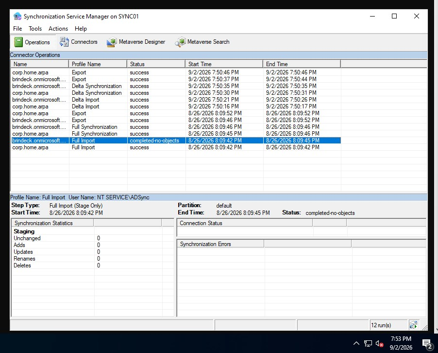
</p>

<p align="center">
  <em>The Operations tab showing the gap: the installation's own cycle on 8/26/2026 and the manually forced cycle on 9/2/2026, a full week later, with nothing in between.</em>
</p>

Every change synchronized in this lab up through Step Eight had reached the tenant only because it happened to be pulled in by a manually forced cycle or the installation's own initial sync, never by the scheduler doing its job unattended. `Set-ADSyncScheduler -SyncCycleEnabled $true` corrected it, and a forced `Start-ADSyncSyncCycle -PolicyType Delta` afterward confirmed a live cycle: `SyncCycleInProgress: True` and a `NextSyncCycleStartTimeInUTC` refreshed to thirty minutes out, matching `AllowedSyncCycleInterval`. This is now a standing fact worth carrying into Step Ten's finished-state validation, not only a Step Nine finding.

**Created a disposable, unprivileged cloud-only user as the collision target, per the plan change agreed before this step began.** All three existing cloud-only accounts in the tenant are Global Administrator-tier, including the emergency access account, and none of them was an acceptable thing to collide on purpose. A new cloud-only user, `duptest01@brindeck.com`, was created directly in the Entra admin center instead, with no administrative role assignments. Two on-premises test accounts, `duptest01` and `duptest02`, were then provisioned with `New-LabUser.ps1` in `OU=User Accounts`, which derives their UPN suffix as `brindeck.com` for that OU automatically.

**The first collision attempt reproduced UPN soft match, not Duplicate Attribute Resiliency.** Syncing the new on-premises `duptest01` in, sharing a UPN with the cloud-only `duptest01` created moments earlier, did not quarantine anything. The Entra object that had been a bare cloud-only user was, after the sync, showing a real distinguished name and a populated immutable ID:

<p align="center">
  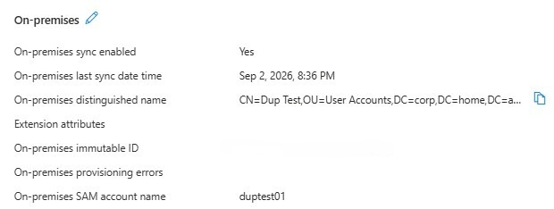
</p>

<p align="center">
  <em>The cloud-only `duptest01` after the sync, absorbed rather than flagged: `On-premises sync enabled: Yes`, a real on-premises distinguished name, a populated immutable ID, and no provisioning errors recorded.</em>
</p>

Its group membership had also picked up `Domain-Users-Standard`, sourced from Windows Server AD according to the Groups tab, on an object that should have had no on-premises source at all: it had been absorbed rather than flagged. This is UPN soft match doing exactly what it is designed to do: it has been on by default for organizations that began synchronizing on or after 30 March 2016, and a cloud-only object with no immutable ID set is precisely the case it is built to reconcile as the same identity rather than treat as a conflict. It is a genuinely different mechanism from Duplicate Attribute Resiliency, and this is the near miss that clarified the distinction rather than a wasted attempt.

**The second attempt was blocked one layer lower, by Active Directory itself.** With the on-premises `duptest01` now the object actually holding that UPN, a second on-premises account, `duptest02`, was set to the same value directly:

```
PS C:\Program Files\Microsoft Azure Active Directory Connect> Set-ADUser -Identity duptest02 -UserPrincipalName "duptest01@brindeck.com"
Set-ADUser : The operation failed because UPN value provided for addition/modification is not unique forest-wide
At line:1 char:1
+ Set-ADUser -Identity duptest02 -UserPrincipalName "duptest01@brindeck ...
+ ~~~~~~~~~~~~~~~~~~~~~~~~~~~~~~~~~~~~~~~~~~~~~~~~~~~~~~~~~~~~~~~~~~~~~
    + CategoryInfo          : NotSpecified: (duptest02:ADUser) [Set-ADUser], ADException
    + FullyQualifiedErrorId : ActiveDirectoryServer:8648,Microsoft.ActiveDirectory.Management.Commands.SetADUser
```

Active Directory enforces UPN uniqueness across the whole forest for its own objects, but has no visibility into Entra's cloud-only namespace, which is exactly why a bare cloud-only object, not another on-premises object, is the only viable collision target in a single-forest lab like this one.

**Disabling soft match and retargeting a fresh cloud-only stub produced a genuine quarantine.** `Set-EntraDirSyncFeature -Features 'BlockSoftMatch' -Enable $true` turned the resolution mechanism off, a reversible toggle rather than the permanent commitment `EnableSoftMatchOnUpn` would have been. A new bare cloud-only object, `duptest03@brindeck.com`, was created with no immutable ID, and `duptest02`'s on-premises UPN was retargeted at it. The following delta cycle's export reported success and the Operations tab showed the same zero-updates result on later cycles, no retry, no error surfaced anywhere in the synchronization client. The evidence lived entirely in the tenant: `duptest02`'s on-premises provisioning errors link on its Entra profile led to one recorded conflict.

<p align="center">
  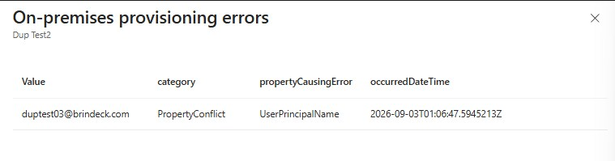
</p>

<p align="center">
  <em>`duptest02`'s on-premises provisioning error record in the tenant: a single `PropertyConflict` on `UserPrincipalName` for the rejected value `duptest03@brindeck.com`.</em>
</p>

This is worth being precise about rather than overclaiming: Duplicate Attribute Resiliency actually has two distinct presentations, a new object provisioned with a placeholder UPN in the `<prefix>+<4digits>@<tenant>.onmicrosoft.com` format, and an update conflict on an already-synced object, which rejects the incoming value, keeps the last known good UPN, and logs the rejection exactly as shown above. What this collision produced is the second variant; the general documentation's placeholder-format case never came up, because `duptest02` was already a synced object by the time the conflicting UPN reached it, not a new one arriving for the first time. The evidence above, a `PropertyConflict` category against `UserPrincipalName`, was judged sufficient on its own for what this step needed to demonstrate: that Duplicate Attribute Resiliency quarantines silently, without failing the export or logging anything the sync client itself would surface. Querying the same record with `Get-EntraUser` returned a `403 Forbidden`, a scopes gap in that particular `Connect-Entra` session rather than a dead end worth chasing further, since the portal had already answered the question.

**Recovery corrected the UPN immediately; the logged conflict record cleared on its own delayed schedule.** Reverting `duptest02`'s on-premises UPN and forcing a delta sync fixed the attribute in the tenant right away, confirmed on the next check. The provisioning error record itself did not clear in that same check, consistent with the plan's warning that a background task in Entra de-quarantines resolved conflicts hourly rather than immediately on the next sync, and an unclearing record at that point was not a sign recovery had failed. It cleared roughly twenty-six minutes later, faster than the full hour the plan anticipated, worth recording as a real data point: the hourly sweep evidently is not anchored to the moment the conflict was created. `BlockSoftMatch` itself was reverted as part of the same cleanup, `Set-EntraDirSyncFeature -Features 'BlockSoftMatch' -Enable $false` confirmed back to `False`: it is a tenant-wide setting Microsoft treats as a temporary measure, not a lab artifact, and leaving it on would have changed how every future object in the tenant reconciles, well past what this step needed to demonstrate.

**Cleanup left one deliberate fixture behind rather than a clean slate.** Both on-premises test objects, `duptest01` and `duptest02`, were deleted outright with `Remove-ADUser` rather than `Remove-LabUser.ps1`, which is built only to disable and offboard an account, not remove the AD object itself, making it the wrong tool for scaffolding meant to disappear entirely; using `Remove-ADUser` directly instead is the same approach Step Four's stray-object cleanup already established. A final forced export confirmed two deletes and one update with no errors. The one surviving object, the cloud-only `duptest03`, was kept rather than deleted, and renamed to `cloudonly-demo01@brindeck.com` with the display name `Cloud-Only Demo Account (Lab 03 fixture)`. The disposition is forward-justified rather than leftover debris: ADR-019 Design Decision 6 is what put two of the tenant's three existing cloud-only accounts at Global Administrator tier, `admin@brindeck.com` and the break-glass emergency access account (the third, the original Microsoft 365 signup account, keeps Global Administrator for the separate subscription-ownership reason Lab 01 recorded); all three, for their own reasons, were equally off-limits as a collision target, which is why a disposable cloud-only object had to exist at all. Lab 03 needs a safe, unprivileged cloud-only object to contrast against a synchronized one, and this account, having already served its purpose here, is the only alternative to reusing one of the tenant's three Global Administrator-tier accounts for that comparison. The second failure mode held in reserve during planning, stopping the ADSync service or severing `SYNC01`'s outbound connectivity, was never needed: the collision above produced substantially more diagnostic material than a loud failure would have.

### Step Ten: Validated the environment was otherwise unchanged, and recorded the finished state

DC01, WIN11-CLIENT01, Ubuntu Server, and the Wazuh agents were confirmed still behaving as the earlier tracks documented, and a run of the automation library's health report and Pester suite closed out the automation side, all described in Validation below. The scheduler finding from Step Nine got its actual proof here rather than a restated assertion: three consecutive Delta cycles landed on their own, roughly thirty minutes apart, with nobody running `Start-ADSyncSyncCycle` at any point in between.

<p align="center">
  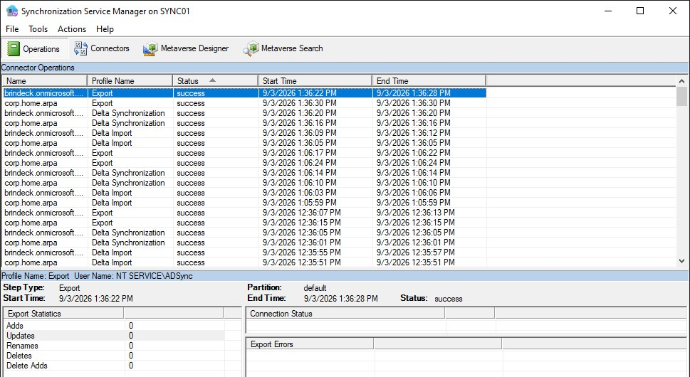
</p>

<p align="center">
  <em>Synchronization Service Manager's Operations tab on SYNC01, showing three Delta cycles roughly thirty minutes apart with no forced cycle in between, the scheduler genuinely running unattended after Step Nine's fix.</em>
</p>

---

## Validation

**DC01, WIN11-CLIENT01, and Ubuntu Server behaved exactly as the earlier tracks documented, with nothing this lab touched degrading anything nearby.** `Test-ComputerSecureChannel -Verbose` from WIN11-CLIENT01 reported `True` and confirmed the secure channel to `corp.home.arpa` in good condition. `gpresult /r`, run as `labadmin` after a forced `gpupdate`, showed `IT-Admin-Environment` applying cleanly from DC01 with nothing filtered, correct for an account in `OU=IT` rather than `OU=User Accounts`. On Ubuntu Server, `sssd` was active and had been running continuously for over a week, and `kinit testuser01@CORP.HOME.ARPA` issued a fresh TGT without incident. The Wazuh dashboard showed all four agents, DC01, WIN11-CLIENT01, SYNC01, and UBUNTU-SERVER, `Active`, none disconnected or pending.

**The automation library's health report returned `Healthy` on every check, but one of those checks had never actually been able to see `SYNC01`.** `Invoke-LabHealthReport.ps1`, run clean from `C:\Scripts` on WIN11-CLIENT01, returned `ADServiceHealth`, `WazuhAgentStatus`, and `DockerServiceStatus` all `Healthy`, `Overall: Healthy`.

<p align="center">
  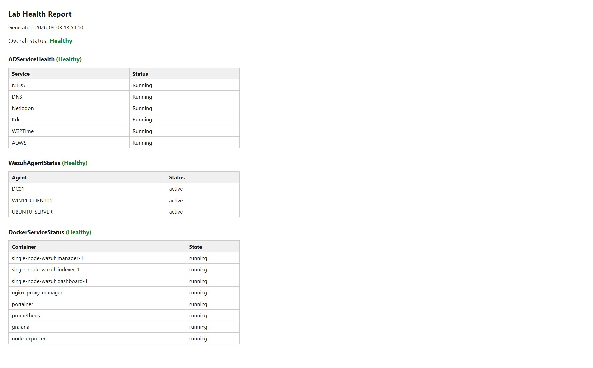
</p>

<p align="center">
  <em>The finished-state health report: all three checks and the overall status Healthy.</em>
</p>

Two things carry forward from this lab instead of being fixed in it, and they are not the same weight. `Get-LabWazuhAgentStatus.ps1`'s default `-AgentName` list, `DC01`, `WIN11-CLIENT01`, and `UBUNTU-SERVER`, dates from Automation Lab 05, written before `SYNC01` existed, so the scheduled `WazuhAgentStatus` check has never asked about `SYNC01` at all, and this lab is what made `SYNC01` a host worth asking about. The daily health report has been reporting `Healthy` the entire time without checking the one machine the tenant's entire synchronization now depends on, which is the same shape as the defect [Linux Lab 06](../linux-infrastructure/06-monitoring-stack-lab.md) was revised for: Node Exporter reported a successful Prometheus scrape while it had no access at all to the host's filesystem, disk, or kernel metrics, a green result covering a real gap in what was being watched rather than a false green result. Called directly with the list overridden, `Get-LabWazuhAgentStatus -AgentName DC01,WIN11-CLIENT01,UBUNTU-SERVER,SYNC01` returned all four `active`, so `SYNC01`'s Wazuh enrollment itself is fine; what carries forward is that the scheduled report cannot see that on its own, and it will keep reporting `Healthy` over that blind spot until the default agent list is fixed. Of the two, this is the one with live consequences. Second, and minor by comparison: `Get-LabDockerServiceStatus.ps1`'s own documentation describes authenticating "with the Portainer admin account," but the account that actually authenticates is a personal, non-`admin`-named account; a 422 from Portainer's `POST /api/auth` is what that platform returns for an unrecognized login, not a malformed request, and it briefly read as a credential problem for that reason. Nothing depends on that mismatch the way the health report depends on its agent list, so it carries forward as a documentation correction rather than a live gap.

`Invoke-Pester -Path C:\Scripts -Output Detailed`, the full thirteen-script suite, passed all 174 tests, 0 failed, 0 skipped, matching Step Four's count exactly with no drift since. The repository READMEs already carry 174, propagated when Steps One through Seven were reflected across the repo; the 172 figures that remain are historical statements about the close of Automation Lab 05 rather than stale ones.

<p align="center">
  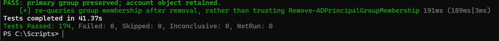
</p>

<p align="center">
  <em>The full thirteen-script Pester suite: 174 tests passed, 0 failed.</em>
</p>

**Entra Connect's version and source anchor were unchanged since Step Five, reconfirmed here as part of the finished state, and the scheduler was checked before anything else was touched, deliberately, so that "still `True`" would not be taken on faith the way it was before Step Nine caught it.** `SYNC01` continued running Entra Connect Sync 2.6.84.0 against `ms-DS-ConsistencyGuid` as the source anchor. `Get-ADSyncScheduler`, run before any command capable of forcing a cycle, showed `SyncCycleEnabled: True`, `AllowedSyncCycleInterval: 00:30:00`, `NextSyncCyclePolicyType: Delta`, `StagingModeEnabled: False`, and `SchedulerSuspended: False`. That confirmed the setting; it did not by itself confirm the scheduler was doing anything. What did was watching the Operations tab afterward, shown in Step Ten above: three Delta cycles landed roughly thirty minutes apart with nobody forcing any of them, the actual unattended behavior Step Nine's fix was supposed to produce.

**Object counts reconciled cleanly against the Step Two baseline on both sides, once the lab's own known provisioning and Step Nine's cleanup were accounted for.** On-premises, queried from WIN11-CLIENT01:

| Organizational Unit | Users | Groups |
|---|---|---|
| `User Accounts` | 6 — `testuser01`, Jane Doe, John Smith, Mary Johnson, Alex Kim, `tsync01` | 0 |
| `IT` | 2 — `labadmin`, `tnosync01` | 0 |
| `Workstations` | 0 | 0 |
| `Groups` | 0 | 4 — `IT-Admins`, `Domain-Users-Standard`, `Lab-Workstations`, `Linux-Admins`, unchanged |
| `Service Accounts` | 1 — `svc-entraconnect` | 0 |
| `Protected Objects` | 0 | 0 |

`Service Accounts` and `Protected Objects` did not exist at Step Two's baseline; both were created during this lab, in Steps Five and Eight-A. Against the original four organizational units Step Two tabulated, the net change is exactly +2 users, 5 in `User Accounts` and 1 in `IT` becoming 6 and 2, with `Groups` unchanged at 4. That is precisely `tsync01` and `tnosync01`, Step Four's two live-proof accounts, and nothing else: Step Nine's `duptest01` and `duptest02`, created and later removed with `Remove-ADUser`, net to zero, confirming their cleanup left no residue.

The tenant, read from the Entra admin center Overview page, held 10 users, 5 groups, 1 application, and 0 devices.

<p align="center">
  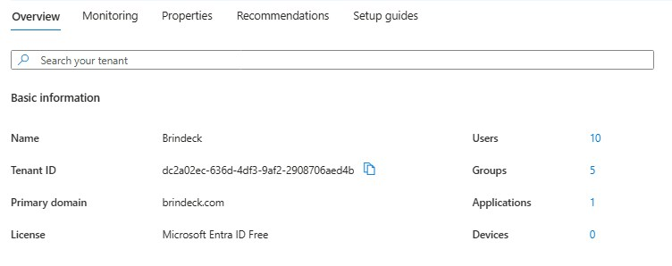
</p>

<p align="center">
  <em>The tenant's finished-state counts: 10 users, 5 groups, 1 application, 0 devices.</em>
</p>

That reconciles exactly. Step Seven's first-synchronization state was 9 users and 5 groups, the Step Two baseline's 3 users and 1 group plus the six on-premises objects and four groups the first cycle brought in. Step Nine's net effect on the tenant was supposed to be +1 user, `cloudonly-demo01`, kept as a deliberate fixture, with `duptest01` and `duptest02` fully gone on both sides and no group changes. 9 + 1 = 10 users, 5 groups unchanged, matching the portal exactly.

The application was the one figure Step Two's baseline did not anticipate at all, 0 apps. It is `ConnectSyncProvisioning_SYNC01_998d03adde72`, an enterprise application created 8/26/2026, the same day Step Five installed Entra Connect Sync on `SYNC01`, not an artifact of anything done in Step Nine or Ten. Entra Connect Sync's Custom installation registers this application in the tenant itself, for its own provisioning use; it was never a manual step in this lab's plan, and confirming it accounted for the count was worth doing directly rather than assuming. Its full name, trailing identifier included, appears here as a deliberate call rather than a redaction miss. The track's policy masks directory object IDs; this is an application display name, and the tenant it belongs to is already published in full under the same policy, because anyone holding `brindeck.com` can resolve the tenant ID from Microsoft's unauthenticated discovery endpoint. The trailing hex gives up nothing the verified domain does not.

<p align="center">
  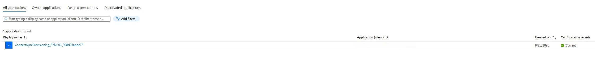
</p>

<p align="center">
  <em>The tenant's one Enterprise Application, ConnectSyncProvisioning_SYNC01_998d03adde72, registered automatically by Entra Connect Sync's own installation on 8/26/2026.</em>
</p>

---

## Troubleshooting and Adjustments

### Domain Join Failed Initially Because IPv6 Interfered with DNS Resolution

During Step One, the first attempt to join `SYNC01` to `corp.home.arpa` failed with "An Active Directory Domain Controller (AD DC) for the domain 'corp.home.arpa' could not be contacted," even though the IPv4 address, subnet, gateway, and preferred DNS server (`192.168.1.10`) were all configured correctly.

<p align="center">
  
</p>

<p align="center">
  <em>The first domain join attempt failing with "An Active Directory Domain Controller (AD DC) for the domain 'corp.home.arpa' could not be contacted," with the computer name and domain both entered correctly.</em>
</p>

`ipconfig /all` showed why: alongside the intended IPv4 DNS server, the Ethernet0 adapter also had IPv6 autoconfiguration active, with its own IPv6 addresses and an IPv6 DNS server entry. The mixed IPv4/IPv6 configuration was enough to prevent domain-controller discovery from completing over the intended path.

<p align="center">
  
</p>

<p align="center">
  <em>`ipconfig /all` on SYNC01 showing IPv6 autoconfiguration active on Ethernet0, with its own IPv6 addresses and an IPv6 DNS server entry listed above the intended `192.168.1.10`.</em>
</p>

This is not evidence that IPv6 is broadly incompatible with Active Directory, and it is not a general recommendation to disable it. It is what was actually observed on this host, in this configuration, at this point in setup: a targeted workaround for interference that was diagnosed directly, not an assumption applied on principle. The IPv6 binding was disabled on the Ethernet0 adapter, the DNS cache was flushed and re-registered, and domain-controller discovery was verified directly before retrying the join:

```powershell
Disable-NetAdapterBinding -Name "Ethernet0" -ComponentID ms_tcpip6
ipconfig /flushdns
ipconfig /registerdns
Get-DnsClientServerAddress
nltest /dsgetdc:corp.home.arpa
```

`Get-DnsClientServerAddress` confirmed the IPv4 DNS server was `192.168.1.10` with no IPv6 server configured, and `nltest /dsgetdc:corp.home.arpa` located `\\DC01.corp.home.arpa` at `192.168.1.10` successfully:

<p align="center">
  
</p>

<p align="center">
  <em>IPv6 disabled on Ethernet0 and DNS re-registered: `Get-DnsClientServerAddress` shows only the IPv4 server `192.168.1.10`, and `nltest /dsgetdc:corp.home.arpa` locates DC01 successfully.</em>
</p>

The domain join was retried immediately afterward and completed without further issue.

### Ubuntu Server's DNS Override From Lab 06 Had Never Actually Taken Effect

Confirming Kerberos for a retargeted user (Step Three) failed with `kinit: Cannot find KDC for realm "CORP.HOME.ARPA"`. `resolvectl status` showed DC01 present in `eno2`'s candidate DNS server list but not selected as current, and `dig SRV _kerberos._tcp.corp.home.arpa` came back `NXDOMAIN` against whichever server was actually being asked.

The cause traced back further than the immediate symptom. `/etc/netplan/00-installer-config.yaml` contained two `network:` mappings concatenated in one file: the DC01 nameserver override [Lab 06 of the enterprise infrastructure track](../enterprise-infrastructure/06-linux-ad-integration-lab.md) documented adding, immediately followed, with no line break, by the original Subiquity-installer content that override was supposed to replace. YAML does not define what happens when the same top-level key appears twice in one mapping, and the parser in use resolved it by keeping the later occurrence: the original block, with no static nameserver and both `dhcp4` and `dhcp6` enabled. Lab 06's fix had likely never been live since the day it was written. This host has been resolving DNS purely through DHCP the entire time, and it worked anyway only because DC01 happens to be one of the servers this network's DHCP scope hands out; `systemd-resolved` simply hadn't failed over to the other DHCP-supplied candidate, the router, until now.

The file was replaced outright with a single clean mapping, rather than patched, to remove the ambiguity entirely:

```yaml
network:
  ethernets:
    eno2:
      dhcp4: true
      dhcp4-overrides:
        use-dns: false
      dhcp6: false
      accept-ra: false
      match:
        macaddress: xx:xx:xx:xx:xx:xx  # redacted; matches this host's real NIC address in the actual config
      set-name: eno2
      nameservers:
        addresses:
          - 192.168.1.10
  version: 2
  wifis: {}
```

`sudo netplan try` applied it, dropping the active SSH session briefly, consistent with the interface actually being reconfigured rather than nothing changing, and `dig SRV _kerberos._tcp.corp.home.arpa` returned `NOERROR` with the correct record afterward. One detail is left unresolved rather than papered over: `resolvectl status` still lists the router and an IPv6 address alongside DC01 in `eno2`'s DNS Servers candidate list even after `dhcp4-overrides.use-dns: false` and `accept-ra: false`, though `Current DNS Server` and every subsequent query correctly use DC01. IPv6 Router Advertisements populating that field through a path the override doesn't fully close is the likely explanation, but it was not confirmed.

This is the same category of failure [Lab 04](../enterprise-infrastructure/04-domain-client-lab.md) diagnosed on WIN11-CLIENT01 (a competing DNS path lacking the AD-integrated zones) and Lab 06 diagnosed on this same host originally (DHCP handing out only the router), just one step further back: a fix that adds the correct server without removing the competing ones is still an incomplete fix.

### Synchronization Service Manager's Container Picker Failed on a Known Defect in Version 2.6.84.0

Confirming the OU filter for Step Six's scope verification meant opening the `corp.home.arpa` connector's properties in Synchronization Service Manager and selecting **Containers...** on the **Configure Directory Partitions** page. That failed immediately with a .NET resource-loading error: "An error was encountered while selecting containers: Could not find any resources appropriate for the specified culture or the neutral culture... 'Microsoft.DirectoryServices.MetadirectoryServices.UI.ContainerPicker.ContainerPickerControl.resources' was correctly embedded or linked into assembly 'ContainerPicker'..."

<p align="center">
  
</p>

<p align="center">
  <em>Synchronization Service Manager failing to open the Container Picker with a .NET culture resource error, the `DC=corp,DC=home,DC=arpa` directory partition listed correctly behind it.</em>
</p>

This is a confirmed defect in this specific build rather than anything wrong with the environment. Microsoft's own community forum has a thread on exactly this version and error, a missing localized resource for the Container Picker control, confirmed by Microsoft support, with directory connectivity itself unaffected; the wizard can enumerate OUs correctly elsewhere, only this one dialog in Sync Service Manager is broken. Their recommended workaround is the supported path this lab already relies on for OU filtering: the installer wizard's own **Domain and OU filtering** page rather than Sync Service Manager's picker.

Relaunching the Entra Connect wizard, selecting **Customize synchronization options** from **Additional Tasks**, and returning to **Domain and OU filtering** confirmed the scope correctly: `User Accounts` and `Groups` checked, everything else including the new `Service Accounts` OU unchecked, with no changes made and the wizard exited without reaching **Configure**.

<p align="center">
  
</p>

<p align="center">
  <em>The installer wizard's own Domain and OU filtering page confirming the scope: `Groups` and `User Accounts` checked, everything else including the new `Service Accounts` OU unchecked.</em>
</p>

Since the OU filter had already been set correctly through the installer wizard during Custom setup, not through Sync Service Manager, this defect never called the actual configuration into question, only the one tool available to view it after the fact.

### The Protected Objects OU's ACL Needed Two Corrected Passes, Not the One From the Security Tab

Getting Full control on `OU=Protected Objects` down to Domain Admins, Enterprise Admins, Administrators, and SYSTEM only did not work on the first attempt, and the reason changed twice before it was actually right.

Right after creation, before any change, the OU's own `dsacls` showed the ordinary default for a brand-new OU under this domain: `Domain Admins` (added at creation via `New-ADOrganizationalUnit`, not inherited), plus `Enterprise Admins`, `Administrators`, `Pre-Windows 2000 Compatible Access`, `Key Admins`, and `Enterprise Key Admins`, all tagged `<Inherited from parent>`, and, notably, `BUILTIN\Account Operators` (create/delete child on `computer`, `user`, `group`, `inetOrgPerson`) and `BUILTIN\Print Operators` (create/delete child, scoped to `printQueue` only) present with no inheritance tag at all:

```text
Allow BUILTIN\Account Operators       SPECIAL ACCESS for computer
                                      CREATE CHILD
                                      DELETE CHILD
Allow BUILTIN\Print Operators         SPECIAL ACCESS for printQueue
                                      CREATE CHILD
                                      DELETE CHILD
```

The first attempt to fix this used the Security tab's basic checkbox to uncheck "Include inheritable permissions from this object's parent," and it did not take: a follow-up `dsacls` showed every `<Inherited from parent>` entry from before still present, unchanged, alongside a `CORP\Domain Admins FULL CONTROL` entry with no tag, meaning the dialog had added an entry rather than replacing anything.

The correct path is in Advanced Security Settings specifically: **Disable inheritance**, then **Remove all inherited permissions from this object** (not convert). That did strip every `<Inherited from parent>` entry, confirmed by `{This object is protected from inheriting permissions from the parent}` appearing in the next `dsacls` output. But `BUILTIN\Account Operators` and `BUILTIN\Print Operators` were still sitting there afterward, unaffected, because they were never inherited to begin with: they are explicit entries baked into the OU and `computer` object classes' own schema-defined default security descriptors, the same ones that appeared with no tag in the very first snapshot. Disabling inheritance only strips inherited entries, so this pass could only ever have left them behind. They were removed directly instead:

```powershell
dsacls "OU=Protected Objects,DC=corp,DC=home,DC=arpa" /R "BUILTIN\Account Operators" "BUILTIN\Print Operators"
```

One more correction was needed after that: re-adding `Enterprise Admins` and `Administrators` through the Advanced Security Settings **Add** dialog had only checked a narrower permission set (read permissions, list contents, write/read property) rather than **Full control**, the checkbox that also selects everything beneath it. Both were corrected to Full control to match `Domain Admins` and `SYSTEM`. The final, clean `dsacls` output is in Step Eight-A above.

### Establishing the Seamless SSO Authentication Context Fought Through Browser Configuration on SYNC01

Getting `New-AzureADSSOAuthenticationContext` to actually render a sign-in window on `SYNC01` took working through Internet Explorer Enhanced Security Configuration, an uninitialized per-user Internet Explorer profile, and the module's embedded browser control needing several Microsoft sign-in domains added to Trusted Sites, none of which reflects anything about this lab's own configuration.

### `Standard-User-Environment`'s Control Panel Restriction Redirected Zone Validation to the Registry

Step Eight-B's plan assumed the usual GUI confirmation of a Site to Zone Assignment List entry, `Internet Options > Security > Local intranet > Sites > Advanced` on WIN11-CLIENT01. `Standard-User-Environment`, applied to `testuser01` from enterprise Lab 05, restricts that account's Control Panel access, closing off that path entirely, `inetcpl.cpl` simply would not open. The two settings were confirmed instead directly against the registry locations the underlying ADMX policies actually write to (`HKCU\...\ZoneMap\Domains\microsoftazuread-sso.com\autologon` and `HKCU\...\Zones\1`, value `2103`), both readable non-elevated as `testuser01` himself since they land under `HKEY_CURRENT_USER`. If anything, this produced more precise evidence than the GUI check would have, an exact registry value rather than a visual read of whether a listbox entry is greyed out.

### `Connect-Entra` Would Not Authenticate Until Security Defaults' Device Code Block Was Worked Around

Installing `Microsoft.Entra` failed first, on a module clobber conflict with an already-installed `Microsoft.Entra.CertificateBasedAuthentication 1.3.0`, both real v1.0 releases rather than the beta-versus-stable conflict Microsoft's own documentation frames this error around; `Install-Module Microsoft.Entra -Scope CurrentUser -AllowClobber -Force` resolved it. `Connect-Entra` then crashed outright immediately after its WAM broker warning, "process exited with code 2," a broker window-handle failure common to embedded or remoted terminal sessions. Falling back to `-UseDeviceCode` traded that crash for a different failure: "Your sign-in was successful but you don't have permission to access this resource," which is Security Defaults blocking the device code flow outright, exactly as ADR-019 Design Decision 6 anticipates for this tenant's administrative model. `Set-MgGraphOption -DisableLoginByWAM $true` was set and the interactive flow retried, and it succeeded, but the tool's own printed output states this setting is a no-op with the default Microsoft-owned client ID, so what actually changed between the crash and the successful retry was not conclusively identified. It is recorded honestly as an unresolved detail rather than credited to a fix that cannot be confirmed to have taken effect.

### `Get-EntraDirSyncFeature`'s Accepted Feature Name Does Not Match Microsoft's Own Documentation

`Get-EntraDirSyncFeature -Feature DuplicateUPNResiliency`, the name Microsoft's conceptual documentation uses for this feature, failed with "Invalid value for parameter." The cmdlet's actual accepted value, found only by searching past the conceptual article to the cmdlet reference itself, is `QuarantineUponUpnConflict`. This is a genuine naming drift between the retired MSOnline module's documentation generation and the current `Microsoft.Entra.DirectoryManagement` module, not a misconfiguration in this environment, and it cost real time before the mismatch was recognized as the actual problem.

---

## Security Considerations

This lab introduced the environment's first path from the local network to a cloud directory, and most of what follows is a consequence of that.

The synchronization account is the most consequential new credential in the environment. Entra Connect creates an Active Directory connector account for reading the directory, and password hash synchronization requires it to hold Replicate Directory Changes and Replicate Directory Changes All. Those rights are what allow it to request password hashes from a domain controller over the standard replication protocol. An account with directory replication rights is a high-value target by definition, and it lives on `SYNC01` rather than on the domain controller, which is precisely why ADR-019 put the synchronization engine on a host whose compromise does not begin at the identity foundation.

Password hash synchronization sends a hash of the on-premises password hash rather than the password or the original hash, and cloud authentication is then evaluated entirely in the cloud. This is why the method was chosen: it adds no inbound path and no on-premises dependency at sign-in. It also means the cloud directory now holds derived credential material for every synchronized user, which the tenant's administrative controls from Lab 01 are what protect.

Seamless single sign-on introduces a computer account, `AZUREADSSOACC`, whose Kerberos decryption key is shared with Microsoft Entra ID. Microsoft's guidance is explicit that this account "needs to be strongly protected," that "only Domain Admins should be able to manage the computer account," that Kerberos delegation on it must be disabled, and that it should be stored where accidental deletion is unlikely. Its key should be rolled at least every thirty days, and nothing does that automatically.

The synchronization scope is itself a security decision. Excluding `IT` keeps the environment's privileged on-premises identity out of the cloud directory entirely, so neither compromise reaches across. That is the on-premises mirror of ADR-019's decision to keep the tenant's administrators cloud-only, and the two together mean privilege on either side of the boundary does not imply privilege on the other.

One filtering behavior is worth treating as an operational hazard rather than a configuration detail. Objects that fall out of synchronization scope after having been synchronized are deleted in the cloud, and Microsoft warns specifically that renaming a synchronized organizational unit changes its distinguished name, drops it from scope, and "can potentially cause an unexpected mass deletion of objects in Microsoft Entra ID." The organizational unit names in this environment are stable, but the hazard is recorded here because the trigger is an ordinary administrative action with a wildly disproportionate result.

Identifier handling follows the policy the [track README](README.md) sets. On-premises identifiers already documented across the enterprise and automation tracks continue to appear; new cloud-side object identifiers are masked in screenshots on the same terms Lab 01 established.

---

## Outcome

This lab connected the two directories that had no relationship until it did: `corp.home.arpa` on-premises, which remains authoritative, and the Microsoft Entra tenant it now projects a scoped subset of itself into. `SYNC01` was built as a dedicated Windows Server 2022 member server, joined to `corp.home.arpa` and hosting Entra Connect Sync 2.6.84.0 against `ms-DS-ConsistencyGuid` as the source anchor, installed Custom and scoped to `User Accounts` and `Groups`, with `IT` and `Workstations` deliberately excluded. `brindeck.com` was added as a routable user principal name suffix before the first synchronization ran, and `New-LabUser.ps1` was updated to derive it automatically for accounts created in a synchronized organizational unit, under PSScriptAnalyzer and its Pester suite.

Password hash synchronization and seamless single sign-on were both validated end to end: `testuser01@brindeck.com` authenticated to a cloud service with his on-premises password, and later signed in to `myapps.microsoft.com` with no password prompt at all, a Kerberos ticket confirmed by `klist`. `AZUREADSSOACC` was relocated into a new, delegation-restricted `OU=Protected Objects` once its original OU's default administrative permissions, rather than its Group Policy scoping, were identified as the actual exposure.

Step Nine turned two of the lab's planned objectives into genuine findings rather than narrated behavior. The scheduler check found `SyncCycleEnabled: False` since installation, meaning every change synchronized through Step Eight had reached the tenant only by a manually forced cycle or the initial install sync; fixed, and Step Ten confirmed the fix held by watching three unattended Delta cycles land on their own roughly thirty minutes apart, nobody forcing anything. The deliberate failure changed its collision target mid-step, from an existing account to a disposable cloud-only fixture, once every existing cloud-only account turned out to be Global Administrator-tier, and the first attempt at it reproduced UPN soft match rather than Duplicate Attribute Resiliency, a near miss that clarified the distinction between the two mechanisms before the actual quarantine was produced and diagnosed.

Step Ten confirmed the rest of the environment held. DC01, WIN11-CLIENT01, and Ubuntu Server behaved exactly as the earlier tracks documented: secure channel, Group Policy application, SSSD and Kerberos, and all four Wazuh agents `Active`. The automation library's health report ran clean, and the full thirteen-script, 174-test Pester suite passed with no drift since Step Four. Finished-state object counts reconciled exactly against the Step Two baseline on both sides: nine users and four groups on-premises, two new organizational units among them, and ten users, five groups, and one application in the tenant.

Two real gaps in the automation library surfaced along the way and carry forward rather than being fixed here: a stale Wazuh default agent list that leaves the scheduled health report never actually checking `SYNC01`, and a Portainer documentation mismatch describing an account that is not the one that authenticates. Every objective set out for this lab was met.

---

## Lessons Learned

A deliberate temporary state needs the step that ends it planned at the moment it is created. Leaving "Start the synchronization process when configuration completes" unchecked in Step Five was correct, because Step Six had to confirm the organizational unit filter against the live connector before any object crossed the boundary. What was missing was not the judgment but the follow-through: nothing re-enabled the scheduler once the scope was confirmed, so a pause meant to last one step lasted a week. The installer reported the consequence plainly, "Synchronization is currently disabled," and it reported it on a screen headed Configuration complete, in a list with four other bullets, three of which were recommendations to decline. It was read past. The tool did its part and no louder warning was available to it, so the habit worth taking from this is treating a completion screen as a status report rather than a dismissal prompt.

A week of manually forced cycles then kept the environment working, which is what made the assumption comfortable: every change through Step Eight reached the tenant, so nothing observable contradicted a running scheduler. A scheduler's configuration and its behavior are also not the same claim, and only one of them is verifiable by reading a property. `Get-ADSyncScheduler` reporting `SyncCycleEnabled: True` looks identical whether the scheduler is genuinely running or whether every change reaching the tenant is being pulled in by hand; nothing about the setting itself distinguishes the two. Step Nine caught it by reading the Operations tab's history rather than the scheduler's current setting, and Step Ten went further and waited for cycles to land unattended rather than trusting the corrected setting on its own; a configuration flag confirms nothing that an actual observed interval does not.

A default parameter list is a snapshot of the environment on the day it was written, and it goes stale silently as the environment grows around it. `Get-LabWazuhAgentStatus.ps1`'s `-AgentName` default dates from Automation Lab 05, before `SYNC01` existed, so the scheduled health report has been returning `Healthy` this whole time without `SYNC01` ever being asked about at all, not because it was checked and found fine but because it was never in the list to begin with. That is the same shape of defect [Linux Lab 06](../linux-infrastructure/06-monitoring-stack-lab.md) was revised for, a monitoring check whose green result covers a real gap in what it was actually watching rather than reflecting anything checked and confirmed. A tool that reports `Healthy` against a fixed list is only as current as the day that list was written, and a passing run says nothing about what the list never included.

Not every workaround that resolves a failure earns a mechanism to credit. `Connect-Entra` crashed immediately after its WAM broker warning; falling back to `-UseDeviceCode` traded that for a different, Security Defaults-driven failure instead, and setting `Set-MgGraphOption -DisableLoginByWAM $true` before retrying the interactive flow finally worked, but the tool's own printed output states that setting is a no-op with the default Microsoft-owned client ID. Something changed between the crash and the successful retry; what specifically did was never conclusively identified. Recording that honestly as unresolved, rather than writing it up as though `-DisableLoginByWAM` had fixed it, was the more accurate account even though it was less satisfying, and crediting an unverified fix would have been the actual mistake.

Duplicate Attribute Resiliency and UPN soft match are different mechanisms that can produce a similar-looking outcome from the outside, and the first deliberate collision attempt reproduced the wrong one. Syncing an on-premises `duptest01` against a bare cloud-only `duptest01` with no immutable ID did not quarantine anything; it absorbed the cloud-only object outright, exactly what soft match, on by default for any organization that began synchronizing on or after 30 March 2016, is designed to do for an object in that state. Only turning soft match off, by enabling `BlockSoftMatch`, and retargeting a fresh cloud-only stub with no immutable ID produced the actual quarantine this step needed to demonstrate. The near miss was what made the distinction concrete rather than academic: two failure modes that can look alike from the tenant's UI had entirely different causes and entirely different fixes, and only one of them was what this lab set out to document.

---

## Sources

**Deployment prerequisites and installation**

- [Microsoft Entra Connect Sync: Prerequisites](https://learn.microsoft.com/en-us/entra/identity/hybrid/connect/how-to-connect-install-prerequisites) - the domain-joined and full-GUI requirements that rule out WIN11-CLIENT01 and Server Core, the Windows Server 2025 and 2022 recommendation, the hardware table used to size `SYNC01`, the SQL Server Express 100,000-object ceiling, and the Global Administrator requirement for an enabled Connect Health agent
- [Select which installation type to use](https://learn.microsoft.com/en-us/entra/identity/hybrid/connect/how-to-connect-install-select-installation) - that Express synchronizes all objects in all organizational units, and the documented workaround that made Custom the cleaner choice rather than the only one
- [Custom installation of Microsoft Entra Connect](https://learn.microsoft.com/en-us/entra/identity/hybrid/connect/how-to-connect-install-custom) - the domain and organizational unit filtering page, and the source anchor options
- [Microsoft Entra Connect: Accounts and permissions](https://learn.microsoft.com/en-us/entra/identity/hybrid/connect/reference-connect-accounts-permissions) - the Replicate Directory Changes rights password hash synchronization requires, what the installer creates automatically, and the Directory Synchronization Accounts role the running connector account receives
- [Microsoft Entra Connect: Version release history](https://learn.microsoft.com/en-us/entra/identity/hybrid/connect/reference-connect-version-history) - the 30 September 2026 mandatory version deadline, the current 2.6.84.0 release, the twelve-month per-version retirement policy, and that the installer is now distributed only through the Entra admin center

**Design and synchronization behavior**

- [Microsoft Entra Connect: Design concepts](https://learn.microsoft.com/en-us/entra/identity/hybrid/connect/plan-connect-design-concepts) - the source anchor and `ms-DS-ConsistencyGuid`, the wizard's conditional selection logic, and that the choice cannot be changed without uninstalling
- [Microsoft Entra Connect Sync: Scheduler](https://learn.microsoft.com/en-us/entra/identity/hybrid/connect/how-to-connect-sync-feature-scheduler) - the 30-minute default cycle, delta versus full, `Start-ADSyncSyncCycle` and its `Delta` and `Initial` policy types, and the scheduler properties that can be read and changed
- [Password hash synchronization](https://learn.microsoft.com/en-us/entra/identity/hybrid/connect/how-to-connect-password-hash-synchronization) - that password hashes synchronize on a fixed two-minute interval independent of the directory cycle and that the interval cannot be modified
- [Configure filtering](https://learn.microsoft.com/en-us/entra/identity/hybrid/connect/how-to-connect-sync-configure-filtering) - that previously synchronized objects filtered out later are deleted in the cloud, the organizational unit rename mass-deletion hazard, and disabling the scheduler before changing scope

**Sign-in and failure behavior**

- [Microsoft Entra seamless single sign-on](https://learn.microsoft.com/en-us/entra/identity/hybrid/connect/how-to-connect-sso) - what the feature does, and that it works with password hash synchronization
- [Seamless SSO: Quickstart](https://learn.microsoft.com/en-us/entra/identity/hybrid/connect/how-to-connect-sso-quick-start) - the `AZUREADSSOACC` computer account and how to protect it, and the Group Policy Intranet zone configuration including the exact URL and policy path
- [Seamless SSO: Technical deep dive](https://learn.microsoft.com/en-us/entra/identity/hybrid/connect/how-to-connect-sso-how-it-works) - the Kerberos exchange the feature depends on
- [Seamless SSO: FAQ](https://learn.microsoft.com/en-us/entra/identity/hybrid/connect/how-to-connect-sso-faq) - the recommendation to roll the Kerberos decryption key at least every thirty days, and the `Update-AzureADSSOForest` procedure
- [Troubleshoot seamless SSO](https://learn.microsoft.com/en-us/entra/identity/hybrid/connect/tshoot-connect-sso) - that placing the sign-on URL in Trusted Sites rather than Local intranet blocks sign-in
- [Troubleshoot errors during synchronization](https://learn.microsoft.com/en-us/entra/identity/hybrid/connect/tshoot-connect-sync-errors) - the documented error classes, including duplicate attribute and data mismatch conditions
- [Duplicate attribute resiliency](https://learn.microsoft.com/en-us/entra/identity/hybrid/connect/how-to-connect-syncservice-duplicate-attribute-resiliency) - what quarantining an attribute means, and that the export succeeds so the sync client logs no error and does not retry, which is the behavior the induced failure in Step Nine was chosen to expose
- [Microsoft Entra Connect Health for sync](https://learn.microsoft.com/en-us/entra/identity/hybrid/connect/how-to-connect-health-sync) - the synchronization error report, its thirty-minute refresh, and the alerting the Global Administrator installation decision buys
- [Synchronization Service Manager: Operations tab](https://learn.microsoft.com/en-us/entra/identity/hybrid/connect/how-to-connect-sync-service-manager-ui-operations) - reading run status, and the distinction between `success` and a run that completed with errors
- [How to manage Kerberos KDC usage of RC4 for service account ticket issuance: Changes related to CVE-2026-20833](https://support.microsoft.com/en-us/topic/how-to-manage-kerberos-kdc-usage-of-rc4-for-service-account-ticket-issuance-changes-related-to-cve-2026-20833-1ebcda33-720a-4da8-93c1-b0496e1910dc) - what an unset `msDS-SupportedEncryptionTypes` actually falls back to (`DefaultDomainSupportedEncTypes`), and that a patched DC's default for that value changed to `0x18` (AES-SHA1 only) starting 14 April 2026, with enforcement mandatory from July 2026

**Domain preparation**

- [Prepare a non-routable domain for directory synchronization](https://learn.microsoft.com/en-us/microsoft-365/enterprise/prepare-a-non-routable-domain-for-directory-synchronization) - that a non-routable user principal name does not fail but is silently synchronized to the `onmicrosoft.com` domain, which is the reason the suffix work precedes the first synchronization

**Known issues**

- [Entra Connect 2.6.84.0 displays error when trying to configure containers](https://techcommunity.microsoft.com/discussions/microsoft-entra/entra-connect-2-6-84-0-displays-error-when-trying-to-configure-containers/4549077) - confirms the Container Picker resource error in Synchronization Service Manager as a defect specific to this build, and the recommended workaround of using the installer wizard's own OU filtering page instead
