# 03 - Entra ID User, Group, and License Administration

## Status

In progress: Steps One through Six are complete. Steps Seven through Twelve are not started.

The tenant matched the expected baseline in every dimension: Microsoft Entra plan Entra Free, 10 users, 5 groups, 1 application, 0 devices, and a Microsoft 365 Business Basic (no Teams) trial with 1 of 25 licenses assigned, expiring 2026-09-22. Six users and four groups trace to Windows Server AD; the remaining four users and one group are cloud-only. The `AZUREADSSOACC` computer account's Kerberos key was last set 2026-08-31, five days before this baseline, comfortably inside the thirty-day rollover recommendation Lab 02 carried forward.

One decision is taken by this lab that the track had scheduled for later. The Microsoft 365 Business Basic trial question the track README deferred to Lab 04 is resolved here, and it is resolved by trialling rather than buying: a Microsoft 365 Business Premium thirty-day trial was started from inside the existing tenant, bringing Microsoft Entra ID P1 with it. It was accepted without a second-trial refusal, landed on the with-Teams line, and now shows recurring billing off, expiring 2026-10-05. The tenant's Microsoft Entra plan reports Entra ID Premium P1, security defaults remains enabled, and no conditional access policy exists, so the thirty-day clock is running with the lab's scope guard intact. Microsoft Entra ID P1, Exchange Online Plan 1, and Microsoft Intune Plan 1 are all confirmed present on the trial SKU by name, the last two via Microsoft Graph PowerShell rather than either admin center's UI, which does not expose them pre-assignment; see Troubleshooting and Adjustments. Design Decisions below records why trialling is the right call for this environment rather than a compromise, what it does and does not authorize, and what the thirty-day window does to the shape of the lab.

---

## Overview

Labs 01 and 02 built the hybrid environment. This lab is the first to operate it.

Lab 02 made one identity exist in two directories at once. What it did not ask is what that costs an administrator day to day, and the answer is not visible from either console. A synchronized user and a cloud-only user look nearly identical in the Entra admin center, and they behave differently under almost every administrative action: editing attributes, changing group membership, assigning licenses, and above all deleting and restoring. The tenant does not label the difference in the places it matters most, which is why an administrator who does not already know which object is which will make changes that silently fail, or that succeed and are then reverted on the next synchronization cycle.

Group administration splits along the same line. Four of the tenant's five groups arrived from `OU=Groups` and can only be managed on-premises; the fifth was born in the cloud. Everything this lab creates is necessarily cloud-only, including the environment's first dynamic membership group, because a dynamic membership group cannot exist anywhere else. Building one here means first giving the synchronized users an organizational attribute worth keying a rule to, which this domain has never had, and then watching a change made in Active Directory decide a group membership in Microsoft Entra ID one synchronization cycle later.

License administration is where the two halves meet, and it is the first capability in this track bounded by entitlement rather than by configuration. This lab is where that stops being theoretical: it starts a Microsoft 365 Business Premium trial inside the existing tenant, verifies what the trial actually granted rather than what its name implies, and then spends thirty days using it. The environment gains its first capabilities above the free tier, deliberately and temporarily. It does not gain conditional access, which stays with Lab 05.

---

## Objectives

The primary goals of this lab are to:

- resolve the Business Basic trial question the track deferred, start a Microsoft 365 Business Premium trial from inside the existing tenant as a documented step, protect the tenant from that trial's automatic conversion on the same day, and record the resulting licensing state as observed rather than as the tier name implies
- establish what can and cannot be edited on a synchronized object compared with a cloud-only one, including the exact behavior and error text Microsoft Entra returns when an on-premises-mastered attribute is written in the cloud
- catalogue the tenant's groups by type, membership model, and source of authority, and account for the origin, type, and membership governance of the pre-existing cloud-only `All Company` group
- create the environment's first cloud-only assigned security group and Microsoft 365 group, and compare their administrative surface with the four groups synchronized from `OU=Groups`
- populate an organizational attribute on the synchronized users, which this domain has never carried, and build a dynamic membership group whose rule evaluates against it, documenting the rule behavior across the synchronization boundary and the security consideration Microsoft raises about writing rules against synchronized attributes
- document license assignment across both models available in the tenant, direct per-user assignment and group-based licensing, including the documented order for moving a user between licensed groups and at least one deliberately induced license assignment error
- assign a built-in Microsoft Entra directory role at tenant scope and, separately, to a role-assignable group, and record which of the tenant's existing groups are eligible to hold a role assignment and which are structurally excluded
- delete and restore both a synchronized user and a cloud-only user, and document how the two differ, including what the synchronization engine does about a synchronized user deleted only in the cloud
- confirm that host and service configuration on DC01, WIN11-CLIENT01, Ubuntu Server, and `SYNC01` is unchanged by this lab, and that the directory changes it did make on-premises are only the ones it made deliberately
- settle the `AZUREADSSOACC` key rollover obligation Lab 02 left open: establish whether thirty days is a hard clock or a hygiene recommendation, and record the account's actual state

---

## Project Context

[ADR-019](../architecture/decisions/019-establish-cloud-and-hybrid-identity-track.md) established this track and settled its architecture, and nothing in this lab reopens any of it. The synchronization engine, its scope, its authentication method, and the tenant's administrative model are all as Lab 02 left them and are not touched here.

Labs 01 and 02 were both construction labs. Lab 01 built a destination; Lab 02 built the bridge and proved traffic crossed it. Neither asked what the resulting environment is like to operate, and that omission is the reason this lab exists. A hybrid tenant's defining operational property is not that synchronization works. It is that every object in it has a source of authority, that the source is not the same for every object, and that an administrator who does not know which is which will make changes that silently do not take, or take and then get reverted on the next cycle.

That is not an abstract concern for this environment. Lab 02 already produced a preview of it: the `IT-Admins` group has four members on-premises and three in the tenant, because `labadmin` sits in the deliberately unsynchronized `OU=IT`. The group looks complete in the Entra admin center and is not. Everything this lab documents is a variation on that shape.

The lab also carries the track's first licensing action. ADR-019 Design Decision 2 states that the identity foundation sits on Microsoft Entra ID Free and that capabilities above that tier are licensed as the labs that need them arrive, with each lab recording what its own work required. Lab 03 is the first arrival: dynamic membership groups and role-assignable groups both sit above the free tier. Acting on it here is the decision ADR-019 already made, executed on schedule, and it needs no new ADR.

What does need recording is the trial. The track README's Licensing section said the Business Basic trial converts to a paid subscription on 2026-09-22 and that keeping, cancelling, or replacing it was a decision the track takes before Lab 04. That decision is now resolved in both halves: recurring billing on the Basic trial has been disabled, so it lapses on 2026-09-22 rather than converting, and Business Premium is taken as a trial rather than a purchase. Step Three is where the Basic trial's resolved state is confirmed and recorded, so the date leaves the track's open-items list rather than sitting on it unexplained.

Lab 04 depends directly on the outcome. Exchange Online mailboxes cannot be provisioned without a subscription that carries them, and the licensed population this lab establishes is the population Lab 04 gives mailboxes to. Lab 05 depends on it too, for conditional access and device enrollment. Both inherit the thirty-day window this lab opens, and what to do when it closes is a decision each of them takes for itself rather than one this lab makes on their behalf.

---

## Design Decisions

### The subscription decision is taken in this lab, and the decision is to trial rather than buy

**Decision:** A Microsoft 365 Business Premium thirty-day trial is started from inside the existing tenant. Nothing is purchased.

The track README scheduled this decision for "before Lab 04," on the reasoning that Lab 04 is the first lab that cannot proceed without a subscription. That reasoning was correct when written and is now out of date, because Lab 03's own scope needs a paid tier as well. Dynamic membership groups require Microsoft Entra ID P1, and so do role-assignable groups. Both are named in this lab's scope in the track README and in ADR-019's track scope. Deferring past this lab would mean either cutting two of its stated objectives or acquiring the entitlement anyway and not writing down why.

Business Premium rather than a standalone Entra ID P1 add-on, because the remaining labs need more than P1. Business Premium includes Microsoft Entra ID P1, Microsoft Intune Plan 1, Exchange Online Plan 1, Microsoft Defender for Business, and Microsoft Defender for Office 365 Plan 1. That covers this lab's P1 features, Lab 04's mailboxes, and Lab 05's conditional access and device enrollment in one subscription instead of three, and it is the only single small-business subscription that does.

Trial rather than purchase, and the reasoning is worth stating plainly rather than presenting as a cost note. Business Premium is sold on two lines, with Teams and without: $22.00 per user per month on annual commitment with Teams and $18.79 without, both confirmed as of this plan's writing on 2026-09-04 and 2026-09-05 rather than treated as standing prices, with the pricing page also steering toward a $32.00 Copilot variant; which line this trial actually lands on is not assumed here, and is instead settled by observation at Step Two. Five seats committed for a year is $1,320.00 on the with-Teams line or $1,127.40 on the no-Teams line, to demonstrate group and license administration in a lab environment with nine on-premises users, none of whom are real people. Business Basic's $6.48 figure that Lab 01 recorded is the current no-Teams monthly list price, observed seven weeks after Microsoft's 2026-07-01 pricing update took effect, which confirms Lab 01's baseline sits after that increase rather than predating or being explained away by it. That is not a defensible spend on either line, and pretending otherwise in a portfolio document would be worse than the spend itself.

More importantly, buying would be paying for the wrong thing. What this track needs from these capabilities is to operate them and document what operating them is actually like: what the portal does, what it refuses, what breaks, and what the diagnosis was. It does not need to keep them. The repository documents this environment at a point in time, with screenshot evidence captured as the work happens, exactly as every earlier track did. A lab whose configuration has since been rebuilt is not invalidated by the rebuild, and a lab whose licensed features have since lapsed is not invalidated by the lapse. What the document holds is the observed behavior of a real system at a recorded date, and that survives the entitlement that produced it.

The one thing a trial genuinely costs is a deadline, and that is handled by sequencing rather than by ignoring it. See below.

### Starting the trial is a documented step, not an off-camera prerequisite

**Decision:** The trial is started in Step Two of the Implementation Plan, performed and screenshotted in sequence like any other configuration action, and the resulting licensing state is read back from the tenant in Step Four.

Every prerequisite this track has treated as background has been fine. Every capability it has taken on trust from a product name has not. Lab 01 recorded that security defaults covered "administrative multifactor authentication," and Lab 02 Step Seven found out the hard way that security defaults has no administrator scoping at all: an ordinary synchronized user was required to register Microsoft Authenticator at first cloud sign-in, because the feature is tenant-wide. The summary was not wrong about the mechanism, it was wrong about the scope, and it was wrong in the direction that only shows up when someone hits it.

A subscription invites the same error. "Business Premium includes Entra ID P1" is true and is not the same claim as "every capability this lab needs is now available to every account that needs it." Step Four exists to close that gap: what service plans the trial actually contains, how many licenses it granted, what the Entra admin center now reports as the tenant's Microsoft Entra plan, and whether anything changed that this lab did not ask for.

### Whether this tenant can start a second trial at all is a finding, not an assumption

**Decision:** Step Two records what the portal actually allowed, including a refusal, rather than treating the trial's availability as given.

The trial is started from inside the existing tenant through Billing, Add more products, so that it lands in the same organization as the verified `brindeck.com` domain and the synchronized population rather than creating a second tenant. That much is documented. What is not documented anywhere found during planning is whether a tenant that has already consumed a Microsoft 365 Business Basic trial is eligible to start a Microsoft 365 Business Premium trial. Trial eligibility is generally per product rather than per tenant, which suggests it should work, but that is an inference and this track has a standing preference for observing over inferring.

So Step Two records the outcome either way. If the trial starts, the terms, license count, and end date are recorded from the portal. If it is refused, the refusal and its exact wording are recorded, and the lab stops there for a decision rather than improvising a workaround, because every alternative at that point is either a purchase or a second tenant and both are decisions rather than steps.

### Recurring billing is disabled on the day the trial starts

**Decision:** Turning off recurring billing on the Business Premium trial is Step Three, performed in the same sitting as Step Two, and recorded as an action rather than mentioned as a caveat.

Microsoft's own documentation is explicit that a trial subscription converts to a paid subscription at the end of the trial period unless recurring billing is turned off, and that turning it off causes the trial to expire at the end of its month with no charge. This is not an obscure detail, and it is exactly the kind of thing that is invisible until an invoice arrives thirty days later. The Basic trial in this tenant has already been through this: its recurring billing was disabled deliberately so that it lapses on 2026-09-22 instead of converting.

Giving it its own step rather than a footnote is a deliberate choice about what a lab document is for. An operational trap that costs money if missed is worth more space in the record than a configuration setting that does not, and burying it inside Step Two would make it easy to skip on a reread. Step Three also closes out the Basic trial's state in the same place, confirming from the Billing pages that both subscriptions are in the state they are meant to be in, so that the tenant's billing posture is a recorded fact rather than an assumption.

### The lab is sequenced against a thirty-day clock

**Decision:** Every step that depends on the trial's entitlements is placed ahead of every step that does not, so that the perishable work is complete before the window closes.

Steps Two through Ten all depend on the trial in some way, and the dependency is not uniform. Steps Six, Seven, and Eight need Microsoft Entra ID P1 specifically, for dynamic membership groups, role-assignable groups, and group-based licensing, and cannot be attempted at all without it. Steps Nine and Ten need something weaker but still real: live licenses on live accounts, because what they document is whether a restored user comes back holding the licenses it had, and what happens to a group that carries a group-based license assignment when it is deleted. Neither is answerable against accounts that hold nothing.

Only Step Eleven is genuinely tier-independent among the content steps. What can and cannot be edited on a synchronized object is a function of source of authority rather than of licensing, and it behaves identically on Entra ID Free. So it is placed last among the content steps, where a slip costs nothing, and Step Twelve's validation follows it.

This is the reverse of the order the objectives are listed in, and is deliberate.

### Acquiring P1 in this lab does not turn on conditional access

**Decision:** This lab uses only P1's group and licensing capabilities. Security defaults remains enabled and untouched, and no conditional access policy is created, modified, or evaluated.

ADR-019 Design Decision 6 gives the security defaults to conditional access transition to the lab that introduces conditional access, and requires that lab to reproduce the protections being removed rather than dropping them silently. Lab 05 is that lab. Acquiring the entitlement that makes conditional access available is not the same event as taking on the obligation that comes with using it, and collapsing the two would put the tenant's only multifactor authentication enforcement inside a lab about groups and licenses.

This is worth stating explicitly because the Entra admin center will start surfacing conditional access as available the moment P1 lands, and because Lab 02 has already demonstrated that this environment's security defaults do more than the original summary said. Reproducing tenant-wide multifactor authentication under conditional access is real work with a real blast radius. It belongs where it was scheduled.

The one consequence this lab does record is that security defaults is still on and still tenant-wide, so any account licensed here that has not signed in to a cloud service before will be required to register a multifactor authentication method at first sign-in, exactly as the synchronized user in Lab 02 Step Seven was.

### Delete and restore is content, not a boundary note

**Decision:** The synchronized-versus-cloud-only comparison is built on delete and restore behavior as well as attribute editing, with `cloudonly-demo01` as the cloud-only subject.

Attribute editing answers the question narrowly: some fields are greyed out, and writing them through Microsoft Graph returns an error naming on-premises mastered objects. That is worth documenting and it takes one step. Deletion answers the same question in the way an administrator actually meets it, because "someone deleted a user, can we get them back" is a helpdesk ticket rather than a documentation exercise, and because the two object types genuinely diverge:

- A cloud-only user deleted in the tenant is soft-deleted for thirty days with all properties preserved, including group memberships, roles, and licenses, and is restored from Deleted users.
- A synchronized user deleted in the tenant is soft-deleted the same way, but Microsoft Entra is not its source of authority. If the object still exists in Active Directory, the next synchronization cycle may restore it without anybody restoring it deliberately. That is a restoration path this environment can watch happen, and it lands directly on Lab 02's scheduler work: the cycle that brings the user back is the same half-hourly Delta cycle Lab 02 Step Nine had to fix before it ran unattended at all.
- A user deleted more than thirty days ago is not restorable at all, by anyone, including Microsoft support, and the hybrid match path is blocked along with the manual one.
- Restoring a user restores the licenses it held at deletion even when none are free, which is a compliance state a tenant can reach without noticing.

`cloudonly-demo01` exists for this. Lab 02 Step Nine kept it deliberately, renamed from `duptest03`, precisely because the tenant's only other cloud-only accounts are all Global Administrator tier and none of them can safely be deleted to see what happens.

There is also a documentation conflict to settle here rather than repeat. Microsoft's Entra PowerShell reference states that only Microsoft 365 groups can be restored and that security groups cannot. Microsoft's own recoverability architecture guidance states that soft-deleted Microsoft 365 groups and cloud security groups both appear on the Deleted groups page and both restore, with named exceptions that do not apply to this tenant. The two cannot both be right in general. This lab tests it against the tenant and records what the tenant did, in the same spirit as Lab 02's finding that `Get-EntraDirSyncFeature`'s accepted feature name does not match Microsoft's own documentation.

### The dynamic membership rule is scoped to a real attribute

**Decision:** An organizational attribute is populated on the synchronized users on-premises first, and the dynamic membership rule is keyed to that. The rule matches a subset of the users rather than all of them.

The attribute has to be created because this domain does not have one. [Automation Lab 02](../automation-and-scripting/02-group-and-ou-administration.md) recorded the gap explicitly while choosing what its user inventory report should return: this domain has no populated `Department`, `Title`, or `Manager` attributes, so a template built around those fields would mostly report empty values. `New-LabUser.ps1` sets none of them either. A dynamic membership rule keyed to any of them today would match nothing, and a rule keyed to something every user does carry, `userPrincipalName` or `accountEnabled`, is not what a dynamic membership group is for: it produces a group indistinguishable from a static list of everyone, and it cannot be shown reacting to anything.

Populating the attribute is better content than working around its absence, because it turns the demonstration into the thing the feature is actually for. Setting a value on-premises, waiting one synchronization cycle, and watching Microsoft Entra ID move a user into or out of a group nobody touched is the synchronize-then-evaluate behavior made real, and it exercises the Delta cycle Lab 02 had to repair before it ran unattended at all.

The script gap stays out of scope here. `New-LabUser.ps1` will keep creating accounts with no organizational attributes, so any account it creates lands outside whatever rule this lab writes. That is a genuine defect in the automation library rather than a defect in this lab, it is the same shape as the `Get-LabWazuhAgentStatus.ps1` agent-list gap already carried forward, and it belongs to Lab 06 under the ADR-017 analysis and testing standard. Reopening the script here would drag a Pester suite into a portal lab.

The specific attribute is chosen and confirmed during implementation rather than asserted here. Microsoft's own guidance on the choice is a security consideration rather than a mechanical one and belongs in the lab: the security of a dynamic group's membership is only as strong as the write permissions on the attributes its rule references, and attributes synchronized from Active Directory may carry SELF write permissions that let users modify their own values. That check is part of Step Six rather than a footnote to it.

### Mail-enabled security groups and distribution lists are named as a boundary and handed to Lab 04

**Decision:** This lab identifies mail-enabled security groups and distribution lists as a group type it does not create or manage, states why, and hands them to Lab 04. Nothing is built.

Microsoft is explicit that distribution lists and mail-enabled security groups can only be managed in the Exchange admin center or the Microsoft 365 admin center, not in the Entra admin center. That makes them a genuine gap in a lab whose objective is to catalogue group types, and leaving it unstated would misrepresent the catalogue as complete. But they are mail objects, their administration lives in a console this lab otherwise never opens, and Lab 04 already has distribution and Microsoft 365 group management in its scope. Naming the boundary is the right amount of coverage; building against it here would be Lab 04's work done early and in the wrong document.

### Administrative units are a boundary handed to Lab 05

**Decision:** Administrative units are named as a scoping mechanism this lab does not use, with the reason recorded, and handed to Lab 05.

The reason is scope, not entitlement. Creating administrative units requires only a free license, and the P1 that scoped role assignment and dynamic administrative unit membership require is present in this tenant for the duration of the trial, so nothing prevents them technically. What prevents them is that this lab already carries the widest surface in the track: synchronized versus cloud-only editability, group types, membership models, dynamic membership, two license assignment models, directory role assignment, and delete and restore.

Administrative units are a substantial topic in their own right, and administrative-unit-scoped role assignment sits naturally with Lab 05's access control theme rather than with this lab's inventory-and-administration theme. They are also a natural fit for this environment specifically, since the on-premises organizational unit structure this track already synchronizes by is exactly the kind of division an administrative unit expresses in the cloud, which is an argument for giving them proper attention rather than an argument for squeezing them in here. Adding them would push a heading past what it can usefully hold, and the result would be a shallow treatment of a topic that deserves a real one.

---

## Technologies Used

- Microsoft Entra admin center: users, groups, deleted users, deleted groups, roles and administrators
- Microsoft 365 admin center: Billing, Add more products, Your products, Licenses, and the group-based licensing pages, which is where user and group license assignment now lives rather than in the Entra admin center
- Microsoft 365 Business Premium, on a thirty-day trial, providing Microsoft Entra ID P1
- Microsoft Entra Connect Sync on `SYNC01`, unchanged, as the mechanism whose cycle several of this lab's observations depend on, and as the host of the Seamless SSO PowerShell module if the `AZUREADSSOACC` key is rolled
- Active Directory Users and Computers and the Track 3 PowerShell library on WIN11-CLIENT01, for the on-premises half of each comparison
- Microsoft Graph PowerShell SDK, read-only in this lab, for reading object properties and license state that the portal summarizes rather than shows. No script is produced here; scripting the hybrid boundary is Lab 06's work under [ADR-017](../architecture/decisions/017-adopt-powershell-static-analysis-and-unit-testing.md)

---

## Architecture or Topology

Nothing is deployed by this lab and no topology changes. What changes is the tenant's licensing state and its object population, and the useful diagram is of authority rather than of infrastructure.

```text
Active Directory (corp.home.arpa, DC01)          Microsoft Entra ID (Brindeck)
--------------------------------------          -----------------------------
OU=User Accounts  ─── Entra Connect Sync ──────▶ 6 synchronized users
OU=Groups         ─── (SYNC01, Delta 30m) ─────▶ 4 synchronized groups
OU=IT             ─── deliberately excluded       (labadmin absent by design)
OU=Service Accounts, OU=Protected Objects,
OU=Workstations   ─── out of scope

                                                 3 cloud-only admin accounts
                                                 1 cloud-only demo account
                                                 1 cloud-only group (All Company)
                                                 + everything this lab creates,
                                                   which is necessarily cloud-only
```

The single fact that organizes the whole lab is that the arrow points one way. An object that arrived along it is administered at its origin; an object that did not exist before it reached the tenant is administered in the tenant. Every "can I edit this" question in this lab resolves to which side of that arrow the object came from, and the tenant does not make the distinction obvious in its own interface, which is precisely why it is worth documenting.

---

## Prerequisites

Carried forward and required to be operational:

- Lab 01 and Lab 02 complete, with the tenant holding a verified primary custom domain `brindeck.com`, three cloud-only administrative accounts, and security defaults enabled
- Entra Connect Sync 2.6.84.0 on `SYNC01`, scoped to `OU=User Accounts` and `OU=Groups`, with the scheduler confirmed running unattended on a thirty-minute Delta cycle since Lab 02 Step Nine
- DC01, WIN11-CLIENT01, and Ubuntu Server operating as the Linux, enterprise, and automation tracks documented, with all four Wazuh agents active
- `cloudonly-demo01@brindeck.com`, the cloud-only fixture Lab 02 Step Nine kept for this lab
- The Business Basic trial with recurring billing already disabled, so that it lapses on 2026-09-22 rather than converting

Carried forward as a standing obligation this lab is the first to run into:

**The `AZUREADSSOACC` Kerberos decryption key rollover.** Lab 02 enabled seamless single sign-on, moved `AZUREADSSOACC` into the delegation-restricted `OU=Protected Objects`, and rolled its Kerberos key to AES. Lab 02 also recorded that Microsoft recommends rolling that key at least every thirty days and that nothing in the product does it automatically, and left it open as a candidate for Lab 06's Microsoft Graph automation rather than a calendar reminder. This is the first lab that can plausibly run past the thirty-day mark since that roll, so it is the first lab that has to deal with it rather than note it.

Research during planning establishes the shape of the obligation, to be confirmed against the environment rather than taken from here:

- Thirty days appears to be hygiene rather than a hard clock. Microsoft's language throughout is "we highly recommend" and "at least every thirty days," never an expiry, and the quickstart explicitly says the roll is not needed immediately after enabling the feature. Nothing is documented as breaking on day thirty-one. The recommendation is aligned to the interval at which Active Directory domain members submit password changes, and its rationale is stated in terms of consequence rather than expiry: the key, if leaked, can be used to generate Kerberos tickets for any synchronized user, letting an attacker impersonate Microsoft Entra sign-ins for those users.
- There is no device attached to the `AZUREADSSO` computer account object, which is why the rollover has to be performed manually and why nothing rotates it on its own.
- The mechanism runs on `SYNC01`, from the Entra Connect program files folder: import `AzureADSSO.psd1`, establish an authentication context with `New-AzureADSSOAuthenticationContext`, collect domain administrator credentials in SAM account name format with `Get-Credential`, then `Update-AzureADSSOForest -OnPremCredentials $creds`.
- Two traps are documented and both apply here. `Update-AzureADSSOForest` must not be run more than once per forest, or seamless single sign-on stops working until users' cached Kerberos tickets expire and are reissued. And the domain administrator account used must not be a member of the Protected Users group, or the operation fails.
- `New-AzureADSSOAuthenticationContext` is the same cmdlet whose authentication Lab 02 recorded as fighting through browser configuration on `SYNC01`, so a roll performed here should expect to meet that again rather than treat it as new.

Step One reads the account's actual state and records how long it has been since the Lab 02 roll, because it is the oldest perishable item on the list and reading it costs one query. Step Twelve then either rolls the key or records the deliberate decision not to, with the reasoning, and characterizes the thirty-day recommendation on the evidence. Either outcome closes the carry-forward item properly, which noting it a second time would not.

Introduced by this lab:

| Requirement | Introduced in | Notes |
|---|---|---|
| A Microsoft 365 Business Premium trial | Step Two | Started from inside the existing tenant via Billing, Add more products, so it lands in the same organization as `brindeck.com`. Trial subscriptions include 25 free licenses for the trial period. Steps Two through Ten depend on it: Steps Six, Seven, and Eight on Microsoft Entra ID P1 specifically, Steps Five, Nine, and Ten on holding live licenses. Also provides the Exchange Online and Intune that Labs 04 and 05 require |
| Recurring billing disabled on that trial | Step Three | A trial converts to a paid subscription at the end of its period unless recurring billing is turned off. Performed the same day the trial starts |
| A usage location on every account to be licensed | Step Five | A license cannot be assigned to a user without one. Accounts without an explicit usage location inherit the tenant's, which is a default worth setting deliberately rather than inheriting silently |

---

## Implementation

Twelve steps, ordered by what depends on the trial.

Step One is the baseline and is taken before the trial exists. Steps Two through Ten all depend on it, in two different ways. Steps Six, Seven, and Eight require Microsoft Entra ID P1 and are impossible without it: dynamic membership groups, role-assignable groups, and group-based licensing. Steps Five, Nine, and Ten require only that licenses are live on live accounts, which is a weaker dependency but a real one, since a restored user's licenses and a deleted group's license assignment cannot be observed on accounts that hold nothing.

Step Eleven is the only content step that does not depend on the trial at all. Whether a synchronized object's attributes can be edited in the cloud is determined by source of authority, not by entitlement, and the answer is the same on Entra ID Free. Step Twelve's validation is likewise tier-independent.

So Steps Two through Ten must complete while the trial is active, and Steps Eleven and Twelve can follow at any point.

### Step One: Recorded the pre-lab baseline

Captured the tenant exactly as Lab 02 left it, before starting or changing anything, so that every later count in this lab reconciles against a recorded starting point rather than against Lab 02's prose.

<p align="center">
  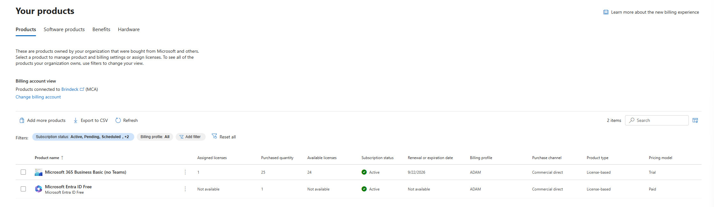
</p>

<p align="center">
  <em>Microsoft 365 admin center, Billing, Your products: Microsoft 365 Business Basic (no Teams) at 1 of 25 licenses assigned and 24 available, expiring 9/22/2026, and Microsoft Entra ID Free carried as a separate paid line with no assignable license count.</em>
</p>

The Billing, Your products page showed two active subscriptions rather than one. Microsoft 365 Business Basic (no Teams) carried 1 assigned license against a purchased quantity of 25, 24 available, with a stated renewal or expiration date of 9/22/2026, matching the lapse date the track README already carried; the 25-license purchase quantity itself was not previously recorded, only the single assigned seat. Microsoft Entra ID Free appeared alongside it as its own line, billed at 1 unit with assigned and available licenses both reported "Not available," which is the portal's way of showing a tenant's free-tier plan rather than an assignable product. Recurring billing itself is not a column on this view; the Basic trial's recurring billing being off is carried forward from Lab 02 and the track README, and Step Three re-confirms it directly on the subscription's own page when it closes out the Basic trial's state.

<p align="center">
  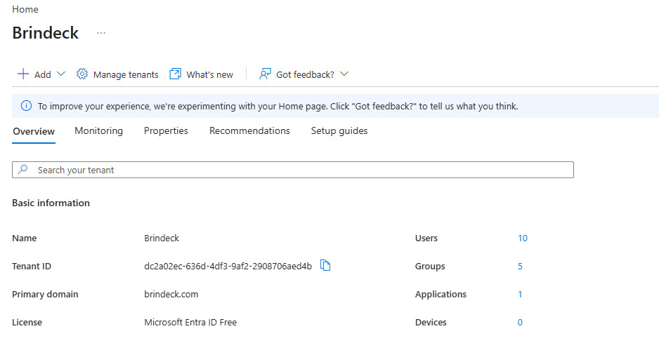
</p>

<p align="center">
  <em>Entra admin center Overview for Brindeck: Microsoft Entra plan Entra Free, 10 users, 5 groups, 1 application, and 0 devices.</em>
</p>

The Entra admin center Overview page confirmed the tenant's Microsoft Entra plan as Microsoft Entra ID Free, with object counts of 10 users, 5 groups, 1 application, and 0 devices, exactly the expected baseline.

<p align="center">
  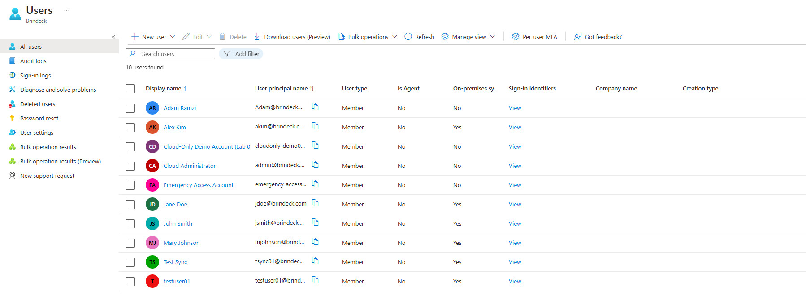
</p>

<p align="center">
  <em>All 10 users in the Entra admin center, with the On-premises sync column (the current portal's label for the field the track README calls Source) visible for each.</em>
</p>

The Users blade broke those 10 down by source: six synchronized from Windows Server AD (Alex Kim, Jane Doe, John Smith, Mary Johnson, Test Sync, and testuser01) and four cloud-only (Adam Ramzi, the signup account retained as Global Administrator since Lab 01; Cloud Administrator, `admin@brindeck.com`; the Emergency Access Account; and the Cloud-Only Demo Account, Lab 02's `cloudonly-demo01@brindeck.com` fixture). The portal's current column is labeled "On-premises sync" (Yes or No) rather than a literal `Source` field, but it is the same distinguishing property.

<p align="center">
  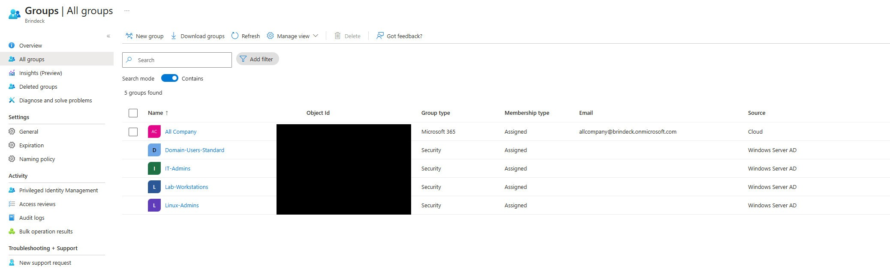
</p>

<p align="center">
  <em>All 5 groups in the Entra admin center, with type, membership type, and Source columns visible for each.</em>
</p>

The Groups blade confirmed the matching 4-and-1 split: `Domain-Users-Standard`, `IT-Admins`, `Lab-Workstations`, and `Linux-Admins` sourced from Windows Server AD, and `All Company` sourced from Cloud, a Microsoft 365 group with assigned membership and the address `allcompany@brindeck.onmicrosoft.com`.

<p align="center">
  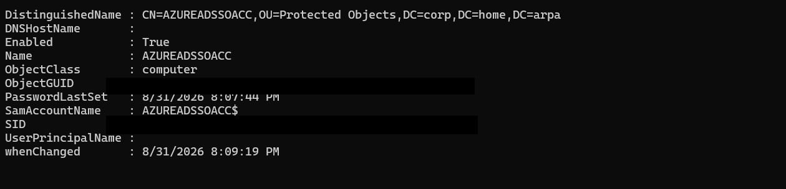
</p>

<p align="center">
  <em>`Get-ADComputer -Identity AZUREADSSOACC -Properties PasswordLastSet,whenChanged` against `corp.home.arpa`: PasswordLastSet 8/31/2026 8:07:44 PM, in `OU=Protected Objects`.</em>
</p>

`Get-ADComputer -Identity AZUREADSSOACC -Properties PasswordLastSet,whenChanged` returned a `PasswordLastSet` of 2026-08-31 8:07:44 PM, five days before this baseline was taken on 2026-09-05. That is comfortably inside the thirty-day window Microsoft recommends for rolling the seamless single sign-on Kerberos decryption key, so nothing about the account's current state forces a decision today. Step Twelve still owns whether to roll it or record the deliberate choice not to; this reading only establishes where the clock actually stands.

The baseline matched what was expected in every dimension the plan named. It will not hold for the rest of the lab, though: Step Nine's throwaway synchronized account and its permanent deletion, in a forest with no Active Directory Recycle Bin, mean the on-premises user count will not return to this number, and Step Twelve reconciles against this baseline plus that one deliberate, irreversible removal rather than against a straight rollback.

### Step Two: Started the Microsoft 365 Business Premium trial

From the Microsoft 365 admin center, Billing, Add more products, a Microsoft 365 Business Premium trial was started in the existing tenant. The tenant accepted it without objection, which settles the question this step existed to answer: a tenant that has already consumed a Microsoft 365 Business Basic trial is not blocked from starting a Microsoft 365 Business Premium trial in the same organization. No refusal was encountered, so the free-tier fallback named above did not fire.

<p align="center">
  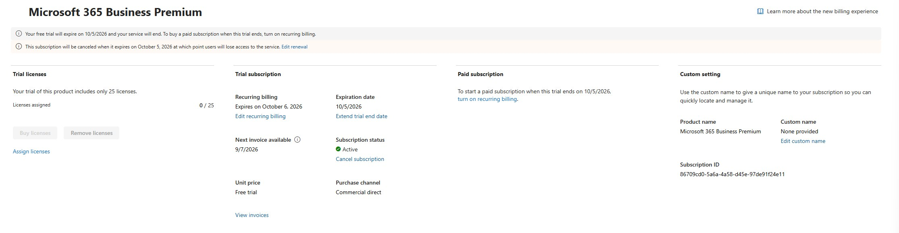
</p>

<p align="center">
  <em>Microsoft 365 admin center, the new Business Premium trial's subscription page: 25 trial licenses with 0 assigned, subscription status Active, unit price Free trial, purchase channel Commercial direct.</em>
</p>

The trial included 25 licenses, matching what Microsoft's own trial documentation states and confirmed directly on the subscription page: 0 of 25 assigned.

Which line it landed on is settled from the Plans and pricing view rather than inferred from the subscription's name. That view lists Business Premium as four separate rows, split by the same two axes Design Decisions named: with Teams or without, and Copilot or not. Only one of the four carries a You own this tag, and it is the plain "Microsoft 365 Business Premium (Trial)" row, not "Microsoft 365 Business Premium (no Teams) (Trial)." That places this trial on the with-Teams line, at Design Decisions' recorded $22.00 per user per month on annual commitment rather than the $18.79 no-Teams price.

The end date is not a single reading. The subscription page's own Expiration date field reads October 5, 2026, and the Your products listing's Renewal or expiration date column agrees at 10/5/2026. But the same subscription page's Recurring billing field reads "Expires on October 6, 2026," one day later than both of those. All three are recorded here rather than silently reconciled into one, since the plan already flagged the provisional 2026-10-06 as something to verify rather than assume, and what was found is the portal disagreeing with itself about which of two adjacent dates is correct, not a single authoritative one.

### Step Three: Disabled recurring billing, and reconfirmed the Business Basic trial's state

Recurring billing on the new Business Premium trial was turned off in the same sitting as Step Two, using the Edit renewal control on the subscription's own page, before anything else was done with the trial. The subscription page shown above reflects the result: "Your free trial will expire on 10/5/2026 and your service will end. To buy a paid subscription when this trial ends, turn on recurring billing," and "This subscription will be canceled when it expires on October 5, 2026 at which point users will lose access to the service." That matches Microsoft's documented behavior for a trial with recurring billing off: it lapses at the end of its period with no charge rather than converting to a paid subscription. Doing this on day one rather than at day twenty-nine removes the conversion failure mode entirely rather than depending on remembering it later.

<p align="center">
  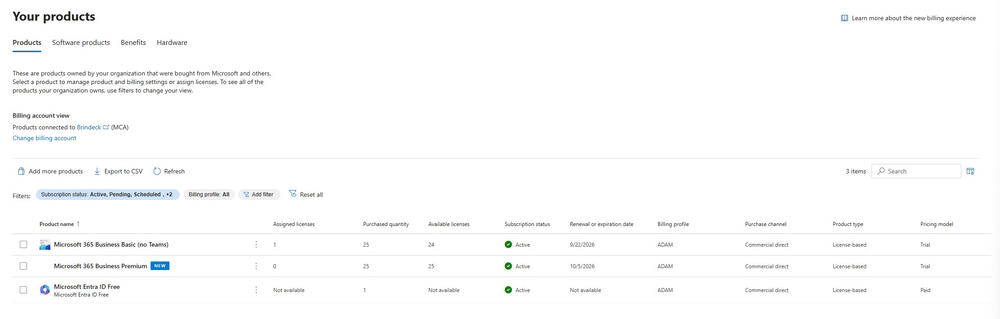
</p>

<p align="center">
  <em>Billing, Your products after Steps Two and Three: Business Basic (no Teams) at 1 of 25 assigned, 24 available, expiring 9/22/2026; Business Premium (new) at 0 of 25 assigned, expiring 10/5/2026 with recurring billing off; Microsoft Entra ID Free unchanged alongside both.</em>
</p>

The Business Basic trial's state was reconfirmed on the same page: Active, 1 of 25 licenses assigned and 24 available, with a renewal or expiration date of 9/22/2026 rather than a converted paid price, consistent with recurring billing having already been disabled on it, as the track has carried forward since before this lab. The new Business Premium trial appears alongside it as Active, 0 of 25 assigned, expiring 10/5/2026, and Microsoft Entra ID Free continues to sit alongside both as the tenant's non-assignable base plan.

The Basic trial's one assigned seat sits on the signup account, and Step Five leaves that account as it is, so it holds no license under the Business Premium trial and loses its only license the moment the Basic trial lapses on 2026-09-22. Global Administrator does not require a license, so the account's directory and portal access are unaffected; what the lapse affects is the Exchange Online service the Basic seat provisioned. 2026-09-22 falls around day seventeen of the Business Premium trial's thirty-day window, close to when Microsoft's own trial-expiry notices for that trial begin; where this tenant's billing notification mail actually lands is left for Step Twelve to confirm rather than assumed here.

### Step Four: Verified what the trial actually granted

<p align="center">
  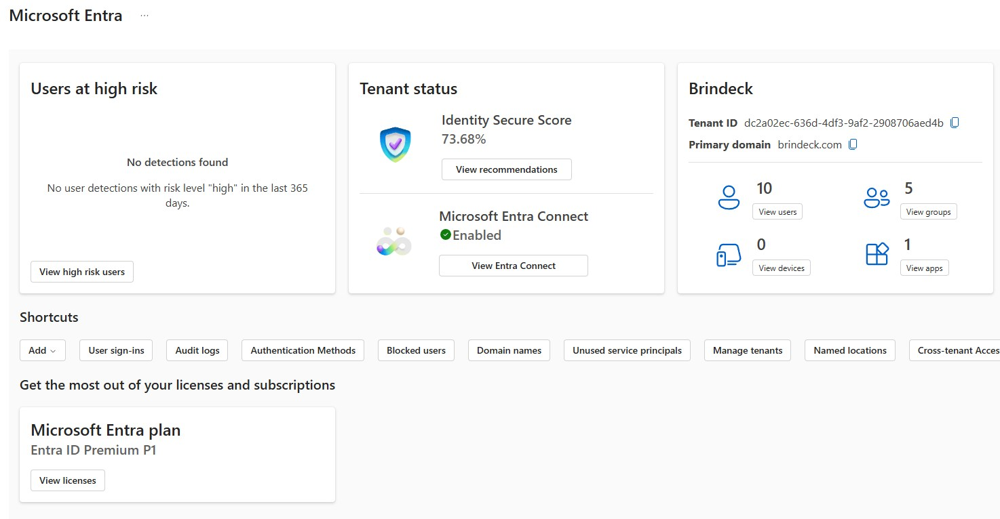
</p>

<p align="center">
  <em>Entra admin center Overview for Brindeck after Steps Two and Three: Microsoft Entra plan now reads Entra ID Premium P1, still 10 users, 5 groups, 0 devices, 1 application.</em>
</p>

The Entra admin center Overview confirmed the tenant's Microsoft Entra plan as Entra ID Premium P1, no longer Entra Free, with License usage separately recording the entitlement by name and count: Entra ID (Entra ID P1) at 25, matching the 25 trial licenses Step Two recorded. Licensed features showed the P1 boundary moving with it rather than staying theoretical: Advanced Group Access Management, which is what dynamic membership groups and role-assignable groups both depend on, now reads Yes, while the Microsoft Entra ID P2 features sitting right next to it on the same list, Identity Protection, Privileged Identity Management, Access Reviews, and Entitlement management, correctly still read as unavailable and tagged "Available in Microsoft Entra ID P2." The trial granted P1, not P2, and the tenant's own features list says so rather than the tier name being taken on trust.

The scope guard held. Conditional Access > Policies showed the empty getting-started view rather than any created policy, which is what the portal shows when a tenant has none. Security defaults' own settings panel read "Enabled," with "Your organization is currently using security defaults" confirming it in the portal's own words. Acquiring Microsoft Entra ID P1 made conditional access available without turning it on, exactly as Design Decisions specified, and nothing about starting or configuring this trial touched the setting that has enforced multifactor authentication tenant-wide since Lab 01.

Exchange Online Plan 1 and Microsoft Intune Plan 1 were not visible in either admin center, but the Microsoft Graph PowerShell SDK, already scoped into this track by ADR-019, reads the SKU directly rather than through either portal's UI. From WIN11-CLIENT01:

```powershell
Connect-MgGraph -Scopes "Organization.Read.All"
$skus = Get-MgSubscribedSku
$skus | Select-Object SkuPartNumber, ConsumedUnits, @{N='Enabled';E={$_.PrepaidUnits.Enabled}}
```

returned `SPB` as the Business Premium trial's SKU part number, at 25 enabled seats and 0 consumed, alongside `Microsoft_365_Business_Basic_(no Teams)` at 25 enabled and 1 consumed. Reading that SKU's own service plan list,

```powershell
($skus | Where-Object SkuPartNumber -eq "SPB").ServicePlans | Sort-Object ServicePlanName | Format-Table ServicePlanName, ProvisioningStatus -AutoSize
```

returned 62 service plans, all `Success` except `INTUNE_O365` at `PendingActivation`. Cross-referenced against Microsoft's own product names and service plan identifiers reference rather than assumed from the internal names' resemblance to their friendly ones, `AAD_PREMIUM` is Microsoft Entra ID P1, `EXCHANGE_S_STANDARD` is Exchange Online (Plan 1), and `INTUNE_A` is Microsoft Intune Plan 1, all three `Success`. The SKU also carries `INTUNE_SMBIZ` (Microsoft Intune, a second and distinct Intune plan bundled alongside Plan 1) and `INTUNE_O365` (Mobile Device Management for Office 365, a narrower predecessor capability), neither of which the plan asked for. What the portal's UI would not show before assignment, Graph read directly from the SKU, and all three named service plans this lab and the next two depend on are confirmed present and provisioned, not deferred to Step Five.

This step is deliberately separate from Step Two. Starting a trial and what the trial gave you are two facts, and this track has already recorded one case, in Lab 01's description of security defaults, where the second was assumed from the first and turned out narrower than the product. What is recorded here becomes the licensing baseline Labs 04, 05, and 06 build on, along with the date it expires.

### Step Five: Assigned licenses per user, and established usage location

Business Premium was assigned to five accounts: two cloud-only, `admin@brindeck.com` and `cloudonly-demo01`, and three synchronized, `testuser01`, Alex Kim, and Jane Doe, per Design Decisions' selection. The Emergency Access Account and the signup account were left untouched.

License assignment in the current Microsoft 365 admin center lives on a Licenses and apps tab that combines usage location and license selection in one panel, rather than the separate Account-tab location field this lab's plan expected. The panel never showed a blank Select location field on testuser01. Before anything on the account had been touched, the dropdown already read United States, resolved from the tenant's default rather than from anything set on the object. There was consequently no unset state left to provoke a validation error against: the value the Prerequisites table flagged as one accounts silently inherit was already showing, resolved, the moment the panel opened. That sharpens the point rather than undermining it. An administrator working this screen sees a settled location for every account regardless of whether anyone ever set one deliberately, which is exactly the kind of default worth setting on purpose instead of accepting by not noticing it. Checking Microsoft 365 Business Premium and saving with that pre-filled value untouched succeeded without further prompt or confirmation step.

<p align="center">
  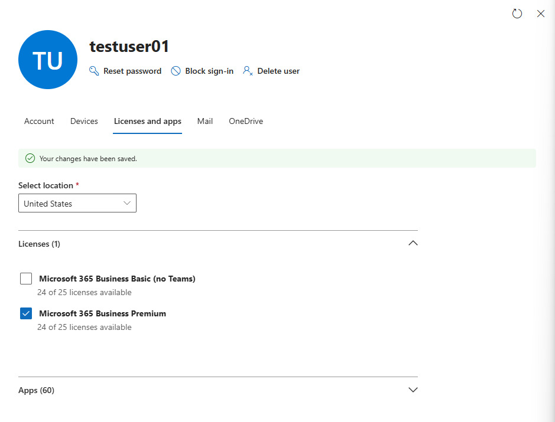
</p>

<p align="center">
  <em>testuser01's Licenses and apps tab after saving: Select location still reads United States, "Your changes have been saved," Licenses (1) with Business Premium checked and 24 of 25 licenses available, Apps (60) collapsed below.</em>
</p>

The panel confirmed "Your changes have been saved," the tenant's available count moved from 25 of 25 to 24 of 25, and the tab's own Apps section reported 60 apps under the newly assigned SKU, against the 62 service plans Step Four read from the same SKU through Microsoft Graph. This lab did not chase the two-item gap further, since neither the count nor the specific plans involved bears on anything downstream. Step Four's `INTUNE_O365` reading of `PendingActivation`, the only service plan on the SKU that did not read `Success`, plausibly accounts for one of the two, and `AAD_PREMIUM` being a licensing feature rather than a user-facing app plausibly accounts for the other, though neither is confirmed here.

The remaining four accounts, `admin@brindeck.com`, `cloudonly-demo01`, Alex Kim, and Jane Doe, were licensed together from the Active users list's Manage product licenses bulk action instead of one at a time. That path never presented a usage location control at all, going directly from account selection to license assignment.

<p align="center">
  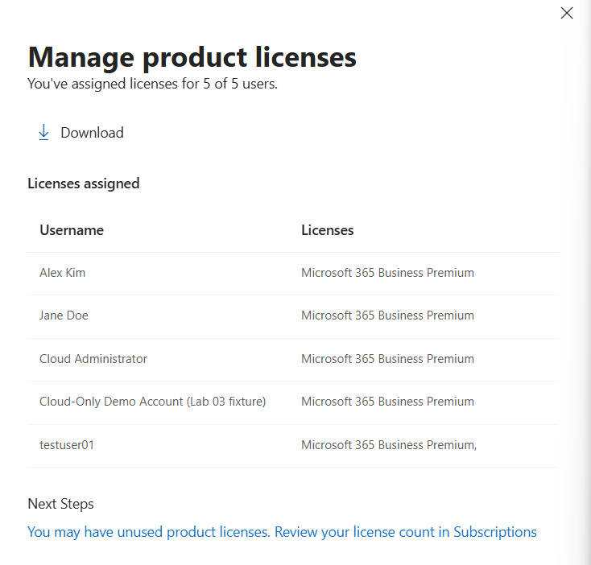
</p>

<p align="center">
  <em>The Manage product licenses confirmation: "You've assigned licenses for 5 of 5 users," listing Alex Kim, Jane Doe, Cloud Administrator, Cloud-Only Demo Account (Lab 03 fixture), and testuser01, each against Microsoft 365 Business Premium.</em>
</p>

The confirmation dialog listed all five accounts against Microsoft 365 Business Premium, the four just licensed together plus testuser01 from the step's first pass. A spot check of all five accounts' own Licenses and apps tabs afterward showed United States on every one, so the bulk path resolved the same tenant default the per-user tab had shown explicitly; it simply never surfaced the control for confirmation along the way. No difference appeared between the two cloud-only accounts and the three synchronized ones at any point in this step: licensing behaved exactly as Design Decisions expected, as a cloud-side property of the object rather than something the synchronization boundary touches.

One cosmetic note from the same dialog: testuser01's row read "Microsoft 365 Business Premium," with a trailing comma and nothing following it. That reads as a rendering artifact of the summary view rather than a second license silently attached, since testuser01's own tab showed only the one SKU under Licenses (1).

Security defaults' effect on these five accounts at first cloud sign-in was not re-tested here. Lab 02 Step Seven already established that a synchronized user is forced into Authenticator registration at first cloud sign-in regardless of role, because the setting is tenant-wide rather than scoped to administrators, and nothing about assigning a license changes that mechanism. It applies to each of these five the first time any of them signs in to a cloud service.

### Step Six: Catalogued the tenant's groups, and built a dynamic membership group

Inventoried every group in the tenant by type, membership type, and source; created the environment's first two cloud-only groups; and built its first dynamic membership group, keyed to an attribute populated on-premises for the purpose. This is also the first step in the lab that changes Active Directory: `department` was set on all six synchronized user accounts, and one of those values changed again mid-step for the round-trip demonstration, both recorded below for Step Twelve's reconciliation.

`All Company` predates all synchronization, as Lab 02's baseline recorded, and this step established the three things Design Decisions asked for beyond that: it is a Microsoft 365 group with Assigned membership, sourced from Cloud; its description reads "This is the default group for everyone in the network," but nothing about the object enforces that automatically, membership here is static and administrator-maintained like any other assigned group; and none of the six synchronized users are currently members. Its one direct member, as of this lab, is Adam Ramzi, the cloud-only Global Administrator from Lab 01. Whether that creation was tenant provisioning or a manual action was checked against Audit logs and could not be settled: retention in this tenant reaches back only to 2026-08-31, eight days short of the group's 2026-08-23 creation, so the creation event itself has already rolled off. The mechanism stays unresolved, not from an unasked question but from evidence that no longer exists to answer it.

<p align="center">
  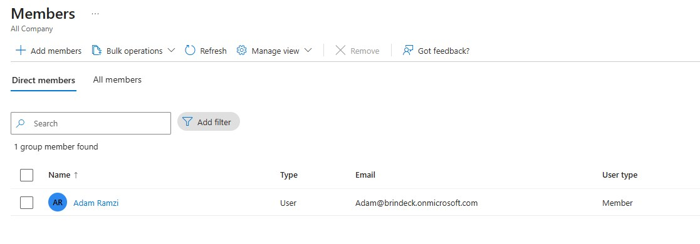
</p>

<p align="center">
  <em>All Company's Members page: 1 group member found, Adam Ramzi, its only current member, in a group whose description reads "the default group for everyone in the network."</em>
</p>

Two cloud-only groups were created to compare against that baseline: `Finance`, an assigned security group, and `Company Announcements`, an assigned Microsoft 365 group. Creating the Microsoft 365 group surfaced a field the security group flow never asked for, a group email address, auto-derived from the name (`CompanyAnnouncements@brindeck.onmicrosoft.com`), a real difference in what each group type's creation flow collects rather than only in what the finished object carries.

Comparing administrative surface against the four synchronized groups from `OU=Groups` confirmed Design Decisions' claim precisely, and on more than membership alone. `IT-Admins`' Properties page showed Group name, Group description, and Membership type all grayed out with placeholder-only text, gated by a "Some groups can't be managed in the Azure portal" banner; the same three fields on `Finance`'s Properties page were live and editable, with green checkmarks confirming valid input. Membership carries the identical restriction: `IT-Admins`' Members page repeats the same banner. `IT-Admins` itself showed exactly the count Lab 02 flagged: three members in the tenant (Alex Kim, John Smith, Mary Johnson) against four on-premises, since `labadmin` sits in the excluded `OU=IT`, with nothing in the portal indicating the list is partial.

<p align="center">
  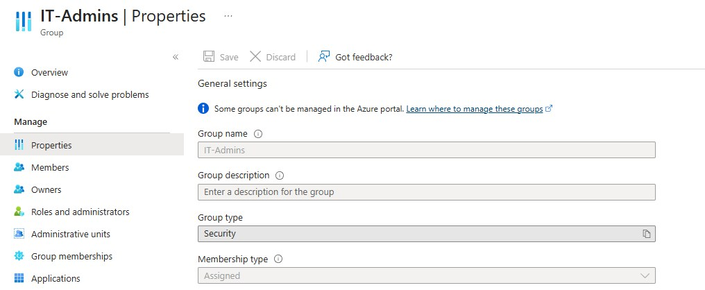
</p>

<p align="center">
  <em>IT-Admins' Properties page: Group name, Group description, and Membership type all grayed out with placeholder text only, under the "Some groups can't be managed in the Azure portal" banner. Finance's equivalent page, by contrast, showed all three fields live and editable.</em>
</p>

Mail-enabled security groups and distribution lists were named as this lab's boundary here, per Design Decisions: Microsoft restricts their administration to the Exchange or Microsoft 365 admin center rather than Entra, and Lab 04 owns them.

**Six-A: populated `department` and confirmed it could carry a rule.** `department` was set on all six synchronized accounts from WIN11-CLIENT01 with `Set-ADUser`, starting from confirmed-blank across the board: `akim`, `jdoe`, `testuser01`, and `tsync01` to `IT`; `jsmith` and `mjohnson` to `Sales`.

Whether Entra Connect carries the attribute without a custom rule was confirmed two ways rather than assumed. Against Microsoft's synchronized-attributes reference, `department` is listed under the Exchange Online, SharePoint Online, and Teams attribute groups, not only the bare-minimum set that would have required extra configuration. And empirically: `Get-ADSyncScheduler` confirmed `SyncCycleEnabled: True` before anything was forced, `Start-ADSyncSyncCycle -PolicyType Delta` was run, and `Get-MgUser` read the values back from the tenant afterward, matching the on-premises values exactly with no custom rule involved.

Whether the rule builder could reference the attribute as `user.department` was confirmed directly: in the dynamic membership rule builder's Property picker, `department` appears as a selectable item, alphabetically between `country` and `facsimileTelephoneNumber`, rather than requiring the raw rule-syntax text box. All three checks passed; `title` was not needed as a fallback.

<p align="center">
  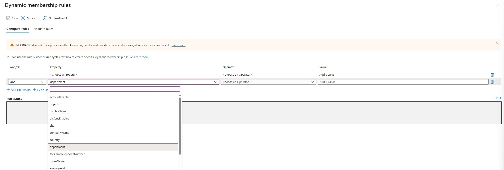
</p>

<p align="center">
  <em>The dynamic membership rule builder's Property picker, department typed and highlighted in the searchable list, sitting alphabetically between country and facsimileTelephoneNumber.</em>
</p>

**Six-B: built the rule, watched it evaluate, and timed the round trip.** `IT-Department`, a Security group with Dynamic User membership, was created with the rule `(user.department -eq "IT")`. Its Members page initially showed zero, which was not a rule defect: the built-in Validate Rules tool, which evaluates the rule live against named users rather than waiting on background processing, confirmed the logic was correct immediately. Alex Kim, Jane Doe, and testuser01 validated `In group`; John Smith and Mary Johnson validated `Not in group`. That check covered five of the six synchronized users; `tsync01`, also set to `department: IT` in Six-A, was not one of the named users run through the tool. The group's own Overview page caught up shortly after: created at 3:34 PM, membership materialized by 3:36 PM, roughly two minutes for the initial evaluation once the group existed.

<p align="center">
  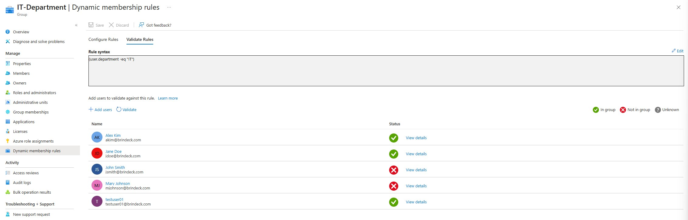
</p>

<p align="center">
  <em>Validate Rules against five of the tenant's six synchronized users: Alex Kim, Jane Doe, and testuser01 shown In group; John Smith and Mary Johnson shown Not in group, confirming the rule's logic before the group's own membership had finished materializing. tsync01, also set to department IT, was not included in this check.</em>
</p>

The round trip was timed rather than described. `Set-ADUser -Identity jsmith -Department "IT"` landed on-premises at 3:40:25 PM, confirmed with `Get-Date` immediately before and after, and a Delta cycle was forced right afterward.

<p align="center">
  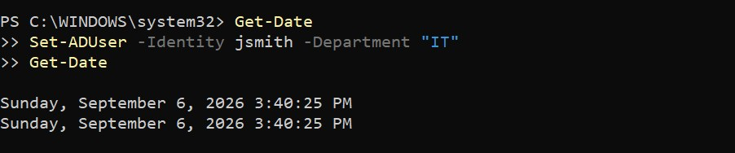
</p>

<p align="center">
  <em>Get-Date, Set-ADUser -Identity jsmith -Department "IT", and Get-Date again: both timestamps read Sunday, September 6, 2026 3:40:25 PM.</em>
</p>

`IT-Department`'s Overview page showed the fifth member, John Smith, with a "Last membership change" of 3:45 PM. The portal only gives minute-level precision, so the interval from the on-premises write to the cloud group gaining a member nobody touched directly comes out to a range rather than a single figure: somewhere between 4 minutes 35 seconds and 5 minutes 34 seconds.

<p align="center">
  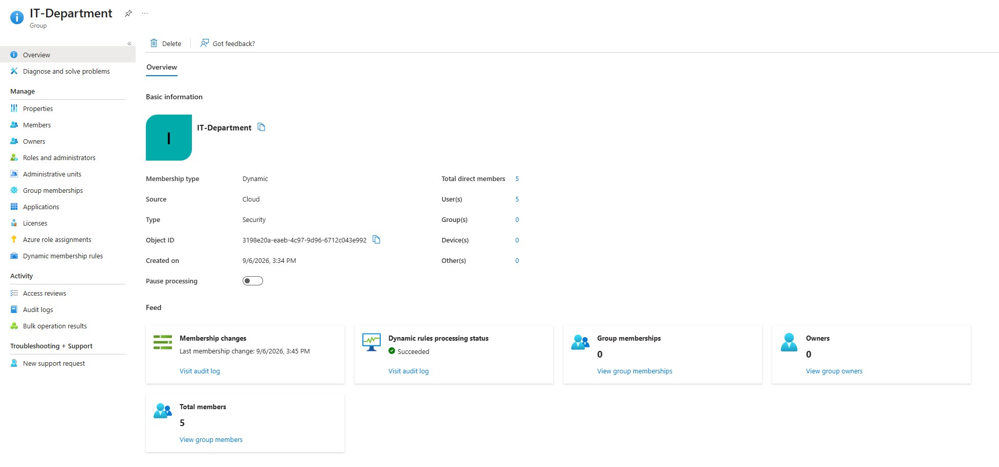
</p>

<p align="center">
  <em>IT-Department's Overview after the round trip: Total direct members 5, Dynamic rules processing status Succeeded, Last membership change 9/6/2026, 3:45 PM.</em>
</p>

The feature's documented constraints are recorded from Microsoft's own reference rather than exercised directly against this environment: membership cannot be edited by hand; a rule cannot mix users and devices in the same group; a device membership rule can reference only device attributes, never the device owner's; and the Microsoft Entra ID P1 license requirement is counted per unique user across all of a tenant's dynamic groups, not per assigned license, so a user needs no license assigned to be a member, but the tenant needs at least as many P1 licenses as it has unique dynamic-group members.

The security consideration Design Decisions attached to this step was checked directly rather than left as a footnote, and the finding runs opposite to what Microsoft's general warning would suggest on its own. `dsacls` against a synchronized user object showed `NT AUTHORITY\SELF` granted `WRITE PROPERTY` on exactly four property sets: Personal Information, Phone and Mail Options (empty on this schema version), Web Information, and the inherited Private Information. `department` belongs to none of them; it is a member of the Public-Information property set, and the only ACE naming Public Information in the object's ACL grants `READ PROPERTY` to `Authenticated Users`, not `SELF`, with no write grant on it at all. In this environment, on this default Windows Server 2022 schema, a synchronized user cannot set their own `department` value and add themselves to `IT-Department`. The risk Microsoft's guidance describes is real for Active Directory generally; it simply is not realized here, because nothing has delegated Public-Information write to SELF.

The script gap Design Decisions already named stands unresolved by design: `New-LabUser.ps1` still sets no organizational attributes, so any account it creates from here forward starts outside `IT-Department` regardless of role, a Lab 06 candidate under the ADR-017 standard rather than something to reopen here.

**Active Directory changes this step made**, carried forward for Step Twelve's reconciliation: `department` was set on all six synchronized users, with final values `akim`, `jdoe`, `testuser01`, and `tsync01` at `IT`; `mjohnson` at `Sales`; and `jsmith` at `IT`, changed from `Sales` mid-step for the round trip. No other on-premises object was touched.

### Step Seven: Assign directory roles

Assign a built-in Microsoft Entra role at tenant scope, then assign one to a role-assignable group, and record what each requires.

Start from least privilege rather than from Global Administrator. Microsoft publishes a least-privileged role per task, and the roles this track's own work maps to are specific: License Administrator for license assignment, Groups Administrator for group management, User Administrator for user management and for restoring deleted users, and Privileged Role Administrator for assigning roles to anybody. Assign one narrow built-in role to a licensed account, sign in as that account, and confirm both what it can now do and what it still cannot.

Then create a role-assignable group and assign a role to it. Three constraints belong in this step, and one of them is specific to this environment:

- Using built-in roles is free; custom roles require Microsoft Entra ID P1 for every user holding a custom role assignment; role-assignable groups require P1.
- A role-assignable group must use assigned membership, not dynamic. The reason is the same security consideration Step Six checked, applied by the product rather than left to the administrator, which makes the two steps read as a pair.
- Microsoft Entra roles cannot be assigned to groups synchronized from on-premises Active Directory. Four of this tenant's five existing groups are exactly that, so the group holding the role assignment has to be created in the cloud. In an environment whose group structure lives on-premises by design, this is a structural limitation rather than a detail, and it is worth stating what it would mean for an organization whose access model is built entirely on Active Directory groups.

Note Privileged Identity Management as requiring Microsoft Entra ID P2, which this tenant does not have and this track does not plan to acquire, so just-in-time role activation is out of reach and standing assignments are what this environment has.

### Step Eight: Group-based licensing

Assign a Business Premium license to a group and document the second assignment model, its inheritance behavior, and its failure modes.

Assign the license to the cloud-only security group created in Step Six, add and remove members, and observe licenses being granted and revoked by membership rather than by direct assignment. Then move a user between licensed groups using Microsoft's documented order, adding to the destination group and confirming the new license has applied before removing from the source, and record why that order exists: reversing it leaves the user unlicensed until group-based licensing finishes processing, which is a real service interruption rather than a cosmetic one.

Induce at least one license assignment error deliberately and read it on the Errors and issues tab. An account with no usage location is the reliable way to produce one; insufficient licenses is harder to reach with 25 seats and a tenant of ten users, which is itself worth noting as a difference from a production tenant where that error is the common one.

Record two constraints that bound the technique: group-based licensing does not process nested groups, so only first-level members of a licensed group receive licenses, and licenses can be assigned to a maximum of twenty groups at a time. The nesting limit matters here because the on-premises groups this environment already has could plausibly be nested.

Also settle a claim planning could not: Microsoft's current group-based licensing documentation, having moved to the Microsoft 365 admin center, states no license prerequisite of its own, while the feature historically required a premium tier. This tenant will hold P1 throughout this step, so the question cannot be answered here directly, but what the documentation now claims is worth recording alongside what was observed rather than repeating an unverified prerequisite. If the trial was refused and this lab is running on the free tier, this step answers the question outright instead.

### Step Nine: Delete and restore users, on both object types

Delete and restore a cloud-only user and a synchronized user, and document how the two differ. The subjects are named deliberately, because the on-premises half of this step is not reversible in this forest.

**Subjects.** `cloudonly-demo01` is the cloud-only subject, which is what Lab 02 Step Nine kept it for. The synchronized subject is `deltest01`, a throwaway account created in `OU=User Accounts` at the start of this step for the purpose of being destroyed. It is emphatically not `testuser01`, Jane Doe, or Alex Kim: Step Five licenses all three, and Lab 04's mailboxes and Lab 05's conditional access and device enrollment are built on them.

**The cloud-only path is fully reversible.** Delete `cloudonly-demo01` in the tenant, find it under Deleted users, confirm what the soft-deleted object retains, and restore it. Record whether its licenses, group memberships, and role assignments come back with it, and note Microsoft's warning that restoring a user restores the licenses it held even when none are free.

**The synchronized path has two halves, and only the first is reversible.** Create `deltest01`, let it synchronize, and confirm it in the tenant. Then delete it in the tenant only, leaving the Active Directory object in place, and wait rather than restoring it. Microsoft documents that the synchronization engine may restore a synchronized user during the next cycle when the on-premises object still exists, because Microsoft Entra is not the source of authority for that object. Watch the Delta cycle and record what actually happened and how long it took. That half undoes itself.

Then delete `deltest01` properly, on-premises, which is the same operation performed at the correct source and is where the step stops being reversible.

**The finding: in a forest without the Active Directory Recycle Bin, an on-premises deletion is terminal.** Lab 02 recorded that the Entra Connect installer recommended enabling the Recycle Bin on `corp.home.arpa` and that the recommendation was deliberately not acted on, because the setting is forest-wide and irreversible once enabled and therefore belongs to the Enterprise Infrastructure track. The consequence lands here. `Remove-ADUser` on `deltest01` destroys the object outright; there is no Deleted Objects container to restore it from.

What makes this worth documenting rather than merely noting is that the cloud side cannot rescue it either, and the reason is the source anchor. Recreate `deltest01` in Active Directory with the same `sAMAccountName` and user principal name, and observe what synchronizes. The recreated account is a new object with a new `objectGUID`, therefore a new `ms-DS-ConsistencyGuid`, therefore a new source anchor, so Entra Connect provisions it as a second, unrelated cloud object rather than rejoining the one that was deleted. The original cloud object stays in Deleted users, orphaned: its thirty-day restore window is still open and restoring it would produce a duplicate rather than a recovery, because nothing on-premises still claims it.

So the thirty-day soft-delete window, which is a genuine safety net for a cloud-only object, is not one for a synchronized object whose on-premises source has been destroyed. That is the concrete consequence of the deferred Recycle Bin recommendation, and it is the argument the Enterprise Infrastructure track should weigh when it takes that decision up.

**Cleanup.** Delete the recreated `deltest01` from Active Directory, let the deletion flow, and permanently delete both `deltest01` cloud objects from Deleted users so the tenant is not left holding orphans. Restore `cloudonly-demo01` and confirm it is intact. Record `deltest01` as the one object this lab removes permanently, on both sides, and carry that into Step Twelve's reconciliation.

### Step Ten: Delete and restore groups, and settle the security group question

Delete the cloud-only security group and the cloud-only Microsoft 365 group created in Step Six, look for both under Deleted groups, and record which appeared.

This is separated from Step Nine because it answers a different question and because it settles a live contradiction in Microsoft's own documentation. The PowerShell reference states that only Microsoft 365 groups can be restored and that security groups cannot. The recoverability architecture guidance states that soft-deleted Microsoft 365 groups and cloud security groups both appear on the Deleted groups page and both restore. Both are current Microsoft documentation and they disagree, which makes this a finding rather than a confirmation, in the same shape as Lab 02's `Get-EntraDirSyncFeature` discovery. Note also what happens to any group-based license assignment the group was carrying, since that is a property the restore either preserves or silently drops.

Restore what can be restored, recreate what cannot, and confirm the group population matches what Step Six left before closing.

### Step Eleven: Establish what can and cannot be edited on a synchronized object

Take one synchronized user and `cloudonly-demo01`, and work through the same set of administrative changes on each, recording what the portal allows, what it refuses, and what it says when it refuses.

Cover at minimum: display name and other directory attributes; the user principal name; group membership, on both a synchronized group and a cloud-only group; and the account's enabled state. The interesting cases are the ones where the two objects diverge, and the most instructive single artifact is the error Microsoft Graph returns when an on-premises mastered property is written in the cloud, which names directory sync objects explicitly rather than failing generically.

Two behaviors are worth checking rather than assuming, because Microsoft's documentation on both has changed:

- The `mobile` and `otherMobile` attributes were historically the exception that could be overwritten in the cloud on a synchronized user, setting a `DirSyncOverrides` flag that made on-premises updates to those attributes silently stop flowing. Microsoft now documents that this is no longer possible for synchronized users. Whether this tenant behaves as currently documented is a one-attribute test.
- A synchronized user can be added to a cloud-only group in the tenant even though they cannot be added to a synchronized one, because the constraint belongs to the group's source of authority rather than the user's. This is the asymmetry that makes hybrid group administration confusing in practice and is worth demonstrating in both directions.

Where a change is refused, make the corresponding change on-premises instead and watch it arrive on the next Delta cycle, so the step ends with the correct administrative path demonstrated rather than only the incorrect one blocked.

### Step Twelve: Validate the environment is otherwise unchanged, settle the SSO key, and record the finished state

Confirm that a lab conducted almost entirely in two web portals left the on-premises environment exactly as it found it, and record the state Lab 04 starts from.

**On-premises and synchronization.** `Test-ComputerSecureChannel` from WIN11-CLIENT01, a Group Policy result confirming `IT-Admin-Environment` still applies, `sssd` active on Ubuntu Server with a Kerberos ticket issued for a domain user. On `SYNC01`: the Entra Connect version and source anchor unchanged, and `Get-ADSyncScheduler` read before running anything capable of forcing a cycle, so the scheduler is confirmed rather than assumed, which is the discipline Lab 02 Step Nine established after finding `SyncCycleEnabled` had been `False` since installation.

**Wazuh, with the known caveat applied rather than repeated.** `Get-LabWazuhAgentStatus.ps1`'s default `-AgentName` list is `DC01`, `WIN11-CLIENT01`, and `UBUNTU-SERVER`, written during Automation Lab 05 before `SYNC01` existed. Running `Invoke-LabHealthReport.ps1` unmodified therefore returns `WazuhAgentStatus: Healthy` without having checked the one host this track's synchronization depends on, exactly as it did in Lab 02. Run the health report for the overall picture, then call `Get-LabWazuhAgentStatus -AgentName DC01,WIN11-CLIENT01,UBUNTU-SERVER,SYNC01` explicitly, and record both results together with the reason they differ. A green result that covered a real gap is precisely the failure shape Linux Lab 06's revision documented, and reporting the unmodified `Healthy` on its own would repeat a defect this repository has already identified twice.

**Automation library.** `Invoke-Pester -Path C:\Scripts -Output Detailed`, expected at 174 tests, 0 failed, unchanged since no script is touched by this lab.

**The `AZUREADSSOACC` key.** Step One already read the account's state and recorded how long it had been since Lab 02's roll. Lab 02 rolled the key on 2026-08-31, during its Step Eight-A — the same timestamp Step One read directly from `PasswordLastSet` — and Microsoft's Seamless SSO FAQ recommendation of at least every thirty days puts that threshold at 2026-09-30. (WIN11-CLIENT01 displays `PasswordLastSet` in its local Eastern time zone; the same moment in UTC is 2026-09-01 00:07, which is why the interval also reads as 2026-09-01 to 2026-10-01 on a UTC clock — one rollover, two clocks, not a discrepancy.) A roll performed in this lab falls well short of either date, so it demonstrates the procedure rather than tests the recommendation the threshold represents. Re-read the account's state now, so the elapsed time spans the lab rather than sitting at its start, then take the decision and record it either way: roll the key with `Update-AzureADSSOForest` on `SYNC01`, observing the two documented traps and expecting the authentication context to fight the same browser configuration Lab 02 recorded, or record the deliberate decision not to roll it and the reasoning. Whichever happens, state the conclusion research pointed to and the lab confirmed: whether thirty days is an expiry or a recommendation, and therefore whether this is an operational deadline the environment has to meet or a hygiene interval it should aim at, while 2026-09-30 (2026-10-01 in UTC) remains the date a later lab actually gets to watch the interval elapse and settle the question empirically. That closes the Lab 02 carry-forward item rather than restating it, and it tells Lab 06 whether it is automating a deadline or a good habit.

**Finished state.** Reconcile both directories object by object against the Step One baseline, accounting for every difference. Three categories of change are expected and must each be accounted for rather than netted away: the cloud-only groups created in Step Six and the role-assignable group created in Step Seven, which persist; the `department` values populated on the synchronized users in Step Six, which are the only attribute change this lab makes on-premises; and `deltest01`, created and permanently destroyed in Step Nine, which nets to zero on both sides but leaves the on-premises user count one short of where a naive reading of Step One would put it, because the Recycle Bin is off and nothing about it can be recovered. Record the finished licensing state: which subscriptions are active, their billing state, the trial's expiry date, how many licenses are assigned and to whom, and by which model each was assigned. Record the Business Basic trial as resolved, lapsing 2026-09-22, so the track's dated item closes here.

---

## Validation

Planned validation, to be replaced with observed results as the lab is implemented. Each item maps to an objective above.

- **Licensing.** A Microsoft 365 Business Premium trial is active in the tenant with its license count and end date recorded, recurring billing is off on both subscriptions, the Business Basic trial is confirmed lapsing rather than converting on 2026-09-22, and the Entra admin center reports a premium Microsoft Entra plan. The subscription's service plans include Microsoft Entra ID P1, Exchange Online Plan 1, and Microsoft Intune Plan 1, confirmed by name rather than inferred from the tier. Whether the tenant was permitted to start a second trial at all is recorded as a finding.
- **Scope guard.** Security defaults is still enabled and no conditional access policy exists in the tenant at the close of the lab.
- **License assignment models.** Both models are demonstrated on real accounts: direct per-user assignment, and group-based licensing with membership-driven grant and revoke. A user is moved between licensed groups in the documented order without loss of license. At least one license assignment error is induced deliberately and read from the Errors and issues tab.
- **Groups.** Every group in the tenant is accounted for by type, membership type, source, and administration point, including `All Company`'s origin and membership governance. At least one cloud-only security group and one cloud-only Microsoft 365 group exist. `IT-Admins`' partial membership in the tenant is recorded with the reason.
- **Dynamic membership.** An organizational attribute is populated on the synchronized users on-premises, confirmed to arrive in the tenant on the default synchronized attribute set with no custom rule, and confirmed referenceable in a dynamic membership rule. A dynamic membership group exists keyed to it. An attribute change made in Active Directory is shown adding or removing a member in the tenant after a synchronization cycle, with the elapsed time recorded end to end. The write permissions on that attribute are checked in Active Directory and the finding recorded. `New-LabUser.ps1`'s failure to set organizational attributes is recorded as a Lab 06 candidate, not fixed here.
- **Directory roles.** A built-in role is assigned at tenant scope to a licensed account and its effective permissions confirmed by signing in as that account. A role-assignable group exists and holds a role assignment. The inability to assign Microsoft Entra roles to the four synchronized groups is confirmed against the tenant rather than cited.
- **Synchronized versus cloud-only.** A documented table of administrative actions attempted against both a synchronized user and `cloudonly-demo01`, recording for each whether it succeeded, and where it failed, the exact refusal. A change refused in the cloud is shown succeeding when made on-premises and synchronized.
- **Delete and restore.** Both user object types are deleted, with the differences recorded, using `cloudonly-demo01` and the throwaway `deltest01` rather than any account Lab 04 or Lab 05 depends on. The behavior of a synchronized user deleted only in the cloud is observed across at least one synchronization cycle. The terminal nature of an on-premises deletion in a forest with no Active Directory Recycle Bin is demonstrated, including that a recreated account arrives as a new cloud object under a new source anchor rather than rejoining the soft-deleted one. The security group restore contradiction is settled against the tenant.
- **Seamless SSO key.** The `AZUREADSSOACC` account's state is recorded, the thirty-day recommendation is characterized as either a deadline or a hygiene interval on the evidence, and the key is either rolled or deliberately not rolled with the reasoning recorded.
- **Environment unchanged.** Host and service configuration on DC01, WIN11-CLIENT01, Ubuntu Server, and `SYNC01` confirmed operating as documented. The only on-premises directory changes are the deliberate ones: `department` populated in Step Six, and `deltest01` created and destroyed in Step Nine. All four Wazuh agents confirmed active by an explicit agent list, not by the health report's default. Entra Connect version, source anchor, and scheduler unchanged. `Invoke-LabHealthReport.ps1` run and its `SYNC01` blind spot recorded. Pester suite at 174 tests, 0 failed.

---

## Troubleshooting and Adjustments

- **The planned pre-assignment service plan check does not exist in either admin center's UI.** Step Four's plan called for reading Business Premium's included service plans by name, Microsoft Entra ID P1, Exchange Online Plan 1, and Microsoft Intune Plan 1, from the Microsoft 365 admin center before any license was assigned. Neither the Your products subscription page nor the dedicated Billing, Licenses page exposes that breakdown; both stop at license counts (0 of 25 assigned) with no Apps or service-plan tab reachable from either. Microsoft Entra ID P1 was confirmed independently from the Entra admin center's own Overview, License usage, and Licensed features pages, none of which required a license to be held by a user first, but Exchange Online Plan 1 and Microsoft Intune Plan 1 have no Entra-side equivalent. Microsoft Graph PowerShell's `Get-MgSubscribedSku`, run from WIN11-CLIENT01, reads a SKU's service plan list directly regardless of assignment state, and confirmed both by name (`EXCHANGE_S_STANDARD` and `INTUNE_A`, cross-referenced against Microsoft's service plan identifier reference rather than assumed from the internal names) alongside `AAD_PREMIUM`. The adjustment is the tool, not the timing: what neither portal's UI shows pre-assignment, Graph shows directly, so this stayed inside Step Four rather than moving to Step Five.

---

## Security Considerations

- **The tenant acquires a paid identity tier, and with it capabilities that are not turned on.** Conditional access becomes available in Step Two and is deliberately not used. The gap between "available" and "configured" is itself a risk: an administrator who assumes conditional access is protecting the tenant because the entitlement is present would be wrong, and security defaults remains the only thing enforcing multifactor authentication until Lab 05 changes that deliberately.
- **The entitlement is temporary, and what depends on it is not.** Anything configured under P1 during this lab, dynamic membership groups and role-assignable groups above all, is configured on an entitlement that expires. What happens to those objects when the trial lapses is a real operational question rather than a documentation one, and Labs 04 and 05 inherit it. A group whose membership stops evaluating without announcing that it has stopped is exactly the kind of silent degradation this repository has already documented twice, in Linux Lab 06's monitoring gap and in Lab 02's disabled scheduler.
- **Dynamic membership groups move an access-control decision onto an attribute.** Whoever can write the attribute can change the group's membership, and therefore anything the group grants. In a hybrid tenant that write permission may live in Active Directory rather than in the cloud, and may belong to the user themselves. Step Six checks this rather than assuming it, and the finding constrains what Lab 05 may safely target with conditional access.
- **Role-assignable groups are the same problem with the product's own answer.** Microsoft requires assigned membership on any group that can hold a role assignment, precisely so that a role cannot be acquired by editing an attribute. Recording why that restriction exists is more useful than recording that it exists.
- **Deletion in a hybrid tenant has a correct place and an incorrect one.** Deleting a synchronized user in the cloud looks like it worked and may be undone by the next synchronization cycle without anybody's involvement. That is not a safety net to rely on; it is an inconsistency between what the administrator did and what the directory believes, and the only correct deletion path for a synchronized object is at its source.
- **Every account licensed in this lab gains a cloud-reachable, mailbox-capable identity.** Accounts that previously existed only as directory objects become accounts that can sign in to Microsoft 365 services from the public internet. Security defaults' tenant-wide multifactor authentication requirement is what stands in front of them, which is another reason it is not disabled here.
- **The `AZUREADSSOACC` key is the environment's least visible standing risk.** The Kerberos decryption key on that computer account, if leaked, can be used to generate Kerberos tickets for any synchronized user and impersonate their Microsoft Entra sign-ins. Nothing rotates it automatically and nothing alerts when it ages. Lab 02 protected the account and rolled the key to AES; this lab establishes what the ongoing obligation actually is, which is the prerequisite for Lab 06 deciding whether to automate it.
- **A trial with recurring billing enabled is a financial exposure, not just an administrative one.** Step Three exists because the default behavior charges, and because a thirty-day gap between the action and its consequence is exactly the interval at which a person stops thinking about it.

---

## Outcome

Recorded at completion.

---

## Lessons Learned

Recorded at completion.

---

## Sources

Planning-phase research. Deployment-stage sources are appended during implementation.

**Licensing and subscription**

- [Microsoft Entra licensing](https://learn.microsoft.com/entra/fundamentals/licensing) - what P1 and P2 contain, that Microsoft Entra ID P1 is included in Microsoft 365 Business Premium, that built-in roles are free while custom roles and role-assignable groups require P1, and the administrative unit licensing split
- [Microsoft 365 Business Premium security FAQ](https://learn.microsoft.com/microsoft-365/admin/security-and-compliance/m365bp-security-faq) - direct confirmation that Microsoft Entra ID P1 comes with Business Premium, and that Intune and Defender for Business are included
- [Microsoft 365 for business security overview](https://learn.microsoft.com/microsoft-365/admin/security-and-compliance/m365b-security-overview) - the per-tier table showing Business Basic and Standard on Entra ID Free and Business Premium on Entra ID P1 with Intune Plan 1, which is the specific gap this lab's trial closes
- [Try or buy a Microsoft 365 for business subscription](https://learn.microsoft.com/microsoft-365/commerce/try-or-buy-microsoft-365) - starting a trial from inside an existing tenant through the admin center so it joins the same organization; that all trial subscriptions include 25 free licenses for the trial period; and that turning off recurring billing makes a trial expire at the end of its month without charge instead of converting. The basis for Steps Two and Three
- [Product names and service plan identifiers for licensing](https://learn.microsoft.com/entra/identity/users/licensing-service-plan-reference) - the service plan names and identifiers Step Four checks the subscription against by name

**Groups and membership**

- [Learn about group types, membership types, and access management](https://learn.microsoft.com/entra/fundamentals/concept-learn-about-groups) - security versus Microsoft 365 groups, assigned versus dynamic membership, that groups synchronized from on-premises Active Directory can only be managed on-premises, and that distribution lists and mail-enabled security groups can only be managed in the Exchange or Microsoft 365 admin center. The source for both the group catalogue and the boundary handed to Lab 04
- [Manage rules for dynamic membership groups in Microsoft Entra ID](https://learn.microsoft.com/entra/identity/users/groups-dynamic-membership) - the Microsoft Entra ID P1 requirement, stated per unique member rather than per assigned license; the security consideration about write permissions on attributes synchronized from Active Directory, including SELF write; and the constraints that membership cannot be edited by hand and that a rule cannot mix users and devices

**Licenses on users and groups**

- [Assign or unassign licenses to a group in the Microsoft 365 admin center](https://learn.microsoft.com/microsoft-365/admin/manage/manage-group-licenses) - group-based licensing as it is administered today, in the Microsoft 365 admin center rather than the Entra admin center; that nested groups are not processed; the twenty-group limit; the documented order for moving a user between licensed groups and the service interruption reversing it causes; and the Errors and issues tab Step Eight reads. Notably, this page states no license prerequisite of its own, which is a claim to record against observation rather than repeat

**Synchronized object behavior**

- [Microsoft Entra Connect Sync: Attributes synchronized to Microsoft Entra ID](https://learn.microsoft.com/entra/identity/hybrid/connect/reference-connect-sync-attributes-synchronized) - the default synchronized attribute set, and the basis for Step Six-A confirming that `department` flows without a custom synchronization rule or a schema change rather than assuming it does
- [How to use the BypassDirSyncOverridesEnabled feature of a Microsoft Entra tenant](https://learn.microsoft.com/entra/identity/hybrid/connect/how-to-bypassdirsyncoverrides) - that synchronized users' properties cannot be changed from the Entra or Microsoft 365 admin portals or through any PowerShell module, and that the historical `mobile` and `otherMobile` exception no longer applies. The basis for Step Eleven's attribute test
- [End-to-end troubleshooting of Microsoft Entra Connect objects and attributes](https://learn.microsoft.com/troubleshoot/entra/entra-id/user-prov-sync/troubleshoot-aad-connect-objects-attributes) - the `DirSyncOverrides` mechanism and what it did to on-premises updates, and the `SynchronizeUpnForManagedUsers` behavior governing whether user principal name changes flow to a licensed user. Relevant to Step Eleven because this lab is the first in which the tenant holds licensed synchronized users at all

**Roles**

- [Use Microsoft Entra groups to manage role assignments](https://learn.microsoft.com/entra/identity/role-based-access-control/groups-concept) - that role-assignable groups require Microsoft Entra ID P1 and must use assigned rather than dynamic membership, that Privileged Identity Management requires P2, and that Microsoft Entra roles cannot be assigned to on-premises groups, which is the constraint that shapes Step Seven in this environment
- [Assign Microsoft Entra roles](https://learn.microsoft.com/entra/identity/role-based-access-control/manage-roles-portal) - assignment at tenant scope, and the scoped alternatives this lab does not use
- [Least privileged roles by task in Microsoft Entra ID](https://learn.microsoft.com/entra/identity/role-based-access-control/delegate-by-task) - the least-privileged role per administrative task, including License Administrator for license assignment and User Administrator for restoring deleted users. The basis for Step Seven starting below Global Administrator

**Deletion and recovery**

- [Restore or remove a recently deleted user](https://learn.microsoft.com/entra/fundamentals/users-restore) - the thirty-day soft-delete window and what it preserves; that Microsoft Entra is not the source of authority for synchronized users and the synchronization engine may restore one that still exists on-premises; that a user deleted more than thirty days ago cannot be restored by anyone including Microsoft support; and that restoring a user restores its licenses even when none are available
- [Recover from deletions](https://learn.microsoft.com/entra/architecture/recover-from-deletions) - the properties each object type retains through soft delete, and the statement that soft-deleted Microsoft 365 groups and cloud security groups both appear on the Deleted groups page and can be restored
- [Recover deleted data (Microsoft Entra PowerShell)](https://learn.microsoft.com/powershell/entra-powershell/recover-deleted-data) - the conflicting statement that only Microsoft 365 groups can be restored and security groups cannot. The two sources above disagree, which is why Step Ten settles it against the tenant rather than citing either

**Seamless single sign-on key rollover**

- [Microsoft Entra seamless single sign-on: Frequently asked questions](https://learn.microsoft.com/entra/identity/hybrid/connect/how-to-connect-sso-faq) - the rollover procedure on the Entra Connect server, the SAM account name format requirement, the Protected Users group exclusion, and the warning that `Update-AzureADSSOForest` must not be run more than once per forest or seamless single sign-on stops working until cached Kerberos tickets expire
- [Microsoft Entra seamless single sign-on: Technical deep dive](https://learn.microsoft.com/entra/identity/hybrid/connect/how-to-connect-sso-how-it-works) - why the key matters, the account protection requirements Lab 02 already implemented, and the July 2026 Windows Server change of default Kerberos encryption from RC4 to AES-256, which this environment already satisfies
- [Quickstart: Microsoft Entra seamless single sign-on](https://learn.microsoft.com/entra/identity/hybrid/connect/how-to-connect-sso-quick-start) - the consequence framing for the thirty-day recommendation, that a leaked key can generate Kerberos tickets for any synchronized user, and the explicit statement that the roll is not needed immediately after enabling the feature, which is the strongest evidence that thirty days is hygiene rather than an expiry
- [Migrate from federation to cloud authentication](https://learn.microsoft.com/entra/identity/hybrid/connect/migrate-from-federation-to-cloud-authentication) - that the thirty-day interval is chosen to align with how Active Directory domain members submit password changes, and that no device is attached to the account so the rollover must be performed manually
