# 03 - Entra ID User, Group, and License Administration

## Status

In progress: Steps One through Nine are complete. Steps Ten through Twelve are not started.

The tenant matched the expected baseline in every dimension: Microsoft Entra plan Entra Free, 10 users, 5 groups, 1 application, 0 devices, and a Microsoft 365 Business Basic (no Teams) trial with 1 of 25 licenses assigned, expiring 2026-09-22. Six users and four groups trace to Windows Server AD; the remaining four users and one group are cloud-only. The `AZUREADSSOACC` computer account's Kerberos key was last set 2026-08-31, five days before this baseline, comfortably inside the thirty-day rollover recommendation Lab 02 carried forward.

One decision is taken by this lab that the track had scheduled for later. The Microsoft 365 Business Basic trial question the track README deferred to Lab 04 is resolved here, and it is resolved by trialling rather than buying: a Microsoft 365 Business Premium thirty-day trial was started from inside the existing tenant, bringing Microsoft Entra ID P1 with it. It was accepted without a second-trial refusal, landed on the with-Teams line, and now shows recurring billing off, expiring 2026-10-05. The tenant's Microsoft Entra plan reports Entra ID Premium P1, security defaults remains enabled, and no conditional access policy exists, so the thirty-day clock is running with the lab's scope guard intact. Microsoft Entra ID P1, Exchange Online Plan 1, and Microsoft Intune Plan 1 are all confirmed present on the trial SKU by name, the last two via Microsoft Graph PowerShell rather than either admin center's UI, which does not expose them pre-assignment; see Troubleshooting and Adjustments. Design Decisions below records why trialling is the right call for this environment rather than a compromise, what it does and does not authorize, and what the thirty-day window does to the shape of the lab.

---

## Overview

Labs 01 and 02 built the hybrid environment. This lab is the first to operate it.

Lab 02 made one identity exist in two directories at once. What it did not ask is what that costs an administrator day to day, and the answer is not visible from either console. A synchronized user and a cloud-only user look nearly identical in the Entra admin center, and they behave differently under almost every administrative action: editing attributes, changing group membership, assigning licenses, and above all deleting and restoring. The tenant does not label the difference in the places it matters most, which is why an administrator who does not already know which object is which will make changes that silently fail, or that succeed and are then reverted on the next synchronization cycle.

Group administration splits along the same line. Four of the tenant's five groups arrived from `OU=Groups` and can only be managed on-premises; the fifth was born in the cloud. Everything this lab creates is necessarily cloud-only, including the environment's first dynamic membership group, because a dynamic membership group cannot exist anywhere else. Building one here means first giving the synchronized users an organizational attribute worth keying a rule to, which this domain has never had, and then watching a change made in Active Directory decide a group membership in Microsoft Entra ID one synchronization cycle later.

License administration is where the two halves meet, and it is the first capability in this track bounded by entitlement rather than by configuration. This lab is where that stops being theoretical: it starts a Microsoft 365 Business Premium trial inside the existing tenant, verifies what the trial actually granted rather than what its name implies, and then spends thirty days using it. The environment gains its first capabilities above the free tier, deliberately and temporarily. It does not gain conditional access, which stays with Lab 05.

---

## Objectives

The primary goals of this lab are to:

- resolve the Business Basic trial question the track deferred, start a Microsoft 365 Business Premium trial from inside the existing tenant as a documented step, protect the tenant from that trial's automatic conversion on the same day, and record the resulting licensing state as observed rather than as the tier name implies
- establish what can and cannot be edited on a synchronized object compared with a cloud-only one, including the exact behavior and error text Microsoft Entra returns when an on-premises-mastered attribute is written in the cloud
- catalogue the tenant's groups by type, membership model, and source of authority, and account for the origin, type, and membership governance of the pre-existing cloud-only `All Company` group
- create the environment's first cloud-only assigned security group and Microsoft 365 group, and compare their administrative surface with the four groups synchronized from `OU=Groups`
- populate an organizational attribute on the synchronized users, which this domain has never carried, and build a dynamic membership group whose rule evaluates against it, documenting the rule behavior across the synchronization boundary and the security consideration Microsoft raises about writing rules against synchronized attributes
- document license assignment across both models available in the tenant, direct per-user assignment and group-based licensing, including the documented order for moving a user between licensed groups and at least one deliberately induced license assignment error
- assign a built-in Microsoft Entra directory role at tenant scope and, separately, to a role-assignable group, and record which of the tenant's existing groups are eligible to hold a role assignment and which are structurally excluded
- delete and restore both a synchronized user and a cloud-only user, and document how the two differ, including what the synchronization engine does about a synchronized user deleted only in the cloud
- delete and restore a cloud-only security group and a cloud-only Microsoft 365 group, and settle the direct contradiction between Microsoft's Entra PowerShell reference and its recoverability architecture guidance over whether a cloud-only security group can be restored at all
- confirm that host and service configuration on DC01, WIN11-CLIENT01, Ubuntu Server, and `SYNC01` is unchanged by this lab, and that the directory changes it did make on-premises are only the ones it made deliberately
- settle the `AZUREADSSOACC` key rollover obligation Lab 02 left open: establish whether thirty days is a hard clock or a hygiene recommendation, and record the account's actual state

---

## Project Context

[ADR-019](../architecture/decisions/019-establish-cloud-and-hybrid-identity-track.md) established this track and settled its architecture, and nothing in this lab reopens any of it. The synchronization engine, its scope, its authentication method, and the tenant's administrative model are all as Lab 02 left them and are not touched here.

Labs 01 and 02 were both construction labs. Lab 01 built a destination; Lab 02 built the bridge and proved traffic crossed it. Neither asked what the resulting environment is like to operate, and that omission is the reason this lab exists. A hybrid tenant's defining operational property is not that synchronization works. It is that every object in it has a source of authority, that the source is not the same for every object, and that an administrator who does not know which is which will make changes that silently do not take, or take and then get reverted on the next cycle.

That is not an abstract concern for this environment. Lab 02 already produced a preview of it: the `IT-Admins` group has four members on-premises and three in the tenant, because `labadmin` sits in the deliberately unsynchronized `OU=IT`. The group looks complete in the Entra admin center and is not. Everything this lab documents is a variation on that shape.

The lab also carries the track's first licensing action. ADR-019 Design Decision 2 states that the identity foundation sits on Microsoft Entra ID Free and that capabilities above that tier are licensed as the labs that need them arrive, with each lab recording what its own work required. Lab 03 is the first arrival: dynamic membership groups and role-assignable groups both sit above the free tier. Acting on it here is the decision ADR-019 already made, executed on schedule, and it needs no new ADR.

What does need recording is the trial. The track README's Licensing section said the Business Basic trial converts to a paid subscription on 2026-09-22 and that keeping, cancelling, or replacing it was a decision the track takes before Lab 04. That decision is now resolved in both halves: recurring billing on the Basic trial has been disabled, so it lapses on 2026-09-22 rather than converting, and Business Premium is taken as a trial rather than a purchase. Step Three is where the Basic trial's resolved state is confirmed and recorded, so the date leaves the track's open-items list rather than sitting on it unexplained.

Lab 04 depends directly on the outcome. Exchange Online mailboxes cannot be provisioned without a subscription that carries them, and the licensed population this lab establishes is the population Lab 04 gives mailboxes to. Lab 05 depends on it too, for conditional access and device enrollment. Both inherit the thirty-day window this lab opens, and what to do when it closes is a decision each of them takes for itself rather than one this lab makes on their behalf.

---

## Design Decisions

### The subscription decision is taken in this lab, and the decision is to trial rather than buy

**Decision:** A Microsoft 365 Business Premium thirty-day trial is started from inside the existing tenant. Nothing is purchased.

The track README scheduled this decision for "before Lab 04," on the reasoning that Lab 04 is the first lab that cannot proceed without a subscription. That reasoning was correct when written and is now out of date, because Lab 03's own scope needs a paid tier as well. Dynamic membership groups require Microsoft Entra ID P1, and so do role-assignable groups. Both are named in this lab's scope in the track README and in ADR-019's track scope. Deferring past this lab would mean either cutting two of its stated objectives or acquiring the entitlement anyway and not writing down why.

Business Premium rather than a standalone Entra ID P1 add-on, because the remaining labs need more than P1. Business Premium includes Microsoft Entra ID P1, Microsoft Intune Plan 1, Exchange Online Plan 1, Microsoft Defender for Business, and Microsoft Defender for Office 365 Plan 1. That covers this lab's P1 features, Lab 04's mailboxes, and Lab 05's conditional access and device enrollment in one subscription instead of three, and it is the only single small-business subscription that does.

Trial rather than purchase, and the reasoning is worth stating plainly rather than presenting as a cost note. Business Premium is sold on two lines, with Teams and without: $22.00 per user per month on annual commitment with Teams and $18.79 without, both confirmed as of this plan's writing on 2026-09-04 and 2026-09-05 rather than treated as standing prices, with the pricing page also steering toward a $32.00 Copilot variant; which line this trial actually lands on is not assumed here, and is instead settled by observation at Step Two. Five seats committed for a year is $1,320.00 on the with-Teams line or $1,127.40 on the no-Teams line, to demonstrate group and license administration in a lab environment with nine on-premises users, none of whom are real people. Business Basic's $6.48 figure that Lab 01 recorded is the current no-Teams monthly list price, observed seven weeks after Microsoft's 2026-07-01 pricing update took effect, which confirms Lab 01's baseline sits after that increase rather than predating or being explained away by it. That is not a defensible spend on either line, and pretending otherwise in a portfolio document would be worse than the spend itself.

More importantly, buying would be paying for the wrong thing. What this track needs from these capabilities is to operate them and document what operating them is actually like: what the portal does, what it refuses, what breaks, and what the diagnosis was. It does not need to keep them. The repository documents this environment at a point in time, with screenshot evidence captured as the work happens, exactly as every earlier track did. A lab whose configuration has since been rebuilt is not invalidated by the rebuild, and a lab whose licensed features have since lapsed is not invalidated by the lapse. What the document holds is the observed behavior of a real system at a recorded date, and that survives the entitlement that produced it.

The one thing a trial genuinely costs is a deadline, and that is handled by sequencing rather than by ignoring it. See below.

### Starting the trial is a documented step, not an off-camera prerequisite

**Decision:** The trial is started in Step Two of the Implementation Plan, performed and screenshotted in sequence like any other configuration action, and the resulting licensing state is read back from the tenant in Step Four.

Every prerequisite this track has treated as background has been fine. Every capability it has taken on trust from a product name has not. Lab 01 recorded that security defaults covered "administrative multifactor authentication," and Lab 02 Step Seven found out the hard way that security defaults has no administrator scoping at all: an ordinary synchronized user was required to register Microsoft Authenticator at first cloud sign-in, because the feature is tenant-wide. The summary was not wrong about the mechanism, it was wrong about the scope, and it was wrong in the direction that only shows up when someone hits it.

A subscription invites the same error. "Business Premium includes Entra ID P1" is true and is not the same claim as "every capability this lab needs is now available to every account that needs it." Step Four exists to close that gap: what service plans the trial actually contains, how many licenses it granted, what the Entra admin center now reports as the tenant's Microsoft Entra plan, and whether anything changed that this lab did not ask for.

### Whether this tenant can start a second trial at all is a finding, not an assumption

**Decision:** Step Two records what the portal actually allowed, including a refusal, rather than treating the trial's availability as given.

The trial is started from inside the existing tenant through Billing, Add more products, so that it lands in the same organization as the verified `brindeck.com` domain and the synchronized population rather than creating a second tenant. That much is documented. What is not documented anywhere found during planning is whether a tenant that has already consumed a Microsoft 365 Business Basic trial is eligible to start a Microsoft 365 Business Premium trial. Trial eligibility is generally per product rather than per tenant, which suggests it should work, but that is an inference and this track has a standing preference for observing over inferring.

So Step Two records the outcome either way. If the trial starts, the terms, license count, and end date are recorded from the portal. If it is refused, the refusal and its exact wording are recorded, and the lab stops there for a decision rather than improvising a workaround, because every alternative at that point is either a purchase or a second tenant and both are decisions rather than steps.

### Recurring billing is disabled on the day the trial starts

**Decision:** Turning off recurring billing on the Business Premium trial is Step Three, performed in the same sitting as Step Two, and recorded as an action rather than mentioned as a caveat.

Microsoft's own documentation is explicit that a trial subscription converts to a paid subscription at the end of the trial period unless recurring billing is turned off, and that turning it off causes the trial to expire at the end of its month with no charge. This is not an obscure detail, and it is exactly the kind of thing that is invisible until an invoice arrives thirty days later. The Basic trial in this tenant has already been through this: its recurring billing was disabled deliberately so that it lapses on 2026-09-22 instead of converting.

Giving it its own step rather than a footnote is a deliberate choice about what a lab document is for. An operational trap that costs money if missed is worth more space in the record than a configuration setting that does not, and burying it inside Step Two would make it easy to skip on a reread. Step Three also closes out the Basic trial's state in the same place, confirming from the Billing pages that both subscriptions are in the state they are meant to be in, so that the tenant's billing posture is a recorded fact rather than an assumption.

### The lab is sequenced against a thirty-day clock

**Decision:** Every step that depends on the trial's entitlements is placed ahead of every step that does not, so that the perishable work is complete before the window closes.

Steps Two through Ten all depend on the trial in some way, and the dependency is not uniform. Steps Six, Seven, and Eight need Microsoft Entra ID P1 specifically, for dynamic membership groups, role-assignable groups, and group-based licensing, and cannot be attempted at all without it. Steps Nine and Ten need something weaker but still real: live licenses on live accounts, because what they document is whether a restored user comes back holding the licenses it had, and what happens to a group that carries a group-based license assignment when it is deleted. Neither is answerable against accounts that hold nothing.

Only Step Eleven is genuinely tier-independent among the content steps. What can and cannot be edited on a synchronized object is a function of source of authority rather than of licensing, and it behaves identically on Entra ID Free. So it is placed last among the content steps, where a slip costs nothing, and Step Twelve's validation follows it.

This is the reverse of the order the objectives are listed in, and is deliberate.

### Acquiring P1 in this lab does not turn on conditional access

**Decision:** This lab uses only P1's group and licensing capabilities. Security defaults remains enabled and untouched, and no conditional access policy is created, modified, or evaluated.

ADR-019 Design Decision 6 gives the security defaults to conditional access transition to the lab that introduces conditional access, and requires that lab to reproduce the protections being removed rather than dropping them silently. Lab 05 is that lab. Acquiring the entitlement that makes conditional access available is not the same event as taking on the obligation that comes with using it, and collapsing the two would put the tenant's only multifactor authentication enforcement inside a lab about groups and licenses.

This is worth stating explicitly because the Entra admin center will start surfacing conditional access as available the moment P1 lands, and because Lab 02 has already demonstrated that this environment's security defaults do more than the original summary said. Reproducing tenant-wide multifactor authentication under conditional access is real work with a real blast radius. It belongs where it was scheduled.

The one consequence this lab does record is that security defaults is still on and still tenant-wide, so any account licensed here that has not signed in to a cloud service before will be required to register a multifactor authentication method at first sign-in, exactly as the synchronized user in Lab 02 Step Seven was.

### Delete and restore is content, not a boundary note

**Decision:** The synchronized-versus-cloud-only comparison is built on delete and restore behavior as well as attribute editing, with `cloudonly-demo01` as the cloud-only subject.

Attribute editing answers the question narrowly: some fields are greyed out, and writing them through Microsoft Graph returns an error naming on-premises mastered objects. That is worth documenting and it takes one step. Deletion answers the same question in the way an administrator actually meets it, because "someone deleted a user, can we get them back" is a helpdesk ticket rather than a documentation exercise, and because the two object types genuinely diverge:

- A cloud-only user deleted in the tenant is soft-deleted for thirty days with all properties preserved, including group memberships, roles, and licenses, and is restored from Deleted users.
- A synchronized user deleted in the tenant is soft-deleted the same way, but Microsoft Entra is not its source of authority. If the object still exists in Active Directory, the next synchronization cycle may restore it without anybody restoring it deliberately. That is a restoration path this environment can watch happen, and it lands directly on Lab 02's scheduler work: the cycle that brings the user back is the same half-hourly Delta cycle Lab 02 Step Nine had to fix before it ran unattended at all.
- A user deleted more than thirty days ago is not restorable at all, by anyone, including Microsoft support, and the hybrid match path is blocked along with the manual one.
- Restoring a user restores the licenses it held at deletion even when none are free, which is a compliance state a tenant can reach without noticing.

`cloudonly-demo01` exists for this. Lab 02 Step Nine kept it deliberately, renamed from `duptest03`, precisely because the tenant's only other cloud-only accounts are all Global Administrator tier and none of them can safely be deleted to see what happens.

There is also a documentation conflict to settle here rather than repeat. Microsoft's Entra PowerShell reference states that only Microsoft 365 groups can be restored and that security groups cannot. Microsoft's own recoverability architecture guidance states that soft-deleted Microsoft 365 groups and cloud security groups both appear on the Deleted groups page and both restore, with named exceptions that do not apply to this tenant. The two cannot both be right in general. This lab tests it against the tenant and records what the tenant did, in the same spirit as Lab 02's finding that `Get-EntraDirSyncFeature`'s accepted feature name does not match Microsoft's own documentation.

### The dynamic membership rule is scoped to a real attribute

**Decision:** An organizational attribute is populated on the synchronized users on-premises first, and the dynamic membership rule is keyed to that. The rule matches a subset of the users rather than all of them.

The attribute has to be created because this domain does not have one. [Automation Lab 02](../automation-and-scripting/02-group-and-ou-administration.md) recorded the gap explicitly while choosing what its user inventory report should return: this domain has no populated `Department`, `Title`, or `Manager` attributes, so a template built around those fields would mostly report empty values. `New-LabUser.ps1` sets none of them either. A dynamic membership rule keyed to any of them today would match nothing, and a rule keyed to something every user does carry, `userPrincipalName` or `accountEnabled`, is not what a dynamic membership group is for: it produces a group indistinguishable from a static list of everyone, and it cannot be shown reacting to anything.

Populating the attribute is better content than working around its absence, because it turns the demonstration into the thing the feature is actually for. Setting a value on-premises, waiting one synchronization cycle, and watching Microsoft Entra ID move a user into or out of a group nobody touched is the synchronize-then-evaluate behavior made real, and it exercises the Delta cycle Lab 02 had to repair before it ran unattended at all.

The script gap stays out of scope here. `New-LabUser.ps1` will keep creating accounts with no organizational attributes, so any account it creates lands outside whatever rule this lab writes. That is a genuine defect in the automation library rather than a defect in this lab, it is the same shape as the `Get-LabWazuhAgentStatus.ps1` agent-list gap already carried forward, and it belongs to Lab 06 under the ADR-017 analysis and testing standard. Reopening the script here would drag a Pester suite into a portal lab.

The specific attribute is chosen and confirmed during implementation rather than asserted here. Microsoft's own guidance on the choice is a security consideration rather than a mechanical one and belongs in the lab: the security of a dynamic group's membership is only as strong as the write permissions on the attributes its rule references, and attributes synchronized from Active Directory may carry SELF write permissions that let users modify their own values. That check is part of Step Six rather than a footnote to it.

### Mail-enabled security groups and distribution lists are named as a boundary and handed to Lab 04

**Decision:** This lab identifies mail-enabled security groups and distribution lists as a group type it does not create or manage, states why, and hands them to Lab 04. Nothing is built.

Microsoft is explicit that distribution lists and mail-enabled security groups can only be managed in the Exchange admin center or the Microsoft 365 admin center, not in the Entra admin center. That makes them a genuine gap in a lab whose objective is to catalogue group types, and leaving it unstated would misrepresent the catalogue as complete. But they are mail objects, their administration lives in a console this lab otherwise never opens, and Lab 04 already has distribution and Microsoft 365 group management in its scope. Naming the boundary is the right amount of coverage; building against it here would be Lab 04's work done early and in the wrong document.

### Administrative units are a boundary handed to Lab 05

**Decision:** Administrative units are named as a scoping mechanism this lab does not use, with the reason recorded, and handed to Lab 05.

The reason is scope, not entitlement. Creating administrative units requires only a free license, and the P1 that scoped role assignment and dynamic administrative unit membership require is present in this tenant for the duration of the trial, so nothing prevents them technically. What prevents them is that this lab already carries the widest surface in the track: synchronized versus cloud-only editability, group types, membership models, dynamic membership, two license assignment models, directory role assignment, and delete and restore.

Administrative units are a substantial topic in their own right, and administrative-unit-scoped role assignment sits naturally with Lab 05's access control theme rather than with this lab's inventory-and-administration theme. They are also a natural fit for this environment specifically, since the on-premises organizational unit structure this track already synchronizes by is exactly the kind of division an administrative unit expresses in the cloud, which is an argument for giving them proper attention rather than an argument for squeezing them in here. Adding them would push a heading past what it can usefully hold, and the result would be a shallow treatment of a topic that deserves a real one.

---

## Technologies Used

- Microsoft Entra admin center: users, groups, deleted users, deleted groups, roles and administrators
- Microsoft 365 admin center: Billing, Add more products, Your products, Licenses, and the group-based licensing pages, which is where user and group license assignment now lives rather than in the Entra admin center
- Microsoft 365 Business Premium, on a thirty-day trial, providing Microsoft Entra ID P1
- Microsoft Entra Connect Sync on `SYNC01`, unchanged, as the mechanism whose cycle several of this lab's observations depend on, and as the host of the Seamless SSO PowerShell module if the `AZUREADSSOACC` key is rolled
- Active Directory Users and Computers and the Track 3 PowerShell library on WIN11-CLIENT01, for the on-premises half of each comparison
- Microsoft Graph PowerShell SDK, read-only in this lab, for reading object properties and license state that the portal summarizes rather than shows. No script is produced here; scripting the hybrid boundary is Lab 06's work under [ADR-017](../architecture/decisions/017-adopt-powershell-static-analysis-and-unit-testing.md)

---

## Architecture or Topology

Nothing is deployed by this lab and no topology changes. What changes is the tenant's licensing state and its object population, and the useful diagram is of authority rather than of infrastructure.

```text
Active Directory (corp.home.arpa, DC01)          Microsoft Entra ID (Brindeck)
--------------------------------------          -----------------------------
OU=User Accounts  ─── Entra Connect Sync ──────▶ 6 synchronized users
OU=Groups         ─── (SYNC01, Delta 30m) ─────▶ 4 synchronized groups
OU=IT             ─── deliberately excluded       (labadmin absent by design)
OU=Service Accounts, OU=Protected Objects,
OU=Workstations   ─── out of scope

                                                 3 cloud-only admin accounts
                                                 1 cloud-only demo account
                                                 1 cloud-only group (All Company)
                                                 + everything this lab creates,
                                                   which is necessarily cloud-only
```

The single fact that organizes the whole lab is that the arrow points one way. An object that arrived along it is administered at its origin; an object that did not exist before it reached the tenant is administered in the tenant. Every "can I edit this" question in this lab resolves to which side of that arrow the object came from, and the tenant does not make the distinction obvious in its own interface, which is precisely why it is worth documenting.

---

## Prerequisites

Carried forward and required to be operational:

- Lab 01 and Lab 02 complete, with the tenant holding a verified primary custom domain `brindeck.com`, three cloud-only administrative accounts, and security defaults enabled
- Entra Connect Sync 2.6.84.0 on `SYNC01`, scoped to `OU=User Accounts` and `OU=Groups`, with the scheduler confirmed running unattended on a thirty-minute Delta cycle since Lab 02 Step Nine
- DC01, WIN11-CLIENT01, and Ubuntu Server operating as the Linux, enterprise, and automation tracks documented, with all four Wazuh agents active
- `cloudonly-demo01@brindeck.com`, the cloud-only fixture Lab 02 Step Nine kept for this lab
- The Business Basic trial with recurring billing already disabled, so that it lapses on 2026-09-22 rather than converting

Carried forward as a standing obligation this lab is the first to run into:

**The `AZUREADSSOACC` Kerberos decryption key rollover.** Lab 02 enabled seamless single sign-on, moved `AZUREADSSOACC` into the delegation-restricted `OU=Protected Objects`, and rolled its Kerberos key to AES. Lab 02 also recorded that Microsoft recommends rolling that key at least every thirty days and that nothing in the product does it automatically, and left it open as a candidate for Lab 06's Microsoft Graph automation rather than a calendar reminder. This is the first lab that can plausibly run past the thirty-day mark since that roll, so it is the first lab that has to deal with it rather than note it.

Research during planning establishes the shape of the obligation, to be confirmed against the environment rather than taken from here:

- Thirty days appears to be hygiene rather than a hard clock. Microsoft's language throughout is "we highly recommend" and "at least every thirty days," never an expiry, and the quickstart explicitly says the roll is not needed immediately after enabling the feature. Nothing is documented as breaking on day thirty-one. The recommendation is aligned to the interval at which Active Directory domain members submit password changes, and its rationale is stated in terms of consequence rather than expiry: the key, if leaked, can be used to generate Kerberos tickets for any synchronized user, letting an attacker impersonate Microsoft Entra sign-ins for those users.
- There is no device attached to the `AZUREADSSO` computer account object, which is why the rollover has to be performed manually and why nothing rotates it on its own.
- The mechanism runs on `SYNC01`, from the Entra Connect program files folder: import `AzureADSSO.psd1`, establish an authentication context with `New-AzureADSSOAuthenticationContext`, collect domain administrator credentials in SAM account name format with `Get-Credential`, then `Update-AzureADSSOForest -OnPremCredentials $creds`.
- Two traps are documented and both apply here. `Update-AzureADSSOForest` must not be run more than once per forest, or seamless single sign-on stops working until users' cached Kerberos tickets expire and are reissued. And the domain administrator account used must not be a member of the Protected Users group, or the operation fails.
- `New-AzureADSSOAuthenticationContext` is the same cmdlet whose authentication Lab 02 recorded as fighting through browser configuration on `SYNC01`, so a roll performed here should expect to meet that again rather than treat it as new.

Step One reads the account's actual state and records how long it has been since the Lab 02 roll, because it is the oldest perishable item on the list and reading it costs one query. Step Twelve then either rolls the key or records the deliberate decision not to, with the reasoning, and characterizes the thirty-day recommendation on the evidence. Either outcome closes the carry-forward item properly, which noting it a second time would not.

Introduced by this lab:

| Requirement | Introduced in | Notes |
|---|---|---|
| A Microsoft 365 Business Premium trial | Step Two | Started from inside the existing tenant via Billing, Add more products, so it lands in the same organization as `brindeck.com`. Trial subscriptions include 25 free licenses for the trial period. Steps Two through Ten depend on it: Steps Six, Seven, and Eight on Microsoft Entra ID P1 specifically, Steps Five, Nine, and Ten on holding live licenses. Also provides the Exchange Online and Intune that Labs 04 and 05 require |
| Recurring billing disabled on that trial | Step Three | A trial converts to a paid subscription at the end of its period unless recurring billing is turned off. Performed the same day the trial starts |
| A usage location on every account to be licensed | Step Five | A license cannot be assigned to a user without one. Accounts without an explicit usage location inherit the tenant's, which is a default worth setting deliberately rather than inheriting silently |

---

## Implementation

Twelve steps, ordered by what depends on the trial.

Step One is the baseline and is taken before the trial exists. Steps Two through Ten all depend on it, in two different ways. Steps Six, Seven, and Eight require Microsoft Entra ID P1 and are impossible without it: dynamic membership groups, role-assignable groups, and group-based licensing. Steps Five, Nine, and Ten require only that licenses are live on live accounts, which is a weaker dependency but a real one, since a restored user's licenses and a deleted group's license assignment cannot be observed on accounts that hold nothing.

Step Eleven is the only content step that does not depend on the trial at all. Whether a synchronized object's attributes can be edited in the cloud is determined by source of authority, not by entitlement, and the answer is the same on Entra ID Free. Step Twelve's validation is likewise tier-independent.

So Steps Two through Ten must complete while the trial is active, and Steps Eleven and Twelve can follow at any point.

### Step One: Recorded the pre-lab baseline

Captured the tenant exactly as Lab 02 left it, before starting or changing anything, so that every later count in this lab reconciles against a recorded starting point rather than against Lab 02's prose.

<p align="center">
  
</p>

<p align="center">
  <em>Microsoft 365 admin center, Billing, Your products: Microsoft 365 Business Basic (no Teams) at 1 of 25 licenses assigned and 24 available, expiring 9/22/2026, and Microsoft Entra ID Free carried as a separate paid line with no assignable license count.</em>
</p>

The Billing, Your products page showed two active subscriptions rather than one. Microsoft 365 Business Basic (no Teams) carried 1 assigned license against a purchased quantity of 25, 24 available, with a stated renewal or expiration date of 9/22/2026, matching the lapse date the track README already carried; the 25-license purchase quantity itself was not previously recorded, only the single assigned seat. Microsoft Entra ID Free appeared alongside it as its own line, billed at 1 unit with assigned and available licenses both reported "Not available," which is the portal's way of showing a tenant's free-tier plan rather than an assignable product. Recurring billing itself is not a column on this view; the Basic trial's recurring billing being off is carried forward from Lab 02 and the track README, and Step Three re-confirms it directly on the subscription's own page when it closes out the Basic trial's state.

<p align="center">
  
</p>

<p align="center">
  <em>Entra admin center Overview for Brindeck: Microsoft Entra plan Entra Free, 10 users, 5 groups, 1 application, and 0 devices.</em>
</p>

The Entra admin center Overview page confirmed the tenant's Microsoft Entra plan as Microsoft Entra ID Free, with object counts of 10 users, 5 groups, 1 application, and 0 devices, exactly the expected baseline.

<p align="center">
  
</p>

<p align="center">
  <em>All 10 users in the Entra admin center, with the On-premises sync column (the current portal's label for the field the track README calls Source) visible for each.</em>
</p>

The Users blade broke those 10 down by source: six synchronized from Windows Server AD (Alex Kim, Jane Doe, John Smith, Mary Johnson, Test Sync, and testuser01) and four cloud-only (Adam Ramzi, the signup account retained as Global Administrator since Lab 01; Cloud Administrator, `admin@brindeck.com`; the Emergency Access Account; and the Cloud-Only Demo Account, Lab 02's `cloudonly-demo01@brindeck.com` fixture). The portal's current column is labeled "On-premises sync" (Yes or No) rather than a literal `Source` field, but it is the same distinguishing property.

<p align="center">
  
</p>

<p align="center">
  <em>All 5 groups in the Entra admin center, with type, membership type, and Source columns visible for each.</em>
</p>

The Groups blade confirmed the matching 4-and-1 split: `Domain-Users-Standard`, `IT-Admins`, `Lab-Workstations`, and `Linux-Admins` sourced from Windows Server AD, and `All Company` sourced from Cloud, a Microsoft 365 group with assigned membership and the address `allcompany@brindeck.onmicrosoft.com`.

<p align="center">
  
</p>

<p align="center">
  <em>`Get-ADComputer -Identity AZUREADSSOACC -Properties PasswordLastSet,whenChanged` against `corp.home.arpa`: PasswordLastSet 8/31/2026 8:07:44 PM, in `OU=Protected Objects`.</em>
</p>

`Get-ADComputer -Identity AZUREADSSOACC -Properties PasswordLastSet,whenChanged` returned a `PasswordLastSet` of 2026-08-31 8:07:44 PM, five days before this baseline was taken on 2026-09-05. That is comfortably inside the thirty-day window Microsoft recommends for rolling the seamless single sign-on Kerberos decryption key, so nothing about the account's current state forces a decision today. Step Twelve still owns whether to roll it or record the deliberate choice not to; this reading only establishes where the clock actually stands.

The baseline matched what was expected in every dimension the plan named. It will not hold for the rest of the lab, though: Step Nine's throwaway synchronized account and its permanent deletion, in a forest with no Active Directory Recycle Bin, mean the on-premises user count will not return to this number, and Step Twelve reconciles against this baseline plus that one deliberate, irreversible removal rather than against a straight rollback.

### Step Two: Started the Microsoft 365 Business Premium trial

From the Microsoft 365 admin center, Billing, Add more products, a Microsoft 365 Business Premium trial was started in the existing tenant. The tenant accepted it without objection, which settles the question this step existed to answer: a tenant that has already consumed a Microsoft 365 Business Basic trial is not blocked from starting a Microsoft 365 Business Premium trial in the same organization. No refusal was encountered, so the free-tier fallback named above did not fire.

<p align="center">
  
</p>

<p align="center">
  <em>Microsoft 365 admin center, the new Business Premium trial's subscription page: 25 trial licenses with 0 assigned, subscription status Active, unit price Free trial, purchase channel Commercial direct.</em>
</p>

The trial included 25 licenses, matching what Microsoft's own trial documentation states and confirmed directly on the subscription page: 0 of 25 assigned.

Which line it landed on is settled from the Plans and pricing view rather than inferred from the subscription's name. That view lists Business Premium as four separate rows, split by the same two axes Design Decisions named: with Teams or without, and Copilot or not. Only one of the four carries a You own this tag, and it is the plain "Microsoft 365 Business Premium (Trial)" row, not "Microsoft 365 Business Premium (no Teams) (Trial)." That places this trial on the with-Teams line, at Design Decisions' recorded $22.00 per user per month on annual commitment rather than the $18.79 no-Teams price.

The end date is not a single reading. The subscription page's own Expiration date field reads October 5, 2026, and the Your products listing's Renewal or expiration date column agrees at 10/5/2026. But the same subscription page's Recurring billing field reads "Expires on October 6, 2026," one day later than both of those. All three are recorded here rather than silently reconciled into one, since the plan already flagged the provisional 2026-10-06 as something to verify rather than assume, and what was found is the portal disagreeing with itself about which of two adjacent dates is correct, not a single authoritative one.

### Step Three: Disabled recurring billing, and reconfirmed the Business Basic trial's state

Recurring billing on the new Business Premium trial was turned off in the same sitting as Step Two, using the Edit renewal control on the subscription's own page, before anything else was done with the trial. The subscription page shown above reflects the result: "Your free trial will expire on 10/5/2026 and your service will end. To buy a paid subscription when this trial ends, turn on recurring billing," and "This subscription will be canceled when it expires on October 5, 2026 at which point users will lose access to the service." That matches Microsoft's documented behavior for a trial with recurring billing off: it lapses at the end of its period with no charge rather than converting to a paid subscription. Doing this on day one rather than at day twenty-nine removes the conversion failure mode entirely rather than depending on remembering it later.

<p align="center">
  
</p>

<p align="center">
  <em>Billing, Your products after Steps Two and Three: Business Basic (no Teams) at 1 of 25 assigned, 24 available, expiring 9/22/2026; Business Premium (new) at 0 of 25 assigned, expiring 10/5/2026 with recurring billing off; Microsoft Entra ID Free unchanged alongside both.</em>
</p>

The Business Basic trial's state was reconfirmed on the same page: Active, 1 of 25 licenses assigned and 24 available, with a renewal or expiration date of 9/22/2026 rather than a converted paid price, consistent with recurring billing having already been disabled on it, as the track has carried forward since before this lab. The new Business Premium trial appears alongside it as Active, 0 of 25 assigned, expiring 10/5/2026, and Microsoft Entra ID Free continues to sit alongside both as the tenant's non-assignable base plan.

The Basic trial's one assigned seat sits on the signup account, and Step Five leaves that account as it is, so it holds no license under the Business Premium trial and loses its only license the moment the Basic trial lapses on 2026-09-22. Global Administrator does not require a license, so the account's directory and portal access are unaffected; what the lapse affects is the Exchange Online service the Basic seat provisioned. 2026-09-22 falls around day seventeen of the Business Premium trial's thirty-day window, close to when Microsoft's own trial-expiry notices for that trial begin; where this tenant's billing notification mail actually lands is left for Step Twelve to confirm rather than assumed here.

### Step Four: Verified what the trial actually granted

<p align="center">
  
</p>

<p align="center">
  <em>Entra admin center Overview for Brindeck after Steps Two and Three: Microsoft Entra plan now reads Entra ID Premium P1, still 10 users, 5 groups, 0 devices, 1 application.</em>
</p>

The Entra admin center Overview confirmed the tenant's Microsoft Entra plan as Entra ID Premium P1, no longer Entra Free, with License usage separately recording the entitlement by name and count: Entra ID (Entra ID P1) at 25, matching the 25 trial licenses Step Two recorded. Licensed features showed the P1 boundary moving with it rather than staying theoretical: Advanced Group Access Management, which is what dynamic membership groups and role-assignable groups both depend on, now reads Yes, while the Microsoft Entra ID P2 features sitting right next to it on the same list, Identity Protection, Privileged Identity Management, Access Reviews, and Entitlement management, correctly still read as unavailable and tagged "Available in Microsoft Entra ID P2." The trial granted P1, not P2, and the tenant's own features list says so rather than the tier name being taken on trust.

The scope guard held. Conditional Access > Policies showed the empty getting-started view rather than any created policy, which is what the portal shows when a tenant has none. Security defaults' own settings panel read "Enabled," with "Your organization is currently using security defaults" confirming it in the portal's own words. Acquiring Microsoft Entra ID P1 made conditional access available without turning it on, exactly as Design Decisions specified, and nothing about starting or configuring this trial touched the setting that has enforced multifactor authentication tenant-wide since Lab 01.

Exchange Online Plan 1 and Microsoft Intune Plan 1 were not visible in either admin center, but the Microsoft Graph PowerShell SDK, already scoped into this track by ADR-019, reads the SKU directly rather than through either portal's UI. From WIN11-CLIENT01:

```powershell
Connect-MgGraph -Scopes "Organization.Read.All"
$skus = Get-MgSubscribedSku
$skus | Select-Object SkuPartNumber, ConsumedUnits, @{N='Enabled';E={$_.PrepaidUnits.Enabled}}
```

returned `SPB` as the Business Premium trial's SKU part number, at 25 enabled seats and 0 consumed, alongside `Microsoft_365_Business_Basic_(no Teams)` at 25 enabled and 1 consumed. Reading that SKU's own service plan list,

```powershell
($skus | Where-Object SkuPartNumber -eq "SPB").ServicePlans | Sort-Object ServicePlanName | Format-Table ServicePlanName, ProvisioningStatus -AutoSize
```

returned 62 service plans, all `Success` except `INTUNE_O365` at `PendingActivation`. Cross-referenced against Microsoft's own product names and service plan identifiers reference rather than assumed from the internal names' resemblance to their friendly ones, `AAD_PREMIUM` is Microsoft Entra ID P1, `EXCHANGE_S_STANDARD` is Exchange Online (Plan 1), and `INTUNE_A` is Microsoft Intune Plan 1, all three `Success`. The SKU also carries `INTUNE_SMBIZ` (Microsoft Intune, a second and distinct Intune plan bundled alongside Plan 1) and `INTUNE_O365` (Mobile Device Management for Office 365, a narrower predecessor capability), neither of which the plan asked for. What the portal's UI would not show before assignment, Graph read directly from the SKU, and all three named service plans this lab and the next two depend on are confirmed present and provisioned, not deferred to Step Five.

This step is deliberately separate from Step Two. Starting a trial and what the trial gave you are two facts, and this track has already recorded one case, in Lab 01's description of security defaults, where the second was assumed from the first and turned out narrower than the product. What is recorded here becomes the licensing baseline Labs 04, 05, and 06 build on, along with the date it expires.

### Step Five: Assigned licenses per user, and established usage location

Business Premium was assigned to five accounts: two cloud-only, `admin@brindeck.com` and `cloudonly-demo01`, and three synchronized, `testuser01`, Alex Kim, and Jane Doe, per Design Decisions' selection. The Emergency Access Account and the signup account were left untouched.

License assignment in the current Microsoft 365 admin center lives on a Licenses and apps tab that combines usage location and license selection in one panel, rather than the separate Account-tab location field this lab's plan expected. The panel never showed a blank Select location field on testuser01. Before anything on the account had been touched, the dropdown already read United States, resolved from the tenant's default rather than from anything set on the object. There was consequently no unset state left to provoke a validation error against: the value the Prerequisites table flagged as one accounts silently inherit was already showing, resolved, the moment the panel opened. That sharpens the point rather than undermining it. An administrator working this screen sees a settled location for every account regardless of whether anyone ever set one deliberately, which is exactly the kind of default worth setting on purpose instead of accepting by not noticing it. Checking Microsoft 365 Business Premium and saving with that pre-filled value untouched succeeded without further prompt or confirmation step.

<p align="center">
  
</p>

<p align="center">
  <em>testuser01's Licenses and apps tab after saving: Select location still reads United States, "Your changes have been saved," Licenses (1) with Business Premium checked and 24 of 25 licenses available, Apps (60) collapsed below.</em>
</p>

The panel confirmed "Your changes have been saved," the tenant's available count moved from 25 of 25 to 24 of 25, and the tab's own Apps section reported 60 apps under the newly assigned SKU, against the 62 service plans Step Four read from the same SKU through Microsoft Graph. This lab did not chase the two-item gap further, since neither the count nor the specific plans involved bears on anything downstream. Step Four's `INTUNE_O365` reading of `PendingActivation`, the only service plan on the SKU that did not read `Success`, plausibly accounts for one of the two, and `AAD_PREMIUM` being a licensing feature rather than a user-facing app plausibly accounts for the other, though neither is confirmed here.

The remaining four accounts, `admin@brindeck.com`, `cloudonly-demo01`, Alex Kim, and Jane Doe, were licensed together from the Active users list's Manage product licenses bulk action instead of one at a time. That path never presented a usage location control at all, going directly from account selection to license assignment.

<p align="center">
  
</p>

<p align="center">
  <em>The Manage product licenses confirmation: "You've assigned licenses for 5 of 5 users," listing Alex Kim, Jane Doe, Cloud Administrator, Cloud-Only Demo Account (Lab 03 fixture), and testuser01, each against Microsoft 365 Business Premium.</em>
</p>

The confirmation dialog listed all five accounts against Microsoft 365 Business Premium, the four just licensed together plus testuser01 from the step's first pass. A spot check of all five accounts' own Licenses and apps tabs afterward showed United States on every one, so the bulk path resolved the same tenant default the per-user tab had shown explicitly; it simply never surfaced the control for confirmation along the way. No difference appeared between the two cloud-only accounts and the three synchronized ones at any point in this step: licensing behaved exactly as Design Decisions expected, as a cloud-side property of the object rather than something the synchronization boundary touches.

One cosmetic note from the same dialog: testuser01's row read "Microsoft 365 Business Premium," with a trailing comma and nothing following it. That reads as a rendering artifact of the summary view rather than a second license silently attached, since testuser01's own tab showed only the one SKU under Licenses (1).

Security defaults' effect on these five accounts at first cloud sign-in was not re-tested here. Lab 02 Step Seven already established that a synchronized user is forced into Authenticator registration at first cloud sign-in regardless of role, because the setting is tenant-wide rather than scoped to administrators, and nothing about assigning a license changes that mechanism. It applies to each of these five the first time any of them signs in to a cloud service.

### Step Six: Catalogued the tenant's groups, and built a dynamic membership group

Inventoried every group in the tenant by type, membership type, and source; created the environment's first two cloud-only groups; and built its first dynamic membership group, keyed to an attribute populated on-premises for the purpose. This is also the first step in the lab that changes Active Directory: `department` was set on all six synchronized user accounts, and one of those values changed again mid-step for the round-trip demonstration, both recorded below for Step Twelve's reconciliation.

`All Company` predates all synchronization, as Lab 02's baseline recorded, and this step established the three things Design Decisions asked for beyond that: it is a Microsoft 365 group with Assigned membership, sourced from Cloud; its description reads "This is the default group for everyone in the network," but nothing about the object enforces that automatically, membership here is static and administrator-maintained like any other assigned group; and none of the six synchronized users are currently members. Its one direct member, as of this lab, is Adam Ramzi, the cloud-only Global Administrator from Lab 01. Whether that creation was tenant provisioning or a manual action was checked against Audit logs and could not be settled: retention in this tenant reaches back only to 2026-08-31, eight days short of the group's 2026-08-23 creation, so the creation event itself has already rolled off. The mechanism stays unresolved, not from an unasked question but from evidence that no longer exists to answer it.

<p align="center">
  
</p>

<p align="center">
  <em>All Company's Members page: 1 group member found, Adam Ramzi, its only current member, in a group whose description reads "the default group for everyone in the network."</em>
</p>

Two cloud-only groups were created to compare against that baseline: `Finance`, an assigned security group, and `Company Announcements`, an assigned Microsoft 365 group. Creating the Microsoft 365 group surfaced a field the security group flow never asked for, a group email address, auto-derived from the name (`CompanyAnnouncements@brindeck.onmicrosoft.com`), a real difference in what each group type's creation flow collects rather than only in what the finished object carries.

Comparing administrative surface against the four synchronized groups from `OU=Groups` confirmed Design Decisions' claim precisely, and on more than membership alone. `IT-Admins`' Properties page showed Group name, Group description, and Membership type all grayed out with placeholder-only text, gated by a "Some groups can't be managed in the Azure portal" banner; the same three fields on `Finance`'s Properties page were live and editable, with green checkmarks confirming valid input. Membership carries the identical restriction: `IT-Admins`' Members page repeats the same banner. `IT-Admins` itself showed exactly the count Lab 02 flagged: three members in the tenant (Alex Kim, John Smith, Mary Johnson) against four on-premises, since `labadmin` sits in the excluded `OU=IT`, with nothing in the portal indicating the list is partial.

<p align="center">
  
</p>

<p align="center">
  <em>IT-Admins' Properties page: Group name, Group description, and Membership type all grayed out with placeholder text only, under the "Some groups can't be managed in the Azure portal" banner. Finance's equivalent page, by contrast, showed all three fields live and editable.</em>
</p>

Mail-enabled security groups and distribution lists were named as this lab's boundary here, per Design Decisions: Microsoft restricts their administration to the Exchange or Microsoft 365 admin center rather than Entra, and Lab 04 owns them.

**Six-A: populated `department` and confirmed it could carry a rule.** `department` was set on all six synchronized accounts from WIN11-CLIENT01 with `Set-ADUser`, starting from confirmed-blank across the board: `akim`, `jdoe`, `testuser01`, and `tsync01` to `IT`; `jsmith` and `mjohnson` to `Sales`.

Whether Entra Connect carries the attribute without a custom rule was confirmed two ways rather than assumed. Against Microsoft's synchronized-attributes reference, `department` is listed under the Exchange Online, SharePoint Online, and Teams attribute groups, not only the bare-minimum set that would have required extra configuration. And empirically: `Get-ADSyncScheduler` confirmed `SyncCycleEnabled: True` before anything was forced, `Start-ADSyncSyncCycle -PolicyType Delta` was run, and `Get-MgUser` read the values back from the tenant afterward, matching the on-premises values exactly with no custom rule involved.

Whether the rule builder could reference the attribute as `user.department` was confirmed directly: in the dynamic membership rule builder's Property picker, `department` appears as a selectable item, alphabetically between `country` and `facsimileTelephoneNumber`, rather than requiring the raw rule-syntax text box. All three checks passed; `title` was not needed as a fallback.

<p align="center">
  
</p>

<p align="center">
  <em>The dynamic membership rule builder's Property picker, department typed and highlighted in the searchable list, sitting alphabetically between country and facsimileTelephoneNumber.</em>
</p>

**Six-B: built the rule, watched it evaluate, and timed the round trip.** `IT-Department`, a Security group with Dynamic User membership, was created with the rule `(user.department -eq "IT")`. Its Members page initially showed zero, which was not a rule defect: the built-in Validate Rules tool, which evaluates the rule live against named users rather than waiting on background processing, confirmed the logic was correct immediately. Alex Kim, Jane Doe, and testuser01 validated `In group`; John Smith and Mary Johnson validated `Not in group`. That check covered five of the six synchronized users; `tsync01`, also set to `department: IT` in Six-A, was not one of the named users run through the tool. The group's own Overview page caught up shortly after: created at 3:34 PM, membership materialized by 3:36 PM, roughly two minutes for the initial evaluation once the group existed.

<p align="center">
  
</p>

<p align="center">
  <em>Validate Rules against five of the tenant's six synchronized users: Alex Kim, Jane Doe, and testuser01 shown In group; John Smith and Mary Johnson shown Not in group, confirming the rule's logic before the group's own membership had finished materializing. tsync01, also set to department IT, was not included in this check.</em>
</p>

The round trip was timed rather than described. `Set-ADUser -Identity jsmith -Department "IT"` landed on-premises at 3:40:25 PM, confirmed with `Get-Date` immediately before and after, and a Delta cycle was forced right afterward.

<p align="center">
  
</p>

<p align="center">
  <em>Get-Date, Set-ADUser -Identity jsmith -Department "IT", and Get-Date again: both timestamps read Sunday, September 6, 2026 3:40:25 PM.</em>
</p>

`IT-Department`'s Overview page showed the fifth member, John Smith, with a "Last membership change" of 3:45 PM. The portal only gives minute-level precision, so the interval from the on-premises write to the cloud group gaining a member nobody touched directly comes out to a range rather than a single figure: somewhere between 4 minutes 35 seconds and 5 minutes 34 seconds.

<p align="center">
  
</p>

<p align="center">
  <em>IT-Department's Overview after the round trip: Total direct members 5, Dynamic rules processing status Succeeded, Last membership change 9/6/2026, 3:45 PM.</em>
</p>

The feature's documented constraints are recorded from Microsoft's own reference rather than exercised directly against this environment: membership cannot be edited by hand; a rule cannot mix users and devices in the same group; a device membership rule can reference only device attributes, never the device owner's; and the Microsoft Entra ID P1 license requirement is counted per unique user across all of a tenant's dynamic groups, not per assigned license, so a user needs no license assigned to be a member, but the tenant needs at least as many P1 licenses as it has unique dynamic-group members.

The security consideration Design Decisions attached to this step was checked directly rather than left as a footnote, and the finding runs opposite to what Microsoft's general warning would suggest on its own. `dsacls` against a synchronized user object showed `NT AUTHORITY\SELF` granted `WRITE PROPERTY` on exactly four property sets: Personal Information, Phone and Mail Options (empty on this schema version), Web Information, and the inherited Private Information. `department` belongs to none of them; it is a member of the Public-Information property set, and the only ACE naming Public Information in the object's ACL grants `READ PROPERTY` to `Authenticated Users`, not `SELF`, with no write grant on it at all. In this environment, on this default Windows Server 2022 schema, a synchronized user cannot set their own `department` value and add themselves to `IT-Department`. The risk Microsoft's guidance describes is real for Active Directory generally; it simply is not realized here, because nothing has delegated Public-Information write to SELF.

The script gap Design Decisions already named stands unresolved by design: `New-LabUser.ps1` still sets no organizational attributes, so any account it creates from here forward starts outside `IT-Department` regardless of role, a Lab 06 candidate under the ADR-017 standard rather than something to reopen here.

**Active Directory changes this step made**, carried forward for Step Twelve's reconciliation: `department` was set on all six synchronized users, with final values `akim`, `jdoe`, `testuser01`, and `tsync01` at `IT`; `mjohnson` at `Sales`; and `jsmith` at `IT`, changed from `Sales` mid-step for the round trip. No other on-premises object was touched.

### Step Seven: Assigned a built-in directory role to a user, and built the tenant's first role-assignable group

Assigned License Administrator to `testuser01` at tenant (Directory) scope, then tested what that actually authorizes and what it blocks empirically rather than from Microsoft's role reference alone. Then created the tenant's first role-assignable group and assigned Groups Administrator to it instead of to an individual. Unlike Step Six, nothing here touched Active Directory: every object created or modified in this step is cloud-only, and Steps One through Six's on-premises state is unchanged.

**Seven-A: assigned License Administrator to testuser01, and read its boundary against a live account rather than only against Microsoft's documented permissions.**

License Administrator was assigned to `testuser01` at Directory scope, Assignment type Active rather than Eligible: Privileged Identity Management, which would allow Eligible assignments and just-in-time activation, requires Microsoft Entra ID P2, and this tenant holds P1 only. Standing assignments are what this environment has, a limit this step records rather than works around. The Assignments tab confirmed the result directly: `testuser01` / `testuser01@brindeck.com`, Type User, Scope Directory.

Signing in as `testuser01` in a separate session met the same forced Authenticator registration Lab 02 Step Seven already documented at first cloud sign-in under security defaults; nothing about holding License Administrator changed that mechanism, consistent with the setting being tenant-wide rather than role-scoped.

The first capability check landed on a dead end that turned out to be about the product rather than the role. Opening Alex Kim's own Licenses blade in the Entra admin center, as `testuser01`, showed her current assignment (Microsoft 365 Business Premium, Active, 53 of 53 enabled services, Direct assignment path) under a banner reading "Adding, removing, and reprocessing licensing assignments is only available within the M365 Admin Center." That is a third count against the same SKU, and none of the three agree: Step Four's Graph reading found 62 service plans, Step Five's Microsoft 365 admin center Apps section found 60, and this Entra admin center blade's "53 of 53" is its own tally of enabled services. Whether "enabled services" is the same unit as "apps" or "service plans" is not established here; this lab records the third figure rather than reconciling it with the other two. That blade no longer does license editing for any role; it only reads. Testing what License Administrator actually authorizes had to happen where Microsoft put the control, not where the role's name suggests it should be.

In the Microsoft 365 admin center, the same account's Licenses and apps tab was live. `testuser01`, holding nothing but License Administrator, unchecked Alex Kim's Business Premium license and saved; the panel confirmed "Your changes have been saved," and the tenant's Business Premium count moved to 21 of 25 available, one more than the 20 the five accounts Step Five licensed had left assigned. That is License Administrator doing the job its name describes, tested against a live account rather than assumed from the role's documented permissions.

<p align="center">
  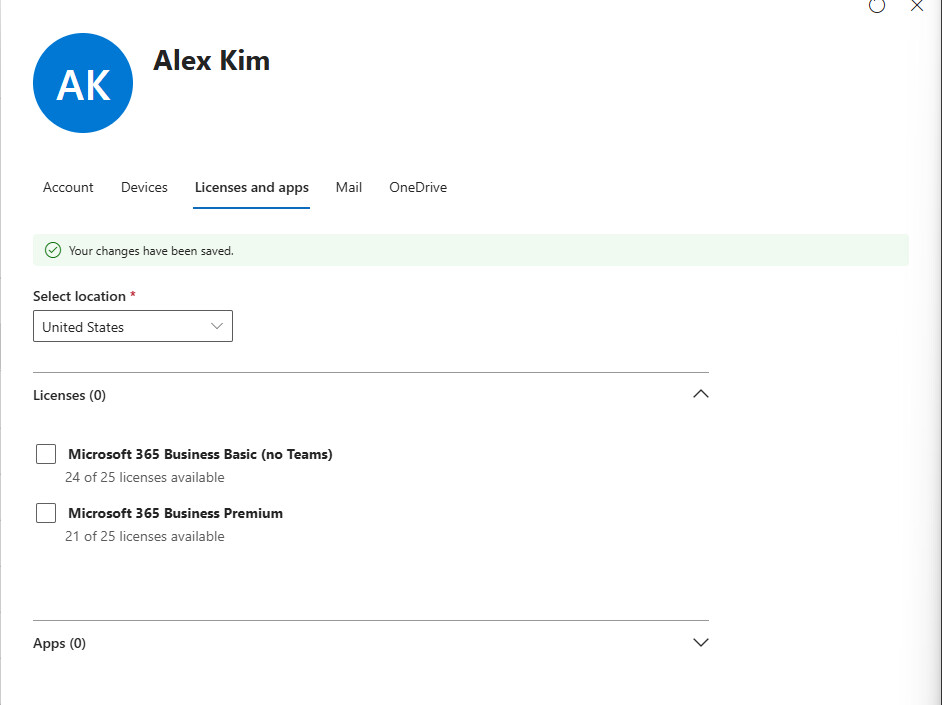
</p>

<p align="center">
  <em>Alex Kim's Licenses and apps tab in the Microsoft 365 admin center, as testuser01: "Your changes have been saved," Licenses (0), Business Premium showing 21 of 25 licenses available after the removal.</em>
</p>

Alex Kim's license was restored immediately afterward. Step Five deliberately licensed her for the rest of this lab's continuity, and this step's test had no reason to leave that changed; Steps Eight through Twelve proceed from the state Step Five established, not from a state Step Seven quietly altered.

The negative side split into two results, only one of which was actually about the role. Attempting Identity > Users > New user as `testuser01` found the control greyed out: License Administrator carries no user-creation permission, as expected. Attempting Identity > Groups > New group, though, succeeded outright, and that does not mean License Administrator grants group management. Identity > Groups > General showed Users can create security groups in Azure portals, API or PowerShell and Users can create Microsoft 365 groups in Azure portals, API or PowerShell both set to Yes at the tenant level, untouched since Lab 01. That setting authorizes group creation for any authenticated member regardless of role; the group `testuser01` created came from that tenant-wide default, not from the role this step assigned. Read against License Administrator's own documented permissions rather than the observed behavior alone, the correct conclusion is that License Administrator grants no group-management capability at all, and the tenant simply never restricted who else does. The group `testuser01` created to run this test was deleted immediately afterward, once it had confirmed the setting rather than the role was responsible; it was never a fixture this lab or Step Eight needed.

<p align="center">
  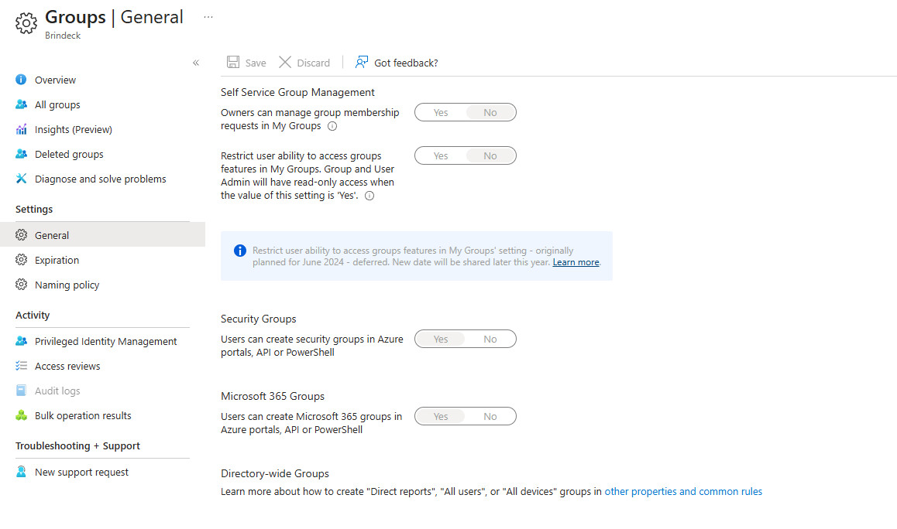
</p>

<p align="center">
  <em>Identity > Groups > General: Users can create security groups in Azure portals, API or PowerShell, and Users can create Microsoft 365 groups in Azure portals, API or PowerShell, both set to Yes, the tenant default this lab found unchanged.</em>
</p>

**Seven-B: built the tenant's first role-assignable group, and confirmed the eligibility rule is set at creation, not toggled on afterward.**

Before creating anything, the role-assignable constraint was tested against groups that already exist rather than taken from Design Decisions' statement of it. From the Global Administrator account, Groups Administrator's Add assignments panel, filtered to its Groups tab, returned "No results found," despite the tenant holding eight groups by this point: four synchronized from `OU=Groups`, plus four cloud-only groups, `All Company`, `Finance` and `Company Announcements` from Step Six, and `IT-Department`, the dynamic membership group Step Six built. `IT-Department` is the strongest case in that set, not an afterthought: it is already excluded on a second, independent ground, since a role-assignable group must use Assigned membership and Design Decisions already ruled out Dynamic. Its absence from the results confirms both constraints hold at once, not only the one this test targeted. That rules out the plan's framing being only about synchronized groups: none of the tenant's eight existing groups qualified, cloud-only, dynamic, or neither, because none of them were created with role-assignability enabled, and the product does not offer a way to turn it on afterward.

`Groups-Administrators` was created to test the alternative: Security type, Assigned membership, one member (Jane Doe), and the Microsoft Entra roles can be assigned to the group toggle enabled at creation, live and selectable now that the tenant holds Microsoft Entra ID P1. No role was assigned from the creation panel itself, so the same Add assignments panel could be rechecked afterward rather than only trusted at face value.

Reopening Groups Administrator's Add assignments panel afterward, filtered again to Groups, now returned `Groups-Administrators` as a selectable result: the same view that had returned nothing against any of the tenant's eight pre-existing groups. Selecting and adding it produced "Successfully added assignment Groups-Administrators," and the role's own Assignments tab listed it: Type Group, Scope Directory.

<p align="center">
  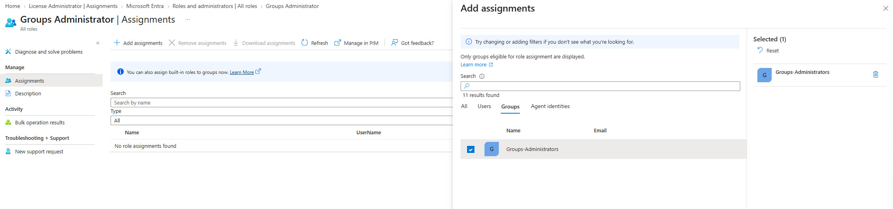
</p>

<p align="center">
  <em>The same Add assignments panel, Groups tab, after Groups-Administrators was created with role-assignability enabled: it appears and is selectable, where no existing group had.</em>
</p>

<p align="center">
  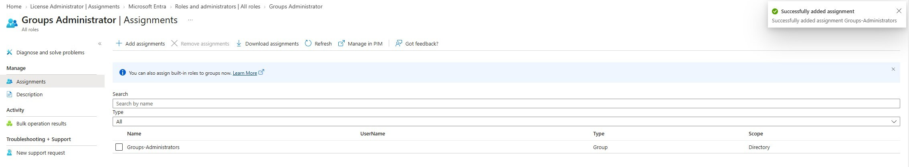
</p>

<p align="center">
  <em>"Successfully added assignment Groups-Administrators," and Groups Administrator's Assignments tab listing Groups-Administrators, Type Group, Scope Directory.</em>
</p>

Checked from the other direction, `Groups-Administrators`' own Assigned roles blade listed Groups Administrator directly: "Members of this role can create/manage groups, create/manage groups settings like naming and expiration policies, and view groups activity and audit reports," Resource name Directory, Resource type Organization, Assignment path Direct, Role type Built-in.

The membership-type constraint Design Decisions named, that a role-assignable group must use Assigned membership rather than Dynamic, was checked directly on the created group rather than left as an unexercised rule: `Groups-Administrators`' Properties page showed Membership type greyed out, not merely defaulted to Assigned but disabled from being changed at all once the group holds the role-assignable flag. The product enforces the constraint by locking the field, rather than by accepting a change and failing it afterward.

Privileged Identity Management, which would let either of this step's assignments be Eligible rather than Active and add just-in-time activation, requires Microsoft Entra ID P2. This tenant holds P1 only, and this track does not plan to acquire P2, so this is recorded from Microsoft's documentation rather than exercised: both assignments this step made are standing, not time-bound, which is what an environment without P2 has regardless of administrator preference.

No on-premises object was touched in this step. Every object created (the group `testuser01` created and deleted to test the self-service setting, and `Groups-Administrators`, of which only `Groups-Administrators` remains) and every account or license modified (testuser01's role assignment, and Alex Kim's temporarily removed and restored license) is cloud-only or lives entirely in the tenant.

### Step Eight: Assigned licenses by group, and found where a direct assignment and a group assignment collide

Assigned Business Premium to two of Step Six's cloud-only groups, watched licenses get granted and revoked by membership alone, moved a user between the two in Microsoft's documented order, and deliberately tried and failed to produce a license assignment error by three separate routes. The step also surfaced content Design Decisions never anticipated: what actually happens to a user who is both directly licensed and a member of a licensed group at the same time.

**Eight-A: assigned Business Premium to Finance, and checked the tenant's own screens against the documentation claim.**

Before assigning anything, the Business Premium product page in the Microsoft 365 admin center was read for any mention of a licensing prerequisite on the group-assignment path itself. There wasn't one. The only banner on the page read "Licensing operations may take longer for tenants with many users," and the page carries no separate Groups tab at all: groups and members share one combined list, under the text "To manage your licenses, select a group or member," which is a different shape than the plan assumed going in. The Assign licenses panel's own copy also independently corroborated one of the constraints Microsoft's documentation states: "Assign licenses for Microsoft 365 Business Premium to members or groups in your organization, a maximum of 20 at a time."

`Finance`, the assigned-membership cloud-only security group Step Six built, was selected as the target. It held zero members at the time, so the assignment consumed no seats. `Finance` subsequently appeared as its own row on the product page with a Type of Group, distinct from the five individually licensed users. `IT-Department`, Step Six's dynamic-membership group, was not used for this step's manual add-and-remove work, since a dynamic group's membership cannot be edited by hand in the portal at all.

**Eight-B: added a clean subject to Finance, and watched a license apply through membership alone.**

`John Smith`, who held no license of any kind at this point in the lab, was added to `Finance`. Business Premium was already checked on his own Licenses and apps tab by the time it was opened, no visible delay of the kind Six-B's dynamic membership rule took roughly two minutes to show. His tab gave no indication of where the license came from, a plain checked box, no badge or note distinguishing a group-sourced grant from a direct one. That is less information than the Entra admin center's own Licenses blade gave in Step Seven, which explicitly labeled Alex Kim's assignment "Direct assignment path." The same fact is visible on one admin surface and invisible on the other.

**Eight-C: tested what happens when a direct assignment and a group assignment supply the same license to the same user.**

`testuser01` already held Business Premium directly, assigned in Step Five, and was added to `Finance` as well. On his own Licenses and apps tab, Business Premium was unchecked and saved. The save was immediate and total: Licenses (0), and the tenant-wide count dropped to 5 of 25 assigned.

<p align="center">
  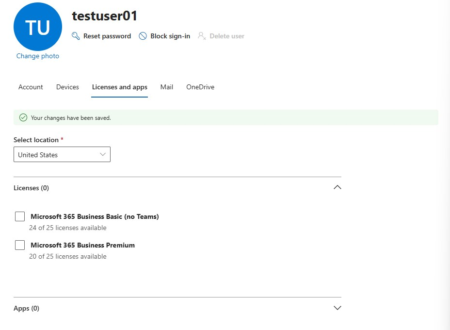
</p>

<p align="center">
  <em>testuser01's Licenses and apps tab immediately after unchecking Business Premium and saving: Licenses (0), Business Basic 24 of 25 and Business Premium 20 of 25 available.</em>
</p>

Checking the Business Premium product page's Errors & Issues tab shortly afterward told a different story: 6 of 25 assigned, zero licensing errors, zero members without licenses.

<p align="center">
  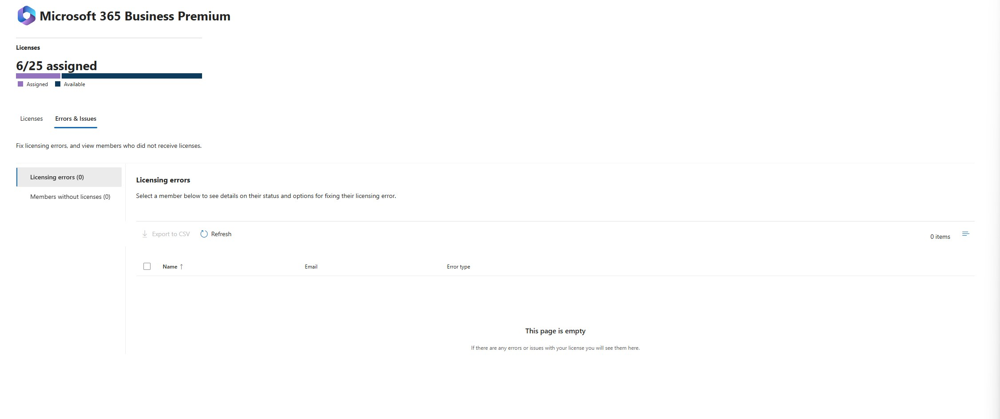
</p>

<p align="center">
  <em>The Business Premium product page's Errors & Issues tab, checked moments after the previous screenshot: 6 of 25 assigned again, no errors, no members without licenses.</em>
</p>

Group-based licensing had silently reasserted the license while `testuser01` remained a `Finance` member, and his own tab confirmed it directly: Business Premium was checked again. The gap between unassignment and reassertion was real, on the order of the time it took to navigate from one screen to the other, not instantaneous, and not visible anywhere as a warning while it was happening.

Removing `testuser01` from `Finance` immediately afterward answered the remaining question: whether the earlier direct assignment had survived underneath the group's reassertion, or had actually been consumed by the uncheck. It had been consumed. His license disappeared entirely the moment group membership ended, with nothing left to hold it. Unchecking a direct assignment on a user who is also group-licensed does not stick while the group membership continues, but it does permanently remove the direct component; what the user is left holding afterward is sourced entirely by the group, whether or not an administrator realizes that has happened.

Business Premium was then reassigned to `testuser01` directly, restoring the state Step Five established, since Steps Eight through Twelve proceed from that baseline the same way Step Seven restored Alex Kim's license after its own test.

**Eight-D: moved a user between two licensed groups in Microsoft's documented order.**

Business Premium was assigned to `Company Announcements` as well, Step Six's other assigned-membership cloud-only group. `John Smith`, still licensed purely through `Finance` membership at this point, was added to `Company Announcements` first, and his license was confirmed still applied. Only then was he removed from `Finance`.

<p align="center">
  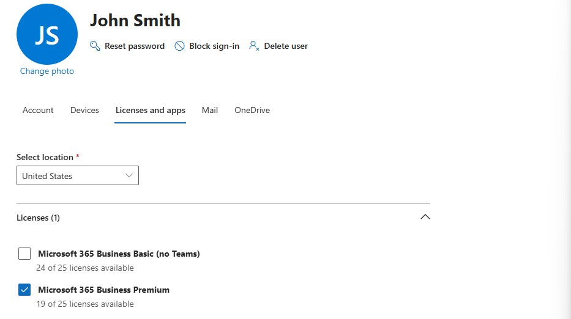
</p>

<p align="center">
  <em>John Smith's Licenses and apps tab after being removed from Finance, having already been added to Company Announcements: Business Premium stayed checked throughout, no gap.</em>
</p>

The license stayed checked the entire time. That contrast with Eight-C is the actual content here: add to the destination, confirm, then remove from the source produced zero interruption, while removing support before the replacement had a chance to apply, as Eight-C did by accident, produced a real if temporary one. That is why Microsoft documents the order it does, demonstrated rather than only cited.

**Eight-E: attempted to induce a license assignment error, and could not, by three separate routes.**

No existing account on this tenant had an unset usage location to begin with; Step Five already established that every account resolves to United States the moment any licensing screen touches it, before an administrator sets anything deliberately. To test whether group-based licensing specifically would behave differently, `nolocation-demo01` was created as a new cloud-only fixture using the "Create user without product license" option during account creation, so that no licensing screen touched the account at all before it was tested. It was added directly to `Finance` without its own Licenses and apps tab ever being opened first.

It was licensed successfully, United States resolved, zero entries on Errors & Issues. Microsoft 365 Business Basic (no Teams) was then also assigned to `Finance`, giving `nolocation-demo01` both SKUs at once to test whether the tenant would treat them as conflicting. Both applied cleanly, no error of any kind.

<p align="center">
  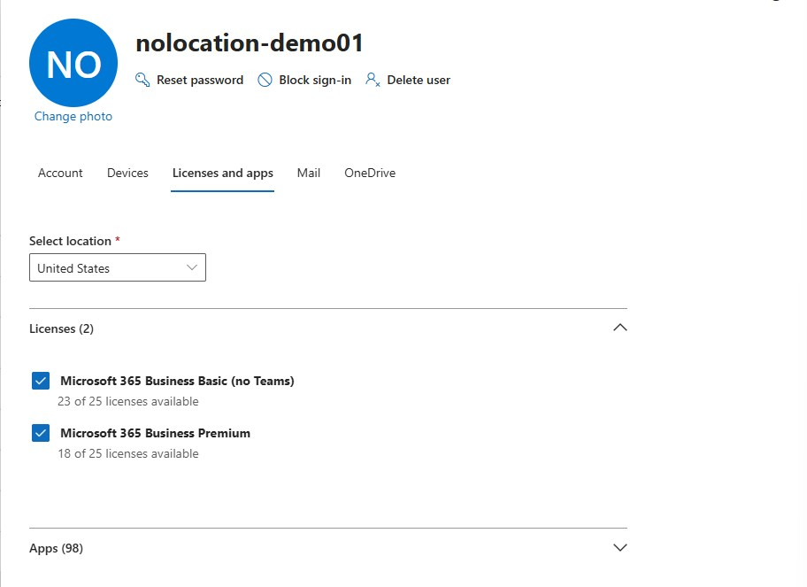
</p>

<p align="center">
  <em>nolocation-demo01's Licenses and apps tab: both Business Basic and Business Premium checked, Select location resolved to United States despite never being set deliberately, Apps (98).</em>
</p>

Insufficient licenses was not attempted; a 25-seat trial against a ten-user tenant was never going to reach it, exactly as the plan anticipated going in. None of the three most reachable license-assignment failure modes, an unlocated user, two overlapping SKUs, or exhausted seats, are exposed through the Microsoft 365 admin center on this tenant. A real error here would need either a much larger population or two genuinely mutually-exclusive SKUs, and this environment has neither.

`nolocation-demo01` was deleted once the test concluded, and the deletion itself surfaced one more finding on the way out. The account was deleted successfully, but the portal also reported a partial failure: "We couldn't unassign licenses for this user. One or more of the licenses could not be modified because they are inherited from a group membership. Manage group-based licenses from the Licenses and apps pivot in the Group Details page."

<p align="center">
  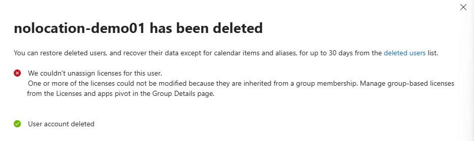
</p>

<p align="center">
  <em>The delete confirmation for nolocation-demo01: "User account deleted" alongside a failure to unassign its group-inherited licenses first, which did not block the deletion.</em>
</p>

A user's group-inherited licenses are not cleanly unassignable through the same flow that unassigns direct ones, a detail this step did not go looking for but which bears directly on what Step Nine's delete-and-restore work should expect.

**Constraints recorded from documentation.** Group-based licensing does not process nested groups: only first-level members of a licensed group receive licenses. This matters here because the on-premises groups this environment synchronizes could plausibly be nested in the future, even though none currently are; nothing in this step tested it directly, since building a nested cloud group for the purpose was out of scope. Licenses can be assigned to a maximum of twenty groups or members at a time, which this step corroborated directly rather than only citing, since the Assign licenses panel's own copy stated the same limit in Eight-A.

**The P1 prerequisite question, settled as far as this lab can settle it.** Microsoft's current group-based licensing documentation states no license tier prerequisite of its own, and nothing on this tenant's own assignment screens claimed one either, exactly as Eight-A found. This tenant holds Microsoft Entra ID P1 throughout Lab 03, so whether Entra ID Free would actually permit or block group-based licensing is not something this lab can observe directly. That gap is recorded rather than assumed closed, the same way Step Two recorded trial eligibility as an open question rather than an assumption.

**Final state.** Read directly from the Business Premium and Business Basic product pages rather than derived: Business Premium stood at 6 of 25 assigned. Five were direct assignments, held by Alex Kim, the Cloud Administrator, `cloudonly-demo01`, Jane Doe, and `testuser01`. The sixth was `John Smith`'s, sourced entirely through `Company Announcements` membership from Eight-D onward. `Finance` remained licensed but empty of members, holding no members after `testuser01`'s removal in Eight-C and `nolocation-demo01`'s deletion in Eight-E, so it consumed no seats, but it still carries two group-level assignments going forward: Business Premium from Eight-A and Business Basic from Eight-E. Business Basic's own consumed count held at 1 of 25, unchanged from before this step, but that count alone hides what changed underneath it: Business Basic is now assigned to `Finance` as a group and was not before, so any future member added to `Finance` would draw both SKUs at once rather than only Business Premium. That assignment sits on a trial that lapses on 2026-09-22, inside the window this lab still has open, so what a group-level assignment does when the subscription behind it lapses is now a real observable question rather than a hypothetical one, and it connects directly to the lapse Step Three already confirmed. No on-premises object was touched.

**Correction, added when Step Ten reopened this state (2026-09-08).** That sourcing held only until 4:03:32 PM on 9/7/2026, when `admin@brindeck.com` removed `John Smith` from `Company Announcements` through the `O365AdminPortal`, an action this document did not record at the time because it happened after this step closed. The gap went unnoticed until Step Ten's own baseline read found the tenant's live state no longer matched what this section describes: `Company Announcements` back to zero members, `John Smith`'s license unchecked. Step Ten re-added the membership and confirmed the license reasserted before its own work continued; see Step Ten for the full account, including what settling this discrepancy surfaced about how Microsoft Graph reports a group's own license assignments. The paragraph above is left as originally written because it was an accurate description of the tenant at the moment Step Eight closed, not because it stayed accurate afterward.

One more recalibration belongs in this same correction rather than a second one. The "6 of 25" figure recorded above was read from a page whose counting basis this lab did not understand at the time. At this step's close the Business Premium composition was five licensed users, two licensed groups, and `John Smith` in `Company Announcements`: seven assignment targets and six consumed seats. That is the identical composition the tenant holds now. The page read 6 of 25 then and reads 7 of 25 now. Step Ten's Part C establishes that the page currently counts assignment targets, and the two readings cannot be reconciled from outside the product. The six consumed seats recorded above stand as originally written, a figure Part C confirms independently.

`nolocation-demo01` is not fully gone, either. Deletion moves an Entra ID user object into Deleted users for up to 30 days before permanent removal, per Microsoft's documented retention behavior, rather than purging it immediately; this session did not check the Deleted users list to confirm it landed there. Combined with the unassignment failure this step already recorded, that leaves open the possibility of a soft-deleted object still holding a group-inherited license underneath it. Step Nine's delete-and-restore work should treat that account as a live complication already sitting in Deleted users rather than as a clean starting point.

### Step Nine: Deleted and restored users, on both object types

Deleted and restored a cloud-only user and a synchronized user, and documented how the two differ. The subjects were named deliberately, because the on-premises half of this step was not reversible in this forest, per Design Decisions.

**Nine-A: settled Step Eight's open question before touching either named subject.**

Step Eight left `nolocation-demo01` in Deleted users with a partial-failure warning: its group-inherited licenses could not be unassigned on the way out. Before deleting `cloudonly-demo01` or creating `deltest01`, this step checked whether that group-sourced license actually survived the soft delete.

The portal confirmed the object present in Deleted users, deleted Sep 7, 2026, 4:01 PM.

<p align="center">
  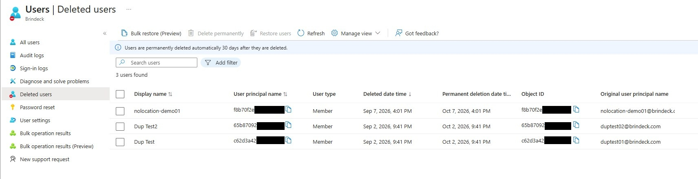
</p>

<p align="center">
  <em>Deleted users at the start of Step Nine: nolocation-demo01 alongside Dup Test and Dup Test2, Lab 02's duptest01 and duptest02.</em>
</p>

Reading its `assignedLicenses` property took two false starts before it worked. `Get-MgDirectoryDeletedItem -DirectoryObjectId microsoft.graph.user -Property '*'` returned the object by userPrincipalName, but every extended property, including `deletedDateTime`, came back blank, not merely empty on `assignedLicenses` specifically, which was the first sign the `-Property` parameter was not actually reaching the request. Dropping to a raw call, `Invoke-MgGraphRequest -Method GET` against `/directory/deletedItems/microsoft.graph.user` with an explicit `$select`, produced the same blank read on the first attempt and then, unexplained, a fully populated one on a second identical call; nothing about the request changed between the two, so the interceding delay is the more likely explanation than anything about the query itself. The populated read showed `assignedLicenses` empty for both `duptest01` and `duptest02`, and two entries for `nolocation-demo01`, matching the two SKUs `Finance` had carried: `21502a13-c8dc-4744-be9c-177fd9d2eafc` (Business Basic, no Teams) and `cbdc14ab-d96c-4c30-b9f4-6ada7cdc1d46` (SkuPartNumber `SPB`, Business Premium), confirmed against `Get-MgSubscribedSku`. These are Microsoft SKU identifiers, not directory object IDs: identical in every tenant and publicly documented, so they are left in full rather than truncated or masked despite carrying the same GUID shape.

A soft-deleted object retains its group-inherited licenses along with everything else Microsoft documents as preserved. Step Eight's unassign failure on the way out was not cosmetic: the licenses genuinely never left. `nolocation-demo01` was left as found, still soft-deleted, not one of the objects this step's plan named for restoration or permanent removal.

The other two objects sitting in Deleted users are not unrelated debris, they are `duptest01` and `duptest02`, the two on-premises collision fixtures Lab 02 Step Nine deleted with `Remove-ADUser` after the Duplicate Attribute Resiliency test concluded. Lab 02 recorded their cleanup as complete: "confirming their cleanup left no residue," and, in its Step Ten reconciliation, "`duptest01` and `duptest02` fully gone on both sides." Neither is true in the tenant. Both objects are soft-deleted, not purged, deleted Sep 2, 2026, 9:41 PM, with thirty-day windows that expire around Oct 2, 2026. Lab 02's reconciliation checked the on-premises OU counts directly and matched the tenant's top-line Overview user count against what the plan predicted, and both checks passed, but neither one can actually distinguish a soft-deleted object from a purged one: Deleted users does not count toward that top-line total, exactly as this step's own Final State observes below, ten users at Overview while three additional objects sit in Deleted users at the same time. A reconciliation built entirely from a count that is blind to the soft-delete state will read as complete regardless of which state the objects are actually in. `duptest01` and `duptest02` are left as found here too, outside this step's named subjects, but the discrepancy is worth carrying into Step Twelve's own reconciliation rather than repeating Lab 02's mistake there.

**Nine-B: the cloud-only case, fully reversible.**

`cloudonly-demo01` was set up to exercise all three properties Design Decisions asked a restore to demonstrate, not license alone: it was added to `All Company`, the tenant's unlicensed, cloud-only, assigned-membership Microsoft 365 group, and assigned the `License Administrator` directory role, the same role Step Seven already validated safely against `testuser01`. `Finance` and `Company Announcements` were both ruled out as the group for this test: each carries a group-based license assignment from Step Eight, and adding either one would layer an Eight-C-style direct-versus-group collision on top of this read and confound it. `IT-Department` was ruled out too, its dynamic membership can't be edited by hand. The pre-delete baseline, read live rather than assumed: object Id `0c305ee2-...`, one direct license (`cbdc14ab-...`, Business Premium, unchanged since `All Company` carries none), and a `memberOf` of exactly two entries, `All Company` (`#microsoft.graph.group`) and `License Administrator` (`#microsoft.graph.directoryRole`).

Deleted through the portal at 2:26 PM on Sep 8, 2026. As with the first pass, no partial-unassign warning, consistent with Nine-A's finding: it's specifically a group-inherited license the delete flow can't cleanly detach, and this account holds none. The object appeared in Deleted users immediately, permanent deletion date Oct 8, 2026, 2:26 PM.

Restored through the portal. All three properties came back identical to the baseline, the same license, the same group membership, and the same directory role assignment, confirmed by re-running the same two Graph queries against the restored object. Microsoft's documented retention behavior for a cloud-only soft delete holds for group membership and role assignment exactly as it does for licensing, not merely for the one property this account happened to hold going into the test.

`cloudonly-demo01` was then returned to its pre-test state: removed from `All Company` and stripped of the `License Administrator` assignment, confirmed by an empty `memberOf` again. It is a fixture Lab 04 and Lab 05 both inherit and needs to arrive there exactly as it started, license-only, no group, no role.

**Nine-C: the synchronized case, reversible on the cloud side and terminal on-premises.**

`deltest01` was created for this step, via `New-LabUser.ps1` from WIN11-CLIENT01, left at its default target OU (`OU=User Accounts,DC=corp,DC=home,DC=arpa`), which is the synchronized OU and carries the routable `@brindeck.com` UPN suffix per ADR-019. It synchronized promptly and confirmed in the tenant with object Id `4dc7ca85-...`.

Deleted in the tenant only, through the portal, at 12:28 PM, leaving the on-premises object untouched. `Get-ADSyncScheduler` gave the next scheduled Delta cycle as 12:46:09 PM; rather than force it, the step waited for that scheduled run, since the point was to watch the same unattended half-hourly cycle Lab 02 Step Nine had to make reliable before it could run without anyone watching it. By 12:55 PM, `deltest01` resolved again through `Get-MgUser` with the identical object Id, `4dc7ca85-...`, confirming the scheduled cycle had restored it on its own. Nothing was checked between the 12:46:09 PM cycle and the 12:55 PM confirmation, so the honest window is eighteen to twenty-seven minutes after the delete, not a single precise figure, but the outcome is unambiguous either way: Design Decisions' prediction held. Microsoft Entra is not the source of authority for a synchronized object, so an Entra-side delete against a still-existing on-premises source does not stick.

The on-premises half followed, and did not undo itself. `Remove-ADUser -Identity "deltest01"` ran from WIN11-CLIENT01 at 12:57 PM. With no Active Directory Recycle Bin enabled on `corp.home.arpa`, deliberately, per Lab 02's deferral of that decision to the Enterprise Infrastructure track, there was no Deleted Objects container behind it: the object was simply gone. The next Delta cycle, scheduled 1:17:16 PM, carried the deletion to the cloud side: `Get-MgUser` stopped resolving the account, and the same object, `4dc7ca85-...`, reappeared in Deleted users, soft-deleted a second time at 1:20 PM, this time for real, with nothing on-premises left to restore it from.

`deltest01` was then recreated on-premises with the identical `sAMAccountName` and UPN, at 1:30 PM. The next cycle, 1:47:44 PM, provisioned it in the tenant under a different object Id: `f99ab470-...`.

<p align="center">
  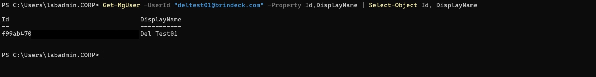
</p>

<p align="center">
  <em>deltest01 recreated on-premises with the same sAMAccountName and UPN: Get-MgUser resolves it to f99ab470-..., a different object than the one still orphaned in Deleted users.</em>
</p>

This is the finding the case exists to produce. The recreated on-premises object carries a new `objectGUID` and therefore a new `ms-DS-ConsistencyGuid` source anchor, so Entra Connect provisioned an unrelated second cloud object rather than rejoining the one it had already soft-deleted. The original object, `4dc7ca85-...`, stayed orphaned in Deleted users with its thirty-day restore window still technically open and nothing on-premises left to claim it: a genuine safety net for a cloud-only object turns out not to be one for a synchronized object whose source has been destroyed, exactly the consequence of the deferred Recycle Bin recommendation that Design Decisions argues the Enterprise Infrastructure track should weigh.

**Cleanup.** The recreated on-premises `deltest01` was deleted a second time, and this time the sync cycle was triggered manually rather than watched, since the unattended behavior had already been demonstrated twice and nothing further was riding on its timing. Once the second cloud object, `f99ab470-...`, appeared in Deleted users alongside the orphaned `4dc7ca85-...`, both were permanently purged through the portal's bulk delete.

<p align="center">
  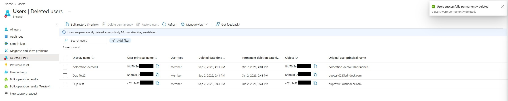
</p>

<p align="center">
  <em>Both deltest01 objects purged from Deleted users: "2 users were permanently deleted," the list back to the three unrelated objects, nolocation-demo01, Dup Test, and Dup Test2, that were already there before this step began.</em>
</p>

`cloudonly-demo01` was confirmed still live and intact, matching its pre-delete baseline.

**Final state, for Step Twelve's reconciliation.** Read fresh from the Entra Overview rather than derived: 10 users, 9 groups, 1 application, 0 devices. The user count matches Step One's baseline exactly, confirming `cloudonly-demo01`'s round trip left no trace and `deltest01` left no residual object on either side. The group count, 9 against a baseline of 5, is not this step's doing; it reflects the groups Steps Six and Seven created and Step Nine did not touch. `nolocation-demo01` remains exactly where Step Eight left it, soft-deleted, its group-inherited licenses confirmed still attached, a live complication this step recorded rather than resolved. `deltest01` is the one object this lab removes permanently on both sides, and it took two distinct Entra object GUIDs to get there, the direct cost of recreating a synchronized account without an Active Directory Recycle Bin behind it.

### Step Ten: Deleted and restored groups, and settled the security group question

Two pieces of work share this heading. Part A is a finding the plan did not anticipate: `Finance` and `Company Announcements`, the two group-based-licensing subjects Step Eight built, turned out to be undeletable while their license assignments are active, discovered only after the tenant's live state was found to have quietly diverged from what Step Eight recorded. Part B is the step as planned: delete and restore a cloud-only security group and a cloud-only Microsoft 365 group to settle the documentation contradiction between Microsoft's Entra PowerShell reference, which states that only Microsoft 365 groups can be restored and that security groups cannot, and its recoverability architecture guidance, which states that soft-deleted Microsoft 365 groups and cloud security groups both appear on the Deleted groups page and both restore. `Finance` and `Company Announcements` could not supply Part B once Part A found they would not delete at all, so two disposable groups, `zz-delete-test-security` and `zz-delete-test-m365`, were built for it, and the licensing block on the original two was left standing rather than resolved, since the thing that turned out not to work was the deletion itself.

**Part A: `Finance` and `Company Announcements` would not delete while their license assignments were active, and neither the Entra admin center's own Licenses blade nor Microsoft Graph can show why.**

The plan called for reading the tenant's live state before touching either group, on the same discipline Step Nine's own opening established. It did not match Step Eight's Final State. `Finance`'s Overview still showed zero direct members, as expected, but its Licenses blade read "No license assignments found" rather than the two SKUs Step Eight assigned it. `Company Announcements` showed the identical thing: zero members, no license assignments. `John Smith`'s Licenses and apps tab had nothing checked, and his Groups blade listed only `Domain-Users-Standard`, `IT-Admins`, and `IT-Department`; `Company Announcements` was not on it. The Microsoft 365 admin center told a third story: the Business Premium product page still read 6 of 25 assigned, with `Company Announcements` and `Finance` both listed as Group-type license holders on that page even while the Entra admin center showed each holding zero members.

<p align="center">
  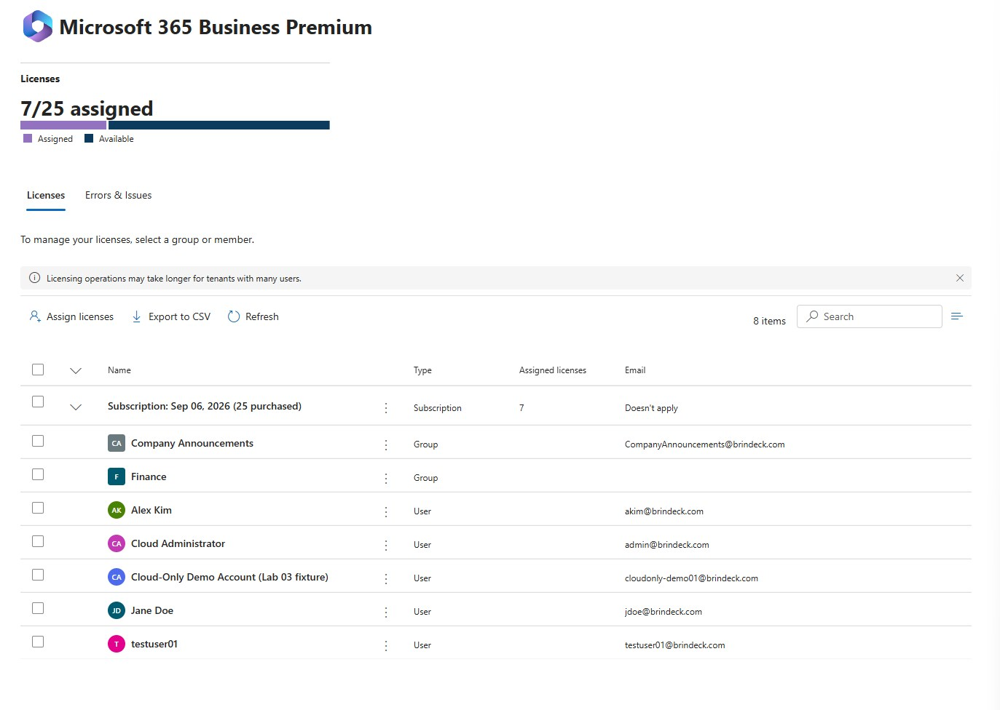
</p>

<p align="center">
  <em>The Business Premium product page's Licenses tab: Company Announcements and Finance both listed as Group-type license holders, 7 of 25 assigned. This is the post-repair state, captured after John Smith was re-added below rather than at the baseline moment described above, which read the identical Group-type listing at 6 of 25.</em>
</p>

The Entra audit log resolved most of it, though not cleanly. Filtering Directory audit logs on each group by target surfaced only "Update group" events initiated by `CloudLicensingSystem`, Microsoft's first-party licensing service principal (`MCAPICommercialProductLicensing` user agent), timestamped 9/7 2:58 PM for `Finance` and 9/7 3:21 PM for `Company Announcements`. Neither event's Modified Properties held anything more specific than an empty `Included Updated Properties` string and a `GroupType` value, and an early pass at scripting the initiator across several such events produced what looked like a wall of blank actors; that turned out to be a PowerShell truthiness defect in the script reading them, not a real gap in the log, corrected once a raw JSON dump was taken instead (recorded in Troubleshooting and Adjustments). The event that actually mattered did not show up under either group's own audit filter at all: filtering directly for a "Remove member from group" activity targeting `John Smith` returned no results, because Microsoft Entra records that activity against the group being changed, not the user being removed. A broader pull across the full week, filtered client-side on both group object IDs instead of relying on the portal's target-name filter, found it: `admin@brindeck.com` removed `John Smith` from `Company Announcements` at 4:03:32 PM on 9/7/2026, through `O365AdminPortal`, an action Step Eight's Final State never recorded because it happened after that step closed. That correction is recorded beside Step Eight's Final State directly rather than repeated here.

`John Smith` was re-added to `Company Announcements`, and the Business Premium product page confirmed the repair immediately: 7 of 25 assigned. Reassigning membership was sufficient; nothing needed to be done to the license itself, consistent with Eight-B's original finding that group membership alone drives a group-based license.

With the tenant back at the state Step Eight described, deletion was attempted against `Finance` first, the group the original plan named to start with. `Finance` held zero members throughout this entire step, exactly as it had since Eight-C, but it still carries two group-level SKU assignments from Step Eight: Business Premium from Eight-A and Business Basic from Eight-E. That is not carried forward from Step Eight on faith: the Business Premium product page above already confirmed it, listing `Finance` as a Group-type license holder even at zero members, and the deletion block described next confirms it a second, independent way. The portal refused the deletion twice in a row with the same generic message: "Failed to delete group. Unable to complete due to service connection error. Please try again later."

<p align="center">
  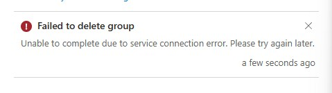
</p>

<p align="center">
  <em>The portal's error toast after the delete attempt: a generic service connection message, no group name or other identifying detail in the frame itself, and no indication of the actual constraint underneath it.</em>
</p>

`Remove-MgGroup -GroupId $fin.Id` was tried directly, to surface whatever the portal's wrapper was hiding. The first attempt failed with a `403 Authorization_RequestDenied`, which read at first like a role gap; `Get-MgUserMemberOf -UserId admin@brindeck.com` confirmed Global Administrator on the signed-in account, ruling that out; a clean `Disconnect-MgGraph`/`Connect-MgGraph` reconnect (see Troubleshooting and Adjustments for the scope-set either side of it) turned the retry into a different, and real, error: `400 Request_BadRequest: "A group with active modern licenses assigned cannot be deleted."` That is the finding. Neither Microsoft's group-based licensing documentation nor either admin center's delete confirmation mentions this constraint anywhere this lab looked; it surfaced only once the generic portal message was bypassed for the underlying Graph error, and only after a token issue had been cleared out of the way first. `Finance` had no members at all when this ran, so the block is keyed to the group's own active license assignment rather than to whether any member is currently drawing a license through it. `Company Announcements`'s deletion was not independently tested, since `Finance`'s result already demonstrated the constraint, but it carries an identically active Business Premium assignment and, by the same stated rule, should be blocked the same way; that is an inference this lab records rather than a result it verified directly.

<p align="center">
  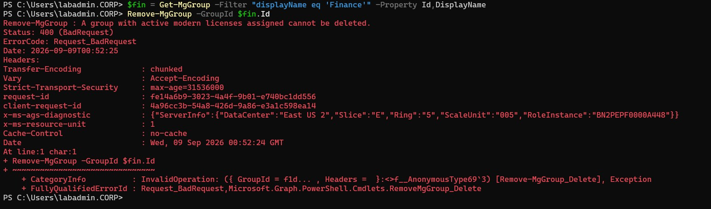
</p>

<p align="center">
  <em>The complete retried Remove-MgGroup -GroupId $fin.Id failure: Status 400 (BadRequest), ErrorCode Request_BadRequest, and the full message text, "A group with active modern licenses assigned cannot be deleted."</em>
</p>

What makes this worth a full write-up rather than a one-line note is that Microsoft Graph's own group-level read cannot see the constraint it is itself enforcing. A raw `Invoke-MgGraphRequest` against each group's `assignedLicenses` property, run well after the repair and a scope reconnect had ruled out staleness and permissions as explanations, still returned an empty `{}` for both `Finance` and `Company Announcements`, the same empty result the typed `Get-MgGroup -Property AssignedLicenses` cmdlet had already given (itself a repeat of Nine-A's `-Property` gotcha, also recorded in Troubleshooting and Adjustments). The same raw call against `Company Announcements`'s membership, by contrast, correctly returned one member. A group Microsoft Graph will not let an administrator delete, on the stated grounds that it carries an active modern license, is a group whose own `assignedLicenses` property Graph itself reports as empty.

<p align="center">
  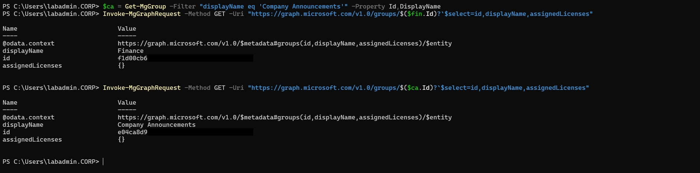
</p>

<p align="center">
  <em>Raw Invoke-MgGraphRequest reads against both groups' assignedLicenses in one frame: {} for Finance and {} for Company Announcements, each group's object ID masked past its first segment in the frame.</em>
</p>

The same gap reaches down to the user. `John Smith`'s own `licenseAssignmentStates`, read the same way, shows the Business Premium SKU as `state: Active`, `error: None`, but `assignedByGroup: null`, exactly the field that would name `Company Announcements` as the source if it were populated.

<p align="center">
  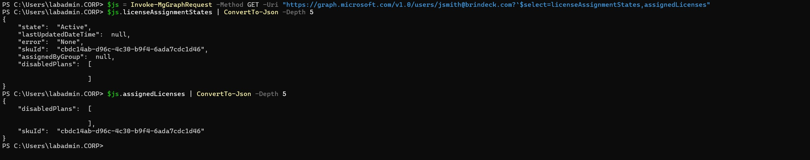
</p>

<p align="center">
  <em>John Smith's licenseAssignmentStates for the Business Premium SKU: Active, no error, but assignedByGroup null, even though the Microsoft 365 admin center and the deletion block both confirm the license is genuinely group-sourced.</em>
</p>

This is left as an open, unresolved gap rather than a settled explanation. The Microsoft 365 admin center and the deletion block itself both confirm, independently, that the modern-licensing commerce system tracks the group-to-license relationship accurately and enforces it. Neither directory-side surface agrees with it: the Entra admin center's own group Licenses blade read "No license assignments found" for both groups at the start of this investigation, and Microsoft Graph's assignedLicenses and licenseAssignmentStates.assignedByGroup properties still read empty and null, well after the repair ruled out staleness as an explanation. That gap is specifically about those two properties reading empty and null; it is not a disagreement about how many seats are actually consumed, which Part C below reconciles precisely, once each of the tenant's two seat-count figures is read for what it actually counts. The split is between the directory surfaces, portal and Graph alike, and the commerce system that actually tracks and enforces the assignment; why that split exists is not something this lab can settle from the outside, and it is recorded here as a finding for a later lab or a support case to take further rather than as a conclusion. `Finance` and `Company Announcements` were both left exactly as Step Eight configured them, licensed and undeleted, since the deletion this step originally planned against them is the one thing this finding shows cannot be done.

**Part B: deleted and restored a disposable cloud-only security group and a disposable cloud-only Microsoft 365 group, and settled the documentation contradiction.**

With `Finance` and `Company Announcements` ruled out by Part A, two fixtures were built purely for this test: `zz-delete-test-security`, a cloud-only assigned-membership security group, and `zz-delete-test-m365`, a cloud-only assigned-membership Microsoft 365 group. Neither was ever licensed. `cloudonly-demo01` was added to both as their sole member, the same choice Nine-B made and for the same reason: it is the one cloud-only fixture in this tenant that is safe to move around without disturbing a Global Administrator-tier account. Both groups were created at 7:15 PM on 9/8/2026; `zz-delete-test-security` came back with zero owners and one direct member, and `zz-delete-test-m365` came back with one owner and one direct member, the difference being that a Microsoft 365 group assigns its creator as owner automatically and a security group does not. `cloudonly-demo01`'s own Groups blade confirmed membership in both before either was touched.

Both were deleted together through the portal at 7:19:17 PM on 9/8/2026. Both appeared on Deleted groups immediately afterward, `zz-delete-test-m365` and `zz-delete-test-security` side by side with the tenant's pre-existing `Testgroup`, each carrying a permanent deletion date of 10/8/2026, 7:19:17 PM, thirty days out exactly as Microsoft documents for a soft-deleted group.

<p align="center">
  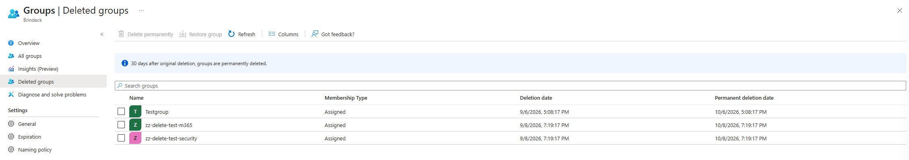
</p>

<p align="center">
  <em>Deleted groups immediately after deletion: zz-delete-test-m365 and zz-delete-test-security both listed by name alongside Testgroup, each with Membership Type Assigned, deletion date 9/8/2026 7:19:17 PM, and permanent deletion date 10/8/2026 7:19:17 PM. The grid carries no group-type column; that one is a security group and the other a Microsoft 365 group follows from how each was created in Part B, not from anything visible on this screen.</em>
</p>

That single screen settles the contradiction. The security group is on Deleted groups, exactly as the recoverability architecture guidance states and exactly contrary to what the PowerShell reference states. Restoring both through the portal confirmed the rest of it: both groups came back, `cloudonly-demo01`'s Groups blade showed membership restored in both without needing to be re-added, and Deleted groups returned to holding only `Testgroup`.

On this tenant, against a genuine soft-delete and restore rather than a documentation reading, Microsoft's recoverability architecture guidance is the one that held: a cloud-only security group appears on Deleted groups and restores cleanly, with its membership intact, the same as a cloud-only Microsoft 365 group. The PowerShell reference's claim that security groups cannot be restored did not hold against this tenant, in the same shape as Lab 02's `Get-EntraDirSyncFeature` finding against its own documentation.

The licensing half of the original plan could not be run the way Design Decisions anticipated, and that is itself part of the finding rather than a gap in this step. The plan asked what happens to a group's own license assignments when the group is deleted, and whether they come back on restore. Part A's finding answers a version of that question more directly than Part B ever could have: on this tenant, a group carrying an active modern license assignment cannot be deleted at all, so there is no delete-and-restore cycle for a license to survive or fail. `zz-delete-test-security` and `zz-delete-test-m365` were never licensed, precisely because `Finance` and `Company Announcements`, the only two groups on this tenant that were, turned out to be the two groups this step could not use for it.

Both `zz-delete-test-*` groups were permanently deleted a second time once the test concluded, through the portal's bulk permanent-delete action; Deleted groups returned to holding only `Testgroup`.

**Part C: reconciled the seat-count discrepancy between the product page and `Get-MgSubscribedSku`.**

The Business Premium product page reads 7 of 25 assigned. `Get-MgSubscribedSku` reads `ConsumedUnits: 6` for `SkuPartNumber SPB`, against the same 25-seat subscription confirmed since Step Two. Both were read within minutes of each other on 9/8/2026, against the identical tenant state, and they disagree.

<p align="center">
  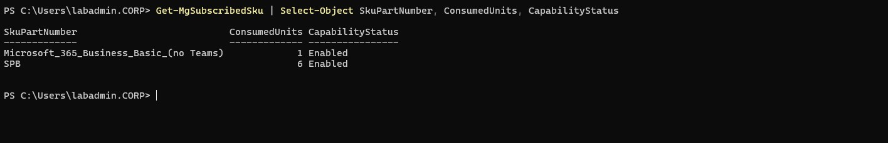
</p>

<p align="center">
  <em>Get-MgSubscribedSku | Select-Object SkuPartNumber, ConsumedUnits, CapabilityStatus, narrowed to omit the Id, AccountId, and SubscriptionIds columns: SPB (Business Premium) at 6 consumed, Microsoft 365 Business Basic (no Teams) at 1, both Enabled.</em>
</p>

The product page's own CSV export is what resolved it, because the page's rolled-up view cannot: expanding the subscription row lists assignment targets by name, but a group-sourced holder like `John Smith` rolls up under `Company Announcements`'s row rather than appearing on his own, so nothing short of the raw export actually enumerates what the page's number is counting. The export lists exactly seven rows, every one `Has license: true`:

| Display name | User principal name | Assignee type | Has license | AssignedProductSkus |
|---|---|---|---|---|
| testuser01 | testuser01@brindeck.com | User | true | SPB |
| Cloud-Only Demo Account (Lab 03 fixture) | cloudonly-demo01@brindeck.com | User | true | SPB |
| Cloud Administrator | admin@brindeck.com | User | true | SPB |
| Jane Doe | jdoe@brindeck.com | User | true | SPB |
| Alex Kim | akim@brindeck.com | User | true | SPB |
| Finance | (none) | Group | true | (none) |
| Company Announcements | CompanyAnnouncements@brindeck.com | Group | true | (none) |

(Columns uniform or blank across all seven rows, among them Last name, State or province, City, Job title, and Selected, are omitted for readability. The export's own `Object id` column is dropped entirely rather than masked, the same directory-identifier policy this lab already applies to object GUIDs elsewhere. `John Smith` appears in none of the seven rows, and neither group row carries an `AssignedProductSkus` value of its own, the export's own confirmation that a group's seat is not counted the way a user's is.)

The arithmetic is plain once the export is in hand. Seven rows means seven assignment targets: five licensed users and two licensed groups. `Get-MgSubscribedSku`'s six consumed units means six seats actually held by a live user, and a raw Graph enumeration of every live user's assigned SKUs finds exactly those six: the same five users, plus `John Smith`, who holds no row of his own because his seat is sourced through `Company Announcements`. The two group rows do not resolve to two more seats. `Company Announcements` resolves to one, `John Smith`'s. `Finance`, licensed since Eight-A and Eight-E but holding no members since Eight-C, resolves to none. Seven targets, six seats: the product page counts the former, `Get-MgSubscribedSku` counts the latter, and the one-seat gap between them is exactly `Finance`'s empty membership.

**Finding one, stated operationally.** The Business Premium product page's assigned count overstates real seat consumption by exactly one for every licensed group that currently holds no members, and this tenant carries exactly one such group. An administrator reading 7 of 25 and planning a purchase or a renewal against that figure would provision for one seat more than the tenant is actually using, not because the page is wrong about what it counts, but because what it counts is assignment targets rather than consumed seats, and it does not say so anywhere on the page itself.

**Finding two, stated and closed.** A soft-deleted user retains its `assignedLicenses` property intact but consumes no seat toward `Get-MgSubscribedSku`'s count; the property and the seat are tracked separately, and only one of the two survives a soft delete's absence from the live population. `nolocation-demo01`, soft-deleted 4:01 PM on 9/7/2026, still carries the SPB SKU on its object per the raw deleted-items read, and appears in neither the product page's seven rows nor `Get-MgSubscribedSku`'s six. That closes the question Step Eight's unassign failure opened and Nine-A carried forward without resolving: the group-inherited license genuinely never left the object, but it is not consuming one of the twenty-five while the object sits deleted. `duptest01` and `duptest02` carry nothing on the same raw read, which narrows what Step Twelve actually has to decide about them to a directory-hygiene question rather than a licensing one.

One observation from this step's own record does not fit the composition above, and is recorded rather than resolved. The same composition, `Company Announcements` and `Finance` both already listed as Group-type rows on the product page, produced a 6 of 25 reading on 9/7/2026 and a 7 of 25 reading on 9/8/2026, the only change between the two being `John Smith`'s membership in `Company Announcements`. Under the target-counting basis this section establishes, that should not have moved the count: a group already listed as a target does not add a target when a member is added to or removed from it, since it is the group, not its membership, that the page is counting. Either the baseline reading was taken before the page had genuinely settled on listing both group rows despite what it displayed at the time, or the page's basis is not purely target-counting in every state it can be in. No mechanism for this is proposed here; it is recorded as unresolved rather than folded into the reconciliation above.

**Final state, for Step Twelve's reconciliation.** Read fresh from the Entra Overview rather than derived: 9 groups, unchanged from Step Nine's own close, since both `zz-delete-test-*` fixtures were created and fully purged within this step and left no trace on the count. `Finance` and `Company Announcements` are exactly where Step Eight left them: licensed, `John Smith` a member of `Company Announcements` again after this step's repair, both groups now confirmed undeletable while that license assignment stands rather than merely assumed reversible. Part C's reconciliation gives Step Twelve the finished figures to work against: Business Premium at seven assignment targets and six consumed seats against twenty-five enabled, Business Basic at one consumed seat, and soft-deleted `nolocation-demo01` holding an SPB assignment on its object that counts toward neither figure. `nolocation-demo01`, `duptest01`, and `duptest02` remain exactly as Step Nine's own Final State left them, soft-deleted and outside this step's scope; this step adds nothing to that list and removes nothing from it. The `zz-delete-test-*` pair is the one addition and the one clean removal this step made: both objects were created, deleted, restored, and permanently purged entirely within Step Ten, and neither is present in any form, soft-deleted or otherwise, at this step's close.

### Step Eleven: Established what can and cannot be edited on a synchronized object

Confirmed the tenant's live state against Step Ten's Final State before touching anything, on the same discipline that step's own opening established and that Step Ten's own history shows is not ceremony. The Entra Overview read 9 groups and 10 users. `Finance` still showed zero direct members and "No license assignments found" on its Licenses blade, the same gap Step Ten already found rather than a new one. `Company Announcements` showed one direct member, John Smith, with the identical Licenses-blade gap. The Business Premium product page read 7 of 25 assigned. `Get-MgSubscribedSku` read `SPB` at 6 consumed and Microsoft 365 Business Basic (no Teams) at 1, both Enabled. Deleted users held exactly three objects, `nolocation-demo01`, `duptest01`, and `duptest02`. All six checks matched Step Ten's Final State exactly. No drift, so this step proceeded from Step Ten's own baseline rather than a re-derived one.

Subjects: `mjohnson` (Mary Johnson), a synchronized, unlicensed user, confirmed going in with a blank Job title, `Account enabled: Yes`, and existing membership in `Domain-Users-Standard` and `IT-Admins`, both synchronized from Windows Server AD; and `cloudonly-demo01`, confirmed license-only with zero group memberships and zero directory role assignments before anything else ran. `mjohnson`'s existing membership in `IT-Admins` ruled it out as this step's synchronized-group refusal target for exactly the reason Design Decisions gives, so `Lab-Workstations` was used instead.

**Eleven-A: directory attributes are locked per field, not per object, and the one field the portal left open on the Identity tab was the one an administrator would least expect.**

Edit properties on `mjohnson` showed every field on the Job Information tab disabled: Job title, Company name, Department, Employee ID, Employee type, Office location, and the Manager and Sponsors controls, all greyed and unclickable, no save to even attempt. The Identity tab told a different story. Display name, First name, Last name, and User type were disabled the same way, but User principal name rendered as a live, editable field with its own domain dropdown, the only field on either tab the portal left open.

<p align="center">
  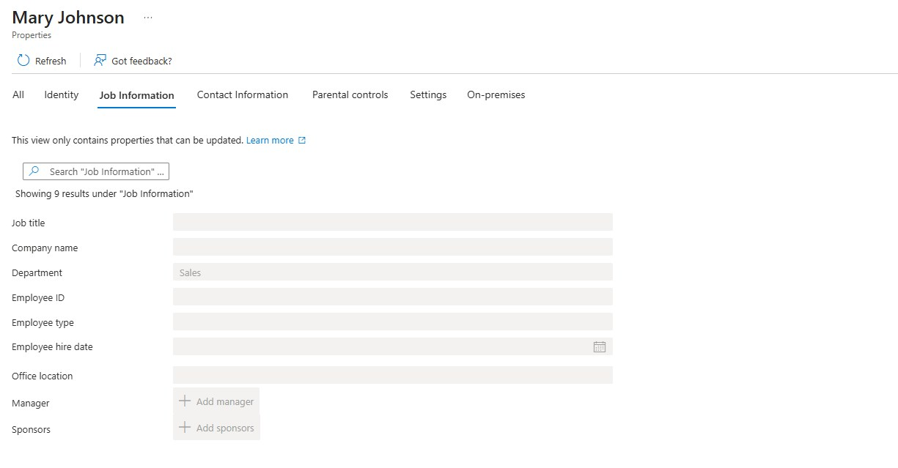
</p>

<p align="center">
  <em>mjohnson's Edit properties view, Job Information tab, "Showing 9 results under Job Information": Job title, Company name, Department (holding Sales), Employee ID, Employee type, Employee hire date, and Office location all rendered as disabled fields, with Manager and Sponsors as greyed Add controls.</em>
</p>

The Identity tab capture below was taken after the UPN reverted in Eleven-B, which is why User principal name reads `mjohnson` rather than the temporary `mjohnson-test` it held earlier in this session.

<p align="center">
  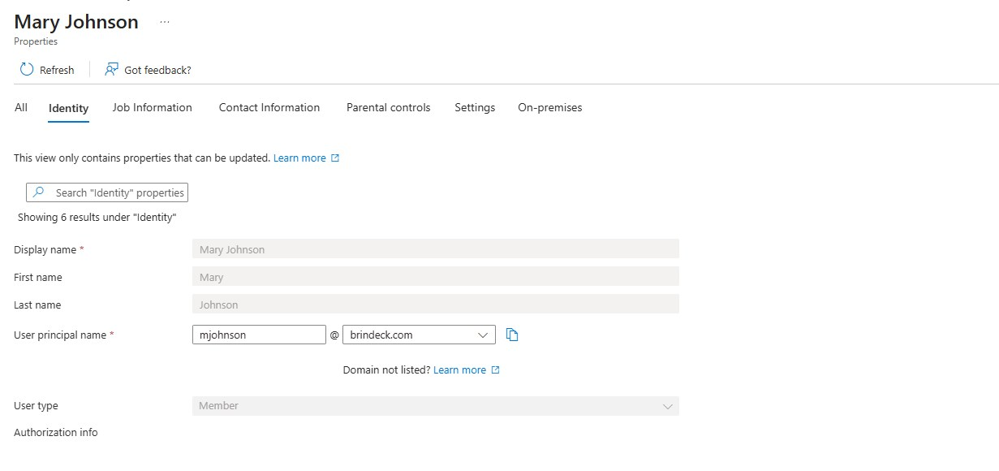
</p>

<p align="center">
  <em>mjohnson's Edit properties view, Identity tab, "Showing 6 results under Identity": Display name (Mary Johnson), First name (Mary), and Last name (Johnson) all greyed, User type (Member) greyed with a disabled dropdown, and User principal name rendered as a live white text box reading mjohnson beside an active brindeck.com domain dropdown and a copy control, with a "Domain not listed?" link beneath it.</em>
</p>

That asymmetry matters more than a simple "synchronized objects are locked" finding would: the lock is enforced per field rather than per object, and the field left open is user principal name, the one a sign-in depends on, not a cosmetic one. What the UPN field actually did with that opening is Eleven-B.

Because the portal locked Job title before any save could be attempted, the refusal itself had to be captured at the Microsoft Graph layer instead. These Graph-layer writes were run after the UPN change Eleven-B describes below, which is why the commands quoted address the account by its temporary `mjohnson-test@brindeck.com` UPN rather than her ordinary one; every Job Information field was still locked exactly as shown above, only her UPN had already changed by this point in the session. The screenshot below captures a later re-run of the same write, made after the UPN had reverted to `mjohnson@brindeck.com` in Eleven-B; the failure was identical in status, error code, and message text:

```powershell
Update-MgUser -UserId "mjohnson-test@brindeck.com" -JobTitle "Cloud Write Test"
```

```
Update-MgUser : Unable to update the specified properties for on-premises mastered Directory Sync objects or objects currently undergoing migration.
Status: 400 (BadRequest)
ErrorCode: Request_BadRequest
```

<p align="center">
  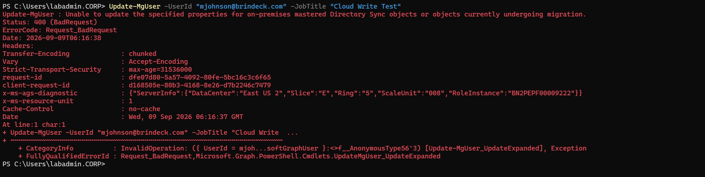
</p>

<p align="center">
  <em>Update-MgUser -UserId "mjohnson@brindeck.com" -JobTitle "Cloud Write Test" re-run after the UPN reverted: Status 400 (BadRequest), ErrorCode Request_BadRequest, the full message naming on-premises mastered Directory Sync objects, and the complete header block down to FullyQualifiedErrorId, including the request-id and client-request-id correlation identifiers in full, the same treatment as screenshot 31.</em>
</p>

This is the single artifact Design Decisions called out as most instructive, and it earns that description: it names the constraint by category, directory sync objects, rather than returning a bare permissions error that would have left the actual reason to guess at. The identical write against `cloudonly-demo01` succeeded silently and read back as set:

```powershell
Update-MgUser -UserId "cloudonly-demo01@brindeck.com" -JobTitle "Cloud Write Test"
Get-MgUser -UserId "cloudonly-demo01@brindeck.com" -Property JobTitle | Select-Object JobTitle
```

```
JobTitle
--------
Cloud Write Test
```

The `mobile` and `otherMobile` exception Design Decisions flagged as worth checking rather than assuming did not hold on this tenant. The identical write against `mjohnson`,

```powershell
Update-MgUser -UserId "mjohnson-test@brindeck.com" -Mobile "555-0100"
```

returned the exact same error, same status, same error code, same message text naming on-premises mastered Directory Sync objects. Microsoft's current documentation states this override is no longer possible for synchronized users, and this tenant behaved exactly as documented rather than preserving the historical exception. That result is also consistent with the tenant's own configuration read back later in Eleven-B: `BypassDirSyncOverridesEnabled`, the specific flag that would have let Mobile and OtherMobile persist independently of on-premises AD, read `False`.

**Eleven-B: the UPN write the portal allowed actually landed on the object, persisted through a completed synchronization cycle, and is explained by a tenant-level feature flag rather than left as a bare surprise.**

Changing `mjohnson`'s UPN from `mjohnson@brindeck.com` to `mjohnson-test@brindeck.com` through Edit properties, saved at 12:56 AM EDT, returned "Successfully updated user" rather than the refusal Job title and Mobile had just returned.

<p align="center">
  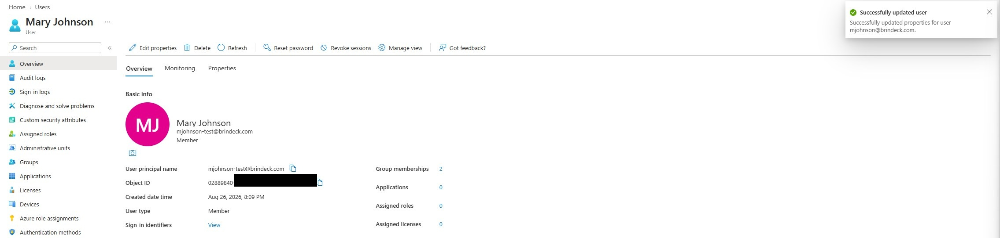
</p>

<p align="center">
  <em>mjohnson's Overview immediately after the UPN edit: "Successfully updated user" toast, and the page itself now reading mjohnson-test@brindeck.com throughout.</em>
</p>

A Graph read-back confirmed the change had actually reached the directory object rather than only a portal toast:

```powershell
Get-MgUser -UserId "mjohnson-test@brindeck.com" -Property UserPrincipalName | Select-Object UserPrincipalName
```

```
UserPrincipalName
------------------
mjohnson-test@brindeck.com
```

(The `-Property` parameter reached the request cleanly here, against a live user addressed by id; the gap Nine-A and Step Ten's Troubleshooting entry both found was specific to a deleted item and to a group, not a general defect in the parameter.)

That result is not left as a bare "the portal permitted a UPN change on a synchronized user" observation. Microsoft documents a specific per-tenant directory synchronization feature that governs UPN synchronization for managed, non-federated users, and current Microsoft Learn documentation (not assumed from memory, after Lab 02 Step Eight already found `Get-EntraDirSyncFeature`'s accepted feature name did not match Microsoft's own documentation at the time) names the current cmdlet as `Get-MgDirectoryOnPremiseSynchronization` and the property as `Features.SynchronizeUpnForManagedUsersEnabled`. Reading it against this tenant:

```powershell
Connect-MgGraph -Scopes "OnPremDirectorySynchronization.Read.All", "User.Read.All"
$DirectorySync = Get-MgDirectoryOnPremiseSynchronization
$DirectorySync.Features | Format-List
```

returned `SynchronizeUpnForManagedUsersEnabled: True`, alongside `BypassDirSyncOverridesEnabled: False` (the Eleven-A finding above) and `SoftMatchOnUpnEnabled: True`.

<p align="center">
  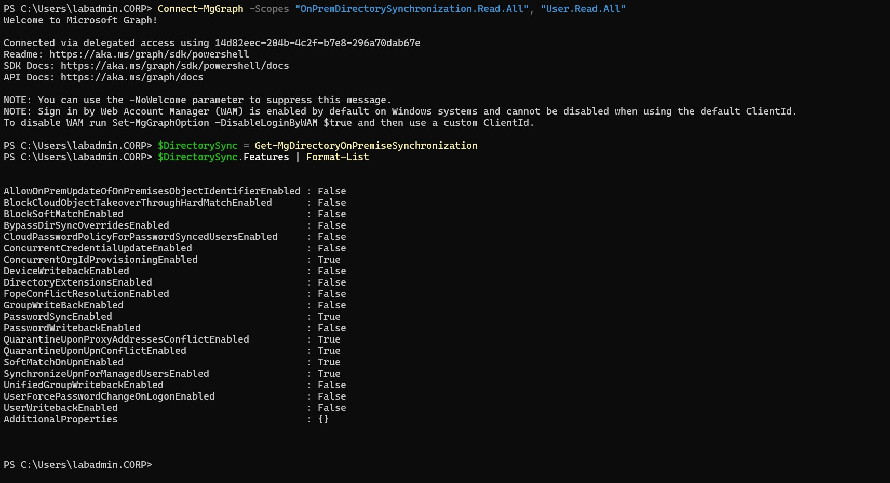
</p>

<p align="center">
  <em>Get-MgDirectoryOnPremiseSynchronization's Features list in full: SynchronizeUpnForManagedUsersEnabled and SoftMatchOnUpnEnabled both True, BypassDirSyncOverridesEnabled False, alongside the tenant's other default feature settings.</em>
</p>

`mjohnson` meets both conditions Microsoft's documentation attaches to this feature, managed (nonfederated) and unlicensed, so the feature being enabled is consistent with UPN changes not being blocked for her specifically. That explains why an on-premises UPN change is allowed to flow up to the cloud; it does not by itself explain why a change made in the opposite direction, cloud-first, was accepted and kept standing. That second question was the actual content of the round-trip test.

Before running anything that could force a synchronization cycle, `Get-ADSyncScheduler` on `SYNC01` confirmed `SyncCycleEnabled: True` rather than assuming it, the discipline Lab 02 Step Nine established after finding that flag had been `False` since installation. The Synchronization Service Manager's own operations log was checked directly rather than reasoned back from the scheduler's interval, and a natural Delta cycle had run since the 12:56 AM EDT UPN save: `corp.home.arpa` Delta Import starting 1:07:55 AM, `brindeck.onmicrosoft.com` Delta Synchronization completing 1:08:43 AM, and the Export to `brindeck.onmicrosoft.com` succeeding from 1:08:50 to 1:08:56 AM, entirely before the forced cycle described in Eleven-E below (the same log capture appears there as screenshot 42, both cycles sitting in one frame). The UPN change had therefore already survived one observed, unforced Delta cycle before the forced one ran. After the forced cycle completed too, a fresh check showed the UPN still reading `mjohnson-test@brindeck.com`, unchanged. The forced cycle had genuinely run in both directions, `mjohnson`'s Job title arrived from on-premises in that same cycle (Eleven-E), so it was not a no-op.

The standard explanation for why a delta cycle would leave a cloud-side edit standing is that it reasserts only attributes with a detected change on the inbound side; since the on-premises `userPrincipalName` attribute itself was never touched, neither cycle would have had anything new to reassert over the cloud-side edit. That is the textbook behavior for a delta cycle, not a result this step actually tested. Confirming it would need either a Full Synchronization, which reprocesses every attribute regardless of whether a delta was detected, or an on-premises UPN change watched arriving and overwriting the cloud value the way Job title did in Eleven-E. Neither was run here, forcing a Full Synchronization or changing `mjohnson`'s on-premises UPN was outside this step's scope, so the mechanism is recorded as the working explanation for a later lab to confirm rather than as an established result.

Per the decision made before this test ran, the tenant could not be left in that state regardless of which way the observation went. The UPN was reverted manually in the portal, back to `mjohnson@brindeck.com`, confirmed on her Overview page. Recorded here because it did not happen on its own: this was a manual fix, not a synchronization outcome.

**Eleven-C: group membership confirmed both directions of the same asymmetry on one user, and the refusal surfaced before any add could be attempted.**

Adding `mjohnson` to `All Company`, the tenant's cloud-only, unlicensed, assigned-membership group, succeeded immediately: "Successfully added group membership." Attempting the opposite direction, adding her to `Lab-Workstations`, a synchronized group, showed the constraint enforced directly in the Select groups picker rather than as a save-time error: every synchronized group in the list, `Domain-Users-Standard`, `IT-Admins`, `Lab-Workstations`, and `Linux-Admins`, appeared greyed with "Directory synced objects are not allowed." beside its name, unselectable. `IT-Department` carried its own separate reason, "Dynamic groups are not allowed.", confirming that constraint too rather than only the one this test targeted.

<p align="center">
  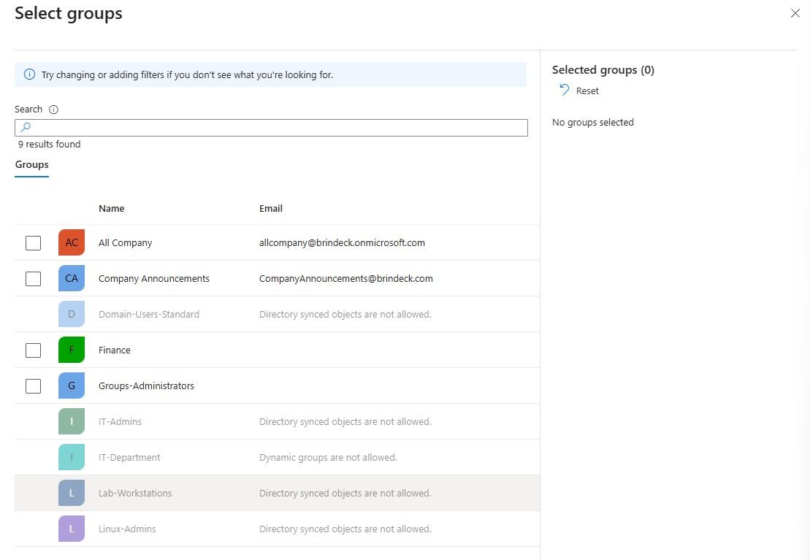
</p>

<p align="center">
  <em>The Select groups picker for mjohnson: All Company and Company Announcements selectable, Finance and Groups-Administrators selectable, while Domain-Users-Standard, IT-Admins, Lab-Workstations, and Linux-Admins each read "Directory synced objects are not allowed." and IT-Department reads "Dynamic groups are not allowed.", all four greyed and unselectable.</em>
</p>

Both results ran against the same user, confirming the constraint belongs to the group's source of authority rather than the user's, exactly as Design Decisions frames it: the identical `mjohnson` could join a cloud-only group and could not even attempt to join a synchronized one. Once the "successfully added" evidence above was captured, `mjohnson` was removed from `All Company` again; nothing in this step's content depends on the membership persisting, and leaving it in place would have carried a test artifact into Step Twelve's reconciliation for no reason.

**Eleven-D: account enabled state is cloud-writable on a synchronized user, another field on the "open" side of the per-field lock.**

Disabling and re-enabling `cloudonly-demo01` through Edit properties' Account enabled checkbox succeeded both directions, "Successfully updated user" each time. The identical toggle against `mjohnson` also succeeded both directions: unchecking Account enabled and saving succeeded, and re-checking it and saving succeeded, each confirmed with a fresh "Successfully updated user" notification and the checkbox state itself. Account enabled joins user principal name as a field the portal leaves genuinely writable on a synchronized object, widening Eleven-A's finding beyond UPN alone: the per-field lock excludes more than one exception.

What this demonstrated is writability, not durability. `accountEnabled` synchronizes from `userAccountControl` in Active Directory, the same shape of relationship UPN has to its own on-premises attribute, and Eleven-B's mechanism predicts the same outcome here: a cloud-side disable or re-enable would stand only until a synchronization cycle carries an on-premises change to that account's enabled state, at which point it would be reasserted the same way a delta cycle reasserts any attribute with a detected inbound change. The disable-then-immediately-re-enable sequence run here cannot distinguish a write that persists from one that would be reverted on the next cycle carrying a change, because no cycle carrying a change to `mjohnson`'s on-premises enabled state ran in between. Whether disabling a synchronized user in the cloud actually holds, or only holds until the next cycle touches the account, is the operationally significant question a helpdesk-shaped reading of this finding would act on, and it is left open for a later lab rather than tested here.

**Eleven-E: the refused Job title write was made on-premises instead, and the round trip was timed rather than described.**

With `Get-ADSyncScheduler` already confirming `SyncCycleEnabled: True`, `mjohnson`'s Job title was set on-premises:

```powershell
Set-ADUser -Identity mjohnson -Title "IT Support Specialist"
```

run at 1:17:00 AM EDT. A Delta cycle was forced immediately afterward with `Start-ADSyncSyncCycle -PolicyType Delta` on `SYNC01`. The Synchronization Service Manager's own operations log gave second-level timing rather than the portal's minute-level precision Six-B had to work around: Delta Import on `corp.home.arpa` started 1:20:58 AM, Delta Synchronization against `brindeck.onmicrosoft.com` finished 1:21:47 AM, and the Export to `brindeck.onmicrosoft.com` succeeded from 1:21:55 AM to 1:22:01 AM, the step where the change actually reached the tenant.

<p align="center">
  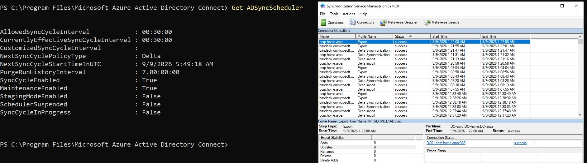
</p>

<p align="center">
  <em>Get-ADSyncScheduler and the Synchronization Service Manager's Connector Operations log on SYNC01 in one frame. Left: SyncCycleEnabled True, a thirty-minute effective interval, next cycle due 9/9/2026 5:49:18 AM UTC. Right, both cycles this step relied on: the natural Delta cycle running corp.home.arpa Delta Import 1:07:55 AM through the corp.home.arpa Export at 1:09:04 AM, and the forced cycle running corp.home.arpa Delta Import 1:20:58 AM, brindeck.onmicrosoft.com Delta Synchronization completing 1:21:47 AM, the brindeck.onmicrosoft.com Export succeeding 1:21:55 to 1:22:01 AM, and the corp.home.arpa Export closing at 1:22:08 AM.</em>
</p>

From the 1:17:00 AM on-premises write to the 1:22:01 AM cloud-side export completing, the round trip measured 5 minutes 1 second. `mjohnson`'s Job Information tab confirmed the arrival directly: Job title now read `IT Support Specialist`, Department still `Sales`, unchanged.

<p align="center">
  
</p>

<p align="center">
  <em>mjohnson's Job Information tab after the Delta cycle: Job title reading IT Support Specialist, Department unchanged at Sales.</em>
</p>

`title` was populated only on `mjohnson`, using the same domain gap Six-A already established (this domain's `Title` attribute had no populated values before this lab), and stays set permanently as this step's documented content rather than reversed once captured, the same precedent Step Six's `department` values set. Step Twelve's reconciliation is updated to name both attribute changes.

**Restoration, confirmed rather than assumed.** `mjohnson` ended this step a member of exactly `Domain-Users-Standard` and `IT-Admins` again (the `All Company` test membership removed), `Account enabled: Yes`, and UPN back at `mjohnson@brindeck.com`; her Job title stayed set to `IT Support Specialist` as deliberate content. `cloudonly-demo01` had its test Job title cleared back to blank, and a fresh read confirmed the hard constraint: Groups blade reading "Not a member of any groups" and Assigned roles reading "No directory roles assigned.", license-only exactly as it started, with `memberOf` empty as required.

### Step Twelve: Validate the environment is otherwise unchanged, settle the SSO key, and record the finished state

Confirm that a lab conducted almost entirely in two web portals left the on-premises environment exactly as it found it, and record the state Lab 04 starts from.

**On-premises and synchronization.** `Test-ComputerSecureChannel` from WIN11-CLIENT01, a Group Policy result confirming `IT-Admin-Environment` still applies, `sssd` active on Ubuntu Server with a Kerberos ticket issued for a domain user. On `SYNC01`: the Entra Connect version and source anchor unchanged, and `Get-ADSyncScheduler` read before running anything capable of forcing a cycle, so the scheduler is confirmed rather than assumed, which is the discipline Lab 02 Step Nine established after finding `SyncCycleEnabled` had been `False` since installation.

**Wazuh, with the known caveat applied rather than repeated.** `Get-LabWazuhAgentStatus.ps1`'s default `-AgentName` list is `DC01`, `WIN11-CLIENT01`, and `UBUNTU-SERVER`, written during Automation Lab 05 before `SYNC01` existed. Running `Invoke-LabHealthReport.ps1` unmodified therefore returns `WazuhAgentStatus: Healthy` without having checked the one host this track's synchronization depends on, exactly as it did in Lab 02. Run the health report for the overall picture, then call `Get-LabWazuhAgentStatus -AgentName DC01,WIN11-CLIENT01,UBUNTU-SERVER,SYNC01` explicitly, and record both results together with the reason they differ. A green result that covered a real gap is precisely the failure shape Linux Lab 06's revision documented, and reporting the unmodified `Healthy` on its own would repeat a defect this repository has already identified twice.

**Automation library.** `Invoke-Pester -Path C:\Scripts -Output Detailed`, expected at 174 tests, 0 failed, unchanged since no script is touched by this lab.

**The `AZUREADSSOACC` key.** Step One already read the account's state and recorded how long it had been since Lab 02's roll. Lab 02 rolled the key on 2026-08-31, during its Step Eight-A (the same timestamp Step One read directly from `PasswordLastSet`), and Microsoft's Seamless SSO FAQ recommendation of at least every thirty days puts that threshold at 2026-09-30. (WIN11-CLIENT01 displays `PasswordLastSet` in its local Eastern time zone; the same moment in UTC is 2026-09-01 00:07, which is why the interval also reads as 2026-09-01 to 2026-10-01 on a UTC clock; one rollover, two clocks, not a discrepancy.) A roll performed in this lab falls well short of either date, so it demonstrates the procedure rather than tests the recommendation the threshold represents. Re-read the account's state now, so the elapsed time spans the lab rather than sitting at its start, then take the decision and record it either way: roll the key with `Update-AzureADSSOForest` on `SYNC01`, observing the two documented traps and expecting the authentication context to fight the same browser configuration Lab 02 recorded, or record the deliberate decision not to roll it and the reasoning. Whichever happens, state the conclusion research pointed to and the lab confirmed: whether thirty days is an expiry or a recommendation, and therefore whether this is an operational deadline the environment has to meet or a hygiene interval it should aim at, while 2026-09-30 (2026-10-01 in UTC) remains the date a later lab actually gets to watch the interval elapse and settle the question empirically. That closes the Lab 02 carry-forward item rather than restating it, and it tells Lab 06 whether it is automating a deadline or a good habit.

**Finished state.** Reconcile both directories object by object against the Step One baseline, accounting for every difference. Three categories of change are expected and must each be accounted for rather than netted away: the cloud-only groups created in Step Six and the role-assignable group created in Step Seven, which persist; the `department` values populated on the synchronized users in Step Six (`akim`, `jdoe`, `testuser01`, and `tsync01` at `IT`; `mjohnson` at `Sales`; `jsmith` at `IT`, changed from `Sales` mid-step) and the `title` value populated on `mjohnson` in Step Eleven, the only two attribute changes this lab makes on-premises; and `deltest01`, created and permanently destroyed in Step Nine, which nets to zero on both sides exactly as Step Nine already confirmed: six users on-premises and ten in the tenant, matching the Step One baseline with no residual discrepancy. Getting there cost two distinct Entra object GUIDs along the way, not a persistent count, the direct consequence of recreating a synchronized account with the Recycle Bin off, a finding Step Nine already made and this step does not need to re-derive. Record the finished licensing state: which subscriptions are active, their billing state, the trial's expiry date, how many licenses are assigned and to whom, and by which model each was assigned. Record the Business Basic trial as resolved, lapsing 2026-09-22, so the track's dated item closes here.

The reconciliation must also account for what the Entra Overview's user count cannot show: three objects sitting in Deleted users, invisible to that count entirely. Record them by name, not as a tally: `nolocation-demo01`, soft-deleted 2026-09-07 by Step Eight with its group-inherited licenses confirmed still attached; and `duptest01` and `duptest02`, soft-deleted by Lab 02 and still present, their thirty-day windows expiring around 2026-10-02. A reconciliation that reads only the active user count and calls it a match is the same shape of error Step Nine found in Lab 02's own reconciliation: complete against one view, silent about another. Take an actual decision on `duptest01` and `duptest02` rather than defaulting past them: either purge them permanently, which would make Lab 02's "left no residue" claim true at last, or leave all three objects for Labs 04 and 05 to inherit. State which and why.

The same blind spot applies on the groups side. `Testgroup` sits in Deleted groups throughout this lab, soft-deleted 9/6/2026 5:08:17 PM with a permanent deletion date of 10/6/2026 5:08:17 PM, predating this lab entirely and untouched by it. Part B names it twice, as what Deleted groups returns to holding after both the restore and the final permanent-delete, but no step in this lab accounts for what it actually is or takes a decision on it. Step Nine's standard applies here exactly as it does to `duptest01` and `duptest02`: a reconciliation complete against one view and silent about another is the error this lab is built to avoid repeating. Take an actual decision on `Testgroup` the same way: either restore it, purge it permanently, or leave it for Labs 04 and 05 to inherit alongside the other three objects, and state which and why.

---

## Validation

Planned validation, to be replaced with observed results as the lab is implemented. Each item maps to an objective above.

- **Licensing.** A Microsoft 365 Business Premium trial is active in the tenant with its license count and end date recorded, recurring billing is off on both subscriptions, the Business Basic trial is confirmed lapsing rather than converting on 2026-09-22, and the Entra admin center reports a premium Microsoft Entra plan. The subscription's service plans include Microsoft Entra ID P1, Exchange Online Plan 1, and Microsoft Intune Plan 1, confirmed by name rather than inferred from the tier. Whether the tenant was permitted to start a second trial at all is recorded as a finding.
- **Scope guard.** Security defaults is still enabled and no conditional access policy exists in the tenant at the close of the lab.
- **License assignment models.** Both models are demonstrated on real accounts: direct per-user assignment, and group-based licensing with membership-driven grant and revoke. A user is moved between licensed groups in the documented order without loss of license. At least one license assignment error is induced deliberately and read from the Errors and issues tab.
- **Groups.** Every group in the tenant is accounted for by type, membership type, source, and administration point, including `All Company`'s origin and membership governance. At least one cloud-only security group and one cloud-only Microsoft 365 group exist. `IT-Admins`' partial membership in the tenant is recorded with the reason.
- **Dynamic membership.** An organizational attribute is populated on the synchronized users on-premises, confirmed to arrive in the tenant on the default synchronized attribute set with no custom rule, and confirmed referenceable in a dynamic membership rule. A dynamic membership group exists keyed to it. An attribute change made in Active Directory is shown adding or removing a member in the tenant after a synchronization cycle, with the elapsed time recorded end to end. The write permissions on that attribute are checked in Active Directory and the finding recorded. `New-LabUser.ps1`'s failure to set organizational attributes is recorded as a Lab 06 candidate, not fixed here.
- **Directory roles.** A built-in role is assigned at tenant scope to a licensed account and its effective permissions confirmed by signing in as that account. A role-assignable group exists and holds a role assignment. The inability to assign Microsoft Entra roles to the four synchronized groups is confirmed against the tenant rather than cited.
- **Synchronized versus cloud-only.** A documented table of administrative actions attempted against both a synchronized user and `cloudonly-demo01`, recording for each whether it succeeded, and where it failed, the exact refusal. A change refused in the cloud is shown succeeding when made on-premises and synchronized.
- **Delete and restore.** Both user object types are deleted, with the differences recorded, using `cloudonly-demo01` and the throwaway `deltest01` rather than any account Lab 04 or Lab 05 depends on. The behavior of a synchronized user deleted only in the cloud is observed across at least one synchronization cycle. The terminal nature of an on-premises deletion in a forest with no Active Directory Recycle Bin is demonstrated, including that a recreated account arrives as a new cloud object under a new source anchor rather than rejoining the soft-deleted one. The security group restore contradiction is settled against the tenant.
- **Seamless SSO key.** The `AZUREADSSOACC` account's state is recorded, the thirty-day recommendation is characterized as either a deadline or a hygiene interval on the evidence, and the key is either rolled or deliberately not rolled with the reasoning recorded.
- **Environment unchanged.** Host and service configuration on DC01, WIN11-CLIENT01, Ubuntu Server, and `SYNC01` confirmed operating as documented. The only on-premises directory changes are the deliberate ones: `department` populated on six synchronized users in Step Six, `title` populated on `mjohnson` in Step Eleven, and `deltest01` created and destroyed in Step Nine. All four Wazuh agents confirmed active by an explicit agent list, not by the health report's default. Entra Connect version, source anchor, and scheduler unchanged. `Invoke-LabHealthReport.ps1` run and its `SYNC01` blind spot recorded. Pester suite at 174 tests, 0 failed.

---

## Troubleshooting and Adjustments

- **The planned pre-assignment service plan check does not exist in either admin center's UI.** Step Four's plan called for reading Business Premium's included service plans by name, Microsoft Entra ID P1, Exchange Online Plan 1, and Microsoft Intune Plan 1, from the Microsoft 365 admin center before any license was assigned. Neither the Your products subscription page nor the dedicated Billing, Licenses page exposes that breakdown; both stop at license counts (0 of 25 assigned) with no Apps or service-plan tab reachable from either. Microsoft Entra ID P1 was confirmed independently from the Entra admin center's own Overview, License usage, and Licensed features pages, none of which required a license to be held by a user first, but Exchange Online Plan 1 and Microsoft Intune Plan 1 have no Entra-side equivalent. Microsoft Graph PowerShell's `Get-MgSubscribedSku`, run from WIN11-CLIENT01, reads a SKU's service plan list directly regardless of assignment state, and confirmed both by name (`EXCHANGE_S_STANDARD` and `INTUNE_A`, cross-referenced against Microsoft's service plan identifier reference rather than assumed from the internal names) alongside `AAD_PREMIUM`. The adjustment is the tool, not the timing: what neither portal's UI shows pre-assignment, Graph shows directly, so this stayed inside Step Four rather than moving to Step Five.

- **`Remove-MgGroup` returned a stale-token `403` before it returned the real error.** The first attempt to delete `Finance` directly through `Remove-MgGroup -GroupId $fin.Id`, bypassing the portal's generic "service connection error," failed with `403 Authorization_RequestDenied`. That read at first like a missing directory role, and `Get-MgUserMemberOf -UserId admin@brindeck.com` was run to check; it confirmed Global Administrator on the signed-in account, which ruled out a role gap and left the token itself as the remaining explanation. `Get-MgContext | Select-Object -ExpandProperty Scopes` showed a working scope set already in place (`Directory.ReadWrite.All` among them, more than sufficient for a group delete), so the fix was not adding scopes but clearing the session: a `Disconnect-MgGraph` followed by a fresh `Connect-MgGraph` against explicit scopes turned the same command's retry into the real, meaningful `400 Request_BadRequest` "active modern licenses" error Step Ten's Part A is built on. A `403` on an account with confirmed sufficient privilege is worth a clean reconnect before it is read as a permissions problem.

- **`Get-MgGroup -Property AssignedLicenses` and `Get-MgGroupMember` returned blank on real, populated groups, the same shape Nine-A already found on a deleted user.** Once `Finance` and `Company Announcements` were repaired and re-licensed, the typed cmdlets `$fin.AssignedLicenses` and `Get-MgGroupMember -GroupId $fin.Id` (and the same pair against `Company Announcements`) returned empty results repeatedly, across a nine-minute wait, a `Format-List` check that confirmed both variables held real non-null objects, and a full `Disconnect-MgGraph`/reconnect with `Group.Read.All` and `GroupMember.Read.All` added explicitly. None of it changed the result. Switching to a raw `Invoke-MgGraphRequest` call against the same properties, the same fix Nine-A used against a soft-deleted user's `assignedLicenses`, returned real data immediately: `Company Announcements`'s membership call correctly showed `John Smith`, and the license read, while still `{}` for both groups, was confirmed by other means to be a genuine platform gap rather than a query defect (see Step Ten). The typed cmdlets' `-Property` parameter is not reaching the request the same way on a group as it already failed to on a deleted user, and a raw call is the reliable fallback either way.

- **A blank-looking audit log initiator was a PowerShell truthiness bug, not a real gap in the log.** An early script projecting each audit event's initiator with `if ($_.InitiatedBy.App) { $_.InitiatedBy.App.DisplayName } else { $_.InitiatedBy.User.UserPrincipalName }` showed blank actors for events that Correlation IDs and timestamps confirmed were real. `$_.InitiatedBy.App` is a non-null object even when every field on it is null, so the condition evaluated true and the script read a null `DisplayName` off it instead of falling through to the populated `User` branch. Dumping the same event raw with `ConvertTo-Json -Depth 10` showed the actual initiator immediately, `CloudLicensingSystem` in every case that mattered here. The general lesson is to test a leaf field rather than a container object's truthiness, and to reach for a raw JSON dump the moment formatted output looks suspiciously uniform.

---

## Security Considerations

- **The tenant acquires a paid identity tier, and with it capabilities that are not turned on.** Conditional access becomes available in Step Two and is deliberately not used. The gap between "available" and "configured" is itself a risk: an administrator who assumes conditional access is protecting the tenant because the entitlement is present would be wrong, and security defaults remains the only thing enforcing multifactor authentication until Lab 05 changes that deliberately.
- **The entitlement is temporary, and what depends on it is not.** Anything configured under P1 during this lab, dynamic membership groups and role-assignable groups above all, is configured on an entitlement that expires. What happens to those objects when the trial lapses is a real operational question rather than a documentation one, and Labs 04 and 05 inherit it. A group whose membership stops evaluating without announcing that it has stopped is exactly the kind of silent degradation this repository has already documented twice, in Linux Lab 06's monitoring gap and in Lab 02's disabled scheduler.
- **Dynamic membership groups move an access-control decision onto an attribute.** Whoever can write the attribute can change the group's membership, and therefore anything the group grants. In a hybrid tenant that write permission may live in Active Directory rather than in the cloud, and may belong to the user themselves. Step Six checks this rather than assuming it, and the finding constrains what Lab 05 may safely target with conditional access.
- **Role-assignable groups are the same problem with the product's own answer.** Microsoft requires assigned membership on any group that can hold a role assignment, precisely so that a role cannot be acquired by editing an attribute. Recording why that restriction exists is more useful than recording that it exists.
- **Deletion in a hybrid tenant has a correct place and an incorrect one.** Deleting a synchronized user in the cloud looks like it worked and may be undone by the next synchronization cycle without anybody's involvement. That is not a safety net to rely on; it is an inconsistency between what the administrator did and what the directory believes, and the only correct deletion path for a synchronized object is at its source.
- **Every account licensed in this lab gains a cloud-reachable, mailbox-capable identity.** Accounts that previously existed only as directory objects become accounts that can sign in to Microsoft 365 services from the public internet. Security defaults' tenant-wide multifactor authentication requirement is what stands in front of them, which is another reason it is not disabled here.
- **The `AZUREADSSOACC` key is the environment's least visible standing risk.** The Kerberos decryption key on that computer account, if leaked, can be used to generate Kerberos tickets for any synchronized user and impersonate their Microsoft Entra sign-ins. Nothing rotates it automatically and nothing alerts when it ages. Lab 02 protected the account and rolled the key to AES; this lab establishes what the ongoing obligation actually is, which is the prerequisite for Lab 06 deciding whether to automate it.
- **A trial with recurring billing enabled is a financial exposure, not just an administrative one.** Step Three exists because the default behavior charges, and because a thirty-day gap between the action and its consequence is exactly the interval at which a person stops thinking about it.

---

## Outcome

Recorded at completion.

---

## Lessons Learned

Recorded at completion.

---

## Sources

Planning-phase research. Deployment-stage sources are appended during implementation.

**Licensing and subscription**

- [Microsoft Entra licensing](https://learn.microsoft.com/entra/fundamentals/licensing) - what P1 and P2 contain, that Microsoft Entra ID P1 is included in Microsoft 365 Business Premium, that built-in roles are free while custom roles and role-assignable groups require P1, and the administrative unit licensing split
- [Microsoft 365 Business Premium security FAQ](https://learn.microsoft.com/microsoft-365/admin/security-and-compliance/m365bp-security-faq) - direct confirmation that Microsoft Entra ID P1 comes with Business Premium, and that Intune and Defender for Business are included
- [Microsoft 365 for business security overview](https://learn.microsoft.com/microsoft-365/admin/security-and-compliance/m365b-security-overview) - the per-tier table showing Business Basic and Standard on Entra ID Free and Business Premium on Entra ID P1 with Intune Plan 1, which is the specific gap this lab's trial closes
- [Try or buy a Microsoft 365 for business subscription](https://learn.microsoft.com/microsoft-365/commerce/try-or-buy-microsoft-365) - starting a trial from inside an existing tenant through the admin center so it joins the same organization; that all trial subscriptions include 25 free licenses for the trial period; and that turning off recurring billing makes a trial expire at the end of its month without charge instead of converting. The basis for Steps Two and Three
- [Product names and service plan identifiers for licensing](https://learn.microsoft.com/entra/identity/users/licensing-service-plan-reference) - the service plan names and identifiers Step Four checks the subscription against by name

**Groups and membership**

- [Learn about group types, membership types, and access management](https://learn.microsoft.com/entra/fundamentals/concept-learn-about-groups) - security versus Microsoft 365 groups, assigned versus dynamic membership, that groups synchronized from on-premises Active Directory can only be managed on-premises, and that distribution lists and mail-enabled security groups can only be managed in the Exchange or Microsoft 365 admin center. The source for both the group catalogue and the boundary handed to Lab 04
- [Manage rules for dynamic membership groups in Microsoft Entra ID](https://learn.microsoft.com/entra/identity/users/groups-dynamic-membership) - the Microsoft Entra ID P1 requirement, stated per unique member rather than per assigned license; the security consideration about write permissions on attributes synchronized from Active Directory, including SELF write; and the constraints that membership cannot be edited by hand and that a rule cannot mix users and devices

**Licenses on users and groups**

- [Assign or unassign licenses to a group in the Microsoft 365 admin center](https://learn.microsoft.com/microsoft-365/admin/manage/manage-group-licenses) - group-based licensing as it is administered today, in the Microsoft 365 admin center rather than the Entra admin center; that nested groups are not processed; the twenty-group limit; the documented order for moving a user between licensed groups and the service interruption reversing it causes; and the Errors and issues tab Step Eight reads. Notably, this page states no license prerequisite of its own, which is a claim to record against observation rather than repeat

**Synchronized object behavior**

- [Microsoft Entra Connect Sync: Attributes synchronized to Microsoft Entra ID](https://learn.microsoft.com/entra/identity/hybrid/connect/reference-connect-sync-attributes-synchronized) - the default synchronized attribute set, and the basis for Step Six-A confirming that `department` flows without a custom synchronization rule or a schema change rather than assuming it does
- [How to use the BypassDirSyncOverridesEnabled feature of a Microsoft Entra tenant](https://learn.microsoft.com/entra/identity/hybrid/connect/how-to-bypassdirsyncoverrides) - that synchronized users' properties cannot be changed from the Entra or Microsoft 365 admin portals or through any PowerShell module, and that the historical `mobile` and `otherMobile` exception no longer applies. The basis for Step Eleven's attribute test
- [End-to-end troubleshooting of Microsoft Entra Connect objects and attributes](https://learn.microsoft.com/troubleshoot/entra/entra-id/user-prov-sync/troubleshoot-aad-connect-objects-attributes) - the `DirSyncOverrides` mechanism and what it did to on-premises updates, and the `SynchronizeUpnForManagedUsers` behavior governing whether user principal name changes flow to a licensed user. Relevant to Step Eleven because this lab is the first in which the tenant holds licensed synchronized users at all

**Roles**

- [Use Microsoft Entra groups to manage role assignments](https://learn.microsoft.com/entra/identity/role-based-access-control/groups-concept) - that role-assignable groups require Microsoft Entra ID P1 and must use assigned rather than dynamic membership, that Privileged Identity Management requires P2, and that Microsoft Entra roles cannot be assigned to on-premises groups, which is the constraint that shapes Step Seven in this environment
- [Assign Microsoft Entra roles](https://learn.microsoft.com/entra/identity/role-based-access-control/manage-roles-portal) - assignment at tenant scope, and the scoped alternatives this lab does not use
- [Least privileged roles by task in Microsoft Entra ID](https://learn.microsoft.com/entra/identity/role-based-access-control/delegate-by-task) - the least-privileged role per administrative task, including License Administrator for license assignment and User Administrator for restoring deleted users. The basis for Step Seven starting below Global Administrator

**Deletion and recovery**

- [Restore or remove a recently deleted user](https://learn.microsoft.com/entra/fundamentals/users-restore) - the thirty-day soft-delete window and what it preserves; that Microsoft Entra is not the source of authority for synchronized users and the synchronization engine may restore one that still exists on-premises; that a user deleted more than thirty days ago cannot be restored by anyone including Microsoft support; and that restoring a user restores its licenses even when none are available
- [Recover from deletions](https://learn.microsoft.com/entra/architecture/recover-from-deletions) - the properties each object type retains through soft delete, and the statement that soft-deleted Microsoft 365 groups and cloud security groups both appear on the Deleted groups page and can be restored
- [Recover deleted data (Microsoft Entra PowerShell)](https://learn.microsoft.com/powershell/entra-powershell/recover-deleted-data) - the conflicting statement that only Microsoft 365 groups can be restored and security groups cannot. The two sources above disagree, which is why Step Ten settles it against the tenant rather than citing either

**Seamless single sign-on key rollover**

- [Microsoft Entra seamless single sign-on: Frequently asked questions](https://learn.microsoft.com/entra/identity/hybrid/connect/how-to-connect-sso-faq) - the rollover procedure on the Entra Connect server, the SAM account name format requirement, the Protected Users group exclusion, and the warning that `Update-AzureADSSOForest` must not be run more than once per forest or seamless single sign-on stops working until cached Kerberos tickets expire
- [Microsoft Entra seamless single sign-on: Technical deep dive](https://learn.microsoft.com/entra/identity/hybrid/connect/how-to-connect-sso-how-it-works) - why the key matters, the account protection requirements Lab 02 already implemented, and the July 2026 Windows Server change of default Kerberos encryption from RC4 to AES-256, which this environment already satisfies
- [Quickstart: Microsoft Entra seamless single sign-on](https://learn.microsoft.com/entra/identity/hybrid/connect/how-to-connect-sso-quick-start) - the consequence framing for the thirty-day recommendation, that a leaked key can generate Kerberos tickets for any synchronized user, and the explicit statement that the roll is not needed immediately after enabling the feature, which is the strongest evidence that thirty days is hygiene rather than an expiry
- [Migrate from federation to cloud authentication](https://learn.microsoft.com/entra/identity/hybrid/connect/migrate-from-federation-to-cloud-authentication) - that the thirty-day interval is chosen to align with how Active Directory domain members submit password changes, and that no device is attached to the account so the rollover must be performed manually
