# 04 - Microsoft 365 Administration Workflows

## Status

In progress. Steps One through Eight are complete and documented in past tense below. Step Nine remains.

The lab runs against the Business Premium trial's expiry on 2026-10-05, which takes with it the Exchange Online Plan 1 behind the mailboxes the remaining steps depend on. Step Six observed the Business Basic trial's lapse as a preview: by 2026-09-23 the subscription read Disabled and its SKU `Suspended`, with no Expired stage observed, while both assignment records and Adam Ramzi's license and mailbox stayed intact and the mailbox kept accepting mail. Whether user access ended was not tested, so the lab keeps the conservative assumption and treats 2026-10-05 as a hard cliff.

---

## Overview

Labs 01 and 02 built the environment. Lab 03 operated the directory that resulted, establishing what can be edited on a synchronized object, how groups differ by type and source of authority, and how licenses reach users under two assignment models. What none of them touched is the service layer that licensing actually buys.

This lab administers Exchange Online against the hybrid population Lab 03 licensed. It provisions mailboxes, builds the mail-enabled group types Lab 03 deliberately handed forward, delegates a shared mailbox, establishes what this subscription actually entitles a mailbox to for archiving and hold, converts a departing user's mailbox and reclaims the license, and follows real messages through the service, including one it deliberately stops, to establish where they went and why.

The distinction this lab is built on is the same one Lab 03 arrived at: configuring a thing and operating it are different, and only the second produces evidence about how it behaves. A lab that creates a distribution list and never sends mail through it has documented a configuration. A lab that sends a message to that list and reads the trace showing it expanded into its members has documented what the object does.

---

## Objectives

The primary goals of this lab are to:

- establish which accounts in the hybrid population received Exchange Online mailboxes and which did not, and record what an unlicensed account has in place of one
- create and catalogue the three mail-enabled group types the Entra admin center cannot manage, distribution lists, mail-enabled security groups, and Microsoft 365 groups, recording which console owns each and how they differ in what they accept as members
- build a shared mailbox, establish the sign-in state of its associated user account against the tenant rather than against documentation, and demonstrate all three delegation models against it, Full Access, Send As, and Send on Behalf, including what each one produces on a received message and what the wrong one looks like from the recipient's side
- convert a departing user's mailbox to a shared mailbox and reclaim the license, in the documented order, recording the constraint that makes the order matter
- follow real messages through the service with message trace, establishing delivery status for a message sent to an individual, to a distribution list, and to a recipient a deliberately built mail flow rule stops
- record a prediction about what the Business Basic lapse on 2026-09-22 will do to `Finance`'s group-level assignment, before the date, and then record what it actually did
- establish what this tenant is actually entitled to for mailbox archiving and hold by enumerating the subscription's service plans rather than by citation, settle against the tenant a contradiction between two Microsoft documents about whether those capabilities require Exchange Online Plan 2, and build or bound the work on the result
- confirm that the hybrid environment, the synchronization engine, and the automation library are unchanged by a lab conducted almost entirely in two web consoles and one PowerShell module
- record the finished mail state and the licensing state Lab 05 inherits, against an entitlement with a known expiry

---

## Project Context

[ADR-019](../architecture/decisions/019-establish-cloud-and-hybrid-identity-track.md) established this track and settled its architecture. Nothing in this lab reopens any of it. The synchronization engine, its scope, its authentication method, and the tenant's administrative model are all as Lab 02 left them and as Lab 03 confirmed them.

Lab 03 handed this lab two things explicitly. The first is a scope boundary: its Design Decisions named mail-enabled security groups and distribution lists as group types it would not create, on the grounds that their administration lives in a console it never opened, and handed them here. The second is an entitlement. The Business Premium trial Lab 03 started carries `EXCHANGE_S_STANDARD`, Exchange Online Plan 1, and Lab 03 confirmed it present by service plan name rather than inferring it from the tier. That service plan exists in this tenant for this lab.

It also handed forward ten open items to the track README, and this plan is explicit about which of them Lab 04 owns rather than addressing several of them incidentally and leaving the rest ambiguous. Three carry dates that fall inside this lab's window, which is the reason the table is here rather than in a close-out note.

| Item | Disposition | Why |
|---|---|---|
| The Microsoft Graph group-to-license gap | Owned by Lab 04 | Step Eight reconciles the same assignment-target and consumed-seat figures on a license reclamation, and Step Six reads `Finance`'s group-level assignment across a subscription lapse. Both are fresh evidence about a relationship the directory surfaces deny |
| The product page's six-versus-seven movement | Owned by Lab 04 | Step One and Step Six both read the Business Premium and Business Basic product pages, so the unexplained movement gets two more dated readings whether or not it is chased |
| Three unreconciled service counts on one SKU | Closed by Lab 04 | Step One enumerated the SKU's service plans in full and diffed the names against the Microsoft 365 admin center's own Apps list rather than comparing totals. Each figure counts a different thing: 62 is every service plan on the SKU, the admin center's list is that set less `EXCHANGE_S_FOUNDATION`, which is not an assignable app, and the Entra blade's 53 is what remains after the eight plans assigned at the organization level. Step Nine re-reads the Entra blade to confirm the last of the three |
| **The 2026-09-30 seamless single sign-on interval** | Owned by Lab 04, automation passes to Lab 06 | Lab 03 deliberately left `AZUREADSSOACC`'s key unrolled at eleven days so a later lab could watch a full thirty-day interval elapse against a recommendation now established as hygiene rather than a deadline. Lab 04 is the lab running on 2026-09-30. The interval is consumed unobserved unless a step reads it, so Step One records the key's current age and Step Nine reads it again after the date. Whether the roll should be automated remains Lab 06's |
| **`Testgroup` and `nolocation-demo01` permanent deletion, 2026-10-06 and 2026-10-07** | Owned by Lab 04 | Both were retained for Labs 04 and 05, and both dates fall after this lab's own 2026-10-05 deadline. Lab 04 is therefore the last lab that can decide anything about either, which makes this a decision with a date rather than an inventory line. Step Nine takes it |
| **The 2026-10-05 versus 2026-10-06 expiry discrepancy** | Owned by Lab 04 | Lab 03 recorded the portal's own Recurring billing field reading a day later than the stated expiry and left it unresolved. This plan uses 2026-10-05 throughout as the conservative figure and says so rather than asserting it. Step Six and Step Nine both read the subscription pages and can settle it |
| `New-LabUser.ps1` sets no organizational attributes | Passes to Lab 06 | A script change under the ADR-017 analysis and testing standard, which a portal lab should not reopen |
| The emergency access account's user principal name rename | Passes to Lab 05 | It should be renamed before Lab 05 makes that account the one identity conditional access deliberately does not constrain |
| Three Global Administrators pending privileged role review | Passes to Lab 05 | Opened by Lab 01 and scheduled there |
| Whether Microsoft Entra ID Free permits group-based licensing | Passes to Lab 05 | The event that settles it is the Business Premium lapse on 2026-10-05, which falls after this lab closes |
| Whether the mail attribute set is cloud-editable on a synchronized object | Passes to Lab 06 | See below |
| `Get-LabWazuhAgentStatus.ps1`'s default agent list, and `Get-LabDockerServiceStatus.ps1`'s Portainer account | Held against the automation track | Neither belongs to this track. Step Nine works around the first rather than fixing it, as Lab 03 did |
| `SYNC01`'s scheduler does not survive a VM suspend | Held in the track README | Applied by this lab rather than owned by it. Step Nine reads `Get-ADSyncScheduler` before anything that could force a cycle |
| The Active Directory Recycle Bin recommendation | Held against the enterprise infrastructure track | Forest-wide and irreversible, so not a mid-lab action |

One question is handed on rather than answered. Whether the mail attribute set draws the cloud-editability line in the same place Lab 03 found for user objects, where user principal name and account enabled state were writable on a synchronized object and everything else was locked, is unanswered and stays unanswered here. Lab 03's Step Eleven already established the per-field finding on user objects across 175 lines, the mail-attribute version is an increment on a settled finding rather than a new one, and ADR-019 gives the identity boundary to Lab 06. It belongs there, alongside the rest of that boundary, and this lab does not build it.

It also handed forward a live question. Lab 03's Part C established that the Microsoft 365 admin center counts assignment targets while `Get-MgSubscribedSku` counts consumed seats, and that `Finance`, licensed and empty, contributes a target and no seat. `Finance` carries a Business Basic assignment that Lab 03 made in its Step Eight-E, and the Business Basic trial lapses on 2026-09-22. Lab 03 recorded what a group-level assignment does when the subscription behind it goes away as an open question and noted that the lapse would make it observable. This lab is the one that gets to observe it.

The operating premise carries forward too. Lab 03's Lessons Learned closed on a pattern this repository has now recorded four times in three technologies: a status that reports configuration rather than work will report success while nothing is happening. Exchange Online is a rich source of the same shape. A distribution list with members configured correctly and a transport rule silently dropping mail to it looks identical, from the object's own properties, to one that works. The only thing that distinguishes them is following a message through and reading what happened to it, which is why message trace is in this lab's objectives rather than left as a tool a later lab might use.

---

## Design Decisions

### The lab sends real mail and traces it, rather than confirming configuration and stopping

**Decision:** Every mail-enabled object this lab builds has at least one real message sent through it, and the result is read from message trace rather than from the object's own properties.

This is the decision the rest of the lab is shaped around, and it is an architectural position rather than a preference. Lab 03 established, four separate times, that a component reporting its own configuration is not evidence that the component is doing anything. A mailbox that exists, a distribution list with the right members, and a shared mailbox with the right delegation are all configuration states. None of them establish that mail reaches the intended recipient, which is the only property any of those objects exists to provide.

Message trace is the instrument that closes that gap, and Microsoft documents it as the tool for exactly this: determining whether a message was received, rejected, deferred, or delivered, and what happened to it before reaching that status. It has a property that makes it particularly well suited to this lab. A message sent to a distribution list appears in the trace with a delivery status of `Expanded`, showing the group being resolved into its individual members. That single result demonstrates what a distribution list is in a way that reading its membership page cannot, and it means the distribution list work and the message trace work are one step rather than two.

Because every result in this lab is read from the instrument, the instrument is established before the first message is sent rather than introduced partway through. Step One connects the module and runs one throwaway trace against a message nothing depends on, which confirms the tool works, confirms the administrative path chosen in the same step actually authorizes it, and produces this tenant's own observed latency figure before any step is waiting on one.

Its constraints are worth recording in the lab rather than discovering mid-step. Message trace data is retained for 90 days and the retention period is not configurable. Results are returned immediately for searches spanning 10 days or less; anything longer is delivered as a downloadable report prepared from archived data, which can take hours.

How long a sent message takes to appear in trace data at all is recorded as a range to observe rather than a figure to assert, because Microsoft's own sources do not agree on it. The Message Trace FAQ says five to ten minutes. The Exchange Online monitoring reference says messages less than seven days old should appear within five to thirty minutes. The mail delivery troubleshooting article says data can appear as soon as ten minutes or take up to an hour. All three are first-party. The lab plans for the widest of the three, records what this tenant actually did, and treats a message that has not appeared yet as unresolved rather than as a failure.

### The Business Basic lapse is observed, and the prediction is recorded before the date

**Decision:** The lab records what it expects the 2026-09-22 lapse to do before 2026-09-22, in the document, and commits the document before that date. It then records what actually happened. The prediction is not adjusted afterward.

Committing before the date is part of the decision rather than a process detail. A prediction sitting in an uncommitted working file is indistinguishable, read later, from one written after the outcome was known, and an unfalsifiable prediction is worth less than no prediction at all. Step One therefore closes on committing this document with the prediction in it, and that commit is a condition of the step rather than housekeeping after it.

Lab 03 recorded, twice, that a figure written down before its basis was understood becomes something the document asserts and later steps build on. The corrective habit it arrived at was to interrogate a reading before treating it as a finding. This decision applies that habit in the only direction that actually tests it, which is forward.

Research for this plan already suggests the obvious prediction is wrong, and that is precisely why it is worth writing down. Microsoft documents the subscription lifecycle as Active, then Expired, then Disabled, then Deleted. The Expired stage begins immediately at the subscription end date and lasts approximately 30 days for most subscriptions in most regions, and during it users retain normal access to the service. If that behavior holds here, 2026-09-22 will produce a status change rather than a service interruption, and `Finance`'s group-level assignment may survive the date entirely.

Two things about that remain genuinely unknown and are not to be asserted from the documentation. Whether a trial follows the same lifecycle as a paid subscription is not clearly stated for this case; one Microsoft source describes free trials moving into a grace status for 30 days, which may or may not be the same mechanism under a different name. And whether the tenant's group-based licensing machinery treats an Expired subscription as still assignable is a separate question from whether users can still sign in. The lab observes both rather than reasoning from either.

The same uncertainty reaches the track's own record. The track README currently states that when the Business Premium trial lapses on 2026-10-05, Microsoft Entra ID P1 lapses with it. If the Expired stage applies, that statement is premature by up to 30 days. This lab does not correct the README on the strength of documentation alone; it records the discrepancy, and whichever lab is running when 2026-10-05 passes gets to settle it.

**Step Six's result feeds back into this lab's own schedule, and the lab says in advance what it does with each outcome.** This decision argues the Expired stage may extend a lapsed subscription's usable life by roughly 30 days. The sizing decision below treats 2026-10-05 as a hard cliff. Both cannot be load-bearing, and Step Six settles which one is, on 2026-09-22, thirteen days before the deadline, against the same tenant and the same commerce machinery that will handle the Business Premium expiry. So:

- If the Business Basic lapse produces an Expired subscription whose entitlements remain usable, the lab records that the 2026-10-05 cliff is probably a status change rather than a service interruption, and treats the remaining schedule as having roughly 30 days of unplanned slack behind it. It does not spend that slack. It records it, finishes on the original schedule, and hands Lab 05 a materially better-informed licensing decision than a bare expiry date.
- If the lapse removes access at the date, the hard cliff is confirmed, the sizing below is correct, and anything not yet complete that needs a mailbox is triaged against 2026-10-05 immediately rather than at the deadline.
- If the outcome is neither cleanly, which is the likeliest result given that a trial's lifecycle is not clearly documented as identical to a paid subscription's, the lab records what it saw and keeps the conservative assumption. Planning against the earlier date costs nothing if the later one turns out to apply.

Treating the observation as purely retrospective would waste the only advance warning this lab gets about its own deadline.

### Delegation is demonstrated in all three forms, because the difference is only visible from the recipient's side

**Decision:** Full Access, Send As, and Send on Behalf are each configured and each exercised with a real message, and what the recipient sees is captured for all three.

These three are the most commonly confused permissions in Exchange administration, and the reason is structural: from the administrator's side they are three checkboxes on the same page, and from the mailbox owner's side they produce nearly identical access. The difference appears only on a message that has been sent, in the `From` header the recipient receives. Send As produces a message that appears to come from the shared mailbox with no indication a person sent it. Send on Behalf produces one that names both. Full Access grants neither by itself.

Configuring all three and describing the distinction would be a documentation exercise. Sending three messages and capturing what arrives is the version that establishes it, and it costs one additional step at most.

### The shared mailbox account's sign-in state is checked, because Microsoft's documentation disagrees with itself about it

**Decision:** Whether the user account behind a shared mailbox is sign-in blocked at creation is established against this tenant and recorded as observed, not cited.

Every shared mailbox has a corresponding user account with a system-generated password, and whether that account can sign in is a security property rather than a detail. Microsoft's own documentation gives three incompatible answers. The shared mailbox creation article states that by default every new shared mailbox has sign-in blocked. The Exchange Online limits reference describes the associated account as active and explains how to block it. And Microsoft 365 Lighthouse ships a feature whose purpose is finding shared mailboxes that are enabled for direct sign-in across managed tenants, which would have nothing to find if the first statement held universally.

This is the third time in this track that Microsoft's documentation has contradicted itself on a checkable point, after Lab 02 found `Get-EntraDirSyncFeature`'s accepted feature name did not match its own reference and Lab 03 found the Entra PowerShell reference and the recoverability architecture guidance disagreeing about whether a security group can be restored. Both were settled the same way, by running it against the tenant, and Lab 03's Lessons Learned records that a documentation conflict is a cue to test rather than a cue to read more carefully. This lab applies that as a method rather than rediscovering it.

### The leaver conversion is included, because it is where licensing, mailbox, and identity meet

**Decision:** One licensed user's mailbox is converted to a shared mailbox and the license is reclaimed, using a purpose-built account rather than any fixture a later lab depends on.

This is the only workflow in the lab that touches all three layers the track has built. It is also the one with a real ordering constraint that the documentation states and that is easy to get backward: the mailbox must still have its license assigned at the moment of conversion, or the conversion option does not appear at all. Remove the license first, which is the intuitive order if the goal is to reclaim a seat, and the work has to be undone before it can be done.

The conversion has a second property worth recording. A shared mailbox holds up to 50 GB without a license of its own, but a user who accesses it still needs an Exchange Online license, so the seat is reclaimed from the departed account and not from the people who inherit the mailbox. That is a licensing consequence an administrator plans capacity against, and it is the kind of thing the Microsoft 365 admin center's seat count will not explain on its own, exactly as Lab 03's Part C found for group assignments.

The subject account is created for this purpose and removed by the lab. `cloudonly-demo01` is explicitly not used: Lab 03 restored it to a license-only state with no groups and no roles because Labs 04 and 05 both inherit it, and converting its mailbox would destroy that.

### Mailbox compliance is settled against the tenant, because two Microsoft documents contradict each other about what this subscription includes

**Decision:** What this tenant is entitled to for mailbox archiving and hold is enumerated off the subscription's own service plans in Step One and settled against the tenant, not taken from a citation. Step Seven then builds what the enumeration supports, or records a boundary on the evidence if it supports nothing.

An earlier draft of this plan asserted that litigation hold, in-place archiving, and retention all require Exchange Online Plan 2 or a Plan 1 with an Exchange Online Archiving add-on, and that this tenant holds Plan 1 through Business Premium and neither add-on. That came from Microsoft's litigation hold article, which states the Plan 2 requirement plainly and adds that a Plan 1 mailbox needs a separate Exchange Online Archiving license to be placed on hold.

It is contradicted by Microsoft's Exchange Online Archiving service description, which lists the plans that require the add-on and then names, separately and explicitly, the plans that "already include archiving and don't require Exchange Online Archiving as an add-on." Microsoft 365 Business Premium is on the second list, alongside Exchange Online Plan 2 and the E-series. The same service description's feature table gives Exchange Online Archiving for Exchange Online both Litigation Hold and manual retention policies. Both documents are first-party and current, and they cannot both be right about this subscription.

This is the fourth time in this track that Microsoft's documentation has contradicted itself on a checkable point, and the first three were all settled the same way. Lab 02 found `Get-EntraDirSyncFeature`'s accepted feature name did not match its own reference. Lab 03 found the Entra PowerShell reference and the recoverability architecture guidance disagreeing about whether a security group can be restored, and the tenant settled it in four minutes at the cost of one disposable group. This lab already has a third in flight, in the shared mailbox sign-in state above, where three Microsoft sources give three answers. Lab 03's Lessons Learned states the method outright: a documentation conflict is a cue to test rather than a cue to read more carefully. Applying it here rather than picking the more authoritative-looking citation is the whole of this decision.

The consequence is a branch rather than a boundary, and the branch is decided by evidence Step One produces. Lab 03's Step Four already read 62 service plans off this SKU through Microsoft Graph and named only three of them, so the answer is sitting in a query this track has run once and never enumerated. Step One enumerates it in full.

If archiving and hold are present on the SKU, they are content this lab builds rather than a boundary it declines. The window remaining before 2026-10-05 is enough for one step, an archive mailbox and a litigation hold are exactly the kind of mailbox property an administrator meets in a real leaver workflow, and declining to build a capability the tenant holds because a single citation said it could not would be the error this track keeps catching in other people's documentation. If the enumeration shows otherwise, the boundary is restated on what the SKU actually carries rather than on a citation that turned out to be contradicted, which is a stronger statement than the one this decision replaces.

Two things stay out either way, on scope rather than on licensing. eDiscovery Premium is a substantial topic with its own case-management surface, and a shallow pass at it would be worse than an honest omission. Public folders are a legacy collaboration surface this environment has no use for, and building one to document it would be inventing a requirement.

### The lab is sized against the shorter of two clocks, and the step count is the real one

**Decision:** Nine steps, sequenced so the Exchange-dependent work completes before 2026-10-05, with the 2026-09-22 observation entering as a date-pinned interrupt rather than as a gate the later steps queue behind.

Lab 03 ran to twelve steps across roughly ten days of sittings plus several review cycles, and those review cycles consistently found real defects. Sizing this lab to the same depth would put its close-out against the entitlement deadline with no slack, and a lab whose licensed features expire mid-write is a document that cannot finish what it started.

The number stated here is the number of steps the lab has, and it is stated that way because an earlier draft did the opposite. That draft claimed eight to ten steps, listed nine, and asked each of them for materially more than one step's work: a first step that was four separable pieces, a delegation step that was two, a conversion step that was one and a half, and a hybrid-boundary step of the same shape as Lab 03's Step Eleven, which ran 175 lines on its own. A smaller label on the same work is not a smaller lab, and the deadline does not read labels.

So the work came out rather than the count coming down. The hybrid boundary on mail objects is cut and handed to Lab 06 for the reasons Project Context records, which is the single largest reduction available and removes the step this lab was least placed to do well. The compliance step the decision above restores is smaller than the step it replaced. Against that, the arithmetic is stated plainly rather than assumed, and it applies to one step rather than to five. Step One alone is bounded by 2026-09-22, because it takes the pre-lapse reading and commits the prediction. Every other step is bounded only by 2026-10-05, because Step Six enters as an interrupt rather than as a gate and nothing queues behind it. Reading the shorter deadline onto Steps Two through Five would manufacture pressure the schedule does not actually carry, on a lab whose method is not rushing readings.

The sequencing has two constraints beyond that. Everything requiring a mailbox must run before 2026-10-05, because Exchange Online Plan 1 is carried by the Business Premium trial and nothing in this tenant replaces it. And Step Six is pinned to a date rather than to a position: it is read when 2026-09-22 arrives, from whatever step the lab is standing in, and Steps Seven through Nine are not blocked behind it. Numbering it in sequence is a convenience for reading the document, not a statement about order of execution.

---

## Technologies Used

- Microsoft Exchange Online, Plan 1, provided by the Microsoft 365 Business Premium trial started in Lab 03
- Exchange admin center, at `admin.exchange.microsoft.com`, including Recipients, Mail flow rules, and Message trace
- Outlook on the web, as the mail client every message in this lab is sent from and read in, since the delegation finding in Step Four is a property of what a recipient sees rather than of what the directory holds
- Microsoft 365 admin center, for shared mailbox creation, license assignment, and subscription state
- Exchange Online PowerShell, the `ExchangeOnlineManagement` module, from WIN11-CLIENT01 per ADR-016
- Microsoft Graph PowerShell SDK, for the licensing and directory reads this lab shares with Lab 03
- Microsoft Entra ID, Premium P1, for the group objects the mail work is built on
- Microsoft Entra Connect Sync on `SYNC01`, unchanged, as the source of the synchronized population

---

## Architecture or Topology

This lab changes nothing structural. No host is built, no service is deployed, no trust or synchronization boundary moves. The environment at the end of this lab is the environment Lab 02 built and Lab 03 administered.

What changes is the object population inside the tenant, and it changes in one direction: mail-enabled objects appear where none existed. The tenant currently holds nine groups, none of which are mail-enabled in the Exchange sense except `All Company` and `Company Announcements`, which are Microsoft 365 groups and therefore carry addresses by construction. `All Company`'s is `allcompany@brindeck.onmicrosoft.com`, on the initial domain rather than the routable one, which Step One checks against what the other mail objects turn out to carry.

Whether the tenant holds any distribution lists, mail-enabled security groups, or shared mailboxes is nonetheless re-established rather than inherited, and the reason is management rather than visibility. The Entra admin center does list distribution lists and mail-enabled security groups; what it cannot do is manage them, which is the constraint Lab 03 actually recorded when it named those two types as a boundary and handed them here. A shared mailbox would likewise have appeared in Lab 03's Step One user count as an ordinary user object. So Lab 03's catalogue is probably complete. Step One re-reads the inventory from the console that owns these objects anyway, because a lab that creates mail-enabled objects should open with a baseline drawn from the surface those objects live on, which is the correction Lab 03's own Lessons Learned arrived at after its baseline missed three objects sitting in containers it never opened.

The hybrid boundary is not where this lab looks. The four groups synchronized from `OU=Groups` are mastered on-premises and read-only in the cloud, which Lab 03 established at the object level across 175 lines. Whether that constraint behaves the same way for mail properties is a real question and an open one, and Project Context records why it goes to Lab 06 with the rest of the identity boundary rather than being answered here.

---

## Prerequisites

| Requirement | Source | State |
|---|---|---|
| A tenant with a verified routable domain | Lab 01 | Met. `brindeck.com`, verified 2026-08-23 |
| Directory synchronization operating on a schedule | Lab 02 | Met. Entra Connect Sync 2.6.84.0 on `SYNC01`, `ms-DS-ConsistencyGuid` source anchor, half-hourly Delta cycle, confirmed running at Lab 03's close after a VM restart |
| A licensed population with mailboxes available | Lab 03 | Met, and perishable. Exchange Online Plan 1 is carried by the Business Premium trial expiring 2026-10-05 |
| Exchange Online Plan 1 present by service plan name | Lab 03 | Met. `EXCHANGE_S_STANDARD` confirmed off the SKU with `Get-MgSubscribedSku` rather than inferred from the tier |
| An administrative account able to run message trace | Lab 01, Lab 03 | Met, and settled in Step One. Message trace requires Exchange Administrator or Organization Management membership, and the tenant's existing Global Administrator qualifies. No Exchange Administrator assignment was made. Step One records why, which turns on Privileged Identity Management being unavailable at P1 and on the privileged-role review Lab 05 owns |
| `cloudonly-demo01` in a license-only state | Lab 03 | Met and must be preserved. No groups, no directory roles, one license. Lab 05 inherits it in the same state |
| The `ExchangeOnlineManagement` PowerShell module | This lab | Met in Step One. Version 3.10.1 installed on WIN11-CLIENT01 per ADR-016, which ADR-019's Primary Tooling already names alongside the Microsoft Graph PowerShell SDK, and connected over an interactive REST-backed V3 session |
| Mail-flow DNS for `brindeck.com` | Lab 01 | Met, and settled in Step One. This was the only prerequisite here that could have stopped a step on the day. Lab 01 verified the domain with a single TXT record, `MS=ms19821357`, published in Cloudflare and added through the Entra admin center's Domain names blade. That blade establishes ownership and nothing else. The Microsoft 365 domain setup that publishes the MX, SPF, and Autodiscover records was never run, and no lab in this track has published an MX record for `brindeck.com`. Step One established the actual state: no MX record and no SPF record exist for the domain, and DC01 holds neither a zone nor a conditional forwarder for it, so nothing shadows the public answer. The lab confines its mail flow work to internal recipients on that basis |

Two entitlement dates constrain everything below. Business Basic (no Teams) lapses 2026-09-22. Business Premium expires 2026-10-05, on the conservative reading of a one-day discrepancy Lab 03 recorded and left open, and takes Exchange Online Plan 1 and Microsoft Entra ID P1 with it unless the subscription lifecycle's Expired stage applies, which Step Six tests.

**What the mail-flow DNS row gates, stated before the lab runs rather than discovered when a message does not arrive.** `brindeck.com` carries the Primary checkmark in the tenant, so the mailboxes Lab 03's licensing provisioned most likely hold `@brindeck.com` primary SMTP addresses. Internal tenant-to-tenant mail is routed inside the service and never consults public DNS, so Steps Two, Three, and Four are unaffected either way: mailbox provisioning, the group-type catalogue, and all three delegation models can be demonstrated entirely between mailboxes in this tenant. What depends on the records existing is narrower and specific. Any message to or from a recipient outside the tenant needs MX for inbound and a correct SPF record for outbound to survive the receiving side's checks. The external-sender premise in Security Considerations below, which is about a distribution list being addressable from outside the organization, cannot be tested at all without inbound mail flow.

Step One settled it, and the lab took the second of the two paths this plan set out. Neither an MX nor an SPF record exists for `brindeck.com`, so the choice was between publishing them in Cloudflare as a documented step and confining the mail flow work to internal recipients. Step One records why it chose the latter. Step Five's mail flow rule and both of its delivery-status cases work internally, so the deliberate failure case survives unchanged; what does not survive is the external-sender premise in Security Considerations, which is recorded there as documented behavior rather than tested live. What the lab did not do is write steps that assume external delivery and find out at the trace.

---

## Implementation

Nine steps. Every step except Step Six requires Exchange Online and must therefore complete before 2026-10-05, when Exchange Online Plan 1 ends with the Business Premium trial. That is Steps One through Five and Steps Seven through Nine: Step Two reads mailboxes, Step Three creates mail-enabled groups, Step Four creates and delegates a shared mailbox, Step Five traces mail through both, Step Seven works on mailbox compliance, Step Eight converts a mailbox, and Step Nine reconciles the mail state. Step Six is the only step in the lab that needs no mailbox, and it is the one pinned to a date.

Two steps are fixed by dates outside the lab rather than by their position in it, and they are fixed in opposite directions.

Step One is the urgent one and the easier to miss. It takes the before half of Step Six's observation, so it has to run before 2026-09-22 or the comparison has nothing to compare against and the observation is lost for good. It also closes on committing this document, prediction included, before that date. Step One is the only step in this lab that cannot be caught up later.

Step Six is pinned rather than sequenced. It is read when 2026-09-22 arrives, from whatever step the lab happens to be standing in, and Steps Seven through Nine are not blocked behind it. Its position in the numbering is a reading convenience. Its result also feeds back into this lab's own schedule, on the terms Design Decisions set out above.

### Step One: Recorded the pre-lab mail baseline and established the administrative path

The tenant's mail state was read before anything was touched.

The Exchange admin center's Recipients, Mailboxes view listed seven recipients, all UserMailbox: Adam Ramzi (`Adam@brindeck.onmicrosoft.com`), Alex Kim (`akim@brindeck.onmicrosoft.com`), Cloud Administrator (`admin@brindeck.com`), the Cloud-Only Demo Account (`cloudonly-demo01@brindeck.com`), Jane Doe (`jdoe@brindeck.com`), John Smith (`jsmith@brindeck.onmicrosoft.com`), and testuser01 (`testuser01@brindeck.com`). The Entra admin center held all ten users. The three without a mailbox, Emergency Access Account, Mary Johnson, and Test Sync, are the three that never appear among Lab 03's licensed assignment targets, so the gap tracks licensing rather than drift.

<p align="center">
  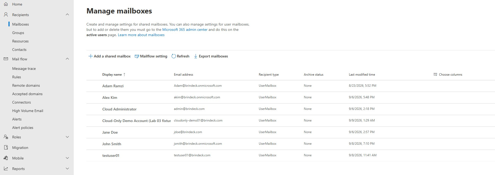
</p>

<p align="center">
  <em>Exchange admin center, Recipients, Mailboxes: seven UserMailbox recipients, none archived.</em>
</p>

Two of the seven carry a primary address that does not match their user principal name. Alex Kim and John Smith sit on `@brindeck.onmicrosoft.com` despite `@brindeck.com` UPNs, while Jane Doe, Cloud Administrator, the Cloud-Only Demo Account, and testuser01 sit on `@brindeck.com`. Adam Ramzi, the original signup account, sits on the initial domain by construction and is set aside. `brindeck.com` is the default accepted domain (`Get-AcceptedDomain` returned `Default: True` for it alone), and synchronization source does not explain the split either, since Jane Doe and testuser01 are both synchronized and both on `brindeck.com`. Step Two reads the full `EmailAddresses` stamp.

Recipients, Groups showed only the two Microsoft 365 groups Lab 03 left, All Company and Company Announcements, with no distribution lists, dynamic distribution lists, or mail-enabled security groups. Mail flow, Accepted domains listed three, all Authoritative: `brindeck.onmicrosoft.com`, `brindeck.com` (default), and `brindeck.mail.onmicrosoft.com`, which Microsoft's glossary names the hybrid routing domain for mail between on-premises Exchange and Exchange Online. This environment has no on-premises Exchange, so the domain is present but unused.

`ExchangeOnlineManagement` 3.10.1 was installed on WIN11-CLIENT01 (`Install-Module ExchangeOnlineManagement -Scope CurrentUser -Force -AllowClobber`, the `-AllowClobber` explained in Troubleshooting and Adjustments) and connected with `Connect-ExchangeOnline -UserPrincipalName admin@brindeck.com`. `Get-ConnectionInformation` confirmed `State: Connected` against tenant `dc2a02ec-636d-4df3-9af2-2908706aed4b`.

The lab's Exchange work runs under the existing Global Administrator account rather than a new Exchange Administrator assignment. Message trace requires Exchange Administrator or Organization Management, which Global Administrator satisfies. Privileged Identity Management is unavailable at P1, so a new role here would be a standing grant, added to a tenant that already carries three Global Administrators pending Lab 05's privileged role review.

The message trace instrument was established before anything depended on it. A test message was sent from `testuser01@brindeck.com` to `jdoe@brindeck.com` through Outlook on the web at 2:49 PM Eastern on 9/15/2026, subject "Lab 04 Step One - message trace test." It was already in the Exchange admin center's Message trace when checked, Status `Delivered`, and `Get-MessageTraceV2` returned the same record:

```powershell
Get-MessageTraceV2 -SenderAddress testuser01@brindeck.com -RecipientAddress jdoe@brindeck.com -StartDate (Get-Date).AddHours(-2) -EndDate (Get-Date) | Format-List
```

```text
Message Trace ID  : eae41014-8164-4376-a1fa-08df135a0c67
Message ID        : <PH0PR18MB38137387C5DD87452A5C99D2ADBA2@PH0PR18MB3813.namprd18.prod.outlook.com>
Received          : 9/15/2026 6:49:18 PM
Sender Address    : testuser01@brindeck.com
Recipient Address : jdoe@brindeck.com
From IP           : [redacted, originating client address]
To IP             :
Subject           : Lab 04 Step One - message trace test
Status            : Delivered
Size              : 36070
```

`Received` prints in UTC: 6:49:18 PM matches the 2:49 PM Eastern send. `To IP` is empty because both mailboxes are in this tenant and the message never left the service. `From IP` is the public address of the lab's own network and is redacted under this track's identifier policy. Microsoft gives three different figures for how long a message takes to become queryable in trace (five to ten minutes, five to thirty, ten to sixty). The interval here was not timed, so this establishes only that the record was queryable by the time it was checked; Step Five times it.

Mail-flow DNS for `brindeck.com` was checked from WIN11-CLIENT01 against a public resolver:

```powershell
Resolve-DnsName -Name brindeck.com -Type MX -Server 1.1.1.1
```

It returned no MX record, only an SOA in the Authority section. The TXT query returned only Lab 01's verification string, `MS=ms19821357`, with no SPF record. On DC01, `Get-DnsServerZone` returned no `brindeck` zone and `Get-DnsServerForwarder` listed only public resolvers, so DC01 does not shadow the domain.

The lab confined its mail flow work to internal recipients rather than publishing MX and SPF. `brindeck.com` is a real registered domain, and an MX record would make it a live internet mail destination indefinitely. Nothing in the lab's objectives needs external mail. The external-sender tests against the new distribution list's authenticated-senders default are recorded as documented behavior rather than exercised.

The Business Premium SKU's service plans were enumerated in full, all 62 that Lab 03 counted without listing:

```powershell
Connect-MgGraph -Scopes "Organization.Read.All"
(Get-MgSubscribedSku | Where-Object SkuPartNumber -eq "SPB").ServicePlans | Sort-Object ServicePlanName | Format-Table ServicePlanName, ProvisioningStatus -AutoSize
```

All 62 read `Success` except `INTUNE_O365` at `PendingActivation`, matching Lab 03:

```text
ServicePlanName                            ProvisioningStatus
---------------                            ------------------
AAD_PREMIUM                                Success
AAD_SMB                                    Success
ADALLOM_S_DISCOVERY                        Success
ATP_ENTERPRISE                             Success
Bing_Chat_Enterprise                       Success
BPOS_S_DlpAddOn                            Success
BPOS_S_TODO_1                              Success
CDS_O365_P3                                Success
CLIPCHAMP                                  Success
Deskless                                   Success
DYN365_CDS_O365_P3                         Success
DYN365BC_MS_INVOICING                      Success
EXCHANGE_S_ARCHIVE_ADDON                   Success
EXCHANGE_S_FOUNDATION                      Success
EXCHANGE_S_STANDARD                        Success
EXCHANGE_STORAGE_50GB                      Success
FLOW_O365_P1                               Success
FORMS_PLAN_E1                              Success
GRAPH_CONNECTORS_SEARCH_INDEX              Success
INSIGHTS_BY_MYANALYTICS                    Success
INTUNE_A                                   Success
INTUNE_O365                                PendingActivation
INTUNE_SMBIZ                               Success
KAIZALA_O365_P2                            Success
M365_LIGHTHOUSE_CUSTOMER_PLAN1             Success
M365_LIGHTHOUSE_PARTNER_PLAN1              Success
MCOSTANDARD                                Success
MDE_SMB                                    Success
MESH_AVATARS_ADDITIONAL_FOR_TEAMS          Success
MESH_AVATARS_FOR_TEAMS                     Success
MESH_IMMERSIVE_FOR_TEAMS                   Success
MFA_PREMIUM                                Success
MICROSOFT_LOOP                             Success
MICROSOFT_MYANALYTICS_FULL                 Success
MICROSOFT_SEARCH                           Success
MICROSOFTBOOKINGS                          Success
MYANALYTICS_P2                             Success
Nucleus                                    Success
O365_SB_Relationship_Management            Success
OFFICE_BUSINESS                            Success
OFFICE_SHARED_COMPUTER_ACTIVATION          Success
PEOPLE_SKILLS_FOUNDATION                   Success
PLACES_CORE                                Success
POWER_VIRTUAL_AGENTS_O365_P3               Success
POWERAPPS_O365_P1                          Success
PROJECT_O365_P3                            Success
PROJECTWORKMANAGEMENT                      Success
PURVIEW_DISCOVERY                          Success
RMS_S_ENTERPRISE                           Success
RMS_S_PREMIUM                              Success
SHAREPOINTSTANDARD                         Success
SHAREPOINTWAC                              Success
STREAM_O365_E1                             Success
SWAY                                       Success
TEAMS1                                     Success
UNIVERSAL_PRINT_01                         Success
VIVA_LEARNING_SEEDED                       Success
VIVAENGAGE_CORE                            Success
WHITEBOARD_PLAN1                           Success
WINBIZ                                     Success
WINDOWSUPDATEFORBUSINESS_DEPLOYMENTSERVICE Success
YAMMER_ENTERPRISE                          Success
```

`EXCHANGE_S_ARCHIVE_ADDON` is on the SKU, provisioned and successful, alongside `EXCHANGE_S_STANDARD`. That settles the contradiction Design Decisions raised between Microsoft's litigation hold article and its Exchange Online Archiving service description in favor of the service description, so Step Seven has a capability to build rather than a boundary to declare.

**The three unreconciled service counts, settled.** Lab 03 read three figures off this SKU and reconciled none: 62 service plans in Microsoft Graph, 60 apps in the Microsoft 365 admin center, and "53 of 53 enabled services" on the Entra Licenses blade. `testuser01`'s Licenses and apps tab was read against the 62 names:

- **62 to 61.** The admin center now shows 61 apps, not Lab 03's 60, with the service plan count unchanged. Lab 03 recorded its 60 as a number rather than a list, so the change cannot be traced. The 61 map onto the 62 with exactly one plan left over, `EXCHANGE_S_FOUNDATION`, probably because it is the base Exchange entitlement rather than something an administrator toggles.
- **61 to 53.** Eight of the 61 are greyed out as assigned at the organization level, not per user: DO NOT USE - Microsoft MyAnalytics (Full), Insights by MyAnalytics Backend, Microsoft 365 Lighthouse (Plan 1), Microsoft 365 Lighthouse (Plan 2), Microsoft Defender for Office 365 (Plan 1), Microsoft Search, Mobile Device Management for Office 365, and Nucleus. Sixty-one less eight is 53.

So each figure answers a different question: 62 is everything on the SKU, 61 is what the admin center shows as an app, and 53 is what can be toggled per user. Lab 03's two guesses at the gap (`INTUNE_O365` and `AAD_PREMIUM`) are both disproved, since both appear in the app list. The Entra blade was not reread here; Step Nine rereads it, and the model predicts 53.

The Business Basic (no Teams) subscription was read before its 2026-09-22 lapse: Active, Expiration date 9/22/2026, 2 of 25 assigned (`Finance`, empty, and Adam Ramzi, one seat actually consumed). Its Recurring billing field reads "Expires on September 23, 2026," a day after its own Expiration date. That is the same one-day offset Lab 03 found on Business Premium, which in the same sitting still read 7 of 25 assigned, Expiration date 10/5/2026, and Recurring billing "Expires on October 6, 2026."

<p align="center">
  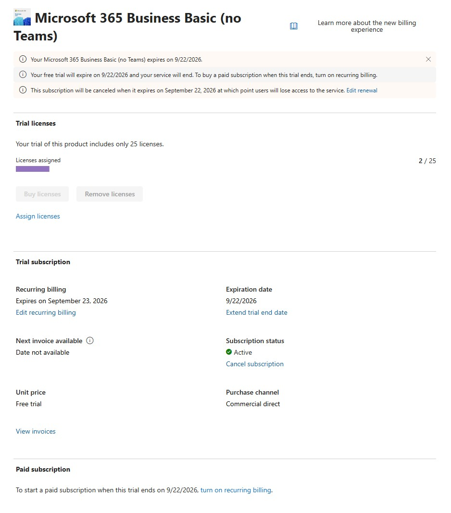
</p>

<p align="center">
  <em>Microsoft 365 admin center, Billing, Your products, Business Basic (no Teams), read before the 2026-09-22 lapse: 2 of 25 assigned, Expiration date 9/22/2026, Recurring billing reading "Expires on September 23, 2026."</em>
</p>

<p align="center">
  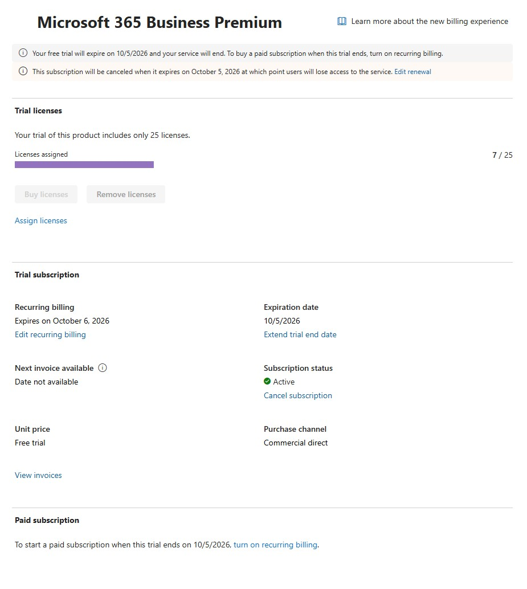
</p>

<p align="center">
  <em>The same view for Business Premium, read in the same sitting: 7 of 25 assigned, Expiration date 10/5/2026, Recurring billing reading "Expires on October 6, 2026."</em>
</p>

**The prediction for the 2026-09-22 lapse.** Per Design Decisions, it is recorded here, before the date, and is not adjusted afterward.

It departs from what Design Decisions anticipated, and the reason is recorded rather than the departure being made quietly. That section argued the Expired stage would probably apply, giving roughly 30 days of retained access past the date. Reading the same Microsoft lifecycle article in full while writing this step turned up a note that section had not accounted for: as of 2026-02-09, the Expired state no longer applies to license-based subscriptions bought directly through a Microsoft Customer Agreement. This subscription's own product page reads Purchase channel: Commercial direct. If a direct commercial purchase is an MCA purchase, the Expired stage does not apply here at all, and the subscription moves from Active straight to Disabled, where users lose access immediately and only administrators retain access to data. Predicting the cushion anyway, having read the note that removes it, would not be a prediction.

So the call is that **2026-09-22 removes access rather than deferring it**. Three sub-predictions follow, each able to fail on its own:

- **The date is 9/22, not 9/23.** The Recurring billing field reading "Expires on September 23, 2026" is most likely a billing-period boundary displayed against a last-service-day of 9/22 rather than a second real date, which would also explain the identical one-day offset on Business Premium. Reading both days settles it.
- **Adam Ramzi's mailbox survives the date even though his license does not.** He holds the subscription's single consumed seat, it is the only license he holds, and it carries the Exchange Online Plan 1 behind his mailbox. Losing a license puts a mailbox into Exchange's own retention rather than deleting it, which is a separate mechanism from the subscription lifecycle, so the mailbox should remain recoverable by reassigning a license for roughly 30 days, to about 2026-10-22.
- **The article's trial clause does not apply.** Its statement that trial account information and data are permanently deleted when a trial ends describes a trial tenant, not a trial subscription running inside an established tenant that holds a verified domain and a second subscription. If that reading is wrong, it is the most consequential thing this step got wrong.

`Finance` is empty, so its group-level assignment is a question about whether the assignment record survives rather than about anyone's access.

**The lapse is allowed to happen rather than prevented, and that is a decision.** Assigning Adam Ramzi a Business Premium license before the date would preserve the mailbox, and it would also destroy the observation Step Six exists to make, at the cost of a seat. Nothing of value is at risk: the account's mailbox holds this step's own test message and nothing else, and because Microsoft Entra roles do not require a license, the account keeps Global Administrator, keeps sign-in, and keeps the admin center through the lapse whatever happens to its mailbox. The observation is worth more than the mailbox. The prediction stands as written regardless of what Step Six finds.

The two dated carry-forward items were read fresh. `AZUREADSSOACC`'s `PasswordLastSet` read 8/31/2026 8:07:44 PM, unchanged from Lab 03, fifteen days into the thirty-day interval that ends 2026-09-30. The Entra admin center's deleted items showed both retained objects as recorded: `nolocation-demo01`, permanent deletion 10/7/2026 4:01 PM, and `Testgroup`, permanent deletion 10/6/2026 5:08:17 PM.

### Step Two: Established which accounts received mailboxes, and what an unlicensed account has instead

Exchange Online provisions a mailbox when a license carrying it is assigned, so the licensed population should be the mailboxed population. This was checked from live state on 2026-09-16, from both sides.

```powershell
Get-MgUser -All -Property Id,DisplayName,UserPrincipalName,OnPremisesSyncEnabled | ForEach-Object {
    $lic = Get-MgUserLicenseDetail -UserId $_.Id
    [PSCustomObject]@{
        DisplayName    = $_.DisplayName
        UPN            = $_.UserPrincipalName
        Synced         = $_.OnPremisesSyncEnabled
        LicenseCount   = @($lic).Count
        SkuPartNumbers = ($lic.SkuPartNumber -join ',')
    }
} | Sort-Object DisplayName | Format-Table -AutoSize
```

```text
DisplayName                              UPN                                        Synced LicenseCount SkuPartNumbers
-----------                              ---                                        ------ ------------ --------------
Adam Ramzi                               Adam@brindeck.onmicrosoft.com                     1            Microsoft_365_Business_Basic_(no Teams)
Alex Kim                                 akim@brindeck.com                          True   1            SPB
Cloud Administrator                      admin@brindeck.com                                1            SPB
Cloud-Only Demo Account (Lab 03 fixture) cloudonly-demo01@brindeck.com                     1            SPB
Emergency Access Account                 [redacted]@brindeck.onmicrosoft.com                0
Jane Doe                                 jdoe@brindeck.com                          True   1            SPB
John Smith                               jsmith@brindeck.com                        True   1            SPB
Mary Johnson                             mjohnson@brindeck.com                      True   0
Test Sync                                tsync01@brindeck.com                       True   0
testuser01                               testuser01@brindeck.com                    True   1            SPB
```

```powershell
Get-EXOMailbox -ResultSize Unlimited | Select-Object DisplayName,PrimarySmtpAddress,RecipientTypeDetails,UserPrincipalName | Sort-Object DisplayName | Format-Table -AutoSize
```

```text
DisplayName                              PrimarySmtpAddress                                                                     RecipientTypeDetails UserPrincipalName
-----------                              ------------------                                                                     --------------------- -----------------
Adam Ramzi                               Adam@brindeck.onmicrosoft.com                                                          UserMailbox            Adam@brindeck.onmicrosoft.com
Alex Kim                                 akim@brindeck.onmicrosoft.com                                                          UserMailbox            akim@brindeck.com
Cloud Administrator                      admin@brindeck.com                                                                     UserMailbox            admin@brindeck.com
Cloud-Only Demo Account (Lab 03 fixture) cloudonly-demo01@brindeck.com                                                          UserMailbox            cloudonly-demo01@brindeck.com
Discovery Search Mailbox                 DiscoverySearchMailbox{D919BA05-46A6-415f-80AD-7E09334BB852}@brindeck.onmicrosoft.com  DiscoveryMailbox       DiscoverySearchMailbox{D919BA05-46A6-415f-80AD-7E09334BB852}@brindeck.onmicrosoft.com
Jane Doe                                 jdoe@brindeck.com                                                                      UserMailbox            jdoe@brindeck.com
John Smith                               jsmith@brindeck.onmicrosoft.com                                                        UserMailbox            jsmith@brindeck.com
testuser01                               testuser01@brindeck.com                                                                UserMailbox            testuser01@brindeck.com
```

The seven accounts with a license are exactly the seven `UserMailbox` recipients, and the three without one (Emergency Access Account, Mary Johnson, Test Sync) have no recipient object at all. `Get-MgUserLicenseDetail` reads the resultant license set, which is why John Smith shows a license although Lab 03 recorded it as sourced through `Company Announcements` membership. PowerShell also returned an eighth recipient the Exchange admin center's Mailboxes view does not show: `Discovery Search Mailbox`, a `DiscoveryMailbox` present in every Exchange Online tenant with the same fixed GUID.

<p align="center">
  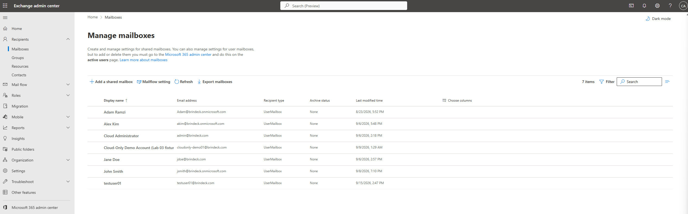
</p>

<p align="center">
  <em>Exchange admin center, Recipients, Mailboxes, reread for Step Two: the same seven UserMailbox recipients, none of them Mary Johnson, Test Sync, or the Emergency Access Account.</em>
</p>

**The unlicensed case.** Mary Johnson (`mjohnson`) was used, since the Emergency Access Account is redacted throughout this track and Lab 05 depends on it. `Get-EXORecipient` found nothing for her:

```powershell
Get-EXORecipient -Identity mjohnson@brindeck.com -ErrorAction SilentlyContinue
if (-not $?) { "No recipient object found for mjohnson@brindeck.com" }
```

```text
No recipient object found for mjohnson@brindeck.com
```

Microsoft Graph showed why: she is a live, enabled, synchronized directory object with no Exchange attributes at all, not even a stub. Only the five requested fields are quoted:

```powershell
Get-MgUser -UserId mjohnson@brindeck.com -Property Mail,ProxyAddresses,UserPrincipalName,AccountEnabled,OnPremisesSyncEnabled | Format-List
```

```text
AccountEnabled        : True
Mail                  :
OnPremisesSyncEnabled : True
ProxyAddresses        : {}
UserPrincipalName     : mjohnson@brindeck.com
```

A message was sent from `testuser01@brindeck.com` through Outlook on the web at 5:18 PM Eastern (21:18 UTC) on 2026-09-16, subject "Lab 04 Step Two - unlicensed account test," to `mjohnson@brindeck.com`. A non-delivery report arrived in testuser01's inbox within minutes:

<p align="center">
  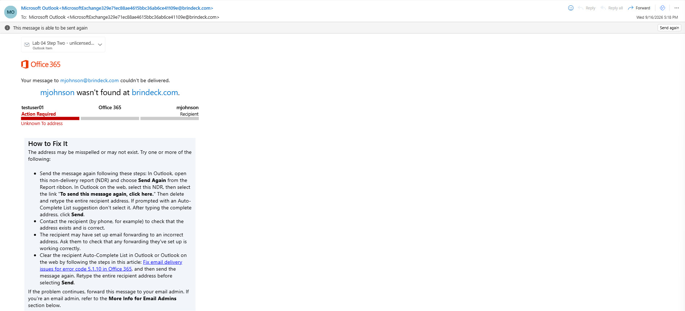
</p>

<p align="center">
  <em>Outlook on the web, testuser01's inbox: the non-delivery report for the message to mjohnson@brindeck.com, "mjohnson wasn't found at brindeck.com."</em>
</p>

<p align="center">
  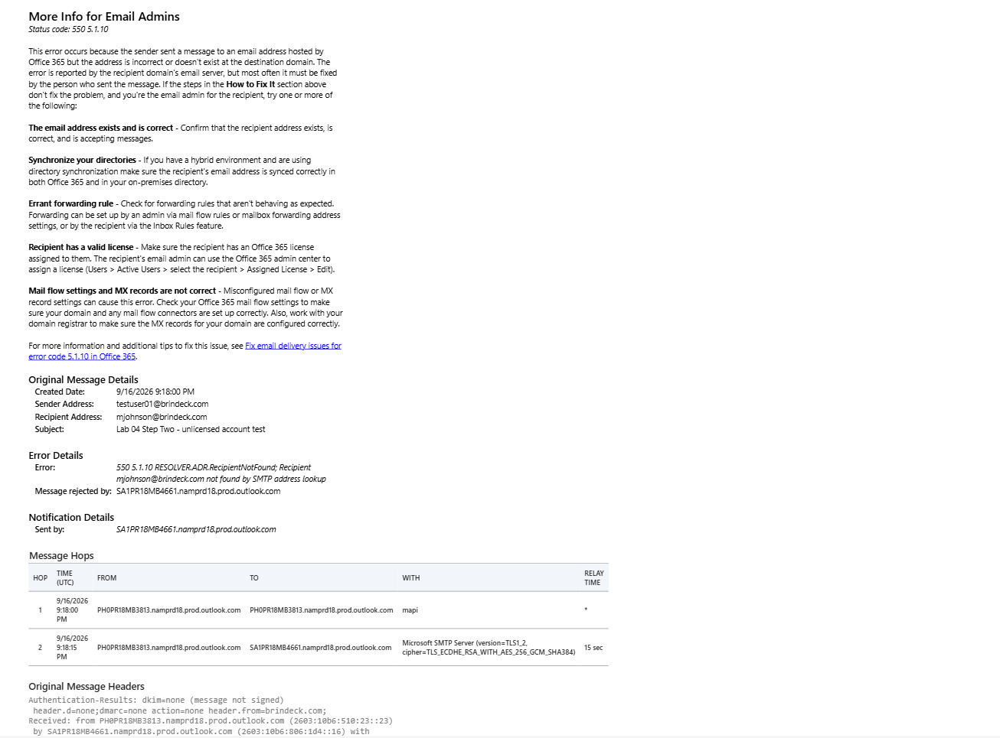
</p>

<p align="center">
  <em>The same NDR's More Info for Email Admins section: status code 550 5.1.10, the RESOLVER.ADR.RecipientNotFound error text, and the two-hop Message Hops table.</em>
</p>

The NDR's technical detail:

```text
Status code: 550 5.1.10

Original Message Details
Created Date:       9/16/2026 9:18:00 PM
Sender Address:     testuser01@brindeck.com
Recipient Address:  mjohnson@brindeck.com
Subject:            Lab 04 Step Two - unlicensed account test

Error Details
Error:               550 5.1.10 RESOLVER.ADR.RecipientNotFound; Recipient mjohnson@brindeck.com not found by SMTP address lookup
Message rejected by: SA1PR18MB4661.namprd18.prod.outlook.com

Notification Details
Sent by: SA1PR18MB4661.namprd18.prod.outlook.com

Message Hops
HOP  TIME (UTC)           FROM                                     TO                                       WITH                                                                                    RELAY TIME
1    9/16/2026 9:18:00 PM  PH0PR18MB3813.namprd18.prod.outlook.com  PH0PR18MB3813.namprd18.prod.outlook.com  mapi                                                                                    *
2    9/16/2026 9:18:15 PM  PH0PR18MB3813.namprd18.prod.outlook.com  SA1PR18MB4661.namprd18.prod.outlook.com  Microsoft SMTP Server (version=TLS1_2, cipher=TLS_ECDHE_RSA_WITH_AES_256_GCM_SHA384)      15 sec
```

The same attempt in message trace:

```powershell
Get-MessageTraceV2 -SenderAddress testuser01@brindeck.com -RecipientAddress mjohnson@brindeck.com -StartDate (Get-Date).AddHours(-1) -EndDate (Get-Date) | Format-List
```

```text
Message Trace ID  : e68809dc-1d5d-4e34-f981-08df1437fc83
Message ID        : <PH0PR18MB38133B0318991519E2059AA4ADB92@PH0PR18MB3813.namprd18.prod.outlook.com>
Received          : 9/16/2026 9:18:00 PM
Sender Address    : testuser01@brindeck.com
Recipient Address : mjohnson@brindeck.com
From IP           : [redacted, originating client address]
To IP             :
Subject           : Lab 04 Step Two - unlicensed account test
Status            : Failed
Size              : 18129
```

`Status: Failed`, consistent with the NDR. This is not Directory-Based Edge Blocking, although `brindeck.com` is `Authoritative` and Microsoft credits that domain type with enabling it. Microsoft documents DBEB's rejection as `550 5.4.1 Recipient address rejected: Access denied`, applied to inbound SMTP arriving from outside the service. This message was sent mailbox to mailbox inside the tenant and failed with `550 5.1.10 RESOLVER.ADR.RecipientNotFound`, which Microsoft documents as a categorizer-level failure: the address had no recipient object to resolve against, as the Graph read above showed.

**Closing the primary-address finding from Step One.** The full `EmailAddresses` collection was read on all seven mailboxes, together with their quotas. The quota lines were identical on all seven and are shown once, for Adam Ramzi:

```powershell
$mailboxes = 'Adam@brindeck.onmicrosoft.com','akim@brindeck.com','admin@brindeck.com','cloudonly-demo01@brindeck.com','jdoe@brindeck.com','jsmith@brindeck.com','testuser01@brindeck.com'

foreach ($mbx in $mailboxes) {
    Get-EXOMailbox -Identity $mbx -Properties EmailAddresses,ProhibitSendQuota,ProhibitSendReceiveQuota,IssueWarningQuota,RecipientTypeDetails |
        Select-Object DisplayName,UserPrincipalName,PrimarySmtpAddress,RecipientTypeDetails,ProhibitSendQuota,ProhibitSendReceiveQuota,IssueWarningQuota,@{N='EmailAddresses';E={$_.EmailAddresses -join '; '}} |
        Format-List
}
```

```text
DisplayName              : Adam Ramzi
UserPrincipalName        : Adam@brindeck.onmicrosoft.com
PrimarySmtpAddress       : Adam@brindeck.onmicrosoft.com
RecipientTypeDetails     : UserMailbox
ProhibitSendQuota        : 99 GB (106,300,440,576 bytes)
ProhibitSendReceiveQuota : 100 GB (107,374,182,400 bytes)
IssueWarningQuota        : 98 GB (105,226,698,752 bytes)
EmailAddresses           : SIP:adam@brindeck.onmicrosoft.com; SMTP:Adam@brindeck.onmicrosoft.com

DisplayName              : Alex Kim
PrimarySmtpAddress       : akim@brindeck.onmicrosoft.com
EmailAddresses           : SIP:akim@brindeck.com; SMTP:akim@brindeck.onmicrosoft.com; smtp:akim@brindeck.com

DisplayName              : Cloud Administrator
PrimarySmtpAddress       : admin@brindeck.com
EmailAddresses           : SIP:admin@brindeck.com; SMTP:admin@brindeck.com

DisplayName              : Cloud-Only Demo Account (Lab 03 fixture)
PrimarySmtpAddress       : cloudonly-demo01@brindeck.com
EmailAddresses           : SIP:cloudonly-demo01@brindeck.com; SMTP:cloudonly-demo01@brindeck.com

DisplayName              : Jane Doe
PrimarySmtpAddress       : jdoe@brindeck.com
EmailAddresses           : SIP:jdoe@brindeck.com; smtp:jdoe@brindeck.onmicrosoft.com; SMTP:jdoe@brindeck.com

DisplayName              : John Smith
PrimarySmtpAddress       : jsmith@brindeck.onmicrosoft.com
EmailAddresses           : SIP:jsmith@brindeck.com; SMTP:jsmith@brindeck.onmicrosoft.com; smtp:jsmith@brindeck.com

DisplayName              : testuser01
PrimarySmtpAddress       : testuser01@brindeck.com
EmailAddresses           : SIP:testuser01@brindeck.com; smtp:testuser01@brindeck.onmicrosoft.com; SMTP:testuser01@brindeck.com; [one additional SPO: entry carrying testuser01's own directory object ID, dropped here under this track's identifier policy]
```

All four synchronized mailboxes carry both domains. Alex Kim and John Smith hold `brindeck.onmicrosoft.com` as primary (uppercase `SMTP:`) and `brindeck.com` as secondary; Jane Doe and testuser01 hold the reverse. On premises, `proxyAddresses` is blank on all four:

```powershell
Get-ADUser -Filter "SamAccountName -eq 'akim' -or SamAccountName -eq 'jdoe' -or SamAccountName -eq 'jsmith' -or SamAccountName -eq 'testuser01'" -Properties ProxyAddresses,UserPrincipalName |
    Select-Object SamAccountName,UserPrincipalName,@{N='ProxyAddresses';E={$_.ProxyAddresses -join '; '}} |
    Format-List
```

```text
SamAccountName    : akim
UserPrincipalName : akim@brindeck.com
ProxyAddresses    :

SamAccountName    : jdoe
UserPrincipalName : jdoe@brindeck.com
ProxyAddresses    :

SamAccountName    : jsmith
UserPrincipalName : jsmith@brindeck.com
ProxyAddresses    :

SamAccountName    : testuser01
UserPrincipalName : testuser01@brindeck.com
ProxyAddresses    :
```

So there is nothing on premises for the cloud stamp to inherit, and the split happened inside Exchange Online when each mailbox was created. The remaining hypothesis was that the two primaries were set before `brindeck.com` was verified on 2026-08-23:

```powershell
foreach ($mbx in $mailboxes) {
    Get-EXOMailbox -Identity $mbx -Properties WhenMailboxCreated | Select-Object DisplayName,WhenMailboxCreated
}
```

```text
DisplayName                              WhenMailboxCreated
-----------                              ------------------
Adam Ramzi                               8/19/2026 8:41:36 AM
Alex Kim                                 9/6/2026 1:54:44 PM
Cloud Administrator                      9/6/2026 1:54:41 PM
Cloud-Only Demo Account (Lab 03 fixture) 9/6/2026 1:54:41 PM
Jane Doe                                 9/6/2026 1:54:41 PM
John Smith                               9/7/2026 3:04:05 PM
testuser01                               9/6/2026 1:50:15 PM
```

The hypothesis is disproved. Every mailbox except Adam Ramzi's was created on 9/6 or 9/7, two weeks after verification. Batch timing does not explain it either: Cloud Administrator, the Cloud-Only Demo Account, and Jane Doe were created in the same second and landed on `brindeck.com`, and Alex Kim, three seconds later, did not. The split is a cloud-side provisioning artifact with no explanation found, and it is left open.

**Mailbox quotas.** All seven carry `IssueWarningQuota` 98 GB, `ProhibitSendQuota` 99 GB, and `ProhibitSendReceiveQuota` 100 GB. Standalone Exchange Online Plan 1 is documented at 50 GB, but Microsoft's Exchange Online limits article gives Business Basic, Standard, and Premium 100 GB with exactly this 98/99/100 triple. The extra 50 GB is `EXCHANGE_STORAGE_50GB`, which Step One's enumeration found on Business Premium. Adam Ramzi's mailbox reports the same 100 GB on Business Basic, so that SKU's service plans were enumerated too on 2026-09-16, while it still existed:

```text
ServicePlanName                   ProvisioningStatus
---------------                   ------------------
Bing_Chat_Enterprise              Success
BPOS_S_TODO_1                     Success
CDS_O365_P1                       Success
DYN365_CDS_O365_P1                Success
EXCHANGE_S_STANDARD               Success
EXCHANGE_STORAGE_50GB             Success
FLOW_O365_P1                      Success
FORMS_PLAN_E1                     Success
GRAPH_CONNECTORS_SEARCH_INDEX     Success
INSIGHTS_BY_MYANALYTICS           Success
INTUNE_O365                       PendingActivation
KAIZALA_O365_P2                   Success
M365_LIGHTHOUSE_CUSTOMER_PLAN1    Success
MCOSTANDARD                       Success
MDOLITE_ENTERPRISE                Success
MESH_AVATARS_ADDITIONAL_FOR_TEAMS Success
MESH_AVATARS_FOR_TEAMS            Success
MESH_IMMERSIVE_FOR_TEAMS          Success
MICROSOFT_MYANALYTICS_FULL        Success
MICROSOFT_SEARCH                  Success
MICROSOFTBOOKINGS                 Success
MYANALYTICS_P2                    Success
Nucleus                           Success
OFFICEMOBILE_SUBSCRIPTION         Success
PEOPLE_SKILLS_FOUNDATION          Success
PLACES_CORE                       Success
POWER_VIRTUAL_AGENTS_O365_P1      Success
POWERAPPS_O365_P1                 Success
PROJECT_O365_P1                   Success
PROJECTWORKMANAGEMENT             Success
RMS_S_BASIC                       Success
SHAREPOINTSTANDARD                Success
SHAREPOINTWAC                     Success
STREAM_O365_SMB                   Success
SWAY                              Success
VIVA_LEARNING_SEEDED              Success
VIVAENGAGE_CORE                   Success
WHITEBOARD_PLAN1                  Success
YAMMER_ENTERPRISE                 Success
```

Business Basic carries 39 plans, `EXCHANGE_STORAGE_50GB` among them, which confirms the quota explanation from the tenant. It also carries `EXCHANGE_S_STANDARD` without `EXCHANGE_S_FOUNDATION`, so `EXCHANGE_S_FOUNDATION` is not a base entitlement every Exchange-bearing SKU includes, and why it is the one Business Premium plan with no app entry (Step One) stays open.

**Adam Ramzi's pre-lapse baseline, for Step Six.** He holds the tenant's single consumed Business Basic seat, his only license. His mailbox was read on 2026-09-16:

```powershell
Get-EXOMailboxStatistics -Identity Adam@brindeck.onmicrosoft.com | Select-Object DisplayName,ItemCount,TotalItemSize,TotalDeletedItemSize,LastLogonTime | Format-List
```

```text
DisplayName          : Adam Ramzi
ItemCount            : 36
TotalItemSize        : 7.536 MB (7,901,637 bytes)
TotalDeletedItemSize : 0 B (0 bytes)
LastLogonTime        :
```

Thirty-six items and 7.536 MB of default provisioning content; nothing in this lab has been sent to this mailbox. `LastLogonTime` printed blank, which later proved to mean the property was never retrieved rather than that nobody had signed in (Troubleshooting and Adjustments).

### Step Three: Built and catalogued the mail-enabled group types Lab 03 handed forward

The step ran on the evening of 2026-09-16 Eastern; timestamps in the PowerShell and trace output below are UTC, which is why later ones read 2026-09-17. The four synchronized on-premises groups were read first:

```powershell
Get-ADGroup -Filter * -Properties GroupCategory,GroupScope,mail,proxyAddresses,Description |
    Where-Object { $_.DistinguishedName -like "*OU=Groups*" } |
    Select-Object Name,GroupCategory,GroupScope,mail,Description |
    Format-Table -AutoSize
```

```text
Name                    GroupCategory GroupScope mail Description
----                    ------------- ---------- ---- -----------
IT-Admins               Security      Global
Domain-Users-Standard   Security      Global
Lab-Workstations        Security      Global
Linux-Admins            Security      Global          Authorized administrators of Linux infrastructure systems
```

All four are Global-scope security groups with no `mail` attribute. The tenant's mail-enabled groups were still only the two Microsoft 365 groups:

```powershell
Get-EXORecipient -RecipientTypeDetails MailUniversalDistributionGroup,MailUniversalSecurityGroup,GroupMailbox -ResultSize Unlimited |
    Select-Object DisplayName,PrimarySmtpAddress,RecipientTypeDetails |
    Format-Table -AutoSize
```

```text
DisplayName            PrimarySmtpAddress                   RecipientTypeDetails
-----------            ------------------                   --------------------
All Company            allcompany@brindeck.onmicrosoft.com  GroupMailbox
Company Announcements  CompanyAnnouncements@brindeck.com    GroupMailbox
```

**Managing a synchronized group's mail properties from the cloud.** `IT-Admins` was the test object. Microsoft Graph showed it as an ordinary synchronized security group, not mail-enabled:

```powershell
$groupId = (Get-MgGroup -Filter "displayName eq 'IT-Admins'").Id
Invoke-MgGraphRequest -Method GET -Uri "https://graph.microsoft.com/v1.0/groups/$groupId`?`$select=id,displayName,mail,mailEnabled,securityEnabled,groupTypes,onPremisesSyncEnabled,onPremisesSamAccountName" | Format-List
```

```text
groupTypes               : {}
displayName              : IT-Admins
onPremisesSyncEnabled    : True
mail                     :
mailEnabled              : False
securityEnabled          : True
id                       : 6d494357-[remainder redacted]
onPremisesSamAccountName : IT-Admins
```

Exchange Online PowerShell has no cmdlet that mail-enables an existing group (the attempt is in Troubleshooting and Adjustments); Microsoft creates a mail-enabled security group as a new object, which is how `IT-Support` was built below. The write was attempted directly against Microsoft Graph instead:

```powershell
$body = @{ mailNickname = "it-admins-test" } | ConvertTo-Json
Invoke-MgGraphRequest -Method PATCH -Uri "https://graph.microsoft.com/v1.0/groups/$groupId" -Body $body -ContentType "application/json"
```

```text
Invoke-MgGraphRequest : PATCH https://graph.microsoft.com/v1.0/groups/6d494357-[remainder redacted]
HTTP/1.1 400 Bad Request
[response headers omitted]
{"error":{"code":"Request_BadRequest","message":"Unable to update the specified properties for on-premises mastered
Directory Sync objects or objects currently undergoing migration.","innerError":{"date":"2026-09-16T23:21:20","request-id":"c3387ee5-5caf-43d1-ac08-7d0d5abde980","client-request-id":"91b712df-f601-4f1a-acb0-1f7a17fea8ee"}}}
```

This is the refusal Lab 03 received word for word on `Update-MgUser -JobTitle` against a synchronized user, where some other fields stayed writable. So this shows `mailNickname` is locked on a synchronized group, not that every field is; one attempt does not settle whether any field is open.

**Building the distribution list.** `Help-Desk` was created in the Exchange admin center (Recipients, Groups, Add a group, Distribution), with owner Cloud Administrator and members testuser01, John Smith, and Jane Doe. Adam Ramzi and `cloudonly-demo01` were kept out, for Step Six and Lab 05 respectively. Settings were left at their shipped defaults: address `help-desk@brindeck.com`, external senders not allowed, and joining and leaving both Open. The unchecked external-senders box matches Microsoft's documented default that a new distribution group accepts only authenticated senders.

<p align="center">
  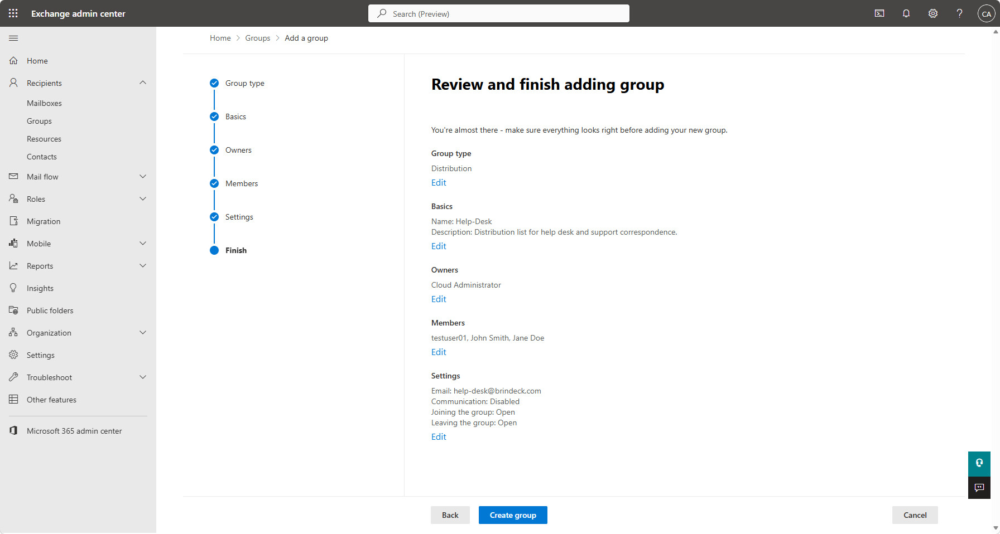
</p>

<p align="center">
  <em>Exchange admin center, Add a group, Review and finish for Help-Desk.</em>
</p>

The portal warned that the new group could take up to an hour to appear in the Groups list.

<p align="center">
  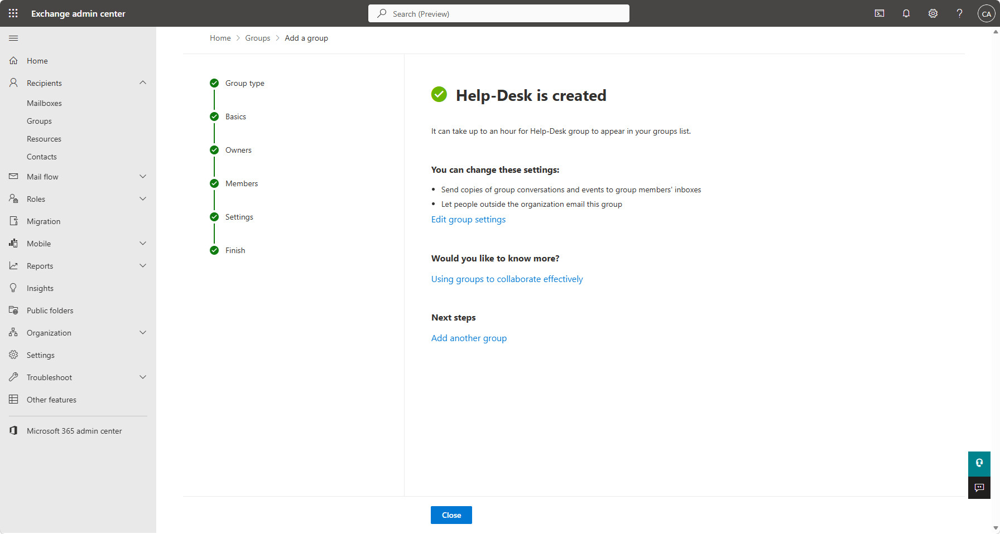
</p>

<p align="center">
  <em>Exchange admin center: Help-Desk created, with the note that the Groups list can take up to an hour to show it.</em>
</p>

PowerShell returned it immediately:

```powershell
Get-DistributionGroup -Identity "Help-Desk" | Select-Object DisplayName,PrimarySmtpAddress,GroupType,RecipientTypeDetails | Format-List
Get-DistributionGroupMember -Identity "Help-Desk" | Select-Object DisplayName,PrimarySmtpAddress
```

```text
DisplayName          : Help-Desk
PrimarySmtpAddress   : help-desk@brindeck.com
GroupType            : Universal
RecipientTypeDetails : MailUniversalDistributionGroup

DisplayName PrimarySmtpAddress
----------- ------------------
Jane Doe    jdoe@brindeck.com
John Smith  jsmith@brindeck.onmicrosoft.com
testuser01  testuser01@brindeck.com
```

**Building the mail-enabled security group.** `IT-Support` was created in the same wizard as Mail-enabled security, which describes itself as having "all the functionality of a distribution list and additionally can be used to control access to OneDrive and SharePoint." Its settings are narrower than the distribution list's: a single "Require owner approval to join the group" checkbox replaces the separate Open, Closed, or Owner approval controls for joining and leaving. Owner Cloud Administrator, members Alex Kim and testuser01, address `it-support@brindeck.com`, defaults otherwise.

<p align="center">
  
</p>

<p align="center">
  <em>Exchange admin center, Add a group, Review and finish for IT-Support.</em>
</p>

```powershell
Get-DistributionGroup -Identity "IT-Support" | Select-Object DisplayName,PrimarySmtpAddress,GroupType,RecipientTypeDetails | Format-List
Get-DistributionGroupMember -Identity "IT-Support" | Select-Object DisplayName,PrimarySmtpAddress
```

```text
DisplayName          : IT-Support
PrimarySmtpAddress   : it-support@brindeck.com
GroupType            : Universal, SecurityEnabled
RecipientTypeDetails : MailUniversalSecurityGroup

DisplayName PrimarySmtpAddress
----------- ------------------
testuser01  testuser01@brindeck.com
Alex Kim    akim@brindeck.onmicrosoft.com
```

`MailUniversalSecurityGroup` against `Help-Desk`'s `MailUniversalDistributionGroup`, with `GroupType` carrying `SecurityEnabled`.

**What each type accepts as a member.** `IT-Admins` was added to each of the three group types:

```powershell
Add-DistributionGroupMember -Identity "Help-Desk" -Member "IT-Admins"
Add-DistributionGroupMember -Identity "IT-Support" -Member "IT-Admins"
Add-UnifiedGroupLinks -Identity "Company Announcements" -LinkType Members -Links "IT-Admins"
```

The first two returned nothing. The Microsoft 365 group refused:

```text
Write-ErrorMessage : ||The user couldn't be found for mailbox Identity:'IT-Admins' isn't a mailbox user..
At C:\Users\labadmin.CORP\AppData\Local\Temp\tmpEXO_0owifaqh.amv\tmpEXO_0owifaqh.amv.psm1:1196 char:13
+             Write-ErrorMessage $ErrorObject
+             ~~~~~~~~~~~~~~~~~~~~~~~~~~~~~~~
    + CategoryInfo          : NotSpecified: (:) [Add-UnifiedGroupLinks], MailboxUserNotFoundException
    + FullyQualifiedErrorId : [Server=PH0PR18MB988511,RequestId=c531290d-82d3-abfa-b01e-82ef8112a48c,TimeStamp=Thu, 17 Sep 2026 00:10:15 GMT],Write-ErrorMessage
```

Reading the memberships back confirmed the first two had worked:

```powershell
Get-DistributionGroupMember -Identity "Help-Desk" | Select-Object DisplayName,PrimarySmtpAddress,RecipientTypeDetails
Get-DistributionGroupMember -Identity "IT-Support" | Select-Object DisplayName,PrimarySmtpAddress,RecipientTypeDetails
```

```text
DisplayName PrimarySmtpAddress               RecipientTypeDetails
----------- ------------------               --------------------
Jane Doe    jdoe@brindeck.com                UserMailbox
testuser01  testuser01@brindeck.com          UserMailbox
John Smith  jsmith@brindeck.onmicrosoft.com  UserMailbox
IT-Admins                                    ExchangeSecurityGroup

DisplayName PrimarySmtpAddress               RecipientTypeDetails
----------- ------------------               --------------------
testuser01  testuser01@brindeck.com          UserMailbox
Alex Kim    akim@brindeck.onmicrosoft.com    UserMailbox
IT-Admins                                    ExchangeSecurityGroup
```

A distribution list and a mail-enabled security group both accept a nested security group. A Microsoft 365 group accepts only users, although its error frames the refusal as a missing mailbox user.

**What each type looks like from the Entra admin center.** The track README says the Entra admin center can list distribution lists and mail-enabled security groups but cannot manage them. This was checked while `IT-Admins` was still nested in `IT-Support`. All groups read 11, the nine from before this step plus `Help-Desk` and `IT-Support`:

| Name | Group type | Membership type | Source |
|---|---|---|---|
| All Company | Microsoft 365 | Assigned | Cloud |
| Company Announcements | Microsoft 365 | Assigned | Cloud |
| Domain-Users-Standard | Security | Assigned | Windows Server AD |
| Finance | Security | Assigned | Cloud |
| Groups-Administrators | Security | Assigned | Cloud |
| Help-Desk | Distribution | Assigned | Cloud |
| IT-Admins | Security | Assigned | Windows Server AD |
| IT-Department | Security | Dynamic | Cloud |
| IT-Support | Mail enabled security | Assigned | Cloud |
| Lab-Workstations | Security | Assigned | Windows Server AD |
| Linux-Admins | Security | Assigned | Windows Server AD |

<p align="center">
  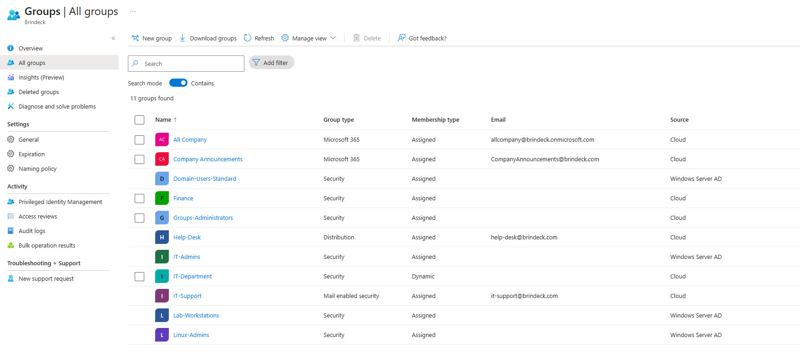
</p>

<p align="center">
  <em>Entra admin center, Groups, All groups: 11 groups, Group type distinguishing Microsoft 365, Security, Distribution, and Mail enabled security.</em>
</p>

`IT-Support`'s Properties and Members pages both carry a "Some groups can't be managed" banner. Every Properties field is greyed out, and the Members page lists `IT-Admins` as `Type: Group` beside the two users, with its Add members and Remove controls under the same banner.

<p align="center">
  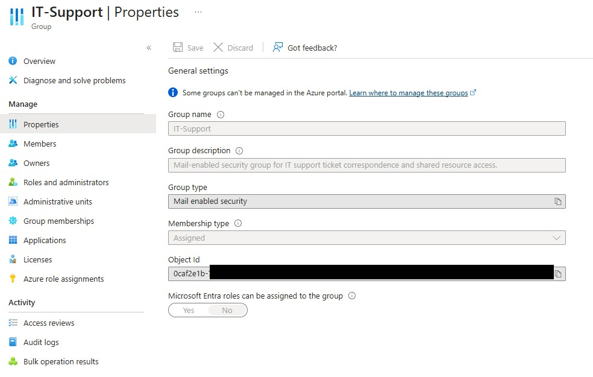
</p>

<p align="center">
  <em>Entra admin center, IT-Support, Properties: the "can't be managed" banner and every field greyed out.</em>
</p>

<p align="center">
  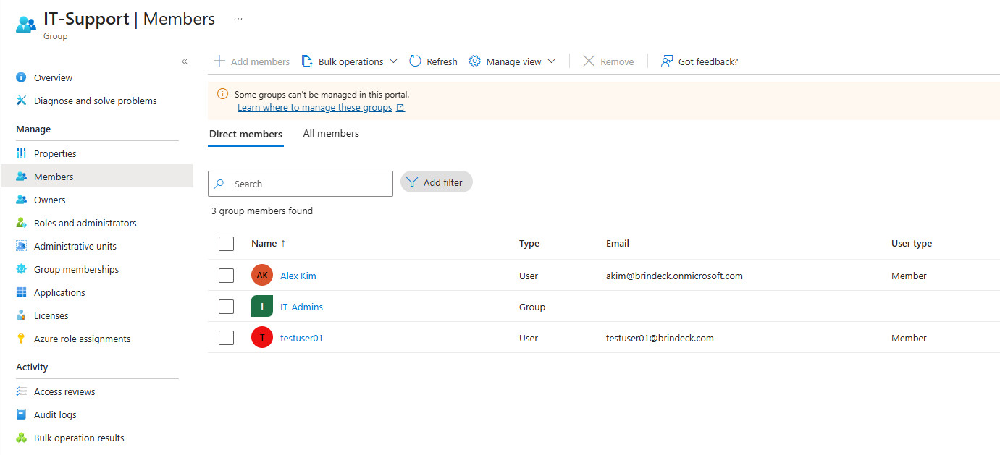
</p>

<p align="center">
  <em>Entra admin center, IT-Support, Members: the same banner, IT-Admins listed as a Group beside two Users.</em>
</p>

`Company Announcements`, a Microsoft 365 group, has no banner, and its name, description, and membership controls are all editable.

<p align="center">
  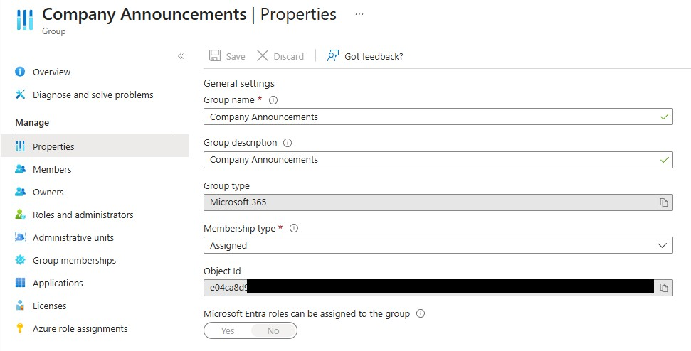
</p>

<p align="center">
  <em>Entra admin center, Company Announcements, Properties: no banner, name and description editable.</em>
</p>

<p align="center">
  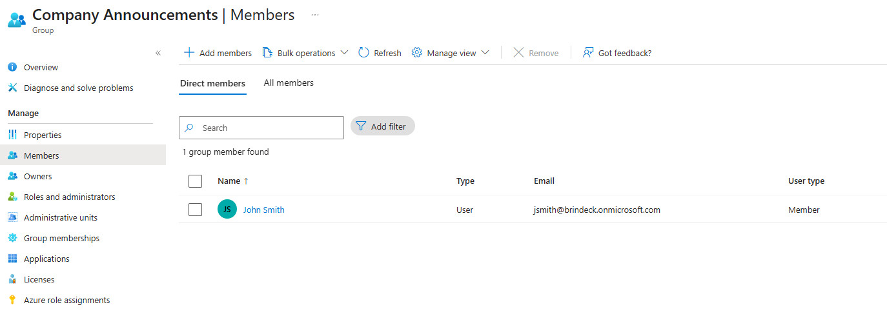
</p>

<p align="center">
  <em>Entra admin center, Company Announcements, Members: no banner, Add members and Remove active.</em>
</p>

The test nesting was then removed:

```powershell
Remove-DistributionGroupMember -Identity "Help-Desk" -Member "IT-Admins" -Confirm:$false
Remove-DistributionGroupMember -Identity "IT-Support" -Member "IT-Admins" -Confirm:$false
```

A readback showed `Help-Desk` back to its three members and `IT-Support` to its two, all `UserMailbox`.

**The catalogue.** Each cell is marked as observed here, or taken from the wizard's own text or Microsoft's documentation:

| | Distribution list | Mail-enabled security group | Microsoft 365 group |
|---|---|---|---|
| Created via | Exchange admin center, Recipients, Groups, Add a group (observed) | The same wizard, different type selection (observed) | Offered as a type in the same wizard (observed); other creation paths not tested in this lab |
| Membership managed via | Exchange admin center at creation and `Add-DistributionGroupMember` (both observed) | Exchange admin center at creation and `Add-DistributionGroupMember` (both observed) | `Add-UnifiedGroupLinks` (observed); Entra admin center Add members and Remove controls active (observed, not exercised) |
| Accepts as members | Users and a nested security group (observed) | Users and a nested security group (observed) | Users; a nested security group rejected by `Add-UnifiedGroupLinks` (observed) |
| Grants permissions beyond mail | No; the wizard describes it only as creating an email address for a group (wizard text) | Yes, access to OneDrive and SharePoint (wizard text, not exercised) | Yes, through the group mailbox and shared workspace it brings with it (wizard text, not exercised) |
| Entra admin center rendering | Listed with type "Distribution" (observed); Properties and Members pages not opened in this step | Listed with type "Mail enabled security"; Properties and Members read-only behind the "can't be managed" banner (observed) | Listed with type "Microsoft 365"; Properties and Members editable, no banner (observed) |
| Message trace delivery status | `Expanded` (Microsoft's documentation); traced against `Help-Desk` in Step Five | `Expanded` for the group, then `Delivered` to each member (observed in this step) | Not traced in this lab |

What decides whether the Entra admin center can manage a group is not what the group does but where it lives. Distribution lists and mail-enabled security groups are Exchange Online objects and are managed there; Microsoft 365 groups and cloud security groups are managed in Entra.

**Sending mail through IT-Support.** Step Five's planned messages do not cover `IT-Support`, so its test ran here. testuser01 sent a message to `it-support@brindeck.com`, subject `Step Three mail routing test`:

```powershell
Get-MessageTraceV2 -RecipientAddress "it-support@brindeck.com" -StartDate (Get-Date).AddMinutes(-15) -EndDate (Get-Date).AddMinutes(5)
```

```text
Received               Sender Address            Recipient Address        Subject                       Status
--------               --------------            -----------------        -------                       ------
9/17/2026 12:37:35 AM  testuser01@brindeck.com   it-support@brindeck.com  Step Three mail routing test  Expanded
```

`Expanded` means the group resolved into its members, the same status Microsoft documents for a distribution list. It does not show delivery, so each member was traced:

```powershell
Get-MessageTraceV2 -RecipientAddress "testuser01@brindeck.com","akim@brindeck.onmicrosoft.com" -Subject "Step Three mail routing test" -SubjectFilterType "Contains" -StartDate (Get-Date "2026-09-16") -EndDate (Get-Date "2026-09-18")
```

```text
Received               Sender Address           Recipient Address              Subject                       Status
--------               --------------           -----------------              -------                       ------
9/17/2026 12:37:35 AM  testuser01@brindeck.com  akim@brindeck.onmicrosoft.com  Step Three mail routing test  Delivered
9/17/2026 12:37:35 AM  testuser01@brindeck.com  testuser01@brindeck.com        Step Three mail routing test  Delivered
```

Both members received it, including testuser01, who was also the sender.

**Disposition.** Both groups are removed at Step Nine, `Help-Desk` after Step Five's trace against it. Both were left unlicensed, because Lab 03 found a group with a license assignment cannot be deleted.

### Step Four: Created a shared mailbox and demonstrated all three delegation models

Step Three's groups already held `help-desk@` and `it-support@`, so the shared mailbox was named `Facilities`. `Get-EXORecipient` confirmed the address was free, and it was created in the Microsoft 365 admin center (Teams & groups, Shared mailboxes, Add a shared mailbox) with no members, since adding a member in that wizard grants Full Access with automapping as a side effect.

<p align="center">
  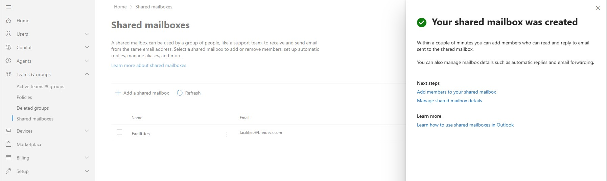
</p>

<p align="center">
  <em>Microsoft 365 admin center, Teams & groups, Shared mailboxes: Facilities created at facilities@brindeck.com.</em>
</p>

```powershell
Get-EXOMailbox -Identity facilities@brindeck.com -Properties RecipientTypeDetails,ProhibitSendQuota,ProhibitSendReceiveQuota,IssueWarningQuota,ArchiveStatus | Format-List DisplayName,PrimarySmtpAddress,RecipientTypeDetails,ProhibitSendQuota,ProhibitSendReceiveQuota,IssueWarningQuota
```

```text
DisplayName              : Facilities
PrimarySmtpAddress       : facilities@brindeck.com
RecipientTypeDetails     : SharedMailbox
ProhibitSendQuota        : 49.5 GB (53,150,220,288 bytes)
ProhibitSendReceiveQuota : 50 GB (53,687,091,200 bytes)
IssueWarningQuota        : 49 GB (52,613,349,376 bytes)
```

`SharedMailbox`, with a 50 GB `ProhibitSendReceiveQuota`: the documented unlicensed shared-mailbox limit, against the 100 GB on every licensed mailbox in Step Two. The mailbox itself needs no license; the people reading it need their own. Its underlying `Name` and `Identity` are a generated timestamped string, `Facilities20260917205737`, rather than `Facilities`, which is what shows up in some cmdlet output below.

**The sign-in state.** Microsoft's documentation disagrees about whether a new shared mailbox's account can sign in, so it was read from the tenant:

```powershell
Get-MgUser -UserId facilities@brindeck.com -Property Id,UserPrincipalName,AccountEnabled,DisplayName | Format-List
```

```text
AboutMe                       :
AccountEnabled                : False
Activities                    :
AdhocCalls                    :
AgeGroup                      :
```

(`Format-List` with no property list prints the whole user object; only its head is quoted.) The Entra admin center agreed in the same sitting:

<p align="center">
  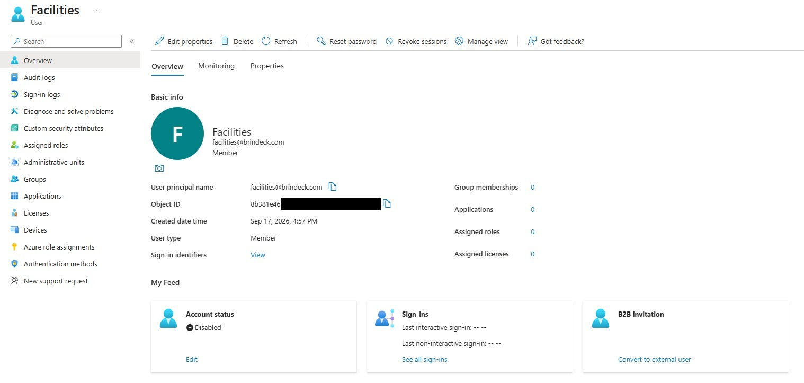
</p>

<p align="center">
  <em>Entra admin center, Facilities, Overview: Account status Disabled. The Properties page reads Account enabled: No.</em>
</p>

This tenant blocks sign-in on a new shared mailbox by default, which supports the shared-mailbox creation article over the Exchange Online limits reference.

**Delegation.** `testuser01` was the delegate for all three models. The recipients, Jane Doe and Cloud Administrator, held none of the three permissions, so what they received is what an uninvolved recipient sees.

**Full Access.**

```powershell
Add-MailboxPermission -Identity facilities@brindeck.com -User testuser01@brindeck.com -AccessRights FullAccess -InheritanceType All
Get-MailboxPermission -Identity facilities@brindeck.com | Where-Object { $_.User -notlike "NT AUTHORITY*" } | Select-Object User,AccessRights,IsInherited
```

```text
User                    AccessRights IsInherited
----                    ------------ -----------
testuser01@brindeck.com {FullAccess} False
```

Opening the mailbox in Outlook on the web about five minutes later failed:

```text
BootResult: accessDenied
err: Microsoft.Exchange.Data.StoreObjects.AccessDeniedException
UTC Date: 2026-09-17T21:26:11.016Z
```

It opened on a retry at 5:45 PM Eastern, about 24 minutes after the grant. That was checked opportunistically, so 24 minutes is an upper bound on the delay, not a measurement. With only Full Access, a message composed inside the mailbox to Jane Doe around 5:49 PM Eastern was blocked at the client:

<p align="center">
  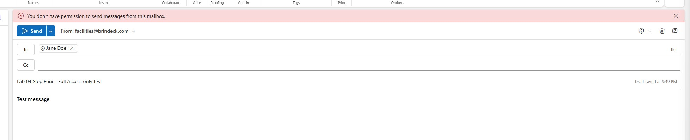
</p>

<p align="center">
  <em>Outlook on the web, composing inside Facilities with Full Access only: "You don't have permission to send messages from this mailbox."</em>
</p>

Full Access grants the mailbox's contents and nothing about sending, and the permission list gives no hint of the gap.

**Send As.**

```powershell
Add-RecipientPermission -Identity facilities@brindeck.com -Trustee testuser01@brindeck.com -AccessRights SendAs -Confirm:$false
```

```text
Identity                  Trustee                              AccessControlType AccessRights Inherited
--------                  -------                              ----------------- ------------ ---------
Facilities20260917205737  653bc643-[remainder redacted]  Allow             {SendAs}     False
```

The write cmdlets return the trustee as an unresolved object ID; `Get-MailboxPermission` and `Get-RecipientPermission` resolve it to a name, so grants are verified with those. Sends from inside Facilities were still blocked at 6:07 PM and 6:18 PM Eastern while `Get-RecipientPermission` showed the grant in place:

```powershell
Get-RecipientPermission -Identity facilities@brindeck.com | Select-Object Trustee,AccessRights,AccessControlType
```

```text
Trustee                 AccessRights AccessControlType
-------                 ------------ -----------------
NT AUTHORITY\SELF       {SendAs}     Allow
testuser01@brindeck.com {SendAs}     Allow
```

The send succeeded at 6:25 PM. Cloud Administrator received it from Facilities alone, and the sender card showed only `facilities@brindeck.com`, with no trace of testuser01.

**Send on Behalf.** Send As was removed first, so Send on Behalf could be seen on its own:

```powershell
Remove-RecipientPermission -Identity facilities@brindeck.com -Trustee testuser01@brindeck.com -AccessRights SendAs -Confirm:$false
Set-Mailbox -Identity facilities@brindeck.com -GrantSendOnBehalfTo testuser01@brindeck.com
Get-Mailbox -Identity facilities@brindeck.com | Select-Object -ExpandProperty GrantSendOnBehalfTo
```

```text
653bc643-[remainder redacted]
```

A message composed inside Facilities at 6:39 PM Eastern arrived from Facilities alone, with no `Sender:` header, exactly like Send As. A message sent at 6:50 PM from testuser01's own mailbox with From set to Facilities arrived as documented:

<p align="center">
  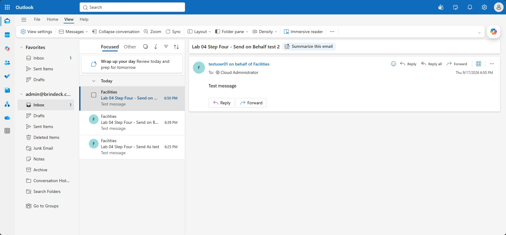
</p>

<p align="center">
  <em>Cloud Administrator's inbox: "testuser01 on behalf of Facilities."</em>
</p>

<p align="center">
  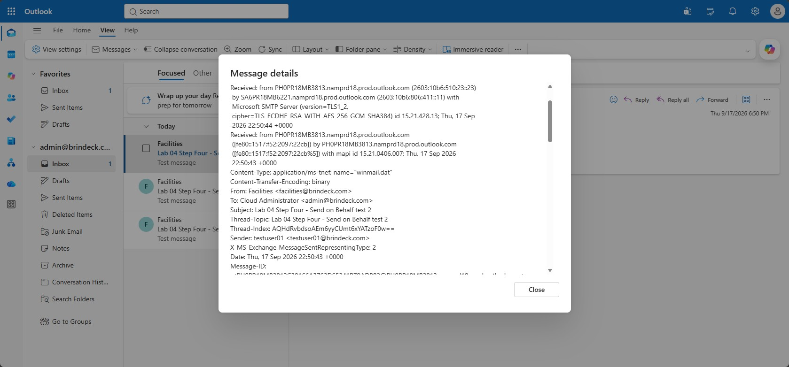
</p>

<p align="center">
  <em>The same message's headers: From: Facilities, Sender: testuser01, and X-MS-Exchange-MessageSentRepresentingType: 2.</em>
</p>

That pair first looked as though the compose path decided the header. The simpler explanation was that the Send As removal, made minutes before 6:39 PM, had not taken effect yet, the same way the grant had lagged. To separate the two, `Get-RecipientPermission -Identity facilities@brindeck.com -Trustee testuser01@brindeck.com` was confirmed to return nothing, and the 6:39 PM send was repeated exactly, from inside Facilities, at 7:31 PM Eastern:

<p align="center">
  
</p>

<p align="center">
  <em>Cloud Administrator's inbox: the 7:31 PM retest reads "testuser01 on behalf of Facilities," while the 6:39 PM message below it shows Facilities alone.</em>
</p>

<p align="center">
  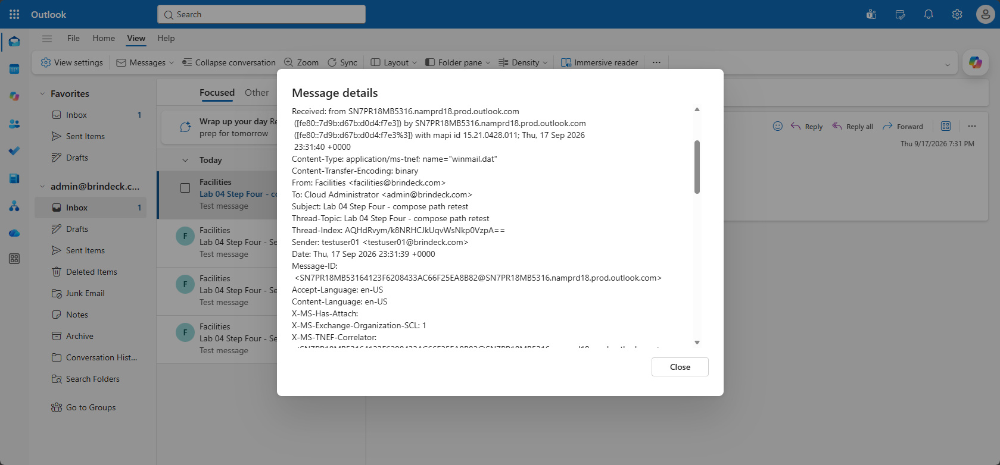
</p>

<p align="center">
  <em>The retest's headers: From: Facilities and Sender: testuser01, from the same compose path as the 6:39 PM send.</em>
</p>

The compose path does not matter. The 6:39 PM message was a Send As message, authorized by a permission the directory had already stopped reporting. The three models behave as documented: Send As leaves no `Sender:` line, Send on Behalf names the delegate, and Full Access alone cannot send.

**Revoking Send As fails open.** The revocation ran at an unlogged time between 6:25 PM and 6:39 PM, so it was still honored at most fourteen minutes after it ran, and no longer honored by 7:31 PM, at most sixty-six minutes after. Microsoft documents up to 60 minutes for mailbox permission changes to take effect, so the delay itself is expected. What matters is the consequence:

- A grant that has not landed fails closed: the delegate is told they cannot send (6:07 PM and 6:18 PM).
- A revocation that has not landed fails open: the delegate keeps sending as the shared mailbox with no attribution, while `Get-RecipientPermission` already returns nothing.

Nothing in the cmdlets or the admin center shows that the tenant is inside that window. It is recorded in Security Considerations.

**Disposition.** `Facilities` keeps Full Access and Send on Behalf for testuser01 and is removed at Step Nine. It is separate from the shared mailbox Step Eight produces by converting a user mailbox.

### Step Five: Built a mail flow rule, sent mail through the objects built, and traced it

Project Context's premise is that a distribution list with correct membership and a transport rule stopping mail to it look identical from the group's own properties. `Help-Desk` was proven working first, then the rule was built, so the working and broken states could be read against the same object.

**Help-Desk working, before the rule.** testuser01 sent a message to `help-desk@brindeck.com` at 11:37 AM Eastern on 9/18/2026, subject `Lab 04 Step Five - Help-Desk baseline test`.

<p align="center">
  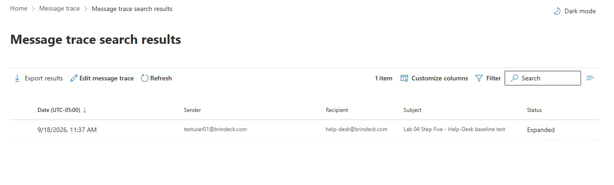
</p>

<p align="center">
  <em>Exchange admin center, Message trace: the baseline message to help-desk@brindeck.com, Status Expanded.</em>
</p>

`Get-MessageTraceV2` returned nothing at 11:39 AM Eastern, two minutes after the send, and returned the row at 11:40:

```powershell
Get-MessageTraceV2 -RecipientAddress "help-desk@brindeck.com" -StartDate (Get-Date).AddMinutes(-20) -EndDate (Get-Date)
```

```text
Received             Sender Address          Recipient Address      Subject                                    Status
--------             --------------          -----------------      -------                                    ------
9/18/2026 3:37:09 PM testuser01@brindeck.com help-desk@brindeck.com Lab 04 Step Five - Help-Desk baseline test Expanded
```

This is the lab's one timed reading of trace latency: not queryable at two minutes, queryable by three, faster than the five to ten minutes in Microsoft's Message Trace FAQ, the tightest of its three figures. It is one data point. Each member was then traced:

```powershell
Get-MessageTraceV2 -RecipientAddress "jdoe@brindeck.com","jsmith@brindeck.onmicrosoft.com","testuser01@brindeck.com" -Subject "Help-Desk baseline" -SubjectFilterType "Contains" -StartDate (Get-Date "2026-09-18") -EndDate (Get-Date "2026-09-19")
```

```text
Received             Sender Address          Recipient Address               Subject                                    Status
--------             --------------          -----------------               -------                                    ------
9/18/2026 3:37:09 PM testuser01@brindeck.com jdoe@brindeck.com               Lab 04 Step Five - Help-Desk baseline test Delivered
9/18/2026 3:37:09 PM testuser01@brindeck.com jsmith@brindeck.onmicrosoft.com Lab 04 Step Five - Help-Desk baseline test Delivered
9/18/2026 3:37:09 PM testuser01@brindeck.com testuser01@brindeck.com         Lab 04 Step Five - Help-Desk baseline test Delivered
```

All three `Delivered`, at the same timestamp as the `Expanded` row.

**Building the rule.** In the Exchange admin center (Mail flow, Rules, Add a rule), the obvious condition, **The recipient** > **is this person**, could not find `Help-Desk`: its picker listed every mailbox-bearing recipient and neither distribution group. That condition is `SentTo`, which Microsoft documents as matching mailboxes, mail users, and contacts but not distribution groups; the documented alternative is `SentToMemberOf`, **is a member of this group**, which found `Help-Desk` immediately. The rule: condition **The recipient is a member of `help-desk@brindeck.com`**, action **Reject the message and include an explanation** with the text `Blocked by Lab 04 Step Five mail flow rule test.`, Mode Enforce, priority 0.

<p align="center">
  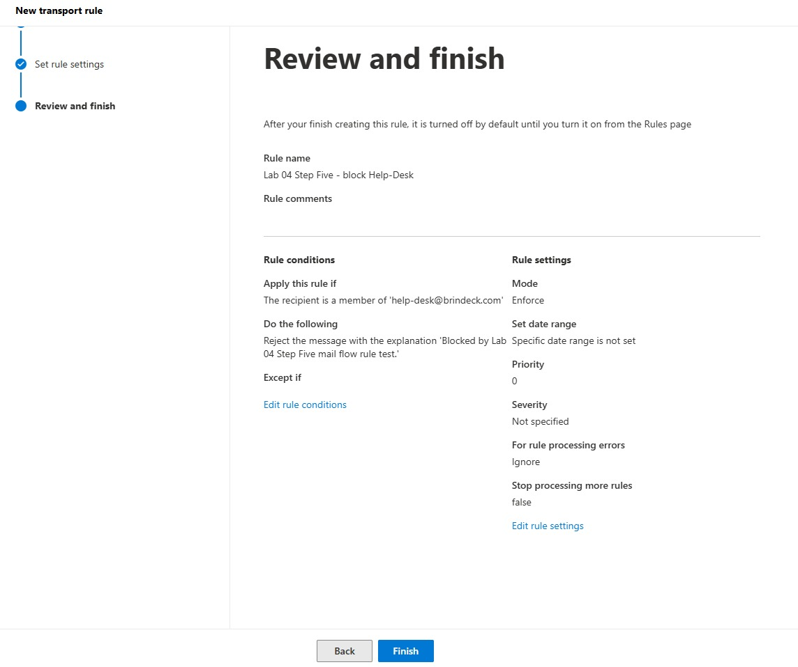
</p>

<p align="center">
  <em>New transport rule, Review and finish: Lab 04 Step Five - block Help-Desk.</em>
</p>

A new rule is created disabled. It was enabled at 11:59 AM Eastern.

**What Help-Desk's own page says about it: nothing.**

<p align="center">
  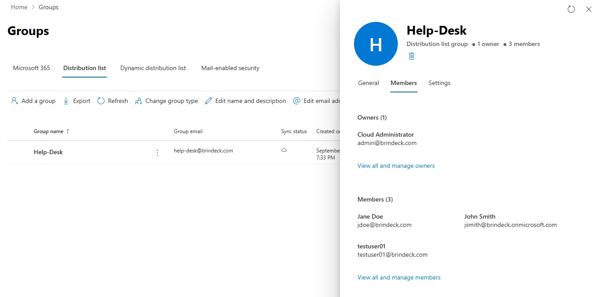
</p>

<p align="center">
  <em>Groups, Help-Desk, Members, with the rule enabled: one owner, three members, and no reference to any rule.</em>
</p>

Neither the Members, General, nor Settings tab mentions the rule. The rule's page states exactly what it does and to what; the object it acts on states nothing.

**The message the rule stops.** testuser01 sent `Lab 04 Step Five - rule test` to `help-desk@brindeck.com` at 12:15 PM Eastern, sixteen minutes after enabling, and it was already blocked (Microsoft documents up to 30 minutes for a rule to apply).

<p align="center">
  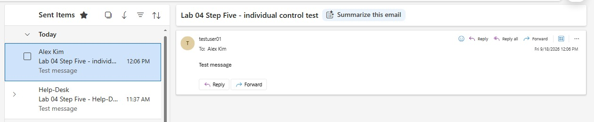
</p>

<p align="center">
  <em>testuser01's non-delivery report: "Custom mail flow rules at the recipients' domains have blocked your message," the rule's explanation text, and the three members as the undelivered recipients.</em>
</p>

The NDR lists the group's three members, not the group address. Exchange expanded the list first and the rule matched each member, so it was evaluated against the expanded recipients.

**Tracing it.** In the Exchange admin center, the summary row reads `Expanded`, identical to the working baseline, and the detail view's top-line status also reads as success. Only the Message events list beneath it shows the block: `Expand DL`, then `Drop`, then `Transport rule`, with the rule name truncated to `Lab 0...`. In PowerShell, the members read `Failed`:

```powershell
Get-MessageTraceV2 -RecipientAddress "jdoe@brindeck.com","jsmith@brindeck.onmicrosoft.com","testuser01@brindeck.com" -Subject "rule test" -SubjectFilterType "Contains" -StartDate (Get-Date "2026-09-18 12:10") -EndDate (Get-Date "2026-09-18 12:30")
```

```text
Received               Sender Address                                                          Recipient Address              Subject                                    Status
--------               --------------                                                          -----------------              -------                                    ------
9/18/2026 4:15:03 PM   MicrosoftExchange329e71ec88ae4615bbc36ab6ce41109e@brindeck.com            testuser01@brindeck.com        Undeliverable: Lab 04 Step Five - rule test Delivered
9/18/2026 4:15:02 PM   testuser01@brindeck.com                                                   jdoe@brindeck.com              Lab 04 Step Five - rule test               Failed
9/18/2026 4:15:02 PM   testuser01@brindeck.com                                                   jsmith@brindeck.onmicrosoft.com Lab 04 Step Five - rule test               Failed
9/18/2026 4:15:02 PM   testuser01@brindeck.com                                                   testuser01@brindeck.com        Lab 04 Step Five - rule test               Failed
```

The first row is the NDR back to testuser01. `Failed` is a status, not a reason, and names no rule. `Get-MessageTraceDetailV2`, using the trace ID from the admin center panel, names it in full:

```powershell
Get-MessageTraceDetailV2 -MessageTraceId ca9bd7dd-77c2-4f52-c6d5-08df159ffe95 -RecipientAddress jdoe@brindeck.com
```

```text
Date                  Event           Detail
----                  -----           ------
9/18/2026 4:15:03 PM  Fail            Reason: [{LED=550 5.7.1 TRANSPORT.RULES.RejectMessage; the message was rejected by organization policy};{MSG=};{FQDN=};{IP=};{LRT=}]
9/18/2026 4:15:03 PM  Fail            Reason: [{LED=550 5.7.1 TRANSPORT.RULES.RejectMessage; the message was rejected by organization policy};{MSG=};{FQDN=};{IP=};{LRT=}]
9/18/2026 4:15:03 PM  Transport rule  Transport rule: 'Lab 04 Step Five - block Help-Desk', ID: ('3489BE3B-483A-4340-9FA5-D423E580E1A0'), DLP policy: '', ID: (00000000-0000-0000-0000-0...
```

The rejection was logged twice at one timestamp, which is recorded rather than explained. The admin center calls the event `Drop` and PowerShell calls it `Fail`.

**The individual control.** testuser01 sent `Lab 04 Step Five - individual control test` to Alex Kim, not a `Help-Desk` member, at 12:06 PM Eastern:

```powershell
Get-MessageTraceV2 -RecipientAddress "akim@brindeck.onmicrosoft.com" -StartDate (Get-Date "2026-09-18 12:00") -EndDate (Get-Date "2026-09-18 12:15")
```

```text
Received              Sender Address          Recipient Address             Subject                                    Status
--------              --------------          -----------------             -------                                    ------
9/18/2026 4:06:05 PM  testuser01@brindeck.com akim@brindeck.onmicrosoft.com  Lab 04 Step Five - individual control test Delivered
```

So the three traces read: the baseline `Expanded` then `Delivered` per member, the control `Delivered`, and the blocked message `Expanded` at the group then `Failed` per member, with the rule named only one level below the summary.

**The rule removed.** The rule was deleted at 12:40 PM Eastern. A confirmation message to `help-desk@brindeck.com` at 12:42 PM, subject `Lab 04 Step Five - post-removal confirmation`, arrived without an NDR:

```powershell
Get-MessageTraceV2 -RecipientAddress "help-desk@brindeck.com" -StartDate (Get-Date "2026-09-18 12:40") -EndDate (Get-Date)
```

```text
Received              Sender Address          Recipient Address      Subject                                       Status
--------              --------------          -----------------      -------                                       ------
9/18/2026 4:42:02 PM  testuser01@brindeck.com help-desk@brindeck.com Lab 04 Step Five - post-removal confirmation Expanded
```

```powershell
Get-MessageTraceV2 -RecipientAddress "jdoe@brindeck.com","jsmith@brindeck.onmicrosoft.com","testuser01@brindeck.com" -Subject "post-removal" -SubjectFilterType "Contains" -StartDate (Get-Date "2026-09-18 12:40") -EndDate (Get-Date)
```

```text
Received              Sender Address          Recipient Address       Subject                                       Status
--------              --------------          -----------------       -------                                       ------
9/18/2026 4:42:02 PM  testuser01@brindeck.com jdoe@brindeck.com       Lab 04 Step Five - post-removal confirmation Delivered
9/18/2026 4:42:02 PM  testuser01@brindeck.com testuser01@brindeck.com Lab 04 Step Five - post-removal confirmation Delivered
```

Two of the three member rows. John Smith's row appeared as `Delivered` when queried alone, and the same query rerun hours later returned all three, so every member received it and the trace had not caught up (Troubleshooting and Adjustments). The operational point: a trace run minutes after a send can return a partial set that looks exactly like non-delivery, with no error. Ask again before concluding anything from a missing row.

A whole-step search in the admin center for `help-desk@brindeck.com` shows all three messages, including the blocked one, as `Expanded`. Read alone, it would have missed the block entirely.

The rule was out of effect within two minutes of deletion. That does not show rules and permissions behave differently: Step Four's Send As revocation was only bounded, never measured. Step Nine confirms the rule is gone and mail to `Help-Desk` still flows.

### Step Six: Observed the Business Basic lapse

The Business Basic (no Teams) trial was read before, on, and after its stated 2026-09-22 expiration, against the prediction committed in Step One. Step One had found its Recurring billing field reading 9/23, so both dates were covered. The four questions were whether the subscription entered an Expired stage, whether `Finance`'s group assignment survived, whether Adam Ramzi's mailbox survived losing his only license, and whether Lab 03's target-versus-seat reconciliation still held.

**Before the lapse.** The product page was read shortly before 6:40 PM Eastern (22:40 UTC) on 2026-09-21 and again at 10:09 AM Eastern (14:09 UTC) on 2026-09-22.

<p align="center">
  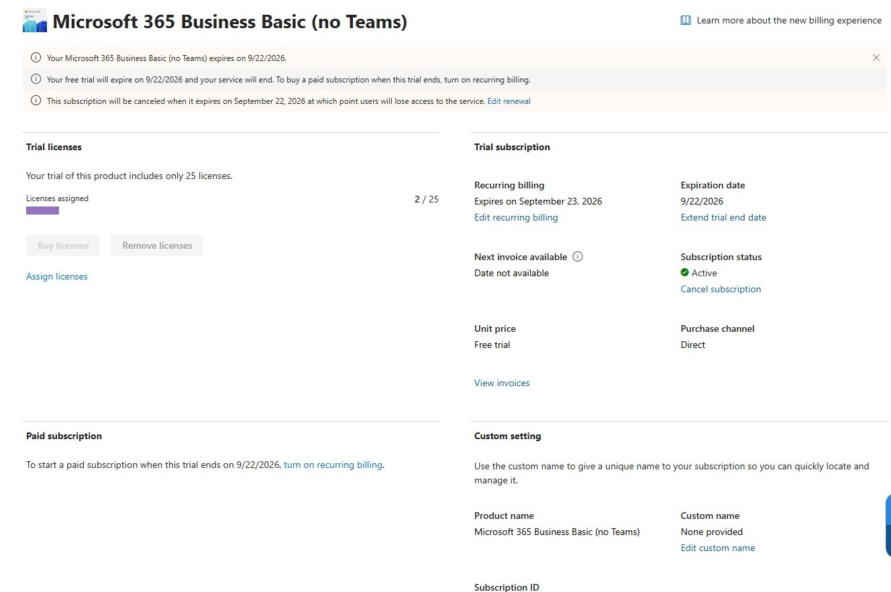
</p>

<p align="center">
  <em>Business Basic product page, 2026-09-21: Active, Expiration date 9/22/2026, Recurring billing "Expires on September 23, 2026," 2 of 25 assigned, Purchase channel Direct.</em>
</p>

<p align="center">
  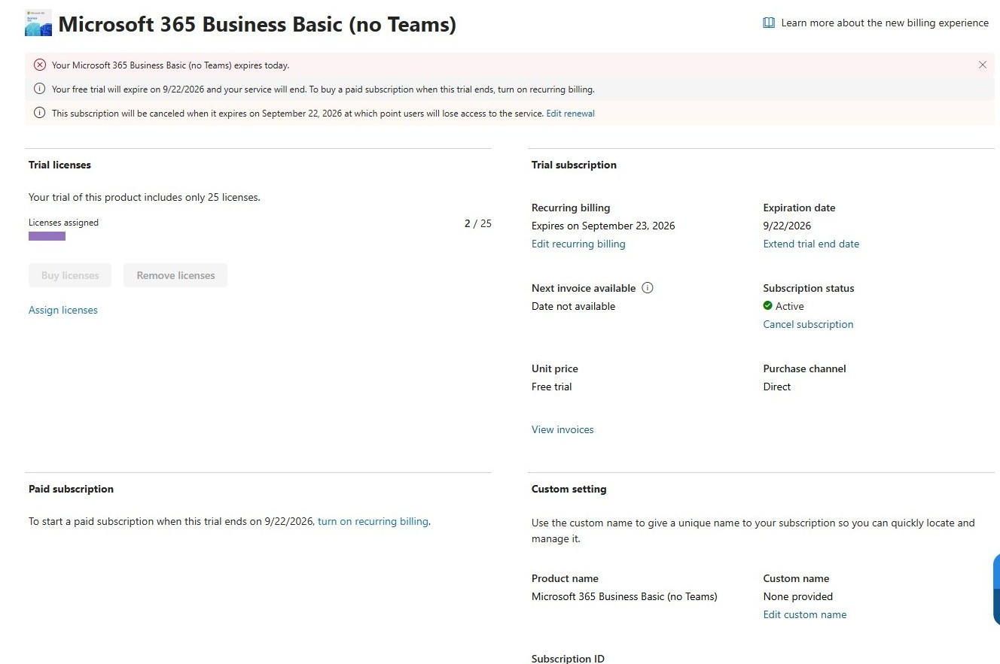
</p>

<p align="center">
  <em>The same page at 10:09 AM Eastern on 2026-09-22: unchanged except the top banner, now "expires today."</em>
</p>

Everything matched Step One's reading except Purchase channel, which read Direct where Step One read Commercial direct. Business Premium's page read Direct too, which points to a portal-wide relabel rather than anything about the lapse.

The SKU's unit breakdown was read at 6:40:19 PM Eastern (22:40:19 UTC) on 2026-09-21:

```powershell
Get-MgSubscribedSku | Where-Object { $_.SkuPartNumber -like '*Business_Basic*' } |
    Select-Object SkuPartNumber, CapabilityStatus, ConsumedUnits,
        @{N='Enabled';E={$_.PrepaidUnits.Enabled}},
        @{N='Warning';E={$_.PrepaidUnits.Warning}},
        @{N='Suspended';E={$_.PrepaidUnits.Suspended}},
        @{N='LockedOut';E={$_.PrepaidUnits.LockedOut}} | Format-List
```

```text
SkuPartNumber    : Microsoft_365_Business_Basic_(no Teams)
CapabilityStatus : Enabled
ConsumedUnits    : 1
Enabled          : 25
Warning          : 0
Suspended        : 0
LockedOut        : 0
```

The same command returned identical output at 12:24 PM Eastern on 2026-09-22 and at 8:04:46 PM Eastern on 2026-09-22 (00:04:46 UTC on 2026-09-23).

At 12:24 PM Eastern on 2026-09-22, Adam Ramzi's license detail still returned Business Basic, and his mailbox was still a `UserMailbox` with `WhenSoftDeleted` blank:

```powershell
Get-EXOMailboxStatistics -Identity Adam@brindeck.onmicrosoft.com | Format-List DisplayName,ItemCount,TotalItemSize,TotalDeletedItemSize,LastLogonTime
```

```text
DisplayName          : Adam Ramzi
ItemCount            : 36
TotalItemSize        : 7.536 MB (7,901,842 bytes)
TotalDeletedItemSize : 0 B (0 bytes)
```

Thirty-six items, as in Step Two. (`LastLogonTime` did not print; see Troubleshooting and Adjustments.)

`Finance`'s assignment was checked on both surfaces the same day:

<p align="center">
  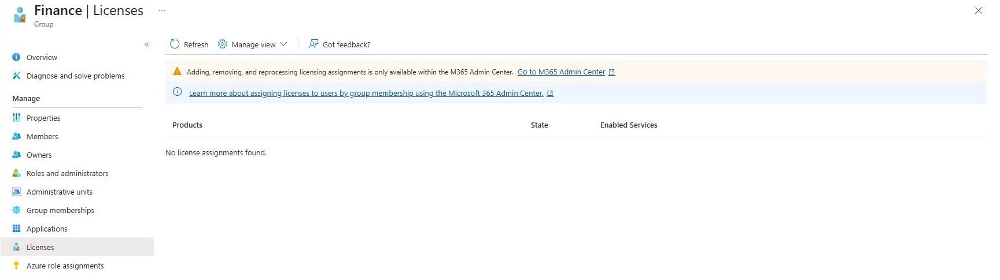
</p>

<p align="center">
  <em>Entra admin center, Finance, Licenses, 2026-09-22: "No license assignments found."</em>
</p>

<p align="center">
  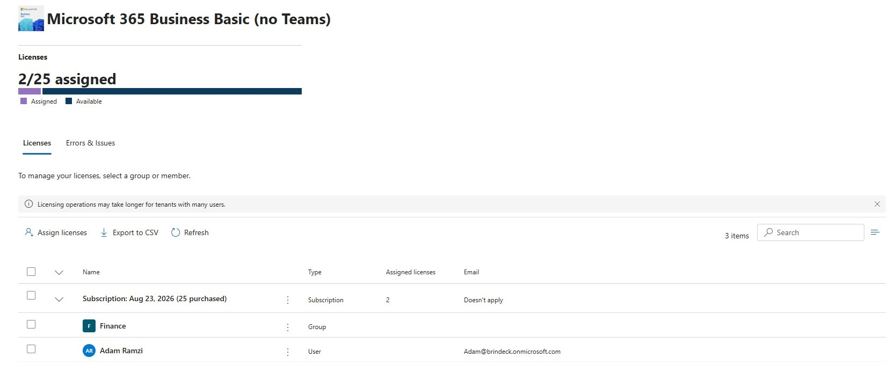
</p>

<p align="center">
  <em>Microsoft 365 admin center, Business Basic, Licenses tab, 2026-09-22: 2/25 assigned, with Finance (Group) and Adam Ramzi (User) listed.</em>
</p>

The Entra blade shows nothing, as Lab 03's Part A found, while the Microsoft 365 admin center's Licenses tab lists `Finance` as a target. Against `ConsumedUnits` 1, that is two targets and one seat, since `Finance` is empty: the same gap Lab 03's Part C found on Business Premium.

At 8:03 PM Eastern on 2026-09-22 (00:03 UTC on 2026-09-23), the Your products list still showed Business Basic Active:

<p align="center">
  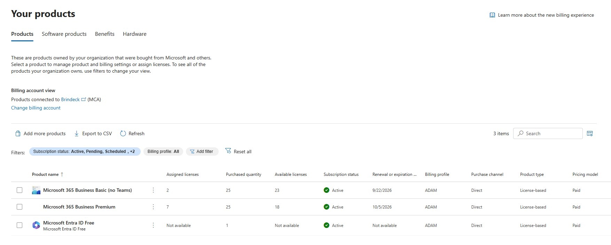
</p>

<p align="center">
  <em>Your products, 8:03 PM Eastern on 2026-09-22: "Products connected to Brindeck (MCA)," Business Basic Active with 23 available, all three products Purchase channel Direct.</em>
</p>

The billing account view reads "Products connected to Brindeck (MCA)." That confirms the premise of the prediction, that this is a Microsoft Customer Agreement purchase, which Step One could only infer. It does not confirm the prediction itself.

At 8:08 PM Eastern (00:08 UTC on 2026-09-23) the product page was unchanged from that morning, still reading "expires today" after UTC midnight:

<p align="center">
  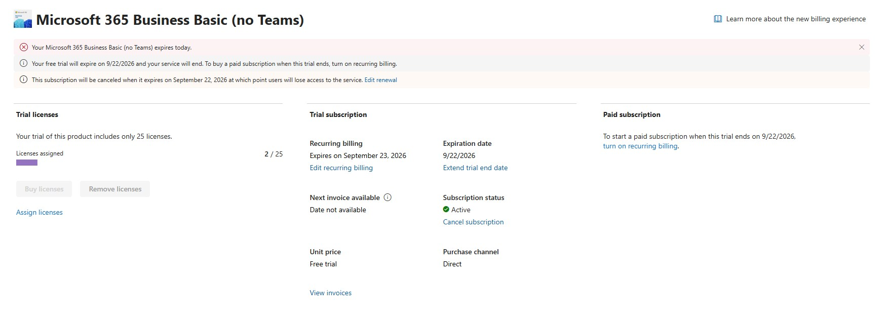
</p>

<p align="center">
  <em>Business Basic product page, 8:08 PM Eastern on 2026-09-22: still Active, still "expires today."</em>
</p>

**After the lapse.** At 1:29 PM Eastern (17:29 UTC) on 2026-09-23, the subscription read Disabled:

<p align="center">
  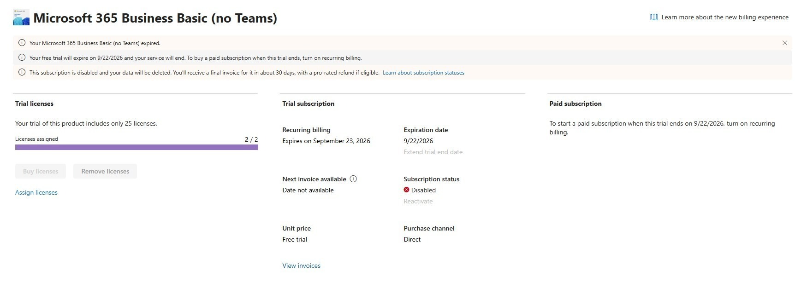
</p>

<p align="center">
  <em>Business Basic product page, 1:29 PM Eastern on 2026-09-23: Disabled, Reactivate and Extend trial end date unavailable, and "This subscription is disabled and your data will be deleted."</em>
</p>

Reactivate and Extend trial end date were unavailable, and the cancellation banner had changed to "This subscription is disabled and your data will be deleted. You'll receive a final invoice for it in about 30 days, with a pro-rated refund if eligible." Nothing was read between 00:08 UTC and 17:29 UTC, so no reading showed an Expired status at any point. The Your products list agreed, and its status filter includes Expired and Disabled by default, so the evening list had not been hiding either state:

<p align="center">
  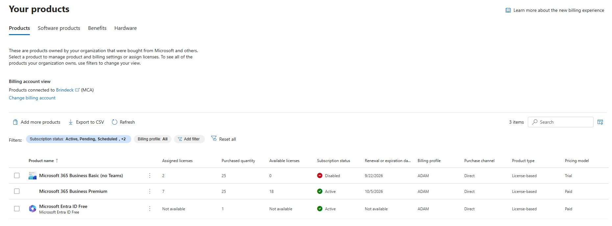
</p>

<p align="center">
  <em>Your products, 2026-09-23: Business Basic Disabled, 0 available.</em>
</p>

<p align="center">
  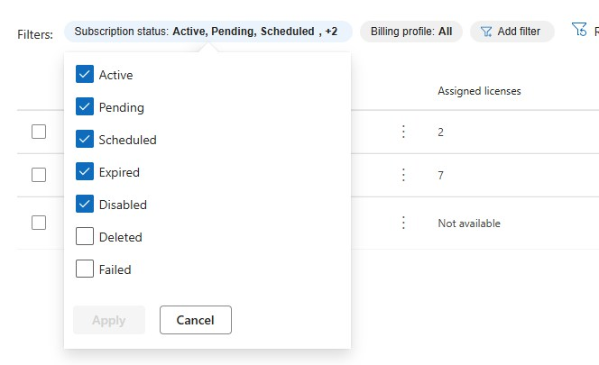
</p>

<p align="center">
  <em>The list's Subscription status filter: Active, Pending, Scheduled, Expired, and Disabled selected by default.</em>
</p>

The same `Get-MgSubscribedSku` command at 1:34 PM Eastern (17:34 UTC):

```text
SkuPartNumber    : Microsoft_365_Business_Basic_(no Teams)
CapabilityStatus : Suspended
ConsumedUnits    : 1
Enabled          : 0
Warning          : 0
Suspended        : 25
LockedOut        : 0
```

All 25 units moved from `Enabled` to `Suspended`, and `Warning` stayed at 0. Microsoft Graph defines warning units as an expired subscription inside its grace period and suspended units as a canceled subscription that can still be reactivated before deletion. `ConsumedUnits` still read 1, and Adam Ramzi's license detail still returned Business Basic, an assignment pointing at a SKU with no enabled units.

```powershell
Get-EXOMailbox -Identity Adam@brindeck.onmicrosoft.com -Properties RecipientTypeDetails,ProhibitSendReceiveQuota,WhenSoftDeleted | Format-List DisplayName,RecipientTypeDetails,ProhibitSendReceiveQuota,WhenSoftDeleted
Get-EXOMailboxStatistics -Identity Adam@brindeck.onmicrosoft.com -Properties LastLogonTime | Format-List DisplayName,ItemCount,TotalItemSize,TotalDeletedItemSize,LastLogonTime
```

```text
DisplayName              : Adam Ramzi
RecipientTypeDetails     : UserMailbox
ProhibitSendReceiveQuota : 100 GB (107,374,182,400 bytes)
WhenSoftDeleted          :

DisplayName          : Adam Ramzi
ItemCount            : 37
TotalItemSize        : 7.663 MB (8,035,521 bytes)
TotalDeletedItemSize : 0 B (0 bytes)
LastLogonTime        : 8/23/2026 7:13:59 PM
```

Still a `UserMailbox`, not soft-deleted, with one new item. `LastLogonTime`, retrieved for the first time, shows the mailbox had been signed in to before Step Two, so Step Two's blank value was never evidence that nobody had. The new item was Microsoft's expiry notice:

```powershell
Get-MessageTraceV2 -RecipientAddress Adam@brindeck.onmicrosoft.com -StartDate (Get-Date).AddDays(-2) -EndDate (Get-Date) | Format-List Received,SenderAddress,Subject,Status
```

```text
Received      : 9/23/2026 3:02:47 AM
SenderAddress : microsoft-noreply@microsoft.com
Subject       : Your Microsoft 365 Business Basic (no Teams) subscription has expired
Status        : Delivered
```

`Received` is UTC, so the notice arrived at 11:02:47 PM Eastern on 2026-09-22, about three hours after the last Active reading.

<p align="center">
  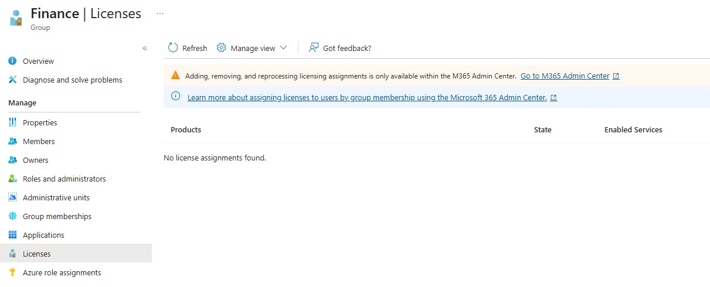
</p>

<p align="center">
  <em>Entra admin center, Finance, Licenses, 2026-09-23: still "No license assignments found."</em>
</p>

<p align="center">
  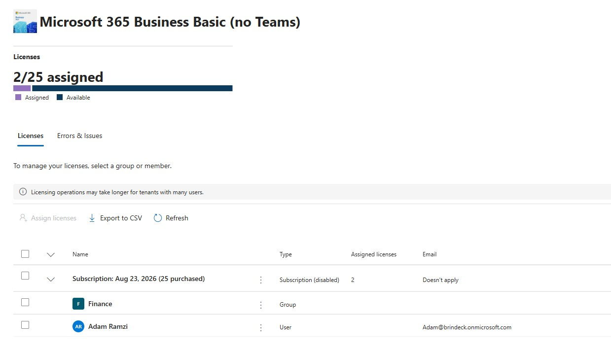
</p>

<p align="center">
  <em>Business Basic Licenses tab, 2026-09-23: the subscription row typed "Subscription (disabled)," Finance and Adam Ramzi still listed, Assign licenses unavailable.</em>
</p>

Both assignment records outlived the subscription's enabled units, and two targets against one consumed seat still reconcile as before. Assign licenses was unavailable, which matches Microsoft's description of the Disabled status: admins can reach the admin center but cannot assign licenses.

**Post-lapse delivery probe.** Sent last, since it changes the mailbox: Cloud Administrator to `Adam@brindeck.onmicrosoft.com` at 1:42 PM Eastern (17:42 UTC), subject "Lab 04 Step Six - post-lapse delivery probe." No NDR came back:

```powershell
Get-MessageTraceV2 -RecipientAddress Adam@brindeck.onmicrosoft.com -Subject "Step Six - post-lapse delivery probe" -SubjectFilterType Contains -StartDate (Get-Date).AddHours(-2) -EndDate (Get-Date) | Format-List Received,SenderAddress,RecipientAddress,Subject,Status
```

```text
Received         : 9/23/2026 5:42:36 PM
SenderAddress    : admin@brindeck.com
RecipientAddress : Adam@brindeck.onmicrosoft.com
Subject          : Lab 04 Step Six - post-lapse delivery probe
Status           : Delivered
```

`ItemCount` rose to 38. Mail was delivered to a mailbox whose only license points at a fully suspended SKU.

**Result.** Nothing changed through 00:08 UTC on 2026-09-23 except the banner. By 17:29 UTC the subscription was Disabled and the SKU `Suspended`, with no Expired status or `Warning` units observed. The assignments, Adam Ramzi's license detail, and his mailbox did not change, and mail kept arriving. That supports the prediction at the subscription and SKU level. No user sign-in was tested, so whether access actually ended was not observed, and mail delivery continuing is not the same as access.

- **The date is 9/22, not 9/23: not tested.** The last Active reading was 00:08 UTC on 9/23 (8:08 PM Eastern on 9/22), the expiry notice arrived at 03:02 UTC on 9/23 (11:02 PM Eastern on 9/22), and the first Disabled reading was 17:29 UTC on 9/23. The change falls on 9/22 in Eastern time and 9/23 in UTC, so no reading separates the two dates.
- **The mailbox survives into Exchange's 30-day retention: not tested.** The lapse never removed the license assignment, so the mailbox never entered retention.
- **The trial data-deletion clause does not apply: held so far.** Nothing had been deleted by 17:47 UTC on 9/23, but the page now says the data "will be deleted," with no date.

**The branch.** The tenant put the lab on the third of Design Decisions' branches, neither outcome cleanly. The Expired-stage branch is ruled out: the subscription went straight to Disabled and suspended, with admin license assignment locked by the same reading set. The access-removed branch is not established, since no sign-in was tested and mail delivery continued. The third branch keeps the conservative assumption, and Business Premium sits on the same MCA billing account, so 2026-10-05 is treated as a hard cliff: Steps Seven and Eight are completed before that date, since this step could not establish which calendar date or time zone the commerce system acts on. Step Nine records the Business Premium lapse on both 2026-10-05 and 2026-10-06. The mailbox question is settled at the start of Step Eight by rereading Adam Ramzi's license detail and `Get-EXOMailbox`.

### Step Seven: Built an archive mailbox and a litigation hold on the entitlement the tenant supported

Step One's enumeration found `EXCHANGE_S_ARCHIVE_ADDON` on the Business Premium SKU with provisioning status `Success`. Of the two Microsoft documents Design Decisions set against each other, the tenant supported the Exchange Online Archiving service description, which names Business Premium among the plans that already include archiving, and not the litigation hold article, which requires Exchange Online Plan 2 or a separate Exchange Online Archiving license. The step built on that entitlement. The mailbox was `testuser01@brindeck.com`, which holds Business Premium and was signed in to as the user in Outlook on the web. All work ran from WIN11-CLIENT01 in Exchange Online PowerShell, on 2026-09-23 and 2026-09-24.

**Baseline.** Read at 2:38 PM Eastern (18:38 UTC) on 2026-09-23:

```powershell
Get-EXOMailbox -Identity testuser01@brindeck.com -Properties ArchiveStatus,ArchiveGuid,ArchiveQuota,ArchiveWarningQuota,AutoExpandingArchiveEnabled,LitigationHoldEnabled,LitigationHoldDate,LitigationHoldOwner,LitigationHoldDuration,RecoverableItemsQuota,RecoverableItemsWarningQuota,ProhibitSendReceiveQuota,RetentionPolicy,InPlaceHolds,DelayHoldApplied,SingleItemRecoveryEnabled | Format-List DisplayName,ArchiveStatus,ArchiveGuid,ArchiveQuota,ArchiveWarningQuota,AutoExpandingArchiveEnabled,LitigationHoldEnabled,LitigationHoldDate,LitigationHoldOwner,LitigationHoldDuration,RecoverableItemsQuota,RecoverableItemsWarningQuota,ProhibitSendReceiveQuota,RetentionPolicy,InPlaceHolds,DelayHoldApplied,SingleItemRecoveryEnabled
```

```text
ArchiveStatus                : None
ArchiveQuota                 : 100 GB (107,374,182,400 bytes)
ArchiveWarningQuota          : 90 GB (96,636,764,160 bytes)
LitigationHoldEnabled        : False
RecoverableItemsQuota        : 30 GB (32,212,254,720 bytes)
RecoverableItemsWarningQuota : 20 GB (21,474,836,480 bytes)
RetentionPolicy              : Default MRM Policy
DelayHoldApplied             : False
SingleItemRecoveryEnabled    : True
[remaining properties omitted]
```

`Get-Mailbox` read `DelayReleaseHoldApplied` as False as well. The mailbox held 133 items (1.703 MB), and `Get-EXOMailboxFolderStatistics -FolderScope RecoverableItems` showed every Recoverable Items subfolder empty except Calendar Logging, at 90 items and 509.4 KB, the whole of `TotalDeletedItemSize`. The Recoverable Items quotas were the 30 GB and 20 GB defaults Microsoft documents, and the archive quotas were already set on a mailbox with no archive.

<p align="center">
  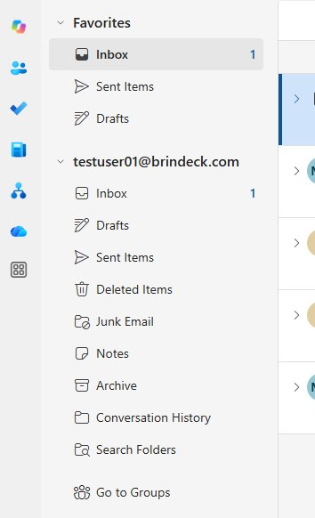
</p>

<p align="center">
  <em>testuser01's Outlook on the web folder pane before the archive was enabled.</em>
</p>

The Archive folder in that list is the primary mailbox's default folder, not an archive mailbox.

**The archive.** Enabled from PowerShell at 2:50:53 PM Eastern (18:50:53 UTC):

```powershell
Enable-Mailbox -Identity testuser01@brindeck.com -Archive
```

The same `Get-EXOMailbox` command, restricted to the archive and quota properties, at 2:55 PM:

```text
ArchiveStatus                : Active
ArchiveGuid                  : 1d64c872-[masked]
ArchiveName                  : {In-Place Archive -testuser01}
[quotas unchanged and omitted]
```

The archive's 100 GB quota equals the primary mailbox's `ProhibitSendReceiveQuota`, and its 90 GB warning quota sits below the primary's 98 GB `IssueWarningQuota` recorded in Step Two. Auto-expanding archiving was left off.

`Get-EXOMailboxStatistics -Archive` returned nothing at 2:55 PM and again at 2:59 PM, with no error. `Get-MailboxStatistics -Archive` at 2:59 PM gave the reason: "The user hasn't logged on to mailbox ... so there is no data to return."

The archive did not appear in Outlook on the web at 2:53 PM or 3:00 PM. It was present at 12:07 PM Eastern on 2026-09-24, the next time the folder pane was read, and after it was opened both cmdlets returned the same object at 12:09 PM:

```text
DisplayName          : In-Place Archive -testuser01
ItemCount            : 3
TotalItemSize        : 6.865 KB (7,030 bytes)
TotalDeletedItemSize : 0 B (0 bytes)
```

<p align="center">
  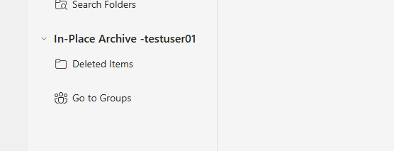
</p>

<p align="center">
  <em>The In-Place Archive -testuser01 node in Outlook on the web, expanded to its Deleted Items folder.</em>
</p>

Three items totalling 7,030 bytes were present in an archive nothing had been moved to.

**The litigation hold.** Placed at 3:02:13 PM Eastern (19:02:13 UTC) on 2026-09-23, with an infinite duration and a hold note:

```powershell
Set-Mailbox -Identity testuser01@brindeck.com -LitigationHoldEnabled $true -LitigationHoldDuration Unlimited -RetentionComment "Lab 04 Step Seven: mailbox placed on litigation hold for demonstration."
```

```text
WARNING: The hold setting may take up to 240 minutes to take effect.
```

The cmdlet's figure matches the banner Microsoft's litigation hold article describes for the Microsoft 365 admin center, not the 60 minutes the Exchange Server version of that article gives. The hold properties, read within the same minute:

```powershell
Get-EXOMailbox -Identity testuser01@brindeck.com -Properties LitigationHoldEnabled,LitigationHoldDate,LitigationHoldOwner,LitigationHoldDuration,RetentionComment,RecoverableItemsQuota,RecoverableItemsWarningQuota,InPlaceHolds | Format-List DisplayName,LitigationHoldEnabled,LitigationHoldDate,LitigationHoldOwner,LitigationHoldDuration,RetentionComment,RecoverableItemsQuota,RecoverableItemsWarningQuota,InPlaceHolds
```

```text
LitigationHoldEnabled        : True
LitigationHoldDate           : 9/23/2026 3:02:16 PM
LitigationHoldOwner          : admin@brindeck.com
LitigationHoldDuration       : Unlimited
RetentionComment             : Lab 04 Step Seven: mailbox placed on litigation hold for demonstration.
RecoverableItemsQuota        : 100 GB (107,374,182,400 bytes)
RecoverableItemsWarningQuota : 90 GB (96,636,764,160 bytes)
InPlaceHolds                 : {}
```

`LitigationHoldOwner` was not supplied and defaulted to the account that set the hold. The Recoverable Items quotas moved from 30 GB and 20 GB to 100 GB and 90 GB immediately. Microsoft gives three figures for this quota: 100 GB on hold, 105 GB (warning 95 GB) on hold with an archive enabled, in the Recoverable Items folder article, and 110 GB with auto-expanding archiving, in the litigation hold article. The same reading at 12:06 PM Eastern on 2026-09-24, 21 hours after the hold and well past the 240-minute window, still reported 100 GB and 90 GB with the archive active. The tenant reported the on-hold figure, not the archive figure, though that last on-hold reading came three minutes before the archive's first logon at 12:09 PM, and no on-hold reading was taken after it. Auto-expanding archiving was off, so the 110 GB figure was not tested.

The deletion demonstration was not run. `SingleItemRecoveryEnabled` was True with the default 14-day deleted item retention, so an item purged from Recoverable Items stays in `Purges` for 14 days with or without a hold, and a deletion test inside this lab's window could not have shown the hold rather than single item recovery. The one behavior only a hold produces within that window, copy-on-write saving the original of an edited non-message item such as a calendar event to `Versions`, was not tested.

**A personal retention tag.** The mailbox's `Default MRM Policy` was read for its tags:

```powershell
(Get-RetentionPolicy "Default MRM Policy").RetentionPolicyTagLinks | ForEach-Object { Get-RetentionPolicyTag $_ } | Format-Table Name,Type,RetentionAction,AgeLimitForRetention,RetentionEnabled -AutoSize
```

```text
Name                                      Type             RetentionAction        AgeLimitForRetention RetentionEnabled
----                                      ----             ---------------        -------------------- ----------------
Personal 5 year move to archive           Personal         MoveToArchive          1825.00:00:00                    True
Personal never move to archive            Personal         MoveToArchive                                          False
Personal 1 year move to archive           Personal         MoveToArchive          365.00:00:00                     True
Default 2 year move to archive            All              MoveToArchive          730.00:00:00                     True
Recoverable Items 14 days move to archive RecoverableItems MoveToArchive          14.00:00:00                      True
[seven delete tags and the Junk Email tag omitted]
```

Two of those tags act only on a mailbox with an archive: a mailbox-wide move to archive at two years, and a move of Recoverable Items content to the archive at 14 days.

A folder named `Lab 04 Retention` was created in the primary mailbox at about 12:10 PM Eastern on 2026-09-24 so that `Personal 1 year move to archive` could be applied to it as the user. Microsoft's MRM troubleshooting article directs users to right-click the folder and select Assign policy. The tenant's Outlook on the web offered no such entry:

<p align="center">
  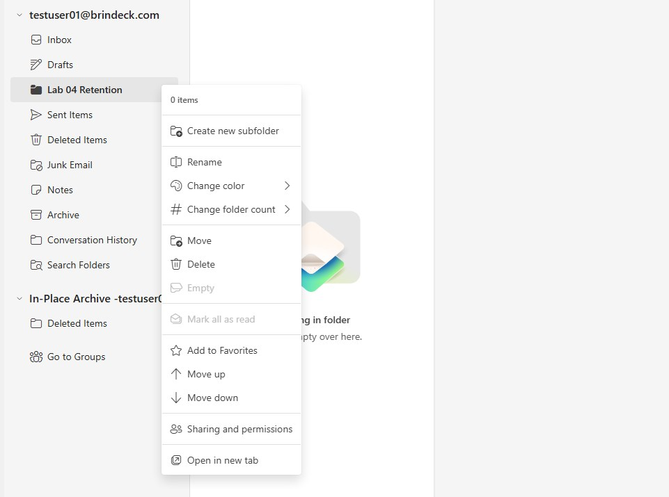
</p>

<p align="center">
  <em>The Lab 04 Retention folder's context menu in Outlook on the web, with no Assign policy entry.</em>
</p>

The ribbon's Assign policy button was unavailable with the empty folder selected, and no tag was applied. `Get-MailboxFolderStatistics` at 12:16 PM reported `DeletePolicy` and `ArchivePolicy` blank on both the new folder and Inbox, so those fields show a tag applied to the folder itself and do not reflect the mailbox's default tag. The folder was deleted at 12:18 PM, which moved it to `/Deleted Items/Lab 04 Retention`, and permanently deleted from there at 12:20 PM.

**Removing the hold.** Removed at 12:18:19 PM Eastern (16:18:19 UTC) on 2026-09-24, after 21 hours and 16 minutes:

```powershell
Set-Mailbox -Identity testuser01@brindeck.com -LitigationHoldEnabled $false
```

The same 240-minute warning printed. The same hold-properties command, immediately after, read `LitigationHoldEnabled` False with `LitigationHoldDate`, `LitigationHoldOwner`, and `RetentionComment` all blank, so removal cleared the hold note along with the hold. The Recoverable Items quotas still read 100 GB and 90 GB, not the 30 GB and 20 GB defaults. `Get-Mailbox` read `DelayHoldApplied` and `DelayReleaseHoldApplied` both False.

**The delay hold.** Microsoft states that the Managed Folder Assistant sets `DelayHoldApplied` to True the next time it processes a mailbox whose hold was removed, and that the mailbox is then treated as on hold for 30 more days. A processing run was requested with `Start-ManagedFolderAssistant -Identity testuser01@brindeck.com` at 12:20:28 PM Eastern (16:20:28 UTC).

Read at 12:40 PM and again at 1:00:17 PM Eastern (17:00:17 UTC), 42 minutes after removal, with the same result both times:

```powershell
Get-Mailbox -Identity testuser01@brindeck.com | Format-List LitigationHoldEnabled,DelayHoldApplied,DelayReleaseHoldApplied,RecoverableItemsQuota,RecoverableItemsWarningQuota,InPlaceHolds
```

```text
LitigationHoldEnabled        : False
DelayHoldApplied             : False
DelayReleaseHoldApplied      : False
RecoverableItemsQuota        : 100 GB (107,374,182,400 bytes)
RecoverableItemsWarningQuota : 90 GB (96,636,764,160 bytes)
InPlaceHolds                 : {}
```

Neither delay hold property had been set, and the quotas had not returned to their defaults, by the end of the step. Both are readings 42 minutes into the 240-minute window the removal warning gave, not evidence that no delay hold will be applied, and Step Nine rereads them. `-RemoveDelayHoldApplied` was not run.

**The archive's disposition.** The archive was left enabled. It holds three items the lab did not put there, the Business Premium lapse on 2026-10-05 decides its future in any case, and disabling it would start a separate clock on content that had not been examined. Step Nine reconciles it.

### Step Eight: Converted a departing user's mailbox to shared and reclaimed the license

**Step Six's open mailbox question.** Adam Ramzi's license and mailbox were reread at 3:55 PM Eastern (19:55 UTC) on 2026-09-26, four days after the Business Basic lapse:

```powershell
Get-MgUserLicenseDetail -UserId Adam@brindeck.onmicrosoft.com | Select-Object SkuPartNumber | Format-List
Get-EXOMailbox -Identity Adam@brindeck.onmicrosoft.com -Properties RecipientTypeDetails,ProhibitSendReceiveQuota,WhenSoftDeleted | Format-List DisplayName,RecipientTypeDetails,ProhibitSendReceiveQuota,WhenSoftDeleted
Get-MgSubscribedSku | Where-Object { $_.SkuPartNumber -like '*Business_Basic*' -or $_.SkuPartNumber -eq 'SPB' } | Select-Object SkuPartNumber,CapabilityStatus,ConsumedUnits,@{N='Enabled';E={$_.PrepaidUnits.Enabled}},@{N='Suspended';E={$_.PrepaidUnits.Suspended}} | Format-List
```

```text
SkuPartNumber            : Microsoft_365_Business_Basic_(no Teams)

RecipientTypeDetails     : UserMailbox
ProhibitSendReceiveQuota : 100 GB (107,374,182,400 bytes)
WhenSoftDeleted          :

SkuPartNumber    : Microsoft_365_Business_Basic_(no Teams)
CapabilityStatus : Suspended
ConsumedUnits    : 1
Enabled          : 0
Suspended        : 25
[SPB omitted]
```

The mailbox was still a live `UserMailbox`, not soft-deleted, with the assignment still pointing at a fully suspended SKU. The same reading returned the Business Premium baseline, 6 units consumed of 25 enabled, and the product page read 7 of 25 assigned against 6 consumed:

<p align="center">
  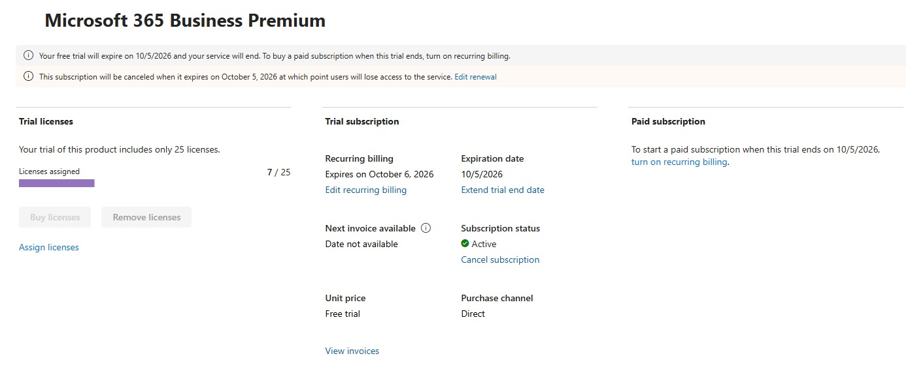
</p>

<p align="center">
  <em>Business Premium product page before the step: 7 / 25 licenses assigned.</em>
</p>

**The departing user.** A cloud-only account, `leaver-demo01@brindeck.com`, display name `Leaver Demo Account (Lab 04 fixture)`, was created unlicensed with `New-MgUser` at 3:58:40 PM Eastern (19:58:40 UTC), with `UsageLocation` set to US and a generated password that was never displayed. It had no license and no Exchange recipient. Business Premium was assigned directly as a separate action at 4:00:21 PM Eastern (20:00:21 UTC), and `Get-EXOMailbox` was polled every 30 seconds until it returned the mailbox at 4:00:59 PM:

```powershell
Set-MgUserLicense -UserId leaver-demo01@brindeck.com -AddLicenses @{ SkuId = $spb } -RemoveLicenses @()
Get-EXOMailbox -Identity leaver-demo01@brindeck.com -Properties RecipientTypeDetails,ProhibitSendReceiveQuota,WhenMailboxCreated | Format-List DisplayName,RecipientTypeDetails,ProhibitSendReceiveQuota,WhenMailboxCreated
```

```text
RecipientTypeDetails     : UserMailbox
ProhibitSendReceiveQuota : 100 GB (107,374,182,400 bytes)
WhenMailboxCreated       : 9/26/2026 4:00:39 PM
```

The mailbox was created 18 seconds after the license was assigned, at the 100 GB quota Step Two found on every licensed mailbox. `ConsumedUnits` read 7 at 4:02 PM, and the product page 8 of 25 at 4:06 PM.

**Content.** Three messages were sent from Cloud Administrator to the account at 4:04:27 PM Eastern with `Send-MgUserMail`, subjects `Lab 04 Step Eight - leaver content 1` to `3`, so that nobody signed in as the user. `Get-MessageTraceV2` showed all three `Delivered` between 20:04:26 and 20:04:29 UTC. The figures the survival check compares against, read at 4:06 PM:

```powershell
Get-EXOMailboxStatistics -Identity leaver-demo01@brindeck.com | Format-List ItemCount,TotalItemSize
Get-EXOMailboxFolderStatistics -Identity leaver-demo01@brindeck.com -FolderScope Inbox | Format-List Name,ItemsInFolder,FolderSize
```

```text
ItemCount     : 6
TotalItemSize : 69.48 KB (71,146 bytes)

Name          : Inbox
ItemsInFolder : 3
FolderSize    : 62.39 KB (63,889 bytes)
```

**The conversion.** Microsoft's conversion article states the ordering constraint: "The user mailbox needs a license assigned to it before you convert it to a shared mailbox. Otherwise, you won't see the option to convert the mailbox." With Business Premium still assigned, the mailbox was converted in the Microsoft 365 admin center at 4:09 PM Eastern (20:09 UTC):

<p align="center">
  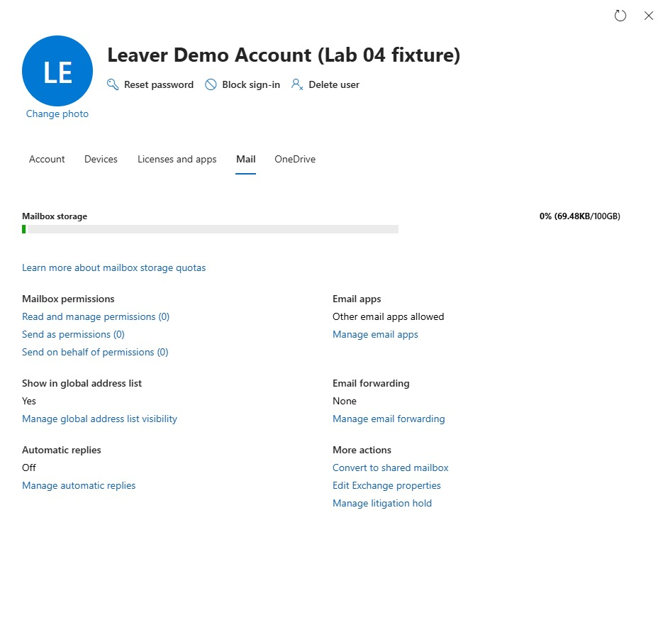
</p>

<p align="center">
  <em>The user's Mail tab, with Convert to shared mailbox under More actions.</em>
</p>

<p align="center">
  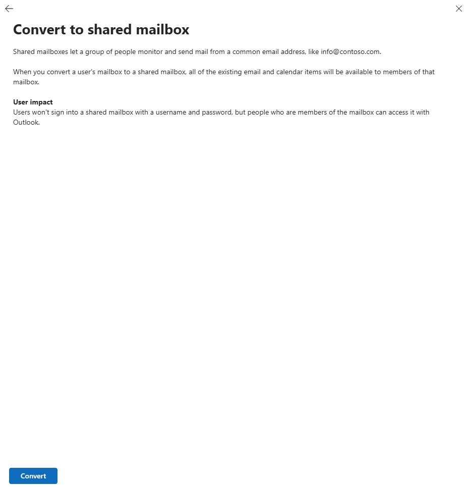
</p>

<p align="center">
  <em>The Convert to shared mailbox pane and its User impact statement.</em>
</p>

<p align="center">
  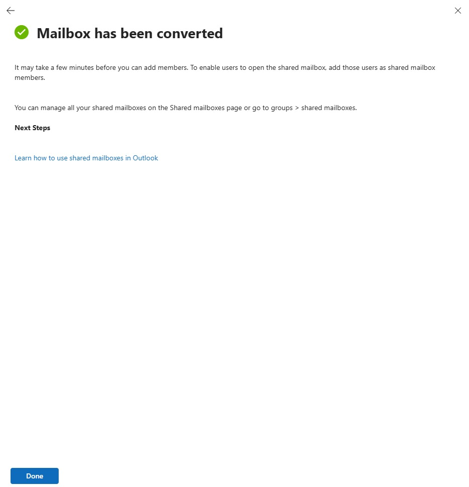
</p>

<p align="center">
  <em>The Mailbox has been converted confirmation.</em>
</p>

The pane states that "Users won't sign into a shared mailbox with a username and password." The conversion article says the opposite: if the password is not reset, "the original username and password will continue to work on the shared mailbox." The same `Get-EXOMailbox` command, with `Get-MgUser -Property AccountEnabled`, at 4:11 PM:

```text
RecipientTypeDetails     : SharedMailbox
ProhibitSendReceiveQuota : 100 GB (107,374,182,400 bytes)
AccountEnabled           : True
```

Conversion changed the recipient type and nothing else read here: the quota stayed at the licensed 100 GB, and the account stayed enabled. An enabled account is consistent with the article and not with the pane, though a sign-in with the original password was not attempted, so the article's statement was not tested directly. Step Four's `Facilities`, created as a shared mailbox, read `AccountEnabled` False, so a converted mailbox and a created one do not arrive in the same sign-in state. Sign-in was not blocked here, since the account was deleted within the step.

**Removing the license.** Business Premium was removed with `Set-MgUserLicense -RemoveLicenses` at 4:11:57 PM Eastern (20:11:57 UTC). The same `Get-EXOMailbox` and statistics commands at 4:12:59 PM:

```text
RecipientTypeDetails     : SharedMailbox
ProhibitSendReceiveQuota : 50 GB (53,687,091,200 bytes)

ItemCount     : 8
TotalItemSize : 74.96 KB (76,762 bytes)

Name          : Inbox
ItemsInFolder : 3
FolderSize    : 62.39 KB (63,889 bytes)
```

The quota had dropped to the 50 GB unlicensed shared mailbox limit within 62 seconds, matching `Facilities`. The Inbox matched its before figures exactly, so the delivered content survived. The mailbox-wide count rose from 6 to 8 items and 5,616 bytes. `Get-EXOMailboxFolderStatistics` without `-FolderScope` at 4:14 PM listed only Inbox (3 items) and Calendar (1 item, 1,400 bytes) as holding anything, so the other four items sit outside the folders that listing returns. No full folder reading was taken before the conversion, so where the two new items appeared is not established.

`ConsumedUnits` read 6 at 4:12:59 PM, and the product page 7 of 25 at 4:13 PM:

<p align="center">
  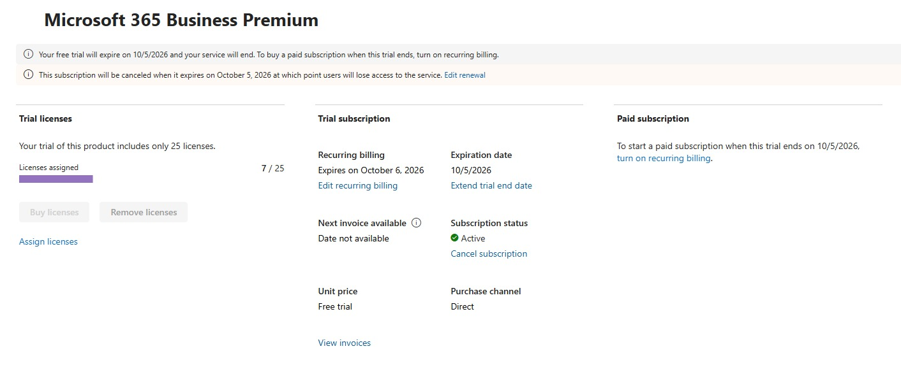
</p>

<p align="center">
  <em>Business Premium product page after the license was removed: 7 / 25 assigned.</em>
</p>

Both surfaces rose by one on assignment and fell by one on removal. For a direct user assignment they moved together, and the one-unit gap between assignment targets and consumed seats stayed constant throughout, unlike Lab 03 Part C's group assignment, which added a target and no seat.

**Removing the fixture.** Microsoft's conversion and offboarding articles both say not to delete the account behind a shared mailbox, because it anchors the mailbox. The account was deleted anyway, because it was a lab fixture whose mailbox was meant to go with it. A mailbox under any hold becomes inactive instead, so holds were read first, at 4:15 PM:

```powershell
Get-Mailbox -Identity leaver-demo01@brindeck.com | Format-List LitigationHoldEnabled,InPlaceHolds,DelayHoldApplied,DelayReleaseHoldApplied,ComplianceTagHoldApplied
Get-OrganizationConfig | Format-List InPlaceHolds
```

```text
LitigationHoldEnabled    : False
InPlaceHolds             : {}
DelayHoldApplied         : False
DelayReleaseHoldApplied  : False
ComplianceTagHoldApplied : False
```

The organization's `InPlaceHolds` was also empty.

The user was deleted with `Remove-MgUser` at 4:23:59 PM Eastern (20:23:59 UTC). At 4:25 PM the mailbox was no longer returned as active:

```powershell
Get-EXOMailbox -Identity leaver-demo01@brindeck.com -SoftDeletedMailbox -Properties RecipientTypeDetails,WhenSoftDeleted,IsInactiveMailbox | Format-List DisplayName,RecipientTypeDetails,WhenSoftDeleted,IsInactiveMailbox
```

```text
RecipientTypeDetails : SharedMailbox
WhenSoftDeleted      : 9/26/2026 4:24:03 PM
IsInactiveMailbox    : False
```

<p align="center">
  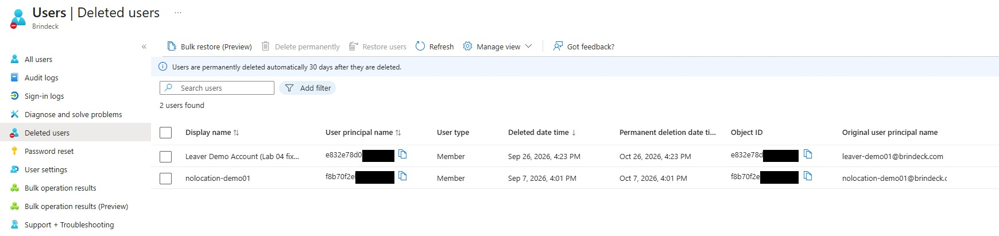
</p>

<p align="center">
  <em>Entra admin center Deleted users: the fixture with a permanent deletion date of Oct 26, 2026, beside nolocation-demo01.</em>
</p>

Left alone, the account would have stayed in Deleted users until 2026-10-26, after this lab's deadline and inside Lab 05. Unlike `nolocation-demo01`, it carried nothing a later lab reads, and `nolocation-demo01` will show an automatic purge on its own date. It was permanently deleted with `Remove-MgDirectoryDeletedItem` at 4:28:14 PM Eastern (20:28:14 UTC). At 4:29 PM Graph returned no deleted user matching it, but the soft-deleted mailbox was still present, with `WhenSoftDeleted` re-stamped from 4:24:03 PM to 4:28:20 PM. It was still present at 4:33 PM, when `ConsumedUnits` read 6 of 25. The product page's last reading was 7 of 25, at 4:13 PM.

### Step Nine: Validate the environment is unchanged and record the finished state

Confirm that a lab conducted in two web consoles and one PowerShell module left everything else as it found it, and record what Lab 05 starts from.

`Test-ComputerSecureChannel` from WIN11-CLIENT01, a Group Policy result confirming `IT-Admin-Environment` still applies, taken at user scope since Lab 03 established that a computer-scoped result structurally cannot show it. `sssd` active on Ubuntu Server with a freshly issued Kerberos ticket rather than a cached one. On `SYNC01`, the Entra Connect version and source anchor unchanged, and `Get-ADSyncScheduler` read before anything that could force a cycle, with the suspended-VM behavior Lab 03 recorded applied rather than rediscovered.

Run `Invoke-LabHealthReport.ps1` for the overall picture and then `Get-LabWazuhAgentStatus -AgentName DC01,WIN11-CLIENT01,UBUNTU-SERVER,SYNC01` explicitly, recording both and the reason they differ. That defect is now carried by two tracks and confirmed by two labs. `Invoke-Pester -Path C:\Scripts -Output Detailed`, expected at 174 tests and 0 failed, since this lab commits no script.

Reconcile the finished state. Record every mail object that persists and every one the lab removed, including confirmation that Step Five's mail flow rule is gone and mail flows normally again, and that Step Seven's litigation hold is released if one was placed. Record the state of the archive mailbox Step Seven left enabled on testuser01, and reread `DelayHoldApplied` and `DelayReleaseHoldApplied` on the same mailbox, which both read False at 1:00 PM Eastern on 2026-09-24, 42 minutes after Step Seven removed the hold, along with its Recoverable Items quotas, which still read 100 GB and 90 GB at that time. Record the licensing state by assignment target and consumed seat for both SKUs. Business Premium closed Step Eight at 6 consumed seats of 25 (4:33 PM Eastern on 2026-09-26) and 7 assignment targets (4:13 PM). Confirm that `leaver-demo01` is absent from Deleted users, since Step Eight purged it at 4:28 PM Eastern on 2026-09-26 rather than leaving it to its 2026-10-26 permanent deletion date, and record whether its soft-deleted shared mailbox, still returned by `Get-EXOMailbox -SoftDeletedMailbox` at 4:33 PM that day, has gone. Re-read the Entra admin center's Licenses blade for one directly licensed account and record its enabled-services count, which Step One's reconciliation of the three service counts predicts at 53 and which is the one figure in that reconciliation still standing as a prediction. Record the state of the four objects Lab 03 left outside the Entra Overview's counts: `nolocation-demo01` and `Testgroup` retained, `duptest01` and `duptest02` purged. Record whether `cloudonly-demo01` is still license-only with no groups and no roles, which is the condition Lab 05 depends on and which nothing in this lab should have touched.

Close the three dated carry-forward items this lab owns rather than passing them on with their dates already spent.

Read `AZUREADSSOACC`'s key age again, against the 2026-09-30 interval Step One recorded. Lab 03 left the key unrolled at eleven days elapsed specifically so a later lab could watch a full thirty-day interval pass against a recommendation it had established as hygiene rather than a deadline. This is that lab. Record what a fully elapsed interval produced, which is most likely nothing observable, since that is the finding either way. Whether to automate the roll remains Lab 06's.

Take the decision on `Testgroup` and `nolocation-demo01`, whose permanent deletion dates of 2026-10-06 and 2026-10-07 both fall after this lab's own deadline. That makes this the last lab that can decide anything about either. `nolocation-demo01` is the artifact behind Lab 03's finding that a soft-deleted object keeps its `assignedLicenses` while consuming no seat, so record the case for letting it reach permanent deletion on its own against the case for restoring it first to read the property one last time, and take the decision rather than letting the date take it.

Record the entitlement position plainly, and record the discrepancy rather than resolving it silently. Business Premium expires 2026-10-05 by the subscription's stated end date, while the portal's own Recurring billing field reads 2026-10-06, which Lab 03 recorded and left open. This lab plans against the earlier of the two. State both, state which one this lab used, and state whether anything observed here settled it. With the subscription goes Exchange Online Plan 1, Microsoft Entra ID P1, and Microsoft Intune Plan 1, and Lab 05 needs the last two. Whether that decision is a renewal, a purchase, or a deliberate lapse is Lab 05's to take, and this lab's job is to hand it an accurate picture of what is about to end, including whatever Step Six established about the Expired stage.

---

## Validation

Planned validation, to be replaced with observed results as the lab is implemented. Each item maps to an objective above.

- **Mailbox provisioning.** Every licensed account in the hybrid population holds an Exchange Online mailbox, confirmed for both a synchronized and a cloud-only user. What an unlicensed account holds instead is recorded, including what a sender receives when addressing it.
- **Mail-enabled group types.** A distribution list and a mail-enabled security group exist in the tenant, catalogued alongside the Microsoft 365 groups it already held, with the administering console recorded for each and the differences between the three recorded on membership, permissions, and what each brings with it.
- **Shared mailbox and delegation.** A shared mailbox exists, unlicensed, with Full Access, Send As, and Send on Behalf each granted and each exercised with a real message. What the recipient sees in the `From` header is captured for all three. The sign-in state of the mailbox's associated user account is recorded as read from the tenant, against three Microsoft sources that disagree about what it should be.
- **Mail flow.** A mail flow rule is built, exercised, traced, and removed, with what it looks like from the object's own properties recorded alongside what the trace shows. At least three messages are traced end to end, including one to a distribution list returning a delivery status of `Expanded` and one the rule stops. Message trace's own retention and timing behavior is recorded alongside the results, with observed latency stated against the three different figures Microsoft's sources give rather than confirming any one of them.
- **Mail-flow DNS.** The accepted domain state for `brindeck.com`, its type, the domain Exchange derives default addresses from, and what its MX resolves to publicly are established in Step One, from outside the administrative consoles that would be describing their own state. Whichever path the result required, publishing the records or confining mail flow to internal recipients, is recorded as a decision with its reasoning.
- **The 2026-09-22 lapse.** A prediction is recorded before the date, in a commit made before the date, and the observed outcome after it, with the two stated separately and neither adjusted to match the other. The subscription's lifecycle state, `Finance`'s assignment, and both seat-count figures are recorded on each side of the date. What the result implied for this lab's own remaining schedule is recorded as a decision rather than left as an observation.
- **Mailbox compliance.** The Business Premium SKU's service plans are enumerated in full and the tenant's actual archiving and hold entitlement is stated from that enumeration, against two Microsoft documents that disagree about it. Whichever branch the evidence supported, building the capability or recording the boundary, is carried out and the evidence for it recorded.
- **Mailbox conversion and license reclamation.** A user mailbox is converted to shared with its contents intact, the license is reclaimed, and the ordering constraint is recorded as observed rather than cited.
- **Environment unchanged.** Host and service configuration on DC01, WIN11-CLIENT01, Ubuntu Server, and `SYNC01` confirmed operating as documented. All four Wazuh agents confirmed by explicit agent list. Entra Connect version, source anchor, and scheduler unchanged. Pester suite at 174 tests, 0 failed.
- **Finished state.** Every mail object created is accounted for as persisting or removed, including the mail flow rule and any hold placed. The licensing state is recorded by assignment target and consumed seat for both SKUs, with the 2026-10-05 and 2026-10-06 readings both stated. `cloudonly-demo01` is confirmed license-only with no groups and no roles.
- **The three service counts on one SKU.** The 62 service plans, the Microsoft 365 admin center's Apps list, and the Entra admin center's enabled-services figure are reconciled by name rather than by total, with what each one counts stated. The Entra blade is re-read at the close so that no part of the reconciliation rests on inference.
- **Carry-forward.** The three dated items this lab owns are closed rather than passed on with their dates spent: the fully elapsed `AZUREADSSOACC` interval is read, the `Testgroup` and `nolocation-demo01` deletion windows are decided rather than allowed to expire by default, and the expiry discrepancy is stated with the figure this lab planned against.

---

## Troubleshooting and Adjustments

### Three Step One commands failed on the first attempt

None of them was a finding about the tenant. `Install-Module ExchangeOnlineManagement -Scope CurrentUser -Force` failed on a PackageManagement/PowerShellGet version clobber ("This module 'PackageManagement' may override the existing commands"); adding `-AllowClobber` resolved it. `Get-MessageTraceV2` was first invoked with its own name accidentally truncated to `V2` by a copy-paste artifact and failed as an unrecognized command; retyped in full, it ran correctly. `Get-ADComputer -Identity AZUREADSSOACC -Properties PasswordLastSet -Server SYNC01` failed because SYNC01 is a domain member rather than a domain controller and does not run Active Directory Web Services; dropping `-Server` and letting the AD module resolve to `corp.home.arpa` normally, exactly as Lab 03 ran it, succeeded.

### `Enable-DistributionGroup` does not exist in Exchange Online

Step Three's first attempt at mail-enabling the synchronized `IT-Admins` group reached for `Enable-DistributionGroup`, the Exchange Management Shell cmdlet that does this on premises:

```powershell
Enable-DistributionGroup -Identity "IT-Admins"
```

```text
Enable-DistributionGroup : The term 'Enable-DistributionGroup' is not recognized as the name of a cmdlet, function,
script file, or operable program. Check the spelling of the name, or if a path was included, verify that the path
is correct and try again.
At line:1 char:1
+ Enable-DistributionGroup -Identity "IT-Admins"
+ ~~~~~~~~~~~~~~~~~~~~~~~~~~~~~~~~~~~~~~~~~~~~~~
    + CategoryInfo          : ObjectNotFound: (Enable-DistributionGroup:String) [], CommandNotFoundException
    + FullyQualifiedErrorId : CommandNotFoundException
```

That cmdlet belongs to on-premises Exchange Server, and nothing in the `ExchangeOnlineManagement` module mail-enables an existing group. The attempt moved to Microsoft Graph, where the write was refused for a different reason that Step Three records.

### A three-address message trace query first appeared to drop a recipient

Step Five's post-removal confirmation queried `Get-MessageTraceV2` for all three `Help-Desk` members at once and returned two rows, with nothing for `jsmith@brindeck.onmicrosoft.com`. Queried alone rather than alongside the other two, his row appeared:

```powershell
Get-MessageTraceV2 -RecipientAddress "jsmith@brindeck.onmicrosoft.com" -Subject "post-removal" -SubjectFilterType "Contains" -StartDate (Get-Date "2026-09-18 12:40") -EndDate (Get-Date)
```

```text
Received              Sender Address          Recipient Address               Subject                                       Status
--------              --------------          -----------------               -------                                       ------
9/18/2026 4:42:02 PM  testuser01@brindeck.com jsmith@brindeck.onmicrosoft.com Lab 04 Step Five - post-removal confirmation Delivered
```

Delivered, at the identical timestamp the other two members and the group row carry. All three members received the message; the gap was in what the trace had indexed at the moment it was asked, not in what actually happened.

Two rows from a three-address query, with each address returning its row when asked alone, reads as a property of `-RecipientAddress` taking an array. The mundane alternative had not been ruled out: Step Five's own baseline reading established that a row is not yet queryable two minutes after a send and is queryable by three, the message had been delivered at 12:42 PM Eastern, and the combined query ran within a few minutes of that. The single-address query for `jsmith` ran after the combined one, so the row becoming queryable in between accounts for the result equally well.

The same query, byte for byte, re-run hours later over the identical window:

```text
Received              Sender Address          Recipient Address               Subject                                    Status
--------              --------------          -----------------               -------                                    ------
9/18/2026 4:42:02 PM  testuser01@brindeck.com jdoe@brindeck.com               Lab 04 Step Five - post-removal confirmation Delivered
9/18/2026 4:42:02 PM  testuser01@brindeck.com jsmith@brindeck.onmicrosoft.com Lab 04 Step Five - post-removal confirmation Delivered
9/18/2026 4:42:02 PM  testuser01@brindeck.com testuser01@brindeck.com         Lab 04 Step Five - post-removal confirmation Delivered
```

Three rows. A multi-address `-RecipientAddress` query does not deterministically drop a recipient, which is what the first reading would have required. The rerun does not go further than that on its own: a transient fault would also have cleared by the time it ran, so it rules out the array-query explanation without proving any particular one in its place.

The explanation most consistent with what Step Five saw is appearance latency operating per row rather than per message. The three member rows carry an identical `Received` timestamp of 4:42:02 PM UTC and did not all become queryable at the same moment, which would follow if rows from a single expanded message are indexed independently rather than as a unit. That is offered as the likely reading rather than as an established one, since nothing here distinguishes it from a one-off indexing delay affecting that row alone.

### Step Two's `LastLogonTime` was never retrieved

Step Six's 2026-09-22 mailbox reading did not print `LastLogonTime` at all, where Step Two's reading printed it as a blank line (`LastLogonTime        :` with no value). The two commands were not identical, and the difference explains the output. Step Two piped through `Select-Object` before `Format-List`, and `Select-Object` creates every property it is asked for, printing one the input object does not carry as an empty value. Step Six's reading passed the property list to `Format-List` directly, which skips a property the object does not carry. Microsoft's property set reference for the Exchange Online PowerShell module lists `LastLogonTime` in `Get-EXOMailboxStatistics`'s All property set and not in the Minimum set a call without `-Properties` or `-PropertySets` returns. Neither command requested it, so neither reading retrieved `LastLogonTime` at all, and Step Two's blank value recorded the property's absence from the output rather than a mailbox that had never been signed in to. Step Six's 2026-09-23 reading requested the property explicitly with `-Properties LastLogonTime` and retrieved a value, recorded there.

### `Get-EXOMailbox` does not accept `DelayReleaseHoldApplied`

Step Seven's first baseline read requested `DelayReleaseHoldApplied` through `Get-EXOMailbox -Properties` alongside `DelayHoldApplied`, and the whole call failed, returning no properties at all:

```text
Get-EXOMailbox : Some of requested properties are not valid. InvalidProperties = DelayReleaseHoldApplied
```

The REST cmdlet accepts `DelayHoldApplied` and rejects `DelayReleaseHoldApplied`. The property was dropped from the `Get-EXOMailbox` call and read through `Get-Mailbox`, the form Microsoft's hold types article uses for both properties.

### `Get-MgUserLicenseDetail` returned nothing immediately after an assignment

Step Eight read `leaver-demo01`'s license detail in the same block as the `Set-MgUserLicense` call that assigned Business Premium, at 4:00 PM Eastern on 2026-09-26, and it printed nothing, as though no license were assigned. The mailbox was created 18 seconds after the assignment, and the same command at 4:02:05 PM returned `SPB`. The second reading supersedes the first, and an empty license readback taken in the same block as the assignment was not evidence that the assignment had failed.

---

## Security Considerations

- **A shared mailbox has an associated user account, and whether it can sign in is not something to take on faith.** Microsoft's documentation gives three incompatible answers about the default, which is reason enough to read it from the tenant. Whatever the default turns out to be, the account exists and holds a system-generated password, so an administrator who resets that password has created a credentialed identity that nobody is monitoring and that no person is accountable for. Microsoft's own guidance is to block sign-in and keep it blocked.
- **Revoking Send As does not take effect when the directory says it has.** Step Four removed Send As from a delegate, confirmed the removal through `Get-RecipientPermission`, and then watched Exchange honor the permission anyway on a message sent within fourteen minutes of the revocation, which arrived as an unattributable impersonation of the shared mailbox with no `Sender:` header naming the person who sent it. The permission had stopped being honored by a retest taken at most sixty-six minutes after the revocation, so the gap sits somewhere inside that bound and the step does not claim a figure for it. Microsoft documents up to 60 minutes for a mailbox permission change to propagate and take effect, so this is the normal case rather than a fault, which is what makes it worth writing down. Within that window a grant fails closed, telling the delegate they lack permission, while a revocation fails open, and `Get-RecipientPermission` returns empty either way with no signal that the window is still running. This matters at exactly the moment it is least convenient: an administrator revoking a departing employee's Send As permission and verifying it in PowerShell holds evidence that is true of the directory and not yet true of the mail service, and anything sent in that window is indistinguishable from mail sent by the mailbox itself. Blocking the account's sign-in, or removing the mailbox from the client, does not close the gap either, since the permission is what authorizes the send. Where revocation is urgent, the interval has to be assumed rather than trusted.
- **Send As is an impersonation grant.** A user holding it sends messages that arrive with no indication a person other than the mailbox sent them, which is exactly what makes it useful for a shared support address and exactly what makes it dangerous on a mailbox that carries authority. The distinction from Send on Behalf is a security control, not a cosmetic preference, and the lab records which one is appropriate for the mailbox it builds.
- **Distribution lists reject external senders by default, and the risk is in what an administrator does next.** Microsoft's documented default is the safe one: new distribution groups require that all senders be authenticated, which blocks mail from outside the organization until Delivery management is changed. The exposure arrives when someone changes it, usually for a good reason such as a support alias that has to receive mail from customers, because an externally addressable distribution list is a delivery mechanism into every member's mailbox at once and nothing about the list's own page says so. This lab reads the setting as shipped rather than assuming either direction, and records what changing it would open.
- **The entitlement carrying every mailbox in this lab expires inside the next month.** What happens to a mailbox when its license lapses is a real operational question with a data-retention answer attached, and Lab 05 inherits it. The lab records the expiry position accurately rather than leaving a successor to discover it.
- **Message trace exposes message metadata across the organization.** Sender, recipient, subject, and delivery path for every message are readable by anyone holding Exchange Administrator or Organization Management. That is a meaningful privilege and it is part of why the administrative path is a Step One decision rather than a default.

---

## Outcome

Recorded at completion.

---

## Lessons Learned

Recorded at completion.

---

## Sources

To be completed during implementation, with each link confirmed resolving at close rather than reconstructed. Research consulted for this plan:

- [What happens to my data and access when my Microsoft 365 for business subscription ends?](https://learn.microsoft.com/microsoft-365/commerce/subscriptions/what-if-my-subscription-expires) - the Active, Expired, Disabled, Deleted lifecycle and the access retained at each stage
- [Data retention, deletion, and destruction in Microsoft 365](https://learn.microsoft.com/compliance/assurance/assurance-data-retention-deletion-and-destruction-overview) - subscription retention periods, and the separate 30-day grace status described for free trials
- [About shared mailboxes in Microsoft 365](https://learn.microsoft.com/microsoft-365/admin/email/about-shared-mailboxes) - the 50 GB unlicensed limit and the scenarios that require a license
- [Convert a user mailbox to a shared mailbox](https://learn.microsoft.com/microsoft-365/admin/email/convert-user-mailbox-to-shared-mailbox) - the ordering constraint on the license at conversion time, quoted in Step Eight, the statement that the original username and password continue to work on the shared mailbox unless the password is reset, and the instruction not to delete the account that anchors the shared mailbox
- [Exchange Online limits](https://learn.microsoft.com/office365/servicedescriptions/exchange-online-service-description/exchange-online-limits) - mailbox storage limits, and the shared mailbox associated account described as active
- [Exchange Online Archiving service description](https://learn.microsoft.com/office365/servicedescriptions/exchange-online-archiving-service-description/exchange-online-archiving-service-description) - the plan list naming Microsoft 365 Business Premium among those that already include archiving without the add-on, and the feature table giving Exchange Online Archiving for Exchange Online both Litigation Hold and retention policies
- [Place a mailbox on litigation hold](https://learn.microsoft.com/microsoft-365/admin/misc/create-litigation-hold-mac) - the contradicting statement that a hold requires Exchange Online Plan 2, or Plan 1 plus a separate Exchange Online Archiving license, the 240-minute banner on placing a hold, and the 110 GB Recoverable Items quota with auto-expanding archiving
- [Manage mail-enabled security groups in Exchange Online](https://learn.microsoft.com/exchange/recipients-in-exchange-online/manage-mail-enabled-security-groups) - mail-enabled security groups created as new objects with `New-DistributionGroup -Type Security` or the Exchange admin center
- [Manage distribution groups](https://learn.microsoft.com/exchange/recipients/distribution-groups) - that new distribution groups require all senders to be authenticated by default, which blocks external senders until Delivery management is changed
- [Message trace in the Exchange admin center in Exchange Online](https://learn.microsoft.com/exchange/monitoring/trace-an-email-message/message-trace-modern-eac) - delivery status values including `Expanded`, and the permissions required
- [Message Trace FAQ in Exchange Online](https://learn.microsoft.com/exchange/monitoring/trace-an-email-message/message-trace-faq) - 90-day retention, the 10-day query window, `Get-MessageTraceV2`, and a stated five to ten minute appearance latency
- [Monitoring, reporting, and message tracing in Exchange Online](https://learn.microsoft.com/exchange/monitoring/monitoring) - the same latency stated as five to thirty minutes for messages less than seven days old
- [Find and fix email delivery issues as a Microsoft 365 for business admin](https://learn.microsoft.com/troubleshoot/exchange/email-delivery/email-delivery-issues) - the same latency stated as ten minutes to one hour
- [Configure OAuth authentication between Exchange and Exchange Online organizations](https://learn.microsoft.com/exchange/configure-oauth-authentication-between-exchange-and-exchange-online-organizations-exchange-2013-help) - the glossary naming `contoso.mail.onmicrosoft.com` as the hybrid routing domain, and the Microsoft Online Email Routing Address built from a user's UPN prefix and the initial domain suffix
- [Manage accepted domains in Exchange Online](https://learn.microsoft.com/exchange/mail-flow-best-practices/manage-accepted-domains/manage-accepted-domains) - the Authoritative and Internal relay domain types, and Directory-Based Edge Blocking as what Authoritative enables
- [Create a shared mailbox](https://learn.microsoft.com/microsoft-365/admin/email/create-a-shared-mailbox) - the statement that by default every new shared mailbox has sign-in blocked, which is the first of the three answers Design Decisions sets against each other
- [Block sign-in for shared mailbox accounts in Microsoft 365 Lighthouse](https://learn.microsoft.com/microsoft-365/lighthouse/m365-lighthouse-block-signin-shared-mailboxes) - the third answer, a feature providing visibility into shared mailboxes across managed tenants that are enabled for direct sign-in
- [Shared mailboxes in Exchange Online](https://learn.microsoft.com/exchange/collaboration-exo/shared-mailboxes) - the three delegation permissions and what each produces for the recipient, and that the Exchange admin center cannot grant Send on Behalf
- [Give mailbox permissions to another Microsoft 365 user](https://learn.microsoft.com/microsoft-365/admin/add-users/give-mailbox-permissions-to-another-user) - that once permissions are set it can take up to 60 minutes for the changes to propagate and take effect
- [Send Outlook messages from another user](https://learn.microsoft.com/graph/outlook-send-mail-from-other-user) - Send on Behalf surfacing as distinct `sender` and `from` values while Send As leaves the two identical, which is the header-level distinction Step Four captured
- [Property sets in Exchange Online PowerShell module cmdlets](https://learn.microsoft.com/powershell/exchange/cmdlet-property-sets) - `LastLogonTime` in `Get-EXOMailboxStatistics`'s All property set and absent from the Minimum set returned by default, read during Step Six.
- [licenseUnitsDetail resource type](https://learn.microsoft.com/graph/api/resources/licenseunitsdetail?view=graph-rest-1.0) - the definitions of `warning` units as those of an expired subscription in its grace period and `suspended` units as those of a canceled subscription that can't be assigned but can be reactivated before deletion, read against Step Six's 2026-09-23 SKU reading
- [Place a mailbox on Litigation Hold (Exchange Server)](https://learn.microsoft.com/exchange/policy-and-compliance/holds/litigation-holds) - the 60-minute figure for a hold to take effect, which Step Seven set against the Exchange Online cmdlet's 240-minute warning
- [Recoverable Items folder in Exchange Online](https://learn.microsoft.com/exchange/security-and-compliance/recoverable-items-folder/recoverable-items-folder) - the 20 GB and 30 GB default quotas, 90 GB and 100 GB on hold, 95 GB and 105 GB on hold with an archive, and the Purges and Versions subfolders under single item recovery and hold
- [Identify Exchange mailbox hold types in eDiscovery](https://learn.microsoft.com/purview/edisc-hold-types-mailboxes) - the delay hold the Managed Folder Assistant applies after a hold is removed, `DelayHoldApplied` and `DelayReleaseHoldApplied`, the 30-day duration, and deleted mailboxes under a delay hold becoming inactive
- [Messaging Records management (MRM) and Retention Policies in Microsoft 365](https://learn.microsoft.com/troubleshoot/microsoft-365/purview/retention/mrm-and-retention-policy) - the direction to right-click a folder and select Assign policy, which Step Seven did not find in Outlook on the web
- [Overview: Remove a former employee and secure data](https://learn.microsoft.com/microsoft-365/admin/add-users/remove-former-employee) - the offboarding sequence in which the mailbox is converted to shared before the license is removed and the account deleted
- [Step 7 - Delete a former employee's user account](https://learn.microsoft.com/microsoft-365/admin/add-users/remove-former-employee-step-7) - the instruction not to delete an account converted to a shared mailbox, since the account anchors it, and the approximately 30 days before a deleted account is permanently deleted
