# 02 - Windows Server Lab

## Status

Completed

---

## Overview

This lab configured DC01 as a production-ready Windows Server environment and established the remote administration workflows that all subsequent enterprise infrastructure labs depend on.

The lab picked up from the clean baseline snapshot created at the end of Lab 01, where DC01 was provisioned with Windows Server 2022 and VMware Tools was installed. At that point the VM was functional but unconfigured, operating on VMware NAT networking, with a dynamically assigned IP address, a default hostname, and no remote administration capability.

This lab completed the foundational configuration required before Active Directory can be deployed:

- transitioning DC01 and WIN11-CLIENT01 from NAT to bridged networking to establish LAN presence
- assigning static IP addresses aligned with the planned addressing scheme
- renaming the server hostname to match infrastructure naming standards
- running Windows updates on both VMs to establish fully patched baselines
- enabling and validating RDP remote administration from the Windows 11 workstation
- installing RSAT on WIN11-CLIENT01 to establish it as the dedicated enterprise admin workstation
- performing baseline Server Manager familiarization
- validating baseline hardening including Windows Firewall, Defender, and local security policy
- creating pre-AD snapshots for both VMs as rollback points for Lab 03 and Lab 04

The networking transition was the most architecturally significant step in this lab. Moving DC01 onto bridged networking made it a first-class participant on the local LAN, which is a prerequisite for Active Directory service discovery, Kerberos authentication, DNS resolution, and eventual hybrid integration with the Ubuntu Server environment.

---

## Objectives

- transition DC01 and WIN11-CLIENT01 from VMware NAT networking to bridged networking
- assign DC01 a static IP address of `192.168.1.10`
- assign WIN11-CLIENT01 a static IP address of `192.168.1.20`
- rename the server hostname to `DC01`
- apply Windows updates to establish fully patched baselines on both VMs
- enable RDP and validate remote administration from the Windows 11 workstation
- install RSAT on WIN11-CLIENT01 to establish it as the dedicated enterprise admin workstation
- validate Server Manager and core server management workflows
- validate baseline hardening on DC01
- create pre-AD snapshots for both DC01 and WIN11-CLIENT01

---

## Project Context

Lab 01 established the virtualization foundation for the enterprise infrastructure track. VMware Workstation was deployed on the Windows 11 workstation, and both DC01 and WIN11-CLIENT01 were provisioned with clean operating system installations and baseline snapshots.

However, both VMs were left in a deliberately minimal state, functional but not yet configured for enterprise infrastructure roles. This was intentional: the goal of Lab 01 was to validate the virtualization platform and establish clean rollback points before introducing configuration complexity.

This lab addressed the gap between a clean Windows Server installation and a server that is properly configured, remotely administrable, and ready to receive Active Directory services.

The networking transition from NAT to bridged networking is worth calling out specifically. During Lab 01, NAT networking was selected because it simplified the initial deployment and reduced risk during VM provisioning. At that stage, the VMs only needed outbound internet access for validation purposes, and exposing them directly onto the LAN was unnecessary.

By Lab 02, the requirements changed. DC01 needed to be reachable from:

- the Windows 11 management workstation, for RDP administration
- WIN11-CLIENT01, for future domain join workflows
- the Ubuntu Server host, for future hybrid integration

All of these communication paths require DC01 to have a real LAN-routable address. Bridged networking provides exactly this by connecting the VM's virtual network adapter directly to the physical LAN as if it were an independent host.

This lab also introduced RSAT on WIN11-CLIENT01. Rather than installing administration tooling on the physical host, WIN11-CLIENT01 was established as the dedicated enterprise admin workstation within the lab boundary. This keeps the entire Windows administration workflow self-contained within the virtualized environment, which more closely mirrors enterprise operational practice where a dedicated management workstation or jump box is used for server administration.

---

## Technologies Used

- VMware Workstation Pro
- Windows Server 2022 Standard Evaluation (Desktop Experience)
- Windows 11 Enterprise Evaluation
- VMware Bridged Networking
- Remote Desktop Protocol (RDP)
- Remote Server Administration Tools (RSAT)
- Windows Server Manager
- Windows Defender Firewall with Advanced Security
- Windows PowerShell

---

## Architecture and Topology

After this lab, DC01 is a fully configured Windows Server host with a static LAN presence.

```text
Windows 11 Workstation (192.168.1.x) [hypervisor and access device]
│
└── VMware Workstation
    │
    ├── DC01 (192.168.1.10)
    │   └── Windows Server 2022 Standard Evaluation
    │       ├── Static IP: 192.168.1.10
    │       ├── Hostname: DC01
    │       ├── RDP enabled
    │       └── Ready for Active Directory deployment
    │
    └── WIN11-CLIENT01 (192.168.1.20) [enterprise admin workstation]
        └── Windows 11 Enterprise Evaluation
            ├── Static IP: 192.168.1.20
            ├── Bridged networking
            ├── RSAT installed
            ├── RDP → DC01 (192.168.1.10)
            └── Future: domain-joined client

                    ↕ LAN

Ubuntu Server 26.04 LTS (192.168.1.226)
```

The networking model shifted from this:

```text
DC01 → VMware NAT → Windows 11 Host → LAN
```

To this:

```text
DC01 → VMware Bridged Adapter → LAN (direct)
```

This gives DC01 a first-class LAN presence independent of the host workstation's NAT layer.

---

## Prerequisites

- Lab 01 completed and validated
- DC01 baseline snapshot (`DC01 - Clean Windows Server Base Install`) available
- Router DHCP reservation configured or available for `192.168.1.10`
- Windows 11 workstation available for RDP validation
- WIN11-CLIENT01 available for network reconfiguration and RSAT installation
- Administrative access to VMware Workstation

---

## Deployment Steps

### Step One - Restore and Verify the Baseline Snapshot

Before making any configuration changes, DC01 was restored to the clean baseline snapshot created at the end of Lab 01.

This ensured:

- the lab began from a known-good state
- any configuration drift introduced during Lab 01 validation was eliminated
- the rollback chain remained clean and predictable

The restore was performed via VMware Workstation's snapshot menu, using the revert-to-snapshot workflow:

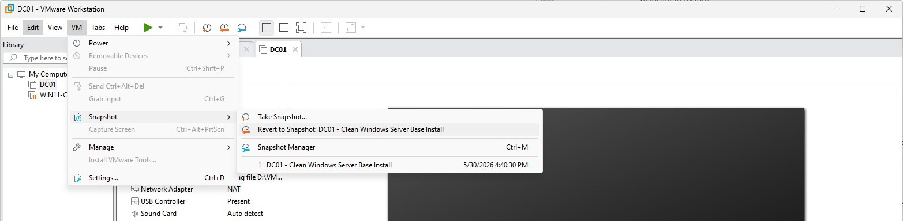

The snapshot details panel confirmed the VM was reverting to the correct baseline state:

- snapshot name: `DC01 - Clean Windows Server Base Install`
- snapshot taken: 5/30/2026 at 4:40 PM

After restoring, DC01 was booted and confirmed to be in a stable pre-configuration state with Server Manager opening on first boot and VMware Tools operational.

---

### Step Two - Transition to Bridged Networking

Both DC01 and WIN11-CLIENT01 were reconfigured from NAT to bridged networking through VMware Workstation VM settings while each VM was powered off.

**DC01 network adapter configuration:**

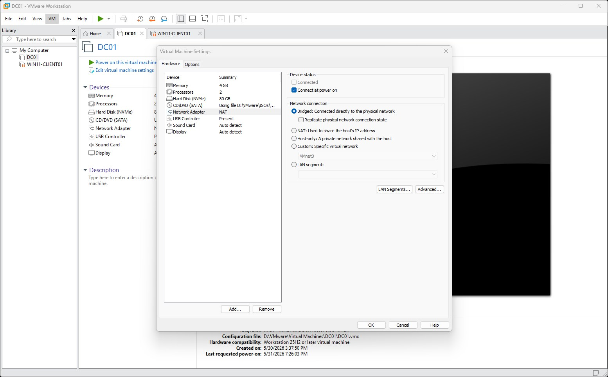

The Virtual Machine Settings dialog confirmed the network adapter was switched from NAT to Bridged, connecting the VM directly to the physical network. The VM details panel also showed the configuration file path at `D:\VMware\Virtual Machines\DC01\DC01.vmx`, confirming the VM was stored in the correct enterprise directory.

**WIN11-CLIENT01 network adapter configuration:**

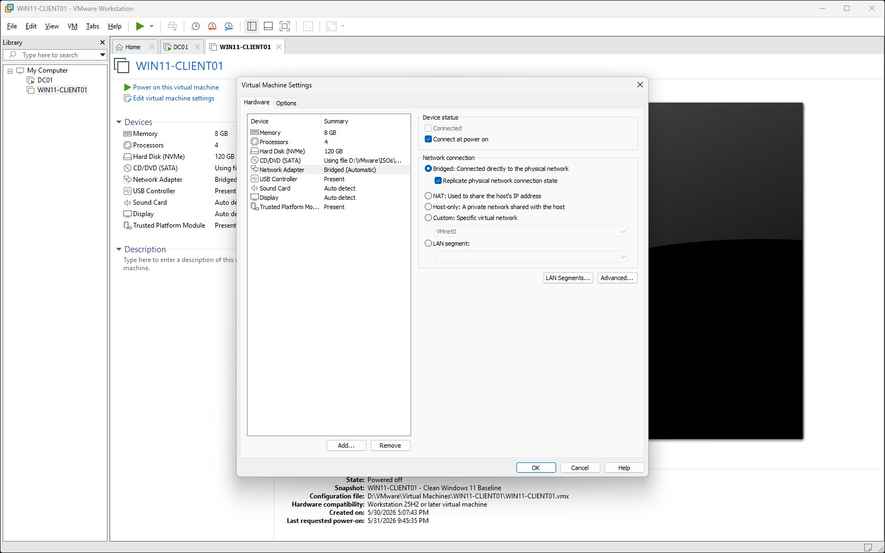

WIN11-CLIENT01's network adapter was similarly switched to Bridged (Automatic), with the Replicate physical network connection state option enabled. The hardware summary confirmed the VM's full resource allocation: 8 GB memory, 4 processors, 120 GB NVMe disk.

The change was required because:

- Active Directory service discovery relies on DNS and Kerberos, which require direct LAN reachability
- domain join workflows require WIN11-CLIENT01 to reach DC01 directly over the LAN
- RDP administration from WIN11-CLIENT01 requires both VMs to be on the same routable network
- future hybrid integration with the Ubuntu Server host requires LAN-level reachability from both VMs

After switching to bridged networking, both VMs initially received DHCP-assigned addresses from the router. Static IP configuration in the following step replaced these with fixed addresses.

---

### Step Three - Assign Static IP Addresses

Both DC01 and WIN11-CLIENT01 were assigned static IP addresses through their respective network adapter settings.

#### DC01 Static IP Configuration

Before assigning the planned address of `192.168.1.10`, a ping test was performed from DC01 to confirm the address was not already in use on the LAN:

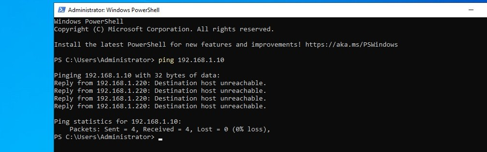

The output returned "Destination host unreachable" responses from `192.168.1.220`, indicating the address was available. This router response confirmed the address was not in use by any active LAN host.

The static IP was then configured through the IPv4 properties dialog on DC01's Ethernet0 adapter:

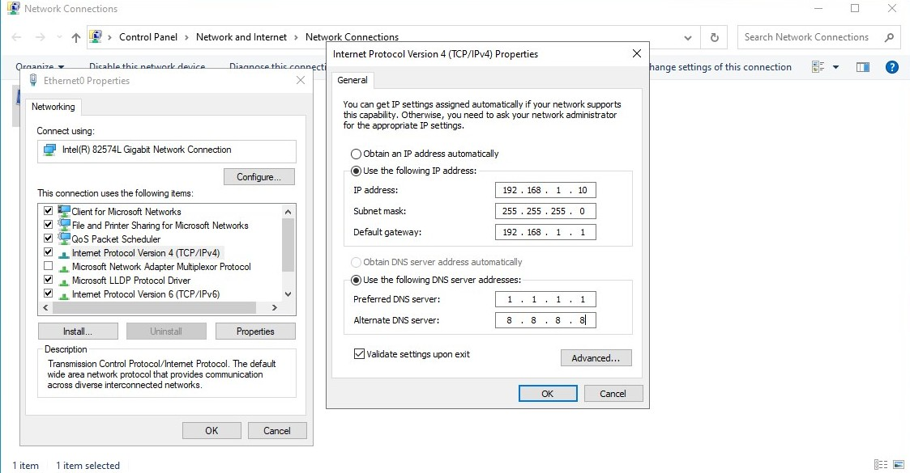

DC01 addressing applied:

| Parameter | Value |
|---|---|
| IP Address | `192.168.1.10` |
| Subnet Mask | `255.255.255.0` |
| Default Gateway | `192.168.1.1` |
| Preferred DNS | `1.1.1.1` (temporary) |
| Alternate DNS | `8.8.8.8` (temporary) |

The DNS servers configured here are temporary public resolvers. They will be replaced in Lab 03 when DC01 is promoted to a domain controller and begins hosting AD-integrated DNS. At that point DC01 will point to itself (`192.168.1.10`) as the primary DNS server.

After applying the static configuration, `ipconfig /all` was run to validate the full adapter state:

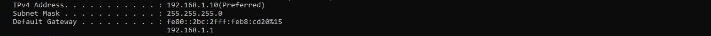

The output confirmed:

- IPv4 address: `192.168.1.10 (Preferred)`
- subnet mask: `255.255.255.0`
- default gateway: `192.168.1.1`
- DNS servers: `1.1.1.1`, `8.8.8.8`
- DHCP disabled
- adapter: Intel(R) 82574L Gigabit Network Connection

The hostname at this stage still showed the Windows-generated default name (`WIN-L36OF2P1CU9`), which was corrected in Step Four.

Connectivity was then validated by pinging the router gateway and the Ubuntu Server host from DC01:

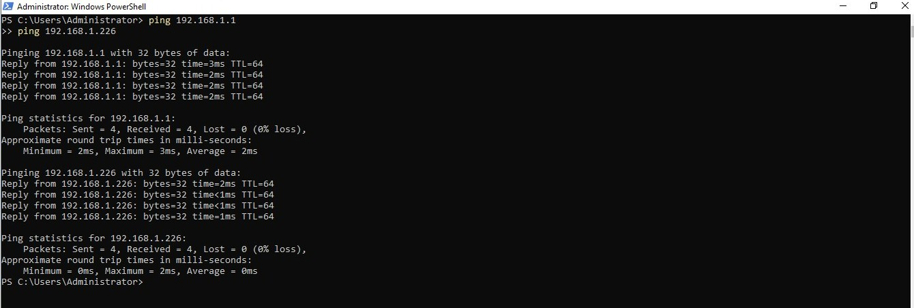

Both pings succeeded with no packet loss:

- ping to `192.168.1.1` (router): 4/4 packets received, 2–3ms average
- ping to `192.168.1.226` (Ubuntu Server): 4/4 packets received, sub-1ms average

This confirmed DC01 had full LAN connectivity through bridged networking and could reach the existing Linux infrastructure environment.

#### ICMP Firewall Rule for Host-to-DC01 Ping

A ping from the Windows 11 host to DC01 was then attempted to validate bidirectional reachability:

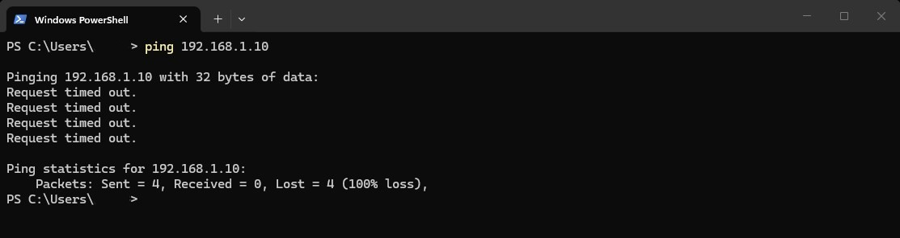

The ping timed out with 100% packet loss. DC01 was reachable from itself and could reach the LAN, but Windows Defender Firewall was blocking inbound ICMP echo requests from external hosts by default.

The ICMPv4 inbound firewall rule was enabled on DC01 via PowerShell:

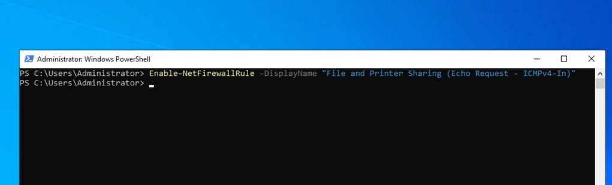

```powershell
Enable-NetFirewallRule -DisplayName "File and Printer Sharing (Echo Request - ICMPv4-In)"
```

With the rule enabled, the host-to-DC01 ping was re-run and succeeded:

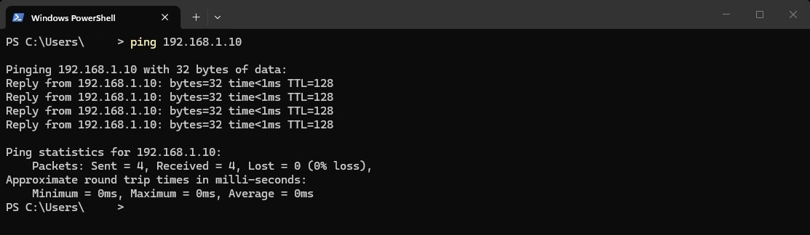

All four packets were received with sub-1ms round trip times, confirming DC01 was fully LAN-reachable from the Windows 11 host workstation.

#### WIN11-CLIENT01 Static IP Configuration

WIN11-CLIENT01's static IP was configured through the IPv4 properties dialog on its Ethernet0 adapter:

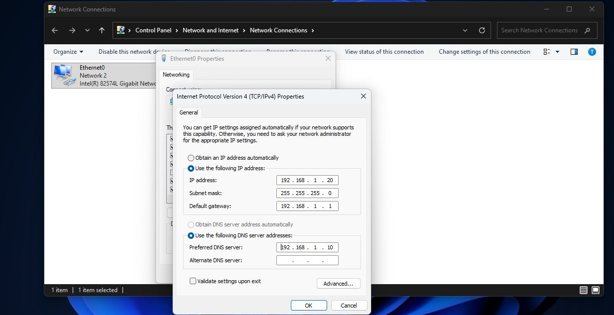

WIN11-CLIENT01 addressing applied:

| Parameter | Value |
|---|---|
| IP Address | `192.168.1.20` |
| Subnet Mask | `255.255.255.0` |
| Default Gateway | `192.168.1.1` |
| Preferred DNS | `192.168.1.10` |

The preferred DNS server for WIN11-CLIENT01 was set directly to DC01 (`192.168.1.10`) rather than a temporary public resolver. Since DC01's static IP was already assigned and validated at this point, pointing WIN11-CLIENT01 at DC01 for DNS established the correct dependency relationship in advance of Lab 03, where DC01 will host AD-integrated DNS.

After applying the static configuration, `ipconfig /all` was run to validate the full adapter state, followed immediately by a ping to DC01:

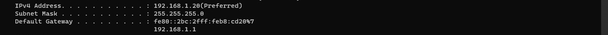

The output confirmed:

- hostname: `WIN11-CLIENT01`
- IPv4 address: `192.168.1.20 (Preferred)`
- subnet mask: `255.255.255.0`
- default gateway: `192.168.1.1`
- DNS servers: `192.168.1.10` (primary)
- DHCP disabled

The ping to `192.168.1.10` visible at the bottom of the output began executing, with results confirming connectivity in subsequent validation.

#### ICMP Firewall Rule for Host-to-WIN11-CLIENT01 Ping

As with DC01, a ping from the host to WIN11-CLIENT01 initially timed out due to the default Windows Firewall configuration blocking inbound ICMP:

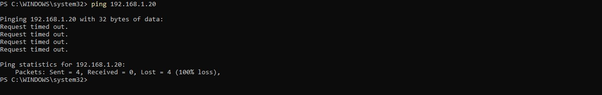

The same ICMPv4 inbound rule was enabled on WIN11-CLIENT01 via PowerShell:

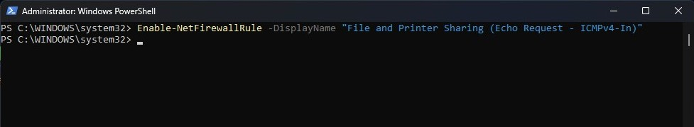

```powershell
Enable-NetFirewallRule -DisplayName "File and Printer Sharing (Echo Request - ICMPv4-In)"
```

The host-to-WIN11-CLIENT01 ping then succeeded:

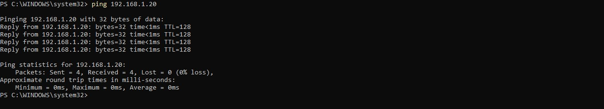

All four packets were received with sub-1ms round trip times, confirming WIN11-CLIENT01 was fully LAN-reachable from the host.

Static addressing was required rather than DHCP because:

- Active Directory domain controllers must have stable, predictable addresses
- DNS records for the domain rely on the DC having a consistent IP
- Kerberos authentication uses IP addressing as part of its validation workflow
- domain join workflows and RDP connections target fixed addresses
- predictable client addressing simplifies GPO targeting and AD administration

---

### Step Four - Rename the Server Hostname

DC01's hostname was set to `DC01` via PowerShell using the `Rename-Computer` cmdlet with an automatic restart:

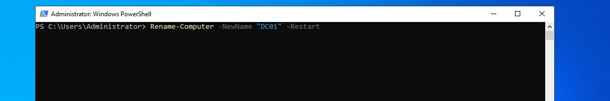

```powershell
Rename-Computer -NewName "DC01" -Restart
```

After the VM rebooted, the hostname was validated:

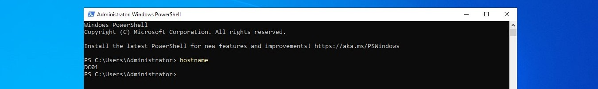

The `hostname` command returned `DC01`, confirming the rename was applied successfully.

The hostname must be set correctly before Active Directory promotion because the domain controller's DNS records, Kerberos service tickets, and AD replication metadata are tied to the server hostname at promotion time. Renaming after promotion is significantly more complex and disruptive.

---

### Step Five - Apply Windows Updates

Windows updates were run to completion on both VMs before any server roles were installed.

**DC01 updates:**

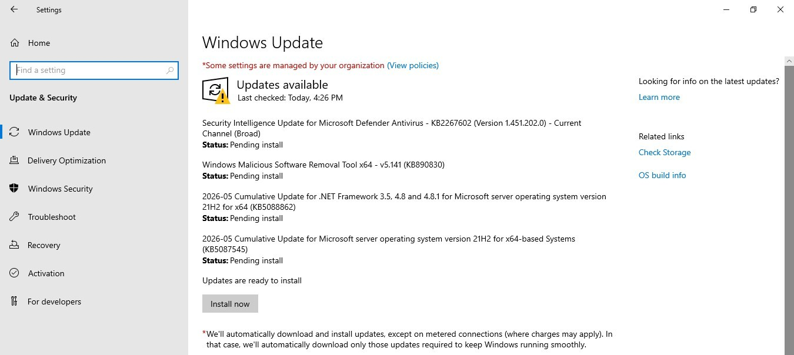

The Windows Update panel on DC01 showed four pending updates:

- Security Intelligence Update for Microsoft Defender Antivirus (KB2267602)
- Windows Malicious Software Removal Tool x64 (KB890830)
- 2026-05 Cumulative Update for .NET Framework 3.5, 4.8 and 4.8.1 (KB5088862)
- 2026-05 Cumulative Update for Microsoft server operating system version 21H2 (KB5087545)

All updates were installed and the VM was rebooted as required. The final patched build was documented:

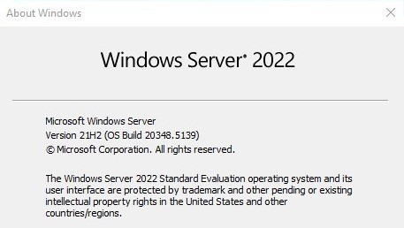

DC01 post-update baseline:

| Field | Value |
|---|---|
| OS | Windows Server 2022 Standard Evaluation |
| Version | 21H2 |
| OS Build | 20348.5139 |

**WIN11-CLIENT01 updates:**

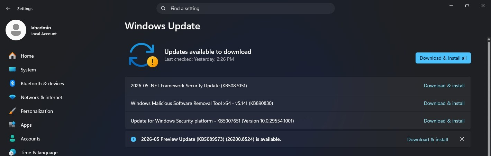

The Windows Update panel on WIN11-CLIENT01 showed four pending updates:

- 2026-05 .NET Framework Security Update (KB5087051)
- Windows Malicious Software Removal Tool x64 (KB890830)
- Update for Windows Security platform (KB5007651)
- 2026-05 Preview Update (KB5089573, Build 26200.8524)

All updates were installed and the VM rebooted as required. The final patched build was documented:

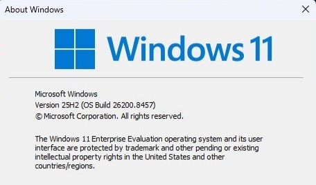

WIN11-CLIENT01 post-update baseline:

| Field | Value |
|---|---|
| OS | Windows 11 Enterprise Evaluation |
| Version | 25H2 |
| OS Build | 26200.8457 |

Patching before role installation is important because:

- patching after AD promotion introduces additional complexity and risk
- some role installations require a fully patched base OS
- establishing a known-good patched baseline improves reproducibility

---

### Step Six - Enable and Validate RDP

Remote Desktop was enabled on DC01 to establish the remote administration workflow used for all future enterprise lab sessions.

RDP was enabled through the System Properties dialog accessed via Server Manager → Local Server → Remote Desktop:

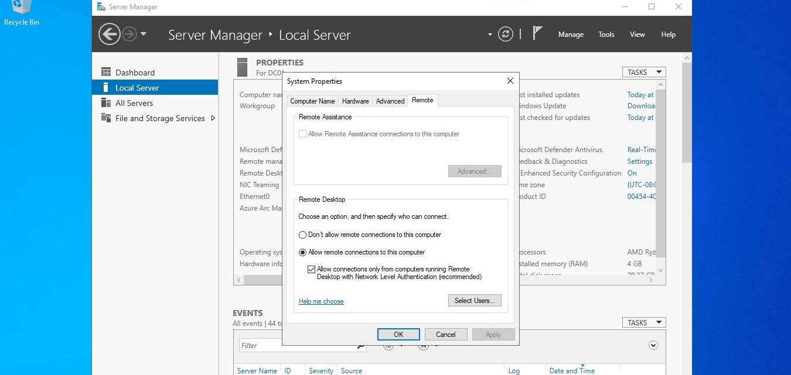

The System Properties dialog was configured with:

- Remote Desktop: Allow remote connections to this computer
- Network Level Authentication: Allow connections only from computers running Remote Desktop with NLA (recommended)

Before enabling RDP, the Server Manager Local Server panel was captured to document the starting state:

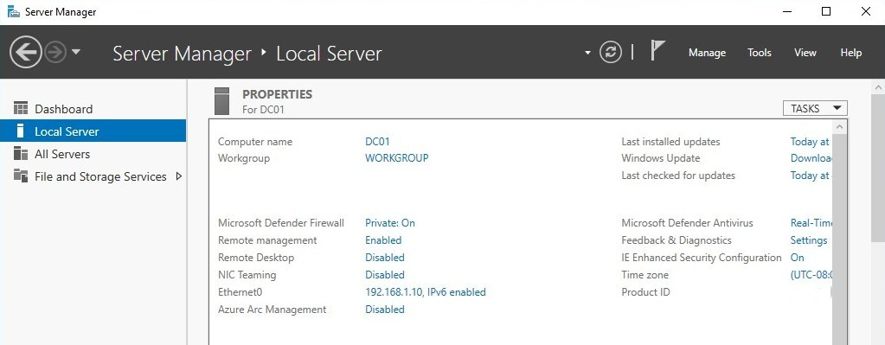

The panel shows Remote Desktop as Disabled at this stage, alongside the confirmed static IP `192.168.1.10` and computer name `DC01`, documenting the pre-RDP configuration state before the System Properties change was applied.

An initial RDP session was then validated from the Windows 11 workstation using the built-in Remote Desktop client:

```text
mstsc /v:192.168.1.10
```

The session connected successfully, and the Server Manager Local Server panel inside the RDP session confirmed the post-configuration state:

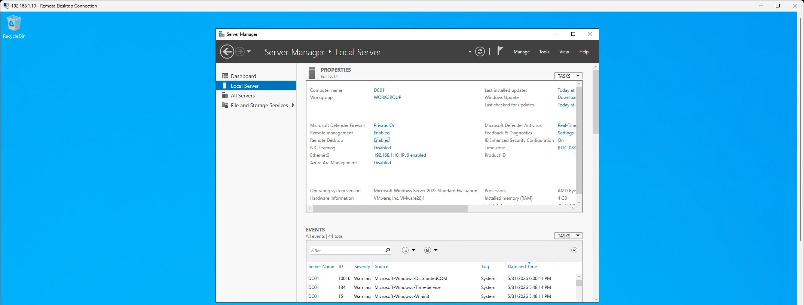

The RDP session title bar shows `192.168.1.10 - Remote Desktop Connection`, confirming the remote connection was established. The Server Manager panel inside the session shows:

- Computer name: `DC01`
- Remote Desktop: **Enabled**
- Ethernet0: `192.168.1.10, IPv6 enabled`
- Microsoft Defender Firewall: Private: On
- Microsoft Defender Antivirus: Real-Time Protection: On
- Operating system: Microsoft Windows Server 2022 Standard Evaluation
- Hardware: VMware, Inc. VMware20,1
- Processors: AMD Ryzen 5 7600X3D
- Installed memory: 4 GB

A successful RDP session confirmed:

- static IP is correctly configured and routable
- bridged networking is functioning correctly
- Windows Firewall is allowing RDP traffic
- the remote administration workflow is operational

From this point forward, all DC01 administration is performed via RDP from WIN11-CLIENT01 rather than the VMware console.

---

### Step Seven - Install RSAT on WIN11-CLIENT01

Remote Server Administration Tools were installed on WIN11-CLIENT01 via PowerShell, establishing it as the dedicated enterprise admin workstation within the lab environment:

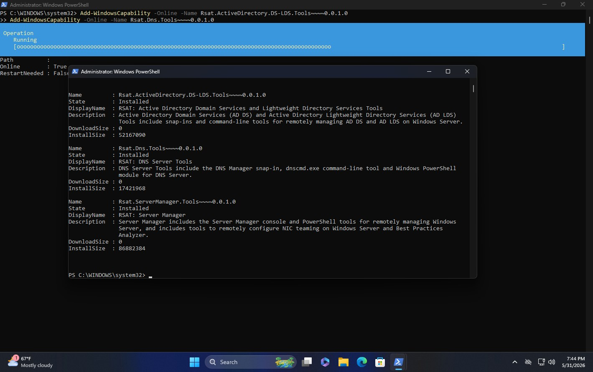

```powershell
Add-WindowsCapability -Online -Name Rsat.ActiveDirectory.DS-LDS.Tools~~~~0.0.1.0
Add-WindowsCapability -Online -Name Rsat.Dns.Tools~~~~0.0.1.0
```

The installation output confirmed all three components installed successfully:

| Component | State | Install Size |
|---|---|---|
| Rsat.ActiveDirectory.DS-LDS.Tools~~~~0.0.1.0 | Installed | ~52 MB |
| Rsat.Dns.Tools~~~~0.0.1.0 | Installed | ~17 MB |
| Rsat.ServerManager.Tools~~~~0.0.1.0 | Installed | ~87 MB |

The Server Manager RSAT component was installed automatically as a dependency alongside the Active Directory and DNS tools.

This decision keeps the entire Windows administration workflow self-contained within the virtualized enterprise environment. The physical Windows 11 host acts as the hypervisor and access device, while WIN11-CLIENT01 serves as the management workstation inside the lab boundary. This mirrors enterprise environments where a dedicated management workstation or jump box is used for server and Active Directory administration.

---

### Step Eight - Server Manager Familiarization

A baseline walkthrough of Server Manager was performed via RDP to establish familiarity with the primary Windows Server management interface.

**Dashboard overview:**

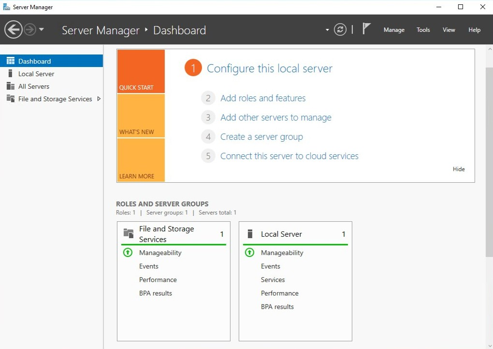

The Server Manager dashboard confirmed baseline server health with green manageability status across all role groups. The Quick Start panel listed the next suggested configuration steps, including Add roles and features, Add other servers to manage, and Create a server group. These workflows will be revisited in Lab 03.

**Local Server panel:**

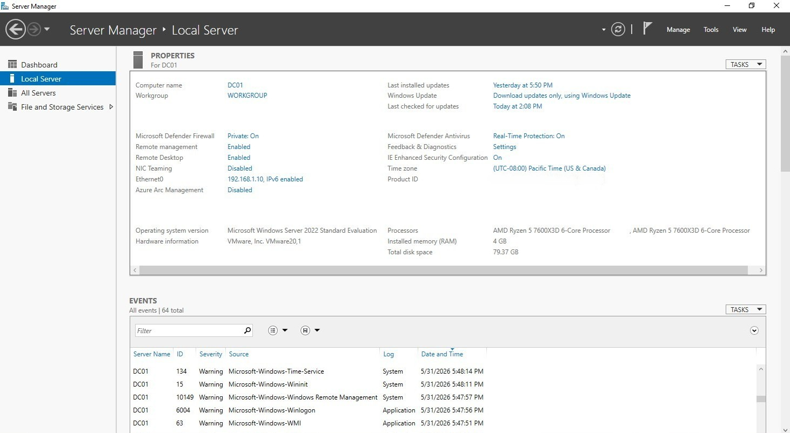

The Local Server panel provided a comprehensive single-pane view of DC01's configuration state at completion:

| Property | Value |
|---|---|
| Computer name | DC01 |
| Ethernet0 | 192.168.1.10, IPv6 enabled |
| Remote Desktop | Enabled |
| Remote management | Enabled |
| Microsoft Defender Firewall | Private: On |
| Microsoft Defender Antivirus | Real-Time Protection: On |
| IE Enhanced Security Configuration | On |
| Last installed updates | Yesterday at 5:50 PM |
| Processors | AMD Ryzen 5 7600X3D |
| Installed memory | 4 GB |
| Total disk space | 79.37 GB |

The Events panel at the bottom showed 64 total events, with recent entries consisting primarily of service startup events from the current session, consistent with a stable and freshly configured server.
**Event Viewer system log:**

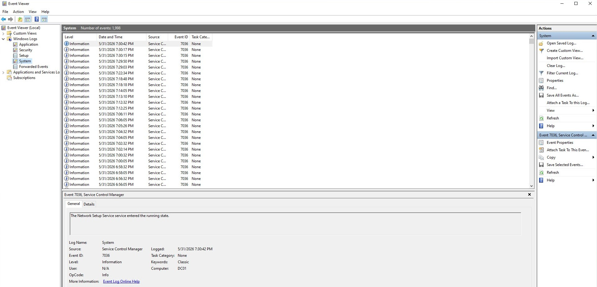

The Event Viewer System log was reviewed to establish baseline familiarity. The log showed 1,998 events, primarily Service Control Manager Event ID 7036 (service state change) informational entries associated with normal Windows Server boot and service initialization behavior. No critical errors or unexpected warning patterns were observed during the baseline review.

---

### Step Nine - Baseline Hardening

A lightweight baseline hardening pass was performed before Active Directory deployment.

**Windows Defender Firewall with Advanced Security:**

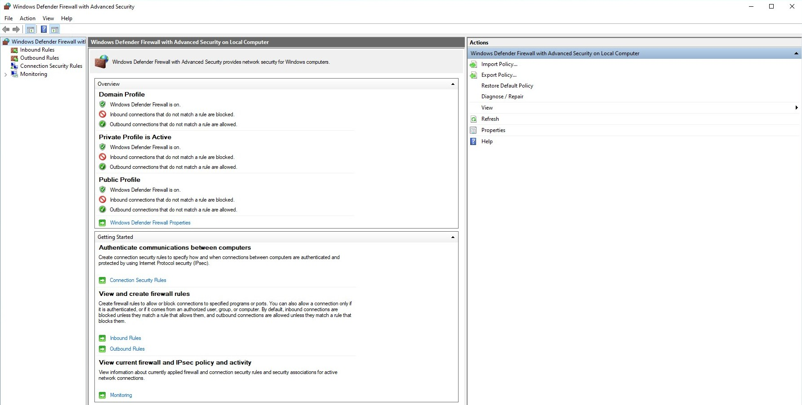

Windows Defender Firewall was confirmed active and correctly configured across all three profiles:

- Domain Profile: Firewall on, inbound blocked by default, outbound allowed
- Private Profile (Active): Firewall on, inbound blocked by default, outbound allowed
- Public Profile: Firewall on, inbound blocked by default, outbound allowed

The Private Profile was the active profile, consistent with the bridged LAN environment.

**Windows Security overview:**

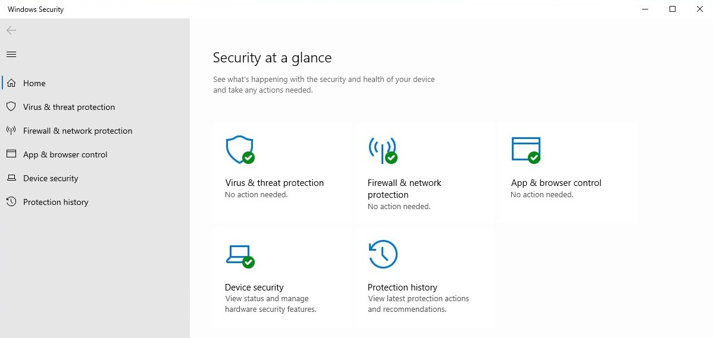

The Windows Security dashboard confirmed all protection components were active with no action required:

- Virus and threat protection: No action needed
- Firewall and network protection: No action needed
- App and browser control: No action needed
- Device security: Available for review

**Local Security Policy review:**

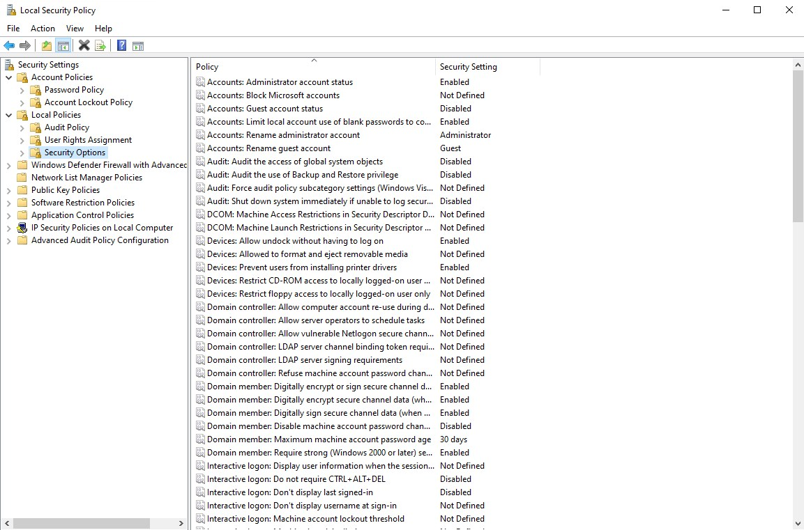

The Local Security Policy (secpol.msc) Security Options node was reviewed to establish familiarity with the pre-AD local security configuration. Key settings observed:

- Administrator account status: Enabled
- Guest account status: Disabled
- Domain member secure channel signing: Enabled
- Domain member maximum machine account password age: 30 days
- Interactive logon, don't display last signed-in: Disabled
- Interactive logon, do not require CTRL+ALT+DEL: Disabled

No changes were made to the default local security policy settings at this stage. Active Directory will later replace local policy with domain-level Group Policy Objects.

---

### Step Ten - Pre-AD Snapshots

After all configuration steps were completed and validated, snapshots were created for both VMs as rollback points for Lab 03.

**DC01 snapshot:**

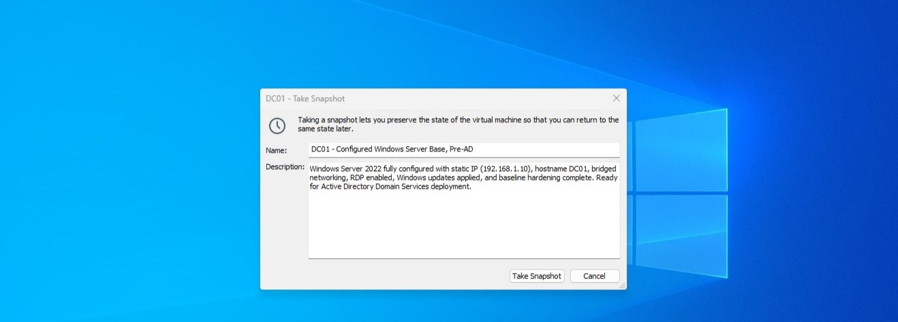

Snapshot name:

```text
DC01 - Configured Windows Server Base, Pre-AD
```

Snapshot description:

```text
Windows Server 2022 fully configured with static IP (192.168.1.10), hostname DC01, bridged networking, RDP enabled, Windows updates applied, and baseline hardening complete. Ready for Active Directory Domain Services deployment.
```

**WIN11-CLIENT01 snapshot:**

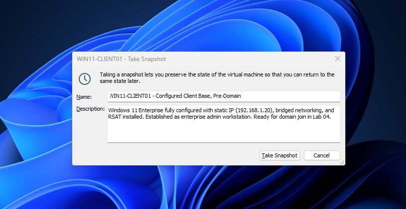

Snapshot name:

```text
WIN11-CLIENT01 - Configured Client Base, Pre-Domain
```

Snapshot description:

```text
Windows 11 Enterprise fully configured with static IP (192.168.1.20), bridged networking, and RSAT installed. Established as enterprise admin workstation. Ready for domain join in Lab 04.
```

These snapshots represent the clean starting points for both VMs before Active Directory is introduced. If Lab 03 or Lab 04 requires a rollback, either VM can be independently restored without affecting the other.

---

## Validation

Validation at completion confirmed:

- DC01 is operating on bridged networking with a stable LAN presence
- WIN11-CLIENT01 is operating on bridged networking with a stable LAN presence
- static IP `192.168.1.10` is correctly configured and routable on DC01
- static IP `192.168.1.20` is correctly configured and routable on WIN11-CLIENT01
- DC01 can reach the router gateway (`192.168.1.1`) and the Ubuntu Server host (`192.168.1.226`)
- the Windows 11 host can ping DC01 and WIN11-CLIENT01 after enabling ICMPv4 inbound firewall rules
- hostname is set to `DC01` and validated via the `hostname` command
- DC01 Windows updates applied, OS Build 20348.5139 (Version 21H2)
- WIN11-CLIENT01 Windows updates applied, OS Build 26200.8457 (Version 25H2)
- RDP is enabled on DC01 and a successful remote session was established from the Windows 11 workstation
- Server Manager Local Server panel confirms DC01 hostname, static IP, RDP enabled status, and Firewall active state
- RSAT Active Directory, DNS, and Server Manager tools are installed and confirmed on WIN11-CLIENT01
- Windows Defender Firewall active across all profiles on DC01
- Windows Defender Antivirus real-time protection active on DC01
- Local Security Policy reviewed, Guest account disabled and Administrator account enabled
- pre-AD snapshot created for DC01
- pre-domain snapshot created for WIN11-CLIENT01

---

## Troubleshooting and Adjustments

### ICMP Firewall Rules Required for Ping Validation

During Step Three, ping tests from the Windows 11 host to both DC01 and WIN11-CLIENT01 initially failed with request timeouts, even after static IPs were correctly configured and routing was confirmed working from within the VMs.

The cause was Windows Defender Firewall blocking inbound ICMPv4 echo requests by default on both Windows Server 2022 and Windows 11 Enterprise. The VMs could initiate outbound pings successfully, but external hosts could not ping them without an explicit inbound allow rule.

The rule was enabled on both systems via the same PowerShell command:

```powershell
Enable-NetFirewallRule -DisplayName "File and Printer Sharing (Echo Request - ICMPv4-In)"
```

This is expected Windows behavior and worth documenting for future reference. The rule is disabled by default intentionally as part of Windows Defender Firewall's security posture, and it was enabled specifically to support lab validation workflows.

### WIN11-CLIENT01 DNS Pre-Configured to DC01

The original lab plan called for WIN11-CLIENT01 to use temporary public DNS resolvers (`1.1.1.1` / `8.8.8.8`) matching DC01, with both systems switching to DC01 as DNS server after Active Directory promotion in Lab 03.

In practice, since DC01's static IP was assigned and validated before configuring WIN11-CLIENT01, the preferred DNS on WIN11-CLIENT01 was set directly to `192.168.1.10` at assignment time. This skipped the temporary public resolver phase for the client and established the correct DNS dependency relationship in advance. DC01 itself continues using public resolvers temporarily until it is promoted and begins hosting AD-integrated DNS in Lab 03.

### Server Manager Captured in Pre-RDP State

Image 23 (`dc01-pre-rdp-configuration`) was captured from the Server Manager Local Server panel while Remote Desktop was still shown as Disabled. This reflects the state immediately before enabling RDP through System Properties, not after. The successful post-enable state is documented in image 24 through the active RDP session, where the Server Manager panel inside the session shows Remote Desktop as Enabled.

---

## Security Considerations

### Bridged Networking Exposure

Transitioning DC01 to bridged networking places it directly on the local LAN. While necessary for Active Directory functionality, this means DC01's services are reachable from other LAN devices.

This is acceptable in a home lab context given:

- the LAN is a trusted private network
- Windows Defender Firewall remained active and restricts inbound traffic
- no public internet-facing exposure was introduced
- the VM can be powered off or reverted to snapshot at any time

### ICMP Enabled for Lab Validation

The ICMPv4 inbound firewall rule was enabled on both VMs to support ping-based connectivity validation. This is a deliberate relaxation of the default Windows Firewall posture and is appropriate for a lab environment on a trusted LAN.

In a production environment, ICMP enablement would be scoped to specific source subnets or managed via Group Policy rather than enabled globally.

### RDP Access

RDP was enabled specifically for LAN-local administration from the management workstation. The Windows Firewall rules for RDP restrict access to the local subnet. RDP is not exposed externally. Tailscale provides remote access to the management workstation, from which RDP sessions can be initiated if needed.

### Local Administrator Account

The local Administrator account initialized during Windows Server installation is used for all administration until Active Directory is deployed and domain-based authentication is available.

---

## Outcome

At completion of this lab, DC01 is a fully configured, remotely administrable Windows Server environment with a stable LAN presence and a clean pre-AD baseline snapshot. WIN11-CLIENT01 is established as the dedicated enterprise admin workstation with RSAT tooling installed and validated.

The environment is prepared for:

- Active Directory Domain Services deployment
- AD-integrated DNS configuration
- domain join workflows for WIN11-CLIENT01
- Group Policy management
- hybrid integration with the Ubuntu Server host

All Windows Server and Active Directory administration in subsequent labs will be performed from WIN11-CLIENT01 via RDP and RSAT, keeping the management plane fully contained within the virtualized enterprise environment.

---

## Lessons Learned

### Windows Firewall Blocks ICMP by Default

Both DC01 and WIN11-CLIENT01 blocked inbound ICMP echo requests by default after bridged networking was configured. The VMs initially appeared unreachable from the host even though routing was functioning correctly. DC01 could successfully ping the router gateway and Ubuntu Server host, but the Windows 11 host could not ping DC01.

The ICMPv4 inbound firewall rule needed to be explicitly enabled on each VM before host-initiated ping validation would succeed. This behavior is expected on both Windows Server 2022 and Windows 11 Enterprise, but it introduced a troubleshooting step that was not anticipated in the original deployment plan.

Going forward, enabling the ICMPv4 inbound firewall rule should be treated as a standard post-deployment validation step for any VM expected to participate in LAN reachability testing.

### IP Availability Should Be Verified Before Assignment

Pinging the planned address from inside DC01 before assigning it as a static IP served as a useful pre-assignment validation step. The router returned "Destination host unreachable" responses, confirming the address was not currently in use. This provided a lightweight and reliable method for avoiding potential IP conflicts in a home LAN environment without centralized DHCP reservation management.

### DNS Dependency Sequencing Can Be Established Early

By configuring WIN11-CLIENT01's DNS to point at DC01 (`192.168.1.10`) at static IP assignment time rather than using temporary public resolvers, the correct long-term DNS dependency was established without needing a follow-up configuration step after Lab 03. Since DC01's IP was already confirmed before WIN11-CLIENT01 was configured, the sequencing made this natural. When managing multi-system IP and DNS configuration, doing it in dependency order (servers first, clients second) simplifies the overall workflow.

### Server Manager Is a Dense Information Surface

The Local Server panel in Server Manager surfaces a comprehensive operational summary in a single view, including hostname, IP configuration, RDP state, firewall status, Defender status, update history, hardware information, and event counts. Spending time with this panel before Active Directory deployment established useful operational familiarity. It also served as an effective final validation surface by confirming multiple configuration outcomes in one location rather than requiring separate individual checks.

### Snapshot Descriptions Are Worth Taking Seriously

The snapshot descriptions created for both VMs at the end of this lab precisely document the captured configuration state, including static IP configuration, hostname, networking mode, RDP status, update status, and intended role within the lab sequence. This level of specificity makes the snapshots operationally useful rather than treating them as generic recovery points. A snapshot labeled "Configured Windows Server Base, Pre-AD" with a detailed description is significantly easier to identify and restore during troubleshooting than an ambiguous timestamp-based snapshot name.

### Pre-Patching Before Role Installation Avoids Downstream Complexity

Running Windows updates to completion on both VMs before installing any server roles kept the baseline clean and predictable. Attempting to patch after Active Directory is promoted introduces complications: the server must remain available, replication state must be considered, and certain updates require additional steps in a domain context. Establishing a fully patched baseline before Lab 03 eliminates an entire class of potential complications.