# 03 - Active Directory Lab

## Status

Completed

---

## Overview

This lab deployed Active Directory Domain Services on DC01, establishing the enterprise identity foundation for the CORP environment. It was the most architecturally significant step in the enterprise infrastructure track: the transition from a collection of independently configured Windows systems into a centrally managed domain.

The lab picked up from the pre-AD snapshot created at the end of Lab 02, where DC01 was a fully configured Windows Server host with a static LAN presence, RDP enabled, and Windows updates applied.

The deployment covered:

- installing the Active Directory Domain Services role on DC01
- promoting DC01 to domain controller and establishing the `corp.home.arpa` domain
- configuring AD-integrated DNS to replace the temporary public resolvers
- reconfiguring DC01's DNS to point to itself after promotion
- creating the foundational Organizational Unit structure
- creating domain user and group accounts
- validating domain controller health and DNS resolution
- confirming WIN11-CLIENT01 can locate the domain and its services via DNS
- creating post-promotion snapshots for both VMs as rollback points for Lab 04

Active Directory is the core identity infrastructure that all subsequent enterprise labs depend on. Group Policy, domain join workflows, centralized authentication, Linux AD integration, and security monitoring pipelines all require a functional AD domain as a prerequisite.

---

## Objectives

- install the Active Directory Domain Services role on DC01
- promote DC01 to domain controller for the `corp.home.arpa` domain
- configure AD-integrated DNS on DC01
- reconfigure DC01's DNS to point to itself (`192.168.1.10`) immediately after promotion
- create a foundational Organizational Unit structure
- create domain user accounts and security groups
- validate domain controller health using built-in diagnostic tools
- validate AD-integrated DNS resolution from WIN11-CLIENT01
- confirm WIN11-CLIENT01 can resolve the domain and locate domain controller services
- create post-promotion snapshots for both DC01 and WIN11-CLIENT01

All objectives were completed successfully.

---

## Project Context

Labs 01 and 02 established the virtualization foundation and configured both VMs as standalone Windows systems with LAN presence and remote administration capability. That work was deliberately scoped to infrastructure preparation rather than identity deployment. The goal was to bring both systems to a stable, validated, fully patched baseline before introducing any server roles.

Active Directory changed that calculus significantly. Once AD was deployed, DC01 was no longer just a Windows Server. It became the authoritative identity store, DNS server, Kerberos Key Distribution Center, and domain replication endpoint for the entire enterprise environment. Configuration decisions made during promotion are difficult or impossible to cleanly reverse without either a full demotion and re-promotion cycle or a snapshot rollback. This is why the snapshot discipline established in earlier labs mattered so much at this stage.

The domain name `corp.home.arpa` was chosen deliberately. The `home.arpa` zone is reserved for home network use under RFC 8375, making it the standards-aligned choice for private home lab namespacing. The `corp.` subdomain prefix clearly distinguishes this as an Active Directory domain rather than a general-purpose home network zone. This scoping keeps the AD domain functionally separate from the broader home LAN. DC01 serves as the authoritative DNS server for `corp.home.arpa` and its subzones, but does not act as the general upstream resolver for the home network.

One of the most important post-promotion steps, and one the wizard does not handle automatically, is updating DC01's network adapter to use itself as the DNS server. After promotion, DC01 must point to `192.168.1.10` for DNS. This is a hard requirement: domain controllers use DNS for service record registration, Kerberos realm lookup, LDAP locator queries, and replication. A domain controller still pointing at a public resolver after promotion cannot correctly locate its own services and will produce misleading diagnostic output. I treated this as the very first action taken after the post-promotion reboot.

WIN11-CLIENT01 was already pre-configured in Lab 02 to point at DC01 (`192.168.1.10`) as its primary DNS server in anticipation of this deployment. Once DC01 was promoted and hosting AD-integrated DNS, WIN11-CLIENT01 automatically began resolving AD service records without any DNS reconfiguration needed on the client side.

The Organizational Unit structure created in this lab is intentionally minimal. The goal was to establish a clean, logical identity hierarchy that Group Policy can target in Lab 05, not to design a production-scale OU tree in a single step. The structure will evolve as subsequent labs introduce Group Policy Objects, additional user accounts, and domain-joined endpoints.

---

## Technologies Used

- Active Directory Domain Services (AD DS)
- AD-Integrated DNS
- Kerberos Authentication Protocol
- LDAP (Lightweight Directory Access Protocol)
- Group Policy Management Console (GPMC)
- Active Directory Users and Computers (ADUC)
- Active Directory Administrative Center (ADAC)
- DNS Manager
- Windows Server Manager
- PowerShell (Server Manager and AD cmdlets)
- Remote Server Administration Tools (RSAT) on WIN11-CLIENT01
- VMware Workstation Snapshot Management
- Windows Server 2022 Standard Evaluation
- Windows 11 Enterprise Evaluation

---

## Architecture and Topology

After this lab, DC01 operates as the authoritative domain controller and DNS server for the `corp.home.arpa` domain.

```text
Windows 11 Workstation (192.168.1.x) [hypervisor and access device]
│
└── VMware Workstation
    │
    ├── DC01 (192.168.1.10) [domain controller]
    │   └── Windows Server 2022 Standard Evaluation
    │       ├── Static IP: 192.168.1.10
    │       ├── Hostname: DC01
    │       ├── Domain: corp.home.arpa
    │       ├── Roles: AD DS, DNS Server
    │       ├── DNS: 192.168.1.10 (self)
    │       ├── Kerberos KDC: active
    │       ├── LDAP: active on port 389
    │       ├── Global Catalog: active on port 3268
    │       └── AD-Integrated DNS: authoritative for corp.home.arpa
    │
    └── WIN11-CLIENT01 (192.168.1.20) [enterprise admin workstation]
        └── Windows 11 Enterprise Evaluation
            ├── Static IP: 192.168.1.20
            ├── DNS: 192.168.1.10 (DC01) [pre-configured in Lab 02]
            ├── RSAT: installed
            ├── Resolves: corp.home.arpa via DC01 DNS
            └── Ready for Lab 04 domain join

                    ↕ LAN

Ubuntu Server 26.04 LTS (192.168.1.226)
└── Future: SSSD + Kerberos AD authentication (Lab 06)
```

### DNS Architecture

```text
WIN11-CLIENT01 DNS query: corp.home.arpa
        ↓
DC01 DNS Server (192.168.1.10)
        ↓ (authoritative for corp.home.arpa)
AD-Integrated DNS Zone
        ↓ (forwarding for external names)
Public Resolver (1.1.1.1 / 8.8.8.8)
```

DC01 is authoritative for the `corp.home.arpa` zone and all subzones created during promotion, including `_msdcs.corp.home.arpa`, which holds the service locator records that clients use to discover domain controller services. External name resolution is handled through DNS forwarders pointing to public resolvers.

### Deployed Identity Architecture

```text
corp.home.arpa [domain]
│
├── Domain Controllers
│   └── DC01.corp.home.arpa
│
└── corp.home.arpa [OU structure]
    │
    ├── IT
    │   └── [IT administrator accounts]
    │
    ├── User Accounts
    │   └── [standard domain user accounts]
    │
    ├── Workstations
    │   └── [domain-joined workstations - Lab 04]
    │
    └── Groups
        └── [security groups for policy targeting]
```

---

## Prerequisites

- Lab 01 completed and validated
- Lab 02 completed and validated
- DC01 pre-AD snapshot (`DC01 - Configured Windows Server Base, Pre-AD`) available and verified
- WIN11-CLIENT01 pre-domain snapshot (`WIN11-CLIENT01 - Configured Client Base, Pre-Domain`) available and verified
- DC01 at static IP `192.168.1.10` with RDP enabled and reachable from the management workstation
- WIN11-CLIENT01 DNS already configured to `192.168.1.10` (established in Lab 02)
- RSAT installed on WIN11-CLIENT01 (established in Lab 02)
- Administrative access to VMware Workstation for snapshot management

---

## Deployment Steps

### Step One - Restore and Verify the Pre-AD Snapshot

I started by restoring DC01 to the pre-AD snapshot created at the end of Lab 02. This ensured the lab began from a known-good, fully validated baseline and eliminated any accidental configuration drift that may have occurred since Lab 02.

I restored the snapshot via VMware Workstation's snapshot menu using the revert-to-snapshot workflow.

<p align="center">
  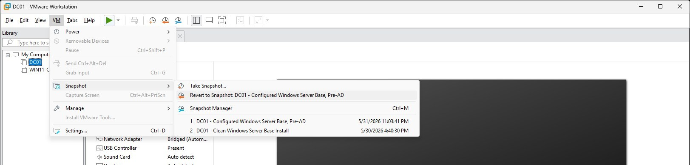
</p>

<p align="center">
  <em>Restoring DC01 to the pre-AD snapshot before beginning Active Directory deployment.</em>
</p>

After restoring, I booted DC01 and verified it was in the expected pre-configuration state:

- hostname: `DC01`
- static IP: `192.168.1.10`
- RDP: enabled
- Windows updates: applied
- Server Manager: opening on first boot

The timezone had not been set during Lab 02, so I corrected it before proceeding. I opened Server Manager, clicked the time display in the taskbar, and set the correct local timezone. This needed to be in place before NTP was configured in Step Five.

Once the baseline state was confirmed, I powered on WIN11-CLIENT01 before continuing.

---

### Step Two - Install the Active Directory Domain Services Role

All administration from this point forward was performed via RDP from WIN11-CLIENT01. I opened an RDP session to `192.168.1.10` before continuing.

I installed the AD DS role through Server Manager > Add Roles and Features > Role-based or feature-based installation.

I selected the following role on the Server Roles page:

- Active Directory Domain Services

The wizard automatically prompted to include required features. I accepted all dependencies when prompted, which included:

- DNS Server
- Group Policy Management
- Remote Server Administration Tools for AD DS

<p align="center">
  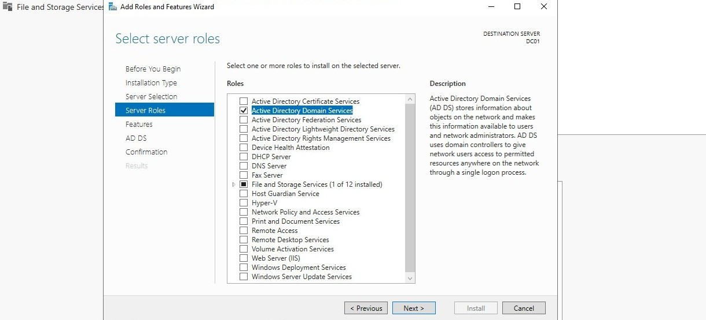
</p>

<p align="center">
  <em>Selecting the Active Directory Domain Services role for installation.</em>
</p>

<p align="center">
  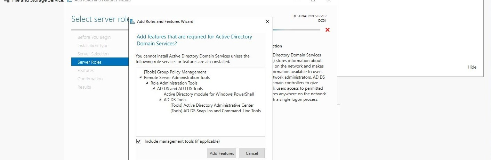
</p>

<p align="center">
  <em>Additional features required by AD DS, including Group Policy Management and RSAT tools.</em>
</p>

<p align="center">
  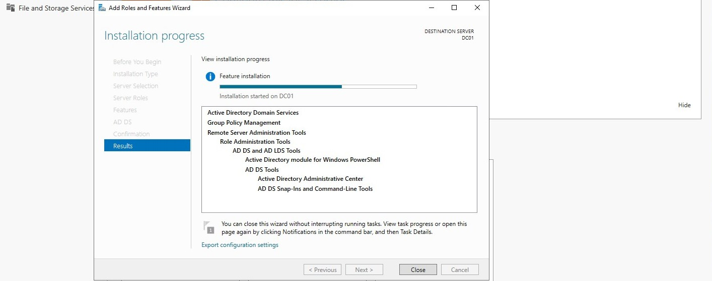
</p>

<p align="center">
  <em>Active Directory Domain Services role installation in progress.</em>
</p>

<p align="center">
  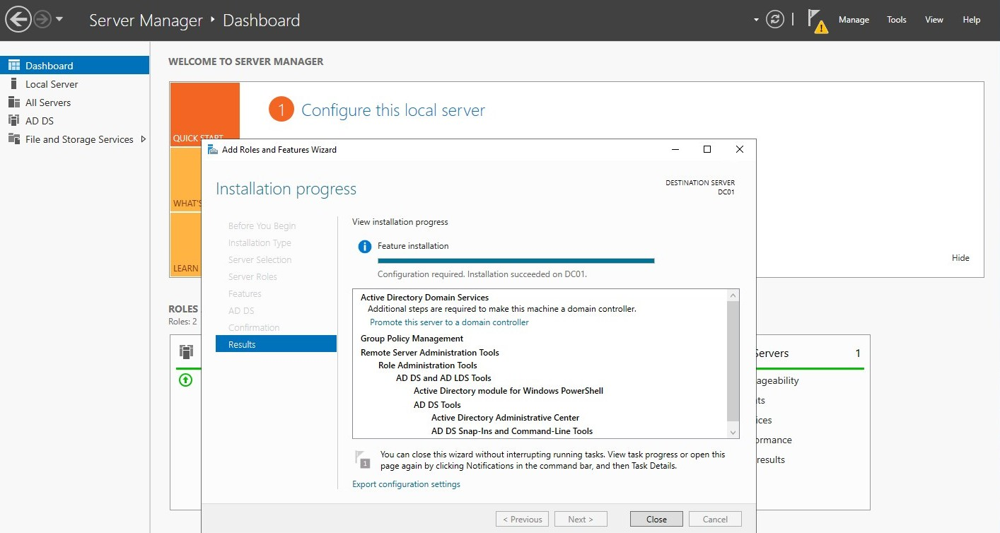
</p>

<p align="center">
  <em>Role installation complete. The post-deployment configuration notification is visible in Server Manager.</em>
</p>

Installing the AD DS role added the binaries and management tools to the server but did not yet configure it as a domain controller. That transition happened during promotion in the next step.

---

### Step Three - Promote DC01 to Domain Controller

Once role installation was complete, a yellow notification flag appeared in the Server Manager toolbar. I clicked it and selected **Promote this server to a domain controller** to launch the Active Directory Domain Services Configuration Wizard.

**Deployment configuration:**

I selected **Add a new forest** and set the root domain name to `corp.home.arpa`.

<p align="center">
  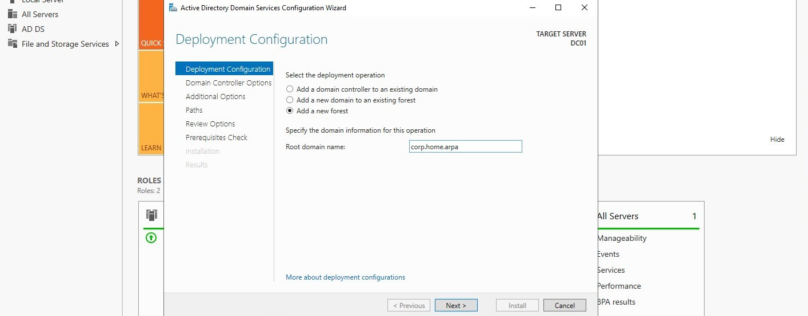
</p>

<p align="center">
  <em>Configuring the new forest with root domain name corp.home.arpa.</em>
</p>

**Domain controller options:**

I configured the following on the Domain Controller Options page:

| Setting | Value |
|---|---|
| Forest functional level | Windows Server 2016 |
| Domain functional level | Windows Server 2016 |
| Domain Name System (DNS) server | Enabled |
| Global Catalog (GC) | Enabled |
| Directory Services Restore Mode (DSRM) password | Set and recorded securely |

<p align="center">
  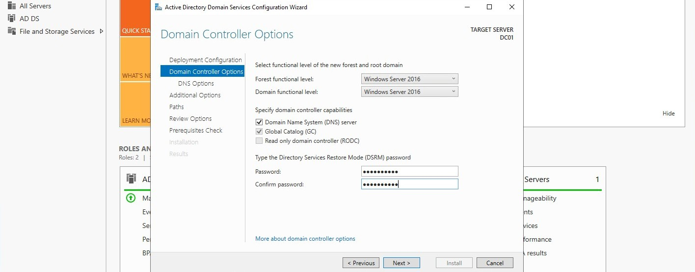
</p>

<p align="center">
  <em>Domain controller options including functional levels, DNS server role, and DSRM password.</em>
</p>

I set the forest and domain functional levels to Windows Server 2016. This is the highest level supported across the planned VM inventory and enables the full modern Active Directory feature set without creating compatibility constraints for future lab expansion.

The DSRM password was set and stored somewhere secure and separate from domain credentials. This password is used to log into the domain controller in Directory Services Restore Mode during AD recovery scenarios. It is completely independent of the domain Administrator account, and losing it reduces recovery options significantly.

**DNS delegation:**

The DNS Options page contained a **Create DNS delegation** checkbox. The wizard did not display a warning banner alongside it in this environment; the checkbox was simply pre-checked with no accompanying message.

Either way, the action was the same: I unchecked **Create DNS delegation** and continued. There is no parent `home.arpa` zone managed locally, so the delegation cannot be created and is not needed. DC01 is the authoritative DNS server for `corp.home.arpa` without any parent zone delegation.

<p align="center">
  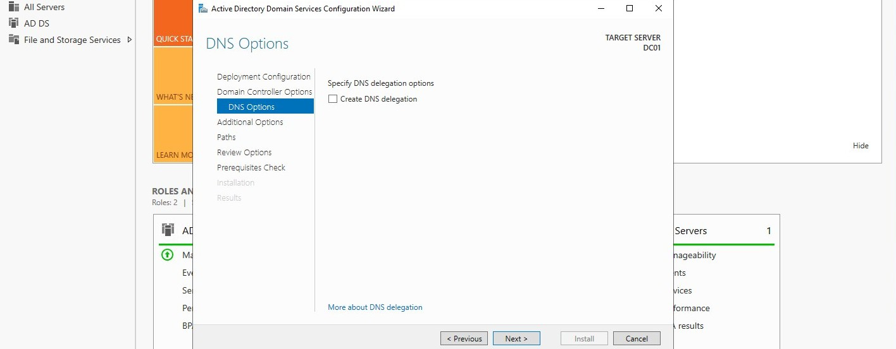
</p>

<p align="center">
  <em>DNS delegation unchecked. The parent zone is not locally managed.</em>
</p>

**NetBIOS name:**

The NetBIOS domain name was automatically derived from the domain name. I verified it read `CORP` and left it unchanged.

<p align="center">
  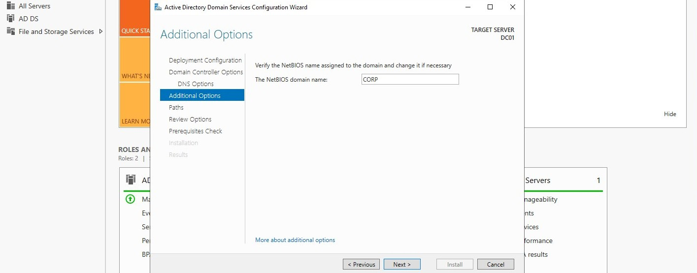
</p>

<p align="center">
  <em>NetBIOS domain name automatically configured as CORP.</em>
</p>

**Paths:**

I retained the default paths for the AD database, log files, and SYSVOL. There was no reason to deviate from defaults in a single-server lab environment.

| Path | Default Location |
|---|---|
| Database folder | `C:\Windows\NTDS` |
| Log files folder | `C:\Windows\NTDS` |
| SYSVOL folder | `C:\Windows\SYSVOL` |

<p align="center">
  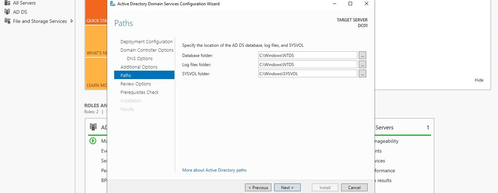
</p>

<p align="center">
  <em>Default AD database, log file, and SYSVOL paths retained.</em>
</p>

**Prerequisites check:**

Before allowing promotion to proceed, the wizard ran a prerequisites check. All critical tests passed. There were informational warnings about DNS delegation and cryptography policy, both of which were expected and did not affect functionality.

<p align="center">
  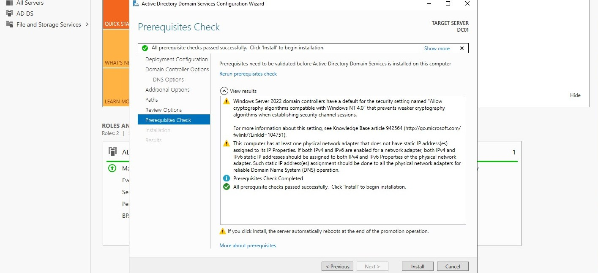
</p>

<p align="center">
  <em>Prerequisites check passed. Informational warnings acknowledged.</em>
</p>

I clicked **Install**. DC01 promoted itself and rebooted automatically. After the reboot, the login screen reflected the `CORP` domain context.

<p align="center">
  
</p>

<p align="center">
  <em>DC01 login screen after promotion showing the CORP domain context.</em>
</p>

---

### Step Four - Update DC01 DNS to Point to Itself

Immediately after the post-promotion reboot, before doing anything else, I updated DC01's network adapter DNS configuration to point to itself. The promotion wizard does not do this automatically.

I ran the following from an elevated PowerShell session on DC01:

```powershell
Set-DnsClientServerAddress -InterfaceAlias "Ethernet0" -ServerAddresses ("192.168.1.10", "127.0.0.1")
```

I validated the change with `ipconfig /all`:

<p align="center">
  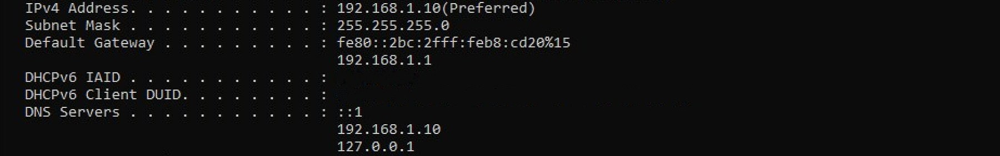
</p>

<p align="center">
  <em>DC01 DNS updated to 192.168.1.10 (self) as primary resolver after promotion.</em>
</p>

Adapter configuration after the update:

| Parameter | Value |
|---|---|
| IP Address | `192.168.1.10` |
| Subnet Mask | `255.255.255.0` |
| Default Gateway | `192.168.1.1` |
| DNS Server (Primary) | `192.168.1.10` |
| DNS Server (Secondary) | `127.0.0.1` |

The loopback address `127.0.0.1` as the secondary entry provides a DNS fallback in the event of a transient NIC configuration issue. This is a common and recommended post-promotion pattern.

---

### Step Five - Configure NTP Time Synchronization

Kerberos authentication enforces a maximum clock skew of five minutes between domain members. Clocks that drift beyond this threshold cause authentication failures that are difficult to diagnose. I configured DC01 to synchronize against an external NTP source immediately after the DNS self-referral was in place.

I ran the following from an elevated PowerShell session on DC01:

```powershell
w32tm /config /manualpeerlist:"time.cloudflare.com,0x8 time.windows.com,0x8" /syncfromflags:manual /reliable:YES /update
Restart-Service W32Time
w32tm /resync /force
```

I then validated that the time service was syncing correctly:

```powershell
w32tm /query /status
```
<p align="center">
  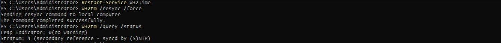
</p>

<p align="center">
  <em>NTP synchronization status showing DC01 successfully syncing with an upstream time source.</em>
</p>

The output showed a reachable NTP source with a small offset. The `Stratum` field was 4, indicating DC01 was syncing from an upstream time source. The exact stratum value depends on what the upstream NTP server is currently sourcing from and can vary.

Once domain members join in subsequent labs, they will automatically sync their clocks against DC01 via the domain hierarchy. DC01 itself syncs against an external source to anchor the entire domain's time.

This step resolved the `dcdiag` informational warning about the time service not using an authoritative external NTP source.

---

### Step Six - Validate DNS and Domain Controller Health

Before building out the OU structure or creating accounts, I validated that the domain controller was healthy and DNS was correctly configured. Finding and resolving issues at this stage is significantly easier than troubleshooting them after additional configuration has been layered on top.

**DNS zone validation:**

Using PowerShell, I verified that the Active Directory-integrated DNS zones created during domain controller promotion were present and operational.

```powershell
Get-DnsServerZone
```

The following zones were present:

| Zone                    | Type                  | Purpose                                                 |
| ----------------------- | --------------------- | ------------------------------------------------------- |
| `corp.home.arpa`        | AD-Integrated Primary | Forward lookup zone for the domain                      |
| `_msdcs.corp.home.arpa` | AD-Integrated Primary | Service locator records for domain controller discovery |
| `1.in-addr.arpa`        | Reverse Lookup Zone   | Reverse DNS resolution and PTR record registration      |

<p align="center">
  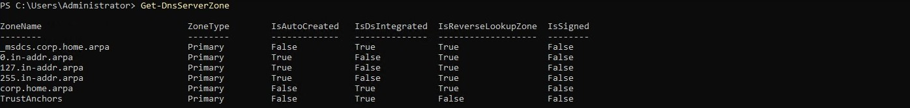
</p>

<p align="center">
  <em>PowerShell validation confirming the Active Directory DNS zones present on DC01.</em>
</p>

The `_msdcs.corp.home.arpa` zone was created automatically during domain controller promotion and contains the SRV records used by clients to locate Kerberos, LDAP, and other Active Directory services. Its presence confirmed that DNS service registration completed successfully.

The presence of the forward lookup, `_msdcs`, and reverse lookup zones confirmed that DNS was functioning correctly before proceeding with additional Active Directory configuration.

**SRV record validation:**

From WIN11-CLIENT01, I validated that the critical AD service records were resolvable:

```powershell
nslookup -type=SRV _ldap._tcp.corp.home.arpa 192.168.1.10
nslookup -type=SRV _kerberos._tcp.corp.home.arpa 192.168.1.10
```

<p align="center">
  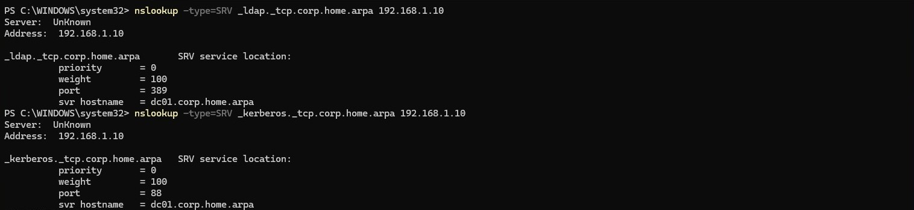
</p>

<p align="center">
  <em>SRV record validation confirming LDAP and Kerberos service records are registered and resolvable from WIN11-CLIENT01.</em>
</p>

Both queries returned DC01 as the service host, confirming that the domain controller registered its services correctly and that WIN11-CLIENT01 could locate them.

**dcdiag validation:**

I ran `dcdiag` on DC01 to perform a comprehensive domain controller health check:

```powershell
dcdiag /v
```

<p align="center">
  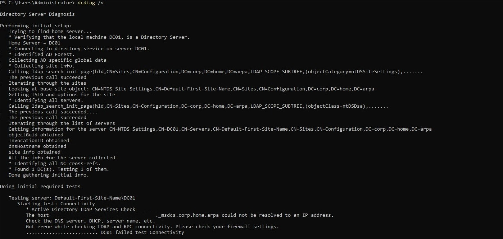
</p>

<p align="center">
  <em>dcdiag validation showing successful Active Directory initialization and the observed Connectivity warning involving GUID-based `_msdcs` resolution.</em>
</p>

The majority of Active Directory health checks completed successfully. During validation, dcdiag reported a Connectivity warning indicating that a GUID-based _msdcs hostname could not be resolved. Despite this result, DNS, SYSVOL, NETLOGON, Kerberos authentication, domain controller advertising, and client-side name resolution all validated successfully. Additional investigation is documented in the Potential Issues section.

**Netlogon and SYSVOL share validation:**

I confirmed the Netlogon service was running and the SYSVOL and NETLOGON shares were accessible:

```powershell
Get-Service Netlogon
Test-Path \\DC01\SYSVOL
Test-Path \\DC01\NETLOGON
```

<p align="center">
  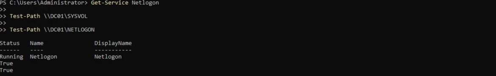
</p>

<p align="center">
  <em>Netlogon service running and SYSVOL and NETLOGON shares accessible.</em>
</p>

---

### Step Seven - Configure DNS Forwarders

I verified that DNS forwarders were configured on DC01 to allow resolution of names outside `corp.home.arpa`. Forwarders were already present in the environment and pointed to public recursive DNS services.

| Forwarder | Purpose               |
| --------- | --------------------- |
| `1.1.1.1` | Cloudflare public DNS |
| `8.8.8.8` | Google public DNS     |

<p align="center">
  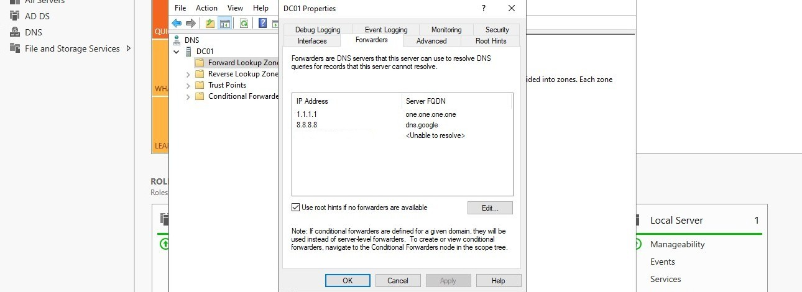
</p>

<p align="center">
  <em>Existing DNS forwarders configured on DC01 for external name resolution. A third forwarder entry was present but has been removed from the screenshot as it contained a private network address specific to this environment.</em>
</p>

To confirm that external DNS resolution was functioning correctly through the domain controller, I performed a resolution test from WIN11-CLIENT01:

```powershell
Resolve-DnsName google.com -Server 192.168.1.10
```

<p align="center">
  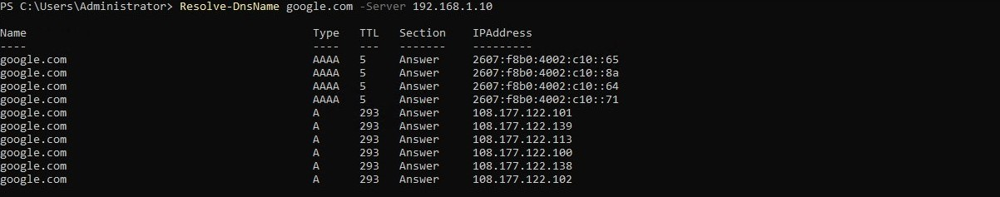
</p>

<p align="center">
  <em>External DNS resolution through DC01 confirmed operational.</em>
</p>

Successful resolution of external hostnames confirmed that DNS forwarding was functioning correctly and that domain clients would be able to resolve both internal and external resources.

---

### Step Eight - Build the Organizational Unit Structure

I created the foundational OU structure in Active Directory Users and Computers on DC01 while connected through an RDP session from WIN11-CLIENT01.

The OU structure was designed to:

- organize identity objects by operational role
- provide clean Group Policy targeting surfaces for Lab 05
- reflect the separation between administrative and standard user accounts
- mirror the logical organization of the planned enterprise environment

I created the following OUs directly under the `corp.home.arpa` domain root:

| OU | Purpose |
|---|---|
| `IT` | IT administrator and privileged user accounts |
| `User Accounts` | Standard domain user accounts |
| `Workstations` | Domain-joined workstations (populated in Lab 04) |
| `Groups` | Security groups for policy targeting and access control |

Note: ADUC will refuse to create OUs named `Users` or `Computers` at the domain root because default system containers with those exact names already exist there (`CN=Users` and `CN=Computers`). These containers are not OUs and cannot be deleted or renamed. The names above avoid that conflict while remaining descriptive.

<p align="center">
  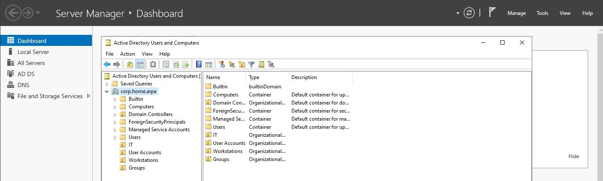
</p>

<p align="center">
  <em>Organizational Unit structure created under the corp.home.arpa domain root.</em>
</p>

I created the OUs directly under the domain root, not inside the default `CN=Users` or `CN=Computers` containers. The default containers are not OU objects and cannot be directly linked to Group Policy Objects. Creating a parallel OU structure from the start avoids having to migrate objects later and establishes clean GPO targeting surfaces before Lab 05.

The `Domain Controllers` OU was left unmodified. It is managed by Active Directory itself.

PowerShell equivalent for reproducibility:

```powershell
$domain = "DC=corp,DC=home,DC=arpa"
New-ADOrganizationalUnit -Name "IT"           -Path $domain
New-ADOrganizationalUnit -Name "User Accounts" -Path $domain
New-ADOrganizationalUnit -Name "Workstations"  -Path $domain
New-ADOrganizationalUnit -Name "Groups"        -Path $domain
```

**Redirect the default containers to the new OUs:**

Once the OUs existed, I redirected the default `CN=Users` and `CN=Computers` containers so that newly created objects would land in the correct OUs automatically. This needed to happen before Lab 04's domain join. Without it, WIN11-CLIENT01 would drop into `CN=Computers` during the join and would not be targeted by computer-scoped GPOs in Lab 05.

I ran the following from an elevated command prompt (not PowerShell) on DC01:

```cmd
redirusr "OU=User Accounts,DC=corp,DC=home,DC=arpa"
redircmp "OU=Workstations,DC=corp,DC=home,DC=arpa"
```

I validated the redirects took effect:

```powershell
(Get-ADDomain).UsersContainer
(Get-ADDomain).ComputersContainer
```

Expected output:

```text
OU=User Accounts,DC=corp,DC=home,DC=arpa
OU=Workstations,DC=corp,DC=home,DC=arpa
```

The default `CN=Users` and `CN=Computers` containers still exist and cannot be removed, but nothing will land in them automatically once the redirects are in place.

---

### Step Nine - Create Domain User and Group Accounts

I created the initial domain user accounts and security groups to populate the OU structure and establish the identity objects needed for Group Policy targeting and domain join testing in subsequent labs.

**User accounts:**

I created the following accounts in Active Directory Users and Computers, placing each in the appropriate OU:

| Account      | OU              | Role                                                    |
| ------------ | --------------- | ------------------------------------------------------- |
| `labadmin`   | `IT`            | Domain administrator account for lab management         |
| `testuser01` | `User Accounts` | Standard domain user for domain join and policy testing |

After creating `labadmin`, I added it to both `Domain Admins` and `IT-Admins`. The `Domain Admins` membership grants built-in administrative rights across the domain. The `IT-Admins` group membership is what Group Policy in Lab 05 will use for policy targeting, so both are required. This account will be used for domain administration in subsequent labs rather than the built-in `Administrator` account, which I retained as a recovery credential only.

`testuser01` was created as a standard user with no elevated privileges. It will be used to test domain authentication, Group Policy application, and standard user desktop behavior after WIN11-CLIENT01 is domain-joined in Lab 04.

<p align="center">
  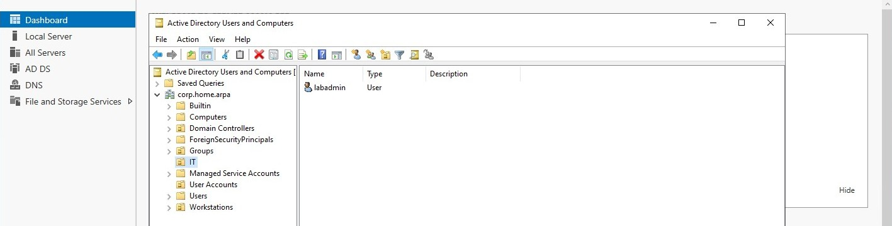
</p>

<p align="center">
  <em>labadmin created in the IT Organizational Unit for domain administration tasks.</em>
</p>

<p align="center">
  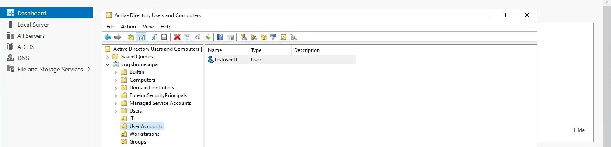
</p>

<p align="center">
  <em>testuser01 created in the User Accounts Organizational Unit for standard user testing and policy validation.</em>
</p>

PowerShell equivalent for user creation only (run before the security groups exist):

```powershell
New-ADUser -Name "labadmin" `
           -SamAccountName "labadmin" `
           -UserPrincipalName "labadmin@corp.home.arpa" `
           -Path "OU=IT,DC=corp,DC=home,DC=arpa" `
           -AccountPassword (ConvertTo-SecureString "<SECURE_PASSWORD>" -AsPlainText -Force) `
           -Enabled $true

New-ADUser -Name "testuser01" `
           -SamAccountName "testuser01" `
           -UserPrincipalName "testuser01@corp.home.arpa" `
           -Path "OU=User Accounts,DC=corp,DC=home,DC=arpa" `
           -AccountPassword (ConvertTo-SecureString "<SECURE_PASSWORD>" -AsPlainText -Force) `
           -Enabled $true

Add-ADGroupMember -Identity "Domain Admins" -Members "labadmin"
```


**Security groups:**

I created the following security groups in the `Groups` OU:

| Group | Type | Scope | Purpose |
|---|---|---|---|
| `IT-Admins` | Security | Global | IT administrator accounts for GPO targeting |
| `Domain-Users-Standard` | Security | Global | Standard user accounts for GPO targeting |
| `Lab-Workstations` | Security | Global | Domain-joined workstations for computer policy targeting |

I added `labadmin` to `IT-Admins` and `testuser01` to `Domain-Users-Standard`. These group memberships will be used to scope Group Policy Objects in Lab 05.

PowerShell equivalent for group creation:

```powershell
$groupsOU = "OU=Groups,DC=corp,DC=home,DC=arpa"
New-ADGroup -Name "IT-Admins"             -GroupScope Global -GroupCategory Security -Path $groupsOU
New-ADGroup -Name "Domain-Users-Standard" -GroupScope Global -GroupCategory Security -Path $groupsOU
New-ADGroup -Name "Lab-Workstations"      -GroupScope Global -GroupCategory Security -Path $groupsOU
```

PowerShell equivalent for group membership (run after the security groups are created):

```powershell
Add-ADGroupMember -Identity "IT-Admins" -Members "labadmin"
Add-ADGroupMember -Identity "Domain-Users-Standard" -Members "testuser01"
```

<p align="center">
  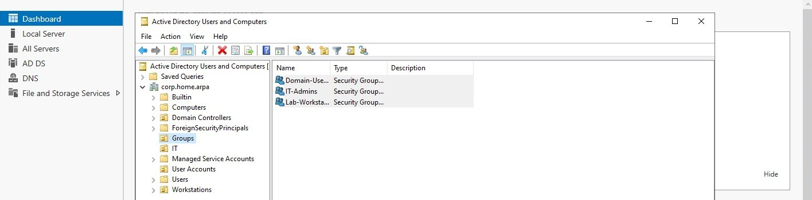
</p>

<p align="center">
  <em>Security groups created in the Groups OU for policy targeting.</em>
</p>

I validated group membership using PowerShell:

```powershell
Get-ADGroupMember "IT-Admins"
Get-ADGroupMember "Domain-Users-Standard"
```

<p align="center"> 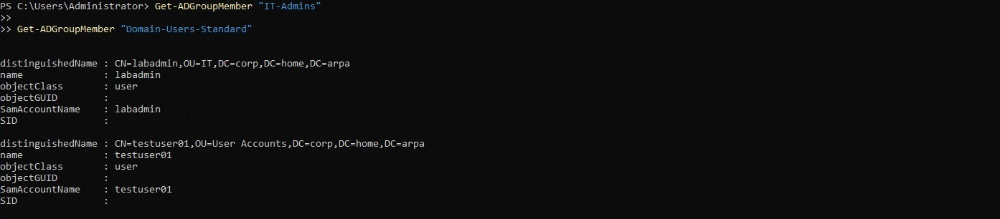 </p> <p align="center"> <em>Validation of IT-Admins and Domain-Users-Standard group memberships.</em> </p>

The output confirmed that `labadmin` was a member of `IT-Admins` and `testuser01` was a member of `Domain-Users-Standard`, validating that the initial role-based access structure was configured correctly.

---

### Step Ten - Validate Domain Controller Advertising and Kerberos

I ran a final validation pass before creating snapshots to confirm the domain controller was advertising correctly and Kerberos authentication was operational.

**Domain controller advertising:**

```powershell
nltest /dsgetdc:corp.home.arpa
```

<p align="center">
  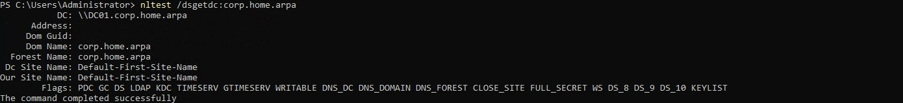
</p>

<p align="center">
  <em>nltest confirming DC01 is advertising as the domain controller for corp.home.arpa.</em>
</p>

The output showed DC01 as the located domain controller and included the following flags:

- `KDC`: Kerberos Key Distribution Center is active
- `GC`: Global Catalog is operational
- `PDC`: DC01 is advertising as the PDC Emulator

As the only domain controller in the environment, DC01 also holds all five FSMO roles. This was confirmed separately through Active Directory management tools and is the expected configuration for a single-DC deployment.

**Kerberos ticket validation:**

I logged into DC01 as `CORP\labadmin` and ran:

```powershell
klist get krbtgt
klist
```

<p align="center">
  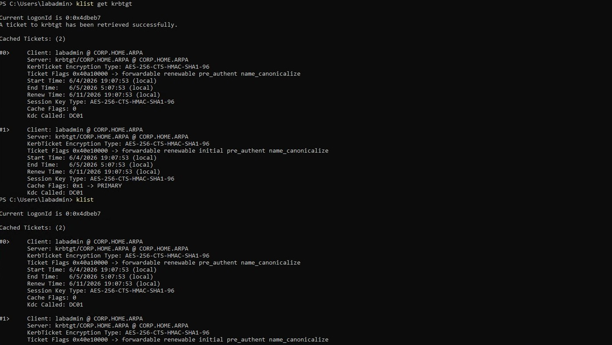
</p>

<p align="center">
  <em>Kerberos ticket cache showing a valid TGT issued by DC01 for the corp.home.arpa realm.</em>
</p>

I ran `klist get krbtgt` first to explicitly request a Ticket Granting Ticket (TGT). A fresh logon session can show an empty Kerberos cache until a ticket is requested, so running `klist` alone may not accurately reflect Kerberos functionality.

After requesting the ticket, `klist` showed a valid TGT for `labadmin@CORP.HOME.ARPA` issued by `krbtgt/CORP.HOME.ARPA@CORP.HOME.ARPA`. The ticket used AES-256 encryption and was issued by DC01, confirming that Kerberos authentication was functioning correctly and that the domain was ready for client domain join operations in Lab 04.

**LDAP signing verification:**

From an elevated PowerShell session on DC01, I confirmed the LDAP signing configuration:

```powershell
Get-ItemProperty -Path "HKLM:\System\CurrentControlSet\Services\NTDS\Parameters" `
                 -Name "LDAPServerIntegrity"
```

This check is informational. The result is interpreted as follows:

- `2`: LDAP signing is required. This is the recommended setting.
- `1`: LDAP signing is enabled but not enforced. Clients can connect without signing.
- Key absent: treat this as the platform default and verify behavior through effective security policy settings rather than registry presence alone.

<p align="center">
  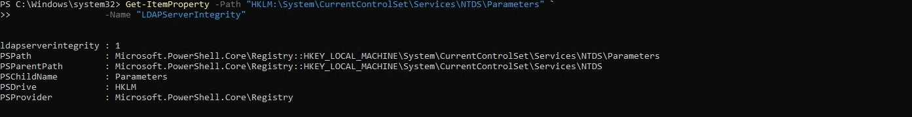
</p>

<p align="center">
<em>LDAPServerIntegrity registry value showing LDAP signing enabled on DC01.</em>
</p>

The check returned `LDAPServerIntegrity = 1`, meaning signing is enabled but not required. This was noted as acceptable for the lab baseline.

**WIN11-CLIENT01 DNS resolution validation:**

From WIN11-CLIENT01, I ran:

```powershell
Resolve-DnsName corp.home.arpa
Resolve-DnsName DC01.corp.home.arpa
Resolve-DnsName google.com
```

<p align="center">
  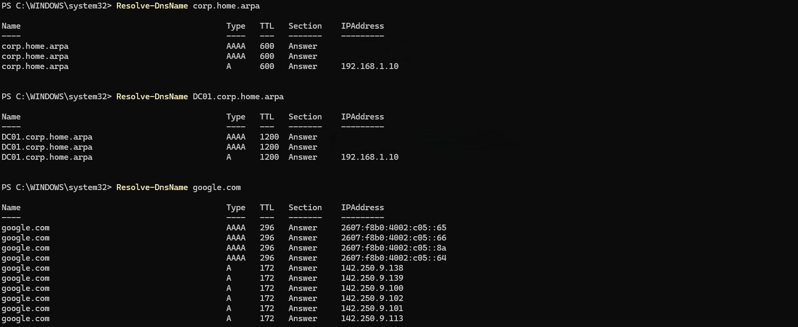
</p>

<p align="center">
  <em>DNS resolution from WIN11-CLIENT01 confirming domain, DC hostname, and external name resolution through DC01.</em>
</p>

All three queries resolved successfully:

- `corp.home.arpa` resolved to DC01 (`192.168.1.10`) and associated IPv6 records.
- `DC01.corp.home.arpa` resolved to DC01 (`192.168.1.10`) and associated IPv6 records.
- `google.com` resolved successfully through DC01 DNS forwarding.

These results confirmed that WIN11-CLIENT01 could locate the Active Directory domain, resolve the domain controller hostname, and perform external name resolution through DC01.

With internal and external DNS resolution functioning correctly, WIN11-CLIENT01 was ready for domain join operations in Lab 04.

---

### Step Eleven - Create Post-Promotion Snapshots

Once all validation steps were completed, I created snapshots for both VMs before beginning Lab 04. These snapshots are the rollback points for the domain join and client configuration work ahead.

**DC01 post-promotion snapshot:**

<p align="center">
  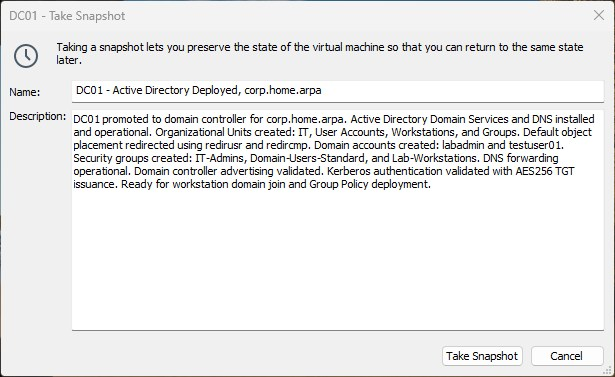
</p>

<p align="center">
  <em>DC01 post-promotion snapshot created as the rollback point for Lab 04.</em>
</p>

Snapshot name:

```text
DC01 - Active Directory Deployed, corp.home.arpa
```

Snapshot description:

```text
DC01 promoted to domain controller for corp.home.arpa. Active Directory Domain Services and DNS installed and operational. Organizational Units created: IT, User Accounts, Workstations, and Groups. Default object placement redirected using redirusr and redircmp. Domain accounts created: labadmin and testuser01. Security groups created: IT-Admins, Domain-Users-Standard, and Lab-Workstations. DNS forwarding operational. Domain controller advertising validated. Kerberos authentication validated with AES256 TGT issuance. Ready for workstation domain join and Group Policy deployment.
```

**WIN11-CLIENT01 pre-domain-join snapshot:**

<p align="center">
  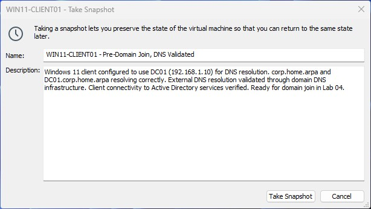
</p>

<p align="center">
  <em>WIN11-CLIENT01 snapshot created before domain join in Lab 04.</em>
</p>

Snapshot name:

```text
WIN11-CLIENT01 - Pre-Domain Join, DNS Validated
```

Snapshot description:

```text
Windows 11 client configured to use DC01 (192.168.1.10) for DNS resolution. corp.home.arpa and DC01.corp.home.arpa resolving correctly. External DNS resolution validated through domain DNS infrastructure. Client connectivity to Active Directory services verified. Ready for domain join in Lab 04.
```

---

## Validation Checklist

| Check | Expected Result |
|---|---|
| AD DS role installed on DC01 | Visible in Server Manager Roles summary |
| DC01 promoted to domain controller | Login screen shows CORP domain context |
| Forest root domain `corp.home.arpa` created | Confirmed via Active Directory and nltest validation |
| NetBIOS domain name `CORP` configured | Confirmed via `nltest` output |
| DC01 DNS updated to self-reference (`192.168.1.10`) | Confirmed via `ipconfig /all` |
| NTP configured and syncing | `w32tm /query /status` shows reachable source and low offset |
| DNS forwarders present and operational | Confirmed via DNS Manager |
| `corp.home.arpa` forward lookup zone present | Confirmed via Get-DnsServerZone |
| `_msdcs.corp.home.arpa` zone present with SRV records | Confirmed via Get-DnsServerZone |
| Reverse lookup zone present | Confirmed via Get-DnsServerZone |
| `dcdiag /v` run and reviewed | Most critical tests pass. A single Connectivity warning involving a GUID-based `_msdcs` record may appear even when DNS and AD are functional. Confirm health via SRV records, SYSVOL, NETLOGON, `nltest`, and Kerberos rather than requiring a clean `dcdiag` pass. |
| Netlogon service running | `Get-Service Netlogon` returns Running |
| SYSVOL and NETLOGON shares accessible | `Test-Path` returns True for both |
| DC01 advertising as KDC, GC, PDC | Confirmed via `nltest /dsgetdc:corp.home.arpa` |
| Kerberos TGT issued for `labadmin` | Confirmed via `klist get krbtgt` followed by `klist` |
| LDAP signing status validated | Registry value reviewed and documented (`LDAPServerIntegrity = 1`: enabled, not required) |
| OU structure created: IT, User Accounts, Workstations, Groups | Visible in ADUC |
| Default containers redirected (`CN=Users` to `OU=User Accounts`, `CN=Computers` to `OU=Workstations`) | Confirmed via `(Get-ADDomain).UsersContainer` and `.ComputersContainer` |
| Domain accounts created: `labadmin`, `testuser01` | Visible in ADUC |
| `labadmin` in Domain Admins and IT-Admins | Confirmed via `Get-ADGroupMember` |
| `testuser01` in Domain-Users-Standard | Confirmed via `Get-ADGroupMember` |
| Security groups created: IT-Admins, Domain-Users-Standard, Lab-Workstations | Visible in ADUC |
| WIN11-CLIENT01 resolves `corp.home.arpa` | Returns DC01 IPv4 and IPv6 records |
| WIN11-CLIENT01 resolves `DC01.corp.home.arpa` | Returns DC01 IPv4 and IPv6 records |
| WIN11-CLIENT01 external DNS forwarding functional | `google.com` resolves through DC01 |
| DC01 post-promotion snapshot created | Visible in VMware snapshot manager |
| WIN11-CLIENT01 pre-domain-join snapshot created | Visible in VMware snapshot manager |

---

## Potential Issues and Troubleshooting Notes

### DNS Self-Referral Not Set Automatically After Promotion

In this lab, DC01 emerged from its post-promotion reboot still pointing at the public DNS resolvers configured during Lab 02. Verify the NIC DNS settings immediately after first logon rather than assuming they were updated automatically during promotion.

If the adapter is still pointing at public resolvers, update it to use the domain controller's own address (`192.168.1.10`) before opening administrative tools or running diagnostics.

Active Directory depends heavily on DNS for service registration and domain controller discovery. Leaving the NIC pointed at public resolvers can cause DNS registration failures, missing SRV records, and misleading diagnostic results during initial validation.

### DNS Delegation During Promotion

The DNS Options page of the promotion wizard contains a **Create DNS delegation** checkbox. Depending on the wizard version or environment, a warning banner may or may not appear alongside it. Either way, uncheck the box and continue. There is no parent `home.arpa` zone managed locally, so the delegation cannot be created and is not needed.

### DNS Manager GUI Shows Empty Forward Lookup Zones

In this lab, DNS Manager displayed an empty Forward Lookup Zones container even though the zones existed and were fully operational. The exact cause was not determined. PowerShell validation confirmed that the zones and records were present and functioning correctly.

To verify DNS health, I bypassed the GUI and used PowerShell:

```powershell
Get-DnsServerZone | Format-Table ZoneName, ZoneType
Get-DnsServerResourceRecord -ZoneName "corp.home.arpa"
```

These commands confirmed the presence of the expected AD-integrated zones and DNS records. If the expected SOA, NS, A, and SRV records are present, DNS is functioning correctly regardless of what the GUI displays.

Refreshing DNS Manager (F5) or right-clicking the server and selecting **Refresh** may force the console to re-enumerate the zones. In this lab, PowerShell provided the most reliable method of validation when the GUI output appeared inconsistent with the actual DNS configuration.

### dcdiag Connectivity Failure Despite Healthy DNS and AD

During this lab, dcdiag /v reported a Connectivity failure similar to:

```text
The host <GUID>._msdcs.corp.home.arpa could not be resolved to an IP address.
Got error while checking LDAP and RPC connectivity.
```

even though all of the following validated successfully during this lab:

- DNS zones and SRV records exist and resolve correctly via `Resolve-DnsName` and `nslookup`
- SYSVOL and NETLOGON shares are accessible
- Netlogon service is running
- Kerberos and LDAP SRV records resolve from the client
- NTP is syncing successfully

The exact cause was not determined during this lab. One possibility is that dcdiag was resolving the GUID-based record differently from the other validation tools, resulting in behavior that was inconsistent with every other functional test performed during the lab.

The following diagnostic commands can be used to investigate further:

```powershell
# Confirm what addresses the DNS service is listening on
Get-DnsServerSetting | Select-Object ListeningIPAddress

# Test GUID CNAME resolution explicitly via IPv4
Resolve-DnsName "<GUID>._msdcs.corp.home.arpa" -Server 192.168.1.10 -Type CNAME

# Test dcdiag connectivity with explicit DC targeting
dcdiag /test:Connectivity /s:DC01 /v
```

**Do not disable IPv6 on the domain controller to resolve this.** Microsoft recommends keeping IPv6 enabled on domain controllers. Disabling it can cause harder-to-diagnose problems downstream.

If all functional indicators above validate successfully, this dcdiag failure should be documented and investigated, but it is not necessarily a blocker for continuing the lab. Document it and proceed.

### Interpreting dcdiag Results

dcdiag may report warnings or failures that do not necessarily indicate a functional Active Directory problem. Focus on validating the underlying service rather than assuming every warning represents a blocking issue.

In this lab, a Connectivity test failure involving GUID-based `_msdcs` resolution was reported even though DNS, Kerberos, SYSVOL, NETLOGON, and client name resolution were functioning correctly.

---

## Security Considerations

### Domain Controller Attack Surface

Once promoted, DC01 became the most sensitive system in the environment. It holds the AD database (NTDS.dit) containing all domain credential hashes, operates as the Kerberos Key Distribution Center, and distributes Group Policy through the SYSVOL share. Windows Defender Firewall should remain active throughout subsequent labs. No unnecessary inbound firewall rules beyond those required for Active Directory and remote administration should be opened.

### DSRM Password

The Directory Services Restore Mode password was set during promotion and stored securely, separate from domain credentials. It is used to boot the domain controller into a recovery mode where AD services are not running. Loss of this password meaningfully reduces recovery options if the AD database becomes corrupted.

### Built-in Administrator vs labadmin

The built-in `Administrator` account was used for the initial post-promotion login before domain accounts were available. Once `labadmin` was created and added to `Domain Admins`, all subsequent domain administration was performed as `labadmin`. The built-in `Administrator` account is retained as a recovery credential only.

### LDAP Without TLS

LDAP in this environment operates over port 389 without TLS encryption. LDAPS (port 636) would require certificate infrastructure. For a lab environment on a trusted LAN, this configuration is acceptable.

The registry check in Step 10 returned LDAPServerIntegrity = 1, meaning LDAP signing is enabled but not required. This was documented as the current lab baseline rather than a hardened security configuration.

---

## Outcome

DC01 is a fully operational Active Directory domain controller and DNS server for the `corp.home.arpa` domain. The enterprise identity infrastructure that all subsequent enterprise labs depend on is in place.

The following was validated during this lab:

- AD DS and DNS roles installed and operational on DC01
- DC01 promoting successfully to domain controller for a new `corp.home.arpa` forest
- DC01 DNS self-referral configured correctly after promotion
- NTP synchronizing successfully with time.cloudflare.com and reporting a healthy stratum value
- AD-integrated DNS zones present and healthy, confirmed via PowerShell after a transient DNS Manager GUI display issue
- LDAP and Kerberos SRV records resolving correctly from WIN11-CLIENT01
- External DNS forwarding operational through `1.1.1.1` and `8.8.8.8`
- OU structure created: `IT`, `User Accounts`, `Workstations`, `Groups`
- Default containers redirected: `CN=Users` to `OU=User Accounts`, `CN=Computers` to `OU=Workstations`
- Domain accounts created: `labadmin` (Domain Admins, IT-Admins) and `testuser01` (Domain-Users-Standard)
- Security groups created: `IT-Admins`, `Domain-Users-Standard`, `Lab-Workstations`
- DC01 advertising as KDC, GC, and PDC Emulator confirmed via `nltest`
- Kerberos TGT issued for `labadmin@CORP.HOME.ARPA` using AES256, confirmed via `klist get krbtgt`
- LDAP signing value confirmed as `1` (enabled, not required); noted as acceptable for lab baseline
- WIN11-CLIENT01 resolving `corp.home.arpa`, `DC01.corp.home.arpa`, and `google.com` through DC01
- One `dcdiag` Connectivity warning noted involving GUID-based `_msdcs` resolution; documented as an anomaly and not treated as a blocker given all functional indicators were healthy
- Post-promotion snapshots created for both DC01 and WIN11-CLIENT01

The environment is ready for:

- domain join workflows for WIN11-CLIENT01 (Lab 04)
- Group Policy design, deployment, and validation (Lab 05)
- Linux AD integration via SSSD and Kerberos on the Ubuntu Server host (Lab 06)
- Windows event log collection and SIEM integration via Wazuh (Lab 07)
- Windows metrics export into the existing Prometheus and Grafana monitoring stack

---

## Research Notes

### Why the Domain Must Use Its Own DNS

Active Directory is deeply dependent on DNS. Service locator records (SRV records) in the `_msdcs` zone tell clients where to find Kerberos, LDAP, and the Global Catalog. If DC01 is not using itself for DNS, it cannot register these records correctly, and clients will not be able to locate domain services. This is the most common cause of AD deployment problems and the reason the NIC DNS update must be the first post-promotion action.

### Functional Levels

The forest and domain functional levels set during promotion determine which AD features are available and which Windows Server versions can be added as additional domain controllers in the future. Setting both to Windows Server 2016 was a reasonable choice for this environment. It enables modern features like Privileged Access Management and improved Kerberos armoring, while remaining compatible with any reasonably current Windows Server version that might be added later. Raising functional levels after the fact is straightforward but is a one-way operation.

### FSMO Roles in a Single DC Environment

With only one domain controller, DC01 holds all five FSMO (Flexible Single Master Operations) roles: Schema Master, Domain Naming Master, PDC Emulator, RID Master, and Infrastructure Master. This is normal and expected in a single-DC environment. FSMO roles become operationally significant when a second domain controller is introduced. DC01 holding the PDC Emulator role was confirmed via `nltest` during Step 10 validation.

### OU vs Container

The default `CN=Users` and `CN=Computers` objects in Active Directory are containers, not Organizational Units. ADUC will refuse to create OUs named `Users` or `Computers` at the domain root because these system containers already occupy those names. They cannot be deleted or renamed.

The distinction also matters for Group Policy: GPOs can only be linked to domains, sites, and OUs, not to containers. Objects placed in `CN=Users` or `CN=Computers` will still inherit GPOs linked at the domain level, but a GPO cannot be linked directly to the default containers. This is why the lab creates `User Accounts` and `Workstations` as separate OU objects. They provide clean GPO targeting surfaces and avoid any ambiguity with the system containers.

### SYSVOL and Group Policy

The SYSVOL share on DC01 is where Group Policy template files are stored and replicated. In a single-DC environment, there is no replication partner, but SYSVOL still needs to initialize correctly via DFS-R before it becomes accessible. The share hosts the `Policies` and `Scripts` folders that clients reference when applying Group Policy. Its health is validated by `dcdiag` and the `SysVolCheck` test specifically.