# 04 - Domain Client Lab

## Status

Completed

---

## Overview

This lab proves that the identity infrastructure deployed in Lab 03 actually works.

Lab 03 stood up the domain. Lab 04 joined a workstation to it and validated every layer of the resulting trust relationship: DNS, Kerberos, domain authentication, OU placement, secure channel integrity, Group Policy processing, and AD service discovery. The deployment work was intentionally small. The validation work was the point.

All objectives were completed on WIN11-CLIENT01 and DC01 using the accounts and OU structure created in Lab 03. The lab also surfaced a real-world troubleshooting scenario involving competing DNS resolution paths that prevented initial domain controller discovery, which is documented in full as part of the execution record.

---

## Objectives

- join WIN11-CLIENT01 to the `corp.home.arpa` domain
- validate computer account creation and automatic OU placement in `OU=Workstations`
- validate domain authentication using `testuser01`
- validate Kerberos ticket issuance from the joined client
- validate secure channel integrity between WIN11-CLIENT01 and DC01
- validate domain controller discovery from the joined client
- validate Group Policy processing on the joined client
- validate AD-integrated DNS SRV record resolution from the joined client
- create post-domain-join snapshots for both VMs as rollback points for Lab 05

All objectives were completed successfully.

---

## Project Context

Labs 01 and 02 established the virtualization foundation and configured both VMs as standalone Windows systems with LAN presence and remote administration capability. Lab 03 deployed Active Directory. DC01 is a fully operational domain controller hosting Active Directory Domain Services, AD-integrated DNS, and the Kerberos Key Distribution Center for the `corp.home.arpa` domain. The OU structure, domain accounts, and security groups are all in place. WIN11-CLIENT01 was pre-configured with DC01 as its DNS server and had been validated as able to resolve the domain and locate domain controller services.

Lab 04 is the first proof that all of that work is functional end-to-end. A domain join is not just a checkbox. It creates a computer account, establishes a machine trust relationship, triggers Kerberos ticket issuance, tests the secure channel between the client and the domain controller, and kicks off Group Policy processing. Each of those layers was explicitly validated rather than assumed.

The lab also surfaced a meaningful troubleshooting scenario. Despite successful hostname resolution for `corp.home.arpa` and `DC01.corp.home.arpa`, the initial domain join attempt failed. Investigation revealed that WIN11-CLIENT01 had two DNS resolution paths active simultaneously: IPv4 DNS pointing at DC01 and IPv6 DNS pointing at the router. Windows DC Locator was directing Active Directory service discovery queries to the router's DNS service, which had no knowledge of the AD-integrated zones. The AD infrastructure itself was healthy. The failure was entirely client-side DNS behavior. Disabling IPv6 on WIN11-CLIENT01 resolved the issue immediately. This distinction between basic hostname resolution and Active Directory domain controller discovery is documented in the Troubleshooting section and in the Lessons Learned section.

The OU placement validation is one of the more concrete outcomes of this lab. The `redircmp` command used in Lab 03 to redirect `CN=Computers` to `OU=Workstations` was confirmed operational: WIN11-CLIENT01 landed in `OU=Workstations` at the moment of domain join without any manual intervention.

The Group Policy processing validation confirmed the engine was operational and communicating with DC01 before any custom GPOs were written. That baseline matters for Lab 05.

---

## Technologies Used

- Windows 11 Enterprise Evaluation
- Windows Server 2022 Standard Evaluation
- Active Directory Domain Services
- Kerberos Authentication Protocol
- Group Policy
- Active Directory Users and Computers (ADUC)
- DNS Manager
- PowerShell
- nltest
- klist
- gpupdate / gpresult
- VMware Workstation Snapshot Management

---

## Architecture and Topology

After this lab, WIN11-CLIENT01 is a domain-joined member of `corp.home.arpa` with a computer account in `OU=Workstations`.

```text
Windows 11 Workstation (192.168.1.x) [hypervisor and access device]
│
└── VMware Workstation
    │
    ├── DC01 (192.168.1.10) [domain controller]
    │   └── Windows Server 2022 Standard Evaluation
    │       ├── Domain: corp.home.arpa
    │       ├── Roles: AD DS, DNS Server
    │       ├── KDC: active
    │       ├── Kerberos: issuing tickets
    │       └── OU=Workstations: WIN11-CLIENT01 computer account
    │
    └── WIN11-CLIENT01 (192.168.1.20) [domain-joined enterprise workstation]
        └── Windows 11 Enterprise Evaluation
            ├── Static IP: 192.168.1.20
            ├── DNS: 192.168.1.10 (DC01) [IPv4 only after IPv6 disabled]
            ├── Domain: corp.home.arpa
            ├── Computer account: CN=WIN11-CLIENT01,OU=Workstations,DC=corp,DC=home,DC=arpa
            └── Group Policy: processing against DC01

                    ↕ LAN

Ubuntu Server 26.04 LTS (192.168.1.226)
└── Future: SSSD + Kerberos AD authentication (Lab 06)
```

### Domain Join Flow

```text
WIN11-CLIENT01
      ↓ (DNS query: corp.home.arpa via IPv4 → DC01)
DC01 DNS (192.168.1.10)
      ↓ (SRV record lookup: _ldap._tcp.corp.home.arpa)
DC01 LDAP (port 389)
      ↓ (domain join request via CORP\labadmin)
Active Directory
      ↓ (computer account created in OU=Workstations)
Kerberos KDC
      ↓ (machine TGT issued)
WIN11-CLIENT01 reboots as domain member
```

---

## Prerequisites

- Lab 03 completed and validated
- DC01 post-promotion snapshot (`DC01 - Active Directory Deployed, corp.home.arpa`) available and verified
- WIN11-CLIENT01 pre-domain-join snapshot (`WIN11-CLIENT01 - Pre-Domain Join, DNS Validated`) available and verified
- DC01 at static IP `192.168.1.10` with RDP enabled and operational
- WIN11-CLIENT01 DNS configured to `192.168.1.10` (DC01) and validated in Lab 03
- Domain accounts operational: `labadmin` (Domain Admins, IT-Admins), `testuser01` (Domain-Users-Standard)
- `redircmp` redirect confirmed: `OU=Workstations,DC=corp,DC=home,DC=arpa`
- Both VMs powered on and accessible before beginning

---

## Deployment Steps

### Step One - Pre-Join Validation

Before joining the domain, the DNS configuration and name resolution state of WIN11-CLIENT01 were verified from an elevated PowerShell session.

```powershell
ipconfig /all
Resolve-DnsName corp.home.arpa
Resolve-DnsName DC01.corp.home.arpa
```

The output confirmed:

- Hostname: `WIN11-CLIENT01`
- IPv4 Address: `192.168.1.20`
- Primary DNS (IPv4): `192.168.1.10`
- DHCP Enabled: No
- `corp.home.arpa` resolved to `192.168.1.10` (A record) and associated AAAA records
- `DC01.corp.home.arpa` resolved to `192.168.1.10` (A record) and associated AAAA records

The output also showed that WIN11-CLIENT01 had received an IPv6 address (`<IPv6 Client Address>`) and an IPv6 DNS server (`<IPv6 DNS Server>`) from the router via SLAAC/DHCPv6. At this stage the competing IPv6 DNS path was visible in the `ipconfig /all` output but not yet identified as a problem. That became relevant in Step Two.

<p align="center">
  
</p>

<p align="center">
  <em>Pre-join DNS validation from WIN11-CLIENT01 confirming DC01 is reachable and the domain resolves correctly.</em>
</p>

---

### Step Two - Join WIN11-CLIENT01 to the Domain

The initial domain join attempt was made through System Properties.

Navigation: Settings > System > About > Advanced system settings > Computer Name tab > Change

The domain field was set to `corp.home.arpa` and the join was attempted using `CORP\labadmin`.

The join failed with the following error:

```text
An Active Directory Domain Controller (AD DC) for the domain "corp.home.arpa" could not be contacted.
The specified domain either does not exist or could not be contacted.
```

<p align="center">
  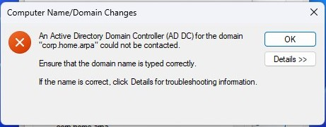
</p>

<p align="center">
  <em>Initial domain join failure: Windows could not contact a domain controller for corp.home.arpa.</em>
</p>

Because the error referenced an inability to contact a domain controller, the initial suspicion was DNS misconfiguration, broken SRV records, or a domain controller health issue. Those assumptions were disproven during investigation.

**Troubleshooting the domain join failure:**

The first check was basic connectivity. Both IPv4 and IPv6 pings were attempted from WIN11-CLIENT01:

```powershell
ping dc01.corp.home.arpa
ping -4 dc01.corp.home.arpa
ping -6 dc01.corp.home.arpa
```

All failed with "Ping request could not find host dc01.corp.home.arpa."

<p align="center">
  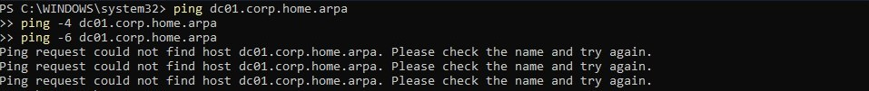
</p>

<p align="center">
  <em>IPv4 and IPv6 ping attempts to dc01.corp.home.arpa both failing on WIN11-CLIENT01, confirming the client could not resolve the domain controller hostname at this stage.</em>
</p>

This pointed to a DNS resolution problem. To confirm the AD DNS infrastructure itself was intact, the DNS zones and SRV records were inspected directly on DC01 via RDP.

```powershell
Get-DnsServerResourceRecord -ZoneName "corp.home.arpa" -Name "DC01"
```

The A and AAAA records for DC01 were present and correct.

<p align="center">
  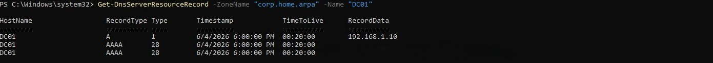
</p>

<p align="center">
  <em>DC01 DNS record verification via RDP: A and AAAA records for DC01 confirmed present in the corp.home.arpa zone.</em>
</p>

The `_msdcs` zone was then inspected on DC01 to confirm SRV records were healthy:

```powershell
Get-DnsServerZone
Get-DnsServerResourceRecord -ZoneName "_msdcs.corp.home.arpa"
```

All expected SRV records were present: `_kerberos._tcp`, `_kerberos._tcp.dc`, `_ldap._tcp.dc`, and associated records. The AD DNS infrastructure was healthy.

<p align="center">
  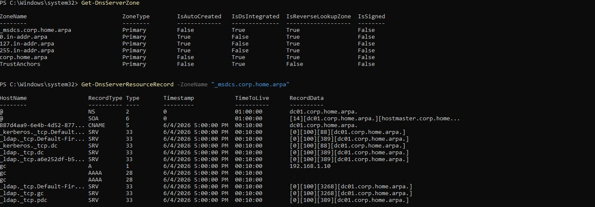
</p>

<p align="center">
  <em>Get-DnsServerZone and Get-DnsServerResourceRecord on DC01 confirming the _msdcs zone and all AD SRV records are present and healthy.</em>
</p>

With the DNS infrastructure confirmed healthy on DC01, attention returned to the client. DC Locator was tested directly:

```powershell
ipconfig /flushdns
nltest /dsgetdc:corp.home.arpa
```

Result:

```text
Getting DC name failed: Status = 1355 0x54b ERROR_NO_SUCH_DOMAIN
```

<p align="center">
  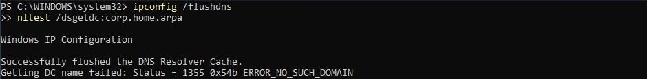
</p>

<p align="center">
  <em>nltest /dsgetdc returning ERROR_NO_SUCH_DOMAIN after flushing the DNS cache, confirming AD service discovery was failing on the client despite the DNS infrastructure being healthy on DC01.</em>
</p>

Despite the AD DNS infrastructure being confirmed healthy, Windows DC Locator could not locate a domain controller. This indicated the issue was in how the client was routing DNS queries rather than in the records themselves.

The `_msdcs` zone was queried using the default system resolver to see which DNS server was actually responding:

```powershell
nslookup -type=SRV _ldap._tcp.dc._msdcs.corp.home.arpa
```

Result:

```text
Server: Unknown
Address: 2001:db8::1

*** Unknown can't find _ldap._tcp.dc._msdcs.corp.home.arpa: Non-existent domain
```

<p align="center">
  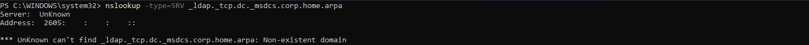
</p>

<p align="center">
  <em>nslookup for the _msdcs SRV record via the default system resolver returning NXDOMAIN, with the query being answered by the router's IPv6 DNS server rather than DC01.</em>
</p>

The query was not reaching DC01. It was being answered by the IPv6 DNS server at `<IPv6 DNS Server>` (the router, represented here as `2001:db8::1`). The router has no knowledge of the AD-integrated zones.

DNS client server addresses were reviewed to confirm the competing DNS path:

```powershell
Get-DnsClientServerAddress
```

Result:

```text
IPv4 DNS: 192.168.1.10
IPv6 DNS: 2001:db8::1
          2001:db8::1
```

<p align="center">
  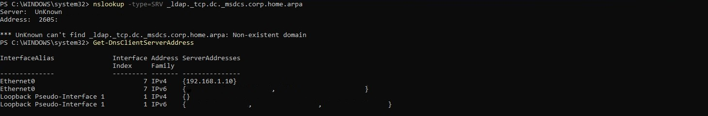
</p>

<p align="center">
  <em>The _msdcs NXDOMAIN failure followed immediately by Get-DnsClientServerAddress, confirming WIN11-CLIENT01 had both an IPv4 DNS server (DC01 at 192.168.1.10) and a competing IPv6 DNS server (router) registered simultaneously. The two results together identify both the symptom and the cause.</em>
</p>

Root cause confirmed: WIN11-CLIENT01 was configured with both an IPv4 DNS server (DC01) and an IPv6 DNS server (the router, assigned via SLAAC/DHCPv6 and represented here as `2001:db8::1`). Windows selected the router's IPv6 DNS service for Active Directory service discovery queries, causing DC Locator requests to bypass DC01 entirely. Because the router did not host the AD-integrated DNS zones, DC Locator queries were returning NXDOMAIN, causing the domain join to fail.

To confirm the records were reachable when queried correctly, the same `_msdcs` SRV query was run explicitly against DC01:

```powershell
nslookup -type=SRV _ldap._tcp.dc._msdcs.corp.home.arpa 192.168.1.10
```

Result:

```text
_ldap._tcp.dc._msdcs.corp.home.arpa    SRV service location:
    priority = 0
    weight   = 100
    port     = 389
    svr hostname = dc01.corp.home.arpa
```

<p align="center">
  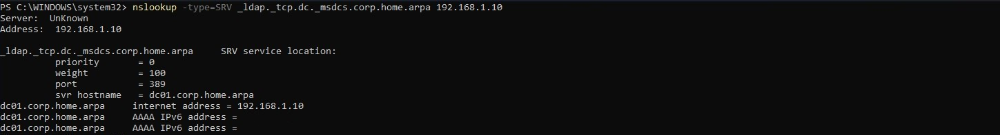
</p>

<p align="center">
  <em>nslookup for the _msdcs SRV record queried directly against DC01 (192.168.1.10) returning the correct result, confirming the zone and records were healthy and the failure was entirely in DNS server selection.</em>
</p>

The zone and records were present and functional on DC01. The failure was entirely in how the client was selecting its DNS server.

**Remediation:**

IPv6 was disabled on WIN11-CLIENT01's Ethernet0 adapter and the DNS cache was flushed and re-registered:

```powershell
Get-NetAdapterBinding -Name "Ethernet0" -ComponentID ms_tcpip6
Disable-NetAdapterBinding -Name "Ethernet0" -ComponentID ms_tcpip6
ipconfig /flushdns
ipconfig /registerdns
```

<p align="center">
  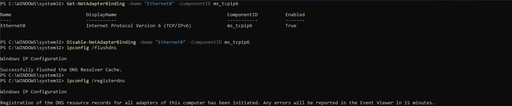
</p>

<p align="center">
  <em>Disabling IPv6 on Ethernet0 via Disable-NetAdapterBinding, then flushing and re-registering DNS to clear the stale resolution state.</em>
</p>

DNS client addresses and DC Locator were both verified in the same session after the change:

```powershell
Get-DnsClientServerAddress
nltest /dsgetdc:corp.home.arpa
```

Result:

```text
Ethernet0    IPv4    {192.168.1.10}
Ethernet0    IPv6    {}

DC: \\DC01.corp.home.arpa
Address: \\192.168.1.10
Dom Name: corp.home.arpa
Forest Name: corp.home.arpa
The command completed successfully
```

<p align="center">
  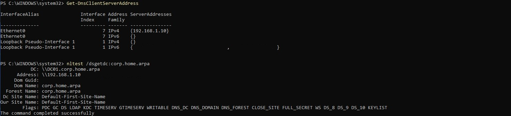
</p>

<p align="center">
  <em>Get-DnsClientServerAddress confirming IPv6 DNS is gone, followed by nltest /dsgetdc returning DC01 successfully.</em>
</p>

Domain controller discovery was immediately operational after removing the competing IPv6 DNS path.

**Domain join:**

The domain join was reattempted through System Properties using the same procedure and credentials (`CORP\labadmin`).

<p align="center">
  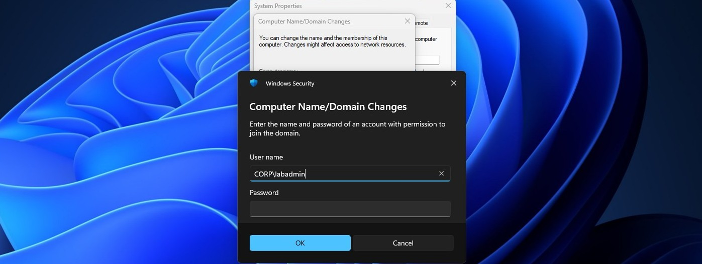
</p>

<p align="center">
  <em>Domain join credential prompt during the corp.home.arpa join operation.</em>
</p>

The join completed successfully and produced a welcome dialog.

<p align="center">
  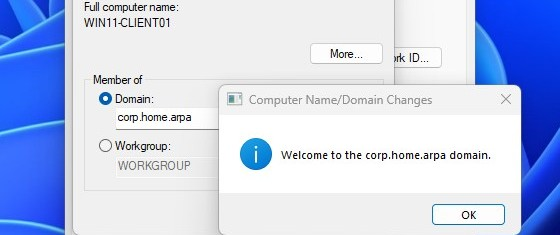
</p>

<p align="center">
  <em>Welcome to the corp.home.arpa domain confirmation dialog.</em>
</p>

WIN11-CLIENT01 was rebooted. The login screen after reboot reflected the domain context.

<p align="center">
  
</p>

<p align="center">
  <em>WIN11-CLIENT01 login screen after reboot showing domain context.</em>
</p>

---

### Step Three - Validate Computer Account Creation and OU Placement

After WIN11-CLIENT01 rebooted, Active Directory Users and Computers on DC01 was opened to verify computer account creation and OU placement.

The `corp.home.arpa > Workstations` OU contained the `WIN11-CLIENT01` computer account. No manual intervention was required. The `redircmp` redirect configured in Lab 03 placed the account directly in `OU=Workstations` at the moment of join.

<p align="center">
  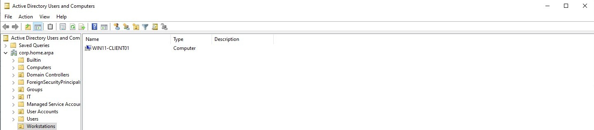
</p>

<p align="center">
  <em>WIN11-CLIENT01 computer account in OU=Workstations, confirming the Lab 03 redircmp redirect is operational.</em>
</p>

The distinguished name was confirmed via PowerShell on DC01:

```powershell
Get-ADComputer -Identity "WIN11-CLIENT01" | Select-Object Name, DistinguishedName
```

Result:

```text
CN=WIN11-CLIENT01,OU=Workstations,DC=corp,DC=home,DC=arpa
```

<p align="center">
  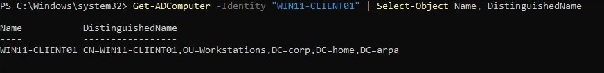
</p>

<p align="center">
  <em>PowerShell confirming the full distinguished name of the WIN11-CLIENT01 computer account.</em>
</p>

Validation results:

| Validation Item | Result |
|---|---|
| Computer account created in Active Directory | Pass |
| Computer account visible in ADUC | Pass |
| Account automatically placed in OU=Workstations | Pass |
| redircmp configuration functioning correctly | Pass |
| Distinguished Name confirms OU placement | Pass |

---

### Step Four - Validate Domain Authentication

WIN11-CLIENT01 was logged into using the `testuser01` domain account to validate that domain authentication was functioning correctly.

At the WIN11-CLIENT01 login screen, **Other user** was selected and the session was initiated as `CORP\testuser01`.

<p align="center">
  
</p>

<p align="center">
  <em>Logging into WIN11-CLIENT01 as testuser01 to validate domain authentication.</em>
</p>

<p align="center">
  
</p>

<p align="center">
  <em>testuser01 desktop after successful domain authentication on WIN11-CLIENT01.</em>
</p>

The logged-in identity was confirmed from an elevated PowerShell session:

```powershell
whoami
whoami /groups
```

`whoami` returned `corp\testuser01`. The `whoami /groups` output included membership in `CORP\Domain Users`, with a domain SID (`S-1-5-21-<domain-sid>-1106`) confirming the security token originated from Active Directory rather than a local account.

<p align="center">
  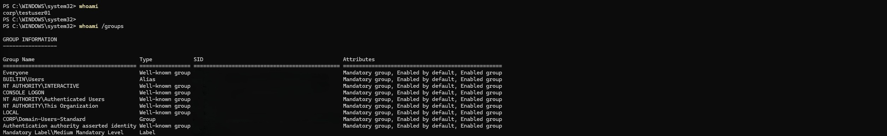
</p>

<p align="center">
  <em>whoami confirming domain identity and group membership for testuser01.</em>
</p>

Validation results:

| Validation | Result |
|---|---|
| Domain user login | Pass |
| Domain authentication | Pass |
| User token creation | Pass |
| Domain Users membership present | Pass |
| Workstation trusts domain | Pass |

---

### Step Five - Validate Kerberos Ticket Issuance

Still logged in as `CORP\testuser01` on WIN11-CLIENT01, Kerberos ticket issuance was validated from the domain-joined client.

```powershell
klist get krbtgt
klist
```

`klist get krbtgt` was run first to explicitly request a TGT before inspecting the cache. The ticket cache after that request contained:

```text
Client: testuser01 @ CORP.HOME.ARPA
Server: krbtgt/CORP.HOME.ARPA @ CORP.HOME.ARPA
Kdc Called: DC01.corp.home.arpa
```

Additional service tickets were present for LDAP and CIFS:

```text
ldap/DC01.corp.home.arpa
cifs/DC01.corp.home.arpa
```

All tickets were issued using AES-256-CTS-HMAC-SHA1-96 encryption.

<p align="center">
  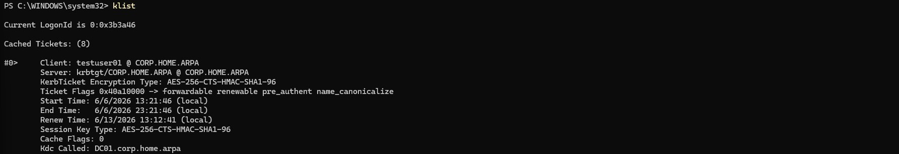
</p>

<p align="center">
  <em>Kerberos ticket cache on WIN11-CLIENT01 showing a valid TGT issued by DC01 for testuser01@CORP.HOME.ARPA.</em>
</p>

Validation results:

| Validation Item | Result |
|---|---|
| Kerberos Ticket Granting Ticket (TGT) issued | Pass |
| Domain Controller functioning as KDC | Pass |
| Kerberos authentication successful | Pass |
| LDAP service ticket issued | Pass |
| CIFS service ticket issued | Pass |
| WIN11-CLIENT01 communicating with DC01 via Kerberos | Pass |

---

### Step Six - Validate Secure Channel Integrity

Before performing secure channel validation, the session was switched from `CORP\testuser01` to `CORP\labadmin`. The `nltest /sc_verify` command requires administrative privileges and returns `ERROR_ACCESS_DENIED` when executed from a standard domain user session.

The secure channel between WIN11-CLIENT01 and DC01 was validated from an elevated PowerShell session running as `CORP\labadmin`:

```powershell
nltest /sc_verify:corp.home.arpa
```

Result:

```text
Trusted DC Name \\DC01.corp.home.arpa
Trusted DC Connection Status Status = 0 0x0 NERR_Success
Trust Verification Status = 0 0x0 NERR_Success
The command completed successfully
```

<p align="center">
  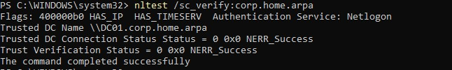
</p>

<p align="center">
  <em>nltest sc_verify confirming a healthy secure channel between WIN11-CLIENT01 and DC01.</em>
</p>

`NERR_Success` confirmed that the machine trust relationship was intact, the machine account password stored locally matched the value in Active Directory, the Netlogon service could communicate with DC01, and the workstation trust relationship was healthy.

---

### Step Seven - Validate Domain Controller Discovery

Domain controller discovery was validated from WIN11-CLIENT01 using AD service discovery:

```powershell
nltest /dsgetdc:corp.home.arpa
```

Result:

```text
DC: \\DC01.corp.home.arpa
Address: \\192.168.1.10
Dom Name: corp.home.arpa
Forest Name: corp.home.arpa
The command completed successfully
```

<p align="center">
  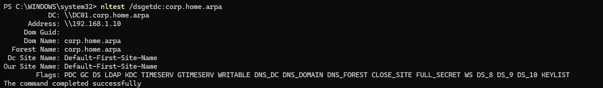
</p>

<p align="center">
  <em>nltest dsgetdc confirming DC01 is discoverable from WIN11-CLIENT01 as the domain controller for corp.home.arpa.</em>
</p>

This result closed the troubleshooting loop from Step Two. Earlier in the lab, this same command had returned `ERROR_NO_SUCH_DOMAIN`. After disabling IPv6 and forcing all DNS queries through DC01, domain controller discovery immediately began working correctly.

---

### Step Eight - Validate Group Policy Processing

Group Policy processing was validated on WIN11-CLIENT01 before any custom GPOs existed. The goal was to confirm the Group Policy engine was operational and that WIN11-CLIENT01 could communicate with DC01 during policy application.

From an elevated PowerShell session on WIN11-CLIENT01:

```powershell
gpupdate /force
```

<p align="center">
  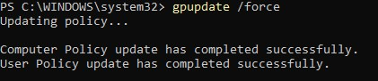
</p>

<p align="center">
  <em>gpupdate /force completing successfully, confirming Group Policy communication between WIN11-CLIENT01 and DC01.</em>
</p>

After the update completed, `gpresult /r` was run to review the applied policy summary:

```powershell
gpresult /r
```

<p align="center">
  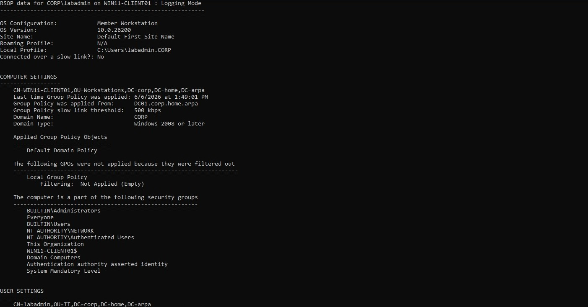
</p>

<p align="center">
  <em>gpresult output showing Group Policy processing results for both user and computer policy scopes.</em>
</p>

The output confirmed:

- Group Policy was applied from `DC01.corp.home.arpa`
- The computer account was in `CN=WIN11-CLIENT01,OU=Workstations,DC=corp,DC=home,DC=arpa`
- The user account was in `CN=labadmin,OU=IT,DC=corp,DC=home,DC=arpa`
- Applied Group Policy Objects included `Default Domain Policy`
- `labadmin` group memberships included `Domain Admins` and `IT-Admins`
- Local Group Policy was listed as Not Applied (Empty), which is expected
- No errors were present in the output

The applied policy source, OU placement, and group memberships were all consistent with the identity structure configured in Lab 03.

---

### Step Nine - Validate DNS and AD Service Discovery from the Joined Client

A final DNS validation pass was performed from WIN11-CLIENT01 as a domain member to confirm both standard name resolution and AD SRV record resolution.

```powershell
Resolve-DnsName _ldap._tcp.corp.home.arpa -Type SRV
Resolve-DnsName _kerberos._tcp.corp.home.arpa -Type SRV
```

Both queries returned valid SRV records identifying dc01.corp.home.arpa as the LDAP and Kerberos service host for the domain. The responses also included the associated A record (192.168.1.10) and AAAA records for the target host.

<p align="center">
  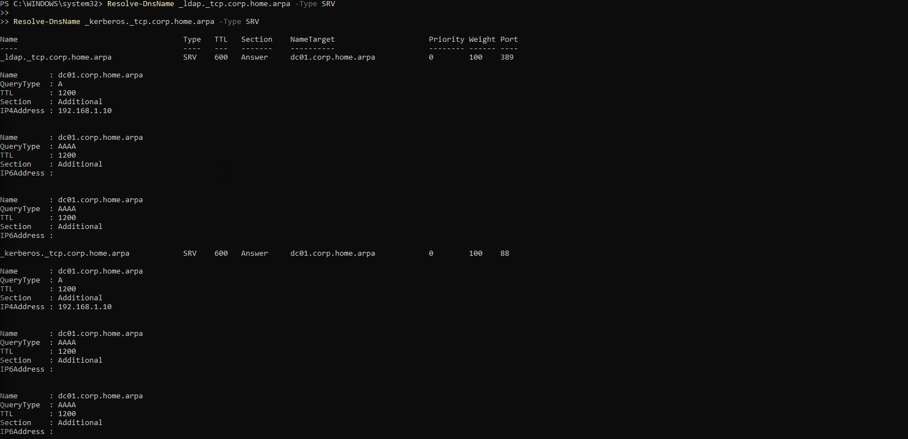
</p>

<p align="center">
  <em>AD DNS service discovery from WIN11-CLIENT01 confirming LDAP and Kerberos SRV record resolution after domain join.</em>
</p>

LDAP SRV record resolution was then validated:

```powershell
nslookup -type=SRV _ldap._tcp.corp.home.arpa
```

Result:

```text
_ldap._tcp.corp.home.arpa    SRV service location:
    priority = 0
    weight   = 100
    port     = 389
    svr hostname = dc01.corp.home.arpa

dc01.corp.home.arpa  internet address = 192.168.1.10
```

<p align="center">
  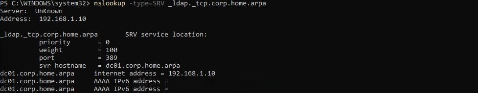
</p>

<p align="center">
  <em>SRV record resolution from the domain-joined WIN11-CLIENT01 confirming LDAP service discovery is operational.</em>
</p>

The query returned the correct service locator record identifying DC01 as the LDAP service host on port 389, followed by the A and AAAA records for `dc01.corp.home.arpa`. This confirmed that both service discovery and host resolution were functioning correctly from the joined client.

---

### Step Ten - Create Post-Domain-Join Snapshots

With all validation steps completed, snapshots were created for both VMs before beginning Lab 05.

**DC01 post-domain-join snapshot:**

<p align="center">
  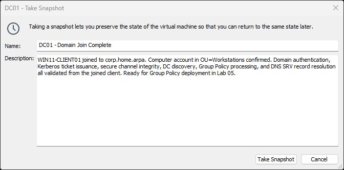
</p>

<p align="center">
  <em>DC01 snapshot created after WIN11-CLIENT01 domain join and all validations completed.</em>
</p>

Snapshot name:

```text
DC01 - Domain Join Complete
```

Snapshot description:

```text
WIN11-CLIENT01 joined to corp.home.arpa. Computer account in OU=Workstations confirmed. Domain authentication, Kerberos ticket issuance, secure channel integrity, DC discovery, Group Policy processing, and DNS SRV record resolution all validated from the joined client. Ready for Group Policy deployment in Lab 05.
```

**WIN11-CLIENT01 post-domain-join snapshot:**

<p align="center">
  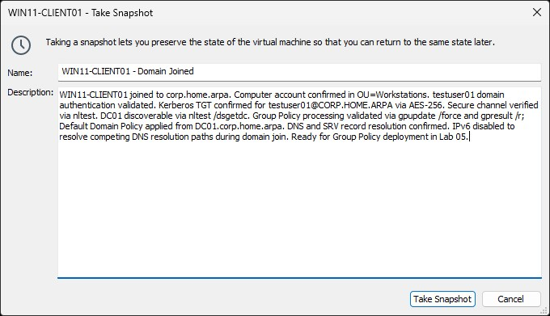
</p>

<p align="center">
  <em>WIN11-CLIENT01 snapshot created after domain join and full validation pass.</em>
</p>

Snapshot name:

```text
WIN11-CLIENT01 - Domain Joined
```

Snapshot description:

```text
WIN11-CLIENT01 joined to corp.home.arpa. Computer account confirmed in OU=Workstations. testuser01 domain authentication validated. Kerberos TGT confirmed for testuser01@CORP.HOME.ARPA via AES-256. Secure channel verified via nltest. DC01 discoverable via nltest /dsgetdc. Group Policy processing validated via gpupdate /force and gpresult /r; Default Domain Policy applied from DC01.corp.home.arpa. DNS and SRV record resolution confirmed. IPv6 disabled to resolve competing DNS resolution paths during domain join. Ready for Group Policy deployment in Lab 05.
```

---

## Validation Checklist

| Check | Result |
|---|---|
| WIN11-CLIENT01 DNS points to `192.168.1.10` | Confirmed via `ipconfig /all` before join |
| `corp.home.arpa` resolves from WIN11-CLIENT01 pre-join | Returns `192.168.1.10` |
| `DC01.corp.home.arpa` resolves from WIN11-CLIENT01 pre-join | Returns `192.168.1.10` |
| Initial domain join attempt | Failed: `An Active Directory Domain Controller for the domain could not be contacted` |
| DC Locator diagnostic (`nltest /dsgetdc`) | Failed: `ERROR_NO_SUCH_DOMAIN`, confirming AD service discovery was broken at the client |
| Root cause identified | IPv6 DNS server (router) competing with IPv4 DNS server (DC01) for AD discovery queries |
| IPv6 disabled on Ethernet0 | `Disable-NetAdapterBinding -ComponentID ms_tcpip6` |
| DNS cache flushed and re-registered | `ipconfig /flushdns` and `ipconfig /registerdns` confirmed |
| DC Locator successful after remediation | `nltest /dsgetdc` returned `\\DC01.corp.home.arpa` |
| Domain join completes successfully | Welcome dialog appeared; reboot prompted |
| WIN11-CLIENT01 login screen shows domain context after reboot | CORP domain visible at login |
| Computer account present in ADUC | Visible in `corp.home.arpa > Workstations` |
| Computer account in `OU=Workstations` | `CN=WIN11-CLIENT01,OU=Workstations,DC=corp,DC=home,DC=arpa` |
| `testuser01` domain login succeeds | Desktop loads; `whoami` returns `corp\testuser01` |
| `testuser01` group membership includes `Domain Users` | Confirmed via `whoami /groups`; domain SID confirmed |
| Kerberos TGT issued for `testuser01` | `klist get krbtgt` then `klist` shows TGT for `testuser01@CORP.HOME.ARPA` via AES-256 |
| LDAP and CIFS service tickets present | Confirmed via `klist` output |
| Session switched to `CORP\labadmin` before `nltest /sc_verify` | Required; `testuser01` is a standard user and returns `ERROR_ACCESS_DENIED` |
| Secure channel status returns `NERR_Success` | `nltest /sc_verify:corp.home.arpa` |
| DC01 discoverable from WIN11-CLIENT01 | `nltest /dsgetdc:corp.home.arpa` returns `DC01.corp.home.arpa` |
| `gpupdate /force` completes without errors | Computer and User policy updates succeeded |
| `gpresult /r` reviewed | `Default Domain Policy` applied from `DC01.corp.home.arpa`; computer and user OU placement correct; no errors |
| DNS resolves post-join | `corp.home.arpa` and `DC01.corp.home.arpa` resolve correctly |
| LDAP SRV record resolves from joined client | `_ldap._tcp.corp.home.arpa` returns DC01 on port 389 |
| DC01 post-domain-join snapshot created | Visible in VMware snapshot manager |
| WIN11-CLIENT01 post-domain-join snapshot created | Visible in VMware snapshot manager |

---

## Troubleshooting and Adjustments

### Domain Join Failure Due to Competing DNS Resolution Paths

The initial domain join attempt failed with the following error:

```text
An Active Directory Domain Controller (AD DC) for the domain "corp.home.arpa" could not be contacted.
The specified domain either does not exist or could not be contacted.
```

Because the error referenced inability to contact a domain controller, the initial investigation focused on DNS misconfiguration, broken SRV records, and domain controller health. All of those were quickly ruled out.

Basic connectivity from WIN11-CLIENT01 to DC01 failed entirely: both IPv4 and IPv6 ping attempts to `dc01.corp.home.arpa` returned "Ping request could not find host," indicating the client was not resolving the DC hostname at all. DNS zones and SRV records were then verified directly on DC01 via RDP, confirming the AD DNS infrastructure was healthy: A and AAAA records for DC01 were present, and the `_msdcs` zone contained all expected Kerberos and LDAP SRV records.

Running DC Locator directly exposed the real failure:

```powershell
nltest /dsgetdc:corp.home.arpa
```

```text
Getting DC name failed: Status = 1355 ERROR_NO_SUCH_DOMAIN
```

Despite the AD infrastructure being healthy, Windows DC Locator was unable to locate a domain controller. This indicated the issue was in AD-specific service discovery rather than basic DNS.

The next test revealed the source. Querying the `_msdcs` zone using the default system resolver sent the query to the router's IPv6 DNS server instead of DC01:

```text
Server: Unknown
Address: 2001:db8::1
*** Non-existent domain
```

`Get-DnsClientServerAddress` confirmed the full picture:

```text
IPv4 DNS: 192.168.1.10
IPv6 DNS: 2001:db8::1
          2001:db8::1
```

WIN11-CLIENT01 had two active DNS resolution paths. IPv4 queries were going to DC01. IPv6 queries were going to the router (assigned via SLAAC/DHCPv6, represented here as `2001:db8::1`). Windows selected the router's IPv6 DNS service for Active Directory service discovery queries, causing DC Locator requests to bypass DC01 entirely. The router has no knowledge of the AD-integrated zones and returned NXDOMAIN for all `_msdcs` lookups, causing DC Locator to fail.

The fix was to disable IPv6 on the Ethernet0 adapter:

```powershell
Disable-NetAdapterBinding -Name "Ethernet0" -ComponentID ms_tcpip6
ipconfig /flushdns
ipconfig /registerdns
```

After this change, `Get-DnsClientServerAddress` showed only the IPv4 DNS server (`192.168.1.10`). `nltest /dsgetdc:corp.home.arpa` immediately returned DC01 and the domain join completed without further issues.

The AD infrastructure was healthy throughout. The failure was entirely client-side DNS behavior caused by a competing DNS resolution path.

### nltest /sc_verify Requires Administrative Privileges

Secure channel validation in Step Six initially returned `ERROR_ACCESS_DENIED` because the session was running as `CORP\testuser01`, a standard domain user. `nltest /sc_verify` requires administrative rights on the workstation. Switching to `CORP\labadmin` before running the command resolved the issue immediately.

Any validation step involving `nltest` should be performed from an administrative session.

### Domain Join Fails Due to Existing Computer Account

If WIN11-CLIENT01 was previously joined to the domain and then reverted to a snapshot, Active Directory may already contain a stale computer account with the same name. This can cause the domain join to fail or produce unexpected behavior.

Verify the computer account status in ADUC before retrying. If a stale account exists, either delete it or reset it:

```powershell
Reset-ADComputer "WIN11-CLIENT01"
```

After resetting or deleting the stale account, retry the domain join from WIN11-CLIENT01.

### Computer Account Lands in CN=Computers Instead of OU=Workstations

If WIN11-CLIENT01 appears in `CN=Computers` rather than `OU=Workstations` after a join, the `redircmp` redirect from Lab 03 was not applied or was not applied correctly. Verify on DC01:

```powershell
(Get-ADDomain).ComputersContainer
```

If the output shows `CN=Computers,DC=corp,DC=home,DC=arpa`, re-run the redirect:

```cmd
redircmp "OU=Workstations,DC=corp,DC=home,DC=arpa"
```

Move the existing computer account manually in ADUC or delete it and re-join.

---

## Security Considerations

### Domain-Joined Endpoint Attack Surface

A domain-joined workstation participates in Kerberos authentication, Group Policy processing, and LDAP communication with DC01. WIN11-CLIENT01's Windows Defender Firewall remained active throughout this lab. No inbound firewall rules beyond those required for domain communication and remote administration were added.

### testuser01 Credentials

`testuser01` is a standard domain user with no elevated privileges. It is the appropriate account for validating domain authentication and Group Policy behavior from a least-privilege perspective. `labadmin` was reserved for domain administration tasks and for validation steps requiring administrative rights.

### Machine Trust Relationship

The secure channel established during domain join uses a machine account password that is automatically rotated by the domain. This is distinct from the user account authentication validated in Step Four. Both layers of trust need to be healthy for the domain join to function correctly, which is why both `nltest /sc_verify` and Kerberos ticket validation were performed separately.

### IPv6 Disabled as a Troubleshooting Remediation

IPv6 was disabled on WIN11-CLIENT01 to resolve the competing DNS resolution path that was preventing domain controller discovery. This decision is acceptable in a lab environment where the AD DNS architecture is IPv4-based. In a production environment where IPv6 is in active use, the correct resolution would be to configure DC01 as the IPv6 DNS server rather than disabling IPv6 entirely. The approach taken here was appropriate for the lab scope.

---

## Outcome

WIN11-CLIENT01 is a domain-joined member of `corp.home.arpa` with a computer account in `OU=Workstations`. Every layer of the identity infrastructure deployed in Lab 03 was validated from the client side.

The following was confirmed during this lab:

- DNS resolution from WIN11-CLIENT01 verified before domain join
- Initial domain join failure traced to competing IPv6 DNS resolution path directing AD discovery queries to the router instead of DC01
- IPv6 disabled on WIN11-CLIENT01 to eliminate the competing DNS path
- WIN11-CLIENT01 joined to `corp.home.arpa` using `CORP\labadmin`
- Computer account present in `OU=Workstations`, confirming the Lab 03 `redircmp` redirect is operational
- `testuser01` domain authentication validated on the joined client; domain SID format confirmed in security token
- Kerberos TGT issued for `testuser01@CORP.HOME.ARPA` by `krbtgt/CORP.HOME.ARPA@CORP.HOME.ARPA` using AES-256 encryption
- LDAP and CIFS service tickets issued and confirmed via `klist`
- Secure channel between WIN11-CLIENT01 and DC01 verified via `nltest /sc_verify` returning `NERR_Success`
- DC01 discoverable from WIN11-CLIENT01 via `nltest /dsgetdc`
- Group Policy processing validated via `gpupdate /force` and `gpresult /r`; `Default Domain Policy` applied from `DC01.corp.home.arpa`; computer and user OU placement confirmed correct in policy output
- LDAP SRV record resolution confirmed from the domain-joined client
- Post-domain-join snapshots created for both DC01 and WIN11-CLIENT01

The environment is ready for:

- Group Policy design and deployment (Lab 05)
- Linux AD integration via SSSD and Kerberos on the Ubuntu Server host (Lab 06)
- Windows event log collection and SIEM integration via Wazuh (Lab 07)

---

## Lessons Learned

### Active Directory Depends Heavily on DNS

Active Directory is not functional without correct DNS resolution for AD-specific service records. Every major AD operation, including domain join, authentication, Group Policy application, and secure channel maintenance, begins with a DNS lookup. A domain controller that is unreachable via DNS is, from the client's perspective, a domain controller that does not exist. Getting DNS right is not a preliminary step; it is a continuous requirement.

### Successful Hostname Resolution Does Not Guarantee Domain Controller Discovery

The most significant lesson from this lab is that `Resolve-DnsName corp.home.arpa` returning `192.168.1.10` does not mean Windows can locate a domain controller. Active Directory uses DC Locator, which queries SRV records in the `_msdcs` zone through whatever DNS server the client selects. If that DNS server is not the domain controller, those queries return NXDOMAIN and DC Locator fails, even when basic hostname resolution works perfectly.

The validation sequence that matters is:

1. Confirm `Resolve-DnsName corp.home.arpa` returns DC01
2. Confirm SRV records exist on DC01 directly
3. Confirm `nltest /dsgetdc` succeeds

If step 1 passes and step 3 fails, the problem is DNS server selection rather than DNS zone content.

### Mixed IPv4/IPv6 DNS Configurations Can Break AD Service Discovery

WIN11-CLIENT01 had both an IPv4 DNS server (DC01) and an IPv6 DNS server (the router, assigned automatically via SLAAC/DHCPv6) active simultaneously. Basic hostname queries succeeded because Windows used whichever path returned a result first. AD-specific SRV queries were routed through the IPv6 path to the router and failed silently from the user's perspective until `nltest` exposed the failure explicitly.

In an AD environment, ensuring the domain controller is the DNS server for both IPv4 and IPv6 is not optional. Any competing DNS path that lacks the AD-integrated zones is sufficient to break DC Locator and prevent domain joins. Mixed IPv4/IPv6 DNS configurations of this kind can produce intermittent and difficult-to-diagnose authentication failures in production environments, where the IPv6 path may come and go depending on network conditions.

### nltest, nslookup, Resolve-DnsName, and DNS Client Configuration Checks Were Critical Tools

`nltest /dsgetdc` was the tool that exposed the real failure, not `Resolve-DnsName`, which returned a correct result throughout. `nslookup` with an explicit server argument isolated the DNS server selection problem by proving the SRV records existed on DC01 while the default resolver was querying somewhere else. `Get-DnsClientServerAddress` revealed the competing IPv6 DNS entry that was invisible to basic hostname resolution tests. No single tool told the full story; the diagnosis required using all of them in combination.

### Validation Is the Lab

Lab 04 had one meaningful deployment action: the domain join. Everything else was validation. That ratio is intentional and reflects how real infrastructure work operates. The deployment is fast; confirming it works correctly across every layer takes more effort. Running `whoami` is not sufficient evidence that a domain join succeeded. You need `klist`, `nltest /sc_verify`, `nltest /dsgetdc`, `gpresult /r`, and SRV record resolution before you actually know the environment is functioning end-to-end.

### redircmp Pays Off Immediately

The `redircmp` configuration from Lab 03 produced a concrete result the moment WIN11-CLIENT01 joined the domain. The computer account landed in `OU=Workstations` automatically with no manual intervention. That outcome confirmed the Lab 03 OU structure and container redirect were correct, and it set up clean Group Policy targeting for Lab 05 without requiring any account reorganization.

### nltest Requires Administrative Rights

`nltest /sc_verify` returns `ERROR_ACCESS_DENIED` from a standard domain user session. Any validation step using `nltest` should be performed from an administrative session. Switching from `testuser01` to `labadmin` before Step Six avoided a misleading failure that could have been misread as a secure channel problem.

### klist get krbtgt Before klist

Running `klist` alone on a freshly established session may return an empty cache even when Kerberos is functioning correctly. The ticket cache is populated on demand. Running `klist get krbtgt` first explicitly requests a TGT and populates the cache before inspection. An empty `klist` result is not the same as a Kerberos failure.

### gpresult as a Baseline

Running `gpresult /r` before any custom GPOs exist produced an unambiguous result. The output confirmed the Group Policy source, the OU placement of both the computer and user accounts, and the absence of any processing errors. That baseline makes Lab 05 troubleshooting significantly more straightforward because the pre-GPO state is documented precisely.

### A Broken First Attempt Is Still Good Documentation

The initial domain join failure and the troubleshooting process that followed is more valuable lab content than a clean first-attempt success would have been. The failure surfaced a real-world issue involving IPv4/IPv6 DNS coexistence and AD service discovery that reflects the kind of problem encountered in actual desktop support and sysadmin work. Documenting the investigation methodology, including ruling out DNS zone health, ruling out SRV records, and isolating the failing query path, demonstrates the reasoning process rather than just the final state.