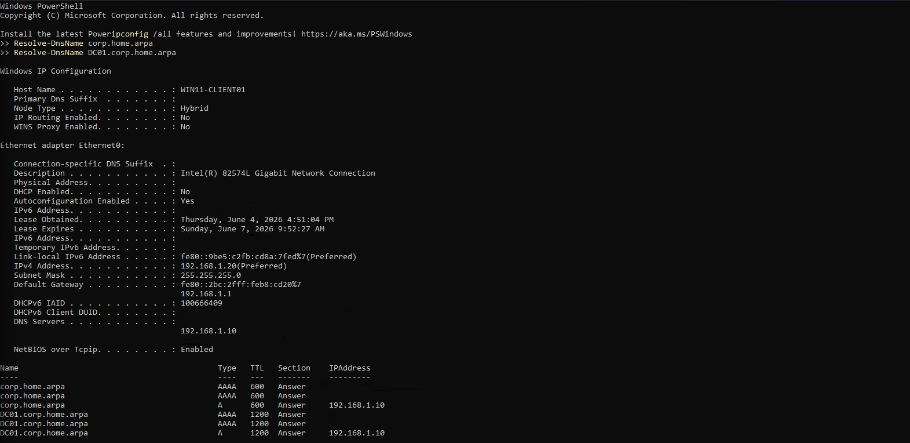

# 04 - Domain Client Lab

## Status

In progress

---

## Overview

This lab proves that the identity infrastructure deployed in Lab 03 actually works.

Lab 03 stood up the domain. Lab 04 joins a workstation to it and validates every layer of the resulting trust relationship: DNS, Kerberos, domain authentication, OU placement, secure channel integrity, Group Policy processing, and AD service discovery. The deployment work is intentionally small. The validation work is the point.

All objectives are completed on WIN11-CLIENT01 and DC01 using the accounts and OU structure created in Lab 03.

---

## Objectives

- join WIN11-CLIENT01 to the `corp.home.arpa` domain
- validate computer account creation and automatic OU placement in `OU=Workstations`
- validate domain authentication using `testuser01`
- validate Kerberos ticket issuance from the joined client
- validate secure channel integrity between WIN11-CLIENT01 and DC01
- validate domain controller discovery from the joined client
- validate Group Policy processing on the joined client
- validate AD-integrated DNS SRV record resolution from the joined client
- create post-domain-join snapshots for both VMs as rollback points for Lab 05

---

## Project Context

Lab 03 deployed the identity infrastructure. DC01 is a fully operational domain controller hosting Active Directory Domain Services, AD-integrated DNS, and the Kerberos Key Distribution Center for the `corp.home.arpa` domain. The OU structure, domain accounts, and security groups are all in place. WIN11-CLIENT01 is pre-configured with DC01 as its DNS server and has been validated as able to resolve the domain and locate domain controller services.

Lab 04 is the first proof that all of that work is functional end-to-end. A domain join is not just a checkbox. It creates a computer account, establishes a machine trust relationship, triggers Kerberos ticket issuance, tests the secure channel between the client and the domain controller, and kicks off Group Policy processing. Each of those layers needs to be explicitly validated rather than assumed.

The OU placement validation is one of the more interesting steps in this lab. In Lab 03, the `redircmp` command was used to redirect the default `CN=Computers` container to `OU=Workstations`. If that redirect worked correctly, WIN11-CLIENT01 should land directly in `OU=Workstations` at the moment of domain join, without any manual intervention. Confirming that behavior in ADUC closes the loop on one of the more subtle Lab 03 configuration steps.

This lab also validates Group Policy processing before any custom GPOs exist. The goal is not to test policy content but to confirm that the Group Policy engine is operational, that WIN11-CLIENT01 can communicate with DC01 during policy processing, and that both user and computer policy scopes are functioning correctly. That baseline matters for Lab 05, where actual GPOs will be designed and deployed.

---

## Technologies Used

- Windows 11 Enterprise Evaluation
- Windows Server 2022 Standard Evaluation
- Active Directory Domain Services
- Kerberos Authentication Protocol
- Group Policy
- Active Directory Users and Computers (ADUC)
- DNS Manager
- PowerShell
- nltest
- klist
- gpupdate / gpresult
- VMware Workstation Snapshot Management

---

## Architecture and Topology

After this lab, WIN11-CLIENT01 is a domain-joined member of `corp.home.arpa` with a computer account in `OU=Workstations`.

```text
Windows 11 Workstation (192.168.1.x) [hypervisor and access device]
│
└── VMware Workstation
    │
    ├── DC01 (192.168.1.10) [domain controller]
    │   └── Windows Server 2022 Standard Evaluation
    │       ├── Domain: corp.home.arpa
    │       ├── Roles: AD DS, DNS Server
    │       ├── KDC: active
    │       ├── Kerberos: issuing tickets
    │       └── OU=Workstations: WIN11-CLIENT01 computer account
    │
    └── WIN11-CLIENT01 (192.168.1.20) [domain-joined enterprise workstation]
        └── Windows 11 Enterprise Evaluation
            ├── Static IP: 192.168.1.20
            ├── DNS: 192.168.1.10 (DC01)
            ├── Domain: corp.home.arpa
            ├── Computer account: to be confirmed in OU=Workstations after domain join
            └── Group Policy: processing against DC01

                    ↕ LAN

Ubuntu Server 26.04 LTS (192.168.1.226)
└── Future: SSSD + Kerberos AD authentication (Lab 06)
```

### Domain Join Flow

```text
WIN11-CLIENT01
      ↓ (DNS query: corp.home.arpa)
DC01 DNS (192.168.1.10)
      ↓ (SRV record lookup: _ldap._tcp.corp.home.arpa)
DC01 LDAP (port 389)
      ↓ (domain join request via CORP\labadmin)
Active Directory
      ↓ (computer account created in OU=Workstations)
Kerberos KDC
      ↓ (machine TGT issued)
WIN11-CLIENT01 reboots as domain member
```

---

## Prerequisites

- Lab 03 completed and validated
- DC01 post-promotion snapshot (`DC01 - Active Directory Deployed, corp.home.arpa`) available and verified
- WIN11-CLIENT01 pre-domain-join snapshot (`WIN11-CLIENT01 - Pre-Domain Join, DNS Validated`) available and verified
- DC01 at static IP `192.168.1.10` with RDP enabled and operational
- WIN11-CLIENT01 DNS configured to `192.168.1.10` (DC01) and validated in Lab 03
- Domain accounts operational: `labadmin` (Domain Admins, IT-Admins), `testuser01` (Domain-Users-Standard)
- `redircmp` redirect confirmed: `OU=Workstations,DC=corp,DC=home,DC=arpa`
- Both VMs powered on and accessible before beginning

---

## Deployment Steps

### Step One - Pre-Join Validation

Before joining the domain, I verified that WIN11-CLIENT01 was in the expected state from WIN11-CLIENT01 directly: DNS pointing at DC01, domain resolvable, and domain controller hostname resolvable.

From an elevated PowerShell session on WIN11-CLIENT01:

```powershell
ipconfig /all
Resolve-DnsName corp.home.arpa
Resolve-DnsName DC01.corp.home.arpa
```

Expected results:

- DNS Server listed as `192.168.1.10`
- `corp.home.arpa` resolves to DC01 (`192.168.1.10`)
- `DC01.corp.home.arpa` resolves to `192.168.1.10`

<p align="center">
  
</p>

<p align="center">
  <em>Pre-join DNS validation from WIN11-CLIENT01 confirming DC01 is reachable and the domain resolves correctly.</em>
</p>

A domain join will fail silently on DNS if this step does not pass. Confirming name resolution before attempting the join eliminates the most common source of domain join failures.

---

### Step Two - Join WIN11-CLIENT01 to the Domain

I joined WIN11-CLIENT01 to `corp.home.arpa` through the System Properties interface.

Navigation: Settings > System > About > Advanced system settings > Computer Name tab > Change

I set the domain field to `corp.home.arpa` and clicked OK.

When prompted for credentials, I authenticated as:

```text
CORP\labadmin
```

or equivalently:

```text
labadmin@corp.home.arpa
```

> **Note:** Take the screenshot before entering credentials. Capture the credential prompt with the username field visible but before the password is entered.

<p align="center">
  
</p>

<p align="center">
  <em>Domain join credential prompt during the corp.home.arpa join operation.</em>
</p>

A successful join produces a welcome dialog before prompting for a reboot.

<p align="center">
  
</p>

<p align="center">
  <em>Welcome to the corp.home.arpa domain confirmation dialog.</em>
</p>

I rebooted WIN11-CLIENT01 when prompted. The login screen after reboot should show the option to sign in with a domain account.

<p align="center">
  
</p>

<p align="center">
  <em>WIN11-CLIENT01 login screen after reboot showing domain context.</em>
</p>

---

### Step Three - Validate Computer Account Creation and OU Placement

After WIN11-CLIENT01 rebooted, I switched to DC01 and opened Active Directory Users and Computers to verify that the computer account was created and placed in the correct OU.

I navigated to `corp.home.arpa > Workstations` and confirmed that `WIN11-CLIENT01` appeared there.

<p align="center">
  
</p>

<p align="center">
  <em>WIN11-CLIENT01 computer account in OU=Workstations, confirming the Lab 03 redircmp redirect is operational.</em>
</p>

This is one of the more meaningful validations in this lab. In Lab 03, `redircmp` was used to redirect `CN=Computers` to `OU=Workstations`. If that redirect is operational, the computer account lands in the correct OU at the moment of join with no manual steps. If it ends up in `CN=Computers` instead, the redirect did not apply and would need to be re-run on DC01 before continuing.

I also confirmed the full distinguished name via PowerShell on DC01:

```powershell
Get-ADComputer -Identity "WIN11-CLIENT01" | Select-Object Name, DistinguishedName
```

Expected result: the `DistinguishedName` should indicate that the computer account resides in `OU=Workstations`.

<p align="center">
  
</p>

<p align="center">
  <em>PowerShell confirming the full distinguished name of the WIN11-CLIENT01 computer account.</em>
</p>

---

### Step Four - Validate Domain Authentication

I logged into WIN11-CLIENT01 using the `testuser01` domain account to validate that domain authentication was functioning correctly.

At the WIN11-CLIENT01 login screen, I selected **Other user** and signed in as:

```text
CORP\testuser01
```

or equivalently:

```text
testuser01@corp.home.arpa
```

<p align="center">
  
</p>

<p align="center">
  <em>Logging into WIN11-CLIENT01 as testuser01 to validate domain authentication.</em>
</p>

<p align="center">
  
</p>

<p align="center">
  <em>testuser01 desktop after successful domain authentication on WIN11-CLIENT01.</em>
</p>

I confirmed the logged-in identity from an elevated PowerShell session:

```powershell
whoami
whoami /groups
```

Expected output includes:

```text
corp\testuser01
```

And group membership should include `CORP\Domain-Users-Standard` from the Lab 03 group assignment.

<p align="center">
  
</p>

<p align="center">
  <em>whoami confirming domain identity and group membership for testuser01.</em>
</p>

---

### Step Five - Validate Kerberos Ticket Issuance

Still logged in as `testuser01` on WIN11-CLIENT01, I validated Kerberos ticket issuance from the domain-joined client.

```powershell
klist get krbtgt
klist
```

<p align="center">
  
</p>

<p align="center">
  <em>Kerberos ticket cache on WIN11-CLIENT01 showing a valid TGT issued by DC01 for testuser01@CORP.HOME.ARPA.</em>
</p>

The `klist get krbtgt` command explicitly requests a Ticket Granting Ticket before inspecting the cache. Running `klist` alone on a fresh session may show an empty cache even when Kerberos is functioning correctly. Requesting the ticket first ensures the validation reflects actual Kerberos behavior.

Expected output includes a TGT for `testuser01@CORP.HOME.ARPA` issued by `krbtgt/CORP.HOME.ARPA@CORP.HOME.ARPA`. This is the most important client-side identity validation in this lab. A valid TGT confirms that the Kerberos Key Distribution Center on DC01 is functioning correctly and that WIN11-CLIENT01 can authenticate through the domain trust.

---

### Step Six - Validate Secure Channel Integrity

I validated the secure channel between WIN11-CLIENT01 and DC01 to confirm the machine trust relationship established during the domain join was operational.

```powershell
nltest /sc_verify:corp.home.arpa
```

Expected result: `NERR_Success`

The exact flags reported may vary. What matters is that the connection status returns `NERR_Success` and that DC01 is identified as the trusted domain controller.

<p align="center">
  
</p>

<p align="center">
  <em>nltest sc_verify confirming a healthy secure channel between WIN11-CLIENT01 and DC01.</em>
</p>

`NERR_Success` confirms that the machine trust relationship is intact and the secure channel is operational. This is the workstation-to-domain-controller equivalent of the Kerberos TGT validation: it proves the machine account relationship rather than the user account relationship.

---

### Step Seven - Validate Domain Controller Discovery

I validated that WIN11-CLIENT01 could correctly locate the domain controller using AD service discovery.

```powershell
nltest /dsgetdc:corp.home.arpa
```

Expected result: DC01 is returned as the located domain controller. Document the advertised role flags returned by `nltest`.

<p align="center">
  
</p>

<p align="center">
  <em>nltest dsgetdc confirming DC01 is discoverable from WIN11-CLIENT01 as the domain controller for corp.home.arpa.</em>
</p>

This confirms that the SRV record infrastructure in `_msdcs.corp.home.arpa` is being used correctly by WIN11-CLIENT01 to locate domain controller services. A successful result here means that AD service discovery is working end-to-end from the joined client.

---

### Step Eight - Validate Group Policy Processing

I validated Group Policy processing on WIN11-CLIENT01 before any custom GPOs exist. The goal is to confirm the Group Policy engine is operational and that WIN11-CLIENT01 can communicate with DC01 during policy application, not to test specific policy content.

From an elevated PowerShell session on WIN11-CLIENT01:

```powershell
gpupdate /force
```

<p align="center">
  
</p>

<p align="center">
  <em>gpupdate /force completing successfully, confirming Group Policy communication between WIN11-CLIENT01 and DC01.</em>
</p>

After the update completed, I ran `gpresult` to review the applied policy summary:

```powershell
gpresult /r
```

<p align="center">
  
</p>

<p align="center">
  <em>gpresult output showing Group Policy processing results for both user and computer policy scopes.</em>
</p>

The output will show applied Group Policy objects and the policy processing scope for both the computer and user. No custom GPOs are expected at this stage. Document what the output actually shows.

---

### Step Nine - Validate DNS and AD Service Discovery from the Joined Client

I ran a final DNS validation pass from WIN11-CLIENT01 as a domain member to confirm both standard name resolution and AD SRV record resolution.

```powershell
Resolve-DnsName corp.home.arpa
Resolve-DnsName DC01.corp.home.arpa
```

<p align="center">
  
</p>

<p align="center">
  <em>DNS resolution from WIN11-CLIENT01 confirming domain and DC01 hostname resolution after domain join.</em>
</p>

I also validated AD SRV record resolution to confirm that service discovery infrastructure is visible from the joined client:

```powershell
nslookup -type=SRV _ldap._tcp.corp.home.arpa
```

<p align="center">
  
</p>

<p align="center">
  <em>SRV record resolution from the domain-joined WIN11-CLIENT01 confirming LDAP service discovery is operational.</em>
</p>

Successful SRV record resolution from a domain-joined client demonstrates that the full AD service discovery chain is intact: WIN11-CLIENT01 can locate the domain controller, resolve its SRV records, and use that information to establish authenticated connections.

---

### Step Ten - Create Post-Domain-Join Snapshots

With all validation steps completed, I created snapshots for both VMs before beginning Lab 05. These snapshots are the rollback points for Group Policy design and deployment.

**DC01 post-domain-join snapshot:**

<p align="center">
  
</p>

<p align="center">
  <em>DC01 snapshot created after WIN11-CLIENT01 domain join and all validations completed.</em>
</p>

Snapshot name:

```text
DC01 - Domain Join Complete
```

Snapshot description:

```text
WIN11-CLIENT01 joined to corp.home.arpa. Computer account in OU=Workstations confirmed. Domain authentication, Kerberos ticket issuance, secure channel integrity, DC discovery, Group Policy processing, and DNS SRV record resolution all validated from the joined client. Ready for Group Policy deployment in Lab 05.
```

**WIN11-CLIENT01 post-domain-join snapshot:**

<p align="center">
  
</p>

<p align="center">
  <em>WIN11-CLIENT01 snapshot created after domain join and full validation pass.</em>
</p>

Snapshot name:

```text
WIN11-CLIENT01 - Domain Joined
```

Snapshot description:

```text
WIN11-CLIENT01 joined to corp.home.arpa. Computer account confirmed in OU=Workstations. testuser01 domain authentication validated. Kerberos TGT confirmed for testuser01@CORP.HOME.ARPA. Secure channel verified via nltest. DC01 discoverable via nltest /dsgetdc. Group Policy processing validated via gpupdate /force and gpresult /r. DNS and SRV record resolution confirmed. Ready for Group Policy deployment in Lab 05.
```

---

## Validation Checklist

| Check | Expected Result |
|---|---|
| WIN11-CLIENT01 DNS points to `192.168.1.10` | Confirmed via `ipconfig /all` before join |
| `corp.home.arpa` resolves from WIN11-CLIENT01 pre-join | Returns DC01 IP |
| `DC01.corp.home.arpa` resolves from WIN11-CLIENT01 pre-join | Returns `192.168.1.10` |
| Domain join completes successfully | Welcome dialog appears; reboot prompted |
| WIN11-CLIENT01 login screen shows domain context after reboot | CORP domain visible at login |
| Computer account present in ADUC | Visible in `corp.home.arpa > Workstations` |
| Computer account in `OU=Workstations` | `CN=WIN11-CLIENT01,OU=Workstations,DC=corp,DC=home,DC=arpa` |
| `testuser01` domain login succeeds | Desktop loads; `whoami` returns `corp\testuser01` |
| `testuser01` group membership includes `Domain-Users-Standard` | Confirmed via `whoami /groups` |
| Kerberos TGT issued for `testuser01` | `klist get krbtgt` followed by `klist` shows valid TGT for `testuser01@CORP.HOME.ARPA` |
| Secure channel status returns `NERR_Success` | `nltest /sc_verify:corp.home.arpa` |
| DC01 discoverable from WIN11-CLIENT01 | `nltest /dsgetdc:corp.home.arpa` returns `DC01.corp.home.arpa` |
| `gpupdate /force` completes without errors | Computer and User policy updates succeed |
| `gpresult /r` reviewed and documented | Group Policy processing confirmed operational; actual output recorded during lab |
| DNS resolves post-join | `corp.home.arpa` and `DC01.corp.home.arpa` resolve correctly |
| LDAP SRV record resolves from joined client | `_ldap._tcp.corp.home.arpa` returns DC01 |
| DC01 post-domain-join snapshot created | Visible in VMware snapshot manager |
| WIN11-CLIENT01 post-domain-join snapshot created | Visible in VMware snapshot manager |

---

## Troubleshooting and Adjustments

### Domain Join Fails Due to Existing Computer Account

If WIN11-CLIENT01 was previously joined to the domain and then reverted to a snapshot, Active Directory may already contain a stale computer account with the same name. This can cause the domain join to fail or produce unexpected behavior.

Verify the computer account status in ADUC before retrying. If a stale account exists, either delete it and retry the join, or reset the account from an elevated PowerShell session on DC01:

```powershell
Reset-ADComputer "WIN11-CLIENT01"
```

After resetting or deleting the stale account, retry the domain join from WIN11-CLIENT01.

---

### Domain Join Fails with DNS Error

If the domain join fails with an error indicating the domain cannot be found, the most likely cause is a DNS resolution failure. Verify the following before retrying:

```powershell
Resolve-DnsName corp.home.arpa
Resolve-DnsName DC01.corp.home.arpa
```

If either query fails, the DNS configuration on WIN11-CLIENT01 needs to be verified. The adapter should have `192.168.1.10` set as the primary DNS server. Public resolvers cannot resolve AD-integrated DNS zones and will cause the join to fail.

### Computer Account Lands in CN=Computers Instead of OU=Workstations

If WIN11-CLIENT01 appears in `CN=Computers` rather than `OU=Workstations` after the join, the `redircmp` redirect from Lab 03 either was not applied or was not applied correctly.

Verify the current redirect on DC01:

```powershell
(Get-ADDomain).ComputersContainer
```

If the output shows `CN=Computers,DC=corp,DC=home,DC=arpa` instead of `OU=Workstations,DC=corp,DC=home,DC=arpa`, re-run the redirect:

```cmd
redircmp "OU=Workstations,DC=corp,DC=home,DC=arpa"
```

After re-applying, move the existing computer account manually in ADUC or delete it and re-join the domain.

### Kerberos TGT Not Visible After Login

If `klist` shows an empty cache after logging in as `testuser01`, run `klist get krbtgt` first to explicitly request a TGT before inspecting the cache. A freshly opened session may not have requested a ticket yet. An empty `klist` without first requesting a ticket is not necessarily indicative of a Kerberos failure.

If `klist get krbtgt` itself fails, verify that WIN11-CLIENT01 can reach DC01 on port 88 (Kerberos) and that the system clock on WIN11-CLIENT01 is within five minutes of DC01. Clock skew beyond that threshold causes Kerberos authentication failures.

### gpresult Reports Unexpected Policy Processing Results

If `gpresult /r` shows the computer account in a different OU than `OU=Workstations`, or shows no OU at all, the computer account may not have landed in the correct location during the domain join. Verify the computer account location in ADUC and move it to `OU=Workstations` if needed. After moving, run `gpupdate /force` again and re-check `gpresult /r`.

---

## Security Considerations

### Domain-Joined Endpoint Attack Surface

A domain-joined workstation participates in Kerberos authentication, Group Policy processing, and LDAP communication with DC01. WIN11-CLIENT01's Windows Defender Firewall should remain active throughout subsequent labs. No inbound firewall rules beyond those required for domain communication and remote administration should be added.

### testuser01 Credentials

`testuser01` is a standard domain user with no elevated privileges. It is the appropriate account for validating domain authentication and Group Policy behavior from a least-privilege perspective. `labadmin` should be reserved for domain administration tasks.

### Machine Trust Relationship

The secure channel established during domain join uses a machine account password that is automatically rotated by the domain. This is distinct from the user account authentication validated in Step Four. Both layers of trust need to be healthy for the domain join to function correctly, which is why both `nltest /sc_verify` and Kerberos ticket validation are performed separately.

---

## Outcome

WIN11-CLIENT01 is a domain-joined member of `corp.home.arpa` with a computer account in `OU=Workstations`. Every layer of the identity infrastructure deployed in Lab 03 has been validated from the client side.

The following was confirmed during this lab:

- DNS resolution from WIN11-CLIENT01 verified before domain join
- WIN11-CLIENT01 joined to `corp.home.arpa` using `CORP\labadmin`
- computer account present in `OU=Workstations`, confirming the Lab 03 `redircmp` redirect is operational
- `testuser01` domain authentication validated on the joined client
- Kerberos TGT issued for `testuser01@CORP.HOME.ARPA` by `krbtgt/CORP.HOME.ARPA@CORP.HOME.ARPA`
- secure channel between WIN11-CLIENT01 and DC01 verified via `nltest /sc_verify`
- DC01 discoverable from WIN11-CLIENT01 via `nltest /dsgetdc`
- Group Policy processing validated via `gpupdate /force` and `gpresult /r`
- DNS and LDAP SRV record resolution confirmed from the domain-joined client
- post-domain-join snapshots created for both DC01 and WIN11-CLIENT01

The environment is ready for:

- Group Policy design and deployment (Lab 05)
- Linux AD integration via SSSD and Kerberos on the Ubuntu Server host (Lab 06)
- Windows event log collection and SIEM integration via Wazuh (Lab 07)

---

## Lessons Learned

### Validation Is the Lab

Lab 04 is significantly smaller than Lab 03 from a deployment perspective. There is one meaningful deployment action: the domain join. Everything else is validation. That ratio is intentional and reflects how enterprise infrastructure work actually functions. The identity infrastructure is already in place. The operational question is whether it works correctly end-to-end, and the only way to answer that question is to validate each layer explicitly rather than assuming it works because the deployment completed without errors.

### redircmp Pays Off Immediately

The `redircmp` configuration from Lab 03 produced a visible result the moment WIN11-CLIENT01 joined the domain. The computer account landed in `OU=Workstations` automatically, with no manual intervention. That outcome demonstrated that the Lab 03 OU structure and container redirect configuration were correct, and it set up clean Group Policy targeting for Lab 05 without requiring any account reorganization afterward.

### klist get krbtgt Before klist

Running `klist` alone on a freshly established session may return an empty cache even when Kerberos is functioning correctly. The ticket cache is populated on demand. Running `klist get krbtgt` first explicitly requests a Ticket Granting Ticket and populates the cache before inspection. This distinction matters during validation because an empty `klist` result is not the same as a Kerberos failure.

### gpresult as a Baseline

Running `gpresult /r` before any custom GPOs exist is useful because the output is unambiguous: there is no policy content to filter through, so the result cleanly shows what the Group Policy engine is doing and what context it is operating in. Whatever the output shows, document it. That baseline makes Lab 05 troubleshooting significantly more straightforward because you know exactly what a clean pre-GPO state looks like.
