# 05 - Group Policy Lab

## Status

Completed

---

## Overview

This lab designed, deployed, and validated a foundational Group Policy infrastructure for the `corp.home.arpa` domain, building directly on the identity foundation from Lab 03 and the domain-joined workstation from Lab 04.

The lab demonstrates three core Group Policy targeting models:

1. **OU-linked computer policy** - applied to machine accounts at boot, scoped to `OU=Workstations`
2. **OU-linked user policy** - applied at logon, scoped to `OU=User Accounts` and `OU=IT` independently
3. **Security group filtered policy** - restricts GPO application to members of the `Lab-Workstations` group, independent of OU membership

Three purpose-built GPOs were created and linked. All validation was performed on WIN11-CLIENT01 using `gpupdate`, `gpresult`, and the Group Policy PowerShell cmdlets from both the client and DC01. Security group filtering was validated after OU-based targeting was confirmed. Post-lab snapshots were created for both VMs.

The `Default Domain Policy` and `Default Domain Controllers Policy` were not modified. All custom settings were deployed through GPOs linked to specific OUs.

---

## Objectives

- audit the current Group Policy state before introducing any custom GPOs
- create and link a workstation security baseline GPO scoped to `OU=Workstations`
- create and link a standard user environment GPO scoped to `OU=User Accounts`
- create and link an IT administrator environment GPO scoped to `OU=IT`
- validate GPO application using `gpupdate /force` and `gpresult /r` on WIN11-CLIENT01
- validate that `testuser01` receives user-scoped restrictions and computer-scoped policy from the Workstations OU
- validate that `labadmin` receives IT-scoped policy and not the standard user restrictions
- validate security group filtering on `Workstation-Security-Baseline` using the `Lab-Workstations` group
- enumerate and inspect all GPOs and inheritance using PowerShell
- validate the RSoP from WIN11-CLIENT01 and DC01
- create post-GPO snapshots for both VMs

All objectives were completed successfully.

---

## Project Context

Lab 03 created the OU structure specifically to support this lab. The four OUs (`IT`, `User Accounts`, `Workstations`, `Groups`) map directly to the three GPO scopes deployed here: computer policy for workstations, user policy for standard users, and user policy for IT administrators.

Lab 04 confirmed that Group Policy processing was functioning before any custom GPOs were written. The `gpresult /r` output from Lab 04 showed `Default Domain Policy` applied from DC01 with no errors, and the computer account in `OU=Workstations` and user accounts in their respective OUs were correctly reflected in the policy output. That documented baseline made troubleshooting in this lab significantly easier.

WIN11-CLIENT01 is the primary validation target. With its computer account in `OU=Workstations` and `testuser01` in `OU=User Accounts`, the workstation receives both computer-scoped and user-scoped policies. `labadmin` in `OU=IT` receives a separate policy environment entirely. The distinction is important: `labadmin` does not receive the Standard-User-Environment GPO because it resides in a different OU. These GPOs are not in precedence conflict; they simply do not share a scope. This is OU-based targeting, not GPO override.

---

## Technologies Used

- Group Policy Management Console (GPMC)
- Group Policy Object Editor
- Active Directory Users and Computers (ADUC)
- Windows Server 2022 Standard Evaluation
- Windows 11 Enterprise Evaluation
- PowerShell (`gpupdate`, `gpresult`, `Get-GPO`, `Get-GPInheritance`, `Get-GPResultantSetOfPolicy`)
- Resultant Set of Policy (RSoP)
- Security Group Policy filtering

---

## Architecture and Topology

After this lab, the Group Policy structure is:

```text
corp.home.arpa [domain]
│
├── Default Domain Policy [not modified]
│
├── Domain Controllers [OU]
│   ├── Default Domain Controllers Policy [not modified]
│   └── DC01.corp.home.arpa
│
├── IT [OU]
│   ├── IT-Admin-Environment GPO
│   └── labadmin
│
├── User Accounts [OU]
│   ├── Standard-User-Environment GPO
│   └── testuser01
│
├── Workstations [OU]
│   ├── Workstation-Security-Baseline GPO
│   │   └── Security Filtering: Lab-Workstations (Authenticated Users removed)
│   └── WIN11-CLIENT01 (computer account)
│
└── Groups [OU]
    ├── IT-Admins
    ├── Domain-Users-Standard
    └── Lab-Workstations
        └── WIN11-CLIENT01 (member)
```

### GPO Inheritance Flow

```text
Domain Level
    Default Domain Policy (password policy, account lockout, Kerberos)
            ↓
OU=Workstations
    Workstation-Security-Baseline GPO
    (applied to WIN11-CLIENT01 computer account)
    Security Filter: Lab-Workstations

OU=User Accounts
    Standard-User-Environment GPO
    (applied to testuser01 at logon)

OU=IT
    IT-Admin-Environment GPO
    (applied to labadmin at logon)
```

---

## Prerequisites

- Lab 03 completed and validated
- Lab 04 completed and validated
- DC01 post-domain-join snapshot (`DC01 - Domain Join Complete`) verified
- WIN11-CLIENT01 post-domain-join snapshot (`WIN11-CLIENT01 - Domain Joined`) verified
- DC01 at static IP `192.168.1.10` with RDP operational
- WIN11-CLIENT01 domain-joined to `corp.home.arpa` with computer account in `OU=Workstations`
- Domain accounts operational: `labadmin` (Domain Admins, IT-Admins), `testuser01` (Domain-Users-Standard)
- OU structure intact: IT, User Accounts, Workstations, Groups
- Security groups intact: IT-Admins, Domain-Users-Standard, Lab-Workstations
- Both VMs powered on and accessible before beginning

---

## Deployment Steps

### Step One - Audit the Pre-GPO Baseline

Before creating any GPOs, the current policy state on WIN11-CLIENT01 was documented. This established an unambiguous record of the environment before any custom Group Policy was introduced.

From an elevated PowerShell session on WIN11-CLIENT01:

```powershell
gpresult /r
```

<p align="center">
  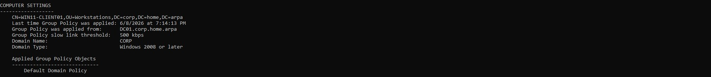
</p>

<p align="center">
  <em>Pre-GPO gpresult baseline showing only Default Domain Policy applied. No custom GPOs present.</em>
</p>

The output confirmed that only `Default Domain Policy` was applied. No custom GPOs were present. The computer account was confirmed in `OU=Workstations` and the user account was in the correct OU.

OU inheritance was then reviewed on DC01 using `Get-GPInheritance` against all three target OUs:

```powershell
Get-GPInheritance -Target "OU=Workstations,DC=corp,DC=home,DC=arpa"
Get-GPInheritance -Target "OU=User Accounts,DC=corp,DC=home,DC=arpa"
Get-GPInheritance -Target "OU=IT,DC=corp,DC=home,DC=arpa"
```

<p align="center">
  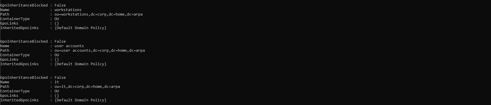
</p>

<p align="center">
  <em>Get-GPInheritance output for all three target OUs at baseline. Only Default Domain Policy inherited across all three.</em>
</p>

At baseline, all three OUs showed only `Default Domain Policy` in their inherited GPO links with no OU-level links present.

---

### Step Two - Review the Default Domain Policy

The `Default Domain Policy` was reviewed in GPMC to document the existing domain-wide configuration before making any changes.

**Password Policy:**

<p align="center">
  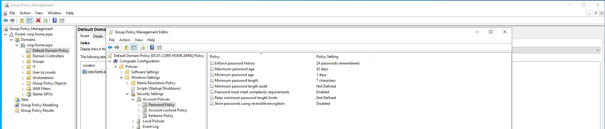
</p>

<p align="center">
  <em>Default Domain Policy password settings: complexity enabled, 7-character minimum length.</em>
</p>

Password policy was configured with complexity requirements enabled and a minimum length of 7 characters.

**Account Lockout Policy:**

<p align="center">
  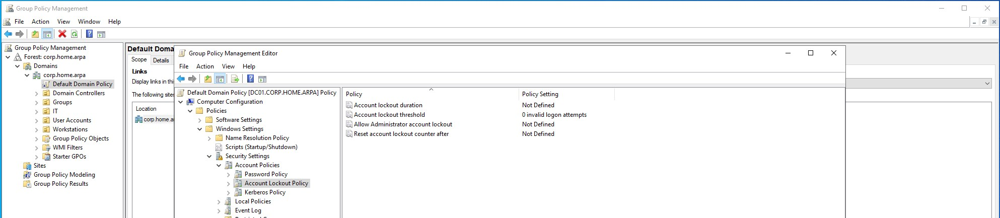
</p>

<p align="center">
  <em>Default Domain Policy account lockout settings: threshold set to 0 (lockout disabled).</em>
</p>

Account lockout was disabled (threshold = 0).

**Kerberos Policy:**

<p align="center">
  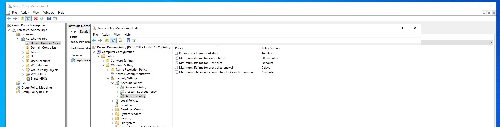
</p>

<p align="center">
  <em>Default Domain Policy Kerberos settings showing default ticket lifetime and renewal configuration.</em>
</p>

Kerberos was configured with default ticket lifetime and renewal settings.

No modifications were made to the Default Domain Policy. All custom settings in this lab were deployed through purpose-built GPOs linked to specific OUs.

---

### Step Three - Create the Workstation Security Baseline GPO

A new GPO named `Workstation-Security-Baseline` was created in GPMC on DC01.

<p align="center">
  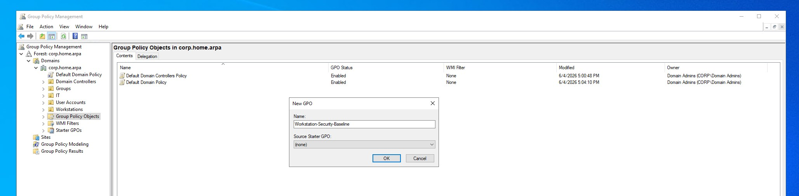
</p>

<p align="center">
  <em>Workstation-Security-Baseline GPO created in GPMC under Group Policy Objects.</em>
</p>

The User Configuration section was disabled in the GPO Properties > Details tab to make the scope of the GPO unambiguous and reduce unnecessary processing overhead.

<p align="center">
  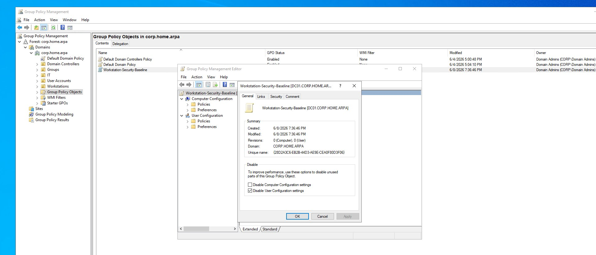
</p>

<p align="center">
  <em>User configuration settings disabled in Workstation-Security-Baseline GPO properties.</em>
</p>

The following computer-scoped settings were configured:

**Interactive logon: Machine inactivity limit** set to 900 seconds (15 minutes):

<p align="center">
  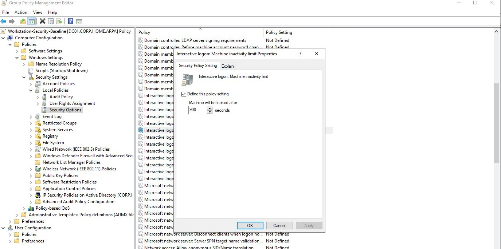
</p>

<p align="center">
  <em>Machine inactivity limit configured to 900 seconds under Security Options.</em>
</p>

**Windows Firewall: Domain profile** set to Enabled:

<p align="center">
  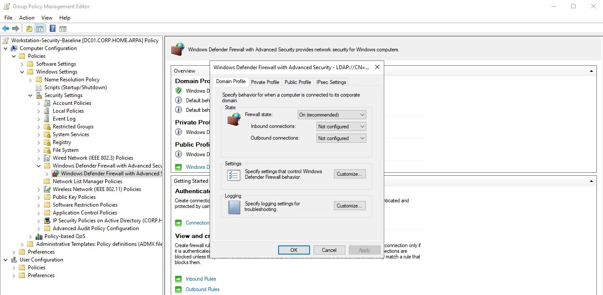
</p>

<p align="center">
  <em>Windows Firewall domain profile state set to On.</em>
</p>

**Audit account logon events** set to Success and Failure:

<p align="center">
  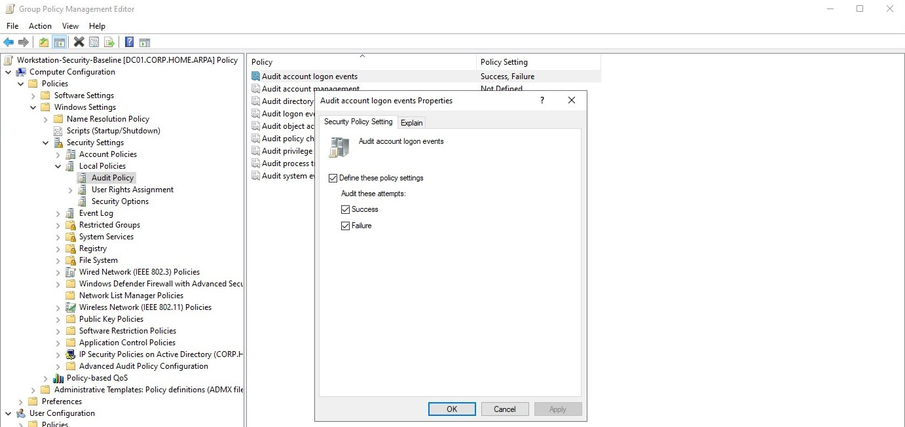
</p>

<p align="center">
  <em>Audit account logon events configured for Success and Failure.</em>
</p>

**Audit logon events** set to Success and Failure:

<p align="center">
  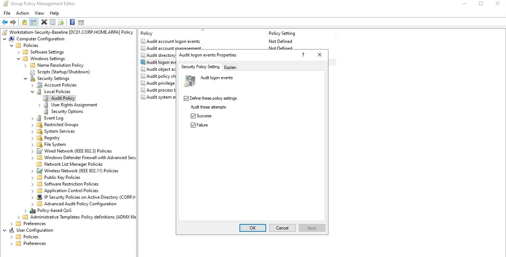
</p>

<p align="center">
  <em>Audit logon events configured for Success and Failure.</em>
</p>

The GPO was linked to `OU=Workstations`:

<p align="center">
  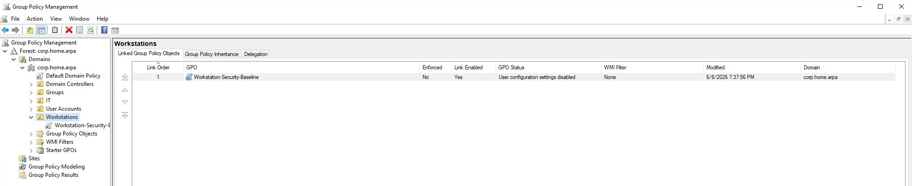
</p>

<p align="center">
  <em>Workstation-Security-Baseline GPO linked to OU=Workstations in GPMC.</em>
</p>

Inheritance was validated using `Get-GPInheritance`:

```powershell
Get-GPInheritance -Target "OU=Workstations,DC=corp,DC=home,DC=arpa"
```

```text
GpoLinks:
{Workstation-Security-Baseline}

InheritedGpoLinks:
{Workstation-Security-Baseline, Default Domain Policy}
```

This confirmed that computer accounts in `OU=Workstations` would receive both the inherited `Default Domain Policy` and the newly created `Workstation-Security-Baseline` during Group Policy processing.

---

### Step Four - Create the Standard User Environment GPO

A new GPO named `Standard-User-Environment` was created in GPMC.

<p align="center">
  
</p>

<p align="center">
  <em>Standard-User-Environment GPO created in GPMC.</em>
</p>

The Computer Configuration section was disabled:

<p align="center">
  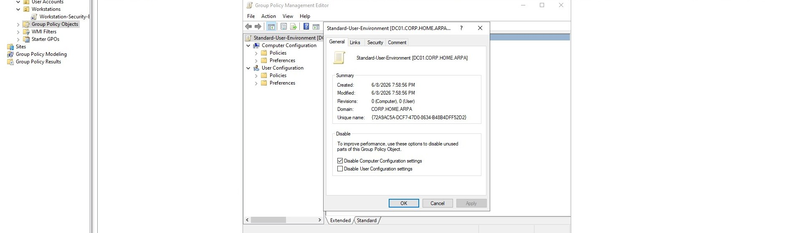
</p>

<p align="center">
  <em>Computer configuration settings disabled in Standard-User-Environment GPO properties.</em>
</p>

The following user-scoped settings were configured:

**Prohibit access to Control Panel and PC settings** set to Enabled:

<p align="center">
  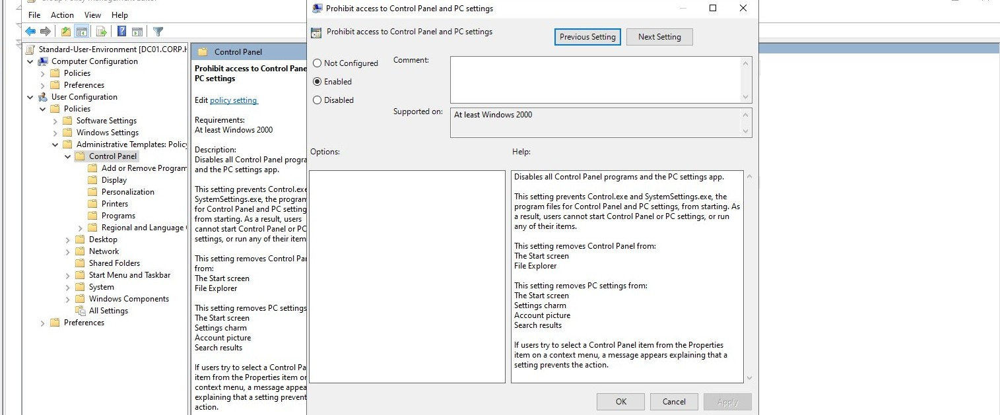
</p>

<p align="center">
  <em>Prohibit access to Control Panel and PC settings enabled.</em>
</p>

**Remove Run menu from Start Menu** set to Enabled:

<p align="center">
  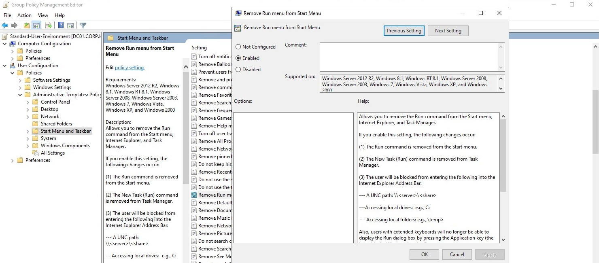
</p>

<p align="center">
  <em>Remove Run menu from Start Menu enabled.</em>
</p>

**Disable the Display Control Panel** set to Enabled:

<p align="center">
  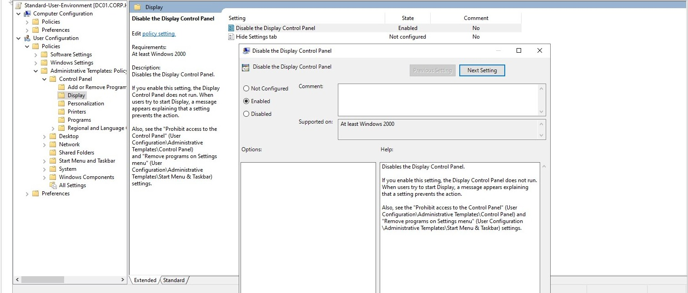
</p>

<p align="center">
  <em>Disable the Display Control Panel enabled.</em>
</p>

**Prohibit access to properties of a LAN connection** set to Enabled:

<p align="center">
  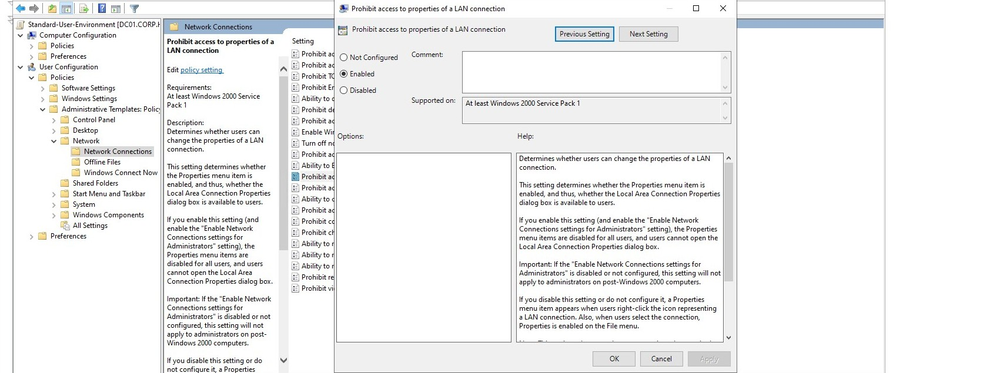
</p>

<p align="center">
  <em>Prohibit access to properties of a LAN connection enabled.</em>
</p>

The GPO was linked to `OU=User Accounts`:

<p align="center">
  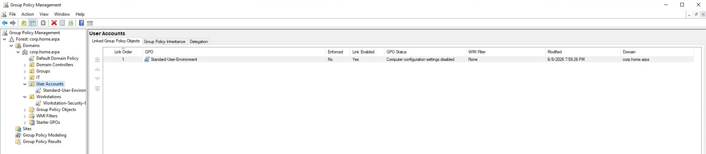
</p>

<p align="center">
  <em>Standard-User-Environment GPO linked to OU=User Accounts in GPMC.</em>
</p>

Inheritance was confirmed using `Get-GPInheritance`:

```powershell
Get-GPInheritance -Target "OU=User Accounts,DC=corp,DC=home,DC=arpa"
```

`GpoLinks` showed `Standard-User-Environment` and the OU continued to inherit `Default Domain Policy`.

---

### Step Five - Create the IT Administrator Environment GPO

A new GPO named `IT-Admin-Environment` was created in GPMC.

<p align="center">
  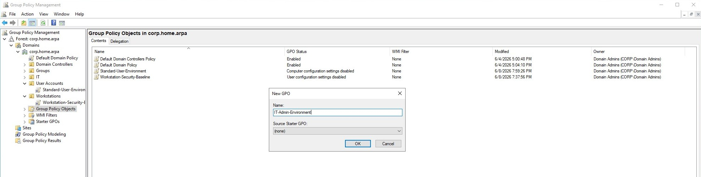
</p>

<p align="center">
  <em>IT-Admin-Environment GPO created in GPMC.</em>
</p>

The Computer Configuration section was disabled:

<p align="center">
  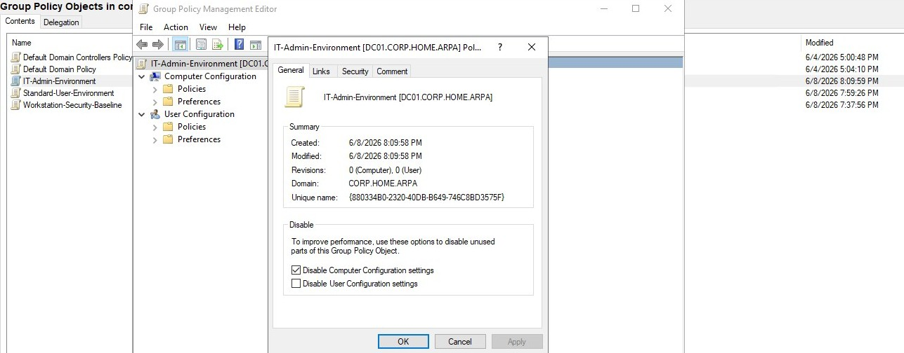
</p>

<p align="center">
  <em>Computer configuration settings disabled in IT-Admin-Environment GPO properties.</em>
</p>

**Desktop Wallpaper** was configured under User Configuration > Administrative Templates > Desktop > Desktop:

- Wallpaper Path: `C:\Windows\Web\Wallpaper\Windows\img0.jpg`
- Wallpaper Style: Fill

<p align="center">
  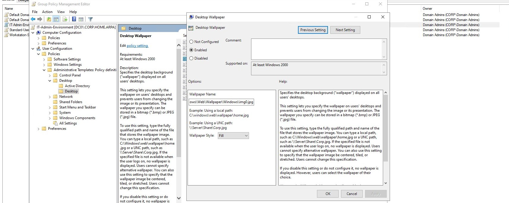
</p>

<p align="center">
  <em>Desktop wallpaper policy enabled with path and Fill style configured.</em>
</p>

The GPO was linked to `OU=IT`:

<p align="center">
  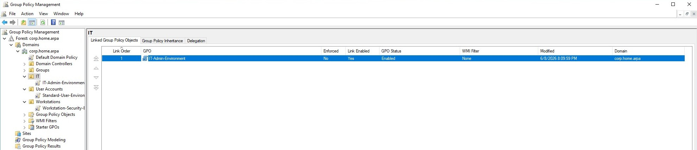
</p>

<p align="center">
  <em>IT-Admin-Environment GPO linked to OU=IT in GPMC.</em>
</p>

Inheritance was confirmed using `Get-GPInheritance`:

```powershell
Get-GPInheritance -Target "OU=IT,DC=corp,DC=home,DC=arpa"
```

`GpoLinks` showed `IT-Admin-Environment` and the OU continued to inherit `Default Domain Policy`.

---

### Step Six - Force Policy Update and Validate on WIN11-CLIENT01

Group Policy was forced on WIN11-CLIENT01:

```powershell
gpupdate /force
```

Both Computer Policy and User Policy updated successfully.

`gpresult /r` was then run in each user session to validate applied policies.

**testuser01 session:**

<p align="center">
  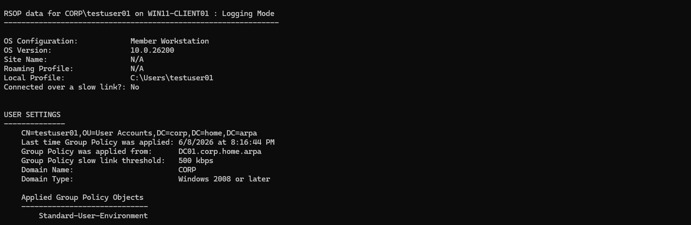
</p>

<p align="center">
  <em>gpresult output for testuser01 session confirming Standard-User-Environment applied. No denied or filtered GPOs.</em>
</p>

- User account located in `OU=User Accounts`
- `Standard-User-Environment` applied successfully
- No denied or filtered GPOs reported

**labadmin session:**

<p align="center">
  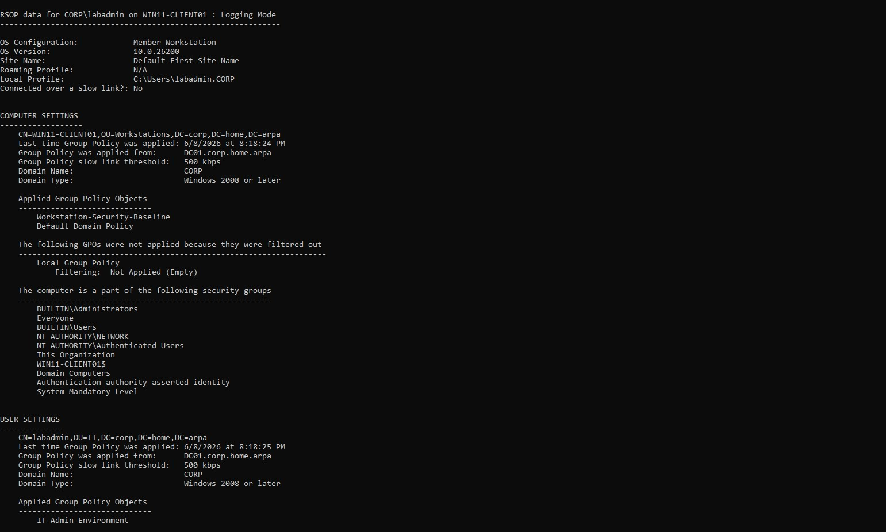
</p>

<p align="center">
  <em>gpresult output for labadmin session confirming IT-Admin-Environment applied. No denied or filtered GPOs.</em>
</p>

- User account located in `OU=IT`
- `IT-Admin-Environment` applied successfully
- No denied or filtered GPOs reported

**Computer scope (both sessions):**

- `WIN11-CLIENT01` located in `OU=Workstations`
- `Workstation-Security-Baseline` applied successfully
- `Default Domain Policy` applied successfully
- No denied or filtered GPOs reported

---

### Step Seven - Domain-Side Validation

All GPO objects and inheritance were confirmed from DC01.

```powershell
Get-GPO -All
```

<p align="center">
  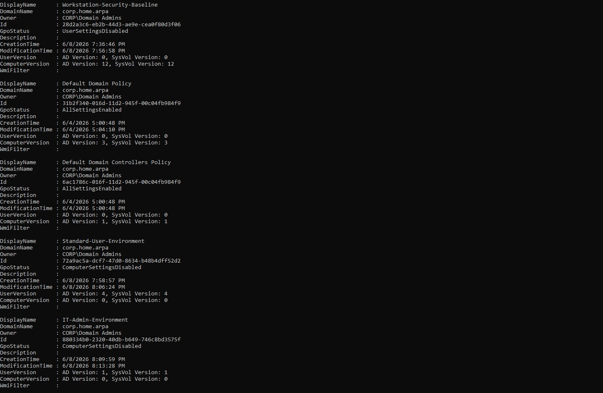
</p>

<p align="center">
  <em>Get-GPO -All output confirming all five GPOs present: the two built-in policies and all three custom GPOs created in this lab.</em>
</p>

All five GPOs were confirmed present:

- `Default Domain Policy`
- `Default Domain Controllers Policy`
- `Workstation-Security-Baseline`
- `Standard-User-Environment`
- `IT-Admin-Environment`

`Get-GPInheritance` was run against all three target OUs:

```powershell
Get-GPInheritance -Target "OU=Workstations,DC=corp,DC=home,DC=arpa"
Get-GPInheritance -Target "OU=User Accounts,DC=corp,DC=home,DC=arpa"
Get-GPInheritance -Target "OU=IT,DC=corp,DC=home,DC=arpa"
```

<p align="center">
  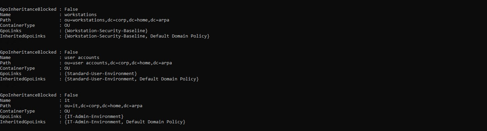
</p>

<p align="center">
  <em>Get-GPInheritance output confirming correct GPO links across all three OUs after deployment.</em>
</p>

- `Workstation-Security-Baseline` linked to `OU=Workstations`
- `Standard-User-Environment` linked to `OU=User Accounts`
- `IT-Admin-Environment` linked to `OU=IT`
- All three OUs continued to inherit `Default Domain Policy`

---

### Step Eight - Functional Validation of Applied Settings

Policy application was confirmed through behavioral testing on WIN11-CLIENT01.

**testuser01 session: Control Panel and Run restrictions**

<p align="center">
  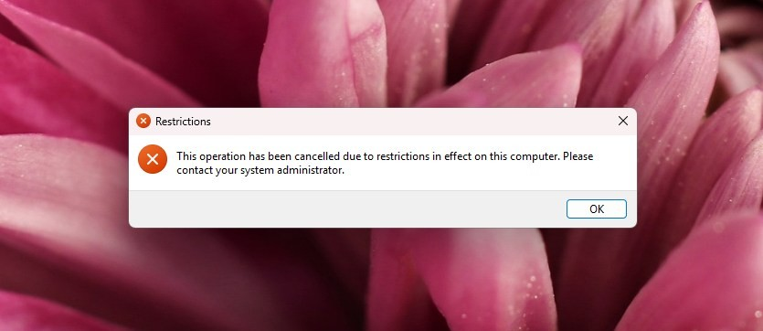
</p>

<p align="center">
  <em>Control Panel access and Run blocked for testuser01, confirming Standard-User-Environment is active.</em>
</p>

<p align="center">
  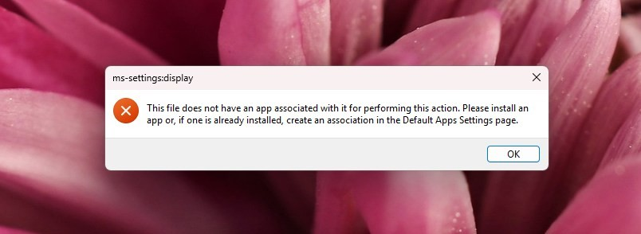
</p>

<p align="center">
  <em>Display settings restricted for testuser01 under Standard-User-Environment policy.</em>
</p>

<p align="center">
  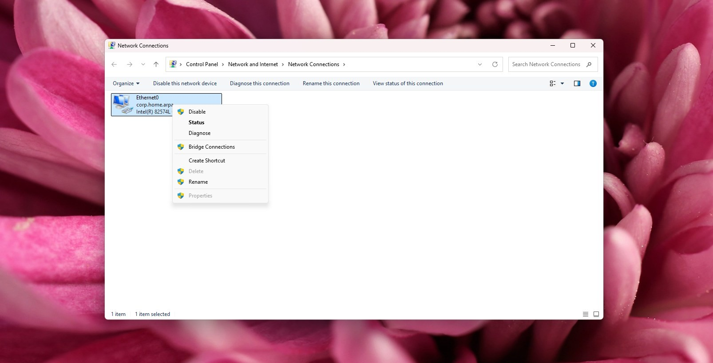
</p>

<p align="center">
  <em>LAN connection properties access blocked for testuser01.</em>
</p>

**labadmin session: Desktop wallpaper**

<p align="center">
  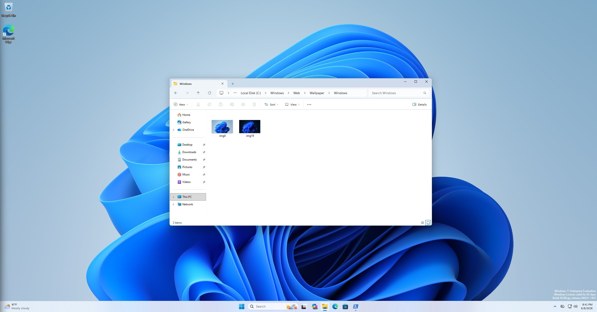
</p>

<p align="center">
  <em>labadmin desktop after IT-Admin-Environment policy application. The configured wallpaper path (img0.jpg) matched the Windows 11 default, so no visible change occurred. Policy application was confirmed via gpresult rather than visual change.</em>
</p>

The `IT-Admin-Environment` GPO was confirmed applied to `labadmin` through `gpresult` reporting. The configured wallpaper path (`C:\Windows\Web\Wallpaper\Windows\img0.jpg`) matched the system default already in use on Windows 11, so no visible wallpaper change occurred after policy application. Visual validation was inconclusive; policy application was confirmed through Group Policy Results reporting.

**Windows Firewall: Domain profile**

<p align="center">
  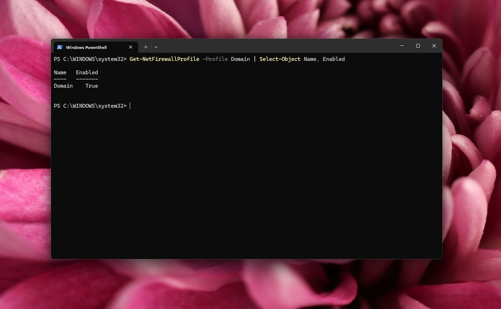
</p>

<p align="center">
  <em>Windows Firewall domain profile confirmed active under testuser01 session.</em>
</p>

<p align="center">
  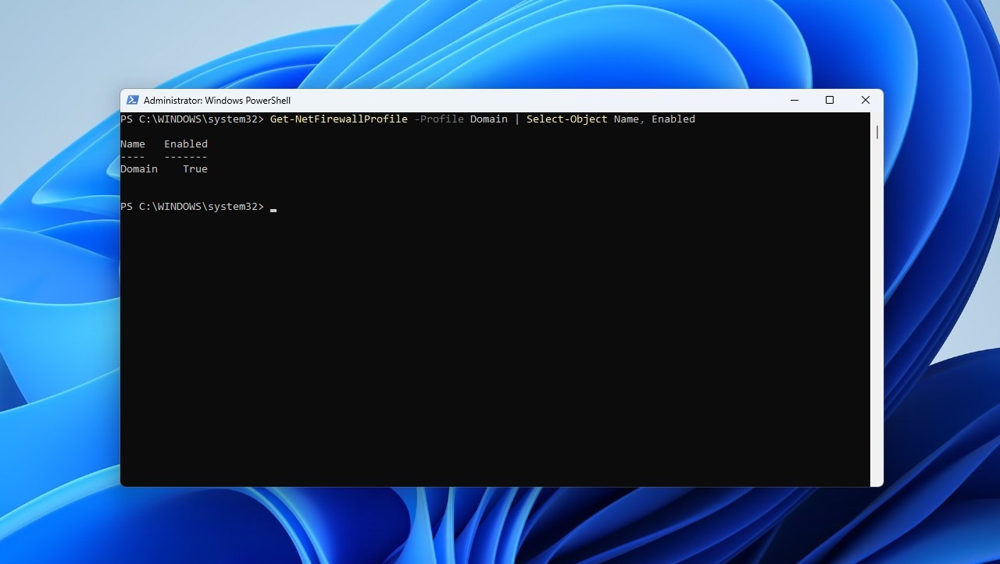
</p>

<p align="center">
  <em>Windows Firewall domain profile confirmed active under labadmin session.</em>
</p>

The firewall domain profile was active in both user sessions, confirming the computer-scoped `Workstation-Security-Baseline` policy was applied regardless of which user was logged in.

---

### Step Nine - Security Group Filtering on Workstation-Security-Baseline

Security group filtering was configured to restrict the `Workstation-Security-Baseline` GPO to members of the `Lab-Workstations` group, demonstrating filtering as a complementary targeting mechanism to OU-based linking.

`WIN11-CLIENT01` (the computer account) was added to the `Lab-Workstations` security group in ADUC:

<p align="center">
  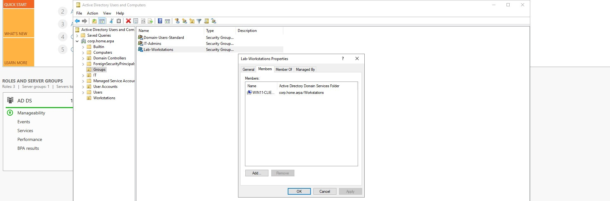
</p>

<p align="center">
  <em>WIN11-CLIENT01 computer account added to the Lab-Workstations security group in ADUC.</em>
</p>

In GPMC, the `Workstation-Security-Baseline` GPO Scope tab was opened:

<p align="center">
  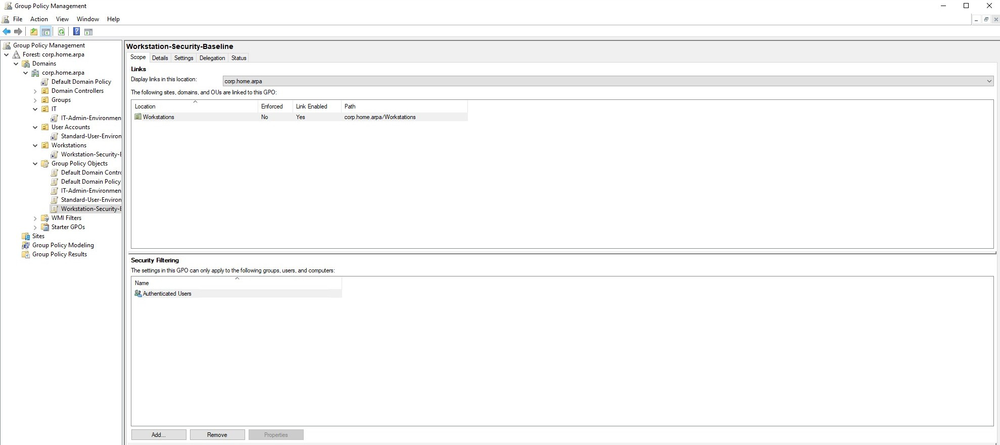
</p>

<p align="center">
  <em>Workstation-Security-Baseline Scope tab before modifying security filtering.</em>
</p>

`Lab-Workstations` was added to Security Filtering:

<p align="center">
  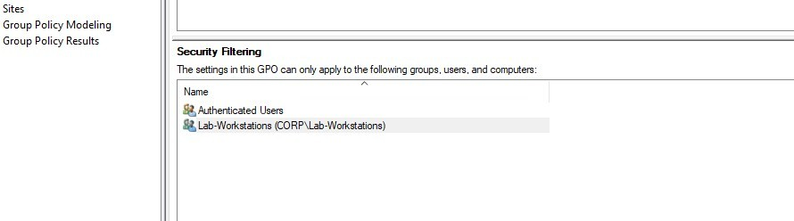
</p>

<p align="center">
  <em>Lab-Workstations added to Security Filtering on Workstation-Security-Baseline.</em>
</p>

`Authenticated Users` was then removed after `Lab-Workstations` was confirmed in place:

<p align="center">
  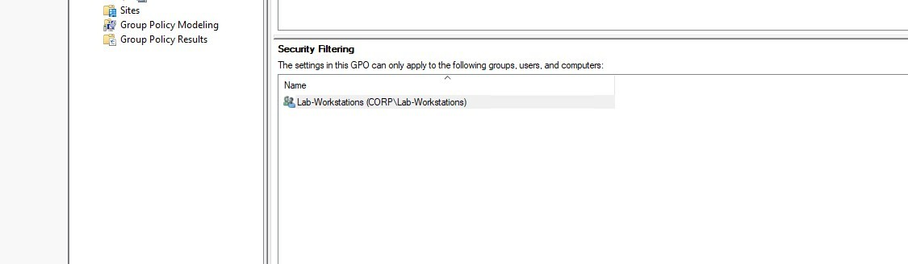
</p>

<p align="center">
  <em>Authenticated Users removed from Security Filtering after Lab-Workstations was confirmed present.</em>
</p>

`gpupdate /force` was run on WIN11-CLIENT01 and `gpresult /r` was used to confirm the GPO was still applied:

<p align="center">
  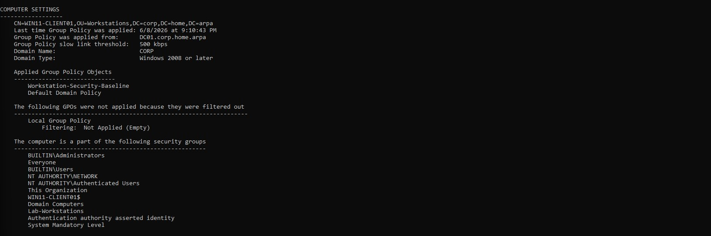
</p>

<p align="center">
  <em>gpresult confirming Workstation-Security-Baseline still applied after switching security filtering from Authenticated Users to Lab-Workstations.</em>
</p>

`Workstation-Security-Baseline` remained in the applied GPO list after the filtering switch, confirming that `WIN11-CLIENT01` membership in `Lab-Workstations` provided the required Read and Apply Group Policy permissions.

---

### Step Ten - RSoP Validation

Resultant Set of Policy was validated from WIN11-CLIENT01 and from DC01.

The RSoP HTML report confirmed that `Workstation-Security-Baseline` was applied with the `Lab-Workstations` security filter reflected correctly:

<p align="center">
  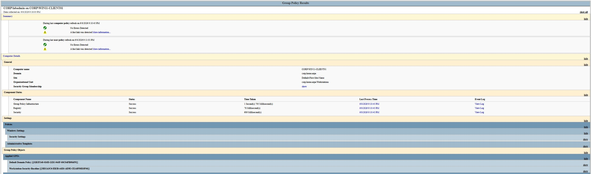
</p>

<p align="center">
  <em>RSoP report confirming Workstation-Security-Baseline applied to WIN11-CLIENT01 with Lab-Workstations security filtering reflected.</em>
</p>

The RSoP confirmed:

- `Workstation-Security-Baseline`, `Standard-User-Environment` (or `IT-Admin-Environment` depending on user), and `Default Domain Policy` all present in applied GPO list
- No GPOs listed as denied or filtered unexpectedly
- Security filtering on `Workstation-Security-Baseline` reflected correctly
- No errors or warnings present

---

### Step Eleven - Create Post-GPO Snapshots

Once all validation was complete, snapshots were created for both VMs.

**DC01 post-GPO snapshot:**

<p align="center">
  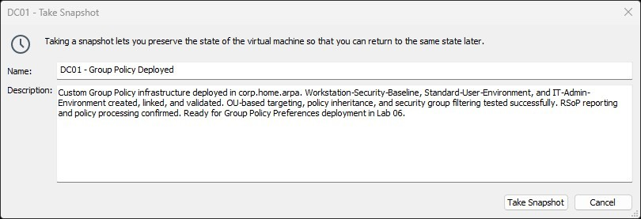
</p>

<p align="center">
  <em>DC01 snapshot created after Group Policy deployment and all validation completed.</em>
</p>

Snapshot name:

```text
DC01 - Group Policy Deployed
```

Snapshot description:

```text
Custom Group Policy infrastructure deployed in corp.home.arpa. Workstation-Security-Baseline, Standard-User-Environment, and IT-Admin-Environment created, linked, and validated. OU-based targeting, policy inheritance, and security group filtering tested successfully. RSoP reporting and policy processing confirmed. Ready for Group Policy Preferences deployment in Lab 06.
```

**WIN11-CLIENT01 post-GPO snapshot:**

<p align="center">
  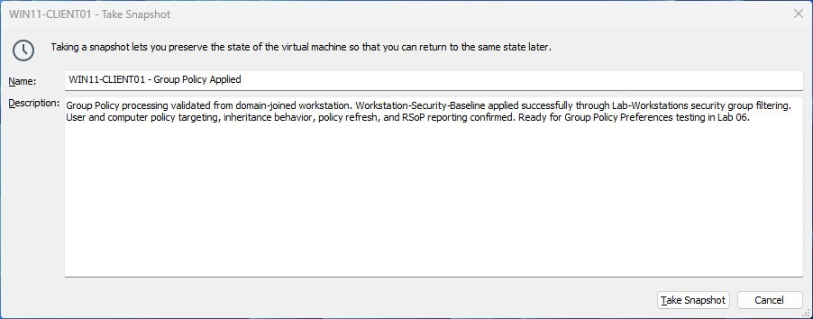
</p>

<p align="center">
  <em>WIN11-CLIENT01 snapshot created after Group Policy application and full validation pass.</em>
</p>

Snapshot name:

```text
WIN11-CLIENT01 - Group Policy Applied
```

Snapshot description:

```text
Group Policy processing validated from domain-joined workstation. Workstation-Security-Baseline applied successfully through Lab-Workstations security group filtering. User and computer policy targeting, inheritance behavior, policy refresh, and RSoP reporting confirmed. Ready for Group Policy Preferences testing in Lab 06.
```

---

## Validation Checklist

| Check | Result |
|---|---|
| Pre-GPO baseline documented via `gpresult /r` | Only `Default Domain Policy` present; no custom GPOs |
| `Get-GPInheritance` run on all three OUs at baseline | Baseline inheritance state documented |
| Default Domain Policy reviewed in GPMC | Password, lockout, and Kerberos settings documented; no modifications made |
| `Workstation-Security-Baseline` GPO created | Visible in GPMC |
| User Configuration disabled in `Workstation-Security-Baseline` | GPO Status: User configuration settings disabled |
| Computer settings configured: inactivity limit, firewall, audit policies | All four settings confirmed in GPO editor |
| `Workstation-Security-Baseline` linked to `OU=Workstations` | Confirmed in GPMC Scope tab and via `Get-GPInheritance` |
| `Standard-User-Environment` GPO created | Visible in GPMC |
| Computer Configuration disabled in `Standard-User-Environment` | GPO Status: Computer configuration settings disabled |
| User settings configured: Control Panel, Run, Display, LAN restrictions | All four settings confirmed in GPO editor |
| `Standard-User-Environment` linked to `OU=User Accounts` | Confirmed in GPMC and via `Get-GPInheritance` |
| `IT-Admin-Environment` GPO created | Visible in GPMC |
| Computer Configuration disabled in `IT-Admin-Environment` | GPO Status: Computer configuration settings disabled |
| Desktop wallpaper policy configured | Path and Fill style set; confirmed in GPO editor |
| `IT-Admin-Environment` linked to `OU=IT` | Confirmed in GPMC and via `Get-GPInheritance` |
| `gpupdate /force` completes without errors | Computer and User policy updated successfully |
| `gpresult /r` (testuser01 session) | `Workstation-Security-Baseline`, `Standard-User-Environment`, `Default Domain Policy` present |
| `gpresult /r` (labadmin session) | `Workstation-Security-Baseline`, `IT-Admin-Environment`, `Default Domain Policy` present |
| `Get-GPO -All` post-deployment | Five GPOs confirmed: two built-in, three custom |
| `Get-GPInheritance` post-deployment on all three OUs | GPO links reflected correctly across all three |
| `testuser01` functional validation: Control Panel blocked | Confirmed |
| `testuser01` functional validation: Run menu absent | Confirmed |
| `testuser01` functional validation: display settings restricted | Confirmed |
| `testuser01` functional validation: LAN properties blocked | Confirmed |
| `labadmin` functional validation: wallpaper policy applied | Confirmed via gpresult; visual change inconclusive (img0.jpg matches Windows 11 default) |
| Windows Firewall domain profile active | Confirmed in both testuser01 and labadmin sessions |
| `WIN11-CLIENT01` added to `Lab-Workstations` | Visible in ADUC group membership |
| Security filtering switched to `Lab-Workstations` | `Authenticated Users` removed after `Lab-Workstations` confirmed in place |
| `Workstation-Security-Baseline` still applied after filtering switch | `gpresult /r` confirms GPO in applied list after `gpupdate /force` |
| RSoP validated | No denied GPOs, no errors, security filtering reflected correctly |
| DC01 post-GPO snapshot created | Visible in VMware snapshot manager |
| WIN11-CLIENT01 post-GPO snapshot created | Visible in VMware snapshot manager |

---

## Potential Issues and Notes

### Default Domain Policy Should Not Be Modified

The Default Domain Policy and Default Domain Controllers Policy are the built-in baseline GPOs that ship with Active Directory. All custom settings belong in purpose-built GPOs linked to specific OUs. Modifying the built-in policies directly makes troubleshooting harder and risks affecting all objects in the domain rather than the intended targets.

### GPO Scope: Computer vs User Configuration

Computer Configuration applies when the computer account processes policy at boot. User Configuration applies when the user account processes policy at logon. The two scopes are processed independently. Disabling the unused section in each GPO keeps scope unambiguous and improves processing performance on the client.

### OU-Based Targeting Is Not Precedence Resolution

`labadmin` and `testuser01` reside in different OUs and receive different GPOs. This is OU-based targeting, not precedence or conflict resolution. There is no inheritance conflict in this lab because the two user-scoped GPOs are linked to entirely separate OUs with no parent-child relationship. If both were linked to the same OU or along the same inheritance path, precedence rules would apply. That scenario is not present here.

### Security Filtering: Add Before Remove

When switching security filtering from `Authenticated Users` to `Lab-Workstations`, always add the replacement group and confirm its permissions before removing `Authenticated Users`. Removing `Authenticated Users` first causes the workstation to immediately lose access to the GPO before a replacement is in place.

### gpresult Requires an Elevated Session for Computer Policy

Running `gpresult /r` from a non-elevated session may not show the Computer Policy section. Run from an elevated PowerShell session to see both scopes.

### Group Policy Replication Latency

In a single-DC environment, GPO changes on DC01 are immediately available to domain clients after `gpupdate /force`. In multi-DC environments, replication latency is a common source of inconsistent policy application.

---

## Outcome

Group Policy infrastructure for `corp.home.arpa` is fully deployed and validated. Three purpose-built GPOs govern the domain workstation environment and user populations. Computer-scoped policy applies to WIN11-CLIENT01 through `OU=Workstations`. User-scoped policies apply independently to `testuser01` and `labadmin` through their respective OUs. Security group filtering on `Workstation-Security-Baseline` is in effect with `Lab-Workstations` as the active filter.

The following was completed and validated during this lab:

- pre-GPO baseline documented via `gpresult` and `Get-GPInheritance` before any custom GPOs were created
- Default Domain Policy reviewed in GPMC; password, lockout, and Kerberos settings documented; no modifications made
- `Workstation-Security-Baseline` created with inactivity limit, firewall, and audit policy settings; User Configuration disabled; linked to `OU=Workstations`
- `Standard-User-Environment` created with Control Panel, Run, display, and LAN restrictions; Computer Configuration disabled; linked to `OU=User Accounts`
- `IT-Admin-Environment` created with desktop wallpaper policy; Computer Configuration disabled; linked to `OU=IT`
- `gpupdate /force` and `gpresult /r` validated in both `testuser01` and `labadmin` sessions on WIN11-CLIENT01
- `Get-GPO -All` confirmed all five GPOs present post-deployment
- `Get-GPInheritance` confirmed correct links on all three OUs
- functional restrictions confirmed for `testuser01`; wallpaper policy confirmed applied for `labadmin` via RSoP
- Windows Firewall domain profile confirmed active in both user sessions
- `WIN11-CLIENT01` added to `Lab-Workstations`; security filtering switched from `Authenticated Users` to `Lab-Workstations`; GPO confirmed still applied after `gpupdate /force`
- RSoP validated with no GPOs denied unexpectedly, no errors, and security filtering reflected correctly
- post-GPO snapshots created for both DC01 and WIN11-CLIENT01

The environment is ready for:

- Linux AD integration via SSSD and Kerberos on the Ubuntu Server host (Lab 06)
- Windows event log collection and SIEM integration via Wazuh (Lab 07)
