# 06 - Linux and AD Integration Lab

## Status

Completed

---

## Overview

This lab extends the Active Directory identity infrastructure deployed in Labs 03, 04, and 05 into the Linux environment, making Active Directory the authoritative identity provider for both Windows and Linux systems in the `corp.home.arpa` domain.

Labs 03 through 05 established a complete Windows-centric identity platform: a fully promoted domain controller, a domain-joined workstation, and Group Policy infrastructure governing both machine behavior and user environments. Every authentication event in the enterprise environment flowed through DC01. Every identity was resolved from Active Directory. Group Policy governed what users could and could not do on Windows endpoints.

Linux had been absent from that picture until now. The Ubuntu Server host at `192.168.1.226` operated entirely outside the AD domain. It authenticated users against local `/etc/passwd` and `/etc/shadow` files. It had no awareness of `corp.home.arpa`, no relationship with DC01, and no way to resolve AD identities. This lab closes that gap.

SSSD (System Security Services Daemon) and its supporting components were deployed on the Ubuntu Server host, the host was joined to the `corp.home.arpa` domain, and it was configured to resolve identity information and authenticate users directly against Active Directory via Kerberos. A dedicated Active Directory security group (`Linux-Admins`) gates access to the Linux host, demonstrating centralized authentication and centralized authorization across a hybrid environment.

This is not a Linux administration lab. It is an identity integration lab. The central outcome is that Active Directory is now the single authoritative identity provider across both Windows and Linux infrastructure, and identity, authentication, and authorization all flow from the same source regardless of the target platform.

This lab represents the first major convergence point between the Linux Infrastructure track and the Enterprise Infrastructure track.

---

## Objectives

- create the `Linux-Admins` security group in Active Directory and populate it with `labadmin`
- validate DNS resolution of `corp.home.arpa` from the Ubuntu Server host before attempting domain join
- validate time synchronization between the Ubuntu Server host and DC01 before attempting domain join
- install `realmd`, `sssd`, `adcli`, `krb5-user`, and supporting packages on the Ubuntu Server host
- perform realm discovery against `corp.home.arpa` from the Ubuntu Server host
- join the Ubuntu Server host to the `corp.home.arpa` domain using `realm join`
- confirm the Ubuntu Server computer account was created in Active Directory
- configure SSSD to allow access exclusively to members of the `Linux-Admins` group
- validate that Active Directory user and group identities resolve on the Ubuntu Server host
- validate Kerberos ticket acquisition for AD users from the Ubuntu Server host
- validate that `labadmin` (a member of `Linux-Admins`) can authenticate to the Ubuntu Server host
- validate that `testuser01` (not a member of `Linux-Admins`) is denied access to the Ubuntu Server host
- validate SSH authentication to the Ubuntu Server host using Active Directory credentials
- create post-integration snapshots for DC01 and WIN11-CLIENT01

All objectives were completed successfully.

---

## Project Context

Labs 03, 04, and 05 built the identity foundation this lab depends on. That sequence mattered: a domain had to exist before anything could join it, a client had to join before Group Policy could be meaningfully validated, and Group Policy had to be validated before expanding identity infrastructure into new platforms. Each lab in the enterprise track was designed to produce a validated baseline that the next lab could rely on.

This lab is the first point where the Linux Infrastructure track and the Enterprise Infrastructure track converge. The Ubuntu Server host has been operating as a standalone infrastructure platform running Docker, hosting the monitoring stack, operating as the reverse proxy endpoint, and serving as the primary Linux administration environment. None of those workloads were modified here. The integration is purely at the identity layer: how users authenticate to the host, how identity is resolved, and who is permitted access.

The decision to use `realmd` and SSSD rather than manual Kerberos and LDAP configuration was deliberate. `realmd` handles the domain join workflow in a way that is operationally clean and well-tested against Active Directory. SSSD provides caching, PAM integration, and NSS integration through a single service. This is the standard, well-supported path for Linux AD integration in enterprise environments.

The `Linux-Admins` security group is new to this lab. The existing groups (`IT-Admins`, `Domain-Users-Standard`, `Lab-Workstations`) were designed around Windows policy targeting. `Linux-Admins` serves a different purpose: it is the authorization gate for the Linux infrastructure layer. Not every AD user should be permitted to log into the Ubuntu Server host. `Linux-Admins` defines who can.

---

## Technologies Used

- Active Directory Domain Services (AD DS)
- Kerberos Authentication Protocol
- SSSD (System Security Services Daemon)
- realmd
- adcli
- PAM (Pluggable Authentication Modules)
- NSS (Name Service Switch)
- Ubuntu Server 26.04 LTS
- Windows Server 2022 Standard Evaluation
- Active Directory Users and Computers (ADUC)
- PowerShell (AD cmdlets for group management)
- OpenSSH

---

## Architecture and Topology

After this lab, the Ubuntu Server host is a domain member with identity sourced from Active Directory.

```text
Windows 11 Workstation (192.168.1.x) [hypervisor and management endpoint]
|
+-- VMware Workstation
    |
    +-- DC01 (192.168.1.10) [domain controller]
    |   +-- Windows Server 2022 Standard Evaluation
    |   +-- Active Directory Domain Services
    |   +-- AD-Integrated DNS (corp.home.arpa)
    |   +-- Kerberos KDC
    |   +-- Linux-Admins group (labadmin member)
    |   +-- Group Policy: three custom GPOs deployed and validated
    |
    +-- WIN11-CLIENT01 (192.168.1.20) [domain-joined workstation]
        +-- corp.home.arpa domain member
        +-- Group Policy applied and validated

            <-> LAN (192.168.1.0/24)

Ubuntu Server 26.04 LTS (192.168.1.226) [domain-joined Linux host]
+-- realmd: domain join tooling
+-- SSSD: identity and authentication broker
|   +-- AD Provider: identity sourced from DC01
|   +-- Kerberos: authentication tickets from DC01 KDC
|   +-- PAM integration: authentication pipeline
|   +-- NSS integration: identity resolution pipeline
+-- Access Control: Linux-Admins group membership required
+-- Docker infrastructure: unchanged
+-- Monitoring stack: unchanged
+-- Reverse proxy: unchanged
```

### Authentication and Authorization Flow

```text
User
  |
  v
Active Directory (DC01 - 192.168.1.10)
  |
  v
Kerberos KDC (ticket issuance and validation)
  |
  v
SSSD (identity and authentication broker on Ubuntu Server)
  |
  +-- NSS: resolves uid, gid, group membership from AD
  +-- PAM: validates Kerberos ticket against DC01
  |
  v
Authorization check: Linux-Admins group membership
  |
  +-- member     --> access granted
  +-- non-member --> access denied
  |
  v
SSH / Linux login session
  |
  v
Ubuntu Server 26.04 LTS
```

### Active Directory Structure After Lab 06

```text
corp.home.arpa [domain]
|
+-- Default Domain Policy [not modified]
|
+-- Domain Controllers [OU]
|   +-- DC01.corp.home.arpa
|
+-- IT [OU]
|   +-- IT-Admin-Environment GPO
|   +-- labadmin
|
+-- User Accounts [OU]
|   +-- Standard-User-Environment GPO
|   +-- testuser01
|
+-- Workstations [OU]
|   +-- Workstation-Security-Baseline GPO
|   |   +-- Security Filter: Lab-Workstations
|   +-- WIN11-CLIENT01 (computer account)
|   +-- UBUNTU-SERVER (computer account)
|
+-- Groups [OU]
    +-- IT-Admins
    +-- Domain-Users-Standard
    +-- Lab-Workstations
    +-- Linux-Admins
        +-- labadmin (member)
```

---

## Prerequisites

- Lab 03 completed and validated
- Lab 04 completed and validated
- Lab 05 completed and validated
- DC01 post-GPO snapshot (`DC01 - Group Policy Deployed`) verified
- WIN11-CLIENT01 post-GPO snapshot (`WIN11-CLIENT01 - Group Policy Applied`) verified
- DC01 at static IP `192.168.1.10` with RDP operational
- Ubuntu Server at static IP `192.168.1.226` with SSH operational
- Ubuntu Server can reach DC01 (`192.168.1.10`) via ICMP
- Domain accounts operational: `labadmin` (Domain Admins, IT-Admins), `testuser01` (Domain-Users-Standard)
- OU structure intact: IT, User Accounts, Workstations, Groups
- Administrative access to DC01 via RDP for AD configuration steps

---

## Deployment Steps

### Phase One: Active Directory Preparation

Before touching the Ubuntu Server host, the Active Directory environment was prepared to receive a Linux domain member.

#### 1.1 Create the Linux-Admins Security Group

A new security group named `Linux-Admins` was created in the `Groups` OU from DC01 using PowerShell:

```powershell
New-ADGroup -Name "Linux-Admins" `
            -GroupScope Global `
            -GroupCategory Security `
            -Path "OU=Groups,DC=corp,DC=home,DC=arpa" `
            -Description "Authorized administrators of Linux infrastructure systems"

Add-ADGroupMember -Identity "Linux-Admins" -Members "labadmin"
```

Group membership was validated immediately after creation:

```powershell
Get-ADGroupMember "Linux-Admins"
```

`labadmin` was confirmed as the sole member. `testuser01` was deliberately not added. This account was reserved to validate that access denial works correctly in Phase Four.

<p align="center">
  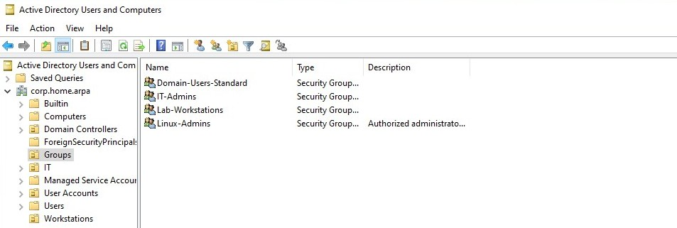
</p>

<p align="center">
  <em>Linux-Admins security group created in OU=Groups and labadmin confirmed as member via PowerShell on DC01.</em>
</p>

<p align="center">
  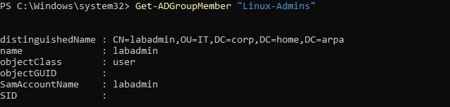
</p>

<p align="center">
  <em>Get-ADGroupMember output confirming labadmin is the sole member of Linux-Admins.</em>
</p>

---

### Phase Two: DNS, Connectivity, and Time Synchronization

Before attempting domain join, DNS resolution, network reachability, time synchronization, and hostname configuration were all validated and corrected where needed.

#### 2.1 DNS Discovery and Validation

DNS resolution for the `corp.home.arpa` domain was tested from the Ubuntu Server host before any integration work began.

Initial validation failed:

```bash
nslookup corp.home.arpa
nslookup -type=SRV _kerberos._tcp.corp.home.arpa
```

Both queries returned `NXDOMAIN`.

<p align="center">
  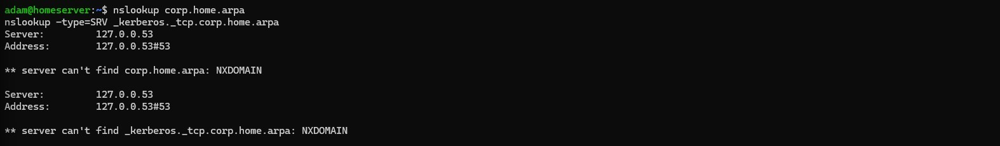
</p>

<p align="center">
  <em>Initial nslookup for corp.home.arpa and the Kerberos SRV record both returning NXDOMAIN from the Ubuntu Server host.</em>
</p>

The active resolver configuration was reviewed:

```bash
resolvectl status
```

<p align="center">
  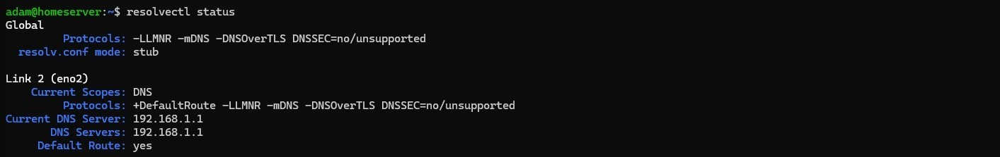
</p>

<p align="center">
  <em>resolvectl status showing 192.168.1.1 (the router) as the active DNS server on eno2. DC01 was not in the resolver list.</em>
</p>

Ubuntu was using `systemd-resolved` with the router (`192.168.1.1`) as its upstream DNS server, supplied via DHCP. The router has no knowledge of the `corp.home.arpa` zone or its AD SRV records. Querying DC01 directly confirmed the AD DNS infrastructure itself was healthy; the Ubuntu host simply was not using it.

The existing Netplan configuration was reviewed:

```bash
sudo cat /etc/netplan/*.yaml
```

<p align="center">
  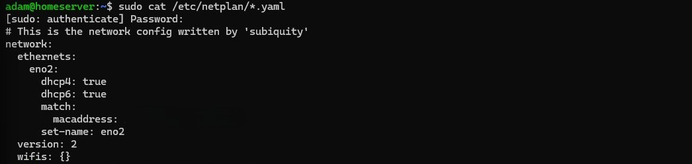
</p>

<p align="center">
  <em>Initial Netplan configuration for eno2 showing DHCP enabled with no explicit nameservers defined.</em>
</p>

DC01 (`192.168.1.10`) was added as an explicit nameserver under the `eno2` interface while keeping DHCP enabled for IP assignment:

<p align="center">
  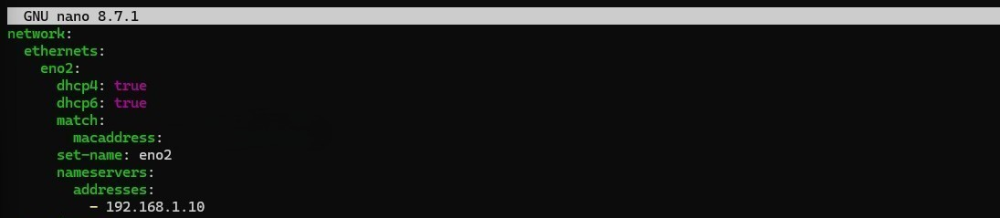
</p>

<p align="center">
  <em>Updated Netplan configuration with 192.168.1.10 added under nameservers for eno2.</em>
</p>

The configuration was applied:

```bash
sudo netplan apply
```

Resolver status was verified again:

```bash
resolvectl status
```

<p align="center">
  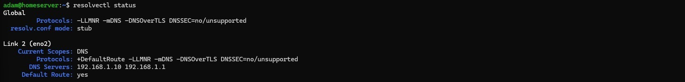
</p>

<p align="center">
  <em>resolvectl status after netplan apply confirming DC01 (192.168.1.10) is now the active DNS server on eno2.</em>
</p>

DNS validation was repeated for the domain name and both Kerberos and LDAP SRV records:

```bash
nslookup corp.home.arpa
nslookup -type=SRV _kerberos._tcp.corp.home.arpa
nslookup -type=SRV _ldap._tcp.corp.home.arpa
```

<p align="center">
  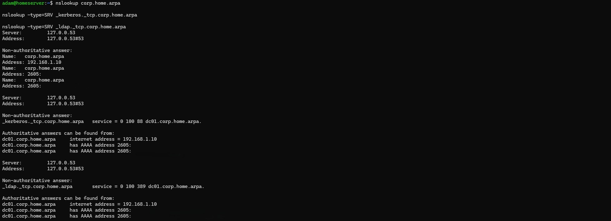
</p>

<p align="center">
  <em>All three DNS queries resolving correctly through DC01: corp.home.arpa, the Kerberos SRV record, and the LDAP SRV record all returning expected results.</em>
</p>

All three resolved successfully through the default resolver. `corp.home.arpa` returned `192.168.1.10`. Both SRV records pointed to `dc01.corp.home.arpa` on the correct ports. The Ubuntu host could now locate all AD services required for domain join.

#### 2.2 Domain Controller Reachability Validation

Network connectivity to DC01 was confirmed:

```bash
ping -c 4 192.168.1.10
```

<p align="center">
  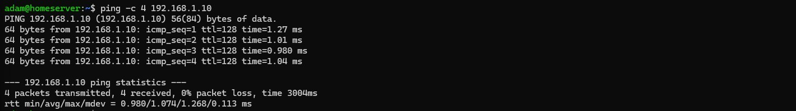
</p>

<p align="center">
  <em>Ping to DC01 (192.168.1.10) confirming Layer 3 connectivity from the Ubuntu Server host with zero packet loss.</em>
</p>

Zero packet loss confirmed. The Ubuntu Server host had full IP connectivity to the domain controller.

#### 2.3 Kerberos Time Synchronization Validation

Kerberos authentication fails if clock drift between a client and the KDC exceeds five minutes. Time synchronization was validated before proceeding:

```bash
timedatectl status
```

<p align="center">
  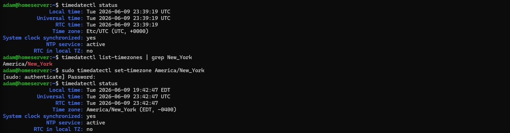
</p>

<p align="center">
  <em>timedatectl status confirming NTP service active, system clock synchronized, and timezone set to America/New_York (EDT).</em>
</p>

`System clock synchronized: yes` and `NTP service: active` were both confirmed. The system timezone was set to `America/New_York` to align with the local lab environment. Kerberos clock skew requirements were satisfied.

#### 2.4 Hostname Standardization

The Ubuntu Server host was originally deployed with the hostname `homeserver`. Before joining the Active Directory domain, the hostname was standardized to `ubuntu-server` to align with the documented infrastructure naming convention. Because `realm join` uses the current hostname when creating the computer account in Active Directory, this change had to occur before the join.

```bash
sudo hostnamectl set-hostname ubuntu-server
```

<p align="center">
  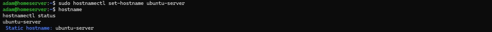
</p>

<p align="center">
  <em>hostnamectl set-hostname command setting the hostname to ubuntu-server.</em>
</p>

The new hostname was validated:

<p align="center">
  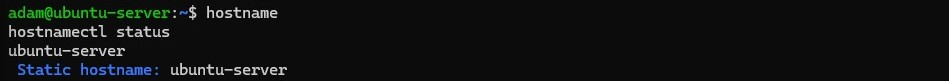
</p>

<p align="center">
  <em>hostname and hostnamectl status both confirming ubuntu-server as the active hostname.</em>
</p>

With DNS, connectivity, time synchronization, and hostname all confirmed, the host was in a clean state for domain join.

---

### Phase Three: Package Installation and Domain Join

#### 3.1 Package Installation

The following packages were installed to support AD integration:

| Package | Purpose |
|---|---|
| `realmd` | Domain discovery and join tooling |
| `sssd` | Core SSSD daemon and identity broker |
| `sssd-tools` | SSSD command-line utilities |
| `adcli` | Active Directory join utility used by realmd |
| `krb5-user` | Kerberos client utilities (`kinit`, `klist`, `kdestroy`) |
| `samba-common-bin` | Samba utilities required by realmd |
| `packagekit` | Package management integration used by realmd |

```bash
sudo apt update
sudo apt install -y realmd sssd sssd-tools adcli krb5-user \
    samba-common-bin packagekit
```

During installation, the `krb5-user` package prompted for a default Kerberos realm:

<p align="center">
  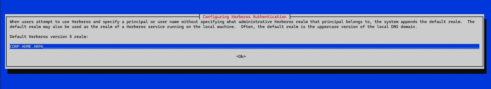
</p>

<p align="center">
  <em>krb5-user installation prompting for a default Kerberos realm. CORP.HOME.ARPA was entered.</em>
</p>

`CORP.HOME.ARPA` was entered. `oddjob` and `oddjob-mkhomedir` were not used; home directory creation was handled through PAM in Phase Four.

#### 3.2 Realm Discovery

Before joining, `realm discover` was run to query DNS for the AD domain's SRV records and contact DC01 directly to gather realm information:

```bash
realm discover corp.home.arpa
```

<p align="center">
  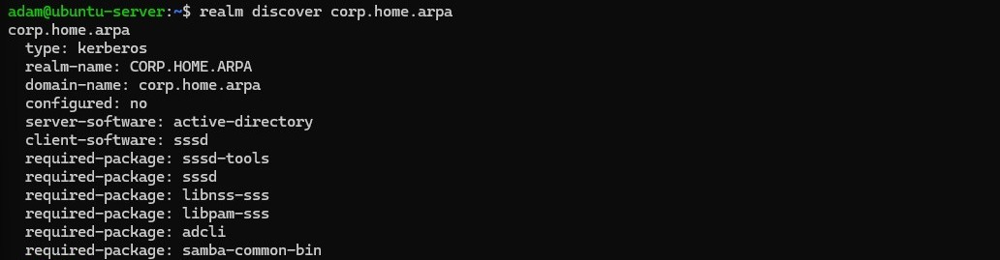
</p>

<p align="center">
  <em>realm discover output confirming corp.home.arpa is reachable and identified as an active-directory realm with sssd as the required client software.</em>
</p>

Discovery returned the expected AD realm information: `CORP.HOME.ARPA` as the Kerberos realm, `corp.home.arpa` as the domain name, `active-directory` as the domain type, `sssd` as the client software, and the required package list. DC01 was reachable and the realm was correctly identified.

#### 3.3 Domain Join

The domain join was performed using `realm join` with `labadmin` as the authorizing account:

```bash
sudo realm join -U labadmin corp.home.arpa
```

`labadmin` is a member of Domain Admins and has permission to create computer accounts in Active Directory. `realm join` acquired a Kerberos ticket for `labadmin`, created the computer account, configured SSSD, wrote `/etc/sssd/sssd.conf`, and registered the host keytab at `/etc/krb5.keytab`.

The join completed with no errors. `realm list` was run immediately after to confirm the domain was active:

<p align="center">
  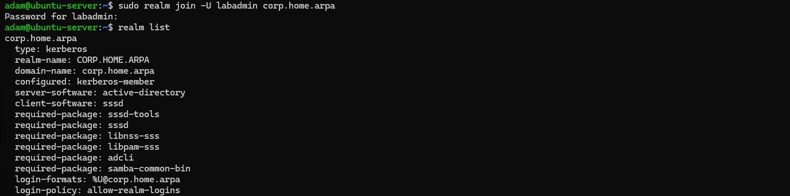
</p>

<p align="center">
  <em>realm join completing successfully and realm list confirming corp.home.arpa is configured as a kerberos-member with active-directory as the server software and sssd as the client.</em>
</p>

`realm list` confirmed `corp.home.arpa` as the configured realm with `server-software: active-directory`, `client-software: sssd`, and `login-policy: allow-realm-logins`.

#### 3.4 Active Directory Computer Account Validation

The Ubuntu Server computer account was validated from DC01 immediately after the join:

<p align="center">
  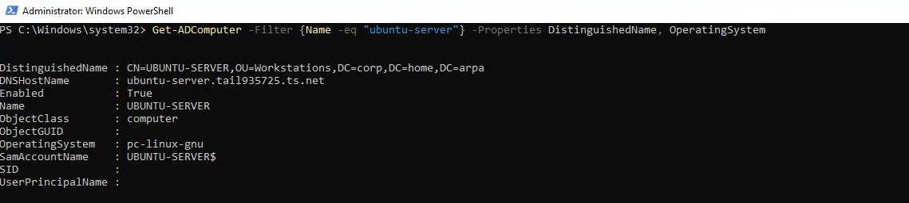
</p>

<p align="center">
  <em>PowerShell on DC01 confirming the UBUNTU-SERVER computer account exists in Active Directory, placed in OU=Workstations, with the DNS hostname and OS attributes populated.</em>
</p>

The computer account was created as `UBUNTU-SERVER` and landed in `OU=Workstations`, confirming that the `redircmp` redirect from Lab 03 was still operational. The object showed the DNS hostname and the Linux OS attributes.

---

### Phase Four: SSSD Configuration and Access Control

By default, after a successful `realm join`, SSSD permits all domain users to authenticate to the host. Access was restricted to members of `Linux-Admins` before any login testing was performed.

#### The Authentication vs. Authorization Distinction

Authentication and authorization are distinct operations that SSSD handles separately.

**Authentication** answers: "Is this identity valid?" SSSD contacts DC01 via Kerberos to verify the user's credentials. If the credentials are valid, authentication succeeds. At this point, Active Directory has confirmed the identity, but the system has not yet decided whether to permit access.

**Authorization** answers: "Is this identity permitted access to this specific host?" A user can be a valid member of the AD domain (`testuser01` is) but still be denied access if they are not a member of `Linux-Admins`. The `simple_allow_groups` directive runs after authentication succeeds and determines whether the authenticated identity may open a session.

This architecture means a single AD credential store can serve multiple Linux systems with different authorization policies. Access decisions are controlled per-system through SSSD configuration, while identity and credential verification always go through the same domain controller.

#### 4.2 Restrict Access to Linux-Admins

Access was restricted using `realm permit`:

```bash
sudo realm permit -g 'Linux-Admins@corp.home.arpa'
```

This command modified `/etc/sssd/sssd.conf` to use the `simple` access provider with `Linux-Admins@corp.home.arpa` as the permitted group.

<p align="center">
  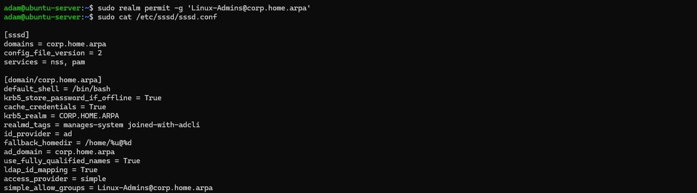
</p>

<p align="center">
  <em>realm permit command restricting access to Linux-Admins@corp.home.arpa. SSSD authorization switched from the default AD access provider to the simple access provider.</em>
</p>

After modification, file permissions were confirmed and SSSD was restarted. SSSD requires `0600` permissions and `root` ownership on `sssd.conf`; it refuses to start with weaker permissions:

```bash
sudo chmod 0600 /etc/sssd/sssd.conf
sudo chown root:root /etc/sssd/sssd.conf
sudo systemctl restart sssd
```

<p align="center">
  
</p>

<p align="center">
  <em>sssd.conf permissions confirmed at 0600 with root ownership before restarting SSSD.</em>
</p>

#### 4.3 Home Directory Configuration

Ubuntu Server 26.04 contained the `libpam-mkhomedir` package but did not have the PAM module enabled by default after the AD join. The initial PAM configuration was inspected:

```bash
grep mkhomedir /etc/pam.d/common-session
```

<p align="center">
  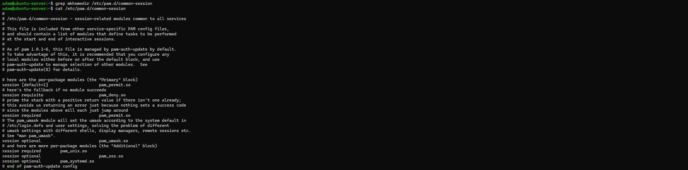
</p>

<p align="center">
  <em>Initial PAM common-session showing no pam_mkhomedir entry present after the realm join.</em>
</p>

No `pam_mkhomedir` entry was present. The PAM configuration utility was launched to enable it:

```bash
sudo pam-auth-update
```

<p align="center">
  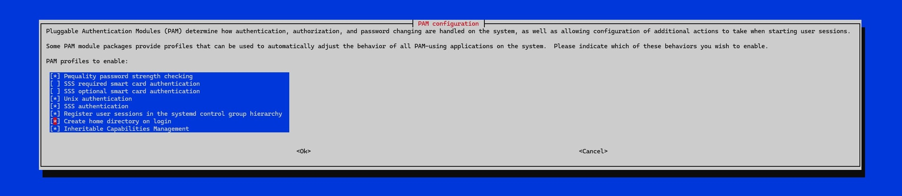
</p>

<p align="center">
  <em>pam-auth-update interactive menu with the Create home directory on login option selected.</em>
</p>

The **Create home directory on login** option was enabled. The PAM configuration was then verified:

```bash
grep mkhomedir /etc/pam.d/common-session
```

<p align="center">
  
</p>

<p align="center">
  <em>pam_mkhomedir now present in common-session after running pam-auth-update.</em>
</p>

Home directory creation was now configured to trigger automatically on first login for any AD user.

#### 4.4 SSSD Configuration Review

The complete `sssd.conf` written by `realm join` and modified by `realm permit` was reviewed to confirm its final state:

<p align="center">
  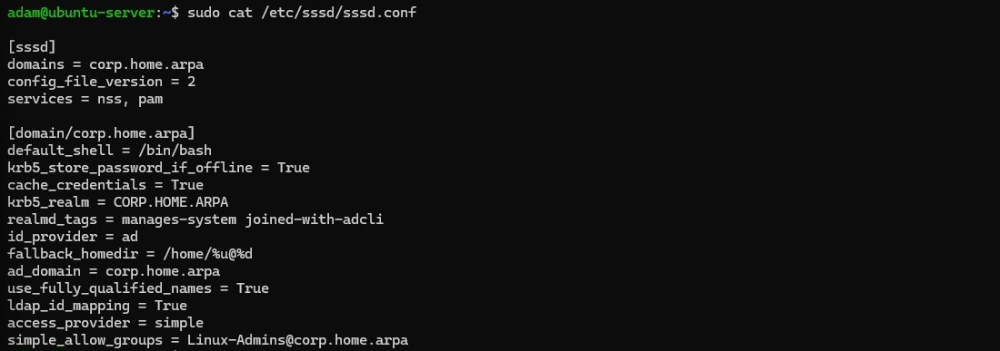
</p>

<p align="center">
  <em>Complete sssd.conf after realm join and realm permit, showing the AD domain configuration with access_provider = simple and simple_allow_groups = Linux-Admins@corp.home.arpa.</em>
</p>

Key directives confirmed in the final configuration:

| Directive | Value | Purpose |
|---|---|---|
| `id_provider` | `ad` | Identity sourced from Active Directory |
| `ldap_id_mapping` | `True` | UIDs/GIDs derived algorithmically from AD SIDs |
| `access_provider` | `simple` | Access controlled via allow/deny list |
| `simple_allow_groups` | `Linux-Admins@corp.home.arpa` | Only members of this group may log in |
| `cache_credentials` | `True` | Allows offline authentication if DC01 is temporarily unreachable |
| `use_fully_qualified_names` | `True` | Users referenced as `username@corp.home.arpa` |
| `fallback_homedir` | `/home/%u@%d` | Home directory path template for AD users |

---

### Phase Five: Identity and Authentication Validation

#### 5.1 Realm State

The realm state was confirmed using `realm list`:

<p align="center">
  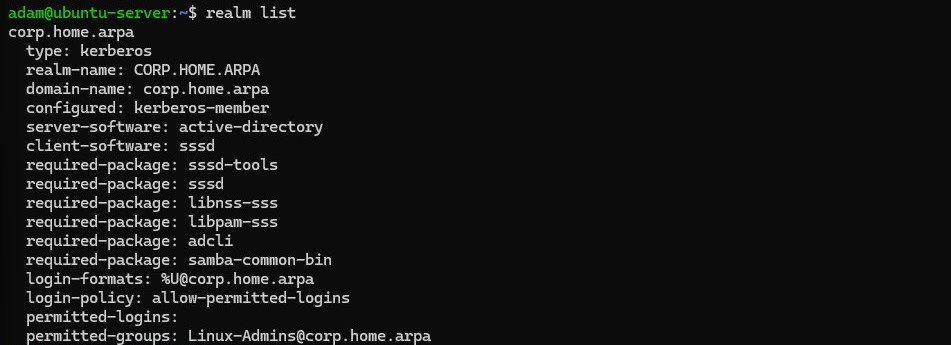
</p>

<p align="center">
  <em>realm list output showing corp.home.arpa as an active-directory realm with sssd as the client and the login-policy reflecting the Linux-Admins restriction.</em>
</p>

#### 5.2 AD User Identity Resolution

`labadmin` was resolved via SSSD:

```bash
id labadmin@corp.home.arpa
```

<p align="center">
  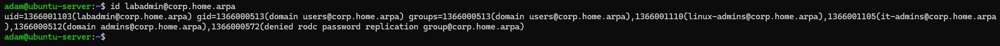
</p>

<p align="center">
  <em>id command returning a UID, GID, and group list for labadmin@corp.home.arpa sourced from Active Directory through SSSD.</em>
</p>

`testuser01` was also resolved:

```bash
id testuser01@corp.home.arpa
```

<p align="center">
  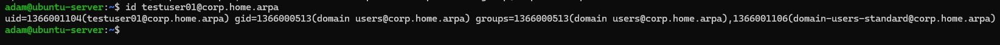
</p>

<p align="center">
  <em>id command returning identity information for testuser01@corp.home.arpa. Identity resolution succeeds for any domain user; access control is evaluated separately at login time.</em>
</p>

Both users resolved successfully. This is expected: SSSD resolves the identity of any domain user through NSS. Whether a user is permitted to log in is a separate decision made at PAM evaluation time against the `simple_allow_groups` list.

NSS database queries were run to confirm AD identities were visible to the Linux system:

```bash
getent passwd labadmin@corp.home.arpa
getent passwd testuser01@corp.home.arpa
getent group Linux-Admins@corp.home.arpa
```

<p align="center">
  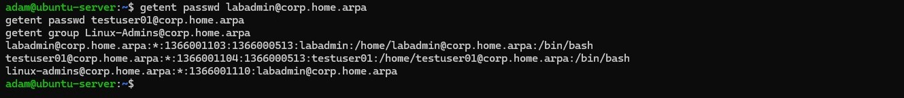
</p>

<p align="center">
  <em>getent returning passwd entries for both domain users and the Linux-Admins group entry with labadmin listed as a member, all sourced from Active Directory through SSSD.</em>
</p>

All three queries returned results sourced from Active Directory. UIDs and GIDs were derived from AD SIDs via SSSD's ID mapping. `getent group` showed `Linux-Admins@corp.home.arpa` with `labadmin` listed as a member.

#### 5.3 Kerberos Authentication Validation

A Kerberos ticket was requested directly for `labadmin`:

```bash
kinit labadmin@CORP.HOME.ARPA
klist
```

<p align="center">
  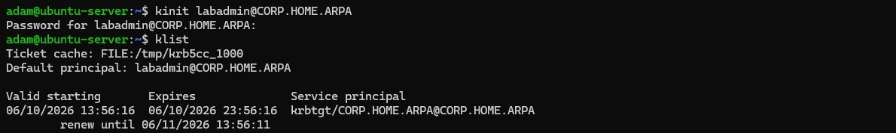
</p>

<p align="center">
  <em>kinit acquiring a TGT for labadmin@CORP.HOME.ARPA and klist confirming the ticket with start time, end time, and renew-until values.</em>
</p>

`kinit` succeeded and `klist` showed a valid TGT for `labadmin@CORP.HOME.ARPA` issued by DC01. This confirmed that the Ubuntu Server host could reach DC01 on the Kerberos port and that the Kerberos configuration was correct. The ticket was cleared with `kdestroy` after validation.

#### 5.4 SSH Authentication Validation

SSH authentication was tested from the management workstation using Active Directory credentials.

**Successful authentication (labadmin):**

`labadmin` is a member of `Linux-Admins` and is expected to be permitted access.

<p align="center">
  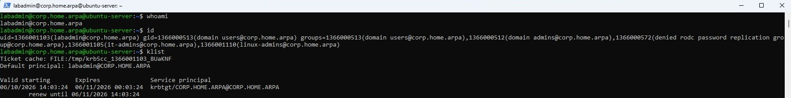
</p>

<p align="center">
  <em>labadmin SSH session established successfully. whoami, id, and klist output confirm the identity is sourced from Active Directory and a Kerberos ticket is present in the session.</em>
</p>

The session opened. `whoami` and `id` confirmed the AD-sourced identity. `klist` confirmed a Kerberos ticket was present within the authenticated session. The home directory was created automatically on first login by `pam_mkhomedir`.

**Denied authentication (testuser01):**

`testuser01` is a valid AD user but is not a member of `Linux-Admins`. Authentication was expected to be denied at the PAM authorization step.

<p align="center">
  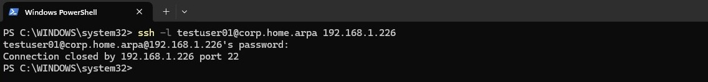
</p>

<p align="center">
  <em>testuser01 SSH attempt denied. Kerberos authentication against DC01 succeeded; the session was rejected because testuser01 is not a member of Linux-Admins.</em>
</p>

The `testuser01` login was denied. Kerberos authentication against DC01 succeeded (Active Directory confirmed the identity), but SSSD's `simple_allow_groups` check determined that `testuser01` was not a member of `Linux-Admins` and rejected the session. This is the lab's clearest demonstration of the authentication vs. authorization separation: a valid AD credential that cannot open a session because the account lacks group-based authorization.

#### 5.5 Active Directory-Side Validation

Validation was completed from DC01 using PowerShell to confirm the state from the authoritative source.

```powershell
# Confirm the Ubuntu Server computer account exists
Get-ADComputer -Filter {Name -eq "ubuntu-server"} -Properties DistinguishedName, OperatingSystem

# Confirm Linux-Admins group membership
Get-ADGroupMember -Identity "Linux-Admins"

# Confirm labadmin is a member of Linux-Admins
(Get-ADUser labadmin -Properties MemberOf).MemberOf

# Confirm testuser01 is NOT a member of Linux-Admins
(Get-ADUser testuser01 -Properties MemberOf).MemberOf
```

<p align="center">
  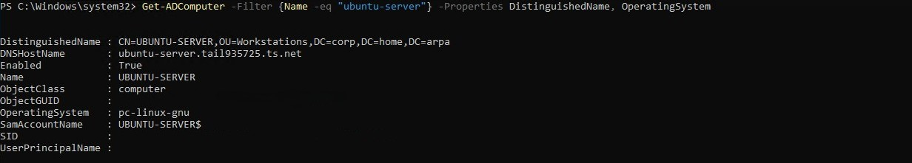
</p>

<p align="center">
  <em>PowerShell on DC01 confirming the ubuntu-server computer account exists in OU=Workstations with the expected DistinguishedName and OS attributes.</em>
</p>

<p align="center">
  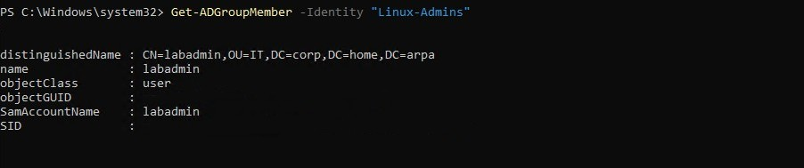
</p>

<p align="center">
  <em>Get-ADGroupMember confirming labadmin is listed as a member of Linux-Admins.</em>
</p>

<p align="center">
  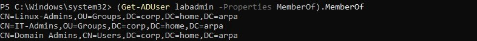
</p>

<p align="center">
  <em>labadmin MemberOf output confirming Linux-Admins is present in the group membership list.</em>
</p>

<p align="center">
  
</p>

<p align="center">
  <em>testuser01 MemberOf output confirming Linux-Admins is absent from the group membership list, which explains the SSH denial observed in the previous step.</em>
</p>

All four PowerShell checks passed. The AD-side state was consistent with the behavior observed from the Linux side.

ADUC was also used to visually confirm placement:

<p align="center">
  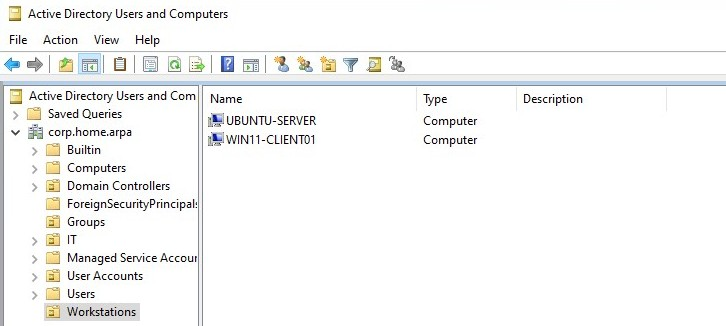
</p>

<p align="center">
  <em>ADUC showing the UBUNTU-SERVER computer account in OU=Workstations alongside WIN11-CLIENT01.</em>
</p>

<p align="center">
  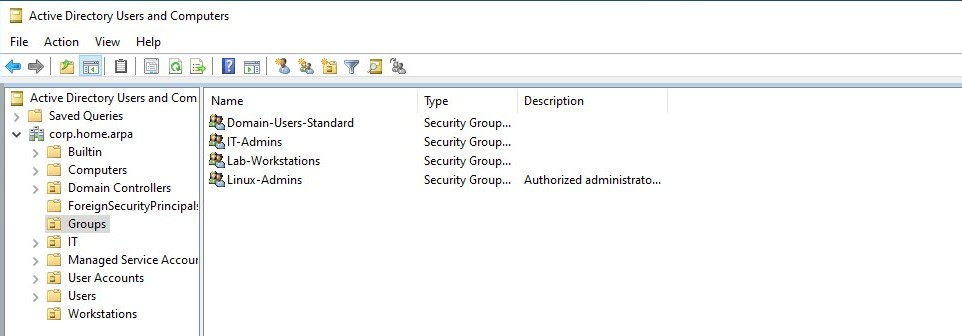
</p>

<p align="center">
  <em>ADUC showing the Linux-Admins security group in OU=Groups.</em>
</p>

<p align="center">
  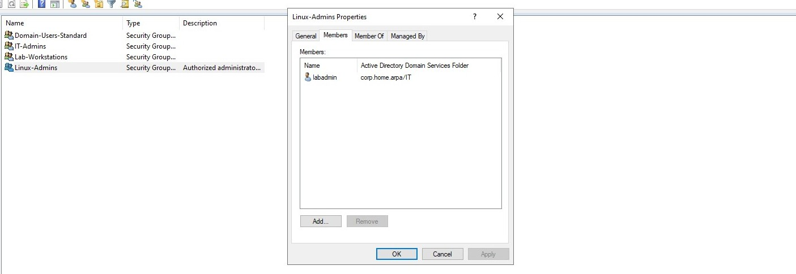
</p>

<p align="center">
  <em>Linux-Admins group membership in ADUC confirming labadmin as a member.</em>
</p>

#### 5.6 Post-Integration Snapshots

After all Linux-side and Active Directory-side validation completed successfully, post-lab snapshots were created for both VMs.

**DC01 post-integration snapshot:**

<p align="center">
  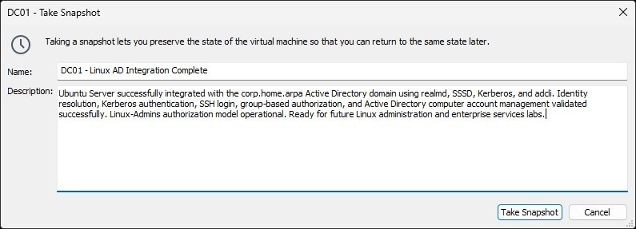
</p>

<p align="center">
  <em>DC01 snapshot created after full Linux AD integration validation.</em>
</p>

Snapshot name:

```text
DC01 - Linux AD Integration Complete
```

Snapshot description:

```text
Ubuntu Server successfully integrated with the corp.home.arpa Active Directory domain using realmd, SSSD, Kerberos, and adcli. Identity resolution, Kerberos authentication, SSH login, group-based authorization, and Active Directory computer account management validated successfully. Linux-Admins authorization model operational. Ready for future Linux administration and enterprise services labs.
```

**WIN11-CLIENT01 post-integration snapshot:**

<p align="center">
  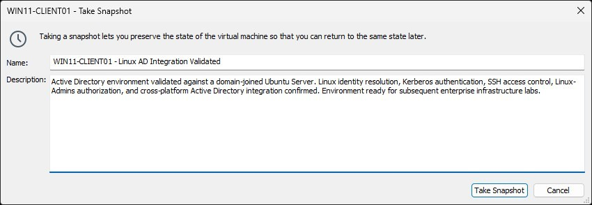
</p>

<p align="center">
  <em>WIN11-CLIENT01 snapshot created after Active Directory environment was validated against the domain-joined Ubuntu Server.</em>
</p>

Snapshot name:

```text
WIN11-CLIENT01 - Linux AD Integration Validated
```

Snapshot description:

```text
Active Directory environment validated against a domain-joined Ubuntu Server. Linux identity resolution, Kerberos authentication, SSH access control, Linux-Admins authorization, and cross-platform Active Directory integration confirmed. Environment ready for subsequent enterprise infrastructure labs.
```

`UBUNTU-SERVER` operates on dedicated physical hardware and is not included in the VMware snapshot strategy.

---

## Validation Checklist

| Check | Result |
|---|---|
| `Linux-Admins` security group created in `OU=Groups` | Confirmed via ADUC and `Get-ADGroup` |
| `labadmin` added to `Linux-Admins` | Confirmed via `Get-ADGroupMember` |
| `testuser01` not added to `Linux-Admins` | Confirmed |
| DC01 reachable from Ubuntu Server | Confirmed: zero packet loss via `ping` |
| `corp.home.arpa` resolves from Ubuntu Server | Confirmed via `nslookup` after Netplan update |
| Kerberos SRV record resolves | `_kerberos._tcp.corp.home.arpa` returns DC01 |
| LDAP SRV record resolves | `_ldap._tcp.corp.home.arpa` returns DC01 |
| DNS fix: DC01 added to Netplan nameservers | Applied and verified via `resolvectl status` |
| Time synchronized | `timedatectl`: NTP active, clock synchronized |
| Hostname standardized to `ubuntu-server` | Confirmed via `hostname` and `hostnamectl status` |
| Packages installed | `realmd`, `sssd`, `sssd-tools`, `adcli`, `krb5-user`, `samba-common-bin`, `packagekit` |
| `krb5-user` realm prompt answered | `CORP.HOME.ARPA` entered |
| `realm discover corp.home.arpa` succeeded | Active Directory realm confirmed |
| `realm join -U labadmin corp.home.arpa` succeeded | No errors; exit code 0 |
| `realm list` confirms domain joined | `corp.home.arpa`, `sssd`, configured |
| Computer account `UBUNTU-SERVER` in `OU=Workstations` | Confirmed via ADUC and PowerShell |
| `realm permit -g Linux-Admins@corp.home.arpa` applied | `sssd.conf` updated to `access_provider = simple` |
| `sssd.conf` permissions set to `0600` | Confirmed |
| SSSD restarted after configuration | Confirmed |
| `pam_mkhomedir` enabled via `pam-auth-update` | Entry present in `/etc/pam.d/common-session` |
| `labadmin@corp.home.arpa` identity resolves via `id` | UID, GID, group list returned from AD |
| `testuser01@corp.home.arpa` identity resolves via `id` | Identity resolvable; access denied at login |
| `getent passwd` returns entries for both AD users | Confirmed |
| `getent group Linux-Admins@corp.home.arpa` returns group | Confirmed with `labadmin` as member |
| Kerberos TGT acquired via `kinit` | Confirmed; ticket visible via `klist` |
| SSH login: `labadmin` | Session opened; home directory created; Kerberos ticket present |
| SSH login: `testuser01` | Denied at PAM authorization step |
| `Get-ADComputer` confirms `ubuntu-server` in AD | Confirmed with correct DN and OS attributes |
| `Get-ADGroupMember Linux-Admins` | `labadmin` confirmed as member |
| `testuser01` MemberOf does not include `Linux-Admins` | Confirmed |
| ADUC: UBUNTU-SERVER visible in `OU=Workstations` | Confirmed |
| ADUC: `Linux-Admins` visible in `OU=Groups` | Confirmed |
| ADUC: `labadmin` visible in `Linux-Admins` membership | Confirmed |
| DC01 post-integration snapshot created | Visible in VMware snapshot manager |
| WIN11-CLIENT01 post-integration snapshot created | Visible in VMware snapshot manager |

---

## Troubleshooting

### DNS Not Pointing to DC01

The initial DNS failure was not a misconfiguration in the AD zone. AD DNS on DC01 was healthy: direct queries against `192.168.1.10` returned correct results for `corp.home.arpa` and all SRV records. The problem was that Ubuntu was using the router (`192.168.1.1`) as its default DNS server via DHCP, and the router has no knowledge of the `corp.home.arpa` zone.

This mirrors the DNS issue encountered in Lab 04, where WIN11-CLIENT01 had an IPv6 DNS path routing AD discovery queries to the router. The pattern is the same in both cases: the AD infrastructure is healthy, but the client is not directing queries to the right server.

The fix was to explicitly add DC01 to the Netplan `nameservers` list for `eno2` while keeping DHCP enabled for IP assignment. After `netplan apply`, `resolvectl status` confirmed DC01 was the active DNS server and all SRV record queries resolved correctly.

The test that matters is SRV record resolution via the default resolver, not just `nslookup corp.home.arpa`. `realm discover` and `realm join` both depend on SRV records. Confirming `_kerberos._tcp.corp.home.arpa` and `_ldap._tcp.corp.home.arpa` resolve correctly is the real pre-flight check.

### PAM Home Directory Configuration Not Applied Automatically

On Ubuntu Server 26.04, `libpam-mkhomedir` was installed as part of the SSSD packages but the PAM module was not enabled automatically during the realm join. Running `grep mkhomedir /etc/pam.d/common-session` after the join showed no entry.

`pam-auth-update` had to be run manually and the **Create home directory on login** option explicitly selected before the PAM configuration was written. Without this step, the first SSH login for an AD user would fail because no home directory exists and there is no mechanism to create one.

### SSSD Configuration File Permissions

SSSD is deliberately strict about its configuration file. If `/etc/sssd/sssd.conf` is not owned by `root` with mode `0600`, SSSD refuses to start. The error in the systemd journal references configuration file permissions. This is easy to encounter after manually editing the file. The fix:

```bash
sudo chmod 0600 /etc/sssd/sssd.conf
sudo chown root:root /etc/sssd/sssd.conf
sudo systemctl restart sssd
```

---

## Outcome

Active Directory is now the authoritative identity provider for both Windows and Linux systems in the `corp.home.arpa` environment. The Ubuntu Server host authenticates and authorizes users through the same domain controller that governs WIN11-CLIENT01. The same `labadmin` credentials that administer DC01 and WIN11-CLIENT01 authenticate to the Ubuntu Server host. Identity is centralized.

The following was completed and validated during this lab:

- `Linux-Admins` security group created in `OU=Groups` with `labadmin` as the sole member
- DNS resolution corrected by adding DC01 to the Ubuntu Server Netplan nameservers; Kerberos and LDAP SRV records confirmed resolvable via the default resolver
- DC01 reachability confirmed from Ubuntu Server
- Kerberos time synchronization validated; timezone set to `America/New_York`
- Hostname standardized from `homeserver` to `ubuntu-server` before domain join
- Required packages installed; `CORP.HOME.ARPA` entered at the `krb5-user` realm prompt
- `realm discover corp.home.arpa` confirmed AD realm reachability
- `realm join` completed successfully; `realm list` confirmed domain membership
- `UBUNTU-SERVER` computer account created in `OU=Workstations` via the `redircmp` redirect from Lab 03
- `realm permit` restricted access to `Linux-Admins@corp.home.arpa`; `sssd.conf` permissions confirmed at `0600`
- `pam-auth-update` run to enable `pam_mkhomedir` for automatic home directory creation
- AD user identity resolution confirmed for both `labadmin` and `testuser01` via `id` and `getent`
- Kerberos TGT acquired for `labadmin` via `kinit`; ticket confirmed via `klist`
- `labadmin` SSH session established; home directory created on first login; Kerberos ticket present in session
- `testuser01` SSH session denied at PAM authorization step; authentication succeeded but authorization failed due to absent `Linux-Admins` membership
- AD-side validation confirmed from DC01: computer account, group membership, `labadmin` member status, and `testuser01` non-member status all confirmed via PowerShell and ADUC
- Post-integration snapshots created for DC01 and WIN11-CLIENT01

The environment is now ready for:

- Security monitoring and event collection via Wazuh (Lab 07): both Windows and Linux endpoints are in scope, and centralized identity means log events carry consistent AD identities across platforms
- Future Linux infrastructure expansion: additional Linux hosts can join `corp.home.arpa` and inherit the same identity and access control infrastructure established here
