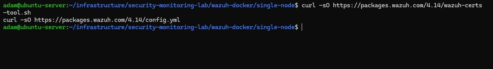
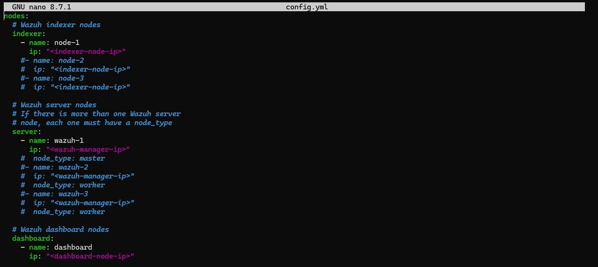
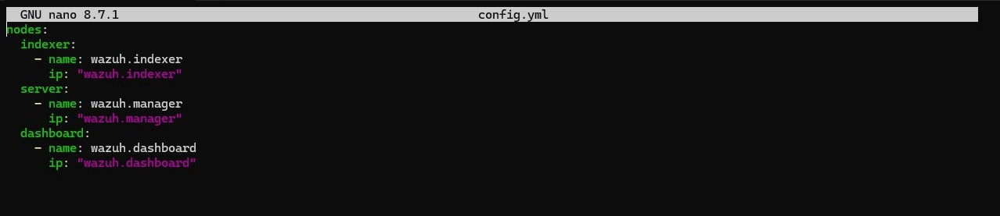
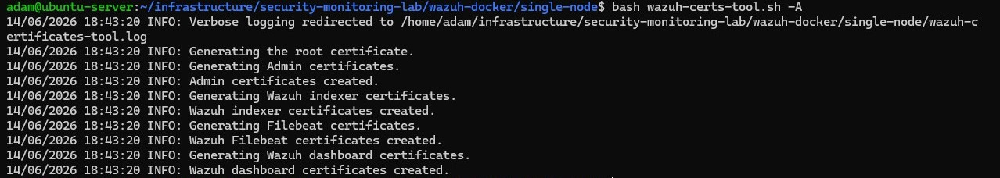
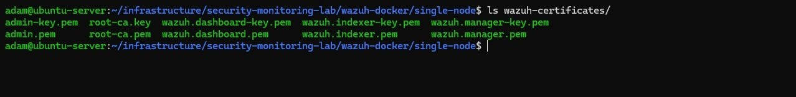
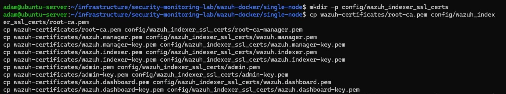
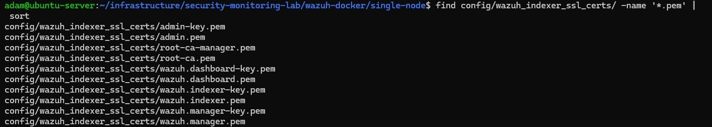
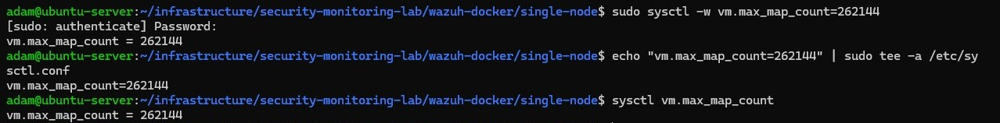
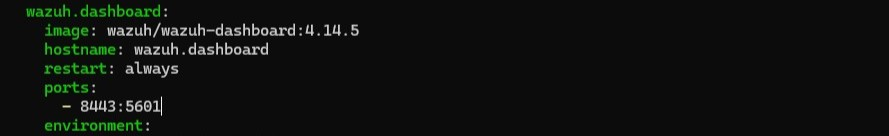
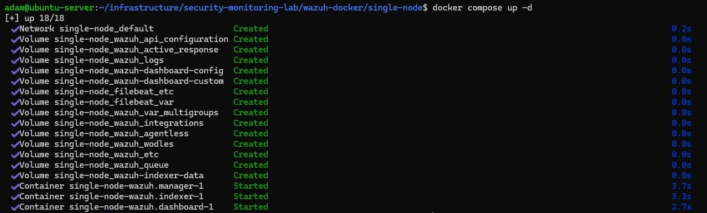

# 07 - Security and Monitoring Lab

## Status

In Progress

---

## Overview

Labs 01 through 06 built a complete hybrid identity infrastructure. DC01 is a fully operational Active Directory domain controller running DNS, Kerberos, and Group Policy. WIN11-CLIENT01 is a domain-joined Windows workstation with validated Group Policy application. The Ubuntu Server host is a domain member running SSSD and Kerberos authentication backed by Active Directory. Every system in the environment has been deployed, configured, and validated in isolation.

What the environment does not yet have is visibility across all of those systems from a single place.

When a domain account logs in successfully or fails authentication, that event exists in a Windows Security log on DC01 or WIN11-CLIENT01 but is not collected anywhere centrally. When someone authenticates to the Ubuntu Server host through SSSD, those events live in local Linux auth logs and go no further. There is no consolidated view of authentication activity, no alerting when something unexpected happens, and no way to investigate a sequence of events across systems without logging into each one individually.

This lab introduces Wazuh as the centralized security monitoring platform for the environment. Wazuh will be deployed to collect security-relevant events from DC01, WIN11-CLIENT01, and the Ubuntu Server host, normalize them into a single view, and provide basic alerting and investigation capability across the environment.

The focus is operational visibility. The goal is to be able to answer basic questions from a single dashboard: which accounts are authenticating and where, when authentication fails, when privileged group membership changes, and whether agents are connected and reporting. This is the most foundational layer of security monitoring, and it is the layer that matters most in small and mid-sized environments where a dedicated SOC does not exist.

---

## Objectives

By the end of this lab, the following will have been completed:

- deploy a Wazuh instance to serve as the central monitoring platform for the environment
- enroll DC01 as a monitored Windows agent
- enroll WIN11-CLIENT01 as a monitored Windows agent
- enroll the Ubuntu Server host as a monitored Linux agent
- configure Windows Security event collection on DC01 and WIN11-CLIENT01
- configure Linux authentication log collection on the Ubuntu Server host
- validate that agent enrollment and connectivity are visible in the Wazuh dashboard
- generate and observe successful and failed Windows authentication events
- generate and observe Active Directory group membership change events
- generate and observe Linux authentication events from the domain-integrated Ubuntu Server host
- validate that events from all monitored systems appear in the Wazuh dashboard
- document the basic investigation workflow for reviewing a sequence of related events

---

## Project Context

Each lab in the enterprise infrastructure track has added a layer that the next lab depended on. Lab 03 deployed the identity foundation. Lab 04 used it to join a client. Lab 05 used the joined client and OU structure to validate Group Policy. Lab 06 extended identity infrastructure into Linux. This lab sits at the top of that stack and closes the final gap: events that were always being generated by the systems below now have somewhere to go.

The Active Directory integration completed in Lab 06 makes this lab more useful than it would have been on a standalone Linux host. Because the Ubuntu Server host authenticates users through Active Directory and Kerberos, authentication events on the Linux host carry AD identities. The same `labadmin` and `testuser01` accounts that appear in Windows Security logs on DC01 and WIN11-CLIENT01 will also appear in Linux authentication logs when they interact with the Ubuntu Server host. A centralized monitoring platform can correlate those events across systems using a consistent identity.

Wazuh was the natural deployment target for this lab given the existing environment. The Ubuntu Server host is already running Docker and hosting a monitoring stack. Adding a Wazuh deployment to that infrastructure follows the same operational pattern established in the Linux infrastructure track: containerized, managed through Docker Compose, and accessible through the existing NGINX Proxy Manager reverse proxy layer.

The Windows agents on DC01 and WIN11-CLIENT01 connect outbound to the Wazuh manager on the Ubuntu Server host, following the same network path already established for RDP administration, domain controller reachability, and SSSD Kerberos authentication.

---

## Technologies Used

- Wazuh (Manager, Indexer, Dashboard, Agents)
- Docker and Docker Compose
- NGINX Proxy Manager
- Windows Security Event Log
- Linux PAM authentication logging
- Active Directory Domain Services
- SSSD
- Windows Server 2022 Standard Evaluation
- Windows 11 Enterprise Evaluation
- Ubuntu Server 26.04 LTS

---

## Technology Research

### What Wazuh Is

Wazuh is an open-source security information and event management platform. It collects log data and security events from monitored endpoints through lightweight agents, processes and normalizes that data centrally, applies detection rules to identify noteworthy activity, and presents the results in a web-based dashboard. It also provides file integrity monitoring, vulnerability detection, and compliance reporting capabilities, though this lab focuses on the log collection and event visibility use cases.

Wazuh is widely used in organizations that need centralized security monitoring but do not have the budget or operational scale for commercial SIEM platforms. It is also commonly used as the SIEM component in smaller IT environments, MSP-managed networks, and infrastructure portfolios where operational visibility is a requirement but full enterprise security operations tooling is not.

### Core Components

Wazuh is made up of four main components that work together to collect, process, store, and display security data.

**Wazuh Manager** is the central processing component. Agents installed on monitored systems connect to the manager and forward collected events. The manager applies detection rules to incoming data, generates alerts, and coordinates communication across all enrolled agents. It is the operational core of the platform and the component that all agents report to.

**Wazuh Indexer** is the data storage and search backend. It is based on OpenSearch and stores all processed event data in a way that the dashboard can query and display. In a single-node deployment, the indexer runs on the same host as the manager.

**Wazuh Dashboard** is the web-based interface used to view and investigate events. It provides real-time alert feeds, event search and filtering, agent status views, and visualization tools. The dashboard is the primary interface used during daily operations and incident investigation. In this lab, the dashboard will be accessed through the existing NGINX Proxy Manager reverse proxy using a local hostname.

**Wazuh Agents** are lightweight processes installed on each monitored endpoint. An agent runs on each system being monitored, collects security-relevant log data and events from local sources, and forwards that data to the manager over an encrypted channel. Agents are available for Windows and Linux, which means a single manager can receive data from both platforms.

The four components interact as follows:

```text
DC01 (Windows Agent)          ──┐
WIN11-CLIENT01 (Windows Agent) ─┼──► Wazuh Manager ──► Wazuh Indexer ──► Wazuh Dashboard
Ubuntu Server (Linux Agent)   ──┘         (Ubuntu Server)
```

In this environment, the manager, indexer, and dashboard will all run on the Ubuntu Server host as Docker containers. The agents on DC01 and WIN11-CLIENT01 will connect outbound to the manager's IP address over the agent communication port.

### Why Wazuh Is Appropriate for This Lab

Several factors make Wazuh the right choice for this environment specifically.

**It is open-source.** The full platform is available under an open-source license with no agent limits, no per-device licensing costs, and no feature tiers that require a commercial subscription. The complete feature set is available in the free deployment.

**It supports both Windows and Linux agents natively.** The existing environment has Windows Server, Windows 11, and Ubuntu Server endpoints. Wazuh provides first-class agent support for all three. A single manager deployment can receive and correlate events from all of them, which is exactly what cross-platform visibility requires.

**It integrates well with Active Directory environments.** Wazuh includes built-in rules for Windows Security event IDs covering authentication events, privilege escalation, account management, and Group Policy changes. These are the event sources that matter most for monitoring an Active Directory domain. The relevant detection rules do not need to be written from scratch.

**It is sized appropriately for a small lab.** Wazuh is designed to scale from small single-node deployments to large distributed clusters. A single-node deployment running all components on the Ubuntu Server host is well within its operational capabilities and does not require additional infrastructure.

**It builds on existing infrastructure.** The Ubuntu Server host is already running Docker, Docker Compose, Portainer, and the monitoring stack. A Wazuh deployment follows the same containerized deployment pattern already established in the environment and does not require a new system or a dedicated virtual machine.

### Windows Monitoring Capabilities

Wazuh agents on Windows systems collect and forward Windows Event Log entries, including Security, System, and Application logs. For an Active Directory environment, the most relevant source is the Security log on DC01, which records authentication events, account management activity, privilege use, and audit policy changes.

Wazuh includes a built-in ruleset mapped to Windows Security event IDs. Key event IDs relevant to this lab include:

| Event ID | Description |
|---|---|
| 4624 | Successful logon |
| 4625 | Failed logon |
| 4648 | Logon attempt with explicit credentials |
| 4728 | Member added to a security-enabled global group |
| 4729 | Member removed from a security-enabled global group |
| 4732 | Member added to a security-enabled local group |
| 4740 | Account lockout |
| 4756 | Member added to a security-enabled universal group |

### Linux Monitoring Capabilities

The Wazuh agent on Linux systems reads from system log files and audit sources. On Ubuntu Server, the primary sources relevant to this lab are the PAM authentication log (`/var/log/auth.log`) and systemd journal entries from SSSD and the SSH daemon.

Because the Ubuntu Server host is now a domain member with SSSD providing Active Directory authentication, authentication events on the Linux host include the AD identity of the authenticating user. A successful SSH login by `labadmin@corp.home.arpa` produces an auth log entry that the Wazuh agent can collect and forward, allowing that event to be correlated against authentication events from the same account on DC01 and WIN11-CLIENT01.

Wazuh includes built-in rules for common Linux authentication events, including SSH login success and failure, sudo usage, and PAM-level authentication outcomes. These rules do not require custom configuration for the standard use cases this lab covers.

---

## Planned Environment Integration

### Monitored Systems

The following systems will be enrolled as Wazuh agents once deployment is complete:

**DC01 (`192.168.1.10`)** — the domain controller is the highest-value monitoring target in the environment. All Kerberos authentication events, account management operations, Group Policy changes, and security-relevant AD activity are logged here. Events from DC01 provide a ground-truth view of domain-level authentication and identity activity.

**WIN11-CLIENT01 (`192.168.1.20`)** — the domain-joined Windows workstation generates endpoint-level authentication and logon events. Monitoring it alongside DC01 allows comparison between domain controller-side and client-side views of the same logon sequence.

**Ubuntu Server (`192.168.1.226`)** — the Ubuntu Server host generates Linux authentication events through PAM, SSSD, and the SSH daemon. Because this host is now a domain member, those events carry Active Directory identities and are directly correlatable with Windows-side events from the same accounts.

### Deployment Architecture

Wazuh will be deployed as a Docker Compose stack on the Ubuntu Server host, following the same pattern used for the monitoring stack and reverse proxy in the Linux infrastructure track.

```text
Ubuntu Server (192.168.1.226)
│
└── Docker Engine
    │
    └── Wazuh Stack (Docker Compose)
        ├── wazuh-manager   (agent communications, rule processing, alert generation)
        ├── wazuh-indexer   (OpenSearch data storage and search backend)
        └── wazuh-dashboard (web interface, accessible via reverse proxy)
                │
                ▼
        NGINX Proxy Manager
                │
                ▼
        wazuh.local (internal hostname, hosts file entry required)
```

The Wazuh manager will listen for agent connections on the standard agent communication port. DC01 and WIN11-CLIENT01 will have Wazuh agents installed that connect outbound to `192.168.1.226` on that port. No inbound firewall changes to the Windows VMs are needed for outbound agent-to-manager communication.

### How This Builds on Previous Labs

The Wazuh deployment connects directly to the infrastructure established in all preceding labs.

Lab 03 created the Active Directory domain whose authentication events are the primary monitoring target. Lab 04 joined WIN11-CLIENT01 to the domain, making its logon events observable in the context of AD identity. Lab 05 deployed Group Policy, and Group Policy changes and enforcement events are among the event types collected by Windows Security logging. Lab 06 joined the Ubuntu Server host to the domain and configured SSSD, meaning Linux authentication events now carry the same AD identities present in Windows Security logs.

The result is that a single Wazuh dashboard will show authentication activity across all three platforms using a consistent identity model rooted in Active Directory. An event where `testuser01` fails to log into the Ubuntu Server host due to missing `Linux-Admins` membership, a successful logon by `labadmin` to WIN11-CLIENT01, and a Kerberos ticket issuance for the same account on DC01 can all be viewed together as a coherent sequence.

---

## Planned Implementation

### Deployment Strategy

Wazuh will be deployed on the Ubuntu Server host as a Docker Compose stack. The stack will run three containers: the Wazuh Manager, the Wazuh Indexer, and the Wazuh Dashboard. All three will be managed through Docker Compose alongside the existing monitoring and reverse proxy stacks already operating on the same host.

This deployment model was chosen for the same reasons that drove containerized deployment decisions throughout the Linux infrastructure track. Docker Compose provides a clean, declarative deployment that is easy to reproduce and straightforward to restart or roll back if something goes wrong during initial configuration. The Wazuh stack does not require a dedicated virtual machine or additional physical hardware. The Ubuntu Server host has sufficient capacity to run the additional containers alongside the existing workloads, and the infrastructure for managing them is already in place through Portainer and Docker Compose.

Dashboard access will be configured through NGINX Proxy Manager using the same reverse proxy pattern established for Grafana, Prometheus, and Portainer. A `wazuh.local` proxy host entry will be created in NGINX Proxy Manager and a corresponding hosts file entry added to the management workstation, making the dashboard accessible at `http://wazuh.local` from the Windows 11 management workstation without exposing it beyond the LAN.

### Agent Deployment Plan

Once the Wazuh stack is up and the dashboard is accessible, agents will be installed on each monitored system. The Wazuh documentation provides platform-specific agent packages and an enrollment command that ties the agent to the manager at install time using the manager's IP address and an enrollment key.

**DC01 (`192.168.1.10`)** — the Windows agent will be installed via the Wazuh-provided MSI package. The agent will be configured to connect to the Wazuh Manager at `192.168.1.226`. Because DC01 is a domain controller and the highest-value target in the environment, it is the first Windows agent to enroll. Its Security event log is the primary source for domain-level authentication and account management events.

**WIN11-CLIENT01 (`192.168.1.20`)** — the Windows agent will be installed using the same MSI package and enrollment process as DC01. WIN11-CLIENT01 generates endpoint-level logon events and provides a client-side view of authentication activity to complement the domain controller-side view from DC01.

**Ubuntu Server (`192.168.1.226`)** — the Linux agent will be installed directly on the host using the Wazuh-provided package for Ubuntu. Because the Wazuh Manager itself runs on this host as a Docker container, the Linux agent connects to the manager at `127.0.0.1` or via the host's LAN IP rather than through a remote connection. The agent will be configured to read from the authentication log sources described in the Logging Sources section below.

All three agents communicate with the Wazuh Manager over the agent communication port using an encrypted channel. Agent enrollment will be confirmed through the Wazuh dashboard's agent status view before any event collection or validation work begins.

### Logging Sources

Each monitored system will be configured to forward the event sources most relevant to authentication and identity activity in this environment.

**Windows (DC01 and WIN11-CLIENT01):**

The primary telemetry source on both Windows systems is the Windows Security Event Log. The Wazuh agent reads from the Security channel by default and forwards events matching its built-in Windows ruleset to the manager. No custom log channel configuration is expected to be required for the core authentication and account management event IDs targeted in this lab.

Relevant event categories include:

- authentication events: successful and failed interactive and network logons (4624, 4625, 4648)
- account management events: account creation, modification, and password changes
- group membership changes: members added to or removed from security groups (4728, 4729, 4732, 4756)
- account lockout events (4740)

DC01 will be the primary source for account management and group membership events, since those operations occur on the domain controller. WIN11-CLIENT01 will be the primary source for endpoint-level logon events.

**Linux (Ubuntu Server):**

The Wazuh Linux agent will be configured to read from the PAM authentication log at `/var/log/auth.log`. This file captures all PAM-mediated authentication events on the host, including SSH logon attempts, SSSD-brokered Active Directory authentication outcomes, and sudo usage.

Because the Ubuntu Server host is a domain member with SSSD providing AD authentication, entries in `/var/log/auth.log` include the fully qualified AD identity of the authenticating user. Events generated when `labadmin@corp.home.arpa` logs in successfully or when `testuser01@corp.home.arpa` is denied access by SSSD will be captured through this log source and forwarded to the Wazuh Manager.

Wazuh's built-in Linux ruleset covers the standard authentication event patterns from PAM, SSHD, and SSSD without requiring custom rule development for the event types targeted in this lab.

### Implementation Sequence

The following order of operations is planned for the implementation phase. Each step depends on the one before it, and progress will be validated at each stage before moving forward.

1. **Deploy the Wazuh Docker Compose stack** on the Ubuntu Server host. Confirm that all three containers (manager, indexer, dashboard) start successfully and reach a healthy state.

2. **Verify manager, indexer, and dashboard functionality** before enrolling any agents. Confirm the indexer is accepting data, the dashboard is reachable, and default login credentials are updated.

3. **Configure dashboard access through NGINX Proxy Manager.** Create a proxy host entry for `wazuh.local` pointing to the dashboard container port. Add the corresponding hosts file entry on the Windows 11 management workstation and confirm the dashboard loads at `http://wazuh.local`.

4. **Install the Wazuh agent on DC01.** Use the Wazuh-provided MSI package and configure the agent to point to the manager at `192.168.1.226`. Start the agent service and confirm it appears as active in the dashboard.

5. **Install the Wazuh agent on WIN11-CLIENT01.** Follow the same process as DC01. Confirm agent enrollment in the dashboard.

6. **Install the Wazuh agent on the Ubuntu Server host.** Use the Wazuh-provided Linux package. Configure the agent to connect to the manager and confirm enrollment in the dashboard.

7. **Verify agent enrollment and connectivity for all three agents.** The dashboard's agent status view should show DC01, WIN11-CLIENT01, and Ubuntu Server as active before any validation events are generated.

8. **Review and confirm event collection sources** on each agent. Confirm that the Windows Security Event Log is being read on DC01 and WIN11-CLIENT01, and that `/var/log/auth.log` is being read on the Ubuntu Server host.

9. **Generate validation events** per the Planned Validation Activities section. This includes deliberate successful and failed logons, group membership changes, and Linux SSH authentication activity.

10. **Review alerts and collected telemetry** in the Wazuh dashboard. Confirm that events from all three systems are present, correctly attributed, and visible in a unified view.

11. **Capture screenshots and documentation artifacts** throughout the implementation. Screenshots will cover the dashboard agent status view, event detail views for each validation scenario, and the cross-platform event sequence demonstrating correlation across DC01, WIN11-CLIENT01, and Ubuntu Server.

---

## Deployment Steps

### Phase One: Deploy the Wazuh Docker Compose Stack

Phase One deployed the Wazuh central components as a Docker Compose stack on the Ubuntu Server host. All three containers — manager, indexer, and dashboard — were brought up cleanly after resolving two non-obvious issues encountered during the process: the certificate SAN format required by TLS validation, and a port conflict between the Wazuh dashboard and the existing NGINX Proxy Manager deployment. Both issues are documented in detail below so the reasoning is preserved.

#### 1.1 Create the Project Directory

A dedicated project directory was created on the Ubuntu Server host to house the Wazuh deployment, following the same structure used for the monitoring stack and reverse proxy deployments.

```bash
mkdir -p ~/infrastructure/security-monitoring-lab
cd ~/infrastructure/security-monitoring-lab
```

<p align="center">
  
</p>

<p align="center">
  <em>Project directory created at ~/infrastructure/security-monitoring-lab on the Ubuntu Server host.</em>
</p>

#### 1.2 Clone the Wazuh Docker Repository

The official Wazuh Docker repository was cloned at the `v4.14.5` version tag rather than against `main`. The `main` branch tracks development and may reference container image tags not yet published to Docker Hub. Pinning to a release tag ensures the compose file and images are consistent.

```bash
git clone https://github.com/wazuh/wazuh-docker.git -b v4.14.5
cd wazuh-docker/single-node
```

<p align="center">
  
</p>

<p align="center">
  <em>wazuh-docker repository cloned at tag v4.14.5 and working directory changed to the single-node subfolder.</em>
</p>

All subsequent steps were run from within `wazuh-docker/single-node`.

#### 1.3 Generate Wazuh SSL Certificates

Wazuh requires SSL certificates before the stack can start. The manager, indexer, and dashboard all communicate over TLS, and the compose file bind-mounts the certificate files into each container at startup. The `wazuh-certs-tool.sh` script was used to generate a complete self-signed certificate set.

The certificate tool and its node configuration template were downloaded from the Wazuh package server:

```bash
curl -sO https://packages.wazuh.com/4.14/wazuh-certs-tool.sh
curl -sO https://packages.wazuh.com/4.14/config.yml
```

<p align="center">
  
</p>

<p align="center">
  <em>wazuh-certs-tool.sh and config.yml downloaded from packages.wazuh.com into the single-node working directory.</em>
</p>

> **Note:** The current Wazuh Docker documentation also offers a `wazuh-certs-generator` Docker image as an alternative certificate generation method. The shell script approach used here is still actively supported and referenced in Wazuh's own step-by-step installation guide. It was chosen here because it keeps the certificate generation process visible and explicit, which fits the educational intent of this lab.

The default `config.yml` was inspected before editing:

<p align="center">
  
</p>

<p align="center">
  <em>Default config.yml template showing placeholder node names and IP values for indexer, server, and dashboard nodes.</em>
</p>

`config.yml` was edited to define the node names for this single-node deployment. A non-obvious issue was encountered here: despite the field being named `ip`, setting it to the host's actual IP address (`192.168.1.226`) causes the cert tool to embed only an `IP Address` SAN in the generated certificate. When Filebeat inside the manager container later attempts to connect to `https://wazuh.indexer:9200` by hostname, TLS validation fails because the cert has no `DNS` SAN entry matching `wazuh.indexer`.

The fix is to set the `ip` field to the node's DNS hostname. This causes the cert tool to embed a `DNS` SAN, which satisfies hostname-based TLS validation:

```yaml
nodes:
  indexer:
    - name: wazuh.indexer
      ip: "wazuh.indexer"
  server:
    - name: wazuh.manager
      ip: "wazuh.manager"
  dashboard:
    - name: wazuh.dashboard
      ip: "wazuh.dashboard"
```

<p align="center">
  
</p>

<p align="center">
  <em>config.yml edited with node hostnames used as the ip field values so the generated certificates carry DNS SANs matching the Docker service hostnames.</em>
</p>

The certificate tool was run to generate the full certificate set:

```bash
bash wazuh-certs-tool.sh -A
```

<p align="center">
  
</p>

<p align="center">
  <em>wazuh-certs-tool.sh run with the -A flag generating the root CA, admin certificates, and node certificates for all three components.</em>
</p>

The output directory was verified before proceeding:

```bash
ls wazuh-certificates/
```

<p align="center">
  
</p>

<p align="center">
  <em>wazuh-certificates/ directory populated with root-ca.pem, root-ca.key, admin.pem, admin-key.pem, and node-specific certificate pairs for the indexer, manager, and dashboard.</em>
</p>

#### 1.4 Place Certificates in the Paths Expected by the Compose File

All certificates were copied into `config/wazuh_indexer_ssl_certs/`, the single directory the `docker-compose.yml` references for bind mounts across all three containers. The manager expects the root CA under the name `root-ca-manager.pem`, so a second copy was placed with that filename.

```bash
mkdir -p config/wazuh_indexer_ssl_certs

# Root CA (two copies: one for indexer/dashboard, one named as the manager expects)
cp wazuh-certificates/root-ca.pem config/wazuh_indexer_ssl_certs/root-ca.pem
cp wazuh-certificates/root-ca.pem config/wazuh_indexer_ssl_certs/root-ca-manager.pem

# Manager certificates
cp wazuh-certificates/wazuh.manager.pem config/wazuh_indexer_ssl_certs/wazuh.manager.pem
cp wazuh-certificates/wazuh.manager-key.pem config/wazuh_indexer_ssl_certs/wazuh.manager-key.pem

# Indexer certificates
cp wazuh-certificates/wazuh.indexer.pem config/wazuh_indexer_ssl_certs/wazuh.indexer.pem
cp wazuh-certificates/wazuh.indexer-key.pem config/wazuh_indexer_ssl_certs/wazuh.indexer-key.pem
cp wazuh-certificates/admin.pem config/wazuh_indexer_ssl_certs/admin.pem
cp wazuh-certificates/admin-key.pem config/wazuh_indexer_ssl_certs/admin-key.pem

# Dashboard certificates
cp wazuh-certificates/wazuh.dashboard.pem config/wazuh_indexer_ssl_certs/wazuh.dashboard.pem
cp wazuh-certificates/wazuh.dashboard-key.pem config/wazuh_indexer_ssl_certs/wazuh.dashboard-key.pem
```

<p align="center">
  
</p>

<p align="center">
  <em>All certificate files copied into config/wazuh_indexer_ssl_certs/ including root-ca-manager.pem as a second copy of the root CA for the manager bind mount.</em>
</p>

The directory contents were verified before proceeding:

```bash
find config/wazuh_indexer_ssl_certs/ -name '*.pem' | sort
```

<p align="center">
  
</p>

<p align="center">
  <em>All 10 expected PEM files confirmed present in config/wazuh_indexer_ssl_certs/.</em>
</p>

#### 1.5 Set the Kernel `vm.max_map_count` Value

The Wazuh indexer (OpenSearch) requires more virtual memory mappings than the Linux kernel allows by default. This was set on the Docker host before starting the stack:

```bash
# Apply immediately (takes effect without a reboot):
sudo sysctl -w vm.max_map_count=262144

# Make it permanent across reboots:
echo "vm.max_map_count=262144" | sudo tee -a /etc/sysctl.conf
```

<p align="center">
  
</p>

<p align="center">
  <em>vm.max_map_count set to 262144 immediately via sysctl and written to /etc/sysctl.conf for persistence across reboots.</em>
</p>

#### 1.6 Remap the Dashboard Port

The Wazuh dashboard container binds to port 443 by default. In this environment, port 443 is already held by NGINX Proxy Manager. The dashboard's host port was changed to `8443` in `docker-compose.yml` before starting the stack:

```yaml
      - 8443:5601
```

<p align="center">
  
</p>

<p align="center">
  <em>docker-compose.yml edited to remap the dashboard container port from 443 to 8443, avoiding the conflict with the existing NGINX Proxy Manager deployment.</em>
</p>

The dashboard is reachable at `https://192.168.1.226:8443` directly, and NGINX Proxy Manager is configured to forward `wazuh.local` to port `8443` in Phase Three.

#### 1.7 Deploy the Stack

```bash
docker compose up -d
```

<p align="center">
  
</p>

<p align="center">
  <em>docker compose up -d pulling all three Wazuh images and starting the manager, indexer, and dashboard containers.</em>
</p>

The manager logs were followed to monitor startup progress:

```bash
docker logs single-node-wazuh.manager-1 --follow
```

<p align="center">
  
</p>

<p align="center">
  <em>Manager log output confirming successful connection to the indexer and all IndexerConnector instances initialized. The key lines confirming a healthy startup are the established connection to wazuh.indexer:9200 and the sequence of IndexerConnector initialized successfully messages.</em>
</p>

All three containers reached a running state with no restart loops. The indexer took the longest to initialize. Once the manager logs showed `Connection to backoff(elasticsearch(https://wazuh.indexer:9200)) established` and all `IndexerConnector initialized successfully` entries completed, the stack was confirmed healthy.

---

### Phase Two: Verify Stack Functionality and Change Default Credentials

#### 2.1 Confirm Indexer Is Accepting Data

The default credentials are defined in the `.env` file inside the `single-node` directory. Check that file for the actual values before running this command:

```bash
cat .env
```

Then query the indexer:

```bash
curl -k -u admin:SecretPassword https://localhost:9200
```

Replace `SecretPassword` with whatever `INDEXER_PASSWORD` is set to in `.env` if it differs. A JSON response from the OpenSearch indexer confirms it is up and accepting connections.

#### 2.2 Access the Wazuh Dashboard

From the Windows 11 management workstation, open a browser and navigate to:

```text
https://192.168.1.226:8443
```

The Wazuh Dashboard listens on port `8443` in this deployment due to the port remap in step 1.6. Accept the self-signed certificate warning on first access.

The Wazuh Docker deployment uses default credentials for initial access. The defaults in the 4.14 release are:

| Account | Username | Default Password | Purpose |
|---|---|---|---|
| Indexer admin | `admin` | `admin` | Dashboard login and indexer API access |
| Dashboard service user | `kibanaserver` | `kibanaserver` | Internal dashboard-to-indexer communication |

Log in to the dashboard with the `admin` account:

```text
Username: admin
Password: admin
```

Note: changing passwords after deployment is not a simple UI operation. It requires generating a new bcrypt hash, updating `config/wazuh_indexer/internal_users.yml`, updating `docker-compose.yml`, restarting the stack, and running `securityadmin.sh` inside the indexer container to apply the changes. For a lab environment, leaving the default credentials and noting them in the lab documentation is acceptable. If the passwords are changed, follow the official Wazuh Docker password change procedure rather than attempting to change them through the dashboard UI alone.

#### 2.3 Confirm Dashboard Is Showing No Agents

Navigate to **Agents** in the left sidebar. At this point, zero agents should be enrolled. This is the expected baseline before any agent installation.

---

### Phase Three: Configure Dashboard Access Through NGINX Proxy Manager

The Wazuh stack runs in a separate Docker Compose project from the reverse proxy stack. Unlike the monitoring stack (which was updated to join the `reverse-proxy-lab_proxy` network), the Wazuh stack cannot be directly reached by NGINX Proxy Manager via Docker DNS unless it is attached to the same proxy network. The simplest approach for this environment is to proxy by IP, since Wazuh and NGINX Proxy Manager are on the same host.

#### 3.1 Add a Proxy Host for the Wazuh Dashboard

In NGINX Proxy Manager (`http://npm.local`), create a new proxy host with the following settings:

| Field | Value |
|---|---|
| Domain Name | `wazuh.local` |
| Scheme | `https` |
| Forward Hostname | `192.168.1.226` |
| Forward Port | `8443` |
| Websockets Support | On |

Because the Wazuh Dashboard uses HTTPS, the scheme in the forward configuration must be set to `https`, not `http`. Enable **Websockets Support**, as the dashboard uses websockets for real-time agent status updates. Under the **SSL** tab, leave certificate management as none since this is an internal-only hostname.

NGINX Proxy Manager will fail to forward to the Wazuh Dashboard by default because the dashboard container uses a self-signed certificate. To resolve this, open the **Advanced** tab for the proxy host and add the following to the custom Nginx configuration block:

```nginx
proxy_ssl_verify off;
```

This disables backend SSL certificate verification for this proxy host only, which is appropriate for an internal lab service using a self-signed cert.

#### 3.2 Add the Hosts File Entry on the Management Workstation

On the Windows 11 management workstation, open `C:\Windows\System32\drivers\etc\hosts` as administrator and add:

```text
192.168.1.226 wazuh.local
```

This follows the same pattern used for `grafana.local`, `prometheus.local`, `portainer.local`, and `npm.local` in the reverse proxy lab.

#### 3.3 Confirm Dashboard Access Via Hostname

Navigate to `https://wazuh.local` from the management workstation browser. The Wazuh Dashboard should load through the reverse proxy. Expect a certificate warning since NGINX Proxy Manager is forwarding to a self-signed cert on the Wazuh Dashboard container.

---

### Phase Four: Install the Wazuh Agent on DC01

#### 4.1 Download the Windows Agent MSI

From DC01, open a browser and navigate to the Wazuh Dashboard at `https://wazuh.local`. Go to **Agents > Deploy new agent**. The dashboard provides a guided flow that generates the correct installation command for the selected OS.

Select:
- OS: Windows
- Architecture: x86_64
- Manager address: `192.168.1.226`
- (Optional) Agent name: `DC01`

Copy the generated PowerShell command. It handles the MSI download and enrollment in one step.

#### 4.2 Install and Enroll the Agent

On DC01, open an elevated PowerShell prompt and run the command copied from the dashboard. It will look similar to:

```powershell
Invoke-WebRequest -Uri https://packages.wazuh.com/4.x/windows/wazuh-agent-4.14.5-1.msi -OutFile $env:tmp\wazuh-agent.msi; msiexec.exe /i $env:tmp\wazuh-agent.msi /q WAZUH_MANAGER='192.168.1.226' WAZUH_AGENT_NAME='DC01'
```

Use the exact command the dashboard generates, as it will include the correct version number. After the install completes, start the agent service:

```powershell
NET START WazuhSvc
```

#### 4.3 Confirm DC01 Agent Enrollment in the Dashboard

Return to the Wazuh Dashboard and navigate to **Agents**. DC01 should appear as an active agent within one to two minutes of the service starting. Confirm the agent status shows **Active** before proceeding.

---

### Phase Five: Install the Wazuh Agent on WIN11-CLIENT01

#### 5.1 Download and Install the Agent

Follow the same process as Phase Four on WIN11-CLIENT01. In the Wazuh Dashboard deploy agent flow, set the agent name to `WIN11-CLIENT01` so it is clearly identified in the dashboard. Use the same manager address (`192.168.1.226`). Run the generated command in an elevated PowerShell prompt on WIN11-CLIENT01, then start the service:

```powershell
NET START WazuhSvc
```

#### 5.2 Confirm WIN11-CLIENT01 Agent Enrollment

Navigate to **Agents** in the dashboard. Both DC01 and WIN11-CLIENT01 should now show as **Active**. Do not proceed to agent installation on Ubuntu Server until both Windows agents are confirmed enrolled.

---

### Phase Six: Install the Wazuh Agent on the Ubuntu Server Host

#### 6.1 Add the Wazuh Repository and Install the Agent

The Wazuh Dashboard deploy agent flow also generates the Linux install command. Use it for the exact current version. The manual steps are shown here for reference:

```bash
curl -s https://packages.wazuh.com/key/GPG-KEY-WAZUH | sudo gpg --no-default-keyring --keyring gnupg-ring:/usr/share/keyrings/wazuh.gpg --import
sudo chmod 644 /usr/share/keyrings/wazuh.gpg  # sudo required: /usr/share/keyrings/ is root-owned
echo "deb [signed-by=/usr/share/keyrings/wazuh.gpg] https://packages.wazuh.com/4.x/apt/ stable main" | sudo tee /etc/apt/sources.list.d/wazuh.list
sudo apt update
sudo apt install wazuh-agent
```

Note: the `chmod` line needs `sudo` since `/usr/share/keyrings/` requires elevated access.

#### 6.2 Configure the Agent to Point to the Manager

Set the manager address using the `WAZUH_MANAGER` environment variable during install (included in the dashboard-generated command), or edit the config manually after install:

```bash
sudo nano /var/ossec/etc/ossec.conf
```

Locate the `<client>` block and confirm or set:

```xml
<server>
  <address>192.168.1.226</address>
</server>
```

Because the Wazuh Manager is running as a Docker container on this same host and port 1514 and 1515 are published to the host, the agent connects to the host's LAN IP rather than to `localhost` or a container name.

#### 6.3 Enroll and Start the Agent

```bash
sudo systemctl daemon-reload
sudo systemctl enable wazuh-agent
sudo systemctl start wazuh-agent
```

The agent self-registers with the manager on first start if `WAZUH_MANAGER` is set in the config. If enrollment does not happen automatically, run the registration binary manually:

```bash
sudo /var/ossec/bin/agent-auth -m 192.168.1.226
sudo systemctl restart wazuh-agent
```

#### 6.4 Confirm Ubuntu Server Agent Enrollment

Navigate to **Agents** in the Wazuh Dashboard. All three agents (DC01, WIN11-CLIENT01, and Ubuntu Server) should now appear as **Active**. This is the required baseline before any validation event generation begins.

---

### Phase Seven: Verify Event Collection Sources

#### 7.1 Confirm Windows Security Event Log Collection on DC01 and WIN11-CLIENT01

On each Windows agent, the Wazuh agent reads the Security event log by default. Verify the agent configuration at:

```text
C:\Program Files (x86)\ossec-agent\ossec.conf
```

Confirm the `<localfile>` block for the Security channel is present:

```xml
<localfile>
  <location>Security</location>
  <log_format>eventchannel</log_format>
</localfile>
```

The default Wazuh Windows agent configuration includes this block. If it is absent, add it under the `<ossec_config>` root element and restart the service:

```powershell
Restart-Service WazuhSvc
```

#### 7.2 Confirm Auth Log Collection on Ubuntu Server

On the Ubuntu Server host, verify the agent configuration at `/var/ossec/etc/ossec.conf` includes a `<localfile>` block for the auth log:

```xml
<localfile>
  <location>/var/log/auth.log</location>
  <log_format>syslog</log_format>
</localfile>
```

If absent, add it and restart the agent:

```bash
sudo systemctl restart wazuh-agent
```

---

### Phase Eight: Generate and Validate Events

#### 8.1 Successful Windows Logon (Event ID 4624)

Log into WIN11-CLIENT01 with domain credentials. In the Wazuh Dashboard, navigate to **Security Events** and filter by the agent name set during enrollment (`WIN11-CLIENT01`). Locate the 4624 event and confirm the AD identity is correctly attributed in the event detail.

#### 8.2 Failed Windows Logon (Event ID 4625)

Attempt a login on WIN11-CLIENT01 with an intentionally incorrect password. Locate the resulting 4625 event in the dashboard filtered by `WIN11-CLIENT01` and confirm the account name and failure reason are captured.

#### 8.3 Active Directory Group Membership Change (Event IDs 4728 / 4729)

From DC01, add `testuser01` to `Linux-Admins` and then remove them. These two operations generate the events targeted in the lab objectives, and the change is safe to make and immediately reverse:

```powershell
Add-ADGroupMember -Identity "Linux-Admins" -Members "testuser01"
Remove-ADGroupMember -Identity "Linux-Admins" -Members "testuser01" -Confirm:$false
```

In the Wazuh Dashboard, filter by agent `DC01` and locate the 4728 and 4729 events. Confirm the `labadmin` administrator account is attributed as the actor in both events.

#### 8.4 Linux Authentication Events

From the Windows 11 management workstation, SSH into the Ubuntu Server host as `labadmin` (expected to succeed) and as `testuser01` (expected to be denied by SSSD). The correct SSH syntax for AD users with SSSD's `use_fully_qualified_names = True` is:

```bash
ssh labadmin@corp.home.arpa@192.168.1.226
ssh testuser01@corp.home.arpa@192.168.1.226
```

This is the same syntax validated in Lab 06. In the Wazuh Dashboard, filter by the Ubuntu Server agent and locate the corresponding auth log events for both attempts in **Security Events**. Confirm the fully qualified AD identity (`labadmin@corp.home.arpa`) is visible in the event data.

#### 8.5 Cross-Platform Event Correlation

Using the Wazuh Dashboard search, filter by a username present across all three systems (for example, `labadmin`). Confirm that events from DC01, WIN11-CLIENT01, and the Ubuntu Server agent all appear together, sharing the same identity. This validates that centralized monitoring provides a cross-platform view of authentication activity using the consistent AD identity model established across all previous labs.

---

## Planned Validation Activities

The following activities will be performed during the implementation phase to validate that event collection, alerting, and investigation workflows are functioning correctly. They are described here to clarify what will be tested and why each test is meaningful for this environment.

**Agent enrollment and connectivity validation.** Before generating any test events, the Wazuh dashboard will be reviewed to confirm that all three agents (DC01, WIN11-CLIENT01, and Ubuntu Server) appear as active and connected. A disconnected or missing agent is a gap in visibility, and confirming enrollment is the baseline for all subsequent validation.

**Successful Windows logon events.** A domain user will log into WIN11-CLIENT01 using Active Directory credentials. The resulting Security event (4624) will be located in the Wazuh dashboard and reviewed to confirm that the agent forwarded the event, that the AD identity is correctly attributed, and that the event is categorized by the Wazuh ruleset.

**Failed Windows logon events.** An intentional failed logon attempt will be made against WIN11-CLIENT01 using an incorrect password. The resulting Security event (4625) will be located in the Wazuh dashboard and reviewed to confirm that failed authentication attempts are visible and that the account name and failure reason are captured correctly.

**Active Directory group membership change.** A test account will be added to and removed from a security group in Active Directory from DC01. The resulting Security events (4728 and 4729) will be located in the Wazuh dashboard and reviewed to confirm that group membership changes on the domain controller are captured and attributed to the administrator account that performed them.

**Linux authentication events.** A domain user will authenticate to the Ubuntu Server host via SSH. Both a successful login by `labadmin` (a member of `Linux-Admins`) and a denied login attempt by `testuser01` (not a member of `Linux-Admins`) will be generated. The corresponding auth log events will be located in the Wazuh dashboard and reviewed to confirm that SSSD-mediated authentication events are collected and that the AD identity is visible in the event data.

**Cross-platform event correlation.** Using the same domain user account across multiple systems, the Wazuh dashboard will be used to locate events from DC01, WIN11-CLIENT01, and Ubuntu Server that share a common identity. This validates that centralized monitoring provides a meaningful cross-platform view of authentication activity rather than just isolated per-system event streams.
