# 07 - Security and Monitoring Lab

## Status

Completed

---

## Overview

This lab deployed Wazuh as the centralized security monitoring platform for the `corp.home.arpa` environment, building directly on the hybrid identity infrastructure established in Labs 03 through 06.

Labs 01 through 06 built a complete hybrid identity infrastructure: a fully promoted Active Directory domain controller, a domain-joined Windows workstation with Group Policy applied, and an Ubuntu Server host joined to the domain with SSSD providing Kerberos-backed authentication. Every system in the environment had been deployed, configured, and validated. Every authentication event had somewhere to generate but nowhere central to go.

This lab closes that gap. Wazuh was deployed as a Docker Compose stack on the Ubuntu Server host, agents were installed on all three monitored systems, and security event collection was validated across Windows and Linux endpoints. The result is a single dashboard with visibility into authentication activity, account management events, and Linux authentication events from all three platforms, using a consistent identity model rooted in Active Directory.

All objectives were completed successfully.

---

## Objectives

- deploy a Wazuh single-node instance (Manager, Indexer, Dashboard) as a Docker Compose stack on the Ubuntu Server host
- enroll DC01 as a monitored Windows agent
- enroll WIN11-CLIENT01 as a monitored Windows agent
- enroll the Ubuntu Server host as a monitored Linux agent
- validate agent enrollment and connectivity in the Wazuh dashboard
- validate Windows Security event collection on DC01 and WIN11-CLIENT01
- validate Linux authentication event collection on the Ubuntu Server host
- generate and observe failed Windows authentication events from both Windows agents
- generate and observe a failed SSH authentication event from the Linux agent
- confirm all events are visible and correctly attributed in the Wazuh dashboard

All objectives were completed successfully.

---

## Project Context

Each lab in the enterprise infrastructure track has added a layer that the next lab depended on. Lab 03 deployed the identity foundation. Lab 04 used it to join a client. Lab 05 used the joined client and OU structure to validate Group Policy. Lab 06 extended identity infrastructure into Linux. This lab sits at the top of that stack and closes the final gap: events that were always being generated by the systems below now have somewhere to go.

The Active Directory integration completed in Lab 06 makes this lab more useful than it would have been on a standalone Linux host. Because the Ubuntu Server host authenticates users through Active Directory and Kerberos, authentication events on the Linux host carry AD identities. The same `labadmin` and `testuser01` accounts that appear in Windows Security logs on DC01 and WIN11-CLIENT01 also appear in Linux authentication logs when they interact with the Ubuntu Server host. A centralized monitoring platform can correlate those events across systems using a consistent identity.

Wazuh was the natural deployment target for this lab given the existing environment. The Ubuntu Server host is already running Docker and hosting a monitoring stack. Adding a Wazuh deployment to that infrastructure follows the same operational pattern established in the Linux infrastructure track: containerized and managed through Docker Compose.

The Windows agents on DC01 and WIN11-CLIENT01 connect outbound to the Wazuh manager on the Ubuntu Server host, following the same network path already established for RDP administration, domain controller reachability, and SSSD Kerberos authentication.

---

## Technologies Used

- Wazuh 4.14.5 (Manager, Indexer, Dashboard, Agents)
- Docker and Docker Compose
- Windows Security Event Log
- Linux PAM authentication logging
- Active Directory Domain Services
- SSSD
- Windows Server 2022 Standard Evaluation
- Windows 11 Enterprise Evaluation
- Ubuntu Server 26.04 LTS

---

## Technology Research

### What Wazuh Is

Wazuh is an open-source security information and event management platform. It collects log data and security events from monitored endpoints through lightweight agents, processes and normalizes that data centrally, applies detection rules to identify noteworthy activity, and presents the results in a web-based dashboard. It also provides file integrity monitoring, vulnerability detection, and compliance reporting capabilities, though this lab focuses on the log collection and event visibility use cases.

Wazuh is widely used in organizations that need centralized security monitoring but do not have the budget or operational scale for commercial SIEM platforms. It is also commonly used as the SIEM component in smaller IT environments, MSP-managed networks, and infrastructure portfolios where operational visibility is a requirement but full enterprise security operations tooling is not.

### Core Components

Wazuh is made up of four main components that work together to collect, process, store, and display security data.

**Wazuh Manager** is the central processing component. Agents installed on monitored systems connect to the manager and forward collected events. The manager applies detection rules to incoming data, generates alerts, and coordinates communication across all enrolled agents. It is the operational core of the platform and the component that all agents report to.

**Wazuh Indexer** is the data storage and search backend. It is based on OpenSearch and stores all processed event data in a way that the dashboard can query and display. In a single-node deployment, the indexer runs on the same host as the manager.

**Wazuh Dashboard** is the web-based interface used to view and investigate events. It provides real-time alert feeds, event search and filtering, agent status views, and visualization tools. The dashboard is the primary interface used during daily operations and incident investigation. In this lab, the dashboard is accessed directly over HTTPS using the Ubuntu Server host's IP address and the published host port.

**Wazuh Agents** are lightweight processes installed on each monitored endpoint. An agent runs on each system being monitored, collects security-relevant log data and events from local sources, and forwards that data to the manager over an encrypted channel. Agents are available for Windows and Linux, which means a single manager can receive data from both platforms.

The four components interact as follows:

```text
DC01 (Windows Agent)          ──┐
WIN11-CLIENT01 (Windows Agent) ─┼──► Wazuh Manager ──► Wazuh Indexer ──► Wazuh Dashboard
Ubuntu Server (Linux Agent)   ──┘         (Ubuntu Server)
```

In this environment, the manager, indexer, and dashboard all run on the Ubuntu Server host as Docker containers. The agents on DC01 and WIN11-CLIENT01 connect outbound to the manager's IP address over the agent communication port.

### Why Wazuh Is Appropriate for This Lab

Several factors make Wazuh the right choice for this environment specifically.

**It is open-source.** The full platform is available under an open-source license with no agent limits, no per-device licensing costs, and no feature tiers that require a commercial subscription. The complete feature set is available in the free deployment.

**It supports both Windows and Linux agents natively.** The existing environment has Windows Server, Windows 11, and Ubuntu Server endpoints. Wazuh provides first-class agent support for all three. A single manager deployment can receive and correlate events from all of them, which is exactly what cross-platform visibility requires.

**It integrates well with Active Directory environments.** Wazuh includes built-in rules for Windows Security event IDs covering authentication events, privilege escalation, account management, and Group Policy changes. These are the event sources that matter most for monitoring an Active Directory domain. The relevant detection rules do not need to be written from scratch.

**It is sized appropriately for a small lab.** Wazuh is designed to scale from small single-node deployments to large distributed clusters. A single-node deployment running all components on the Ubuntu Server host is well within its operational capabilities and does not require additional infrastructure.

**It builds on existing infrastructure.** The Ubuntu Server host is already running Docker, Docker Compose, Portainer, and the monitoring stack. A Wazuh deployment follows the same containerized deployment pattern already established in the environment and does not require a new system or a dedicated virtual machine.

### Windows Monitoring Capabilities

Wazuh agents on Windows systems collect and forward Windows Event Log entries, including Security, System, and Application logs. For an Active Directory environment, the most relevant source is the Security log on DC01, which records authentication events, account management activity, privilege use, and audit policy changes.

Wazuh includes a built-in ruleset mapped to Windows Security event IDs. Key event IDs relevant to this lab include:

| Event ID | Description |
|---|---|
| 4624 | Successful logon |
| 4625 | Failed logon |
| 4648 | Logon attempt with explicit credentials |
| 4728 | Member added to a security-enabled global group |
| 4729 | Member removed from a security-enabled global group |
| 4732 | Member added to a security-enabled local group |
| 4740 | Account lockout |
| 4756 | Member added to a security-enabled universal group |

### Linux Monitoring Capabilities

The Wazuh agent on Linux systems reads from system log files and audit sources. On Ubuntu Server, the primary sources relevant to this lab are the PAM authentication log (`/var/log/auth.log`) and systemd journal entries from SSSD and the SSH daemon.

Because the Ubuntu Server host is a domain member with SSSD providing Active Directory authentication, authentication events on the Linux host include the AD identity of the authenticating user. A successful SSH login by `labadmin@corp.home.arpa` produces an auth log entry that the Wazuh agent can collect and forward, allowing that event to be correlated against authentication events from the same account on DC01 and WIN11-CLIENT01.

Wazuh includes built-in rules for common Linux authentication events, including SSH login success and failure, sudo usage, and PAM-level authentication outcomes. These rules do not require custom configuration for the standard use cases this lab covers.

---

## Architecture and Topology

After this lab, the Wazuh stack is deployed on the Ubuntu Server host with agents enrolled on all three monitored systems.

```text
Ubuntu Server (192.168.1.226)
│
└── Docker Engine
    │
    └── Wazuh Stack (Docker Compose)
        ├── wazuh-manager   (agent communications, rule processing, alert generation)
        ├── wazuh-indexer   (OpenSearch data storage and search backend)
        └── wazuh-dashboard (web interface, accessed at https://192.168.1.226:8443)
```

### Agent Coverage

```text
DC01 (192.168.1.10)          ──┐
WIN11-CLIENT01 (192.168.1.20) ─┼──► wazuh-manager (192.168.1.226:1514)
Ubuntu Server (192.168.1.226) ──┘         │
                                           ▼
                                    wazuh-indexer
                                           │
                                           ▼
                                    wazuh-dashboard
                               (https://192.168.1.226:8443)
```

The Wazuh manager listens for agent connections on port 1514. DC01 and WIN11-CLIENT01 connect outbound from their LAN addresses. The Ubuntu Server Linux agent connects to the manager at the host's own LAN IP (`192.168.1.226`) because the manager runs as a Docker container with the port published to the host.

---

## Prerequisites

- Labs 01 through 06 completed and validated
- DC01 post-integration snapshot (`DC01 - Linux AD Integration Complete`) verified
- WIN11-CLIENT01 post-integration snapshot (`WIN11-CLIENT01 - Linux AD Integration Validated`) verified
- DC01 at static IP `192.168.1.10` with RDP operational
- WIN11-CLIENT01 domain-joined to `corp.home.arpa` with RDP operational
- Ubuntu Server at static IP `192.168.1.226` with SSH operational
- Ubuntu Server running Docker and Docker Compose
- Domain accounts operational: `labadmin` (Domain Admins, Linux-Admins), `testuser01` (Domain-Users-Standard)
- All three systems powered on and accessible before beginning

---

## Deployment Steps

### Phase One: Deploy the Wazuh Docker Compose Stack

#### 1.1 Create the Project Directory

A dedicated project directory was created on the Ubuntu Server host to house the Wazuh deployment, following the same structure used for the monitoring stack and reverse proxy deployments.

```bash
mkdir -p ~/infrastructure/security-monitoring-lab
cd ~/infrastructure/security-monitoring-lab
```

<p align="center">
  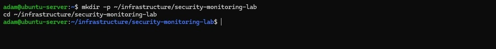
</p>

<p align="center">
  <em>Project directory created at ~/infrastructure/security-monitoring-lab on the Ubuntu Server host.</em>
</p>

#### 1.2 Clone the Wazuh Docker Repository

The official Wazuh Docker repository was cloned at the `v4.14.5` version tag rather than against `main`. The `main` branch tracks development and may reference container image tags not yet published to Docker Hub. Pinning to a release tag ensures the compose file and images are consistent.

```bash
git clone https://github.com/wazuh/wazuh-docker.git -b v4.14.5
cd wazuh-docker/single-node
```

All subsequent steps were run from within `wazuh-docker/single-node`.

<p align="center">
  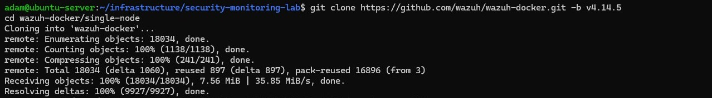
</p>

<p align="center">
  <em>Wazuh Docker repository cloned at the v4.14.5 tag into the project directory.</em>
</p>

#### 1.3 Generate Wazuh SSL Certificates

Wazuh requires SSL certificates before the stack can start. The manager, indexer, and dashboard all communicate over TLS, and the compose file bind-mounts the certificate files into each container at startup.

The `wazuh-docker` repository includes a `generate-indexer-certs.yml` compose file that runs the `wazuh-certs-generator` container. This container generates a complete self-signed certificate set for all three nodes and writes the output directly into `config/wazuh_indexer_ssl_certs/` in the paths the main `docker-compose.yml` expects. No manual file copying or renaming is required.

```bash
docker compose -f generate-indexer-certs.yml run --rm generator
```

The generator container ran, produced the certificate set, and exited without leaving a running container behind.

<p align="center">
  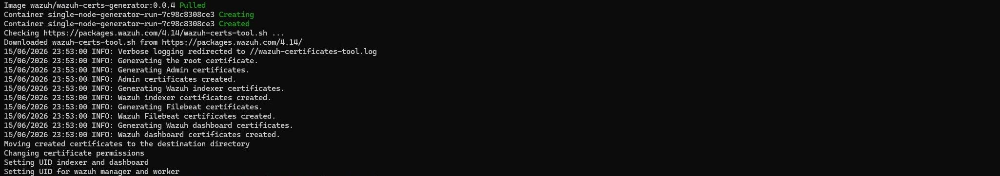
</p>

<p align="center">
  <em>The wazuh-certs-generator container ran and exited, writing all required certificates into config/wazuh_indexer_ssl_certs/.</em>
</p>

#### 1.4 Set the Kernel `vm.max_map_count` Value

The Wazuh indexer (OpenSearch) requires more virtual memory mappings than the Linux kernel allows by default. This was set on the Docker host before starting the stack:

```bash
# Apply immediately (takes effect without a reboot):
sudo sysctl -w vm.max_map_count=262144

# Make it permanent across reboots:
echo "vm.max_map_count=262144" | sudo tee -a /etc/sysctl.conf
```

<p align="center">
  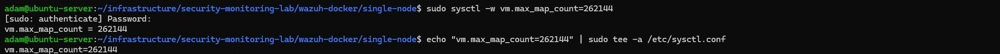
</p>

<p align="center">
  <em>vm.max_map_count set to 262144 immediately and persisted to /etc/sysctl.conf for reboots.</em>
</p>

#### 1.5 Remap the Dashboard Port

The Wazuh dashboard container maps host port 443 to the container's internal port 5601 by default. In this environment, port 443 is already held by NGINX Proxy Manager. The host port was remapped to `8443` in `docker-compose.yml` to allow direct dashboard access, keeping the container port unchanged.

```yaml
      - 8443:5601
```

<p align="center">
  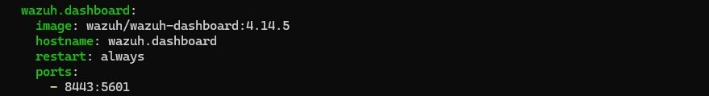
</p>

<p align="center">
  <em>Dashboard host port remapped from 443 to 8443 in docker-compose.yml, keeping the container port at 5601.</em>
</p>

#### 1.6 Deploy the Stack

```bash
docker compose up -d
```

The stack was confirmed healthy when all three containers were running with no restart loops and their container health checks passed. The indexer took the longest to initialize.

<p align="center">
  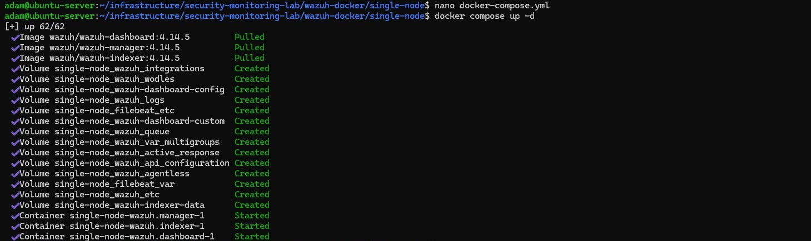
</p>

<p align="center">
  <em>Wazuh stack started with docker compose up -d. All three containers came up without errors.</em>
</p>

<p align="center">
  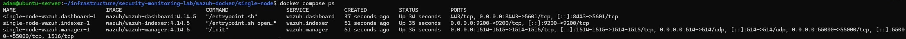
</p>

<p align="center">
  <em>All three containers confirmed running and healthy via docker compose ps. The indexer initialized last.</em>
</p>

---

### Phase Two: Validate the Stack

#### 2.1 Confirm the Indexer Is Accepting Connections

The indexer was queried directly from the Ubuntu Server host using the credentials defined in `docker-compose.yml`:

```bash
curl -k -u admin:SecretPassword https://localhost:9200
```

The response returned OpenSearch cluster information, confirming:

- The Wazuh Indexer container was running.
- OpenSearch had initialized successfully.
- TLS was functioning correctly.
- The configured credentials were valid.
- The host could reach the indexer service on port 9200.

<p align="center">
  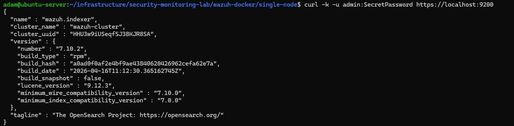
</p>

<p align="center">
  <em>Curl query to the indexer on port 9200 returned OpenSearch cluster information, confirming the indexer was healthy and accepting connections.</em>
</p>

#### 2.2 Access the Dashboard Over Direct IP

From the Windows 11 management workstation, the dashboard was accessed at:

```text
https://192.168.1.226:8443
```

The self-signed certificate warning was accepted. The Wazuh Dashboard login page loaded successfully. The default credentials for the 4.14 Docker deployment are shown below for reference. The default passwords were changed after the lab was complete; see the [Wazuh documentation](https://documentation.wazuh.com/current/deployment-options/docker/wazuh-container.html) for the password change procedure.

| Account | Username | Default Password | Purpose |
|---|---|---|---|
| Indexer admin | `admin` | `SecretPassword` | Dashboard login and indexer API access |
| Dashboard service user | `kibanaserver` | `kibanaserver` | Internal dashboard-to-indexer communication only; not usable for dashboard login |

The dashboard was accessed using the `admin` account.

<p align="center">
  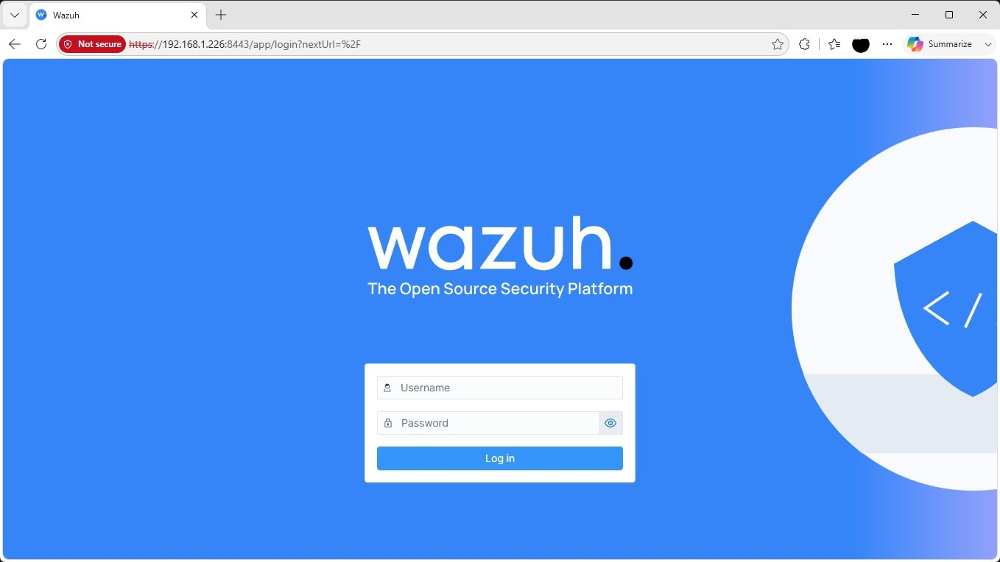
</p>

<p align="center">
  <em>Wazuh Dashboard login page loaded successfully at https://192.168.1.226:8443 after accepting the self-signed certificate warning.</em>
</p>

#### 2.3 Validate Dashboard Functionality

After logging in with the `admin` account, the following were confirmed:

- The Overview page loaded without errors.
- Alert statistics were displayed.
- The navigation menu was accessible.
- No API connection warnings were shown.

This confirmed that the dashboard container was running, the dashboard could authenticate to the indexer, and the dashboard could communicate with the Wazuh Manager API.

<p align="center">
  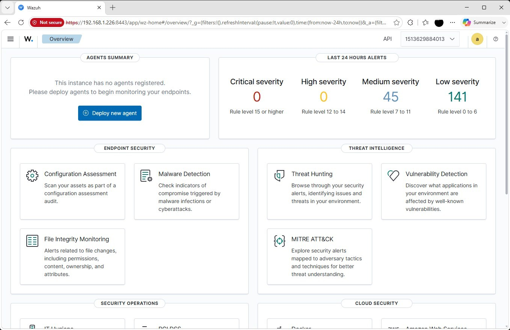
</p>

<p align="center">
  <em>Wazuh Dashboard Overview page loaded cleanly after login. No API connection errors were present.</em>
</p>

#### 2.4 Confirm the Agents View Shows No Agents

The Agents view was checked before any endpoints were enrolled. Zero registered agents were shown, confirming the expected baseline state before enrollment began.

<p align="center">
  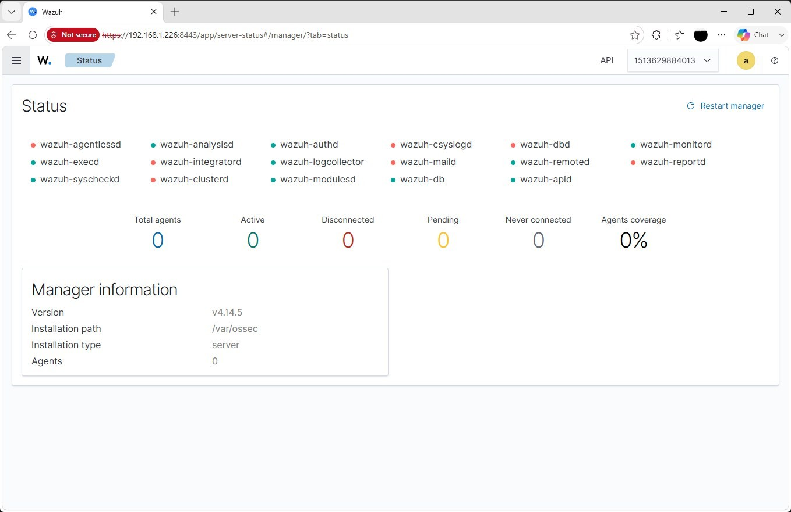
</p>

<p align="center">
  <em>Agents view confirmed zero registered agents, establishing the baseline before enrollment began.</em>
</p>

---

### Phase Three: Install the Wazuh Agent on DC01

#### 3.1 Generate the Installation Command

From DC01, the Wazuh Dashboard was opened at `https://192.168.1.226:8443`. The **Agents > Deploy new agent** flow was used to generate the correct installation command with the following selections:

- OS: Windows
- Architecture: x86_64
- Manager address: `192.168.1.226`
- Agent name: `DC01`

The generated PowerShell command handled the MSI download and enrollment in one step.

<p align="center">
  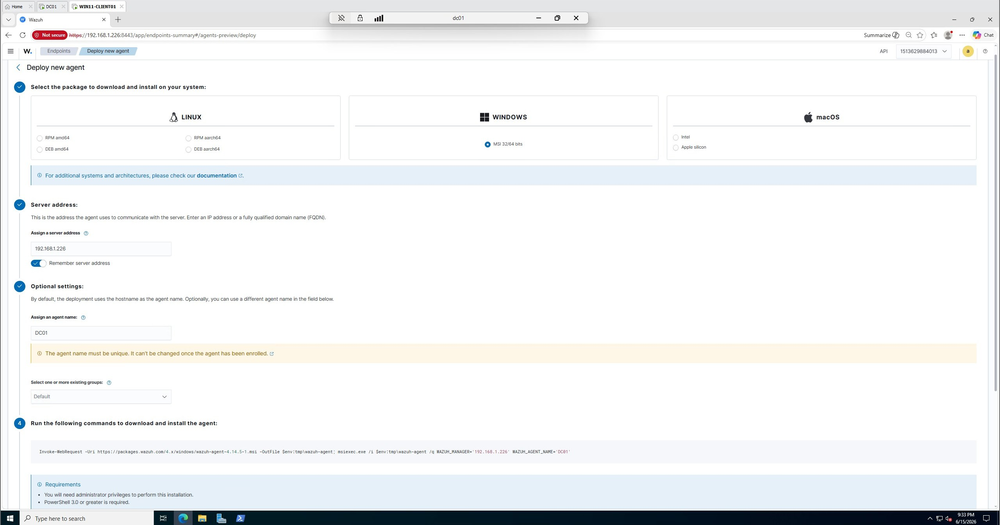
</p>

<p align="center">
  <em>Deploy new agent flow in the Wazuh Dashboard with Windows x86_64 selected, manager address set to 192.168.1.226, and agent name set to DC01.</em>
</p>

#### 3.2 Install and Enroll the Agent

The generated command was run in an elevated PowerShell prompt on DC01. It followed the form:

```powershell
Invoke-WebRequest -Uri https://packages.wazuh.com/4.x/windows/wazuh-agent-4.14.5-1.msi -OutFile $env:tmp\wazuh-agent; msiexec.exe /i $env:tmp\wazuh-agent /q WAZUH_MANAGER='192.168.1.226' WAZUH_AGENT_NAME='DC01'
```

After the install completed, the agent service was started:

```powershell
NET START WazuhSvc
```

<p align="center">
  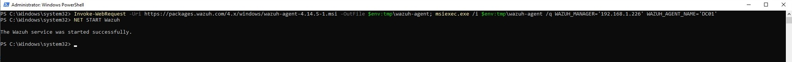
</p>

<p align="center">
  <em>Wazuh agent installed via the generated PowerShell command and WazuhSvc started on DC01.</em>
</p>

#### 3.3 Confirm DC01 Agent Enrollment in the Dashboard

DC01 appeared as an active agent in the Agents view within one to two minutes of the service starting. The agent status showed **Active**.

<p align="center">
  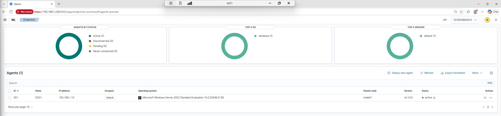
</p>

<p align="center">
  <em>DC01 confirmed Active in the Wazuh Dashboard Agents view within two minutes of WazuhSvc starting.</em>
</p>

---

### Phase Four: Install the Wazuh Agent on WIN11-CLIENT01

#### 4.1 Generate and Run the Installation Command

The same process used for DC01 was followed on WIN11-CLIENT01. In the Wazuh Dashboard deploy agent flow, the agent name was set to `WIN11-CLIENT01` with the same manager address (`192.168.1.226`). The generated command was run in an elevated PowerShell prompt, then the service was started:

```powershell
NET START WazuhSvc
```

<p align="center">
  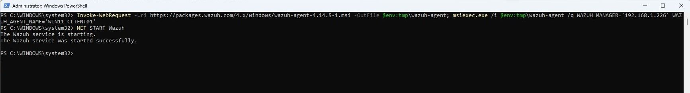
</p>

<p align="center">
  <em>Wazuh agent installed via the generated PowerShell command and WazuhSvc started on WIN11-CLIENT01.</em>
</p>

#### 4.2 Confirm WIN11-CLIENT01 Agent Enrollment

Both DC01 and WIN11-CLIENT01 appeared as **Active** in the Agents view.

<p align="center">
  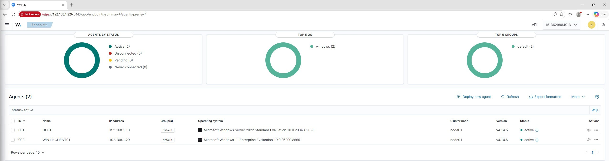
</p>

<p align="center">
  <em>Both DC01 and WIN11-CLIENT01 confirmed Active in the Wazuh Dashboard Agents view.</em>
</p>

---

### Phase Five: Install the Wazuh Agent on the Ubuntu Server Host

#### 5.1 Generate the Linux Installation Command

From the Wazuh Dashboard, the **Agents > Deploy new agent** flow was used with the following selections:

- OS: Linux
- Package: DEB amd64
- Server address: `192.168.1.226`
- Agent name: `UBUNTU-SERVER`

The dashboard generated a deployment command that installed the correct agent version and configured enrollment against the Wazuh Manager.

<p align="center">
  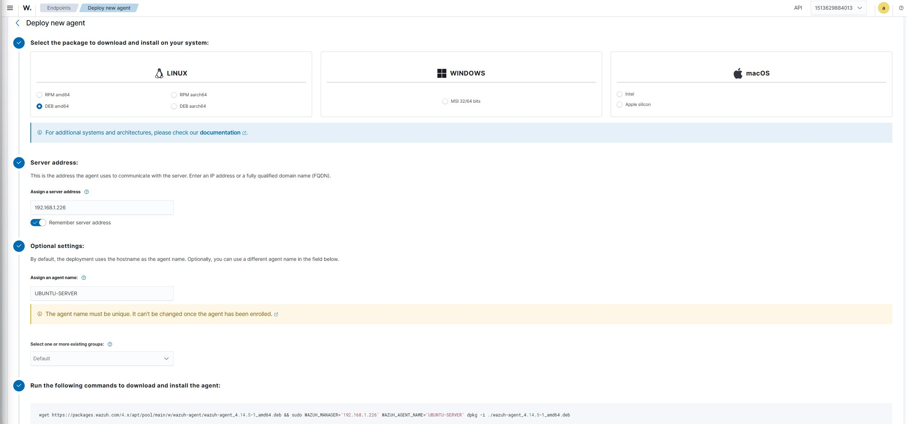
</p>

<p align="center">
  <em>Deploy new agent flow in the Wazuh Dashboard with Linux DEB amd64 selected, server address set to 192.168.1.226, and agent name set to UBUNTU-SERVER.</em>
</p>

#### 5.2 Install the Agent

The generated command was run directly on the Ubuntu Server host. It followed the form:

```bash
wget https://packages.wazuh.com/4.x/apt/pool/main/w/wazuh-agent/wazuh-agent_4.14.5-1_amd64.deb && sudo WAZUH_MANAGER='192.168.1.226' WAZUH_AGENT_NAME='UBUNTU-SERVER' dpkg -i ./wazuh-agent_4.14.5-1_amd64.deb
```

#### 5.3 Start and Enable the Agent

After installation completed, the service was started and enabled:

```bash
sudo systemctl daemon-reload
sudo systemctl enable wazuh-agent
sudo systemctl start wazuh-agent
```

The service status was verified:

```bash
sudo systemctl status wazuh-agent
```

<p align="center">
  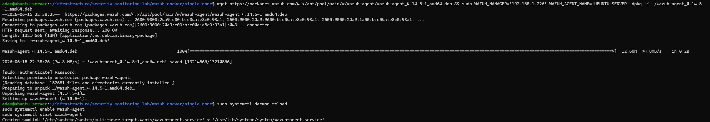
</p>

<p align="center">
  <em>Wazuh agent package installed and service enabled on the Ubuntu Server host using the generated command.</em>
</p>

<p align="center">
  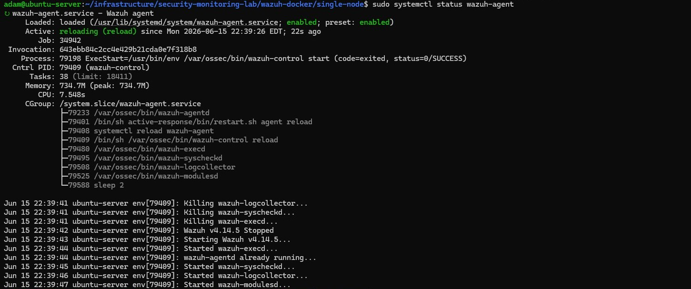
</p>

<p align="center">
  <em>Wazuh agent service confirmed active and running on the Ubuntu Server host via systemctl status.</em>
</p>

#### 5.4 Confirm Ubuntu Server Agent Enrollment

All three agents appeared as **Active** in the Wazuh Dashboard Agents view:

- DC01
- WIN11-CLIENT01
- UBUNTU-SERVER

<p align="center">
  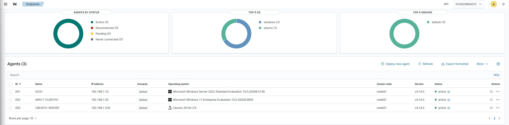
</p>

<p align="center">
  <em>All three agents confirmed Active in the Wazuh Dashboard Agents view. Ubuntu Server enrollment completed the baseline agent deployment.</em>
</p>

---

### Phase Six: Verify Event Collection

#### 6.1 Generate a Windows Security Event on DC01

A failed logon attempt was intentionally performed on DC01 using an incorrect password. After approximately one minute, the Wazuh Dashboard was reviewed and the DC01 agent events were located.

<p align="center">
  
</p>

<p align="center">
  <em>Failed logon attempt performed on DC01 to generate a Windows Security authentication failure event.</em>
</p>

The authentication failure event appeared in the dashboard under the DC01 agent, confirming that Windows Security events were being collected and forwarded to the Wazuh Manager.

<p align="center">
  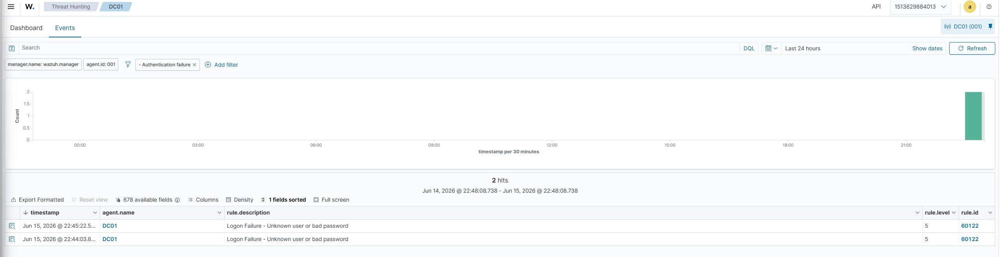
</p>

<p align="center">
  <em>DC01 authentication failure event confirmed visible in the Wazuh Dashboard. Windows Security event collection verified.</em>
</p>

#### 6.2 Generate a Windows Security Event on WIN11-CLIENT01

The same failed logon test was repeated on WIN11-CLIENT01. The authentication failure event appeared in the dashboard under the WIN11-CLIENT01 agent.

<p align="center">
  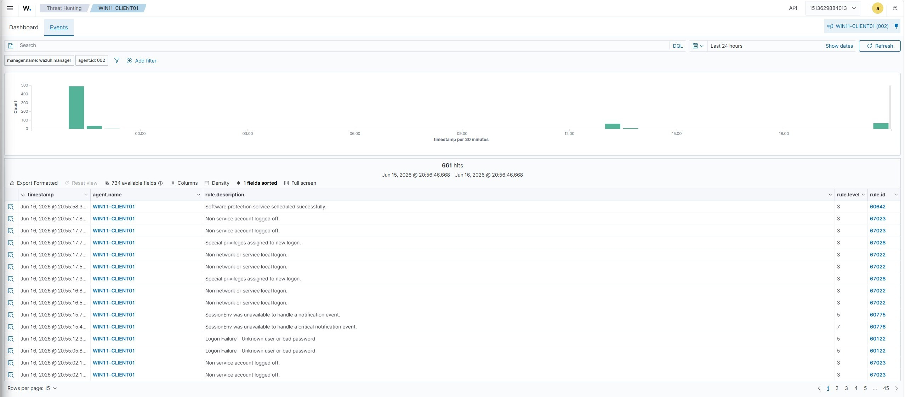
</p>

<p align="center">
  <em>WIN11-CLIENT01 authentication failure event confirmed visible in the Wazuh Dashboard. Windows Security event collection verified on both domain-joined endpoints.</em>
</p>

#### 6.3 Generate a Linux Authentication Event on Ubuntu Server

On the Ubuntu Server host, a failed SSH authentication attempt was made using an invalid username:

```bash
ssh invaliduser@localhost
```

The event was located in the Wazuh Dashboard under Threat Hunting by filtering for `agent.name:UBUNTU-SERVER`.

<p align="center">
  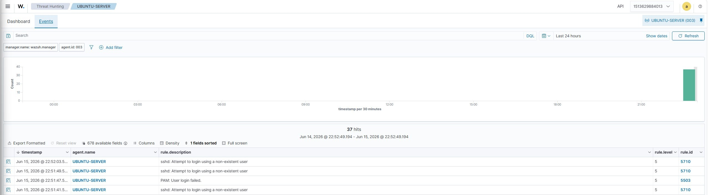
</p>

<p align="center">
  <em>Failed SSH authentication event from the Ubuntu Server host confirmed visible in the Wazuh Dashboard. Linux authentication event collection verified.</em>
</p>

---

## Validation Checklist

| Check | Result |
|---|---|
| Project directory created at `~/infrastructure/security-monitoring-lab` | Confirmed |
| Wazuh Docker repo cloned at `v4.14.5` tag | Confirmed |
| SSL certificates generated via `wazuh-certs-generator` container | Confirmed; certificates written to `config/wazuh_indexer_ssl_certs/` |
| `vm.max_map_count` set to `262144` and persisted to `/etc/sysctl.conf` | Confirmed |
| Dashboard host port remapped from `443` to `8443` in `docker-compose.yml` | Confirmed |
| All three Wazuh containers running and healthy via `docker compose ps` | Confirmed |
| Indexer curl query returns OpenSearch cluster information | Confirmed |
| Dashboard login page loads at `https://192.168.1.226:8443` | Confirmed |
| Dashboard Overview loads with no API connection errors after login | Confirmed |
| Agents view shows zero agents before enrollment begins | Confirmed |
| DC01 agent deployed via dashboard-generated PowerShell command | Confirmed |
| WazuhSvc started on DC01 | Confirmed |
| DC01 appears as Active in Agents view | Confirmed |
| WIN11-CLIENT01 agent deployed via dashboard-generated PowerShell command | Confirmed |
| WazuhSvc started on WIN11-CLIENT01 | Confirmed |
| WIN11-CLIENT01 appears as Active in Agents view | Confirmed |
| Ubuntu Server agent deployed via dashboard-generated command | Confirmed |
| `wazuh-agent` service enabled and started on Ubuntu Server | Confirmed |
| `wazuh-agent` service status shows active and running | Confirmed |
| All three agents (DC01, WIN11-CLIENT01, UBUNTU-SERVER) show Active | Confirmed |
| Failed logon generated on DC01; event visible in Wazuh Dashboard | Confirmed |
| Failed logon generated on WIN11-CLIENT01; event visible in Wazuh Dashboard | Confirmed |
| Failed SSH attempt generated on Ubuntu Server; event visible in Wazuh Dashboard | Confirmed |

---

## Outcome

Wazuh is deployed and operational as the centralized security monitoring platform for the `corp.home.arpa` environment. All three monitored systems are enrolled, event collection is verified across Windows and Linux endpoints, and the Wazuh dashboard provides a unified view of security-relevant activity across the environment.

The following was completed and validated during this lab:

- Wazuh single-node stack (Manager, Indexer, Dashboard) deployed as a Docker Compose stack on the Ubuntu Server host at `v4.14.5`
- SSL certificates generated via the `wazuh-certs-generator` container with no manual file handling required
- Dashboard host port remapped from `443` to `8443` to avoid conflict with existing services
- Stack health validated: all three containers confirmed running, indexer accepting connections, dashboard accessible and error-free
- DC01 enrolled as a Windows agent; status confirmed Active in the Wazuh Dashboard
- WIN11-CLIENT01 enrolled as a Windows agent; status confirmed Active in the Wazuh Dashboard
- Ubuntu Server enrolled as a Linux agent; service confirmed active and running; status confirmed Active in the Wazuh Dashboard
- Windows Security event collection verified on DC01 via intentional failed logon; event visible in dashboard
- Windows Security event collection verified on WIN11-CLIENT01 via intentional failed logon; event visible in dashboard
- Linux authentication event collection verified on Ubuntu Server via failed SSH attempt; event visible in dashboard
- Default Wazuh credentials documented; passwords changed after lab completion

The environment now has centralized security visibility across all three platforms in the `corp.home.arpa` domain.
