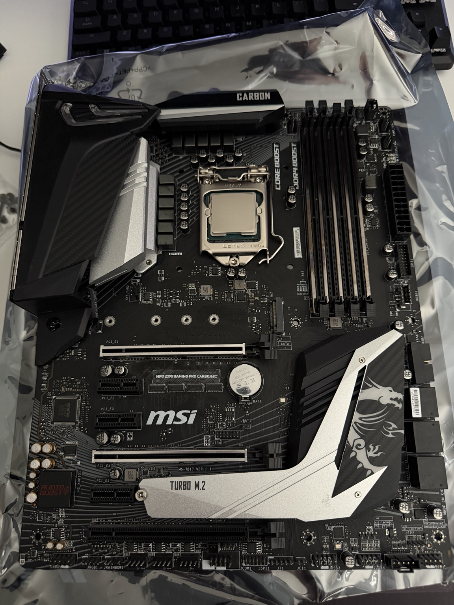
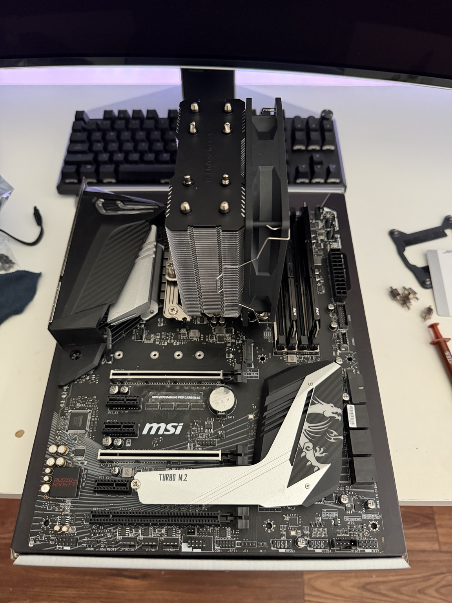
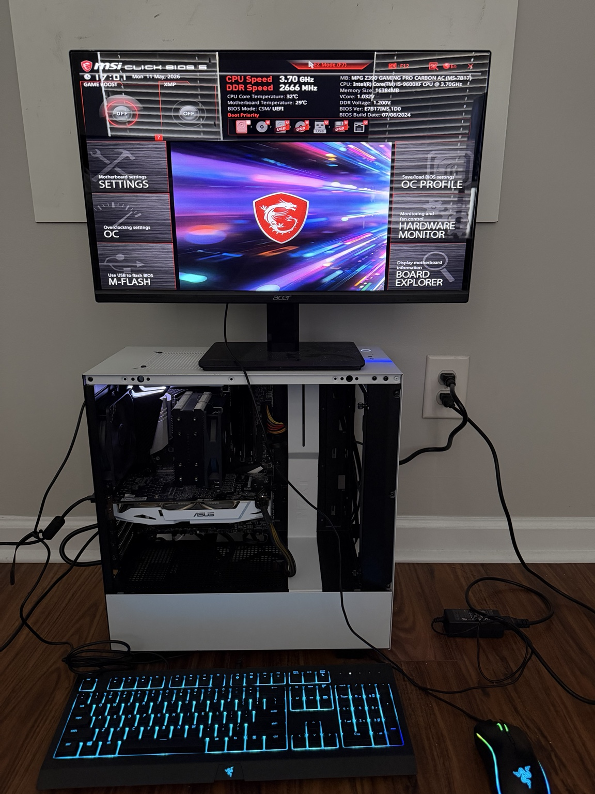
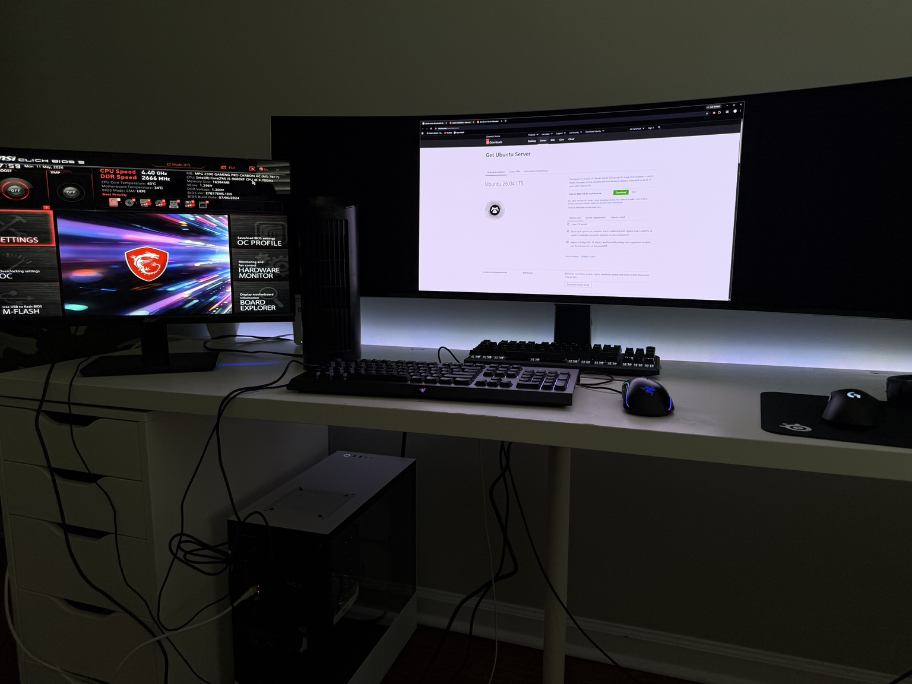
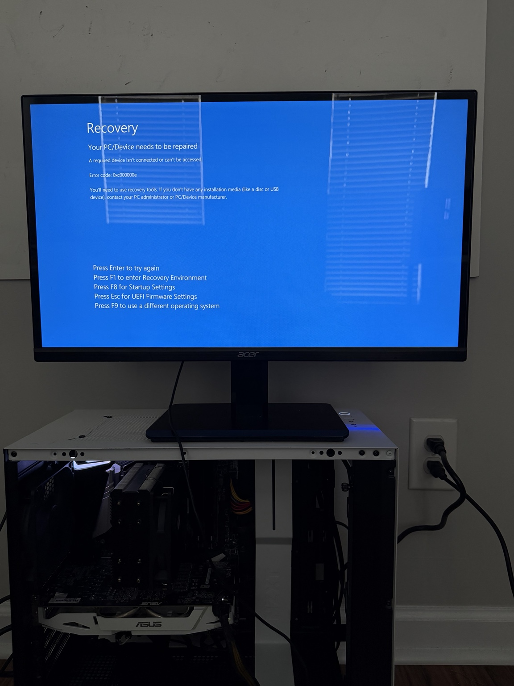
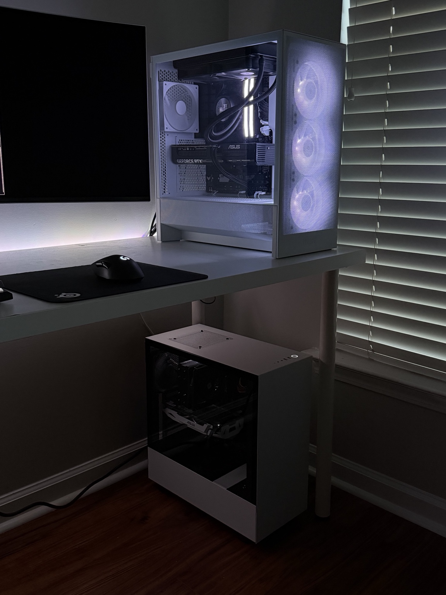

# Hardware Build and System Preparation

## Objective

The goal of this project was to repurpose existing consumer desktop hardware into a dedicated Linux-based homelab server for learning practical systems administration, networking, Docker, Linux server management, and infrastructure troubleshooting.

This project was built primarily as a hands-on learning environment to develop real operational experience beyond theoretical coursework and certifications.

While this is not an ideal or power-efficient enterprise server configuration, the decision to reuse existing hardware was intentional. The focus was to maximize available resources, gain practical deployment experience, and build a functional infrastructure platform using equipment already on hand.

---

# Server Hardware

## Core Components

- Intel Core i5-9600KF
- MSI Z390 GAMING PRO CARBON motherboard
- XPG 16GB (2x8GB) DDR4 3200MHz RAM
- NVIDIA GTX 1060
- NZXT H500 White ATX Mid Tower Case
- Western Digital Blue 1TB HDD
- Thermalright Assassin X120 Refined SE CPU Cooler
- Corsair CX500 500W Power Supply

---

# Project Context

## Repurposing Existing Hardware

The server originated from older desktop gaming hardware that was no longer being actively used. Instead of allowing the components to sit idle, the system was converted into a dedicated Linux server environment.

Although the hardware is somewhat oversized for lightweight server workloads and not optimized for power efficiency, repurposing existing equipment provided several advantages:

- reduced initial infrastructure costs
- immediate access to physical hardware
- practical exposure to server deployment workflows
- hands-on troubleshooting experience
- the ability to experiment freely without production risk

This approach prioritized learning, experimentation, and operational familiarity over enterprise-grade optimization.

---

# Hardware Preparation

## Motherboard and CPU Preparation

Initial preparation included reinstalling and validating core hardware components before deployment.

Tasks completed:
- CPU installation verification
- motherboard inspection
- cooler mounting preparation
- memory installation
- power connection verification
- storage reconnection

---

## CPU Cooler Installation

A new Thermalright Assassin X120 Refined SE CPU cooler was installed before deployment to improve thermal performance and long-term stability.

Steps completed:
- removed the previous cooler
- cleaned old thermal paste from the CPU
- applied fresh thermal paste
- installed new mounting hardware
- mounted the CPU cooler securely
- connected CPU fan headers
- verified cooler clearance and airflow direction

Proper cooling was treated as a critical requirement because the system would eventually operate continuously as a 24/7 Linux server.

---

# System Assembly and Validation

## Initial Assembly

After hardware preparation, the system was fully assembled inside the NZXT H500 chassis and powered on for validation testing.

Initial checks included:
- successful POST verification
- CPU detection
- RAM detection
- storage recognition
- fan operation
- thermal monitoring

This confirmed that the hardware platform was stable before beginning operating system deployment.

---

# Temporary Workstation Setup

## Makeshift Deployment Environment

Before the server could operate headlessly, the system required a temporary physical workstation setup for BIOS configuration, operating system installation, and initial networking configuration.

A basic deployment environment was assembled using:
- temporary monitor placement
- wired keyboard and mouse
- direct physical console access
- USB installation media
- a nearby Windows workstation for downloads and documentation

Because the Intel i5-9600KF does not include integrated graphics, the NVIDIA GTX 1060 remains installed in the system to provide video output and allow the machine to POST successfully.

At this stage, the setup was intentionally functional rather than elegant. The priority was establishing a working Linux server foundation before transitioning to remote administration.

---

# Legacy Windows Installation

## Existing Windows Boot Issues

During early testing, the system still contained an older broken Windows installation from its previous use as a desktop machine.

Boot attempts occasionally produced Windows recovery errors before the system was fully repurposed for Linux.

While unintended, this became part of the transition process from a consumer desktop environment into a dedicated Linux server platform.

Ultimately, the previous operating system was completely replaced during Ubuntu Server deployment.

---

## Physical Network Connectivity

The server is connected through a Google Fiber home network deployment using a WiFi 6E mesh configuration.

### Network Layout

- Google Fiber connection from exterior fiber jack
- Primary WiFi 6E router
- Mesh extender positioned near workstation/server environment
- Dedicated Cat6 Ethernet connection to Windows 11 client machine
- Separate dedicated Cat6 Ethernet connection to Ubuntu Server machine

This configuration allows both systems to maintain wired connectivity while benefiting from strong wireless backhaul performance between the mesh node and primary router.

---

## BIOS Configuration and Firmware Update

The MSI BIOS interface was accessed to:
- verify hardware recognition
- inspect system temperatures
- review storage devices
- confirm boot device priority
- prepare the system for Linux installation

The BIOS was also updated using MSI M-Flash before deploying Ubuntu Server.

Reasons for updating:
- improve system stability
- apply firmware fixes
- improve hardware compatibility
- reduce potential deployment issues later

Firmware maintenance was treated as part of the infrastructure preparation process rather than an afterthought.

---

# Headless Transition

## Moving Toward Remote Administration

Once I completed the [Ubuntu Server Installation](docs/ubuntu-server-install.md) and successfully configured [Remote Access and SSH](docs/remote-access-and-ssh.md), the server no longer required a permanent monitor, keyboard, or mouse. I went ahead and placed the physical machine under my desk where I have my main Windows 11 machine that will be the primary client for this home lab.

This reduced reliance on direct physical access and more closely mirrored real-world Linux server administration workflows.

Administration shifted toward:
- SSH remote access
- Windows Terminal
- VS Code remote workflows
- browser-based management interfaces
- remote Docker management
- Git-based documentation workflows

This marked the transition from a temporary physical deployment setup into a functional headless Linux server environment.

---

# Lessons Learned

## Repurposed Hardware Still Has Value

One major takeaway from this project was that older consumer desktop hardware can still function effectively as a capable Linux server for:
- Docker workloads
- networking labs
- monitoring systems
- remote administration practice
- infrastructure experimentation
- Linux troubleshooting

The project reinforced the idea that practical experience matters more than having perfect hardware at the beginning.

---

## Infrastructure Starts Before Software

Another important lesson was that server deployment begins long before installing Linux.

Hardware preparation, cooling, firmware maintenance, and stability validation all directly impact long-term reliability.

Tasks such as:
- thermal management
- BIOS updates
- cable organization
- hardware verification
- incremental troubleshooting

became foundational habits throughout the rest of the homelab project.

---

## Practical Troubleshooting Is Essential

The process also reinforced the importance of iterative troubleshooting and adaptability.

Unexpected issues encountered during deployment included:
- firmware updates
- temporary Windows boot failures
- hardware validation
- deployment staging
- networking preparation
- transitioning from local to headless management

Working through these issues provided significantly more practical understanding than theoretical study alone.

---

# Outcome

At the completion of the hardware preparation phase:
- the server successfully POSTed
- temperatures were stable
- BIOS firmware was updated
- hardware components were verified
- Ubuntu Server installation media was prepared
- the system was ready for Linux deployment
- the environment was positioned for eventual headless operation

This established the foundation for the remainder of the homelab infrastructure project.
