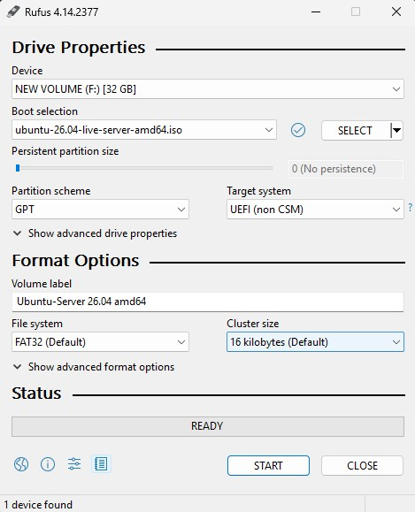
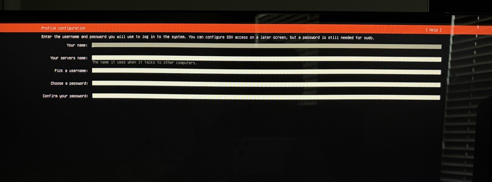
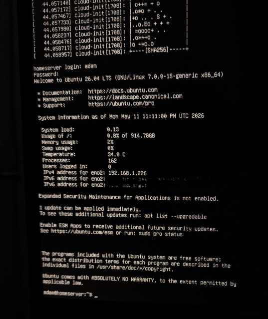
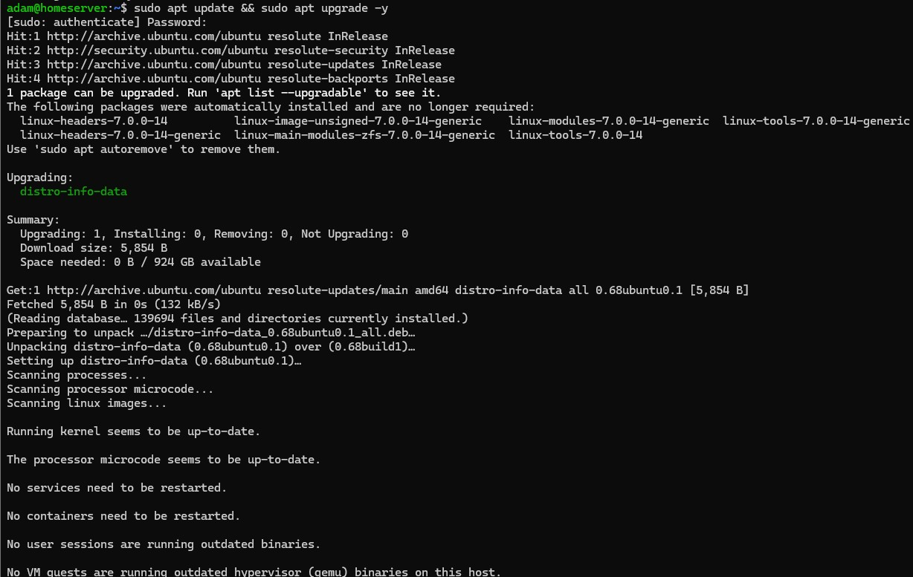
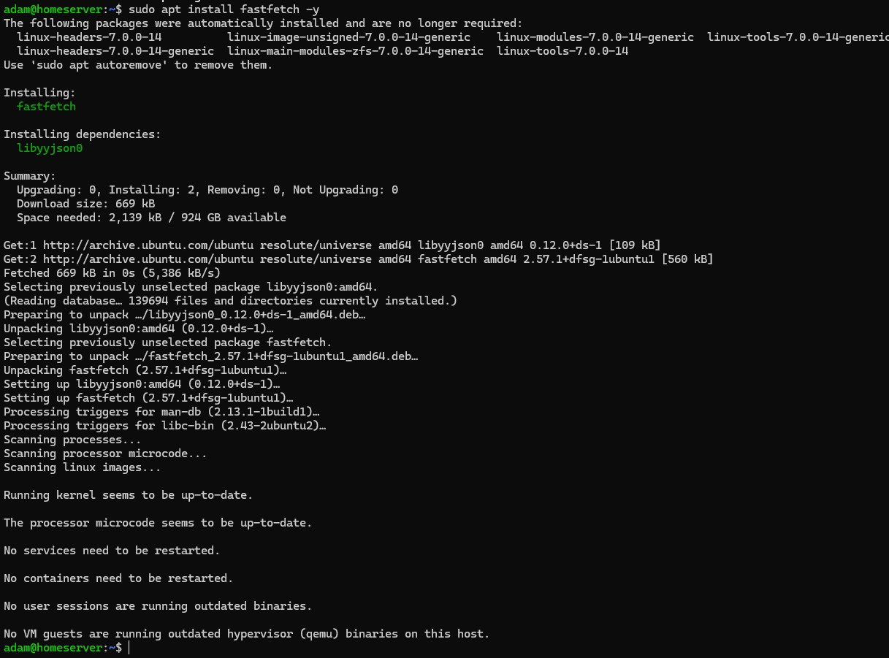
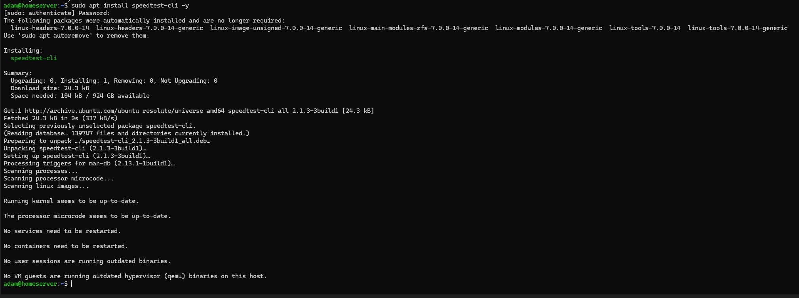
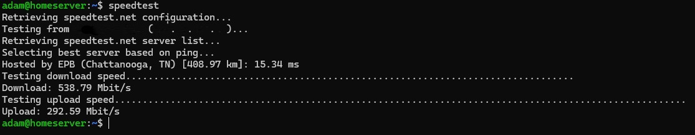
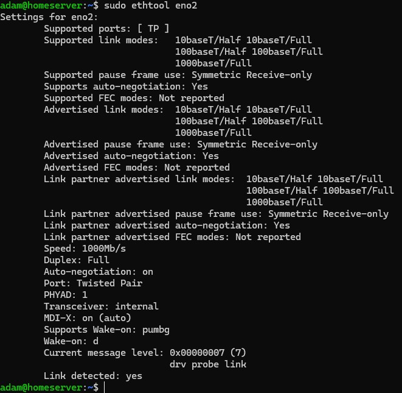

# 02 - Ubuntu Server Installation

## Objective

Deploy Ubuntu Server 26.04 LTS onto repurposed hardware to establish the foundation for the homelab infrastructure environment.

---

## Preparing Installation Media

### Downloading Ubuntu Server

- Downloaded Ubuntu Server 26.04 LTS ISO
- Verified correct server image selection

<p align="center">
  
</p>

<p align="center">
  <em>Ubuntu Server 26.04 LTS download page used to obtain the installation ISO.</em>
</p>

---

### Creating Bootable USB Media

Rufus was used on a Windows 11 workstation to create a bootable Ubuntu Server installation drive.

Configuration used:
- Partition scheme: GPT
- Target system: UEFI (non-CSM)
- File system: FAT32

<p align="center">
  
</p>

<p align="center">
  <em>Rufus configuration used to create UEFI-compatible Ubuntu Server installation media.</em>
</p>

---

## BIOS Preparation

### BIOS Update

Prior to Ubuntu Server deployment, the motherboard BIOS was updated to improve hardware compatibility, system stability, and long-term reliability.

<p align="center">
  
</p>

<p align="center">
  <em>Motherboard BIOS update completed prior to Linux deployment to improve system stability and compatibility.</em>
</p>

Detailed hardware preparation steps are documented in the [Hardware Build](./01-hardware-build.md) section.

---

## Ubuntu Server Installation

### Installer Boot

The system successfully booted into the Ubuntu Server installer environment.

<p align="center">
  
</p>

<p align="center">
  <em>Ubuntu Server installer environment during initial deployment and language selection.</em>
</p>

---

### Installation Type

The standard Ubuntu Server installation option was selected.

<p align="center">
  
</p>

<p align="center">
  <em>Ubuntu Server installation type selection during operating system deployment.</em>
</p>

---

### System Profile Configuration

The initial hostname, username, and authentication credentials were configured during installation.

<p align="center">
  
</p>

<p align="center">
  <em>Initial server hostname, user profile, and authentication configuration during setup.</em>
</p>

---

### Package Installation

Ubuntu Server packages and OpenSSH components were installed.

<p align="center">
  
</p>

<p align="center">
  <em>Ubuntu Server package installation and OpenSSH deployment process.</em>
</p>

---

## First Boot and Initialization

### Cloud-Init and SSH Key Generation

After installation completed, the server initialized cloud-init services and generated SSH host keys.

<p align="center">
  
</p>

<p align="center">
  <em>Initial cloud-init services and SSH host key generation during first boot.</em>
</p>

---

## Remote Administration

### First SSH Connection

The first successful SSH session was established from the Windows 11 client workstation using Windows Terminal.

<p align="center">
  
</p>

<p align="center">
  <em>First successful SSH connection established from the Windows 11 workstation using Windows Terminal.</em>
</p>

---

## Initial System Updates

Immediately after deployment, the server package repositories were refreshed and the operating system was updated to establish a stable baseline before infrastructure services were installed.

Commands used:

```bash
sudo apt update && sudo apt upgrade -y
```
<p align="center">
  
</p>

<p align="center">
  <em>Initial Ubuntu Server package update and system upgrade performed after deployment.</em>
</p>

---

## Installing Basic Administrative Utilities

Basic command-line utilities were installed to simplify system administration, hardware validation, and operational monitoring during the early deployment phase.

### Fastfetch Installation

Fastfetch was installed to provide quick visibility into hardware, operating system, and runtime environment details.

Command used:

```bash
sudo apt install fastfetch -y
```

<p align="center">
  
</p>

<p align="center">
  <em>Installation of Fastfetch utility for quick system and hardware identification.</em>
</p>

---

### Speedtest-cli Installation

The `speedtest-cli` utility was installed to validate WAN connectivity and throughput directly from the Ubuntu Server environment.

Command used:

```bash
sudo apt install speedtest-cli -y
```

<p align="center">
  
</p>

<p align="center">
  <em>Installation of speedtest-cli utility for network throughput validation.</em>
</p>

---

### Internet Connectivity Validation

Internet connectivity and throughput performance were validated directly from the Ubuntu Server environment.

Command used:

```bash
speedtest
```

<p align="center">
  
</p>

<p align="center">
  <em>Network throughput validation performed directly from the Ubuntu Server host.</em>
</p>

---

### Network Interface Verification

The onboard Intel network interface was validated to confirm negotiated link speed, duplex operation, and Wake-on-LAN capability.

Command used:

```bash
sudo ethtool eno2
```

Verified:
- 1000Mb/s link negotiation
- full duplex operation
- Wake-on-LAN support
- active physical link state

<p align="center">
  
</p>

<p align="center">
  <em>Network interface validation using ethtool showing active gigabit connectivity and Wake-on-LAN capability.</em>
</p>

# Outcome

At completion:
- Ubuntu Server was successfully deployed and updated
- OpenSSH remote administration was operational
- Remote access workflows were validated from Windows 11 clients
- Network connectivity and throughput were verified
- Intel NIC functionality and Wake-on-LAN support were confirmed
- Basic administrative utilities were installed
- The server was prepared for containerized infrastructure deployment

---

# Lessons Learned

Key takeaways included:
- bootable media preparation and UEFI/GPT installation workflows
- BIOS firmware configuration and hardware initialization
- Linux server deployment and post-install system validation
- OpenSSH configuration and remote administration fundamentals
- command-line package management and system maintenance
- network interface validation and throughput testing
- foundational infrastructure preparation for Docker-based services