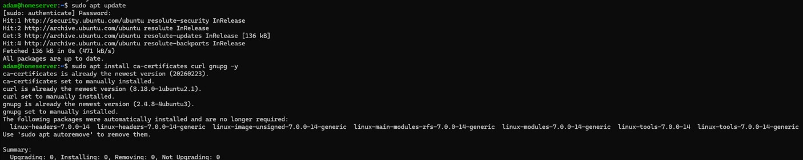
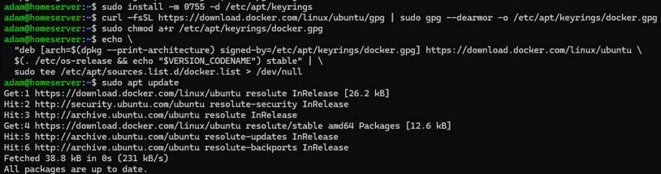
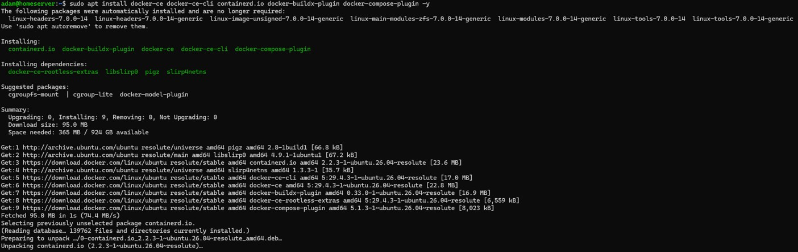
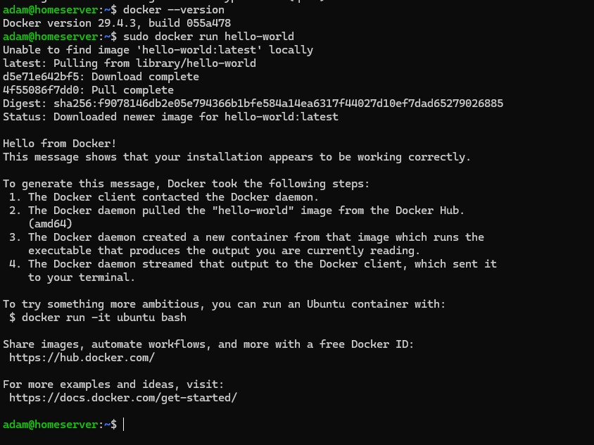
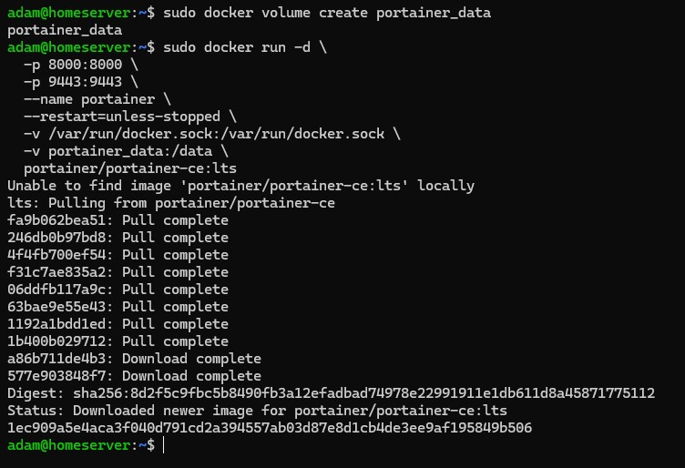
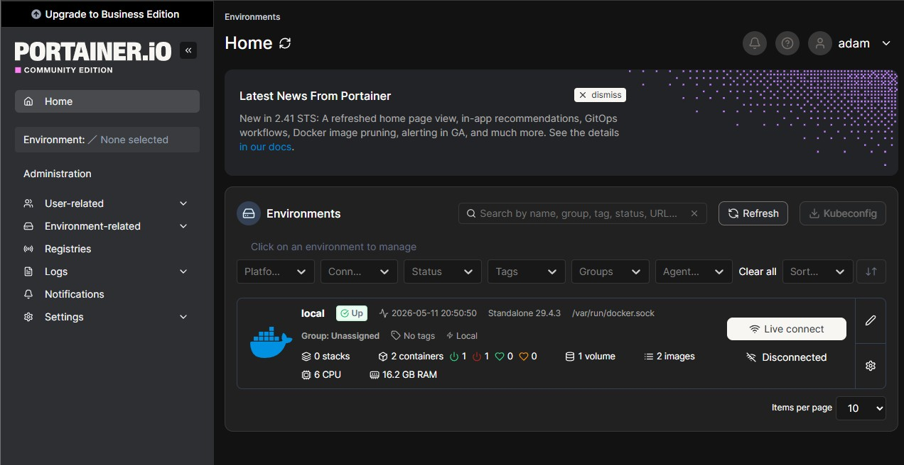

# 04 - Docker Setup

## Overview

After Ubuntu Server deployment and remote administration were fully operational, the next phase of the home lab focused on containerization using Docker.

Docker was selected to provide:

- Isolated application environments
- Simplified service deployment
- Reproducible infrastructure
- Easier dependency management
- Scalable self-hosted service architecture
- Cleaner operational workflows

Portainer Community Edition was later deployed to provide a centralized graphical interface for Docker administration and container visibility.

All installation and configuration steps were performed remotely over SSH from the Windows 11 workstation.

---

## Goals

- Learn Docker fundamentals
- Configure Docker using the official repository
- Understand Linux package repository management
- Validate Docker Engine functionality
- Deploy a graphical container management platform
- Establish a scalable self-hosting foundation
- Prepare infrastructure for future services and automation

---

## Preparing Docker Repository Dependencies

Before Docker could be installed, several prerequisite packages were installed to support secure repository communication and package verification.

Command used:

```bash
sudo apt update
sudo apt install ca-certificates curl gnupg -y
```

These packages provided:

- HTTPS repository communication
- GPG signature verification
- Secure package authentication
- Repository key management

<p align="center">
  
</p>

<p align="center">
  <em>Installing prerequisite packages required for secure Docker repository configuration.</em>
</p>

---

## Adding Docker's Official Repository

Docker's official GPG signing key was downloaded and configured to allow Ubuntu to validate packages from Docker's repository.

Commands used:

```bash
sudo install -m 0755 -d /etc/apt/keyrings
```

```bash
curl -fsSL https://download.docker.com/linux/ubuntu/gpg | \
sudo gpg --dearmor -o /etc/apt/keyrings/docker.gpg
```

```bash
sudo chmod a+r /etc/apt/keyrings/docker.gpg
```

Docker's stable repository was then added to the system's APT sources list.

Command used:

```bash
echo \
"deb [arch=$(dpkg --print-architecture) \
signed-by=/etc/apt/keyrings/docker.gpg] \
https://download.docker.com/linux/ubuntu \
$(. /etc/os-release && echo "$VERSION_CODENAME") stable" | \
sudo tee /etc/apt/sources.list.d/docker.list > /dev/null
```

After the repository was added, package indexes were refreshed:

```bash
sudo apt update
```

This ensured Docker packages would be pulled directly from Docker's official repositories rather than Ubuntu's default package repositories.

<p align="center">
  
</p>

<p align="center">
  <em>Docker repository signing key and official Docker APT repository configured on Ubuntu Server.</em>
</p>

---

## Installing Docker Engine

Docker Engine and related runtime components were then installed.

Command used:

```bash
sudo apt install docker-ce docker-ce-cli containerd.io \
docker-buildx-plugin docker-compose-plugin -y
```

Installed components included:

- Docker Engine
- Docker CLI
- Containerd runtime
- Docker Buildx
- Docker Compose plugin

This established the complete container runtime environment on the Ubuntu Server host.

<p align="center">
  
</p>

<p align="center">
  <em>Installation of Docker Engine, Docker CLI, containerd, and Docker Compose components.</em>
</p>

---

## Verifying Docker Functionality

After installation completed, Docker functionality was validated.

Docker version check:

```bash
docker --version
```

Test container execution:

```bash
sudo docker run hello-world
```

The successful output confirmed:

- Docker daemon functionality
- Internet connectivity
- Image download capability
- Functional container execution
- Proper runtime installation

<p align="center">
  
</p>

<p align="center">
  <em>Successful Docker runtime validation using the official hello-world test container.</em>
</p>

---

## Why Docker Was Important

Docker fundamentally changed how infrastructure and services could be deployed within the home lab.

Instead of manually configuring applications directly on the host operating system, services could now operate inside isolated containers with independent environments and standardized deployment workflows.

Benefits included:

- Simplified deployments
- Reduced dependency conflicts
- Easier troubleshooting
- Improved portability
- Faster service recovery
- Cleaner infrastructure management

Docker became the operational foundation for future self-hosted applications and services.

---

## Deploying Portainer

After Docker was functioning correctly, Portainer Community Edition was deployed to provide graphical container management.

Portainer introduced a graphical management layer on top of the Docker Engine API, simplifying operational visibility and container lifecycle management.

Portainer provided:

- Web-based Docker administration
- Container visibility
- Volume management
- Network management
- Stack deployment
- Simplified operational monitoring

---

## Creating Persistent Portainer Storage

A persistent Docker volume was created to store Portainer configuration data.

Command used:

```bash
sudo docker volume create portainer_data
```

The Portainer container was then deployed.

Command used:

```bash
sudo docker run -d \
-p 8000:8000 \
-p 9443:9443 \
--name portainer \
--restart=unless-stopped \
-v /var/run/docker.sock:/var/run/docker.sock \
-v portainer_data:/data \
portainer/portainer-ce:lts
```

Key configuration details included:

- HTTPS web access through port 9443
- Persistent configuration storage
- Docker socket access for container management
- Automatic restart policy

<p align="center">
  
</p>

<p align="center">
  <em>Creation of persistent Portainer storage and deployment of the Portainer Community Edition container.</em>
</p>

---

## Accessing Portainer

After deployment, Portainer became accessible through a web browser using:

```text
https://server-ip:9443
```

Example:

```text
https://192.168.x.x:9443
```

Initial setup included:

- Administrator account creation
- Local Docker environment selection
- Environment initialization

Once configured, Portainer successfully connected to the local Docker Engine instance.

---

## Portainer Dashboard

The Portainer dashboard provided centralized visibility into:

- Running containers
- Docker images
- Volumes
- Resource utilization
- Docker environments
- Container networking

This became the primary graphical management interface for the server's container infrastructure.

<p align="center">
  
</p>

<p align="center">
  <em>Portainer dashboard connected to the local Docker environment and displaying active container infrastructure.</em>
</p>

---

## Docker Concepts Introduced

### Images

Read-only templates used to create containers.

Examples included:

- `hello-world`
- `ubuntu`
- `portainer/portainer-ce`

### Containers

Running instances of Docker images that provide isolated application environments.

Containers simplify:

- Deployment
- Portability
- Dependency management
- Operational consistency

### Volumes

Persistent storage locations managed independently from container lifecycle operations.

Volumes prevent data loss during:

- Container recreation
- Updates
- Restarts
- Image replacement

### Container Networking

Docker automatically provisions virtual bridge networking that allows containers to communicate internally while selectively exposing services externally through mapped ports.

### Docker Daemon

The background service responsible for:

- Pulling images
- Running containers
- Managing storage
- Managing networking
- Handling container lifecycle operations

---

## Security Considerations

The current Docker deployment utilized:

- Official Docker repositories
- Repository signature validation
- HTTPS-secured Portainer access
- Persistent container storage
- Local network administrative access

Future improvements may include:

- Reverse proxy integration
- SSL certificate management
- Firewall hardening
- Non-root Docker administration
- Container segmentation
- Access control improvements

---

# Outcome

At completion:

- Docker Engine was successfully deployed
- Official Docker repositories were configured
- Container execution was validated
- Portainer was operational
- Persistent Docker storage was configured
- Web-based container administration was functional
- The infrastructure foundation for self-hosted services was established

---

# Lessons Learned

Key takeaways included:

- Docker installation relies heavily on repository and package management fundamentals
- Containerization significantly simplifies service deployment workflows
- Linux package repository trust and GPG verification are critical infrastructure concepts
- Docker images enable highly reproducible deployments
- Persistent storage management is essential for stateful services
- Portainer improves operational visibility and container management usability
- Containerization introduces modular infrastructure design principles
- Remote SSH administration integrates naturally with Docker-based workflows
- Modern self-hosting environments are heavily container driven
- Small successful deployments compound operational confidence and troubleshooting ability

---

## Later Infrastructure Changes

As the homelab environment evolved, Portainer was later migrated behind a centralized reverse proxy architecture using NGINX Proxy Manager.

The original deployment exposed:
- port 9443
- port 8000

directly to the local network.

During the [Reverse Proxy Lab](07-reverse-proxy-lab.md), Portainer was:
- attached to a shared Docker ingress network
- migrated to internal-only service architecture
- redeployed without direct LAN port exposure
- accessed through hostname-based reverse proxy routing

Final access was centralized through:

```text
http://portainer.local
```

This improved:

- ingress centralization
- service isolation
- attack surface reduction
- infrastructure segmentation