# 06 - Monitoring Stack Lab

## Status

Completed

---

## Overview

This project focused on deploying a containerized monitoring environment using Docker Compose, Prometheus, Node Exporter, and Grafana.

The deployment was designed to collect, store, and visualize real-time infrastructure metrics from an Ubuntu Server host while introducing foundational observability and monitoring concepts.

The stack included:
- Prometheus for metrics collection and time-series storage
- Node Exporter for exposing Linux host metrics
- Grafana for dashboard visualization
- Docker Compose for multi-container orchestration

The lab demonstrated:
- metrics scraping workflows
- exporter-based monitoring architecture
- Docker bridge networking and service discovery
- persistent storage for stateful services
- real-time infrastructure visualization
- containerized observability pipelines

---

## Objectives

The primary goals of this lab were to:
- deploy a containerized monitoring stack using Docker Compose
- collect host-level system metrics using Node Exporter
- configure Prometheus for metrics scraping
- visualize infrastructure metrics using Grafana dashboards
- understand exporter-based monitoring architectures
- demonstrate internal container networking between monitoring services
- gain familiarity with infrastructure observability concepts
- monitor real-time server resource utilization

---

## Monitoring Stack Architecture

The monitoring stack followed a layered metrics collection and visualization architecture:

```text
Ubuntu Server Metrics
        ↓
Node Exporter
        ↓
Prometheus Scraping
        ↓
Time-Series Database
        ↓
Grafana Queries
        ↓
Dashboards & Visualization
```

In this deployment:
- Node Exporter exposed system metrics from the Ubuntu Server host
- Prometheus scraped and stored metrics data
- Grafana queried Prometheus and visualized infrastructure data through dashboards
- Docker Compose managed service orchestration and networking

---

## Core Technologies

### Prometheus

Prometheus is an open-source monitoring and alerting platform designed for collecting and storing time-series metrics data.

Prometheus operates using a pull-based monitoring model where it periodically scrapes HTTP endpoints exposed by monitoring exporters.

In this project, Prometheus:
- collected metrics from Node Exporter
- stored metrics as time-series data
- served as the primary monitoring database
- provided query capabilities for Grafana dashboards

Prometheus was configured to scrape metrics every 15 seconds.

---

### Node Exporter

Node Exporter is a Prometheus exporter designed to expose Linux host system metrics in a Prometheus-compatible format.

In this project, Node Exporter provided visibility into:
- CPU utilization
- memory usage
- filesystem statistics
- network activity
- system load
- disk usage

Node Exporter acted as the metrics source for the monitoring stack.

---

### Grafana

Grafana is a visualization and analytics platform used to create dashboards from monitoring and observability data.

In this project, Grafana:
- connected to Prometheus as a data source
- visualized collected infrastructure metrics
- provided operational dashboards for monitoring the Ubuntu Server host
- served as the frontend visualization layer of the monitoring stack

---

## Technologies Used

- Docker Engine
- Docker Compose
- Prometheus
- Node Exporter
- Grafana
- Ubuntu Server 26.04 LTS

---

## Project Deployment

### Project Directory Creation

A dedicated infrastructure directory structure was created to organize the monitoring stack deployment and supporting configuration files.

Commands used:

```bash
mkdir -p ~/infrastructure/monitoring-stack
cd ~/infrastructure/monitoring-stack
```

<p align="center">
  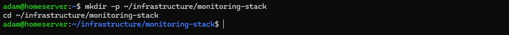
</p>

<p align="center">
  <em>Creating the infrastructure project directory for the monitoring stack deployment.</em>
</p>

---

### Creating the Docker Compose Configuration

A Docker Compose stack was created containing:
- Prometheus
- Node Exporter
- Grafana

The services were connected using a shared Docker bridge network named `monitoring`.

Initial compose configuration:

```yaml
services:
  prometheus:
    image: prom/prometheus:latest
    container_name: prometheus
    ports:
      - "9090:9090"
    volumes:
      - ./prometheus/prometheus.yml:/etc/prometheus/prometheus.yml:ro
    networks:
      - monitoring

  node-exporter:
    image: prom/node-exporter:latest
    container_name: node-exporter
    ports:
      - "9100:9100"
    networks:
      - monitoring

  grafana:
    image: grafana/grafana:latest
    container_name: grafana
    ports:
      - "3000:3000"
    networks:
      - monitoring

networks:
  monitoring:
    driver: bridge
```

<p align="center">
  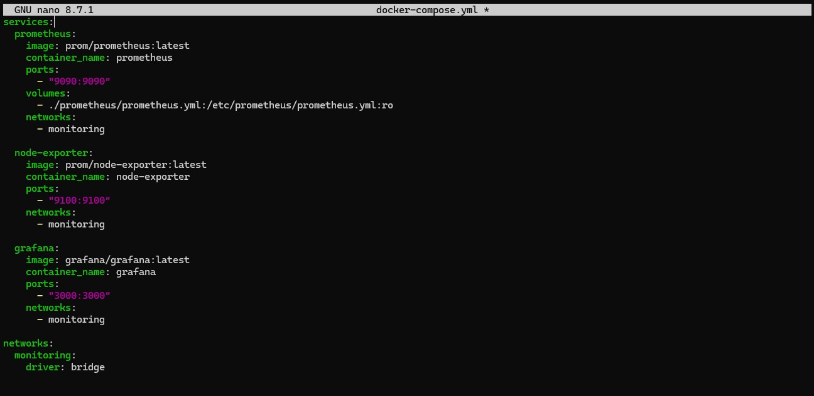
</p>

<p align="center">
  <em>Docker Compose configuration defining Prometheus, Node Exporter, and Grafana services on a shared monitoring bridge network.</em>
</p>

---

### Creating the Prometheus Configuration

A dedicated directory and configuration file were created for Prometheus.

Commands used:

```bash
mkdir -p prometheus
nano prometheus/prometheus.yml
```

<p align="center">
  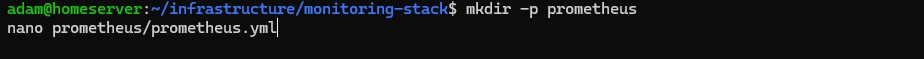
</p>

<p align="center">
  <em>Creating the Prometheus configuration directory and configuration file.</em>
</p>

Initial configuration:

```yaml
global:
  scrape_interval: 15s

scrape_configs:
  - job_name: "node-exporter"
    static_configs:
      - targets: ["node-exporter:9100"]
```

<p align="center">
  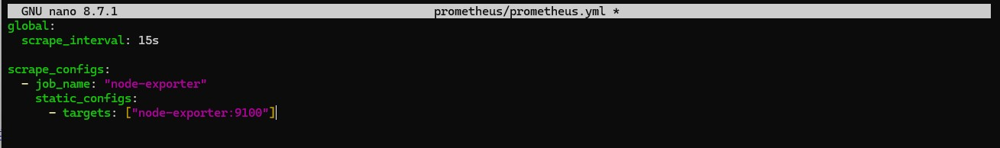
</p>

<p align="center">
  <em>Prometheus scrape configuration targeting the Node Exporter service over the internal Docker network.</em>
</p>

---

### Internal Container Networking

Prometheus communicated with Node Exporter using Docker's internal bridge networking and embedded DNS-based service discovery.

Instead of relying on static IP addresses, Prometheus targeted the Node Exporter service directly using the container service name:

```yaml
targets: ["node-exporter:9100"]
```

This allowed services to communicate reliably within the isolated monitoring network created by Docker Compose.

The deployment demonstrated:
- internal Docker DNS resolution
- service-to-service communication
- bridge networking
- isolated infrastructure segmentation

---

### Deploying the Docker Compose Stack

The monitoring stack was deployed using Docker Compose.

Command used:

```bash
docker compose up -d
```

<p align="center">
  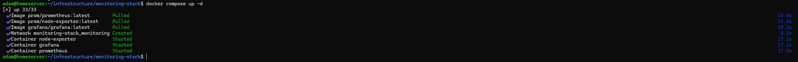
</p>

<p align="center">
  <em>Deployment of the monitoring stack including Prometheus, Node Exporter, and Grafana containers.</em>
</p>

---

### Inspecting Running Containers

Running containers were inspected to validate successful deployment and active service status.

Command used:

```bash
docker ps
```

<p align="center">
  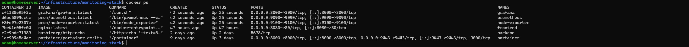
</p>

<p align="center">
  <em>Validation of active monitoring stack containers and published service ports.</em>
</p>

The deployment successfully exposed:
- Prometheus on port 9090
- Node Exporter on port 9100
- Grafana on port 3000

---

## Service Validation

### Prometheus Browser Test

Prometheus accessibility was validated from the Windows 11 management workstation using a web browser.

URL used:

```text
http://192.168.1.226:9090
```

The Prometheus interface loaded successfully, confirming:
- successful container deployment
- active port exposure
- operational web interface access
- functional Docker networking

<p align="center">
  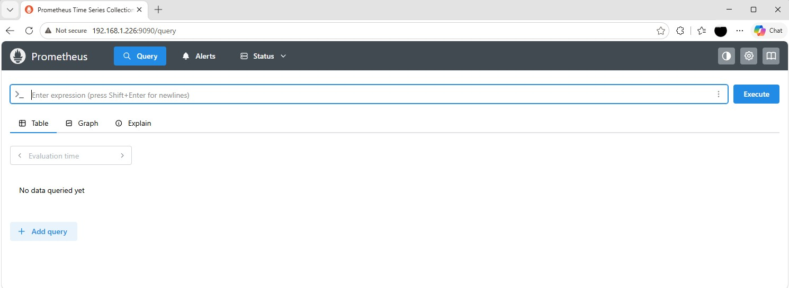
</p>

<p align="center">
  <em>Successful validation of the Prometheus web interface from the Windows 11 management workstation.</em>
</p>

---

### Grafana Browser Test

Grafana accessibility was validated from the Windows 11 management workstation using a web browser.

URL used:

```text
http://192.168.1.226:3000
```

The Grafana login interface loaded successfully.

<p align="center">
  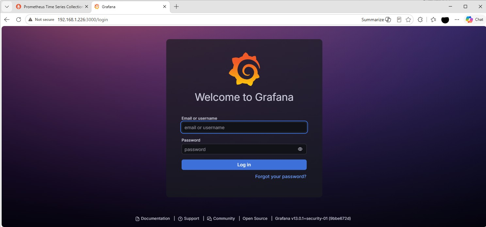
</p>

<p align="center">
  <em>Successful validation of the Grafana web interface from the Windows 11 management workstation.</em>
</p>

---

### Grafana Dashboard Access

Grafana was initially accessed using the default administrator credentials:

```text
Username: admin
Password: admin
```

After initial authentication:
- the default password was rotated
- administrative dashboard access was established
- Grafana was confirmed operational

<p align="center">
  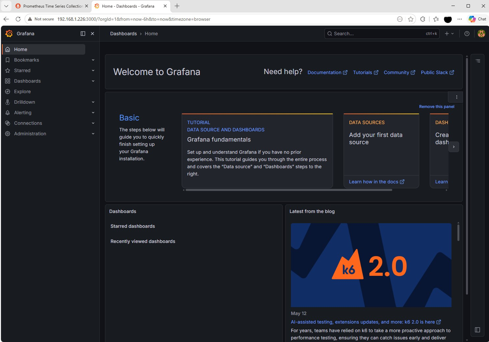
</p>

<p align="center">
  <em>Grafana dashboard interface after successful authentication and initial configuration.</em>
</p>

---

## Refining the Deployment

### Removing Unnecessary Node Exporter Port Exposure

Validating the monitoring stack surfaced a problem: Node Exporter was unnecessarily exposing port `9100` to the local network through Docker port publishing.

The original Node Exporter configuration looked like this:

```yaml
node-exporter:
  ports:
    - "9100:9100"
```

Because Prometheus already communicated with Node Exporter internally through the shared Docker bridge network using Docker DNS and service discovery, external exposure of the metrics endpoint was unnecessary.

### Adding Persistent Storage

A second issue surfaced alongside it: the services were still operating as stateless containers.

This meant:
- Grafana dashboards and configuration would be lost if containers were recreated
- Prometheus metrics history would reset during redeployment
- the deployment behaved more like a temporary demo environment than a realistic monitoring stack

The deployment was refined to:
- add persistent Docker volumes
- remove unnecessary external Node Exporter exposure
- improve internal service isolation
- reduce unnecessary network exposure

The updated compose configuration looked like this:

```yaml
services:
  prometheus:
    image: prom/prometheus:latest
    container_name: prometheus
    ports:
      - "9090:9090"
    volumes:
      - ./prometheus/prometheus.yml:/etc/prometheus/prometheus.yml:ro
      - prometheus-data:/prometheus
    networks:
      - monitoring

  node-exporter:
    image: prom/node-exporter:latest
    container_name: node-exporter
    networks:
      - monitoring

  grafana:
    image: grafana/grafana:latest
    container_name: grafana
    ports:
      - "3000:3000"
    volumes:
      - grafana-data:/var/lib/grafana
    networks:
      - monitoring

networks:
  monitoring:
    driver: bridge

volumes:
  prometheus-data:
  grafana-data:
```

<p align="center">
  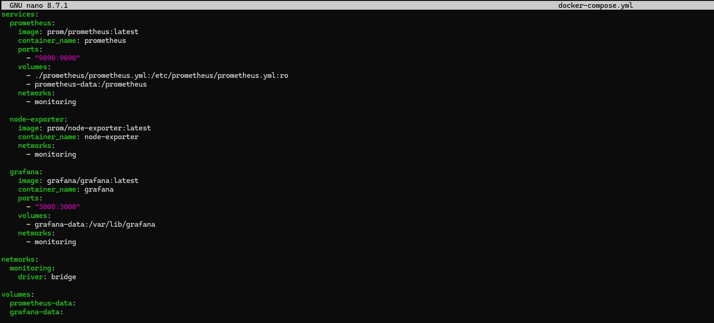
</p>

<p align="center">
  <em>Docker Compose configuration updated with persistent Docker volumes and improved internal service isolation.</em>
</p>

These changes improved the deployment by:
- preserving Prometheus metrics history
- persisting Grafana dashboards and configuration
- reducing unnecessary service exposure
- reinforcing internal container-based communication
- creating a more realistic operational monitoring environment

---

## Persistent Storage Validation

### Redeploying the Monitoring Stack

After updating the Docker Compose configuration, the stack was redeployed to apply the persistent storage changes.

Commands used:

```bash
docker compose down
docker compose up -d
```

<p align="center">
  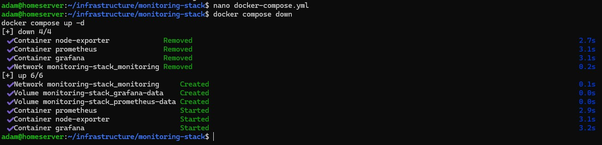
</p>

<p align="center">
  <em>Redeploying the monitoring stack after updating the Docker Compose configuration.</em>
</p>

The redeployment recreated the containers while preserving persistent application data through Docker volumes.

---

### Verifying Persistent Volumes

Docker volumes were inspected to confirm successful creation of persistent storage resources.

Command used:

```bash
docker volume ls
```

The deployment successfully created:
- a persistent volume for Prometheus metrics storage
- a persistent volume for Grafana application data

<p align="center">
  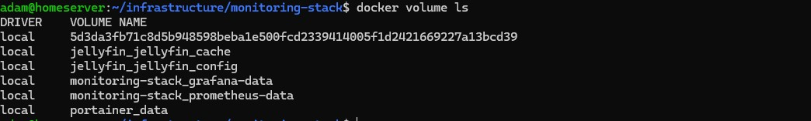
</p>

<p align="center">
  <em>Validation of persistent Docker volumes created for the monitoring stack.</em>
</p>

---

## Metrics Pipeline Validation

### Validating Prometheus Scrape Targets

Prometheus targets were inspected to confirm successful communication with Node Exporter.

The targets page was accessed from the Prometheus web interface:

```text
http://192.168.1.226:9090/targets
```

The Node Exporter target showed an `UP` status, confirming:
- successful Docker DNS resolution
- active service-to-service communication
- operational metrics scraping
- functional monitoring pipeline connectivity

<p align="center">
  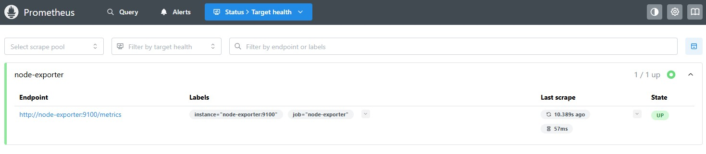
</p>

<p align="center">
  <em>Prometheus successfully scraping metrics from the Node Exporter service.</em>
</p>

---

### Testing Metrics Collection in Prometheus

Metrics collection was validated directly through the Prometheus query interface.

Example query used:

```text
node_cpu_seconds_total
```

This query returned live CPU metrics collected from the Ubuntu Server host through Node Exporter.

Additional metrics tested included:
- memory utilization
- filesystem statistics
- network activity
- system load metrics

<p align="center">
  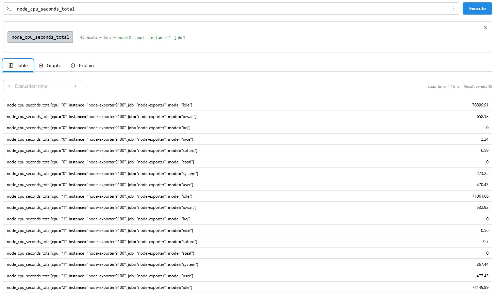
</p>

<p align="center">
  <em>Prometheus successfully returning live infrastructure metrics from Node Exporter.</em>
</p>

---

### Configuring Grafana Data Sources

After validating Prometheus metrics collection, Grafana was configured to use Prometheus as a monitoring data source.

Within Grafana:
- Connections was opened from the sidebar
- Add new data source was selected
- Prometheus was chosen as the data source type

The Prometheus server URL was configured as:

```text
http://prometheus:9090
```

The internal Docker service name was used instead of an IP address because Grafana and Prometheus communicated through the shared Docker bridge network.

<p align="center">
  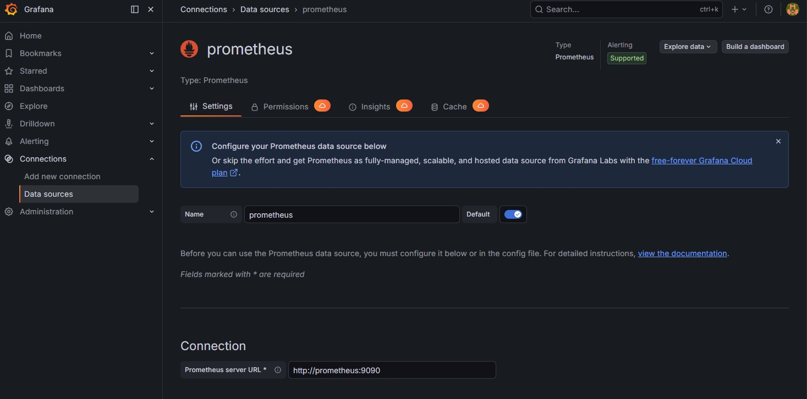
</p>

<p align="center">
  <em>Grafana configured to use Prometheus as a monitoring data source.</em>
</p>

After saving the configuration, Grafana successfully connected to Prometheus.

---

### Importing a Node Exporter Dashboard

A prebuilt Node Exporter dashboard was imported into Grafana to visualize infrastructure metrics.

The dashboard import process included:
- navigating to Dashboards
- selecting Import Dashboard
- importing a community Node Exporter dashboard
- selecting the configured Prometheus data source

A Node Exporter dashboard was chosen because it provides:
- CPU utilization monitoring
- memory usage visualization
- filesystem monitoring
- network statistics
- system load analytics
- real-time operational visibility

<p align="center">
  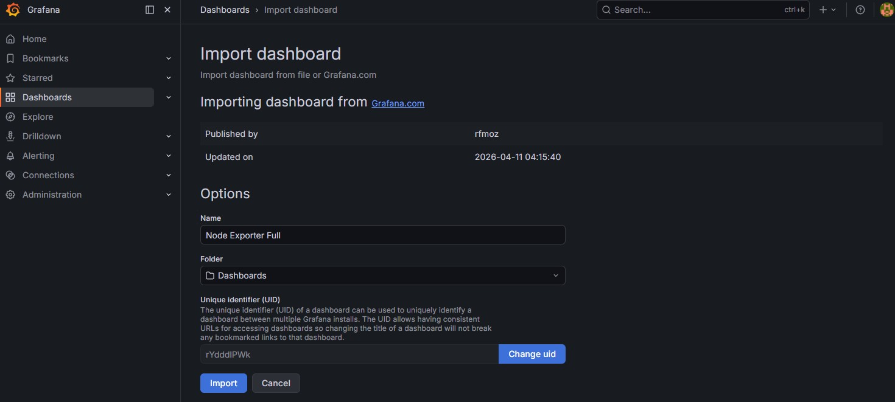
</p>

<p align="center">
  <em>Importing a Node Exporter infrastructure monitoring dashboard into Grafana.</em>
</p>

---

### Visualizing Live Infrastructure Metrics

After dashboard import, Grafana began displaying live infrastructure metrics collected from the Ubuntu Server host.

The stack now provided visibility into:
- CPU utilization
- memory consumption
- disk usage
- network throughput
- filesystem capacity
- server load averages
- real-time host activity

The deployment successfully demonstrated a complete monitoring workflow:
- Node Exporter exposing metrics
- Prometheus scraping and storing time-series data
- Grafana querying and visualizing infrastructure telemetry

<p align="center">
  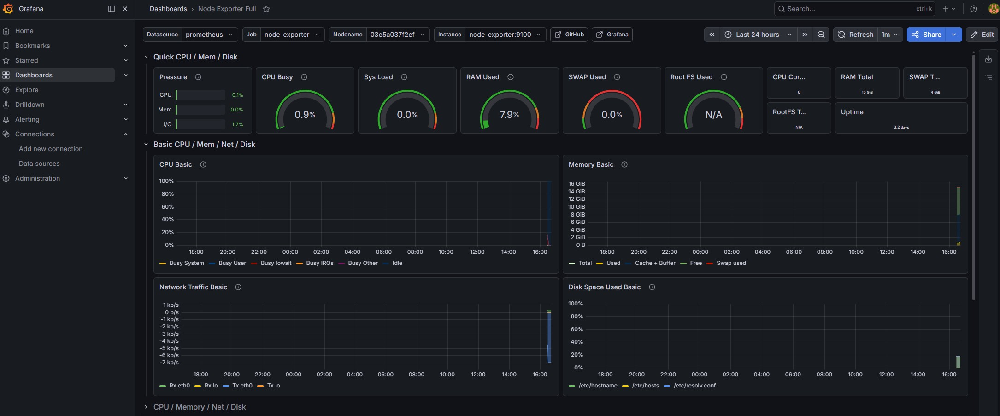
</p>

<p align="center">
  <em>Grafana dashboard displaying live infrastructure metrics collected through Prometheus and Node Exporter.</em>
</p>

---

## Expanding Node Exporter Host Metric Visibility

A review of the monitoring architecture showed the initial Node Exporter deployment did not have full visibility into the Ubuntu Server system.

Although Prometheus was successfully scraping metrics, Node Exporter was still operating primarily within the container namespace and did not yet have access to:
- filesystem metrics
- full disk telemetry
- kernel-level system metrics
- complete infrastructure observability data

To correct this, host filesystem and kernel paths were mounted into the Node Exporter container.

The Docker Compose configuration was updated with:

```yaml
command:
  - '--path.procfs=/host/proc'
  - '--path.rootfs=/rootfs'
  - '--path.sysfs=/host/sys'

volumes:
  - /proc:/host/proc:ro
  - /sys:/host/sys:ro
  - /:/rootfs:ro
```

<p align="center">
  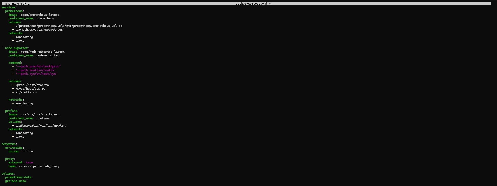
</p>

<p align="center">
  <em>Updating the Node Exporter container configuration to mount Ubuntu host filesystem and kernel metric paths for expanded infrastructure telemetry collection..</em>
</p>

After redeploying the monitoring stack, Prometheus successfully collected:

- filesystem metrics
- disk utilization data
- mount point telemetry
- expanded infrastructure metrics

Additional validation confirmed successful collection of filesystem metrics through Prometheus queries.

<p align="center">
  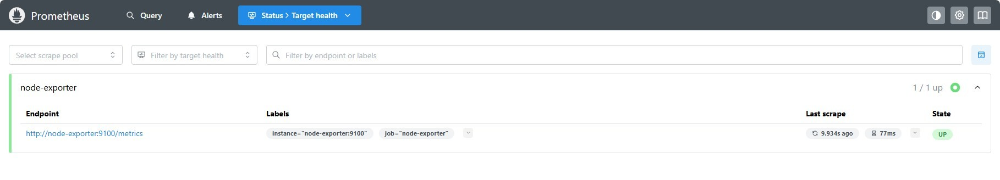
</p>

<p align="center">
  <em>Prometheus successfully collecting filesystem metrics after expanding Node Exporter visibility.</em>
</p>

Grafana dashboards now displayed significantly more complete infrastructure telemetry from the Ubuntu Server environment.

<p align="center">
  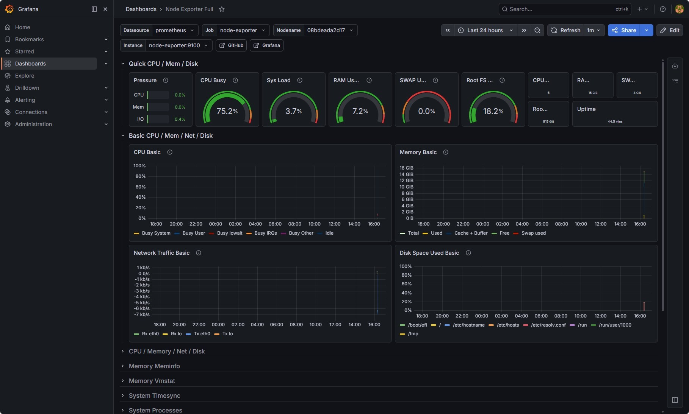
</p>

<p align="center">
  <em>Grafana displaying expanded infrastructure telemetry after updating the Node Exporter configuration.</em>
</p>

This refinement improved:

- infrastructure observability
- filesystem monitoring visibility
- telemetry accuracy
- operational monitoring completeness

---

# Outcome

This project successfully deployed a containerized infrastructure monitoring environment using:
- Prometheus
- Node Exporter
- Grafana
- Docker Compose

The completed stack provided:
- real-time infrastructure monitoring
- centralized metrics collection
- persistent storage for monitoring data
- dashboard-based infrastructure visualization
- internal container networking and service discovery

The deployment demonstrated:
- Prometheus scraping metrics from Node Exporter
- Grafana visualizing live server telemetry
- container orchestration with Docker Compose
- Docker bridge networking and DNS-based service communication
- persistent storage through Docker volumes

The monitoring environment provided visibility into:
- CPU utilization
- memory consumption
- filesystem usage
- network throughput
- system load averages
- real-time host activity

This project also reinforced foundational infrastructure concepts including:
- observability and monitoring workflows
- metrics pipelines
- service-to-service communication
- containerized infrastructure deployment
- persistent storage management
- operational visibility into Linux system performance

---

# Lessons Learned

This project produced hands-on experience deploying and validating a containerized infrastructure monitoring stack.

Key concepts explored during this deployment included:
- Prometheus metrics collection and time-series monitoring
- Node Exporter host-level Linux metrics exposure
- Grafana dashboard-based infrastructure visualization
- Docker Compose multi-container orchestration
- Docker bridge networking and internal service discovery
- container-to-container communication using Docker DNS
- persistent storage for stateful infrastructure services
- layered observability architecture design

It also produced practical operational experience involving:
- validating Docker Compose configurations
- redeploying containerized services safely
- configuring Prometheus scrape targets
- testing infrastructure metrics through Prometheus queries
- configuring Grafana data sources
- importing and validating monitoring dashboards
- verifying persistent Docker volumes
- troubleshooting containerized infrastructure services

One important takeaway from this project was understanding the difference between:
- simply running containers
- and deploying functional operational infrastructure

This deployment demonstrated how observability platforms provide visibility into:
- system health
- resource utilization
- infrastructure performance
- operational telemetry

These capabilities are foundational to modern infrastructure administration, monitoring, and troubleshooting workflows.

---

## Architectural Evolution

This monitoring stack was later integrated into the centralized reverse proxy architecture documented in the [Reverse Proxy Lab](07-reverse-proxy-lab.md).

After implementing NGINX Proxy Manager:
- Grafana and Prometheus were migrated to internal-only services
- direct LAN exposure was removed
- hostname-based reverse proxy routing was implemented
- services communicated through a shared ingress network using Docker DNS service discovery

The updated architecture centralized access through:
- `grafana.local`
- `prometheus.local`

rather than direct port exposure.

This architectural transition improved:
- service isolation
- ingress management
- internal network segmentation
- overall infrastructure organization

---

## Adding Container Restart Policies

The stack was deployed without a `restart:` key on any of its three services. Docker's default restart policy is `no`, which means a container that stops for any reason, including a clean host shutdown, stays stopped until it is started again by hand. Every validation performed above was carried out while the containers were already running, so nothing in this lab exercised that condition and the gap went unnoticed.

It surfaced later and from outside this track. The scheduled environment health report built in [Lab 05 of the Infrastructure Automation and Scripting track](../automation-and-scripting/05-scheduled-health-reporting.md) classified Docker as `Unhealthy` and reported `prometheus`, `grafana`, and `node-exporter` as exited. Root-causing that report established that the three containers had been stopped once on 2026-06-18 and that every host reboot since had left them down, because `docker inspect` reported `RestartPolicy=no` on all three. That lab restarted the containers against the unmodified compose file and deferred the configuration change itself, since the compose file is this lab's artifact. The change is documented here.

### Selecting a Restart Policy

Each service was given a restart policy:

```yaml
restart: unless-stopped
```

`unless-stopped` restarts a container automatically whenever the Docker daemon starts, which includes every host boot, unless the container had been explicitly stopped beforehand. The alternative, `always`, restarts under the same conditions but also overrides a deliberate stop, bringing back a container an administrator intentionally took down.

`unless-stopped` was selected for consistency with the two containers in this environment that already carried a policy, NGINX Proxy Manager in the [Reverse Proxy Lab](07-reverse-proxy-lab.md) and Portainer in the [Docker Setup](04-docker-setup.md) lab, and because it preserves administrative intent in a lab environment that is sometimes taken down on purpose. The accepted tradeoff is that a stack stopped deliberately stays stopped across a reboot, which is the same end state that left this stack down, but only when the stop was intentional.

The updated compose configuration:

```yaml
services:
  prometheus:
    image: prom/prometheus:latest
    container_name: prometheus
    volumes:
      - ./prometheus/prometheus.yml:/etc/prometheus/prometheus.yml:ro
      - prometheus-data:/prometheus
    restart: unless-stopped
    networks:
      - monitoring
      - proxy

  node-exporter:
    image: prom/node-exporter:latest
    container_name: node-exporter

    command:
      - '--path.procfs=/host/proc'
      - '--path.rootfs=/rootfs'
      - '--path.sysfs=/host/sys'

    volumes:
      - /proc:/host/proc:ro
      - /sys:/host/sys:ro
      - /:/rootfs:ro

    restart: unless-stopped

    networks:
      - monitoring

  grafana:
    image: grafana/grafana:latest
    container_name: grafana
    volumes:
      - grafana-data:/var/lib/grafana
    restart: unless-stopped
    networks:
      - monitoring
      - proxy

networks:
  monitoring:
    driver: bridge

  proxy:
    external: true
    name: reverse-proxy-lab_proxy

volumes:
  prometheus-data:
  grafana-data:
```

---

### Applying the Change

A restart policy belongs to a container's configuration rather than its runtime state, so it cannot be applied to an existing container by restarting it. The stack was recreated instead:

```bash
docker compose up -d
```

All three containers were recreated and started. The named `prometheus-data` and `grafana-data` volumes added earlier in this lab meant metrics history and Grafana dashboards survived the recreation.

The applied policy was then confirmed against the running containers rather than inferred from the compose file:

```bash
docker inspect -f '{{.Name}} {{.HostConfig.RestartPolicy.Name}}' prometheus node-exporter grafana
```

Result:

```text
/prometheus unless-stopped
/node-exporter unless-stopped
/grafana unless-stopped
```

<p align="center">
  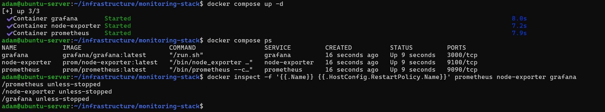
</p>

<p align="center">
  <em>The monitoring stack recreated with the new configuration, all three containers running, and docker inspect confirming the unless-stopped policy on each.</em>
</p>

---

### Validating Recovery Across a Reboot

Confirming that a policy is set is not the same as confirming that it works, and the condition that had actually failed was a host reboot. The server was rebooted and each container's start time was compared against the host's boot time, with no `docker` command run in between.

Boot time was derived from `/proc/uptime` so that it could be expressed in UTC, matching the format Docker reports container start times in:

```bash
date -u -d "@$(( $(date +%s) - $(cut -d. -f1 /proc/uptime) ))" +'boot (UTC): %FT%TZ'
docker inspect -f '{{.Name}} started {{.State.StartedAt}}' prometheus node-exporter grafana
```

Result:

```text
boot (UTC): 2026-08-22T19:51:02Z
/prometheus started 2026-08-22T19:51:46.118133198Z
/node-exporter started 2026-08-22T19:51:44.731578426Z
/grafana started 2026-08-22T19:51:46.261153998Z
```

All three containers were running within forty-five seconds of boot with no manual intervention, and `docker compose ps` reported all three `Up`. The same behavior was observed across an earlier reboot the same afternoon, where a boot at `19:42:24Z` was followed by container starts between `19:43:23Z` and `19:43:25Z`.

<p align="center">
  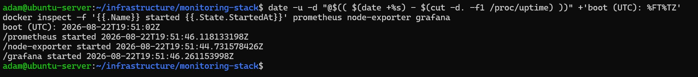
</p>

<p align="center">
  <em>Container start times sitting seconds after the host boot time, confirming the restart policy brought the monitoring stack back automatically.</em>
</p>

---

### Confirming the Ingress Path Survived Recreation

Recreating containers rebuilds their network attachments, so the reverse proxy integration described in the [Reverse Proxy Lab](07-reverse-proxy-lab.md) was rechecked afterward. The proxied hostnames resolve through the Windows workstation's hosts file rather than on Ubuntu Server itself, so the check was performed from the server by supplying the hostname explicitly in the request:

```bash
curl -s -o /dev/null -w '%{http_code}\n' -H 'Host: prometheus.local' http://127.0.0.1
curl -s -o /dev/null -w '%{http_code}\n' -H 'Host: grafana.local' http://127.0.0.1
```

Both returned `302`, the redirect each service issues from its root path, confirming the requests reached the containers through NGINX Proxy Manager rather than failing at the ingress layer.

The metrics pipeline was confirmed through the same path:

```bash
curl -s -H 'Host: prometheus.local' 'http://127.0.0.1/api/v1/targets?state=active'
```

Prometheus reported `node-exporter:9100` as an active target with `"health":"up"`, confirming scraping had resumed across the recreation.

---

### Outcome of the Change

The monitoring stack now returns on its own after a host reboot rather than waiting for a manual start. The condition that had kept it down for two months, a stop with nothing configured to bring the containers back, no longer applies, and the compose file is consistent with the restart behavior already used by the reverse proxy and Portainer deployments.

The scheduled health report that surfaced the outage remains in place, so a future failure of these containers for any other reason is still detected rather than discovered by chance.
