# 07 - Reverse Proxy Lab

## Overview

This project focused on implementing a centralized reverse proxy architecture using NGINX Proxy Manager, Docker Compose, shared Docker bridge networking, internal service routing, and hostname-based access control.

The goal of the lab was not just to make services reachable through a proxy. It was to redesign how the lab environment exposed infrastructure services so that access was centralized, direct exposure was reduced, and internal services were segmented more cleanly.

The reverse proxy environment was integrated with previously deployed infrastructure services including:
- Grafana
- Prometheus
- Portainer

The project demonstrated:
- centralized ingress management
- Docker DNS-based service discovery
- multi-stack Docker networking
- internal-only backend service architecture
- reverse proxy routing
- service isolation and segmentation
- hostname-based infrastructure access
- infrastructure hardening through reduced attack surface

---

## Objectives

The primary goals of this lab were to:
- deploy a centralized reverse proxy platform using Docker Compose
- create a shared ingress network for internal infrastructure services
- route multiple backend services through a single ingress layer
- implement hostname-based infrastructure access
- isolate backend services from direct LAN exposure
- understand Docker DNS-based service discovery
- demonstrate cross-stack Docker networking
- reduce unnecessary service exposure
- create a more production-like infrastructure architecture

---

## Why NGINX Proxy Manager Was Selected

NGINX Proxy Manager was selected because it provides a simplified management layer on top of NGINX while still supporting a realistic reverse proxy workflow.

It was a good fit for this lab because it:
- centralizes proxy configuration
- provides a graphical management interface
- supports hostname-based routing
- works naturally with Docker-based environments
- reduces the need to manage raw NGINX configuration manually
- supports future SSL certificate management
- makes reverse proxy behavior easier to validate and document

This made it a practical choice for a homelab environment where the goal was to learn ingress architecture and service segmentation without adding unnecessary configuration complexity.

---

## Reverse Proxy Architecture

Before this deployment, infrastructure services were accessed individually through direct ports and isolated URLs. That worked, but it was not a very clean architecture. Each service was effectively its own entry point, which made the environment feel fragmented and exposed more of the stack than necessary.

This lab introduced a centralized ingress model.

The final architecture centralized access through NGINX Proxy Manager:

```text
Client Browser
       ↓
NGINX Proxy Manager
       ↓
reverse-proxy-lab_proxy
       ↓
--------------------------------
|        |           |         |
Grafana  Prometheus  Portainer
```

The deployment flow operated as follows:

```text
Browser Request
      ↓
grafana.local
      ↓
Hosts File Resolution
      ↓
NGINX Proxy Manager
      ↓
Docker Proxy Network
      ↓
Grafana Container
```

This architecture eliminated the need for direct service exposure while centralizing ingress management through a single reverse proxy layer.

---

## Core Technologies

### NGINX Proxy Manager

NGINX Proxy Manager is a reverse proxy management platform built on top of NGINX.

In this project, NGINX Proxy Manager:
- centralized ingress routing
- managed reverse proxy configurations
- routed traffic to internal services
- provided hostname-based access management
- enabled internal service segmentation
- simplified infrastructure routing workflows

The platform acted as the primary ingress layer for all proxied infrastructure services.

### Docker Bridge Networking

Docker bridge networking provided isolated internal communication between containers.

The deployment used:
- a dedicated proxy bridge network
- Docker DNS service discovery
- cross-stack container communication

Services attached to the shared proxy network communicated internally using container service names instead of static IP addresses.

### Docker DNS Service Discovery

Docker's embedded DNS resolver automatically resolved container names within shared Docker networks.

Examples:
- `grafana`
- `prometheus`
- `portainer`

This allowed NGINX Proxy Manager to route traffic internally without relying on static IP configuration.

### Docker Compose

Docker Compose was used to define, deploy, and manage the reverse proxy stack and the services attached to it.

In this project, Docker Compose:
- deployed the NGINX Proxy Manager container
- created the proxy bridge network
- managed persistent storage
- simplified service orchestration
- enabled repeatable infrastructure deployment

---

## Technologies Used

- Docker Engine
- Docker Compose
- NGINX Proxy Manager
- Grafana
- Prometheus
- Portainer
- Ubuntu Server 26.04 LTS
- Windows 11

---

# Project Deployment

## Creating the Reverse Proxy Project Directory

A dedicated infrastructure project directory was created for the reverse proxy deployment.

Commands used:

```bash
mkdir -p ~/infrastructure/reverse-proxy-lab
cd ~/infrastructure/reverse-proxy-lab
```

<p align="center">
  
</p>

<p align="center">
  <em>Creating the infrastructure project directory for the reverse proxy deployment.</em>
</p>

---

## Creating the Docker Compose Configuration

A Docker Compose configuration was created to deploy NGINX Proxy Manager.

The deployment exposed:
- port 80 for HTTP traffic
- port 443 for HTTPS traffic
- port 81 for the NGINX Proxy Manager administration interface

Initial compose configuration:

```yaml
services:
  nginx-proxy-manager:
    image: jc21/nginx-proxy-manager:latest
    container_name: nginx-proxy-manager

    ports:
      - "80:80"
      - "81:81"
      - "443:443"

    volumes:
      - npm-data:/data
      - npm-letsencrypt:/etc/letsencrypt

    restart: unless-stopped

    networks:
      - proxy

networks:
  proxy:
    driver: bridge

volumes:
  npm-data:
  npm-letsencrypt:
```

<p align="center">
  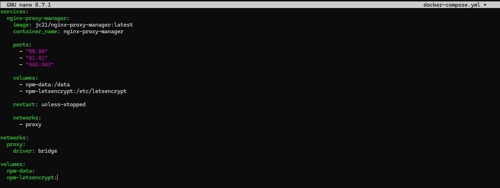
</p>

<p align="center">
  <em>Docker Compose configuration defining the NGINX Proxy Manager deployment and shared proxy network.</em>
</p>

---

## Deploying NGINX Proxy Manager

The reverse proxy stack was deployed using Docker Compose.

Command used:

```bash
docker compose up -d
```

<p align="center">
  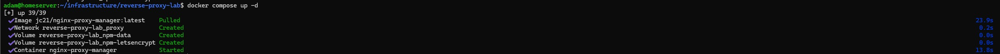
</p>

<p align="center">
  <em>Deploying the NGINX Proxy Manager container.</em>
</p>

---

## Inspecting Running Containers

The running containers were inspected to validate successful deployment.

Command used:

```bash
docker ps
```

<p align="center">
  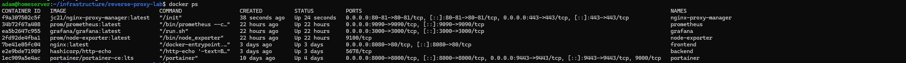
</p>

<p align="center">
  <em>Validating the running NGINX Proxy Manager container and exposed ingress ports.</em>
</p>

The deployment successfully exposed the management and ingress services needed for the reverse proxy layer.

---

## Accessing the NGINX Proxy Manager Interface

The NGINX Proxy Manager administration interface was accessed from the Windows 11 management workstation.

URL used:

```text
http://192.168.1.226:81
```

The login interface loaded successfully.

<p align="center">
  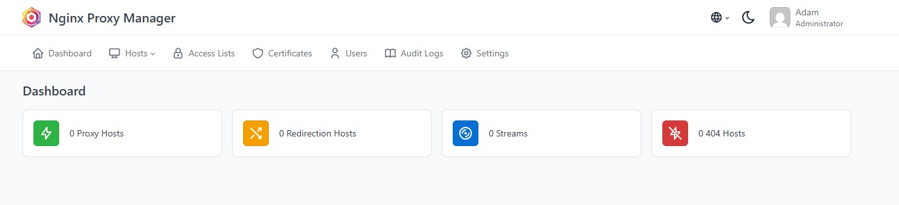
</p>

<p align="center">
  <em>Successful access to the NGINX Proxy Manager administration interface.</em>
</p>

---

# Integrating Existing Infrastructure Services

## Expanding the Monitoring Stack Networking

The previously deployed monitoring stack was updated to integrate with the shared reverse proxy network.

The Grafana and Prometheus services were attached to:
- the existing monitoring network
- the shared reverse proxy network

Updated networking configuration:

```yaml
services:
  prometheus:
    image: prom/prometheus:latest
    container_name: prometheus

    volumes:
      - ./prometheus/prometheus.yml:/etc/prometheus/prometheus.yml:ro
      - prometheus-data:/prometheus

    networks:
      - monitoring
      - proxy

  grafana:
    image: grafana/grafana:latest
    container_name: grafana

    volumes:
      - grafana-data:/var/lib/grafana

    networks:
      - monitoring
      - proxy

networks:
  monitoring:
    driver: bridge

  proxy:
    external: true
    name: reverse-proxy-lab_proxy

volumes:
  prometheus-data:
  grafana-data:
```

<p align="center">
  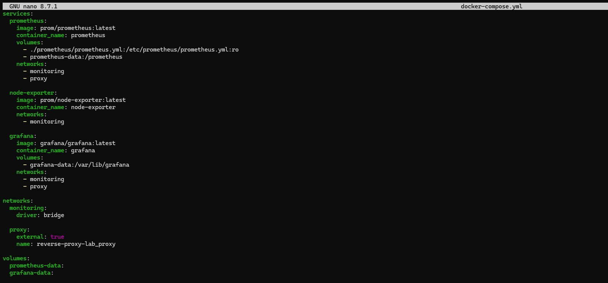
</p>

<p align="center">
  <em>Updating monitoring services to participate in the shared reverse proxy network.</em>
</p>

---

## Validating the Updated Monitoring Stack Configuration

The updated monitoring stack configuration was validated before redeployment.

Command used:

```bash
docker compose config
```

<p align="center">
  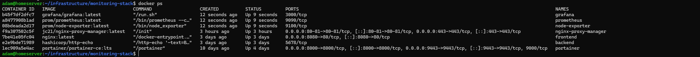
</p>

<p align="center">
  <em>Validating the updated monitoring stack configuration.</em>
</p>

---

## Redeploying the Monitoring Stack

The monitoring stack was redeployed to apply the networking changes.

Commands used:

```bash
docker compose down
docker compose up -d
```

<p align="center">
  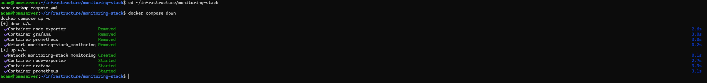
</p>

<p align="center">
  <em>Redeploying the monitoring stack after integrating the shared proxy network.</em>
</p>

---

## Validating Internal-Only Monitoring Services

After redeployment, container exposure was inspected.

Command used:

```bash
docker ps
```

The deployment confirmed that the monitoring services were now communicating internally through Docker networking rather than being treated as individually exposed services.

<p align="center">
  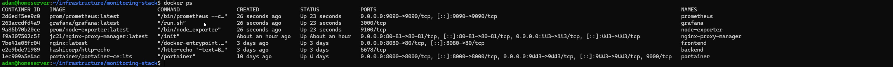
</p>

<p align="center">
  <em>Validating internal-only monitoring services after removing direct LAN exposure.</em>
</p>

---

## Integrating Portainer Into the Reverse Proxy Architecture

Portainer was integrated into the shared reverse proxy network to centralize access alongside:
- Grafana
- Prometheus
- NGINX Proxy Manager

The existing Portainer container was attached to the shared proxy network.

Command used:

```bash
docker network connect reverse-proxy-lab_proxy portainer
```

A reverse proxy host was then created for Portainer using:

```text
portainer.local → portainer:9443
```

After validating successful reverse proxy access, the original Portainer deployment was recreated without direct LAN port exposure.

Commands used:

```bash
docker stop portainer
docker rm portainer
```

```bash
docker run -d \
  --name portainer \
  --restart=unless-stopped \
  --network reverse-proxy-lab_proxy \
  -v /var/run/docker.sock:/var/run/docker.sock \
  -v portainer_data:/data \
  portainer/portainer-ce:lts
```

<p align="center">
  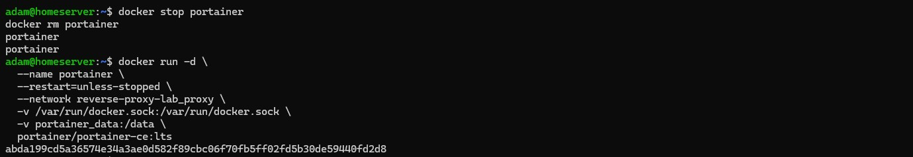
</p>

<p align="center">
  <em>Redeploying Portainer as an internal-only service behind the reverse proxy layer.</em>
</p>

After redeployment:
- Portainer no longer exposed ports directly to the LAN
- access was centralized through NGINX Proxy Manager
- backend infrastructure services operated as internal-only services

---

# Configuring Reverse Proxy Hosts

## Creating Reverse Proxy Hosts

Proxy hosts were created inside NGINX Proxy Manager for:
- Grafana
- Prometheus
- Portainer

Configured hostnames included:
- `grafana.local`
- `prometheus.local`
- `portainer.local`
- `npm.local`

Each service was routed internally using Docker DNS service discovery.

Example routing configuration:

```text
grafana.local → grafana:3000
prometheus.local → prometheus:9090
portainer.local → portainer:9443
npm.local → nginx-proxy-manager:81
```

<p align="center">
  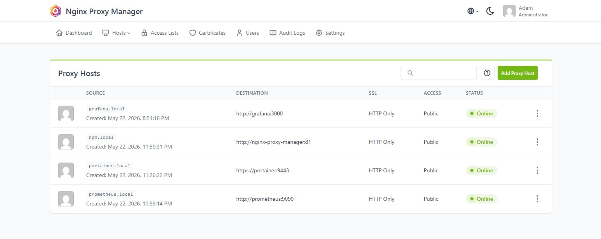
</p>

<p align="center">
  <em>Configured reverse proxy hosts providing centralized ingress routing for infrastructure services.</em>
</p>

---

## Configuring Local Hostname Resolution

The Windows hosts file was updated to provide local hostname resolution for the proxied services.

File modified:

```text
C:\Windows\System32\drivers\etc\hosts
```

Entries added:

```text
192.168.1.226 grafana.local
192.168.1.226 prometheus.local
192.168.1.226 portainer.local
192.168.1.226 npm.local
```

This allowed the Windows management workstation to resolve the custom infrastructure hostnames locally.

<p align="center">
  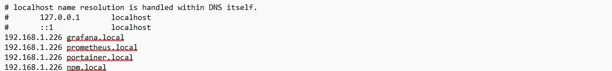
</p>

<p align="center">
  <em>Local hostname resolution configured through the Windows hosts file.</em>
</p>

---

# Validating Reverse Proxy Routing

## Validating Successful Proxy Routing

Infrastructure services were successfully accessed through the reverse proxy layer.

Validated URLs:
- `http://grafana.local`
- `http://prometheus.local`
- `http://portainer.local`
- `http://npm.local`

The deployment confirmed:
- successful reverse proxy routing
- Docker DNS service discovery
- internal service communication
- centralized ingress functionality

<p align="center">
  
</p>

<p align="center">
  <em>Infrastructure services successfully accessed through centralized reverse proxy routing.</em>
</p>

---

## Validating Service Isolation

Direct LAN access to backend services was tested after removing published service ports.

The following direct access attempts failed as expected:

```text
http://192.168.1.226:3000
http://192.168.1.226:9090
https://192.168.1.226:9443
http://192.168.1.226:81
```

This validated:
- removal of direct backend exposure
- centralized ingress enforcement
- internal-only backend architecture
- reduced attack surface

<p align="center">
  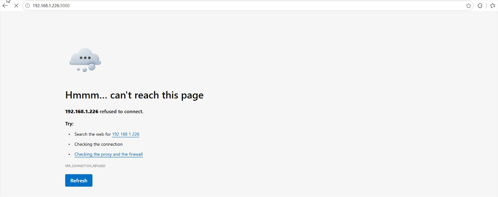
</p>

<p align="center">
  <em>Direct LAN access to backend services blocked after implementing centralized ingress routing.</em>
</p>

---

# Shared Proxy Network Validation

## Inspecting the Shared Proxy Network

The shared reverse proxy network was inspected to validate cross-stack networking.

Command used:

```bash
docker network inspect reverse-proxy-lab_proxy
```

The network inspection confirmed:
- nginx-proxy-manager
- grafana
- prometheus
- portainer

were all attached to the same shared ingress network.

<p align="center">
  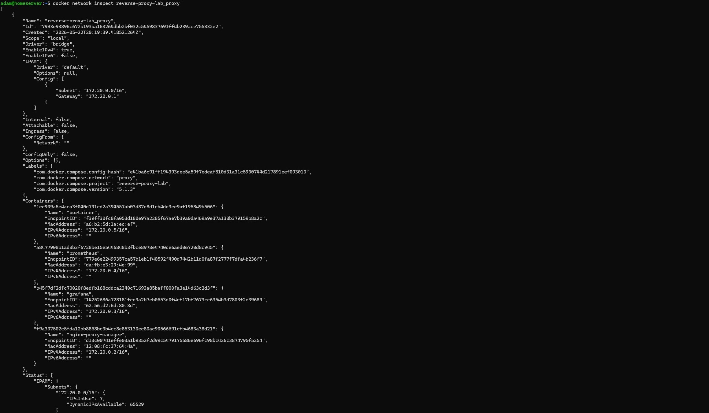
</p>

<p align="center">
  <em>Validation of the shared reverse proxy network connecting infrastructure services.</em>
</p>

This demonstrated:
- Docker network federation between compose projects
- internal container communication
- shared ingress architecture
- centralized service routing

---

# Final Architecture

The completed deployment centralized infrastructure access through NGINX Proxy Manager while isolating backend services from direct network exposure.

The environment now uses:
- NGINX Proxy Manager as the ingress layer
- shared Docker networking for internal service communication
- Docker DNS for container name resolution
- hostname-based access for infrastructure services

Final infrastructure flow:

```text
Client Browser
       ↓
NGINX Proxy Manager
       ↓
Internal Docker Proxy Network
       ↓
--------------------------------
|        |           |         |
Grafana  Prometheus  Portainer
```

The deployment transitioned the environment from directly exposed individual services to a centralized ingress architecture with internal-only backend services.

---

# Future Improvements

Potential future enhancements for this environment include:
- implementing HTTPS-only access using Let's Encrypt certificates
- enabling automatic HTTP-to-HTTPS redirection
- integrating centralized DNS management
- deploying wildcard certificates for internal services
- implementing access control policies
- introducing container health checks and monitoring integrations
- expanding reverse proxy routing for additional infrastructure services
- implementing infrastructure backup and recovery workflows

These improvements would further align the environment with production-oriented infrastructure administration practices.

---

# Outcome

This project successfully implemented a centralized reverse proxy architecture using:
- NGINX Proxy Manager
- Docker Compose
- Docker bridge networking
- Docker DNS-based service discovery

The deployment integrated:
- Grafana
- Prometheus
- Portainer

behind a centralized ingress layer while eliminating unnecessary direct LAN exposure.

The completed environment demonstrated:
- reverse proxy routing
- centralized ingress management
- hostname-based infrastructure access
- multi-stack Docker networking
- internal-only backend service architecture
- Docker DNS service discovery
- service isolation and segmentation
- infrastructure hardening through reduced attack surface

The project also reinforced:
- infrastructure topology design
- layered ingress architecture
- container networking concepts
- operational infrastructure management
- service-to-service communication workflows
- reverse proxy deployment strategies

---

# Lessons Learned

Throughout this project, I gained hands-on experience implementing and validating a centralized ingress architecture for containerized infrastructure services.

Key concepts explored during this deployment included:
- reverse proxy architecture
- Docker bridge networking
- Docker DNS service discovery
- hostname-based routing
- multi-stack Docker networking
- internal-only backend services
- ingress centralization
- infrastructure segmentation
- service isolation
- Docker Compose orchestration

I also gained practical operational experience involving:
- configuring reverse proxy hosts
- integrating existing services into shared Docker networks
- validating cross-stack container communication
- removing unnecessary direct service exposure
- troubleshooting reverse proxy routing
- validating internal-only infrastructure services
- implementing hostname-based infrastructure access
- reducing attack surface through centralized ingress

One important takeaway from this project was understanding the difference between:
- simply exposing services individually
- and designing a layered ingress architecture

This deployment demonstrated how centralized reverse proxy platforms improve:
- infrastructure organization
- ingress management
- service isolation
- operational scalability
- security posture
- maintainability of containerized environments

The completed architecture more closely resembled a realistic production-style infrastructure deployment rather than isolated container demonstrations.