# Monitoring Stack Lab

## Overview

This project focused on deploying a containerized monitoring environment using Docker Compose, Prometheus, Node Exporter, and Grafana.

The deployment was designed to collect, store, and visualize real-time infrastructure metrics from an Ubuntu Server host while introducing foundational observability and monitoring concepts.

The stack included:
- Prometheus for metrics collection and time-series storage
- Node Exporter for exposing Linux host metrics
- Grafana for dashboard visualization
- Docker Compose for multi-container orchestration

The lab demonstrated:
- metrics scraping workflows
- exporter-based monitoring architecture
- Docker bridge networking and service discovery
- persistent storage for stateful services
- real-time infrastructure visualization
- containerized observability pipelines

---

## Objectives

The primary goals of this lab were to:
- deploy a containerized monitoring stack using Docker Compose
- collect host-level system metrics using Node Exporter
- configure Prometheus for metrics scraping
- visualize infrastructure metrics using Grafana dashboards
- understand exporter-based monitoring architectures
- demonstrate internal container networking between monitoring services
- gain familiarity with infrastructure observability concepts
- monitor real-time server resource utilization

---

## Monitoring Stack Architecture

The monitoring stack followed a layered metrics collection and visualization architecture:

```text
Ubuntu Server Metrics
        ↓
Node Exporter
        ↓
Prometheus Scraping
        ↓
Time-Series Database
        ↓
Grafana Queries
        ↓
Dashboards & Visualization
```

In this deployment:
- Node Exporter exposed system metrics from the Ubuntu Server host
- Prometheus scraped and stored metrics data
- Grafana queried Prometheus and visualized infrastructure data through dashboards
- Docker Compose managed service orchestration and networking

---

## Core Technologies

### Prometheus

Prometheus is an open-source monitoring and alerting platform designed for collecting and storing time-series metrics data.

Prometheus operates using a pull-based monitoring model where it periodically scrapes HTTP endpoints exposed by monitoring exporters.

In this project, Prometheus:
- collected metrics from Node Exporter
- stored metrics as time-series data
- served as the primary monitoring database
- provided query capabilities for Grafana dashboards

Prometheus was configured to scrape metrics every 15 seconds.

---

### Node Exporter

Node Exporter is a Prometheus exporter designed to expose Linux host system metrics in a Prometheus-compatible format.

In this project, Node Exporter provided visibility into:
- CPU utilization
- memory usage
- filesystem statistics
- network activity
- system load
- disk usage

Node Exporter acted as the metrics source for the monitoring stack.

---

### Grafana

Grafana is a visualization and analytics platform used to create dashboards from monitoring and observability data.

In this project, Grafana:
- connected to Prometheus as a data source
- visualized collected infrastructure metrics
- provided operational dashboards for monitoring the Ubuntu Server host
- served as the frontend visualization layer of the monitoring stack

---

## Technologies Used

- Docker Engine
- Docker Compose
- Prometheus
- Node Exporter
- Grafana
- Ubuntu Server 26.04 LTS

---

## Project Deployment

### Project Directory Creation

A dedicated infrastructure directory structure was created to organize the monitoring stack deployment and supporting configuration files.

Commands used:

```bash
mkdir -p ~/infrastructure/monitoring-stack
cd ~/infrastructure/monitoring-stack
```

<p align="center">
  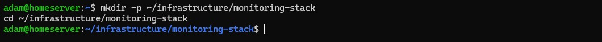
</p>

<p align="center">
  <em>Creating the infrastructure project directory for the monitoring stack deployment.</em>
</p>

---

### Creating the Docker Compose Configuration

A Docker Compose stack was created containing:
- Prometheus
- Node Exporter
- Grafana

The services were connected using a shared Docker bridge network named `monitoring`.

Initial compose configuration:

```yaml
services:
  prometheus:
    image: prom/prometheus:latest
    container_name: prometheus
    ports:
      - "9090:9090"
    volumes:
      - ./prometheus/prometheus.yml:/etc/prometheus/prometheus.yml:ro
    networks:
      - monitoring

  node-exporter:
    image: prom/node-exporter:latest
    container_name: node-exporter
    ports:
      - "9100:9100"
    networks:
      - monitoring

  grafana:
    image: grafana/grafana:latest
    container_name: grafana
    ports:
      - "3000:3000"
    networks:
      - monitoring

networks:
  monitoring:
    driver: bridge
```

<p align="center">
  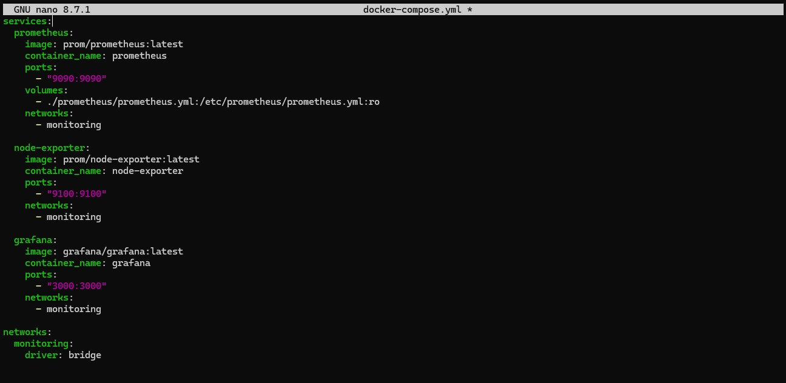
</p>

<p align="center">
  <em>Docker Compose configuration defining Prometheus, Node Exporter, and Grafana services on a shared monitoring bridge network.</em>
</p>

---

### Creating the Prometheus Configuration

A dedicated directory and configuration file were created for Prometheus.

Commands used:

```bash
mkdir -p prometheus
nano prometheus/prometheus.yml
```

<p align="center">
  
</p>

<p align="center">
  <em>Creating the Prometheus configuration directory and configuration file.</em>
</p>

Initial configuration:

```yaml
global:
  scrape_interval: 15s

scrape_configs:
  - job_name: "node-exporter"
    static_configs:
      - targets: ["node-exporter:9100"]
```

<p align="center">
  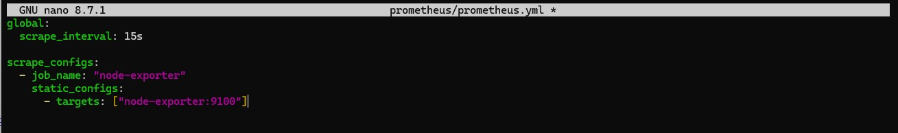
</p>

<p align="center">
  <em>Prometheus scrape configuration targeting the Node Exporter service over the internal Docker network.</em>
</p>

---

### Internal Container Networking

Prometheus communicated with Node Exporter using Docker's internal bridge networking and embedded DNS-based service discovery.

Instead of relying on static IP addresses, Prometheus targeted the Node Exporter service directly using the container service name:

```yaml
targets: ["node-exporter:9100"]
```

This allowed services to communicate reliably within the isolated monitoring network created by Docker Compose.

The deployment demonstrated:
- internal Docker DNS resolution
- service-to-service communication
- bridge networking
- isolated infrastructure segmentation

---

### Deploying the Docker Compose Stack

The monitoring stack was deployed using Docker Compose.

Command used:

```bash
docker compose up -d
```

<p align="center">
  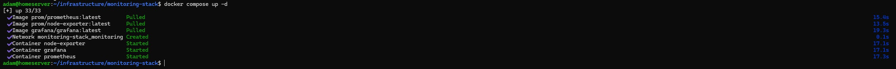
</p>

<p align="center">
  <em>Deployment of the monitoring stack including Prometheus, Node Exporter, and Grafana containers.</em>
</p>

---

### Inspecting Running Containers

Running containers were inspected to validate successful deployment and active service status.

Command used:

```bash
docker ps
```

<p align="center">
  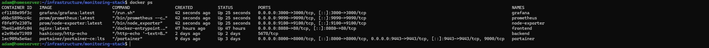
</p>

<p align="center">
  <em>Validation of active monitoring stack containers and published service ports.</em>
</p>

The deployment successfully exposed:
- Prometheus on port 9090
- Node Exporter on port 9100
- Grafana on port 3000

---

## Service Validation

### Prometheus Browser Test

Prometheus accessibility was validated from the Windows 11 management workstation using a web browser.

URL used:

```text
http://192.168.1.226:9090
```

The Prometheus interface loaded successfully, confirming:
- successful container deployment
- active port exposure
- operational web interface access
- functional Docker networking

<p align="center">
  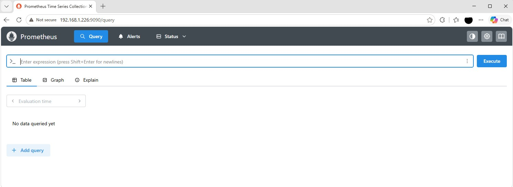
</p>

<p align="center">
  <em>Successful validation of the Prometheus web interface from the Windows 11 management workstation.</em>
</p>

---

### Grafana Browser Test

Grafana accessibility was validated from the Windows 11 management workstation using a web browser.

URL used:

```text
http://192.168.1.226:3000
```

The Grafana login interface loaded successfully.

<p align="center">
  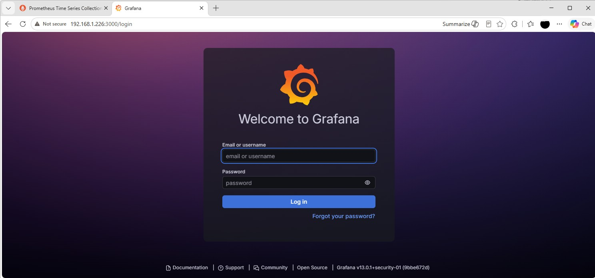
</p>

<p align="center">
  <em>Successful validation of the Grafana web interface from the Windows 11 management workstation.</em>
</p>

---

### Grafana Dashboard Access

Grafana was initially accessed using the default administrator credentials:

```text
Username: admin
Password: admin
```

After initial authentication:
- the default password was rotated
- administrative dashboard access was established
- Grafana was confirmed operational

<p align="center">
  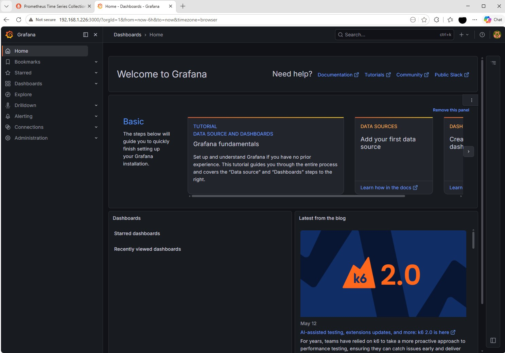
</p>

<p align="center">
  <em>Grafana dashboard interface after successful authentication and initial configuration.</em>
</p>

---

## Persistent Storage Validation

### Adding Persistent Storage

After validating the monitoring stack deployment, I realized the services were still operating as stateless containers.

This meant:
- Grafana dashboards and configuration would be lost if the container was recreated
- Prometheus metrics history would reset during redeployment
- the deployment behaved more like a temporary demo environment than a realistic monitoring stack

To address this, persistent Docker volumes were added to the Docker Compose configuration.

The compose file was updated to include persistent storage for:
- Prometheus metrics data
- Grafana dashboards and application data

The updated configuration looked like this:

```yaml
services:
  prometheus:
    image: prom/prometheus:latest
    container_name: prometheus
    ports:
      - "9090:9090"
    volumes:
      - ./prometheus/prometheus.yml:/etc/prometheus/prometheus.yml:ro
      - prometheus-data:/prometheus
    networks:
      - monitoring

  node-exporter:
    image: prom/node-exporter:latest
    container_name: node-exporter
    ports:
      - "9100:9100"
    networks:
      - monitoring

  grafana:
    image: grafana/grafana:latest
    container_name: grafana
    ports:
      - "3000:3000"
    volumes:
      - grafana-data:/var/lib/grafana
    networks:
      - monitoring

networks:
  monitoring:
    driver: bridge

volumes:
  prometheus-data:
  grafana-data:
```

<p align="center"> 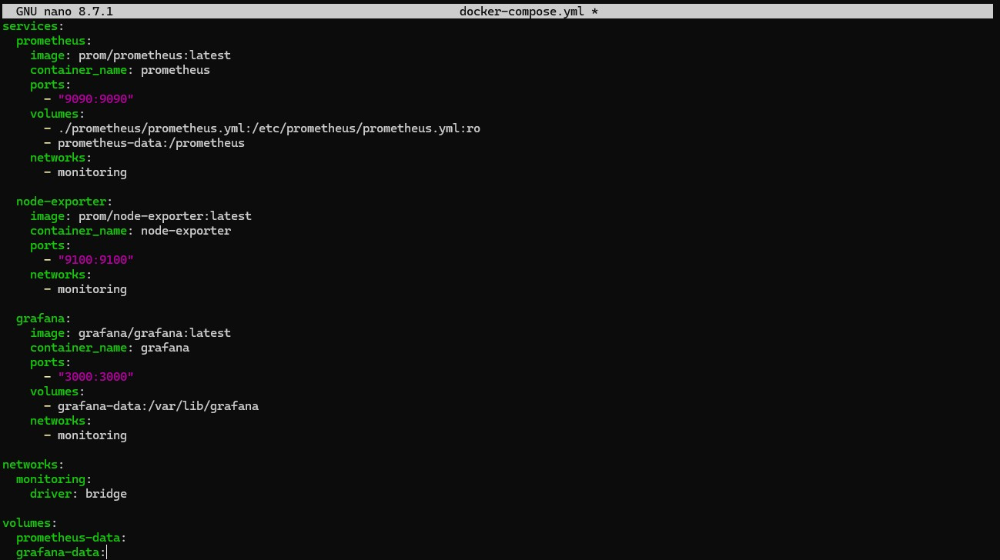 </p> <p align="center"> 
<em>Docker Compose configuration updated with persistent Docker volumes for Prometheus and Grafana.</em> </p>

Persistent storage is important because:
- Grafana dashboards are lost if containers are recreated
- Prometheus metrics history resets during redeployment
- monitoring platforms require long-term metric retention
- persistent volumes create more realistic operational deployments

---

### Redeploying the Monitoring Stack

After updating the Docker Compose configuration, the stack was redeployed to apply the persistent storage changes.

Commands used:

```bash
docker compose down
docker compose up -d
```

<p align="center">
  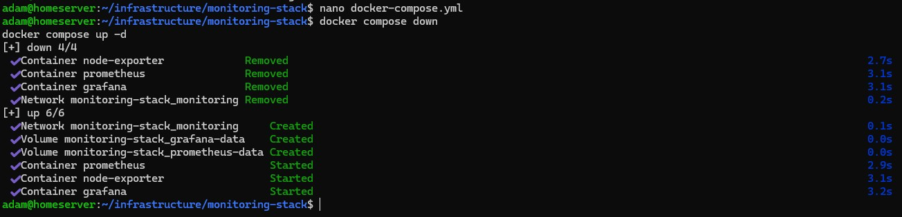
</p>

<p align="center">
  <em>Redeploying the monitoring stack after updating the Docker Compose configuration.</em>
</p>

The redeployment recreated the containers while preserving persistent application data through Docker volumes.

---

### Verifying Persistent Volumes

Docker volumes were inspected to confirm successful creation of persistent storage resources.

Command used:

```bash
docker volume ls
```

The deployment successfully created:
- a persistent volume for Prometheus metrics storage
- a persistent volume for Grafana application data

<p align="center">
  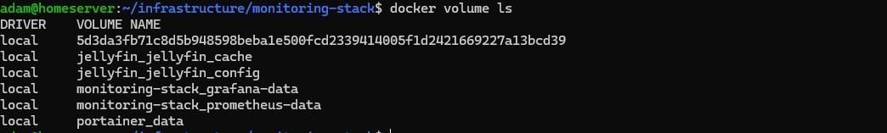
</p>

<p align="center">
  <em>Validation of persistent Docker volumes created for the monitoring stack.</em>
</p>

---

## Metrics Pipeline Validation

### Validating Prometheus Scrape Targets

Prometheus targets were inspected to confirm successful communication with Node Exporter.

The targets page was accessed from the Prometheus web interface:

```text
http://192.168.1.226:9090/targets
```

The Node Exporter target showed an `UP` status, confirming:
- successful Docker DNS resolution
- active service-to-service communication
- operational metrics scraping
- functional monitoring pipeline connectivity

<p align="center">
  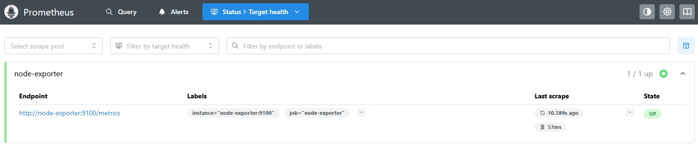
</p>

<p align="center">
  <em>Prometheus successfully scraping metrics from the Node Exporter service.</em>
</p>

---

### Testing Metrics Collection in Prometheus

Metrics collection was validated directly through the Prometheus query interface.

Example query used:

```text
node_cpu_seconds_total
```

This query returned live CPU metrics collected from the Ubuntu Server host through Node Exporter.

Additional metrics tested included:
- memory utilization
- filesystem statistics
- network activity
- system load metrics

<p align="center">
  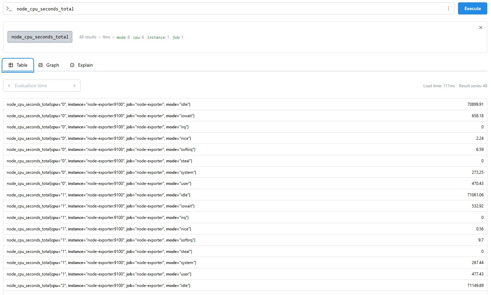
</p>

<p align="center">
  <em>Prometheus successfully returning live infrastructure metrics from Node Exporter.</em>
</p>

---

### Configuring Grafana Data Sources

After validating Prometheus metrics collection, Grafana was configured to use Prometheus as a monitoring data source.

Within Grafana:
- Connections was opened from the sidebar
- Add new data source was selected
- Prometheus was chosen as the data source type

The Prometheus server URL was configured as:

```text
http://prometheus:9090
```

The internal Docker service name was used instead of an IP address because Grafana and Prometheus communicated through the shared Docker bridge network.

<p align="center">
  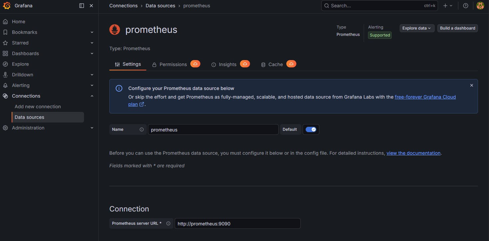
</p>

<p align="center">
  <em>Grafana configured to use Prometheus as a monitoring data source.</em>
</p>

After saving the configuration, Grafana successfully connected to Prometheus.

---

### Importing a Node Exporter Dashboard

A prebuilt Node Exporter dashboard was imported into Grafana to visualize infrastructure metrics.

The dashboard import process included:
- navigating to Dashboards
- selecting Import Dashboard
- importing a community Node Exporter dashboard
- selecting the configured Prometheus data source

A Node Exporter dashboard was chosen because it provides:
- CPU utilization monitoring
- memory usage visualization
- filesystem monitoring
- network statistics
- system load analytics
- real-time operational visibility

<p align="center">
  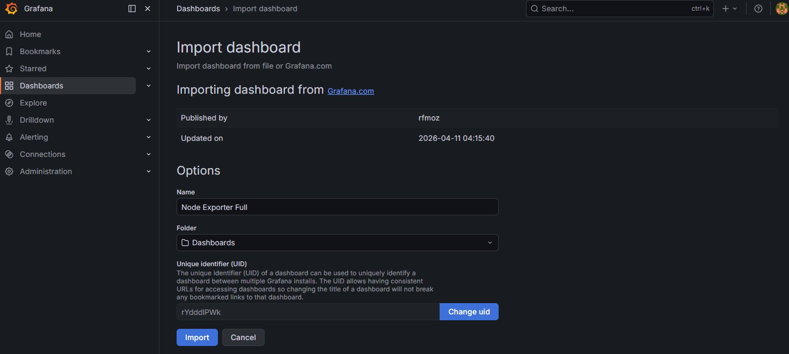
</p>

<p align="center">
  <em>Importing a Node Exporter infrastructure monitoring dashboard into Grafana.</em>
</p>

---

### Visualizing Live Infrastructure Metrics

After dashboard import, Grafana began displaying live infrastructure metrics collected from the Ubuntu Server host.

The stack now provided visibility into:
- CPU utilization
- memory consumption
- disk usage
- network throughput
- filesystem capacity
- server load averages
- real-time host activity

The deployment successfully demonstrated a complete monitoring workflow:
- Node Exporter exposing metrics
- Prometheus scraping and storing time-series data
- Grafana querying and visualizing infrastructure telemetry

<p align="center">
  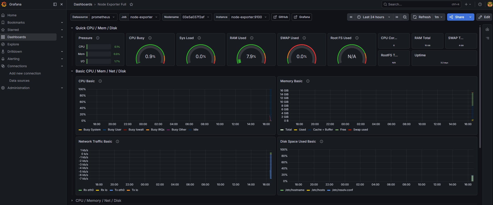
</p>

<p align="center">
  <em>Grafana dashboard displaying live infrastructure metrics collected through Prometheus and Node Exporter.</em>
</p>

---

# Outcome

This project successfully deployed a containerized infrastructure monitoring environment using:
- Prometheus
- Node Exporter
- Grafana
- Docker Compose

The completed stack provided:
- real-time infrastructure monitoring
- centralized metrics collection
- persistent storage for monitoring data
- dashboard-based infrastructure visualization
- internal container networking and service discovery

The deployment demonstrated:
- Prometheus scraping metrics from Node Exporter
- Grafana visualizing live server telemetry
- container orchestration with Docker Compose
- Docker bridge networking and DNS-based service communication
- persistent storage through Docker volumes

The monitoring environment provided visibility into:
- CPU utilization
- memory consumption
- filesystem usage
- network throughput
- system load averages
- real-time host activity

This project also reinforced foundational infrastructure concepts including:
- observability and monitoring workflows
- metrics pipelines
- service-to-service communication
- containerized infrastructure deployment
- persistent storage management
- operational visibility into Linux system performance

---

# Lessons Learned

Throughout this project, I gained hands-on experience deploying and validating a containerized infrastructure monitoring stack.

Key concepts explored during this deployment included:
- Prometheus metrics collection and time-series monitoring
- Node Exporter host-level Linux metrics exposure
- Grafana dashboard-based infrastructure visualization
- Docker Compose multi-container orchestration
- Docker bridge networking and internal service discovery
- container-to-container communication using Docker DNS
- persistent storage for stateful infrastructure services
- layered observability architecture design

I also gained practical operational experience involving:
- validating Docker Compose configurations
- redeploying containerized services safely
- configuring Prometheus scrape targets
- testing infrastructure metrics through Prometheus queries
- configuring Grafana data sources
- importing and validating monitoring dashboards
- verifying persistent Docker volumes
- troubleshooting containerized infrastructure services

One important takeaway from this project was understanding the difference between:
- simply running containers
- and deploying functional operational infrastructure

This deployment demonstrated how observability platforms provide visibility into:
- system health
- resource utilization
- infrastructure performance
- operational telemetry

These capabilities are foundational to modern infrastructure administration, monitoring, and troubleshooting workflows.