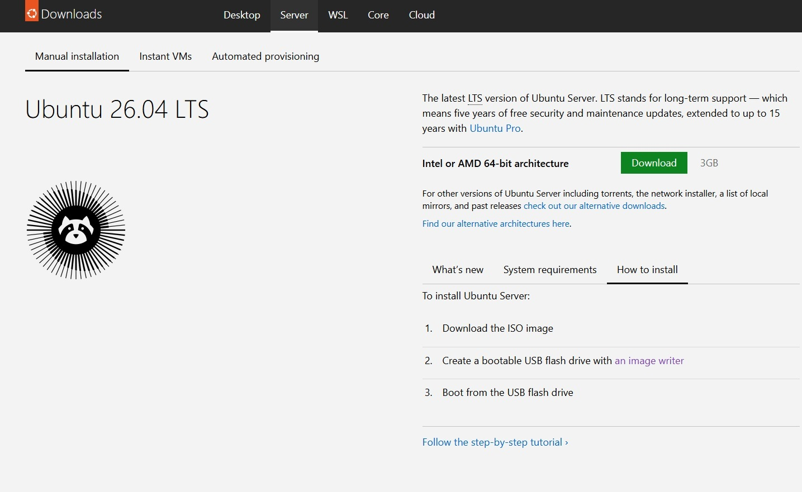
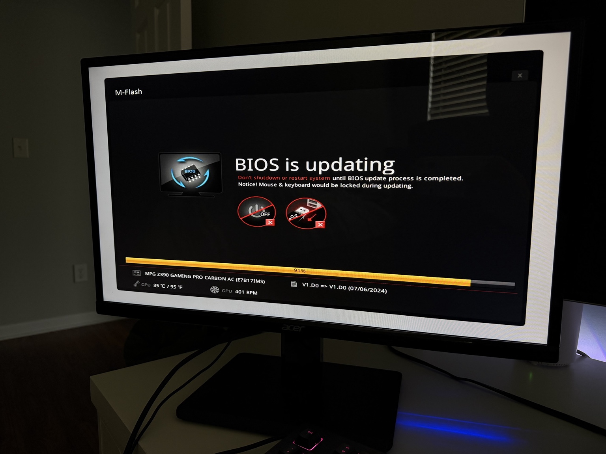
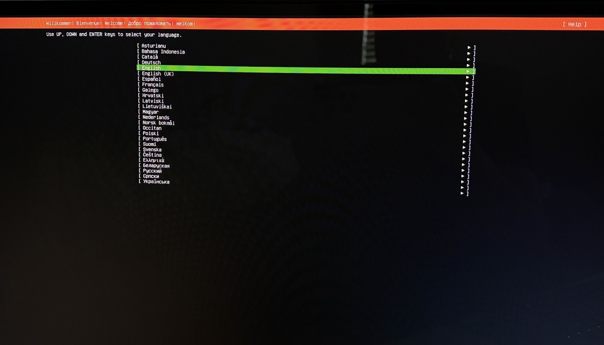
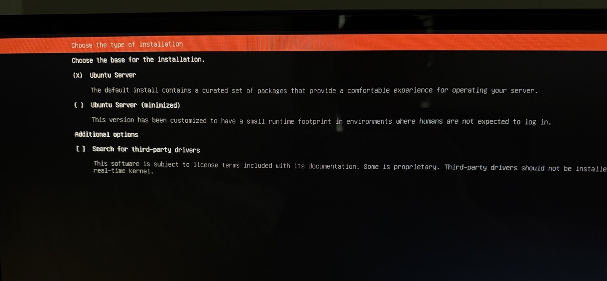
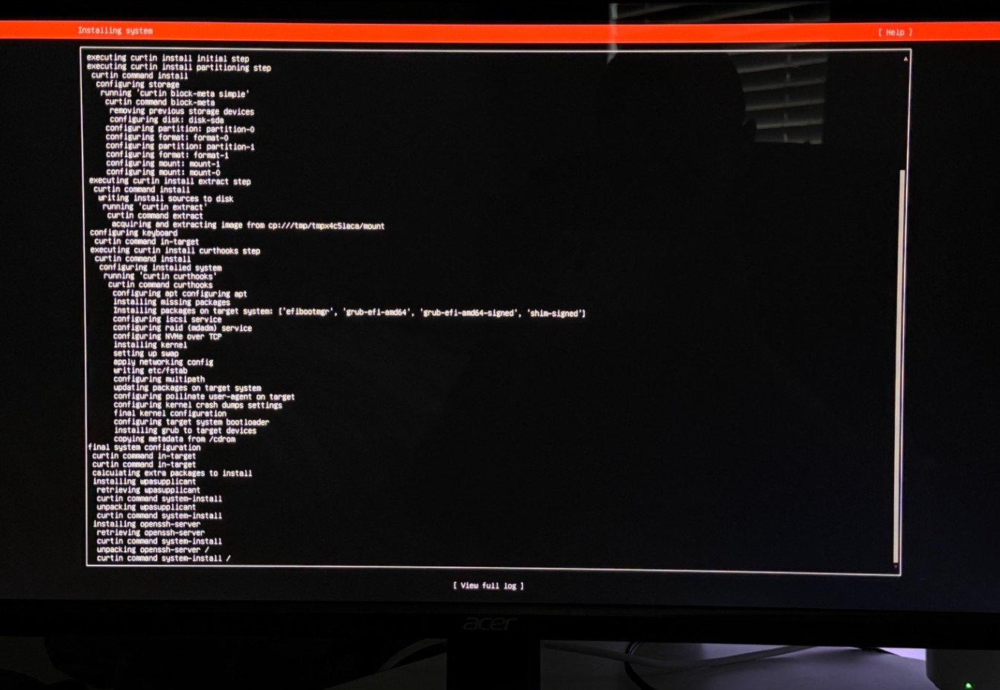
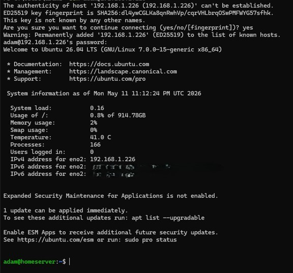

# Ubuntu Server Installation

## Objective

Deploy Ubuntu Server 26.04 LTS onto repurposed hardware to establish the foundation for the homelab infrastructure environment.

---

## Preparing Installation Media

### Downloading Ubuntu Server

- Downloaded Ubuntu Server 26.04 LTS ISO
- Verified correct server image selection

  

  <em>Ubuntu Server 26.04 LTS download page used to obtain the installation ISO.</em>

---

### Creating Bootable USB Media

Rufus was used on a Windows 11 workstation to create a bootable Ubuntu Server installation drive.

Configuration used:
- Partition scheme: GPT
- Target system: UEFI (non-CSM)
- File system: FAT32

  

  <em>Rufus configuration used to create UEFI-compatible Ubuntu Server installation media.</em>

---

## BIOS Preparation

### BIOS Update

Prior to Ubuntu Server deployment, the motherboard BIOS was updated to improve hardware compatibility, system stability, and long-term reliability.

  

  <em>Motherboard BIOS update completed prior to Linux deployment to improve system stability and compatibility.</em>

Detailed hardware preparation steps are documented in the [Hardware Build](./hardware-build.md) section.

---

## Ubuntu Server Installation

### Installer Boot

The system successfully booted into the Ubuntu Server installer environment.

  

  <em>Ubuntu Server installer environment during initial deployment and language selection.</em>

---

### Installation Type

The standard Ubuntu Server installation option was selected.

  

  <em>Ubuntu Server installation type selection during operating system deployment.</em>

---

### System Profile Configuration

The initial hostname, username, and authentication credentials were configured during installation.

  

  <em>Initial server hostname, user profile, and authentication configuration during setup.</em>

---

### Package Installation

Ubuntu Server packages and OpenSSH components were installed.

  

  <em>Ubuntu Server package installation and OpenSSH deployment process.</em>

---

## First Boot and Initialization

### Cloud-Init and SSH Key Generation

After installation completed, the server initialized cloud-init services and generated SSH host keys.

  

  <em>Initial cloud-init services and SSH host key generation during first boot.</em>

---

## Remote Administration

### First SSH Connection

The first successful SSH session was established from the Windows 11 client workstation using Windows Terminal.

  

  <em>First successful SSH connection established from the Windows 11 workstation using Windows Terminal.</em>

---

# Outcome

At completion:
- Ubuntu Server was successfully deployed
- OpenSSH was operational
- Remote administration was functional
- The server was ready for Docker and infrastructure services

---

# Lessons Learned

Key takeaways included:
- boot media preparation
- UEFI/GPT installation workflows
- BIOS firmware management
- Linux server deployment
- remote administration fundamentals
- SSH-based operational workflows
